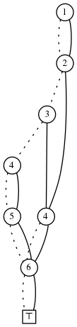

<head>
    
    
</head>

# Table of Contents

1.  [Algorithm](#orgc60049d)
2.  [Review](#org6f8da5e)
    1.  [物理信号模型介绍](#org8cd1e91)
        1.  [什么是模型](#org54a59e9)
        2.  [模型类型概述](#orgb3d4c4d)
        3.  [信号模型](#org71aac3b)
3.  [Tips](#org9ff1ff3)
4.  [Share](#org6e1430a)

# Algorithm

Traveling by Stagecoach: <http://poj.org/problem?id=2686>

<https://dreamume.medium.com/poj-traveling-by-stagecoach-e56c27d45cc8>

# Review

PHYSICAL AUDIO SIGNAL PROCESSING

<https://ccrma.stanford.edu/~jos/pasp/pasp.html>

## 物理信号模型介绍

### 什么是模型

构建模型是基本的人类活动。对我们来说，一个模型可被定义为任何形式的计算基于它的初始状态和任意输入预测一个物理对象的行为或现象。我们第一个成功的模型出现在我们的大脑中。通过预测气候变化的影响，例如，我们能计划过冬的食物供给。当前的人类演化理论假设增加的大脑尺寸是适配更大规模的气候变化，包括百年旱灾。智力模拟之后被数学模拟扩展，启动，例如精准预测天文事件和所有规模的物理现象。一个数学物理理论，比如牛顿力学，给我们一个数学模型预测真实世界中该理论被应用的任意物理实验。最近，我们的大脑被提供计算机模拟，启动之前棘手的模拟问题，扩展我们的预测能力。例如，现在可能预测基于某些精度的天气

1.  基本的科学循环包含以下步骤

    1.  观察
    2.  模型构建
    3.  比较模拟观察和真实世界的观察
    4.  模型提炼
    5.  回到步骤3
    
    一个成功的模型将基于给定的相同输入和初始值精确预测任意实验的输出

2.  音乐和音频的模型

    对虚拟音乐乐器和音频音效，模型替代真实的事物。因此，模型从输出（控制和可能的输入声音）的预测为想要的输出声音。因为一个声音是一个信号的特殊形式，我们可说本书的所有模型是信号模型
    
    在音乐事例中，我们经常想要我们的模型在实时上运行。即我们可提供一个人执行者的模型输入，模型的任务变成基于性能示意呈现高质量声音。实时计算形式在数学信号处理领域普遍存在，在大规模度量中，本书是关于信号处理方法适应到实时计算物理模型
    
    当多维高昂控制需要时物理模型是需要的。有经验的音乐家只使用任何给定的性能的一个窄控制子空间

### 模型类型概述

有许多类信号模型用来做音乐乐器和音频音效。本书强调物理信号模型，即从声学乐器或电子音效的数学物理描述中得来的信号模型。为更一般化内容，一些更成功的非物理信号模型也会提及。之后，我们将只考虑基于物理的模型

### 信号模型

为简化术语，这里用信号模型来表示非物理信号模型

1.  录制（采样）

    可能最简单的信号模型是录制通过控制器索引的想要的声音。即对每个可能的输入条件（比如键盘的按键、按踏板等）。我们录制预想的声学空间里产生的声音（它本身可为一个录制参数）。这样的一个过程被称乐器采样。采样非常费劲，但它是当前普遍的电子乐器练习
    
    基于采样的音响合成器有一个问题，除了各种录制效果需要，维度的表达性能不是常量限制。当从键弦乐器指令比如钢琴、连续控制乐器比如琴弦、风和铜乐器获得的效果减少来高度过采样。这可考虑只对钢琴的非踏板控制参数为键数和键的速度，对管弦和风乐器，演奏者管理多个连续维度的控制。有经验的演奏者不希望丢失这些维度
    
    另一个采样合成器给定的声音源为演奏者和乐器的交互。例如，一个长时间的电子吉他演奏中，在铃弦和它的后续激发有明显的交互。这样的效果在钢琴弹起铃弦后（踏板按下）也能听见
    
    当基于采样的声音合成可能会让演奏音乐家感到失望，它最好的特征是呈现高质量的最终声音给观众。声音质量只被原始的录制质量和序列信号处理限制
    
    物理模型的一个主意的优点，特别相对于基于采样的信号模型，是内部状态自动维持。即基于采样的模型原理上要索引每个声音，不止记录输入状态，也要记录乐器的内部状态。物理模型，相反，广播一些内部状态模拟，这样外部输入和内部状态的真实交互被自然提供

2.  结构化采样

    结构化采样指使用采样和基于模型方法的组合。不同于采样声学压力波浪，在任意类型的声音录制中，我们采样更基本的物理量比如一个脉冲响应，其可用来提供想要的声音质量水平和模型灵活度
    
    例如，在后面的通讯波浪指南合成中，弦乐器的响应器有效地被它的脉冲反应模型化
    
    另一个例子是度量一个弦振动的响应频率使得一个数字过滤器可被适配替代被设计的第一条原理
    
    一个采样更基本的特征优点是信号比如脉冲响应对应控制状态是常量。这使得更小的内存能对应暴力采样声学压力波浪作为控制状态的函数
    
    在采样和物理模型之间是大约连续的。即在计算物理模型和干涉/操作录制采样之间有一个广域的可能混合。更多的计算使得更精确的模型化和更少的内存使用

3.  谱模型

    谱模型被听力机制激活。典型地它们基于短时傅立叶转换(STFT)，但它们也是信号模型，比如线性预测编码(LPC)，其成功源于它们很好地匹配听力谱特征。另外，频率控制(F)合成典型地由FM参数匹配短时音频谱发展而来。其他著名的信号模型以谱点为视角的包括相位声码器、加法合成器和所谓谱模型合成器

4.  虚拟模拟

    模拟合成器，比如模块化Moog和ARP合成器，典型地用于基本波浪形式比如锯齿波、脉冲串等。多个信号模型被开发出来生成这样的数字波形，而不会产出对理想波形进行简单采样相关的混叠。一个IEEE音频、语音和语言处理的特刊在2010年讨论了这个问题。相同的问题也包括在更多基于模型处理的论文，其使用一般化方法把原始模拟电路变成数字化，一些将在之后的章节讨论

# Tips

代码精进之路 - 第二模块部分

代码只是能正确运行，这个门槛特别低，需要注意代码性能。性能架构是一个重要因素，代码细节也是关键

敏捷开发最重要的原则，就是高质量工作

性能的标准要有详细的评价指标，比如，互联网应用中，用户的最大等待时间是2秒以内，最大可容忍等待时间是最佳等待时间的4倍，即8秒，如果达到8秒内的用户跟所有用户占比要达到90%才算是好成绩

合理使用资源，使用好的算法，算法可通过时间复杂度和空间复杂度评价

如何判断过度设计？首先要识别是否是关键需求，非关键需求设计过于复杂则基本是过度，如是关键需求，看是设计解决的是什么问题，及设计的理由是什么，如确实解决关键问题或将来确实需要的问题，综合考虑取舍，合理的就应该设计，不合理地则是过度了

原则是把时间花在关键的地方，做重要的事情，非重要事情可合理简化

代码要简洁直观，要想简单直观，首先思路要是清晰的，有好的设计，80%的时间用在设计、拆解和验证上，20%写代码

把问题拆分成几个小问题，即分治法，是解决问题的必备武器之一。这里讲到了接口设计，也遵循简单直观的原则，接口是提供给别人用的，使用方式要“傻”，独立且容易理解，减少依赖

线程同步也是老生常谈的话题，也是必须要精通的。要有一些好习惯：

1.  比如尽量让变量只读，只要变量是只读的，就不存在需要同步的问题
2.  最好对资源的访问能封装成接口，接口内部去维护锁，这样简化代码也不容易出问题
3.  合理使用语言特性或设计，避免加锁
4.  最后有同步问题该加锁时就得加锁，特别对于app开发，只要不是高频操作，不要过度担心效率问题

对于内存使用，这里的技巧主要还是让类、对象只读，这样可以共享，不需要多份。还要使用合理的数据结构，如果使用了不合理的数据结构，导致又需要存储一些辅助的数据，导致代码复杂且数据操作容易出错

OC代码里也经常用延迟属性，就是访问该属性时才真正创建对象。这样确实会有效节省内存，但也不是适合所有场景。当该属性还会被释放的情况下，释放后再次访问该属性就会自动再创建，比如代码里音频引擎有些属性在引擎停止时需要释放该属性，而在释放时又访问了该属性，导致又重新创建，这样代码就很难理解也容易出问题。这样的场景就不适合作为延迟属性

可持续发展的代码，这里主要可伸缩性（Scalability），这里明显借用了分布式里的概念。扩展主要分两种：垂直扩展和水平扩展

垂直扩展指增加硬件，软件上指优化算法、程序，水平扩展指考虑代码分布式运行

代码中注意尽量不要有状态数据，影响代码水平扩展，状态数据需要注意数据同步问题。而无状态数据是最好的。可尽量把无状态数据分离出来，提高扩展能力。或者提供无状态服务，无状态服务不一定没有服务状态，只是服务状态数据相对比较小，比如Http中的Cookie机制

尽量减少代码，优秀的代码往往简短有效。代码行数越少bug越少，一是使用已有的轮子，二是如需要造轮子，需要不断改进，

我理解经济代码的含义是代码要高效解决问题，实现功能，同时避免常见的错误，要考虑性能、代码可读性、扩展性等常见指标，保证在有效的时间内能产出高质量的代码

# Share

构建ZDDs

<https://crypto.stanford.edu/pbc/notes/zdd/construction.html>

给定一个集合的家族F，我们可找到它的ZDD如下：

1.  如果 $ F = \\emptyset $ (F为空)返回 $ \\bot $。如果 $ F = \\epsilon $(F只包含空集)则返回 $ \\top $
2.  找到F的所有集合中所有元素中的最小元素v，创建一个节点v
3.  设 $ F_ {0} $为F中不包含v的所有集合的家族，则 $ F_ {0} = \\{\\alpha: \\alpha \\in F, v \\notin \\alpha \\} $。从 $ F_ {0} $递归构建ZDD，且从v到 $ F_ {0} $的根连接LO边
4.  设 $ F_ {1} $为F中所有包含v的集合，从每个集合: $ F_ {1} = \\{\\alpha \\ \\{v \\}: \\alpha \\in F, v \\in \\alpha \\} $中删除v。从 $ F_ {1} $中递归构建ZDD，且连接v到 $ F_ {1} $的根的HI边
5.  找到确定的节点（相同的标签，相同的LO目标和相同的HI目标）且组合他们

一些家族有特色的属性允许它们的ZDD为立即构建。在一个大小为n的宇宙中，考虑例子所有集合大小为k的家族我们记为 $ S_ {k}(\\{1, \\ldots, n\\}) $。ZDD $ S_ {2} (\\{1,2,3\\}) = \\{\\{1,2\\}, \\{2,3\\}, \\{ 1,3\\}\\} $如下：

$ S_ {k}(\\{1, \\ldots, n\\}) $的ZDD容易描述

这里有更多的例子。设 $ U = \\{1, \\ldots, 6\\} $且 $ S = \\{2, 3, 5 \\} $。U的所有子集的ZDD只包含S的一个元素，为：

所有至少包含S中一个元素的集合的ZDD为：

最多只包含S的一个元素的集合的ZDD为：

在许多组合问题中，我们使用家族处理。我们在这些家族中执行操作来构建其他的家族来解决问题。例如，给定ZDD F和G，我们构建 $ F \\cup G, F \\cap G $等

