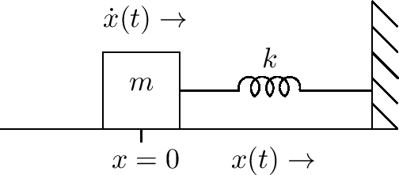

<head>
    
    
</head>

# Table of Contents

1.  [Algorithm](#org0d7ae30)
2.  [Review](#orgdaf4b86)
    1.  [所有我们需要的是牛顿](#org5363091)
    2.  [公式](#org9f7e3ad)
        1.  [常微分方程](#org4b4f9ee)
        2.  [偏微分方程](#orgb8534d1)
        3.  [微分方程（有限微分方案）](#org95864c6)
        4.  [状态空间模型](#org379db30)
        5.  [线性状态空间模型](#org855fc44)
        6.  [转换函数](#orgd5a3692)
        7.  [模型表示](#orgc1441f8)
        8.  [对等电路](#org43e4429)
        9.  [电阻网络](#org80520b6)
        10. [波浪数字过滤](#org4b03f82)
        11. [数字化波浪指导模型元素](#org57fd8af)
3.  [Tips](#org5de23bb)
4.  [Share](#orgcc46675)

# Algorithm

Blocks: <http://poj.org/problem?id=3734>

<https://dreamume.medium.com/poj-blocks-521c132f2761>

# Review

物理模型

<https://ccrma.stanford.edu/~jos/pasp/Physical_Models.html>

我们现在转到本书的主要章节，乐器和音效的物理模型。相对于之前提及的非物理信号模型，我们将考虑一个信号模型到一个声源相关物理状态的直接表示的物理信号模型

我们以一般化地简介物理模型开始，接着是计算子类型的一个概述

## 所有我们需要的是牛顿

因为在乐器或音效上不需要担心相关或量子效应，牛顿力学将适合我们。牛顿的运动3定律可总结为经典的等式

f = ma（力 = 质量乘以加速度）

然而，牛顿运动的基本定律并不意味着我们的工作总是很简单。基于牛顿定律的模型可能非常复杂。我们通常需要许多进一步地简化来保留声音质量和控制表达

## 公式

以下为各种我们将考虑的物理模型表达：

-   常微分方程(ODE)
-   偏微分方程(PDE)
-   微分方程(DE)
-   有限微分方案(FDS)
-   （物理的）状态空间模型
-   转换方法（物理信号之间）
-   模态表达（并行第二序过滤章节）
-   相等电路
-   电阻网络
-   波浪数字过滤
-   数字波浪指导网络

我们将简短引入这些话题，且余下的章节和附录将发展进一步的细节

常微分方程和偏微分方程是纯数学描述（微分方程），但它们可数字化获得可计算物理模型。微分方程为简单的数字化微分方程。即数字化常微分方程和偏微分方程产生微分方程。一个微分方程可被称为有限微分方案。一个离散时间状态空间模型是一个微分方程的特殊形式，其状态变量向量被定义且在系统中广播（作为一个向量第一序有限微分方案）。一个常系数的线性微分等式 - 线性、时间不变(LTI)的例子 - 可被缩减为一系列转换函数，每个对应一对输入输出信号（或一个单个转换函数矩阵可关联输入信号z转换的一个向量到一个输出信号z转换的向量）。一个LTI状态空间模型可对角化产生一个模态表示，引出一个可计算模型包含一个并行行对象的第二序数字化过滤。电阻网络和它们相关的对等电路是电子工程的基础，且模拟电路扩展使用模型线性系统且提供许多有用的函数。这些也用于发展音频可计算物理模型的立即表示。波浪数字过滤(WDF)被引入作为数字模拟电路的表示，其保留原始模拟电路的拓扑（一个非常有用的属性当参数随时间变化，它们经常用在音效中）。数字波浪指导网络可被视为高效可计算形式广播解决方案，PDE允许波浪广播。它们也可用于压缩调和音调第二序共鸣器相关的计算

所有以上技术会在本书中讨论。以下章节提供更详细一些的简介

### 常微分方程

常微分方程典型结果直接源于牛顿运动定律，重新表述如下：

$ f(t) = m \\ddot{x}(t) $

如果力f(t)是一个弹力常量为k的弹簧，则我们可写常微分方程为

$ kx(t) + m \\ddot{x}(t) = 0 $

该例子图表形式为

如果有摩擦，则一个简单的常微分方程为

$ kx(t) + \\mu \\dot{x}(t) + m \\ddot{x}(t) = 0 $

图形如下：

### 偏微分方程

一个偏微分方程扩展常微分方程，添加一个或多个独立变量（通常空间变量）。例如，理想摆动线的波浪等式添加一个空间维度x（线的x轴）且可写为

$ K y^{\\prime \\prime}(x, t) = \\epsilon \\ddot{y}(t) $

y(x,t)记为在线的x位置和时刻t时线的横向偏移，且 $ y^{\\prime}(x, t) \\triangleq \\partial y(x,t) / \\partial x $记为y对应x的偏导。这个例子的物理参数为线张量K和线质量密度 $ \\epsilon $。该PDE是数字波浪指导模型和有限微分方案的开始点

### 微分方程（有限微分方案）

有许多方法转换常微分方程和偏微分方程为微分方程。一个非常简单、保留序的方法是替代每个导数为一个有限微分：

$ \\dot{x}(t) \\triangleq \\frac{d}{dt}x(t) \\triangleq \\lim_ {\\delta \\to 0} \\frac{x(t) - x(t - \\delta)}{\\delta} \\approx \\frac{x(nT) - x[(n-1)T]}{T} $

对有效的小T（采样间隔）。这形式化为微分估计的向后微分操作。我们将在后面章节讨论这样方法的一个变种

作为一个简单的例子，考虑一个重量m在一个无摩擦力表面被施加一个力f(t)，且假设我们希望知道速度v(t)，假设它开始位置的速度为0，时刻为0（例如，x(0) = v(0) = 0)。则，从牛顿的f = ma关系，常微分方程为

$ f(t) = m \\dot{v}(t) $

且微分方程用向后微分替代的结果

$ f(nT) = m \\frac{v(nT) - v[(n - 1)T]}{T}, \\qquad n = 0, 1, 2, \\ldots $

解决v(nT)得到如下有限微分方案：

$ v(nT) = v[(n - 1)T] + \\frac{T}{m} f(nT), \\qquad n = 0, 1, 2, \\ldots $

且 $ v(-T) \\triangleq 0 $。一般来说，力f可依赖系统的当前状态（例如，如果引入一个弹簧或线）。在这样的例子中，之前的等式可能是不可计算的。（一个自由延迟的循环可能出现在信号流图表中）在时刻t的一个有限力不能在时刻t产生一个恒定的速度，这样之前的等式不是物理的，因为v(nT)依赖于f(nT)。为处理这些问题，我们可替代使用前向微分估计来求导：

$ \\dot{x}(t) = \\lim_ {\\delta \\to 0} \\frac{x(t + \\delta) - x(t)}{\\delta} \\approx \\frac{x[(n+1)T] - x(nT)}{T} $

当 $ T \\to 0 $，前向和后向微分操作趋于相同的极限（因为x(t)是预设连续的）。使用我们获得的被称为直接有限微分方案：

$ v[(n + 1)T] = v(nT) + \\frac{T}{m}f(nT), \\qquad n = 0, 1, 2, \\ldots $

且 $ v(0) \\triangleq 0 $

一个有限微分方案被称为直接的当它可被前向计算，如这个例子中。这样，一个直接有限微分方案可被实时实现作为一个关联数字化过滤

也有间接有限微分方案对应非关联数字化过滤。间接方案一般使用迭代和/或矩阵翻转方法解决，且它们通常在线下使用（非实时）

直接方案的一个有趣的类型被称为半间接有限微分方案，其从间接方案通过引入一个迭代数的固定上限，为牛顿方法的迭代解决方案。这样，任意间接方案可被迭代方法快速解决可转换为实时使用的直接方案。一个改进该迭代收敛速度的技术为工作在非常高的采样速度上，对前一个采样初始化每个采样迭代

在本书中，我们将考虑直接线性有限微分方案，例如，关联数字化过滤模型。主要的推力是从普通的数字化过滤和延迟线中获得尽可能多的物理模型能力。我们也将能够添加非记忆非线性当需要的时候（比如实现表查找和短多项式演绎）作为一个直接的信号采样物理意义的结果

### 状态空间模型

任意物理系统的运动等式可方便地形式化为系统的状态：

$ \\underline{\\dot{x}}(t) = f_ {t}[\\underline{x}(t), \\underline{u}(t)] $

这里，$ \\underline{x}(t) $记为在时刻t时系统的状态，$ \\underline{u}(t) $为一个外部输入的向量（通常为力），且一般向量函数 $ f_ {t} $指明当前的状态 $ \\underline{x}(t) $和输入 $ \\underline{u}(t) $如何在时刻t的状态下被它的时间导数 $ \\underline{\\dot{x}}(t) $影响而改变。注意函数 $ f_ {t} $一般自身随时间变化。上式的模型一般为关联物理系统。人类的大脑也是这样的形式

上式的图表形式为

在这个式子中状态向量 $ \\underline{x}(t) $的关键属性是它在系统时刻t时完全确定，这样未来的状态只依赖当前状态且在时刻t时的任意输入。特别地，所有过去的状态和整个输入历史能被当前状态 $ \\underline{x}(t) $总结出来。这样 $ \\underline{x}(t) $必须包含所有的系统内存

1.  形成输出

    任意系统输出是一些状态的函数，且可能是输入（直接的）：
    
    $ \\underline{y}(t) \\triangleq o_ {t}[\\underline{x}(t), \\underline{u}(t)] $
    
    输出取出的一般情况如下图：
    
    
    
    输出信号（向量）多数典型地是状态变量的线性组合和可能的当前的输入：
    
    $ \\underline{y}(t) \\triangleq C \\underline{x}(t) + D \\underline{u}(t) $
    
    C和D是线性组合系数的常量矩阵

2.  力驱动重量的状态空间模型

    
    
    对简单的例子，一个重量为m的物体被外力f沿着x轴推动，我们有上图。我们应该选择状态变量速度 $ v = \\dot{x} $使得牛顿的f = ma得到
    
    $ \\dot{v} = \\frac{1}{m} f $
    
    这是第一序系统（不需要向量）

3.  一般状态空间模型的数值积分

    一个估计的离散时间解决方案为
    
    $ \\underline{x}(t_ {n} + T_ {n}) = \\underline{x}(t_ {n}) + T_ {n}f[\\underline{x}(t_ {n}), \\underline{u}(t_ {n})], \\qquad n = 0, 1, 2, \\ldots $
    
    设
    
    $ g_ {t_ {n}}[\\underline{x}(t_ {n}), \\underline{u}(t_ {n})] \\triangleq \\underline{x}(t_ {n}) + T_ {n}f_ {t_ {n}}[\\underline{x}(t_ {n}), \\underline{u}(t_ {n})] $
    
    则我们可绘制图表时间更新如下图。在这个形式中，$ g_ {t_ {n}} $预测下一个状态 $ \\underline{x}(t_ {n} + T_ {n}) $作为当前状态 $ \\underline{x}(t_ {n}) $ 和当前输入 $ \\underline{u}(t_ {n}) $的函数。在计算机科学领域，计算有这样的形式通常称为有限状态机（或简单状态机），因为它们用当前状态和输入计算下一个状态
    
    
    
    这是解决一个常微分方程数值积分的简单例子，在这个例子中常微分方程由之前的等式给定（一个非常一般化，可能非线性，向量常微分方程）。注意初始化状态 $ \\underline{x}(t_ {0}) $需要在时刻0时开始，或它可能根据系统速度改变（非线性和/或时间变化系统）。非线性常微分方程的解决将在后面章节提及，本书多数情况下，将强调线性时间无变化系统
    
    注意处理状态切换（比如op-amp操作），离散时间状态空间公式比连续时间公式更方便

4.  状态定义

    在之前的讨论中，一个物理系统在时刻t的状态 $ \\underline{x}(t) = [x_ {1}(t), \\ldots, x_ {N}(t)]^{T} $可被定义为状态变量 $ x_ {i}(t) $的一个收集，每个状态变量 $ x_ {i}(t) $是一个物理振幅（压力，速度，位置等）对应一个系统自由度。我们定义一个自由度为能量存储的一个维度。网络结果是它可能从它对应的状态变量振幅中计算任意自由度的存储的能量
    
    例如，一个理想的质量m可只存储移动能量 $ E_ {m} = \\frac{1}{2} m v^{2}, v = \\dot{x} $记为沿x轴物体的速度。因此，速度是一个理想点物体的状态变量的自然选择。
    
    我们获得该结论可独立地通过f = ma在状态空间形式 $ \\dot{v} = (1 / m) f $。注意一个点物体可在3D空间有3个自由度且因此需要在物理模型中状态变量 $ (v_ {x}, v_ {y}, v_ {z}) $。在音乐声学的典型模型中（例如，钢琴），物体只允许一个自由度，对应限制沿着一个1D线移动，像一个理想的弹簧。我们将在后面章节学习理想物体
    
    另一个状态变量的例子为一个理想的弹簧被Hook定律描述：f = kx，k记为弹簧的常量，x记为弹簧的偏移。弹簧在牛顿常微分方程中贡献力比例为偏移。这样的弹簧只存储物理量（力乘以距离），扩展为偏移，可能的能量形式为 $ E_ {k} = \\frac{1}{2}kx^{2} $。更多关于理想弹簧的讨论将在之后的章节谈及，这样，弹簧偏移为弹簧状态变量最自然的选择
    
    在被称为RLC电子电路（包含阻力 $ R_ {i} $，电流 $ L_ {i} $和电容器 $ C_ {i} $），状态变量典型定义为所有的电容器电压和电流。我们将在后面讨论RLC电子电路
    
    在一个RLC电路中没有电阻的状态变量，因为一个电阻消耗能量但不存储它。一个电阻的状态(电流I)被穿过它的电压V确定，根据Ohm定律 V = IR，且电压由电容器、导线和压力源提供
    
    实际上，我们经常工作在采样、带宽限制系统，且在这样的领域，延迟线有有限个状态变量
    
    总结，一个状态变量可被定义为某个能量存储自由度的物理振幅。在机械系统模型中，一个状态变量需要对每个理想弹簧和点物体。对RLC电子电路，对每个电容器和导线需要一个状态变量。如果有任何切换，它们的状态也需要在状态向量中（例如，布尔变量）。在离散时间系统比如数字化过滤，每个单位采样延迟元素贡献一个模型的（连续）状态变量

### 线性状态空间模型

在线性、时间无变化的例子中，一个离散时间状态空间模型像一个向量首序有限微分模型：

$ \\underline{y}(n) = C \\underline{x}(n) + D \\underline{u}(n) $

$ \\underline{x}(n + 1) + A \\underline{x}(n) + B \\underline{u}(n) $

$ \\underline{x}(n) $是在离散时刻n时的长度为N的状态向量，$ \\underline{u}(n) $一般是一个 $ q \\times 1 $输入向量，且 $ \\underline{y}(n) $是 $ p \\times 1 $输出向量。A是 $ N \\times N $状态转换矩阵，且它确定系统的动态（它的极或模态回响频率和damping）

状态空间表示对多输入多输出(MMO)线性系统是很强大的，对时间变化线性系统也是

为转换之前的力驱动物体例子为状态空间形式，我们可首先观察物体的状态为它的速度v(t)和位置 $ x(t) = \\int v(t)dt $，或 $ x[(n+1)T] = x(nT) + Tv(nT) $。这样我们添加直接的微分等式

$ x[(n+1)T] = x(nT) + Tv(nT) = x(nT) + Tv[(n-1)T] + \\frac{T^{2}}{m} f[(n-1)T] $

在权威状态空间形式，变成（设 $ x_ {n} \\triangleq x(nT) $，例如，对符号简化）

$ \\left[\\begin{array}{l}x_ {n+1} \\\\ v_ {n+1} \\end{array}\\right] = \\left[\\begin{array}{ll}1 & T \\\\ 0 & 1\\end{array}\\right] \\left[\\begin{array}{l}x_ {n} \\\\ v_ {n}\\end{array}\\right] + \\left[\\begin{array}{c}0 \\\\ T / m\\end{array}\\right] f_ {n}, \\quad n=0,1,2, \\ldots $

$ x_ {0} = v_ {0} = 0 $为一个典型的初始状态

这个例子的一般特征为系统的整个物理状态被收集为一个单个向量，$ (A, B, C, D) $矩阵的元素包含物理参数（在离散时间例子中是采样间隔）。参数也随着时间变化（时间变化系统）或为状态函数（非线性系统）

构建一个状态空间模型的一般过程是标签所有的状态变量和收集它们为一个向量 $ \\underline{x} $，且状态转换矩阵A，输入B，输出C，和任意直接系数D。一个状态变量 $ \\underline{x}_ {i}(n) $需要每个能量存储元素（质量、弹簧、电容器、导线），且在采样分布系统中每个采样延迟。之后，各种对等（最好数值化）的形式通过相似性转换产生。我们将在本书中制造状态空间模型的备用，因为它们能在matlab中对状态空间模型用线性代数语言和库支持。我们将主要使用它作为时间分析工具

如之前提及的，一个点物体只需要第一序模型：

$ v_ {n+1} = v_ {n} + \\frac{T}{m} f_ {n} $

位置 $ x_ {n} $可总是从初始位置 $ x_ {0} $和速度 $ v_ {n} $通过数值积分计算：

$ x_ {n+1} = x_ {n} + Tv_ {n} $

1.  状态空间模型的脉冲响应

    状态空间模型的脉冲响应可被总结为单输入单输出(SISO)例子如下：
    
    $ \\mathbf{h}(n) = \\left\\{\\begin{array}{ll}D, & n=0 \\\\ C A^{n-1} B, & n>0\\end{array}\\right. $
    
    这样，脉冲响应的第n次采样给定为 $ CA^{n-1}B, n \\ge 0 $。每个这样的采样在多输入多输出(MIMO)例子中产生一个 $ p \\times q $矩阵（q个输入，p个输出）；在这样的例子中，输入信号是 $ \\underline{u}(n) = I_ {p}\\delta(n) $，其是一个p输入向量 $ \\underline{u_ {i}} (n), i = 1, \\ldots, p $的收集，每个有维度 $ p \\times 1 $，对应一个脉冲信号 $ \\delta(n) $被应用到第i个系统输入
    
    在我们的力驱动物体例子中，我们有 $ p = q = 1, B = [0, T / m]^{T} $且D = 0。对一个位置输出我们有 $ C = [1, 0] $，对一个速度输出我们设置 $ C = [0, 1] $。选择C = I简化反馈整个状态向量到输出，其允许我们同时查看
    
    $ \\begin{aligned} \\mathbf{h}(n+1) &=\\left[\\begin{array}{ll}1 & 0 \\\\ 0 & 1\\end{array}\\right] \\left[\\begin{array}{cc}1 & T \\\\ 0 & 1\\end{array}\\right]^{n} \\left[\\begin{array}{c}0 \\\\ T / m\\end{array}\\right] \\\\ &=\\left[\begin{array}{cc}1 & n T \\\\ 0 & 1\\end{array}\\right]\\left[\\begin{array}{c}0 \\\\ T / m\\end{array}\\right] \\\\ &=\\frac{T}{m}\\left[\\begin{array}{c}n T \\\\ 1\\end{array}\\right] \\end{aligned} $
    
    这样，当输入力是一个单位脉冲，对应时刻0时的物理动量（因为力的时间积分为动量且物理区域在一个单位采样是采样间隔T），我们看到在时刻0之后的速度是一个常量 $ v_ {n} = T / m $ 或 $ m v_ {n} = T $。如果速度为常量，则位置必须线性增长，$ x_ {n+1} = n(T^{2} / m) $。x(t)的时间导数的有限微分估计现在给定为 $ (x_ {n+1} - x_ {n}) / T = T / m = v_ {n}, n \\ge 0 $，其是常量

2.  状态空间模型的零输入响应

    一个状态空间模型的响应对初始条件，例如，它的初始状态 $ \\underline{x}(0) $，给定为
    
    $ \\underline{y}_ {x}(n) = CA^{n-1}\\underline{x}(0), \\qquad n = 0,1,2,\\ldots $
    
    且一个线性系统的完全响应被给定为它的力响应的和（比如脉冲响应）和它的初始条件响应
    
    在我们的力驱动物体例子中，外力设置为0，我们有
    
    $ \\left[\\begin{array}{c} x_ {n} \\\\ v_ {n} \\end{array}\\right] = \\left[\\begin{array}{ll} 1 & T \\\\ 0 & 1\\end{array}\\right] \\left[\\begin{array}{c} x_ {n-1} \\\\ v_ {n-1} \\end{array} \\right] = \\left[\\begin{array}{ll} 1 & T \\\\ 0 & 1 \\end{array}\\right]^{n} \\left[\\begin{array}{c} x_ {0} \\\\ v_ {0} \\end{array}\\right] = \\left[\\begin{array}{c} x_ {0} + v_ {0}nT \\\\ v_ {0} \\end{array} \\right] $
    
    这样，任意初始速度 $ v_ {0} $仍然不变，初始位置 $ x_ {0} $仍然不变如果初始速度为0。一个非零的初始速度结果是一个线性增长位置。这个初始条件的响应可被添加到任意力响应。力响应可被输入驱动力 $ f_ {n} $及脉冲响应计算出来

### 转换函数

一个离散时间转换函数是一个线性、时间不变(LTI)系统的脉冲响应的z转换。在物理模型中，我们必须指出输入输出信号即对每个转换函数关联LTI模型。例如，如果系统是简单地物体在表面上滑动，输入信号可为外力，输出可为在外力方向上物体的速度。在包含许多物体和其他元素的系统中，有许多可能不同的输入和输出信号。值得强调只在LTI例子中一个系统可被缩减为一系列转换函数，或当物理系统至少接近线性和只缓慢的随时间变化时（相对于它的脉冲响应区间）

如之前的章节所示，状态空间公式很好地组织了一个线性系统的所有可能的输入和输出信号。特别地，对输入，每个输入信号被乘以一个"B"向量（对应B矩阵的列）且添加到状态向量，即每个输入信号可被任意缩放且添加到任意状态变量。相似地，每个状态变量可被任意缩放且添加到每个输出信号通过C矩阵的行对应输出信号

使用一个矩阵几何系列的闭合形式，我们可容易地计算状态空间模型的转换函数：

$ H(z) = D + C(zI - A)^{-1}B $

注意如果有p个输入和q个输出，H(z)是一个 $ p \\times q $的转换函数矩阵（或矩阵转换函数）

在之前章节的力驱动物体例子中，定义输入信号为力 $ f_ {n} $且输出信号为物体速度 $ v_ {n} $，我们有$ p = q = 1, B = [0, T / m]^{T}, C = [0, 1] $ 且D = 0，这样力到速度的转换函数为

$ \\begin{aligned} H(z) &= D + C(zI - A)^{-1}B \\\\ &= \\left[\\begin{array}{ll} 0 & 1 \\end{array}\\right] \\left[\\begin{array}{ll} z - 1 & -T \\\\ 0 & z - 1 \\end{array} \\right]^{-1} \\left[\\begin{array}{c} 0 \\\\ T / m \\end{array}\\right] \\\\ &= \\frac{1}{(z-1)^{2}} \\left[\\begin{array}{ll} 0 & 1 \\end{array} \\right] \\left[\\begin{array}{ll} z - 1 & T \\\\ 0 & z - 1 \\end{array}\\right] \\left[\\begin{array}{c} 0 \\\\ T / m \\end{array}\\right] \\\\ &= \\frac{T}{m} \\frac{z - 1}{(z-1)^{2}} = \\frac{T}{m} \\frac{z^{-1}}{1 - z^{-1}} \\end{aligned} $

这样，力到速度转换函数是一极过滤，它的极在z = 1

相似地，力到位置转换函数是两极过滤：

$ \\begin{aligned} H(z) &= \\frac{1}{(z-1)^{2}} \\left[\\begin{array}{ll} 1 & 0 \\end{array}\\right] \\left[\\begin{array}{ll} z - 1 & T \\\\ 0 & z - 1 \\end{array}\\right] \\left[\\begin{array}{c} 0 \\\\ T / m \\end{array} \\right] \\\\ &= \\frac{T^{2} / m}{(z - 1)^{2}} = \\frac{T^{2}}{m} \\frac{z^{-2}}{1 - 2z^{-1} + z^{-2}} \\end{aligned} $

现在我们有两个极在z = 1的单位圆上，且这个顾虑的脉冲响应是一个ramp

一旦我们有转换函数系数，我们可实现任意大数量的数字化过滤类型

### 模型表示

在第二本书中介绍的过滤结构之一是并行第二序过滤边，其可从一般的转换函数通过部分分数展开(PFE)计算：

$ H(z) \\triangleq \\frac{B(z)}{A(z)} = \\sum^{N}_ {i=1} \\frac{r_ {i}}{1 - p_ {i}z^{-1}} $

其

$ B(z) = b_ {0} + b_ {1}z^{-1} + b_ {2}z^{-2} + \\cdots + b_ {M}z^{-M} $

$ A(z) = 1 + a_ {1}z^{-1} + a_ {2} z^{-2} + \\cdots + a_ {N}z^{-N}, \\qquad M < N $

该PFE扩展转换函数为一个并行边（复数）首序共鸣器。当多项式系数 $ b_ {i}, a_ {i} $为实数，复数极 $ p_ {i} $和余数 $ r_ {i} $为共轭对，且可被组合为：

$ \\begin{aligned} H_ {i}(z) &= \\frac{r_ {i}}{1 - p_ {i}z^{-1}} + \\frac{\\overline{r_ {i}}}{1 - \\overline{p_ {i}}z^{-1}} = \\frac{r_ {i} - r_ {i}\\overline{p_ {i}}z^{-1} + \\overline{r_ {i}} - \\overline{r_ {i}}p_ {i}z^{-1}}{(1 - p_ {i}z^{-1})(1 - \\overline{p_ {i}}z^{-1})} \\\\ &= \\frac{2re \\{r_ {i}\\} - 2 re \\{r_ {i}\\overline{p_ {i}} \\}z^{-1}}{1 - 2re\\{p_ {i}\\}z^{-1} + \| p_ {i} \|^{2} z^{-2}} = 2G_ {i} \\frac{\\cos{(\\phi_ {i})} - \\cos{(\\phi_ {i} - \\theta_ {i})}z^{-1}}{1 - 2R_ {i} \\cos{(\\theta_ {i})}z^{-1} + R^{2}_ {i}z^{-2}} \\end{aligned} $

$ p_ {i} \\triangleq R_ {i}e^{j\\theta_ {i}}, r_ {i} \\triangleq G_ {i}e^{j \\phi_ {i}} $。这样，每个实系数的转换函数H(z)可作为一个并行边的实首序和/或第二序数字化过滤，当 $ M \\ge N $时，为一个并行FIR分支

在后面章节中，模态综合使用一个源过滤综合模型包含一些驱动信号为一个并行过滤边，每个边实现物理系统中一些共鸣模型的转换函数。正常情况下是第二序的，但它有时方便使用更大的序；例如，第4序使用模型钢琴偏序为了敲击和独立地两阶段衰退效应

例如，如果物理系统是一行音调叉（其设计为只有一个信号回响频率），每个音调叉被表示为一个单个（实）第二序过滤，在模态摆动弦模型中，每个第二序过滤实现一个铃偏过调响应比如一个指击或钢琴键敲击

1.  状态空间到模态综合

    部分分数展开对从一个转换函数创建一个模态综合系统能很好的工作。然而，这个处理可导致低效实现当系统有多个输入和输出时，因为这种情况下，转换函数矩阵的每个元素必须被PFE独立扩展。（对每个元素极是相同的，除非它们被零取消，这样它只余计算每个元素必须被携带）
    
    如果第二序过滤实现直接形式II或转置直接形式I（或更一般化地在任意形式，其极有效地在零之前），则极可对每个输入被共享所有的输出，因为从输入到每个输出的过滤极看到的相同的输入信号，结果为相同的过滤状态。相似地，递归部分可被所有输入共享当过滤在系列中有极在零之后实现；可想象推唯一的两极过滤通过统合使用形成输出信号。总之，当输入数超过输出数，极在零之前会更高效实现且对每个输入的所有输出共享，反之也然。该段落可符号化的被如下矩阵等式表达：
    
    $ \\left[ \\begin{array}{c} y_ {1} \\\\ y_ {2} \\end{array}\\right] = \\frac{1}{A} \\left[ \\begin{array}{ll} B_ {1} & B_ {2} \\\\ B_ {3} & B_ {4} \\end{array}\\right] \\left[\\begin{array}{c} u_ {1} \\\\ u_ {2} \\end{array} \\right] = \\left[ \\begin{array}{ll} B_ {1} & B_ {2} \\\\ B_ {3} & B_ {4} \\end{array} \\right] \\left\\{ \\frac{1}{A} \\left[ \\begin{array}{c} u_ {1} \\\\ u_ {2} \\end{array} \\right] \\right\\} $
    
    当单独处理转换函数时是不明显的，它可能在所有输入和输出间共享极！答案？用一个相似地转换对角化一个状态空间模型。这将在之后的章节讨论。在对角化状态空间模型中，A矩阵是对角化的。B矩阵提供对所有信号驱动模型的路由和缩放。C矩阵对每个输出信号形成适合的模型线性组合。如果原始状态空间模型是一个物理模型，则转换系统给出一个输入的并行过滤边且用物理方式在输出观察

2.  力驱动物体对角化例子

    为对角化我们的力驱动物体例子，我们可开始它的状态空间模型：
    
    $ \\left[\\begin{array}{c} x_ {n+1} \\\\ v_ {n+1} \\end{array} \\right] = \\left[ \\begin{array}{ll} 1 & T \\\\ 0 & 1 \\end{array} \\right] \\left[ \\begin{array}{c} x_ {n} \\\\ v_ {n} \\end{array} \\right] + \\left[ \\begin{array}{c} 0 \\\\ T / m \\end{array} \\right] f_ {n}, \\qquad n = 0, 1, 2, \\ldots $
    
    在一般化状态空间形式中 $ \\underline{x}(n+1) = A \\underline{x}(n) + B \\underline{u}(n) $。我们可看到A是一个序为2的Jordan块。（我们可改变T为1通过缩放 $ x_ {2}(n) $的物理单位）。这样，系统已经对角化。我们有一个重复的极在z = 1，且在系列中有效（而不是并行），这样给出了一个有缺陷的A矩阵

3.  典型的状态空间对角化处理

    为对角化一个系统，我们必须找到A的特征向量，通过
    
    $ A \\underline{e}_ {i} = \\lambda_ {i} \\underline{e}_ {i} $
    
    $ \\underline{e}_ {i}, i = 1, 2 $，当 $ \\lambda_ {i} $是简单的第i个极（A的特征值）。N特征向量 $ \\underline{e}_ {i} $收集为一个相似地转换矩阵：
    
    $ E = [ \\underline{e}_ {1} \\qquad \\underline{e}_ {2} \\qquad \\cdots \\qquad \\underline{e}_ {N} ] $
    
    如果有重复的极，对应缺失的特征向量可被替换为一般化特征向量。E矩阵则用来对角化系统通过一个简单的坐标转换
    
    $ \\underline{x}(n) \\triangleq E \\underline{\\tilde{x}}(n) $
    
    新的对角化系统为
    
    $ \\underline{\\tilde{x}}(n+1) = \\tilde{A} \\underline{\\tilde{x}}(n) + \\tilde{B} \\underline{u}(n) $
    
    $ \\underline{y}(n) = \\tilde{C}\\underline{\\tilde{x}}(n) + \\tilde{D}\\underline{u}(n) $
    
    其中
    
    $ \\tilde{A} = E^{-1}AE $
    
    $ \\tilde{B} = E^{-1}B $
    
    $ \\tilde{C} = CE $
    
    $ \\tilde{D} = D $
    
    转换系统描述的是相同的系统，新的状态变量坐标为 $ \\underline{\\tilde{x}}(n) $。例如，它可被检查转换函数矩阵是不变化的

4.  对角化状态空间模型的高效性

    注意一个一般化N序状态空间模型需要 $ N^{2} $次乘加来更新每次时间步骤（假设输入和输出数相对于状态变量个数小，这样 $ A \\underline{x}(n) $主导计算）。在被一个相似转换对角化后，时间更新只需要序N，和任意其他高效数字化过滤实现一样。这样，一个对角化状态空间模型（模态表示）对应用程序是一个强力竞争者，它想要独立控制共鸣模型
    
    模态扩展的另一个优势是听力依赖频率特征可容忍。低频回响可容易地更小心地模型且对高频回响有更多的细节。例如，高频模型的行可被作为更高效地数字化波浪指导循环，通过返回它们为最近的调和模型系列

### 对等电路

经典电路/网络理论中的电路和端口概念对分区复杂系统为自包含有良好定义的接口。例如，它典型地在模拟电路设计为从低输出抗阻阶段到高输入抗阻阶段（被称为电压转换连接）。这个大抗租比率允许我们指导加载高效这样电路可被独立分析

模拟电路指电子电容器（记为C）为跟物理弹簧，导线(L)跟物理物体相似，且阻力(R)跟dashpots相似。这些被称为lumped elements用来区分分布式参数比如每长度单元电容和电量在电线中。lumped elements被常微分方程描述，而分布式参数系统被偏微分方程描述。这样，RLC相似电路可被对等电路用dashpot-物体-弹簧系统构建。这些对等电路可被有限微分或波浪数字化方法数字化。PDE描述分布式参数系统可被有限微分方法数字化，或，当波浪广播是统治级效果、数字化波浪指导函数

在之后的第7章描述中，对等电路对一个力驱动物体如下图。物体m被表示为一个导线L = m。驱动力f(t)通过电压源提供，且物体速度v(t)是循环电流

如果两个物理元素连接，它们共享一个速度，则它们形成一个系列连接。系列自然连接变得更清晰当考虑对等电路时

例如，上图显示一个物体连接到一个弹簧的一端，弹簧的另一段和墙连接。驱动力 $ f_ {ext}(t) $应用到物体m上使得一个正向力导致正向物体偏移 $ x_ {m}(t) $且正向弹簧偏移（压缩） $ x_ {k}(t) $。因为物体和弹簧偏移在物理上是相同的，我们可定义 $ x_ {m} = x_ {k} \\triangleq x $。它们的速度相似使得 $ v_ {m} = v_ {k} \\triangleq v $。对等电路有它们的电子模拟连接，如下图。共同的物体和弹簧速度v(t)出现为一个单流穿过导线（物体）和电容器（弹簧）

通过电流分析的Kirchoff循环定律，所有电压的和在循环中为0.这样，如下方向对电流v，我们有 $ f_ {ext} - f_ {m} - f_ {k} = 0 $，（当一个负信号表示当电流进入'+'元素信号这意味着力为正当指向右边时），或

$ f_ {ext}(t) = f_ {m}(t) + f_ {k}(t) $

这样，对等电路和我们的方向物理分析一致，应用力 $ f_ {ext}(t) $相等于在所有时间物体的惯性力 $ f_ {m}(t) = m \\ddot{x}(t) $且弹簧力 $ f_ {k}(t) = kx(t) $，例如：

$ f_ {ext}(t) = m \\ddot{x}(t) + kx(t) $

### 电阻网络

电阻的概念是经典的电力工程的核心。最简单的例子是欧姆定律：

$ V(t) = R I(t) $

V(t)记为在时刻t穿过电阻的电压，且I(t)为穿过电阻的电流。对对应机械元素，对dashpot，欧姆定律变成

$ f(t) = \\mu v(t) $

f(t)是在时刻t时的力，v(t)是它的压缩速度。dashpot值 $ \\mu $是机械阻力

感谢laplace变换（或傅立叶变换），电阻的概念容易扩展为物体和弹簧。我们只需要允许电阻为频率独立的。例如，laplace变换在牛顿的f = ma中，使用laplace变换的微分定理：

$ F(s) = mA(s) = msV(s) = ms^{2}X(s) $

F(s)记为f(t)的laplace变换（$ F(s) = \\mathcal{L}_ {s}\\{f\\} $），且相似地对偏移、速度和加速laplace转换（它假设所有初始条件为0，；例如，f(0) = x(0) = v(0) = a(0) = 0）。物体阻力因此

$ R_ {m}(s) \\triangleq \\frac{F(s)}{V(s)} = ms $

特别地laplace变换为傅立叶变换，设置 $ s = j \\omega $，给出

$ R_ {m}(j \\omega) = jm \\omega $

相似地，弹簧阻力有弹簧系数k被给定为

$ R_ {k}(s) = \\frac{k}{s} $

$ R_ {k}(j\\omega) = \\frac{k}{j \\omega} $

阻力的频域公式的重要好处是它允许物体的每个内部连接，弹簧和dashpots（每个RLC对等电路）被处理为一个简单的阻力网络，用频率参数化

视电路为（依赖频率）阻力网络，容易写出，力在弹簧中的Laplace变换使用电压分割公式：

$ F_ {k}(s) = F_ {ext}(s) \\frac{R_ {k}(s)}{R_ {m}(s) + R_ {k}(s)} = F_ {ext}(s) \\frac{k / m}{s^{2} + k / m} $

这类对等网络和阻力网络机械系统模型，和它们的数字化数字过滤形式，在后面的章节中会继续讨论

### 波浪数字过滤

波浪数字过滤的思想是数字化RLC电路（且确定更一般化的系统）如下：

1.  确定描述系统的常微分方程（PDE也可以）
2.  表达所有物理量（比如力和速度）用旅行波浪组成。旅行波浪部分被称为波浪变量。例如，力f(n)在一个物体上被分解为 $ f(n) = f^{+}(n) + f^{-}(n), f^{+}(n) $视为朝着物体方向传播的旅行波浪，而 $ f^{-}(n) $为远离物体的旅行波浪。一个旅行波浪视力的斡旋（在光速上）跟其他任意不同的模型相比事实上非常接近物理实际
3.  使用bilinear转换数字化旅行波浪系统结果。bilinear转换相当于时域到数值积分的梯形规则
4.  连接N个元素单元通过N-端口交点。有两种基本的交点，一个为平行的，一个为系列连接。交点理论在数字化波浪指导中引入

一个更详细的WDF介绍在附录F中。特别地，力驱动物体的波浪数字化模型如下图：

我们将不在本书中过多使用WDF，而是更多使用有限积分模型进行简化。然而，我们将利用数字化波浪模型上的相关概念在之后的章节

### 数字化波浪指导模型元素

数字化波浪指导模型构建数字化延迟线和过滤（和非线性元素），且它们可理解为广播和过滤采样旅行波浪解决方案为波浪等式(PDE)，比如空气、弦、棒等。值得注意的是弦、木管乐器和铜管乐器组成一个典型的管弦乐队四个主要部分的三个（所有除了打击乐器）。数字化波浪指导模型处理已被扩展到2D、3D广播。它们不是有限积分模型，但矛盾地是它们在某些条件下相等（附录E）

理想波浪等式直接来自于牛顿运动定律（f = ma）。例如，在摆线例子中，波浪等式源于第一个原理

$ Ky^{\\prime \\prime} = \\epsilon \\ddot{y} $

其中

$ K \\triangleq \\text{ 弦张量} $

$ \\epsilon \\triangleq \\text{ 线性质量密度} $

定义 $ c = \\sqrt{K / \\epsilon} $，我们获得PDE的通常形式作为理想1D波浪等式

$ y^{\\prime \\prime} = \\frac{1}{c^{2}} \\ddot{y} $

y(t, x)是弦在时刻t的偏移和位置x。（我们忽略时间位置参数(t, x)当它们在等式中对所有信号相同时）。例如，y可为一个理想弦横向的偏移或纵向的偏移（或压力、速度等）在一个空气柱中。独立变量为时间t和弦或空气柱轴上的距离x。偏导记号更完整地写为

$ \\ddot{y} \\triangleq \\frac{\\partial^{2}}{\\partial t^{2}} y(t, x) $

$ y^{\\prime \\prime} \\triangleq \\frac{\\partial^{2}}{\\partial x^{2}} y(t, x) $

1D波浪等式服从任意旅行波浪在速度c中：

$ y(t, x) = y_ {r}(t - x / c) + y_ {\\ell}(t + x / c) $

为说明这个，插入 $ y_ {r}(t - x / c) $或 $ y_ {\\ell}(t + x / c) $（或它们的任意线性组合）到波浪等式中。则, $ c = \\sqrt{K / \\epsilon} $是旅行波浪广播速度在弦张量K和物体密度 $ \\epsilon $上的表达

在数字化波浪指导模型中，旅行波浪采样为

$ \\begin{aligned} y(nT, mX) &= y_ {r}(nT - mX /c) + y_ {\\ell}(nT + mX / c) \\qquad (\\text{集合 } X = cT) \\\\ &= y_ {r}(nT - mT) + y_ {\\ell}(nT + mT) \\\\ &\\triangleq y^{+}(n - m) + y^{-}(n + m) \\end{aligned} $

# Tips

代码精进之路 - 第二模块部分

代码的安全性这一块也是很重要的，平时工作中可能不太会注意这一点，但至少不能有明显的安全漏洞，写代码也需要有一些安全意识

安全这块自己本身也偏弱，参考这部分作者给的案例，会多一些感触，这块理解不深，不好总结，总之写代码带安全意识，同时尽量不犯低级安全错误，基本好做到比较好

# Share

A toy problem

<https://crypto.stanford.edu/pbc/notes/zdd/toy.html>

假设我们又一些苹果，香蕉和草莓，且我们计划在周末吃什么。让我们开始不加限制，这样我们可选择两天什么都不吃，或两天吃完所有水果。有多少种不同的吃法？

我们把它转换成ZDD问题。设 $ a_ {1}, b_ {1}, c_ {1} $代表在周六吃苹果、香蕉和草莓，$ a_ {2}, b_ {2}, c_ {2} $对应代表周日。让我们排序这些符号 $ a_ {1}, b_ {1}, c_ {1}, a_ {2}, b_ {2}, c_ {2} $且用序号1到6标号。我们可然后使用这个宇宙的集合来代表我们的饮食。例如 $ \\{ a_ {1}, c_ {1}, b_ {2} \\} = \\{1, 3, 5\\} $表示我们子周六吃苹果和草莓，周日吃香蕉

如没有限制，每个集合都是一个有效的饮食。ZDD表示：

我们的计数算法（在每个节点，当 $ \\top $ 有计数1，我们统计它孩子的个数）给出 $ 2^{6} = 64 $个不同的饮食。我们有7个节点；如果我们使用比特位表示每个可能的饮食我们需要64个7比特字符串

假设我们限制我们在周六只吃两种水果。则我们有ZDD:

统计算法给出24种不同的饮食

让我们改变限制为周日只吃一种水果

统计算法给出24种不同的饮食

如果我们给出权重x, y, z为对应苹果、香蕉和草莓，我们可通过图形从下往上计算所有解决方案的平均权重。在节点6，我们有一个权重为z的解决方案。往上广播到节点5，我们也获得一个权重为y的解决方案，这样我们往上传递平均权重为 $ (y + x) / 2 $的两个解决方案到节点4。这里，我们获得一个权重为x的解决方案，这样我们有3个解决方案平均权重为

$ (2 \\cdot (y + z) / 2 + 1 \\cdot x) / 3 = (x + y + z) / 3 $

当我们往上到节点3，一个路径获得一个额外的z，这样在节点3我们有6个解决方案其平均权重为

$ (3 \\cdot (x + y + z) / 3 + 3 \\cdot ((x + y + z) / 3 ) + z) / 6 = (2x + 2y + 5z) / 6 $

继续这样统计，在节点2我们获得12个解决方案平均权重为 $ (2x + 5y + 5z) / 6 $，且最后，在节点1我们找到所有的24个解决方案的平均权重为 $ (2x + 2y + 2z) / 3 $

以下ZDD代表不同饮食的数量如果我们在周六只吃两种水果且周日只吃一种水果：

统计算法给出9种不同的饮食

给定一个解决方案比如 $ \\{1, 3, 5 \\} $我们可找到下一种（字典序）解决方案通过转换ZDD我们找到在二叉树叶子节点的后续。我们跟随我们集合的路径，然后往上旅行一条边。一旦我们沿着点线边，我们翻转方向，往下走实线边，然后如果没有到 $ \\bot $节点则总是走点线边，否则走实线边。代表这条路径的集合就是下一个解决方案。在我们的例子中我们从 $ \\top $到节点5到节点4，然后沿实线往下到 $ \\top $得到答案 $ \\{1,3,4\\} $。如果我们重复，我们现在从 $ \\top $到节点4到节点3到节点2，然后往下到节点4、5、6然后到 $ \\top $，这条路径代表集合 $ \\{1, 2, 6\\} $

让我们做另一个例子。这次唯一的限制是我们必须一天吃苹果，另一天不吃苹果。则ZDD:

在我们的例子中，家族的交很容易计算。一般地，我们想要一个算法计算两个ZDD的交，及并、集差和对称差等

