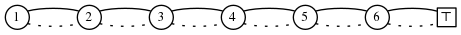

<head>
    
    
</head>

# Table of Contents

1.  [Algorithm](#org0d7ae30)
2.  [Review](#orgdaf4b86)
    1.  [所有我们需要的是牛顿](#org5363091)
    2.  [公式](#org9f7e3ad)
        1.  [常微分方程](#org4b4f9ee)
        2.  [偏微分方程](#orgb8534d1)
        3.  [微分方程（有限微分方案）](#org95864c6)
        4.  [状态空间模型](#org379db30)
3.  [Tips](#org5de23bb)
4.  [Share](#orgcc46675)

# Algorithm

Blocks: <http://poj.org/problem?id=3734>

<https://dreamume.medium.com/poj-blocks-521c132f2761>

# Review

物理模型

<https://ccrma.stanford.edu/~jos/pasp/Physical_Models.html>

我们现在转到本书的主要章节，乐器和音效的物理模型。相对于之前提及的非物理信号模型，我们将考虑一个信号模型到一个声源相关物理状态的直接表示的物理信号模型

我们以一般化地简介物理模型开始，接着是计算子类型的一个概述

## 所有我们需要的是牛顿

因为在乐器或音效上不需要担心相关或量子效应，牛顿力学将适合我们。牛顿的运动3定律可总结为经典的等式

f = ma（力 = 质量乘以加速度）

然而，牛顿运动的基本定律并不意味着我们的工作总是很简单。基于牛顿定律的模型可能非常复杂。我们通常需要许多进一步地简化来保留声音质量和控制表达

## 公式

以下为各种我们将考虑的物理模型表达：

-   常微分方程(ODE)
-   偏微分方程(PDE)
-   微分方程(DE)
-   有限微分方案(FDS)
-   （物理的）状态空间模型
-   转换方法（物理信号之间）
-   模态表达（并行第二序过滤章节）
-   相等电路
-   电阻网络
-   波浪数字过滤
-   数字波浪指导网络

我们将简短引入这些话题，且余下的章节和附录将发展进一步的细节

常微分方程和偏微分方程是纯数学描述（微分方程），但它们可数字化获得可计算物理模型。微分方程为简单的数字化微分方程。即数字化常微分方程和偏微分方程产生微分方程。一个微分方程可被称为有限微分方案。一个离散时间状态空间模型是一个微分方程的特殊形式，其状态变量向量被定义且在系统中广播（作为一个向量第一序有限微分方案）。一个常系数的线性微分等式 - 线性、时间不变(LTI)的例子 - 可被缩减为一系列转换函数，每个对应一对输入输出信号（或一个单个转换函数矩阵可关联输入信号z转换的一个向量到一个输出信号z转换的向量）。一个LTI状态空间模型可对角化产生一个模态表示，引出一个可计算模型包含一个并行行对象的第二序数字化过滤。电阻网络和它们相关的对等电路是电子工程的基础，且模拟电路扩展使用模型线性系统且提供许多有用的函数。这些也用于发展音频可计算物理模型的立即表示。波浪数字过滤(WDF)被引入作为数字模拟电路的表示，其保留原始模拟电路的拓扑（一个非常有用的属性当参数随时间变化，它们经常用在音效中）。数字波浪指导网络可被视为高效可计算形式广播解决方案，PDE允许波浪广播。它们也可用于压缩调和音调第二序共鸣器相关的计算

所有以上技术会在本书中讨论。以下章节提供更详细一些的简介

### 常微分方程

常微分方程典型结果直接源于牛顿运动定律，重新表述如下：

$ f(t) = m \\ddot{x}(t) $

如果力f(t)是一个弹力常量为k的弹簧，则我们可写常微分方程为

$ kx(t) + m \\ddot{x}(t) = 0 $

该例子图表形式为

如果有摩擦，则一个简单的常微分方程为

$ kx(t) + \\mu \\dot{x}(t) + m \\ddot{x}(t) = 0 $

图形如下：

### 偏微分方程

一个偏微分方程扩展常微分方程，添加一个或多个独立变量（通常空间变量）。例如，理想摆动线的波浪等式添加一个空间维度x（线的x轴）且可写为

$ K y^{\\prime \\prime}(x, t) = \\epsilon \\ddot{y}(t) $

y(x,t)记为在线的x位置和时刻t时线的横向偏移，且 $ y^{\\prime}(x, t) \\triangleq \\partial y(x,t) / \\partial x $记为y对应x的偏导。这个例子的物理参数为线张量K和线质量密度 $ \\epsilon $。该PDE是数字波浪指导模型和有限微分方案的开始点

### 微分方程（有限微分方案）

有许多方法转换常微分方程和偏微分方程为微分方程。一个非常简单、保留序的方法是替代每个导数为一个有限微分：

$ \\dot{x}(t) \\triangleq \\frac{d}{dt}x(t) \\triangleq \\lim_ {\\delta \\to 0} \\frac{x(t) - x(t - \\delta)}{\\delta} \\approx \\frac{x(nT) - x[(n-1)T]}{T} $

对有效的小T（采样间隔）。这形式化为微分估计的向后微分操作。我们将在后面章节讨论这样方法的一个变种

作为一个简单的例子，考虑一个重量m在一个无摩擦力表面被施加一个力f(t)，且假设我们希望知道速度v(t)，假设它开始位置的速度为0，时刻为0（例如，x(0) = v(0) = 0)。则，从牛顿的f = ma关系，常微分方程为

$ f(t) = m \\dot{v}(t) $

且微分方程用向后微分替代的结果

$ f(nT) = m \\frac{v(nT) - v[(n - 1)T]}{T}, \\qquad n = 0, 1, 2, \\ldots $

解决v(nT)得到如下有限微分方案：

$ v(nT) = v[(n - 1)T] + \\frac{T}{m} f(nT), \\qquad n = 0, 1, 2, \\ldots $

且 $ v(-T) \\triangleq 0 $。一般来说，力f可依赖系统的当前状态（例如，如果引入一个弹簧或线）。在这样的例子中，之前的等式可能是不可计算的。（一个自由延迟的循环可能出现在信号流图表中）在时刻t的一个有限力不能在时刻t产生一个恒定的速度，这样之前的等式不是物理的，因为v(nT)依赖于f(nT)。为处理这些问题，我们可替代使用前向微分估计来求导：

$ \\dot{x}(t) = \\lim_ {\\delta \\to 0} \\frac{x(t + \\delta) - x(t)}{\\delta} \\approx \\frac{x[(n+1)T] - x(nT)}{T} $

当 $ T \\to 0 $，前向和后向微分操作趋于相同的极限（因为x(t)是预设连续的）。使用我们获得的被称为直接有限微分方案：

$ v[(n + 1)T] = v(nT) + \\frac{T}{m}f(nT), \\qquad n = 0, 1, 2, \\ldots $

且 $ v(0) \\triangleq 0 $

一个有限微分方案被称为直接的当它可被前向计算，如这个例子中。这样，一个直接有限微分方案可被实时实现作为一个关联数字化过滤

也有间接有限微分方案对应非关联数字化过滤。间接方案一般使用迭代和/或矩阵翻转方法解决，且它们通常在线下使用（非实时）

直接方案的一个有趣的类型被称为半间接有限微分方案，其从间接方案通过引入一个迭代数的固定上限，为牛顿方法的迭代解决方案。这样，任意间接方案可被迭代方法快速解决可转换为实时使用的直接方案。一个改进该迭代收敛速度的技术为工作在非常高的采样速度上，对前一个采样初始化每个采样迭代

在本书中，我们将考虑直接线性有限微分方案，例如，关联数字化过滤模型。主要的推力是从普通的数字化过滤和延迟线中获得尽可能多的物理模型能力。我们也将能够添加非记忆非线性当需要的时候（比如实现表查找和短多项式演绎）作为一个直接的信号采样物理意义的结果

### 状态空间模型

任意物理系统的运动等式可方便地形式化为系统的状态：

$ \\underline{\\dot{x}}(t) = f_ {t}[\\underline{x}(t), \\underline{u}(t)] $

这里，$ \\underline{x}(t) $记为在时刻t时系统的状态，$ \\underline{u}(t) $为一个外部输入的向量（通常为力），且一般向量函数 $ f_ {t} $指明当前的状态 $ \\underline{x}(t) $和输入 $ \\underline{u}(t) $如何在时刻t的状态下被它的时间导数 $ \\underline{\\dot{x}}(t) $影响而改变。注意函数 $ f_ {t} $一般自身随时间变化。上式的模型一般为关联物理系统。人类的大脑也是这样的形式

上式的图表形式为

在这个式子中状态向量 $ \\underline_ {x}(t) $的关键属性是它在系统时刻t时完全确定，这样未来的状态只依赖当前状态且在时刻t时的任意输入。特别地，所有过去的状态和整个输入历史能被当前状态 $ \\underline_ {x}(t) $总结出来。这样 $ \\underline_ {x}(t) $必须包含所有的系统内存

1.  形成输出

# Tips

代码精进之路 - 第二模块部分

代码的安全性这一块也是很重要的，平时工作中可能不太会注意这一点，但至少不能有明显的安全漏洞，写代码也需要有一些安全意识

安全这块自己本身也偏弱，参考这部分作者给的案例，会多一些感触，这块理解不深，不好总结，总之写代码带安全意识，同时尽量不犯低级安全错误，基本好做到比较好

# Share

A toy problem

<https://crypto.stanford.edu/pbc/notes/zdd/toy.html>

假设我们又一些苹果，香蕉和草莓，且我们计划在周末吃什么。让我们开始不加限制，这样我们可选择两天什么都不吃，或两天吃完所有水果。有多少种不同的吃法？

我们把它转换成ZDD问题。设 $ a_ {1}, b_ {1}, c_ {1} $代表在周六吃苹果、香蕉和草莓，$ a_ {2}, b_ {2}, c_ {2} $对应代表周日。让我们排序这些符号 $ a_ {1}, b_ {1}, c_ {1}, a_ {2}, b_ {2}, c_ {2} $且用序号1到6标号。我们可然后使用这个宇宙的集合来代表我们的饮食。例如 $ \\{ a_ {1}, c_ {1}, b_ {2} \\} = \\{1, 3, 5\\} $表示我们子周六吃苹果和草莓，周日吃香蕉

如没有限制，每个集合都是一个有效的饮食。ZDD表示：

我们的计数算法（在每个节点，当 $ \\top $ 有计数1，我们统计它孩子的个数）给出 $ 2^{6} = 64 $个不同的饮食。我们有7个节点；如果我们使用比特位表示每个可能的饮食我们需要64个7比特字符串

假设我们限制我们在周六只吃两种水果。则我们有ZDD:

统计算法给出24种不同的饮食

让我们改变限制为周日只吃一种水果

统计算法给出24种不同的饮食

如果我们给出权重x, y, z为对应苹果、香蕉和草莓，我们可通过图形从下往上计算所有解决方案的平均权重。在节点6，我们有一个权重为z的解决方案。往上广播到节点5，我们也获得一个权重为y的解决方案，这样我们往上传递平均权重为 $ (y + x) / 2 $的两个解决方案到节点4。这里，我们获得一个权重为x的解决方案，这样我们有3个解决方案平均权重为

$ (2 \\cdot (y + z) / 2 + 1 \\cdot x) / 3 = (x + y + z) / 3 $

当我们往上到节点3，一个路径获得一个额外的z，这样在节点3我们有6个解决方案其平均权重为

$ (3 \\cdot (x + y + z) / 3 + 3 \\cdot ((x + y + z) / 3 ) + z) / 6 = (2x + 2y + 5z) / 6 $

继续这样统计，在节点2我们获得12个解决方案平均权重为 $ (2x + 5y + 5z) / 6 $，且最后，在节点1我们找到所有的24个解决方案的平均权重为 $ (2x + 2y + 2z) / 3 $

以下ZDD代表不同饮食的数量如果我们在周六只吃两种水果且周日只吃一种水果：

统计算法给出9种不同的饮食

给定一个解决方案比如 $ \\{1, 3, 5 \\} $我们可找到下一种（字典序）解决方案通过转换ZDD我们找到在二叉树叶子节点的后续。我们跟随我们集合的路径，然后往上旅行一条边。一旦我们沿着点线边，我们翻转方向，往下走实线边，然后如果没有到 $ \\bot $节点则总是走点线边，否则走实线边。代表这条路径的集合就是下一个解决方案。在我们的例子中我们从 $ \\top $到节点5到节点4，然后沿实线往下到 $ \\top $得到答案 $ \\{1,3,4\\} $。如果我们重复，我们现在从 $ \\top $到节点4到节点3到节点2，然后往下到节点4、5、6然后到 $ \\top $，这条路径代表集合 $ \\{1, 2, 6\\} $

让我们做另一个例子。这次唯一的限制是我们必须一天吃苹果，另一天不吃苹果。则ZDD:

在我们的例子中，家族的交很容易计算。一般地，我们想要一个算法计算两个ZDD的交，及并、集差和对称差等

