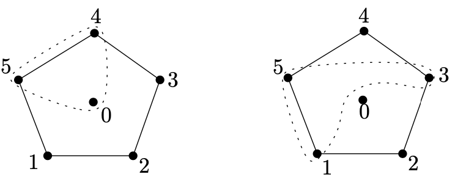
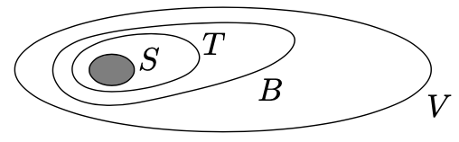
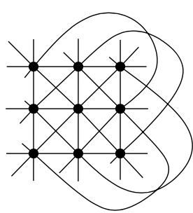
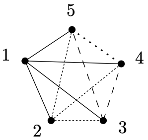
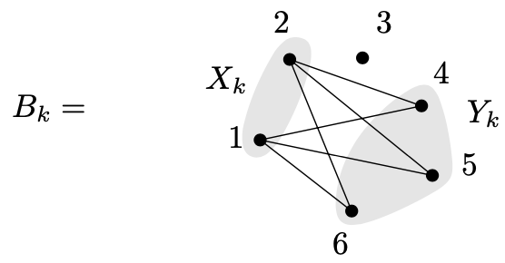
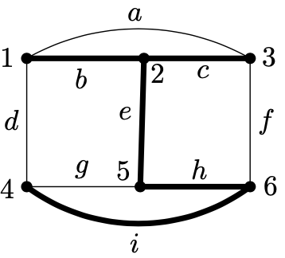
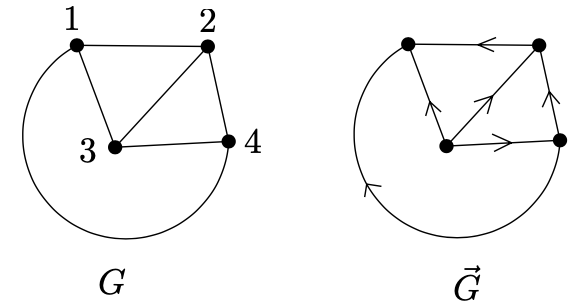
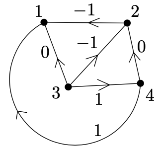
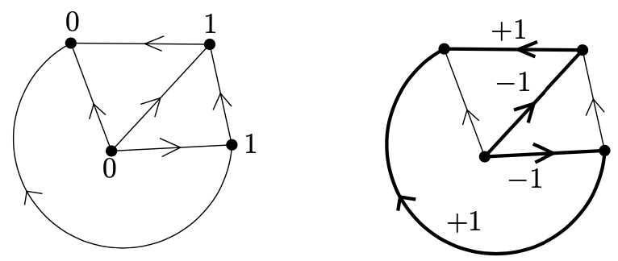

<head>
    
    
</head>

# Table of Contents

1.  [Block designs](#orge454f95)
    1.  [定理（集成条件）](#org6940849)
    2.  [例子（Steiner triple系统）](#orgab112db)
    3.  [定理（Wilson定理）](#orgb40ff78)
2.  [Fisher不等式](#org213207c)
    1.  [定理（Fisher不等式）](#org1cc5c46)
3.  [覆盖完全二分图](#org8a1682e)
    1.  [定理（Graham-Pollak定理）](#org5c7eb2d)
4.  [图的循环空间](#org1c1e864)
    1.  [定义（边的偶数集）](#orgd93f163)
    2.  [引理](#org9cca52d)
    3.  [定理（循环空间定理）](#org41d11cc)
5.  [循环和剪切：循环空间再探讨](#orga3e02a7)
    1.  [定理](#org4631dde)
    2.  [定理](#orgcc8d6f2)
6.  [概率检查](#org99b0a37)
    1.  [定理（Freivalds的矩阵乘积检查）](#org2bb17d3)
    2.  [定理](#orge1464cc)

# Block designs

这里我们考虑非常常规的有限集合系统，称为块设计。有限映射平面是这个概念的一个特殊情况但块设计的一般记号不再有几何动机

设V为一个有限集合且设 $ \\mathcal{B} $为集合V的一个子集系统。为了强调集合系统 $ \\mathcal{B} $在集合V上，我们写成一个有序对 $ (V, \\mathcal{B}) $。如果所有的集合 $ B \\in \\mathcal{B} $有相同的cardinality k，我们说 $ (V, \\mathcal{B}) $是k统一的

**定义** 设v, k, t和 $ \\lambda $为整数。我们假设 $ v > k > t \\ge 1 $且$ \\lambda \\ge 1 $。一个类型 $ t - (v, k, \\lambda) $的块设计是一个集合系统 $ (V, \\mathcal{B}) $满足如下条件：

(1) V有v个元素

(2) 每个集合 $ B \\in \\mathcal{B} $有k个元素。$ \\mathcal{B} $的集合被称为块

(3) 集合V的每t元素子集包含在 $ \\mathcal{B} $的 $ \\lambda $个块中

这里有一些基本的例子阐释这些定义

**例子** 设V为一个有限集合且k为一个整数。我们把 $ \\mathcal{B} = {V \\choose k} $( $ \\mathcal{B} $包含V的所有k元素子集）。$ (V, \\mathcal{B} ) $被称为平凡的块设计

容易检查 $ (V, \\mathcal{B}) $是一个 $ t- (v, k, \\lambda) $块设计，$ t \\in \\{1, 2, \\ldots, k\\} $可任意选择，$ v = \| V \| $且$ \\lambda = {v - t \\choose k - t} $。（V的任意t元素子集包含在 $ {v-t \\choose k-t} $个块 $ B \\in \\mathcal{B} $中)

**例子** 设V为序为n的映射平面的点集，且设 $ \\mathcal{B} $记为它的线的集合。这样一个 $ (V, \\mathcal{B}) $是一个类型 $ 2-(n^{2}+n+1, n+1,1) $的块设计。相反地，它能显示类型 $ 2-(n^{2}+n+1, n+1, 1), n \\ge 2 $的任意块设计是一个序为n的映射平面

**例子** 设 $ V = \\{0, 1, 2, 3, 4, 5\\} $且设 $ \\mathcal{B} $包含如下三元组：$ \\{0, 1, 2\\}, \\{0, 2, 3\\}, \\{0, 3, 4\\}, \\{0, 4, 5\\}, \\{0, 1, 5\\}, \\{1, 2, 4\\}, \\{2, 3, 5\\}, \\{1, 3, 4\\}, \\{2, 4, 5\\}, \\{1, 3, 5\\} $。则$ (V, \\mathcal{B}) $是一个2-(6,3,2)块设计

这个块设计也可用一种更结构化的方式被定义。考虑一个循环，顶点为 $ 1, 2, \\ldots, 5 $且另一个顶点为0。系统 $ \\mathcal{B} $包含所有顶点的三元组包含循环的一条边；如下图

这些例子应该调用正确的印象块设计形成某种类型的规则。通常它不容易构建一个给定类型的块设计，且这个整个领域的基本问题是该问题的存在

**基本问题** 对给定数 $ v, k, \\lambda, t $，决定是否一个类型 $ t-(v, k, \\lambda) $的块设计是否存在

这里我们引入代数均值的一些必要的条件

这个简单介绍的最后，让我们提及块设计引起和用在数理统计的设计实验中。这个动机也影响了以上引入的记号

想象我们想要访问几个处理某个植物（为抑制它的昆虫寄生虫）的不同方法。有v类处理用来比较。我们将用一系列实验比较这些处理，且每个实验我们可应用k类处理；这给定实验的技术条件。每个实验将形成测试处理的一个块。我们可原理上测试所有可能的k元组，或块；对处理，在域实验的情形下，测试的平凡方法（这里命名平凡块设计）是远多于k和v的小值。为这个原因，统计开始使用实验设计，其不能测试所有可能的k元组但只有某些选择的块。这可能导致错误，因为实验不完整；某些可能的块没有考虑，且因此某些可能的处理间相互影响被忽视。为了补偿这个测试的不完整性，我们需要至少每个处理对在相同数量的实验块中一起出现。这样一系列实验的方案是一种 $ 2-(v, k, \\lambda) $的块设计。如果我们需要处理的每个三元组出现在相同的数量，$ \\lambda $，我们获得一个类型为 $ 3-(v, k, \\lambda) $的块设计，等等

各种块设计以不同的特色名称出现：例如，平衡不完整块设计（BIBD）设计类型 $ 2-(v, k, \\lambda) $，Steiner系统($ \\lambda = 1 $)，tactical configurations (t > 2)等等

**集成条件** 一个类型为 $ t-(v, k, \\lambda) $的块设计在每个集合上不存在是明显的，例如，对v的所有值。例如，一个 $ 1-(v, k, 1) $的设计是k元素集合的一个分区，且因此v可被k整除。另外，更少的平凡例子从映射平面的情况中获得，v被线的大小唯一确定。如下定理描述最重要类的一个类型为 $ t-(v, k, \\lambda) $块设计存在的必要条件

## 定理（集成条件）

假设一个类型为 $ t-(v, k, \\lambda) $的块设计存在，然后如下分式必须为整数：

$ \\lambda \\frac{v(v-1)\\ldots (v-t+1)}{k(k-1) \\ldots (k-t+1)}, \\lambda \\frac{(v-1)\\ldots (v-t+1)}{(k-1) \\ldots (k -t +1)}, \\ldots, \\lambda \\frac{v-t+1}{k-t+1} $

**证明** 这是一个双统计的应用程序。设 $ (V, \\mathcal{B}) $为一个类型为 $ t-(v, k, \\lambda) $的块设计。固定一个整数s ($ 0 \\le s \\le t $)且一个s元素的集合 $ S \\subseteq V $。让我们统计数N的对 $ (T, B) $有 $ S \\subseteq T \\in {V \\choose t}, T \\subseteq B \\in \\mathcal{B} $:

另一方面，T可被取为 $ {v -s \\choose t-s} $种方法，且每个T是一个 $ \\lambda $个块 $ B \\in \\mathcal{B} $的子集；因此 $ N = \\lambda {v-s \\choose t-s} $

另一方面，设M为包含集合S的块数。因为每个包含S的块B包含 $ {k-s \\choose t-s} $个t元素集合T，$ S \\subseteq T $，我们也有 $ N = M {k-s \\choose t-s} $。因此

$ M = \\lambda \\frac{{v-s \\choose t-s}}{{k-s \\choose t-s}} = \\lambda \\frac{(v-s) \\ldots (v-t+1)}{(k-s)\\ldots (k-t+1)} $

这样右边的分式应该为一个整数

## 例子（Steiner triple系统）

第一个非平凡的类型为 $ t-(v, k, \\lambda) $的块设计的例子是t = 2, $ \\lambda = 1 $, k = 3。这是一个三元系统每对点包含一个三元组。即，它是把完全图通过边不相连三角进行覆盖的方法

在这样的例子中，集成条件需要

$ \\frac{v(v-1)}{6} \\qquad \\frac{v-1}{2} $

为整数。对此，容易得出要么 $ v \\equiv 1 \\, (mod \\, 6) $ 或 $ v \\equiv 3 \\, (mod \\, 6) $。因此v为 $ 3, 7, 9, 13, 15, 19, 21, 25, 27, \\ldots $。对所有这样的v值，一个类型为 $ 2-(v, 3,1) $的块设计存在。对v = 7，一个Steiner triple系统是一个序为2的映射平面（Fano平面）。对v = 9，我们有如下的Steiner系统

这可视为一个affine平面，其是序为3的映射平面去掉一条线和所有它的点

**平衡不完全块设计** 对t = 2（例如，如果我们需要从 $ \\mathcal{B} $中每对有 $ \\lambda $对），集成条件如下：

$ \\lambda v(v - 1) \\equiv 0 \\qquad (mod \\, k(k-1)) $

$ \\lambda (v-1) \\equiv 0 \\qquad (mod \\, k-1) $

这些条件一般不再是充分的。但如下的困难和重要的结果保持：

## 定理（Wilson定理）

对任意数 $ k \\ge 1, \\lambda \\ge 1 $的选择，存在一个数 $ v_ {0}(k, \\lambda) $使得对所有 $ v \\ge v_ {0}(k, \\lambda) $满足上面的集成条件，一个类型为$ 2-(v, k, \\lambda) $的块设计存在

即集成条件对t = 2是充分的如果ground集合足够大。定理没有说小值的v：例如，类型 $ 2-(k^{2}+k+1, k+1, 1) $的块设计的存在，例如，有限映射平面

我们已提及这个定理的完整性，且我们没有进一步在这里证明

# Fisher不等式

英国统计学家R. A. Fisher是块设计理论的奠基人之一。虽然块设计的例子已出现很长时间了（Steiner triple系统大约100年），Fisher是第一个在统计领域确定一般定义和它的重要性。他也发现了一些必要条件限制块设计的存在

## 定理（Fisher不等式）

设 $ (V, \\mathcal{B}) $为一个类型为 $ 2-(v, k, \\lambda), v > k $的块设计，则 $ \| \\mathcal{B} \| \\ge \| V \| $。因此，v处理的块测试需要至少v个实验

注意 $ \| \\mathcal{B} \| = \| V \| $的块设计是存在的（例如，有限映射平面），且，Fisher不等式是优化的，如下示例展示了它的力量

**例子** Fisher不等式意味着没有类型为2-(16, 6, 1)的块设计。根据之前的定理，在这种块设计中块的数量必须为 $ \\frac{16 \\cdot 15}{6 \\cdot 5} = 8 < 16 $。同时，对这种参数的选择集成条件是满足的：我们已经检查块的数量是集成的，且数量 $ r = \\frac{15}{5} = 3 $是一个整数。读者可检查类型为2-(21, 6, 1)和2-(25, 10, 3)的块设计也被Fisher不等式排除了，虽然它们也满足集成条件

Fisher不等式可通过一个基本的线性代数标志性的应用程序证明，这是由印度数学家R. C. Bose发现的。在我们开始证明之前，让我们引入集合系统 $ (V, \\mathcal{B}) $的发生矩阵；这跟图形的发生矩阵相似。让我们记集合V的元素为 $ x_ {1}, x_ {2}, \\ldots, x_ {v}, \\mathcal{B} $的集合为 $ B_ {1}, B_ {2}, \\ldots, B_ {b} $。我们定义一个 $ v \\times b $的矩阵 $ A = (a_ {ij}) $，行代表V的点，列代表 $ \\mathcal{B} $的集合，公式

$ a_ {ij} = \\left\\{ \\begin{array}{ll} 1 & \\text{ if } x_ {i} \\in B_ {j} \\\\ 0 & \\text{ otherwise} \\end{array} \\right. $

矩阵A被称为集合系统 $ (V, \\mathcal{B}) $的发生矩阵

**Fisher不等式的证明** 对一个给定的块设计 $ (V, \\mathcal{B}) $，考虑它的发生矩阵 $ A = (a_ {ij}) $。矩阵A的转置 $ A^{T} $，有大小 $ b \\times v $，且因此矩阵乘积 $ AA^{T} $有大小 $ v \\times v $。我们显示矩阵 $ M = AA^{T} $有一个简单的形式

让我们考虑M中的一个条目 $ m_ {ij} $。通过矩阵乘法的定义，我们有

$ m_ {ij} = \\sum^{b}_ {k=1}a_ {ik}a_ {jk} $

这样，条目 $ m_ {ij} $表达集合 $ B_ {k} $包含 $ x_ {i}, x_ {j} $的数目。通过块设计的定义，$ m_ {ij} $只能有两个可能值：

$ m_ {ij} = \\left\\{ \\begin{array}{ll} \\lambda & \\text{for } i \\ne j \\\\ \\lambda \\frac{\\upsilon - 1}{k-1} & \\text{for } i = j \\end{array} \\right. $

数 $ \\lambda \\cdot \\frac{\\upsilon - 1}{k - 1} $在之前的内容中记为r，且这样矩阵M是

$ \\left( \\begin{array}{cccc} r & \\lambda & \\ldots & \\lambda \\\\ \\lambda & r & \\ldots & \\lambda \\\\ \\vdots & \\vdots & \\ddots & \\vdots \\\\ \\lambda & \\lambda & \\ldots & r \\end{array} \\right) $

我们想要显示该矩阵是nonsingular的，即他的行列式非零。元素行操作给出

$ \\begin{aligned} \\operatorname{det} M &= \\operatorname{det} \\left( \\begin{array}{cccc} r + (\\upsilon - 1)\\lambda & r + (\\upsilon-1) \\lambda & \\ldots & r + (\\upsilon-1)\\lambda \\\\ \\lambda & r & \\ldots & \\lambda \\\\ \\vdots & \\vdots & \\ddots & \\vdots \\\\ \\lambda & \\lambda & \\ldots & r \\end{array} \\right) \\\\ &= (r + (\\upsilon - 1) \\lambda) \\operatorname{det} \\left( \\begin{array}{cccc} 1 & 1 & \\ldots & 1 \\\\ \\lambda & r & \\ldots & \\lambda \\\\ \\vdots & \\vdots & \\ddots & \\vdots \\\\ \\lambda & \\lambda & \\ldots & r \\end{array} \\right) \\\\ &= (r + (\\upsilon -1)\\lambda) \\operatorname{det} \\left( \\begin{array}{cccc} 1 & 1 & \\ldots & 1 \\\\ 0 & r - \\lambda & \\ldots & 0 \\\\ \\vdots & \\vdots & \\ddots & \\vdots \\\\ 0 & 0 & \\ldots & r - \\lambda \\end{array} \\right) \\\\ &= (r + (\\upsilon - 1) \\lambda) \\cdot (r - \\lambda)^{\\upsilon - 1} \\end{aligned} $

我们现在回忆 $ r = \\lambda \\cdot \\frac{\\upsilon - 1}{k-1} $。明显地，$ r + (\\upsilon - 1) \\lambda \\ne 0 $，且因此 $ \\upsilon > k $，我们也有 $ r > \\lambda $，且这样 $ \\operatorname{det} M \\ne 0 $。因此，矩阵M有 $ rank^{2} \\upsilon $。但如果我们有 $ b < \\upsilon $则$ A, A^{T} $的rank必须严格小于 $ \\upsilon $，且因此矩阵 $ M = AA^{T} $有 $ rank < \\upsilon $。我们有 $ b \\ge \\upsilon $。这完成了Fisher不等式的证明

这个矩阵rank的应用程序变成许多相似的组合数学的基础证明

# 覆盖完全二分图

如下问题为通信问题作为动机

**问题** 一个完全图 $ K_ {n} $的边的集合应该表达为m完全二分图的边集合的不相交并。m = m(n)的最小值的可能性是什么？

一个可能的表达 $ E(K_ {n}) $作为n - 1的完全二分图的边的集合的不相交并使用类型 $ K_ {1, n_ {i}} $的图。这里是一个n = 5的不相交覆盖的例子：

为产生对任意n的一个不相交覆盖，假设 $ E(K_ {n-1}) $已经被使用n-2星表达。在图形 $ K_ {n} $中，考虑一个顶点，且覆盖所有边包含一个星 $ K_ {1, n-1} $的边集合的顶点。然后它依然覆盖$ K_ {n-1} $的图形对称的所有边，且我们可这么做

显然我们不能做得更好，比如通过使用一些颜色类别很大的完全二分图

但Graham和Pollack发现一个巧妙的方法显示没有更好的不相交覆盖可存在

## 定理（Graham-Pollak定理）

我们有m(n) > n - 1

**证明** 假设完全二分图 $ B_ {1}, B_ {2}, \\ldots, B_ {m} $不相交地覆盖$ K_ {n} $的所有边，例如，我们有 $ V(B_ {k}) \\subseteq V(K_ {n}) = \\{1, 2, \\ldots, n\\} $和 $ E(K_ {n}) = E(B_ {1}) \\dot{\\cup} E(B_ {2}) \\dot{\\cup} \\cdots \\dot{\\cup} E(B_ {m}) $。设 $ X_ {k} $和 $ Y_ {k} $为 $ B_ {k} $的颜色分类；这意味着 $ B_ {k} $的边都在 $ X_ {k} $和 $ Y_ {k} $之间

对每个图 $ B_ {k} $，我们给出一个 $ n \\times n $的矩阵 $ A_ {k} $，其元素为

$ a^{(k)}_ {ij} = \\left\\{ \\begin{array}{ll} 1 & \\text{if } i \\in X_ {k} \\text{ and } j \\in Y_ {k} \\\\ 0 & otherwise \\end{array} \\right. $

$ A_ {k} $的定义像图形 $ B_ {k} $的邻接矩阵，除了 $ A_ {k} $是不对称的 - 图形 $ B_ {k} $的每条边只贡献一个1。例如，对子图

矩阵 $ A_ {k} $为

$ \\left\\{ \\begin{array}{cccccc} 0 & 0 & 0 & 1 & 1 & 1 \\\\ 0 & 0 & 0 & 1 & 1 & 1 \\\\ 0 & 0 & 0 & 0 & 0 & 0 \\\\ 0 & 0 & 0 & 0 & 0 & 0 \\\\ 0 & 0 & 0 & 0 & 0 & 0 \\\\ 0 & 0 & 0 & 0 & 0 & 0 \\end{array} \\right\\} $

我们声称每个矩阵 $ A_ {k} $有rank 1。这是因为所有 $ A_ {k} $的非零行为相同的向量

让我们现在考虑矩阵 $ A = A_ {1} + A_ {2} + \\cdots + A_ {m} $。每条边 $ \\{i, j\\} $只属于一个图形 $ B_ {k} $，且因此对每个 $ i \\ne j $，我们有要么 $ a_ {ij} = 1, a_ {ji} = 0 $或 $ a_ {ij} = 0, a_ {ji} = 1 $。$ a_ {ii} = 0 $。这样我们得到 $ A + A^{T} = J_ {n} - I_ {n}, J_ {n} $是 $ n \\times n $的矩阵，其元素都是1，$ I_ {n} $是 $ n \\times n $的单位矩阵。我们现在想要显示这样的矩阵rank至少为n - 1。一旦我们知道这个，我们获得 $ n - 1\\le r(A) \\le r(A_ {1}) + \\cdots + r(A_ {m}) = m $，因为对任意两个矩阵 $ M_ {1}, M_ {2} $（相同的形状），我们有 $ r(M_ {1} + M_ {1}) \\le r(M_ {1}) + r(M_ {2}) $

让我们假设 $ r(A) \\le n - 2 $。如果我们添加一个额外的行包含所有1，则 $ (n+1) \\times n $矩阵仍然是 $ rank \\le n - 1 $，且因此存在一个列的非平凡线性组合为零向量。即，存在一个列向量 $ x \\in R^{n}, x \\ne (0, 0, \\ldots, 0)^{T} $，使得Ax = 0且 $ \\sum^{n}_ {i=1} x_ {i} = 0 $

从最后提及的等式，我们得到 $ J_ {n} x = 0 $，我们计算

$ \\begin{aligned} x^{T}(A + A^{T})x &= x^{T}(J_ {n} - I_ {n})x = x^{T}(J_ {n}x) - x^{T}(I_ {n}x) \\\\ &= 0 - x^{T}x = - \\sum^{n}_ {i=1} x^{2}_ {i} < 0 \\end{aligned} $

另一方面，我们有

$ x^{T}(A^{T} + A)x = (x^{T}A^{T})x + x^{T}(Ax) = 0 \\cdot x + x \\cdot 0 = 0 $

这样矛盾，因此 $ r(A) = n - 1 $且定理得证

# 图的循环空间

设G = (V, E)为一个无向图。设符号 $ \\mathcal{K}_ {G} $记为所有循环的集合，在G中所有可能的长度（更确切地说，所有子图为循环的集合）。明显该集合应为一个复杂的记号用一个书法字母表示因为它非常大。例如，完全图 $ K_ {n} $有

$ \| \\mathcal{K}_ {K_ {n}} \| = \\sum^{n}_ {k=3} {n \\choose k} \\cdot \\frac{(k-1)!}{2} $

且对完全二分图 $ K_ {n, n} $我们有

$ \| \\mathcal{K}_ {K_ {n, n}} \| = \\sum^{n}_ {k=2} {n \\choose k}^{2} \\cdot \\frac{k! (k-1)!}{2} $

另一方面，我们可注意 $ \\mathcal{K}_ {G} = \\emptyset $当且仅当G是一个森林（树的不相交并）

似乎集合 $ \\mathcal{K}_ {G} $没有合适的结构。在本章节，我们引入一个合适的循环记号的一般化，其扩展所有循环的集合到一个更大的带一个非常简单结构的集合，称为一个向量空间的结构。原始是来自于电子电路问题

## 定义（边的偶数集）

设G = (V, E)为一个无向图。一个集合 $ E^{\\prime} \\subseteq E $被称为偶的如果图 $ (V, E^{\\prime}) $的所有顶点的度数是偶的

例如，空集和一个任意循环的边集为偶集

结果，可用边集对应一个循环

## 引理

一个集合 $ E^{\\prime} $的边是偶的当且仅当不相交循环对 $ E_ {1}, E_ {2}, \\ldots, E_ {t} $存在使得 $ E^{\\prime} = E_ {1} \\dot{\\cup} E_ {2} \\dot{\\cup} \\cdots \\dot{\\cup} E_ {t} $

**证明** 如果 $ E^{\\prime} $是一个非空偶集合则图形 $ (V, E^{\\prime}) $不是一个森林且因此它包含一些循环，$ E_ {1} $。集合 $ E^{\\prime} \\ E_ {1} $也是偶的，且这样我们可继续这样操作 $ E^{\\prime} $

我们现在代数地描述在一个给定图形G = (V, E)中所有偶集合的边的家族的结构。我们记G的边为 $ e_ {1}, e_ {2}, \\ldots, e_ {m} $，且对每个集合 $ A \\subseteq E $，我们赋值它的特征向量 $ \\mathcal{v}_ {A} = (v_ {1}, v_ {2}, \\ldots, v_ {m}) $定义为

$ \\upsilon_ {i} = \\left \\{ \\begin{array}{cc} 1 & \\text{if }e_ {i} \\in A \\\\ 0 & otherwise \\end{array} \\right. $

向量被添加且乘以模2（即1 + 1 = 0）。设 $ A, B \\subseteq E $为偶集合。则读者应该能够检查

$ \\mathcal{v}_ {A} + \\mathcal{v}_ {B} = \\mathcal{v}_ {C} $

$ C = (A \\cup B) \\ (A \\cap B) $是集合A和B的对称差

设符号 $ \\mathcal{E} $记为G中所有边的偶集合的特征向量的集合。对一个更简单的公式，我们需要一般化一个伸展树的记号：对一个任意、可能不相连的一个伸展森林，图形G我们理解G的任意子图 $ (V(G), \\bar{E}) $不包含循环和包含最大该属性（例如，添加任意G的边到 $ \\bar{E} $创造一个循环）。对一个连通图G，该定义和伸展树的定义冲突。对一个非连通图我们获得一个森林包含所有部分为伸展树

## 定理（循环空间定理）

(1) 对任意图形G，集合 $ \\mathcal{E} $是一个在两元素域GF(2)上的向量空间。该向量空间的维度是 $ \| E \| - \| V \| + k $，k是图形G部分的数量

(2) 固定图形G的一个任意伸展森林 $ T = (V, E^{\\prime}) $，且对每条边 $ e \\in E \\ E^{\\prime} $，设 $ C_ {e} $记为唯一的循环包含在图形 $ (V, E^{\\prime} \\cup \\{e\\}) $。则循环 $ C_ {e} $的特征向量，形成 $ \\mathcal{E} $的一个基

在这个定理中，符号GF(2)代表2元素域包含数0和1，对算术操作执行模2操作。字母GF来自于"Galios field"，其是有限域的一个传统术语。一个GF(2)上的向量空间简单意味着如果两个偶集合的特征向量相加模2操作后我们又获得一个偶集合的特征向量

循环 $ C_ {e} $被称为一个基本循环（对给定的伸展数，其被边e确定）

**证明** 首先我们显示 $ \\mathcal{E} $是一个向量空间。在最后，我们必须从 $ \\mathcal{E} $通过从添加两个向量检查我们获得的一个向量，且通过从 $ \\mathcal{E} $中年操作一个向量通过我们从 $ \\mathcal{E} $获得域GF(2)的一个数。后一个是非常平凡的，因为我们只能通过0（ $ 0 \\mathcal{v}_ {A} = \\mathcal{v} $）或1（$ 1 \\mathcal{v}_ {A} = \\mathcal{v}_ {A} $）操作。根据之前的定理，添加的向量对应获得对应集合的对称差，且这样它显示两个偶集合A和B的对称差也是一个偶集。让我们取一个任意向量 $ \\upsilon \\in V $。假设边 $ d_ {A} $接触 $ \\upsilon $属于A，$ d_ {B} $属于B，且d属于A和B。这里 $ d_ {A}, d_ {B} $都是偶数。边接触 $ \\upsilon $的个数属于对称差 $ (A \\cup B) \\ (A \\cap B) $是 $ d_ {A} + d_ {B} - 2d $，且因此 $ \\upsilon $的边在对称差中是偶数。因此，对称差是一个偶集合且这样 $ \\mathcal{E} $是GF(2)上的一个向量空间

设 $ (V, E^{\\prime}) $是一个图形G的伸展树。则 $ \| E^{\\prime} \| = \| V \| - k $，k是图形G的部分的数量。它有效地证明所有基本循环的特征向量组成向量空间 $ \\mathcal{E} $的一个基

我们首先显示基本循环是线性独立的。考虑一条边 $ e_ {i} \\notin E^{\\prime} $。基本循环 $ E_ {e_ {i}} $的特征向量只是在位置i在所有基本循环的特征向量上有1。对这个原因，一个基本循环的特征向量不能为其他这样向量的线性组合

其次，让我们显示基本循环产生 $ \\mathcal{E} $。选择一个偶集合A和通过它的特征向量定义一个集合B

$ \\mathcal{v}_ {B} = \\sum_ {e \\in A \\backslash E^{\\prime}} \\mathcal{v}_ {C_ {e}} $

哪条边包含在B中？只有属于基本循环为奇数的边。B包含集合 $ A \\ E^{\\prime} $因为它的每条边在一个唯一的基本循环上。设C记为集合A和B的对称差。这是一个偶集合，且同时，它必须包含 $ E^{\\prime} $。因为 $ E^{\\prime} $没有循环，我们获得 $ C = \\emptyset $，意味着A = B。这样表示集合A为基本循环的线性组合

**例子** 让我们考虑如下图形G = (V, E):

它的循环空间维度为9 - 6 + 1 = 4。如果我们选择用粗线绘制的伸展树，则对应循环空间的基包含如下基本循环的特征向量：

$ C_ {a} = \\{a, b, c\\} $

$ C_ {d} = \\{b, e, h, i, d\\} $

$ C_ {g} = \\{g, h, i \\} $

$ C_ {f} = \\{c, f, h, e\\} $

例如，对循环 $ C = \\{a, f, i, d\\} $，我们有表达式 $ \\mathcal{v}_ {C} = \\mathcal{v}_ {a} + \\mathcal{v}_ {d} + \\mathcal{v}_ {f} $

我们容易得出如下推论

**推论** 带k个部分的图形G = (V, E)的偶集合的数量是 $ 2^{\| E \| - \| V \| + k} $

# 循环和剪切：循环空间再探讨

**循环** 让我们回忆之前章节朝向的记号。一个图形G = (V, E)的一个朝向是一个有向图 $ \\vec{G} = (V, \\vec{E}) $，集合 $ \\vec{E} $包含，对每条边 $ \\{x, y\\} \\in E $，只有有向边(x, y)和(y, x)其中的一个。如下图显示了一个图形和它可能的一个朝向

我们假设一些朝向 $ \\vec{G} = (V, \\vec{E}) $被选中。一个实函数 $ f: \\vec{E} \\to R $被称为一个循环如果我们有，对图形G的每个点 $ \\upsilon $

$ \\sum_ {x \\in V: (\\upsilon, x) \\in \\vec{E}} f(\\upsilon, x) = \\sum_ {x \\in V: (x, \\upsilon) \\in \\vec{E}} f(x, \\upsilon) $

循环的记号有各种直观的解释。例如，如果 $ \\vec{G} $是一个电子电路的设计且如果f(e)表达为通过边e的电流，则上式解释为对每个点，总的电流流入和总的电流流出相同。这是Kirchhoff第一定律。这个电子解释是本节讨论该定理的第一个动机

循环的一个例子可如下获得。设 $ C = (\\upsilon_ {1}, \\upsilon_ {2}, \\ldots, \\upsilon_ {k+1} = \\upsilon_ {1}) $为图形G中点的循环的序列。我们定义一个循环f在有向图朝向 $ \\vec{G} $

$ f(\\upsilon_ {i}, \\upsilon_ {i+1}) = 1 \\qquad \\text{if } (\\upsilon_ {i}, \\upsilon_ {i+1}) \\in \\vec{E} $

$ f(\\upsilon_ {i + 1}, \\upsilon_ {i}) = -1 \\qquad \\text{if } (\\upsilon_ {i+1}, \\upsilon_ {i}) \\in \\vec{E} $

$ f(x,y) = 0 \\qquad \\text{if } \\{x, y\\} \\text{ is not an edge of C $

我们说这个循环属于循环C。对下图的图形及点1, 2, 3, 4的循环，循环如下图

容易看到如果 $ f_ {1}, f_ {2} $ 为循环，则函数 $ f_ {1} + f_ {2} $在 $ \\vec{G} $上也是循环。对一个实数c，函数 $ cf_ {1} $也是一个循环。因此所有循环的集合有一个向量空间结构。这里它是实数上的向量空间。让我们记这个向量空间为 $ \\mathcal{C} $且称它为G的循环空间

它可显示对任意图形G，循环空间 $ \\mathcal{C} $在G中属于循环的循环产生

**潜力和剪切** 设 $ p: V \\to \\mathbb{R} $为一个任意函数。我们定义一个函数 $ \\delta p $在 $ \\vec{G} $的有向边的集合上

$ \\delta p(x, y) = p(x) - p(y) $

对每条有向边 $ (x, y) \\in \\vec{E} $

函数 $ \\delta p: \\vec{E} \\to \\mathbb{R} $被称为一个潜力区分。每个函数 $ g: \\vec{E} \\to \\mathbb{R} $有一个潜力p存在使得 $ g = \\delta p $也称为一个潜力区分

容易检查到两个潜力区分的和也是一个潜力区分，且相似地对乘以一个常数也是一个潜力区分。让我们记所有潜力区分的向量空间为 $ \\mathbb{R} $且称它为剪切空间

为什么我们选择这个名字？让我们考虑如下情形：设一个潜力p只获得值0和1。让我们设 $ A = \\{\\upsilon \\in V: p(\\upsilon) = 1 \\}, B = V \\backslash A $。则潜力区分 $ g = \\delta p $是非空的如果对A中一个顶点的有向边且B中其他顶点

$ g(x, y) = 1 \\qquad \\text{for } x \\in A, y \\in B $

$ g(x, y) = -1 \\qquad \\text{for } x \\in B, y \\in A $

$ g(x, y) = 0 \\qquad \\text{otherwise} $

自然地称A和B之间的所有边的集合为一个剪切，因为它的删除会使部分的数目增加。在这个图中，我们显示了一个潜力p和它的潜力区分。剪切对应的边用粗线标注

我们现在使用发生矩阵描述整个形势。在最后，我们记点 $ V = \\{\\upsilon_ {1}, \\ldots, \\upsilon_ {n}\\} $和边 $ E = \\{e_ {1}, \\ldots, e_ {m}\\} $。符号 $ \\vec{e_ {i}} $记为有向边对应 $ \\vec{G} $中边 $ e_ {i} $。我们回忆 $ \\vec{G} $的发生矩阵，该矩阵，D，为 $ n \\times m $，且它的条目 $ d_ {ik} $有如下规则：

$ d_ {ik} = \\left\\{ \\begin{array}{ll} -1 & \\text{if } \\upsilon_ {i} \\text{ is the tail of } \\vec{e_ {k}} \\\\ 1 & \\text{if } \\upsilon_ {i} \\text{ is the head of } \\vec{e_ {k}} \\\\ 0 & \\text{otherwise} \\end{array} \\right. $

## 定理

对任意图形G，剪切空间 $ \\mathbb{R} $由发生矩阵D的行产生。循环空间 $ \\mathbb{C} $是剪切空间 $ \\mathbb{R} $的垂直补，例如，$ \\mathbb{C} = \\{x \\in \\mathbb{R}^{m}: x^{T}y = 0, \\forall y \\in \\mathbb{R} \\} $

*证明* 设 $ D = (d_ {ij}) $为 $ n \\times m $的矩阵。它容易看到每一行是一个潜力区分。接着，考虑一个任意的潜力区分 $ g = \\delta p $。对一个有向边 $ \\vec{e}_ {j} = (\\upsilon_ {r}, \\upsilon_ {s}) $，我们有 $ g(\\vec{e}_ {j}) = p(\\upsilon_ {r}) - p(\\upsilon_ {s}) = \\sum^{n}_ {i=1}d_ {ij}p(\\upsilon_ {i}) $。因此，如果我们把函数g看作一个行向量，它是发生矩阵的行的线性组合。因此，行产生剪切空间 $ \\mathbb{R} $

让我们现在重写之前使用发生矩阵的循环的条件，从等式

$ \\sum_ {x \\in V: (x, \\upsilon) \\in \\vec{E}} f(x, \\upsilon) = \\sum_ {x \\in V: (\\upsilon, x) \\in \\vec{E}} f(\\upsilon, x) $

我们获得

$ \\sum_ {(x, \\upsilon) \\in \\vec{E}} f(x, \\upsilon) - \\sum_ {(\\upsilon, x) \\in \\vec{E}} f(\\upsilon, x) = 0 $

对 $ \\upsilon = \\upsilon_ {i} $，这可重写为

$ \\sum^{m}_ {j=1} f(\\vec{e_ {j}})d_ {ij} = 0 $

函数f，视为一个m元素的向量，和矩阵D的第i行相乘为0。这样f是对D的每一行是垂直的；事实上，我们看到f对D的所有行的垂直性相当于f为一个循环。因此，向量空间 $ \\mathbb{C} $和 $ \\mathbb{R} $相互垂直

剪切空间 $ \\mathbb{R} $的维度是多少？通过之前的定理，它是发生矩阵的行产生的空间的维度

设 $ d_ {j} $记为D的第j行（对应有向边 $ \\vec{e_ {j}} $）

让我们考虑一些列索引的集合 $ J \\subseteq \\{1, 2, \\ldots, m \\} $，且让我们问什么时候列 $ \\{d_ {j}: j \\in J \\} $的集合是线性相关的。线性相关意味着存在数 $ c_ {j}, j \\in J $，不是所有为零，使得 $ \\sum_ {j \\in J}c_ {j}d_ {j} $是n元素的零向量。让我们独立地写出每个部分。第i部分，对应点 $ \\upsilon_ {i} $，给出

$ \\sum_ {j \\in J}c_ {j}d_ {ij} = 0 $

如果我们定义 $ c_ {t} = 0, t \\notin J $，我们得到从循环的定义得到之前的条件，且这样 $ c = (c_ {1}, c_ {2}, \\ldots, c_ {m}) $是一个非零循环。因此c的携带包含一个循环

另一方面，对每个循环 $ \\mathbb{C} $存在一个带C的非零循环。虽然我们得到列 $ \\{d_ {j}: j \\in J\\} $的集合是线性无关的当且仅当边集合 $ \\{e_ {j}: j \\in J \\} $不包含循环。因此矩阵D的rank是n - k，k是图形G的部分的数量。我们已经证明：

## 定理

对一个n个顶点，m条边和k个部分的图形G，剪切空间 $ \\mathbb{R} $有维度n - k且循环空间 $ C $有维度m - n + k

# 概率检查

**检查矩阵乘法** 两个方阵相乘在很多应用程序中是非常重要的操作。一个直接的算法乘两个 $ n \\times n $矩阵根据矩阵乘法的定义需要 $ n^{3} $的算术操作。但是，非常奇怪，一些好的算法被发现可以有一个更好的渐近时间。当前的渐进记录为一个算法执行只需要 $ O(n^{2.376}) $次操作。因为这里藏了一个很大的常数，所以这个算法只在理论上是这样

但什么定理现在可以进入商业阶段，你可想象一个软件公司卖一个程序称为MATRIX WIZARD且声称它能高速处理方阵乘积。然而，因为你的矩阵乘积应用程序非常重要且错误的结果会是灾难性的，你需要确保它的矩阵乘法不只是快而且也是正确的。你可用一些例子测试，但即使它在许多测试示例上通过但并不意味着它总是对的。它会最大满足有一个检查程序附注在它上，且总是检查结果的正确性。证明如果我们允许一些检查的小概率错误，这将是一个非常简单的有效的检查。为简化，我们假设矩阵包含有理数

## 定理（Freivalds的矩阵乘积检查）

存在一个随机算法对任意3个 $ n \\times n $的矩阵A, B, C，有有理数条目执行 $ O(n^{2}) $次算术操作并回答是否正确。如果A, B, C有AB = C则算法任务正确，否则对任意给定A, B, C算法以至少 $ \\frac{1}{2} $的概率回答不正确

在我们的例子中，如果A, B, C是固定的矩阵，有 $ AB \\ne C $，定理中的算法可能回答不正确有时候是正确，依赖于它随机内部决策的输出。定理声称错误的回答正确的概率不超过 $ \\frac{1}{2} $

但我们可以运行多次，这样我们可重新定义定理的结论如下：对运行时间 $ O(n^{2} \\log{\\frac{1}{\\delta}}) $，一个错误回答的概率可被 $ \\delta $限制，对任意可描述的参数 $ \\delta > 0 $

**定理的证明** 算法事实上非常简单。我们选择一个随机向量 $ x \\in \\{0, 1\\}^{n} $，所有 $ 2^{n} $个可能的向量有相同的概率。我们计算向量y = ABx - Cx，x, y为$ n \\times 1 $矩阵。如果y = 0我们输出正确，否则我们输出为不正确

一个向量可被一个 $ n \\times n $的矩阵相乘使用 $ O(n^{2}) $个操作。计算乘积ABx的正确方式是A(Bx)，因此y可用 $ O(n^{2}) $个步骤计算出来。假设 $ AB \\ne C $并写为D = AB - C。它有效地证明如下

**引理** 设D为任意有理数的$ n \\times $矩阵，有至少一个非零条目。则y = Dx为零向量的概率对一个随机向量 $ x \\in \\{0, 1\\}^{n} $来说最多是 $ \\frac{1}{2} $

证明引理 假设 $ d_ {ij} $是D的一个非零条目。我们显示这样一种情况，$ y_ {i} = 0 $的概率最多为 $ \\frac{1}{2} $

我们有

$ y_ {i} = d_ {i1}x_ {1} + d_ {i2}x_ {2} + \\cdots + d_ {in}x_ {n} = d_ {ij}x_ {j} + S $

其中

$ S = \\sum_ {k = 1, 2, \\ldots, n \\\\ k \\ne j} d_ {ik}x_ {k} $

想象我们选择x的条目的值根据投掷硬币且投掷决定 $ x_ {j} $的值为最后一个。在这个最后投掷之前，数量S已经固定，因为它不依赖于 $ x_ {j} $。在最后的投掷之后，我们要么让S不改变（$ x_ {j} = 0 $）要么加上了非零条目 $ d_ {ij} $。这两个情况之一，我们必须获得一个非零数。因此，$ y_ {i} = 0 $的概率最多为 $ \\frac{1}{2} $

**概率相关测试** 设S为一个集合且设 $ \\circ $为S上某个二元运算。这意味着任意两个元素 $ a, b \\in S $被设置某个元素 $ c \\in S $，c被记为 $ a \\circ b $。形式上，$ \\circ $是一个映射 $ S \\times S \\to S $。这里我们将考虑一个操作 $ \\circ $

我们将感兴趣在例子当S是一个有限集合，且我们假设操作 $ \\circ $用一个表说明，比如如下 $ S = \\{A, B, \\Gamma, \\Delta\\} $:

$ \\begin{array}{c\|cccc} \\circ & A & B & \\Gamma & \\Delta \\\\ \\hline A & A & A & A & A \\\\ B & A & B & \\Gamma & \\Delta \\\\ \\Gamma & A & \\Gamma & A & \\Gamma \\\\ \\Delta & A & \\Delta & A & B \\end{array} $

我们将检查是否给定的操作 $ \\circ $是否可结合。一个三元组 $ (a, b, c) \\in S^{3} $是可结合的如果 $ (a \\circ b) \\circ c = a \\circ (b \\circ c) $成立，否则是非可结合的。一个明显的方法是对所有的三元组 $ (a, b, c) \\in S^{3} $测试它们是否是可结合的。对每个三元组(a, b, c)，我们需要在表中两次查找来找到 $ (a \\circ b) \\circ c $且另两次查找 $ a \\circ (b \\circ c) $。因此，如果 $ \| S \| = n $，操作数需要 $ n^{3} $

我们将呈现一个优秀的结合律测试算法，由Rajagopalan和Schulman提出，只需要 $ O(n^{2}) $的操作。它也是一个随机算法且它不保证100%确定的答案

## 定理

有一个随机算法有如下属性。它接受给定一个表上一个n元素集合的二元操作 $ \\circ $作为输入。时间复杂度为 $ O(n^{2}) $，且算法输出相关或不相关。当 $ \\circ $相关时，算法总是输出相关，当 $ \\circ $不相关时，它以至少 $ \\frac{1}{8} $的概率检测到不相关

一个不正确回答的概率可为任意小通过重复算法足够的次数。如果我们对一个不相关操作重复算法k次，将获得答案不相关至少一次以至少 $ 1 - (\\frac{7}{8})^{k} $的概率

一个相关测试明显的随机算法将重复测试一个随机 $ (a,b,c) \\in S^{3} $且测试它的相关性。但获取不相关不需要操作许多三元组。例如，指定在上表中的操作只有两个不相关三元组，$ (\\Delta, \\Delta, \\Gamma), (\\Delta, \\Gamma, \\Delta) $，而这里总共有 $ 4^{3} = 64 $个三元组。事实上，对任意 $ n \\ge 3 $有一个n元素集合的操作的例子只有一个不相关三元组。因此，即使我们测试 $ n^{2} $个随机三元组，检测到不相关的几率只有 $ \\frac{1}{n} $且对算法不是个常数
    
**定理的证明** 设S为给定的n元素的集合。首先，我们定义一个关于S在GF(2)上的向量空间

设V记为所有0和1的三元组的集合，其部分用S的元素索引。对 $ a \\in S, \\upsilon \\in V $，我们设 $ (\\upsilon)_ {a} \\in \\{0, 1\\} $记为 $ \\upsilon $对于元素a的部分。更近一步，对一个元素 $ a \\in S $，设 $ \\mathcal{v}_ {a} $为集合的特征向量 $ \\{a\\} $；即向量的部分对应a为1及其他为0

集合V可被视为2元素GF(2)域上的一个向量空间，其跟图形的循环空间相似

因为我们将处理几种不同类型的对象，我们将区别它们如下：字母 $ u, v, w $代表V中的元素，例如，n元组的0和1，希腊字母 $ \\alpha, \\beta, \\gamma $记为GF(2)的元素，例如，0或1，且a, b, c, p, q, r是S的元素

接着，基于S上的操作 $ \\circ $，我们定义一个二元操作，在V上也记为 $ \\circ $。对 $ u, v \\in S $，我们设

$ u \\circ v = \\sum_ {a, b \\in S}(u)_ {a}(v)_ {b} \\mathcal{v}_ {a \\circ b} $

另一方面，乘积 $ (u)_ {a}(v)_ {b} $在GF(2)中，结果乘以 $ \\mathcal{v}_ {a \\circ b} $作为一个向量，且和是V中向量相加。为使这个更直观，假设对一个记忆 $ S = \\{p, q, r\\} $，且写 $ u = \\alpha_ {p}\\mathcal{v}_ {p} + \\alpha_ {q}\\mathcal{v}_ {q} + \\alpha_ {r}\\mathcal{v}_ {r}, v = \\beta_ {p}\\mathcal{v}_ {p} + \\beta_ {q}\\mathcal{v}_ {q} + \\beta_ {r}\\mathcal{v}_ {r} $。当然，$ \\alpha_ {p}, \\alpha_ {q}, \\alpha_ {r} \\in \\{0, 1\\} $为u的部分，v也相似。为找到向量 $ u \\circ v $，我们首先如下乘法

$ (\\alpha_ {p}\\mathcal{v}_ {p} + \\alpha_ {q}\\mathcal{v}_ {q} + \\alpha_ {r}\\mathcal{v}_ {r}) \\circ (\\beta_ {p}\\mathcal{v}_ {p} + \\beta_ {q}\\mathcal{v}_ {q} + \\beta_ {r}\\mathcal{v}_ {r}) \\\\ = \\alpha_ {p}\\beta_ {p}(\\mathcal{v}_ {p} \\circ \\mathcal{v}_ {p}) + \\alpha_ {p}\\beta_ {q}(\\mathcal{v}_ {p} \\circ \\mathcal{v}_ {q}) + \\cdots + \\alpha_ {r}\\beta_ {r}(\\mathcal{v}_ {r} \\circ \\mathcal{v}_ {r}) $

则这个表达式是简单的可使用定义 $ \\mathcal{v}_ {a} \\circ \\mathcal{v}_ {b} = \\mathcal{v}_ {a \\circ b}, \\forall a, b \\in S $

我们声称V上的操作 $ \\circ $是相关的当且仅当S上的 $ \\circ $是相关的。明显的，如果(a, b, c)是S中不相关的三元组，$ (a \\circ b) \\circ c = p \\ne q = a \\circ (b \\circ c) $，我们有 $ (\\mathcal{v}_ {a} \\circ \\mathcal{v}_ {b}) \\circ \\mathcal{v}_ {c} = \\mathcal{v}_ {p} \\ne \\mathcal{v}_ {q} = \\mathcal{v}_ {a} \\circ (\\mathcal{v}_ {b} \\circ \\mathcal{v}_ {c}) $

对相关检测算法，我们定义一个函数 $ g: V^{3} \\to V $通过设置

$ g(u, v, w) = [(u \\circ v) \\circ w] - [u \\circ (v \\circ w)] $

通过上述讨论，g的所有值为0当且仅当是相关的（在V上也在S上）。注意如果向量 $ u, v \\in V $给定，$ u \\circ v $可 $ O(n^{2}) $次操作使用S上的 $ \\circ $计算出来。因此 $ g(u, v, w) $可被在 $ O(n^{2}) $时间复杂度内得出
