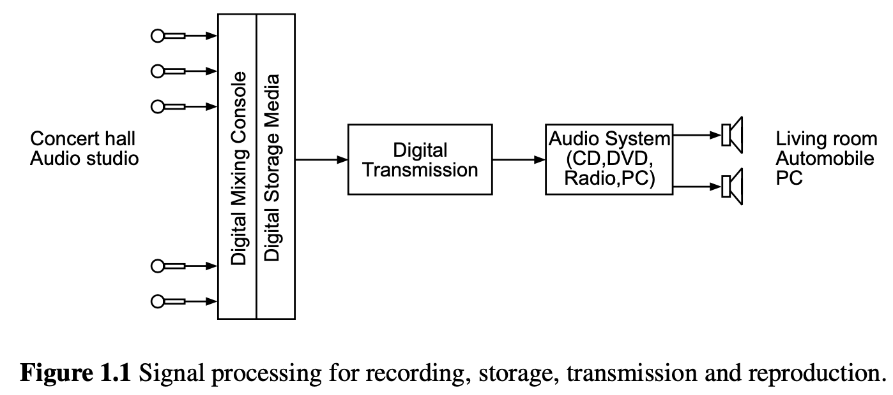
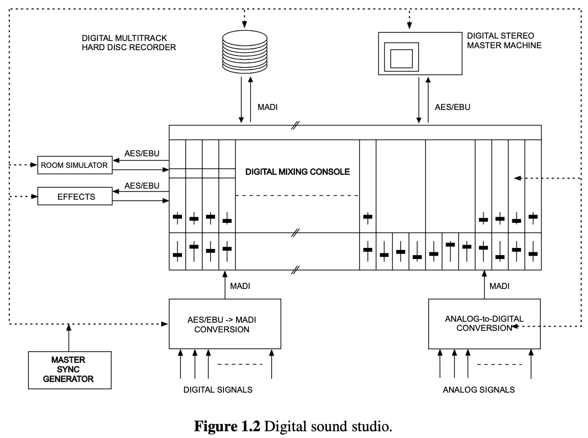
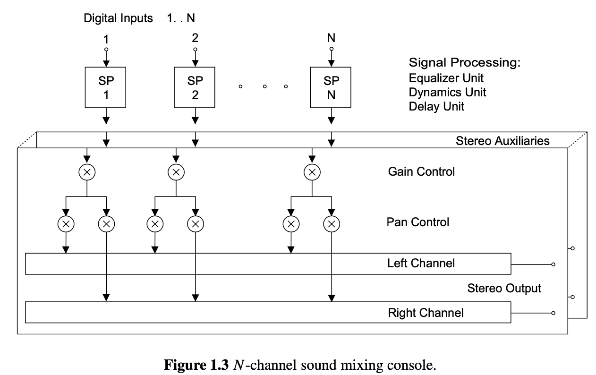
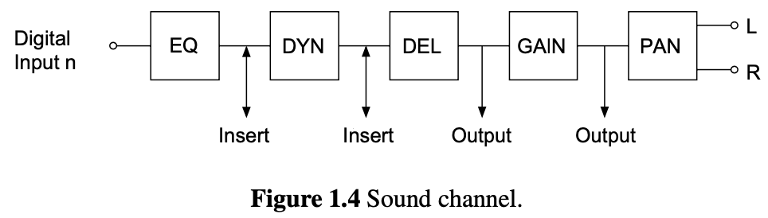
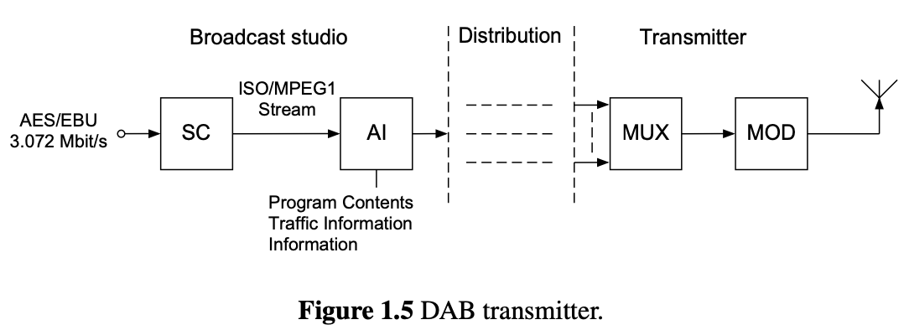

<head>
    
    
</head>

# Table of Contents

1.  [简介](#org2b3fb01)
    1.  [演奏室技术](#orga7d311f)
    2.  [数字传送系统](#org02baf81)
        1.  [地球数字化广播（DAB）](#orgc6d5b96)

# 简介

在开始数字音频信号处理之前没有对各种技术设备和系统音频技术有一个大略了解是不行的。在本章中，会呈现数字音频信号处理应用程序。开始从在演奏室或音乐厅记录，展示整个信号处理链，到重生成在家或汽车上的音频。应用程序领域可分为一下领域：

-   演奏室技术
-   数字传输系统
-   存储媒体
-   家庭娱乐音频组件

以上提及的应用程序领域的基本原理将呈现为为了展示数字信号处理的使用。特殊的技术设备和系统不在本章中介绍。这些设备和系统被计算机技术的发展强力驱动且新设备基于新的技术。本章的目的是趋于独立呈现从乐器或歌手到听众和音乐消费者的整个处理链。信号处理技术和它们的算法的呈现将在之后的章节讨论

## 演奏室技术

当在演奏室或音乐厅录制语音或音乐，麦克风的模拟信号首先数字化，给一个数字混合控制台且然后存储在一个数字存储媒介。一个数字声音工作室显示如下图。除了模拟源（麦克风），数字源通过多频道MADI接口给到数字混合控制台。数字存储媒介如数字多轨磁带机被数字硬盘录制系统替代，其也连接多频道MADI接口到混合控制台。最后的双声道混合通过一个两频道AES/EBU接口在一个两频道主机上存储。外部音效或房间模拟设备也通过一个两频道AES/EBU接口连接到混合控制台。所有系统通过一个主时钟引用同步。在数字音频技术上，对专业演播室技术采样率 $ f_ {S} = 48 $ kHz，对压缩磁盘为 $ f_ {S} = 44.1 $kHz，对广播应用 $ f_ {S} = 32 $kHz。另外，多个采样频率比如88.2, 96, 176.4和192 kHz也在使用。声音混合控制台在数字声音演播室中扮演一个中心的角色。下下图显示功能单位。N个输入信号独立处理。在水平和全景控制之后，所有信号加和为一个双声道混音。累加执行多次这样其他辅助双声道和/或单声道信号可适合做其他目的。在声音频道中，一个均衡器(EQ)，一个动态单元(DYN)，一个延迟单元(DEL)，一个增益元素(GAIN)和一个全景元素(PAN)被使用。在音频频道中的输入和输出信号，需要插入作为辅助或直接输出

## 数字传送系统

本章节将简约解释数字传送。除了基于振幅和频率调制的模拟无线广播系统，$ DAB^{2} $（数字化音频广播）在一些国家已引入。另一方面，网络推动音视频分发，基于网络的因特网广播和视频

### 地球数字化广播（DAB）

地球数字化广播，压缩磁盘的质量标准将从移动和电报信号的接收站获得。因此，一个从一个传送工作室来的两频道AES/EBU信号被缩减来帮助源编码。在源编码（SC）之后，附加信息（AI）像一类程序（音乐/语音）且流量信息被添加。一个多携技术被用于数字化传送到站点和移动接收器。在传送机，几个广播程序组合在一个混合器中来形成混音信号。频道编码和调制被一个多携转送技术（编码垂直频率多分）使用

