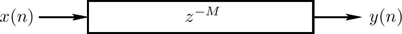
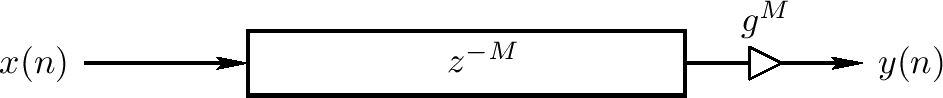
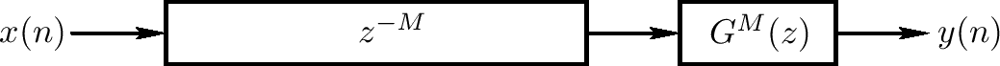
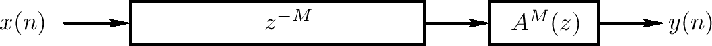
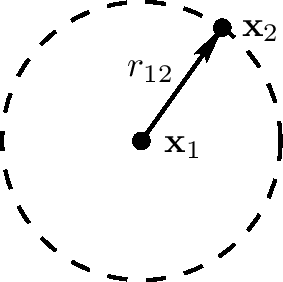
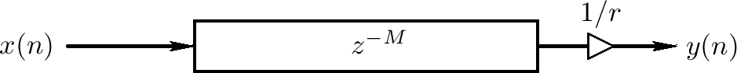
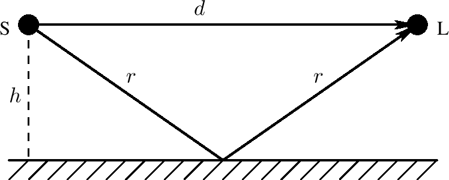
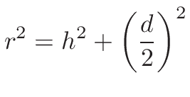
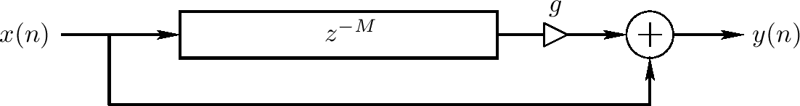

<head>
    
    
</head>

# Table of Contents

1.  [Algorithm](#orgb7d4387)
2.  [Review](#org44bd0c6)
    1.  [延迟线](#orgaf7f2c3)
        1.  [软件延迟线](#orge7debf1)
    2.  [声学波浪广播模拟](#org9f327fa)
        1.  [旅行波浪](#org73620c8)
        2.  [粘滞旅行波浪](#org551e446)
        3.  [消散旅行波浪](#org8b46185)
        4.  [转换广播距离为延迟长度](#orgc835066)
        5.  [点源的球形波浪](#org3d71987)
        6.  [球形或平面波浪的反射](#org870a751)
        7.  [一个声学回音模拟](#orgc6ff26d)
        8.  [声学回音模拟的程序](#orga471820)
3.  [Tips](#org22208d2)
4.  [Share](#org3d81d3f)

# Algorithm

Matrix Power Series: <http://poj.org/problem?id=3233>

<https://dreamume.medium.com/poj-matrix-power-series-fee6ae3468ad>

# Review

数字化延迟的声学模型

<https://ccrma.stanford.edu/~jos/pasp/Acoustic_Modeling_Digital_Delay.html>

延迟音效，比如移相、延迟混合、重复、回响，及数字波浪模型，使用延迟线构建，简单的数字化过滤章节、和一些非线性元素和改变。我们将在使用它们作为声音综合之前聚焦这些元素的更简单地延迟音效

## 延迟线

延迟线是一个基本函数单元其模型声音广播延迟。它是基本的延迟音效处理和数字化波浪综合模型的构建块。延迟线的函数在输入和输出之间引入一个时间上的延迟，如下图

设输入信号记为x(n)，$ n = 0, 1, 2, \\ldots $，且设延迟线长度为M个采样。则输出信号y(n)

$ y(n) = x(n - M), \\qquad n = 0, 1, 2, \\ldots $

$ x(n) \\triangleq 0, n < 0 $

在数字化时代以前，模拟形式的延迟线是昂贵且不精确的。例如，弦回响（通常是吉他的放大器）使用金属弦作为模拟延迟线；当足够的时候，它们高度分散且有噪声。大延迟需要禁止模拟实现中的长弦或盘旋。在数字化领域，延迟N个采样是平凡地实现，且非整数延迟可通过插入技术实现

### 软件延迟线

在软件上，一个延迟线通常用循环缓冲实现。设D记为一个长度为M的数组。则我们可用C语言实现M采样延迟线，代码如下

    /* delayline.c */
    static double D[M];             /* initialized to zero */
    static long ptr = 0;            /* read-write offset */
    
    double delayline(double x) {
      double y = D[ptr];            /* read operation */
      D[ptr++] = x;                 /* write operation */
      if (ptr >= M) { ptr -= M; }   /* wrap ptr if needed */
      // ptr %= M;                  /* modulo-operator syntax */
      return y;
    }

这类延迟线典型地使用在数字回响和其他声学模拟包含固定广播延迟，在后面的章节中我们会考虑时间变化延迟长度

## 声学波浪广播模拟

延迟线可被用于模拟声学波浪广播。我们开始最简单的例子，一个纯旅行波浪，接着更一般化的球形波浪。我们然后看一个简单的声学回音模拟细节，使用一个延迟线模型直接和转移信号之间时间到达的不同

### 旅行波浪

在声学波浪广播中，纯延迟可被用于模拟旅行波浪。一个旅行波浪是任意类型的波浪，在一个单向广播及在形状上可忽略不计地改动。旅行波浪的一个重要类为空气中平面波浪，其创建以接近矩形的标准波浪比如鞋盒形状音乐厅。跟任意声学源不同，直接声音从任意源出现会很好地估计为一个平面波浪

另一个例子是平面波浪支配的圆柱管，比如一个单簧管或直导管端。另外，声道一般使用平面波浪模拟，用这个例子会有一个更高的估计错误

在摆线上的横向和纵向波浪，比如一个吉他，也近似完美的旅行波浪，且它们可被模拟为非常高度的感知精确度，通过理想地模拟，而实现在每个周期有损失和发散（例如，在虚拟弦的一个特殊的点）

在圆锥形管，我们发现球形波浪替代平面波浪。然而，它们依然想平面波浪一样旅行，且我们可依然使用一个延迟线模拟它们的广播。相同的应用到点源创建的球形波浪

### 粘滞旅行波浪

之前图示的延迟线可用于模拟任意旅行波浪，旅行波浪必须在一个方向上以固定波形广播。如果一个旅行波浪在它广播时出现，每个频率有相同的出现因素，减弱可被一个简单的延迟线输出（或输入）扩散模拟，如上图所示。这可能是离散点块分布损失重要原理的最简单例子。不必要对波浪广播的每个时间步骤实现一个小的减弱g；如果广播在延迟线上有损失，在延迟线输出上能获得相同的结果，且总累计减弱 $ g^{M} $应用在输出。这个输入输出模拟是准确的，而延迟线的信号采样模拟有一个小的收益错误。如果之后需要内部信号，他们可以用正确的收益敲出。例如，延迟线的半途信号可使用系数 $ g^{M/2} $敲出，为了使它为一个精确的第二输出。总结，计算有效性可通常在没有成本下极大增加精度，通过在输出和点和其他模拟的交互归并损失

模型旅游波浪通过一个扩散因子减弱只精确地物理上当所有频率部分腐蚀在相同的速度上。对精确声学模型，它通常需要替代常量扩散因子g通过一个数字过滤G(z)，其实现频率依赖减弱，如下图。在原理上，一个线性时间不变(LTI)过滤器可提供一个独立减弱因子在每个频率上

2.3章节处理这个情况在更多地细节上。潮湿的频率依赖减少将用于人造回响

### 消散旅行波浪

在许多声学系统中，比如钢琴弦，波浪广播也是显著消散的。一个波浪广播媒介是消散的如果波浪广播的速度不是在所有频率上相同。结果，一个广播波浪形状将消散（改变形状）像它各种频率部分旅行在不同的速度上。消散广播在一个方向上可被用一个系列延迟线模拟，其带一个非线性语法过滤，如下图。如果没有滞邂，过滤器A(z)必须是all-pass的，例如，$ \| A(e^{j \\omega T}) \| $，对所有 $ \\omega T \\in [- \\pi, \\pi] $

### 转换广播距离为延迟长度

我们可视延迟线内存本身为固定空气，其以固定速度c（c = 345米每秒在22度1大气压时）广播声音采样。输入信号x(n)可根声源关联，输出信号y(n)（看之前的延迟线的图）可被关联听点。如果听点是离生源d米，则延迟线长度M需要为

$ M = \\frac{d}{cT} 采样 $

T记为离散采样间隔。即采样数量延迟是广播距离d除以cT，一个采样间隔声音广播的距离。实践中，取 $ M = d / cT $最近的整数不会引起声音上的不同，除非回音时间太短使得系统不能真正地探测回音

### 点源的球形波浪

声学理论告诉我们一个点源产生一个球形波浪在一个理想的均匀媒介比如空气中。更进一步，从任意发散表面的声音可被计算为表面上每个点贡献的球形波浪的和（包含任意相关的反射）。Huygens-Fresnel原理解释波浪广播本身为每点产生的球形波浪的叠加。这样，所有线性声学波浪广播可被视为球形旅行波浪的叠加

为有一个好的估计，波浪能量在空气传播中保留。在一个半径为r的球形压力波浪中，其能量扩散到球表面 $ 4 \\pi r^{2} $。因此，一个扩散球形压力波浪每单位面积能量缩减为 $ 1 / r^{2} $。这被称为球形扩散损失。它也是翻转平面定律的例子，其重复地在三维空间物理保留数量中出现。因为能量跟振幅的平方成比例，能量传输的翻转平方定律缩减到1 / r振幅

一个旅行波浪的声音压力振幅跟单位面积它的能量的平方根成比例。因此，在一个球形旅行波浪中，声学振幅比例为1 / r，r是球的半径。根据Cartesian坐标，振幅 $ p(x_ {2}) $在点 $ x_ {2} = (x_ {2}, y_ {2}, z_ {2}) $处对一个点源位于 $ x_ {1} = (x_ {1}, y_ {1}, z_ {1}) $为

$ p(x_ {2}) = \\frac{p_ {1}}{r_ {12}} $

$ p_ {1} $定义为位于 $ x_ {1} (p_ {1} = p(x_ {1} + e), \| \| e \| \| = 1) $的点源一个半径单位的压力振幅，且 $ r_ {12} $记为从点 $ x_ {1} $到 $ x_ {2} $的距离：

$ r_ {12} \\triangleq \| \| x_ {2} - x_ {1} \| \| = \\sqrt{(x_ {2} - x_ {1})^{2} + (y_ {2} - y_ {1})^{2} + (z_ {2} - z_ {1})^{2}} $

这个地理对2D情况描述在上图中

总结，一个发散声源的每个点发射在所有方向上的球形旅行波浪，其衰退为1 / r，r是源的距离。衰退半径1 / r可考虑为广播波浪能量保留（能量扩散到扩展球形的表面）。我们经常视这样的波浪为从源出来的射线，且我们可模拟它们为1 / r扩散系数的延迟线（如下图）。相反，因为平面波浪广播完全没有衰退，每个射线可考虑为无损失，且模拟只包含一个无扩散因子的延迟线

### 球形或平面波浪的反射

当一个扩散球形波浪遇到一个墙或其他障碍物，它要么反射要么散射。一个波浪反射当它限制在一个表面，该表面在每个方向上对至少一些波长来说是平的。反射玻璃容易通过射线追踪来映射，例如，反射的射线以一个角度离开表面等于接触的角度（反射律）。波浪反射也称为球形反射，特别当考虑光波的时候

一个波浪是散射的当它遇到表面对特殊波长的扩散有变化时。一个散射也称为一个扩散反射。作为一个特别的例子，小于一个波长的物体会有一个散射当接触一个球形波浪而物体接近零体积时。更一般地，一个散射的每个点可激发一个新的球形扩散波浪对应输入的波浪 - 其分解为Huygen原理，在之前章节提及。相同的进程出现在反射中，但半球在反射表面的每个点出发组合形成一个更有组织的波浪，其跟接触波浪但旅行在一个新的方向相同

球形和散射反射的不同在于频率。因为声音旅行大约一毫秒一英尺，每个边的一个立方英尺将特别地反射声音光束能量高于1KHz，散射声音能量低于1KHz。一个好的音乐厅，例如，有大量的散射。作为一般规律，回响应该是散射为了避免标准波浪。即，在回响中，我们希望扩散声音能量在时间和空间上是统一的，且我们不想要任意特殊的空间或时间上的范型

### 一个声学回音模拟

一个声学回音是最简单的声学模型问题之一。回音发生在当一个声音通过多个声学广播路径到达，如下图。我们可听到一个离散的回音，例如，如果我们站在一个大平墙边拍手，比如建筑的一边。为探测到回音，然而，反射必须在直接信号（或之前的回音）后到达

一个普通的回音原因是多路径波浪广播，如上图所示。声源记为S，听者记为L，且它们在距离反射表面h米的高度。直接的路径是d米长，而单反射的长度是2r米。这些数值跟Pythagorean定理相关

上图阐述一个回音模拟对一个直接信号和直接回音的例子。它通常练习来丢弃任意对所有信号影响平等的延迟，因为这样的延迟不影响音质；这样，直接信号延迟在上图中不实现。相似地，它不需要实现直接信号由于广播而产生的衰弱，因为它跟直接信号的振幅相关和它的影响音质的回音

从上上图中，我们看到延迟线长度在上图中应该为

$ M = \\frac{2r - d}{cT} $

且

$ g = \\frac{1 / 2r}{1 / d} = \\frac{d}{2r} $

c是声音的速度且T记为采样间隔。我们可消除r使用 $ r = \\sqrt{h^{2} + (d / 2)^{2}} $，只剩下两个独立变量：声源高于反射表面的高度h，且d为声源和听者的距离

$ g = \\frac{1}{\\sqrt{1 + (2h/ d)^{2}}} $

### 声学回音模拟的程序

如下主程序模拟一个简单的声学回音使用延迟线函数。它读取一个声音文件且写一个声音文件包含一个单一的、离散回音在一个特殊的延迟上。为简化，利用免费的Synthesis Tool Kit(STK)（4.2.x版本）用来做声音输入输出

    /* Acoustic echo simulator, main C++ program.
       Compatible with STK version 4.2.1.
       Usage: main inputsoundfile 
       Writes main.wav as output soundfile
     */
    
    #include "FileWvIn.h"  /* STK soundfile input support */
    #include "FileWvOut.h" /* STK soundfile output support */
    
    static const int M = 20000; /* echo delay in samples */
    static const int g = 0.8;   /* relative gain factor */
    
    #include "delayline.c" /* defined previously */
    
    int main(int argc, char *argv[]) 
    { 
      long i;
      Stk::setSampleRate(FileRead(argv[1]).fileRate());
      FileWvIn input(argv[1]);  /* read input soundfile */
      FileWvOut output("main"); /* creates main.wav */
      long nsamps = input.getSize();
      for (i=0;i<nsamps+M;i++)   {
        StkFloat insamp = input.tick();
        output.tick(insamp + g * delayline(insamp));
      }
    }

总结，一个延迟线模拟一个特点方向上的波浪广播的时间延迟。减弱（例如，1 / r）相关射线广播可被多个延迟线输出及某个常量g模拟

# Tips

10x程序员工作法 - 开篇词和思考框架

工作效率很重要，做事要高效，注意投入产出比。做事要有方法，要总结，要不断完善

做事不能凭直觉，要有科学方法，只有没有科学方法可指导时，才不得不用直觉

这里提到了四个原则：

-   以终为始
-   任务分解
-   沟通反馈
-   自动化

75 年，弗雷德里克·布鲁克斯（Frederick Brooks）出版了软件行业的名著《人月神话》，他给出了一个统计结果，优秀程序员的开发效率是普通程序员的 10 倍

这个对比显示高效和低效差距是非常大的，一定要探索出适合自己高效方法

处理问题时，对问题的现状、目标、实现路径要非常清楚，对所做的事情有清晰地认识

对所做的事情形成衡量标准，保证工作是有效的，跳出程序员固有的思维，确保事情要做好，过程要高效

# Share

Melding ZDDs

<https://crypto.stanford.edu/pbc/notes/zdd/meld.html>

设F, G为在相同的宇宙 $ \\{1, \\ldots, n\\} $中的ZDD。我们如何构建它们的并，$ F \\cup G $？

例子1: 如果一个家族是空的或单元家族则问题简单，且这些特别例子也在泛化解决方案中有暗示。特别地，如果 $ G = \\epsilon $（代表单个节点 $ \\top $）且 $ F \\ne \\emptyset $且 $ F \\ne \\epsilon $（这样F包含一个非终止节点）然后，如果它已不存在，我们添加一条点边这样我们可从F的根访问到 $ \\top $，每次跟着LO分支。即，我们开始从F的根开始，接着点线，且然后要么什么也不做如果我们在 $ \\top $结束或重新路由我们跟随 $ \\top $最后的点线

例子2: 假设F和G有一个根节点标签为v，$ v \\in [1 .. n] $。设 $ F_ {0}, F_ {1} $为在LO和HI边上的ZDD。定义$ G_ {0}, G_ {1} $

回忆 $ F_ {0}, F_ {1} $按是否包含v来分区F集合的家族，且$ G_ {0}, G_ {1} $相似，因此我们的解决方案必须为

我们递归地找到 $ H_ {0} = F_ {0} \\cup G_ {0}, H_ {1} = F_ {1} \\cup G_ {1} $

例子3: 假设F有根节点v且G有根节点w，且v < w。设 $ F_ {0}, F_ {1} $为F的根节点的LO和HI孩子

现在w是包含在G的任意集合中的最小的整数，因此G中没有集合包含v。这样 $ F \\cup G $是

$ H = F_ {0} \\cup G $。如简单的特殊例子 $ G = \\epsilon, w > v $，我们不做任何事仅跟随点线。事实上，通过定义 $ \\top $为比每个整数更大，我们看到这个特殊例子是如何相关的

我们已经描述对构建任意两个家族的并所有从顶向下递归算法的所有例子。观察我们避免创建HI边指向 $ \\bot $的节点，且我们避免复制任意节点

以上争论对任意二元操作 $ \\diamond $在满足 $ F \\diamond G \\subseteq F \\cup G $的并分布上满足，输出依赖输入的并

如 $ F \\cap G, F \\ G, F \\oplus G $所有依赖 $ F \\cup G $，对这些操作当F, G有相同标签的根节点时可用以上的争论应用。相似地，我们不做任何事仅跟随点线当G的根节点 $ \\omega $大于F的根节点 $ \\upsilon $时。唯一的不同是处理 $ F_ {1} $。对交集，因为这表示F的集合包含 $ \\upsilon $且因为G中没有集合包含 $ \\upsilon $，我们砍掉整个分支只留下ZDD $ F_ {0} \\cap G $。对不同和对称不同，和并一样，我们使 $ F_ {1} $完好无损因为它代表F的集合而不是G

一个小问题：例子 $ \\upsilon > \\omega $是对称的除了非对称不同操作。在这个例子中我们有 $ F \\ G = F \\ G_ {0} $

让我们总结非终止例子。设 $ \\diamond $为 $ \\cup, \\cap, \\, \\oplus $中的一个。我们重使用以上记号，即F, G为根节点为 $ \\upsilon, \\omega $的非平凡ZDD，且 $ F_ {0}, F_ {1} $为 $ \\upsilon $的LO和HI孩子，$ G_ {0}, G_ {1} $类似

当 $ \\upsilon = \\omega $，则 $ F \\diamond G $递归定义为

$ H_ {0} = F_ {0} \\diamond G_ {0}, H_ {1} = F_ {1} \\diamond G_ {1} $

当 $ \\upsilon < \\omega $，设 $ H = F_ {0} \\diamond G $，如果 $ \\diamond = \\cap $则 $ F \\cap G = H $，否则，$ F \\diamond G $为

最后，当 $ \\upsilon > \\omega $时是对称的除了当 $ \\diamond = \\ $，因此 $ F \\ G = F \\ G_ {0} $

合、meet合其他操作不是很直观。让我们看合操作。假设我们希望计算 $ H = F \\sqcup G $当F和G有相同的标签。记LO和HI孩子下标为0和1，我们有

$ H_ {0} = F_ {0} \\sqcup G_ {0} $

$ H_ {1} = (F_ {0} \\sqcup G_ {1}) \\cup (F_ {1} \\sqcup G_ {0}) \\cup (F_ {1} \\sqcup G_ {1}) $

这导致算法和之上的相似，除了 $ H_ {1} $递归分支且用不同的方法计算。通过分布式

$ H_ {1} = ((F_ {0} \\cup F_ {1}) \\sqcup G_ {1}) \\cup (F_ {1} \\sqcup G_ {0}) = (F_ {1} \\sqcup (G_ {0} \\cup G_ {1})) \\cup (F_ {0} \\sqcup G_ {1}) $

这样我们有3种方法计算 $ H_ {1} $。依赖于输入，某一个可能是有效地更好的形式
