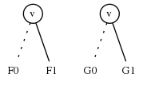
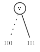
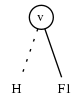

<head>
    
    
</head>

# Table of Contents

1.  [Algorithm](#orgb7d4387)
2.  [Review](#org44bd0c6)
3.  [Tips](#org22208d2)
4.  [Share](#org3d81d3f)

# Algorithm

Matrix Power Series: <http://poj.org/problem?id=3233>

<https://dreamume.medium.com/poj-matrix-power-series-fee6ae3468ad>

# Review

数字化延迟的声学模型

<https://ccrma.stanford.edu/~jos/pasp/Acoustic_Modeling_Digital_Delay.html>

# Tips

10x程序员工作法 - 开篇词和思考框架

工作效率很重要，做事要高效，注意投入产出比。做事要有方法，要总结，要不断完善

做事不能凭直觉，要有科学方法，只有没有科学方法可指导时，才不得不用直觉

这里提到了四个原则：

-   以终为始
-   任务分解
-   沟通反馈
-   自动化

75 年，弗雷德里克·布鲁克斯（Frederick Brooks）出版了软件行业的名著《人月神话》，他给出了一个统计结果，优秀程序员的开发效率是普通程序员的 10 倍

这个对比显示高效和低效差距是非常大的，一定要探索出适合自己高效方法

处理问题时，对问题的现状、目标、实现路径要非常清楚，对所做的事情有清晰地认识

对所做的事情形成衡量标准，保证工作是有效的，跳出程序员固有的思维，确保事情要做好，过程要高效

# Share

Melding ZDDs

<https://crypto.stanford.edu/pbc/notes/zdd/meld.html>

设F, G为在相同的宇宙 $ \\\\{1, \\\ldots, n\\\\} \(中的ZDD。我们如何构建它们的并，\) F \\&cup; G $？

例子1: 如果一个家族是空的或单元家族则问题简单，且这些特别例子也在泛化解决方案中有暗示。特别地，如果 $ G = \\epsilon $（代表单个节点 $ \\top $）且 $ F \\ne \\emptyset $且 $ F \\ne \\epsilon $（这样F包含一个非终止节点）然后，如果它已不存在，我们添加一条点边这样我们可从F的根访问到 $ \\top $，每次跟着LO分支。即，我们开始从F的根开始，接着点线，且然后要么什么也不做如果我们在 $ \\top $结束或重新路由我们跟随 $ \\top $最后的点线

例子2: 假设F和G有一个根节点标签为v，$ v \\in [1\\ldot \\ldot n] $。设 $ F_ {0}, F_ {1} $为在LO和HI边上的ZDD。定义$ G_ {0}, G_ {1} $

回忆 $ F_ {0}, F_ {1} $按是否包含v来分区F集合的家族，且$ G_ {0}, G_ {1} $相似，因此我们的解决方案必须为

我们递归地找到 $ H_ {0} = F_ {0} \\cup G_ {0}, H_ {1} = F_ {1} \\cup G_ {1} $

例子3: 假设F有根节点v且G有根节点w，且v < w。设 $ F_ {0}, F_ {1} $为F的根节点的LO和HI孩子

现在w是包含在G的任意集合中的最小的整数，因此G中没有集合包含v。这样 $ F \\cup G $是

$ H = F_ {0} \\cup G $。如简单的特殊例子 $ G = \\epsilon, w > v $，我们不做任何事仅跟随点线。事实上，通过定义 $ \\top $为比每个整数更大，我们看到这个特殊例子是如何相关的

我们已经描述对构建任意两个家族的并所有从顶向下递归算法的所有例子。观察我们避免创建HI边指向 $ \\bot $的节点，且我们避免复制任意节点

以上争论对任意二元操作 $ \\diamond $在满足 $ F \\diamond G \\subseteq F \\cup G $的并分布上满足，输出依赖输入的并

如 $ F \\cap G, F \\ G, F \\oplus G $所有依赖 $ F \\cup G $，对这些操作当F, G有相同标签的根节点时可用以上的争论应用。相似地，我们不做任何事仅跟随点线当G的根节点 $ \\omega $大于F的根节点 $ \\upsilon $时。唯一的不同是处理 $ F_ {1} $。对交集，因为这表示F的集合包含 $ \\upsilon $且因为G中没有集合包含 $ \\upsilon $，我们砍掉整个分支只留下ZDD $ F_ {0} \\cap G $。对不同和对称不同，和并一样，我们使 $ F_ {1} $完好无损因为它代表F的集合而不是G

一个小问题：例子 $ \\upsilon > \\omega $是对称的除了非对称不同操作。在这个例子中我们有 $ F \\ G = F \\ G_ {0} $

让我们总结非终止例子。设 $ \\diamond $为 $ \\cup, \\cap, \\, \\oplus $中的一个。我们重使用以上记号，即F, G为根节点为 $ \\upsilon, \\omega $的非平凡ZDD，且 $ F_ {0}, F_ {1} $为 $ \\upsilon $的LO和HI孩子，$ G_ {0}, G_ {1} $类似

当 $ \\upsilon = \\omega $，则 $ F \\diamond G $递归定义为

$ H_ {0} = F_ {0} \\diamond G_ {0}, H_ {1} = F_ {1} \\diamond G_ {1} $

当 $ \\upsilon < \\omega $，设 $ H = F_ {0} \\diamond G $，如果 $ \\diamond = \\cap $则 $ F \\cap G = H $，否则，$ F \\diamond G $为

最后，当 $ \\upsilon > \\omega $时是对称的除了当 $ \\diamond = \\ $，因此 $ F \\ G = F \\ G_ {0} $

合、meet合其他操作不是很直观。让我们看合操作。假设我们希望计算 $ H = F \\sqcup G $当F和G有相同的标签。记LO和HI孩子下标为0和1，我们有

$ H_ {0} = F_ {0} \\sqcup G_ {0} $

$ H_ {1} = (F_ {0} \\sqcup G_ {1}) \\cup (F_ {1} \\sqcup G_ {0}) \\cup (F_ {1} \\sqcup G_ {1}) $

这导致算法和之上的相似，除了 $ H_ {1} $递归分支且用不同的方法计算。通过分布式

$ H_ {1} = ((F_ {0} \\cup F_ {1}) \\sqcup G_ {1}) \\cup (F_ {1} \\sqcup G_ {0}) = (F_ {1} \\sqcup (G_ {0} \\cup G_ {1})) \\cup (F_ {0} \\sqcup G_ {1}) $

这样我们有3种方法计算 $ H_ {1} $。依赖于输入，某一个可能是有效地更好的形式
