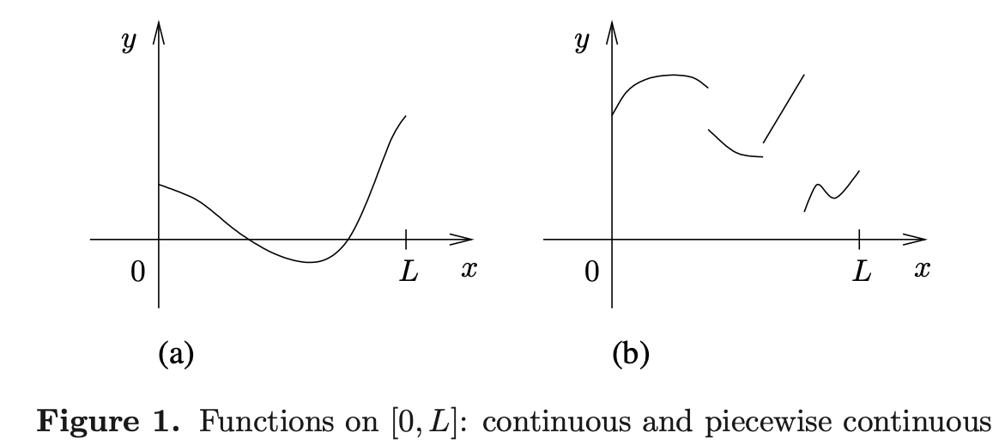
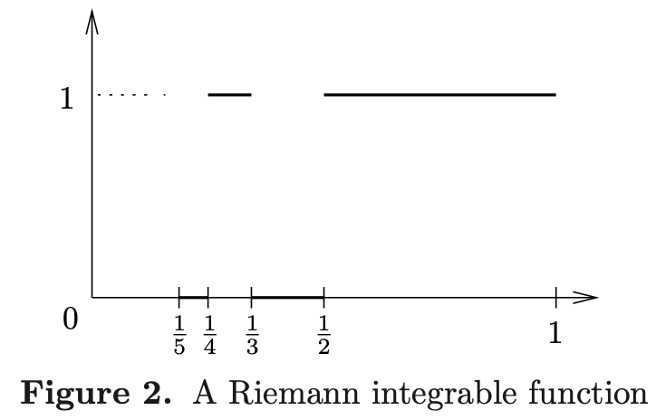
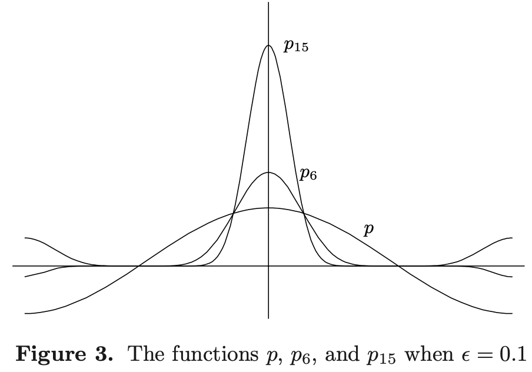
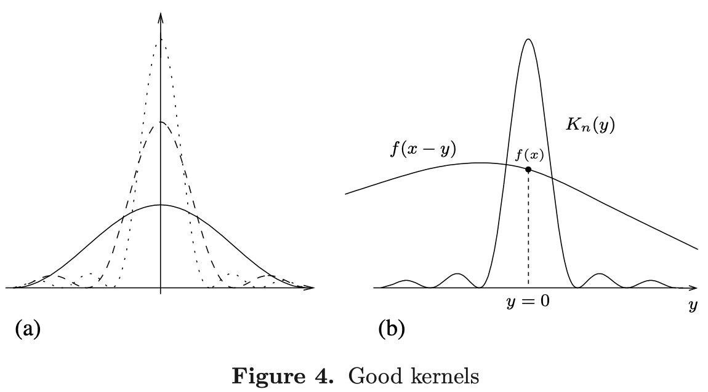
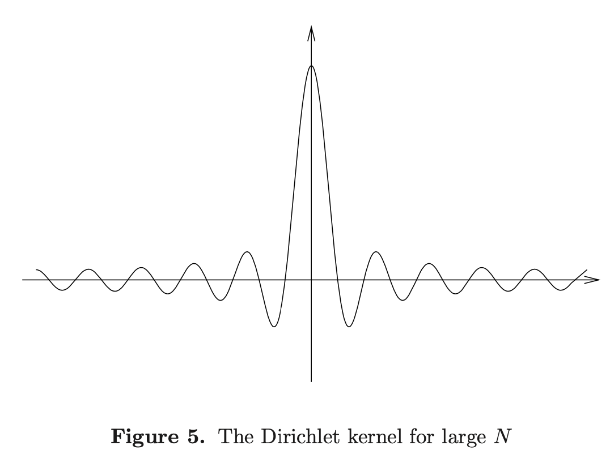

<head>
    
    
</head>

# Table of Contents

1.  [主要定义和一些例子](#org4a21d8f)
2.  [傅立叶级数的唯一性](#org85e47fb)
3.  [卷积](#org03d2578)
4.  [好核](#orgbe348d1)
5.  [Cesaro 和 Abel 可加性：傅立叶级数应用程序](#orgd0569f0)
    1.  [Cesaro 中值和和值](#orgf6b42bf)
    2.  [Fejer 定理](#org2e37818)
    3.  [Abel 中值和和值](#orgf79d0a6)
    4.  [单位盘上泊松核和 Dirichlet 问题](#org893d7e0)

在本章中，我们开始我们傅立叶级数的严谨地学习。我们设置舞台引入主题的主要目标，且然后公式化我们之前接触到的一些基本问题

我们第一个结果为布置问题的唯一性：两个带相同傅立叶系数的函数必须相等吗？事实上，一个简单地争论显示如果两个函数是连续的，则它们相等

接下来，我们更近地观察傅立叶级数的部分和。使用傅立叶系数公式，我们有关键观察这些和可方便的写成积分：

$ \\frac{1}{2 \\pi} \\int D_ {N}(x - y)f(y)dy $

$ \\{D_ {N}\\} $是一族汉森称为Dirichlet核。以上表达式是带函数 $ D_ {N} $的f的复杂阐述。一般地，给定一族函数 $ \\{K_ {n}\\} $，我们看极限当n趋于无穷时

$ \\frac{1}{2 \\pi} \\int K_ {n}(x - y)f(y)dy $

我们发现如果家族 $ \\{K_ {n}\\} $满足好核的三个重要属性，则上式趋于f(x)当 $ n \\to \\infty $（至少当f连续时）。这样，家族 $ \\{K_ {n}\\} $是一个大约估计。不幸地是，Dirichlet核 $ D_ {N} $不属于好核分类，其显示傅立叶级数的收敛问题是琐碎的

除了追求问题的收敛，我们考虑几个其他的方法求函数傅立叶级数的和。第一个方法，其包含部分和的平均，其属于好核，且是Fejer的重要定理。从这里，我们推演事实一个圆上的连续函数可被三角多项式统一估计。第二，我们也用Abel求傅立叶级数的和且其属于好核的家族。在这个情况中，其结果导致磁盘的稳定状态热力问题的Dirichlet问题的一个解

**问题的例子和想法**

我们开始我们应该考虑的函数类型的简单描述。因为f的傅立叶系数被定义为

$ a_ {n} = \\frac{1}{L} \\int^{L}_ {0}f(x)e^{-2 \\pi inx/L} dx, \\qquad \\text{for } n \\in \\mathbb{Z} $

f是[0, L]的复数值，它将需要在f上放置一些积分条件。我们将因此假设（本书后面）所有函数至少是黎曼可积的。有时它将被阐述聚焦我们的注意力在函数关于更规范上，即函数处理某个连续性或微分属性。如下，我们列出几类一般性增序的函数。我们强调我们不将一般性限制在实数函数上，相反我们将总是允许函数在复数上取值。更进一步，我们有时认为我们的函数被定义在一个圆上而不是一个间隔

**全连续函数**

复数值函数f在线段[0, L]上每点都连续。一个典型的连续函数如下图(a)。我们要注意之后连续函数在圆上满足额外的条件f(0) = f(L)

**分段连续函数**

在[0, L]上函数有有限个不连续不连续点。一个这样的函数如下图(b)

**黎曼可积函数**

这是我们将考虑的最一般化的函数类。这样的函数有界，但有无穷多个不连续点。我们回忆积分的定义。一个在[0, L]上的实值函数f是黎曼可积的如果它有界且如果对任意 $ \\epsilon > 0 $，有一个在[0, L]上小的分割 $ 0 = x_ {0} < x_ {1} < \\cdots < x_ {N-1} < x_ {N} = L $，使得如果 $ \\mathcal{U}, \\mathcal{L} $，为这个分割的上和和下和，即

$ \\mathcal{U} = \\sum^{N}_ {j=1} [ \\operatorname{sup}_ {x_ {j-1} \\le x \\le x_ {j}} f(x)] (x_ {j} - x_ {j - 1}) $

$ \\mathcal{L} = \\sum^{N}_ {j=1} [ \\operatorname{inf}_ {x_ {j-1} \\le x \\le x_ {j}} f(x)] (x_ {j} - x_ {j - 1}) $

则我们有 $ \\mathcal{U} - \\mathcal{L} < \\epsilon $。最后，我们说一个复数值函数是可积的如果它的实部和虚部是可积的

一个简单的在[0, 1]上可积函数的例子，有无限多个不连续点

$ f(x) = \\left \\{ \\begin{array}{ll} 1 & \\text{if } 1 / (n + 1) < x \\le 1 / n \\text{ 且n是奇数} \\\\ 0 & \\text{if } 1 / (n+1) < x \\le 1 / n \\text{且n是偶数} \\\\ 0 & \\text{if } x = 0 \\end{array} \\right. $

这个例子展示如下图。注意f在 x = 1 / n和x = 0时是不连续的

在[0, 1]上含不连续的稠密点的可积函数的更精巧的例子描述在问题1。一般地，当可积函数有无穷多个不连续点，这些函数事实上被事实特征，更精确地，它们的不连续点不是太多，即可忽略不计，即一个可积函数不连续点的集合有度量0

从现在开始，我们将总是假设我们的函数是可积的，即使我们不直接陈述这个需求

**圆上的函数**

在$ \\mathbb{R} $ 上 $ 2 \\pi $周期函数之间像指数函数 $ e^{in \\theta} $有一个自然连接，函数在 $ 2 \\pi $周期长度间隔和在单位圆上的函数

在单位圆上的一个点有形式 $ e^{i \\theta} $，$ \\theta $是一个实数唯一加入 $ 2 \\pi $的整数倍。如果F是一个圆上的函数，则我们对每一个实数 $ \\theta $可定义

$ f(\\theta) = F(e^{i \\theta}) $

且观察这个定义，函数f是在 $ \\mathbb{R} $上周期为 $ 2 \\pi $的函数，即对所有 $ \\theta, f(\\theta + 2 \\pi) = f(\\theta) $。F的积分、连续和其他圆滑属性取决于f。例如，我们说F在圆上是可积的如果f在每个 $ 2 \\pi $间隔是可积的。F在圆上是连续的如果f在 $ \\mathbb{R} $上是连续的，也即是f在任意 $ 2 \\pi $的间隔上是连续的。更进一步，F是连续可微的如果f是连续可导的

因为f有 $ 2 \\pi $的周期，我们可限制它到任意 $ 2 \\pi $间隔，比如 $ [0, 2 \\pi] $ 或 $ [- \\pi, \\pi] $，且在圆上捕获初始化函数F。我们注意到f必须在间隔的末点有相同的值因为它们对应圆上相同的点。相反地，$ [0, 2 \\pi] $上的任意函数，$ f(0) = f(2 \\pi) $可被扩展为 $ \\mathbb{R} $上的一个周期函数，然后确定为圆上的一个函数。特别地，一个连续函数f在间隔 $ [0, 2 \\pi] $上对应于一个圆上的连续函数当且仅当 $ f(0) = f(2 \\pi) $

总之，$ \\mathbb{R} $上 $ 2 \\pi $周期的函数，且间隔长度为 $ 2 \\pi $的函数在它们的末点都有相同的值，为两个相同数学对象的相等描述，称为圆上的函数

在这个连接中，我们提及一个项目的记号使用。当我们的函数被定义为在线段上，我们通常使用x作为独立变量；然而，当我们考虑这些圆上的函数时，我们通常替代变量x为 $ \\theta $。如读者所注意到的，我们不严格执行这个规则的边界因为这个只是为了方便

# 主要定义和一些例子

我们现在开始精确定义傅立叶级数函数。重要的是找到函数原始定义的细节。如果f是一个积分函数在长度为L的间隔[a, b]上，则f的第n个傅立叶系数被定义为

$ \\hat{f}(n) = \\frac{1}{L} \\int^{b}_ {a} f(x)e^{-2 \\pi inx / L} dx, \\qquad n \\in \\mathbb{Z} $

f的傅立叶级数被形式化地给定为

$ \\sum^{\\infty}_ {n= - \\infty} \\hat{f}(n) e^{2 \\pi inx / L} $

我们将有时用 $ a_ {n} $表示f的傅立叶系数，且使用记号

$ f(x) \\sim \\sum^{\\infty}_ {n=- \\infty} a_ {n}e^{2 \\pi inx / L} $

来表示f的傅立叶级数

例如，如果f是在区间 $ [- \\pi, \\pi] $上的可积函数，则f的第n个傅立叶系数为

$ \\hat{f}(n) = a_ {n} = \\frac{1}{2 \\pi} \\int^{\\pi}_ {- \\pi} f( \\theta ) e^{- in \\theta} d \\theta, \\qquad n \\in \\mathbb{Z} $

f的傅立叶级数为

$ f(\\theta) \\sim \\sum^{\\infty}_ {n=- \\infty} a_ {n}e^{in \\theta} $

这里我们使用 $ \\theta $作为一个变量因为我们认为它范围从 $ - \\pi $到 $ \\pi $之间的一个角度

我们也考虑定义在一个圆上的函数的傅立叶系数和傅立叶级数。通过我们之前的讨论，我们可认为圆上的函数作为 $ \\mathbb{R} $上周期为 $ 2 \\pi $的函数。我们可限制函数f到任意长度为 $ 2 \\pi $的间隔，例如 $ [0, 2 \\pi], [- \\pi, \\pi] $，且计算它的傅立叶系数

最后，我们将有时考虑一个在给定[0, 1]上的函数g，则

$ \\hat{g}(n) = a_ {n} = \\int^{1}_ {0}g(x)e^{-2 \\pi inx}dx \\qquad and \\qquad g(x) \\sim \\sum^{\\infty}_ {n=- \\infty} a_ {n}e^{2 \\pi inx} $

这里我们使用x作为一个在0到1之间的一个变量

当然，如果f初始给定在 $ [0, 2 \\pi] $，则 $ g(x) = f(2 \\pi x) $定义在[0, 1]上且变量的改变显示f的第n个傅立叶系数等于g的第n个傅立叶系数

傅立叶级数是一个更大家族的一部分称为三角级数，通过定义，表达为形式 $ \\sum^{\\infty}_ {n=- \\infty} c_ {n}e^{2 \\pi inx/ L}, c_ {n} \\in \\mathbb{C} $。如果一个三角级数只包含有限多个非零项，即 $ c_ {n} = 0 $对所有大的 $ \| n \| $，它称为一个三角多项式；它的度是 $ \| n \| $的最大值，其 $ c_ {n} \\ne 0 $

f的傅立叶级数的第N个部分和，N为一个正整数，是一个三角多项式的特殊例子。它给定为

$ S_ {N}(f)(x) = \\sum^{N}_ {n=-N} \\hat{f}(n) e^{2 \\pi inx / L} $

注意通过定义，以上和是对称的因为n从-N到N，选择是自然的因为傅立叶级数的结果分解是sine和cosine的级数。结果，傅立叶级数的收敛将被理解为N趋于无穷时的这些对称和

事实上，使用傅立叶级数的部分和，我们可重形成第一章基本问题

问题：什么情况下当 $ N \\to \\infty, S_ {N}(f) $收敛？

在继续这个问题之前，我们回到一些简单的傅立叶级数的例子

例1 设 $ f(\\theta) = \\theta, -\\pi \\le \\theta \\le \\pi $。计算傅立叶系数需要部分简单的积分。首先，如果 $ n \\ne 0 $，则

$ \\begin{aligned} \\hat{f}(n) &= \\frac{1}{2 \\pi} \\int^{\\pi}_ {- \\pi} \\theta e^{-in \\theta} d \\theta \\\\ &= \\frac{1}{2 \\pi} [- \\frac{\\theta}{in} e^{- in \\theta}]^{\\pi}_ {-\\pi} + \\frac{1}{2 \\pi in} \\int^{\\pi}_ {-\\pi} e^{-in \\theta} d \\theta \\\\ &= \\frac{(-1)^{n+1}}{in}, \\end{aligned} $

且如果n = 0我们有

$ \\hat{f}(0) = \\frac{1}{2 \\pi} \\int^{\\pi}_ {- \\pi} \\theta d \\theta = 0 $

因此，f的傅立叶级数为

$ f(\\theta) \\sim \\sum_ {n \\ne 0} \\frac{(-1)^{n+1}}{in} e^{in\\theta} = 2 \\sum^{\\infty}_ {n=1} (-1)^{n+1} \\frac{\\sin{n \\theta}}{n} $

第一个和在所有非零整数上，且第二个和通过欧拉identities获得。可能通过对每个 $ \\theta $以上级数收敛的基本意义来证明，但它收敛到 $ f( \\theta ) $不明显

例2 定义 $ f( \\theta ) = (\\pi - \\theta)^{2} / 4, 0 \\le \\theta \\le 2 \\pi $。则和分部积分相似

$ f( \\theta ) \\sim \\frac{\\pi^{2}}{12} + \\sum^{\\infty}_ {n=1} \\frac{\\cos{n \\theta}}{n^{2}} $

例3 函数的傅立叶级数

$ f(\\theta) = \\frac{\\pi}{\\sin{\\pi \\alpha}} e^{i(\\pi - \\theta) \\alpha} $

在 $ [0, 2 \\pi] $上是

$ f(\\theta) \\sim \\sum^{\\infty}_ {n = - \\infty} \\frac{e^{in \\theta}}{n + \\alpha} $

$ \\alpha $不是一个整数

例4 三角多项式定义 $ x \\in [- \\pi, \\pi] $

$ D_ {N}(x) = \\sum^{N}_ {n=-N} e^{inx} $

称为第N个Dirichlet kernel且在理论中基本重要的。注意它的傅立叶系数 $ a_ {n} $有属性 $ a_ {n} = 1 $如果 $ \| n \| \\le N $，否则 $ a_ {n} = 0 $。一个Dirichlet kernel的闭合形式公式为

$ D_ {N}(x) = \\frac{\\sin{((N + \\frac{1}{2})x)}}{\\sin{(x/2)}} $

其和为

$ \\sum^{N}_ {n=0} \\omega^{n} \\qquad \\text{and} \\qquad \\sum^{-1}_ {n=-N} \\omega^{n} $

$ \\omega = e^{ix} $。这些和，对应的等于

$ \\frac{1 - \\omega^{N+1}}{1 - \\omega} \\qquad \\text{and} \\qquad \\frac{\\omega^{-N} - 1}{1 - \\omega} $

总和为

$ \\frac{\\omega^{-N} - \\omega^{N+1}}{1 - \\omega} = \\frac{\\omega^{-N - 1/2} - \\omega^{N+ 1/2}}{\\omega^{-1/2} - \\omega^{1/2}} = \\frac{\\sin{((N+ \\frac{1}{2})x)}}{\\sin{(x / 2)}} $

**例5** 函数 $ P_ {r}(\\theta) $称为Poisson kernel，定义为对 $ \\theta \\in [- \\pi, \\pi] $且$ 0 \\le r < 1 $通过绝对统一收敛系列

$ P_ {r}(\\theta) = \\sum^{\\infty}_ {n = - \\infty} r^{\| n \|} e^{in \\theta} $

这个函数为在第一章中讨论的单位盘稳定状态热力等式的解决方案。注意在计算 $ P_ {r}(\\theta) $的傅立叶系数中我们可交换积分的顺序和和因为对每个固定的r，和在 $ \\theta $上统一收敛，且获得第n项傅立叶系数等于 $ r^{\| n \|} $。我们也可统计 $ P_ {r}(\\theta) $系列且看到

$ P_ {r}(\\theta) = \\frac{1 - r^{2}}{1 - 2r \\cos{\\theta} + r^{2}} $

事实上，

$ P_ {r}(\\theta) = \\sum^{\\infty}_ {n=0} \\omega^{n} + \\sum^{\\infty}_ {n=1} \\bar{\\omega}^{n}, \\qquad \\omega = re^{i \\theta} $

两个系列绝对收敛。第一个和等于 $ 1 / (1 - \\omega) $，第二个为 $ \\bar{\\omega} / (1 - \\bar{\\omega}) $

一起，它们组合给出

$ \\frac{1 - \\bar{\\omega} + (1 - \\omega) \\bar{\\omega}}{(1 - \\omega)(1 - \\bar{\\omega})} = \\frac{1 - \| \\omega \|^{2}}{\| 1 - \\omega \|^{2}} = \\frac{1 - r^{2}}{1 - 2r \\cos{\\theta} + r^{2}} $

Poisson核将之后在傅立叶系列函数的Abel和重新出现

让我们回到之前公式化的问题。f的傅立叶系列的定义是纯形式的，是否收敛到f不明显。事实上，这个问题的解决方案非常困难，或相对容易，依赖于我们期望收敛或我们在f上的额外限制

让我们更精确一些。假设，对这个讨论的目的，函数f（总数假设黎曼可积）定义在 $ [-\\pi, \\pi] $上。第一个会问的问题是是否f的傅立叶系数的部分和收敛到f pointwise。我们有

$ \\lim_ {N \\to \\infty}S_ {N}(f)(\\theta) = f(\\theta), \\qquad \\forall \\theta? $

我们容易看到一般情况下我们不能期望这个结果对每个 $ \\theta $为真，因为我们可总是改变一个可积函数在一个点而不改变它的傅立叶系数。结果，我们可问相同的问题假设f是连续且周期的。对一个长时间它相信在那些额外的假设下答案会是是的。它是惊奇的当Du Bois-Reymonnd显示存在一个连续函数其傅立叶系列在一个点上发散。我们将给出这样的一个例子在下一章。尽管这个负面的结果，我们可问会发生什么如果我们添加f上更多的光滑条件：例如，我们可假设f是连续可微的，或两次连续可微。我们将看到f的傅立叶系列统一收敛到f

我们将解释限制（1）通过显示傅立叶系列的和

最后，我们也可定义限制（1），在下一章，我们将显示如果f只是可积，则

$ \\frac{1}{2 \\pi} \\int^{\\pi}_ {- \\pi} \| S_ {N}(f)(\\theta) - f(\\theta) \|^{2} d\\theta \\to 0 \\qquad N \\to \\infty $

有趣地知道傅立叶系列的pointwise收敛在1966年L. Carleson，其显示，如果f是可积的，则f的傅立叶系列收敛到f除了可能在测度为0的集合上。这个定理的证明很困难并超过了本书的范围

# 傅立叶级数的唯一性

如果我们假设函数f的傅立叶级数收敛到f，则我们可说一个函数被它的傅立叶系数唯一确定。这导致如下描述：如果f和g有相同的傅立叶系数，则f和g必须相等。通过取f - g，这可重形式化为：如果 $ \\hat{f}(n) = 0 $对所有 $ n \\in \\mathbb{Z} $，则f = 0。

**定理** 假设f是在圆上一个可积分函数，$ \\hat{f}(n) = 0 $对所有 $ n \\in Z $。则 $ f(\\theta_ {0}) = 0 $当f在点 $ \\theta_ {0} $处连续

证明 我们首先假设f是实值的，且我们创造一个矛盾。假设，不失一般性，f被定义在 $ [-\\pi, \\pi] $上，$ \\theta_ {0} = 0 $，且f(0) > 0。现在的想法是构建一个三角多项式 $ \\{p_ {k}\\} $的家族，峰值为0，且这样 $ \\int p_ {k}(\\theta) f(\\theta) d \\theta \\to \\infty, k \\to \\infty $。这将是我们想要的矛盾因为这些积分已假设为0

因为f在0处连续，我们可选择 $ 0 < \\delta \\le \\pi / 2 $，这样 $ f(\\theta) > f(0) / 2 $对任何 $ \| \\theta \| < \\delta $。设

$ p(\\theta) = \\epsilon + \\cos{\\theta} $

选择足够小的$ \\epsilon > 0 $，使得 $ \| p(\\theta) \| < 1 - \\epsilon / 2, \\delta \\le \| \\theta \| \\le \\pi $。则，选择一个正 $ \\eta, \\eta < \\delta $，这样 $ p(\\theta) \\ge 1 + \\epsilon / 2, \| \\theta \| < \\eta $。最后，设

$ p_ {k}(\\theta) = [p(\\theta)]^{k} $

且选择B使得 $ \| f(\\theta) \| \\le B $，对所有 $ \\theta $。这是可能的因为f是可积的，因此有界。下图显示了家族 $ \\{ p_ {k} \\} $

通过构建，每个 $ p_ {k} $是一个三角多项式，且因此 $ \\hat{f}(n) = 0 $对所有n，我们必须有

$ \\int^{\\pi}_ {- \\pi} f(\\theta)p_ {k}(\\theta) d\\theta = 0 \\qquad \\forall k $

然而，我们有估计

$ \| \\int_ {\\delta \\le \| \\theta \|} f(\\theta)p_ {k}(\\theta) d\\theta \| \\le 2 \\pi B(1 - \\epsilon / 2)^{k} $

我们选择的 $ \\delta $保证 $ p(\\theta) $和 $ f(\\theta) $是非负的，任意 $ \| \\theta \| < \\delta $，则

$ \\int_ {\\eta \\le \| \\theta \| < \\delta} f(\\theta) p_ {k}(\\theta) d \\theta \\ge 0 $

最后

$ \\int_ {\| \\theta \| < \\eta} f(\\theta) p_ {k}(\\theta) d \\theta \\ge 2 \\eta \\frac{f(0)}{2} (1 + \\epsilon / 2)^{k} $

因此当 $ k \\to \\infty, \\int p_ {k}(\\theta)f(\\theta)d \\theta \\to \\infty $，且这个包括了证明当f是实值时。一般来说，写 $ f(\\theta) = u(\\theta) + i \\upsilon(\\theta) $，u和 $ \\upsilon $是实值。如果我们定义 $ \\bar{f}(\\theta) = \\overline{f(\\theta)} $，则

$ u(\\theta) = \\frac{f(\\theta) + \\bar{f}(\\theta)}{2} \\qquad \\upsilon(\\theta) = \\frac{f(\\theta) - \\bar{f}(\\theta)}{2i} $

且因为 $ \\hat{\\bar{f}}(n) = \\overline{\\hat{f}(-n)} $，我们包含u和 $ \\upsilon $的傅立叶系数都消失，因此f = 0在它的连续点上。构建一族函数其峰值在原点的想法，及其他漂亮的属性，将在本书中扮演重要的角色

*推论 2.2* 如果f在圆上连续且 $ \\hat{f}(n) = 0 $对所有 $ n \\in \\mathbb{Z} $，则 f = 0

*推论 2.3* 假设f是圆上一个连续函数且f的傅立叶系数绝对收敛，$ \\sum^{\\infty}_ {n=- \\infty} \| \\hat{f}(n) \| < \\infty $。则傅立叶系数统一收敛到f，则

$ \\lim_ {N \\to \\infty} S_ {N}(f)(\\theta) = f(\\theta) $在 $ \\theta $统一

证明 回忆如果一个连续函数序列统一收敛，则极限也连续。现在观察假设 $ \\sum \| \\hat{f}(n) \| < \\infty $意味着f的傅立叶级数绝对统一收敛，且因此函数g定义为

$ g(\\theta) = \\sum^{\\infty}_ {n = - \\infty} \\hat{f}(n) e^{in\\theta} = \\lim_ {N \\to \\infty} \\sum^{N}_ {n=-N} \\hat{f}(n)e^{in \\theta} $

在圆上连续。更进一步，g的傅立叶系数是精确的 $ \\hat{f}(n) $因为我们可用积分交换无穷和。因此，之前的推论应用到函数f - g得到f = g。f的什么条件将保证它的傅立叶级数绝对收敛？f的光滑属性直接关系到傅立叶系数的退化，且一般来说，函数越光滑，退化越快。结果，我们可期望相关光滑函数等于它们的傅立叶级数

*推论 2.4* 假设 f 是圆上一个两次可导函数。则

$ \\hat{f}(n) = O(1 / \| n \|^{2}) \\qquad \\text{as } \|n \| \\to \\infty $

这样 f 的傅立叶级数绝对统一收敛到 f

证明：傅立叶系数的估计通过对 $ n \\ne 0 $ 两次分部积分证明。我们获得

$ \\begin{aligned} 2 \\pi \\hat{f}(n) &= \\int^{2 \\pi}_ {0} f( \\theta ) e^{-in \\theta} d \\theta \\\\ &= \\left[ f(\\theta) \\cdot \\frac{-e^{-in \\theta}}{in} \\right]^{2 \\pi}_ {0} + \\frac{1}{in} \\int^{2 \\pi}_ {0} f^{\\prime} e^{-in \\theta} d \\theta \\\\ &= \\frac{1}{in} \\int^{2 \\pi}_ {0} f^{\\prime}(\\theta) e^{-in \\theta} d \\theta \\\\ &= \\frac{1}{in} \\left[f^{\\prime}(\\theta) \\cdot \\frac{-e^{-in \\theta}}{in} \\right]^{2 \\pi}_ {0} + \\frac{1}{(in)^{2}} \\int^{2 \\pi}_ {0} f^{\\prime \\prime} e^{-in \\theta} d \\theta \\\\ &= \\frac{-1}{n^{2}} \\int^{2 \\pi}_ {0} f^{\\prime \\prime}(\\theta) e^{-in \\theta} d \\theta \\end{aligned} $

因此

$ 2 \\pi \| n \|^{2} \| \\hat{f}(n) \| \\le \\left\| \\int^{2 \\pi}_ {0} f^{\\prime \\prime}(\\theta) e^{-in \\theta} d \\theta \\right\| \\le \\int^{2 \\pi}_ {0} \| f^{\\prime \\prime}(\\theta) \| d \\theta \\le C $

常数 C 独立于 n（我们可让 $ C = 2 \\pi B $ 当 B 是 $ f^{\\prime \\prime} $ 的边界）。因为 $ \\sum 1 / n^{2} $ 收敛，推论的证明完成

其次，我们也确定如下重要的等式

$ \\hat{f^{\\prime}}(n) = in \\hat{f}(n), \\qquad \\forall n \\in \\mathbb{Z} $

如果 $ n \\ne 0 $ 则证明如上已给出，且如果 n = 0 左边作为练习留给读者。这样如果 f 是可微分的且 $ f \\sim \\sum a_ {n}e^{in \\theta} $，则 $ f^{\\prime} \\sim \\sum a_ {n}in e^{in \\theta} $ 。同样，如果 f 是两次可微，则 $ f^{\\prime \\prime} \\sim \\sum a_ {n}(in)^{2} e^{in \\theta} $，等等。f 更进一步的平滑条件意味着更好的傅立叶系数衰退

有推论 2.4 的更强版本，例如，f 的傅立叶级数绝对收敛，假设只有 f 有一个连续导数。更一般地，f 的傅立叶级数绝对收敛（因此统一收敛到 f）如果 f 满足序 $ \\alpha $ 的 Holder 条件，$ \\alpha > 1 / 2 $，即

$ \\sup_ {\\theta} \| f(\\theta + t) - f(\\theta) \| \\le A \| t \|^{\\alpha} \\qquad \\forall t $

这里引入一个一般化的记号：我们说 f 属于类 $ C^{k} $如果 f 是 k 次连续可微。属于类 $ C^{k} $ 或满足一个 Holder 条件是两种可能的方法描述一个函数的平滑性

# 卷积

两个函数的卷积的记号在傅立叶分析中扮演了一个基础的角色；它自然地出现在傅立叶级数但在函数分析里会更一般化

给定两个 $ \\mathbb{R} $ 上 $ 2 \\pi - $ 周期可积分函数 f 和 g，我们定义它们在 $ [- \\pi, \\pi] $ 上的卷积 f * g 为

$ (f * g)(x) = \\frac{1}{2 \\pi} \\int^{\\pi}_ {-\\pi} f(y)g(x - y) dy $

上面的积分对每个 x 有效，因为两个可积函数的乘积也是可积的。同样，因为函数是周期的，我们可改变变量

$ (f * g)(x) = \\frac{1}{2 \\pi} \\int^{\\pi}_ {-\\pi} f(x - y)g(y) dy $

弱化地说，卷积对应重量平均值。例如，如果 g = 1，则 f * g 是常数且等于 $ \\frac{1}{2 \\pi} \\int^{\\pi}_ {- \\pi} f(y) dy $，我们可解释为 f 在圆上的平均值。同样，卷积 (f * g)(x) 扮演的角色相似，在某些程度上替代两个函数 f 和 g 的乘积

我们对卷积的兴趣在本章中源于 f 的傅立叶级数部分和可解释为

$ \\begin{aligned} S_ {N}(f)(x) &= \\sum^{N}_ {n=-N} \\hat{f}(n) e^{inx} \\\\ &= \\sum^{N}_ {n=-N} (\\frac{1}{2 \\pi} \\int^{\\pi}_ {-\\pi} f(y) e^{-iny} dy) e^{inx} \\\\ &= \\frac{1}{2 \\pi} \\int^{\\pi}_ {-\\pi} f(y) (\\sum^{N}_ {n=-N} e^{in(x - y)}) dy \\\\ &= (f * D_ {N})(x) \\end{aligned} $

$ D_ {N} $ 是 $ N^{th} $ Dirichlet 核：

$ D_ {N}(x) = \\sum^{N}_ {n=-N} e^{inx} $

所以我们观察到理解 $ S_ {N}(f) $ 缩减为理解卷积 $ f * D_ {N} $

**命题 3.1** 假设 f, g 和 h 为 $ 2 \\pi $ 为周期的可积函数，则

(i) f * (g + h) = (f * g) + (f * h)

(ii) (cf) * g = c(f * g) = f * (cg) $ \\forall c \\in \\mathbb{C} $

(iii) f * g = g * f

(iv) (f * g) * h = f * (g * h)

(v) f * g 是连续的

(vi) $ \\widehat{f * g}(n) = \\hat{f}(n) \\hat{g}(n) $

**引理 3.2** 假设 f 在圆上是可积的且以 B 为边界。则在圆上存在一个连续函数序列 $ \\{ f_ {k} \\}^{\\infty}_ {k=1} $ 使得

$ sup_ {x \\in [-\\pi, \\pi]} \| f_ {k}(x) \| \\le B \\qquad \\forall k = 1, 2, \\ldots $

且

$ \\int^{\\pi}_ {-\\pi} \| f(x) - f_ {k}(x) \| dx \\to 0 \\qquad as \\quad k \\to \\infty $

# 好核

圆上的一族核 $ \\{ K_ {n}(x) \\}^{\\infty}_ {n=1} $ 被称为一族好核如果它满足如下属性：
(a) 对所有 $ n \\ge 1 $

$ \\frac{1}{2 \\pi} \\int^{\\pi}_ {-\\pi} K_ {n}(x) dx = 1 $

(b) 存在 M > 0使得对所有 $ n \\ge 1 $

$ \\int^{\\pi}_ {-\\pi} \| K_ {n}(x) \| dx \\le M $

(c) 对每个 $ \\delta > 0 $

$ \\int_ {\\delta \\le \| x \| \\le \\pi} \| K_ {n}(x) \| dx \\to 0, \\qquad as \\quad n \\to \\infty $

我们可解释核 $ K_ {n}(x) $ 为圆上的重量分布。属性（a）说 $ K_ {n} $ 对整个圆 $ [-\\pi, \\pi] $ 给出单位重量，且（c）这个重量当 n 变大时集中于圆心

**定理 4.1** 设 $ \\{K_ {n}\\}^{\\infty}_ {n=1} $ 为一族好核，且 f 一个圆上可积函数。则

$ \\lim_ {n \\to \\infty}( f \\times K_ {n})(x) = f(x) $

f 在 x 上连续。如果 f 处处连续，则上面的极限是统一的

因为这个结果，族 $ \\{K_ {n}\\} $ 有时指定为一个固定的估计

我们之前解释过卷积为重量的平均。在这个上下文中，卷积

$ (f \\times K_ {n})(x) = \\frac{1}{2 \\pi} \\int^{\\pi}_ {-\\pi} f(x - y) K_ {n}(y) dy $

是 f(x - y) 的平均，重量通过 $ K_ {n}(y) $ 给定。然而，重量分布 $ K_ {n} $ 的重量集中在 y = 0 当 $ n \\to \\infty $。如上图显示

证明定理 4.1。如果 $ \\epsilon > 0 $ 且 f 在 x 上连续，选择 $ \\delta $ 使得 $ \| y \| < \\delta $ 意味着 $ \| f(x - y) - f(x) \| < \\epsilon $。则，通过好核的第一个属性我们可写成

$ \\begin{aligned} (f \\times K_ {n})(x) - f(x) &= \\frac{1}{2 \\pi} \\int^{\\pi}_ {- \\pi} K_ {n}(y) f(x - y)dy - f(x) \\\\ &= \\frac{1}{2 \\pi} \\int^{\\pi}_ {- \\pi} K_ {n}(y)[f(x - y) - f(x)] dy \\end{aligned} $

因此

$ \\begin{aligned} \| (f * K_ {n})(x) - f(x) \| &= \| \\frac{1}{2 \\pi} \\int^{\\pi}_ {- \\pi} K_ {n}(y) [f(x - y) - f(x)]dy \| \\\\ &\\le \\frac{1}{2 \\pi} \\int_ {\| y \| < \\delta} \| K_ {n}(y) \| \| f(x - y) - f(x) \| dy \\\\ &+ \\frac{1}{2 \\pi} \\int_ {\\delta \\le \| y \| \\le \\pi} \| K_ {n}(y) \| \| f(x - y) - f(x) \| dy \\\\ &\\le \\frac{\\epsilon}{2 \\pi} \\int^{\\pi}_ {- \\pi} \| K_ {n}(y) \| dy + \\frac{2 B}{2 \\pi} \\int_ {\\delta \\le \| y \| \\le \\pi} \| K_ {n}(y) \| dy \\end{aligned} $

B 是 f 的一个边界。第一项边界为 $ \\frac{\\epsilon M}{2 \\pi} $ 因为好核的第二个属性。通过第三个属性对所有大 n，第二项将小于 $ \\epsilon $。因此，对某个常量 C > 0 和所有大 n 我们有

$ \| (f * K_ {n})(x) - f(x) \| \\le C \\epsilon $

因此证明了定理的第一个断言。如果 f 是处处连续，则它统一连续，且 $ \\delta $ 可依赖 x 来选择。这提供想要的统一结论 $ f * K_ {n} \\to f $ 

回忆第 3 节开头

$ S_ {N}(f)(x) = (f * D_ {N})(x) $

$ D_ {N}(x) = \\sum^{N}_ {n=-N} e^{inx} $ 是 Dirichlet 核。现在对我们是自然的来说是否 $ D_ {N} $ 是一个好核，因为如果这是真的，定理 4.1 意味着 f 的傅立叶系数收敛到 f(x)，f 在 x 连续。不幸地是，这是不成立的。一个估计显示 $ D_ {N} $ 违背了第二个属性；更精确地，其有

$ \\int^{\\pi}_ {- \\pi} \| D_ {N}(x) \| dx \\ge c \\log{N}, \\qquad \\text{as } N \\to \\infty $

然而，我们应该注意到 $ D_ {N} $ 公式作为指数的和给出了

$ \\frac{1}{2 \\pi} \\int^{\\pi}_ {- \\pi} D_ {N}(x) dx = 1 $

这样好核的第一个属性事实上验证了。事实上 $ D_ {N} $ 的平均值为 1，然而它绝对值的积分是很大的，是一个取消的结果。事实上，上图显示函数 $ D_ {N}(x) $ 拿一个正值和一个负值且当 N 变大时震荡非常快

这个观察建议傅立叶级数真的收敛是错综复杂的，且甚至在点的连续性上失败

# Cesaro 和 Abel 可加性：傅立叶级数应用程序

因为一个傅立叶级数可能在独立的点上不收敛，我们尝试通过用不同的方式解释极限来克服这个问题

$ \\lim_ {N \\to \\infty} S_ {N}(f) = f $

## Cesaro 中值和和值

我们开始用部分和的普通一般性

假设我们给出一个复数级数

$ c_ {0} + c_ {1} + c_ {2} + \\cdots = \\sum^{\\infty}_ {k=0} c_ {k} $

我们定义前 n 项部分和 $ s_ {n} $ 为

$ s_ {n} = \\sum^{n}_ {k = 0} c_ {k} $

且说该级数收敛到 s 如果 $ \\lim_ {n \\to \\infty} s_ {n} = s $。这是最自然最常见的和类型。考虑，级数例子

$ 1 - 1 + 1 - 1 + \\cdots = \\sum^{\\infty}_ {k = 0} (-1)^{k} $

它的部分和序列为 $ \\{1, 0, 1, 0, \\ldots \\} $ 其没有极限。可建议 1 / 2 为该序列极限，且因此 1 / 2 为这个特殊系列的和。我们给定一个精确的意义通过定义前 N 项部分和的平均值为

$ \\sigma_ {N} = \\frac{s_ {0} + s_ {1} + \\cdots + s_ {N-1}}{N} $

值 $ \\sigma_ {N} $ 被称为序列 $ \\{ s_ {k} \\} $ 的第 N 个 Cesaro 中值 或级数 $ \\sum^{\\infty}_ {k=0} c_ {k} $ 的第 N 个Cesaro 数

如果 $ \\sigma_ {N} $ 收敛到一个极限 $ \\sigma $ 当 N 趋于无穷时，我们说级数 $ \\sum c_ {n} $ 是 $ \\sigma $ 的 Cesaro 可和性。对于函数级数，我们应该理解级数的极限要么对收敛要么统一收敛，取决于情形

## Fejer 定理

我们形成傅立叶级数的第 N 个 Cesaro 中值，其定义为

$ \\sigma_ {N}(f)(x) = \\frac{S_ {0}(f)(x) + \\cdots + S_ {N-1}(f)(x)}{N} $

因为 $ S_ {n}(f) = f * D_ {n} $，我们发现

$ \\sigma_ {N}(f)(x) = (f * F_ {N})(x) $

$ F_ {N}(x) $ 是第 N 个 Fejer 核给定为

$ F_ {N}(x) = \\frac{D_ {0}(x) + \\cdots + D_ {N-1}(x)}{N} $

**引理 5.1** 我们有

$ F_ {N}(x) = \\frac{1}{N} \\frac{\\sin^{2}{(Nx / 2)}}{\\sin^{2}{ x / 2 }} $ 

且 Fijer 核是一个好核

**定理 5.2** 如果 f 在圆上是可积的，则 f 的傅立叶级数是 f 在每个连续点的 Cesaro 可加和

更近一步，如果 f 在圆上连续，则 f 的傅立叶级数是 f 的统一 Cesaro 可加和

**引理 5.3** 如果 f 在圆上是可积的且 $ \\hat{f}(n) = 0, \\forall n $，则 f 上连续的所有点上 f = 0

**引理 5.4** 圆上的连续函数可统一用三角多项式估计

这意味着如果 f 在 $ [- \\pi, \\pi] $ 上连续，$ f(- \\pi) = f(\\pi) $ 且 $ \\epsilon > 0 $，则存在一个三角多项式 P 使得

$ \| f(x) - P(x) \| < \\epsilon \\qquad \\forall - \\pi \\le x \\le \\pi $

## Abel 中值和和值

一系列复数 $ \\sum^{\\infty}_ {k=0} c_ {k} $ 被称为 Abel 和到 s 如果 对每个 $ 0 \\le r < 1 $，级数

$ A(r) = \\sum^{\\infty}_ {k=0} c_ {k}r^{k} $

收敛，且

$ \\lim_ {r \\to 1} A(r) = s $

数 A(r) 被称为级数的 Abel 中值。我们可证明如果级数收敛到 s，则它的 Abel 和为 s。更近一步，Abel 加和的方法比 Cesaro 更强大：当级数是 Cesaro 加和，它总是 Abel 加和到相同的值。然而，如果我们考虑级数

$ 1 - 2 + 3 - 4 + 5 - \\cdots = \\sum^{\\infty}_ {k=0} (-1)^{k} (k + 1) $

则可显示它是 Abel 和到 1 / 4 因为

$ A(r) = \\sum^{\\infty}_ {k=0} (-1)^{k} (k+1)r^{k} = \\frac{1}{(1+r)^{2}} $

但这个级数不是 Cesaro 和

## 单位盘上泊松核和 Dirichlet 问题

为适配 Abel 和到傅立叶级数内容，我们定义函数 $ f(\\theta) \\sim \\sum^{\\infty}_ {n=- \\infty} a_ {n} e^{in \\theta} $ 的 Abel 中值为

$ A_ {r}(f)(\\theta) = \\sum^{\\infty}_ {n=- \\infty} r^{\| n \|} a_ {n} e^{in \\theta} $

因为 n 可为正负整数，它自然地写 $ c_ {0} = a_ {0} $ 且 $ c_ {n} = a_ {n} e^{in \\theta} + a_ {-n} e^{-in \\theta} $ 对 n > 0，这样傅立叶级数的 Abel 中值对应定义给出了之前的级数

我们注意到因为 f 是可积的，$ \| a_ {n} \| $ 是统一边界到 n，这样 $ A_ {r}(f) $ 绝对统一收敛对 $ 0 \\le r < 1 $。在 Cesaro 中值的例子中，关键事实是这些 Abel 中值可被写为卷积

$ A_ {r}(f)(\\theta) = (f * P_ {r})(\\theta) $

$ P_ {r}(\\theta) $ 是泊松核给定为

$ P_ {r}(\\theta) = \\sum^{\\infty}_ {n=- \\infty} r^{\| n \|} e^{in \\theta} $

事实上

$ \\begin{aligned} A_ {r}(f)(\\theta) &= \\sum^{\\infty}_ {n=- \\infty} r^{\| n \|} a_ {n} e^{in \\theta} \\\\ &= \\sum^{\\infty}_ {n=- \\infty} r^{\| n \|} (\\frac{1}{2 \\pi} \\int^{\\pi}_ {- \\pi} f(\\varphi) e^{-in \\varphi} d \\varphi) e^{in \\theta} \\\\ &= \\frac{1}{2 \\pi} \\int^{\\pi}_ {- \\pi} f(\\varphi) (\\sum^{\\infty}_ {n=- \\infty} r^{\| n \|} e^{-in(\\varphi - \\theta)}) d \\varphi \\end{aligned} $

**引理 5.5** 如果 $ 0 \\le r < 1 $，则

$ P_ {r}(\\theta) = \\frac{1 - r^{2}}{1 - 2r \\cos{\\theta} + r^{2}} $

泊松核是一个好核，当 r 趋于 1 时

证明：$ P_ {r}(\\theta) = \\frac{1 - r^{2}}{1 - 2r \\cos{\\theta} + r^{2}} $，注意

$ 1 - 2r \\cos{\\theta} + r^{2} = (1 - r)^{2} + 2r(1 - \\cos{\\theta}) $

因此如果 $ \\frac{1}{2} \\le r \\le 1 $ 且 $ \\delta \\le \| \\theta \| \\le \\pi $，则

$ 1 - 2r \\cos{\\theta} + r^{2} \\ge c_ {\\delta} > 0 $

则 $ P_ {r}(\\theta) \\le (1 - r^{2}) / c_ {\\delta}, \\delta \\le \| \\theta \| \\le \\pi $，且好核的第三个属性被验证。因 $ P_ {r}(\\theta) \\ge 0 $ 且有

$ \\frac{1}{2 \\pi} \\int^{\\pi}_ {- \\pi} P_ {r}(\\theta) d \\theta = 1 $

因此证明 $ P_ {r} $ 是一个好核

**定理 5.6** 圆上可积函数的傅立叶级数对 f 每个连续点是 Abel 可加和的。更进一步，如果 f 在圆上是连续的，则 f 的傅立叶级数对 f 是统一的 Abel 可加和

我们现在回到第一章讨论的问题，我们设计稳态加热等式在圆上对边界条件 u = f 的解决方案。我们表达 Laplacian 以极点坐标、分割变量且期望一个解决方案给定为

$ u(r, \\theta) = \\sum^{\\infty}_ {m=- \\infty} a_ {m} r^{\| m \|} e^{in \\theta} $

$ a_ {m} $ 是 f 的第 m 个傅立叶系数。另

$ u(r, \\theta) = A_ {r}(f)(\\theta) = \\frac{1}{2 \\pi} \\int^{\\pi}_ {- \\pi} f(\\varphi) P_ {r}(\\theta - \\varphi) d \\varphi $

**定理 5.7** 设 f 为一个定义在单位圆上的可积函数，则函数 u 定义在单位圆盘上的泊松积分

$ u(r, \\theta) = (f * P_ {r})(\\theta) $

有如下属性：

(1) u 在单位盘上有两个连续导数且满足 $ \\Delta u = 0 $

(2) 如果 $ \\theta $ 是 f 的任何连续点，则 

$ \\lim_ {r \\to 1} u(r, \\theta) = f(\\theta) $

(3) 如果 f 是连续的，则 $ u(r, \\theta) $ 是在盘上满足上述两个条件的稳态热力等式的唯一解决方案

证明：对（1），固定 $ \\rho < 1 $，以原点为中心每个半径 $ r < \\rho < 1 $ 的盘的内部，u 的级数可按项微分，且微分级数统一绝对收敛。这样 u 可微分两次（实际上可无穷次），且因为这对所有 $ \\rho < 1 $ 成立，我们得出在单位圆盘内 u 是可两次微分的。更进一步，对极坐标

$ \\Delta u = \\frac{\\partial^{2} u}{\\partial r^{2}} + \\frac{1}{r} \\frac{\\partial u}{\\partial r} + \\frac{1}{r^{2}} \\frac{\\partial^{2} u}{\\partial \\theta^{2}} $

这样 $ \\Delta u = 0 $

证明 (2) 是之前定理的一个简单应用。为证明（3），假设 v 在盘中解决稳态热力等式且当 r 趋于 1 统一收敛到 f。对固定的 r，0 < r < 1，函数 $ v(r, \\theta) $ 有傅立叶级数

$ \\sum^{\\infty}_ {n =- \\infty} a_ {n}(r) e^{in \\theta}, a_ {n}(r) = \\frac{1}{2 \\pi} \\int^{\\pi}_ {- \\pi} v(r, \\theta) e^{-in \\theta} d \\theta $

$ v(r, \\theta) $ 解决等式

$ \\frac{\\partial^{2} v}{\\partial r^{2}} + \\frac{1}{r} \\frac{\\partial v}{\\partial r} + \\frac{1}{r^{2}} \\frac{\\partial^{2} v}{\\partial \\theta^{2}} = 0 $

我们发现

$ a^{\\prime \\prime}_ {n} (r) + \\frac{1}{r} a^{\\prime}_ {n}(r) - \\frac{n^{2}}{r^{2}}a_ {n}(r) = 0 $

事实上，我们可首先乘以 $ e^{-in \\theta} $ 和积分 $ \\theta $。然后，因为 v 是周期的，两个分部积分有

$ \\frac{1}{2 \\pi} \\int^{\\pi}_ {-\\pi} \\frac{\\partial^{2} v}{\\partial \\theta^{2}}(r, \\theta)e^{-in \\theta} d \\theta = - n^{2} a_ {n}(r) $

最后，我们可交换微分和积分的顺序，因为 v 有两个连续的导数

因此，我们必须有 $ a_ {n}(r) = A_ {n}r^{n} + B_ {n}r^{-n}, A_ {n}, B_ {n} $ 为常量，$ n \\ne 0 $。为估计常量，我们首先观察每项 $ a_ {n}(r) $ 是有边界的因为 v 是有边界的，因此 $ B_ {n} = 0 $。为得到 $ A_ {n} $ 我们设 $ r \\to 1 $。因为 v 统一收敛到 f 当 $ r \\to 1 $ 我们有

$ A_ {n} = \\frac{1}{2 \\pi} \\int^{\\pi}_ {- \\pi} f(\\theta) e^{-in \\theta} d \\theta $

该等式当 n = 0 时也成立。我们的结论是对 0 < r < 1，对连续函数的 v 的傅立叶级数，我们必须有 u = v

注：通过定理的第三个属性，我们有如果 u 在盘上有 $ \\Delta u = 0 $，且当 $ r \\to 1 $ 时统一收敛到 0，则 u 必须为 0。然而，如果统一收敛替换为配对收敛，则这个结论可能成立
