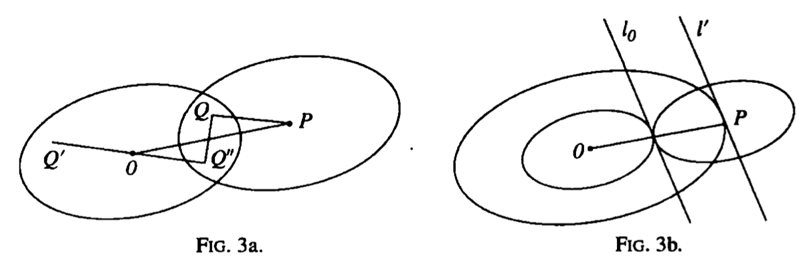

<head>
    
    
</head>

# Table of Contents

1.  [Minkowski定理的证明](#orgfa14da2)

序为n的Farey系列 $ \\Im_ {n} $是在0和1之间不可约的分数递增序列，其分母不超过n。则h / k 属于 $ \\Im_ {n} $如果

$ 0 \\le h \\le k \\le n, \\qquad (h, k) = 1 $

0和1之间包含 $ \\frac{0}{1}, \\frac{1}{1} $。例如，$ \\Im_ {5} $为

$ \\frac{0}{1}, \\frac{1}{5}, \\frac{1}{4}, \\frac{1}{3}, \\frac{2}{5}, \\frac{1}{2}, \\frac{3}{5}, \\frac{2}{3}, \\frac{3}{4}, \\frac{4}{5}, \\frac{1}{1} $

**定理** 如果 $ h / k, h^{\\prime} / k^{\\prime} $是 $ \\Im_ {n} $中两个连续的项，则 

$ kh^{\\prime} - hk^{\\prime} = 1 $

**定理** 如果 $ h / k, h^{\\prime \\prime} / k^{\\prime \\prime}, h^{\\prime} / k^{\\prime} $是 $ \\Im_ {n} $中三个连续的项，则

$ \\frac{h^{\\prime \\prime}}{k^{\\prime \\prime}} = \\frac{h + h^{\\prime}}{k + k^{\\prime}} $

**定理** 如果 $ h / k, h^{\\prime} / k^{\\prime} $是 $ \\Im_ {n} $中两个连续的项，则

$ k + k^{\\prime} > n $

则它们的中位数

$ \\frac{h + h^{\\prime}}{k + k^{\\prime}} $

在区间

$ (\\frac{h}{k}, \\frac{h^{\\prime}}{k^{\\prime}}) $

**定理** 如果n > 1，则 $ \\Im_ {n} $中连续两项没有相同的分母

**Minkowski的一个定理** 如果P和Q是 $ \\Lambda $的点，$ P^{\\prime} $和 $ Q^{\\prime} $是P和Q关于原点的对称点，且我们添加平行定理的平行四边形J三个平行基于 $ OQ, OP^{\\prime} $、基于 $ OP^{\\prime}, OQ^{\\prime} $、基于$ OQ^{\\prime}, OP $，我们获得一个平行四边形K其中心是原点，面积 $ 4 \\delta $是J的4倍。如果 $ \\delta $有值1（它的至少可能值）有 $ \\Lambda $的点在K的边界上，但除了O，都在内部。如果 $ \\delta > 1 $，则有 $ \\Lambda $的点，不是O，在K内部。这是著名的Minkowski定理的一个特殊例子，其断言拥有相同的属性，不只是任意平行四边形对原点对称，而且凸区域跟原点对称

一个开放的区域R是一个点的集合有属性(1) 如果P属于R，则平面的所有点有效靠近P的属于R，(2)R的任意两点被一个完全在R中连续的曲线相交。我们可表达(1)为对R中任意点是R中的内点。这样圆的内部或一个平行四边形是一个开放区域。R的边界C是点集，其是R的限制点但不属于R。这样一个圆的边界是它的周长。一个闭区域 $ R^{* } $是一个开区域R及其边界。我们只考虑有界区域

有凸区域的两个自然定义，其显示是等价的。首先，我们可说R（或 $ R^{* } $）是凸的如果R的任意弦上的每个点，例如，任意线交R的两个点，属于R。第二，我们可说R（或$ R^{* } $）是凸的如果它可能，通过C的每个点P，画至少一条线l使得整个R位于l的一边。这样一个圆和一个平行四边形是凸的。对圆，l是P点的切线，而对平行四边形l是除了顶点的一条边

容易证明两个定义相当。假设第一个R是凸的根据第二个定义，则P和Q属于R，且PQ的一个点S不属于。则有C的一个点T在PS上，且一条线通过T整个离开R的一条边；因此所有点有效靠近P或Q属于R，这是矛盾的

第二，假设R是凸的根据第一个定义且P是C的一个点；考虑集合L线交P到R的点。如果$ Y_ {1}, Y_ {2} $是R的点，且Y是 $ Y_ {1}Y_ {2} $的一个点，则Y是R的一个点且PY是L的一条线。因此有一个角APB，属于L。如果 $ APB > \\pi $，则有R上的点D, E使得DE穿过P点，P属于R不属于C，矛盾。因此 $ APB \\le \\pi $。如果 $ APB = \\pi $，则AB是一条线l，如果 $ APB < \\pi $，则任意线穿过P，在角之外，是一条线

**定理（Minkowski定理）** 任意对O对称的凸区域R，且面积大于4，包含不同于O的 $ \\Lambda $点

# Minkowski定理的证明

**定理** 假设 $ R_ {O} $是包含O的一个开放区域，$ R_ {P} $是congruent且对 $ \\Lambda $的任意点P有相似区域，且区域 $ R_ {P} $互相不覆盖。则 $ R_ {O} $面积不超过1

如果 $ R_ {O} $是平方，边界为线 $ X = \\pm \\frac{1}{2}, y = \\pm \\frac{1}{2} $，则 $ R_ {O} $的面积为1，且区域$ R_ {P} $，及它们的边界，覆盖平面。我们将给出精确地证明如下

假设 $ \\Delta $是 $ R_ {O} $的面积，且A是从O到点 $ C_ {O} $的最大距离；且我们考虑 $ (2n+1)^{2} $区域 $ R_ {P} $对应 $ \\Lambda $的点，其坐标不大于n。所有这些区域位于平方其边平行于坐标轴，且从O有距离n + A。因此（因为区域不覆盖）

$ (2n+1)^{2} \\Delta \\le (2n+2A)^{2}, \\qquad \\Delta \\le \\left(1 + \\frac{A - \\frac{1}{2}}{n + \\frac{1}{2}} \\right)^{2} $

当n趋于无穷时我们有结果

现在证明Minkowski定理是容易的，Minkowski本人给出了两个证明，基于凸性的两个定义

(1)对第一个定义，假设 $ R_ {O} $关于O压缩R到它线性维度的结果。则 $ R_ {O} $的面积大于1，这样之前定理的两个 $ R_ {P} $区域覆盖，有一个lattice点P使得 $ R_ {O}, R_ {P} $覆盖。设Q（下图3a）为 $ R_ {O}, R_ {P} $公共的点，如果$ OQ^{\\prime} $相等且平行于PQ，且 $ Q^{\\prime \\prime} $是O中 $ Q^{\\prime} $的象，则 $ Q^{\\prime} $，且因此 $ Q^{\\prime \\prime} $，位于 $ R_ {O} $中；且因此，通过凸性的定义，$ QQ^{\\prime} $的中点位于 $ R_ {O} $中。但该点是OP的中点，且因此P在R中

