<head>
    
    
</head>

# Table of Contents

1.  [Algorithm](#orga3f15f9)
2.  [Review](#orgb05a84a)
    1.  [物理输出](#org7184b40)
    2.  [物理输入](#org883cb70)
    3.  [物理输入交互](#orga072c6d)
3.  [Tips](#org05c2d1a)
    1.  [简介](#org6d8aaa2)
        1.  [直接的清理排列和直接的清理数](#org24cd5a7)
        2.  [普通清理排序和普通清理数](#org873a7ff)
        3.  [背景](#org48e3d33)
        4.  [主要的结果](#org5593c49)
    2.  [预备知识](#org51524df)
        1.  [分区和卡塔兰数](#org5b5d0d0)
        2.  [图表表示排序](#org97a2c12)
    3.  [缩减和漂亮的双射](#org46d2d93)
        1.  [类型1的缩减](#org9be5819)
        2.  [类型2的缩减](#orgf61ff93)
        3.  [类型3的缩减](#orgc92b6ac)
        4.  [漂亮的双射](#org84e5531)
4.  [Share](#orga4efb0b)

# Algorithm

Super Pow: <https://leetcode.com/problems/super-pow/>

<https://dreamume.medium.com/leetcode-372-super-pow-84351cb4ca59>

# Review

数字化波浪指导

<https://ccrma.stanford.edu/~jos/pasp/Digital_Waveguides.html>

一个（无损）数字化波浪指导被定义为在某个阻抗R上的一个双向延迟线，如下图显示了一个数字化波浪指导

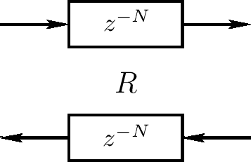

每个延迟线包含一个采样声学旅行波浪。然而，因为我们现在有一个双向延迟线，我们有两个旅行波浪，一个在左一个在右。它在1747年已知一个理想弦的摆动可被描述为两个旅行波浪在相反方向上的和。这样，当单个延迟线可模型为一个声学平面波浪，一个双向延迟线（一个数字化波浪指导）可模型为任意一维线性声学系统比如一个小提琴弦、单簧管内空间、笛管、长笛管等。当然，在真实的声学弦和孔中，1D波浪指导有一些损失和消散，这样我们将需要在数字化波浪指导中的一些过滤来获得一个精确的这样一个物理模型的系统。波浪阻抗R需要用来连接数字化波浪指导到其他物理模拟（比如另一个数字化波浪指导或有限微分模型）

## 物理输出

物理变量（力，压力、速度）通过统合旅行波浪部分和获得，如下图，更精确的在下下图

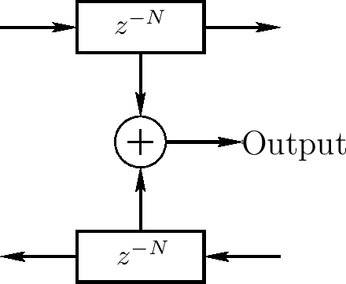

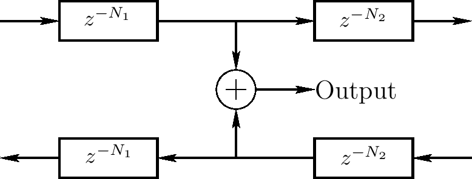

理解在数字化波浪指导中的两个旅行波浪很重要，其现在是一个更加一般化声学摆动的部分。物理波浪摆动通过左和右旅行波浪的和获得。一个旅行波浪自身是延迟线的一个不再视为物理的除非反向延迟线的信号为零。旅行波浪模拟是很高效的，但不容易估计真实世界的度量，除了当旅行波浪部分的某个方向为零

注意旅行波浪部分不是必须唯一的。例如，我们可添加一个常量到右向波浪且从左向波浪中减掉这个常量不影响（物理）和。然而，1D旅行波浪部分被波浪指导上两个线性独立物理变量唯一指定，比如位置和速度（摆线）或压力和速度（声学管）

## 物理输入

一个数字化波浪指导输入信号对应对1D广播媒介的扰动。例如，一个摆线被这样的外部扰动推或拉。扰动的结果是在输入点左右的波浪广播。通过物理对称，左右广播扰动的振幅是相等的。如果扰动和已经穿过该点（理想情况）的叠加，则它是一个添加输入，如下图

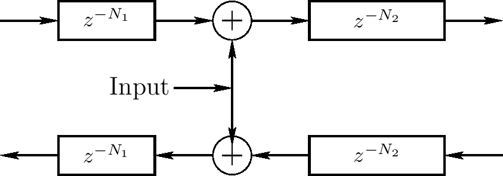

在实际真实情况下，物理驱动输入不只叠加驱动系统的当前状态。有一个和当前系统状态某些程度的交互（它不是零），将在后面的章节讨论。注意相似地没有理想的输出。实际物理输出必须表现为系统的某种加载（能量必须提取）。叠加输入和非加载输出通常在实际世界系统中估计是理想的。当然，在虚拟世界中，它们没有问题 - 事实上，它们更容易实现且很有效

## 物理输入交互

下图显示输入信号的一般情况，在波浪指导上一个点的系统状态的交互。因为交互是物理的，它只依赖输入状态（旅行波浪部分）和驱动输入信号

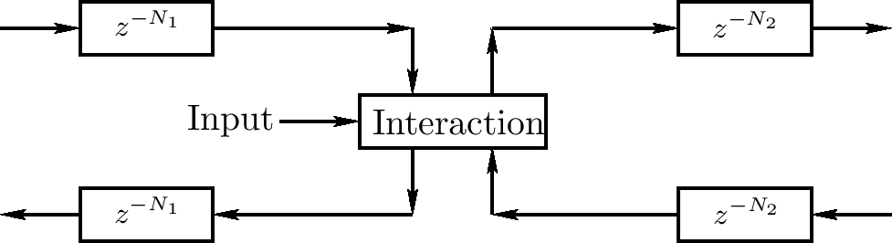

一个不太一般但通常统计的情况如下图，这种情况需要输出搅动从左到右平均搅动，且它把进入波浪的和产生输出波浪

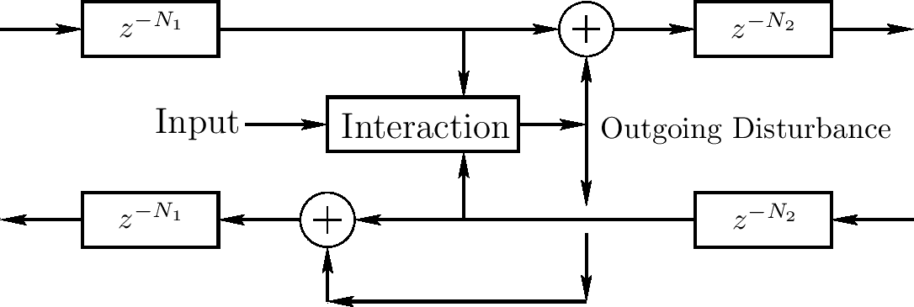

下图显示一个在一般化下的缩减 - 也通常统计 - 交互只依赖模拟物理变量的振幅（比如弦速度或偏移）。输入振幅作为输入旅行波浪部分的和。我们将统计这个自然的例子在后面的章节中。它提供物理模拟的真实模型比如吉他

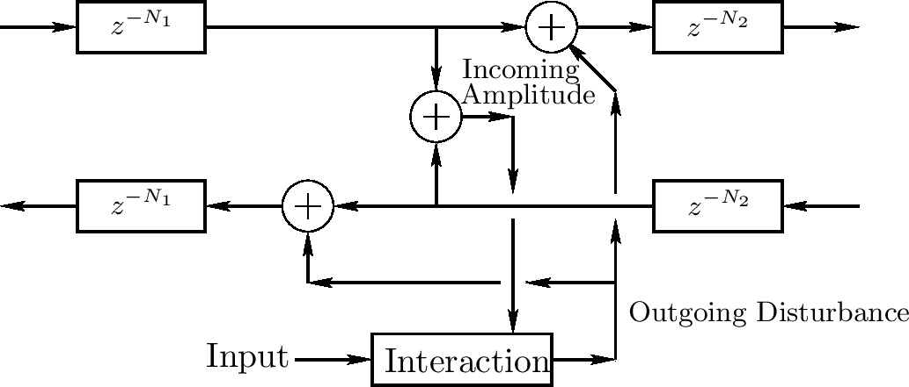

如果一个输出信号想要这个精确的点，它可被计算作为输入振幅加上两倍输出搅动信号（相等于两个输出延迟线的输入的和）

注意如上的例子所有包括的波浪指导激活在单个球形点上。当这个可给出一个有效的好的估计物理现实在许多应用程序中，应该也考虑激活扩散在多个空间采样（只两个）

我们将在后面章节更系统地开发数字化波浪指导模型话题，本节只是一个高层概括。

# Tips

Ménage Numbers and Ménage Permutations

<https://www.emis.de/journals/JIS/VOL18/Li2/li51.pdf>

## 简介

### 直接的清理排列和直接的清理数

直接清理问题询问在一个线性排列桌上排列n对男女对使得男女交替且没有女士挨着她的合作者

我们称一个排序 $ \\pi \\in S_ {n} $是一个直接清理排序如果 $ \\pi(i) \\ne i, \\pi(i) \\ne i + 1, 1 \\le i \\le n $。使用 $ V_ {n} $记为 $ S_ {n} $中直接清理排序数。我们称 $ V_ {n} $为第n个直接清理数

直接清理问题相当于找到 $ V_ {n} $。对桌子的座位标记为 $ 1, 2, \\ldots, 2n $。男士坐在偶位数女士坐奇位数。设 $ \\pi $为排序使得在 $ 2i $位置的男士是 $ 2 \\pi(i) - 1 $女士的合作者，$ 1 \\le i \\le n $。则，直接清理问题的需求相当于条件 $ \\pi(i) $不是i也不是i + 1, $ 1 \\le i \\le n $

### 普通清理排序和普通清理数

普通清理问题询问在一个圆桌上排列n对男女使得男女交替入座，但没有女士挨着她的合作者

我们称一个排序 $ \\pi \\in S_ {n} $为一个普通清理排序如果 $ \\pi(i) \\ne i, \\pi(i) \\not \\equiv i + 1 \\, (mod \\, n), 1 \\le i \\le n $。使用 $ U_ {n} $来记 $ S_ {n} $中普通清理排序的个数。我们称 $ U_ {n} $为第n个普通清理数

普通清理问题等于找到 $ U_ {n} $。对桌子的座位标记为 $ 1, 2, \\ldots, 2n $。让男士坐在偶数位上，女士在奇数位。设 $ \\pi $为排序使得在2i位置的男士是位于 $ 2 \\pi(i) - 1 $位置上女士的合作者，$ 1 \\le i \\le n $。则，普通清理问题的需求等同于对 $ 1 \\le i \\le n, \\pi(i) $不是i或者i + 1 (mod n)

为了方便我们把空排列 $ \\pi_ {\\emptyset} \\in S_ {0} $视为直接清理排序和普通清理排序，即 $ U_ {0} = V_ {0} = 1 $

### 背景

Lucas首先提出找普通清理数的问题。Touchard首次找到如下直接公式。Kaplansky和Riordan也证明了一个普通清理数的直接公式。对其他清理数的早期工作，我们指导有兴趣的读者注意Kaplansky的工作和Moser与Wyman的论文和其里的引用。在更多最新的论文中，有一些使用双射的办法学习清理数。例如，Canfield和Wormald使用图来处理问题。如下清理数的公式很有名：

$ U_ {m} = \\sum^{m}_ {k=0} (-1)^{k} \\frac{2m}{2m-k} {2m - k \\choose k} (m-k)! \\qquad (m \\ge 2) $

$ V_ {n} = \\sum^{n}_ {k=0} (-1)^{k} {2n - k \\choose k} (n - k)! \\qquad (n \\ge 0 ) $

特别地，Bogart和Doyel的有趣方法也包含引出定理

我们标签生成函数

$ \\sum^{\\infty}_ {n=0} U_ {n}x^{n} = x + \\frac{1-x}{1+x} \\sum^{\\infty}_ {n=0} n!(\\frac{x}{(1+x)^{2}})^{n} $

等效于定理

本文的目的是学习直接和普通清理排序的组合结构且使用这些结构来证明一些直接和普通清理数的公式。我们也给出后面定理的一个分析证明

### 主要的结果

设 $ C_ {k} $为第k个卡特兰数

$ C_ {k} = \\frac{(2k)!}{k! (k+1)!} $

且 $ c(x) = \\sum^{\\infty}_ {k=0} c_ {k}x^{k} $。我们第一个主要结果是如下的定理

**定理1**

$ \\sum^{\\infty}_ {n=0} n!x^{n} = \\sum^{\\infty}_ {n=0}V_ {n}x^{n}c(x)^{2n+1} $

$ \\sum^{\\infty}_ {n=0} n!x^{n} = c(x) + c^{\\prime} \\sum^{\\infty}_ {n=1}U_ {n}x^{n}c(x)^{2n-2} $

我们第二个主要结果通过数的循环统计直接和普通清理排序

对 $ k \\in \\mathbb{N} $，使用 $ (\\alpha)_ {k} $来记 $ \\alpha(\\alpha + 1)\\cdots (\\alpha + k - 1) $。定义 $ (\\alpha)_ {0} = 1 $。对 $ k \\le n $，使用 $ C^{k}_ {n} (D^{k}_ {n}) $记为在k循环的 $ S_ {n} $中直接（普通）清理排序个数

**定理2**

$ 1 + \\sum^{\\infty}_ {n=1} \\sum^{n}_ {j=1} C^{j}_ {n} \\alpha^{j}x^{n} = \\sum^{\\infty}_ {n=0} (\\alpha)_ {n} \\frac{x^{n}}{(1+x)^{n} (1 + \\alpha x)^{n+1}} $

$ 1 + \\sum^{\\infty}_ {n=1} \\sum^{n}_ {j=1} D^{j}_ {n} \\alpha^{j} x^{n} = \\frac{x + \\alpha x^{n}}{1 + x} + (1 - \\alpha x^{2}) \\sum^{\\infty}_ {n=0} (\\alpha)_ {n} \\frac{x^{n}}{(1+x)^{n+1} (1+ \\alpha x)^{n+1}} $

## 预备知识

对 $ n \\in \\mathbb{N} $，我们使用[n]来记 $ \\{1, \\ldots, n\\} $，定义[0]为 $ \\emptyset $

**定义 3** 假设n > 0且 $ \\pi \\in S_ {n} $，如果 $ \\pi(i) = i + 1 $，则我们称 $ \\{i, i+1\\} $为 $ \\pi $的连续。如果 $ \\pi(i) \\equiv i + 1 \\; (mod \\; n) $，则我们称 $ \\{i, \\pi(i) \\} $为 $ \\pi $的一个一般化连续

### 分区和卡塔兰数

假设n > 0。一个[n]的分区 $ \\epsilon $是[n]的不相交子集的收集，其并为[n]。我们称每个子集为 $ \\epsilon $的一个块。我们也描述了一个分区作为一个相等的关系：$ p \\sim_ {\\epsilon} q $当且仅当p和q属于 $ \\epsilon $的相同块

如果一个分区 $ \\epsilon $满足对任意 $ p \\sim_ {\\epsilon} p^{\\prime} $且 $ q \\sim_ {\\epsilon} q^{\\prime}, p < q < p^{\\prime} < q^{\\prime} $意味着 $ p \\sim_ {\\epsilon} q $；则我们称 $ \\epsilon $一个非交叉分区

对 $ n \\in \\mathbb{N} $，假设 $ \\epsilon = \\{V_ {1}, \\ldots, V_ {k}\\} $是[n]的一个非交叉分区且 $ V_ {i} = \\{a^{i}_ {1}, \\ldots, a^{i}_ {j_ {i}} \\}, a^{i}_ {1} < \\cdots < a^{i}_ {j_ {i}} $。则，$ \\epsilon $包含一个排序 $ \\pi \\in S_ {n}：\\pi(a^{i}_ {r(i)}) = a^{i}_ {r(i)+1}, 1 \\le r(i) \\le j_ {i} - 1 $且 $ \\pi(a^{i}_ {j_ {i}}) = a^{i}_ {1} $。容易看到不同的非交叉分区有不同的排序

**引理 4** 对 $ n \\in \\mathbb{N} $，有 $ C_ {n} $个[n]的不相交分区

卡塔兰数的生成函数是

$ c(x) = \\sum^{\\infty}_ {n=0} C_ {n}x^{n} = \\frac{1 - \\sqrt{1 - rx}}{2x} $

也可通过递归定义卡塔兰数

$ C_ {n+1} = \\sum^{n}_ {k=0} C_ {k}C_ {n-k} $

初始条件 $ C_ {0} = 1 $

**引理 5** 卡塔兰数的生成函数c(x)满足

$ c(x) = \\frac{1}{1 -xc(x)} = 1 + xc^{2}(x) \\qquad \\text{且} \\frac{c^{3}(x)}{1 - xc^{2}(x)} = c^{\\prime}(x) $

证明 第一个公式是著名的，通过第一个公式

$ c^{\\prime}(x) = c^{2}(x) + 2xc(x)c^{\\prime}(x) = \\frac{c^{2}(x)}{1 - 2xc(x)} $

这样，为证明第二个公式，我们只需要显示 $ \\frac{c(x)}{1 - xc^{2}(x)} = \\frac{1}{1 - 2xc(x)} $，也就是 $ c(x) - 2xc^{2}(x) = 1 - xc^{2}(x) $，这从第一个公式即可得之

### 图表表示排序

1.  水平类型的图表

    对n > 0和 $ \\pi \\in S_ {n} $，我们使用一个水平类型的图表来表示 $ \\pi $。在一条水平线上画n个点。从左到右的数字 $ 1, \\ldots, n $代表点。对每个 $ i \\in [n] $，我们画一个直接的弧线从i到 $ \\pi{i} $。排序唯一确定图表。例如，如果 $ \\pi = (1, 5, 4)(2)(3)(6) $，则它的图表为
    
    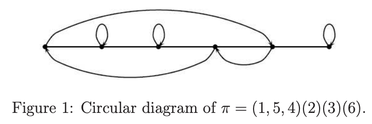

2.  圆类型的图表

    对n > 0和 $ \\pi \\in S_ {n} $，我们使用一个圆类型的图表来表示 $ \\pi $。在一个圆上统一分布的画n个点。指定一个点代表1，其他点以反时钟顺序代表数字 $ 2, \\ldots, n $。对每个 $ i \\in [n] $，我们画一个直接的弧线从i到 $ \\pi{i} $。排序唯一确定图表。例如，如果 $ \\pi = (1, 5, 4)(2)(3)(6) $，则它的图表为
    
    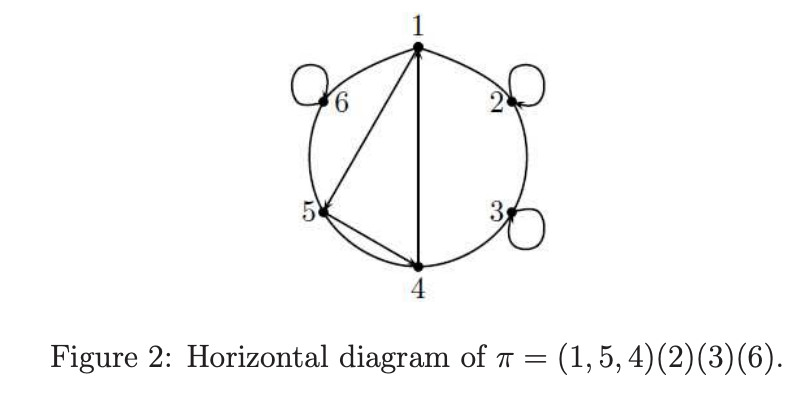

## 缩减和漂亮的双射

### 类型1的缩减

直观来说，为执行一个类型1的缩减是从一个排序中移除一个固定点。假设 $ n \\ge 1, \\pi \\in S_ {n}, \\pi(i) = i $。定义 $ \\pi^{\\prime} \\in S_ {n-1} $使得

$ \\pi^{\\prime}(j) = \\left \\{ \\begin{array}{lllll} \\pi(j), & if & j < i & and & \\pi(j) < i; \\\\ \\pi(j) - 1, & if & j < i & and & \\pi{j} > i; \\\\ \\pi(j+1), & if & j \\ge i & and & \\pi(j+1) < i; \\\\ \\pi(j+1) - 1, & if & j \\ge i & and & \\pi(j+1) > i; \\end{array} \\right. $

n > 1。当n = 1时，定义 $ \\pi^{\\prime} $为 $ \\pi_ {\\emptyset} $。如果我们用图表表示 $ \\pi $，消除i上的点和连接到该点的弧线；则我们获得 $ \\pi^{\\prime} $的图表。我们称这样通过移除一个固定点来获得一个新的排序的过程为类型1的缩减。例如，如果

$ \\pi = (1, 5, 6, 4)(2)(3)(7) \\in S_ {7} $

则通过移除固定点3我们获得 $ \\pi^{\\prime} = (1, 4, 5, 3)(2)(6) \\in S_ {6} $

### 类型2的缩减

直观来说，类型2的缩减是通过和后续一起 $ \\{k, k+1\\} $。假设 $ n \\ge 2, \\pi \\in S_ {n}, \\pi(i) = i + 1 $，定义 $ \\pi^{\\prime} \\in S_ {n-1} $使得

$ \\pi^{\\prime}(j) = \\left\\{ \\begin{array}{lllll} \\pi(j), & if & j < i & and & \\pi(j) \\le i; \\\\ \\pi(j) - 1, & if & j < i & and & \\pi(j) > i + 1; \\\\ \\pi(j + 1), & if & j \\ge i & and & \\pi(j + 1) \\le i; \\\\ \\pi(j + 1) - 1, & if & j \\ge i & and & \\pi(j+1) > i + 1 \\end{array} \\right. $

如果我们用水平类型的图表代表 $ \\pi $，除去从i到i + 1的弧线，且处理对应i和i + 1的点；然后，我们获得 $ \\pi^{\\prime} $的图表。我们称通过粘合一个后续获得一个新的排序的过程为类型2的缩减。例如，如果

$ \\pi = (1, 5, 6, 4)(2)(3)(7) \\in S_ {7} $

通过粘合5和6，我们获得 $ \\pi^{\\prime} = (1, 5, 4)(2)(3)(6) \\in S_ {6} $

### 类型3的缩减

直观来说，执行类型3的缩减即为粘合一个一般化的后续 $ \\{k, k + 1 \\; (mod \\; n) \\} $。假设 $ n \\ge 1, \\pi \\in S_ {n}, \\pi(i) \\equiv i + 1 \\; (mod \\; n) $，定义 $ \\pi^{\\prime} $为类型2相同，当 $ i \\ne n $时，当$i = n > 1 $，定义 $ \\pi^{\\prime} $为

$ \\pi^{\\prime}(j) = \\left\\{ \\begin{array}{lll} \\pi(j), & if & j \\ne \\pi^{-1}(n); \\\\ 1, & if & j = \\pi^{-1}(n) \\end{array} \\right. $

当i = n = 1时，定义 $ \\pi^{\\prime} = \\pi_ {\\emptyset} $。如果我们通过循环类型图表展示 $ \\pi $，去除i到 $ i + 1 \\; (mod \\; n) $的弧，把i和 $ i + 1 \\; (mod \\; n) $的点粘合且适合地统计点；则，我们获得$ \\pi^{\\prime} $的图表。我们称粘合一个一般化后续获得一个新的排序的过程为类型3的缩减。例如，如果

$ \\pi = (1, 5, 6, 7)(2)(3)(4) \\in S_ {7} $

通过粘合1和7，我们获得 $ \\pi^{\\prime} = (1, 5, 6)(2)(3)(4) \\in S_ {6} $

### 漂亮的双射

假设 $ n \\ge 1 $且f是从[n]到 $ \\{2, \\ldots, n + 1 \\} $的双射。我们可通过水平类型的图表作为排序表示f。双射唯一地决定图表。如果f有一个固定点或存在i使得f(i) = i + 1，则我们可在f上执行类型1或类型2缩减。在后一种情况下，我们也可称 $ \\{i, i+1\\} $是f的一个后续。我们可通过一系列缩减缩减f为一个无固定点和没有后续的双射。容易看到双射不依赖缩减的顺序

如下图表显示通过粘合2和3在双射上进行类型2的缩减

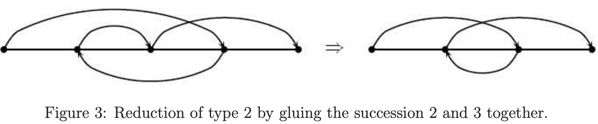

**定义 6** 假设f是从[n]到 $ 2, \\ldots, n+1 \\} $的一个双射。如果存在一系列的类型1或类型2的缩减，缩减f到简单的双射 $ 1 \\mapsto 2 $，则我们称f为一个漂亮的双射

假设 $ \\pi \\in S_ {n} $且p是 $ \\pi $的一个点。我们可用一个从[k]到 $ \\{ 2, \\ldots, k +1 \\} $的双射f替代p且获得一个新的排序 $ \\pi^{\\prime} \\in S_ {n+k} $，步骤如下：

(1) 用水平图表表现 $ \\pi $

(2) 在p之前添加一个点和一个从q到p的弧

(3) 用一个从 $ \\pi^{-1}(p) $到q的弧替代从 $ \\pi^{-1}(p) $到p的弧

(4) 通过图表的f替换从q到p的弧

例如，如果 $ \\pi $，p和f如下

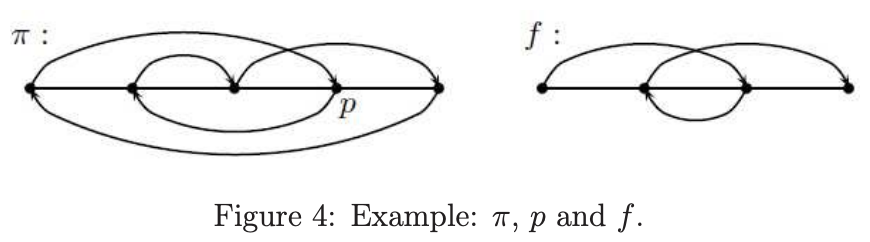

然后，我们获得新的排序如下

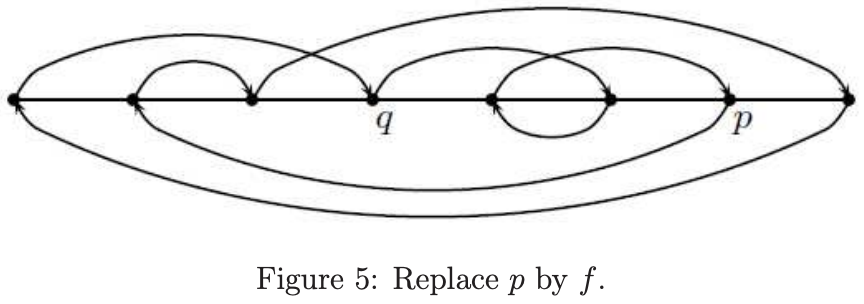

容易看到，通过漂亮双射的定义，如果f是一个漂亮的双射，则我们可缩减 $ \\pi^{\\prime} $为 $ \\pi $：首先，我们可缩减 $ \\pi^{\\prime} $到上述步骤(3)，因为f是漂亮的双射；然后，通过粘合p和q，我们获得 $ \\pi $

对排序 $ \\pi $的圆表，我们也可使用步骤(2) - (4)获得一个新的排序。然而，为获得排序 $ \\pi^{\\prime} $，我们需要在新的图表中指定一个点代表数1

*引理* 对 $ n \\ge 2 $，设 $ a_ {n} $为从[n-1]到 $ \\{2, \\ldots, n \\} $的漂亮双射的数。定义 $ a_ {1} = 1 $。$ a_ {n} $的生成函数满足如下等式：

$ g(x) := a_ {1}x + a_ {2}x^{2} + a_ {3}x^{3} + \\cdots  = xc(x) $

$ c(x) = \\sum^{\\infty}_ {n=0} C_ {k}x^{k} $是卡塔兰数的生成函数

证明 假设 $ n \\ge 2 $，f是从[n-1]到 $ \\{2, \\ldots, n\\} $的漂亮双射使得f(1) = k

假设p < k。我们声称f(p) < k。如果不是，假设q = f(p) > k。则 $ \\{1, k\\} $和 $ \\{p, q\\} $都不是后续。考虑f的水平图表，如果我们在f上执行一个类型1或类型2的缩减，则移除的弧不是从1到k也不是从p到q。通过归纳，不管我们执行多少次缩减，总是存在一个从1到 $ k^{\\prime} $的弧和一个从 $ p^{\\prime} $到 $ q^{\\prime} $的弧使得 $ p^{\\prime} < k^{\\prime} < q^{\\prime} $。即我们不能缩减双射到 $ 1 \\mapsto 2 $。这样得证

这样，在f下$ \\{2, \\ldots, k-1\\} $的象必须是 $ \\{2, \\ldots, k-1 \\} $，且因此，f下 $ \\{k, \\ldots, n-1\\} $的象必须是 $ k+1, \\ldots, n $

这意味着 $ f \|_ {2, \\ldots, k-1} $有和排序 $ \\tau \\in S_ {k-2} $一样的图表且我们可缩减 $ \\tau $到 $ \\pi_ {\\emptyset} $。这也意味着 $ f \|_ {k, \\ldots, n-1} $有和从[n-k]到 $ \\{2, \\ldots, n-k+1\\} $的漂亮双射一样的图表。通过之前的引理，从[n-1]到 $ \\{2, \\ldots, n \\} $的双射数使得f(1) = k为 $ C_ {k-2}a_ {n-k+1} $。让k变化，我们获得 $ a_ {n} = \\sum^{n}_ {k=2}C_ {k-2}a_ {n-k+1} $

$ (C_ {n})_ {n \\ge 0} $和 $ (a_ {n+1})_ {n \\ge 0} $有相同的递归关系且相同的初始化条件 $ C_ {0} = a_ {1} = 1 $，这样， $ C_ {n} = a_ {n+1} (n \\ge 0) $。因此g(x) = xc(x)

# Share

Sudoku

<https://crypto.stanford.edu/pbc/notes/zdd/sudoku.html>

理论上，我们可扩展我们的toy例子来表达sudoku迷宫。我们有9种可能的数字在81个方格上。对每个迷宫，我们找到一个ZDD代表所有集合使每个数字在方块中只出现一次。这些ZDD的交产生一个ZDD A

我们然后找到ZDD代表每个soduku的条件。例如，我们将需要ZDD包含所有集合只有一个1在头行。我们交这些A来产生一个ZDD B代表在一个空白sudoku迷宫中所有有效方法的家族

不幸地是，有效soduku解决方案的家族是一个家族好的例子，其难以用ZDD表达。不管我们如何排列元素，一些低数字元素成员关系将极大地影响许多高数字元素的成员关系，使得ZDD将包含太多节点需要计算

BDD乘积可被显示需要许多节点不管是什么顺序。这也适用于sudoku和latin方块。即使有效顺序存在，找到它们也是NP-hard的

我们可希望729个变量足够被ZDD处理。假设我们用明显的路由，这样81 r + 9 c + d代表数字d在r行c列。开始时承诺：它容易写成一个731节点ZDD代表所有9x9网格的集合，每个数字在盒子中只出现一次。接着，添加81个条件需要每个数字在每行只出现一次，给出一个ZDD大小为20738

添加81个条件需要每个数字在所有9个3x3区域只出现一次增加ZDD大小到2870264个节点（ $ 852267027045566343530110865375232000 = 9!^{3}(9^{3})^{3}9^{6} $个解决方案满足条件）

但每列一个数字的规则添加一个不可管理数字的节点。有时一个单列限制两个节点，且有81个节点。例如，在需要数字1出现在第1列1次，ZDD需要4746198个节点（有 $ 378785345353585041568938162388992000 = 4 \\cdot 10^{3}9^{14}8^{15}7^{6} $个解决方案）

如果我们有一个部分解决的迷宫，我们可开始于一个ZDD代表集合家族包含给定的条目，且灵活计算之上描述的交来找到所有解决方案的集合，但我们也可使用其他方法比如dance links

ZDD更适合问题其元素只影响一些临近的其他元素，即我们大部分时间可统计这些元素，一个给定元素的成员关系只对临近元素的成员关系相关

