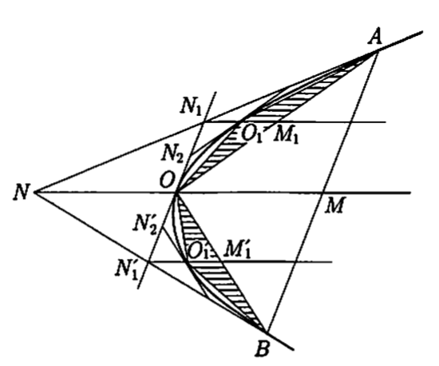
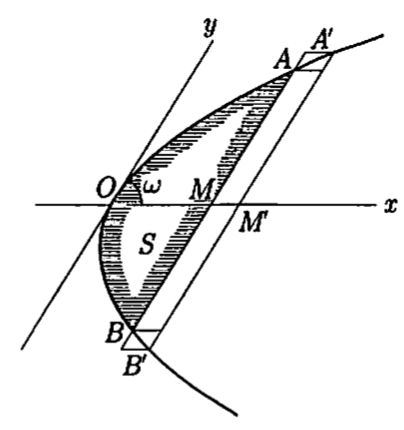
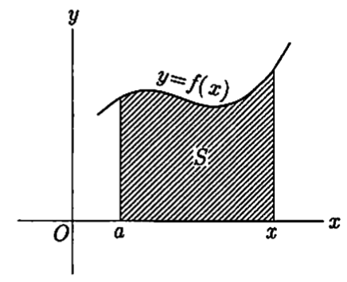

<head>
    
    
</head>

# Table of Contents

1.  [古代的求积法](#org610e933)
2.  [微分法之后的求积法](#orgb6d6c35)
3.  [定积分](#org216adc8)

# 古代的求积法

特殊的曲面曲线的求积法自古就为人所知。阿基米德以计算球面及体积闻名，阿基米德还设计了如下的方法，用一根弦限制的抛物线碎片很好地计算出了面积

AB是抛物线的弦，OM是通过它中点的直径，那么抛物线和弦所围成的面积S是三角形OAB面积T的 $ \\frac{4}{3} $，即

$ S = \\frac{4}{3} T $

用现代的坐标法，OM为x轴，O处的切线为y轴，抛物线的方程式为 $ y^{2} = cx $，OM = a，AB的极点N为(-a, 0)，即O为NM的中点，弦AB与两端的切线形成的三角形NAB的面积是OAB的两倍

同样的关系对弦OA、OB也成立，上图 $ O_ {1}M_ {1} = \\frac{1}{2} N_ {1}M_ {1} = \\frac{1}{4} OM $。则 $ \\bigtriangleup O O^{\\prime}_ {1}B = \\frac{1}{4} \\bigtriangleup OBM $。现在 $ \\bigtriangleup OO_ {1}A, \\bigtriangleup OO^{\\prime}_ {1}B $的面积的和为 $ T_ {1} $

$ T_ {1} = \\frac{1}{4} T $

同样的弦 $ O_ {1}A, OO_ {1}, OO^{\\prime}_ {1}, O^{\\prime}_ {1}B $为底做同样的三角形，这样的面积的和 $ T_ {2} $

$ T_ {2} = \\frac{1}{4} T_ {1} = \\frac{1}{4^{2}} T $

继续这样的操作，可做出 $ T, T_ {1}, T_ {2}, \\ldots $，这样的面积统计得

$ S = T + \\frac{T}{4} + \\frac{T}{4^{2}} + \\cdots = T(1 + \\frac{1}{4} + \\frac{1}{4^{2}} + \\cdots) = \\frac{4}{3} T $

由于

$ T + T_ {1} + \\cdots + T_ {n-1} + T_ {n} < S < T + T_ {1} + \\cdots + T_ {n-1} + 2T_ {n} $

$ T(1 + \\frac{1}{4} + \\cdots + \\frac{1}{4^{n}}) < S < T(1 + \\frac{1}{4} + \\cdots + \\frac{1}{4^{n}} + \\frac{1}{4^{n}}) $

$ \\frac{4}{3}T(1 - \\frac{1}{4^{n+1}}) < S < \\frac{4}{3}T(1 - \\frac{1}{4^{n+1}}) + \\frac{T}{4^{n}} $

$ -\\frac{1}{3} \\cdot \\frac{T}{4^{n}} < S - \\frac{4}{3} T < \\frac{2}{3} \\cdot \\frac{T}{4^{n}} $

由于n任意，则S为 $ \\frac{4}{3} T $

这样的精确理论是希腊数学的特征之一，但在17、18世纪的近代早期数学，不得不去那里，甚至在19世纪中叶，它也被重建了。上面的阿基米德考察法在解析概论上很重要，所以让我详细说明一下。上面公式可得

$ \| S - \\frac{4}{3} T \| < \\frac{2T}{3} \\cdot \\frac{1}{4^{n}} $

这样 $ \| S - \\frac{4}{3} T \| = 0 $，从而 $ S = \\frac{4}{3} T $，这样S是T的定数，n是任意自然数。现在左边的定数写成 $ \\epsilon $，右边定数 $ \\frac{2}{3} T $用a表示，$ \\epsilon \\ge 0, a > 0, 4^{n} > n $，则

$ \\epsilon < \\frac{a}{n} $

这里 $ \\epsilon = 0 $的话，它基于以下原理

$ \\epsilon, a $为正数，$ n \\epsilon > a $成立的自然数n存在。如果我们赞同这个原则，我们从 $ \\epsilon > 0 $则有这样的n

$ \\epsilon < \\frac{a}{n}, \\text{ 从而} n \\epsilon < a $

这与阿基米德原则矛盾，则 $ \\epsilon > 0 $的假设不成立，然而 $ \\epsilon \\ge 0 $，则 $ \\epsilon = 0 $

阿基米德的原则包含在实数的连续性中，如果阿基米德原则不成立，则所有的自然数 $ n \\le \\frac{a}{\\epsilon} $。即所有的自然数的集合有界，从而这样的集合的上限为s，从而有自然数 $ s - 1 < n \\le s $，从而s < n + 1，n + 1也是自然数，这样矛盾，则不得不承认阿基米德原则

# 微分法之后的求积法

上面的求积法很巧妙，古代阿基米德开始使用，但是，它只能用于抛物线，在18世纪，这样的求积问题任何人都可以通过以下方法轻松地解决：

和之前一样，抛物线方程为

$ y^{2} = cx $

面积S为OM = x地函数S(x)，使用如下记号

$ \\bigtriangleup S = \\text{面积}(ABB^{\\prime}A^{\\prime}) $

这样的面积被 $ AB, A^{\\prime}B^{\\prime} $夹着，底为两个平行四边形面积 $ AB \\cdot \\bigtriangleup x \\cdot \\sin{\\omega} $和 $ A^{\\prime}B^{\\prime} \\cdot \\bigtriangleup x \\cdot \\sin{\\omega} $中间（AM = y）：

$ 2y \\sin{\\omega} \\cdot \\bigtriangleup x < \\bigtriangleup S < 2(y+ \\bigtriangleup y) \\sin{\\omega} \\cdot \\bigtriangleup x $

$ 2y \\sin{\\omega} < \\frac{\\bigtriangleup S}{\\bigtriangleup x} < 2y \\sin{\\omega} + 2 \\sin{\\omega} \\cdot \\bigtriangleup y $

这样 $ \\triangle x > 0 $就完了，$ \\triangle x < 0 $也一样，只是不等号改变了方向。这样 $ \\triangle x \\to 0 $时 $ \\triangle y \\to 0 $，这样

$ \\frac{dS}{dx} = 2y \\sin{\\omega} = 2 \\sin{\\omega} \\cdot \\sqrt{cx} $

然而

$ \\frac{dx^{\\frac{3}{2}}}{dx} = \\frac{3}{2} \\sqrt{x} $

这样

$ F(x) = \\frac{4}{3} \\sqrt{c} \\cdot \\sin{\\omega} \\cdot x^{\\frac{3}{2}} $

如果你把

$ \\frc{dF}{dx} = \\frac{dS}{dx}, \\qquad \\text{即} \\frac{d(F - S)}{dx} = 0 $

这样F - S为定数，x = 0时F(0) = 0, S = 0，这样定数为0，S = F。即

$ S(x) = \\frac{4}{3} \\sqrt{c} \\cdot \\sin{\\omega} \\cdot x^{\\frac{3}{2}} $

这就是要求的面积。这样同阿基米德的计算结果一致，实际上

$ \\begin{aligned} S(x) &= \\frac{4}{3} \\cdot \\sqrt{cx} \\cdot x \\sin{\\omega} = \\frac{4}{3} yx \\sin{\\omega} = \\frac{4}{3} AM \\cdot OM \\cdot \\sin{\\omega} \\\\ &= \\frac{4}{3} \\cdot \\frac{1}{2} AB \\cdot OM \\cdot \\sin{\\omega} = \\frac{4}{3} \\triangle OAB \\end{aligned} $

用这样的方法，如下图所示的曲线y = f(x)与x轴之间的两条垂线夹着的面积S与上图相同，不限于抛物线

即f(x)为连续函数的话，$ \\triangle x \\to 0 $时，$ \\triangle y \\to 0 $，则

$ \\frac{dS}{dx} = f(x) $

这样F(x)有

$ F^{\\prime}(x) = f(x) $

如果函数是

$ \\frac{d(S - F)}{dx} = 0 $

从而

$ S(x) - F(x) = C $

而x = a时S(a) = 0，则C = -F(a)。则

$ S(x) = F(x) - F(a) $

如果F(x)取自初等函数的范围，则 $ F^{\\prime}(x) $也是初等函数，为f(x)。曲线y = f(x)求相关面积，这样的F(x)有无数个，这样求积问题解决了

这是微积分发现所带来的奇迹

给定f(x)，F(x)是f(x)的导函数，$ F^{\\prime}(x) = f(x) $，F(x)被称为f(x)的原函数，使用积分符号，则

$ F(x) = \\int f(x)dx $

如果原始函数是作为初等函数获得的，则可以用一些公式获得，但是通过这样的手段

$ \\int \\frac{dx}{\\sqrt{1 - x^{4}}}, \\qquad \\int \\frac{dx}{\\sqrt{\\cos{x}}} $

找到这样一个看似简单的函数的原函数并不容易，如果是这样，是否总有一个连续函数的原函数？

前面我们用面积来得到原始函数，如果原始函数的存在很重要，那么面积的可能性也是一样的。我们谈到了面积、体积，但面积、体积意味着什么呢？

这些问题源自于19世纪以后，实现了比较安全的解析学的建立

# 定积分

解决上一节提到的问题是积分法的任务，我们想把考虑的范围放在连续函数中，但这在应用中产生了一个问题。例如，当有一些不连续点的时候，所以我们不能排除这种情况。因此，我们暂时稍微扩大考虑的范围，只假设函数的有界性

$ \\left. \\begin{array}{c\|c} \\hline f(x) = F^{\\prime}(x) & F(x) \\\\ \\hline x^{\\alpha} \\qquad (\\alpha \\ne 1) & \\frac{x^{\\alpha+1}}{\\alpha + 1} \\\\ \\frac{1}{x} \\qquad (x \\ne 0) & \\log{ \| x \| } \\\\ \\frac{1}{1+x^{2}} & \\arctan{x} \\\\ \\frac{1}{1 - x^{2}} \\qquad (x \\ne \\pm 1) & \\frac{1}{2} \\log{\| \\frac{1+x}{1-x} \| } \\\\ \\frac{1}{x^{2}-1} \\qquad (x \\ne \\pm 1) & \\frac{1}{2} \\log{ \| \\frac{x-1}{x+1} \| } \\\\ \\frac{1}{\\sqrt{1-x^{2}}} \\qquad (\| x \| < 1) & \\arcsin{x} \\\\ \\frac{1}{\\sqrt{x^{2}-1}} \\qquad (\| x \| > 1) & \\log{ \| x + \\sqrt{x^{2} - 1} \|} \\\\ \\frac{1}{\\sqrt{x^{2}+1}} & \\log{(x + \\sqrt{x^{2}+1})} \\\\ \\sqrt{1-x^{2}} \\qquad (\| x \| \\le 1) & \\frac{1}{2} (x \\sqrt{1 - x^{2}} + \\arcsin{x}) \\\\ \\sqrt{x^{2} - 1} \\qquad (\| x \| \\ge 1) & \\frac{1}{2} (x \\sqrt{x^{2} - 1} - \\log{\| x + \\sqrt{x^{2} - 1} \|}) \\\\ \\sqrt{x^{2} + 1} & \\frac{1}{2} (x \\sqrt{x^{2}+1} + \\log{(x + \\sqrt{x^{2}+1})}) \\\\ e^{x} & e^{x} \\\\ a^{x} \\qquad (a > 0, a \\ne 1) & \\frac{a^{x}}{\\log{a}} \\\\ \\sinn{x} & \\cos{x} \\\\ \\cos{x} & - \\sin{x} \\\\ \\frac{1}{\\sin^{2}{x}} & - \\cot{x} \\\\ \\frac{1}{\\cos^{2}{x}} & \\tan{x} \\\\ \\tan{x} & - \\log{ \| \\cos{x} \|} \\\\ \\cot{x} & \\lgo{ \| \\sin{x} \| } \\end{array} \\right. $
