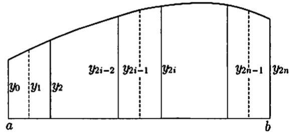

<head>
    
    
</head>

# Table of Contents

1.  [古代的求积法](#org610e933)
2.  [微分法之后的求积法](#orgb6d6c35)
3.  [定积分](#org216adc8)
4.  [Legendre球函数](#orgf9ff74b)
5.  [不定积分的计算](#orgd174de0)
6.  [定积分的近似计算](#orgc3ad6ce)

# 古代的求积法

特殊的曲面曲线的求积法自古就为人所知。阿基米德以计算球面及体积闻名，阿基米德还设计了如下的方法，用一根弦限制的抛物线碎片很好地计算出了面积

AB是抛物线的弦，OM是通过它中点的直径，那么抛物线和弦所围成的面积S是三角形OAB面积T的 $ \\frac{4}{3} $，即

$ S = \\frac{4}{3} T $

用现代的坐标法，OM为x轴，O处的切线为y轴，抛物线的方程式为 $ y^{2} = cx $，OM = a，AB的极点N为(-a, 0)，即O为NM的中点，弦AB与两端的切线形成的三角形NAB的面积是OAB的两倍

同样的关系对弦OA、OB也成立，上图 $ O_ {1}M_ {1} = \\frac{1}{2} N_ {1}M_ {1} = \\frac{1}{4} OM $。则 $ \\bigtriangleup O O^{\\prime}_ {1}B = \\frac{1}{4} \\bigtriangleup OBM $。现在 $ \\bigtriangleup OO_ {1}A, \\bigtriangleup OO^{\\prime}_ {1}B $的面积的和为 $ T_ {1} $

$ T_ {1} = \\frac{1}{4} T $

同样的弦 $ O_ {1}A, OO_ {1}, OO^{\\prime}_ {1}, O^{\\prime}_ {1}B $为底做同样的三角形，这样的面积的和 $ T_ {2} $

$ T_ {2} = \\frac{1}{4} T_ {1} = \\frac{1}{4^{2}} T $

继续这样的操作，可做出 $ T, T_ {1}, T_ {2}, \\ldots $，这样的面积统计得

$ S = T + \\frac{T}{4} + \\frac{T}{4^{2}} + \\cdots = T(1 + \\frac{1}{4} + \\frac{1}{4^{2}} + \\cdots) = \\frac{4}{3} T $

由于

$ T + T_ {1} + \\cdots + T_ {n-1} + T_ {n} < S < T + T_ {1} + \\cdots + T_ {n-1} + 2T_ {n} $

$ T(1 + \\frac{1}{4} + \\cdots + \\frac{1}{4^{n}}) < S < T(1 + \\frac{1}{4} + \\cdots + \\frac{1}{4^{n}} + \\frac{1}{4^{n}}) $

$ \\frac{4}{3}T(1 - \\frac{1}{4^{n+1}}) < S < \\frac{4}{3}T(1 - \\frac{1}{4^{n+1}}) + \\frac{T}{4^{n}} $

$ -\\frac{1}{3} \\cdot \\frac{T}{4^{n}} < S - \\frac{4}{3} T < \\frac{2}{3} \\cdot \\frac{T}{4^{n}} $

由于n任意，则S为 $ \\frac{4}{3} T $

这样的精确理论是希腊数学的特征之一，但在17、18世纪的近代早期数学，不得不去那里，甚至在19世纪中叶，它也被重建了。上面的阿基米德考察法在解析概论上很重要，所以让我详细说明一下。上面公式可得

$ \| S - \\frac{4}{3} T \| < \\frac{2T}{3} \\cdot \\frac{1}{4^{n}} $

这样 $ \| S - \\frac{4}{3} T \| = 0 $，从而 $ S = \\frac{4}{3} T $，这样S是T的定数，n是任意自然数。现在左边的定数写成 $ \\epsilon $，右边定数 $ \\frac{2}{3} T $用a表示，$ \\epsilon \\ge 0, a > 0, 4^{n} > n $，则

$ \\epsilon < \\frac{a}{n} $

这里 $ \\epsilon = 0 $的话，它基于以下原理

$ \\epsilon, a $为正数，$ n \\epsilon > a $成立的自然数n存在。如果我们赞同这个原则，我们从 $ \\epsilon > 0 $则有这样的n

$ \\epsilon < \\frac{a}{n}, \\text{ 从而} n \\epsilon < a $

这与阿基米德原则矛盾，则 $ \\epsilon > 0 $的假设不成立，然而 $ \\epsilon \\ge 0 $，则 $ \\epsilon = 0 $

阿基米德的原则包含在实数的连续性中，如果阿基米德原则不成立，则所有的自然数 $ n \\le \\frac{a}{\\epsilon} $。即所有的自然数的集合有界，从而这样的集合的上限为s，从而有自然数 $ s - 1 < n \\le s $，从而s < n + 1，n + 1也是自然数，这样矛盾，则不得不承认阿基米德原则

# 微分法之后的求积法

上面的求积法很巧妙，古代阿基米德开始使用，但是，它只能用于抛物线，在18世纪，这样的求积问题任何人都可以通过以下方法轻松地解决：

和之前一样，抛物线方程为

$ y^{2} = cx $

面积S为OM = x地函数S(x)，使用如下记号

$ \\bigtriangleup S = \\text{面积}(ABB^{\\prime}A^{\\prime}) $

这样的面积被 $ AB, A^{\\prime}B^{\\prime} $夹着，底为两个平行四边形面积 $ AB \\cdot \\bigtriangleup x \\cdot \\sin{\\omega} $和 $ A^{\\prime}B^{\\prime} \\cdot \\bigtriangleup x \\cdot \\sin{\\omega} $中间（AM = y）：

$ 2y \\sin{\\omega} \\cdot \\bigtriangleup x < \\bigtriangleup S < 2(y+ \\bigtriangleup y) \\sin{\\omega} \\cdot \\bigtriangleup x $

$ 2y \\sin{\\omega} < \\frac{\\bigtriangleup S}{\\bigtriangleup x} < 2y \\sin{\\omega} + 2 \\sin{\\omega} \\cdot \\bigtriangleup y $

这样 $ \\triangle x > 0 $就完了，$ \\triangle x < 0 $也一样，只是不等号改变了方向。这样 $ \\triangle x \\to 0 $时 $ \\triangle y \\to 0 $，这样

$ \\frac{dS}{dx} = 2y \\sin{\\omega} = 2 \\sin{\\omega} \\cdot \\sqrt{cx} $

然而

$ \\frac{dx^{\\frac{3}{2}}}{dx} = \\frac{3}{2} \\sqrt{x} $

这样

$ F(x) = \\frac{4}{3} \\sqrt{c} \\cdot \\sin{\\omega} \\cdot x^{\\frac{3}{2}} $

如果你把

$ \\frac{dF}{dx} = \\frac{dS}{dx}, \\qquad \\text{即} \\frac{d(F - S)}{dx} = 0 $

这样F - S为定数，x = 0时F(0) = 0, S = 0，这样定数为0，S = F。即

$ S(x) = \\frac{4}{3} \\sqrt{c} \\cdot \\sin{\\omega} \\cdot x^{\\frac{3}{2}} $

这就是要求的面积。这样同阿基米德的计算结果一致，实际上

$ \\begin{aligned} S(x) &= \\frac{4}{3} \\cdot \\sqrt{cx} \\cdot x \\sin{\\omega} = \\frac{4}{3} yx \\sin{\\omega} = \\frac{4}{3} AM \\cdot OM \\cdot \\sin{\\omega} \\\\ &= \\frac{4}{3} \\cdot \\frac{1}{2} AB \\cdot OM \\cdot \\sin{\\omega} = \\frac{4}{3} \\triangle OAB \\end{aligned} $

用这样的方法，如下图所示的曲线y = f(x)与x轴之间的两条垂线夹着的面积S与上图相同，不限于抛物线

即f(x)为连续函数的话，$ \\triangle x \\to 0 $时，$ \\triangle y \\to 0 $，则

$ \\frac{dS}{dx} = f(x) $

这样F(x)有

$ F^{\\prime}(x) = f(x) $

如果函数是

$ \\frac{d(S - F)}{dx} = 0 $

从而

$ S(x) - F(x) = C $

而x = a时S(a) = 0，则C = -F(a)。则

$ S(x) = F(x) - F(a) $

如果F(x)取自初等函数的范围，则 $ F^{\\prime}(x) $也是初等函数，为f(x)。曲线y = f(x)求相关面积，这样的F(x)有无数个，这样求积问题解决了

这是微积分发现所带来的奇迹

给定f(x)，F(x)是f(x)的导函数，$ F^{\\prime}(x) = f(x) $，F(x)被称为f(x)的原函数，使用积分符号，则

$ F(x) = \\int f(x)dx $

如果原始函数是作为初等函数获得的，则可以用一些公式获得，但是通过这样的手段

$ \\int \\frac{dx}{\\sqrt{1 - x^{4}}}, \\qquad \\int \\frac{dx}{\\sqrt{\\cos{x}}} $

找到这样一个看似简单的函数的原函数并不容易，如果是这样，是否总有一个连续函数的原函数？

前面我们用面积来得到原始函数，如果原始函数的存在很重要，那么面积的可能性也是一样的。我们谈到了面积、体积，但面积、体积意味着什么呢？

这些问题源自于19世纪以后，实现了比较安全的解析学的建立

# 定积分

解决上一节提到的问题是积分法的任务，我们想把考虑的范围放在连续函数中，但这在应用中产生了一个问题。例如，当有一些不连续点的时候，所以我们不能排除这种情况。因此，我们暂时稍微扩大考虑的范围，只假设函数的有界性

$ \\left. \\begin{array}{c\|c} \\hline f(x) = F^{\\prime}(x) & F(x) \\\\ \\hline x^{\\alpha} \\qquad (\\alpha \\ne 1) & \\frac{x^{\\alpha+1}}{\\alpha + 1} \\\\ \\frac{1}{x} \\qquad (x \\ne 0) & \\log{ \| x \| } \\\\ \\frac{1}{1+x^{2}} & \\arctan{x} \\\\ \\frac{1}{1 - x^{2}} \\qquad (x \\ne \\pm 1) & \\frac{1}{2} \\log{\| \\frac{1+x}{1-x} \| } \\\\ \\frac{1}{x^{2}-1} \\qquad (x \\ne \\pm 1) & \\frac{1}{2} \\log{ \| \\frac{x-1}{x+1} \| } \\\\ \\frac{1}{\\sqrt{1-x^{2}}} \\qquad (\| x \| < 1) & \\arcsin{x} \\\\ \\frac{1}{\\sqrt{x^{2}-1}} \\qquad (\| x \| > 1) & \\log{ \| x + \\sqrt{x^{2} - 1} \|} \\\\ \\frac{1}{\\sqrt{x^{2}+1}} & \\log{(x + \\sqrt{x^{2}+1})} \\\\ \\sqrt{1-x^{2}} \\qquad (\| x \| \\le 1) & \\frac{1}{2} (x \\sqrt{1 - x^{2}} + \\arcsin{x}) \\\\ \\sqrt{x^{2} - 1} \\qquad (\| x \| \\ge 1) & \\frac{1}{2} (x \\sqrt{x^{2} - 1} - \\log{\| x + \\sqrt{x^{2} - 1} \|}) \\\\ \\sqrt{x^{2} + 1} & \\frac{1}{2} (x \\sqrt{x^{2}+1} + \\log{(x + \\sqrt{x^{2}+1})}) \\\\ e^{x} & e^{x} \\\\ a^{x} \\qquad (a > 0, a \\ne 1) & \\frac{a^{x}}{\\log{a}} \\\\ \\sin{x} & -\\cos{x} \\\\ \\cos{x} & \\sin{x} \\\\ \\frac{1}{\\sin^{2}{x}} & - \\cot{x} \\\\ \\frac{1}{\\cos^{2}{x}} & \\tan{x} \\\\ \\tan{x} & - \\log{ \| \\cos{x} \|} \\\\ \\cot{x} & \\log{ \| \\sin{x} \| } \\end{array} \\right. $

# Legendre球函数

应用分部积分法，考察下面的问题。关于n-1次以下的多项式Q(x)

$ \\int^{b}_ {a} Q(x)P_ {n}(x) dx = 0 $

求这样的n次多项式 $ P_ {n}(x) $

顺便说一句，如果这样的多项式存在，忽略常数因子的差异，则只有一个。事实上，如果 $ \\varphi(x), \\psi(x) $为符合的多项式，$ \\varphi(x) - c \\psi(x) $为n-1次，c为常数，取$ Q(x) = \\varphi(x) - c \\psi(x) $，假定

$ \\int^{b}_ {a} Q(x)\\varphi(x) dx = 0, \\qquad \\int^{b}_ {a} Q(x)\\psi(x) dx = 0 $

从而

$ \\int^{b}_ {a} (\\varphi(x) - c \\psi(x))Q(x)dx = 0 $ 即 $ \\int^{b}_ {a} (Q(x))^{2}dx = 0 $

Q(x)连续，区间[a, b]中Q(x) = 0。因为Q(x)为多项式，则Q(x) = 0。这样 $ \\varphi(x) = c \\psi(x) $

现在证明适合问题条件的多项式 $ P_ {n}(x) $实际存在如下

多项式的原函数比多项式阶次高1，则n阶多项式 $ P_ {n}(x) $是2n次多项式F(x)的第n阶导数。即 $ F^{(n)}(x) = P_ {n}(x) $，这样

$ \\int^{b}_ {a} QF^{(n)}dx = [QF^{(n-1)} - Q^{\\prime}F^{(n-2)} + \\cdots \\pm Q^{(n-1)}F]^{b}_ {a} = 0 $

这样

$ F(a) = F^{\\prime}(a) = \\cdots = F^{(n-1)}(a) = 0 $

$ F(b) = F^{\\prime}(b) = \\cdots = F^{(n-1)}(b) = 0 $

满足该条件，这样的2n次多项式

$ F(x) = (x - a)^{n} (x - b)^{n} $

适合条件，C为任意常数，有

$ P_ {n}(x) = C \\frac{d^{n}}{dx^{n}} (x - a)^{n} (x - b)^{n} $

区间为[-1, +1]时

$ P_ {n}(x) = \\frac{1}{2^{n} \\cdot n!} \\frac{d^{n}}{dx^{n}} (x^{2} - 1)^{n} $

为Lengendre球函数。$ (x^{2} - 1)^{n} $展开

$ P_ {n}(x) = \\sum^{[\\frac{n}{2}]}_ {k=0} \\frac{(-1)^{k}}{2^{k}} \\frac{1 \\cdot 3 \\cdot 5 \\cdots (2n - 2k - 1)}{k! (n-2k)!} x^{n-2k} $

例如

$ P_ {0}(x) = 1, \\qquad P_ {1}(x) = x, \\qquad P_ {2}(x) = \\frac{1}{2} (3x^{2} - 1), \\qquad P_ {3}(x) = \\frac{1}{2} (5x^{3} - 3x) $

$ P_ {4}(x) = \\frac{1}{8} (35x^{4} - 30x^{2} + 3), \\qquad P_ {5}(x) = \\frac{1}{8} (63x^{5} - 70x^{3} + 15x) $

以下 $ P_ {n}(x) $的二、三个性质叙述如下

(1) $ P_ {n}(x) $n是奇数时是奇函数，n是偶数时是偶函数

(2) $ P_ {n}(1) = 1, \\qquad P_ {n}(-1) = (-1)^{n} $

证明

$ \\begin{aligned} P_ {n}(x) &= \\frac{1}{2^{n}n!} \\frac{d^{n}}{dx^{n}}(x-1)^{n}(x+1)^{n} \\\\ &= \\frac{1}{2^{n}n!} \\left\\{ \\frac{d^{n}(x - 1)^{n}}{dx^{n}} (x+1)^{n} + n \\frac{d^{n-1}(x-1)^{n}}{dx^{n-1}} \\frac{d(x+1)^{n}}{dx} + \\cdots + (x-1)^{n} \\frac{d^{n}(x+1)^{n}}{dx^{n}} \\right\\} \\end{aligned} $

最开始和最后的一项跟其他项用(x-1)(x+1)分割，有

$ P_ {n}(x) = \\frac{1}{2^{n}} (x+1)^{n} + \\frac{1}{2^{n}}(x-1)^{n} + (x-1)(x+1)G(x) $

G(x)为多项式。这里用x=1和x=-1带入得

(3)

$ \\int^{1}_ {-1}P_ {n}(x)^{2}dx = \\frac{2}{2n+1} $

$ \\int^{1}_ {-1}P_ {m}(x)P_ {n}(x) dx = 0, \\qquad (m \\ne n) $

证明 $ m \\ne n $时通过 $ P_ {n}(x) $的定义就明白

这样

$ P_ {n}P_ {n+1} \|^{+1}_ {-1} = \\int^{1}_ {-1}P_ {n}P^{\\prime}_ {n+1}dx + \\int^{1}_ {-1}P^{\\prime}_ {n}P_ {n+1}dx $

左边根据(2)得2，右边的第二个积分 $ P^{\\prime}_ {n} $为比n+1次低，则

$ 2 = \\int^{+1}_ {-1}P_ {n}P^{\\prime}_ {n+1}dx $

根据(1)的 $ P_ {n}(x) $的 $ x^{n} $的系数为 $ \\frac{2n (2n-1) \\cdots (n+1)}{2^{n} \\cdot n!} $，则 $ P^{\\prime}_ {n+1}(x) $关于 $ x^{n} $的系数为

$ \\frac{(2n+2)(2n+1)\\cdots (n+2)}{2^{n+1}(n+1)!} \\cdot (n+1) $

则

$ P^{\\prime}_ {n+1}(x) = (2n+1)P_ {n}(x) + Q(x) $

Q(x)为n-1次以下的多项式。两边关于 $ P_ {n}(x) $积分

$ \\int^{+1}_ {-1}P_ {n}P^{\\prime}_ {n+1}dx = (2n+1) \\int^{+1}_ {-1}P^{2}_ {n}dx $

则有

$ 2 = (2n+1) \\int^{+1}_ {-1}P^{2}_ {n} dx $

(4) 循环公式

$ (n+1)P_ {n+1}(x) - (2n+1)x P_ {n}(x) + nP_ {n-1}(x) = 0. \\qquad (n \\ge 1) $

证明：$ P_ {n}, P_ {n+1} $最高次项的系数比较得

$ P_ {n+1} - \\frac{2n+1}{n+1}x P_ {n} $

从(1)得到n-1次以下的多项式。则

$ (n+1)P_ {n+1} - (2n+1)xP_ {n} = \\alpha P_ {n-1} + Q $

系数 $ \\alpha $适当确定，Q为n-2次以下的多项式。这样Q两边积分 $ \\int^{1}_ {-1}Q^{2} dx = 0 $，从而Q = 0。系数 $ \\alpha $确定的话通过x = 1取，这样，由(2)

$ n + 1 - (2n+1) = \\alpha $ 这样 $ \\alpha = -n $

$ P^{\\prime}_ {n} $相关公式有

$ (1 - x^{2})P^{\\prime}_ {n}(x) + nxP_ {n}(x) - nP_ {n-1}(x) = 0 $

(5) $ P_ {n}(x) = 0 $的根都是在-1和+1之间的实数。这样的单根，被$ P_ {n-1}(x) = 0 $的根隔离。即 $ P_ {n-1}(x) = 0 $夹在 $ P_ {n}(x) $的根之间

$ P_ {n}(x)(n \\ge 1) $ 在 -1 和 +1 之间有n个单根，从最开始的公式有Rolle定理。$ P_ {n}(x), P_ {n-1}(x) $的根的配置是(2)。$ P_ {n}(x) $的根 $ x_ {1} $对应 $ P^{\\prime}_ {n}(x_ {1}), P_ {n-1}(x_ {1}) $的符号相同。$ P_ {n}(x) $相邻的两个根 $ x_ {1}, x_ {2} $，$ P^{\\prime}_ {n}(x_ {1}), P^{\\prime}_ {n}(x_ {2}) $有相反的符号，$ P_ {n-1}(x_ {1}), P_ {n-1}(x_ {2}) $有相反的符号，从而 $ [x_ {1}, x_ {2}] $内$ P_ {n-1}(x) $的根至少有一个，考虑实根的个数，可以看出刚好只有一个

(6) 关于微分方程的母函数，$ u = (x^{2} - 1)^{n} $

$ (x^{2} - 1)u^{\\prime} = 2nxu $

这里n+1次微分

$ (x^{2} - 1)u^{(n+2)} + 2(n+1)xu^{(n+1)} + n(n+1)u^{(n)} = 2nxu^{(n+1)} + 2n(n+1)u^{(n)} $

即

$ (x^{2} - 1)u^{(n+2)} + 2xu^{(n+1)} - n(n+1)u^{(n)} = 0 $

由于$ u^{(n)} = CP_ {n}(x) $，$ P_ {n}(x) $的微分方程的解为

$ (x^{2} - 1)y^{\\prime \\prime} + 2xy^{\\prime} - n(n+1)y = 0 $

# 不定积分的计算

(I) F作为有理函数

$ \\int F(\\cos{x}, \\sin{x}) dx $

进行考察，变量变换

$ t = \\tan{\\frac{x}{2}} $

有

$ \\cos{x} = \\frac{1 - t^{2}}{1 + t^{2}}, \\qquad \\sin{x} = \\frac{2t}{1+t^{2}} $

则

$ t = \\frac{\\sin{x}}{1 + \\cos{x}} $

x从 $ -\\pi $到 $ \\pi $变化，t则从 $ -\\infty $到 $ + \\infty $单调增大，这样

$ x = 2 \\arctan{t}, dx = \\frac{2dt}{1+t^{2}} $

从而

$ \\int F(\\cos{x}, \\sin{x}) dx = \\int F( \\frac{1 - t^{2}}{1 + t^{2}}, \\frac{2t}{1+t^{2}}) \\frac{2dt}{1+t^{2}} $

例1

$ \\int \\frac{dx}{\\sin{x}} = \\int \\frac{1+t^{2}}{2t} \\cdot \\frac{2dt}{1+t^{2}} = \\int \\frac{dt}{t} = \\log{\| t \|} = \\log{\| \\tan{\\frac{x}{2}} \|}, \\qquad (x \\ne n\\pi, n = 0, \\pm 1, \\cdots) $

例2

$ \\int \\frac{dx}{a \\cos^{2}{x} + b \\sin^{2}{x}} = \\int \\frac{dt / (1+t^{2})}{(a+bt^{2})/(1+t^{2})} = \\int \\frac{dt}{a+bt^{2}}, \\qquad (t = \\tan{x}) $

a > 0, b > 0的话 $ t = \\sqrt{ \\frac{a}{b}} \\tau $

$ \\int \\frac{dt}{a+bt^{2}} = \\frac{1}{\\sqrt{ab}} \\int \\frac{d \\tau}{1 + \\tau^{2}} = \\frac{1}{\\sqrt{ab}} \\arctan{\\tau} $

a > 0, b < 0的话，b用-b替换得

$ \\int \\frac{dx}{a \\cos^{2}{x} - b \\sin^{2}{x}} = \\int \\frac{dt}{a - b t^{2}} = \\frac{1}{\\sqrt{ab}} \\int \\frac{d \\tau}{1 - \\tau^{2}} = \\frac{1}{2 \\sqrt{ab}} \\log{ \| \\frac{1 + \\tau}{1 - \\tau} \|}, $

$ \\left( a > 0, b > 0; t = \\tan{x}, \\tau = \\sqrt{\\frac{b}{a}} t. \\right) $

(II) F(x, y)作为有理式

$ \\int F(x, \\sqrt{ax^{2} + bx + c}) dx $

开考察，做变量变换，消去二次式里的一次项，根据a的正负有形如 $ \\sqrt{x^{2} \\pm p^{2}} $或 $ \\sqrt{p^{2} - x^{2}} $的平方根，这样 $ x = p \\tan{\\theta}, x = p \\sec{\\theta} $或 $ x = p \\sin{\\theta} $，这样回到(I)的情况，从而是有理化的

不过也可以不经过三角函数，直接用代数变换有理化，现在上述平方根用y记，则

$ y^{2} = ax^{2} + bx + c $

这个是二次曲线，通过曲线上任意一点 $ (x_ {0}, y_ {0}) $的截线

$ y - y_ {0} = t(x - x_ {0}) $

在 $ (x_ {0}, y_ {0}) $外另一点(x, y)和曲线相交。从而交点(x, y)和t一一对应，计算坐标x,y的话，$ x = \\varphi(t), y = \\psi(t) $的有理式

$ \\int F(x, \\sqrt{ax^{2} + bx + c}) dx = \\int F(\\varphi(t), \\psi(t)) \\varphi^{\\prime}(t) dt $

即问题的积分变换有理化

(1) 特别地二次式根有的情况下

$ y^{2} = ax^{2} + bx + c = a(x - \\alpha)(x - \\beta) \\qquad (\\alpha \\ne \\beta) $

时，上述的 $ (x_ {0}, y_ {0}) $作为 $ (\\alpha, 0) $，有

$ y = t(x - \\alpha) $

变换得

$ t = \\sqrt{\\frac{a(x - \\beta)}{x - \\alpha}} $

(2) 没有实根时，取a > 0，a > 0时通常要转换

$ y = \\pm \\sqrt{a} x + t $

即

$ t = \\mp \\sqrt{a}x + \\sqrt{ax^{2} + 2bx + c} $

可有理化

这样，双曲线的截线和双曲线的渐近线平行，截线和双曲线交于一点(x, y)，该坐标用变量t来有理式表达

根据基本不定积分

$ \\int \\frac{dx}{\\sqrt{x^{2} \\pm 1}} = \\log{ \|x + \\sqrt{x^{2} \\pm 1} \|} $

有

$ t = x + \\sqrt{x^{2} - 1} $

和

$ t^{-1} = x - \\sqrt{x^{2} - 1} $

从而

$ 2x = t + t^{-1}, \\qquad 2 \\sqrt{x^{2} - 1} = t - t^{-1}, 2dx = (1 - t^{-2})dt $

则

$ \\begin{aligned} \\int \\frac{dx}{\\sqrt{x^{2} - 1}} &= \\int \\frac{(1 - t^{-2})dt}{t - t^{-1}} = \\int \\frac{dt}{t} = \\log{ \| t \| } \\\\ &= \\log{ \| x + \\sqrt{x^{2} - 1} \|} \\end{aligned} $

同样的

$ t = -x + \\sqrt{x^{2} + 1} $

和

$ \\int \\frac{dx}{\\sqrt{x^{2} +1}} = \\log{ (x + \\sqrt{x^{2} + 1}) } $

上述(I)、(II)积分有理化的叙述，实际计算时，不必拘泥于上述一般方法。但不认识有理化的可能原因而盲目计算也不好，将无法控制计算
   
关于P(x)的 $ F(x, \\sqrt{P(x)}) $，如果是没有平方因子的三次或四次多项式，其积分不是初等函数，是椭圆积分。如果P(x)是更高次数，则是超椭圆积分。当包含一个一次式的三个或更多平方根时也一样

(III) 二项微分的积分，如下

$ \\int x^{m}(ax^{n} + b)^{q} dx $

m,n,q是有理数，牛顿已经考察过了，用 $ x^{n} = t $替换

$ \\int t^{p} (at + b)^{q}dt, \\qquad p = \\frac{m+1}{n} - 1 $

p,q为有理数p + q为整数的话是有理函数的积分，q为整数，$ p = \\frac{h}{k}, t = s^{k} $变化得

$ k \\int s^{h+k-1}(as^{k} + b)^{q} ds $

如果q为正整数，最好从头开始展开$ (at + b)^{q} $。如果p为整数，at + b作为变量则回到前一种情况。如果p + q为整数，则 $ 1 / t $作为变量

除了这些情况，二项微分的不定积分不能用初等函数完成。在其原始形式中，只有当m,n,q是有理数，q或者 $ \\frac{m+1}{n} $或者 $ \\frac{m+1}{n} + q $是整数时不定积分才是可能的

例 $ \\sin^{\\mu}{x} \\cos^{\\upsilon}{x} $用 $ \\sin{x} = \\sqrt{t} $变换为二项微分 $ \\frac{1}{2} t^{\\frac{\\mu-1}{2}} (1-t)^{\\frac{\\upsilon - 1}{2}} dt $。从而，$ \\mu, \\upsilon $为有理数，$ \\mu $或则 $ \\upsilon $为正或者负的奇数，或者 $ \\mu + \\upsilon $为偶数时，才可能有理化

$ \\int \\frac{dx}{\\sqrt{\\cos{x}}}, \\mu = 0, \\upsilon = \\frac{1}{2} $ 不能有理化

# 定积分的近似计算

虽然已经证明了连续函数的不定积分的存在性，但一般不可能从不定积分的定积分计算出来，因为它只有在特殊情况下才能用已知函数表示。但是根据维尔斯特拉斯定理关于[a,b]的区间，跟连续函数f(x)一样的近似多项式P(x)存在，在[a,b]中

$ \| f(x) - P(x) \| < \\epsilon $

作为 $ \\int^{b}_ {a}f(x)dx $的近似值 $ \\int^{b}_ {a}P(x)dx $，误差小于 $ \\epsilon(b - a) $。实际上，对给定的 $ \\epsilon $求P(x)很困难，但基于使用多项式的近似方法已经设计出了一种实用的计算方法。这里会描述Simpson方法及Gauss方法

三次式的积分 P(x)是三次以下的多项式

$ \\int^{b}_ {a} P(x) dx  = \\frac{b - a}{6} \\left\\{ P(a) + P(b) + 4P(\\frac{a+b}{2}) \\right\\} $

这个简单的计算问题，简单说明如下

为了简化，原点移动 $ \\frac{a+b}{2} $，b - a = 2h替换得

$ \\int^{h}_ {-h} P(x) dx = \\frac{h}{3} \\left\\{P(h) + P(-h) + 4P(0) \\right\\} $

P(x)为 $ 1,x,x^{2}, x^{3} $的结合，这样带入上式中，有

$ 2h = \\frac{h}{3}(1 + 1 + 4), \\qquad 0 = \\frac{h}{3}(h - h + 0), \\qquad \\frac{2}{3} h^{3} = \\frac{h}{3}(h^{2} + h^{2} + 0), \\qquad 0 = \\frac{h}{3}(h^{3} - h^{3} + 0) $

现在最粗略的近似函数f(x)为x = a, x = b及 $ x = \\frac{a+b}{2} $对二次式P(x)置换，积分计算得

$ \\int^{b}_ {a} f(x)dx = \\frac{b-a}{6} \\{f(a) + f(b) + 4f(\\frac{a+b}{2}) \\} $

f(x)第四阶连续微分是可能，剩余项精确得

$ \\int^{b}_ {a}f(x)dx = \\frac{b-a}{6}\\left\\{ f(a) + f(b) + 4f(\\frac{a+b}{2}) \\right\\} - \\frac{(b-a)^{5}}{2^{5} \\cdot 90}f^{(4)}( \\xi) $

用b - a = 2h置换得

$ \\varphi(h) = \\int^{h}_ {-h} f(x) dx - \\frac{h}{3}(f(h) + f(-h) + 4f(0)) $

作为h的函数，简单计算得

$ \\varphi(0) = \\varphi^{\\prime}(0) = \\varphi^{\\prime \\prime}(0) = 0 $

$ \\varphi^{\\prime \\prime \\prime}(h) = - \\frac{h}{3} (f^{\\prime \\prime \\prime}(h) - f^{\\prime \\prime \\prime}(-h)) = - \\frac{2h^{2}}{3} f^{(4)}(\\xi), \\qquad (-h < \\xi < h) $

使用[0, h]区间 $ \\varphi(h) $的Taylor公式

$ \\varphi(h) = \\frac{1}{2} \\int^{h}_ {0} \\frac{\\varphi^{\\prime \\prime \\prime}(x)}{x^{2}} x^{2}(h-x)^{2}dx $

使用平均值定理

$ \\begin{aligned} \\varphi(h) &= \\frac{\\varphi^{\\prime \\prime \\prime}(\\eta)}{2 \\eta^{2}} \\int^{h}_ {0} x^{2}(h-x)^{2}dx \\qquad (0 < \\eta < h) \\\\ &= - \\frac{f^{(4)}(\\xi^{\\prime})}{3} [\\frac{x^{5}}{5} - \\frac{2hx^{4}}{4} + \\frac{h^{2}x^{3}}{3} ]^{h}_ {0} \\qquad (- \\eta < \\xi^{\\prime} < \\eta) \\\\ &= - \\frac{f^{(4)}(\\xi^{\\prime})}{3} h^{5} (\\frac{1}{5} - \\frac{1}{2} + \\frac{1}{3}) \\\\ &= - \\frac{h^{5}}{90} f^{(4)}(\\xi^{\\prime}) \\end{aligned} $

用Simpson方法对上面的式子，把区间[a, b]分成2n个等分，各分点对应f(x)的值为 $ y_ {0}, y_ {1}, y_ {2}, \\ldots, y_ {2n} $，用 $ h = \\frac{b-a}{2n} $置换，邻接 $ y_ {2i-1} $的二个区间积分 $ \\int f(x)dx $的近似值为

$ \\frac{h}{3} (y_ {2i-2} + y_ {2i} + 4y_ {2i-1}) $

$ i = 1, 2, \\ldots, n $，统计得

$ \\int^{b}_ {a} f(x)dx = \\frac{h}{3} \\{y_ {0} + y_ {2n} + 2(y_ {2} + y_ {4} + \\cdots + y_ {2n-2}) + 4(y_ {1} + y_ {3} + \\cdots + y_ {2n-1}) \\} $

这个就是Simpson公式

但取剩余项统计得

$ R = - \\frac{h^{5}}{90} \\sum^{n}_ {i=1}f^{(4)}(\\xi_ {i}) $

使用平均值 $ \\frac{1}{n} \\sum f^{(4)}(\\xi_ {i}) = f^{(4)}(\\xi), (a < \\xi < b) $

$ R = - \\frac{nh^{5}}{90} f^{(4)}(\\xi) $

使用 $ nh = \\frac{b-a}{2} $

$ R = - \\frac{(b-a)f^{(4)}(\\xi)}{180} h^{4} $

n越大，则h越小，这样就是Simpson公式的误差的界限

例子 从$ \\frac{\\pi}{4} = \\int^{1}_ {0} \\frac{dx}{1+x^{2}} $计算 $ \\pi $的近似值。n = 5，h = 0.1

$ \\frac{\\pi}{4} = \\frac{0.1}{3} \\{ 1 + \\frac{1}{2} + 2(\\frac{1}{1.04} + \\frac{1}{1.16} + \\frac{1}{1.36} + \\frac{1}{1.64}) + 4(\\frac{1}{1.01} + \\frac{1}{1.09} + \\frac{1}{1.25} + \\frac{1}{1.49} + \\frac{1}{1.81}) \\} $

用逆数表七位小数计算，得如下结果

$ \\pi = 3.14159288 $

**对球函数P(x)用Gauss方法** 首先通过变量的变换把积分区域变为[-1, 1]，$ f(x) = P_ {n}(x)Q(x) + \\varphi(x) $，商Q和余数 $ \\varphi(x) $有以下的等式

$ \\int^{1}_ {-1} Q(x)P_ {n}(x) dx = 0 $

从而

$ \\int^{1}_ {-1}f(x)dx = \\int^{1}_ {-1}\\varphi(x)dx $

现在 $ P_ {n}(x) $的根为 $ x_ {\\upsilon}(\\upsilon = 1,2,\\ldots, n) $，根据Lagrange补充公式

$ \\varphi(x) = \\sum^{n}_ {\\upsilon=1} \\frac{\\varphi(x_ {\\upsilon})}{P^{\\prime}_ {n}(x_ {\\upsilon})} \\frac{P_ {n}(x)}{x - x_ {\\upsilon}} = \\sum^{n}_ {\\upsilon=1} \\frac{f(x_ {\\upsilon})}{P^{\\prime}_ {n}(x_ {\\upsilon})} \\frac{P_ {n}(x)}{x - x_ {\\upsilon}} $

则

$ \\int^{1}_ {-1}f(x)dx = \\sum^{n}_ {\\upsilon=1} \\frac{f(x_ {\\upsilon})}{P^{\\prime}_ {n}(x_ {\\upsilon})} \\frac{P_ {n}(x)}{x - x_ {\\upsilon}} = \\sum^{n}_ {\\upsilon=1} \\frac{f(x_ {\\upsilon})}{P^{\\prime}_ {n}(x_ {\\upsilon})} \\frac{P_ {n}(x)}{x - x_ {\\upsilon}} $

由

$ p_ {\\upsilon} = \\frac{1}{P^{\\prime}_ {n}(x_ {\\upsilon})} \\int^{1}_ {-1} \\frac{P_ {n}(x)}{x - x_ {\\upsilon}} dx $

置换得

$ \\int^{1}_ {-1}f(x)dx = \\sum^{n}_ {\\upsilon=1}p_ {\\upsilon}f(x_ {\\upsilon}) $

这里 $ x_ {\\upsilon} $只与 $ p_ {\\upsilon}, P_ {n}(x) $有关，它们的值有一个表

例如，$ n = 3, \\qquad x_ {1}, x_ {3} = \\mp \\frac{\\sqrt{15}}{5}, \\qquad p_ {1} = p_ {3} = \\frac{5}{9} $

$ x_ {2} = 0, p_ {2} = \\frac{8}{9} $

任意f(x)的五次式

$ \\int^{1}_ {-1}f(x)dx = \\frac{5}{9} \\left\\{ f( - \\frac{\\sqrt{15}}{5}) + f(\\frac{\\sqrt{15}}{5}) \\right\\} + \\frac{8}{9} f(0) $

当有任意的连续函数F(x)时，关于区间[-1,1] $ 有x_ {\\upsilon} $和其他n个点，一共2n个点跟F(x)值相等的2n-1次以下的多项式f(x)，这样把F(x)带入，$ \\int^{1}_ {-1}F(x) $的近似值为 $ \\int^{1}_ {-1}f(x)dx $，得

$ \\int^{1}_ {-1}F(x)dx = \\sum^{n}_ {\\upsilon=1}p_ {\\upsilon} F(x_ {\\upsilon}) $

使用n个 $ F(x_ {\\upsilon}) $值，这样的近似值计算为Gauss方法的特点
