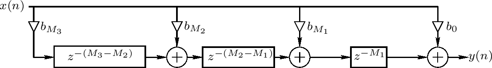
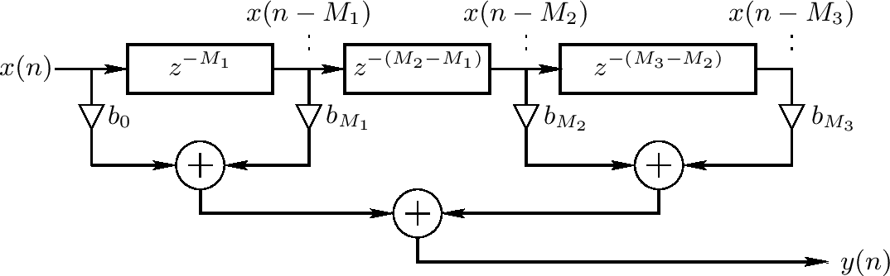

<head>
    
    
</head>

# Table of Contents

1.  [Algorithm](#org74ed074)
2.  [Review](#org3a227ef)
    1.  [拍打延迟线的例子](#org15d954d)
    2.  [转置拍打延迟线](#org138a22c)
    3.  [并行处理的TDL](#org852e6b8)
    4.  [一般相关FIR过滤](#orgdc543d8)
3.  [Tips](#org979f97b)
4.  [Share](#org1201b90)

# Algorithm

Asteroids: <http://poj.org/problem?id=3041>

<https://dreamume.medium.com/poj-asteroids-4706edb5270e>

# Review

拍打延迟线(TDL)

<https://ccrma.stanford.edu/~jos/pasp/Tapped_Delay_Line_TDL.html>

一个拍打延迟线(TDL)是至少有一个拍打的延迟线。一个延迟线拍打提取一个信号从延迟线的某处输出，可以放大它，且典型地和其他拍打加和形成一个TDL输出信号。一个拍打可为插入的或非插入的。一个非插入拍打在相对输入的某个固定整数延迟提取信号。这样，一个拍打在一个长延迟线中实现一个短的延迟线，如下图

拍打延迟线有效模拟同一个源信号的多个回响。结果，它们扩展地用于人工回响领域

## 拍打延迟线的例子

一个有两个拍打的TDL的例子如下图。总的延迟线长度是 $ M_ {3} $个采样，且间隔拍打位于 $ M_ {1} $和 $ M_ {2} $采样延迟。输出信号是输入信号x(n)，延迟线输出 $ x(n - M_ {3}) $和两个拍打信号 $ x(n - M_ {1}), x(n - M_ {2}) $的线性组合

其TDL的微分等式是

$ y(n) = b_ {0}x(n) + b_ {M_ {1}} x(n - M_ {1}) + b_ {M_ {2}} x(n - M_ {2}) + b_ {M_ {3}}x(n - M_ {3}) $

对应转换函数

$ H(z) = b_ {0} + b_ {M_ {1}}z^{-M_ {1}} + b_ {M_ {2}}z^{-M_ {2}} + b_ {M_ {3}}z^{-M_ {3}} $

## 转置拍打延迟线

在许多应用程序中，需要一个转置的延迟线，如上图，其是上一节的延迟线的转置。一个转置的TDL通过系统图表的形式化转置从一个正常的TDL中获得。转置操作也称为流图反转。一个流图通过反转所有信号路径来转置，其必需的信号分支点变成和，且和变成分支点。对一个单信号输入，单信号输出系统，转换函数是相同的，但输入输出被改变。这个流图转换定理源于信号流图的Mason的获得公式。转置用于转换数字化过滤的直接形式I和II到直接形式的III和IV

## 并行处理的TDL

相乘和相加可在并行时执行，一个拍打延迟线的计算复杂度为O(1)的相乘和O(log(K))的相加，K是拍打数。这个计算复杂度通过排列加法为二进制数获得，如下图是K = 4的情况

## 一般相关FIR过滤

最一般化的情况 - 一个TDL在每个延迟元素之后有一个拍打 - 一般相关有限脉冲响应(FIR)过滤，如下图。它限制为相关因为输出y(n)可不依赖未来的输入 x(n+1)，x(n+2)等。FIR过滤也称为一个转换过滤

上图第M个FIR过滤的微分等式

$ y(n) = b_ {0}x(n) + b_ {1}x(n-1) + b_ {2}x(n - 2) + b_ {3}x(n-3) + \\cdots + b_ {M}x(n - M) $

且转换函数为

$ H(z) = b_ {0} + b_ {1}z^{-1} + b_ {2}z^{-2} + b_ {3}z^{-3} + \\cdots + b_ {M}z^{-M} = \\sum^{M}_ {m=0}b_ {m}z^{-m} \\triangleq B(z) $

STK类实现任意直接形式FIR过滤被称为Fir（也有一个IIR过滤的类称为Iir）。在Matlab和Octave，通常使用内建的filter函数

# Tips

HOW TO LOOK AT MINKOWSKI’S THEOREM

<https://www.awesomemath.org/wp-pdf-files/math-reflections/mr-2013-02/minkowski_theorem.pdf>

Minkowski的Lattice Point定理声称在n维欧几里得空间 $ \\mathbb{R}^{n} $ 上有界、凸的、中心对称集合总是包含 $ \\mathbb{Z}^{n} $ 上一个非平凡lattice点。这个简单且自然的结果被Hermann Minkowski在1889年证明且变成数论几何的基础，其连接多个重要的数学领域，比如代数数论，调和分析或复理论。Minkowski定理也出现在离散/奥林匹克数学且可证明是处理diophantine等式或密度结果的一个非常重要的工具。本文中我们不描述应用程序，但只呈现Minkowski定理的一些不同方式，希望在它广泛的结果上闪烁一些光亮

我们开始陈述一个更精确版本的Minkowski定理

**定理 1** 设 $ K \\subset \\mathbb{R}^{n} $为一个有界、凸的、中心对称集合。如果K的体积满足 $ K > 2^{n} $，则K包含至少一个$ \\mathbb{R}^{n} $上非平凡lattice点

让我们首先搞清楚所有这些术语的意思并尝试做更有意义的陈述。一个 $ \\mathbb{R}^{n} $的子集K是有界的如果它包含在一个够大半径的球中。这样的集合K被称为是凸的如果对任意K中两点x,y，线段 $ \\{tx + (1-t)y, 0 \\le t \\le 1 \\} $也在K中且中心对称如果我们固定K中 $ \\mathbb{R}^{n} $上的源点则x在K中当且仅当-x在K中

现在，让我们也注意 $ 2^{n} $边界是紧的。事实上，取一个立方 $ Q = (-1, 1)^{n} \\subset \\mathbb{R}^{n} $。其体积为 $ 2^{n} $，它是有界的、凸的且中心对称的 - 但它不包含 $ \\mathbb{Z}^{n} $中除原点外任意其他lattice点。它的反例是什么？它不包含它的边界！如下的结果告诉我们它和所有好的集合的不同

**定理 1‘** 设 $ K \\subset \\mathbb{R}^{n} $为一个有界、凸的、中心对称集合，也是紧的（包含它的边界）。如果K的体积满足 $ K \\ge 2^{n} $，则K包含至少一个 $ \\mathbb{R}^{n} $上非平凡lattice点

幸运地是，定理1‘是定理1的一个简单结果且一个基本紧的争议。假设K的体积满足 $ K = 2^{n} $（因为否则，定理’跟随定理1甚至不需要K的紧性）。对每个 $ \\epsilon > 0 $，设 $ K_ {\\epsilon} $为 $ K(1 + \\epsilon) $的扩展。注意集合 $ K_ {\\epsilon} $满足假设 $ K_ {\\epsilon} > 2^{n} $，则通过定理1，$ K_ {\\epsilon} $包含一个 $ \\mathbb{Z}^{n} $上非零lattice点。但 $ K_ {1} $是有界的，这样只有有限多个可能性对每个 $ \\epsilon \\le 1 $有非零lattice点。这样，我们可找到一个 $ \\epsilon $的序列趋于0，其lattice点相同。$ K_ {\\epsilon} $的凸性，及集合包含0，意味着集合是嵌套的，且因此对所有 $ \\epsilon > 0 $，该lattice点位于  $ K_ {\\epsilon} $中。因为K是紧的，我们有

$ K = \\cap_ {\\epsilon > 0} K_ {\\epsilon} $

因此该lattice点在K中

结果，在本文中我们将聚焦于定理1且谈论有界、凸的、中心对称集合K，不需要是紧的。另外，我们将把定理1用更一般化的术语陈述，例如，$ \\mathbb{Z}^{n} $用 $ \\mathbb{R}^{n} $里的任意lattice $ \\mathcal{L} $替代，体积上的条件改为体积 $ K > 2^{n} \\cdot \\operatorname{det} \\mathcal{L}, \\operatorname{det} \\mathcal{L} $ 记为lattice的基本平行管道的体积。事实上，这个版本是Minkowski真正证明的且其计算现在作为Minkowski定理。然而，这个详细解释的目的，我们更喜欢用更简单的 $ \\mathbb{Z}^{n} $ lattice且这样我们将使用以上陈述。当我们指一个点为一个lattice点，我们意思是从整数lattice的一个点

思考Minkowski定理的第一个方法，即使对倾向分析的人，依然要画二维情况的图像且看是否欧几里得平面的任意属性将给出在K中非零lattice的存在

定理1的第一个证明 想法是观察立方 $ Q = [-1, 1]^{n} $。注意这个立方以原点为中心且所有它的转换是坐标向量分区 $ \\mathbb{R}^{n} $。更形式化地，我们可说

$ \\mathbb{R}^{n} = \\cup_ {u \\in 2 \\mathbb{Z}^{n}} (Q + u) $

为方便起见，让我们记 $ Q + u $ 为 $ Q_ {u} $。注意K是有界的，这样K只相交有限集合的 $ Q_ {u} $，称之为 $ \\mathcal{Q} $。现在，让我们看 $ \\mathcal{Q} $的集合 $ Q_ {u} $且它们的转换到Q。这些转换将创造在Q中大量K的部分。然而，我们知道体积 $ K > 2^{n} $，而体积 $ Q = 2^{n} $。因此，至少有一个含两个转换的 $ Q_ {u} $的覆盖；拿位于这个覆盖的某个点x。该点x可写为x = v + y = w + z，y,z为K中某个不同的点y,z，在 $ 2 \\mathbb{Z}^{n} $上某些不同的向量。特别地，我们获得 $ \\mathbb{Z}^{n} $中的点 $ \\frac{y-z}{2} = \\frac{w-v}{2} $。但 $ y \\in K, -z \\in K $（z在K中且K是中心对称的）；这样通过K的凸性有 $ \\frac{y-z}{2} $也在K中，其意味着 $ \\frac{y-z}{2} $是一个非零lattice点位于K中。这证明了Minkowski定理

第一个证明也许是最著名的因为它出现在几乎所有包含代数数论的书中

第二个（不完整）证明更有启发性的争议当我们使用一个包含傅立叶分析的一个明显完整的不同的想法。然而，这将使得我们只使用一个非常简单的积分技巧来获得一个简短的证明

第二个证明 这里的关键是注意在K中lattice点的个数被cardinality给定

$ \| K \\cap \\mathbb{Z}^{n} \| = \\sum_ {u \\in \\mathbb{Z}^{n}} \\chi K(u) $

$ \\chi K $表示K的特征函数。则，我们需要应用

**Poisson Summation Formula** 设f及它的傅立叶转换 $ \\hat{f} $为 $ \\mathbb{R}^{n} $上连续函数满足

$ \| f(x) \| \\le \\frac{A}{1 + \| x \|^{n + \\epsilon}} \\text{ and } \| \\hat{f}(x) \| \\le \\frac{B}{1 + \|x \|^{n+ \\epsilon}} $

A, B为正常数，且 $ \\epsilon > 0 $足够小。则

$ \\sum_ {u \\in \\mathbb{Z}^{n}} f(x + u) = \\sum_ {u \\in \\mathbb{Z}^{n}} \\hat{f}(u) e^{2 \\pi ixu} $

特别地，如果我们让x = 0，则

$ \\sum_ {u \\in \\mathbb{Z}^{n}}f(u) = \\sum_ {u \\in \\mathbb{Z}^{n}} \\hat{f}(u) $

我们有

$ \| K \\cap \\mathbb{Z}^{n} \| = \\sum_ {u \\in \\mathbb{Z}^{n}} \\chi K(u) = \\sum_ {u \\in \\mathbb{Z}^{n}} \\widehat{\\chi K}(u) $

但我们不允许这么做，因为特征函数 $ \\chi K $不是一个连续函数。然而，如果我们可找到某个中度递减的连续函数 $ f: \\mathbb{R}^{n} \\to \\mathbb{R} $满足 $ \\chi K \\ge f $，则这个问题可解决！我们然后可写为

$ \| K \\cap \\mathbb{Z}^{n} \| = \\sum_ {u \\in \\mathbb{Z}^{n}} \\chi K(u) \\ge \\sum_ {u \\in \\mathbb{Z}^{n}} f(u) = \\sum_ {u \\in \\mathbb{Z}^{n}} \\hat{f}(u) $

更进一步，如果我们也能找到漂亮的函数f有额外的属性，它的傅立叶转换 $ \\hat{f} $是正实数，则我们获得

$ \| K \\cap \\mathbb{Z}^{n} \| \\ge \\hat{f}(0) = \\int_ {\\mathbb{R}^{n}}f(x)dx $

这将给我们一个漂亮的下界

现在，给定两个积分，在 $ \\mathbb{R}^{n} $上的有界复数函数，从基本傅立叶分析有

$ (F * G)(x) = \\int_ {\\mathbb{R}^{n}} F(y)G(x - y)dy = \\inf_ {\\mathbb{R}^{n}} F(x - y)G(y)dy $

是连续的

因此，一个函数使得f = F * G即是我们要找的。例如，对函数 $ f = (\\frac{1}{\\operatorname{vol} \\frac{K}{2}} \\chi_ {\\frac{K}{2}} * \\chi_ {\\frac{K}{2}} $，我们也立即得到

$ \\begin{aligned} f(x) &= \\left( \\frac{1}{\\operatorname{vol} \\frac{K}{2}} \\right) \\chi_ {\\frac{K}{2}} * \\chi_ {\\frac{K}{2}}(x) \\\\ &= \\frac{1}{\\operatorname{vol} \\frac{K}{2}} \\int_ {\\mathbb{R}^{n}} \\chi_ {\\frac{K}{2}}(y) \\chi_ {\\frac{K}{2}}(x - y)dy \\\\ &\\le \\frac{1}{\\operatorname{vol} \\frac{K}{2}} \\int_ {\\mathbb{R}^{n}} \\chi_ {\\frac{K}{2}}(y)dy \\\\ &\\le \\frac{1}{\\operatorname{vol} \\frac{K}{2}} \\cdot \\operatorname{vol} \\frac{K}{2} \\\\ &= \\chi_ {K}(x) \\end{aligned} $

对所有K上的x，对 $ x \\notin K $，我们有

$ f(x) = \\frac{1}{\\operatorname{vol} \\frac{K}{2}} \\int_ {\\mathbb{R}^{n}} \\chi_ {\\frac{K}{2}}(y) \\chi_ {\\frac{K}{2}}(x - y)dy = 0 $

（因为y和x - y不能都在 $ \\frac{K}{2} $及x不在K - 根据凸性）。这样，我们有 $ \\chi_ {K} \\ge f $。更进一步

$ \\hat{f} = \\frac{1}{\\operatorname{vol} \\frac{K}{2}} \\left( \\chi \\widehat{\\frac{K}{2} * \\chi_ {\\frac{K}{2}}} \\right) = \\frac{1}{\\operatorname{vol} \\frac{K}{2}} \\left(\\widehat{\\chi_ {\\frac{K}{2}}} \\bar{\\widehat{\\chi_ {\\frac{K}{2}}}} \\right) = \\frac{1}{\\operatorname{vol} \\frac{K}{2}} \| \\widehat{\\chi_ {\\frac{K}{2}}} \|^{2} > 0 $

这样f几乎就是我们希望的：满足 $ \\chi_ {K} \\ge f $且 $ \\hat{f} $是正实数。不幸地是，它不是中度下降的（虽然它是闭的）。这样，技术上，我们不能应用Poisson和公式。但注意如果我们能应用它，则我们完成。写

$ \| K \\cap \\mathbb{Z}^{n} \|  \\ge \\hat{f}(0) = \\frac{1}{\\operatorname{vol} \\frac{K}{2}} \| \\widehat{\\chi_ {\\frac{K}{2}}}(0) \|^{2} = \\frac{1}{\\operatorname{vol} \\frac{K}{2}} \| \\int_ {\\mathbb{R}^{n}} \\chi_ {\\frac{K}{2}}(x)dx \|^{2} = \\operatorname{vol} \\frac{K}{2} = \\frac{\\operatorname{vol} K}{2^{n}} > 1 $

K包含至少一个非平凡lattice点

如果我们可有一些额外的假设在K的边界上则可以工作。例如，如果它对 $ \\partial K $在每个点有非消失高斯曲线，则推论告诉我们

$ \\hat{\\chi}_ {\\frac{K}{2}}(x) = O \\left( \| x \|^{- \\frac{n+1}{2}} \\right), \| x \| \\to \\infty $

这样

$ \\hat{f}(x) = \\frac{1}{\\operatorname{vol} \\frac{K}{2}} \| \\widehat{\\chi_ {\\frac{K}{2}}} \|^{2} = O \\left( \| x \|^{-n-1} \\right), \| x \| \\to \\infty $

且这样我们有中度下降。但让我们不要复杂化。如何我们获得一个函数f但有中度下降？通过引入称为“bump函数“（或“大约为单位点“） $ \\phi $非负，光滑，在单位圆中支持，且满足 $ \\int \\phi(x)dx = 1 $，且然后获得卷积 $ f = \\chi_ {\\frac{K}{2}} * \\phi $（模某个伸缩数）。这固定每个，因为现在卷积代表一个压缩支持的光滑函数，这样我们可事实上应用Poisson和公式。当每个自然数，这个想法复杂化了计算，因为它不给定我们漂亮的右边 $ \\frac{\\operatorname{vol} K}{2^{n}} $，且我们不得不执行一些其他技巧在左边为了获得我们想要的。我们将不继续处理

我们将做的是用面向分析的想法且给出它不同的返回，不包含Poisson和公式

定理1的第三个证明 考虑函数 $ \\Psi: \\mathbb{R}^{n} \\to \\mathbb{R} $定义

$ \\Psi(x) = \\sum_ {u \\in \\mathbb{Z}^{n}} \\chi_ {\\frac{K}{2}}(x + u) $

这个跟之前证明的第一行相似，因为 $ \\Phi(x) $是交 $ \| K \\cap (x + \\mathbb{Z}^{n}) \| $的cardinality

现在，除了找到应用Poisson和公式到 $ \\Psi(x) $的表达，我们在闭立方 $ [0, 1]^{n} \\subset \\mathbb{R}^{n} $中积分它。我们可明显做这个，因为 $ \\Psi(x) $有界（因为K有界）且可积分（因为它是积分函数的和）。这样，我们可写

$ \\begin{aligned} \\int_ {[0,1]^{n}} \\Psi(x)dx &= \\int_ {[0,1]^{n}} \\left( \\sum_ {u \\in \\mathbb{Z}^{n}} \\chi_ {\\frac{K}{2}}(x + u) \\right)dx \\\\ &= \\sum_ {u \\in \\mathbb{Z}^{n}} \\left( \\int_ {[0,1]^{n}} \\chi_ {\\frac{K}{2}}(x + u)dx \\right) \\\\ &= \\sum_ {u \\in \\mathbb{Z}^{n}} \\left(\\int_ {u+[0,1]^{n}} \\chi_ {\\frac{K}{2}}(x)dx\\right) \\\\ &= \\int_ {\\mathbb{R}^{n}} \\chi_ {\\frac{K}{2}}(x)dx \\\\ &= \\operatorname{vol} \\frac{K}{2} \\\\ &= \\frac{\\operatorname{vol}K}{2^{n}} \\\\ &> 1 \\end{aligned} $

则必须在 $ [0, 1]^{n} $中有一个点使得 $ \\Psi(x) \\ge 2 $。如果不是这样，则，因为 $ \\Psi(x) $是整数值，我们有 $ \\Psi(x) \\le 1 $，且这样我们获得

$ 1 \\ge \\int_ {[0,1]^{n}} \\Psi(x)dx > 1 $

这明显是不可能的。这样，必须至少在 $ \\mathbb{Z}^{n} $中有两个点$ u_ {1}, u_ {2} $使得 $ x+ u_ {1}, x+ u_ {2} $都在 $ \\frac{K}{2} $中。设这两个点 $ \\frac{y}{2}, \\frac{z}{2}, y \\ne z $都在K中。则，点 $ u_ {1} - u_ {2} = \\frac{y-z}{2} $在K中；但它也在 $ \\mathbb{Z}^{n} $中因为$ u_ {1}, u_ {2} $在 $ \\mathbb{Z}^{n} $中；因此我们获得 $ \\frac{y-z}{2} $是K中一个非零lattice点，这又证明了Minkowski

注意第三个证明是之前一个的形式化，当我们用立方体交集合K的转换。计算事实上是Poisson和公式证明的伪装

**高斯圆问题** 多少个lattice点位于 $ \\mathbb{R}^{2} $中以原点为中心r > 0为半径的圆中？

半径为r的圆面积为 $ \\pi r^{2} $，且因此在 $ \\mathbb{R}^{2} $中方框面积为1的包含一个整数点，问题期望的答案为 $ \\pi r^{2} $。事实上，它比这个高，因为圆的面积比方框大。因此事实上它期望为

$ N(r) = \\pi r^{2} + E(r) $

对某些错误项E(r)。找到这个错误项的上界事实上就是这个问题。高斯证明了 $ E(r) \\le 2 \\sqrt{2} \\pi r, E(r) = O(r^{\\frac{1}{2} + \\epsilon}) $。这依然是开发的，最好已知的边界是 $ E(r) = O(r^{\\frac{2}{3}}) $

不管怎样，我们的目标需要的是结果如果M(r)记为有边界的、凸的以集合K中心对称的 $ \\frac{1}{r} $ lattice点数，例如，点 $ x \\in K $使得 $ rx \\in \\mathbb{Z}^{n} $，则

$ \\lim_ {r \\to \\infty} \\frac{M(r)}{r^{n}} = \\operatorname{vol} K $

这是自然的在高斯圆问题估计之后。证明的另一个方法为用如下的引理

**引理** 设 $ K \\subset \\mathbb{R}^{n} $为一个（有界的）Jordan测度集。则，使用之前的记号

$ \\lim_ {r \\to \\infty} \\frac{M(r)}{r^{n}} = \\operatorname{vol} K $

证明片段 通过适当缩放，我们可假设 $ K \\subset (-1, 1)^{n} $。则，注意对任意正整数r，分数 $ \\frac{M(r)}{r^{n}} $是精确的一个黎曼和对特征函数 $ \\chi_ {K} $对于 $ [-1, 1]^{n} $的分区到边长 $ \\frac{1}{r} $的子方框上，这样这些和收敛到 $ \\int \\chi_ {k} = \\operatorname{vol} K, r \\to \\infty $

定理1的第4个证明 让我们现在处理 $ \\frac{K}{2} $替代K，这样记M(r)为 $ \\frac{K}{2} $的$ \\frac{1}{r} $的lattice点数。明显的，$ \\frac{K}{2} $是有界的且凸的，这样它是Jordan可测的，因此

$ \\lim_ {r \\to \\infty} \\frac{M(r)}{r^{n}} = \\operatorname{vol} \\frac{K}{2} = \\frac{\\operatorname{vol}K}{2^{n}} > 1 $

这意味着有某个 $ r_ {0} $使得对每个 $ r > r_ {0} $，我们有

$ \\frac{M(r)}{r^{n}} > 1 $ 例如，$ M(r) > r^{n} = \| (\\mathbb{Z} / r \\mathbb{Z})^{n} \| $

因此，对大的r，通过鸽巢原理，在 $ \\frac{K}{2} $中存在两个不同的 $ \\frac{1}{r} $lattice点x, y使得rx和ry有相同的坐标模r。这意味着 $ x - y = \\frac{rx - ry}{r} $在 $ \\mathbb{Z}^{n} $中。然而，x,y在 $ \\frac{K}{2} $中，这样x - y也在K中（通过中心对称和凸性）。因此，我们获得一个非零lattice点x - y在K中，这样证明了Minkowski定理

# Share

Nonograms

<https://crypto.stanford.edu/pbc/notes/zdd/nonogram.html>

虽然一般情况下是NP完全的，一些迷宫书上的例子对人类来说是直接的，且也适合用ZDD

让我们考虑一个5x5的nonogram；如何生成是明显的。我们有 $ 5 \\times 5 = 25 $元素。一个集合代表一个nonogram的着色方案：第r行第c列的元素着色当且仅当5r + c + 1（行和列以0开头）是一个集合的成员

我们可容易地对所有行表达线索。例如，如果第一行有线索"1 2"，则ZDD开始于

然后对每一列，我们构建一个ZDD代表满足列限制的着色且跟当前的ZDD相交

构造一个列ZDD跟构造一个行ZDD相似除了我们选择的顺序，我们必须用不重要的点，其边都指向前续节点垫出图形。例如，如果第三列有线索"5"，则它的ZDD开始于

这样一个单列ZDD通常至少和所有行的ZDD一样大

在一个个地插入所有列之后，我们将有一个ZDD的唯一解决方案。一般地，ZDD的大小在这个过程中呢会指数级增长，但对人友好的迷宫行为是合理的

简单地启发可给出一个爆发：我们将交换行和列这样行比列限制少，且当对列迭代时，我们将先交最受限的列
