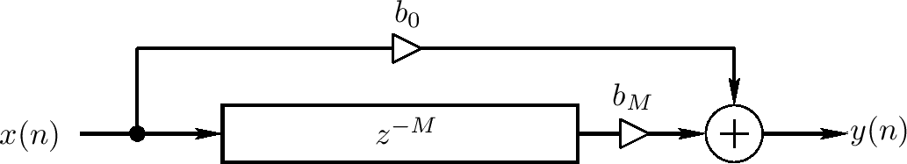
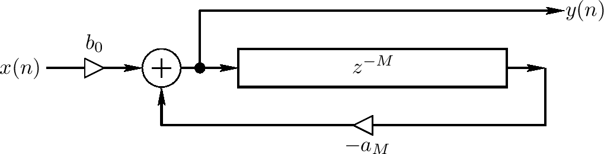
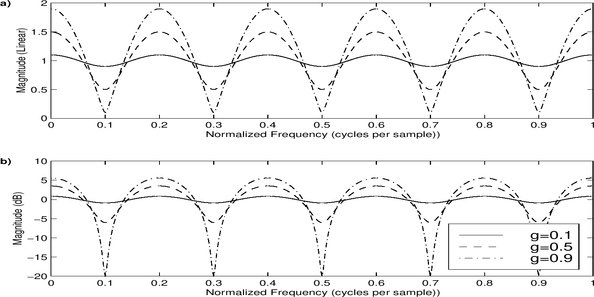

<head>
    
    
</head>

# Table of Contents

1.  [Algorithm](#orgd5bbc72)
2.  [Review](#org9892a23)
    1.  [前向反馈梳状滤波器](#org92335d2)
    2.  [后向反馈梳状过滤器](#org658baf1)
    3.  [前向反馈梳状过滤器振幅反应](#org8858753)
    4.  [向后反馈梳状过滤器振幅反应](#org52ec7ef)
3.  [Tips](#orgef27b2a)
4.  [Share](#org44896f8)

# Algorithm

Evacuation: <http://poj.org/problem?id=3057>

<https://dreamume.medium.com/poj-evacuation-c16bd37ca443>

# Review

梳状滤波器

<https://ccrma.stanford.edu/~jos/pasp/Comb_Filters.html>

淑状滤波器是数字化音频音效的基本构建块。之前的声学回音模拟就是一个梳状滤波器的一个例子。本节呈现两种基本的梳状滤波器类型，前向反馈和后向反馈，且给出一个频率反应分析

## 前向反馈梳状滤波器

前向反馈梳状滤波器如下图。直接信号在延迟线上前向反馈。输出是直接和延迟信号的一个线性组合

前向反馈梳状滤波器的微分等式为

$ y(n) = b_ {0}x(n) + b_ {M}x(n - M) $

我们看到前向反馈梳状滤波器是FIR过滤的一个特殊类型，它也是TDL的一个特殊例子

注意这个前向反馈梳状滤波器可通过设置 $ b_ {0} = 1, b_ {M} = g $来实现回音模拟。这样，它是一个单离散回音的计算物理模型。这是最简单的减弱（通过 $ \| b_ {M} \| < 1 $）由于“空气吸收”和/或球形扩散损失，且广播在cMT米距离上的延迟，T是秒单位的采样周期，c是声音速度，当空气吸收需要模拟得更精确，常量衰减因子 $ b_ {M} $可被一个线性、时间变化过滤的G(z)替代，给出一个在每个频率不同的减弱。由于空气吸收的物理性，G(z)一般有低通过的特性

## 后向反馈梳状过滤器

后向反馈梳状过滤器使用后向反馈信号，如下图

描述后向反馈梳状过滤器的微分等式为

$ y(n) = b_ {0}x(n) - a_ {M}y(n - M) $

后向反馈梳状过滤器是无限脉冲反应(IIR)数字化过滤的一个特殊例子，因为有一个从延迟输出到输入的反馈。后向反馈梳状过滤器可被视为一系列回音的计算物理模型，随时间指数型衰弱且统一空间。例如，特殊的例子

y(n) = x(n) + gy(n - M)

是一个理想平面波浪在两个平行墙上后向和前向反弹的一个计算模型；在这样的模型中，g表示总的旅行衰弱（两个墙到墙的旅行，包括两个反射）

对稳定性，反馈系数 $ a_ {M} $必须在幅度上小于1，例如，$ \| a_ {M} \| < 1 $。否则，如果 $ \| a_ {M} \| > 1 $，每个回音将比之前的大，产生一个决不停止，增长序列的回音

有时，输出信号从延迟线的尾端而不是开始出获取，这样微分方程变为

$ y(n) = b_ {M}x(n - M) - a_ {M}y(n - M) $

这个输出选择只延迟M个采样的输出信号

## 前向反馈梳状过滤器振幅反应

梳状过滤器，其名源于它们的振幅反应的梳子形状（增益及频率），如下两图

前向反馈梳状滤波器等式的转换函数是

$ H(z) = b_ {0} + b_ {M}z^{-M} $

这样振幅反应（增益及频率）为

$ G(\\omega) \\triangleq \| H(e^{j \\omega}) \| = \| b_ {0} + b_ {M}e^{-j \\omega M} \|, \\qquad -\\pi \\le \\omega \\le \\pi $

对下图M = 5, $ b_ {0} = 1, b_ {M} = 0.1, 0.5 $和0.9。当 $ b_ {0} = b_ {M} = 1 $，我们获得最简单的结果

$ G(\\omega) = \| 1 + e^{-j \\omega M} \| = \| e^{-j \\omega M / 2} \| \|e^{j \\omega M / 2} + e^{- j \\omega M / 2} \| = 2 \| \\cos{(\\omega \\frac{M}{2})} \| $

在这个例子中，我们获得M个nulls，其是振幅反应中0增益的点（频率）。注意在flangers音效中，这些nulls通过调制延迟长度M来随时间慢慢移动。这个平滑需求会干涉延迟线

## 向后反馈梳状过滤器振幅反应

# Tips

设计模式之美 -- 设计原理与思想：面向对象

封装指只暴露有限的接口，隐藏信息、保护数据，提高易读性

抽象隐藏方法的具体实现，让调用者只需关系方法提供了什么功能、简化模块复杂度

继承使代码复用

多态提高代码的可扩展性和复用性

类数据和方法分离，比如MVC三层结构

什么时候用抽象类什么时候用接口？

如果我们要表示一种is-a关系，并且是为了解决代码复用问题，我们就用抽象类；如果我们要表示一种has-a关系，并且是为了解决抽象而非代码复用问题，就可以使用接口

基于接口而非实现编程，这样可以把接口和实现分离、封装不稳定的实现、只暴露稳定的接口、降低耦合度、提高扩展性

越抽象、越顶层、越脱离具体实现的设计、越能提高代码灵活性，应对未来的需求变化。好的代码设计，不仅能应对当下的需求，而且在将来需求变化时，依然能在不破坏原有代码设计的情况下灵活应对

如果类之间继承结构稳定（不会轻易改变），继承层次较浅（比如，最多有两层继承关系），继承关系不复杂，我们就可以大胆使用继承。反之，系统越不稳定，继承层次很深，继承关系复杂，我们就尽量使用组合

此外，一些设计模式会固定使用继承或组合。比如，装饰器模式、策略模式、组合模式等使用组合，模板模式使用继承

贫血模式适合业务比较简单的系统开发，充血模式适合业务复杂的系统开发

充血模式根贫血莫斯相比，主要区别在Service层。在充血模式中，我们将部分原来在Service层的业务逻辑移动到充血的Domain领域模型中，让Service类实现依赖这个Domain类。Service类不会完全移除，而是负责一些不适合放在Domain类中的功能。比如，负责跟Repository层打交道、跨领域模型的业务聚集功能、幂等事务等非功能性工作

充血模式的DDD开发模型跟贫血模型相比，Controller层和Repository层代码基本相同。因为Repository层的Entity生命周期有限，Controller层的VO只是单纯作为一种DTO。两部分的业务逻辑都不会太复杂。业务逻辑主要集中在Service层。所以，Repository层和Controller层沿用贫血模式的设计思路是没有问题的

针对框架、类库、组件等非业务系统的开发，其中一个比较大的难点就是，需求一般都比较抽象、模糊，需要你自己去挖掘，做合理取舍、权衡、假设，把抽象的问题具象化，最终产生清晰的、可落地的需求定义。需求定义是否清晰、合理，直接影响后续的设计、编码实现是否顺畅。因此，需要重视前期的需求分析

需求分析的过程是一个不断迭代优化的过程。我们不要试图一下就能给出一个完美的解决方案，而是先给出一个粗糙的、基础的方案，有一个迭代的基础，然后再慢慢优化，这样的一个思考过程能让我们摆脱无从下手的窘境

如何进行面向对象编程：

-   划分职责进而识别出有哪些类
-   定义类及其属性和方法
-   定义类与类之间的交互关系
-   将类组装起来并提供执行入口

根据需求描述，把其中涉及的功能点，依次罗列出来，然后再去看哪些功能点职责相近，操作同样的属性，是否应该归为同一个类

针对复杂的需求开发，我们首先要进行模块划分，将需求先简单划分成几个小的、独立的功能模块，然后再在模块内部，进行职责划分并给出类。模块的划分和识别跟类的划分和识别，套路相似

类和类的交互关系有泛化、实现、聚合、组合、关联、依赖

泛化就是继承，实现一般指接口和实现类，聚合是一种包含关系，A类对象包含B类对象，B类对象生命周期不依赖A类对象生命周期。组合也是一种包含关系，A类对象包含B类对象，B类对象生命周期依赖A类对象生命周期，B类对象不能单独存在。关联是一种非常弱的关系，比如B类对象是A类对象的成员变量。依赖是最弱的关系，比如A类对象使用B类对象作为参数或返回值

# Share

Light Up

<https://crypto.stanford.edu/pbc/notes/zdd/lightup.html>

友好的Light Up迷宫也是ZDD友好的。我们开始于每个放置灯泡的位置一个元素。然后对每一行，我们构建包含最多行中一个元素的ZDD集合。列相似

接着，对每个空白的方块，我们构建包含至少一个元素可用一个车从方块移动到达的ZDD集合

最后，对每个数字(n)，我们构建方块中围绕该数的包含(n)个元素的ZDD集合

这些ZDD的交是解决方案

这些迷宫跟八皇后迷宫相似，小心地写递归查找算法可解决得比ZDD更快些。然而，写ZDD更简单，提供已经实现的基本的方法。对小规模，我们可回答不完整迷宫的问题。例如，给定只有一些或不给定线索，有多少个解决方案？我们如何随机取一个？哪个有最大的权重，一个灯泡在行(x)和列(y)为(x+y)
