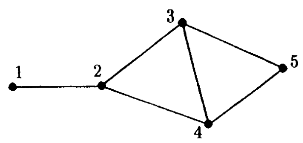
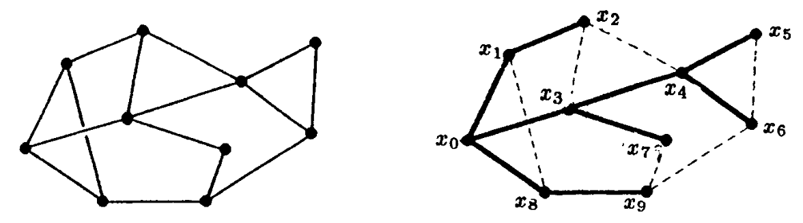
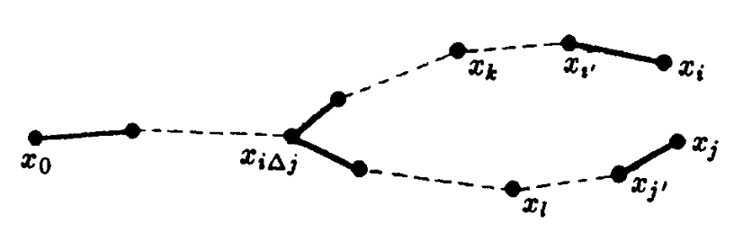

<head>
    
    
</head>

# Table of Contents

  如下问题源于通讯定理。对一个电话网络，终端A和B之间的一个连接在每个方向上在消息流之前建立。对一个计算机网络它想要可能发送一个消息从A到B不需要知道B知道一个消息在它的道路上。想法是让消息被B的某些地址处理使得在网络的每个节点可确定一个决定消息需要处理的方向

  一个自然的事情是尝试给出图形G的每个顶点一个二进制地址，称为 $ \\{0, 1\\}^{k} $，在这样的方法上图形中两个顶点的距离等于地址的被称为Hamming的距离，例如，地址不同的位置数。这相等于视G为一个超立方体 $ H_ {k} $的引导子图形，其 $ V(H_ {k}) := \\{0, 1\\}^{k} $且k元组是邻接的当它们只在一个坐标上不同时。例子 $ G = K_ {3} $已经显示这是不可能的。我们现在引入一个新的字母 $ \\{ 0, 1, * \\} $且从这个字母中取n元形成地址。两个地址的距离是定义为当数字的位置一个为0一个为1时这样的位置数。对一个图形G的一个地址，我们需要G中任意两个顶点的距离等于它们地址的距离。我们记N(G)为n的最小值，其存在G的一个地址比为长度n

  对一棵树我们可用没有星的如下操作。我们使用归纳法。对一个两顶点的树，我们有一个长度为1的地址。假设我们可用k个顶点处理树。如果 $ x_ {0}, x_ {1}, \\ldots, x_ {k} $是树T的顶点且 $ x_ {0} $一个单价顶点，则考虑通过删除树的 $ x_ {0} $顶点获得的一个地址方案。设 $ \\mathbf{x}_ {i} $为 $ x_ {i} $的地址且假设 $ x_ {0} $连接 $ x_ {1} $。我们改变所有地址为 $ (0, \\mathbf{x}_ {i}), 1 \\le i \\le k $，且给出 $ x_ {0} $地址 $ (1, \\mathbf{x}_ {1}) $。明显地现在这是T的一个地址。这样对一个树，我们有 $ N(T) \\le \| V(T) \| - 1 $

  作为第二个例子，考虑 $ K_ {m} $。在大小为m - 1的单位矩阵中，我们替换对角线之上的0为星且添加一个零行。任意两行现在有距离1且因此 $ N(K_ {m}) \\le m - 1 $

  作为第三个例子，我们考虑如下图

  

  一个可能的（非优化）的地址方案是

  $ \\begin{array}{ccccccc} 1 & & 1 & 1 & 1 & * & * \\\\ 2 & & 1 & 0 & * & 1 & * \\\\ 3 & & * & 0 & 0 & 0 & 1 \\\\ 4 & & 0 & 0 & 1 & * & * \\\\ 5 & & 0 & 0 & 0 & 0 & 0 \\end{array} $

  我们现在显示一个图地址和quadratic形式的一个对应。考虑上上图的图形G且上面给定的地址方案。对地址方案的第一列，我们赋予乘积 $ (x_ {1} + x_ {2})(x_ {4} + x_ {5}) $。这里 $ x_ {i} $在第一、对应第二，因子如果i的地址有1，对应0，在第一列。如果我们对每列做同样的事且添加项，我们获得一个quadratic形式 $ \\sum d_ {ij}x_ {i}x_ {j}, d_ {ij} $是G中顶点i和j的距离。这样G的一个地址方案对应quadratic形式 $ \\sum d_ {ij}x_ {i}x_ {j} $作为n乘积的和

  $ (x_ {i_ {1}} + \\cdots + x_ {i_ {k}})(x_ {j_ {1}} + \\cdots + x_ {j_ {l}}) $

  使得没有 $ x_ {i} $在两个因式中。变量数为 $ \| V(G) \| $

  **定理9.1** 设 $ n_ {+} $，对应的 $ n_ {-} $，为图形G的距离矩阵 $ (d_ {ij}) $的特征值的正及负的个数。则 $ N(G) \\ge max \\{n_ {+}, n_ {-} \\} $

  证明：上面提到的每个二项式形式可被表达为 $ \\frac{1}{2} \\mathbf{x}^{T} A \\mathbf{x}, \\mathbf{x} := (x_ {1}, x_ {2}, \\ldots, x_ {n}) $且A有条目 $ a_ {ij} = 1 $，如果项 $ x_ {i}x_ {j} $发生在二项式形式否则0。这样一个矩阵有rank 2且trace 0。因此它有一个正的和一个负的特征值。因为 $ (d_ {ij}) $是矩阵对应二项式形式的和，它可最多有n个正（负）特征值

  **定理9.2** $ N(K_ {m}) = m - 1 $

  证明：我们已看到 $ N(K_ {m}) \\le m - 1 $。因为J - I，大小为m，是 $ K_ {m} $的距离矩阵且J - I的特征值为m - 1个1或-1，从定理9.1可得到结果

  **定理9.3** 如果T是n个顶点的一棵树，则N(T) = n - 1

  证明：我们首先计算T的距离矩阵 $ (d_ {ij}) $的行列式。我们编号顶点 $ p_ {1}, \\ldots, p_ {n} $使得 $ p_ {n} $是邻接 $ p_ {n-1} $的一个端点。在距离矩阵中，我们从行n剪去行n - 1，且对列也相似操作。则在新的最后行和列的所有条目为1除了对角线元素为-2。现在重编号顶点 $ p_ {1}, \\ldots, p_ {n-1} $使得新顶点 $ p_ {n-1} $是邻接 $ p_ {n-2} $的 $ T \\ \\{p_ {n}\\} $中一个点。重复这个过程，在n - 1步之后，我们有行列式

  $ \\begin{array}{\|ccccc\|} 0 & 1 & 1 & \\ldots & 1 \\\\ 1 & -2 & 0 & \\ldots & 0 \\\\ 1 & 0 & -2 & \\ldots & 0 \\\\ \\vdots & \\vdots & \\vdots & \\ddots & \\vdots \\\\ 1 & 0 & 0 & \\ldots & -2 \\end{array} $

  从这我们发现可标记的结果在n个顶点的一棵树的距离矩阵的行列式 $ D_ {n} $满足

  $ D_ {n} = (-1)^{n-1} (n-1)2^{n-2} $

  例如，它只依赖 $ \| V(T) \| $。如果我们根据之前描述的过程编号顶点，则距离矩阵的左上角的 $ k \\times k $原理镜像是k个顶点上一个子树的距离矩阵。因此序列 $ 1, D_ {1}, D_ {2}, \\ldots, D_ {n}, D_ {k} $是 $ k \\times k $镜像的行列式，等于

  $ 1, 0, -1, 4, -12, \\ldots, (-1)^{n-1}(n-1)2^{n-2} $

  如果我们考虑0的符号为正，则该序列只有一个连续两个相同符号的项。通过二项式形式的一个基本定理这意味着对应的二项式形式有索引1，且因此 $ (d_ {ij}) $有一个正特征值

  对所有（连通的）图形G有 $ N(G) \\le \| V(G) \| - 1 $，这个已被P.Winkler在1983年证明。为了描述地址方案，我们需要一些准备，考虑下图

  

  我们取一个顶点 $ x_ {0} $，则通过宽度优先搜索构建一个伸展树T，且通过一个深度优先搜索编号顶点。结果显示在上图右图，$ E(G) \\ E(T) $的边为点线

  设 $ n := \| V(G) \| - 1 $。我们需要几个定义

  对 $ i \\le n $，我们定义

  $ P(i) := \\{j: x_ {j} $ 是T中在从 $ x_ {0} $到 $ x_ {i} $的路径中}

  例如，P(6) = {0, 3, 4, 6}。设

  $ i \\triangle j := max(P(i) \\cap P(j)) $

  我们描述一般情形如下图

  

  注意在图中，我们有i < j 当且仅当k < l

  对 $ i \\le n $，我们定义

  $ i^{\\prime} := max(P(i) \\ \\{i\\}) $

  例如在上上图中，$ 7^{\\prime} = 3 $，定义

  $ i \\sim j \\Leftrightarrow P(i) \\subseteq P(j) \\, or \\, P(j) \\subseteq P(i) $

  我们定义G中的距离，对应T，为 $ d_ {G} $及 $ d_ {T} $

  差异函数c(i, j)现在定义为

  $ c(i, j) := d_ {T}(x_ {i}, x_ {j}) - d_ {G}(x_ {i}, x_ {j}) $

  例如，在上上图中，c(6, 9) = 4

  **引理9.4**

  (i) $ c(i, j) = c(j, i) \\ge 0 $

  (ii) 如果 $ i \\sim j $，则 $ c(i, j) = 0 $

  (iii) 如果 $ i \\not \\sim j $，则 $ c(i, j^{\\prime}) \\le c(i, j) \\le c(i, j^{\\prime}) + 2 $

  证明：(i)是明显的；(ii)从T的定义因为

  $ d_ {G}(x_ {i}, x_ {j}) \\ge \| d_ {G}(x_ {j}, x_ {0}) - d_ {G}(x_ {i}, x_ {0}) \| = d_ {T}(x_ {i}, x_ {j}) $

  (iii) 由事实 $ \| d_ {G}(x_ {i}, x_ {j}) - d_ {G}(x_ {i},x_ {j^{\\prime}}) \| \\le 1 $且 $ d_ {T}(x_ {i}, x_ {j}) = 1 + d_ {T}(x_ {i}, x_ {j^{\\prime}}) $

  现在我们可定义地址方案。对 $ 0 \\le i \\le n $顶点 $ x_ {i} $给定地址 $ \\mathbf{a}_ {i} \\in \\{0, 1, * \\}^{n} $，其

  $ \\mathbf{a}_ {i} = (a_ {i}(1), a_ {i}(2), \\ldots, a_ {i}(n)) $

  且

  $ a_ {i}(j) := \\left \\{ \\begin{array}{cc} 1 & \\text{if } j \\in P(i) \\\\ * & \\text{if } \\left \\{ \\begin{array}{l} c(i,j) - c(i, j^{\\prime}) = 2, or \\\\ c(i,j) - c(i,j^{\\prime}) = 1, i < j, c(i,j) even, or \\\\ c(i,j) - c(i, j^{\\prime}) = 1, i > j, c(i,j) odd \\end{array} \\right. \\\\ 0 & otherwise \\end{array} \\right. $

  **定理9.5** $ d(\\mathbf{a}_ {i}, \\mathbf{a}_ {k}) = d_ {G}(x_ {i}, x_ {k}) $

  证明：我们可假设i < k

  (i) 假设 $ i \\sim k $，则 $ d_ {G}(x_ {i}, x_ {k}) = \| P(k) \\ P(i) \| $。j的值使得 $ j \\in P(k) \\ P(i) $为位置其 $ a_ {k}(j) = 1, a_ {i}(j) \\ne 1 $。对这些j值我们看到c(i, j) = 0,因此 $ a_ {i}(j) = 0 $

  (ii) 困难的情况是 $ i \\not \\sim k $。设 $ n_ {1} \\le n_ {2} \\le \\cdots \\le n_ {l} $为一个整数的非减序列使得 $ \| n_ {i+1} - n_ {i} \| \\le 2 $对所有i。如果m是 $ m_ {1} $到 $ n_ {l} $之间的一个偶整数且不出现在该序列中，则有一个i使得 $ n_ {i} = m - 1, n_ {i+1} = m + 1 $。现在考虑序列

  $ c(i, k) \\ge c(i, k^{\\prime}) \\ge c(i, k^{\\prime \\prime}) \\ge \\cdots \\ge c(i, i \\triangle k) = 0 $

  通过 $ a_ {i}(j) $的定义且如上观察，$ a_ {i}(j) = * $且 $ a_ {k}(j) = 0 $在 $ c(i, i \\triangle k) $和c(i, k)之间有偶数整数个。相似地，$ a_ {k}(j) = * $和$ a_ {i}(j) = 1 $在$ c(i, i \\triangle k) $和c(i, k)之间奇数整数个数相同。这样

  $ \\begin{aligned} d(\\mathbf{a}_ {i}, \\mathbf{a}_ {k}) &= \| P(k) \\ P(i) \| + \| P(i) \\ P(k) \| - c(i,k) \\\\ &= d_ {T}(x_ {i}, x_ {k}) - c(i, k) = d_ {G}(x_ {i}, x_ {k}) \\end{aligned} $

  因此我们已证明如下定理

  **定理9.6** $ N(G) \\le \| V(G) \| - 1 $

  我们现在看第二个问题包含字母 $ \\{0, 1, \\star\\} $的k元组。我们将学习的对象由Rivest(1974)引入且给出名称相关块设计。一个ABD(k, w)是一个 $ b := 2^{w} $个 $ \\{0, 1, \\star\\}^{k} $元素的集合，有以下属性：如果元素为 $ b \\times k $的矩阵C的行，则

  (i) C的每行有k - w个星

  (ii) C的每列有 $ b(k-w) / k $个星

  (iii) 任意两个不同的行有至少1的距离

  注意该定义意味着 $ \\mathbb{F}^{k}_ {2} $的每个向量有距离0到C的每行

  问题来源如下。考虑一个k比特二进制字的文件。$ \\{0, 1, \\star\\}^{k} $中的每个序列被称为一个部分匹配查询。部分匹配提取问题是从文件中所有符合查询其位置为特定比特的单词。被称为哈希编码方案分割一个文件为b个不相交列表$ L_ {1}, L_ {2}, \\ldots, L_ {b} $。一个记录x将存储在索引为h(x)的列表中，h为哈希函数映射 $ \\{0, 1\\}^{k} $到 $ \\{1, 2, \\ldots, b\\} $。对一个给定部分匹配查询，一些列表必须被搜索。一个最坏情况搜索列表数导致一个ABD的概念。在这个情况下h(x)是C的唯一行的索引，对x距离为0

  **例子9.1** 如下矩阵是一个ABD(4, 3)

  $ \\left( \\begin{array}{cccc} \\star & 0 & 0 & 0 \\\\ 0 & \\star & 1 & 0 \\\\ 0 & 0 & \\star & 1 \\\\ 0 & 1 & 0 & \\star \\\\ \\star & 1 & 1 & 1 \\\\ 1 & \\star & 0 & 1 \\\\ 1 & 1 & \\star & 0 \\\\ 1 & 0 & 1 & \\star \\end{array} \\right) $

  我们首先证明ABD的一些基本属性

  **定理9.7** 如果一个ABD(k, w)存在，则

  (1) 每列有 $ bw / (2k) $个0且 $ bw / (2k) $个1

  (2) 对 $ \\mathbb{F}^{k}_ {2} $中每个 $ \\mathbf{x} $有 $ {w \\choose u} $行在u位置上和 $ \\mathbf{x} $一致

  (3) 参数满足

  $ w^{2} \\ge 2k(1 - \\frac{1}{b}) $

  (4) 对任意行，在相同位置为星的行的数量为偶数

  证明：设C为ABD(k,w)

  (1) C的一行，星及0，在j列有（例如，距离为0）$ 2^{k-w-1} $及$ 2^{k-w} $个 $ \\mathbb{F}^{k}_ {2} $元素。从(i)和(ii)的定义，j列必须包含 $ bw / (2k) $个0

  (2) 设 $ \\mathbf{x} \\in \\mathbb{F}^{k}_ {2} $。记 $ n_ {i} $为C的行数，其有i个位置和 $ \\mathbf{x} $相同。在 $ \\mathbb{F}^{k}_ {2} $中有 $ {k \\choose l} $个向量在l个位置和 $ \\mathbf{x} $相同。因此 $ {k \\choose l} = \\sum n_ {i} {k - w \\choose l - i} $，例如

  $ (1 + z)^{k} = (1 + z)^{k-w} \\cdot \\sum n_ {i}z^{i} $

  这证明了 $ n_ {i} = {w \\choose i} $

  (3) 通过(1)可得C的行对的距离之和为 $ k(\\frac{bw}{2k})^{2} $。因为任意两行有距离至少为1。该和至少为 $ {b \\choose 2} $

  (4) 考虑C的一行。统计 $ \\mathbb{F}^{k}_ {2} $中行有星的位置为0的向量。每个不同星类型的行代表一个偶数个向量，其一行有相同的星类型只有一个这样的向量

  注意属性(1)意味着一个ABD(k,w)存在的必要条件是k能被 $ w \\cdot 2^{w-1} $整除
  
  **定理9.8** 设C为一个ABD(k,w), w > 3

  (1) 如果C的两行除了一个位置其他都相同，则

  $ {w \\choose 2} \\ge k $

  (2) 否则 $ w^{2} > 2k $

  证明：假设 $ \\mathbf{c}_ {1} $和$ \\mathbf{c}_ {2} $为C的两行只在一个位置上不同。则C的所有其他行必须和 $ \\mathbf{c}_ {1} $在其他位置上有不同。这样，通过定义(i)和定理9.7，我们有

  $ b - 2 \\le (w - 1) \\cdot \\frac{bw}{2k} $

  为证明这个断言，我们必须显示不等式右边不能为b-2或b-1。这两种情况下，等式意味着 $ 2^{w-1} \| k $跟定理9.7矛盾除非w = 4，但被替换排除

  (ii) 考虑C有相同星类型的两行。通过假设，它们不止一个位置不同。又，统计从这对之一所有行的距离的和。该和至少为2 + (b - 2) = b且，通过定理9.7.1，它等于$ w \\cdot (bw) / (2k) $。这样 $ w^{2} \\ge 2k $。我们必须显示等式不能成立。通过以上讨论，等式意味着相同星类型的行发生在有距离为2的对中，且进一步所有其他行有距离为1对这样的对的每行。不失一般性，这样的对为

  $ (\\star \\star \\cdots \\star 00 \\ldots 000) $ 和 $ (\\star \\star \\cdots \\star 00 \\ldots 011) $

  $ bw / (2k) - 1 $的其他行以1结尾的尾部为01，否则它们有距离0到第二行或距离>1到第一行。相似地，有 $ bw / (2k) - 1 $行以10结尾。因为我们现在有距离为2的行，我们发现 $ bw / (2k) - 1 = 1 $。因此，$ 2^{w} = 2w $，对 $ w \\ge 3 $这是不可能的

  **推论** 一个ABD(8, 4)不存在

  使用这些结果，容易看到所有ABD(k,w)的 $ w \\le 4 $。当然，w = 0是平凡的。对w = 1, 2或4，我们必须有k = w（无星）。如果w = 3，则要么k = 3（无星）或k = 4。这样有两种ABD

  **定理9.9** 如果一个 $ ABD(k_ {i}, w_ {i}) $存在，i = 1, 2，则一个 $ ABD(k_ {1}k_ {2}, w_ {1}w_ {2}) $存在

  证明：我们可假设 $ w_ {2} > 0 $。$ ABD(k_ {2}, w_ {2}) $的行分区为两个相等大小的类$ R_ {0} $和$ R_ {1} $。在 $ ABD(k_ {1}, w_ {1}) $中我们在所有可能中用一行$ k_ {2} $星替换每个星，$ R_ {0} $的一行替换每个0和$ R_ {1} $的一行替换每个1。一个平凡的计算显示结果矩阵是一个$ ABD(k_ {1}k_ {2}, w_ {1}w_ {2}) $

  **推论** 一个$ ABD(4^{t}, 3^{t}) $存在

  对下一个定理的证明，我们引入一个新符号-。一个k元组包含符合0,1, $ \\star $和-代表所有可能的单词，其只有0,1, $ \\star $可通过替代每个-为一个0或一个1在所有可能的方法上来呈现

  **定理9.10** 设w > 0。假设一个ABD(k, w)存在，$ k = k_ {0} \\cdot 2^{l} $, $ k_ {0} $为奇数。则一个 $ ABD(k, w + ik_ {0}) $存在, $ 0 \\le i \\le (k-w)/ k_ {0} $

  证明：充分考虑i = 1。设C为ABD(k,w)。定义一个相同大小的矩阵A，$ a_ {ij} = 1 $如果 $ C_ {ij} = \\star $否则$ a_ {ij} = 0 $。通过定理7.3，A时是两个矩阵 $ A_ {1} $和$ A_ {2} $的和，$ A_ {1} $有 $ k_ {0} $个1在每一行且 $ 2^{w-l} $个1在每一列。在C的一行中，用-替换星如果星在的位置$ A_ {1} $有一个1。这产生需要的 $ ABD(k, w + k_ {0}) $ 

  **定理9.11** 如果ABD(k,w)存在且$ \\alpha > 1 $是一个数使得 $ \\alpha k $和 $ \\alpha w $是整数，则一个 $ ABD(\\alpha k, \\alpha w) $存在

  证明：充分地显示ABD(k+l, w+m)存在对 $ (k+l) / (w+m) = k/w $且(l,m) = 1。设$ k = k_ {0} \\cdot 2^{e}, k_ {0} $是奇数。从定义的(ii)我们知道 $ k_ {0} \| w $。因此wl = mk且(l, m) = 1意味着l是2的指数。考虑$ l \\times l $含有循环的矩阵，一行l - m个星和m个负号作为第一行。因为l除b我们可邻接$ b/l $这个循环的拷贝的一列到ABD(k,w)的矩阵C。容易看出这个大矩阵是一个ABD(k+l, w+m)
