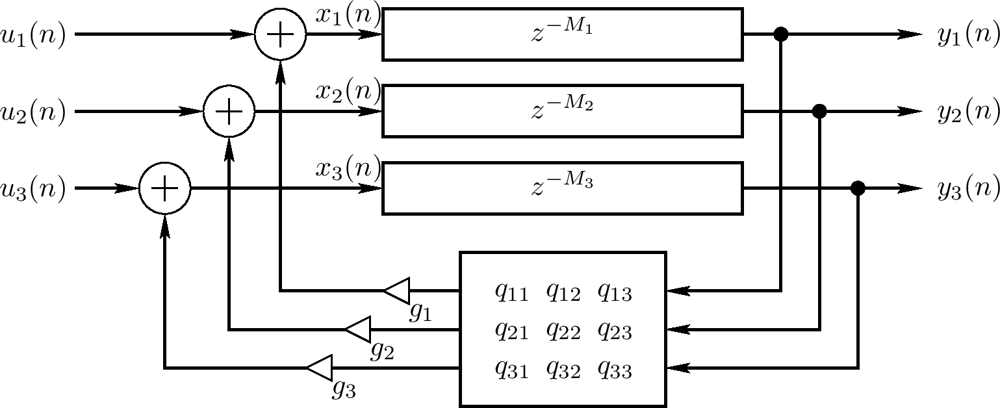
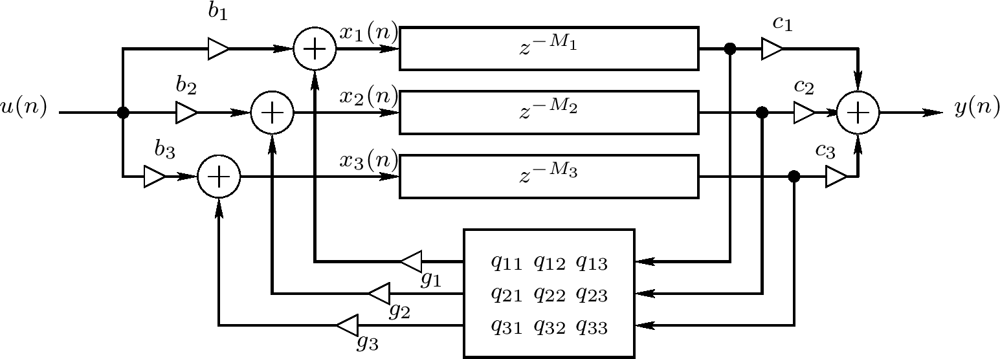

<head>
    
    
</head>

# Table of Contents

1.  [Algorithm](#org51d21f6)
2.  [Review](#org2bb6658)
    1.  [FDN和状态空间描述](#org0ad4d52)
    2.  [单输入、单输出(SISO)FDN](#org555f7a8)
    3.  [FDN稳定性](#org6e78667)
3.  [Tips](#org10f9fb1)
4.  [Share](#org6ee6005)

# Algorithm

Dining: <http://poj.org/problem?id=3281>

<https://dreamume.medium.com/poj-dining-6cee4ffb7ea6>

# Review

反馈延迟网络（FDN）

<https://ccrma.stanford.edu/~jos/pasp/Feedback_Delay_Networks_FDN.html>

FDN可看作为一个向量反馈梳状过滤器，通过用一个对角延迟矩阵替代延迟线，且用一个对角矩阵 $ \\Gamma $乘以一个垂直矩阵Q替代反馈增益g，如上图对N = 3。这个FDN的时间更新可写为

$ \\left[ \\begin{array}{c} x_ {1}(n) \\\\ x_ {2}(n) \\\\ x_ {3}(n) \\end{array} \\right] = \\left[ \\begin{array}{ccc} g_ {1} & 0 & 0 \\\\ 0 & g_ {2} & 0 \\\\ 0 & 0 & g_ {3} \\end{array} \\right] \\left[ \\begin{array}{ccc} q_ {11} & q_ {12} & q_ {13} \\\\ q_ {21} & q_ {22} & q_ {23} \\\\ q_ {31} & q_ {32} & q_ {33} \\end{array} \\right] \\left[ \\begin{array}{c} x_ {1}(n - M_ {1}) \\\\ x_ {2}(n - M_ {2}) \\\\ x_ {3}(n - M_ {3}) \\end{array} \\right] + \\left[ \\begin{array}{c} u_ {1}(n) \\\\ u_ {2}(n) \\\\ u_ {3}(n) \\end{array} \\right] $

输出为

$ \\left[ \\begin{array}{c} y_ {1}(n) \\\\ y_ {2}(n) \\\\ y_ {3}(n) \\end{array} \\right] = \\left[ \\begin{array}{c} x_ {1}(n - M_ {1}) \\\\ x_ {2}(n - M_ {2}) \\\\ x_ {3} (n - M_ {3}) \\end{array} \\right] $

或者，用频域向量记号

$ X(z) = \\Gamma QD(z)X(z) + U(z) $

$ Y(z) = D(z)X(z) $

其

$ D(z) \\triangleq \\left[ \\begin{array}{ccc} z^{-M_ {1}} & 0 & 0 \\\\ 0 & z^{-M_ {2}} & 0 \\\\ 0 & 0 & z^{- M_ {3}} \\end{array} \\right] $

## FDN和状态空间描述

当之前等式的 $ M_ {1} = M_ {2} = M_ {3} = 1 $，FDN缩减为一个正常的状态空间模型

$ x(n + 1) = Ax(n) + u_ {+}(n) $

$ y_ {+}(n) = x(n) $

矩阵 $ A = \\Gamma Q $是状态传输矩阵。向量 $ x(n) = [x_ {1}(n), x_ {2}(n), x_ {3}(n)]^{T} $保持决定系统时刻n状态的状态变量。一个状态空间系统的序等于状态变量数量，例如，x(n)的维度。输入和输出信号重定义为

$ u_ {+}(n) \\triangleq u(n + 1) $

$ y_ {+}(n) \\triangleq y(n + 1) $

为状况空间形式的正常公约

这样，一个FDN可视为一个一般化状态空间模型，一个第N个序线性系统，一般化这里指单位延迟被任意延迟替代。这个反应对分析是有价值的因为状态空间分析工具是有名的且被引入到许多软件库比如matlab

## 单输入、单输出(SISO)FDN

当只有一个输入信号u(n)，输入向量u(n)在上图中可被定义为散输入u(n)乘以一个增益向量

$ u(n) = \\mathbf{B} u(n) $

$ \\mathbf{B} $是一个 $ N \\times 1 $矩阵。相似地，单输出可被一个y(n)的N部分的任意线性组合创建。一个单输入、单输出(SISO)FDN，N = 3的例子如下图

注意当$ M_ {1} = M_ {2} = M_ {3} = 1 $，这个系统适配实现任意形式的转换函数

$ H(z) = \\frac{\\beta_ {1}z^{-1} + \\beta_ {2}z^{-2} + \\beta_ {3}z^{-3}}{1 + a_ {1}z^{-1} + a_ {2}z^{-2} + a_ {3}z^{-3}} $

通过基本状态空间分析，转换函数课被写为FDN系统参数

$ H(z) = \\mathbf{C}^{T}(z \\mathbf{I} - \\mathbf{A})^{-1}\\mathbf{B} $

$ \\mathbf{I} $为$ 3 \\times 3 $单位矩阵。通过用z转换系统的脉冲响应容易看到

上图更一般的情况可用两种方法之一处理：(1)矩阵 $ \\mathbf{A}, \\mathbf{B}, \\mathbf{C} $可被参数为序 $ N = M_ {1} + M_ {2} + M_ {3} $使得三个延迟线被N个单位采样延迟替代，或(2)普通状态空间分析可被一般化为非单位延迟

$ H(z) = \\mathbf{C}^{T} \\mathbf{D}(z)[\\mathbf{I} - \\mathbf{A}\\mathbf{D}(z)]^{-1} \\mathbf{B} $

$ \\mathbf{C}^{T} $记为 $ \\mathbf{C} $的矩阵转置，且

$ \\mathbf{D}(z) \\triangleq \\left[ \\begin{array}{ccc} z^{-M_ {1}} & 0 & 0 \\\\ 0 & z^{-M_ {2}} & 0 \\\\ 0 & 0 & z^{-M_ {3}} \\end{array} \\right] $

在FDN回响应用程序中，$ \\mathbf{A} = \\mathbf{\\Gamma} \\mathbf{Q} $，$ \\mathbf{Q} $是一个垂直矩阵，$ \\mathbf{\\Gamma} $是低通滤波的对角矩阵，每个有增益范围为1

## FDN稳定性

FDN的稳定性是确定的当状态向量x(n)的某些范式随时间减少当输入信号为0。FDN稳定性的一个充分条件是

$ \|\| x(n+1) \| \| < \| \| x(n) \| \| $

对所有 $ n \\ge 0 $，$ \|\| x(n) \|\| $记为x(n)的范式，且

$ x(n+1) = \\mathbf{A} \\left[ \\begin{array}{l} x_ {1}(n- M_ {1}) \\\\ x_ {2}(n-M_ {2}) \\\\ x_ {3}(n - M_ {3}) \\end{array} \\right] $

使用以上提到的参数的状况空间分析，不等式在 $ L_ {2} $范式下成立，反馈矩阵 $ \\mathbf{A} $满足

$ \|\| \\mathbf{A}x \|\|_ {2} < \|\| x \|\|_ {2} $

对所有x，$ \|\| \\cdot \|\|_ {2} $记为 $ L_ {2} $范式，定义为

$ \|\| x \|\|_ {2} \\triangleq \\sqrt{x^{2}_ {1} + x^{2}_ {2} + \\cdots + x^{2}_ {N}} $

即，稳定性在反馈矩阵在它的输入向量的 $ L_ {2} $范式下减少时被保证

矩阵范式对于任意向量范式 $ \| \| \\cdot \| \| $，可被定义为矩阵A为

$ \| \| \\mathbf{A} \| \| \\triangleq max_ {x \\ne 0} \\frac{\| \| \\mathbf{A}x \|\|}{\|\| x \|\|} $

$ \|\| x \|\| $记为向量x的范式。即矩阵范式被一个向量范式引入通过 $ \|\| \\mathbf{A}x \|\| $在空间中所有单位长度向量x的最大值给定。当向量范式为 $ L_ {2} $范式，引入矩阵范式也被称为球形范式。这样，等式可被重新描述为

$ \|\| \\mathbf{A} \|\|_ {2} < 1 $

$ \|\| \\mathbf{A} \|\|_ {2} $记为 $ \\mathbf{A} $的球形范式

它可被显示为一个矩阵 $ \\mathbf{A} $的球形范式通过 $ \\mathbf{A} $的最大单值（$ \|\| \\mathbf{A} \|\|_ {2} = \\sigma_ {1}(\\mathbf{A}) $ ），且这等于 $ \\mathbf{A} \\mathbf{A}^{T} $的最大特征值的平方根，$ \\mathbf{A}^{T} $记为实矩阵 $ \\mathbf{A} $的矩阵转置

因为每个垂直矩阵 $ \\mathbf{Q} $有球形范式，稳定反馈矩阵的一个宽泛变化可被参数化为

$ \\mathbf{A} = \\mathbf{\\Gamma} \\mathbf{Q} $

$ \\mathbf{Q} $是任意垂直矩阵，且 $ \\mathbf{\\Gamma} $是一个对角矩阵，其条目小于1

$ \\mathbf{\\Gamma} = \\left[ \\begin{array}{cccc} g_ {1} & 0 & \\ldots & 0 \\\\ 0 & g_ {2} & \\ldots & 0 \\\\ \\vdots & \\vdots & \\ddots & \\vdots \\\\ 0 & 0 & \\ldots & g_ {N} \\end{array} \\right], \| g_ {i} \| < 1 $

一个替代的稳定性证明基于显示一个FDN是一个被动数字化波浪网络的特殊情况。这个分析揭露了FDN是无损的当且仅当反馈矩阵 $ \\mathbf{A} $有单位模特征值且线性独立特征值

# Tips

设计模式之美 - 设计原则与思想：设计原则

单一职责原则（Single Responsibility Principle），简写为SRP，英文描述为：A class or module should have a single responsibility

在实际开发过程中，我们可以先写一个粗粒度的类，满足业务需求。随着业务的发展，如果粗粒度的类越来越庞大，代码越来越多，这时，我们就可以将这个类拆分成几个更细粒度的类。这就是所谓的持续重构

一些判断类是否职责单一的简单原则：

-   类中的代码行数、函数或属性过多，会影响代码的可读性和可维护性，我们就需要考虑对类进行拆分
-   类依赖的其他类过多，或者依赖类的其他类过多，不符合高内聚、低耦合的设计思想，我们就需要考虑对类进行拆分
-   私有方法过多，我们就要考虑能否将私有方法独立到新的类中，设置为public方法，供更多的类使用，从而提高代码的复用性
-   比较难给类起一个合适名字，很难用一个业务名词概括，或者只能用一些笼统的Manager、Context之类的词语来命名，这就说明类的职责定义得可能不够清晰
-   类中大量的方法都是集中操作类中的某几个属性，比如，在UserInfo例子中，如果一半的方法都是在操作address信息，那就可以考虑将这几个属性和对应的方法拆分出来

一个比较泛泛的标准，就是一个类的代码行数最好不能超过200行，函数个数及属性个数都最好不要超过10个

如何判断类的职责是否足够单一：

-   类中的代码行数、函数或者属性过多
-   类依赖的其他类过多，或者依赖类的其他类过多
-   私有方法过多
-   比较难给类起一个合适的名字
-   类中大量的方法都是集中操作类中的某几个属性

开闭原则最有用，因为扩展性是代码质量最重要的衡量标准之一。在23种经典设计模式中，大部分设计模式都是为了解决代码的扩展性问题而存在的，主要遵从的设计原则就是开闭原则

开闭原则(Open Closed Principle)，简称OCP。英文描述为software entities (modules, classes, functions, etc.) should be open for extension, but closed for modification.

我们可理解开闭原则的设计初衷：只要它没有破坏原有代码的正常运行，没有破坏原有的单元测试，我们就可以说，这是一个合格的代码改动。我们要尽量让修改操作更集中、更少、更上层，尽量让最核心、最复杂的那部分逻辑代码满足开闭原则

为了尽量写出扩展性好的代码，我们要时刻具备扩展意识、抽象意识、封装意识。这些“潜意识”可能比任何开发技巧都重要

写代码的时候要多花点时间往前思考，这段代码未来可能有哪些需求变更、如何设计代码结构，事先留好扩展点，以便在未来需求变更时，不需要改动代码整体结构、做到最小代码改动的情况下，新代码能很灵活地插入到扩展点上，做到“对扩展开放、对修改关闭“

在识别出代码可变部分和不可变部分后，我们将可变部分封装起来，隔离变化，提供抽象化的不可变接口，给上层系统使用。当具体实现发生变化时，我们只需要基于相同的抽象接口，扩展一个新的实现，替换掉老的实现即可，上游系统代码几乎不需要修改

最常用提供代码扩展性的方法有：多态、依赖注入、基于接口而非实现编程，以及大部分的设计模式（比如，装饰、策略、模板、职责链、状态等）

如何在项目中灵活应用开闭原则？最合理的做法是，对一些比较确定的、短期内可能就会扩展，或者需求改动对代码结构影响比较大的情况，或者实现成本不高的扩展点，在编写代码的时候，我们就可以事先做些扩展性设计。对于一些不确定未来是否要支持的需求，或者实现起来比较复杂的扩展点，我们可以等到有需求驱动的时候，再通过重构代码的方式在支持扩展的需求

里氏替换原则英文是: Liskov Substitution Principle，缩写为LSP。1986年提出时英文描述为：

If S is a subtype of T, then objects of type T may be replaced with objects of type S, without breaking the program

1996年Robert Martin重新描述了这个原则，英文原文为

Functions that use pointers of references to base classes must be able to use objects of derived classes without knowing it

接口隔离原则英文为: Interface Segregation Principle，缩写为ISP。Robert Martin在SOLID原则中这样定义它：Clients should not be forced to depend upon interfaces that they do not use

控制反转的英文为：Inversion Of Control，缩写为IOC

依赖注入的英文为：Dependency Injection，缩写为DI，用一句话概括为：不通过new()的方式在类内部创建依赖类对象，而是将依赖的类对象在外部创建好之后，通过构造函数，函数参数等方式传递（或注入）给类使用

依赖反转原则英文为：Dependency Inversion Principle，其英文描述为：

High-level modules shouldn't depend on low-level modules. Both modules should depend on abstractions. In addition, abstractions shouldn't depend on details. Details depend on abstractions

KISS原则的英文描述有好几个版本：

-   Keep It Simple and Stupid
-   Keep It Short and Simple
-   Keep It Simple and Straightforward

如何写出满足KISS原则的代码？

-   不要使用同时可能不懂的技术来实现代码
-   不要重复造轮子，要善于使用已有的工具类库
-   不要过度优化

YAGNI原则英文为：You Ain't Gonna Need It，当前不需要的就不要做

DRY原则英文为：Don't Repeat Yourself

怎么提高代码复用性？

-   减少代码耦合
-   满足单一职责原则
-   模块化
-   业务与非业务逻辑分离
-   通用代码下沉
-   继承、多态、抽象、封装
-   应用模板等设计模式

高内聚、松耦合是非常重要的设计思想，能够有效地提高代码的可读性和可维护性，缩小功能改动导致的代码改动范围

所谓高内聚，就是指相近的功能应该放到同一个类中，不相近的功能不要放到同一个类中。相近的功能往往会被同时修改，放到同一个类中，修改会比较集中，代码容易维护

所谓松耦合，指在代码中，类与类之间的依赖关系简单清晰。即使两个类有依赖关系，一个类的代码改动不会或者很少导致依赖类的代码改动

迪米特法则的英文为：Law of Demeter，它有另一个名字，叫作最小知识原则，英文为：The Least Knowledge Principle

其英文定义为: Each unit should have only limited knowledge about other units: only units "closely" related to the current unit. Or: Each unit should only talk to its friends; Don't talk to strangers

# Share

