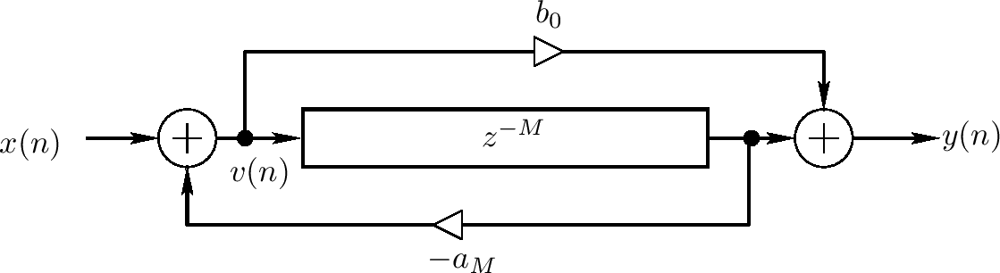
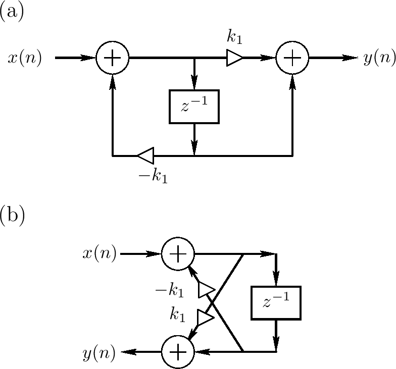
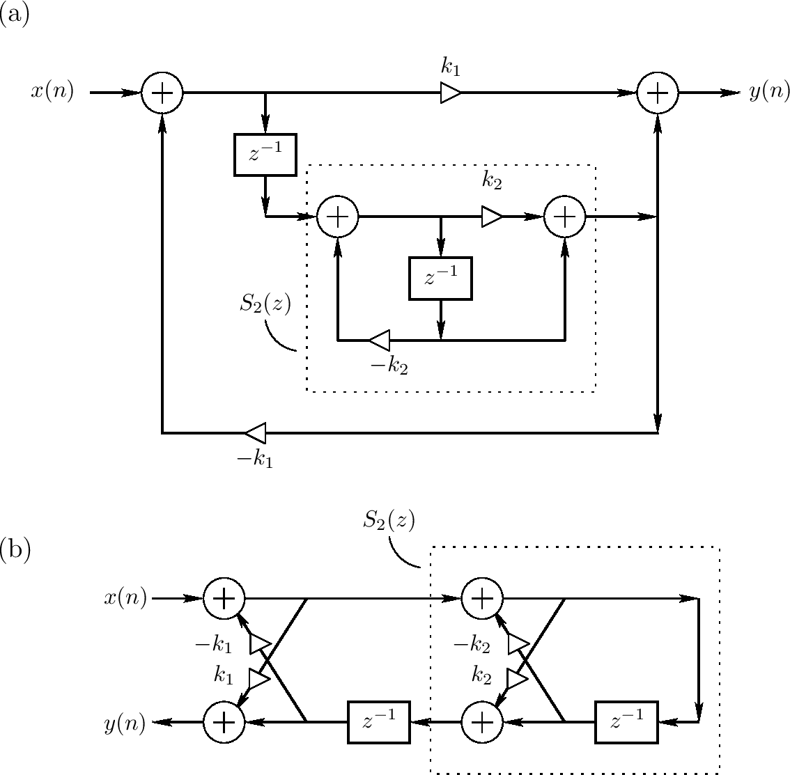

<head>
    
    
</head>

# Table of Contents

1.  [Algorithm](#org689ecab)
2.  [Review](#org73a8408)
    1.  [两个梳状的allpass](#orgff4cf97)
    2.  [嵌套allpass过滤器](#org66c9ef5)
    3.  [更一般化的allpass过滤器](#orgbd3f8aa)
    4.  [allpass过滤器的例子](#orga19d8d8)
    5.  [Gerzon嵌套MIMO Allpass](#orgb977fce)
3.  [Tips](#org5ad50a8)
4.  [Share](#org8748064)
    1.  [简介](#org8a2effb)
    2.  [术语](#orga729741)
    3.  [主要的观察](#org278f898)
    4.  [选择算法](#org6426878)
    5.  [正确性证明](#orgb1800fa)
    6.  [时间复杂度分析](#orgdf6fb27)
    7.  [结论](#orgb0ee6fd)

# Algorithm

Dual Core CPU: <http://poj.org/problem?id=3469>

<https://dreamume.medium.com/poj-dual-core-cpu-b8275155abb2>

# Review

Allpass Filters

<https://ccrma.stanford.edu/~jos/pasp/Allpass_Filters.html>

allpass过滤器对数字音频信号系统来说是一个重要的构建块。它被称为allpass因为所有频率以相同的意义比如低通、高通和bandpass来过滤通过。即一个allpass过滤器的振幅响应对每个频率都是1，而相位响应（其决定延迟）可为任意

实际上，一个过滤器常常被称为allpass如果振幅响应是任意非零常数。然而，在本书中，术语allpass指的是每个频率的整体增益

在本节中，我们将首先通过用一个向后反馈梳妆过滤器叠加一个反馈梳状过滤器来做一个allpass过滤器。这个结构，被认为是Schroeder allpass梳状过滤器，或简单地Schroeder allpass段，扩展用于人造回声和数字音频音效领域。接着我们将通过嵌套它们来创建allpass过滤器；allpass过滤器通过用任意allpass过滤器替代延迟元素（也是allpass过滤器）来嵌套。最后，我们将考虑一般情况，且特征化所有单输入、单输出allpass过滤器的集合

## 两个梳状的allpass

一个allpass过滤器可被定义为任意对所有频率有1增益的过滤器（但典型地是不同频率延迟不同）

它被熟知为反馈前向和反馈梳状过滤器（有相同的延迟）的系列组合来创建一个allpass过滤器，反馈前向系数是反馈系数的负值

上图显示了一个反馈前行/反馈梳状过滤器组合结构，它们共享同一延迟线。微分等式为

$ v(n) = x(n) - a_ {M}v(n - M) $

$ y(n) = b_ {0}v(n) + v(n - M) $

上图系统可被解释为一个使用x(n)到v(n)的反馈反馈梳状过滤器接一个从v(n)到y(n)的反馈前向梳状过滤器。根据LTI系统的交换性，我们可交换顺序获得

$ v(n) = b_ {0}x(n) + x(n - M) $

$ y(n) = v(n) - a_ {M}y(n - M) $

替换上面第一个等式的右边到第二个等式得到更简单地

$ y(n) = b_ {0}x(n) + x(n - M) - a_ {M}y(n - M) $

这可识别为直接形式I，但其需要2M而不是M；然而，不像直接形式II，直接形式I不能有内部的overflow，overflow只能发生在输出

系数 $ b_ {0} $和$ a_ {M} $为对应传输函数的标准记号

$ H(z) = \\frac{b_ {0} + z^{-M}}{1 + a_ {M}z^{-M}} $

频率响应通过设置 $ z = e^{j \\omega T} $获得，$ \\omega $记为辐射频率而T记为每秒的采样周期。对一个allpass过滤器，频率振幅必须对所有 $ \\omega \\in [- \\pi / T, \\pi / T] $相同

所有allpass过滤器当 $ b_ {0} = \\overline{a_ {M}} $时获得，或，对实系数的情况，$ b_ {0} = a_ {M} $。设$ a \\triangleq a_ {M} = \\overline{b_ {0}} $。我们有

$ \| H(e^{j \\omega T}) \| = \| \\frac{\\bar{a} + e^{-j \\omega MT}}{1 + ae^{-j \\omega MT}} \| = \| \\frac{\\bar{a} + e^{-j \\omega MT}}{e^{j \\omega MT} + a} \| = \| \\frac{\\overline{a + e^{j \\omega MT}}}{a + e^{j \\omega MT}} \| = 1 $

## 嵌套allpass过滤器

allpass过滤器的一个有趣的属性是它们可被嵌套。如果 $ H_ {1}(z) $和$ H_ {2}(z) $记为allpass过滤器单位增益函数，则 $ H_ {1}(H_ {2}(z)) $和 $ H_ {2}(H_ {1}(z)) $都是allpass过滤器。一个证明基于观察，因为 $ \| H_ {i}(e^{j \\omega}) \| = 1, H_ {i}(z) $可被视为一个comformal映射，其映射单位圆到自身；因此，所有这样映射的集合在函数组合中是闭合的

嵌套allpass过滤器的一个重要类通过嵌套第一序allpass过滤器的形式获得

$ S_ {i}(z) = \\frac{k_ {i} + z^{-1}}{1 + k_ {i}z^{-1}} $

嵌套开始于 $ H_ {1}(z) \\triangleq S_ {1}(z) $，且$ H_ {2}(z) $通过替换$ H_ {1}(z) $里的$ z^{-1} $为 $ z^{-1}S_ {2}(z) $来获得

$ H_ {2}(z) \\triangleq S_ {1}([z^{-1}S_ {2}(z)]^{-1}) \\triangleq \\frac{k_ {1} + z^{-1}S_ {2}(z)}{1 + k_ {1}z^{-1}S_ {2}(z)} $

上图a描述直接形式II的第一序allpass $ S\_ {1}(z) $，上图b显示相同的过滤器重绘制为两个乘积网格段可被一个乘积网格段替代

总之，嵌套第一序allpass过滤器等于两个乘积网格段的网格过滤器。一个单乘积段在硬件上实现更便宜，它作为一个物理模型有一个额外的直接解释

## 更一般化的allpass过滤器

我们有两种类型的allpass过滤器：

-   反馈和前向反馈梳状过滤器的系列组合当它们的延迟线为相同长度且它们的反馈和前向反馈系数相同时是allpass
-   在allpass过滤器的任意延迟元素可被一个allpass过滤器替代来获得一个新的（更高序）allpass过滤器。嵌套第一序allpass过滤器的特殊情况为上图的网格数字化过滤结构

我们现在讨论SISO情况更一般化的allpass过滤器

定义：一个线性，时间变化过滤器H(z)被称为无损的如果它保留每个输入信号的信号能量。即，如果输入信号是x(n)，且输出信号是y(n) = (h * x)(n)，我们必须有

$ \\sum^{\\infty}_ {n=- \\infty} \| y(n) \|^{2} = \\sum^{\\infty}_ {n=- \\infty} \| x(n) \|^{2} $

$ L_ {2} $的信号范式为 $ \|\| \\cdot \|\|_ {2} $，这可表示为更清晰地

$ \|\| y \|\|^{2}_ {2} = \|\| x \|\|^{2}_ {2} $

注意只有稳定的过滤器可为无损的，因为否则，$ \|\| y \|\| $一般化为无穷的，甚至当 $ \|\| x \|\| $是有限的。我们进一步简化假设所有过滤器是随意的。它直接显示如下:

稳定、线性、时间变化(LTI)过滤转换函数H(z)是无损的当且仅当

$ \| H(e^{j \\omega}) \| = 1, \\qquad \\forall \\omega $

即，频率响应必须在复z平面单位圆的每处振幅为1

这样，无损和单位增益allpass是同义词。对每个频率上增益为g的一个allpass过滤器，过滤器的能量增益对每个输入信号x为$ g^{2} $。因为我们可描述这样的一个过滤器为一个常量增益的allpass时间，术语allpass这里指g = 1的情况

## allpass过滤器的例子

-   最简单的allpass过滤器是单位调制增益
    
    $ H(z) = e^{j \\phi} $
    
    $ \\phi $可为任意相值。在实际情况中 $ \\phi $只可能为0或 $ \\pi $，这样 $ H(z) = \\pm 1 $

-   一个无损FIR过滤可只包含一个单个非零拍打
    
    $ H(z) = e^{j \\phi}z^{-K} $
    
    对某些固定整数K，$ \\phi $是某个常量相值，在实际过滤中限制为0或 $ \\pi $。因为我们只考虑随意过滤器，$ K \\ge 0 $。作为这个例子的一个特殊情况，一个单位延迟$ H(z) = z^{-1} $是一个简单的FIR allpass过滤器

-   每个有限序、随意、无损IIR数字化过滤器（迭代allpass过滤器）的转换函数可写为
    
    $ H(z) = e^{j \\phi}z^{-K} \\frac{\tilde{A}(z)}{A(z)} $
    
    $ K \\ge 0, A(z) = 1 + a_ {1}z^{-1} + a_ {2}z^{-2} + \\cdots + a_ {N}z^{-N} $，且$ \\tilde{A}(z) \\triangleq z^{-N}\\bar{A}(z^{-1}) $。多项式 $ \\tilde{A}(z) $可通过在A(z)中反转序的系数获得

总之，每个SISO allpass过滤器可被表达为单位调制增益因子的乘积，一个纯延迟和一个IIR转换函数其分子是分母的反转

## Gerzon嵌套MIMO Allpass

一个有趣的单输入单输出Schroeder allpass过滤器的一般化形式被Gerzon在人造反响系统中提出

开始点可为第一序allpass如上图，或两个梳状过滤器制作的allpass如上上图，在这些情况中

-   所有信号路径从离散量转换为N维向量
-   延迟元素（或延迟线）被一个任意 $ N \\times N $单位矩阵频率响应替代

设x(n)记为$ N \\times 1 $输入向量，其成员为$ x_ {i}(n), i = 1, \\ldots, N $，且设$ X(z) = [X_ {1}(z), \\ldots, X_ {N}(z)] $记为z转换的对应向量。记 $ N \\times 1 $输出向量为y(n)

结果向量微分等式变成，在频率域

$ \\underline{Y}(z) = \\bar{g} \\underline{X}(z) + U(z) \\underline{X}(z) - g U(z) \\underline{Y}(z) $

其导致矩阵转换函数

$ H(z) = [I + gU(z)]^{-1} [\\bar{g} I + U(z)] $

I记为$ N \\times N $单位矩阵，U(z)记为任意paraunitary矩阵转换函数

注意避免实现U(z)两次，H(z)应该用向量直接形式II实现

$ \\underline{v}_ {d}(n) = U(d)\\underline{v}(n) = Z^{-1}_ {n} \\{U(z) \\underline{v}(z) \\} $

$ \\underline{v}(n) = \\underline{x}(n) - g \\underline{v}_ {d}(n) $

$ \\underline{y}(n) = \\underline{v}(n) + \\bar{g} \\underline{v}_ {d}(n) $

d记为单位延迟操作（$ d^{k}x(n) \\triangleq x(n - k) $）

为避免延迟自由循环，paraunitary矩阵在每一行必须包含至少一个纯延迟，例如，$ U(z) = z^{-1}U^{\\prime}(z) $是paraunitary和随意的

Gerzon建议使用U(z)形式

$ U(z) = D(z)Q $

Q是一个简单的$ N \\times N $垂直矩阵，且

$ D(z) = \\left[ \\begin{array}{ccccc} z^{-m_ {1}} & 0 & 0 \\ldots & 0 \\\\ 0 & z^{-m_ {2}} & 0 & \\ldots & 0 \\\\ 0 & 0 & z^{-m_ {3}} & \\ldots & 0 \\\\ \\vdots & \\vdots & \\vdots & \\ldots & \\vdots \\\\ 0 & 0 & 0 & \\ldots & z^{-m_ {N}} \\end{array} \\right] $

是一个纯延迟的对角矩阵，$ m\_ {i} $长度选择为互质（Schroeder建议对Schroeder allpass段的系列组合）。这个结构非常接近典型的反馈延迟网络(FDN)，但不像FDN是向量反馈梳状过滤器，向量化Schroeder allpass是一个纯的多输入、多输出(MIMO)allpass过滤器

Gerzon进一步建议用有振幅响应边界为1的数字化过滤器 $ \\pm G(z) $替代反馈和前向反馈增益 $ \\pm g $。原理上，这允许在每个频率上网络为任意不同的

Garzon的向量Schroeder allpass用在IRCAM Spatialisateur里

# Tips

设计模式之美 - 设计原则与思想：规范与重构

为什么要重构？软件设计大师Martin Fowler是这样定义重构的：“重构是一种对软件内部结构的改善，目的是在不改变软件的可见行为的情况下，使其更易理解，修改成本更低。“我们可以理解为在保持功能不变的前提下，利用设计思想、原则、模式、编程规范等理论来优化代码，修改设计上的不足，提高代码质量

首先，重构是时刻保证代码质量的一个极其有效的手段，为避免代码不断增多而导致越来越混乱

其次，优秀的代码或架构不是一开始就能完全设计好的，需要迭代，随着系统的演进，重构不可避免

最后，重构是避免过度设计的有效手段，在遇到问题时再对代码进行重构，避免前期投入太多时间做过度设计

大型重构指的是对顶层代码设计的重构，包括：系统、模块、代码结构、类与类之间的关系等的重构，重构的手段有：分层、模块化、解耦、抽象可复用组件等等

小型重构指的是对代码细节的重构，主要是针对类、函数、变量等代码级别的重构，比如规范命名、规范注释、消除超大类或函数、提取重复代码等

比较好的一个策略是持续重构、有时间的时候就可以主动重构

大型重构需要提前做好完善的重构计划，有条不紊地分阶段来进行。每个阶段完成一小部分代码的重构，然后提交、测试、运行，发现没有问题之后，再继续进行下一阶段的重构，保证代码仓库中的代码一直处于可运行、逻辑正确的状态

大规模高层次的重构一定是有组织、有计划，并且非常谨慎的，需要有经验、熟悉业务的资深同事来主导。而小规模低层次的重构，因为影响范围小，改动耗时短，所以，有时间随时可以做

为保证重构不出错，最可落地执行、最有效的保证重构不出错的手段应该就是单元测试

对于大型重构，最有效的一个手段就是解耦，解耦的目的是实现代码高内聚、松耦合

解耦的手段：

-   封装与抽象
-   引入中间层
-   模块化
-   其他设计思想和原则

# Share

Selection in X+Y and Matrices with sorted rows and columns

<http://www.cse.yorku.ca/~andy/pubs/X+Y.pdf>

## 简介

在本文中我们考虑已排序的行和列的矩阵的选择问题。选择X + Y，X、Y为排序数组，是本问题的特殊例子

设 $ X = (x_ {1}, x_ {2}, \\ldots, x_ {n}) $和 $ Y = (y_ {1}, y_ {2}, \\ldots, y_ {n}) $为两个实数数组。Cartesian和X + Y是 $ n \\times n $矩阵，第ij条目为 $ x_ {i} + y_ {j} $。如果X和Y为排序的，则X + Y是一个按行和列排序后的矩阵。X + Y的选择和其他相关问题已因统计和运筹的应用程序而引起关注。同样该问题出现在一些VLSI设计中

Jefferson, Shamos和Tarjan呈现了在 $ O(n \\log{n}) $时间复杂度内解决选择X + Y的中位数问题。Johnson和Mizoguchi给出一个 $ O(n \\log{n}) $算法选择X + Y中第k小的元素。这两个算法都在算法应用之前排序数组X和Y。尽管需要时间来排序X和Y，这两个算法依然只需要$ O(n \\log{n}) $时间复杂度。Fredericks和Johnson考虑排序列来在矩阵中选择。这些选择X + Y中第k大元素的算法, $ 1 \\le k \\le \\frac{1}{2} n^{2} $，时间复杂度为 $ O(max \\{n, n \\log{(k/n)} \\}) $。他们也给出对已排序行和列的矩阵的选择问题的O(n)时间复杂度算法

设A为一个$ n \\times n $实数矩阵，行和列已排序，设k为一个整数，$ 1 \\le k \\le n^{2} $。我们呈现一个O(n)时间复杂度算法来选择A的第k小元素。本文呈现的算法应用分治技术。这个方法可应用到相似顺序相关问题。例如，我们使用这个技术来获得一个线性时间算法在VLSI中处理频道路由的最佳偏移问题。虽然Frederickson和Johnson算法有一个相似的时间边界，本文呈现的算法更简单。同样我们的算法使用的技术也很实用

## 术语

设A为一个$ n \\times n $的实数矩阵。A的元素不必不同。我们假设A的行和列索引为$ 1, 2, \\ldots, n $。我们称A为有序的如果每行的元素是非增序，每列元素是非减序。设 $ \\bar{n} = \\lceil \\frac{1}{2} (n+1) \\rceil $。A的子矩阵 $ \\bar{A} $是一个 $ \\bar{n} \\times \\bar{n} $矩阵且被定义为包含奇数索引号行列的A的子矩阵，加上n为偶数时A的最后的行和列。设L为一个实数列表，a为一个实数。我们定义 $ rank^{+} $和 $ rank^{-} $的a在L中如下：

$ rank^{+}(L, a) = \| \\{ x \\in L \| x > a \\} \| $

$ rank^{-}(L, a) = \| \\{ x \\in L \| x < a \\} \| $

假设$ 1 \\le k \\le \| L \| $。则a被定义为L的第k小元素当且仅当$ rank^{-}(L, a) \\le k - 1 $和 $ rank^{+}(L, a) \\le \| L \|  - k $。为简化，本文中我们使用术语L的第k个元素表示L的第k小元素

## 主要的观察

如下定理是我们的选择算法的基础

**定理3.1** 设A为一个 $ n \\times n $有序矩阵且 $ \\bar{A} $为如之前描述的A的子矩阵。则，对任意实数a，如下不等式成立：

(i) $ rank^{-}(A, a) \\le 4 rank^{-}(\\bar{A}, a) $

(ii) $ rank^{+}(A, a) \\le 4 rank^{+} (\\bar{A}, a) $

证明：我们只证明(i)。(ii)的证法跟(i)相似。设 $ \\bar{A}_ {L} $包含 $ \\bar{A} $小于a的元素，则

$ \| \\bar{A}_ {L} \| = rank^{-}(\\bar{A}, a) $

设 $ A_ {L} $为A的部分包含：

(a) $ \\bar{A}_ {L} $和

(b) 对 $ A_ {ij} \\in \\bar{A}_ {L} $的每个元素，它在 $ A - \\bar{A} $的邻居元素 $ A_ {ij-1}, A_ {i+1, j-1}, A_ {i+1, j} $。因为矩阵A是有序的，$ A_ {L} $包含A的所有小于a的元素。这样

$ \| A_ {L} \| \\ge rank^{-}(A, a) $

通过$ A_ {L} $从 $ \\bar{A}_ {L} $的构造我们有

$ \| A_ {L} \| \\le 4 \| \\bar{A}_ {L} \| $

从这些式子中我们得到 $ rank^{-}(A, a) \\le 4 rank^{-}(\\bar{A}, a) $

## 选择算法

在描述选择算法细节之前我们呈现一个在 $ n \\times n $有序矩阵A上计算一个实数a的$ rank^{-} $的O(n)时间复杂度算法。$rank^{+} $的计算相似

$ \\begin{array}{l} function \\, rank^{-}(A, a); \\\\ \\qquad begin \\\\ \\qquad \\qquad j = 1; x = 0; \\\\ \\qquad \\qquad \\text{for } i = 1 \\text{ to } n \\text{ do begin} \\\\ \\qquad \\qquad \\qquad \\text{while } j \\le n \\text{ and } A_ {ij} \\ge a \\text{ do } j = j + 1; \\\\ \\qquad \\qquad \\qquad x = x + n - j + 1 \\\\ \\qquad \\qquad \\qquad end; \\\\ \\qquad \\qquad \\qquad \\text{return } x \\\\ \\qquad end; \\end{array} $

如上代码是O(n)时间复杂度计算$ rank^{-}(A, a) $的方法。设pick(L, k)为一个函数，L为一个列表，k为一个整数，$ 1 \\le k \\le \| L \| $，且在 $ O(\| L \|) $时间复杂度上返回L的第k个元素

我们的选择算法的思想是从 $ \\bar{A} $中递归选择两个元素a和b，$ a \\ge b $，使得如下成立：

(1) A的第k个元素在a和b之间

(2) 小于a且大于b的A的元素的个数为O(n)

$ \\begin{array}{l} \\text{function } select(A, k); \\\\ \\qquad begin \\\\ \\qquad \\qquad (x, y) = biselect(n, A, k, k); \\\\ \\qquad \\qquad return x \\\\ \\qquad \\text{end } select; \\end{array} $

$ \\begin{array}{l} \\text{function } biselect(n, A, k_ {1}, k_ {2}); \\\\ \\qquad begin \\\\ 1. \\qquad \\text{if } n \\le 2 \\\\ 2. \\qquad \\text{then } (x, y) = (k_ {1}th \\text{ of } A, k_ {2}th \\text{ of } A) \\\\ \\qquad \\text{else begin} \\\\ 3. \\qquad \\qquad (a, b) = biselect(\\bar{n}, \\bar{A}, \\bar{k}_ {1}, \\bar{k}_ {2}); \\\\ 4. \\qquad \\qquad ra^{-} = rank^{-}(A, a); \\\\ 5. \\qquad \\qquad rb^{+} = rank^{+}(A, b); \\\\ 6. \\qquad \\qquad L = \\{A_ {ij} \| a > A_ {ij} > b \\}; \\\\ 7. \\qquad \\qquad \\text{if } ra^{-} \\le k_ {1} - 1 \\text{ then } x = a \\\\ 8. \\qquad \\qquad \\qquad \\text{else if } k_ {1} + rb^{+} - n^{2} \\le 0 \\text{ then } x = b \\\\ 9. \\qquad \\qquad \\qquad \\qquad \\text{else } x = pick(L, k_ {1} + rb^{+} - n^{2}); \\\\ 10. \\qquad \\qquad \\text{if } ra^{-} \\le k_ {2} - 1 \\text{ then } y = a \\\\ 11. \\qquad \\qquad \\qquad \\text{else if } k_ {2} + rb^{+} - n^{2} \\le 0 \\text{ then } y = b \\\\ 12. \\qquad \\qquad \\qquad \\qquad \\text{else } y = pick(L, k_ {2} + rb^{+} - n^{2}) \\\\ \\qquad \\qquad end; \\\\ 13. \\qquad \\qquad return (x, y) \\\\ \\qquad \\text{end biselect}; \\end{array} $

本文的主要结果是函数select(A, k)，见如上代码，在O(n)时间复杂度内计算一个 $ n \\times n $有序矩阵A的第k个元素。函数select调用递归函数 $ biselect(n, A, k_ {1}, k_ {2}), k_ {1} \\ge k_ {2} $，返回(x, y)，x是 $ n \\times n $矩阵A的第 $ k_ {1} $和 $ k_ {2} $个元素。设 $ \\bar{k}_ {1} $和 $ \\bar{k}_ {2} $定义如下：

$ \\bar{k}_ {1} = \\left\\{ \\begin{array}{ll} n + 1 + \\lceil \\frac{1}{4} k_ {1} \\rceil & \\text{if n is even,} \\\\ \\lceil \\frac{1}{4} (k_ {1} + 2n + 1) \\rceil & \\text{if n is odd} \\end{array} \\right. $

$ \\bar{k}_ {2} = \\lfloor \\frac{1}{4} (k_ {2} + 3) \\rfloor $

$ \\bar{k}_ {1} $被选择为最小的整数使得 $ \\bar{A} $的第 $ \\bar{k}_ {1} $个元素至少和A的第 $ k_ {1} $个元素一样大。$ \\bar{k}_ {2} $被选择为最大的整数使得 $ \\bar{A} $的第 $ \\bar{k}_ {2} $个元素不大于A的第 $ k_ {2} $个元素。算法中，A的第i个相缩写为A的第i个元素。函数biselect的第一个参数n是函数第二个参数所表示的子矩阵的维度。我们假设要么矩阵A在计算之前在内存中，要么A的元素可在需要时被计算。如果A为X + Y的形式，则只有向量X和Y需要在内存中

## 正确性证明

为了证明正确性和算法的时间复杂度，我们需要如下引理

**引理5.1** 在算法中，当 $ biselect(n, A, k_ {1}, k_ {2}) $被调用时，如下成立：

(i) $ n^{2} \\ge k_ {1} \\ge k_ {2} \\ge 1 $

(ii) $ k_ {1} - k_ {2} \\le 4n - 4 $

证明：我们使用归纳法。函数biselect第一次调用时选择 $ k_ {1} = k_ {2} = k $和 $ n^{2} \\ge k \\ge 1 $。因此，(i)和(ii)这时成立。否则，算法在第3行调用biselect。这时，通过归纳假设，我们有 $ n^{2} \\ge k_ {1} \\ge k_ {2} \\ge 1 $ 和 $ k_ {1} - k_ {2} \\le 4n - 4 $。进一步，$ n \\ge 3 $。我们考虑两种情况，取决于n是奇数还是偶数

情况1（n是偶数）：在这种情况下，$ \\bar{n} $，$ \\bar{A} $的维度，是 $ \\frac{1}{2} (n + 2) $。使用之前的公式，容易得到 $ \\bar{k}_ {1} \\le \\bar{n}^{2}, \\bar{k}_ {1} \\ge 1 $且 $ \\bar{k}_ {1} - \\bar{k}_ {2} \\ge 0 $。因此，(i)成立。进一步，$ \\bar{k}_ {1} - \\bar{k}_ {2} \\le 2n = 4 \\bar{n} - 4 $

情况2（n是奇数）：这种情况相似

我们这样得到在这两种情况下，$ \\bar{n} \\ge \\bar{k}_ {1} \\ge \\bar{k}_ {2} \\ge 1 $和 $ \\bar{k}_ {1} - \\bar{k}_ {2} \\le 4 \\bar{n} - 4 $。得证

**定理5.2** 设A为一个 $ n \\times n $有序矩阵且 $ n^{2} \\ge k_ {1} \\ge k_ {2} \\ge 1 $。则 $ biselect(n, A, k_ {1}, k_ {2}) $返回A的第 $ k_ {1} $和第 $ k_ {2} $个元素

证明：设 $ x^{* } $和 $ y^{* } $为A的第 $ k_ {1} $和第 $ k_ {2} $个元素。我们显示，通过归纳法，$ biselect(n, A, k_ {1}, k_ {2}) $返回 $ (x^{ * }, y^{ * }) $

当 $ n \\le 2 $时，明显成立

当n > 2时，通过引理5.1的(i)，我们有 $ \\bar{n}^{2} \\ge \\bar{k}_ {1} \\ge \\bar{k}_ {2} \\ge 1 $，$ \\bar{A} $ 是一个 $ \\bar{n} \\times \\bar{n} $的有序矩阵，且 $ \\bar{n} < n $。因此，通过归纳假设，在算法第3行，a是$ \\bar{A} $的第 $ \\bar{k}_ {1} $且b是第$ \\bar{k}_ {2} $个元素。这意味着

$ rank^{+}(\\bar{A}, a) \\le \\bar{n}^{2} - \\bar{k}_ {1} $

且

$ rank^{-}(\\bar{A}, b) \\le \\bar{k}_ {2} - 1 $

用定理3.1，我们有

$ rank^{+}(A, a) \\le 4 \\bar{n}^{2} - 4 \\bar{k} $

且

$ rank^{-}(A, b) \\le 4 \\bar{k}_ {2} - 4 $

现在，通过对 $ \\bar{n}^{2}, \\bar{k}_ {1}, \\bar{k}_ {2} $进行适当的公式替换，我们获得

$ rank^{+}(A, a) \\le n^{2} - k_ {1} $

$ rank^{-}(A, b) \\le k_ {2} - 1 $

因此我们有 $ a \\ge x^{ * } \\ge y^{ * } \\ge b $。如果x是第7行赋的值，则 $ rank^{-}(A, a) = ra^{-} \\le k_ {1} - 1 $。结合不等式(5.1)，有 $ x^{ * } = a = x $。如果x是第8行赋的值，则 $ rank^{+}(A, b) = rb^{+} \\le n^{2} - k_ {1} $，结合不等式(5.2)和$ k_ {2} \\le k_ {1} $，意味着 $ x^{ * } = b = x $。最后，如果在第9行赋的值，则 $ ra^{-} > k_ {1} - 1 $和 $ rb^{+} > n^{2} - k_ {1} $。这意味着 $ a > x^{ * } > b $。因此，$ x^{ * } \\in L $，且通过定义我们有 $ \| L \| = ra^{-} + rb^{+} - n^{2} $。从这里我们有 $ \| L \| \\ge k_ {1} + rb^{+} - n^{2} \\ge 1 $。因此第9行的赋值是有意义的且执行后我们有

$ \\begin{aligned} rank^{-}(A, x) &= rank^{-}(L,x) + (n^{2} - rb^{+}) \\\\ &= \\le (k_ {1} + rb^{+} - n^{2} - 1) + (n^{2} - rb^{+}) \\\\ &= k_ {1} - 1 \\end{aligned} $

$ \\begin{aligned} rank^{+}(A, x) &= rank^{+}(L, x) + (n^{2} - ra^{-}) \\\\ &\\le (\| L \| - (k_ {1} + rb^{+} - n^{2})) \\\\ &+ (n^{2} + ra^{-}) \\\\ &= n^{2} - k_ {1} \\end{aligned} $

因此，$ x = x^{ * } $，对一个相似的讨论，我们有 $ y = y^{ * } $，得证

**定理5.3** 函数select(A, k)正确地计算出$ n \\times n $有序矩阵的第k个元素，$ 1 \\le k \\le n^{2} $

## 时间复杂度分析

如下定理和推论可得出选择算法声称的时间复杂度

**定理6.1** 如果A是一个 $ n \\times n $有序矩阵且 $ n^{2} \\ge k \\ge 1 $，则select(A, k)在O(n)时间复杂度内可计算出第k个元素

证明：我们首先显示算法第6行的 $ \| L \| $，满足 $ \| L \| = O(n) $。在第3行，我们有 $ a \\ge b $。如果a = b，则L是空的。否则，从L的定义我们有

$ \| L \| = rank^{-}(A, a) + rank^{+}(A, b) - n^{2} $

使用定理3.1和5.2和引理5.1(ii)，我们有

$ \| L \| \\le 12n $

从上面的分析我们有第9行、第12行、第4行、第5行、第6行也是O(n)，如果T(n)是biselect的时间复杂度，则

T(n) = O(1) $ \\qquad n \\le 2 $

且

$ T(n) = T(\\lceil \\frac{1}{2} (n+1) \\rceil) + O(n) $ 对 n > 2

因此，T(n) = O(n)

**推论6.2** $ n \\times n $有序矩阵A的第k个元素可在 $ O(min\\{ n, k, n^{2} - k\\}) $时间复杂度内找到

证明：定理6.1显示A中的选择可在O(n)时间复杂度内解决。如果k < n，则考虑A的 $ k \\times k $子矩阵B,包含A的最后一行和一列。A的第k个元素也是B的第k个元素可在O(k)时间复杂度内找到。一个相似的讨论对 $ n^{2} - k < n $的情况也成立

## 结论

在本文中我们呈现了对有序矩阵一个高效实用的选择算法。算法基于分治技术。例如，我们已使用这个技术对VLSI的频道路由的最佳偏移问题获得了一个线性时间算法
