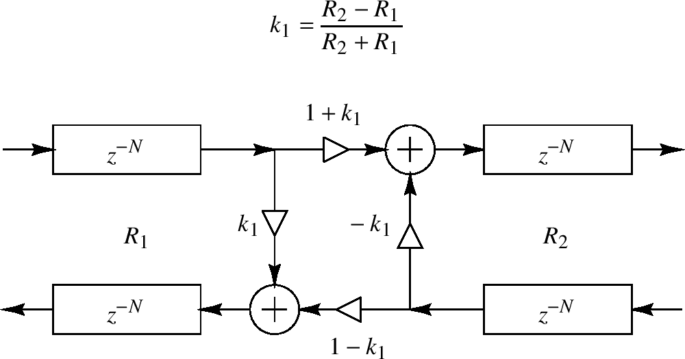

<head>
    
    
</head>

# Table of Contents

1.  [Algorithm](#org5fe127e)
2.  [Review](#org6b4db3d)
    1.  [信号扩散](#org0ac77df)
    2.  [数字化波浪指导网络](#orgf8371aa)
3.  [Tips](#orgfaca978)
4.  [Share](#orgc8627ce)
    1.  [预热：小N](#org115fd67)
    2.  [很大或未知的N](#orgf4c4817)

# Algorithm

Farm Tour: <http://poj.org/problem?id=2135>

<https://dreamume.medium.com/poj-farm-tour-630b2ce8b0d7>

# Review

Allpass数字化波浪指导网络

<https://ccrma.stanford.edu/~jos/pasp/Allpass_Digital_Waveguide_Networks.html>

我们现在描述多输入多输出(MIMO)的allpass过滤器类型，其使用闭合波浪指导网络。我们将看到反馈延迟网络可作为一个特殊情况获得

## 信号扩散

对声学一个基本的事实是旅行波浪只发生在统一媒介中。对一个统一的媒介，

对声学一个基本的事实是旅行波浪只发生在统一媒介中。对一个统一的媒介，它的波浪阻抗必须为常量。当一个旅行波浪出现一个波浪抗阻的改变，它将反射，至少部分会。如果反射不是总的，它将部分转换为新的阻抗。这被称为旅行波浪的扩散

设 $ R_ {1} $记为在某些波浪指导中的阻抗常量，比如拉伸的钢绳或声学容忍。然后信号通过波浪抗阻从 $ R_ {1} $到 $ R_ {2} $的改变扩散。我们可描述部分反射和传输如下图

上图在两个方向上反射和传输的计算被称为一个扩散汇集

源于附录C，对力或压力波浪，反射系数 $ k_ {1} $被给出为

$ k_ {1} = \\frac{R_ {2} - R_ {1}}{R_ {2} + R_ {1}} $

即一个旅行压力波浪离开阻抗 $ R_ {1} $且进入阻抗 $ R_ {2} $的反射系数被给出为在阻抗和上的阻抗步。反射系数 $ k_ {1} $为扩散汇聚的完全特征

对速度旅行波浪，反射系数为力/压力波浪的负，或 $ - k_ {1} $

信号扩散是无损的，例如，波浪能量要么创建要么销毁。这意味着对一个旅行压力波浪离开阻抗 $ R_ {1} $且进入阻抗 $ R_ {2} $的传输系数被给定为

$ t_ {1} = 1 + k_ {1} $

对速度波浪，传输系数是 $ t_ {1} = 1 - k_ {1} $，也许更加直观

## 数字化波浪指导网络

一个数字化波浪指导网络（DWN）包含通过扩散汇聚连接的数字化波浪指导的任意数量。例如，当两个数字化波浪指导作为它们的末端连接到一起时，我们获得一个两点的扩散汇聚，如上图。当三个或多个波浪指导在一个点连接，我们获得一个多点的扩散汇聚。即一个数字化波浪指导网络在数字化波浪指导有任何波浪阻抗连接时形成。因为DWN是无损的，它们提供了一个系统意义的构建非常大型类型的MIMO allpass过滤器

考虑如下问题：

在什么条件下我给出在一个给定allpass过滤器中的一个点的信号到在任意频率没有修改信号能量的一些其他点?

即我们如何添加反馈路径，最大化递归反馈结构的丰富性，当维持一个总体的allpass结构的时候？

数字化波浪指导接近allpass设计回答这个问题通过维持一个系统中对所有延迟元素的物理的解释。allpass过滤器在闭合、能量保留网络中可无损排列数字化波浪指导

# Tips

设计模式之美 - 设计模式与范式：创建型

单例模式的问题：

1.  对OOP特性的支持不友好
2.  隐藏了类之间的依赖关系
3.  对代码的扩展性不友好
4.  对代码的可测试性不友好
5.  不支持有参数的构造函数

什么时候该用工厂方法模式，而非简单工厂模式呢？当对象的创建逻辑比较复杂，不只是简单的new一下就可以，而是要组合其他类对象，做各种初始化操作的时候，我们推荐使用工厂方法模式，将复杂的创建逻辑拆分到多个工厂类中，让每个工厂类都不至于过于复杂

如果对象的创建成本比较大，而同一个类的不同对象之间差别不大（大部分字段都相同），在这种情况下，我们可以利用对已有对象（原型）进行复制（或者叫拷贝）的方式，来创建新对象，以达到节省创建时间的目的。这就是原型模式

# Share

Reservoir sampling

<https://people.orie.cornell.edu/snp32/orie_6125/algorithms/reservoir-sampling.html>

蓄水池采样是一个选择N个元素的随机K大小子集的算法，N非常大且可能未知。我们假设k < N

## 预热：小N

假设我们有一个N个元素的列表，我们想要有一个统一随机的K个元素大小的随机采样。如果N已知且足够小则N个元素的列表可放入内存中，这样我们可找到我们的子集。使用一个Fisher-Yates混淆产生一个N个元素的随机排序，且选择列表中头k个元素。因为我们对所有N个元素进行随机排序，任意头k个元素的k大小子集的概率是相同的。Fisher-Yates混淆算法如下

$ \\text{SHUFFLE(xs, k)} \\\\ \\qquad \\text{let n = length xs} \\\\ \\qquad \\text{for i = 1 to k} \\\\ \\qquad \\qquad \\text{let j = draw uniformly at random from } \\{i, i + 1, \\ldots, n\\} \\\\ \\qquad \\qquad \\text{swap xs[i], xs[j]} $

该算法使用O(n)时间复杂度来混淆n个元素。我们可改进到O(k)且只需要混淆头k个元素如下

$ \\text{SHUFFLE(xs, k)} \\\\ \\qquad \\text{let n = length xs} \\\\ \\qquad \\text{for i = 1 to k} \\\\ \\qquad \\qquad \\text{let j = draw uniformly at random from } \\{i, i+1, \\ldots, n\\} \\\\ \\qquad \\qquad \\text{swap xs[i], xs[j]} $

采样算法使用O(k)时间复杂度和O(N)空间复杂度，且需要知道N的值

## 很大或未知的N

我们的算法扩展如下。当我们处理列表每个元素时我们维持一个k个元素的蓄水池，其代表我们当前的一个随机k大小子集的选择。当我们加一个新元素到列表中，我们以一个适当的概率替代一个蓄水池中的元素。伪代码如下

$ \\text{SAMPLE(k, list)} \\\\ \\qquad \\backslash \\backslash \\text{Initialization; get the first k element} \\\\ \\qquad \\text{for i = 1 to k} \\\\ \\qquad \\qquad \\text{let r[i] = list[i]} \\\\ \\\\ \\qquad \\backslash \\backslash \\text{Inductive step} \\\\ \\qquad \\text{let } i = k + 1 \\\\ \\qquad \\text{while list has an element at i} \\\\ \\qquad \\qquad \\text{let } x = list[i] \\\\ \\qquad \\qquad \\text{with probability } k / i \\\\ \\qquad \\qquad \\qquad \\text{let j = draw uniformly at random from } \\{1, 2, \\ldots, k\\} \\\\ \\qquad \\qquad \\qquad \\text{let } r[j] = x \\\\ \\qquad \\qquad \\text{let } i = i + 1 $

为证明算法是正确的，我们维持如下引导不变量。我们现在显示对一般的i == k它成立。设i > k，且假设不变量在处理元素i-'时保存为真。因为总共有i个元素且我们用适当的概率选择新元素。另外，通过我们的不变量子集中的头i-1个元素有概率k / (i - 1)。任意这样的元素被新元素替换的概率为(k / i) / k = 1 / i。这样子集中任意头i - 1个元素在迭代中还在子集中的概率为 $ (k / (i - 1) \\cdot (1 - 1 / i) = k / i) $

我们显示了任意在子集中的元素的概率是正确的；然而，我们需要显示任意k大小子集被选中的概率是一样的。设任意k大小子集的头i个元素以给定。我们需要选择这个子集的概率为 $ {i \\choose k}^{-1} $。有两种情况要考虑：要么元素i在子集中，要么不在。第一种情况从我们的不变量中这个子集被选择的概率为

$ {(i - 1) \\choose k}^{-1} (1 - k / i) = \\frac{k! (i - k - 1)!}{(i-1)!} \\cdot \\frac{i - k}{i} = \\frac{k! (i - k)!}{i!} = {i \\choose k}^{-1} $

否则，我们需要所有但第i个元素在之前的子集中，其发生的概率为 $ (i - k) {(i-1) \\choose k}^{-1} $，因为有(i - k)个k大小子集包含头(k - 1)个我们组的元素。我们然后需要用一个新的元素替代旧的，其发生的概率为 $ ((k / i) \\cdot (1 / k)) $。总之，在第i个元素被处理之后我们以给出子集的概率为

$ (i - k) {(i - 1) \\choose k}^{-1} \\frac{k}{i} \\cdot \\frac{1}{k} = \\frac{(i-k)}{i} \\cdot \\frac{k! (i - 1 - k)!}{(i - 1)!} = \\frac{k! (i - k)!}{i!} = {i \\choose k}^{-1} $

得证

