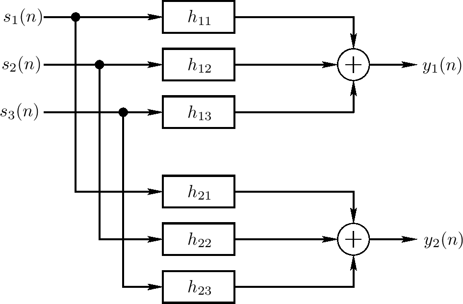

<head>
    
    
</head>

# Table of Contents

1.  [Algorithm](#org888bea0)
2.  [Review](#org0ea7ff2)
3.  [Tips](#orgccc3f60)
    1.  [回响问题](#org0f07e1d)
        1.  [基于转换函数模型的精确反响](#org2092619)
        2.  [精确反响的复杂度](#org5d7a85f)
        3.  [一个物理反响模型的可能性](#org3aaa599)
4.  [Share](#org71ba78e)

# Algorithm

Evacuation Plan: <http://poj.org/problem?id=2175>

<https://dreamume.medium.com/poj-evacuation-plan-4a640b82bab5>

# Review

设计模式之美 - 设计模式与范式：结构型

结构型模式主要总结了一些类或对象组合在一起的经典结构，这些经典的结构可以解决特定应用场景的问题。结构型模式包括：代理模式、桥接模式、装饰器模式、适配器模式、门面模式、组合模式、享元模式

代理模式的常见应用场景：

1.  业务系统的非功能性需求开发
2.  代理模式在RPC、缓存中的应用

桥接模式的定义是“将抽象和实现解耦、让它们可以独立变化“。这里的“抽象”，不是指“抽象类“或“接口”，而是被抽象出来的一套“类库”，它只包含骨架代码，真正的业务逻辑需要委派给定义中的“实现”来完成。而定义中的“实现”，不是指“接口的实现类“，而是一套独立的“类库”。“抽象”和“实现”独立开发，通过对象之间的组合关系，组装在一起

装饰器模式主要解决继承关系过于复杂的问题，通过组合来替代继承。它主要的作用是给原始类添加增强功能。另一个特点是，装饰器模式可以对原始类嵌套使用多个装饰器

适配器模式应用场景

1.  封装有缺陷的接口设计
2.  统一多个类的接口设计
3.  替代依赖的外部系统
4.  兼容老版本接口
5.  适配不同格式的数据

这几种模式的区别：

1.  代理模式：在不改变原始类接口的条件下，为原始类定义一个代理类，主要目的是控制访问，而非加强功能
2.  桥接模式：将接口和实现部分分离，从而让它们可以较为容易、也相对独立地加以改变
3.  装饰器模式：在不改变原始类接口的情况下，对原始类功能进行增强，并且支持多个装饰器的嵌套使用
4.  适配器模式：一种事后补救策略。适配器提供跟原始类不同的接口，而代理模式、装饰器模式提供的都是跟原始类相同的接口

门面模式，也叫外观模式，英文全称为Facade Design Pattern。在GoF的《设计模式》中是这样定义的：

Provide a unified interface to a set of interfaces in a subsystem. Facade Pattern defines a higher-level interface that makes the subsystem easier to use

门面模式的应用场景：

1.  解决易用性问题
2.  解决性能问题
3.  解决分布式事务问题

我们这里讲的“组合模式“，主要是用来处理树形结构数据。组合模式在GoF的《设计模式》中是这样定义的：

Compose objects into tree structure to represent part-whole hierarchies. Composite lets client treat individual objects and compositions of objects uniformly

组合模式将一组对象组织成树形结构，将单个对象和组合对象都看作树中的节点，以统一处理逻辑，并且它利用树形结构的特点，递归地处理每个子树，依次简化代码实现。使用组合模式的前提在于，你的业务场景必须能够表示成树形结构。所以，组合模式的应用场景也比较局限，它并不是一种很常用的设计模式

享元模式的意图就是复用对象、节省内存，前提是享元对象是不可变对象

具体来说，当一个系统中存在大量重复对象的时候，如果这些重复的对象是不可变对象，我们就可以利用享元模式将对象设计成享元，在内存中保留一份实例，供多处代码引用。这样减少内存中对象的数量，起到节省内存的目的

# Tips

<https://ccrma.stanford.edu/~jos/pasp/Artificial_Reverberation.html>

人造回响

本章总结系统中人造回响基本的结果。比如扩展使用拍打延迟线、梳状过滤器和allpass过滤器的系统

## 回响问题

考虑声学模拟一个音乐厅或其他听力空间的需求。假设由于一个或多个离散声学能量的点源，我们只需要空间中一个或多个离散听点的响应

首先，一个生源的直接信号广播到听众的耳朵可使用单个延迟线带一个扩散衰弱或低通过滤来模拟。第二，每个声音射线通过用一个延迟线和一些扩散因子（或过滤）模拟的一个或多个反射到达听点。两个射线创建一个前向反馈梳状过滤器

更一般地，一个拍打延迟线可模拟许多反射。每个拍打产生一个适当的延迟线和增益，且每个拍打可独立过滤模拟空气吸收和有损反射。原理上，拍打延迟线可精确地模拟任何反响环境，因为回响实际上包含从每个源到每个听点的许多声学广播路径。如我们所见，拍打延迟线唯一的限制是它相对其他技术计算成本高，它只处理一个点到点转换函数，例如，丛一个点源到一个耳朵，且当源、听者或房间里任何事物移动时它就要变化

### 基于转换函数模型的精确反响

上图描述了三个源和一个听众（两个耳朵）的一般化反响场景。一般地，过滤器也应该包括通过耳朵的外耳过滤，这样每个回响可在3D空间中可探测到为从正确的角度到达；即，至少一些回响反射应该被空间化使得它们看起来像是在3D空间中来自它们自然的方向。另，如果听力空间的任何事物改变则过滤器会变化，包括源和听者的位置。人造回响问题实现为一些上图中系统的估计

在频域，转换函数矩阵可方便地表达为输入输出关系

$ \\left[ \\begin{array}{c} Y_ {1}(z) \\\\ Y_ {2}(z) \\end{array} \\right] = \\left[ \\begin{array}{ccc} H_ {11}(z) & H_ {12}(z) & H_ {13}(z) \\\\ H_ {21}(z) & H_ {22}(z) & H_ {23}(z) \\end{array} \\right] \\left[ \\begin{array}{c} S_ {1}(z) \\\\ S_ {2}(z) \\\\ S_ {3}(z) \\end{array} \\right] $

记从源j到耳朵i的过滤器的脉冲响应为 $ h_ {ij}(n) $，上图中两个输出信号通过6个卷积计算：

$ y_ {i}(n) = \\sum^{3}_ {j=1}s_ {j} * h_ {ij}(n) = \\sum^{3}_ {j=1} \\sum^{M_ {ij}}_ {m=0} s_ {j}(m) h_ {ij}(n - m), \\qquad i = 1, 2 $

$ M_ {ij} $记为FIR过滤器 $ h_ {ij} $的顺序。因为许多过滤器系数 $ h_ {ij}(n) $为0（至少为小n），用拍打延迟线实现它们更高效使得内部和为稀疏的。对更好的精确度，每个拍打应该包含一个低通过滤器其模型化空气吸收和/或球形扩散损失。对大型的n，脉冲响应不是稀疏的，且我们必须要么实现非常高昂的FIR过滤器，或使用相对廉价一点的IIR过滤器估计脉冲响应的尾部；这个主题 - 后反响估计 将在之后的章节介绍

### 精确反响的复杂度

对音乐，一个典型的反响时间是在一个之后。假设我们选择精确的一个之后的反响时间。在一个50kHz的音频采样率上，上图的每个过滤器每个采样需要50,000个乘法和加法，或每秒25亿个乘加。处理三个源和两个听点（耳朵），我们每秒要300亿个回响操作。这个计算加载需要至少10个3G赫兹的奔腾CPU，假设它们不做任何其他事情，且假设一个乘法和一个加分可在每个时钟周期初始化，没有需要的内存访问等待状态（输入、输出和过滤系数）。当这些数可使用实时系统的FFT卷积替代直接卷积（引入一个吞吐延迟的成本是实时系统的问题）改进，它仍然是在回响空间中对所有回响点对点转换函数的精确实现来说计算非常昂贵

当一个拍打延迟线FIR过滤器可提供在一个回响环境中对任意点对点转换函数的一个精确模型，它很少用于这个目的因为其及其高昂的计算花销。当有特定商业产品通过带脉冲响应的输入信号的直接卷积实现回响，大多数人造回响系统使用其他方法来综合后回响会更加经济

### 一个物理反响模型的可能性

上图描述的点对点转换函数模型的一个缺点是当任意事物移动时一些或所有过滤器必须改变。如果我们没有整个声学空间的计算模型，源和听者的移动可设想不影响房间模拟。更进一步，我们可使用虚拟头作为听者，用外耳过滤完整它，这样所有的3D回响直接方面可用两个榨取的耳朵信号捕获。然而，有强制的原因要考虑一个想要的声学听力空间的全3D模型

让我们简约估计一个房间的暴力声学模拟的计算需求。它一般地接受音频信号需要一个20kHz的带宽。因为声音传输每毫秒一英尺，一个20kHz正弦在序上有1/20英尺波长，或大约半英寸。因为，通过基本采样理论，我们必须采样快于两倍的信号最高频率，我们需要在我们的用一个1/4或更少英寸上隔离模拟网格点。在这样的网格密度上，模拟一个普通的12' x 12' x 8' 的房间需要超过1亿个网格点。使用有限微分或波浪指导网格技术，一般网格点可作为多自由计算实现；然而，因为它有来自6个空间方向的来去波浪，它需要在序上每采样多10个点。这样，运行这样的一个房间模拟在50kHz的音频采样率上需要序上每秒500亿加法，其跟三个源，二个耳朵的上图模拟。然而，扩大到100' x 50' x 20'音乐厅需要超过每秒5兆次操作。我们可总结，因此，一个音频带宽的完整音乐厅的合理尺寸物理模型可能很昂贵

# Share

Fillomino

<https://crypto.stanford.edu/pbc/notes/zdd/fillomino.html>

在每个线索n，我们从那个方块增长所有可能的n-omino。我们也记录邻接到当前polymino的方块。如果其中任意一个也包含数字n则polymino不是解的一部分，否则我们引入一个变量表示polymino

我们可然后构建ZDD强制每个索引的方块只被一个适合大小的polymino覆盖，ZDD确保每个其他方块最多只被一个polymino覆盖，且最后ZDD确保邻接polymino的大小不同。我们下一阶段讲这些ZDD的交

如果迷宫足够简单则解完成。否则我们有了一些未解决的方块的部分解，且目标是分治他们为polymino满足fillomino限制

我不确定如何处理ZDD。我使用暴力算法：对每个解，遍历所有可能的方法来分割未覆盖的方块且检查它是否正常。我的程序简单地消除解决方案其包围的未覆盖方块靠近1，接着相似地一个未覆盖2x1范围靠近2。这看着完全解决多数友好的实例，或使很少未解决的可手动完成该迷宫
