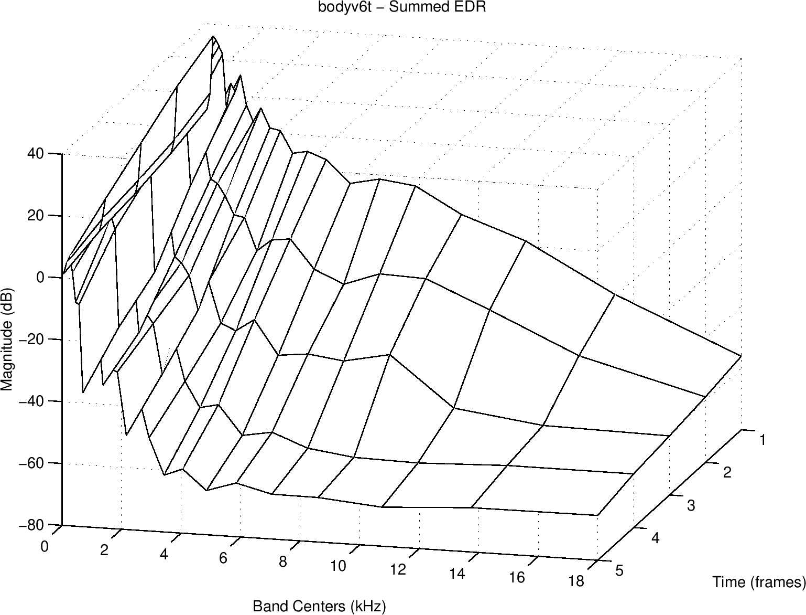

<head>
    
    
</head>

# Table of Contents

1.  [Algorithm](#org97f12b2)
2.  [Review](#org5d11557)
3.  [Tips](#orga5093c5)
    1.  [回响密度和模式密度的感知](#org84b6458)
    2.  [理想反响的感知矩阵](#org46ed33c)
        1.  [能力衰退曲线](#orgd28dca4)
        2.  [能量衰退起伏](#org934b8f8)
4.  [Share](#orgd58545b)
    1.  [拷贝和移动](#orgd0c012a)
    2.  [引用](#org90e19d6)
    3.  [容器](#org152ffa8)
    4.  [异常](#org26a9132)
    5.  [易用性改进](#org32248dd)
    6.  [Unicode](#orgcd9a8da)
    7.  [SFINAE: 不是错误的替换失败](#org845245b)
        1.  [enable_if](#org95df449)
        2.  [decltype返回值](#org77dfd59)
        3.  [void_t](#orgf63093d)
        4.  [标签分发](#orga686a54)
        5.  [静态多态的限制？](#orgafdc1fd)
    8.  [constexpr](#orgdafb64d)
        1.  [内联变量](#org447c394)
        2.  [constexpr变量模板](#org3611bd7)
        3.  [constexpr变量仍是const](#org87cb180)
        4.  [constexpr构造函数和字面类型](#org06680df)
        5.  [if constexpr](#org5ca121c)
        6.  [output_container.h解读](#org46cb117)

# Algorithm

The Windy's: <http://poj.org/problem?id=3686>

<https://dreamume.medium.com/poj-the-windys-b8bc7f3a08fe>

# Review

设计模式之美 - 设计模式与范式：行为型

行为型设计模式主要解决“类或对象之间的交互“问题

模板模式，英文为Template Method Design Pattern，在GoF《设计模式》中这么定义

Define the skeleton of an algorithm in an operation, deferring some steps to subclasses. Template Method lets subclasses redefine certain steps of an algorithm without changing the algorithm's structure

这里的算法骨架就是“模板”，包含算法骨架的方法就是“模板方法“

模板模式的作用：

1.  复用
2.  扩展

回调相对于模板模式会更加灵活：

1.  像Java这种只支持单继承的语言，基于模板模式编写的子类，已经继承了一个父类，不再具有继承的能力
2.  回调可以使用匿名类来创建回调对象，可以不用事先定义类；而模板模式针对不同的实现都要定义不同的子类
3.  如果某个类中定义了多个模板方法，每个方法都有对应的抽象方法，那即便我们只用到其中的一个模板方法，子类也必须实现所有的抽象方法。而回调就更加灵活，我们只需要往用到的模板方法中注入回调对象即可

策略模式，英文全称为Strategy Design Pattern，在GoF《设计模式》中定义

Define a family of algorithms, encapsulate each one, and make them interchangeable. Strategy lets the algorithm vary independently from clients that use it

策略模式解耦策略的定义、创建、使用三部分

职责链模式，英文为Chain Of Responsibility Design Pattern，在GoF《设计模式》中定义

Avoid coupling the sender of a request to its receiver by giving more than one object a chance to handle the request. Chain the receiving objects and pass the request along the chain until an object handles it

在职责链模式中，多个处理器（也就是定义中的“接收对象”）依次处理同一个请求。一个请求先经过A处理器处理，然后再把请求传递给B处理器，B处理器处理完后再传递给C处理器，以此类推，形成一个链条。链条上的每个处理器各自承担各自的处理职责，所以叫做职责链模式

有限状态机，英文为Finite State Machine，状态机有3个组成部分：状态(State)、事件(Event)、动作(Action)

访问者模式，英文为Visitor Design Pattern，在GoF《设计模式》中定义

Allows for one or more operation to be applied to a set of objects at runtime, decoupling the operations from the object structure

一般来说，访问者模式针对的是一组类型不同的对象（PdfFile、PPTFile、WordFile）。不过，尽管这组对象的类型是不同的，但是，它们继承相同的父类或者实现相同的接口。在不同的应用场景下，我们需要对这组对象进行一系列不相关的业务操作（抽取文本、压缩等），但为了避免不断添加功能导致类（PdfFile、PPTFile、WordFile）不断膨胀，职责越来越不单一，以及避免频繁地添加功能导致频繁代码修改，我们使用访问者模式，将对象与操作解耦，将这些业务操作抽离出来，定义在独立细分的访问者类（Extractor、Compressor）中

Single Dispatch，指的是执行哪个对象的方法，根据对象的运行时类型来决定；执行对象的哪个方法，根据方法参数的编译时类型来决定。所谓Double Dispatch，指的是执行哪个对象的方法，根据对象的运行时类型来决定；执行对象的哪个方法，根据方法参数的运行时类型来决定

在面向对象编程语言中，我们可以把方法调用理解为一种消息传递，也就是“Dispatch“。一个对象调用另一个对象的方法，就相当于给它发送一条消息。这条消息起码要包含对象名、方法名、方法参数

Sinngle Dispatch执行哪个对象的哪个方法，只跟“对象”的运行时类型有关。Double Dispatch执行哪个对象的哪个方法，跟“对象”和“方法参数”两者的运行时类型有关

备忘录模式，也叫快照（Snapshot）模式，英文为Memento Design Pattern，在GoF《设计模式》中定义

Captures and externalizes an object's internal state so that it can be restored later, all without violating encapsulation

这个模式主要表达了两部分内容，一部分是存储副本以便后期恢复，另一部分是要在不违背封装原则的前提下，进行对象的备份和恢复

命令模式的英文为Command Design Pattern，在GoF《设计模式》中定义

The command pattern encapsulates a request as an object, thereby letting us parameterize other objects with different requests, queue or log requests, and support undoable operations

落实到编码实现，命令模式用的最核心的实现手段，是将函数封装成对象。当我们把函数封装成对象之后，对象就可以存储下来，方便控制执行。所以，命令模式的主要作用和应用场景，是用来控制命令的执行，比如，异步、延迟、排队执行命令、撤销重做命令、存储命令、给命令记录日志等等，这才是命令模式能发挥独一无二作用的地方

解释器模式英文为Interpreter Design Pattern，在GoF《设计模式》中定义

Interpreter pattern is used to defines a grammatical representation for a language and provides an interpreter to deal with this grammar

中介模式英文为Mediator Design Patter，在GoF《设计模式》中定义

Mediator pattern defines a seperate (mediator) object that encapsulates the interaction between a set of objects and the objects delegate their interaction to a mediator object instead of interacting with each other directly

在观察者模式中，尽管一个参与者既可以是观察者，同时也可以是被观察者，但是，大部分情况下，交互关系往往都是单向的，一个参与者要么是观察者，要么是被观察者，不会兼具两种身份。也就是说，在观察者模式应用场景中，参与者之间的交互比较有条理

中介模式正好相反，只有当参与者之间的交互关系错综复杂，维护成本很高的时候，我们才考虑使用中介模式

# Tips

回响的感知方面

<https://ccrma.stanford.edu/~jos/pasp/Perceptual_Aspects_Reverberation.html>

人造回响是一个不常见的有趣的信号处理问题，如之前章节讨论的那样，明显的方法基于物理模型或输入输出模型对多数应用程序来说是非常昂贵的。这导致回响的感知重要部分是什么的问题，且如何提供高效地计算结构

## 回响密度和模式密度的感知

回响问题可在不牺牲感知质量的情况下大幅简化。例如，它可被显示为对典型的房间，回响密度增加为 $ t^{2} $，t为时间。因此，超过某些时间，回响密度会很大使得它可被模型为一些统一的采样随机处理而不会导致感知失真。特别地，不需要直接计算声音的每个采样的多个回响。对光滑延迟回响，一个合适的随机处理在音频采样率上的采样将感知为对等的声音

相似地，它可显示任意给定频率带宽的声音模式的数量是频率增加的平方，这样在某些频率之上，模式很密集其感知相当于关于某个统计产生的随机频率反应。特别地，不需要直接实现耳朵不能听见的回响

总之，基于感知的限制，一个回响房间的脉冲反应可被分割为两个段。第一段，成为早期反射，包含在脉冲回应里相对稀疏的第一回响。剩下的，被称为后回响，其紧密占据使得其以某种方式上可特征为统计回响。章节3.3讨论模拟回响脉冲反应的早期反射的方法

相似地，反响房间的频率反应可被分为两个段。低频间隔包含一个声音模式的相对稀疏分布，而对高频模式非常紧密这样可以特征为带某个统计属性的随机频率反应。3.4章节描述综合高质量后反响的方法

## 理想反响的感知矩阵

对人造回响一些想要的控制包括

-   $ t_ {60}(f) = $ 在每个频率f想要的反响时间
-   $ G^{2}(f) = $ 在每个频率信号能量增益
-   $ C(f) = $ “清晰度”= 在早期反响到后反响的脉冲反应能量比率
-   $ p(f) = $ 左右耳的音差校正系数

衰退到60dB( $ t_ {60} $ )的时间是经典的对象参数用来测量感知回响时间。$ t_ {60} $测量整个反应。更近地，它更常用于设计多个频率的一个给定 $ t_ {60} $，例如，一个低频，另一个高频，且在中间频率的插值。感知学习显示反响时间应该在至少3个频率宽带上独立调整

### 能力衰退曲线

测量和定义反响时间 $ t_ {60} $，Schroeder引入被称为能量衰退曲线(EDC)其为时刻t上脉冲反应的平方的积分

$ EDC(t) \\triangleq \\int^{\\infty}_ {t} h^{2}(\\tau) d \\tau $

这样，EDC(t)是时刻t在回响脉冲反应中剩余的信号能量总数。EDC比脉冲反应本身衰退更平滑，且因此它对估计 $ t_ {60} $比普通振幅更好

### 能量衰退起伏

能量衰退起伏(EDR)是一个时频分布其产生EDC到多个频率带宽：

$ EDR(t_ {n}, f_ {k}) \\triangleq \\sum^{M}_ {m=n} \| H(m, k) \|^{2} $

其H(m, k)记为在时间帧m上短时傅里叶变换(STFT)的k桶，且M记为时间帧的总数。STFT的FFT典型地用于窗口，比如一个30到40毫秒的Hann窗口

这样，$ EDR(t_ {n}, f_ {k}) $是在时刻 $ t_ {n} = nT $上反响脉冲反应的剩余信号能量总数，其在一个以 $ f_ {k} = k f_ {s} / N $Hz为中心的频率带宽中，N记为FFT长度

小提琴脉冲反应的EDR显示如下图。对更好的音频感知对应，频率坐标包裹为Bark频率扩展，且能量统计在每个Bark带宽（一个鉴别听力带宽等于一个Bark）。一个小提琴体可视为一个非常小的反响房间，对应放大相关谱结构到反响房间

EDR用来测量从摆弦记录中的偏泛音停滞

# Share

现代C++实战（吴咏炜） 笔记

## 拷贝和移动

用户如果没有自己提供一个拷贝构造函数（必须形如Obj(Obj &) 或 Obj(const Obj&)，不是模板），编译器会隐式声明一个

    class Copyable {
     public:
      Copyable(const Copyable& other) = default;
      Copyable& operator=(const Copyable& other) = default;
    
      // The implicit move operations are suppressed by the declarations above.
      // You may explicitly declare move operations to support efficient moves.
    };
    
    class MoveOnly {
     public:
      MoveOnly(MoveOnly&& other) = default;
      MoveOnly& operator=(MoveOnly&& other) = default;
    
      // The copy operations are implicitly deleted, but you can
      // spell that out explicitly if you want:
      MoveOnly(const MoveOnly&) = delete;
      MoveOnly& operator=(const MoveOnly&) = delete;
    };
    
    class NotCopyableOrMovable {
     public:
      // Not copyable or movable
      NotCopyableOrMovable(const NotCopyableOrMovable&) = delete;
      NotCopyableOrMovable& operator=(const NotCopyableOrMovable&)
          = delete;
    
      // The move operations are implicitly disabled, but you can
      // spell that out explicitly if you want:
      NotCopyableOrMovable(NotCopyableOrMovable&&) = delete;
      NotCopyableOrMovable& operator=(NotCopyableOrMovable&&)
          = delete;
    };

用户如果没有自己声明考吧构造函数、拷贝赋值函数、移动赋值函数和析构函数，编译器会隐式声明一个移动构造函数

RAII机制把资源的有效期跟持有资源的对象生命周期绑定到一起，利用构造函数分配资源，利用析构函数释放资源，确保资源正确使用，防止特别是异常时资源未释放的问题

delete、free函数参数可以传nullptr

## 引用

    smart_ptr& operator=(smart_ptr rhs) noexcept  {
      rhs.swap(*this);
      return *this;
    }

注意这里参数不是引用，避免if (this != &rhs) 这样的判断，这样的异常安全性不够好

    template <typename T> void bar(T&& s) {
      foo(std::forward<T>(s));
    }

forward用法可使函数参数保持其值类别：左值的依然是左值，右值的为右值。因为在T是模板参数时，T&&的作用主要是保持值类别进行转发，它有个名字叫“转发引用”(forward reference)。因为其可以是左值引用也可以是右值引用，它也被称为“万能引用”(universal reference)

## 容器

推荐在代码中尽量使用string来管理字符串。但对于对外暴露的接口，一般不建议在接口中使用const string&，除非确知调用者已经持有string：如果函数里不对字符串做复杂处理的话，使用const char\*可以避免在调用者只有C字符串时编译器自动构造string，这种额外的构造和析构代价并不低。返过来，如果实现较为复杂、希望使用string的成员函数的话，那就应该考虑下面的策略：

-   如果不修改字符串的内容，使用const string& 或 C++17的string_view作为参数类型。后者是最理想的情况，因为即使在只有C字符串的情况，也不会引发不必要的内存复制
-   如果需要在函数内修改字符串内容、但不影响调用者的该字符串，使用string作为参赛类型（自动拷贝）
-   如果需要改变调用者的字符串内容，使用string& 作为参数类型（通常不推荐）

对于容器，如果元素没有提供一个保证不抛异常的移动构造函数，通常会使用拷贝构造函数。因此，对于拷贝代价较高的自定义元素类型，我们应当定义移动构造函数，并标其为noexcept，或只在容器中放置对象的智能指针

某些标准算法在list上会导致问题，list提供了成员函数作为替代，包括下面几个：

-   merge
-   remove
-   remove_if
-   reverse
-   sort
-   unique

forward_list没有insert只有insert_after

## 异常

异常安全指当异常发生时，既不会发送资源泄漏，系统也不会处于一个不一致的状态

    class matrix {
      // …
      friend matrix
      operator*(const matrix&,
                const matrix&);
    private:
      float* data_;
      size_t nrows_;
      size_t ncols_;
    };
    
    matrix::matrix(size_t nrows,
                   size_t ncols) {
      data_  = new float[nrows * ncols];
      nrows_ = nrows;
      ncols_ = ncols;
    }
    
    matrix::~matrix() {
      delete[] data_;
    }
    
    matrix operator*(const matrix& lhs,
                     const matrix& rhs)
    {
      if (lhs.ncols != rhs.nrows) {
        throw std::runtime_error(
          "matrix sizes mismatch");
      }
      matrix result(lhs.nrows, rhs.ncols);
      // 进行矩阵乘法运算
      return result;
    }

这个例子中可能会出错误/异常的地方：

-   首先是内存分配。如果new出错，按照C++的规则，一般会得到异常bad_alloc，对象的构造也就失败了。这种情况下，在catch捕捉到这个异常之前，所有栈上对象会全部被析构，资源全部被自动清理
-   如果是矩阵的长度不合适不能做乘法呢？我们同样会得到一个异常，这样，在使用乘法的地方，对象c根本不会被构造出来
-   如果在乘法函数里内存分配失败呢？一样，result对象根本没有构造出来，也就没有c对象了。还是一切正常
-   如果a,b是本地变量，然后乘法失败了呢？析构函数会自动释放其空间，我们同样不会有任何资源泄露

对异常的批评主要有两点：

-   异常违反了“你不用就不需要付出代价“的C++原则。只要开启了异常，即使不使用异常你编译出的二进制代码通常也会膨胀
-   异常比较隐蔽，不容易看出来哪些地方会发生异常和发生什么异常

对于第一条，开发者没什么可做的。事实上，这也算是C++实现的一个折中了。目前的主流异常实现中，都倾向于牺牲可执行文件大小、提供主流程(happy path)的性能。只要程序不抛异常，C++代码的性能比起完全不做错误检查的代码，都只有几个百分点的性能损失。除了非常有限的一些场景，可执行文件大小通常不会是个问题

对第二条，C++不会对异常规约进行编译时的检查。从C++17开始，C++甚至完全禁止了以往的动态异常规约，你不再能在函数声明里写你可能会抛出某某异常。你唯一能声明的，就是某函数不会抛出异常 - noexcept、noexcept(true)或throw()。这也是C++的运行时唯一会调用std::terminate来终止应用程序

不声明异常是有理由的。特别是在范型编程的代码里，几乎不可能预知会发生些什么异常。我个人对避免异常带来的问题有几点建议：

1.  写异常安全的代码，尤其在模板里。可能的话，提供强异常安全保证，在任何第三方代码发生异常的情况下，不改变对象的内容，也不产生任何资源泄露
2.  如果你的代码可能抛出异常的话，在文档里明确声明可能发生的异常类型和发生条件。确保使用你的代码的人，能在不检查你的实现的情况，了解需要准备处理哪些异常
3.  对于肯定不会抛出异常的代码，将其标为noexcept。注意类的特殊成员（构造函数、析构函数、赋值函数等）会自动称为noexcept，如果它们调用的代码都是noexcept的话。所以，像swap这样的成员函数应当尽可能标成noexcept

异常安全有四级：

-   不抛异常(noexcept)保证
-   强异常安全保证
-   基本安全异常保证
-   没有任何保证

## 易用性改进

    template <typename T, std::size_t N>
    void foo(const T (&a)[N])
    {
      typedef const T* ptr_t;
      for (ptr_t it = a, end = a + N;
           it != end; ++it) {
        // 循环体
      }
    }
    
    template <typename T>
    void foo(const T& c)
    {
      for (typename T::const_iterator
             it = c.begin(),
             end = c.end();
           it != end; ++it) {
        // 循环体
      }
    }

以上代码如果用自动类型推断，可写成

    template <typename T>
    void foo(const T& c)
    {
      using std::begin;
      using std::end;
      // 使用依赖参数查找（ADL）；见 [2]
      for (auto it = begin(c),
           ite = end(c);
           it != ite; ++it) {
        // 循环体
      }
    }
    

decltype的用途是获得一个表达式的类型，结构可以跟类型一样使用。它有两个基本用法：

-   decltype(变量名)  可以获得变量的精确类型
-   decltype(表达式)  可以获得表达式的引用类型；除非表达式的结果是个纯右值(prvalue)，此时结果仍然是值类型

通常情况下，能写auto来声明变量肯定是件比较轻松的事情。但这里有个限制，你需要在写下auto时就决定你写下的是个引用类型还是值类型。根据类型推导规则，auto是值类型，auto&是左值引用类型，auto&&是转发类型（可以是左值引用，也可以是右值引用）。使用auto不能通用地根据表达式类型来决定返回值的类型。不过，decltype(auto)即可以是值类型，也可以是引用类型。因此，我们可以这么写：

    decltype(expr) a = expr;

C++14引入了decltype(auto)语法。我们可以改写为

    decltype(auto) a = expr;

这种代码主要用在通用的转发函数模板中：你可能根本不知道你调用的函数是不是会返回一个引用

从C++14开始，函数的返回值也可以用auto或decltype(auto)来声明。用auto可以得到值类型，用auto&或auto&&可以得到引用类型。而用decltype(auto)可以根据返回表达式通用地决定返回的是值类型还是引用类型

    auto foo(参数) -> 返回值类型声明
    {
      // 函数体
    }

通常，在返回类型比较复杂，特别是返回类型跟参数类型有某种推导关系时会使用这种语法

从C++17开始，我们可以直接写

    pair pr{1, 42};
    
    array a{1, 2, 3};
    // 得到 array<int, 3>

这种自动推导机制，可以是编译器根据构造函数来自动生成：

    template <typename T>
    struct MyObj {
      MyObj(T value);
      // …
    };
    
    MyObj obj1{string("hello")};
    // 得到 MyObj<string>
    MyObj obj2{"hello"};
    // 得到 MyObj<const char*>

也可以手工提供一个推导向导，达到自己需要的效果：

    template <typename T>
    struct MyObj {
      MyObj(T value);
      // …
    };
    
    MyObj(const char*) -> MyObj<string>;
    
    MyObj obj{"hello"};
    // 得到 MyObj<string>

    multimap<string, int>::iterator
      lower, upper;
    std::tie(lower, upper) =
      mmp.equal_range("four");

这个例子里，返回值是个pair，我们希望用两个变量来接收数值，就不得不声明了两个变量，然后使用tie来接收结果。在C++11、C++14里，这里没法使用auto。好在C++17引入了一个新语法，解决了这个问题。目前，我们可以把代码简化为

    auto [lower, upper] =
      mmp.equal_range("four");

当一个构造函数没有标成explicit时，你可以使用大括号不写类名来进行构造，如果调用上下文要求那类对象的话。如：

    Obj getObj() {
      return {1.0};
    }

使用大括号时编译器会拒绝“窄”转换，不接受以{1.0}或Obj{1.0}的形式调用构造函数Obj(int)

这个语法的限制是，如果一个类既有使用初始化列表的构造函数，又有不使用初始化列表的构造函数，那编译器会千方百计地试图调用使用初始化列表的构造函数，导致各种意外。所以推荐的话

-   如果一个类没有使用初始化列表的构造函数时，初始化该类对象可全部使用统一初始化语法
-   如果一个类有使用初始化列表的构造函数时，则只应用在初始化列表构造的情况

一些字面量的用法

    int main() {
      cout << "i * i = " << 1i * 1i
           << endl;
      cout << "Waiting for 500ms"
           << endl;
      this_thread::sleep_for(500ms);
      cout << "Hello world"s.substr(0, 5)
           << endl;
    }

要在自己的类里支持字面量也相当容易，唯一的限制是非标准的字面量后缀必须以下划线_打头。比如，加入我们有下面的长度类：

    struct length {
      double value;
      enum unit {
        metre,
        kilometre,
        millimetre,
        centimetre,
        inch,
        foot,
        yard,
        mile,
      };
      static constexpr double factors[] =
        {1.0,    1000.0,  1e-3,
         1e-2,   0.0254,  0.3048,
         0.9144, 1609.344};
      explicit length(double v,
                      unit u = metre)
      {
        value = v * factors[u];
      }
    };
    
    length operator+(length lhs,
                     length rhs)
    {
      return length(lhs.value +
                    rhs.value);
    }
    
    // 可能有其他运算符

如果允许如下这么写

    1.0_m + 10.0_cm

则需要提供下面的运算符即可：

    length operator"" _m(long double v) {
      return length(v, length::metre);
    }
    
    length operator"" _cm(long double v) {
      return length(v, length::centimetre);
    }

从C++14开始，对于二进制也有了直接的字面量：

    unsigned mask = 0b111000000;

这在需要比特级操作等场合还是非常有用的

不过，遗憾的是，I/O streams里只有dec、hex、oct三个操纵器(manipulator)，没有bin，一个间接的办法是使用bitset，但需要手动指定二进制位数

    cout << bitset<9>(mask) << endl;

C++14开始，允许在数字型字面量中任意添加'来使其更可读，例如

    unsigned mask = 0b111'000'000;
    long r_earth_equatorial = 6'378'137;
    double pi = 3.14159'26535'89793;
    const unsigned magic = 0x44'42'47'4E;

C++11提供了静态断言机制，在编译期检查，例如

    static_assert((alignment & (alignment - 1)) == 0,
      "Alignment must be power of two");

在类定义的时候，C++有一些规则决定是否生成默认的特殊成员函数，这些特殊成员函数可能包括：

-   默认构造函数
-   析构函数
-   拷贝构造函数
-   拷贝赋值函数
-   移动构造函数
-   移动赋值函数

如果成员和父类没有特殊原因导致对象不可拷贝或移动，在用户不声明这些成员函数的情况下，编译器会自动产生这些成员函数，即隐式声明、默认提供、正常状态。有特殊成员、用户声明的话，情况就非常复杂了：

-   没有初始化的非静态const数据成员和引用类型数据成员会导致默认提供的默认构造函数被删除
-   非静态的const数据成员和引用类型数据成员会导致默认提供的拷贝构造函数、拷贝赋值函数、移动构造函数和移动赋值函数被删除
-   用户如果没有自己提供一个拷贝构造函数（必须形如Obj(Obj&)或Obj(const Obj&)；不是模板），编译器会隐式声明一个
-   用户如果没有自己提供一个拷贝赋值函数（必须形如Obj& operator&(Obj&)或Obj& operator=(const Obj&);不是模板），编译器会隐式声明一个
-   用户如果自己声明了一个移动构造函数或移动赋值函数、则默认提供的拷贝构造函数和拷贝赋值函数被删除
-   用户如果没有自己声明拷贝构造函数、拷贝赋值函数、移动赋值函数和析构函数、编译器会隐式声明一个移动构造函数
-   用户如果没有自己声明拷贝构造函数、拷贝赋值函数、移动构造函数和析构函数，编译器会隐式声明一个移动赋值函数

注即使用户要求默认提供某个函数，编译器也可能根据其他规则将特殊成员函数标为删除

## Unicode

Unicode文本文件通常有一个使用BOM(byte order mark)字符的约定，即字符U+FEFF。由于Unicode不使用U+FFFE，在文件开头加一个BOM即可区分各种不同编码：

-   如果文件开头是0x00 00 FE FF，那这是大头在前的UTF-32编码
-   如果文件开头是0xFF FE 00 00，那这是小头在前的UTF-32编码
-   如果文件开头是0xFE FF，那这是大头在前的UTF-16编码
-   如果文件开头是0xFF FE，那这是小头在前的UTF-16编码
-   如果文件开头是0xEF BB BF，那这是UTF-8编码
-   否则，编码方式使用其他算法来确定

C++98中有char和wchar_t两种不同的字符类型，其中char的长度是单字节，而wchar_t的长度不确定。在windows上它是双子节，只能代表UTF-16，而在Unix上一般是四子节，可以代表UTF-32。为了解决这种混乱，目前我们有了下面的改进：

-   C++11引入了char16_t和char32_t两个独立的字符类型，分别代表UTF-16和UTF-32
-   C++20将引入char8_t类型，进一步区分了可能使用传统编码的窄字符类型和UTF-8字符类型
-   除了string和wstring，我们也相应有了u16string、u32string（和将来的u8string）
-   除了传统的窄字符/字符串字面量（如"hi"）和宽字符/字符串字面量，分别形如u8"hi"、u"hi"、U"hi"
-   为了确保非ASCII字符在源代码中可以简单地输入，引入了新的Unicode换码序列。比如，我们前面说到的三个字符可以这样表达成一个UTF-32字符串字面量：U" \u6C49\U0001F600"。要生成UTF-16或UTF-8字符串字面量只需要更改前缀即可

    const char32\_t unicode\_max = 0x10FFFF;
    
    void to\_utf\_16(char32\_t ch, u16string& result) {
      if (ch > unicode\_max) {
        throw runtime\_error("invalid code point");
      }
      if (ch < 0x10000) {
        result += char16\_t(ch);
      } else {
        char16\_t first =
          0xD800 |
          ((ch - 0x10000) >> 10);
        char16\_t second =
          0xDC00 | (ch & 0x3FF);
        result += first;
        result += second;
      }
    }
    
    void to\_utf\_8(char32\_t ch, string& result) {
      if (ch > unicode\_max) {
        throw runtime\_error("invalid code point");
      }
      if (ch < 0x80) {
        result += ch;
      } else if (ch < 0x800) {
        result += 0xC0 | (ch >> 6);
        result += 0x80 | (ch & 0x3F);
      } else if (ch < 0x10000) {
        result += 0xE0 | (ch >> 12);
        result += 0x80 | ((ch >> 6) & 0x3F);
        result += 0x80 | (ch & 0x3F);
      } else {
        result += 0xF0 | (ch >> 18);
        result += 0x80 | ((ch >> 12) & 0x3F);
        result += 0x80 | ((ch >> 6) & 0x3F);
        result += 0x80 | (ch & 0x3F);
      }
    }
    
    int main() {
      char32\_t str[] = U" \u6C49\U0001F600";
      u16string u16str;
      string u8str;
      for (auto ch: str) {
        if (ch == 0) break;
        to\_utf\_16(ch, u16str);
        to\_utf\_8(ch, u8str);
      }
    
      cout << hex << setfill('0');
      for (char16\_t ch: u16str) {
        cout << setw(4) << unsigned(ch)
             << ' ';
      }
      cout << endl;
      for (unsigned char ch: u8str) {
        cout << setw(2) << unsigned(ch)
             << ' ';
      }
      cout << endl;
    }

现代Unix系统，包括Linux和macOS在内，已经全面转向了UTF-8。一般直接使用char[]和string来代表UTF-8字符串。不过在需要真正进行文字处理的场合转换到UTF-32往往更简单，应该使用char32_t和u32string

Unix下输出宽字符串需要使用wcout（这和windows相同），并且需要进行区域设置，如下所示：

    set::locale::global(std::locale(""));
    std::wcout.imbue(std::locale());

由于没有什么额外好处，反而可能在某些环境因为区域设置失败而引发问题，Unix平台下一般只用cout，不用wcout

Windows由于历史原因和保留向后兼容性的需要（Windows为了向后兼容性已经到了大规模放弃优雅的程度了），一直用char表示传统编码（如，英文Windows上是Windows-1252，简体中文Windows上是GBK），用wchar_t表示UTF-16。由于传统编码一次只有一种、且需要重启才能生效，要得到好的多语言支持，在和操作系统交互时必须使用UTF-16

对于纯Windows编程，全面使用宽字符（串）是最简单的处理方式。当然，源代码和文本很少用UTF-16存储，通常还是UTF-8（除非是纯ASCII，否则必须加入BOM字符来和传统编码相区分）。这时可能会有一个小小的令人惊讶的地方：微软的编译器会把源代码里窄字符串字面量中的非ASCII字符转换成传统编码。换句话说，同样的源代码在不同编码的Windows下编译可能会产生不同的结果！如果你希望保留UTF-8序列的话，就应该使用UTF-8字面量（并在将来使用char8_t字符类型）

    template <typename T> void dump(const T& str) {
      for (char ch: str) {
        printf("%.2x ", static_cast<unsigned char>(ch));
      }
      putchar('\n');
    }
    
    int main() {
      char str[] = "你好";
      char u8str[] = u8"你好";
      dump(str);
      dump(u8str);
    }

以上代码在Windows系统下运行结果会不同

Windows下的wcout主要用在配合宽字符的输出，此外没有什么大用处。原因一样，只有进行了正确的区域设置，才能输出跟该区域相匹配的宽字符串（不匹配的字符将导致后续输出全部消失！）。如果要输出中文，得写setlocal(LC_ALL, "Chinese_China.936")；这显然就让“统一码”输出失去意义了

但是，如果你只用wcout，不用cout或任何使用窄字符输出到stdout的函数（如puts），这时倒有个还不错的解决方案，可以在终端输出多语言。代码如下所示：

    int main() {
      _setmode(_fileno(stdout), _O_WTEXT);
      std::wcout << L"中文 Español Français\n";
      std::wcout << "Narrow characters are also OK on wcout\n";
    }

由于窄字符在大部分Windows系统上只支持传统编码，要打开一个当前编码不支持的文件名称，就必需使用宽字符的文件。微软的fstream系列类及其open成员函数都支持const wchar_t\* 类型的文件名，这是C++标准里所没有的

要想写出跨平台的处理字符串的代码，我们一般考虑两种方式之一：

-   源代码级兼容，但内码不同
-   源代码和内码都完全兼容

微软推荐的方式一般是前者。做Windows开发的人很多都知道tchar.h和_T宏，它们就起着类似的作用（虽然目的不同）。根据预定义宏的不同，系统会在同一套代码下选择不同的编码方式及对应的函数。拿一个最小的例子来说：

    int _tmain(int argc, TCHAR* argv[]) {
      _putts_(_T("Hello world!\n"));
    }

如果用缺省的命令行参数进行编译，上面的代码相当于

    int main(int argc, char* argv[]) {
      puts("Hello world!\n");
    }

而如果在命令行上加上了/D_UNICODE，那代码则相当于

    int wmain(int argc, wchar_t* argv[]) {
      _putws(L"Hello world!\n");
    }

当然，这个代码还是只能在Windows上用，并且仍然不漂亮（所有的字符和字符串字面量都得套上_T）。后者无解，前者则可以找到替代方案（甚至自己写也不复杂）。C++ REST SDK中就提供了类似的封装，可以跨平台地开发网络应用。但可以说，这种方式是一种主要照顾Windows的开发方式

对Unix开发者而言更自然的方式是全面使用UTF-8，仅在跟操作系统、文件系统打交道时把字符串转换成需要的编码。利用临时对象的生命周期，我们可以像下面这样写帮助函数和宏

utf8_to_native.hpp

    #ifndef UTF8_TO_NATIVE_HPP
    #define UTF8_TO_NATIVE_HPP
    
    #include <string>
    
    #if defined(_WIN32) || defined(_UNICODE)
    
    std::wstring utf8_to_wstring(const char* str);
    std::wstring utf8_to_wstring(const std::string& str);
    
    #define NATIVE_STR(s) utf8_to_wstring(s).c_str()
    
    #else
    
    inline const char* to_c_str(const char* str) {
      return str;
    }
    
    inline const char* to_c_str(const std::string& str) {
      return str.c_str();
    }
    
    #define NATIVE_STR(s) to_c_str(s)
    
    #endif
    
    #endif  // UTF8_TO_NATIVE_HPP

utf8_to_native.cpp:

    #include <utf8_to_native.hpp"
    
    #if defined(_WIN32) || defined(_UNICODE)
    
    #include <windows.h>
    #include <system_error>
    
    namespace {
    
      void throw_system_error(const char* reason) {
        std::string msg(reason);
        msg += " failed";
        std::error_code ec(GetLastError(), std::system_category());
        throw std::system_error(ec, msg);
      }
    
    } // unnamed namespace
    
    std::wstring utf8_to_wstring(const char *str) {
      int len = MultiByteToWideChar(CP_UTF8, 0, str - 1, nullptr, 0);
      if (len == 0) {
        throw_system_error("utf8_to_wstring");
      }
      std::wstring result(len - 1, L'\0');
      if (MultiByteToWideChar(CP_UTF8, 0, str, -1, result.data(), len) == 0) {
        throw_system_error("utf8_to_wstring");
      }
    
      return result;
    }
    
    std::wstring utf8_to_wstring(const std::string& str) {
      return utf8_to_wstring(str.c_str());
    }
    
    #endif

在头文件里，定义了在Windows下会做UTF-8到UTF-16的转换；在其他环境下则不真正做转换，而是不管提供的是字符指针还是string都会转换成字符指针。在Windows下每次调用NATIVE_STR会生成一个临时对象，当前语句执行结束后这个临时对象会自动销毁

使用该功能的代码是这样的

    #include <fstream>
    #include "utf8_to_native.hpp"
    
    int main() {
      using namespace std;
      const char filename[] = u8"测试.txt";
      ifstream ifs(NATIVE_STR(filename));
      // 对 ifs 进行操作
    }

上面这样的代码可以同时适用于现代Unix和现代Windows（任何语言设置下），用来读取名为“测试.txt“的文件

介绍一下其他的一些支持Unicode及其转换的API

-   Windows API
    
    MultiByteToWideChar从某个编码转到UTF-16，及WideCharToMultiByte从UTF-16转到某个编码

-   iconv
    
    Unix下最常见的底层编码转换接口是iconv，提供iconv_open、iconv_close和iconv三个函数

-   ICU4C
    
    ICU是一个完整的Unicode支持库，提供大量的方法，ICU4C是其C/C++版本。ICU有专门的字符串类型，内码是UTF-16，但可以直接用于IO streams的输出。下面的程序应该在所有平台下都有同样的输出（但在Windows上要求当前系统传统编码能支持待输出的字符）：
    
        #include <iostream>
        #include <string>
        #include <unicode/unistr.h>
        #include <unicode/ustream.h>
        
        using namespace std;
        using icu::UnicodeString;
        
        int main() {
          auto str = UnicodeString::fromUTF8(u8"你好");
          cout << str << endl;
          string u8str;
          str.toUTF8String(u8str);
          cout << "IN UTF-8 it is "
               << u8str.size() << " bytes"
               << endl;
        }

-   codecvt
    
    C++11曾经引入了一个头文件<codecvt>用作UTF编码间的转换，但很遗憾，那个头文件目前已因为安全性和易用性问题被宣告放弃

## SFINAE: 不是错误的替换失败

以下代码可以检测一个类是否有一个名叫reserve、参数类型为size_t的成员函数

    template <typename T> struct has_reserve {
      struct good { char dummy; };
      struct bad { char dummy[2]; };
      template <class U, void (U::*)(size_t)> struct SFINAE {};
      template <class U> static good reserve(SFINAE<U, &U::reserve>*);
      template <class U> static bad reserve(...);
      static const bool value = sizeof(reserve<T>(nullptr)) == sizeof(good);
    };

### enable_if

C++11开始，标准库里有了一个叫enable_if的模板（定义在<type_traits>里），可以用它来选择性地启用某个函数的重载

假设我们有一个函数，用来往一个容器尾部追加元素。我们希望原型是这个样子的

    template <typename C, typename T> void append(C& container, T* ptr, size_t size);

显然，container有没有reserve成员函数，是对性能有影响的 &#x2013; 如果有的话，我们通常应该预留好内存空间，以免产生不必要的对象移动甚至拷贝操作。利用enable_if和上面的has_reserve模板，我们就可以这么写：

    template <typename C, typename T> enable_if_t<has_reserve<C>::value, void>
    append(C& container, T* ptr, size_t size) {
      container.reserve(container.size() + size);
      for (size_t i = 0; i < size; ++i) container.push_back(ptr[i]);
    }
    
    template <typename C, typename T> enable_if_t<!has_reserve<C>::value, void>
    append(C& container, T* ptr, size_t size) {
      for (size_t i = 0; i < size; ++i) container.push_back(ptr[i]);
    }

对于某个type trait，添加_t的后缀等价于其type成员类型

### decltype返回值

如果只需要在某个操作有效的情况下启用某个函数，而不需要考虑相反的情况的话，有另外一个技巧可以用。对于上面的append的情况，如果我们想限制只有具有reserve成员函数的类可以使用这个重载，我们可以把代码简化为

    template <typename C, typename T> auto append(C& container, T* ptr, size_t size) 
      -> decltype(declval<C&>().reserve(1U), void()) {
      container.reserve(container.size() + size);
      for (size_t i = 0; i < size; ++i) container.push_back(ptr[i]);
    }

这个模板用来声明一个某个类型的参数，但这个参数只是用来参加模板的匹配，不允许实际使用。使用这个模板，我们可以在某类型没有默认构造函数的情况下，假想出一个该类的对象来进行类型推导

declval<C&>().reserve(1U)用来测试C&类型的对象是不是可以拿1U作为参数来调用reserve成员函数。此外，我们需要记得，C++里的逗号表达式的意思是按顺序逐个估值，并返回最后一项。所以，上面这个函数的返回值类型是void

这个方式和enable_if不同，很难表示否定的条件。如果要提供一个专门给没有reserve成员函数的C类型的append重载，这种方式就不太方便了。因此，这种方式的主要用途是避免错误的重载

### void_t

void_t是C++17新引入的一个模板。它的定义很简单

    template <typename...> using void_t = void;

换句话说，这个类型模板会把任意类型映射到void。他的特殊在于，在这个看似无聊的过程中，编译器会检查那个“任意类型”的有效性。利用decltype, declval和模板特化，我们可以把has_reserve的定义大大简化

    template <typename T, typename=void_t<>> struct has_reserve: false_type {};
    template <typename T> struct has_reserve<T, void_t<decltype(declval<T&>().reserve(1U))>>: true_type {};

这里第二个has_reserve模板的定义实际上是一个偏特化。偏特化是类模板的特有功能，跟函数重载有些相似。编译器会找出所有可用模板，然后选择其中最“特别”的一个。像上面的例子，所有类型都能满足第一个模板，但不是所有的类型都能满足第二个模板，所以第二个更特别。当第二个模板能被满足时，编译器就会选择第二个特化的模板；而只有第二个模板不能被满足时，才会回到第一个模板的通用情况

### 标签分发

之前我们提到了用true_type和false_type来选择合适的重载。这种技巧有个专门的名字，叫标签分发（tag dispatch）。我们的append也可以用标签分发来实现

    template <typename C, typename T> void _append(C& container, T* ptr, size_t size, true_type) {
      container.reserve(container.size() + size);
      for (size_t i = 0; i < size; ++i) container.push_back(ptr[i]);
    }
    
    template <typename C, typename T> void _append(C& container, T* ptr, size_t size, false_type) {
      for (size_t i = 0; i < size; ++i) container.push_back(ptr[i]);
    }
    
    template <typename C, typename T> void append(C& container, T* ptr, size_t size) {
      _append(container, ptr, size, integral_constant<bool, has_reserve<C>::value>{});
    }

如果我们用void_t那个版本的has_reserve模板的话，由于模板的实例会继承false_type和true_type之一，代码可以进一步简化为

    template <typename C, typename T> void append(C& container, T* ptr, size_t size) {
      _append(container, ptr, size, has_reserve<C>{});
    }

### 静态多态的限制？

看到这里，你可能会怀疑，为什么我们不能像在Python之类的语言里一样，直接写下面这样的代码呢？

    template <typename C, typename T> void append(C& container, T* ptr, size_t size) {
      if (has_reserve<C>::value) 
        container.reserve(container.size() + size);
      for (size_t i = 0; i < size; ++i) container.push_back(ptr[i]);
    }

这是由于在C类型没有reserve成员函数的情况下，编译是不能通过的，会报错。这是因为C++是静态类型的语言，所有的函数、名字必须在编译时被成功解析、确定。在动态类型的语言里，只要语法没问题，缺成员函数要执行到那一行上才会被发现

## constexpr

在C++11引入，在C++14得到大幅改进的constexpr关键字字面意思是constant expression，常量表达式。存在两类constexpr对象：

-   constexpr变量
-   constexpr函数

一个constexpr变量是一个编译器时完全确定的常数，一个constexpr函数至少对于某一组实参可以在编译期间产生一个编译期常数

注意一个constexpr函数不保证在所有情况下都会产生一个编译期常数（因而也是可以作为普通函数来使用的）。编译器也没法通用地检查这点。编译器唯一强制的是：

-   constexpr变量必须立即初始化
-   初始化只能使用字面量或常量表达式，后者不允许调用任何非constexpr函数

    constexpr int sqr(int n) {
      return n * n;
    }
    
    int main() {
      constexpr int n = sqr(3);
      std::array<int, n> a;
      int b[n];
    }

### 内联变量

C++17引入了内联(inline)变量的概念，允许在头文件中定义内联变量，然后像内联函数一样，只要所有的定义都相同，那变量的定义出现多次也没关系。对于类的静态数据成员，const缺省是不内联的，而constexpr缺省就是内联的。这种区别在你用&去取一个const int值的地址，或将其传到一个形参类型为const int&的函数去的时候（这在C++文档里的行话叫ODR-use)，就会体现出现

下面是个合法的完整程序：

    struct magic {
      static const int number = 42;
    };
    
    int main() {
      std::cout << magic::number << std::endl;
    }

我们稍微改一下

    struct magic {
      static const int number = 42;
    };
    
    int main() {
      std::vector<int> v;
      v.push_back(magic::number);
      std::cout << v[0] << std::endl;
    }

程序在链接时就会报错，说找不到magic::number（注意：MSVC缺省不报错，但使用标准模式 - /Za命令行选项 - 也会出现这个问题）。这是因为ODR-used的类静态常量也需要有一个定义，在没有内联变量之前需要在某一个源代码文件（非头文件）中这样写：

    const int magic::number = 42;

必须正正好好一个，多了少了都不行，所以叫one definition rule。内联函数，现在又有了内联变量，以及模板，则不受这条规则限制

### constexpr变量模板

变量模板是C++14引入的新概念。之前我们需要用类静态数据成员来表达的东西，使用变量模板可以更简洁地表达。constexpr很合适在变量模板里，表达一个和某个类型相关的编译期常量。由此，type traits都获得了一种更简单的表达方式。再看一下之前用过的例子

    template <class T> inline constexpr bool is_trivially_destructible_v = 
      is_trivially_destructible<T>::value;

### constexpr变量仍是const

一个constexpr变量仍然是const类型。需要注意的是，就像const char\*类型是指向常量的指针、自身不是const常量一样，下面这个表达式的const也是不能缺少的

    constexpr int a = 42;
    constexpr const int& b = a;

第二行里，constexpr表示b是一个编译期常量，const表示这个引用是常量引用。去掉这个const的话，编译器就会认为你是试图将一个普通引用绑定到一个常数上，报一个类似下面的错误信息：

    error: binding reference of type 'int&' to 'const int' discards qualifiers

如果按照const位置的规则，constexpr const int& b实际该写成const int& constexpr b。不过，constexpr不需要像const一样有复杂的组合，因此永远是写在类型前面的

### constexpr构造函数和字面类型

一个合理的constexpr函数，应当至少对于某一组编译期常量的输入，能得到编译期常量的结果。为此，对这个函数也是有限制的

-   最早，constexpr函数里连循环都不能有，但在C++14放开了
-   目前，constexpr函数仍不能有try ... catch语句和asm声明，但到C++20会放开
-   constexpr函数里不能使用goto语句
-   等等

一个有意思的情况是一个类的构造函数。如果一个类的构造函数里面只包含常量表达式、满足对constexpr函数限制的话（这也意味着，里面不可以有任何动态内存分配），并且类的析构函数是平凡的，那这个类就可以被称为是一个字面类型。换一个角度想，对constexpr函数 - 包括字面类型构造函数 - 的要求是，得让编译器能在编译期进行计算，而不会产生任何“副作用”，比如内存分配、输入、输出等等

为了全面支持编译期计算，C++14开始，很多标准类的构造函数和成员函数已经被标为constexpr，以便在编译期使用。当然，大部分的容器类，因为用到了动态内存分配，不能成为字面类型。下面这些不使用动态内存分配的字面类型则可以在常量表达式中使用：

-   array
-   initializer_list
-   pair
-   tuple
-   string_view
-   optional
-   variant
-   bitset
-   complex
-   chrono::duration
-   chrono::time_point
-   ...

下面这个玩具例子，可以展示上面的若干类及其成员函数的行为：

    int main() {
      constexpr string_view sv{"hi"};
      constexpr pair pr{sv[0], sv[1]};
      constexpr array a{pr.first, pr.second};
      constexpr int n1 = a[0];
      constexpr int n2 = a[1];
      cout << n1 << ' ' << n2 << '\n';
    
      return 0;
    }

### if constexpr

    template <typename C, typename T> void append(C& container, T* ptr, size_t size) {
      if (has_reserve<C>::value) 
        container.reserve(container.size() + size);
      for (size_t i = 0; i < size; ++i) container.push_back(ptr[i]);
    }

在C++17里，我们只要在if后面加上constexpr，代码就能工作了。当然，它要求括号里的条件是个编译期常量。满足这个条件后，标签分发、enable_if那些技巧就不那么有用了。显然，使用if constexpr能比使用其他哪些方式，写出更可读的代码......

### output_container.h解读

到了今天，我们终于把output_container.h用到的C++语法特性都讲过了，我们就拿里面的代码讲解一下，让你加深对这些特性的理解

    template <typename T> struct is_pair : std::false_type {};
    template <typename T, typename U> struct is_pair<std::pair<T, U> > : std::true_type {};
    template <typename T> inline constexpr bool is_pair_v = is_pair<T>::value;

这个代码用来检测一个类型是不是pair

    template <typename T> struct has_output_function {
      template <class U> static auto output(U* ptr) -> decltype(std::declval<std::ostream&>() << *ptr,
                                                                std::true_type());
      template <class U> static std::false_type output(...);
      static constexpr bool value = decltype(output<T>(nullptr)):value;
    };
    template <typename T> inline constexpr bool has_output_function_v = has_output_function<T>::value;

这个代码用来检测模板参数T的对象是否已经可以直接输出到ostream。一样可用一个内联constexpr变量来简化表达

    template <typename T, typename U> std::ostream& operator<<(std::ostream& os,
                                                               const std::pair<T, U>& pr);

再然后我们声明了一个pair的输出函数（标准库没有提供这个功能）。我们这儿只是声明，是因为我们这儿有两个输出函数，且可能互相调用。所以，我们要先声明其中之一

下面会看到，pair的通用输出形式是"(x, y)"

    template <typename T, typename Cont> auto output_element(std::ostream& os,
                                                             const T& element, cosnt Cont&,
                                                             const std::true_type) 
      -> decltype(std::declval<typename Cont::key_type>(), os);
    template <typename T, typename Cont> auto output_element(std::ostream& os,
                                                             const T& element, const Cont&, ...)
      -> decltype(os);

对于容器成员的输出，我们也声明了两个不同的重载。我们的意图是，如果元素的类型是pair并且容器定义了一个key_type类型，我们就认为遇到了关联容器，输出形式为“x => y"（而不是“(x, y)“）

    template <typename T, typename std::enable_if_t<!has_output_function_v<T>>> auto operator<<(std::ostream& os,
                                              const T& container) -> decltype(container.begin(), container.end(), os);

主输出函数的定义。注意这儿这个函数的启用有两个不同的SFINAE条件：

-   用 decltype 返回值的方式规定了被输出的类型必须有begin()和end()成员函数
-   用 enable_if_t 规定了只在被输出的类型没有输出函数时才启用这个输出函数。否则，对于string这样的类型，编译器发现有两个可用的输出函数，就会导致编译出错

我们可以看到，用 decltype 返回值的方式比较简单，不需要定义额外的模板。但表达否定的条件还是要靠enable_if。此外，因为此处是需要避免有二义性的重载，constexpr 条件语句帮不了什么忙

    using element_type = decay_t<decltype(*container.begin())>;
    constexpr bool is_char_v = is_same_v<element_type, char>;
    if constexpr (!is_char_v) {
      os << "{ ";
    }

对非字符类型，我们在开始输出时，先输出"{"。这儿使用了decay_t，是为了把类型里的引用和const/volatile修饰去掉，只剩下值类型。如果容器里的成员是char，这儿会把 char& 和 const char& 还原成 char

后面的代码就比较简单了。可能唯一需要留意的是下面这句：

    output_element(os, *it, container, is_pair<element_type>());

这儿我们使用了标签分发技巧来输出容器里的元素。要记得，output_element 不纯粹使用标签分发，还会检查容器是否有 key_type 成员类型

    template <typename T, typename Cont> 
    auto output_element(std::ostream& os, const T& element, const Cont&, const std::true_type) 
      -> decltype(std::declval<typename Const::key_type>(), os) {
      os << element.first << " => " << element.second;
      return os;
    }
    
    template <typename T, typename Cont> 
    auto output_element(std::ostream& os, const T& element, const Cont&, ...) 
      -> decltype(os) {
      os << element;
      return os;
    }

output_element 的两个重载的实现都非常简单，应该不需要解释了

    template <typename T, typename U> std::ostream& operator<<(std::ostream& os, const std::pair<T, U>& pr) {
      os << '(' << pr.first << ", " << pr.second << ')';
      return os;
    }

通用，pair的输出的实现也非常简单

唯一需要留意的，是上面的三个函数的输出内容可能还是容器，因此我们要将其实现放在后面，确保它们能看到我们的通用输出函数
