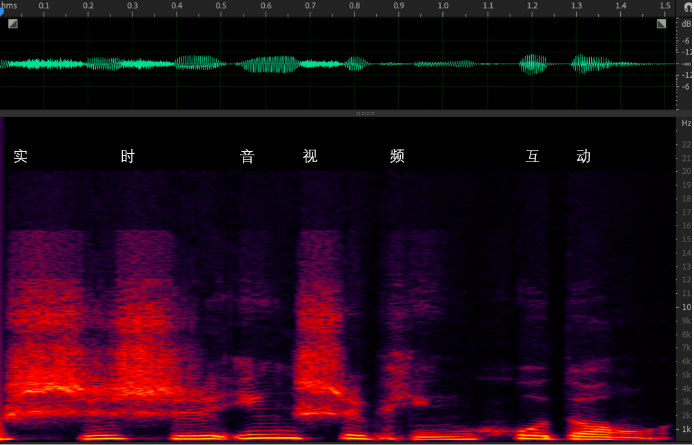
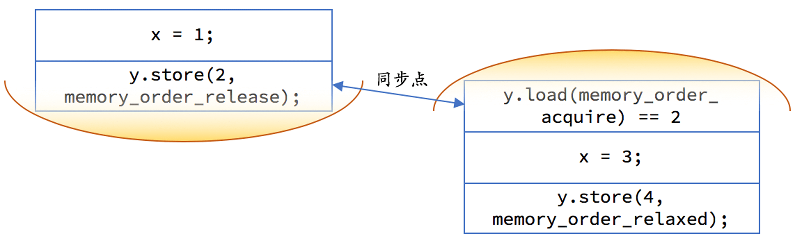

<head>
    
    
</head>

# Table of Contents

1.  [Algorithm](#orgddf98e5)
2.  [Review](#org40fb6c7)
    1.  [声音是如何保存成数字信号的？](#org2a1047a)
        1.  [音频信号的关键指标](#org2d4d6f6)
        2.  [WAV 文件的封装](#org4ec81ca)
    2.  [如何量化分析语音信号](#org2a5f930)
        1.  [语音的基本特征](#org204c90c)
        2.  [语音信号分析](#org1f1d555)
3.  [Tips](#org1eec67c)
4.  [Share](#org65285a5)
    1.  [thread 和 future: 领略异步中的未来](#orged885fe)
        1.  [mutex](#org4941dfe)
        2.  [future](#orge2ec03c)
        3.  [promise](#org15456e9)
        4.  [packaged_task](#orgd825a9c)
    2.  [内存模型和atomic](#orgd82f907)
        1.  [C++ 的内存模型](#org61e1eed)
        2.  [atomic](#org785c08d)
        3.  [mutex](#org3adcca7)
        4.  [并发队列的接口](#org754be82)

# Algorithm

Dynamic Inversion <https://onlinejudge.org/index.php?option=com_onlinejudge&Itemid=8&page=show_problem&problem=3141>

<https://dreamume.medium.com/dynamic-inversion-f0110c88244b>

# Review

搞定音频技术

## 声音是如何保存成数字信号的？

### 音频信号的关键指标

使用麦克风的音频数字信号采集过程：

-   首先，声波通过空气传播到麦克风的震膜
-   然后，震膜随空气抖动的振幅大小产生相应的电学信号。我们把这种带有声学表征的电学信号叫做模拟信号（Anolog Signal）
-   最后，通过 A/DC（模数转换器）将模拟信号转换成数字信号（Digital Signal）。即通过 PCM（Pulse Code Modulation）脉冲编码调制解调器对连续变化的模拟信号进行抽样、量化和编码转换成离散的数字信号

这样我们就实现了音频信号的采集，我们常说的 PCM 文件就是未经封装的音频原始文件或者叫做音频“裸数据”

对于采样率，如果只是为了听见人声、听懂对方在说什么，那么为了节省传输码率我们可以把采样率降到 8kHz（比如打电话）。而在网络音频会议场景需要平衡音质和传输带宽消耗，我们一般可以使用 16kHz 或者 32kHz的采样率。如果是开线上音乐会或者音乐直播，我们通常会用较高的采样率来保证音质，比如 44.1kHz 或者 48kHz。更极端一点，在音乐制作录音的时候，我们会采用 96kHz 甚至更高的采样率来方便后续的调音和制作

2.1声道中的2指的是左右两个音箱，1指的是中间一个低音音箱。每个音箱都会播放一个单独的音频，这时候就需要同时有 3 路音频信号同时播放，或者叫通道数为 3

我们在实时在线互动的时候，由于编/解码器能力的限制（比如使用了单通道编/解码器），或者采集设备能力的限制（只能采集单声道的信号），音频信号通常为单声道的。这里通道数的物理含义就是其实就是同一时间采集或者播放的音频信号的总数

### WAV 文件的封装

wav 文件以 RIFF 格式为标准。RIFF 是 Resource Interchange File Format 的缩写。因此，每个 WAV 文件的头四个字节是 "RIFF"

wav 文件的封装格式非常简单，由 WAV 文件头部分和 WAV 文件数据体部分组成，其中 0 ～ 43 字节存放采样率、通道数、数据部分的标识符等信息，44 字节之后就是数据部分

<table border="2" cellspacing="0" cellpadding="6" rules="groups" frame="hsides">

<colgroup>
<col  class="org-right" />

<col  class="org-right" />

<col  class="org-left" />

<col  class="org-left" />
</colgroup>
<thead>
<tr>
<th scope="col" class="org-right">偏移地址</th>
<th scope="col" class="org-right">字节数</th>
<th scope="col" class="org-left">数据类型</th>
<th scope="col" class="org-left">内容</th>
</tr>
</thead>

<tbody>
<tr>
<td class="org-right">0x00</td>
<td class="org-right">4</td>
<td class="org-left">char</td>
<td class="org-left">RIFF</td>
</tr>

<tr>
<td class="org-right">0x04</td>
<td class="org-right">4</td>
<td class="org-left">long int</td>
<td class="org-left">文件长度</td>
</tr>

<tr>
<td class="org-right">0x08</td>
<td class="org-right">4</td>
<td class="org-left">char</td>
<td class="org-left">WAVE</td>
</tr>

<tr>
<td class="org-right">0x0C</td>
<td class="org-right">4</td>
<td class="org-left">char</td>
<td class="org-left">"fmt "</td>
</tr>

<tr>
<td class="org-right">0x10</td>
<td class="org-right">4</td>
<td class="org-left">&#xa0;</td>
<td class="org-left">过度字节（不定）</td>
</tr>

<tr>
<td class="org-right">0x14</td>
<td class="org-right">2</td>
<td class="org-left">int</td>
<td class="org-left">格式类别（0x10是 PCM 形式的声音格式）</td>
</tr>

<tr>
<td class="org-right">0x16</td>
<td class="org-right">2</td>
<td class="org-left">int</td>
<td class="org-left">通道数</td>
</tr>

<tr>
<td class="org-right">0x18</td>
<td class="org-right">4</td>
<td class="org-left">long int</td>
<td class="org-left">采样率</td>
</tr>

<tr>
<td class="org-right">0x1C</td>
<td class="org-right">4</td>
<td class="org-left">long int</td>
<td class="org-left">波形音频数据传输速率</td>
</tr>

<tr>
<td class="org-right">0x20</td>
<td class="org-right">2</td>
<td class="org-left">int</td>
<td class="org-left">采样帧大小</td>
</tr>

<tr>
<td class="org-right">0x22</td>
<td class="org-right">2</td>
<td class="org-left">int</td>
<td class="org-left">每样本的数据位数</td>
</tr>

<tr>
<td class="org-right">0x24</td>
<td class="org-right">4</td>
<td class="org-left">int</td>
<td class="org-left">"data"</td>
</tr>

<tr>
<td class="org-right">0x28</td>
<td class="org-right">4</td>
<td class="org-left">long int</td>
<td class="org-left">数据大小</td>
</tr>
</tbody>
</table>

其中，波形音频数据传输速率为通道数 x 每秒数据位数 x 样本的数据位数/8，播放器根据此值估算缓冲区大小

采样帧大小为通道数 x 位数/8。播放软件需要一次处理多个该值大小的字节数据，用该数值调整缓冲区

## 如何量化分析语音信号

### 语音的基本特征

语音安卓发音原理可以分为清音和浊音，语音的音调、能量分布等信息可以用基频、谐波、共振峰等特征来分析

1.  浊音和清音

    
    
    声道就是声音声音传播所通过的地方。发音的声道主要是指我们的三个腔体，即咽腔、口腔和鼻腔。而语音是由声源和声道共同作用产生的。按照声源的不同我们把语音分成以下两类：
    
    -   第一类是声带振动作为声源的声音，我们把它们叫做浊音。比如拼音中的“a，o，e“等
    -   第二类是由气体在经过唇齿等狭小区域由于空气和腔体摩擦而产生的声音，我们把它们叫做清音。比如拼音中的”shi、chi、xi“等
    
    
    
    上图是语音的频谱图，图上显示的是“实时音视频互动”这几个字的音频信号的时域图和频域图（频谱图）。时域就是信号幅度和时间的关系，而频域指的是能量与时间和频率的关系
    
    频域更方便我们观察不同频率的能量分布。我们可以看到浊音，比如最后两个字“互动”是明显的有规律的能量分布，即低频能量大于高频且有明显的能量比较集中的地方，如频谱图中的亮线。而“实时”和“视”这几个字，都有“sh“这个由牙齿间高速气流产生的清音。清音在频谱上显示为比较均匀的分布。在 13kHz 的高频，清音也由不少的能量
    
    根据这个简单的分布规律我们已经可以从频谱上分辨清浊音了

2.  基频

    在发浊音的时候，声带会振动从而产生一个声波，我们把这个声波叫做基波，并且把基波的频率叫做基频（一般用 F0 来表示）。这个基频其实就可以对应到我们平时所说的音调。比如，你唱歌音调比较高，其实就是你的声音基频比较高
    
    一般来说，男生的正常说话基频在 100 ～ 200Hz 之间，而女生的则会高一些，在 140 ～ 240Hz 之间。这就是为什么女生的声音听起来比男生的尖锐一些。基频会随年龄变化而变化，比如小孩的基频比较高，可以达到 300 Hz，而年龄越大则基频会越来越低。基频的能量对应的是浊音频谱中频率最低的亮线

3.  谐波

    声带振动产生的基波，在传输过程中会在声道表面反复碰撞反射，从而产生许多频率倍数于基频的声波，我们通常把这些声波叫做谐波。按照谐波频率从低到高，我们依次叫 1 次谐波，2 次谐波等等。下图中我们可以看一下基频信号和谐波信号在时域上的样子
    
    
    
    谐波频率和基频是浊音能量集中的地方，这也就是为什么我们能看见浊音的频谱是一个栅格的形状

4.  共振峰

    一个 200Hz 基频的浊音，大部分的能量都分布在 200Hz 以及 200Hz 的整数倍的频率上。那么是什么决定了哪个谐波的能量高、哪个谐波的能量低呢？
    
    由于高次谐波是由低次谐波在腔体表面碰撞反射得到的，并且碰撞反射会导致能量的衰减，但我们在看频谱图的时候发现谐波信号并不是从低到高依次衰减的。这是为什么呢？
    
    这是因为在这个浊音的产生过程中，声源的振动信号通过声道时，声道本身也会发生共鸣，与声道共振频率相近的能量会被增强，远离声道共振频率的部分则会被衰减，从而谐波的能量就组成了一组高低起伏的形状包络，我们把这些包络中的巅峰位置叫做共振峰
    
    
    
    比如上图英文单词 father 中的“a“这个音我们可以看到明显的三个共振峰，频率分别为 750Hz、1100Hz、2600Hz
    
    频率从低到高我们分别用 F1、F2、F3 等来表示第一共振峰、第二共振峰、第三共振峰
    
    上图我们可以看到，发不同的音，比如“a、i、u“等，共振峰的位置和峰值都是不一样的。这是因为我们之前说的声道的三个腔体随发音的不同，开合、形状都会发生变化。从而形成了不同的腔体共振频率。所以，共振峰的位置和幅度就和发音可以一一对应起来了。这其实也是语音识别背后的原理之一，即通过共振峰的位置和能量分布来识别音频代表的语音

### 语音信号分析

1.  窗函数

    我们分析音频时域或频域特征随时间的变化时，需要按照时间把音频截断成一个个小片段，每个小片段也就是我们说的音频帧。比如 10ms 的切片为 1 帧
    
    但如果直接截断信号则会导致频谱泄漏，即出现不该有的频谱分量。比如，你对一个 50Hz 的单频信号直接截断，可能会出现 60Hz、200Hz 的能量分量。因此，我们一般采用加窗，即在原有信号中乘一个两端为 0 的窗信号，来减少截断信号时的频谱泄漏。常用的窗函数有 Haning（汉宁窗）、Hamming（汉明窗）、Blackman（布莱克曼窗）等。在时域上加窗（Haning）的过程如下图所示：
    
    
    
    可以看到上图中加窗的过程其实就是输入信号乘以窗信号，得到了一个两边小、中间高的新信号

2.  短时能量

    由于语音的能量随时间的变化较快，比如能量小的时候可能就是没有在说话，而能量大的地方可能是语音中重读的地方。因此，短时能量常被用来判断语音的起止位置或者韵律。短时能量分析的定义如下公式所示：
    
    $ E_ {n} = \\sum^{\\infty}_ {m=- \\infty} [x(m) w(n - m)]^{2} $
    
    其中，x 代表采样点，w 代表窗函数。第 n 个点的短时能量 $ E_ {n} $就是由加窗后的采样信号的平方和来表示的。由于不涉及频谱分析，因此这里的窗可以使用简单的矩形窗
    
    短时能量主要有以下 3 个方面的应用：
    
    1.  可以用来区分请浊音。一般来说，清音部分的能量比浊音部分的能量要小很多
    2.  可以用来区分有声段和无声段。比如，可以设置一个能量阙值作为判断改语音段是否为静音段的条件
    3.  能量的起伏在语音识别里也被用于判断韵律（比如重读音节）的特征

3.  短时平均过零率

    短时平均过零率，顾名思义，就是每帧内信号通过零值的次数。连续的音频信号是围绕 0 值上下波动的，并且表现为音频信号正负号随时间不断切换。短时平均过零率可以通过以下公式来计算
    
    $ Z_ {n} = 1 / 2 \\sum^{n + N - 1}_ {m = n} \| sgn[x(m)] - sgn[x(m-1)] \| $
    
    $ sgn[x(n)] = \\left\\{ \\begin{array}{cc} 1, & x(n) >= 0 \\\\ -1, & x(n) < 0 \\end{array} \\right. $
    
    其中，N 位一帧中包含的信号点数，sgn 为符号函数，x 为音频采样点
    
    如果是正弦信号，例如之前图中的基频和谐波信号，它们的短时平均过零率，就是信号的频率除以两倍的采样频率
    
    短时平均过零率在一定程度上可以表示语音信号的频率信息。由于清音的频率集中的范围要高于浊音，所以浊音的过零率要低于清音，从而我们可以初步用短时平均过零率来判断清浊音
    
    除了判断清浊音。还可以将短时能量和短时平均过零率结合起来判断语音起止点的位置。在背景噪声较小的情况下，短时能量比较准确；但当背景噪声比较大时，短时平均过零率有较好的效果。因此，一般的音频识别系统就是通过这两个参数相结合，来判断待检测语音是否真的开始

4.  短时傅里叶变换

    短时傅里叶变换（Short-time Fourier Transform）是音频频域分析最常用的方法之一，简称 STFT
    
    我们在分析音频信号时经常会使用到频谱图，那你知道这个频谱图是怎么得到的吗？
    
    结合短时傅里叶变换的步骤（如下图），也许你就明白了：
    
    -   首先，对时域信号加滑动窗，在把音频切成若干个短帧的同时，防止频谱泄漏（窗可以使用汉宁窗）
    -   然后，对每一帧做快速傅里叶变换（Fast Fourier Transform，简称 FFT），把时域信号转换成复数频域信号
    
    
    
    上图中的 Hop Length 代表滑动窗移动一次的距离，并且 Overlap Length 就是两个相邻滑动窗重叠的范围
    
    清楚了这些，我们就可以回答刚才的问题了。其实呢，我们是把短时傅里叶变换的结果对复数频域信号求模，并取对数转换成分贝（dB），然后用热力图的形式展示出来，这样就能得到之前图中的频谱图。频谱图的横坐标为时间，纵坐标为频率，并且热力图中的颜色代表每个频点在当前时刻的能量大小。这样我们就可以通过频谱图来观察每个时刻的语音能量分布了

5.  梅尔谱（Mel spectrum）

    上面我们通过短时傅里叶变换得到的频谱图通常也叫做声谱、线性谱或者语谱
    
    由于心理和听力系统的构造，其实人耳对以 Hz 为单位的频率并不是很敏感。比如，人类很难区分 500Hz 和 510Hz 的声音。我们平时能区分的音调都是以指数排列的。比如，我们说的高八度其实就是把原有频率乘以 2。因此，用对数的频率坐标来表示可以更好地反映人的实际听感
    
    除此之外，人耳对不同频率声音大小的感知也是不同的。如下图所示，红线代表人耳感知到的响度和实际声压的对应关系，人耳感知的响度我们一般用 phon（方）来表示
    
    
    
    由上图可以看到，人类在 4kHz 的频率对声音的响度比较敏感，而在两端的高频和低频则需要更强的声压，人类才能感知。这其实和人类的进化有关，4kHz 多为猛兽的叫声能量分布范围，所以人耳对这类危险的频率较为警觉
    
    因此，为了结合人耳对频率的感知。需要使用对数的频率坐标，且通过分配滤波器对频谱图的能量按照听感重新分配，于是就有了梅尔谱等表示形式
    
    Mel 谱的计算步骤分为下面几步：
    
    -   首先，对语音信号进行预加重（平衡高低频能量）
    -   然后，语音信号通过 STFT 得到频率谱
    -   最后，通过三角滤波器组对频率谱逐帧进行滤波
    
    三角滤波器组如下图所示。我们可以看到三角滤波器组把频率划分成了若干个频段。敏感的频段滤波器分布比较密集，而不敏感的频段比较稀疏，这样就能更好地表征人耳的实际听感
    
    
    
    梅尔谱以及对梅尔谱再进一步求倒谱系数得到的 MFCC（梅尔倒谱系数），经常被用于语音识别、声音事件识别等领域。其实类似的基于人耳实际听感的表示还有 Bark 谱、Gamma Tone Filter 等

# Tips

# Share

现代 C++ 实战（吴咏炜） 笔记

## thread 和 future: 领略异步中的未来

### mutex

除了 mutex 和 recursive_mutex，C++ 标准库还提供了：

-   timed_mutex: 允许锁定超时的互斥量
-   recursive_timed_mutex: 允许锁定超时的递归互斥量
-   shared_mutex: 允许共享和独占两种获得方式的互斥量
-   shared_timed_mutex: 允许共享和独占两种获得方式的、允许锁定超时的互斥量

C++ 里另外还有 unique_lock (C++) 和 scoped_lock (C++17)，提供了更多的功能

### future

    #include <chrono>
    #include <future>
    #include <iostream>
    #include <thread>
    
    using namespace std;
    
    int work() {
        // do some computing
        this_thread::sleep_for(2s);
        return 42;
    }
    
    int main() {
        auto fut = async(launch::async, work);
        cout << "I am waiting now\n";
        cout << "Answer: " << fut.get()
             << '\n';
    }

我们分析一下上面的代码：

-   work 函数现在不需要考虑条件变量之类的实现细节了，专心干好自己的计算活、老老实实返回结果就可以
-   调用 async 可以获得一个未来量，launch::async 是运行策略，告诉函数模板 async 应当在新线程里异步调用目标函数。在一些老版本的 GCC 里，不指定运行策略，默认不会起新线程
-   async 函数模板可以根据参数来推导出返回类型，在我们的例子里，返回类型是 future<int>
-   在未来量上调用 get 成员函数可以获得其结果。这个结果可以是返回值，也可以是异常，即，如果 work 抛出了异常，那 main 里在执行 fut.get() 时也会得到同样的异常，需要有相应的异常处理代码程序才能正常工作

这里有两个要点：

-   一个 future上只能调用一次 get 函数，第二次调用为未定义行为，通常导致程序崩溃
-   这样一来，自然一个 future 是不能直接在多个线程里用的

上面第一点是 future 的设计，需要在使用时注意一下。第二点则是可以解决的。要么直接拿 future 来移动构造一个 shared_future，要么调用 future 的share 方法来生成一个 shared_future，结果就可以在多个线程里用了 - 当然，每个 shared_future 上仍然还是只是调用一次 get 函数

### promise

我们上面用 async 函数生成了未来量，但这不是唯一的方式。另外有一种常用的方式是 promise，我们看上面的代码用 promise 怎么写：

    #include <chrono>
    #include <future>
    #include <iostream>
    #include <thread>
    #include <utility>
    
    using namespace std;
    
    class scoped_thread {
        // 定义同上，这里省略
    };
    
    void work(promise<int> prom) {
        this_thread::sleep(2s);
        prom.set_value(42);
    }
    
    int main() {
        promise<int> prom;
        auto fut = prom.get_future;
        scoped_thread th{work, move(prom)};
    
        // 干一些事
        cout << "I am waiting now\n";
        cout << "Answer: " << fut.get()
             << '\n';
    }

promise 和 future 在这里成对出现，可以看作是一个一次性管道：有人需要兑现承诺，往 promise 里放东西（set_value）；有人就像收期货一样，到时间去 future （写到这里想到，期货英文不就是 future 么）里拿（get）就行了。我们把 prom 移动给新线程，这样老线程就完全不需要管理它的生命周期了

就这个例子而言，使用 promise 没有 async 方便，但可以看到，这是一种非常灵活的方式，你不需要在一个函数结束时才去设置 future 的值。仍然需要注意的是，一组 promise 和 future 只能使用一次，既不能重复设，也不能重复取

promise 和 future 还有个有趣的用法是使用 void 类型模板参数。这种情况下，两个线程之间不是传递参数，而是进行同步：当一个线程在一个 future<void> 上等待时（使用 get() 或 wait()），另外一个线程可以通过调用 promise<void> 上的 set_value() 让其结束等待、继续往下执行。有兴趣的话，你可以自己试一下

### packaged_task

我们最后要讲一种 future 的用法是打包任务 packaged_task，我们同样给出完成相同功能的示例，方便对比：

    #include <chrono>
    #include <future>
    #include <iostream>
    #include <thread>
    #include <utility>
    
    using namespace std;
    
    class scoped_thread {
        // 定义同上，略
    };
    
    int work() {
        // do something computing
        this_thread::sleep_for(2s);
        return 42;
    }
    
    int main() {
        packaged_task<int()> task{work};
        auto fut = task.get_future();
        scoped_thread th{move(task)};
    
        // do something else
        this_thread::sleep_for(1s);
        cout << "I am waiting now\n";
        cout << "Answer: " << fut.get()
             << '\n';
    }

打包任务里打包的是一个函数，模板参数就是一个函数类型。跟 thread、future、promise 一样。packaged_task 只能移动，不能复制。它是个函数对象，可以像正常函数一样被执行，也可以传递给 thread 在新线程中执行。它的特别地方，自然也是你可以从它得到一个外来量了。通过这个未来量，你可以得到这个打包任务的返回值，或者，至少知道这个打包任务已经执行结束了

## 内存模型和atomic

假设我们有两个全局变量

    int x = 0;
    int y = 0;

一个线程执行：

    x = 1;
    y = 2;

另一个线程执行

    if (y == 2) {
        x = 3;
        y = 4;
    }

在多处理器架构中，各个处理器可能存在缓存不一致性问题。取决于具体的处理器类型、缓存策略和变量地址，对变量 y 的写入有可能先反映到主内存中去。之所以这个问题似乎并不常见，是因为常见的 x86 和 x86-64 处理器是在顺序执行方面做得最保守的 - 大部分其他处理器，如 ARM、DEC Alpha、PA-RISC、IMB Power、IMB z 架构和 Intel Itanium 在内存序问题上都比较“松散”。x86 使用的内存模型基本上提供了顺序一致性（sequential consistency）；相对的，ARM 使用的内存模型就只是松散一致性（relaxed consistency）

### C++ 的内存模型

编译器和 CPU 都有可能导致语句执行顺序不一样。我们需要在 x = 1 和 y = 2 两句语句之间加入内存屏障，禁止这两句语句交换顺序。我们在此种情况下最常用的两个概念是“获得”和“释放”

-   获得是一个对内存的读操作，当前线程的任何后面的读写操作都不允许重排到这个操作的前面去
-   释放是一个对内存的写操作，当前线程的任何前面的读写操作都不允许重排到这个操作的后面去

具体到我们上面的例子，我们需要把 y 声明成 atomic<int>。然后，我们在线程 1 需要使用释放语义

    x = 1;
    y.store(2, memory_order_release);

在线程 2 我们对 y 的读取应当使用获得语义，但存储之需要松散内存序即可：

    if (y.load(memory_order_acquire) == 2) {
        x = 3;
        y.store(4, memory_order_relaxed);
    }

我们可以用上图示意一下，每一边的代码都不允许重排越过黄色区域，且如果 y 上的释放早于 y 上的获取的话，释放前对内存的修改都在另一个线程的获取操作后可见

事实上，在我们把 y 改成 atomic<int> 之后，两个线程的代码一行不变，执行结果都会是符合我们的期望的。因为 atomic 变量的写操作缺省就是释放语义，读操作缺省就是获得语义（不严格的说法，精确表述见下面的内存序部分）。即

-   y = 2 相当于 y.store(2, memory_order_release)
-   y `= 2 相当于 y.load(memory_order_acquire) =` 2

但是，缺省行为可能对性能不利的：我们并不需要在任何情况下都保证操作的顺序性

另外，我们应当注意一下，acqure 和 release 通常都是配对出现的，目的是保证如果对同一个原子对象的 release 发生在 acquire 之前的话，release 之前发生的内存修改能够被 acquire 之后的内存读取全部看到

### atomic

C++11 在 <atomic> 头文件中引入了 atomic 模板，对原子对象进行了封装。我们可以将其应用到任何类型上去。当然对于不同的类型效果还是有所不同的：对于整型量和指针等简单类型，通常结果是无锁的原子对象；而对于另外一些类型，比如 64 位机器上大小不是1、2、4、8（有些平台/编译器也支持对更大的数据进行无锁原子操作）的类型，编译器会自动为这些原子对象的操作加上锁。编译器提供了一个原子对象的成员函数 is_lock_free，可以检查这个原子对象上的操作是否是无锁的

原子操作有三类：

-   读：在读取的过程中，读取位置的内容不会发生任何变动
-   写：在写入的过程中，其他执行线程不会看到部分写入的结果
-   读-修改-写：读取内存、修改数值、然后写回内存，整个操作的过程中间不会有其他写入操作插入，其他执行线程不会看到部分写入的结果

<atomic> 头文件还定义了内存序，分别为

-   memory_order_relaxed: 松散内存序，只用来保证对原子对象的操作是原子的
-   memory_order_comsume: 目前不鼓励使用，就不说明了
-   memory_order_acquire: 获得操作，在读取某原子对象时，当前线程的任何后面的读写操作都不允许重排到这个操作的前面去，并且其他现场在对同一个原子对象释放之前的所有内存写入都在当前线程可见
-   memory_order_release: 释放操作，在写入某原子对象时，当前现场的任何前面的读写操作都不允许重排到这个操作的后面去，并且当前现场的所有内存写入都在对同一个院子对象进行获取的其他线程可见
-   memory_order_acq_rel: 获得释放操作，一个读-修改-写操作同时具有获得语义和释放语义，即它前后的任何读写操作都不允许重排，并且其他线程在对同一个院子对象释放之前的所有内存写入都在当前线程可见，当前线程的所有内存写入都在对同一个原子对象进行获取的其他线程可见
-   memory_order_seq_cst: 顺序一致性语义，对于读操作相当于获取，对于写操作相当于释放，对于读-修改-写操作相当于获取释放，是所有原子操作的默认内存序（除此之外，顺序一致性还保证了多个原子量的修改在所有线程里观察到的修改顺序都相同；我们目前的讨论暂不涉及多个原子量的修改）

atomic 有下面这些常用的成员函数：

-   默认构造函数（只支持零初始化）
-   拷贝构造函数被删除
-   使用内置对象类型的构造函数（不是原子操作）
-   可以从内置对象类型赋值到原子对象（相当于 store）
-   可以从原子对象隐式转换成内置对象（相当于 load）
-   store，写入对象到原子对象里，第二个可选参数是内存序类型
-   load，从原子对象读取内置对象，有个可选参数是内存序类型
-   is_lock_free，判断对原子对象的操作是否无锁（是否可以用处理器的指令直接完成原子操作）
-   exchqnge；交换操作，第二个可选参数是内存序类型（这是读-修改-写操作）
-   compare_exchange_weak 和 compare_exchange_strong，两个比较加交换（CAS）的版本，你可以分别指定成功和失败时的内存序，也可以只指定一个，或使用默认的最安全内存序（这是读-修改-写操作）
-   fetch_add 和 fetch_sub，仅对整数和指针内置对象有效，对目标原子对象执行加或减操作，返回其原始值，第二个可选参数是内存序类型（这是读-修改-写操作）
-   ++ 和 &#x2013; （前置和后置），仅对整数和指针内置对象有效，对目标原子对象执行增一或减一，操作使用顺序一致性语义，并注意返回的不是原子对象的引用（这是读-修改-写操作）
-   += 和 -=，仅对整数和指针内置对象有效，对目标原子对象执行加或减操作，返回操作之后的数值，操作使用顺序一致性语义，并注意返回的不是原子对象的引用（这是读-修改-写操作）

### mutex

互斥量这里要补充两点：

-   互斥量的加锁操作（lock）具有获得语义
-   互斥量的解锁操作（unlock）具有释放语义

这里我们实现一个真正安全的双重检查锁定：

    class singleton {
    public:
        static singleton* instance();
        // ...
    private:
        static mutex lock_;
        static atomic<singleton*> inst_ptr_;
    };
    
    mutex singleton::lock_;
    atomic<singleton*> singleton::inst_ptr_;
    
    singleton* singleton::instance() {
        singleton* ptr = inst_ptr_.load(memory_order_acquire);
        if (ptr == nullptr) {
            lock_guard<mutex> guard{lock_};
            ptr = inst_ptr_.load(memory_order_relaxed);
            if (ptr == nullptr) {
                ptr = new singleton();
                inst_ptr_.store(ptr, memory_order_release);
            }
        }
    
        return inst_ptr_;
    }

有个小地方注意一下：为了和 inst_ptr_.load 语句对称，我在 inst_ptr_.store 时使用了释放语义；不过，由于互斥量解锁本身具有释放语义，这么做并不是必需的

### 并发队列的接口

这里我们来检查一下并发对编程接口的冲击。回想标准库里 queue 有下面这样的接口：

    template <typename T> class queue {
    public:
        // ...
        T& front();
        const T& front() const;
        void pop();
        // ...
    };

事实上，上面这样的接口是不可能做到并发安全的。并发安全的接口大概长下面这样：

    template <typename T> class queue {
    public:
        // ...
        void wait_and_pop(T& dest);
        void try_pop(%& dest);
        // ...
    };

并发队列的实现，经常是用原子量来达到无锁和高性能的。单生产者、单消费者的并发队列，用原子量和获得、释放语义就能简单实现。对于多生产者或多消费者的情况，那实现就比较复杂了，一般会使用 compare_exchange_strong 或 compare_exchange_weak，如果感兴趣，可以查看下面几项内容：

-   nvwa::fc_queue 给出了一个单生产者、单消费者的无锁并发长环形队列，代码长度是几百行的量级
-   moodycamel::ConcurrentQueue 给出了一个多生产者、多消费者的无锁通用并发队列，代码长度是几千行的量级
-   陈皓给出了一篇很棒的对无锁队列的中文描述，推荐阅读
