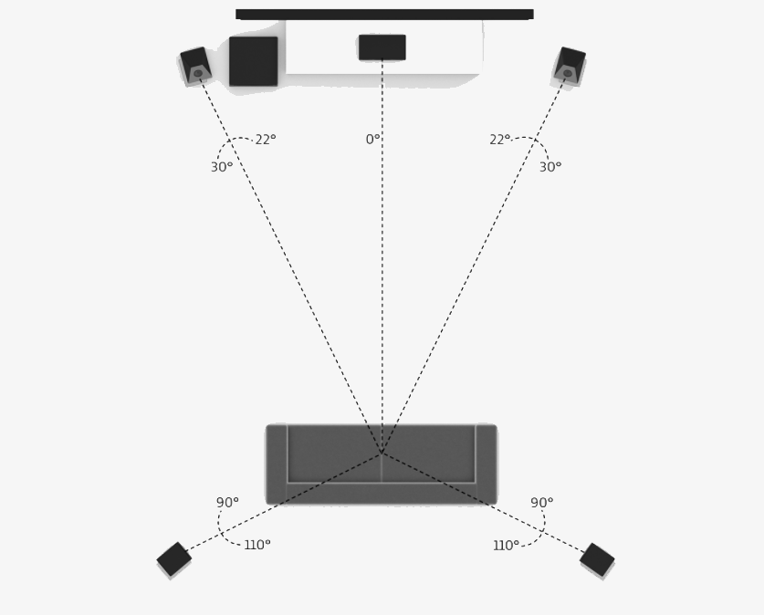
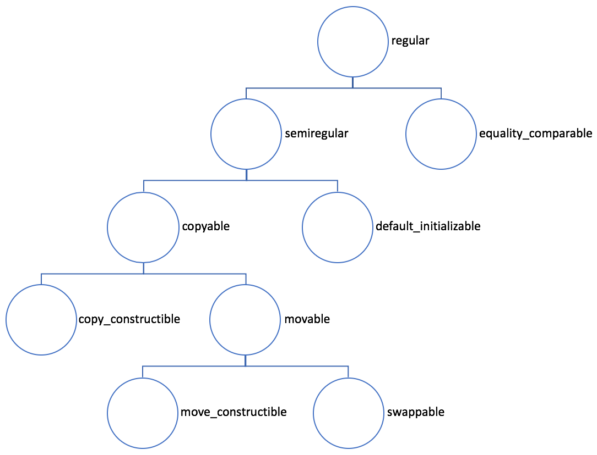

<head>
    
    
</head>

# Table of Contents

1.  [Algorithm](#orgddf98e5)
2.  [Review](#org40fb6c7)
    1.  [声音是如何保存成数字信号的？](#org2a1047a)
        1.  [音频信号的关键指标](#org2d4d6f6)
        2.  [WAV 文件的封装](#org4ec81ca)
    2.  [如何量化分析语音信号](#org2a5f930)
        1.  [语音的基本特征](#org204c90c)
        2.  [语音信号分析](#org1f1d555)
    3.  [如何分析与处理音乐信号](#org2df600f)
        1.  [常见的乐器种类和发音原理](#orgd48ed91)
        2.  [速度与节拍](#orgdb1f783)
        3.  [音调](#orga0de290)
        4.  [调式](#org7d30d1e)
        5.  [音乐场景问题案例分析](#org0578691)
    4.  [如何评价音频质量的好坏](#orgc2fce42)
        1.  [音频主观评价方法](#org37f42c7)
        2.  [音频客观评价方法](#orgbabb8eb)
    5.  [音频降噪如何对症下药](#orgd16dabc)
        1.  [噪声的分类](#org5040d37)
        2.  [如何降噪](#org506092f)
        3.  [降噪算法第一招：线性滤波器](#org4904e99)
        4.  [降噪算法第二招：谱减法](#org1370a3b)
        5.  [降噪算法第三招：基于统计模型的实时降噪算法](#orgde322a7)
        6.  [降噪算法第四招：子空间算法](#orgceeb4c9)
        7.  [降噪算法第五招：基于机器学习的降噪](#orgeec7db6)
    6.  [如何将 AI 技术运用到降噪中？](#orgd9388c1)
        1.  [AI 降噪模型的基础知识](#org38b5c12)
        2.  [常见模型结构](#org446b30d)
        3.  [DNN](#org981db99)
        4.  [CNN](#org8ba9018)
        5.  [RNN](#org29af4c4)
        6.  [模型训练方法](#orgca6186d)
        7.  [基于频域掩码的 AI 降噪算法](#org64fea0e)
        8.  [AI 降噪模型的工程部署](#org189d885)
        9.  [因果性](#org7994c66)
        10. [AI 降噪模型存储空间和算力限制](#orgdb4b856)
    7.  [如何通过算法自动快速地消除回声](#org710d9b8)
        1.  [回声产生的原因](#org0f79411)
        2.  [回声消除的基本原理](#orgc2233e6)
        3.  [自适应滤波器](#orge955323)
        4.  [LMS、NLSM 算法](#org71e0a9d)
        5.  [线性滤波器的挑战和解决方法](#org631ccc7)
        6.  [小结](#org86d0c79)
    8.  [回声消除算法实践指南](#org79fc201)
        1.  [实时音频处理链路](#org6c9d002)
        2.  [回声消除算法案例分析](#orgdf5bddb)
        3.  [小结](#org2300365)
    9.  [音频编解码器是如何工作的？](#org5c7ba35)
        1.  [编/解码器的发展史](#orgfcef02b)
        2.  [音频数据裁剪和量化](#org6f1f608)
        3.  [语音编/解码器的基本原理](#org3a58ad5)
        4.  [音乐编/解码器的基本原理](#orgb06502c)
    10. [如何选择一个适合你的编解码器](#org9fdd417)
        1.  [音频编/解码中常见的指标](#org009648e)
        2.  [音频编/解码器案例分析](#org5319685)
3.  [Tips](#org1eec67c)
    1.  [Jupyter Notebook 为什么是现代 Python 的必学技术？](#org30c502d)
        1.  [什么是 Jupyter Notebook?](#org1edd0f8)
        2.  [Jupyter 的优点](#orgb17d155)
    2.  [字典、集合](#org18705f3)
        1.  [字典和集合的工作原理](#orgb5dc999)
        2.  [插入操作](#orge837a9a)
        3.  [查找操作](#org10e8ba6)
        4.  [删除操作](#org34568a7)
    3.  [Python “黑箱”：输入与输出](#orgde69fb3)
        1.  [输入输出基础](#org86c31df)
        2.  [文件输入输出](#org526dec1)
        3.  [JSON 序列化与实战](#org37fe6ef)
    4.  [修炼基本功：条件与循环](#org87e1361)
        1.  [条件语句](#org483d181)
        2.  [循环语句](#orgcc307a5)
4.  [Share](#org65285a5)
    1.  [thread 和 future: 领略异步中的未来](#orged885fe)
        1.  [mutex](#org4941dfe)
        2.  [future](#orge2ec03c)
        3.  [promise](#org15456e9)
        4.  [packaged_task](#orgd825a9c)
    2.  [内存模型和atomic](#orgd82f907)
        1.  [C++ 的内存模型](#org61e1eed)
        2.  [atomic](#org785c08d)
        3.  [mutex](#org3adcca7)
        4.  [并发队列的接口](#org754be82)
    3.  [处理数据类型变化和错误：optional、variant、expected 和 Herbception](#org8348f00)
        1.  [optional](#org3012da6)
        2.  [variant](#org8cf7a76)
        3.  [expected](#org0e9ca0b)
        4.  [Herbception](#org4918c33)
    4.  [数字计算：介绍线性袋鼠和数值计算库](#orgdad83b1)
        1.  [Armadillo](#orga1ecbbd)
        2.  [对象的输出](#orge686d3a)
        3.  [表达式模板](#org49c748d)
        4.  [Boost.Multiprecision](#org92e2207)
    5.  [Boost: 你需要的“瑞士军刀”](#orga640d79)
        1.  [Boost.TypeIndex](#orgbf11478)
        2.  [Boost.Core](#org1840ed8)
    6.  [两个单元测试库：C++ 里如何进行单元测试](#orga4a17dd)
        1.  [Boost.Test](#org7778a02)
        2.  [Catch2](#org1fedbb7)
    7.  [Easylogging++ 和 spdlog: 两个好用的日志库](#org8b4d3ad)
        1.  [Easylogging++](#orga5baadc)
        2.  [spdlog](#orga60e61f)
    8.  [C++ REST SDK:  使用现代 C++ 开发网络应用](#orgbf0f661)
        1.  [异步流](#orgc509bfa)
        2.  [JSON 支持](#org740014a)
        3.  [HTTP 服务器](#org4807638)
        4.  [关于线程的细节](#org792c2e1)
    9.  [C++ 推荐书籍与资源](#org6b7a7fa)
    10. [Concepts: 如何对模板进行约束？](#orgf6078a2)
        1.  [Concepts 简史](#org18f904e)
        2.  [基本的 Concepts](#org2fb3891)
        3.  [简单的概念测试](#orgef2301a)
        4.  [概念、出错信息和 SFINAE](#org319452d)
    11. [Ranges: 无迭代器的迭代和更方便的组合](#orgecb2487)
        1.  [Ranges 简介](#orgbe62862)
        2.  [范围相关的概念](#org76dc70c)
        3.  [Sentinel](#org2279532)
        4.  [概念测试](#orgce777a0)
        5.  [抽象和性能](#orgea61ec4)
        6.  [ranges 名空间](#orgbb3c976)
        7.  [批评和未来](#org80a54e5)
    12. [Coroutines: 协作式的交叉调度执行](#org76777f3)
        1.  [什么是协程](#orge88067b)
        2.  [C++20 协程](#orgf0d81d7)
        3.  [co_await、co_yield、co_return 和协程控制](#orgfc277bc)
        4.  [定义 uint64_resumable](#org18f993c)
        5.  [C++20 协程的高层抽象](#orgbf2f0f7)
    13. [new 和 delete 背后：分配函数和释放函数](#orga49d4fd)
        1.  [最常用的分配和释放函数](#orgfe44fa2)
        2.  [布置分配和释放函数](#org81b02f5)
        3.  [不分配内存的布置分配和释放函数](#org47e55ee)
        4.  [内存对齐的分配和释放函数](#orgccb22e2)
        5.  [替换分配和释放函数](#orgcc99baf)
        6.  [类特定的分配和释放函数](#org195f3b5)
    14. [容器里的内存管理：分配器](#org1cd792a)
        1.  [一点点历史](#orgee50951)
        2.  [标准分配器](#org843c365)
        3.  [分配器特征](#org2c63995)
        4.  [多态分配器](#org3330da4)

# Algorithm

Dynamic Inversion <https://onlinejudge.org/index.php?option=com_onlinejudge&Itemid=8&page=show_problem&problem=3141>

<https://dreamume.medium.com/dynamic-inversion-f0110c88244b>

# Review

搞定音频技术    冯建元

## 声音是如何保存成数字信号的？

### 音频信号的关键指标

使用麦克风的音频数字信号采集过程：

-   首先，声波通过空气传播到麦克风的震膜
-   然后，震膜随空气抖动的振幅大小产生相应的电学信号。我们把这种带有声学表征的电学信号叫做模拟信号（Anolog Signal）
-   最后，通过 A/DC（模数转换器）将模拟信号转换成数字信号（Digital Signal）。即通过 PCM（Pulse Code Modulation）脉冲编码调制解调器对连续变化的模拟信号进行抽样、量化和编码转换成离散的数字信号

这样我们就实现了音频信号的采集，我们常说的 PCM 文件就是未经封装的音频原始文件或者叫做音频“裸数据”

对于采样率，如果只是为了听见人声、听懂对方在说什么，那么为了节省传输码率我们可以把采样率降到 8kHz（比如打电话）。而在网络音频会议场景需要平衡音质和传输带宽消耗，我们一般可以使用 16kHz 或者 32kHz的采样率。如果是开线上音乐会或者音乐直播，我们通常会用较高的采样率来保证音质，比如 44.1kHz 或者 48kHz。更极端一点，在音乐制作录音的时候，我们会采用 96kHz 甚至更高的采样率来方便后续的调音和制作

2.1声道中的2指的是左右两个音箱，1指的是中间一个低音音箱。每个音箱都会播放一个单独的音频，这时候就需要同时有 3 路音频信号同时播放，或者叫通道数为 3

我们在实时在线互动的时候，由于编/解码器能力的限制（比如使用了单通道编/解码器），或者采集设备能力的限制（只能采集单声道的信号），音频信号通常为单声道的。这里通道数的物理含义就是其实就是同一时间采集或者播放的音频信号的总数

### WAV 文件的封装

wav 文件以 RIFF 格式为标准。RIFF 是 Resource Interchange File Format 的缩写。因此，每个 WAV 文件的头四个字节是 "RIFF"

wav 文件的封装格式非常简单，由 WAV 文件头部分和 WAV 文件数据体部分组成，其中 0 ～ 43 字节存放采样率、通道数、数据部分的标识符等信息，44 字节之后就是数据部分

<table border="2" cellspacing="0" cellpadding="6" rules="groups" frame="hsides">

<colgroup>
<col  class="org-right" />

<col  class="org-right" />

<col  class="org-left" />

<col  class="org-left" />
</colgroup>
<thead>
<tr>
<th scope="col" class="org-right">偏移地址</th>
<th scope="col" class="org-right">字节数</th>
<th scope="col" class="org-left">数据类型</th>
<th scope="col" class="org-left">内容</th>
</tr>
</thead>

<tbody>
<tr>
<td class="org-right">0x00</td>
<td class="org-right">4</td>
<td class="org-left">char</td>
<td class="org-left">RIFF</td>
</tr>

<tr>
<td class="org-right">0x04</td>
<td class="org-right">4</td>
<td class="org-left">long int</td>
<td class="org-left">文件长度</td>
</tr>

<tr>
<td class="org-right">0x08</td>
<td class="org-right">4</td>
<td class="org-left">char</td>
<td class="org-left">WAVE</td>
</tr>

<tr>
<td class="org-right">0x0C</td>
<td class="org-right">4</td>
<td class="org-left">char</td>
<td class="org-left">"fmt "</td>
</tr>

<tr>
<td class="org-right">0x10</td>
<td class="org-right">4</td>
<td class="org-left">&#xa0;</td>
<td class="org-left">过度字节（不定）</td>
</tr>

<tr>
<td class="org-right">0x14</td>
<td class="org-right">2</td>
<td class="org-left">int</td>
<td class="org-left">格式类别（0x10是 PCM 形式的声音格式）</td>
</tr>

<tr>
<td class="org-right">0x16</td>
<td class="org-right">2</td>
<td class="org-left">int</td>
<td class="org-left">通道数</td>
</tr>

<tr>
<td class="org-right">0x18</td>
<td class="org-right">4</td>
<td class="org-left">long int</td>
<td class="org-left">采样率</td>
</tr>

<tr>
<td class="org-right">0x1C</td>
<td class="org-right">4</td>
<td class="org-left">long int</td>
<td class="org-left">波形音频数据传输速率</td>
</tr>

<tr>
<td class="org-right">0x20</td>
<td class="org-right">2</td>
<td class="org-left">int</td>
<td class="org-left">采样帧大小</td>
</tr>

<tr>
<td class="org-right">0x22</td>
<td class="org-right">2</td>
<td class="org-left">int</td>
<td class="org-left">每样本的数据位数</td>
</tr>

<tr>
<td class="org-right">0x24</td>
<td class="org-right">4</td>
<td class="org-left">int</td>
<td class="org-left">"data"</td>
</tr>

<tr>
<td class="org-right">0x28</td>
<td class="org-right">4</td>
<td class="org-left">long int</td>
<td class="org-left">数据大小</td>
</tr>
</tbody>
</table>

其中，波形音频数据传输速率为通道数 x 每秒数据位数 x 样本的数据位数/8，播放器根据此值估算缓冲区大小

采样帧大小为通道数 x 位数/8。播放软件需要一次处理多个该值大小的字节数据，用该数值调整缓冲区

## 如何量化分析语音信号

### 语音的基本特征

语音安卓发音原理可以分为清音和浊音，语音的音调、能量分布等信息可以用基频、谐波、共振峰等特征来分析

1.  浊音和清音

    
    
    声道就是声音声音传播所通过的地方。发音的声道主要是指我们的三个腔体，即咽腔、口腔和鼻腔。而语音是由声源和声道共同作用产生的。按照声源的不同我们把语音分成以下两类：
    
    -   第一类是声带振动作为声源的声音，我们把它们叫做浊音。比如拼音中的“a，o，e“等
    -   第二类是由气体在经过唇齿等狭小区域由于空气和腔体摩擦而产生的声音，我们把它们叫做清音。比如拼音中的”shi、chi、xi“等
    
    
    
    上图是语音的频谱图，图上显示的是“实时音视频互动”这几个字的音频信号的时域图和频域图（频谱图）。时域就是信号幅度和时间的关系，而频域指的是能量与时间和频率的关系
    
    频域更方便我们观察不同频率的能量分布。我们可以看到浊音，比如最后两个字“互动”是明显的有规律的能量分布，即低频能量大于高频且有明显的能量比较集中的地方，如频谱图中的亮线。而“实时”和“视”这几个字，都有“sh“这个由牙齿间高速气流产生的清音。清音在频谱上显示为比较均匀的分布。在 13kHz 的高频，清音也由不少的能量
    
    根据这个简单的分布规律我们已经可以从频谱上分辨清浊音了

2.  基频

    在发浊音的时候，声带会振动从而产生一个声波，我们把这个声波叫做基波，并且把基波的频率叫做基频（一般用 F0 来表示）。这个基频其实就可以对应到我们平时所说的音调。比如，你唱歌音调比较高，其实就是你的声音基频比较高
    
    一般来说，男生的正常说话基频在 100 ～ 200Hz 之间，而女生的则会高一些，在 140 ～ 240Hz 之间。这就是为什么女生的声音听起来比男生的尖锐一些。基频会随年龄变化而变化，比如小孩的基频比较高，可以达到 300 Hz，而年龄越大则基频会越来越低。基频的能量对应的是浊音频谱中频率最低的亮线

3.  谐波

    声带振动产生的基波，在传输过程中会在声道表面反复碰撞反射，从而产生许多频率倍数于基频的声波，我们通常把这些声波叫做谐波。按照谐波频率从低到高，我们依次叫 1 次谐波，2 次谐波等等。下图中我们可以看一下基频信号和谐波信号在时域上的样子
    
    
    
    谐波频率和基频是浊音能量集中的地方，这也就是为什么我们能看见浊音的频谱是一个栅格的形状

4.  共振峰

    一个 200Hz 基频的浊音，大部分的能量都分布在 200Hz 以及 200Hz 的整数倍的频率上。那么是什么决定了哪个谐波的能量高、哪个谐波的能量低呢？
    
    由于高次谐波是由低次谐波在腔体表面碰撞反射得到的，并且碰撞反射会导致能量的衰减，但我们在看频谱图的时候发现谐波信号并不是从低到高依次衰减的。这是为什么呢？
    
    这是因为在这个浊音的产生过程中，声源的振动信号通过声道时，声道本身也会发生共鸣，与声道共振频率相近的能量会被增强，远离声道共振频率的部分则会被衰减，从而谐波的能量就组成了一组高低起伏的形状包络，我们把这些包络中的巅峰位置叫做共振峰
    
    
    
    比如上图英文单词 father 中的“a“这个音我们可以看到明显的三个共振峰，频率分别为 750Hz、1100Hz、2600Hz
    
    频率从低到高我们分别用 F1、F2、F3 等来表示第一共振峰、第二共振峰、第三共振峰
    
    上图我们可以看到，发不同的音，比如“a、i、u“等，共振峰的位置和峰值都是不一样的。这是因为我们之前说的声道的三个腔体随发音的不同，开合、形状都会发生变化。从而形成了不同的腔体共振频率。所以，共振峰的位置和幅度就和发音可以一一对应起来了。这其实也是语音识别背后的原理之一，即通过共振峰的位置和能量分布来识别音频代表的语音

### 语音信号分析

1.  窗函数

    我们分析音频时域或频域特征随时间的变化时，需要按照时间把音频截断成一个个小片段，每个小片段也就是我们说的音频帧。比如 10ms 的切片为 1 帧
    
    但如果直接截断信号则会导致频谱泄漏，即出现不该有的频谱分量。比如，你对一个 50Hz 的单频信号直接截断，可能会出现 60Hz、200Hz 的能量分量。因此，我们一般采用加窗，即在原有信号中乘一个两端为 0 的窗信号，来减少截断信号时的频谱泄漏。常用的窗函数有 Haning（汉宁窗）、Hamming（汉明窗）、Blackman（布莱克曼窗）等。在时域上加窗（Haning）的过程如下图所示：
    
    
    
    可以看到上图中加窗的过程其实就是输入信号乘以窗信号，得到了一个两边小、中间高的新信号

2.  短时能量

    由于语音的能量随时间的变化较快，比如能量小的时候可能就是没有在说话，而能量大的地方可能是语音中重读的地方。因此，短时能量常被用来判断语音的起止位置或者韵律。短时能量分析的定义如下公式所示：
    
    $ E_ {n} = \\sum^{\\infty}_ {m=- \\infty} [x(m) w(n - m)]^{2} $
    
    其中，x 代表采样点，w 代表窗函数。第 n 个点的短时能量 $ E_ {n} $就是由加窗后的采样信号的平方和来表示的。由于不涉及频谱分析，因此这里的窗可以使用简单的矩形窗
    
    短时能量主要有以下 3 个方面的应用：
    
    1.  可以用来区分请浊音。一般来说，清音部分的能量比浊音部分的能量要小很多
    2.  可以用来区分有声段和无声段。比如，可以设置一个能量阙值作为判断改语音段是否为静音段的条件
    3.  能量的起伏在语音识别里也被用于判断韵律（比如重读音节）的特征

3.  短时平均过零率

    短时平均过零率，顾名思义，就是每帧内信号通过零值的次数。连续的音频信号是围绕 0 值上下波动的，并且表现为音频信号正负号随时间不断切换。短时平均过零率可以通过以下公式来计算
    
    $ Z_ {n} = 1 / 2 \\sum^{n + N - 1}_ {m = n} \| sgn[x(m)] - sgn[x(m-1)] \| $
    
    $ sgn[x(n)] = \\left\\{ \\begin{array}{cc} 1, & x(n) >= 0 \\\\ -1, & x(n) < 0 \\end{array} \\right. $
    
    其中，N 位一帧中包含的信号点数，sgn 为符号函数，x 为音频采样点
    
    如果是正弦信号，例如之前图中的基频和谐波信号，它们的短时平均过零率，就是信号的频率除以两倍的采样频率
    
    短时平均过零率在一定程度上可以表示语音信号的频率信息。由于清音的频率集中的范围要高于浊音，所以浊音的过零率要低于清音，从而我们可以初步用短时平均过零率来判断清浊音
    
    除了判断清浊音。还可以将短时能量和短时平均过零率结合起来判断语音起止点的位置。在背景噪声较小的情况下，短时能量比较准确；但当背景噪声比较大时，短时平均过零率有较好的效果。因此，一般的音频识别系统就是通过这两个参数相结合，来判断待检测语音是否真的开始

4.  短时傅里叶变换

    短时傅里叶变换（Short-time Fourier Transform）是音频频域分析最常用的方法之一，简称 STFT
    
    我们在分析音频信号时经常会使用到频谱图，那你知道这个频谱图是怎么得到的吗？
    
    结合短时傅里叶变换的步骤（如下图），也许你就明白了：
    
    -   首先，对时域信号加滑动窗，在把音频切成若干个短帧的同时，防止频谱泄漏（窗可以使用汉宁窗）
    -   然后，对每一帧做快速傅里叶变换（Fast Fourier Transform，简称 FFT），把时域信号转换成复数频域信号
    
    
    
    上图中的 Hop Length 代表滑动窗移动一次的距离，并且 Overlap Length 就是两个相邻滑动窗重叠的范围
    
    清楚了这些，我们就可以回答刚才的问题了。其实呢，我们是把短时傅里叶变换的结果对复数频域信号求模，并取对数转换成分贝（dB），然后用热力图的形式展示出来，这样就能得到之前图中的频谱图。频谱图的横坐标为时间，纵坐标为频率，并且热力图中的颜色代表每个频点在当前时刻的能量大小。这样我们就可以通过频谱图来观察每个时刻的语音能量分布了

5.  梅尔谱（Mel spectrum）

    上面我们通过短时傅里叶变换得到的频谱图通常也叫做声谱、线性谱或者语谱
    
    由于心理和听力系统的构造，其实人耳对以 Hz 为单位的频率并不是很敏感。比如，人类很难区分 500Hz 和 510Hz 的声音。我们平时能区分的音调都是以指数排列的。比如，我们说的高八度其实就是把原有频率乘以 2。因此，用对数的频率坐标来表示可以更好地反映人的实际听感
    
    除此之外，人耳对不同频率声音大小的感知也是不同的。如下图所示，红线代表人耳感知到的响度和实际声压的对应关系，人耳感知的响度我们一般用 phon（方）来表示
    
    
    
    由上图可以看到，人类在 4kHz 的频率对声音的响度比较敏感，而在两端的高频和低频则需要更强的声压，人类才能感知。这其实和人类的进化有关，4kHz 多为猛兽的叫声能量分布范围，所以人耳对这类危险的频率较为警觉
    
    因此，为了结合人耳对频率的感知。需要使用对数的频率坐标，且通过分配滤波器对频谱图的能量按照听感重新分配，于是就有了梅尔谱等表示形式
    
    Mel 谱的计算步骤分为下面几步：
    
    -   首先，对语音信号进行预加重（平衡高低频能量）
    -   然后，语音信号通过 STFT 得到频率谱
    -   最后，通过三角滤波器组对频率谱逐帧进行滤波
    
    三角滤波器组如下图所示。我们可以看到三角滤波器组把频率划分成了若干个频段。敏感的频段滤波器分布比较密集，而不敏感的频段比较稀疏，这样就能更好地表征人耳的实际听感
    
    
    
    梅尔谱以及对梅尔谱再进一步求倒谱系数得到的 MFCC（梅尔倒谱系数），经常被用于语音识别、声音事件识别等领域。其实类似的基于人耳实际听感的表示还有 Bark 谱、Gamma Tone Filter 等

## 如何分析与处理音乐信号

### 常见的乐器种类和发音原理

日常中常见的乐器主要由三种：打击乐器、弦乐器和管乐器

打击乐器，比如我们常说的“敲锣打鼓”。这类乐器的发音主要是依靠打击振动。比如，鼓在鼓皮绷紧的状态下，受外力振动。振动的速度越快、力量越大、振幅越大，发出的声音就会越响亮

鼓的音调，取决于鼓的尺寸、鼓皮的材质等。一个鼓经过调音，比如调节鼓皮的松紧程度后音调就固定了，所以如果需要同时演奏不同的音调就需要一组鼓，比如架子鼓

第二种弦乐器，包括钢琴、二胡、小提琴等乐器。这类乐器发音来源于弦的振动。不同形状的弦发出的声音特点也有所不同：若弦短而细，且绷紧，则乐器发出的音调高；若弦长而粗，且不紧，则乐器发出的音调低

乐器的声音大小取决于弦的振幅大小。为了促使乐器能够发出洪亮的声音，一般会采用木制的共鸣箱以达到增强音量的效果。这一过程和人声浊音的发音十分相似，所以弦乐器也会有基频和谐波，弦乐器的谐波也叫做泛音。大提琴的声音，由于发音的基频和泛音的频率范围和人声相似，所以大提琴也被称为最像人声的乐器

第三种管乐器，包括笛子、号、萨克斯等乐器。这类乐器发音来源于空气柱振动。当吹奏管乐器时，抬起不同的手指会形成不同长度的空气柱，若空气柱越长，则音调越低。若空气柱短，则音调越高。比如竖笛，越短的笛子发出的声音音调越高

### 速度与节拍

一首曲子的节奏是由速度和节拍决定的。速度我们一般以 BPM（beats per minutes）来表示。我们在演奏或者歌唱练习时，用的节拍器就是按照 BPM 来打节奏的。比如 80BPM，节拍器就会每分钟发出 80 次“嘀嗒”声，如果是用鼓来打节奏，就每分钟打出 80 个间隔均匀的鼓点

而节拍用来描述音乐中的进程的规律。在音乐中，指有一定强弱分别的一系列拍子，在每隔一定时间重复出现。若干个这样有规律的拍子我们叫一个小节，比如常见的四拍一个小节。一首乐曲的节拍是作曲时就固定的，不会改变。一首乐曲可以是由若干种节拍相结合组成的。常见的节拍有四四拍 4/4、四二拍 2/4、四一拍 1/4、四三拍 3/4、八六拍 6/8 等

大部分流行歌曲比如老鹰乐队的《Hotel California》、周杰伦的《东风破》都是 4/4 拍，而 3/4 拍的歌曲因为给人一种跳跃的感觉，所以多被用于舞曲，比如约翰 施特劳斯的《蓝色多瑙河》。在流行乐种也有一些慢舞曲，比如朴树的《白桦林》，也为四三拍

所以，我们可以看到乐器的演奏其实就是按照节拍规定的音符演奏顺序，然后按照指定的速度演奏出来

那乐曲中的音调和调式是如何从频率等数学的角度来分析呢？

### 音调

基频和音调的英文都是 pitch，音乐信号中音调其实也是和乐器或者人声中的基频的频率 - 对应的。比如，我们给乐器调音中常说的中央 C 就是基频频率约为 261.6Hz，唱名为 do，并且它位于乐音体系的最中央的位置，因而得名。中央 C 在国际标准中为 C4，在德国标准中为 c1，为了避免混淆，我们这里统一用国际标准来做解读

那么我们平时说的 C 大调、D 大调和我们小时候音乐课的 do\re\mi\fa\so\la\ti 以及基频频率的关系是什么呢？

do\re\mi\fa\so\la\ti 是唱名，我们平时唱谱就是用这些音来把谱子唱出来的。他们和音名，也就是在音乐中包含的七个基本音调 CDEFGAB - 一一对应。我们以钢琴中的中央音为例，唱名、音名和基频频率之间的对应如下表所示：

<table border="2" cellspacing="0" cellpadding="6" rules="groups" frame="hsides">

<colgroup>
<col  class="org-left" />

<col  class="org-left" />

<col  class="org-left" />

<col  class="org-left" />

<col  class="org-left" />

<col  class="org-left" />

<col  class="org-left" />

<col  class="org-left" />

<col  class="org-left" />
</colgroup>
<thead>
<tr>
<th scope="col" class="org-left">唱名</th>
<th scope="col" class="org-left">do</th>
<th scope="col" class="org-left">re</th>
<th scope="col" class="org-left">mi</th>
<th scope="col" class="org-left">fa</th>
<th scope="col" class="org-left">so</th>
<th scope="col" class="org-left">la</th>
<th scope="col" class="org-left">ti</th>
<th scope="col" class="org-left">do</th>
</tr>
</thead>

<tbody>
<tr>
<td class="org-left">音名</td>
<td class="org-left">C4</td>
<td class="org-left">D4</td>
<td class="org-left">E4</td>
<td class="org-left">F4</td>
<td class="org-left">G4</td>
<td class="org-left">A4</td>
<td class="org-left">B4</td>
<td class="org-left">C5</td>
</tr>

<tr>
<td class="org-left">基频频率(Hz)</td>
<td class="org-left">261.6</td>
<td class="org-left">293.7</td>
<td class="org-left">329.6</td>
<td class="org-left">349.2</td>
<td class="org-left">392.0</td>
<td class="org-left">440.0</td>
<td class="org-left">493.9</td>
<td class="org-left">523.2</td>
</tr>
</tbody>
</table>

我们可以看到 C5 的基频频率正好是 C4 的两倍，这个其实就是我们说的度的概念，即 C5 比 C4 高八度，且一个八度其实就是基频频率相差一倍。高一个八度我们就把国际标准音名里后面的数字加 1.所以，比如 A 的音调从低到高课写为 A0、A1、A2 一直到 A9

### 调式

音乐中 C 大调的意思就是基础音调为 C，调式为大调。那么什么是大调、小调呢？

我们刚才说的两个八度音之间基频频率是 $ 2^{1} $的关系，而一个八度有 12 个半音的音程，这 12 个半音是按照比值为 $ 2^{\\frac{1}{12}} $ 的等比数列排布的。音程的单位是半音或者全音，2 个半音我们就叫 1 个全音，由此推理可得，高一个全音就需要把基频频率乘以 $ 2^{\\frac{2}{12}} $

我们常说的大、小调又叫自然大、小调，都属于 7 律调式。7 律调式说的就是这 12 个半音里我们只使用其中的 7 个。大调中，每两个音之间的音程大小，依序为全 - 全 - 半 - 全 - 全 - 全 - 半，这就是大调的组成规则，而小调中每两个音之间的音程大小，依序为全 - 半 - 全 - 全 - 半 - 全 - 全

有了调式我们还需要再指定一个基础音调，比如 C，代表这个音程规律是从哪里开始计数的，这样就可以把调式中所有的音都固定下来了。这个基础音调也叫起始音调，也就是音程间隔开始计算的那个音调，这个音调可以在一个八度里的任意一个半音位置作为开始，也就是说可以有 12 种不同的大调和小调

上表就是 C 大调中的一个八度，基础音调是 C，那么按照大调的“心法口诀”：“全全半，全全全半”那么 C4（do）和 D4（re）之间相差一个全音，频率差其实就是

$ 261.6 * 2^{\\frac{2}{12}} - 261.6 = 32.1 $

而 E4（mi）和 F4（fa）之间相差一个半音，频率差是

$ 329.6 * 2^{\\frac{1}{12}} - 329.6 = 19.6 $

现在的流行歌主要以自然大调和自然小调为主。但调式除了自然大调和自然小调外还有很多。比如，中国传统的“宫、商、角、徵、羽“就是一个 5 律调式，分别对应自然大调中的do、re、mi、so、la 等等，这里就不一一赘述了

### 音乐场景问题案例分析

1.  案例1:客户投诉音乐教学直播时低音鼓一直听不到声音

    低音鼓是打击乐器，一个鼓只有一个音调，这个时候我们就可以询问客户，他们的低音鼓是哪个音调的？假设客户说是 A1 音调的低音鼓。那么我们进一步分析出 A1 比 A4 低 3 个八度。也就是说，A1 的基础频率是 A4 的基础频率除以 8，也就是 55Hz。然后，我们可以先从采集设备能力问一下客户，他们用的是什么设备，这里我们假设客户回答是用的 iPad，但实际上苹果公司的 iPad 和 iPhone 的最低支持的录音频率是 100Hz，也就是说，设备不支持 55Hz 低频声音的采集
    
    在这个案例中，我们通过更换一个更专业一些的录音设备，比如外接一个可以采集低频的麦克风来解决问题，而且里面低音鼓的音调理解起到了关键作用。通过这个问题，我们可以举一反三，解决一系列乐器基频与采集设备、编解码器和播放设备能力不匹配导致的问题。例如，乐器是有高频泛音的乐器，比如小提琴，而音频的编/解码器只能支持 16kHz 的采样率，这样高频就缺失了，在远端就会感知到部分高音的缺失，这时就需要更换一个支持采样率更高的音频编/解码器来解决问题

2.  案例2:伴奏升调或降调

    有一款 K 歌的 App，有客户询问有没有办法调节一下伴奏，让唱不上高音的人能唱上去，或者让女生唱男生的歌。这类需求在我们线下 KTV 唱歌的时候也可能会遇到。歌曲在创作的时候伴奏和歌唱的调式都是固定的，有的歌曲高音部分普通人可能唱不到那么高，或者男生的歌的低音部分女生可能唱不了那么低。无论人声唱高了或者低了，伴奏的音调没变，就会出现人声和伴奏的音调不匹配的问题。听起来就会是不和谐的，或者说很容易被听出来“唱走调”
    
    这个时候我们就可以利用调式的概念。无论大、小调都有一个固定的音程距离，但起始音阶是可以不同的。那么如果我们把伴奏都下调一些。比如都乘以 $ 2^{\\frac{-1}{12}} $降一个半音，这样不改变音程距离，但实现了降调，并且这样伴奏还是相同的调式，但本来唱不上去的歌就可以也低一个半音，从而就可以和伴奏匹配了。同理，女生唱男生的歌，就可以把伴奏的频率整体提高一些。比如升一个半音，这样女生就可以用比较高的音调唱男生的歌了
    
    这里还有一个问题要注意，歌曲是有指定的速度和节拍的，如果一个人唱的快了或者慢了，甚至唱多了或漏了几个音，听上去也会感觉是“走调了”，这时改变伴奏的音调并不能解决这种速度或者缺漏音导致的不和谐情况
    
    我们刚才提到的变调算法有很多，比如 WSOLA，Phase Vocoder 等，是音频音效中常见的算法，在后续的课程中会展开

## 如何评价音频质量的好坏

音频的评价方法主要有两种。一种是主观评价，即组织足够数量的人来听被测音频样本，并给每个被测样本打分，最后根据测试人打分的高低来评判音频质量的好坏。主观测试是音频评价的黄金准则，这样的评价是最符合人的实际听感的。但是主观评测费时费力，在算法迭代、研发等中间过程中不一定是最经济的方案

另一种测试方法是客观测试，即通过数学方式计算出一些音频质量评价所需要的指标，比如信噪比（SNR）、频谱差异等。然后综合这些指标去拟合一个主观分数。这样就可以通过数学计算而不是人来给出一个音频质量的评价

### 音频主观评价方法

ITU（国际电信联盟）是联合国下属的一个专门机构，负责电信、通话等相关标准的制定。其中的无线电通信组（ITU-R）和远程通信标准化组织（ITU-T）为了统一国际的音频质量评价方法制定了一系列的主、客观评价方法。按照 ITU 的评价方法，你的音频算法或者系统的评价结果才会比较有公信力。好了，下面就让我们以 ITU 主观评价中的 MUSHRA 为例来介绍一下如何做音频主观评价

1.  MUSHRA

    MUSHRA（Multi-Stimulus Test with Hidden Reference and Anchor，多激励隐藏参考基准测试方法）属于 ITU-R BS.1534 中的推荐测试方法。它最早被用于流媒体与通信的相关编码的主观评价，现在也被广泛应用于心理声学相关研究中的音质主观评价。其测试的特点主要是在测试语料中混人无损音源作为参考（上限），全损音源作为锚点（下限），通过双盲听测试，对待测音源和隐藏参考音源与锚点进行主观评分
    
    所谓“双盲”就是测试人和提供测试的人都不知道自己要听的是哪段语料，这个在测试环节中很重要。比如，如果你提前告诉测试人“你的算法会让声音中的风声不那么刺耳”之类的暗示，或者在测试的时候双号为无损语料，单号为测试语料，这样的操作都会让测试结果不具有参考性
    
    MUSHRA 的分数是 0 到 100 分，按照从高到低的听感描述，如表 1 所示：
    
    <table border="2" cellspacing="0" cellpadding="6" rules="groups" frame="hsides">
    
    
    <colgroup>
    <col  class="org-left" />
    
    <col  class="org-left" />
    
    <col  class="org-left" />
    
    <col  class="org-left" />
    
    <col  class="org-left" />
    
    <col  class="org-left" />
    </colgroup>
    <thead>
    <tr>
    <th scope="col" class="org-left">分数</th>
    <th scope="col" class="org-left">80 ~ 100 分</th>
    <th scope="col" class="org-left">60 ~ 80 分</th>
    <th scope="col" class="org-left">40 ~ 60 分</th>
    <th scope="col" class="org-left">20 ~ 40 分</th>
    <th scope="col" class="org-left">0 ~ 20 分</th>
    </tr>
    </thead>
    
    <tbody>
    <tr>
    <td class="org-left">描述</td>
    <td class="org-left">非常好</td>
    <td class="org-left">好</td>
    <td class="org-left">一般</td>
    <td class="org-left">差</td>
    <td class="org-left">非常差</td>
    </tr>
    </tbody>
    </table>
    
    测试规范中有很多测试细节，这里为了保证测试的有效性，注意需要注意以下 4 点：
    
    1.  参考的标准音频和被测试音频间隔测试，连续重复 4 次
    2.  音频源采用 15 ～ 20s
    3.  一次完整的测试时间不应超过 15 ~ 20 min
    4.  测试成员：专家成员最少 10 人，非专家 20 人
    
    这里我解释一下为什么要注意这些细节：
    
    -   首先，测试语料需要重复 4 次主要是为了，防止只出现一次可能会导致误判。比如，听音者一开始没有集中精神打出了偏低的分数
    -   其次，音频源的时间控制是为了防止听音者产生听音疲劳，从而导致判断失误
    -   然后，由于集中精神听声音的细节就和瑜伽的正念训练一样，是一件耗费心神的事情，所以不宜时间太长。因此，一般测试时间都控制在 15 ~ 20 min
    -   最后，测试人员中要有音频专家，他们知道该听什么，以及该怎么听，这个可以保证测试的可重复性。但也不能都是专家，大部分应该是普通人。这是因为普通人的意见更有普适性。他们对一些明显的缺陷比如“颤音”、“漏音”比较敏感，而对一些声音的细微差异可能会给出相近的分数，然而这样更符合大众的听音习惯。如果都是专家则分数过于严苛反而偏离了人群总体的听感
    
    这里举一个用 MUSHRA 给不同语音合成算法打分的例子，具体如下图所示。途中的 REF 就是无损的音源，Archor35 就是我们说的锚点（预估只有 35 分）。这里还把无损音频的采样位深调为 8bit，标记为 8bit $ \\mu $-law REF。而其他则是代表不同的语音合成算法
    
    
    
    我们可以看到 WNET 的分数最高很接近无损音源，这代表这种算法的语音生产质量最好。锚点一般是质量很差的音频，在上图中甚至有些算法的分数比锚点还低，这代表他们的生成效果极差。这些极差的算法甚至还抬高了锚点的分数，我们可以看到 Anchor35 最后的 MUSHRA 评分在 50~60 分之间
    
    为了方便人们测试使用，GitHub 上有基于 Web 版的 [MUSHRA](https://github.com/audiolabs/webMUSHRA) 自动打分工具，你可以自行下载使用

2.  常用的主观评价标准

    MUSHRA 方法的测试面比较广，可以用于编/解码器，语音合成，甚至是耳机测评。除了 MUSHRA，在 ITU 中还有其他一些针对不同场景的音频测评标准，比如 ITU-T 评价标准中的 ITU-T P.800《语音质量的主观评价方法》，也就是我们常说的 MOS（Mean Option Scores，评价意见分），以及 ITU-T P.380《电话和宽带数字语音编码器的主观评价方法》、ITU-T P.805《对话质量的主观评价》等。ITU-R 主观评价标准中的 ITU-R BS.1116《音频系统中小损伤主观评价方法》、ITU-R BS.1285《音频系统中小损伤主观评价的预选方法》等。如果你有兴趣可以上 [ITU 官网](https://www.itu.int/zh/Pages/default.aspx) 自行查看

### 音频客观评价方法

主观评价的缺点是：人少了，执行不规范都会带来测试偏差

客观评价主要包括有参考评价和无参考评价。所谓有参考评价就是除了测试音频以外，还需要同时给出一个参考音频做为基准，通过计算测试音频和参考音频的区别来拟合出音频的主观得分。而无参考的客观评价则不需要参考音频，直接根据音频的频谱能量分布、连续性等指标来评分

1.  有参考音频质量评价

    我们先来看一下有参考的客观评价方法。在 2001 年，ITU-T P.862 标准定义了有参考客观评价算法 PESQ（Perceptual Evaluation of Speech Quality，语音质量感知评价），该算法主要用来评估窄带（8kHz 采样率）及宽带（16kHz 采样率）下的编解码损伤。该算法在过去的二十年中，被广泛的应用于通信质量的评定
    
    随着技术的发展，PESQ 的应用范围变得越来越窄，于是在 2011 年，P.863 标准定义了一套更全面、更准确的有参考客观评价算法 POLQA。相比 PESQ，POLQA 可评估的带宽更广，对噪声信号和延时的鲁棒性更好，其语音质量评分也更接近于主观的评分
    
    PESQ 算法已经开源，而 POLQA 你需要购买一套专门的设备和授权才能使用。所以目前做一些日常的测试中国呢，PESQ 还是用的比较多的方法。这里我们主要介绍一下 PESQ 算法的基本原理。PESQ 算法的处理步骤如下图所示：
    
    
    
    图中待测系统就是你的音频系统或者算法，比如一个编/解码器。为了消除系统延迟的影响，首先，将参考信号和系统处理后的信号经过相同的预处理后进行时间对齐；然后，进行听觉变换把音频信号转化为频谱信号；接着，再对能量谱逐帧进行差异处理；最后，取时间平均得到 PESQ 分数。如果发现有的音频片段差异特别巨大，则表明存在对齐错误，需要对没对齐的片段进行再对齐
    
    PESQ 的分数范围在 0 ~ 4.5 分，一般音质比较好的编/解码器，比如 64kbps 比特率的 OPUS 编解码器，可以达到 4.5 分，而分数越低则代表音质越差。比如 OPUS 的码率降到 6kbps 那 PESQ 可能就只有不到 3 的分数
    
    值得注意的是，PESQ 最多只能评测 16kHz 采样率的音频。如果要评价一个采样率比较高的音频信号，比如音乐信号，POLQA 会比较合适。POLQA 最高可以支持 48kHz 采样率的全带音频的客观质量评价。购买一套 POLQA 设备的价格都是百万级的，为了方便使用，你还可以考虑一下使用例如 [ViSQOL](https://arxiv.org/pdf/2004.09584.pdf) 等开源算法，也可以支持 48kHz 的音频采样率

2.  无参考音频质量评价

    有的时候我们可能无法获得参考音频，比如在打网络电话时，只有接收到的经过编/解码和网络传输的音频信号，没有远端的输入信号。这时候无参考音频质量评价方法就派上用场了。不需要参考信号，仅通过对输入信号本身或参数的分析即可得到一个质量评分。比较著名的无参考客观评价方法有 ITU-T P.563、ANIQUE+、E-model、ITU-T P.1201 等
    
    其中，ITU-T P.563 于 2004 年提出，主要是面向窄带语音的质量评估：ANIQUE+ 于 2006 年提出，也是面向窄带语音，其评分准确度据作者称超过了 PESQ，不过 PESQ 的测量不能反应网络的延时、丢包等，并不能完美适用于如今基于互联网传输的实时互动场景。E-model 于 2003 年提出，不同于上述两种方法，这是一个基于 VoIP 链路参数的损伤定量标准，不会直接基于信号域进行分析。ITU-T P.1201 系列于 2012 年提出，对于音频部分，该标准也不对音频信号直接进行分析，而是基于网络状态和信号状态对通信质量进行评分
    
    其实在实际使用中由于实时音频处理过程复杂，除了编解码器和网络对音频可能造成损伤，音频的处理步骤比如降噪、回声消除等步骤，也可能对音频的质量造成影响。现有的无参考音频质量评价还不能准确地反映音频的实际质量情况，比如隐私问题无法获得音频信号或者音频链路的信息指标无法准确获得。所以无参考音频质量评价还有很多有待研究的地方

## 音频降噪如何对症下药

噪声是一个相对的概念，如果你想听的目标只有人们说话的声音，那么所以其他的声音包括音乐、风声等就是噪声。在这里我们主要聊的是当保留目标是人声时，噪声会有哪些分类，它们有什么特点，以及我们如何更好地保留人声去除噪声。这也是音视频工程师的主要工作场景

### 噪声的分类

从通信系统的角度来说，噪声可以分为加性噪声和乘性噪声

加性噪声于信号之间满足加性条件，即加噪信号是由噪声和源信号相加得到的，这种情况下信号和噪声是不相关的，我们常见的自然噪声、人造的噪声如电子元器件发出的热噪声等都是这种

乘性噪声则是，噪声和信号是相关联的，比如信号的衰减、房间的混响、多普勒效应等。这类噪声往往是以信号乘积的形式出现，而且往往是从信道传输中产生，所以也叫信道噪声。我们这里主要讲的是人声与其它不相关的噪声的处理，所以主要是针对加性噪声来讲

加性噪声的种类如果按照声源，比如风声、汽笛声、键盘敲击声等，种类则成千上万，但从降噪方法的选择角度上来说，我们可以按照噪声是否平稳，把噪声分为两类：稳态噪声和非稳态噪声

-   稳态噪声：比如手机、电脑之类的设备低噪、电脑散热器的风扇声等等。它们一直存在其基本上响度、频率分布等声学特性都不随时间变化或者变换缓慢
-   非稳态噪声：比如开关门的声音、背景的人声、门铃声等等。这些噪声的统计特性随时间而变化。就好像你在一家餐馆里很多人在说话，还时不时掺杂着吃饭的时候碗碟碰撞的一些声音
    
    非稳态噪声按照是否连续又可以再分为连续性非稳态噪声和瞬态噪声，比如持续性的背景人声就是连续的噪声，而一些敲击声只会出现及其短暂的时间则为瞬态噪声

稳态噪声和非稳态噪声的时域图和频域图如下图所示：

很显然，稳态噪声由于在时间维度上没有变化，我们很容易通过对之前出现过的噪声进行建模，然后用相同的模型来对以后出现的噪声来进行抑制。而非稳态噪声尤其是瞬态噪声，则需要更多的依赖来区分其和正常语音之间的差异。如果更像是语音，则将其保留，反之则将其抑制

值得注意的是，这些噪声往往不是单独存在的，可能你的手机低噪是一直存在的，同时你又在人声鼎沸的地铁站，那这时候稳态和瞬态噪声就都会存在

### 如何降噪

清楚了噪声的分类后，接下来让我们看看目前有哪些常见的降噪算法，以及它们在降噪能力上有哪些不同。这里我们重点介绍基于统计模型的实时降噪算法，这是因为在实时音频降噪处理时主要应用的就是这种算法。另外，基于机器学习的降噪是基于 AI 的，因此之后会单独开一讲。至于其它三种算法，这里你有个简单了解就足够了

### 降噪算法第一招：线性滤波器

这在一些音频采集硬件的噪声处理中十分常见，因为硬件厂商知道自己的硬件噪声特性。比如由于电路设计在一些频段会有持续的电流声，这时可以采用一些比如高通滤波器来消除低频噪声、用一些陷波滤波器来消除某些频段的持续噪声

线性滤波器的处理方法算力要求十分低，但必须事先知道噪声会在哪个频段出现。所以在实际使用中一般会先做噪声频段检测，看看噪声出现在哪个或哪些频段，再设计线性滤波器或滤波器组来消除噪声

### 降噪算法第二招：谱减法

谱减法的核心思想是先取一段非人声段音频，记录下噪声的频谱能量，然后从所有的音频频谱中减去这个噪声频谱能量。这种方法对稳态噪声比较有效果。但如果是非问题噪声就会导致有的地方频谱减少了噪声有残留，有的地方频谱减多了人声有损伤。所以谱减法一般用于离线稳态噪声的降噪处理。离线的时候可以人工对音频进行分片处理，在每一个分片中噪声可以控制成稳态的。而在实时音频处理的时候，噪声状态经常是随时间变化的，我们很难让噪声一直保持绝对稳态

### 降噪算法第三招：基于统计模型的实时降噪算法

这类算法是实时音频降噪时最常用的算法类别。算法的思想就是利用统计的方法估算出音频频谱中每个频点所对应的噪声和语音的分量。基于统计的降噪方法其实都是针对相对平稳的噪声进行去除，且为了方便找出噪声和人声的直观统计区别，一般都需要基于两个假设

第一个假设：噪声相对于人声一定是在时域和频域上的声学统计特性都更平稳

第二个假设：所有的噪声都满足加性条件

所以基于这两个假设，我们就可以解释很大我们平时在使用这些降噪算法时所遇到的现象。比如，噪声中的瞬态噪声很难被抑制，比如敲桌子的声音、键盘声之类的。再比如在一些混响比较大的房间，听不出混响，且人声的失真也比较严重。了解了以上特性之后，让我们看看常见的几种基于统计的降噪

这里我主要介绍一下常用的分位数噪声估计和维纳滤波（Quantile Noise Estimation and Winner Filter）以及一些改进方法，比如OMLSA & IMCRA（Optimally Modified Log-Spectral Amplitude Estimator and Improved Minima Controlled Recursive Averaging）。分位数噪声估计和维纳滤波这种方法是 WebRTC 中自带的降噪算法

维纳滤波是根据最小均方误差 MMSE 准则（滤波器的输出信号与需要信号之差的均方值最小）设计的线性滤波器。我们这里用到的是实时频域维纳滤波器，目标就是求出当前帧每个频点的能量有多少占比是语音，即语音的先验信噪比（SNR）。我们把当前帧的含噪信号与噪声的信噪比叫做后验信噪比，而纯净语音信号与噪声的信噪比叫先验信噪比

因为在实时处理时没有纯净的参考信号，所以先验信噪比通常为后验信噪比结合判决引导的方法来估算。那么根据维纳滤波的原理降噪的步骤也就变成了从动态平滑的噪声模型得到噪声信号，然后根据含噪信号和噪声模型经过维纳滤波器进行降噪

WebRTC 中的降噪流程如下图所示

首先，做短时傅里叶变换（STFT），即对带噪信号加窗。接着，做快速傅里叶变换（FFT）再求模得到带噪信号的功率谱。然后，利用功率谱进行分位数噪声估计（Quantile Noise Estimation）、语音 存在概率（Noise Update）以及噪声抑制系数计算（Spectral Gain Computation）。最后，把得到的每个频点的抑制系数乘以带噪信号的频率谱得到降噪后的频率谱。再做逆短时傅里叶变换（ISTFT）即可得到降噪后的时域信号

这里就不一一展开了，内容很多，具体每一步怎么做你可以参考 Google 的 [WIPO](https://patentimages.storage.googleapis.com/a4/d9/d6/f3e557a291b982/WO2012158156A1.pdf) 专利（Noise Suppression Method and Apparatus Using Multiple Feature Modeling for Speech/noise Likelihood），里面和 WebRTC 开源库中的代码基本可以一一对应

我们这里主要讲一下使用分位数噪声估计和维纳滤波的降噪算法逻辑背后的思考

基于统计的降噪最主要的是对噪声进行实时建模，这个建模基于假设一，也就是说只对稳态的噪声进行建模。噪声建模迭代不能太快，比如这里 WebRTC 所用的分位数噪声估计都是在时频域上进行更新，且其更新周期大概为 700ms 左右。从听感上来说，如果噪声发生了变化，比如突然变大了，模型可能需要约 500ms～4s 来收敛到新的噪声模型，在这期间我们可能会听到一些噪声的残余

这里降噪的理念和我们之前讲的谱减法有些类似，就是利用无人声段进行噪声的估计。这样在实时处理中就需要在无人声段进行噪声模型的迭代。即更新噪声模型以适应非稳态噪声的时变性

那么为了区分人声和非人声就需要做一个人声判别也就是我们常说的 VAD（Voice Activity Detection）。这里的 VAD 就是利用几个人工提取的特征来进行统计得出的语音存在概率来判断的。这几个特征包括：频谱平坦度（Spectral Flatness），频谱差异度（Spectral Difference），以及根据先验、后验信噪比的差异得出的似然因子 LR（Likelihood Ratio）Factor。具体如下图所示：

似然因子在频域计算 log 均值得到 indicator 0，而根据频谱平坦度和差异度则可以分别得到 indicator 1 和 2。语音概率值就是根据这几个指标的加权平均（对应图中的 combination）和当前帧的似然因子来更新的。在实际计算中，当这个概率比较大时，也就是语音存在的可能性比较大，噪声模型的更新就很缓慢，反之则更新速度比较快

噪声模型则是通过分位数噪声估计来得到。“Quantile“是英文中 1/4 的意思。这里也就是通过一个经验假设在噪声能量谱中，里面能量最小的 1/4 是稳态噪声。我们应该用这个部分来迭代更新初始噪声模型

利用初始噪声模型以及含噪语音就可以得到频谱平坦度、频谱差异度，以及对数似然比特征，进而得到语音存在概率。有了语音存在概率，就可以更新噪声模型。有了噪声模型和含噪信号，那么根据加性假设，干净的语谱则是含噪信号减去噪声信号或者说含噪频谱乘以频谱增益

了解了算法原理后，我们基本上就可以总结出 WebRTC 原生降噪算法的 3 个特点了：

1.  由于 speech probability 的判断降噪在有人声的地方基本不会进行噪声模型的更新，从而不会对语音造成损伤也就是说基本不会吃字，但是如果噪声是在说话的时候发生了变化，那么噪声无法被有效消除
2.  基于 MMSE 的维纳滤波器有一个弊端，那就是对于浊音谐波间的噪声可能会有残留。这也就是为什么如果观测频谱的时候在谐波之间会有噪声的能量残留，这种噪声残留会随语音出现，听上去像是给语音加了伴奏。我们通常也把这种残留叫做音乐残留
3.  由于在低信噪比的时候，语音存在概率的判断会失效，那么就会产生比较大的语谱损伤。现在你在使用 WebRTC 的时候遇到噪声残留和音乐噪声大致就能判断出原因了。那么没有什么更好一点的方法可以把 WebRTC 的原生降噪改造一下呢？

这里简单介绍一下改进方法 OMLSA&IMCRA 算法

它是由 Israel Cohen 提出的音频降噪算法。OMLSA 是对人声进行估计，通过先验无声概率及先验信噪比 SNR 的估计来得到有声条件概率，从而实现了对人声谱的估计。IMCRA 则是通过信号的最小值跟踪，来计算得到条件有声概率，进而获得噪声谱的估计

将 OMLSA 同 IMCRA 相结合最后相当于是功率谱中最小点的追踪。这样藏在谐波之间的音乐噪声的能量由于明显小于谐波的能量就可以被去除了，这也是为什么这一算法可以有效减少音乐噪声

关于 WebRTC 原生降噪和 OMLSA&IMCRA 降噪的对比如下图所示：

从上图可以看出通过 OMLSA&IMCRA 降噪比 WebRTC 原生降噪得到的语谱更干净，残留噪声更少

### 降噪算法第四招：子空间算法

子空间算法主要是针对一些已知噪声类型，量身定做一个降噪算法。其思想就是把噪声和人声投影到一个高纬度的空间，让本来不容易分离的信号变成在高纬度占据一个可分的子空间，从而可分的信号。这类算法包括非负矩阵分解和字典建模等

什么时候会用到这种算法呢？比如你只是要去除风噪这一种噪声，你可以用非负矩阵分解的方式单独为风噪建模，从而模型会自动消除音频中的风噪。这个在去风噪的场景下效果也是不错的。但这类方法缺点也很明显，每一种噪声都得单独建模，在噪声类型不定的情况下就很难穷尽达到好的效果，这里我们可以看一下基于非负矩阵分解的降噪。如下图所示：

非负矩阵分解消除鼠标声（从上到下依次为：含噪信号、非负矩阵分解降噪之后的信号和原始语音信号

从上图可以看出通过非负矩阵分解来消除鼠标声，降噪之后的那些鼠标点击产生的黑色竖条就被消除了

### 降噪算法第五招：基于机器学习的降噪

这块最近还是比较火热的。它是通过数据训练的方式，训练人工神经网络来进行降噪。特点是噪声鲁棒性好，能兼顾稳态、非稳态甚至是瞬态噪声。比如下图中咖啡馆的噪声属于混合类型的噪声，传统降噪算法对语谱的损伤就很大，很多高频信息都丢失了，而使用 AI 算法在保留语谱的同时又起到了比较好的降噪效果

其实如果宏观地从整条音频链路的角度上来说，我们在实时音频中大部分采集的音频就是单通道了，这里介绍的算法也都是单通道降噪算法。如果采集的时候可以用多个麦克风或者麦克风阵列，则可以使用波束形成的方法先锁定声源方向来收音，比如选择说话人的方向来收音。这样采集来的信号，信噪比就比较高了，再通过单通道降噪就可以事半功倍

你可以针对不同的噪声类型选择合适的降噪算法。在实际使用的时候还必须结合应用场景的需要来权衡算法的复杂度来解决主要矛盾。比如，现在很多 TWS 耳机都是自带降噪算法的，但是耳机上的 DSP 芯片的算力有限，可能就用单个子空间算法来解决一下耳机常见的风噪就可以了

还有一些音乐场景我们可能需要牺牲一些降噪性能对降噪的幅度做限制。比如，每个频点最多只能降 3dB，这样来保证音乐信号不会被削弱

## 如何将 AI 技术运用到降噪中？

传统算法通过统计的方法对噪声进行估计，并可以对稳态噪声起到比较好的降噪作用，但是在非稳态噪声和瞬态噪声等噪声类型下，传统降噪算法往往不能起到比较好的效果

最近几年，随着 AI 技术的不断演进，在降噪等音频处理领域，都出现了很多基于 Artificial Intelligence（AI）或者说基于人工神经网络模型的降噪算法。这些 AI 算法在降噪能力上较传统算法都有很大的提升。但 AI 降噪算法和很多其它 AI 算法一样，在部署的时候也会受到诸如设备算力、存储体积等条件的限制

这节内容让我们看看 AI 降噪算法是如何一步步实现的，以及在实时音频互动场景中，我们如何解决 AI 降噪算法的部署难题

### AI 降噪模型的基础知识

AI 模型也就是我们经常听到的深度学习模型、机器学习模型或人工神经网络模型。其实 AI 模型的定义更为广泛，后面的这几种说法都是从不同角度描述了目前常用 AI 模型的特点

AI 模型的构建普遍采用大量数据训练的方式，来让模型学习到数据内隐含的信息，这就是所谓的机器学习。在降噪这个领域，模型的输入是带噪的语音信号，模型的输出是纯净的语音信号，我们通过大量的这样成对的带噪和纯净的语音数据，来训练 AI 模型，使其具有降噪的能力

下面我们来看看常见的 AI 降噪模型的结构，以及 AI 降噪模型的训练方法

### 常见模型结构

AI 模型常采用人工神经网络来模拟人脑神经的记忆和处理信号的能力。常见的人工神经网络类型有深度神经网络（Depp Neural Network，DNN）、卷积神经网络（Convolutional Neural Network，CNN）、循环神经网络（Recurrent Neural Network，RNN）等

### DNN

一个典型的 DNN 网络结构如下图所示：

可以看到上图中信号从输入层到输出层中间经历了 n 个隐藏层。每层都是线性连接，并且每层中的圆圈都代表一个神经元。举个例子，上图中隐藏层 1 中的第一个数 $ h_ {1} $，就是由输入层的 $ (x_ {1}, x_ {2}, x_ {3}) $ 的线性加权得到的，即

$ h_ {1} = \\omega (1, 1) x_ {1} + \\omega (2, 1) x_ {2} + \\omega (3, 1) x_ {3} $

其中 $ \\omega $ 就是第一个隐藏层的权重。在 DNN 的计算中，每个神经元都是前一层的加权平均。这样就可以通过一个多层的线性的网络，来对复杂的信号处理过程建模

### CNN

比较典型的 CNN 网络结构图如下两图所示：

第一张图是 CNN 中的一维卷积的示意图，这里红黄绿三线代表卷积核为（-1, 0, 1）的卷积计算过程。每一层输出信号都是输入信号和卷积核卷积的结果。比如，输出层中第一个数为

$ 1 \\times 1 + 1 \\times 0 + 2 \\times -1 = -1 $

第二张图的二维卷积也是同样的道理，只不过二维卷积中输入、输出和卷积核都是二维的。比如结果里右上角的 -1，就是由标红的输入矩阵与卷积核做点乘，然后再把得到的结果做累加得到的

CNN 网络就是由多个这样的一维或者二维的卷积层串联得到的。一维的 CNN 网络，可以直接在一维音频信号上使用，而二维的 CNN 网络最早是用于图像这种二维信号的处理。但其实对音频做了 STFT 后，得到的频谱图也是二维的。所以在频域上做计算时，可以使用二维的 CNN 网络结构

### RNN

典型的 RNN 网络结构如下图所示：

可以看到 RNN 网络中隐藏层的每个神经元（粉色圆圈），除了和输入层的信号相关，还和隐藏层本身的状态相关。这种自回归的结构是 RNN 的特点。常见的 RNN 网络有 [LSTM](https://arxiv.org/pdf/1503.04069.pdf?fbclid=IwAR377Jhphz_xGSSThcqGUlAx8OJc_gU6Zwq8dABHOdS4WNOPRXA5LcHOjUg)，[GRU](https://arxiv.org/ftp/arxiv/papers/1701/1701.05923.pdf) 等

从物理含义来解释，如果我们把输入从左到右按照时间来排列，那么 RNN 的自回归特性可以感知信号在时间轴上的特征。换句话说，每个时间点的隐藏特征，除了由自身信号提取，还可以从前后时间点上的信息来得到。所以 RNN 在时序建模中是常见的方法

### 模型训练方法

AI 模型中大量的参数，比如 DNN、RNN 中每个神经元的计算权值，以及 CNN 中的卷积核，都需要依靠训练来得到

所谓训练就是，假设我们给予模型 y = f(x) 一个输入 x，比如 1，然后模型可能会计算出 $ \\hat{y} = 1.5 $，接着我们再告诉模型输出应该是 2.这时模型的误差为 0.5，而模型就会朝着输入为 1 时结果为 2 的方向调整模型的参数值。这样经过多次训练模型就可以拟合出 y 和 x 的之间的映射关系。所以我们只需要准备一组 x、y 作为输入和标签数据，就可以开始训练模型了

其实 AI 模型训练按照是否有标签数据分类，可分为有监督的训练和无监督的训练。而降噪算法万变不离其宗，目的都是将目标信号与噪声信号分离开来。这节课我们讲的 AI 降噪主要是消除人声之外的所有其它声音。所以目标信号主要是语音信号。因此，在降噪模型的训练时，我们一般用的是有监督的训练方式

在训练数据里我们一般用纯净的语音作为目标或者说标签，然后用纯净语音加入一些噪声生成含噪数据，作为模型的输入。这里的噪声主要是环境噪声。环境噪声一般为加性噪声，所以在准备训练数据时，我们需要先准备一个纯净语音库和一个噪声库，而含噪的数据可以直接把纯净语音和噪声信号相加来得到。AI 降噪模型训练的步骤如下：

1.  通过预处理把含噪数据转换为 AI 模型的输入信号
2.  通过 AI 降噪模型得到估计的纯净语音信号
3.  计算模型估计和实际纯净语音信号的差距，也就是常说的 Loss
4.  Loss 通过反向传播，结合梯度下降的方法更新模型的参数
5.  重复步骤 1～4 直至收敛（也就是 Loss 下降至一个稳定的数值）

其中，步骤 3 里所说的 Loss，可以用均方差（Mean Suqared Error，MSE）等形式。MSE 如下所示

$ MSE = \\sum^{N}_ {i = 0} \\frac{(s_ {i} - \\hat{s}_ {i})^{2}}{N} $

其中 $ s_ {i} $ 和 $ \\hat{s}_ {i} $ 分别代表纯净语音信号和模型估计的语音信号，N 表示信号的长度，模型训练的目标就是最小化模型预估和纯净语音信号的差距。不同 Loss 的设计会对 AI 模型的结果产生影响，而在 AI 降噪中，还有很多不同 Loss 的尝试。有兴趣，可以到[参考文献 [5](http://www.apsipa.org/proceedings/2020/pdfs/0000711.pdf)]中详细了解

这样，我们就通过迭代的方法，不断的训练模型，从而得到一组最佳的模型参数。在实际使用的时候，我们就可以用训练好的模型来进行降噪了。那么又了这些基础知识，让我们总结一下作为一个 AI 降噪模型的设计者要设计哪些东西

1.  一个 AI 降噪的模型，包括模型的预处理和后处理流程
2.  一个合适的 Loss，用于迭代计算模型的参数
3.  一个合适的语音信号和噪声信号的数据库，用于模型训练

其实 AI 降噪模型经过这些年发展，人们已经总结出了一系列比较成熟的方法。基于时域的 AI 降噪算法，输入和输出都是时域的音频信号，无需任何预处理和后处理，可以实现我们常说的“端到端”处理。具有代表性的模型结构有基于 RNN 或 CNN 的 TasNet[参考文献[1](https://xueshu.baidu.com/usercenter/paper/show?paperid=59c4974257a4dc741c3145275eedbcf1&tn=SE_baiduxueshu_c1gjeupa&ie=utf-8&site=baike) [2](https://xueshu.baidu.com/usercenter/paper/show?paperid=1f3q0gx08m160as0364500g01k643100)]等

而更多的是基于频域信号，进行建模处理的模型。这类模型是对傅里叶变换后的频域信号进行处理，需要先把原始信号经过 STFT 转换为频谱，然后通过模型和含噪频谱估计出一个纯净语音的频谱，最后需要通过逆 STFT 作为后处理，将频谱转化为时域的音频信号。其中的代表有基于 RNN 的 RNNoise[参考文献 [3](https://xueshu.baidu.com/usercenter/paper/show?paperid=cf4024fe7a244ddd949b195443a86ce1&site=xueshu_se)]，或者结合 CNN 和 RNN 的 CRN 模型[参考文献 [4](https://xueshu.baidu.com/usercenter/paper/show?paperid=1w400pe0jn5k0t20tt0b0p30km748020&site=xueshu_se)]

了解了 AI 降噪模型的基础知识，接下来我们主要介绍一种最为常用且效果比较好的方法：基于频域掩码的 AI 降噪算法

### 基于频域掩码的 AI 降噪算法

在传统降噪中，我们讲的维纳滤波等方法，都是通过计算先验信噪比，然后在频域上对每一个频谱的的频点都乘以一个小于等于 1 的系数来抑制噪声。这些在频域上乘的系数我们统称为频域掩码。而如何计算这个频域掩码就成了解决降噪问题的关键，传统降噪是基于统计的方法来得到这个频域掩码的，而 AI 算法则是通过人工神经网络模型来对这个频域掩码进行建模的

基于频域掩码的 AI 降噪算法的主要步骤如下：

1.  带噪的音频信号经过 STFT 得到频域信号
2.  频域信号作为输入，利用人工神经网络得到频域掩码
3.  将第 1 步中的频域信号乘以频域掩码，得到降噪后的频域信号
4.  将降噪后的频域信号做 STFT 的逆变换得到纯净的语音信号

值得一提的是通过 STFT 后得到的频域信号实际上是复数域的。对复数域的频谱取模就是我们所说的幅度谱（Magnitude Spectrum），它代表不同频点的能量分布。而对复数谱中的实部和虚部的比值求反正切（arctan），可以得到一个取值从 $ - \\pi $ 到 $ + \\pi $的相位谱（Phase Spectrum）。如果在频谱上乘以一个 0～1 的实数频域掩码，则修改的就是幅度谱，而相位谱或者说实部、虚部的比值并没有变化

上图所示就是一个基于频域掩码的 AI 降噪后的对比图，我们可以看到在频谱上噪声的部分能量被抑制了，且在降噪后能看到一个比较清晰的语谱能量分布

STFT 中相位谱没有可准确描述的物理含义，所以对相位谱的建模会比较困难，而人耳对相位不是很敏感。因此，在传统算法和大部分基于频域掩码的 AI 算法中，都只对幅度谱进行处理，且模型得到的纯净语音和带噪语音的相位还是一样的。虽然人们对相位的差异感知不是很明显，但不改变相位谱的频域掩码就不能做到对纯净语音的完美重建。听感上还是能听出一些不同

这些年，人们开始用 AI 模型来对相位谱或者说对整个复数域的频谱整体进行建模降噪。其中具有代表性的，如微软的 PHASEN 和 2020DNS 降噪比赛中夺冠的 DCCRN 模型的。若你有兴趣，可以到[参考文献 [6](https://xueshu.baidu.com/usercenter/paper/show?paperid=134f0gg0by2q04y04r4c0cs04x447781&site=xueshu_se)，[7](https://xueshu.baidu.com/usercenter/paper/show?paperid=1x4e00107v100xf0j01g0810em681402&site=xueshu_se)]中自行了解一下。但是在实践中，增加相位谱的恢复相比只对幅度谱做修正，需要消耗更多的算力和模型存储空间，这可能会为模型的部署造成困难

### AI 降噪模型的工程部署

通常 AI 模型在算力和模型参数存储上，都比传统的方法要求要更高一些。现在就让我们看看在实时音频系统中部署一个 AI 降噪模型都需要注意些什么吧

### 因果性

在 RTC 等实时音频的应用场景中，降噪处理需要考虑到因果性。也就是说，音频未来的信息是拿不到的。在 AI 降噪模型的选择中，一些双向的网络结构，比如双向的 RNN 模型就不能使用。但语音信号是有短时相关性的，如果一点未来的信息都不用，可能会导致模型的降噪能力下降

我们可以采用引入一点延迟的方式来提升模型的降噪能力。比如在第 i+m 帧，输出第 i 帧的降噪信号，这样就引入了 m 帧长度的延迟，一般 m 不超过 3。AI 模型的输入可以往前看 3 帧，这种方法也就是我们常说的"look ahead"

### AI 降噪模型存储空间和算力限制

在模型部署的时候，尤其是手机、IOT 等移动端的部署，设备的算力和存储空间都会受到限制。这个需要我们在设计模型结构的时候就加以考虑。模型结构、算力复杂度（Computation Complexity）和参数量（Number of Parameters）之间的关系可参考下图：

上图中我们可以看到 CNN 的参数最小，这是因为 CNN 的卷积核是可以复用计算的。一般基于纯卷积的模型，它的参数量会比较小，而 RNN 和 DNN 本质上都是线性层的计算，所以参数量会比较大。因此，在为移动端等存储空间小的设备设计算法时，会尽量选择 CNN，或者 CNN 结合其它结构的形式来压缩参数量

另一方面，我们也可以通过参数量化的方式来对模型进行压缩。比如，采用 int 8bit 的形式对本来 float 32bit 格式的参数进行量化。注意，参数量化会对模型的精度产生损伤。对于卷积这种可复用的模型结构就不适合做量化，而 RNN、DNN 等结构做量化时对精度的损失就没有那么敏感

在算力限制方面，我们可以从模型的输入特征着手。比如采用比较小的模型输入，如在 RNNoise 中就是采用 BFCC 这种压缩后的频谱特征作为输入，这样输入信号小了，计算量也就降下来了。另外，刚才说的量化对计算速度也会产生影响。在计算芯片支持不同精度的计算的情况下，量化后的计算速度会更快。模型计算时还可以通过对模型参数和输入数据，按照内存连续读取最优的方式进行重排，来进行计算加速

我们上面说的量化、加速计算等过程除了自己一个个去完善外，我们在工程部署模型的时候也可以使用一些现成的工具，能帮助我们加速 AI 模型的部署。下表罗列了一些可以使用的 AI 模型部署工具

<table border="2" cellspacing="0" cellpadding="6" rules="groups" frame="hsides">

<colgroup>
<col  class="org-left" />

<col  class="org-left" />
</colgroup>
<thead>
<tr>
<th scope="col" class="org-left">工具名称</th>
<th scope="col" class="org-left">研发公司</th>
</tr>
</thead>

<tbody>
<tr>
<td class="org-left">Core ML</td>
<td class="org-left">Apple</td>
</tr>

<tr>
<td class="org-left">SNPE</td>
<td class="org-left">QCOM</td>
</tr>

<tr>
<td class="org-left">TensorFlow Lite</td>
<td class="org-left">Google</td>
</tr>

<tr>
<td class="org-left">Open VINO</td>
<td class="org-left">Intel</td>
</tr>
</tbody>
</table>

在实践中，如果你要自己训练一个 AI 降噪模型，那么数据库（语音、噪声）是不可少的。正好在最近 [DNS challenge](https://github.com/microsoft/DNS-Challenge) 的降噪比赛里，主办方为我们整理了不少语音、噪声等数据库，有兴趣可自行了解一下

## 如何通过算法自动快速地消除回声

回声消除算法在实时音频互动链路中和很多其它模块以及硬件都会有耦合。这节课我们主要看看实时音频互动链路中回声是如何产生的以及回声消除算法的基本原理

### 回声产生的原因

我们可以通过下面的图来看一下，这是一个出现回声的经典场景

上图中 B 端的人在说话，说话的声音会被 B 端的麦克风采集。麦克风采集到的语音信号转为数字信号后经过网络传输到 A 端，在 A 端的扬声器会把收到的语音信号转成声波播放出来，同时 A 端的麦克风又会把扬声器的声音采集回来，通过网络又传回给了 B 端。这是 B端的人就会听到自己发出去的声音，我们把这个声音就叫做回声

在音频实时互动的场景里，回声会严重影响通话体验，自己的声音不断被打断，而且对端的声音可能会和回声混在一起，这样会显著降低语音的可懂度。那么相对地，AEC 的任务就是为了消除这个回声。在 AB 端互通的时候，我们需要使用 AEC，在 A 端把麦克风采集到的信号中和 B 端相关的声音去掉，只保留 A 端的音源的声音发给 B 端

那么是不是把 A 端麦克风采集到的信号减去 A 端扬声器中的信号就能把回声消除了呢？我们先来看看 A 端的回声消除的基本原理，再回过头来解答这个问题

### 回声消除的基本原理

在近端接收到的远端的声音信号我们把它叫做参考信号 x(n)。在经过扬声器播放、空气传播、房间墙体反射、麦克风采集后，参考信号不可避免地会产生很多变化。我们把这个变化用数学的方式来表达就叫做回声路径的传递函数，一般记作 f。那么近端麦克风采集的回声信号 echo(n) 可以用公式 1 来表示：

echo(n) = f(x(n)) 公式1

近端出了回声信号还有近端自己的声音，比如近端人说话的声音。那么近端麦克风收到的信号 z(n) 其实是近端声音 y(n) 和回声信号之和，如公式 2 所示：

z(n) = echo(n) + y(n) 公式2

而回声消除算法的目的就是通过算法估计出回声路径的传递函数 f，我们把算法估计出的传递函数定义为 f，我们把算法估计出的传递函数定义为 $ f^{\\prime} $，那么经过回声消除后得到的近端信号 $ z^{\\prime} (n) $ 为公式 3 所示：

$ z^{\\prime}(n) = z(n) - f^{\\prime}(x(n)) $ 公式 3

将公式 1 和公式 2 代入公式 3，我们可以得到公式 4:

$ z^{\\prime}(n) = f(x(n)) - f^{\\prime}(x(n)) + y(n) $ 公式4

我们看到如果估计的传递函数 $ f^{\\prime} $和真实的传递函数 f 是一致的，那么回声就被完美消除了。但在真实的场景中传递函数的估计是一件比较困难的事情

这是因为 AEC 算法需要面对复杂的、时变的声学环境。比如，扬声器和麦克风的播放失真、采集失真会给声学信号带来很多非线性的变化，并且设备、系统调度的不稳定可能造成回声和远端接收信号的延迟抖动。同时诸如房间的混响、设备所处位置的变化，都会带来回声路径的变化

因此，AEC 算法必须能够快速地自适应地去估算出这些回声路径的变化。如果估计不准，就会导致回声泄漏或者近端声音被压制，甚至造成丢字、卡顿等现象，从而严重影响实时音频互动的质量。所以回到之前的问题，我们知道回声消除是做减法，但又不是直接相减就能解决

那么我们是如何让算法自动快速地进行回声消除呢？AEC 技术经过半个多世纪的发展，在不断的实践中已经摸索出一套以自适应滤波为基础的回声消除方法。自适应滤波的核心思想就是用实时更新的滤波器的系数来模拟真实场景的回声路径，然后结合远端信号来估计出回声信号，再从近端采集的混合信号中减去估计的回声，从而达到消除回声的目的xs

### 自适应滤波器

接下来我们就先来看看自适应滤波的基本原理

1.  维纳滤波

    在一个相对稳定的声学环境中，回声路径中的延迟和房间的混响、音量大小的变化其实都可以看作是对远端信号做了一系列的线性变化。这种线性变化我们可以用一个线性离散的 FIR 线性滤波器来表示，公式 1 就变成了公式 5:
    
    $ echo^{\\prime}(n) = \\sum^{\\infty}_ {k=0} \\omega_ {k} x(n - k), n = 1,2,3, \\ldots $ 公式 5
    
    其中 $ \\omega_ {k} $代表第 k 个滤波器系数。如果在近端除了回声信号没有别的声音的时候，那么其实接收到的信号就是回声信号，即 z(n) = echo(n)。这种情况我们一般叫做“单讲”。在这种情况下，我们的回声估计误差 e(n) 可用公式 6 表示：
    
    $ e(n) = echo(n) - echo^{\\prime}(n) $ 公式 6
    
    你还记得之前降噪讲到过的降噪算法第三招中的维纳滤波么？其实维纳滤波就是以估计误差 e(n) 的最小平方作为最优解的线性滤波器。也就是通过计算最小均方差（Mean Square Error，简称 MSE）来求取滤波器系数 W（ $ \\omega_ {k} \\in W $）。公式 7 为求解最小 MSE 的代价函数
    
    $ J = E[e^{2}(n)] $ 公式 7
    
    我们知道想要让函数值最小，其实就是让函数的全微分等于 0.其求解过程可以用维纳 - 霍夫方程来表示：
    
    $ W = R^{-1} P $ 公式 8
    
    其中，R 是参考信号 x(n) 序列的相关矩阵，P 是参考信号和回声信号 echo(n) 的互相关矢量。这样滤波器的系数似乎就可以得到了。但是你试想一下，假设音频的采样率是 48kHz，如果只取 1 秒的信号来求解，那么 R 矩阵的维度就是 48000 乘以 48000
    
    显然要实时求一个这么大的矩阵的逆矩阵，算力是不可能支持实时计算的。我们把这种直接求得的解叫做维纳解，虽然当回声路径变化的时候我们需要重新计算维纳解。所以很显然维纳解并不适合在实时音频互动中使用
    
    那么有什么办法能实时求解滤波器系数呢？其实自适应滤波器的核心思想是在面对回声路径不断变化的场景，比如移动电话等时，我们可以使用梯度下降来迭代的计算滤波器系数
    
    在计算代价函数的时候我们让 W 系数朝着梯度相反的方向或者说朝着减少代价函数的方向移动。随着迭代次数的增加，W 会逐渐的向维纳解收敛。这样当回声路径发生变化的时候，W 就会重新收敛，从而我们就可以实时的追踪回声路径的变化了
    
    那么这个迭代计算具体是怎么实现的呢？下面我们就通过两个算法来看一下迭代计算的过程

### LMS、NLSM 算法

最小均方算法 LMS（Least Mean Square）是最早提出，也是最基础的自适应滤波方法。它的基本原理可以表示为公式 9

$ W(n + 1) = W(n) + \\mu X(n) e(n) $ 公式 9

其中，W(n) 代表第 n 次迭代时的滤波器的系数向量，X(n) 是第 n 次迭代的输入向量，e(n) 是第 n 次迭代的误差，$ \\mu $ 是步长因子。我们可以看到步长因子 $ \\mu $ 决定了滤波器系数的收敛速度，且 $ \\mu $ 越大收敛越快

最小均方算法的梯度下降是随机的，随着迭代次数的增加它会不断逼近维纳解。但是我们看到公式 9 里梯度下降也会受到输入向量 X(n) 大小的影响。也就是说，如果远端信号音量比较小，那这时系数向量的收敛速度会变得很慢；反过来，X(n) 很大的时候会导致梯度放大，从而系数向量的收敛变快

那么怎么解决这个音量变化带来的收敛波动问题呢？

其实我们可以通过 X(n) 的大小来动态调节步长因子，这样就可以把 X(n) 进行归一化。这就是 NLMS 算法的由来。NLMS 算法的迭代步骤如公式 10、11 所示：

$ W(n + 1) = W(n) + \\mu (n) X(n) e(n) $ 公式 10

$ \\mu (n) = \\frac{\\tilde{\\mu}}{ \| \| X(n) \| \|^{2} + \\delta} $ 公式 11

其中，$ \\tilde{\\mu} $ 是一个常量，取值范围在 0～2，$ \\delta $为一个大于 0 的常量，主要是为了防止 X(n) 过小导致的梯度爆炸。NLMS 相对于 LMS 通过归一化的方式提升了算法的收敛速度。目前 NLMS 算法已经成为 AEC 算法中最常用的算法之一

### 线性滤波器的挑战和解决方法

那么只有 NLMS 是不是就足够了呢？其实这里面还有三个很重要的问题没有解决。下面我就来简单介绍一下这三个问题

1.  延迟估计

    第一个问题是回声延迟。公式 9～11 中 X(n) 是一段有限长度的输入信号，这个长度也就是我们常说的滤波器的感知长度。如果实际回声信号的传递路径很长，比如有很大的延迟和混响，那么我们就需要用一个很长的 X(n) 作为输入才能估计出回声信号的传递函数。然而一个感知长度很大的滤波器需要的算力也会随之增加，这样就会对 AEC 的实时性造成挑战
    
    为了解决这个问题，最先想到的就是把延迟进行单独计算。我们可以看到假设回声信号的延迟为 dn，那么在公式 5 里延迟的表示就是 $ \\omega_ {k} = 0, k \\in [0, dn - 1] $。如果我们能够把延迟估计出来，那么权重为 0 的系数就不需要放到 NLMS 里去估计了，那么整体的算力就可以降下来。同时有了延迟估计，NLMS 只需要估计后面非 0 部分的权重，从而收敛速度也可以变快
    
    延迟估计的方法也比较简单，其实就是移动远端信号的起始位置，然后和回声信号计算互相关性，并找到互相最大的位置。这个位置就是我们要的延迟

2.  双讲检测

    所谓“双讲”，就是远端和近端同时说话或者说两侧都有明显的声音。那在这个时候麦克风采集的信号除了回声还有混入了近端的声音。又 NLMS 是依赖于回声信号来进行估计的，而这时如果用麦克风采集的信号做完回声信号，就会导致滤波器无法收敛到正确的位置，从而产生回声泄漏或近端声音被损伤
    
    因此，我们一般会利用远端和近端信号先做一个简单的判断，此时是单讲还是双讲状态。如果是单讲，那么滤波器系数照常迭代更新；如果是双讲，则需要通过调节步长因子等方法停止或者减缓滤波器的更新。双讲检测的方法主要是结合能量和远、近端信号的相干性来做一个判断。如果远端和近端能力都比较高但是相干性却不强，那么就说明远端和近端都有声音，也就是双讲的状态
    
    这里你可以思考一下，我们在现实生活中可能经常会碰到的一个现象：如果和对方打网络电话的时候，我们从一个房间走到另一个房间，比如从会议室走到走廊，对面反馈说听到了回声
    
    这其实就和 AEC 的双讲时的策略有关，如果你和对端同时说话恰巧在此刻你换了地方，也就是回声路径发生了改变。但由于是双讲的状态，滤波器没有及时更新，这时候就会漏回声。所以双讲检测可以防止滤波器发散。但这其实也并不是一个完美的解决方案，可能还会导致回声泄漏。只是这种双讲时，恰巧换房间的情况不是那么常见，所以双讲检测依然是回声策略中常见的调整依据

3.  非线性

    第三个问题是我们看到 NLMS 等算法中实际上估计的是一个线性的滤波器。但是我们之前有讲到扬声器、麦克风等都可能会导致一些非线性的变换。那么这时线性滤波器可能就无法处理了。一般来说一些廉价或者说声学特性比较差的设备导致的非线性失真比较多，所以出现回声的概率也更大
    
    在实时音频互动刚开始的时候，其实大部分厂商都还是只有线性的回声消除。但现在我们一般会在线性回声处理之后再集联一个非线性处理，来解决这些线形处理后的残留回声。非线性建模需要兼顾不同设备、环境是一件很有挑战的事情
    
    出了传统算法，最近几年也有很多通过机器学习的方式来解决非线性的方案，并起到了比较好的效果。究其复杂性，非线性折扣我们将会在下一讲中再继续展开

### 小结

下图是 AEC 的算法流程图

回声消除发展了几十年，依然还是一个比较热门的研究领域。究其原因还是因为它的复杂性，设备、环境、工程部署的实时性甚至是其它的音频模块都可能会对回声消除的效果产生影响。我们一般把回声消除模块放在紧挨着音频采集模块的位置。也就是说，做完了 AEC 再做降噪、增益调整等其它的音频模块。这样可以尽量减少音频处理对回声路径的复杂性的增加

回声消除算法其实是在已知一个音源信号的条件下，在多音源混合的音频中消除这一音源。所以有的时候回声消除也被用来做一些音源分离的事情。比如一首歌你已经有伴奏的情况下，对人声和伴奏混合在一起的歌曲，用回声消除就可以提取到清唱（也就是没有伴奏的纯人声）

## 回声消除算法实践指南

先从整体上，了解一下实时音频互动系统的链路是怎么搭建的，然后我们再从几个案例出发，看看我们是如何改进回声消除算法，以及和其它模块配合，来整体提升实时音频的质量的

### 实时音频处理链路

实时音频可以分为上行链路和下行链路两个部分，其中上行链路中的音频处理步骤可以对应上图中的上半部分。我们可以看到，在采集模块（Recording）之后就是我们常说的“3A”处理，包括了 AEC （回声消除）、ANS（降噪）、AGC（音频增益控制）这 3 个部分。之后在 Voice Beautifier and Effects（美声音效）模块我们可能会对人声做一些美化或者加入一些音效，来提升音频的听感。最后把音频进行编码（Encode）传输，至此上行链路也就结束了

下行链路主要的流程是先从网络中获取音频包进行解码（Decode）。由于网路传输过程中可能会出现网络抖动、丢包等现象，而下行链路中的 NetEQ 模块就是用来解决这些网络带来的问题。随后在播放端可能会需要一些个性化的空间音频渲染（Spartial Audio Rendering），把音频转换成符合空间听感的多声道音频。最后通过播放模块（Playback）将音频通过播放设备播放出来

好了，了解了实时音频的处理步骤，我们再聚焦下 AEC 的位置。AEC 的位置放在紧挨着采集模块的地方。上节课我们介绍过 AEC 需要对回声路径做估计，如果有别的模块放在 AEC 之前就会导致回声路径无法收敛到正确的位置。比如将 AGC 放在 AEC 之前，那么 AGC 模块导致的音量波动就可能导致回声信号忽小忽大，从而 AEC 中滤波器的系数就很难收敛了。但这样的顺序安排是否就没问题了呢？

在链路式的处理方法中上游的算法会对下游的算法产生影响。AEC 在回声消除的时候如果对近端的声音也造成了损伤，比如，近端的部分噪声被当做回声消除了。之前降噪的部分我们讲过降噪模块由于也需要输入信号中的噪声来做噪声估计，如果输入信号中的噪声不是连续的（有部分被 AEC 干掉了），那降噪模块可能就会估计出一个偏小的噪声。这种情况下，回声虽然没有泄漏，但噪声的残余却增加了

另外，回声消除的远端信号实际上需要的是扬声器播放的信号，也就是说需要在靠近 Playback 模块之前获取。如果信号在送往扬声器之后被系统再处理一遍（譬如动态范围控制，简称 DRC），就会干扰到 AEC 的效果

所以音频的体验是一个需要整体考虑的问题，我们在音频模块的改进和修改的时候一定要对音频链路有一个整体的认识和理解，不然很可能会出现一些意想不到的体验问题

### 回声消除算法案例分析

1.  案例1: 混响

    现在办公室的房间里有很多周围是玻璃墙的会议室，而在这些房间里回声泄漏的现象出现的概率很高。这是为什么呢？这里需要一点声学知识，即光滑且表面坚硬的墙壁，声波在其表面反射后能量衰减较小。也就是说声波可以在房间墙面多次反射，而能量依旧不回完全衰减。那这些不断反射的声音就形成了一个持续时间很长的混响，也就是所谓的“余音绕梁”
    
    我们知道，在回声消除中自适应滤波器中滤波器的长度是固定的。如果混响持续的时间超过了滤波器的长度，那么回声路径就不能被完整估计出来，从而就会导致回声泄漏。这种情况下，你可能会想，如果我们发现这些玻璃房间的混响时间太长，是不是把自适应滤波器的长度拉长就可以解决问题了呢？回答这个问题之前，我们先看一下下面的混响衰减曲线图
    
    如上图所示，混响时间我们一般用 RT60 来表示，也就是房间混响（Reverberation Time）衰减 60dB 所需要的时间。普通房间的混响的 RT60 大约在 50～200ms 左右，但有的玻璃房间或者大房间的 RT60 可能高达 200ms 甚至更多。假设我们音频的采样率是 16kHz，也就是说我们的自适应滤波器至少需要 3200 的长度，如果我们直接使用 NLMS 来计算，那可能实时性就没有办法得到满足
    
    为了克服滤波器长度太长造成的算力过大的问题，我们一般用分块频域自适应滤波器（Partitioned Block Frequency Domain Adaptive Filter，简称 PBFDAF）来解决。自适应滤波器耗时最长的就是卷积计算。而卷积计算是可以采用 FFT 来进行加速计算的
    
    PBFDAF 的思想就是先把滤波器的权重和输入向量都分成等长的多块，然后通过 FFT 变换到频域来进行频域滤波，之后再通过 IFFT 得到滤波后的时域信号，最后把所有小块的结果叠加起来就可以得到滤波器的输出向量了
    
    卷积的算力是 $ O(n^{2}) $，而 FFT 的算力是 $ O(n \\log{(n)}) $，这样就实现了卷积计算的加速。实际上现在主流的开源算法像 WebRTC 和 Speex，在计算 NLMS 时都是采用类似这样的频域计算来对 NLMS 进行加速的
    
    好的，回到我们之前的问题，即混响情况下，如果滤波器长度不够就会导致回声泄漏，但是自适应滤波器的长度太长也会导致收敛缓慢。就算是使用了 PBFDAF 做加速，滤波器的长度也不能随意设置。因此，在实际中我们可以先估算一下场景中 RT60 的分布
    
    例如，一般办公场景中正常办公室 RT60 很少超过 200ms，但可能回经常出现需要快速收敛的场景，比如房间的切换，那么滤波器可以短一些。但一些课程直播或者娱乐场景中场地有很长的 RT60 时间，但场景一般不会切换，这时则可以把滤波器长度调整得稍微长一些

2.  案例2: 非线性

    Speex 作为较早开源的实时音频库，有不少实时音频系统都在使用它。但我们在实际使用的过程中会发现，Speex 在一些采集播放设备的失真比较大的时候效果就比较差了
    
    在上一讲中我们知道 NLMS 其实只能解决线性部分的变化，而扬声器、麦克风导致的非线性变化则可能需要非线性处理（Non-linear Process，NLP）来帮助解决。而 Speex 并没有 NLP 模块来处理这种非线性的回声残留，这可正是 Speex 的效果在不同设备上表现不稳定的原因
    
    相比较于 Speex 这种主要为 DSP 设备服务的算法，WebRTC 中的 AEC 由于考虑到要适配不同的设备终端，所以相比于 Speex，其主要增加了延迟估计和非线性处理这两个步骤来提高 AEC 算法的鲁棒性。那么 WebRTC 中 AEC 算法里的非线性处理是怎么做的呢？
    
    WebRTC AEC 代码中的 NLP 的做法如上图，主要是利用信号之间的相干性来做回声抑制的判断。这里的相干性主要是指近端信号 d(n) 和残留信号 e(n) 之间的相干性 $ c_ {de} $，以及近端信号 d(n) 和远端信号 x(n) 之间的相干性 $ c_ {dx} $
    
    其实这很容易理解：如果 $ c_ {de} $越大，则代表近端信号和残差信号相似度高，也就是说回声很小，那么就越不需要去抑制；而如果 $ c_ {dx} $越大，则代表近端信号和远端信号很相近，需要更多地抑制回声
    
    注意，这里由于非线性部分的回声可能是出现在某些频段上的，所以需要先把频带分解成多个子带，且在每个子带上都做一个相干性的判断，然后再综合各个子带的相干性来计算回声抑制因子。而根据不同的回声状态，比如双讲情况下线性部分回声泄漏比较大，则需要增加一些 overDrive 的操作
    
    比如，本来可能算出来需要抑制 50% 的频谱能量，但由于判断此时是回声泄漏比较多的场景，这里再多做个 0.2 倍，变成抑制 60%。这里 overDrive 就是作为经验值进一步防止回声泄漏
    
    值得注意的是，WebRTC 中 NLP 的处理再双讲情况下很容易把近端的噪声也一起干掉了，从而会影响到后续降噪模块的处理。所以我们一般会在 NLP 之后再补一个舒适噪声，用来保证降噪模块中噪声估计不会受到太大的影响

### 小结

回声消除作为实时音频处理链路中的重要的组成部分，和其它模块的表现会相互耦合，并且每个模块摆放的位置、处理的方法都可能对实时音频的整体体验产生影响。而房间的混响、非线性处理等方面都是我们可以改进回声消除效果的方向

其实 Speex 和 WebRTC 的开源已经让整个 AEC 的发展前进了一大步。利用起来后就再也不用从零开始搭建回声消除算法了。Speex 主要采用了前景滤波器和背景滤波器的双滤波器结构，这样的结构能更好地防止滤波器发散，使得在处理双讲时效果更鲁棒。但是 Speex 没有 NLP 部分的处理，所以在面对非线性问题时就会捉襟见肘

比较可惜的是 Speex 目前已经停止更新，所以一般基于 Speex 的项目都会自行再做一些非线性的处理。而 WebRTC 的线性部分只有单路滤波器，较 Speex 略弱，所以主要靠 NLP 部分的处理来提升整体效果。但其实，最近更新的 WebRTC aec3 的算法中也使用了基于 NLMS 和卡尔曼滤波，双滤波器的结构，这使得线性部分能够得到进一步的加强

另外，我们看到非线性部分还需要一些人工的经验数值来做一些状态判断和 overDrive 等操作。而实际上基于传统算法的 AEC 很难彻底解决由于环境、设备等时变性、非线性导致的不稳定的问题

因此，最近几年基于机器学习的方法被用到了 AEC 的领域。尤其是在 NLP 的部分，和之前讲的降噪模型类似，基于机器学习的模型可以把 AEC 线性部分的结果作为输入，结合近端和远端的信号自动进行残余回声的消除，这里你可以参考一下最近举办的 [AEC challenge](https://github.com/microsoft/AEC-Challenge) 的比赛，里面有很多优秀的论文和数据可以参考和使用

注：双讲检测的论文有：

-   Normalized Double-Talk Detection Based on Microphone and AEC
-   Error Cross-correlation Acoustic Echo Cancellation Using Iterative-Maximal-Length Correlation and Double-Talk Detection

## 音频编解码器是如何工作的？

### 编/解码器的发展史

压缩按照是否可以完美还原，可以分为无损压缩和有损压缩。无损压缩，例如 APE、FLAC 等格式可以让音频中所有的细节都得到还原，而有损压缩可提供更低的码率

一段音频包含的信息可以有很多。比如，里面可能有语音、乐器、噪声等多种信号，而其中的语音部分，是我们平时实时音频互动中最重要的部分

最早的一批实时音频编/解码器，如基于 ITU 标准的 G.71 等就是针对如何保持语音部分而设计的。我们把这一类音频编/解码器叫做语音编/解码器

后来为了传输更多的信息，比如包括音乐甚至“噪声”等全部音频信号的编/解码器，例如基于 MPEG 标准的 MP3 和 AAC 也陆续出现

随后，主要用来编码语音信号的语音编/解码器，逐渐向基于时域的线性预测框架的方向演化。这种编/解码器参考了声道的发音特性，将语音信号分解为主要的线性预测系数和次要的残差信号。而线性预测系数编码所需的比特率非常少，却能高效地构建出语音信号的“骨骼”；残差信号则像是“血肉”，能够补充出语音信号的细节。这种设计大幅提升了语音信号的压缩效率。但是这种基于时域的线性预测框架在有限的复杂度下无法很好地编码音乐信号

因此，针对音乐信号进行编码的音乐编/解码器走上了另一条演化的道路。因为相比时域信号，频域信号的信息更多集中在少部分频点上，更利于编码器对其进行分析和压缩。所以音乐编/解码器基本都会选择在频域上对信号进行频域编码。比如下图中基本上语音的频谱从下到上是连续的（频谱上呈现为一团红色或者一些横跨不同频率的曲线），音乐信号则在部分频段上有一些持续性的能量（频谱上呈现为一条一条的直线）

后来，随着计算日趋成熟，两种编/解码架构又再次走到了一起，即语音音乐混合编码器。WebRTC 中默认使用的编/解码器 OPUS 就是这类编/解码器。这类编/解码器的特点是融合了两种编码框架，并针对信号类型自动切换合适的编码框架。一些国外知名的产品都会用到 OPUS，比如 Dscord

会议等主要以人声为主的场景可以使用语音编解码器省流量，而音乐直播等场景则需要更多的流量来保证音质，或者两者都有的情况下可以选用 OPUS 这样的来自动调节，具体如何选择编/解码器会在下一讲中详细介绍。这里会先介绍一些通用的方法比如音频数据裁剪和量化，再举例介绍一下语音和音乐编解码器的基本原理

编/解码器的算法细节比较多，这里我们主要介绍一些常见的方法，看看我们是如何一步步的把音频的码率降下来，而又不损伤音质的

### 音频数据裁剪和量化

先了解点基本知识，根据编码音频的带宽，我们可以把音频分为窄带、宽带、超宽带和全通带。下表中我列出了带宽和采样率的关系

<table border="2" cellspacing="0" cellpadding="6" rules="groups" frame="hsides">

<colgroup>
<col  class="org-left" />

<col  class="org-left" />

<col  class="org-left" />

<col  class="org-left" />

<col  class="org-left" />
</colgroup>
<thead>
<tr>
<th scope="col" class="org-left">带宽</th>
<th scope="col" class="org-left">窄带</th>
<th scope="col" class="org-left">宽带</th>
<th scope="col" class="org-left">超宽带</th>
<th scope="col" class="org-left">全通带</th>
</tr>
</thead>

<tbody>
<tr>
<td class="org-left">采样频率</td>
<td class="org-left">8kHz</td>
<td class="org-left">16kHz</td>
<td class="org-left">32kHz</td>
<td class="org-left">48kHz</td>
</tr>
</tbody>
</table>

打电话的采样率实际上只有 8kHz，也就是窄带信号，这里的有效频谱是 0～4kHz。所以说，在低采样率的情况下，语音信号中的语音信息被有效保留了，而更高频的音色信息没有被保留

我们每个采样点用 16bit 的浮点来表示，而如果换做非线性量化来表示可能只需要 8bit 就可以，从听感上来说却不会有太大的损失。这是为什么呢？

比如，G.711 中的 A-LAW 就是采用非线性量化的方式对每个采样点进行压缩。而在这里用 8bit 量化的采样点表示就可以比 16bit 的少一半的数据量。在上图的语音时域信号里我们可以发现，大部分信号的幅度都在比较低的范围内，只有少部分的幅度值会比较大。如果我们给予更多的精度用于描述低幅度的信号，那么压缩后，听感上的损失就会比较小。比如下面 A-LAW 公式中就是通过固定值 1 / A 作为区分幅度大小的界限，用非线性的对数 ln 来划分表达的幅度位置，对高、低幅度分别用不同的量化精度对采样点进行量化

$ f(x) = \\left\\{ \\begin{array}{ll} \\frac{A(x)}{1 + \\ln{A}}, & 0 \\le x \\le \\frac{1}{A} \\\\ \\frac{1 + \\ln{Ax}}{1 + \\ln{A}}, & \\frac{1}{A} \\le x \\le 1 \\end{array} \\right. $

### 语音编/解码器的基本原理

上述缩减采样率和采样精度非线性量化都是数据层面的压缩，接下来我们再看看如何从语音合成建模的角度对语音进行编/解码。这里我常采用线性预测编码（LPC）

这里你可以先回想一下我们之前讲的人发声的基本原理。人类发声时，声带振动得到的是浊音，而声带不震动并且通过气流吹过唇齿等部位产生的声音为清音。音调或者说音高就表现为基频 F0 的频率高低，其中这个基频 F0 的频率高低，其中这个基频是声带振动的频率。而音色则是由频谱的包络来决定的。频谱包络反映的是咽喉、嘴、鼻等声道的形状引发的共振信息，所以频谱包络也就是音效中常说的共振峰曲线

再联想一下前面我们讲语音信号分析时，我们发啊、哦、额的时候，我们的口型是不是不一样的。因此，在语音的建模中，模拟声道建模的线性预测滤波器就可以派上用处了。线性滤波器的系数（LPC）反映的是各个声道器官的状态。而在 10～30ms 时间内器官移动的距离有限，所以我们可以认为声道器官的位置基本不变化，这样就可以利用线性滤波器来对语音进行编码。而线性滤波器的系数远比时域对应帧的采样点个数要少很多，比如我们一般用 16 阶的 LPC 就可以来表示一个 10ms、16kHz 采样的 160 点的帧。LPC 的公式如下所示，我们可以看到这是一个自回归的模型，即当前值是过去值的加权预测

$ y(n) = a_ {1} y(n - 1) + a_ {2} y(n - 2) + a_ {3} y(n - 3) + \\cdots + e(n) $

基于 LPC 的编/解码器的结构如下图所示

其中，基音检测是 LPC 类型的编/解码器必备的模块之一。基音检测模块会提供两个信息：一个是信号的周期性，也就是区分是清音还是浊音；另一个是如果是浊音那么基频是多少 Hz。如果判断为浊音，那么激励信号产生器会产生一个和基频相同周期的脉冲激励信号；如果是清音则产生一个白噪声，然后由线性预测合成器按照频谱包络来还原出原始音频

LPC 模型是线性预测，有预测就会有预测误差。值得注意的是在 LPC 模型的公式里我们可以看到还有一项 e(n)，我们把这一项叫做噪声或者残差（excitation）。由于音频信号不可能是完全线性的，如果这个部分缺失，你依然可以听清楚一个语音发的是什么音，但声音会非常“生硬”，或者说听着像机器人。因此，我们实际使用 LPC 模型时还需要对残差部分来进行编码传输。也就是说在编码传输的时候我们需要传递 LPC 系数和残差这两个部分，才能在解码时将语音比较好的还原出来

例如，在实际使用中，由 Skype 公司发明的基于 LPC 的 SILK 编/解码器使用长时预测分析（LPT）来估计残差信号，使用 Burgs 方法来计算 LPC 系数。LPC 系数被转换为线谱频率（LSF）向量，然后对 LSF 进行矢量量化（VQ，Vector Quantization），在解码的时候再结合残差信号把 LSF 转换为 LPC 系数。这样就实现了残差和 LPC 系数的编码。如果直接用 LPC 系数做量化，一两个系数的误差可能会导致某些频段有较大的失真。在这里，LSF 是对 LPC 模型的因式分解形式，在后续做量化的时候可以减少单一帧段的失真

对于类似 LPC 地参数编码器，可以注意到如果类似 LPC 的参数不进行进一步编码，每一帧仍需要传一组 LPC 参数或 LSF 参数。如果 1 秒有 100 帧，那么这个码率还是有点大的。例如 SILK 中就使用了多级向量码本的方式来解决这个问题。我们通常把这个过程叫矢量量化 VQ

VQ 是一种基于块编码规则的有损数据压缩方法。事实上，在音视频中的 JPEG 和 MPEG-4 等多媒体压缩格式里都有 VQ 这一步。它的基本思想是：将若干个标量数据组构成一个矢量，然后在矢量空间给以整体量化，从而压缩了数据

比如编码器中每一帧都有一组需要编码的参数向量，那这些参数就可以通过有限数量的固定向量来表达。比如固定 1024 中参数的组合，这时如果有新的需要量化的参数向量则需要找到和它最接近的那个固定向量来表达。这个固定的 1024 个参赛向量我们把它编成一个码本，且码本的标号 1 之 1024 分别代表这 1024 种参数组合。那么在编码的时候只需要从码本种找到与这个最接近的参数向量的编号，比如 16，然后把 16 发给解码器。解码端有一个同样的码本。解码的时候只需要去找第 16 个编号代表的参数向量就可以实现解码。这样传输过程中只用到 16 这一个数，而参数向量一共有 1024 种可能，所以编码的时候使用 11bit 来编码就可以了

VQ 所需的码本是通过大量的离线语料训练得到的。VQ 的训练方法有很多，常见的有 LBG-VQ，K-means 等，这里我们不再详细介绍。其中 SILK 所用的是多级码本。这里的多级码本是指第一阶段的输入是待量化的矢量，而之后每一级的输入是前一级的输出的量化误差。比如一个三级码本，编码的时候需要传 3 个编号，解码的时候则分别根据编号查三个码本，然后把三个码本的向量相加，从而得到完整的解码结果

### 音乐编/解码器的基本原理

上面这些主要是语音编码器的基本原理。我们可以看到语音编码器主要是对语音的发声来建模编/解码。而音乐编/解码器因为要编码频带更丰富的音乐信号，所以更多的是从听得清晰的角度利用心理听觉来进行编码。也就是说我们人耳更敏感的频带需要多耗费一些码率来编码，不敏感的则少耗费一些码率

这里我们以 CELT 编/解码器作为例子。CELT 编码全称是 Constrained Energy Lapped Transform，主要是由 MDCT 编码。离散余弦变换（[DCT](https://www.egr.msu.edu/waves/people/Ali_files/DCT_TR802.pdf)）在音、视频编码中都是常用的降维方法，对其内部原理有兴趣的同学可以自行了解一下。MDCT 其实就是时域重叠的 DCT 变换，主要是为了消除 DCT 带来的块效应。MDCT 的正、逆变换可以参考下图

MDCT 编码主要过程是分帧，然后一次有重叠的取几帧（比如上图是一次取 2 帧）做 MDCT 变换得到一个编码信息。解码时，每个编码信息通过 IMDCT 逆变换还原编码的那几帧的信号，然后再通过滑动叠加的方式得到还原的音频信号

之前的课程里我们讲过人对不同的频带的感知是不同的，比如，人对低频较高频的频率变化较为敏感。回想一下我们之前讲过的人耳敏感频响曲线，Bark 谱和 Mel 谱。在音乐这种频带分布比较随机的信号，就需要对不同的频段加以划分，有的频段人的听感比较敏感就需要更细致的编码，相反则可以加大程度的压缩

比如 CELT 中的 MDCT 变换频谱就是基于 Bark 频带的，并且选了约 21 个频带进行编码。每个频带都进行分析、量化数据，并通过预测压缩，可以直接将差异传到预测值。Bark 谱的频带分布可以参照下图

从 DCT 系数中去除未量化频段的能量值，产生的剩余信号的系数部分是通过金字塔矢量量化（PVQ）来编码的。这种编码方式使用固定（可预测）长度的码字，从而对比特位错误有更好的鲁棒性。CELT 将频带的能量分为粗粒度能量和细粒度能量，并且两者相加为整体的频带能量。而在编码时可根据想要编的码率来调节粗细力度的码率分配，这样就可以兼容不同的码率设置。具体 CELT 的编码流程如下图所示：

OPUS 内部还有一个基于人工神经网络的音乐判断器来进行人声和音乐的自动切换，从而达到最好的编/解码效果

## 如何选择一个适合你的编解码器

音频编/解码器经过几十年的发展，其实已经有很多成熟的解决方案可以选择。而且不同的场景对实时音频也有不同的要求。比如，音乐场景要求有比较高的采样率；合唱场景则需要比较低的延迟等。那具体根据什么标准来选择编解码器呢？

这节课我们先来看看编/解码器选择时需要重点看哪些指标，然后从几个应用场景的角度看看如何挑选编/解码器以及如何选择合适的码率来达到我们想要的效果

### 音频编/解码中常见的指标

音频编/解码器需要关注的指标主要包括码率、音质、计算复杂度和延迟这 4 个大项。你可以先结合下图来大体了解一下，我们会详细介绍

1.  码率与音质

    音频编/解码最直观的母的就是节省传输带宽。所以我们第一个要关注的指标就是码率。现在比较常用的编/解码器，比如 OPUS、EVS 等，都是支持不同码率传输的。而不同的码率一般会对应我们要关注的第二项指标音质。你还记得我们之前讲的音频质量评估么，音质我们可以用主观评测试验，也可以用 PESQ、POLQA 等客观评测方法来对主观听感进行打分。当然我们也可以从一些直接的音频指标，比如采样率、采样位深、通道数等来大致衡量音频质量的好坏·

2.  计算复杂度

    除了码率和音质，我们下一个要关心的是编/解码器的计算复杂度。音频的编码和解码都需要一定的算力支持。你可以回想一下我们之前讲的编/解码器的原理，其实大部分常用的编/解码器解码的计算力会比编码端的计算力要小很多。一般，我们在多人实时音频互动的时候，其实一个设备需要做自己这一路的编码和多路的解码。所以在看某个音频编/解码是否可用的时候，我们至少需要看看我们的设备是否可以支持实时一路编码和实时多路解码
    
    测试方法比较简单，就是看看在你需要同时互动的最大数量的情况下，你的终端播放出来的声音是否会出现卡顿或者无声的情况
    
    这里从经验上来说，目前移动端的硬件设备，比如说笔记本电脑或者手机，常见的编/解码的计算复杂度一般都是可以支持的。但有一些定制化的 IOT 设备或者后台还有其他应用，在同时运行的时候，我们可能需要关注或者测试一下编/解码器是否支持你的应用场景

3.  延迟

    在实时音频互动中还有一个需要注意的指标就是延迟。延迟主要包括两个部分：
    
    -   一个是编/解码器算法引入的延迟，比如，编码是依赖未来帧的信息对当前帧进行编码
    -   另一个是网络发送时组包的延迟，比如，我们把 4 帧作为一个包来发送，那么延迟就会增加 4 帧的时长。而其实我们在音频互动中一般会比较关心一个音频“端到端”的延迟是多少。这里说的端到端，就是从你说的话被麦克风采集传到对端的设备，并从扬声器里播放出来的延迟。这个端到端的延迟包括了设备采集播放的延迟、音频处理算法引入的延迟、编/解码引入的延迟和网络传输的延迟
    
    这里我和你分享一些经验：
    
    -   一般来说”端到端“的延迟如果超过 200ms，人就可以开始感受到音频通话和面对面说话之间的差异
    -   而如果延迟超过 400ms，那么你可以明显感受到，对面的反映有一种慢半拍的感觉。也就是你说了一句话，对面需要反映一会儿才会给你回应。所以我们在音质、码率等指标都合适的情况下，如果是需要音频互动的场景，我们一般会选择延迟比较低的编/解码器
    
    我们可以通过下图来看一下不同编/解码器的性能差别
    
    我们可以看到，如果从延迟（Delay）来看，OPUS 和 G.729 是所有编/解码器中延迟最小的，可以达到 20ms 左右的延迟。而 OPUS 能提供的码率是 6～80kbps，覆盖的范围比较大（OPUS 实际可支持的码率可以更高，这里绘图限制在 80kbps 以下的常用码率范围内方便对比）。但是注意这里红黄绿分别代表窄带、宽带和超宽带，而结合上一讲的知识我们知道这和音频采样率有关
    
    举个例子，如果你选择了 OPUS 作为编/解码器，码率选择了 6kbps，那么你就只能得到一个采样率为 8kHz 的窄带音频。这里需要提醒一下你，这里说的采样率是有效采样率。什么意思呢？也就是说，你可能发现最后解码出来的音频文件是 48kHz，但在频谱图上 4kHz 以上是没有能量的
    
    通过这张图中 Speex 和 OPUS 的对比，你不难发现 OPUS 的延迟要低于 Speex，同时音质又高于 Speex。可以说 Speex 已经被 OPUS 完全超越了，这也是为什么 Speex 开源项目停止更新的原因
    
    最后，我们看图中的 MP3、AAC 这几种编/解码器。它们的延迟都达到了 200ms 以上。这并不适合实时音频互动，但它们的存储空间比较少，所以如果我们需要对音频进行录制或者直播，这种对延迟要求不那么高的情况，可以采用这些音频格式

### 音频编/解码器案例分析

音频编/解码器的指标还是比较好理解的。但在实际工作中，我们选择编/解码器还需要考虑到带宽成本、编/解码器是否有开源代码方便集成等问题。所以其实我们做决策的时候，往往需要更为全面地思考问题。这里让我们通过连个真实场景的例子，来看看如何选择一个适合你的编/解码器

1.  案例1:在线会议

    这是一个可能涉及多人的实时互动场景；其次它对音质的要求主要是为了保证语音的童话流畅
    
    那么转换为音频编/解码器的指标来理解，也就是音质首先需要保证语音通话的采样率（比如宽带），其次延迟要小。那么在选择编/解码器的时候就可以进行筛选了
    
    这里举个例子，结合上图我们可以看到，如果选择中、低等码率的 OPUS 基本上就可以满足要求了。OPUS 在码率超过 10kbps 之后就可以做到宽带信号的编/解码了
    
    那么具体要选择多少码率呢？这个就需要你对场景业务的理解了
    
    -   如果在线会议中可能会有音乐的场景，为了保证音质，你可以把码率调整到比如 64kbps 这种比较高的码率，来保证音乐信号的保真度
    -   如果你主要是为了保证多人同时互动，而且需要降低带宽成本，那么其实比如 18kbps 的码率，也就可以做到多人语音互动的流畅了

2.  案例2：在线 K 歌直播

    音乐场景需要高采样率甚至是立体声和多声道。但是不是将码率调高，换一个支持立体声的音频编/解码器就解决问题了呢？
    
    如果你的在线 K 歌直播是在网络覆盖比较差的区域，比如印度，那么你用了一个高码率，比如说 128 kbps 的 EVS 编/解码器，来保证音频质量，实际得到的结果可能就是音频卡顿不断，反而影响了效果。这时我们可能会分地区来使用不同的码率，甚至不同的编/解码器
    
    除了需要根据地区网络情况来选择编/解码器之外，空间感在音乐音质中也是很重要的组成部分。而为了保留空间感，我们最少需要两个声道，也就是我们说的立体声来实现。因此，我们假设网络带宽足够的情况下想要播放双声道的声音，那么可以使用 LC-AAC、HE-AAC 等编/解码器的双声道模式，来实现立体声的传输
    
    那么为了追求极限的音质，我们还可以使用哪些编/解码器呢？
    
    为了能比较好地还原音频的空间感，我们往往需要更多的音轨来做到。比如为了还原环绕声的听感，杜比的 AC-3 编/解码器可以支持 5.1 声道编/解码，也就是说通过 AC-3 可以传输 6 个声道的数据。这样就可以在杜比数码（Dolby Digital）家庭影院系统中播放环绕声了
    
    一个杜比 5.1 声道的播放系统如下图所示。我们可以看到，6 个通道的 AC-3 编码最后分别由 6 个音响进行播放，这样你就可以感受到声音从四周不同的方位传来
    
    类似的编/解码器还有 DTS 格式。比如你在看电影的时候，如果有标记上有 DTS，就说明这时一个高保真的音频编/解码格式。从码率上来说，AC-3 所支持的码率从 32kbps 到 640kbps。而 DTS 的码率比较高，通常为 768～1536kbps，一般用于 DVD、电影等离线场景。你可以看到由于压缩能力好，AC-3 则在实时互动中更有优势

# Tips

Python 核心技术与实战    景霄

## Jupyter Notebook 为什么是现代 Python 的必学技术？

### 什么是 Jupyter Notebook?

按照 Jupyter 创始人 Fernando Pérez 的说法，他最初的梦想是做一个综合 Ju（Julia）、Py（Python）和 R 三种科学运算语言的计算工具平台，所以将其命名为 Ju-Py-te-R。发展到现在，Jupyter 已经称为一个几乎支持所有语言，能够把软件代码、计算输出、解释文档、多媒体资料整合在一起的多功能科学运算平台

英文里说一图胜千言（A picture is worth a thousand words）。看上面这个图，你就明白什么是 Jupyter Notebook 了

### Jupyter 的优点

-   整合所有的资源
-   交互式编程体验
-   零成本重现结果

推荐下面这些 Jupyter Notebook，作为你实践的第一站

-   第一个是 Jupyter 官方
    
    <https://mybinder.org/v2/gh/binder-examples/matplotlib-versions/mpl-v2.0/?filepath=matplotlib_versions_demo.ipynb>

-   第二个是 Google Research 提供的 Colab 环境，尤其适合机器学习的实践应用
    
    <https://colab.research.google.com/notebooks/basic_features_overview.ipynb>

## 字典、集合

在 Python3.7+，字典被确定为有序（注意：在 3.6 中，字典有序是一个 implementation detail，在 3.7 才正式成为语音特性，因此 3.6 中无法 100% 确保其有序性），而 3.6 之前是无序的

集合是一系列无序、唯一的元素组合

    d1 = {'name': 'jason', 'age': 20, 'gender': 'male'}
    d2 = dict({'name': 'jason', 'age': 20, 'gender': 'male'})
    d3 = dict([('name', 'jason'), ('age', 20), ('gender', 'male')])
    d4 = dict(name='jason', age=20, gender='male')
    d1 == d2 == d3 == d4
    
    s1 = {1, 2, 3}
    s2 = set([1, 2, 3])
    s1 == s2

字段访问可以直接索引键，如果不存在，就会抛出异常

    d1 = {'name': 'jason', 'age': 20, 'gender': 'male'}
    d['name']
    d['location']

也可以使用 get(key, default) 函数来进行索引

    d = {'name': 'jason', 'age': 20, 'gender': 'male'}
    d.get('name')
    d.get('location', 'null')

想要判断一个元素在不在字典或集合内，可以用 value in dict/set 来判断

    s = {1, 2, 3}
    1 in s
    10 in s
    
    d = {'name': 'jason', 'age': 20, 'gender': 'male'}
    'name' in d
    'location' in d

增加、删除、更新操作

    d = {'name': 'jason', 'age': 20}
    d['gender'] = 'male'
    d['dob'] = '1999-02-01'
    d[['dob'] = '1998-01-01'
    d.pop('dob')
    
    s = {1, 2, 3}
    s.add(4)
    s.remove(4)

注意集合的 pop() 操作是删除集合中最后一个元素，但集合是无序的，你无法知道会删除哪个元素，这个操作慎用

对于字典，我们通常会根据键或值，进行排序：

    d = {'b': 1, 'a': 2, 'c': 10}
    d_sorted_by_key = sorted(d.items(), key=lambda x: x[0]) # 根据键的升序排序
    d_sorted_by_value = sorted(d.items(), key=lambda x: x[1]) # 根据值的升序排序

这里返回了一个列表

对于集合，其排序和前面讲过的列表、元组很类似，直接调用 sorted(set) 即可，结果会返回一个排好序的列表

### 字典和集合的工作原理

字典和集合的内部结构都是一张哈希表

老版本 Python 的哈希表结构如下所示：

<table border="2" cellspacing="0" cellpadding="6" rules="groups" frame="hsides">

<colgroup>
<col  class="org-right" />

<col  class="org-left" />

<col  class="org-left" />

<col  class="org-left" />
</colgroup>
<thead>
<tr>
<th scope="col" class="org-right">&#xa0;</th>
<th scope="col" class="org-left">哈希值</th>
<th scope="col" class="org-left">键</th>
<th scope="col" class="org-left">值</th>
</tr>
</thead>

<tbody>
<tr>
<td class="org-right">0</td>
<td class="org-left">hash0</td>
<td class="org-left">key0</td>
<td class="org-left">value0</td>
</tr>

<tr>
<td class="org-right">1</td>
<td class="org-left">hash1</td>
<td class="org-left">key1</td>
<td class="org-left">value1</td>
</tr>

<tr>
<td class="org-right">2</td>
<td class="org-left">hash2</td>
<td class="org-left">key2</td>
<td class="org-left">value2</td>
</tr>

<tr>
<td class="org-right">&#x2026;</td>
<td class="org-left">&#x2026;</td>
<td class="org-left">&#x2026;</td>
<td class="org-left">&#x2026;</td>
</tr>
</tbody>
</table>

随着哈希表的扩张，它会变得越来越稀疏，举个例子，比如我有这样一个字典：

    {'name': 'mike', 'dob': '1999-01-01', 'gender': 'male'}

那么它会存储为类似下面的形式：

    entries = [
    ['--', '--', '--']
    [-230273521, 'dob', '1999-01-01'],
    ['--', '--', '--'],
    ['--', '--', '--'],
    [1231236123, 'name', 'mike'],
    ['--', '--', '--'],
    [9371539127, 'gender', 'male']
    ]

这样的设计结构显然非常浪费存储空间。为了提供存储空间的利用率，现在的哈希表除了字典本身的结构，会把索引和哈希值、键、值单独分开，也就是下面这样新的结构

Indices

<table border="2" cellspacing="0" cellpadding="6" rules="groups" frame="hsides">

<colgroup>
<col  class="org-left" />

<col  class="org-left" />

<col  class="org-left" />

<col  class="org-left" />

<col  class="org-left" />

<col  class="org-left" />

<col  class="org-left" />

<col  class="org-left" />
</colgroup>
<tbody>
<tr>
<td class="org-left">None</td>
<td class="org-left">index</td>
<td class="org-left">None</td>
<td class="org-left">None</td>
<td class="org-left">index</td>
<td class="org-left">None</td>
<td class="org-left">index</td>
<td class="org-left">&#x2026;</td>
</tr>
</tbody>
</table>

Entries

<table border="2" cellspacing="0" cellpadding="6" rules="groups" frame="hsides">

<colgroup>
<col  class="org-left" />

<col  class="org-left" />

<col  class="org-left" />
</colgroup>
<tbody>
<tr>
<td class="org-left">hash0</td>
<td class="org-left">key0</td>
<td class="org-left">value0</td>
</tr>

<tr>
<td class="org-left">hash1</td>
<td class="org-left">key1</td>
<td class="org-left">value1</td>
</tr>

<tr>
<td class="org-left">hash2</td>
<td class="org-left">key2</td>
<td class="org-left">value2</td>
</tr>

<tr>
<td class="org-left">&#x2026;</td>
<td class="org-left">&#x2026;</td>
<td class="org-left">&#x2026;</td>
</tr>
</tbody>
</table>

在新的哈希表结构下的存储形式，就会是下面这样：

    indices = [None, 1, None, None, 0, None, 2]
    entries = [
    [1231236123, 'name', 'mike'],
    [-230273521, 'dob', '1999-01-01'],
    [9371539127, 'gender', 'male']
    ]

### 插入操作

每次向字典或集合插入一个元素时，Python 会首先计算键的哈希值（hash(key)），再和 mask = PyDicMinSize - 1 做与操作，计算这个元素应该插入哈希表的位置 index = hash(key) & mask。如果哈希表中此位置是空的，那么这个元素就会被插入其中

而如果此位置已被占用，Python 便会比较两个元素的哈希值和键是否相等

-   若两者都相等，则表明这个元素已经存在，如果值不同，则更新值
-   若两者中有一个不相等，这种情况我们通常称为哈希冲突（hash collision），意思是两个元素的键不相等，但是哈希值相等。这种情况下，Python 便会继续寻找表中空余的位置，直到找到位置为止

通常来说，遇到这种情况，最简单的方式是线性寻找，即从这个位置开始，挨个往后寻找空位。当然，Python 内部对此进行了优化，让这个步骤更加高效

### 查找操作

和前面的插入操作类似，Python 会根据哈希值，找到其应该处于的位置；然后，比较哈希值这个位置中元素的哈希值和键，与需要查找的元素是否相等。如果相等，则直接返回；如果不等，则继续查找，直到找到空位或抛出异常为止

### 删除操作

对于删除操作，Python 会暂时对这个位置的元素，赋于一个特殊的值，等到重新调整哈希表的大小时，再将其删除

哈希冲突的发生，往往会降低字典和集合操作的速度。因此，为了保证其高效性，字典和集合内的哈希表，通常会保证其至少留有 1/3 的剩余空间。随着元素的不停插入，当剩余空间小于 1/3 时，Python 会重新获取更大的内存空间，扩充哈希表。不过，这种情况下，表内所有的元素位置都会被重新排放

虽然哈希冲突和哈希表大小的调整，都会导致速度减缓，但是这种情况发生的次数极少。所以，平均情况下，这仍能保证插入、查找和删除的时间复杂度为 O(1)

## Python “黑箱”：输入与输出

### 输入输出基础

    name = input('your name:')
    gender = input('you are a boy?(y/n)')
    
    welcome_str = 'Welcome to the matrix {prefix} {name}.'
    welcome_dic = {
        'prefix': 'Mr.' if gender == 'y' else 'Mrs'
        'name': name
    }
    
    print('authorizing...')
    print(welcome_str, format(**welcome_dic))

    a = input()
    b = input()
    
    print('a + b = {}'.format(a * b))
    print('type of a is {}, type of b is {}'.format(type(a), type(b)))
    print('a + b = {}'.format(int(a) + int(b)))

Python 对 int 类型没有最大限制，但是对 float 类型依然有精度限制

### 文件输入输出

下面是一段 NLP 任务代码：

    import re
    
    def parse(text):
        text = re.sub(r'[^\w ]', ' ', text)
        text = text.lower()
        word_list = text.split(' ')
        word_list = filter(None, word_list)
        word_cnt = {}
        for word in word_list:
            if word not in word_cnt:
                word_cnt[word] = 0
            word_cnt[word] += 1
        sorted_word_cnt = sorted(word_cnt.items(), key=lambda kv: kv[1], reverse=True)
    
        return sorted_word_cnt
    
    with open('in.txt', 'r') as fin:
        text = fin.read()
    
    word_and_freq = parse(text)
    
    with open('out.txt', 'w') as fout:
        for word, freq in word_and_freq:
            fout.write('{} {}\n'.format(word, freq))

如果文件太大，一次性读取可能造成内存崩溃，这时，我们可以给 read 指定参数 size，用来表示读取的最大长度。还可以通过 readline() 函数，每次读取一行，这种做法常用于数据挖掘（Data Mining）中的数据清洗

如果你使用了 with 语句，就不需要显式调用 close()。在 with 的语境下任务执行完毕后，close() 函数会被自动调用

### JSON 序列化与实战

    import json
    
    params = {
        'symbol': '123456',
        'type': 'limit',
        'price': 123.4
        'amout': 23
    }
    
    params_str = json.dumps(params)
    
    print('after json serialization')
    print('type of params_str = {}, params_str = {}'.format(type(params_str), params))
    
    original_params = json.loads(params_str)
    
    print('after json deserialization')
    print('type of original_params = {}, or original_params = {}'.format(type(original_params), original_params))

其中

-   json.dumps() 这个函数，接受 Python 的基本数据类型，然后将其序列化为 string
-   json.loads() 这个函数，接受一个合法字符串，然后将其反序列化为 Python 的基本数据类型

json与文件操作：

    import json
    
    params = {
        'symbol': '123456',
        'type': 'limit',
        'price': 123.4
        'amout': 23
    }
    
    with open('params.json', 'w') as fout:
        params\_str = json.dump(params, fout)
    
    with open('params.json', 'r') as fin:
        original\_params = json.load(fin)
    
    print('after json deserialization')
    print('type of original\_params = {}, or original\_params = {}'.format(type(original\_params), original_params))

## 修炼基本功：条件与循环

### 条件语句

    if x < 0:
        y = -x
    else:
        y = x
    
    if condition_1:
        statement_1
    elif condition_2:
        statement_2
    ...
    elif condition_i:
        statement_i
    else:
        statement_n

### 循环语句

    l = [1, 2, 3, 4]
    for item in l:
        print(item)

对于字典，得如下这样遍历

    d = {'name': 'jason', 'dob': '2000-01-01', 'gender': 'male'}
    for k in d:                     # 遍历字典的键
        print(k)
    
    for v in d.values():            # 遍历字典的值
        print(v)
    
    for k, v in d.items():          # 遍历字典的键值对
        print('key: {}, value: {}'.format(k, v))

我们通常通过 range() 这个函数，拿到索引，再去遍历访问集合中的元素。比如下面的代码：

    l = [1, 2, 3, 4, 5, 6, 7]
    for index in range(0, len(l)):
        if index < 5:
            print(l[index])

当我们同时需要索引和元素时，可如下遍历：

    l = [1, 2, 3, 4, 5, 6, 7]
    for index, item in enumerate(l):
        if index < 5:
            print(item)

在阅读代码的时候，经常看到很多将条件和循环并做一行的操作

    expression1 if condition else expression2 for item in iterable

比如我们要绘制 $ y = 2 * \| x \| + 5 $的函数图像，给定集合 x 的数据点，需要计算出 y 的数据集合，那么只用一行代码就行

    y = [value * 2 + 5 if value > 0 else -value * 2 + 5 for value in x]

过滤单词

    text = ' Today, is, Sunday'
    text_list = [s.strip() for s in text.split(',') if len(s.strip()) > 3]
    print(text_list)

这样的复用不仅仅局限于一个循环。比如

    [(xx, yy) for xx in x for yy in y if xx != yy]

# Share

现代 C++ 实战（吴咏炜） 笔记

一些资料：

-   [Wenzel Jakob et al., pybind11](https://github.com/pybind/pybind11)
-   [Interview, “What’s all the C Plus Fuss? Bjarne Stroustrup warns of dangerous future plans for his C++”](https://www.theregister.com/2018/06/18/bjarne_stroustrup_c_plus_plus/)
-   [Leor Zolman, “STLFilt: An STL error message decryptor for C++”](https://www.bdsoft.com/tools/stlfilt.html)
-   [Wikipedia, “Memory management”](https://en.wikipedia.org/wiki/Memory_management)
-   [Wikipedia, “Stack-based memory allocation”](https://en.wikipedia.org/wiki/Stack-based_memory_allocation)
-   [Wikipedia, “Resource acquisition is initialization”](https://en.wikipedia.org/wiki/Resource_acquisition_is_initialization)
-   [维基百科, “RAII”](https://zh.wikipedia.org/zh-cn/RAII)
-   [Wikipedia, “Call stack”](https://en.wikipedia.org/wiki/Call_stack)
-   [Wikipedia, “Object slicing”](https://en.wikipedia.org/wiki/Object_slicing)
-   [Stack Overflow, “Why does the stack address grow towards decreasing memory addresses?](https://stackoverflow.com/questions/4560720/why-does-the-stack-address-grow-towards-decreasing-memory-addresses)
-   [Stack Overflow, GManNickG’s answer to “What is the copy-and-swap idiom?”](https://stackoverflow.com/questions/3279543/what-is-the-copy-and-swap-idiom/3279550#3279550)
-   [cppreference.com, “std::shared_ptr"](https://en.cppreference.com/w/cpp/memory/shared_ptr)
-   [cppreference.com, “Value categories”](https://en.cppreference.com/w/cpp/language/value_category)
-   [cppreference.com, “值类别”](https://zh.cppreference.com/w/cpp/language/value_category)
-   [Anders Schau Knatten, “lvalues, rvalues, glvalues, prvalues, xvalues, help!”](https://blog.knatten.org/2018/03/09/lvalues-rvalues-glvalues-prvalues-xvalues-help/)
-   [Jeaye, “Value category cheat-sheet”](https://blog.jeaye.com/2017/03/19/xvalues/)
-   [Thomas Becker, “C++ rvalue references explained”](http://thbecker.net/articles/rvalue_references/section_01.html)
-   [Herb Sutter, “GotW #88: A candidate for the ‘most important const’”](https://herbsutter.com/2008/01/01/gotw-88-a-candidate-for-the-most-important-const/)
-   [cppreference.com, “Containers library”](https://en.cppreference.com/w/cpp/container)
-   [QuantStack, xeus-cling](https://github.com/jupyter-xeus/xeus-cling)
-   [吴咏炜, output_container](https://github.com/adah1972/output_container/blob/master/output_container.h)
-   [cppreference.com, “Explicit (full) template specialization"](https://en.cppreference.com/w/cpp/language/template_specialization)
-   [Wikipedia, “Associative array”](https://en.wikipedia.org/wiki/Associative_array)
-   [Wikipedia, “Weak ordering”](https://en.wikipedia.org/wiki/Weak_ordering)
-   [Wikipedia, “Hash table”](https://en.wikipedia.org/wiki/Hash_table)
-   [Reddit, Discussion on “Examples of C++ projects which embrace exceptions?”](https://www.reddit.com/r/cpp/comments/4wkkge/examples_of_c_projects_which_embrace_exceptions/)
-   [LLVM Project, “LLVM coding standards”](https://llvm.org/docs/CodingStandards.html#do-not-use-rtti-or-exceptions)
-   [Standard C++ Foundation, “FAQ—exceptions and error handling”](https://isocpp.org/wiki/faq/exceptions)
-   [cppreference.com, “Exceptions”](https://en.cppreference.com/w/cpp/language/exceptions)
-   [cppreference.com, “std::exception”](https://en.cppreference.com/w/cpp/error/exception)
-   [cppreference.com, “Iterator library”](https://en.cppreference.com/w/cpp/iterator)
-   [Jonathan Boccara, “std::iterator is deprecated: why, what it was, and what to use instead”](https://www.fluentcpp.com/2018/05/08/std-iterator-deprecated/)
-   [吴咏炜, “Python yield and C++ coroutines”](https://yongweiwu.wordpress.com/2016/08/16/python-yield-and-cplusplus-coroutines/)
-   [吴咏炜, “Performance of my line readers”](https://yongweiwu.wordpress.com/2016/11/12/performance-of-my-line-readers/)
-   [吴咏炜, nvwa](https://github.com/adah1972/nvwa/)
-   [cppreference.com, “Placeholder type specifiers”](https://en.cppreference.com/w/cpp/language/auto)
-   [Wikipedia, “Argument-dependent name lookup”](https://en.wikipedia.org/wiki/Argument-dependent_name_lookup)
-   [cppreference.com, “Template argument deduction”](https://en.cppreference.com/w/cpp/language/template_argument_deduction)
-   [cppreference.com, “Class template argument deduction”](https://en.cppreference.com/w/cpp/language/class_template_argument_deduction)
-   [cppreference.com, “Structured binding declaration”](https://en.cppreference.com/w/cpp/language/structured_binding)
-   [cppreference.com, “std::initializer_list”](https://en.cppreference.com/w/cpp/utility/initializer_list)
-   [cppreference.com, “User-defined literals”](https://en.cppreference.com/w/cpp/language/user_literal)
-   [cppreference.com, “Non-static member functions”, section “Special member functions”](https://en.cppreference.com/w/cpp/language/member_functions)
-   [Conrad Sanderson and Ryan Curtin, Armadillo](http://arma.sourceforge.net/)
-   [cppreference.com, “Copy elision”](https://en.cppreference.com/w/cpp/language/copy_elision)
-   [Wikipedia, “EBCDIC”](https://en.wikipedia.org/wiki/EBCDIC)
-   [Wikipedia, “GB 2312”](https://en.wikipedia.org/wiki/GB_2312)
-   [Wikipedia, “EUC-CN”](https://en.wikipedia.org/wiki/Extended_Unix_Code#EUC-CN)
-   [Wikipedia, “GBK”](https://en.wikipedia.org/wiki/GBK_(character_encoding))
-   [维基百科, “汉字内码扩展规范”](https://zh.wikipedia.org/zh-cn/%E6%B1%89%E5%AD%97%E5%86%85%E7%A0%81%E6%89%A9%E5%B1%95%E8%A7%84%E8%8C%83)
-   [Wikipedia, “Unicode”](https://en.wikipedia.org/wiki/Unicode)
-   [吴咏炜, “Specify LANG in a UTF-8 web page”](http://wyw.dcweb.cn/lang_utf8.htm)
-   [Wikipedia, “UTF-32”](https://en.wikipedia.org/wiki/UTF-32)
-   [Wikipedia, “UTF-16”](https://en.wikipedia.org/wiki/UTF-16)
-   [Wikipedia, “UTF-8”](https://en.wikipedia.org/wiki/UTF-8)
-   [Wikipedia, “Byte order mark”](https://en.wikipedia.org/wiki/Byte_order_mark)
-   [Microsoft, “MultiByteToWideChar function”](https://docs.microsoft.com/en-us/windows/win32/api/stringapiset/nf-stringapiset-multibytetowidechar)
-   [Microsoft, “WideCharToMultiByte function”](https://docs.microsoft.com/en-us/windows/win32/api/stringapiset/nf-stringapiset-widechartomultibyte)
-   [Wikipedia, “iconv”](https://en.wikipedia.org/wiki/Iconv)
-   [ICU Technical Committee, ICU—International Components for Unicode](https://icu.unicode.org/)
-   [cppreference.com, “Standard library header ”](https://en.cppreference.com/w/cpp/header/codecvt)
-   [Alisdair Meredith, “Deprecating"](https://www.open-std.org/jtc1/sc22/wg21/docs/papers/2017/p0618r0.html)
-   [cppreference.com, “std::codecvt”](https://en.cppreference.com/w/cpp/locale/codecvt)
-   [Wikipedia, “Polymorphism”](https://en.wikipedia.org/wiki/Polymorphism_(computer_science))
-   [Wikipedia, “Duck typing”](https://en.wikipedia.org/wiki/Duck_typing)
-   [Herb Sutter, “Why not specialize function templates?”](http://www.gotw.ca/publications/mill17.htm)
-   [Todd L. Veldhuizen, “C++ templates are Turing complete”.](http://citeseerx.ist.psu.edu/viewdoc/summary?doi=10.1.1.14.3670)
-   [cppreference.com, “Standard library header ”](https://en.cppreference.com/w/cpp/header/type_traits)
-   [Wikipedia, “Map (higher-order function)”](https://en.wikipedia.org/wiki/Map_(higher-order_function))
-   [Wikipedia, “Fold (higher-order function)”](https://en.wikipedia.org/wiki/Fold_(higher-order_function))
-   [Wikipedia, “Substitution failure is not an error”](https://en.wikipedia.org/wiki/Substitution_failure_is_not_an_error)
-   [cppreference.com, “Variadic functions”](https://en.cppreference.com/w/c/variadic)
-   [cppreference.com, “std::enable_if”](https://en.cppreference.com/w/cpp/types/enable_if)
-   [cppreference.com, “std::declval”](https://en.cppreference.com/w/cpp/utility/declval)
-   [cppreference.com, “std::void_t”](https://en.cppreference.com/w/cpp/types/void_t)
-   [cppreference.com, “Partial template specialization”](https://en.cppreference.com/w/cpp/language/partial_specialization)
-   [cppreference.com, “constexpr specifier”](https://en.cppreference.com/w/cpp/language/constexpr)
-   [cppreference.com, “if statement”, section “constexpr if”](https://en.cppreference.com/w/cpp/language/if)
-   [Wikipedia, “Function object”](https://en.wikipedia.org/wiki/Function_object)
-   [Wikipedia, “Anonymous function”](https://en.wikipedia.org/wiki/Anonymous_function)
-   [Wikipedia, “Lambda calculus”](https://en.wikipedia.org/wiki/Lambda_calculus)
-   [Wikipedia, “Currying”](https://en.wikipedia.org/wiki/Currying)
-   [cppreference.com, “std::bind”](https://en.cppreference.com/w/cpp/utility/functional/bind)
-   [cppreference.com, “std::function”](https://en.cppreference.com/w/cpp/utility/functional/function)
-   [cppreference.com, “std::transform”](https://en.cppreference.com/w/cpp/algorithm/transform)
-   [袁英杰, “Immutability: The Dark Side”](https://www.jianshu.com/p/13cd4c650125)
-   [cppreference.com, “Standard library header ”](https://en.cppreference.com/w/cpp/header/execution)
-   [Ivan Čukić, Functional Programming in C++. Manning, 2019](https://www.manning.com/books/functional-programming-in-c-plus-plus)
-   [Wikipedia, “Fixed-point combinator”](https://en.wikipedia.org/wiki/Fixed-point_combinator)
-   [吴咏炜, “Y Combinator and C++”](https://yongweiwu.wordpress.com/2014/12/14/y-combinator-and-cplusplus/)
-   [cppreference.com, “Parameter pack”](https://en.cppreference.com/w/cpp/language/parameter_pack)
-   [Wikipedia, “Function composition”](https://en.wikipedia.org/wiki/Function_composition)
-   [cppreference.com, “std::tuple”](https://en.cppreference.com/w/cpp/utility/tuple)
-   [cppreference.com, “std::integer_sequence”](https://en.cppreference.com/w/cpp/utility/integer_sequence)
-   [cppreference.com, “std::apply”](https://en.cppreference.com/w/cpp/utility/apply)
-   [Microsoft, “Concurrency Runtime”](https://docs.microsoft.com/en-us/cpp/parallel/concrt/concurrency-runtime?view=msvc-170)
-   [ISO/IEC JTC1 SC22 WG21, “Programming languages—C++extensions for coroutines”](https://www.open-std.org/jtc1/sc22/wg21/docs/papers/2017/n4680.pdf)
-   [Clang-Tidy](https://clang.llvm.org/extra/clang-tidy/)
-   [Daniel Marjamäki, Cppcheck](https://github.com/danmar/cppcheck)
-   [Matt Godbolt, “Compiler Explorer”](https://godbolt.org/)
-   [Matt Godbolt, compiler-explorer](https://github.com/compiler-explorer/compiler-explorer)
-   [Andreas Fertig, “C++ Insights”](https://cppinsights.io/)

## thread 和 future: 领略异步中的未来

### mutex

除了 mutex 和 recursive_mutex，C++ 标准库还提供了：

-   timed_mutex: 允许锁定超时的互斥量
-   recursive\_timed_mutex: 允许锁定超时的递归互斥量
-   shared_mutex: 允许共享和独占两种获得方式的互斥量
-   shared\_timed_mutex: 允许共享和独占两种获得方式的、允许锁定超时的互斥量

C++ 里另外还有 unique\_lock (C++) 和 scoped_lock (C++17)，提供了更多的功能

### future

    #include <chrono>
    #include <future>
    #include <iostream>
    #include <thread>
    
    using namespace std;
    
    int work() {
        // do some computing
        this_thread::sleep_for(2s);
        return 42;
    }
    
    int main() {
        auto fut = async(launch::async, work);
        cout << "I am waiting now\n";
        cout << "Answer: " << fut.get()
             << '\n';
    }

我们分析一下上面的代码：

-   work 函数现在不需要考虑条件变量之类的实现细节了，专心干好自己的计算活、老老实实返回结果就可以
-   调用 async 可以获得一个未来量，launch::async 是运行策略，告诉函数模板 async 应当在新线程里异步调用目标函数。在一些老版本的 GCC 里，不指定运行策略，默认不会起新线程
-   async 函数模板可以根据参数来推导出返回类型，在我们的例子里，返回类型是 future<int>
-   在未来量上调用 get 成员函数可以获得其结果。这个结果可以是返回值，也可以是异常，即，如果 work 抛出了异常，那 main 里在执行 fut.get() 时也会得到同样的异常，需要有相应的异常处理代码程序才能正常工作

这里有两个要点：

-   一个 future上只能调用一次 get 函数，第二次调用为未定义行为，通常导致程序崩溃
-   这样一来，自然一个 future 是不能直接在多个线程里用的

上面第一点是 future 的设计，需要在使用时注意一下。第二点则是可以解决的。要么直接拿 future 来移动构造一个 shared\_future，要么调用 future 的share 方法来生成一个 shared\_future，结果就可以在多个线程里用了 - 当然，每个 shared_future 上仍然还是只是调用一次 get 函数

### promise

我们上面用 async 函数生成了未来量，但这不是唯一的方式。另外有一种常用的方式是 promise，我们看上面的代码用 promise 怎么写：

    #include <chrono>
    #include <future>
    #include <iostream>
    #include <thread>
    #include <utility>
    
    using namespace std;
    
    class scoped_thread {
        // 定义同上，这里省略
    };
    
    void work(promise<int> prom) {
        this_thread::sleep(2s);
        prom.set_value(42);
    }
    
    int main() {
        promise<int> prom;
        auto fut = prom.get_future;
        scoped_thread th{work, move(prom)};
    
        // 干一些事
        cout << "I am waiting now\n";
        cout << "Answer: " << fut.get()
             << '\n';
    }

promise 和 future 在这里成对出现，可以看作是一个一次性管道：有人需要兑现承诺，往 promise 里放东西（set_value）；有人就像收期货一样，到时间去 future （写到这里想到，期货英文不就是 future 么）里拿（get）就行了。我们把 prom 移动给新线程，这样老线程就完全不需要管理它的生命周期了

就这个例子而言，使用 promise 没有 async 方便，但可以看到，这是一种非常灵活的方式，你不需要在一个函数结束时才去设置 future 的值。仍然需要注意的是，一组 promise 和 future 只能使用一次，既不能重复设，也不能重复取

promise 和 future 还有个有趣的用法是使用 void 类型模板参数。这种情况下，两个线程之间不是传递参数，而是进行同步：当一个线程在一个 future<void> 上等待时（使用 get() 或 wait()），另外一个线程可以通过调用 promise<void> 上的 set_value() 让其结束等待、继续往下执行。有兴趣的话，你可以自己试一下

### packaged_task

我们最后要讲一种 future 的用法是打包任务 packaged_task，我们同样给出完成相同功能的示例，方便对比：

    #include <chrono>
    #include <future>
    #include <iostream>
    #include <thread>
    #include <utility>
    
    using namespace std;
    
    class scoped_thread {
        // 定义同上，略
    };
    
    int work() {
        // do something computing
        this_thread::sleep_for(2s);
        return 42;
    }
    
    int main() {
        packaged_task<int()> task{work};
        auto fut = task.get_future();
        scoped_thread th{move(task)};
    
        // do something else
        this_thread::sleep_for(1s);
        cout << "I am waiting now\n";
        cout << "Answer: " << fut.get()
             << '\n';
    }

打包任务里打包的是一个函数，模板参数就是一个函数类型。跟 thread、future、promise 一样。packaged_task 只能移动，不能复制。它是个函数对象，可以像正常函数一样被执行，也可以传递给 thread 在新线程中执行。它的特别地方，自然也是你可以从它得到一个外来量了。通过这个未来量，你可以得到这个打包任务的返回值，或者，至少知道这个打包任务已经执行结束了

## 内存模型和atomic

-   [Wikipedia, “Memory ordering”](https://en.wikipedia.org/wiki/Memory_ordering)
-   [Jeff Preshing, “Memory reordering caught in the act”](https://preshing.com/20120515/memory-reordering-caught-in-the-act/)
-   [王欢明, 《多处理器编程：从缓存一致性到内存模型》](https://zhuanlan.zhihu.com/p/35386457)
-   [Scott Meyers and Andrei Alexandrescu, “C++ and the perils of double-checked locking”](https://www.aristeia.com/Papers/DDJ_Jul_Aug_2004_revised.pdf)
-   [cppreference.com, “Memory model”](https://en.cppreference.com/w/cpp/language/memory_model)
-   [cppreference.com, “std::atomic”](https://en.cppreference.com/w/cpp/atomic/atomic)
-   [Cameron Desrochers, moodycamel::ConcurrentQueue](https://github.com/cameron314/concurrentqueue)
-   [陈皓, 《无锁队列的实现》](https://coolshell.cn/articles/8239.html)

假设我们有两个全局变量

    int x = 0;
    int y = 0;

一个线程执行：

    x = 1;
    y = 2;

另一个线程执行

    if (y == 2) {
        x = 3;
        y = 4;
    }

在多处理器架构中，各个处理器可能存在缓存不一致性问题。取决于具体的处理器类型、缓存策略和变量地址，对变量 y 的写入有可能先反映到主内存中去。之所以这个问题似乎并不常见，是因为常见的 x86 和 x86-64 处理器是在顺序执行方面做得最保守的 - 大部分其他处理器，如 ARM、DEC Alpha、PA-RISC、IMB Power、IMB z 架构和 Intel Itanium 在内存序问题上都比较“松散”。x86 使用的内存模型基本上提供了顺序一致性（sequential consistency）；相对的，ARM 使用的内存模型就只是松散一致性（relaxed consistency）

### C++ 的内存模型

编译器和 CPU 都有可能导致语句执行顺序不一样。我们需要在 x = 1 和 y = 2 两句语句之间加入内存屏障，禁止这两句语句交换顺序。我们在此种情况下最常用的两个概念是“获得”和“释放”

-   获得是一个对内存的读操作，当前线程的任何后面的读写操作都不允许重排到这个操作的前面去
-   释放是一个对内存的写操作，当前线程的任何前面的读写操作都不允许重排到这个操作的后面去

具体到我们上面的例子，我们需要把 y 声明成 atomic<int>。然后，我们在线程 1 需要使用释放语义

    x = 1;
    y.store(2, memory_order_release);

在线程 2 我们对 y 的读取应当使用获得语义，但存储之需要松散内存序即可：

    if (y.load(memory_order_acquire) == 2) {
        x = 3;
        y.store(4, memory_order_relaxed);
    }

我们可以用上图示意一下，每一边的代码都不允许重排越过黄色区域，且如果 y 上的释放早于 y 上的获取的话，释放前对内存的修改都在另一个线程的获取操作后可见

事实上，在我们把 y 改成 atomic<int> 之后，两个线程的代码一行不变，执行结果都会是符合我们的期望的。因为 atomic 变量的写操作缺省就是释放语义，读操作缺省就是获得语义（不严格的说法，精确表述见下面的内存序部分）。即

-   y = 2 相当于 y.store(2, memory\_order_release)
-   y == 2 相当于 y.load(memory\_order_acquire) == 2

但是，缺省行为可能对性能不利的：我们并不需要在任何情况下都保证操作的顺序性

另外，我们应当注意一下，acqure 和 release 通常都是配对出现的，目的是保证如果对同一个原子对象的 release 发生在 acquire 之前的话，release 之前发生的内存修改能够被 acquire 之后的内存读取全部看到

### atomic

C++11 在 <atomic> 头文件中引入了 atomic 模板，对原子对象进行了封装。我们可以将其应用到任何类型上去。当然对于不同的类型效果还是有所不同的：对于整型量和指针等简单类型，通常结果是无锁的原子对象；而对于另外一些类型，比如 64 位机器上大小不是1、2、4、8（有些平台/编译器也支持对更大的数据进行无锁原子操作）的类型，编译器会自动为这些原子对象的操作加上锁。编译器提供了一个原子对象的成员函数 is\_lock_free，可以检查这个原子对象上的操作是否是无锁的

原子操作有三类：

-   读：在读取的过程中，读取位置的内容不会发生任何变动
-   写：在写入的过程中，其他执行线程不会看到部分写入的结果
-   读-修改-写：读取内存、修改数值、然后写回内存，整个操作的过程中间不会有其他写入操作插入，其他执行线程不会看到部分写入的结果

\<atomic\> 头文件还定义了内存序，分别为

-   memory\_order_relaxed: 松散内存序，只用来保证对原子对象的操作是原子的
-   memory\_order_comsume: 目前不鼓励使用，就不说明了
-   memory\_order_acquire: 获得操作，在读取某原子对象时，当前线程的任何后面的读写操作都不允许重排到这个操作的前面去，并且其他现场在对同一个原子对象释放之前的所有内存写入都在当前线程可见
-   memory\_order_release: 释放操作，在写入某原子对象时，当前现场的任何前面的读写操作都不允许重排到这个操作的后面去，并且当前现场的所有内存写入都在对同一个院子对象进行获取的其他线程可见
-   memory\_order\_acq_rel: 获得释放操作，一个读-修改-写操作同时具有获得语义和释放语义，即它前后的任何读写操作都不允许重排，并且其他线程在对同一个院子对象释放之前的所有内存写入都在当前线程可见，当前线程的所有内存写入都在对同一个原子对象进行获取的其他线程可见
-   memory\_order\_seq_cst: 顺序一致性语义，对于读操作相当于获取，对于写操作相当于释放，对于读-修改-写操作相当于获取释放，是所有原子操作的默认内存序（除此之外，顺序一致性还保证了多个原子量的修改在所有线程里观察到的修改顺序都相同；我们目前的讨论暂不涉及多个原子量的修改）

atomic 有下面这些常用的成员函数：

-   默认构造函数（只支持零初始化）
-   拷贝构造函数被删除
-   使用内置对象类型的构造函数（不是原子操作）
-   可以从内置对象类型赋值到原子对象（相当于 store）
-   可以从原子对象隐式转换成内置对象（相当于 load）
-   store，写入对象到原子对象里，第二个可选参数是内存序类型
-   load，从原子对象读取内置对象，有个可选参数是内存序类型
-   is\_lock_free，判断对原子对象的操作是否无锁（是否可以用处理器的指令直接完成原子操作）
-   exchqnge；交换操作，第二个可选参数是内存序类型（这是读-修改-写操作）
-   compare\_exchange\_weak 和 compare\_exchange_strong，两个比较加交换（CAS）的版本，你可以分别指定成功和失败时的内存序，也可以只指定一个，或使用默认的最安全内存序（这是读-修改-写操作）
-   fetch\_add 和 fetch_sub，仅对整数和指针内置对象有效，对目标原子对象执行加或减操作，返回其原始值，第二个可选参数是内存序类型（这是读-修改-写操作）
-   ++ 和 -- （前置和后置），仅对整数和指针内置对象有效，对目标原子对象执行增一或减一，操作使用顺序一致性语义，并注意返回的不是原子对象的引用（这是读-修改-写操作）
-   += 和 -=，仅对整数和指针内置对象有效，对目标原子对象执行加或减操作，返回操作之后的数值，操作使用顺序一致性语义，并注意返回的不是原子对象的引用（这是读-修改-写操作）

### mutex

互斥量这里要补充两点：

-   互斥量的加锁操作（lock）具有获得语义
-   互斥量的解锁操作（unlock）具有释放语义

这里我们实现一个真正安全的双重检查锁定：

    class singleton {
    public:
        static singleton* instance();
        // ...
    private:
        static mutex lock_;
        static atomic<singleton*> inst_ptr_;
    };
    
    mutex singleton::lock_;
    atomic<singleton*> singleton::inst_ptr_;
    
    singleton* singleton::instance() {
        singleton* ptr = inst_ptr_.load(memory_order_acquire);
        if (ptr == nullptr) {
            lock_guard<mutex> guard{lock_};
            ptr = inst_ptr_.load(memory_order_relaxed);
            if (ptr == nullptr) {
                ptr = new singleton();
                inst_ptr_.store(ptr, memory_order_release);
            }
        }
    
        return inst_ptr_;
    }

有个小地方注意一下：为了和 inst\_ptr\_.load 语句对称，我在 inst\_ptr_.store 时使用了释放语义；不过，由于互斥量解锁本身具有释放语义，这么做并不是必需的

### 并发队列的接口

这里我们来检查一下并发对编程接口的冲击。回想标准库里 queue 有下面这样的接口：

    template <typename T> class queue {
    public:
        // ...
        T& front();
        const T& front() const;
        void pop();
        // ...
    };

事实上，上面这样的接口是不可能做到并发安全的。并发安全的接口大概长下面这样：

    template <typename T> class queue {
    public:
        // ...
        void wait_and_pop(T& dest);
        void try_pop(%& dest);
        // ...
    };

并发队列的实现，经常是用原子量来达到无锁和高性能的。单生产者、单消费者的并发队列，用原子量和获得、释放语义就能简单实现。对于多生产者或多消费者的情况，那实现就比较复杂了，一般会使用 compare\_exchange\_strong 或 compare\_exchange_weak，如果感兴趣，可以查看下面几项内容：

-   nvwa::fc_queue 给出了一个单生产者、单消费者的无锁并发长环形队列，代码长度是几百行的量级
-   moodycamel::ConcurrentQueue 给出了一个多生产者、多消费者的无锁通用并发队列，代码长度是几千行的量级
-   陈皓给出了一篇很棒的对无锁队列的中文描述，推荐阅读

## 处理数据类型变化和错误：optional、variant、expected 和 Herbception

-   [Wikipedia, “Null object pattern”](https://en.wikipedia.org/wiki/Null_object_pattern)
-   [cppreference.com, “std::optional”](https://en.cppreference.com/w/cpp/utility/optional)
-   [Chase Geigle, cpptoml](https://github.com/skystrife/cpptoml)
-   [cppreference.com, “std::visit”](https://en.cppreference.com/w/cpp/utility/variant/visit)
-   [Vicente J. Botet Escribá and JF Bastien, “Utility class to represent expected object”](https://www.open-std.org/jtc1/sc22/wg21/docs/papers/2017/p0323r3.pdf)
-   [Simon Brand, expected](https://github.com/TartanLlama/expected)
-   [Herb Sutter, “P0709R0: Zero-overhead deterministic exceptions: Throwing values”](https://www.open-std.org/jtc1/sc22/wg21/docs/papers/2018/p0709r0.pdf)
-   [Niall Douglas, “P1028R0: SG14 status_code and standard error object for P0709 Zero-overhead deterministic exceptions”](https://www.open-std.org/jtc1/sc22/wg21/docs/papers/2018/p1028r0.pdf)

C++ 里有另外一些结构也很适合进行错误处理

### optional

C++17 引入的 optional 模板代表一个“也许有效”“可选”的对象。语法上来说，一个 optional 对象优点像一个指针，但它所管理的对象是直接放在 optional 里的，没有额外的内存分配

构造一个 optional<T> 对象有以下几种方法：

1.  不传递任何参数，或者使用特殊参数 std::nullopt（可以和 nullptr 类比），可以构建一个“空”的 optional 对象，里面不包含有效值
2.  第一个参数是 std::in_place，后面跟构造 T 所需的参数，可以在 optional 对象上直接构造出 T 的有效值
3.  如果 T 类型支持拷贝构造或者移动构造的话，那在构造 optional<T> 时也可以传递一个 T 的左值或右值来将 T 对象拷贝或移动到 optional 中

对于上面的第 1 种情况，optional 对象里是没有值的，在布尔值上下文里，会得到 false（类似于空指针的行为）。类似的，在 optional 对象有值的情况下，你可以用 \* 和 -> 运算符去解引用（没值的情况下，结果是未定义的）

虽然 optional 是 C++17 才标准化的，但实际上这个用法更早就通行了。因为 optional 的实现不算复杂，有些库里就自己实现了一个版本

标准库的 optional 还支持下面的操作

-   安全的析构函数
-   显示的 has_value 成员函数，判断 optional 是否有值
-   value 成员函数，行为类似于 \*，但在 optional 对象无值时会抛出异常 std::bad\_potional_access
-   value_or 成员函数，在 optional 对象无值时返回传入的参数
-   swap 成员函数，和另外一个 optional 对象进行交换
-   reset 成员函数，清除 optional 对象包含的值
-   emplace 成员函数，在 optional 对象上构造一个新的值（不管成功与否，原值会被丢弃）
-   make\_optional 全局函数，产生一个 optional 对象（类似 make\_pair、make_unique 等）
-   全局比较操作
-   等等

如果我们认为无值就是数据无效，应当跳过剩下的处理，我们可以写出下面这样的高阶函数：

    template <typename T> constexpr bool has_value(const optional<T>& x) noexcept {
        return x.has_value();
    }
    
    template <typename T, typename... Args> constexpr bool has_value(const optional<T>& first,
                                                                     const optional<Args>&... other) noexcept {
        return first.has_value() && has_value(other...);
    }
    
    template <typename F> auto lift_optional(F&& f) {
        return [f = forward<F>(f)](auto&&... args) {
            typedef decay_t<decltype(f(forward<decltype(args)>(args).value()...))> result_type;
            if (has_value(args...)) {
                return optional<result_type>(f(forward<decltype(args)>(args).value()...));
            } else {
                return optional<result_type>();
            }
        };
    }

has\_value 在所有参数都有值时返回真，否则返回假。lift\_optional 接受一个函数，返回另外一个函数。在返回的函数里，参数时一个或多个 optional 类型，result\_type 是用参数的值（value()）去调用原先函数时的返回值类型，最后返回的则是 result\_type 的 optional 封装。函数内部会检查所有的参数是否都有值（通过调用 has_value）：有值时会去拿参数的值去调用原先的函数，否则返回一个空的 optional 对象

这个函数能把一个原本要求参数全部有效的函数抬升（lift）成一个接受和返回 optional 参数的函数，并且，只在参数全部有效时去调用原来的函数。这是一种非常函数式的编程方式。使用上面函数的示例代码如下：

    #include <iostream>
    #include <functional>
    #include <optional>
    #include <type_traits>
    #include <utility>
    
    using namespace std;
    
    constexpr int increase(int n) {
        return n + 1;
    }
    
    ostream& operator<<(ostream& os, optional<int>(x)) {
        if (x) {
            os << '(' << *x << ')';
        } else {
            os << "(Nothing)";
        }
    
        return os;
    }
    
    int main() {
        auto inc_opt = lift_optional(increase);
        auto plus_opt = lift_optional(plus<int>());
        cout << inc_opt(optional<int>())
             << endl;
        cout << plus_opt(make_optional(41), optional<int>())
             << endl;
        cout << plus_opt(make_optional(41), make_optional(1))
             << endl;
    }

### variant

    variant<string, int, char> obj{"Hello world"};
    cout << get<string>(obj) << endl;

可以注意到我上面构造时使用的是 const char\*，但构造函数仍然能够正确地选择 string 类型，这是因为标准要求实现在没有一个完全匹配的类型的情况下，会选择成员类型种能够以传入的类型来构造的那个类型进行形式为 string(const char\*) 的构造函数（不精确地说），所以上面的构造能够正确进行

跟 tuple 相似，variant 上可以使用 get 函数模板，其模板参数可以是代表序号的数字，也可以是类型。如果编译时可以确定序号或类型不合法，我们在编译时就会出错。如果序号或类型合法，但运行时发现 variant 里存储的并不是该类对象，我们则会得到一个异常 bad\_variant_access

variant 上还有一个重要的成员函数是 index，通过它我们能获得当前的数值的序号。就我们上面的例子而言，obj.index() 即为 1。正常情况下，variant 里总有一个有效的数值（缺省为第一个类型的默认构造结果），但如果 emplace 等修改操作中发生了异常，variant 里课可能没有任何有些数值，此时，index() 将会得到 variant_npos

从基本概念来讲，variant 就是一个安全的 union。其中比较有趣的一个非成员函数是 visit，文档里展示了一个非常简洁的、课根据当前包含的变量类型进行函数分发的方法

### expected

expected 不是 C++ 标准里的类型

    enum class error_code {
        success,
        operation_failure,
        object_not_found,
        // ...
    };
    
    variant<Obj, error_code> get_object(...);

这当然是一种可行的错误处理方式：我们可以判断返回值的 index()，来决定是否发生了错误。但这种方式不那么直截了当，也要去实现对允许的错误类型作出规定。Andrei Alexandrescu 在 2012 年首先提出的 Expected 模板，提供了另外一种错误处理方式。他的方法的要点在于，把完整的异常信息放在返回值，并在必要的时候，可以“重放”出来，或者手工检查是不是某种类型的异常

他的概念并没有被广泛推广，最主要的原因可能是性能。异常最被人诟病的地方是性能，而他的方式对性能完全没有帮助。不过，后面的类似模板都汲取了他的部分思想，至少会用一种显式的方式来明确说明当前是异常情况还是正常情况。在目前的 expected 的标准提案里，用法有点是 optional 和 variant 的某种混合：模板的声明形式像 variant，使用正常返回值像 optional

下面的代码展示了一个 expected 实现的基本用法

    #include <climits>
    #include <iostream>
    #include <string>
    #include <tl/expected.hpp>
    
    using namespace std;
    using tl::expected;
    using tl::unexpected;
    
    expected<int, string> safe_divide(int i, int j) {
        if (j == 0) return unexpected("divide by zero"s);
        if (i == INT_MIN && j == -1)
            return unexpected("integer divide overflows"s);
        if (i % j != 0) return unexpected("not integer division"s);
        else return i / j;
    }
    
    expected<int, string> caller(int i, int j, int k) {
        auto q = safe_divide(j , k);
        if (q) return i + *q;
        else q;
    }
    
    template <typename T, typename E> ostream& operator<<(ostream& os, const expected<T, E>& exp) {
        if (exp) {
            os << exp.value();
        } else {
            os << "unexpected: "
               << exp.error();
        }
    
        return os;
    }
    
    #defien CHECK(expr) \
        { \
        auto result = (expr); \
        cout << result; \
        if (result == unexpected("divide by zero"s)) { \
        count << ": Are you serious?"; \
        } else if (result == 42) { \
        coutn << ": Ha, I got you!"; \
        } \
        cout << endl; \
        }
    
    int main() {
        CHECK(caller(2, 1, 0));
        CHECK(caller(37, 20, 7));
        CHECK(caller(39, 21, 7));
    }

一个 expected<T, E> 差不多可以看作是 T 和 unexpected<E> 的 variant。在学过上面的 variant 之后，我们应该很容易看明白上面的程序了。下面是几个需要注意一下的地方：

-   如果一个函数要正常返回数据，代码无需任何特殊写法；如果它要表示出现了异常，则可以返回一个 unexpected 对象
-   这个返回值可以用来和一个正常值或 unexpected 对象比较，可以在布尔值上下文里检查是否有正常值，也可以用 \* 运算符来取得其中的正常值 - 与 optional 类似，在没有正常值的情况下使用 \* 是未定义行为
-   可以用 value 成员函数来取得其中的正常值，或使用 error 成员函数来取得其中的错误值 - 与 variant 类似，在 expected 中没有对应的值时产生异常 bad\_expected_access
-   返回错误跟抛出异常比较相似，但检查是否发生错误的代码还是要比异常处理啰嗦·

### Herbception

上面的用法初看还行，但真正用起来，你会发现仍然没有使用异常方便。这只是为了解决异常在错误处理性能问题上的无奈之举。大部分试图替换 C++ 异常的方法都是牺牲编程方便性，来换取性能。只有 Herb Sutter 提出了一个基本兼容当前 C++ 异常处理方式的错误处理方式，被戏称为 Herbception

上面使用 expected 的示例代码，如果改用 Herbception 的话，可以大致如下改造（示意，尚无法编译）：

    int safe_divide(int i, int j) throws {
        if (j == ) throw arithmetic_error::divide_by_zero;
        if (i == INT_MIN && j == -1) throw arithmetic_errc::integer_divide_overflows;
        if (i % j != 0) throw arithmetic_errc::not_integer_division;
        else return i / j;
    }
    
    int caller(int i, int j, int k) throws {
        return i + safe_divide(j, k);
    }
    
    #define CHECK(expr) \
        try { \
        int result = (expr); \
        cout << result; \
        if (result == 42) { \
        count << ": Ha, I got you!"; \
        } \
        } \
        catch (error e) { \
        if (e == arithmetic_errc::divide_by_zero) { \
        cout < <"Are you serious?"; \
        } \
        cout <, "An error occurred"; \
        } \
        count << endl
    
    int main() {
        CHECK(caller(2, 1, 0));
        CHECK(caller(37, 20, 7));
        CHECK(caller(39, 21, 7));
    }

我们可以看到，上面的代码和普通使用异常的代码非常相似，区别有以下几点：

-   函数需要使用 throws（注意不是 throw）进行声明
-   抛出异常的语法和一班异常语法相同，但抛出的是一个 std::error 值
-   捕捉异常时不需要使用引用（因为 std::error 是个“小”对象），且使用一般的比较操作来检查异常“类型”，不再使用开销的 RTTI

虽然语法上基本是使用异常的样子，但 Herb 的方案却没有异常的不确定开销，性能和使用 expected 相仿。他牺牲了异常类型的丰富，但从实际编程经验来看，越是体现出异常优越性的地方 - 异常处理点和异常发生点距离较远的时候 - 越不需要异常有丰富的类型。因此，总体上看，这是一个非常吸引人的方案。不过，由于提案时间较晚，争议颇多，这个方案要进入标准至少要 C++23 了。我们目前稍稍了解一下就行

## 数字计算：介绍线性袋鼠和数值计算库

-   [Zhang Xianyi et al., OpenBLAS](https://github.com/xianyi/OpenBLAS)
-   [Intel, Math Kernel Library](https://www.intel.com/content/www/us/en/developer/tools/oneapi/onemkl.html)
-   [Wikipedia, “Expression templates”](https://en.wikipedia.org/wiki/Expression_templates)
-   [John Maddock, Boost.Multiprecision](https://www.boost.org/doc/libs/1_79_0/libs/multiprecision/doc/html/index.html)
-   [The GNU MP bignum library](https://gmplib.org/)
-   [吴咏炜, “Choosing a multi-precision library for C++—a critique”](https://yongweiwu.wordpress.com/2016/06/04/choosing-a-multi-precision-library-for-c-a-critique/)

### Armadillo

假设我们需要做一个简单的矩阵运算，对一个矢量进行旋转：

$ P = \\left[ \\begin{array}{c} 1 \\\\ 0 \\end{array} \\right] $

$ R = \\left[ \\begin{array}{cc} \\cos{(\\theta)} & - \\sin{(\\theta)} \\\\ \\sin{(\\theta)} & \\cos{(\\theta)} \\end{array} \\right] $

$ P^{\\prime} = R \\cdot P $

现代 C++ 里的写法：

    #include <armadillo>
    #include <cmath>
    #include <iostream>
    
    using namespace std;
    
    int main() {
        arma::vec pos(1.0, 0.0};
    
        auto& pi = arma::datum::pi;
        double angle = pi / 2;
        arma::mat rot = {
            {cos(angle), -sin(angle)},
            {sin(angle), cos(angle)}};
    
        cout << "Current position:\n"
             << pos;
        cout << "Rotating "
             << angle * 180 / pi
             << " deg\n";
        arma::vec new_pos = rot * pos;
        cout << "New position:\n"
             << new_pos;
      |}

-   所有的 Armadillo 的类型和函数都定义在 arma 命名空间下
-   Armadillo 在 arma::datum 下定义了包括 pi 和 e 在内的一些数学常量
-   vec 是矢量类型，mat 是矩阵类型，这两个类型实际上是 Col<double> 和 Mat<double> 的缩写别名
-   Armadillo 支持使用 C++11 的列表初始化语法来初始化对象
-   Armadillo 支持使用流来输出对象

Armadillo 也有行矢量 rowvec（即 Row<double>），也可以使用其他的数字类型，如 int、float 和 complex<float>。此外，除了大小不确定的线性代数对象之外，Armadillo 也提供了固定大小的子类型，如 vec::fixed<2> 和 mat::fixed<2, 2>；为方便使用，还提供了不少别名，如 imat22 代表 Mat<int>::fixed<2, 2> 等。固定大小的对象不需要动态内存分配，使用上有一定的性能优势

Armadillo 是一个非常复杂的库，我们列举一下部分功能：

-   Armadillo 支持三维的数据立方体，Cube 模板
-   Armadillo 支持稀疏矩阵，SpMat 模板
-   除了数学上的加、减、乘运算，Armadillo 支持按元素的乘法、除法、相等、不等、小于比较等（使用 %、/、==、!=、< 等）运算，结果的大小跟参数相同，每个元素是相应运算的结果。某些运算符可能不太直观，尤其是 % （不是取模）和 == （返回不是单个布尔值，而是矩阵）
-   Armadillo 支持对非固定大小的矢量、矩阵和立方体，改变其大小（.reshape() 和 resize()）
-   Armadillo 可以方便地按行（.col()）、列（.row()）、对角线（.diag()）读写矩阵的内容，包括用一个矢量去改写矩阵的对角线
-   Armadillo 可以方便地对矩阵进行转置（.t()）、求反（.inv()）
-   Armadillo 可以对矩阵进行特征分解（eigen\_sym()、eigen_gen()等）
-   Armadillo 支持傅里叶变换（fft()、fft2()等）
-   Armadillo 支持常见的统计计算，如平均值、中位值、标准偏差等（mean()、median()、stddev()等）
-   Armadillo 支持多项式方程求根（roots）
-   Armadillo 支持k-平均聚类（k-means clustering）算法（kmeans）
-   等等

### 对象的输出

我们上面已经展示了直接把对象输出到一个流。写法是

    cout << "Current position:\n"
         << pos;

实际上基本等价于调用 print 成员函数：

    pos.print("Current position:");

如果希望输出格式自己控制的话，可以使用 raw\_print 成员函数。比如，对于上面代码里对 new_pos 的输出，我们可以写出（需要包含 <iomanip>）：

    cout << fixed << setw(9)
         << setprecision(4);
    new_pos.raw_print(cout, "New position:");

### 表达式模板

对于符合操作：

$ y \\gets \\alpha A \\cdot x + \\beta y $

在某些情况下可以使用表达式模板（expression template）。我们先回过去看我上面的例子。有没有注意到我写的是

    arma::vec new_pos = rot * pos;

而没有使用 auto 来声明？

部分原因是 rot \* pos 的类型并不是 vec，而是

    const Glue<Mat<double>, Col<double>, glue_times>

换句话说，结果是一个表达式，而并没有实际进行计算。如果我用 auto 的话，行为上似乎一切都正常，但我每次输出这个结果时，都会重新进行一次矩阵的乘法！而我用 arma::vec 接收的话，构造时就直接进行了计算，存储了表达式的结果

我用下面的代码实际验证出了表达式模板产生的优化（fill::randu 表示对矢量和矩阵的内容进行随机填充）

    #include <armadillo>
    #include <iostream>
    
    using namespace std;
    using namespace arma;
    
    int main() {
        vec x(8, fill:randu);
        mat r(8, 8, fill::randu);
        vec result = 2.5 * r * x;
        cout << result;
    }

赋值语句右边的类型是：

    const Glue<eOp<double>, eop_scalar_times>, Col<double>, glue_times>

从上面的描述可以看到，表达式模板是把双刃剑：既可以提供代码的性能，又能增加代码被误用的可能性。在可能用到表达式模板的地方，你需要注意这些问题

### Boost.Multiprecision

1.  接口易用性

    -   使用基本的 cpp_int 对象不需要预先编译库，只需要 Boost 的头文件和一个好的编译器
    -   常用运算符 +、-、\*、/、% 一个不缺，全部都有
    -   可以自然地通过整数和字符串来进行构造
    -   提供了用户自定义字面量来高效地进行初始化
    -   在使用 IO 流时，输入输出既可以使用十进制，也可以通过 hex 来切换到十六进制
    
    下面的代码展示了它的基本功能：
    
        #include <iomanip>
        #include <iostream>
        #include <boost/multiprecision/cpp\_int.hpp>
        
        using namespace std;
        
        int main() {
            using namespace boost::multiprecision::literals;
            using boost::multiprecision::cpp\_int;
        
            cpp_int a = 0x123456789abcdef0_cppi;
            cpp_int b = 16;
            cpp_int c{"0400"};
            cpp_int result = a * b / c;
            cout << hex << result << endl;
            cout << dec << result << endl;
        }
    
    我们可以看到，cpp_int 可以通过自定义字面量（后缀 \_cppi；只能十六进制）来初始化，可以通过一个普通整数来初始化，也可以通过字符串来初始化（并可以使用 0x 和 0 前缀来选择十六进制和八进制）。拿它可以正常地进行加减乘除操作，也可以通过 IO 流来输入输出

2.  性能

    Boost.Multiprecision 使用了表达式模板和 C++11 的移动来避免不必要的拷贝。后者当然是件好事，而前者曾经坑了我一下 - 我第一次使用 Boost.Multiprecision 时非常困惑为什么我使用 half(n - 1) 调用下面的简单函数居然会编译不过
    
        template <typename N> inline N half(N n) {
            return n / 2;
        }
    
    我需要把 half(n - 1) 改写成 half(N(n - 1)) 才能得到期望的结果
    
    我做的计算挺简单，并不觉得表达式模板对我的计算有啥帮助，所以我最后禁用了表达式模板
    
        typedef boost::multiprecision::number<boost::multiprecision::cpp_int_backend<>,
            boost::multiprecision::et_off> int_type;
    
    类似于 armadillo 可以换不同的 BLAS 和 LAPACK 实现，Boost.Multiprecision 也可以改换不同的后端。比如，如果我们打算使用 GMP 的话，我们需要包含利用 GMP 的头文件，并把上面的 int\_type 的定义修正一下：
    
        #include <boost/multiprecision/gmp.hpp>
        
        typedef boost::multiprecision::number<boost::multiprecision::gmp_int,
                                              boost::multiprecision::et_off> int_type;
    
    注意，我并不是推荐你换用 GMP。如果你真的对性能非常渴求的话，应当进行测试来选择合适的后端。否则缺省的后端易用性最好 - 比如，使用 GMP 后端就不能使用自定义字面量了

## Boost: 你需要的“瑞士军刀”

### Boost.TypeIndex

TypeIndex 是一个很轻量级的库，它不需要链接，解决的也是使用模板时的一个常见问题，如何精确地知道一个表达式或变量的类型。我们看一个例子：

    #include <iostream>
    #include <typeinfo>
    #include <utility>
    #include <vector>
    #include <boost/type_index.hpp>
    
    using namespace std;
    using boost::typeindex::type_id;
    using boost::typeindex::type_id_with_cvr;
    
    int main() {
        vector<int> v;
        auto it = v.cbegin();
    
        cout << "*** Using typeid\n";
        cout << typeid(const int).name()
             << endl;
        cout << typeid(v).name() << endl;
        cout << typeid(it).name() << endl;
    
        cout << "*** Using type_id\n";
        cout << type_id<const int>() << endl;
        cout << type_id<decltype(v)>()
             << endl;
        cout << type_id<decltype(it)>()
             << endl;
    
        cout << "*** Using "
            "type_id_with_cvr\n";
        cout << type_id_with_cvr<const int>();
        cout << type_id_with_cvr<decltype(move((v)))>()
             << endl;
        cout << type_id_with_cvr<decltype((it))>()
             << endl;
    }

上面的代码，展示了标准的 typeid 和 Boost 的 type\_id 和 type\_id\_with_cvr 的使用，它们的区别是

-   typeid 是标准 C++ 的关键字，，可以应用到变量或类型上，返回一个 std::type_info。我们可以用它的 name 成员函数把结果转换成一个字符串，但标准不保证这个字符串的可读性和唯一性
-   type_id 是 Boost 提供的函数模板，必需提供类型做为模板参数 - 所以对于表达式和变量我们需要使用 decltype。结果可以直接输出到 IO 流上
-   type\_id\_with\_cvr 和 type_id 相似，但它获得的结果会包含 const/volatile 状态及索引类型

当然，上面说的前提都是你在调试中试图获得变量的类型，而不是要获得一个多态对象的运行时类型。后者还是离不开 RTTI 的 - 虽然你也可以用一些其他方式来模拟 RTTI，但我个人觉得一般的项目不太有必要这样做。下面的代码展示了 typeid 和 type_id 在获取对象类型上的差异：

    #include <iostream>
    #include <typeinfo>
    #include <boost/type_index.hpp>
    
    using namespace std;
    using boost::typeindex::type_id;
    
    class shape {
    public:
        virtual ~shape() {}
    };
    
    class circle: public shape {};
    
    #define CHECK_TYPEID(object, type) \
        cout << "typeid(" #object << ")" \
        << (typeid(object) == \
            typeid(type) \
            ? " is " \
            : " is NOT ") \
        << #type << endl
    
    #define CHECK_TYPE_ID(object, \
                          type) \
        cout << "type_id(" #object \
        << ")"                     \
        << (type_id<decltype( \
            object)>() == \
            type_id<type>() \
            ? " is " \
            : " is NOT ") \
        << #type << endl
    
    int main() {
        shape* ptr = new circle();
        CHECK_TYPEID(*ptr, shape);
        CHECK_TYPEID(*ptr, circle);
        CHECK_TYPE_ID(*ptr, shape);
        CHECK_TYPE_ID(*ptr, circle);
    
        delete ptr;
    
        return 0;
    }

输出为

    typeid(*ptr) is NOT shape
    typeid(*ptr) is circle
    type_id(*ptr) is shape
    type_id(*ptr) is NOT circle

### Boost.Core

Core 里面提供了一些通用的工具，这些工具常常被 Boost 的其他库用到，而我们也可以使用，不需要链接任何库，有些已经进入了 C++ 标准，我们在剩下的里面来挑几个讲讲

1.  boost::core::demangle

    boost::core::demangle 能够用来把 typeid 返回的内部名称“反粉碎”（demangle）成可读的形式：
    
        #include <iostream>
        #include <typeinfo>
        #include <vector>
        #include <boost/core/demangle.hpp>
        
        using namespace std;
        using boost::core::demangle;
        
        int main() {
            vector<int> v;
            auto it = v.cbegin();
        
            cout << "*** Using typeid\n";
            cout << typeid(const int).name()
                 << endl;
            cout << typeid(v).name() << endl;
            cout << typeid(it).name() << endl;
        
            cout << "*** Demangled\n";
            cout << demangle(typeid(const int).name())
                 << endl;
            cout << demangle(typeid(v).name())
                 << endl;
            cout << demangle(typeid(it).name())
                 << endl;
        }

2.  boost::noncopyable

    boost::noncopyable 提供了一种非常简单也很直白的把类声明成不可拷贝的方式
    
        #include <boost/core/noncopyable.hpp>
        
        class shape_wrapper : private boost::noncopyable {
            // ...
        };

3.  boost::swap

    你有没有印象在通用的代码如何对一个不知道类型的对象执行交换操作？标准做法是这样的：
    
        {
            using std::swap;
            swap(lhs, rhs);
        }
    
    即，我们需要（在某个小作用域里）引入 std::swap，然后让编译器在“看得到” std::swap 的情况下去编译 swap 指令。根据 ADL，如果在被交换的对象所属类型的名空间下有 swap 函数，那个函数会被优先使用，否则，编译器会选择通用的 std::swap
    
    使用 Boost 的话，你可以一行搞定
    
        boost::swap(lhs, rhs);
    
    当然，你需要包含头文件 <boost/core/swap.hpp>

4.  Boost.Conversion

    Conversion 同样是一个不需要链接的轻量级的库。它解决了标准 C++ 里的另一个问题，标准类型之间的转换不够方便。在 C++11 之前，这个问题尤为严重。在 C++11 里，标准引入了一系列的函数，已经可以满足常用类型之间的转换。但使用 Boost.Conversion 里的 lexical\_cast 更不需要去查阅方法名称或动脑子去努力记忆
    
        #include <iostream>
        #include <stdexcept>
        #include <string>
        #include <boost/lexical_cast.hpp>
        
        using namespace std;
        using boost::bad_lexical_cast;
        using boost::lexical_cast;
        
        int main() {
            int d = 42;
            auto d_str = lexical_cast<string>(d);
            cout << d_str << endl;
        
            auto f = lexical_cast<float>(d_str) / 4.0;
            cout << f << endl;
        
            try {
                int t = lexical_cast<int>("x");
                cout << t << endl;
            }
            catch (bad_lexical_cast& e) {
                cout << e.what() << endl;
            }
        
            try {
                int t = std::stoi("x");
                cout << t << endl;
            }
            catch (invalid_argument& e) {
                cout << e.what() << endl;
            }
        
            return 0;
        }

5.  Boost.ScopeExit

    我们说过 RAII 是推荐的 C++ 里管理资源的方式。不过，作为 C++ 程序员，跟 C 函数打交道也很正常。每次都写个新的 RAII 封装也有点浪费。Boost 里提供了一个简单的封装，你可以从下面的示例代码里看到它是如何使用的：
    
        #include <cstdio>
        #include <boost/scope_exit.hpp>
        
        void test() {
            FILE* fp = fopen("test.cpp", "r");
            if (fp == NULL) {
                perror("Cannot open file");
            }
            BOOST_SCOPE_EXIT(&fp) {
                if (fp) {
                    fclose(fp);
                    puts("File is closed");
                }
            } BOOST_SCOPE_EXIT_END
            puts("Faking an exception");
            throw 42;
        }
        
        int main() {
            try {
                test();
            } catch (int) {
                puts("Exception received");
            }
        }
    
    唯一需要说明的可能就是 BOOST\_SCOPE\_EXIT 里的那个 & 符号了 - 把它理解成 lambda 表达式的按引用捕获就对了（虽然 BOOST\_SCOPE\_EXIT 可以支持 C++98 的代码）。如果不需要捕获任何变量，BOOST\_SCOPE_EXIT 的参数必须填为 void

6.  Boost.Program_options

    传统上 C 代码里处理命令行参数会使用 getopt。这种方式有不少缺陷：
    
    -   一个选项通常要在三个地方重复：说明文本里，getopt 的参数里，以及对 getopt 的返回结果进行处理时
    -   对选项的附加参数需要手工写代码处理，因而常常不够严格
    
    Program\_options 正是解决这个问题的。使用这个库需要链接 boost\_program\_options 库
    
        #include <iostream>
        #include <string>
        #include <cstdlib>
        #include <boost/program_options.hpp>
        
        namespace po = boost::program_options;
        using std::cout;
        using std::endl;
        using std::string;
        
        string locale;
        string lang;
        int width = 72;
        bool keep_indent = false;
        bool verbose = false;
        
        int main(int argc, char* argv[]) {
            po::options_description desc("Usage: breakext [OPTION]... "
                                         "<Input File> [Ouptput File]\n"
                                         "\n"
                                         "Available options");
            desc.add_options()
                ("locale,L",
                 po::value<string>(&locale),
                 "Locale of the console (system locale by default)")
                ("lang,l",
                 po::value<string>(&lang),
                 "Language of inpput (assume no language by default)")
                ("width,w",
                 po::value<int>(&width),
                 "Width of output text (72 by default )")
                ("help,h", "Show this help message and exit")
                (",i",
                 po::bool_switch(&keep_indent),
                 "Keep space indentation")
                (",v",
                 po::bool_switch(&verbose),
                 "Be verbose");
        
            po::variables_map vm;
            try {
                po::store(
                    po::parse_command_line(argc, argv, desc),
                    vm);
            } catch (po::error& e) {
                cout << e.what() << endl;
                exit(1);
            }
            vm.notify();
        
            if (vm.count("help")) {
                count << desc << "\n";
                exit(1);
            }
        
            return 0;
        }
    
    略加说明一下：
    
    -   options_description 是基本的选项描述对象的类型，构造时我们给出对选项的基本描述
    -   options\_description 对象的 add_options 成员函数回返回一个函数对象，然后我们直接用括号就可以添加一系列的选项
    -   每个选项初始化时可以有两个或三个参数，第一项是选项的形式，使用长短选项用逗号隔开的字符串（可以只提供一种），最后一项是选项的文字描述，中间如果还有一项的话，就是选项的值描述
    -   选项的值描述可以用 value、bool_switch 等方法，参数是输出变量的指针
    -   variables_map，变量映射表，用来存储对命令行的扫描结果；他继承了标准的 std::map
    -   notify 成员函数用来把变量映射表的内容实际传送到选项值描述里提供的那些变量里去
    -   cout 成员函数继承自 std::map，只能得到 0 或 1 的结果

7.  Boost.Hana

    Boost 里自然也有模板元编程相关的东西。Hana 是一个使用了 C++11/14 实现技巧和惯用法的新库，也和一般的模板库一样，只要有头文件就能使用
    
    Hana 里定义了一整套供编译期使用的数据类型和函数。我们现在看一下它提供的部分类型
    
    -   type: 把类型转化成对象
    -   integral\_constant: 跟 std::integral\_constant 相似，但定义了更多的运算符和语法糖。特别的，你可以用字面量来生成一个 long long 类型的 integral\_constant，如 1_c
    -   string: 一个编译期使用的字符串类型
    -   tuple: 跟 std::tuple 类似，意图是当作编译期的 vector 来使用
    -   map: 编译期使用的关联数组
    -   set: 编译期使用的集合
    
    Hana 里的算法的名称跟标准库的类似，我就不一一列举了。下面的例子展示了一个基本用法：
    
        #include <boost/hana.hpp>
        
        namespace hana = boost::hana;
        
        class shape {};
        class circle {};
        class triangle {};
        
        int main() {
            using namespace hana::literals;
        
            constexpr auto tup =
                hana::make_tuple(
                    hana::type_c<shape *>,
                    hana::type_c<circle>,
                    hana::type_c<triangle>);
        
            constexpr auto no_pointers = 
                hana::remove_if(
                    tup,  {
                        return hana::traits::is_pointer(a);
                    });
        
            static_assert(
                no_pointers == hana::make_tuple(
                    hana::type_c<circle>,
                    hana::type_c<triangle));
            static_assert(
                hana::reverse(no_pointers) == 
                hana::make_tuple(
                    hana::type_c<triangle>,
                    hana::type_c<circle>));
            static_assert(tup[1_c] == hana::type_c<circle>);
        
            return 0;
        }
    
    这个程序可以编译，但没有任何运行输出。这个程序里，我们做了下面这几件事：
    
    -   使用 type_c 把类型转化成 type 对象，并构造了类型对象的 tuple
    -   使用 remove_if 算法移除了 tup 中的指针类型
    -   使用静态断言确认了结果是我们想要的
    -   使用静态断言确认了可以用 reverse 把 tup 反转一下
    -   使用静态断言确认了可以用方括号运算符来获取 tup 中的某一项
    
    可以看到，Hana 本质上以类似普通的运行期编程的写法，来做编译期的计算。上面展示的只是一些最基本的用法，而 Hana 的文档里展示了很多有趣的用法。尤其值得一看的是，文档中展示了如何利用 Hana 提供的机制，来自己定义 switch\_、case\_、default\_，使得下面的代码可以通过编译
    
        boost::any a = 'x';
        std::string r = 
            switch_(a)(
                case_<int>( {
                    return "int: "s + std::to_string(i);
                }),
                case_<char>( {
                    return "char: "s + std::string{c};
                }),
                default_(
                    [] { return "unknown"s; }));
        assert(r == "char: x"s);

## 两个单元测试库：C++ 里如何进行单元测试

-   [Gennadiy Rozental and Raffi Enficiaud, Boost.Test](https://www.boost.org/doc/libs/1_79_0/libs/test/doc/html/index.html)
-   [Two Blue Cubes Ltd., Catch2](https://github.com/catchorg/Catch2)
-   [Wikipedia, “Behavior-driven development”](https://en.wikipedia.org/wiki/Behavior-driven_development)

### Boost.Test

我们先看一个单元测试的小例子

    #define BOOST_TEST_MAIN
    
    #include <boost/test/unit_test.hpp>
    #include <stdexcept>
    
    void test(int n) {
        if (n == 42) return;
    
        throw std::runtime_error("Not the answer");
    }
    
    BOOST_AUTO_TEST_CASE(my_test) {
        BOOST_TEST_MESSAGE("Testing");
        BOOST_TEST(1 + 1 == 2);
        BOOSTCHECK_THROW(test(41), std::runtime_error);
        BOOST_CHECK_NO_THROW(test(42));
    
        int expected = 5;
        BOOST_TEST(2 + 2 == expected);
        BOOST_CHECK(2 + 2 == expected);
    }
    
    BOOST_AUTO_TEST_CASE(null_test) {
    }

我们从代码里可以看到：

-   我们在包含单元测试的头文件之前定义了 BOOST_TEST_MAIN。如果编译时用到了多个源文件，只有一个应该定义该宏。多文件测试的时候，我一般会考虑把这个定义这个宏加包含放在一个单独的文件里（只有两行）
-   我们用 BOOST\_AUTO\_TEST\_CASE 来定义一个测试用例。一个测试用例里应当有多个测试语句（如 BOOST_CHECK）
-   我们用 BOOST\_CHECK 或 BOOST_TEST 来检查一个应当成立的布尔表达式（区别下面会讲）
-   我们用 BOOST\_CHECK_THROW 来检查一个应当抛出异常的语句
-   我们用 BOOST\_CHECK\_NO_THROW 来检查一个不应当抛出异常的语句

编译：

    # MSVC
    cl /DBOOST_TEST_DYN_LINK /EHsc /MD test.cpp
    
    # gcc
    g++ -DBOOST_TEST_DYN_LINK test.ccp -lboost_unit_test_framework
    
    # clang
    clang++ -DBOOST_TEST_DYN_LINK test.cpp -lboost_unit_test_framework

BOOST\_TEST 是一个较新加入 Boost.Test 的宏，能利用模板技巧来输出表达式的具体内容。但在某些情况下，BOOST\_TEST 试图输出表达式的内容会导致编译出错，这时可以改用更简单的 BOOST_CHECK

不管是 BOOST\_CHECK 还是 BOOST\_TEST，在测试失败时，执行仍然会继续。如果我们不想继续，可以考虑使用 BOOST\_REQUIRE 或 BOOST\_TEST_REQUIRE - 表达式一旦失败，整个测试用例会停止执行（但其它测试用例仍会正常执行）

缺省情况下单元测试的输出只包含错误信息和结果摘要，但输出的详细程度是可以通过命令行选项来进行控制的。如果我们在运行测试程序时加上命令行参数 --log_level=all（或 -l all），我们就可以得到更详尽的输出

假设我们有一个 split 函数，定义如下

    template <typename String, typename Delimiter> class split_view {
    public:
        typedef typename String::value_type char_type;
        class iterator { //... 
        };
    
        split_view(const String& str, Delimiter delimiter);
        iterator begin() const;
        iterator end() const;
        vector<basic_string<char_type>> to_vector() const;
        vector<basic_string_view<char_type>> to_vector_sv() const;
    };
    
    template <typename String, typename Delimiter> split_view<String, Delimiter> 
    split(const String& str, Delimiter delimiter);

这个函数的意图时把类似于字符串的类型（string 或 string\_view）分割开，并允许对分割的结果进行遍历。为了方便使用，结果也可以直接转化成字符串的数组（to\_vector）或字符串视图的数组（to\_vector_sv）。我们不用关心这个函数是如何实现的，我们就需要测试一下，该如何写呢？

首先，当然是写出一个测试用例的框架，把试验的待分割字符串写进去

    BOOST_AUTO_TEST_CASE(split_test) {
        string_view str{
            "&grant_type=client_credential"
            "&appid="
            "&secret=APPSECRET"};
    }

最简单直白的测试，显然是用 to\_vector 或 to\_vector_sv 来查看结果是否匹配了。这个很容易加进去

    vector<string> split_result_expected{
        "",
        "grant_type=client_"
        "credential",
        "appid=",
        "secret=APPSECRET"};
    auto result = split(str, '&');
    auto result_s = result.to_vector();
    BOOST_TEST(result_s == split_result_expected);

下面，我们进一步检查 to\_vector 和 to\_vector_sv 的结果是否一致

    auto result_sv = result.to_vector_sv();
    BOOST_TEST_REQUIRE(result_s.size() == result_sv.size());
    {
        auto it = result_sv.begin();
        for (auto& s : result_s) {
            BOOST_TEST(s == *it);
            ++it;
        }
    }

最后我们再测试可以遍历 result，并且结果和之前的相同

    size_t i = 0;
    auto it = result.begin();
    auto end = result.end();
    for (; it != end && i < result_s.size(); ++it) {
        BOOST_TEST(*it = result_s[i]);
        ++i;
    }
    BOOST_CHECK(it == end);

完整代码可参见：

<https://github.com/adah1972/nvwa/blob/master/test/boosttest_split.cpp>

Boost.Test 产生的可执行代码支持很多命令行参数，可以用 --help 命令行选项来查看。常用的有

-   build_info 可用来展示构建信息
-   color_output 可用来打开或关闭输出中的色彩
-   log_format 可用来指定日志输出的格式，包括纯文本、XML、JUnit 等
-   log\_level 可指定日志输出的级别，有 all、test\_suite、error、fatal_error、nothing 等一共 11 个级别
-   run_test 可选择只运行指定的测试用例
-   show_progress 可在测试时显示进度，在测试数量较大时比较有用

### Catch2

Catch2 的优点：

-   只需要单个头文件即可使用，不需要安装和链接，简单方便
-   可选使用 BDD（Behavior-Driven Development）风格的分节形式
-   测试失败可选直接进入调试器（Windows 和 MacOS 上）

我们拿前面的示例直接改造一下

    #define CATCH_CONFIG_MAIN
    #include "catch.hpp"
    #include <stdexcept>
    
    void test(int n) {
        if (n == 42) return;
    
        throw std::runtime_error("Not the answer");
    }
    
    TEST_CASE("My first test", "[my]") {
        INFO("Testing");
        CHECK(1 + 1 == 2);
        CHECK_THROW_AS(test(41), std::runtime_error);
        CHECK_NOTHROW(test(42));
    
        int expected = 5;
        CHECK(2 + 2 == expected);
    }
    
    TEST_CASE("A null test", "[null]") {
    }

可以看到，两者之间相似性很多，不同的地方值得一提的是测试用例的参数：第一项是名字，第二项是标签，可以一个或多个。你除了可以直接在命令行上写测试的名字（不需要选项）来选择运行哪个测试外，也可以写测试的标签来选择运行哪些测试

Catch2默认格式是纯文本的，可以通过使用 -r junit 或 -r xml 来改格式

BDD 风格的测试一般采用这样的结构

-   Scenario: 场景，我要做某某事
-   Given: 给定，已有的条件
-   When: 当，某个事件发生时
-   Then: 那样，就应该发生什么

如果我们要测试一个容器，那代码就应该是这个样子的

    SCENARIO("Int container can be accessed and modified",
             "[container]") {
        GIVEN("A container with initialized items") {
            IntContainer c{1, 2, 3, 4, 5};
            REQUIRE(c.size() == 5);
    
            WHEN("I access existing items") {
                THEN("The items can be retrived intact") {
                    check(c[0] == 1);
                    check(c[1] == 2);
                    check(c[2] == 3);
                    check(c[3] == 4);
                    check(c[4] == 5);
                }
            }
    
            WHEN("I modify items") {
                c[1] = -2;
                c[3] = -4;
    
                THEN("Only modified item are changed") {
                    check(c[0] == 1);
                    check(c[1] == -2);
                    check(c[2] == 3);
                    check(c[3] == -4);
                    check(c[4] == 5);
                }
            }
        }
    }

在 GIVEN 里 WHEN 之前的代码是在每次 WHEN 之前都会执行一遍的

如果你发现 Catch2 编译速度有点慢的话，这在实际项目中完全不是问题，因为慢的原因通常主要是构建 Catch2 的主程序部分，而这部分在项目中只需要做一次，以后不会再有变动。你需要的是分离下面这部分代码在主程序里

    #define CATCH_CONFIG_MAIN
    #include "catch.hpp"

只要这两行，来单独编译 Catch2 的主程序部分。你的实际测试代码里，则不要再定义 CATCH\_CONFIG_MAIN 了。你会发现，这样一分离后，编译速度会大大加快

## Easylogging++ 和 spdlog: 两个好用的日志库

-   [Amrayn Web Services, easyloggingpp](https://github.com/amraynonweb/easyloggingpp)
-   [Gabi Melman, spdlog](https://github.com/gabime/spdlog)
-   [Victor Zverovich, fmt](https://github.com/fmtlib/fmt)
-   [Andrey Semashev, Boost.Log v2](https://www.boost.org/doc/libs/1_79_0/libs/log/doc/html/index.html)
-   [Kjell Hedström, g3log](https://github.com/KjellKod/g3log)
-   [Stanford University, NanoLog](https://github.com/PlatformLab/NanoLog)

### Easylogging++

Eysylogging++ Github 页面在 2019 年基本没有更新，且目前上报的问题也没有人处理，这是个潜在问题

Eysylogging++ 一共只有两个文件，一个是头文件，一个是普通 C++ 源文件。正如 Catch2 里一旦定义了 CATCH_CONFIG_MAIN 编译速度会大大减慢一样，把什么东西都放一起最终证明对编译速度还是相当不利的，因此，有人提交了一个补丁，把代码拆成了两个文件

要使用 Easylogging++，推荐直接把这两个文件放到你的项目里。Easylogging++ 有很多的配置项会影响编译结果，我们先大致查看一下常用的可配置项：

-   ELPP_UNICODE: 启用 Unicode 支持，为在 Windows 上输出混合语言所必需
-   ELPP_THREAD_SAFE: 启用多线程支持
-   ELPP_DISABLE_LOGS: 全局禁用日志输出
-   ELPP_DEFAULT_LOG_FILE: 定义缺省日志文件名称
-   ELPP_NO_DEFAULT_LOG_FILE: 不使用缺省的日志输出文件
-   ELPP_UTC_DATETIME: 在日志里使用协调世界时而非本地时间
-   ELPP_FEATURE_PERFORMANCE_TRACKING: 开启性能跟踪功能
-   ELPP_FEATURE_CRASH_LOG: 启用 GCC 专有的崩溃日志功能
-   ELPP_SYSLOG: 允许使用系统日志（Unix 世界的 syslog）来记录日志
-   ELPP_STL_LOGGING: 允许在日志里输出常用的标准容器对象（std::vector 等）
-   ELPP_QT_LOGGING: 允许在日志里输出 Qt 的核心对象（QVector 等）
-   ELPP_BOOST_LOGGING: 允许在日志里输出某些 Boost 的容器（boost::container::vector 等）
-   elpp_wxwidgets_logging: 允许在日志里输出某些 wxWidgets 的模板对象（wxVector 等）

一个简单的例子

    #include "easlylogging++.h"
    INITIALIZE_EASYLOGGINGPP
    
    int main() {
        LOG(INFO) << "My first info log";
    }

1.  使用 Unicode

    如果你在 Windows 上，那有一个复杂性就是是否使用"Unicode"的问题。就我们日志输出而言，启用 Unicode 支持的好处是：
    
    -   可以使用宽字符来输出
    -   日志文件的格式是 UTF-8，而不是传统的字符集，只能支持一种文字
    
    要启用 Unicode 支持，你需要定义宏 ELPP_UNICODE，并确保程序中有对标准输出进行区域或格式设置，下面的程序给出了一个简单的示例：
    
        #ifdef _WIN32_
        #include <fcntl.h>
        #include <io.h>
        #else
        #include <locale>
        #endif
        #include "easylogging++.h"
        INITIALIZE_EASYLOGGINGPP
        
        int main() {
        #ifdef _WIN32_
            _setmode(_fileno(stdout), _O_WTEXT);
        #else
            using namespace std;
            locale::global(locale(""));
            wcout.imbue(locale());
        #endif
        
            LOG(INFO) << L"测试 test";
            LOG(INFO) << "Narrow ASCII always OK";
        }

2.  改变输出文件名

    Easylogging++ 的缺省输出日志名为 myeasylog.log，这在大部分情况下都是不适用的。我们可以直接在命令行上使用宏定义来修改（当然，稍大点的项目就应该放在项目的编译配置文件里了，如 Makefile）。比如，要把输出文件名改成 test.log，我们只需要在命令行上加入下面的选项就可以
    
        DELPP_DEFAULT_LOG_FILE=\"test.log\"

3.  使用配置文件设置日志选项

    Easylogging++ 库自己支持配置文件，我也推荐使用一个专门的配置文件，并让 Easylogging++ 自己来加载配置文件。我自己使用的配置文件是这个样子的
    
        * GLOBAL
            FORMAT = "%datetime(%Y-%M-%d %H:%m:%s.%g} %levshort %msg"
            FILENAME = "test.log"
            ENABLED = true
            TO_FILE = true
            TO_STANDARD_OUTPUT = true
            SUBSECOND_PRECISION = 6
            MAX_LOG_FILE_SIZE = 2097152
            LOG_FLUSH_THRESHHOLD = 10
        * DEBUG
            format = "%dateime(%Y-%M-%d %H:%m:%s.%g} %levshort [%fbase:%line] %msg"
            TO_FILE = true
            TO_STANDARD_OUTPUT = false
    
    这个配置文件里有两节：第一个是全局配置，第二个是专门用于调试级别的配置（当然也可以配置 fatal、error、warning 等其它级别）
    
    假设这个配置文件的名字为 log.conf，我们在代码中这样使用
    
        #include "easylogging++.h"
        INITIALIZE_EASYLOGGINGPP
        
        int main() {
            el::Configurations conf{"log.conf"};
            el::Loggers::reconfigureAllLoggers(conf);
            LOG(DEBUG) << "A debug message";
            LOG(INFO) << "An info message";
        }
    
    注意编译命令上应当加上 -DELPP_NO_DEFAULT_LOG_FILE
    
    推荐在编译时定义宏 ELPP_DEBUG_ASSERT_FAILURE，这样能在找不到配置文件时直接终止程序

4.  性能跟踪

    Easylogging++ 可以用来在日志中记录程序执行的性能数据。这个功能还是很方便的。下面的代码展示了用于性能跟踪的三个宏的用法：
    
        #include <chrono>
        #include <thread>
        #include "easylogging++.h"
        INITIALIZE_EASYLOGGINGPP
        
        void foo() {
            TIMED_FUNC(timer);
            LOG(WARNING) << "A warning message";
        }
        
        void bar() {
            using namespace std::literals;
            TIMED_SCOPE(timer1, "void bar()");
            foo();
            foo();
            TIMED_BLOCK(time2, "a block") {
                foo();
                std::this_thread::sleep_for(100us);
            }
        }
        
        int main() {
            el::Configurations conf{"log.conf"};
            el::Loggers::reconfigureAllLoggers(conf);
            bar();
        }
    
    简单说明一下：
    
    -   TIMED_FUNC 接受一个参数，是用于性能跟踪的对象的名字。它能自动产生函数的名称。示例中的 TIMED_FUNC 和 TIMED_SCOPE 的作用是完全相同的
    -   TIMED_SCOPE 接受两个参数，分别是用于性能跟踪的对象的名字，以及用于记录的名字
    -   TIMED_BLOCK 用于对下面的代码块进行性能跟踪，参数形式和 TIMED_SCOPE 相同
    
    在编译含有上面三个宏的代码时，需要定义宏 ELPP_FEATURE_PERFORMANCE_TRACKING。你一般也应该定义 ELPP_PERFORMANCE_MICROSECONDS，来获取微秒级的精度
    
    需要注意，由于 Easylogging++ 本身有一定开销，且开销有一定的不确定性，这种方式只适合颗粒度要求比较粗的性能跟踪
    
    性能跟踪产生的日志级别固定为 Info。性能跟踪本身可以在配置文件里的 GLOBAL 节下用 PERFORMANCE_TRACKING = false 来关闭。当然，关闭所以 Info 级别的输出也能达到关闭性能跟踪的效果

5.  记录崩溃日志

    在 GCC 和 Clang 下，通过定义宏 ELPP_FEATURE_CRASH_LOG 我们可以启用崩溃日志。此时，当程序崩溃时，Easylogging++ 会自动在日志中记录程序的调用栈信息。通过记录下的信息，再利用 addr2line 这样的工具，我们就能知道是程序的哪一行引发了崩溃
    
    使用 macOS 的需要注意一下：由于缺省方式产生的可知晓文件是位置独立的，系统每次加载程序会在不同的地址，导致无法通过地址定位到程序行。在编译命令行尾部加上 -Wl, -no_pie 可以解决这个问题

6.  其它

    Easylogging++ 的 samples 目录下有不少例子，可以用作参考。比如常见的日志文件切换功能，在 Easylogging++ 里实现是需要稍微写一点代码的：Easylogging++ 会在文件满的时候调用你之前注册的回调函数，而你需要在回调函数里对老的日志文件进行重命名、备份之类的工作，samples/STL/roll-out.cpp 则提供了最简单的实现参考

### spdlog

spdlog 比 Easylogging++ 新，它是在 2014 年开始的，其功能有

-   非常快（性能是其主要目标）
-   只需要头文件即可使用
-   没有其它依赖
-   跨平台
-   有单线程和多线程的日志记录器
-   日志文件旋转切换
-   每日日志文件
-   终端日志文件
-   终端日志输出
-   可选异步日志
-   多个日志级别
-   通过用户自定义式样来定制输出格式

1.  开始使用 spdlog

    简单的例子
    
        #include "spdlog/spdlog.h"
        
        int main() {
            spdlog::info("My first info log");
            spdlog::warn("Message with arg {}", 42);
            spdlog::error("{0:d}, {0:x}, {0:o}, {0:b}", 42);
        }
    
    spdlog 缺省只是输出到终端而已，它的风格就是 C++20 的 format 的风格

2.  设置输出文件

    在 spdlog 里，要输出文件得打开专门的文件日志记录器，下面的例子展示了最简单的用法：
    
        #include "spdlog/spdlog.h"
        #include "spdlog/sinks/basic_file_sink.h"
        
        int main() {
            auto file_logger = spdlog::basic_logger_mt("basic_logger", "test.log");
            spdlog::set_default_logger(file_logger);
            spdlog::info("Into file: {1} {0}", "world", "hello");
        }
    
    如果想要同时输出到终端和文件，该怎么办呢？
    
    答案是你可以设立一个日志记录器，让它有两个（或更多个）日志槽（sink）即可。示例代码如下：
    
        #include <memory>
        #include "spdlog/spdlog.h"
        #include "spdlog/sinks/basic_file_sink.h"
        #include "spdlog/sinks/stdout_color_sinks.h"
        
        using namespace std;
        using namespace spdlog::sinks;
        
        void set_multi_sink() {
            auto console_sink = make_shared<stdout_color_sink_mt>();
            console_sink->set_level(spdlog::level::warn);
            console_sink->set_pattern("%H:%M:%S.%e %^%L%$ $v");
        
            auto file_sink = make_shared<basic_file_sink_mt>("test.log");
            file_sink->set_level(spdlog::level::trace);
            file_sink->set_pattern("%Y-%m-%d %H:%M:%S.%f %L %v");
        
            auto logger = 
                shared_ptr<log::logger>(new spdlog::logger("multi_sink", {console_sink, file_sink}));
            logger->set_level(spdlog::level::debug);
            spdlog::set_default_logger(logger);
        }
        
        int main() {
            set_multi_sink();
            spdlog::warn("this should appear in both "
                         "console and file");
            spdlog::info("this messgae should not "
                         "appear in the console, only "
                         "in the file");
        }
    
    大致说明一下：
    
    -   console_sink 是一个指向 stdout_color_sink_mt 的智能指针，我们设定让它只显示警告级别及以上的日志信息，并把输出式样调整成带毫秒的时间、有颜色的短级别以及信息本身
    -   file_sink 是一个指向 basic_file_sink_mt 的智能指针，我们设定让它显示跟踪基本及以上（也就是所有级别了）的日志信息，并把输出式样调整成带微秒的日期时间、短级别以及信息本身
    -   然后我们创建了日志记录器，让它具有上面的两个日志槽。注意这儿的两个细节：1. 这儿的接口普遍使用 shard_ptr；2. 由于 make_shared 在处理 initializer_list 上的缺陷，对 spdlog::logger 的构造只能直接调用 shared_ptr 的构造函数，而不能使用 make_shared，否则编译会出错
    -   最后我们调用了 spdlog::set_default_logger 把缺省的日志记录器设置成刚创建的对象。这样，之后的日志缺省就会记录到这个新的日志记录器了（我们当然也可以手工调用这个日志记录器的 critical、error、warn 等日志记录方法）

3.  日志文件切换

    spdlog 直接提供了一个实现改功能的日志槽，代码如下
    
        #include "spdlog/sinks/rotating_file_sink.h"
        
        int main() {
            // 替换 basic_file_sink_mt，文件大小为 5MB，一共保留 3 个日志文件
            auto file_sink = make_shared<rotating_file_sink_mt>("test.log", 1048576 * 5, 3);
        }

4.  适配用户定义的流输出

    虽然 spdlog 缺省不支持容器的输出，但是，它是可以和用户提供的流 << 运算符协同工作的。如果我们要输出普通容器的话，我们只需要在代码开头加入
    
        #include "output_container.h"
        #include "spdlog/fmt/ostr.h"
    
    前一行包含了我们用于容器输出的代码，后一行包含了 spdlog 使用 ostream 来输出对象的能力。注意此处保护的顺序是重要的：spdlog 必须能看到用户的 << 定义。在有了这两行之后，我们就可以像下面这样写代码了
    
        vector<int> v;
        
        spdlog::info("Content of vector: {}", v);

5.  只用头文件吗？

    使用 spdlog 可以使用只用头文件的方式，也可以使用预编译的方式。只用头文件的编译速度较慢，因此正式使用的话，我还是推荐使用预编译、安装的方式
    
    在安装了库后，编译时需要额外定义一个宏，在命令行上要添加库名。以 GCC 为例：
    
        g++ -std=c++17 -DSPDLOG_COMPILED_LIB test.cpp -lspdlog

6.  其它

    下面这些功能点值得提一下：
    
    -   可以使用多个不同的日志记录器，用于不同的模块或功能
    -   可以使用异步日志，减少记日志时阻塞的可能性
    -   通过 spdlog::to_hex 可以方便地在日志里输出二进制信息
    -   可用的日志槽还有 syslog、systemd、Android、Windows 调试输出等；扩张新的日志槽较为容易

## C++ REST SDK:  使用现代 C++ 开发网络应用

-   [Microsoft, cpprestsdk](https://github.com/microsoft/cpprestsdk)
-   [Wikipedia, “Hypertext Transfer Protocol”](https://en.wikipedia.org/wiki/Hypertext_Transfer_Protocol)
-   [Niels Lohmann, json](https://github.com/nlohmann/json)
-   [Tencent, rapidjson](https://github.com/Tencent/rapidjson)
-   [Christopher Kohlhoff, Boost.Asio](https://www.boost.org/doc/libs/1_79_0/doc/html/boost_asio.html)

C++ REST SDK（也写作 cpprestsdk），一个支持 HTTP 协议、主要用于 RESTFul 接口开发的 C++ 库

使用 C++ REST SDK，只需要五十多行有效代码即可写出一个类似于 curl 的 HTTP 客户端

    #include <iostream>
    #ifdef _WIN32
    #include <fcntl.h>
    #include <io.h>
    #endif
    #include <cpprest/http_client.h>
    
    using namespace utility;
    using namespace web::http;
    using namespace web::http::client;
    using std::cerr;
    using std::endl;
    
    #ifdef _WIN32
    #define tcout std::wcout
    #else
    #define tcout std::cout
    #endif
    
    auto get_headers(http_response resp) {
        auto header = resp.to_string();
        auto end = headers.find(U("\r\n\r\n"));
        if (end != string_t::npos) {
            headers.resize(end + 4);
        }
    
        return headers;
    }
    
    auto get_request(string_t uri) {
        http_client client(uri);
        auto request =
            client.request(methods::GET).then( {
                if (resp.status_code() != status_code::OK) {
                    auto headers = get_headers(resp);
                    tout << headers;
                }
    
                return resp.extract_string();
            }).then( {
                tcout << str;
            });
    
        return request;
    }
    
    #ifdef _WIN32
    int wmain(int argc, wchar_t* argv[])
    #else
    int main(int argc, cahr* argv[])
    #endif
    {
    #ifdef _WIN32
        _setmode(_fileno(stdout), _O_WTEXT);
    #endif
    
        if (argc != 2) {
            cerr << "A URL is needed\n";
            return 1;
        }
    
        try {
            auto request(argv[1]);
            request.wait();
        } catch (const std::exception& e) {
            cerr << "Error exception: "
                 << e.what() << endl;
            return 1;
        }
    }

以下是手工编译的典型命令行：

对 Windows MSVC:

    cl /EHsc /std:c++17 test.cpp cpprest.lib zlib.lib libeay32.lib ssleay32.lib winhttp.lib httpapi.lib bcrypt.lib crypt32.lib advapi32.lib gdi32.lib user32.lib

Linux GCC:

    g++ -std=c++17 -pthread test.cpp -lcpprest -lcrypto -lssl -lboost_thread -lboost_chrono -lboost_system

MacOS Clang

    clnag++ -std=c++17 -pthread test.cpp -lcpprest -lcrypto -lssl -lboost_thread-mt -lboost_chrono-mt

C++ REST SDK 是一套用来开发 HTTP 客户端和服务器的现代异步 C++ 代码库，支持以下特性（随平台不同会有所区别）：

-   HTTP 客户端
-   HTTP 服务器
-   任务
-   JSON
-   URI
-   异步流
-   WebSocket 客户端
-   OAuth 客户端

### 异步流

C++ REST SDK 里实现了一套异步流，能够实现对文件的异步读写。下面的例子展示了我们如何把网络请求的响应异步地存储到文件 results.html 中：

    #include <iostream>
    #include <utility>
    #ifdef _WIN32
    #include <fcntl.h>
    #include <io.h>
    #endif
    #include <stddef.h>
    #include <cpprest/http_client.h>
    #include <cpprest/filestream.h>
    
    using namespace utility;
    using namespace web::http;
    using namespace web::http::client;
    using namespace concurrency::streams;
    using std::cerr;
    using std::endl;
    
    #ifdef _WIN32
    #define tcout std::wcout
    #else
    #define tcout std::cout
    #endif
    
    auto get_headers(http_response resp) {
        auto headers = resp.to_string();
        auto end = headers.find(U("\r\n\r\n"));
        if (end != string_t::npos) headers.resize(end + 4);
    
        return headers;
    }
    
    auto get_request(string_t uri) {
        http_client client{uri};
        auto request =
            client.request(methods::GET).then( {
                if (resp.status_code() == status_codes::OK) {
                    tcout << U("Saving...\n");
                    ostream fs;
                    fstream::open_ostream(U("results.html"),
                                          std::ios_base::out | std::ios_base::trunc).then(
                                              [&fs, resp](ostream os) {
                                                  fs = os;
                                                  return resp.body().read_to_end(fs.streambuf());
                                              })
                        .then([&fs](size_t size) {
                            fs.close();
                            tcout << size << U(" bytes saved\n");
                        }).wait();
                } else {
                    auto headers = get_headers(resp);
                    tcout << headers;
                    tout << resp.extract_string().get();
                }
            });
    
        return request;
    }
    
    #ifdef _WIN32
    #int wmain(int argc, wchar_t* argv[])
    #else
    int main(int argc, char* argv[])
    #endif
    {
    #ifdef _WIN32
        _setmode(_fileno(stdout), _O_WTEXT);
    #endif
    
        if (argc != 2) {
            cerr << "A URL is needed\n";
            return 1;
        }
    
        try {
            auto request = get_request(argv[1]);
            request.wait();
        } catch (const std::exception& e) {
            cerr << "Error exception: " << e.what() << endl;
        }
    }

有几个地方需要注意一下：

-   C++ REST SDK 的对象基本上都是基于 shared_ptr 用引用计数实现的，因而可以轻松大胆地进行复制
-   虽然 string_t 在 Windows 上是 wstring，但文件流无论在哪个平台上都是以 UTF-8 的方式写入，符合目前的主流处理方式（wofstream 的行为跟平台和环境相关）
-   extract_string 的结果这次没有传递到下一段，而是直接用 get 获得了最终结果（类似了 future）

### JSON 支持

REST 接口本身就是基于 JSON 的，自然，C++ REST SDK 需要对 json 有很好的支持。有几个 C++ 相关的关键点需要提一下

-   JSON 的基本类型是空值类型、布尔类型、数字类型和字符串类型。其中空值类型和数字类型在 C++ 里是没有直接对应物的。数字类型在 C++ 里可能映射到 double，也可能是 int32_t 或 int64_t
-   JSON 的复合类型是数组（array）和对象（object)。JSON 数组像 C++ 的 vector，但每个成员的类型可以是任意 JSON 类型。JSON 对象像 C++ 的 map，键类型为 JSON 字符串，值类型则为任意 JSON 类型。JSON 标准不要求对象的各项之间有顺序，不过，从实际项目的角度，我个人绝对保持顺序还是非常有用的

还有一些不同的 JSON 实现，功能最完整、名声最响的目前似乎是 nlohmann/json，而腾讯的 RapidJSON 则以性能闻名。需要注意各个实现之间的区别

-   nlohmann/json 不支持对 JSON 对象（object）保持赋值顺序；RapidJSON 保持赋值顺序；C++ REST SDK 可选保持复制顺序（通过 web::json::keep_object_element_order 和 web::json::value::object 的参数）
-   nlohmann/json 支持最友好的初始化语法，可以使用初始化列表和 JSON 字面量；C++ REST SDK 只能逐项初始化，并且一般应显式调用 web::json::value 的构造函数（接受布尔类型和字符串类型的构造函数有 explicit 标注）；RapidJSON 介于中间，不支持初始化列表和字面量，但赋值可以直接进行
-   nlohmann/json 和 C++ REST SDK 支持直接在用方括号 [] 访问不存在的 JSON 数组（array）成员时改变数组的大小；RapidJSON 的接口不支持这种用法，要向 JSON 数组里添加成员要麻烦得多
-   作为性能的代价，RapidJSON 里在初始化字符串值时，只会传递指针值；用户需要保证字符串在 JSON 值使用过程中的有效性。要复制字符串的话，接口要麻烦得多
-   RapidJSON 的 JSON 对象没有 begin 和 end 方法，因而无法使用标准的基于范围的 for 循环。总体而言，RapidJSON 的接口显得最特别、不通用

在 C++ REST SDK 里，核心的类型是 web::json::value，这就对应到我前面说的“任意 JSON 类型“了。以下是例子

    #include <iostream>
    #include <string>
    #include <utility>
    #include <assert.h>
    #ifdef _WIN32
    #include <fcntl.h>
    #include <io.h>
    #endif
    #include <cpprest/json.h>
    
    using namespace std;
    using namespace utility;
    using namespace web;
    
    #ifdef _WIN32
    #define tcout std::wcout
    #else
    #define tcout std::cout
    #endif
    
    int main() {
    #ifdef _WIN32
        _setmode(_fileno(stdout), _O_WTEXT);
    #endif
    
        string_t json_str = U(R"(
    {
    "s": "你好，世界",
    "t": true,
    "f": false,
    "n": null,
    "i": 123,
    "d": 3.1416,
    "a": [1, 2, 3]
    })");
        tcout << "Original JSON:" << json_str << endl;
    
        json::keep_object_element_order(true);
        auto document = json::value::parse(json_str);
    
        static const char* type_names[] = {
            "Number", "Boolean", "String", "Object", "Array", "Null",};
        for (auto && value : document.as_object()) {
            tcout << "Type of member "
            << value.first << " is "
            << type_names[value.second.type()]
            << endl;
        }
    
        assert(document.is_object());
        assert(document.has_field(U("s")));
        assert(document[U("s")].is_string());
        tout << "s = "
             << document[U("s")] << endl;
    
        assert(document[U("t")].is_boolean());
        tcout << "t = " << (document[U("t")].as_bool() ? "true" : "false")
              << endl;
    
        assert(document[U("f")].is_boolean());
        tout << "f = " << (document[U("f")].as_bool() ? "true" : "false")
             << endl;
    
        tout << "n = " << (document[U("n")].is_null() ? "null" : "?")
             << endl;
    
        assert(document[U("i")].is_number());
        assert(document[U("i")].is_integer());
        tout << "i = " << document[U("i")] << endl;
    
        assert(document[U("d")].is_number());
        assert(document[U("d")].is_double());
        tout << "d = " << document[U("d")] << endl;
    
        {
            auto& a = document[U("a")];
            assert(a.is_array());
    
            int y = a[0].as_integer();
            (void)y;
    
            tout << "a = ";
            for (auto&& value : a.as_array())
                tcout << value << ' ';
            tcout << endl;
        }
    
        {
            uint64_t bignum = 65000;
            bignum *= bignum;
            bignum *= bignum;
            document[U("i")] = bignum;
    
            assert(!document[U("i")].as_number().is_int32());
            assert(document[U("i")].as_number().to_uint64() == bignum);
            tcout << "i is changed to " << document[U("i")] << endl;
        }
    
        { 
            auto& a = document[U("a")];
            a[3] = 4;
            a[4] = 5;
            tcout << "a is changed to " << document[U("a")] << endl;
        }
    
        document[U("b")] = json::value(true);
    
        auto temp = json::value::object(true);
        temp[U("from")] = json::value(U("rapidjson"));
        temp[U("changed for")] = json::value(U("geekbang"));
    
        // json::value 内部使用 unique_ptr，因而使用 move 可以减少拷贝
        document[U("adapted")] = std::move(temp);
    
        tcout << document << endl;
    }

### HTTP 服务器

在三种主流的操作系统上，C++ REST SDK 的 http_listener 会通过调用 Boost.Asio 和操作系统的底层接口（IOCP、epoll 或 kqueue）来完成功能，向使用者隐藏这些细节，提供一个简单的编程接口

我们将搭建一个最小的 REST 服务器，只能处理一个 sayHi 请求。客户端应当向服务器发送一个 HTTP 请求，URI 是

    /sayHi?name=...

"..."部分代表一个名字，而服务器应当放回一个 JSON 的回复，形如：

    {"msg": "Hi, ...!"}

这个服务器的有效代码行同样只有六十多行， 如下所示

    #include <exception>
    #include <iostream>
    #include <map>
    #include <string>
    #ifdef _WIN32
    #include <fcntl.h>
    #include <io.h>
    #endif
    #include <cpprest/http_listener.h>
    #include <cpprest/json.h>
    
    using namespace std;
    using namespace utility;
    using namespace web;
    using namespace web::http;
    using namespace web::http::experimental::listener;
    
    #ifdef _WIN32
    #define tcout std::wcout
    #else
    #define tcout std::cout
    #endif
    
    void handle_get(http_request req) {
        auto& uri = req.request_uri();
    
        if (uri.path() != U("/sayHi")) {
            req.reply(status_codes::NotFound);
            return;
        }
    
        tcout << uri::decode(uri.query()) << endl;
    
        auto query = uri::split_query(uri.query());
        auto it = query.find(U("name"));
        if (it == query.end()) {
            req.reply(status_codes::BadRequest, U("Missing query info"));
            return;
        }
    
        auto answer = json::value::object(true);
        answer[U("msg")] = json::value(string_t(U("Hi, ")) + uri::decode(it->second) + U("!"));
    
        req.reply(status_codes::OK, answer);
    }
    
    int main() {
    #ifdef _WIN32
        _setmode(_fileno(stdout), _O_WTEXT);
    #endif
    
        http_listener listener(U("http://127.0.0.1:8008/"));
        listener.support(methods::GET, handle_get);
    
        try {
            listener.open().wait();
    
            tcout << "Listening. Press "
                "ENTER to exit.\n";
            string line;
            getline(cin, line);
        } catch (const exceptoin& e) {
            cerr << e.what() << endl;
            return 1;
        }
    }

这里只有少数几个细节需要说明一下：

-   我们调用 http_request::reply 的第二个参数是 json::value 类型，这会让 HTTP 的内容类型（Content-Type）自动置成 "application/json"
-   http_request::request_uri 函数返回的是 uri 的引用，因此我用 auto& 来接收。uri::split_query 函数返回的是一个普通的 std::map，因此我用 auto 来接收
-   http_listener::open 和 http_listener::close 返回的是 pplx::task<void>；当这个任务完成时（wait 调用返回），表示 HTTP 监听器上的队友操作（打开或关闭）真正完成了

运行程序，在另一个终端用 curl

    curl "http://127.0.0.1:8008/sayHi?name=Peter"

我们就会得到结果：

    {"msg": "Hi, Peter!"}

### 关于线程的细节

C++ REST SDK 使用异步的编程模式，底层是使用一个线程池来实现的 - 在 C++20 的协程能被使用之前，并没有什么更理想的跨平台方式可用

C++ REST SDK 缺省会开启 40 个线程。在目前的实现离，如果这些线程全部用完了，会导致系统整体阻塞。反过来，如果你只是用 C++ REST SDK 的 HTTP 客户端，你就不需要这么多线程。这个现场数量目前在代码里是可以控制的。比如，下面的代码会把线程池的大小设为 10

    #include <pplx/threadpool.h>
    // ...
    crossplat::threadpool::initialize_with_threads(10);

如果你使用 C++ REST SDK 开发一个服务器，则不仅应当增加线程池的大小，还应当对并发数量进行统计，在并发数接近线程数时主动拒绝新的连接 - 一般可返回 status_codes::ServiceUnavailable - 以免造成整个系统的阻塞

## C++ 推荐书籍与资源

-   Scott Meyers, Effective Modern C++: 42 Specific Ways to Improve Your Use of C++11 and C++14. O’Reilly, 2014
-   Herb Sutter, Exceptional C++: 47 Engineering Puzzles, Programming Problems, and Solutions. Addison-Wesley, 1999
-   Herb Sutter and Andrei Alexandrescu, C++ Coding Standards: 101 Rules, Guidelines, and Best Practices. Addison-Wesley, 2004
-   [C++ Core Guidelines](https://isocpp.github.io/CppCoreGuidelines/CppCoreGuidelines)

## Concepts: 如何对模板进行约束？

concepts（概念）是C++20 出现的新功能，一个小例子

我们知道 C++ 里有重载，可以根据参数的类型来选择合适的函数。比如，我们可以定义 half 对于 int 和 string 有不同的作用：

    int half(int n) {
        return n / 2;
    }
    
    string half(string s) {
        s.resize(s.size() / 2);
        return s;
    }

初看，似乎重载可以解决问题，但细想，不对啊：除了 int，我们还有差不多的 short、long 等类型，甚至还有 boost::multiprecision::cpp_int；出了 string，我们也还有 wstring、u16string、u32string 等等。上面的每个函数，实际上都适用于一族类型，而不是单个类型。重载在这方面并帮不了什么忙

也许你现在已经反应过来了，我们有 SFINAE 啊！回答部分正确。可是，你告诉我你有没有想到一种很简单的方式能让 SFINAE 对整数类型可以工作？Type traits? 嗯嗯，总是可以解决的是吧，但这会不会是一条把初学者劝退的道路呢？

C++ 的概念就是用来解决这个问题的。对于上面的例子，我们只需要事先定义了 Integer 和 String 的概念，我们就可以写出下面这样的代码：

    template <Integer N> N half(N n) {
        return n / 2;
    }
    
    template <String S> S half(S s) {
        s.resize(s.size() / 2);
        return s;
    }

我们应当了解一下，从概念上讲，上面这种形式的含义和下面的代码实质相同（以上面的第一个函数为例）：

    template <typename N> requires Integer<N> N half(N n) {
        return n / 2;
    }

即，这个 half 是一个函数模板，有一个模板参数，启用这个模板的前提条件是这个参数满足 Integer 这个约束

### Concepts 简史

从基本概念来讲，“概念”就是一组对模板参数的约束条件。我们讨论过模板就是 C++ 里的鸭子类型，但我们没有提供，Bjarne 对模板的接口实际上是相当不满意的：他自己的用词直接就是 lousy，并认为这一糟糕的接口设计是后面导致了恐怖的模板编译错误信息的根源

从另一方面讲，Alex Stepanov 设计的 STL - 开始就包含了“概念”的概念，如我们在之前提到的各种不同类型的迭代器：

-   Output Iterator
-   Input Iterator
-   Forward Iterator
-   Bidirectional Iterator
-   Randowm Access Iterator
-   ...

这些概念出现在了 STL 的文档中，有详细的定义；但它们只是落在纸面上，而没有在 C++ 语言中有真正的体现

在 C++ 第一次标准化（1998）之后，Bjarne 多次试图把“概念”引入 C++ ，但一直没有成功

目前 C++20 里的“概念”的基础是  2009 年重新启动的 Concepts Lite，并在 2015 年出版成为技术规格书 Concepts TS

到了 2017 年 7 月，“概念”就正式并入 C++20 草案了

### 基本的 Concepts

下图中给出了 C++ 里对象相关的部分标准概念（不完整）：

我们从下往上快速看一下：

-   move_constructible: 可移动构造
-   swappable：可交换
-   movable：可移动构造、可交换、合在一起就是可移动了
-   copy_constructible：可拷贝构造
-   copyable: 可拷贝构造、可移动，合在一起就是可复制了（注：这儿“拷贝”和”复制“只是我在翻译中做的一点小区分，英文中没有区别）
-   default_initializable: 可默认初始化（名字不叫 default_constructible 是因为目前的 type traits 中有 is_default_constructible，且意义和 default_initializable 有点微妙的区别；详见 [问题报告 3338](https://timsong-cpp.github.io/lwg-issues/3338)
-   semiregular: 可复制、可默认初始化，合在一起就是半正则了
-   equality_comparable: 可相等比较，即对象直接可以使用 == 运算符
-   reguar: 半正则、可相等比较、合在一起就是正则了

这些“概念”现在不只是文字描述，绝大部分是可以真正在代码中定义的。现在，准标准的定义已经可以在 [cppreference.com](https://en.cppreference.com/w/cpp/header/concepts) 上找到。从实际的角度，下面我们列举部分概念在 CMCSTL2 [6](https://github.com/CaseyCarter/cmcstl2) - 一个 Ranges 的参考实现一一中的定义

从简单的角度，我们自上往下看，首先是 regular:

    template <class T> concept regular = semiregular<T> && equality_comparable<T>;

很简单吧，可以看出，每个概念测试表达式（如 semiregular<T>）的结果是一个布尔值（编译器常量）

然后是 semiregular

    template <class T> concept semiregular = capyable<T> && default_initializable<T>;

再看一眼 equality_comparable:

    template <class T, class U> concept WeaklyEqualityComparable =
      requires(const remove_reference_t<T>& t,
               const remove_reference_t<U>& u) {
      { t == u } -> boolean;
      { t != u } -> boolean;
      { u == t } -> boolean;
      { u != t } -> boolean;
    };
    
    template <class T> concept equality_comparable = WeaklyEqualityComparable<T, T>;

这个稍复杂点，用到了 requires [[7](https://en.cppreference.com/w/cpp/language/constraints)]。注意上面的定义里写的是 boolean 而不是 bool。这个概念定义不要求比较运算符的结果类型是 bool，而是可以用在需要布尔值的上下文中。自然，boolean 也是有定义的，但这个定义可能比你想象的复杂，这儿就不写出来了

我们之前已经讲过了各种迭代器，每个迭代器也自然地满足一个“概念” - 概念名称基本上就是之前给的，只是大小写要变化一下而已。最底下的 iterator 是个例外：因为这个名字在标准里已经被占用啦。所以现在它的名字是 input_or_output_iterator

迭代器本身需要满足哪些概念呢？我们看下图：

注意这张跟上面那张图不一样，概念之间不是简单的“合取”关系，而是一种“继承”关系：上面的概念比它指向的下面的概念有更多的要求。具体到代码

    template <class I> concept weakly_incrementable = semiregular<I> && requires(I i) {
      typename iter_difference_t<I>;
      requires signed_integral<iter_difference_t<I>>; 
      { ++i } -> same_as<I&>;
      i++;
    };

也就是说，weakly_incrementable 是 semiregular 再加一些额外的要求：

-   iter_difference_t<I> 是一个类型
-   iter_difference_t<I> 是一个有符号的整数类型
-   ++i 的结果跟 I& 是完全相同的类型
-   能够执行 i++ 操作（不检查结果的类型）

input_or_output_iterator 也很简单

    template <class I> concept input_or_output_iterator = 
        __dereferenceable<I&> && weakly_incrementable<I>;

就是要求可以解引用、可以执行 ++、可以使用 iter_difference_t 提取迭代器的 difference_type 而已

剩下的概念的定义也不复杂，这里就不继续说明了，感兴趣的话可以去看 CMCSTL2 的源代码

### 简单的概念测试

下面这个简单的测试程序，展示一些标准概念的测试结果

    #include <armadillo>
    #include <iostream>
    #include <memory>
    #include <type_traits>
    
    using namespace std;
    
    #if defined(__cpp_concepts)
    
    #if __cpp_concepts < 201811
    
    #include <experimental/ranges/concepts>
    
    using namespace experimental::ranges;
    
    #else
    
    #include <concepts>
    
    #endif
    
    #else  // defined(__cpp_concepts)
    
    #error "No support for concepts;"
    
    #endif
    
    #define TEST_CONCEPT(Concept, \
                         Type) \
        cout << #Concept << '<' << #Type \
        << ">: " \
        << Concept<Type> << endl
    
    #define TEST_CONCEPT2( \
        Concept, Type1, Type2) \
        cout << #Concept << '<' \
        << #Type1 << ", " << #Type2 \
        << ">: " \
        << Concept<Type1, \
            Type2> << endl
    
    int main() {
        cout << boolalpha;
        cout << "__cpp_concepts is "
             << __cpp_concepts << endl;
        TEST_CONCEPT(regular, int);
        TEST_CONCEPT(regular, char);
        TEST_CONCEPT(integral, int);
        TEST_CONCEPT(integral, char);
        TEST_CONCEPT(readable, int);
        TEST_CONCEPT(readable, unique_ptr<int>);
        TEST_CONCEPT2(writable, unique_ptr<int>, int, double);
        TEST_CONCEPT2(writable, unique_ptr<int>, int, int*);
        TEST_CONCEPT(semiregular, unique_ptr<int>);
        TEST_CONCEPT(semiregular, shared_ptr<int>);
        TEST_CONCEPT(equality_comparable, unique_ptr<int>);
        TEST_CONCEPT(semiregular, arma::imat);
        TEST_CONCEPT(semiregular, arma::imat22);
        TEST_CONCEPT(assignale_from, arma::imat22&, arma::imat22&);
    
        return 0;
    }

代码照顾了两种可能的环境：

-   最新的 MSVC（需要使用 /std:c++latest；我用的是 Visual Studio 2019 16.4.4）
-   GCC（需要使用 -fconcepts；我测试了 7、8、9 三个版本都可以）和 CMCSTL2（需要将其 include 目录用 -I 选项加到命令行上）

需要注意，某些用起来没问题的类（如 arma::imat22），却因为一些实现上的特殊技术，不能满足 semiregular。- 概念要比鸭子类型更为严格

### 概念、出错信息和 SFINAE

显然，对于上面出现的这个例子

    template <Integer N> N half(N n) {
        return n / 2;
    }

我们用 enable_if 也是能写出来的

    template <typename N> enable_if_t<Integer<N>, N> half(N n) {
        return n / 2;
    }

对于没有返回值的情况，要用对 enable_if 还是非常麻烦的

更重要的是，“概念”可以提供更为友好可读的代码，以及潜在更为友好的出错信息。拿 Andrew Sutton 的一个例子[[9](https://accu.org/journals/overload/23/129/sutton_2157/)]

    #include <string>
    #include <vector>
    
    using namespace std;
    
    #if defined(__cpp_concepts)
    
    #if __cpp_concepts < 201811
    
    #include <experimental/ranges/concepts>
    using namespace experimental::ranges;
    
    #else
    
    #include <concepts>
    #include <ranges>
    using namespace ranges;
    
    #endif
    
    #define REQUIRES(x) requires x
    
    #else  // defined(__cpp_concepts)
    
    #define REQUIRES(x)
    
    #endif
    
    template <typename R, typename T> 
    REQUIRES(
             (range<R> && equality_comparable_with<T, typename R::value_type>))
      bool in(R const& r, T const& value) {
        for (auto const& x : r)
            if (x == value) return true;
        return false;
    }
    
    int main() {
        vector<string> v("Hello", "World"};
        in(v, "Hello");
        in(v, 0);
    }

以 GCC 8 为例，如果不使用概念约束，in(v, 0) 这行会产生 166 行出错信息；而启用了概念约束后，出错信息缩减到了 8 行。MSVC 上对于这个例子不使用概念错误信息也较短，但启用了概念后仍然能产生更短、更明确的错误信息

用概念定义 has_reserve:

    template <typename T> concept has_reserve =
        requires(T& dest) {
        dest.reserve(1U);
    };

用概念实现 fmap

    template <
        template<typename, typename> class OutContainer = vector,
        typename F, class R>
    requires requires(R&& r) {
        begin(r);
        end(r);
    }
    auto fmap(F&& f, R&& inputs);

上面的 requires requires 不是错误，正如 noexcept(noexcept(&#x2026;)) 不是错误一样。第一个 requires 开始一个 requires 子句，后面跟一个常量表达式，结果的真假表示是否满足了模板的约束条件。第二个 requires 则开始了一个 requires 表达式：如果类型 R 满足约束 - 可以使用 begin 和 end 对 R&& 类型的变量进行调用 - 则返回真，否则返回假

不过，在 C++20 里，上面这个条件我是不需要这么写出来的。有一个现成的概念可用，这么写就行了

    template <
        template<typename, typename> class OutContainer = vector,
        typename F, class R>
    requires range(R)
    
    auto fmap(F&& f, R&& inputs);

## Ranges: 无迭代器的迭代和更方便的组合

### Ranges 简介

很多人都留意到了迭代器虽然灵活，但不够抽象 - 尤其是我们已经对 C 数组都可以进行急于“范围”的循环之后。如果我们把数组看作一个抽象的“范围”，我们就可以得到下面的代码：

    #include <experimental/ranges/algorithm>
    #include <experimental/ranges/iterator>
    #include <iostream>
    
    int main() {
        using namespace std::experimental::ranges;
        int a[] = {1, 7, 3, 6,
                   5, 2, 4, 8};
        copy(a, ostream_iterator<int>(std::cout, " "));
        std:::cout << std::endl;
        sort(a);
        copy(a, ostream_iterator<int>(std::cout, " "));
        std::cout << std::endl;
    }

这是真正可以编译的代码，用最新版的 MSVC（编译命令上需要额外加 /permissive- 选项）或 GCC 7+ - 都可以。不过，这一次即使最新版的 MSVC 也不能靠编译器本身支持 ranges 库的所有特性了：在两种环境下我们都必须使用 CMCSTL2，也只能（在 C++20 之前临时）使用 std::experimental::ranges 而不是 std::ranges。注意我只引入了 ranges 名空间，而没有引入 std 名空间，这是因为 copy、sort 等名称同时出现在了这两个名空间里，同时引入两个名空间会在使用 sort 等名字时导致冲突

下面的代码展示了一个反转的视图

    #include <experimental/ranges/algorithm>
    #include <experimental/ranges/iterator>
    #include <experimental/ranges/ranges>
    #include <iostream>
    
    int main() {
        using namespace std::experimental::ranges;
        int a[] = {1, 7, 3, 6,
                   5, 2, 4, 8};
        copy(a, ostream_iterator<int>(std::cout, " "));
        std:::cout << std::endl;
        auto r = reverse_view(a);
        copy(a, ostream_iterator<int>(std::cout, " "));
        std::cout << std::endl;
    }

    auto r =
        filter_view(a,  {
            return i % 2 == 0;
        });

这些视图还能进行组合，我们可以写 reverse\_view(filter_view(...))。不过，在组合的情况下，下面这样的写法（使用 \| 和视图适配器）可能更清晰些：

    auto r = a |
        filter_view(a,  {
            return i % 2 == 0;
        }) | 
      views:::reverse;

### 范围相关的概念

整个 ranges 库是基于概念来定义的。下面这张图展示了 range 相关的概念

在 CMCSTL2 里，range 是这样定义的

    template <class T> concept _RangeImpl =
        requires(T&& t) {
        begin(static_cast<T&&>(t));
        end(static_cast<T&&>(t));
    };
    
    template<class T> concept range = _RangeImpl<T&>;

换句话说，一个 range 允许执行 begin 和 end 操作（注意这是在 ranges 名空间下的 begin 和 end，和 std 下的有些小区别）。所以，一个数组，一个容器，通常也能当作一个 range

接下来我们看一下 view 的定义

    template <class T> concept view =
        range<T> && semiregular<T> && enable_view<__uncvref<T>>;

可以看到，view 首先是一个 range，其次它是 semiregular，也就是，可以被移动和复制（对 range 没有这个要求）。然后 enable\_view 是个实现提供的概念，它的实际要求就是，视图应该不是一个容器，可以在 O(1) 复杂度完成拷贝或移动操作。我们常用的 string 满足 range，不满足 view; 而 string_view 则同时满足 range 和 view

下面，我们看 common_range，它的意思是这是个普通的 range，对其应用 begin() 和 end()，结果是同一类型：

    template <class T> concept common_range =
        range<T> && same_as<iterator_t<T>, sentinel_t<T>>;

然后，sized\_range 的意思就是这个 range 是有大小的，可以取出其大小（注意我们刚才的 filter_view 就是没有大小的）：

    template <class T> concept sized_range =
      range<T> && requires(T& r) { size(r); };

自然，output_range 的意思是这个 range 的迭代器满足输出迭代器的条件：

    template <class R, class T> concept output_range =
      range<R> && output_iterator<iterator_t<R>, T>;

当然，input_range 的意思是这个 range 的迭代器满足输入迭代器的条件：

    template <class T> concept input_range =
      range<T> && input_iterator<iterator_t<T>>;

### Sentinel

有些 range 的结束点，不是固定的位置，而是某个条件：如遇到 0，或者某个谓词满足了 10 次之后 ... 从 C++17 开始，基于范围的 for 循环也接受 begin 和 end 的结果不是同一类型了 - 我们把前者返回的结果类型叫 iterator（迭代器），而把后者返回的结果类型叫 sentinel（标记）

下面是一个实际的例子

    #include <experimental/ranges/algorithm>
    #include <experimental/ranges/iterator>
    #include <iostream>
    
    using namespace std::experimental::ranges;
    
    struct null_sentinel {};
    
    template <input_iterator I> bool operator==(I i, null_sentinel) {
        return *i == 0;
    }
    
    template <input_iterator I> bool operator==(null_sentinel, I i) {
        return *i == 0;
    }
    
    template <input_iterator I> bool operator!=(I i, null_sentinel) {
        return *i != 0;
    }
    
    template <input_iterator I> bool operator!=(null_sentinel, I i) {
        return *i != 0;
    }
    
    int main(int argc, char *argv[]) {
        if (argc != 2) {
            std::cout << "Please provide an argument!"
                      << std::endl;
            return 1;
        }
    
        for_each(argv[1], null_sentinel(),  {
            std::cout << ch;
        });
        std::cout << std::endl;
    
        return 0;
    }

### 概念测试

我们现在对概念来做一下检查，看看常用的一些容器和视图满足哪些 ranges 里的概念

<table border="2" cellspacing="0" cellpadding="6" rules="groups" frame="hsides">

<colgroup>
<col  class="org-left" />

<col  class="org-left" />

<col  class="org-left" />
</colgroup>
<thead>
<tr>
<th scope="col" class="org-left">&#xa0;</th>
<th scope="col" class="org-left">vector&lt;int&gt;</th>
<th scope="col" class="org-left">const vector&lt;int&gt;</th>
</tr>
</thead>

<tbody>
<tr>
<td class="org-left">range</td>
<td class="org-left">✓</td>
<td class="org-left">✓</td>
</tr>

<tr>
<td class="org-left">view</td>
<td class="org-left">❌</td>
<td class="org-left">❌</td>
</tr>

<tr>
<td class="org-left">sized_range</td>
<td class="org-left">✓</td>
<td class="org-left">✓</td>
</tr>

<tr>
<td class="org-left">common_range</td>
<td class="org-left">✓</td>
<td class="org-left">✓</td>
</tr>

<tr>
<td class="org-left">output_range</td>
<td class="org-left">✓</td>
<td class="org-left">❌</td>
</tr>

<tr>
<td class="org-left">input_range</td>
<td class="org-left">✓</td>
<td class="org-left">✓</td>
</tr>

<tr>
<td class="org-left">forward_range</td>
<td class="org-left">✓</td>
<td class="org-left">✓</td>
</tr>

<tr>
<td class="org-left">bidirectional_range</td>
<td class="org-left">✓</td>
<td class="org-left">✓</td>
</tr>

<tr>
<td class="org-left">random_access_range</td>
<td class="org-left">✓</td>
<td class="org-left">✓</td>
</tr>

<tr>
<td class="org-left">contiguous_range</td>
<td class="org-left">✓</td>
<td class="org-left">✓</td>
</tr>
</tbody>
</table>

这张表里没有什么意外的东西。除了 view, vector<int> 满足所有的 range 概念。另外，const vector<int> 不能满足 output_rnage，不能往里写内容，也一切正常

<table border="2" cellspacing="0" cellpadding="6" rules="groups" frame="hsides">

<colgroup>
<col  class="org-left" />

<col  class="org-left" />

<col  class="org-left" />
</colgroup>
<thead>
<tr>
<th scope="col" class="org-left">&#xa0;</th>
<th scope="col" class="org-left">list&lt;int&gt;</th>
<th scope="col" class="org-left">const list&lt;int&gt;</th>
</tr>
</thead>

<tbody>
<tr>
<td class="org-left">range</td>
<td class="org-left">✓</td>
<td class="org-left">✓</td>
</tr>

<tr>
<td class="org-left">view</td>
<td class="org-left">❌</td>
<td class="org-left">❌</td>
</tr>

<tr>
<td class="org-left">sized_range</td>
<td class="org-left">✓</td>
<td class="org-left">✓</td>
</tr>

<tr>
<td class="org-left">common_range</td>
<td class="org-left">✓</td>
<td class="org-left">✓</td>
</tr>

<tr>
<td class="org-left">output_rnage</td>
<td class="org-left">✓</td>
<td class="org-left">❌</td>
</tr>

<tr>
<td class="org-left">input_range</td>
<td class="org-left">✓</td>
<td class="org-left">✓</td>
</tr>

<tr>
<td class="org-left">forward_range</td>
<td class="org-left">✓</td>
<td class="org-left">✓</td>
</tr>

<tr>
<td class="org-left">bidirectional_range</td>
<td class="org-left">✓</td>
<td class="org-left">✓</td>
</tr>

<tr>
<td class="org-left">random_access_range</td>
<td class="org-left">❌</td>
<td class="org-left">❌</td>
</tr>

<tr>
<td class="org-left">contiguous_range</td>
<td class="org-left">❌</td>
<td class="org-left">❌</td>
</tr>
</tbody>
</table>

这张表，同样表达了我们已知的事实，list 不满足 randowm\_access\_range 和 contiguous_range

<table border="2" cellspacing="0" cellpadding="6" rules="groups" frame="hsides">

<colgroup>
<col  class="org-left" />

<col  class="org-left" />

<col  class="org-left" />
</colgroup>
<thead>
<tr>
<th scope="col" class="org-left">&#xa0;</th>
<th scope="col" class="org-left">int [8]</th>
<th scope="col" class="org-left">int const [8]</th>
</tr>
</thead>

<tbody>
<tr>
<td class="org-left">range</td>
<td class="org-left">✓</td>
<td class="org-left">✓</td>
</tr>

<tr>
<td class="org-left">view</td>
<td class="org-left">❌</td>
<td class="org-left">❌</td>
</tr>

<tr>
<td class="org-left">sized_range</td>
<td class="org-left">✓</td>
<td class="org-left">✓</td>
</tr>

<tr>
<td class="org-left">common_range</td>
<td class="org-left">✓</td>
<td class="org-left">✓</td>
</tr>

<tr>
<td class="org-left">output_range</td>
<td class="org-left">✓</td>
<td class="org-left">❌</td>
</tr>

<tr>
<td class="org-left">input_range</td>
<td class="org-left">✓</td>
<td class="org-left">✓</td>
</tr>

<tr>
<td class="org-left">forward_range</td>
<td class="org-left">✓</td>
<td class="org-left">✓</td>
</tr>

<tr>
<td class="org-left">bidirectional_range</td>
<td class="org-left">✓</td>
<td class="org-left">✓</td>
</tr>

<tr>
<td class="org-left">random_access_range</td>
<td class="org-left">✓</td>
<td class="org-left">✓</td>
</tr>

<tr>
<td class="org-left">contiguous_range</td>
<td class="org-left">✓</td>
<td class="org-left">✓</td>
</tr>
</tbody>
</table>

这张表，说明了从 range 的角度，C 数组和 vector 是没啥区别的

<table border="2" cellspacing="0" cellpadding="6" rules="groups" frame="hsides">

<colgroup>
<col  class="org-left" />

<col  class="org-left" />

<col  class="org-left" />
</colgroup>
<thead>
<tr>
<th scope="col" class="org-left"></th>
<th scope="col" class="org-left">reverse_view<int [8]></th>
<th scope="col" class="org-left">reverse_view<int const [8]></th>
</tr>
</thead>

<tbody>
<tr>
<td class="org-left">range</td>
<td class="org-left">✓</td>
<td class="org-left">✓</td>
</tr>

<tr>
<td class="org-left">view</td>
<td class="org-left">✓</td>
<td class="org-left">✓</td>
</tr>

<tr>
<td class="org-left">sized_range</td>
<td class="org-left">✓</td>
<td class="org-left">✓</td>
</tr>

<tr>
<td class="org-left">common_range</td>
<td class="org-left">✓</td>
<td class="org-left">✓</td>
</tr>

<tr>
<td class="org-left">output_range</td>
<td class="org-left">✓</td>
<td class="org-left">❌</td>
</tr>

<tr>
<td class="org-left">input_range</td>
<td class="org-left">✓</td>
<td class="org-left">✓</td>
</tr>

<tr>
<td class="org-left">forward_range</td>
<td class="org-left">✓</td>
<td class="org-left">✓</td>
</tr>

<tr>
<td class="org-left">bidirectional_range</td>
<td class="org-left">✓</td>
<td class="org-left">✓</td>
</tr>

<tr>
<td class="org-left">random\_access_range</td>
<td class="org-left">✓</td>
<td class="org-left">✓</td>
</tr>

<tr>
<td class="org-left">contiguous_range</td>
<td class="org-left">❌</td>
<td class="org-left">❌</td>
</tr>
</tbody>
</table>

这张展示了反转视图的特点。我们可以看到它几乎和原始容器可满足的概念一样，就多了 view，少了 contiguous_range

<table border="2" cellspacing="0" cellpadding="6" rules="groups" frame="hsides">

<colgroup>
<col  class="org-left" />

<col  class="org-left" />

<col  class="org-left" />
</colgroup>
<thead>
<tr>
<th scope="col" class="org-left"></th>
<th scope="col" class="org-left">filter_view<int [8]></th>
<th scope="col" class="org-left">filter_view<int const [8]></th>
</tr>
</thead>

<tbody>
<tr>
<td class="org-left">range</td>
<td class="org-left">✓</td>
<td class="org-left">✓</td>
</tr>

<tr>
<td class="org-left">view</td>
<td class="org-left">✓</td>
<td class="org-left">✓</td>
</tr>

<tr>
<td class="org-left">sized_range</td>
<td class="org-left">❌</td>
<td class="org-left">❌</td>
</tr>

<tr>
<td class="org-left">common_range</td>
<td class="org-left">✓</td>
<td class="org-left">✓</td>
</tr>

<tr>
<td class="org-left">output_range</td>
<td class="org-left">✓</td>
<td class="org-left">❌</td>
</tr>

<tr>
<td class="org-left">input_range</td>
<td class="org-left">✓</td>
<td class="org-left">✓</td>
</tr>

<tr>
<td class="org-left">forward_range</td>
<td class="org-left">✓</td>
<td class="org-left">✓</td>
</tr>

<tr>
<td class="org-left">bidirectional_range</td>
<td class="org-left">✓</td>
<td class="org-left">✓</td>
</tr>

<tr>
<td class="org-left">random_access_range</td>
<td class="org-left">❌</td>
<td class="org-left">❌</td>
</tr>

<tr>
<td class="org-left">contiguous_range</td>
<td class="org-left">❌</td>
<td class="org-left">❌</td>
</tr>
</tbody>
</table>

过滤视图不一样了：我们不能预知元素的数量，所以它不能满足 sized_range

<table border="2" cellspacing="0" cellpadding="6" rules="groups" frame="hsides">

<colgroup>
<col  class="org-left" />

<col  class="org-left" />

<col  class="org-left" />
</colgroup>
<thead>
<tr>
<th scope="col" class="org-left"></th>
<th scope="col" class="org-left">istream\_line\_reader</th>
<th scope="col" class="org-left">take\_view <istream\_line_reader></th>
</tr>
</thead>

<tbody>
<tr>
<td class="org-left">range</td>
<td class="org-left">✓</td>
<td class="org-left">✓</td>
</tr>

<tr>
<td class="org-left">view</td>
<td class="org-left">✓</td>
<td class="org-left">✓</td>
</tr>

<tr>
<td class="org-left">sized_range</td>
<td class="org-left">❌</td>
<td class="org-left">❌</td>
</tr>

<tr>
<td class="org-left">common_range</td>
<td class="org-left">✓</td>
<td class="org-left">❌</td>
</tr>

<tr>
<td class="org-left">output_range</td>
<td class="org-left">❌</td>
<td class="org-left">❌</td>
</tr>

<tr>
<td class="org-left">input_range</td>
<td class="org-left">✓</td>
<td class="org-left">✓</td>
</tr>

<tr>
<td class="org-left">forward_range</td>
<td class="org-left">❌</td>
<td class="org-left">❌</td>
</tr>

<tr>
<td class="org-left">bidirectional_range</td>
<td class="org-left">❌</td>
<td class="org-left">❌</td>
</tr>

<tr>
<td class="org-left">random\_access_range</td>
<td class="org-left">❌</td>
<td class="org-left">❌</td>
</tr>

<tr>
<td class="org-left">contiguous_range</td>
<td class="org-left">❌</td>
<td class="org-left">❌</td>
</tr>
</tbody>
</table>

我们前面说过，istream\_line\_reader 的迭代器是输入迭代器，所以它也只能是个 input\_range。我们在设计上对 begin() 和 end() 的返回值采用了相同的类型，因此它仍是个 common\_range。用 take\_view 可以去一个范围的前若干项，它就不是一个 common\_range 了。因为输入可能在到达预定项数之前结束，所以它也不是 sized_range

<table border="2" cellspacing="0" cellpadding="6" rules="groups" frame="hsides">

<colgroup>
<col  class="org-left" />

<col  class="org-left" />

<col  class="org-left" />

<col  class="org-left" />
</colgroup>
<thead>
<tr>
<th scope="col" class="org-left"></th>
<th scope="col" class="org-left">iota\_view(0)</th>
<th scope="col" class="org-left">iota\_view(0, 5)</th>
<th scope="col" class="org-left">iota_view(0) take(5)</th>
</tr>
</thead>

<tbody>
<tr>
<td class="org-left">range</td>
<td class="org-left">✓</td>
<td class="org-left">✓</td>
<td class="org-left">✓</td>
</tr>

<tr>
<td class="org-left">view</td>
<td class="org-left">✓</td>
<td class="org-left">✓</td>
<td class="org-left">✓</td>
</tr>

<tr>
<td class="org-left">sized_range</td>
<td class="org-left">❌</td>
<td class="org-left">✓</td>
<td class="org-left">❌</td>
</tr>

<tr>
<td class="org-left">common_range</td>
<td class="org-left">❌</td>
<td class="org-left">✓</td>
<td class="org-left">❌</td>
</tr>

<tr>
<td class="org-left">output_range</td>
<td class="org-left">❌</td>
<td class="org-left">❌</td>
<td class="org-left">❌</td>
</tr>

<tr>
<td class="org-left">input_range</td>
<td class="org-left">✓</td>
<td class="org-left">✓</td>
<td class="org-left">✓</td>
</tr>

<tr>
<td class="org-left">forward_range</td>
<td class="org-left">✓</td>
<td class="org-left">✓</td>
<td class="org-left">✓</td>
</tr>

<tr>
<td class="org-left">bidirectional_range</td>
<td class="org-left">✓</td>
<td class="org-left">✓</td>
<td class="org-left">✓</td>
</tr>

<tr>
<td class="org-left">random\_access_range</td>
<td class="org-left">✓</td>
<td class="org-left">✓</td>
<td class="org-left">✓</td>
</tr>

<tr>
<td class="org-left">contiguous_range</td>
<td class="org-left">❌</td>
<td class="org-left">❌</td>
<td class="org-left">❌</td>
</tr>
</tbody>
</table>

我们再来介绍一个新的视图，iota\_view。它代表一个从某个数开始的递增序列。单参数的 iota\_view 是无穷序列，双参数的是有限序列，从它们能满足的概念上就能看出来。这儿比较有趣的是，虽然 iota\_view(0, 5) 和 iota_view(0) \| take(5) 的结果相同，都是序列 {0, 1, 2, 3, 4}，但编译器看起来，前者比后者要多满足两个概念

### 抽象和性能

ranges 最基本的目的，还是为了抽象和表达能力。我们看一下 Python 代码

    reduce(lambda x, y: x + y, map(lambda x: x * x, range(1, 101)))

这个表达式做的是 $ 1^{2} + 2^{2} + 3^{2} + \\cdots + 100^{2} $。C++ 如何做？如下

    auto square =  {
        return x * x;
    };
    
    int sum = 0;
    for (int i = 1; i < 101; ++i) sum += square(i);

我们试用 ranges:

    int sum = nvwa::reduce(std::plus<int>(), views::iota(1, 101) | views::transform( { 
        return x * x; }));

上面的代码性能很高，看汇编：

    movl $338350, -4(%rbp)

### ranges 名空间

我们现在再来看一下 ranges 名空间（我们目前代码里的 std::experimental::ranges, C++20 的 std::ranges）。这个名空间又 ranges 特有的内容：

-   视图（如 reverse_view）和视图适配器（如 views::reverse）
-   ranges 相关的概念（如 range、view 等）

也有些名称是从 std 名空间“复制”过来的，包括：

-   标准算法（如 copy、transform、sort、all\_of、for_each 等；但是，如签名所说，没有 accumulate 或 reduce）
-   begin 和 end

std::copy 接受的是迭代器，而 ranges::copy 接受的是范围，似乎还有点道理。那 begin 和 end 呢？

Eric Niebler（Ranges TS 的作者）引入 ranges::begin 的目的是解决下面的代码可能产生的问题（他的例子）：

    extern std::vector<int> get_data();
    auto it = std::begin(get_data());
    int i = *it;                    // BOOM

注意在读取 \*it 的时候，get_data() 返回的 vctor 已经呗销毁了 - 所以这个读取操作是未定义行为（undefined behavior）

Eric Niebler 和 Casey Carter（CMCSTL2 的主要作者）使用了一个特殊的技巧，把 begin 和 end 实现成了有特殊约束的函数对象，使得下面这样的代码无法通过编译：

    extern std::vector<int> get_data();
    auto it = ranges::begin(get_data());
    int i = *it;                    // BOOM

如果你对此有兴趣的话，可以看一下 CMCSTL2 里的 include/stl2/detail/range/access.hpp

对一般的用户而言，记住 ranges::begin 和 ranges::end 是将来 std::begin 和 std::end 的更好的替代品就行了

### 批评和未来

C++20 里的 ranges 不是一个概念的终点。即便在 range-v3 库里，也有很多东西仍然没有进入 C++ 标准。比如，看一下下面的代码

    #include <iostream>
    #include <string>
    #include <vector>
    #include <range/v3/all.hpp>
    
    int main() {
        std::vector<int> vd{1, 7, 3, 6, 5, 2, 4, 8};
        std::vector<std::string> vs{"one", "seven", "three", "six", 
                                    "five", "two", "four", "eight"};
        auto v = ranges::views::zip(vd, vs);
        ranges::sort(v);
        for (auto i : vs)
            std::cout << i << std::endl;
    
        return 0;
    }

上面的代码展示了标准 ranges 中还没有的 zip 视图，并且，zip 视图的结果还可以被排序，结果将使得原始的两个 vector 都重新排序

如果你希望自己尝试一下这个代码的话，需要在命令行上使用 -I 选项来包含 range-v3 的 include 目录，此外 MSVC 还需要几个特殊选项

    cl /EHsc /std:c++latest /permissive- /experimental:preprocessor ...

## Coroutines: 协作式的交叉调度执行

### 什么是协程

查阅维基百科，你可以看到下面的这样的定义：

协程是计算机程序的一类组件，推广了协作式多任务的子程序，允许执行被挂起与被恢复。相对子例程而言，协程更为一般和灵活...

很遗憾，在 C++ 里的标准协程有点小复杂。我们还是从 Python 开始

    def fibonacci():
        a = 0
        b = 1
        while True:
            yield b
            a, b = b, a + b

上面有个 yield，这种写法在 Python 里叫做“生成器”（generator），返回的是一个可迭代的对象，每次迭代就能得到一个 yield 出来的结果。这就是一种很常见的协程形式了

如何使用这个生成器，请看下面的代码：

    # 打印头 20 项
    for i in islice(fibonacci(), 20):
        print(i)
    
    # 打印小于 10000 的数列项
    for i in takewhile(lambda x: x < 10000,
                       fibonacci()):
        print(i)

代码很容易理解：islice 相当于之前讲的 take，取一个范围的头若干项；takewhile 则在范围中逐项取出内容，直到第一个参数的条件不能被满足。两个函数的结果都可以被看作是 C++ 中的视图

我们唯一需要提的是，在代码的执行过程中，fibonacci 和它的调用代码是交叉执行的。下面我们用代码行加注释的方式标一下：

    a = 0                           # fibonacci()
    b = 0                           # fibonacci()
    yield b                         # fibonacci()
    print(i)                        # 调用者
    a, b = 1, 0 + 1                 # fibonacci()
    yield b                         # fibonacci()
    print(i)                        # 调用者
    a, b = 1, 1 + 1                 # fibonacci()
    yield b                         # fibonacci()
    print(i)                        # 调用者
    a, b = 2, 1 + 2                 # fibonacci()
    yield b                         # fibonacci()
    print(i)                        # 调用者

对应 C++ 的 fibonacci 的定义

    #include <iterator>
    #include <stddef.h>
    #include <stdint.h>
    
    class fibonacci {
    public:
        class sentinel;
        class iterator;
        iterator begin() noexcept;
        sentinel end() noexcept;
    };
    
    class fibonacci::sentinel {};
    
    class fibonacci::iterator {
    public:
        // Required to satisfy iterator concept
        typedef ptrdiff_t difference_type;
        typedef uint64_t value_type;
        typedef const uint64_t* pointer;
        typedef const uint64_t& reference;
        typedef std::input_iterator_tag iterator_category;
    
        value_type operator*() const {
            return b_;
        }
    
        pointer operator->() const {
            return &b_;
        }
    
        iterator& operator++() {
            auto tmp = a_;
            a_ = b_;
            b_ += tmp;
    
            return *this;
        }
    
        iterator operator++(int) {
            auto tmp = *this;
            ++*this;
            return tmp;
        }
    
        bool operator==(const sentinel&) const {
            return false;
        }
    
        bool operator!=(const sentinel&) const {
            return true;
        }
    
    private:
        uint64_t a_{0};
        uint64_t b_{1};
    };
    
    bool operator==(const fibonacci::sentinel& lhs, const fibonacci::iterator& rhs) {
        return rhs == lhs;
    }
    
    bool operator!=(const fibonacci::sentinel& lhs, const fibonacci::iterator& rhs) {
        return rhs != lhs;
    }
    
    inline fibonacci::iterator fibonacci::begin() noexcept {
        return iterator();
    }
    
    inline fibonacci::sentinel fibonacci::end() noexcept {
        return sentinel();
    }

调用代码跟 Python 相似

    // 打印头 20 项
    for (auto i : fibonacci() | take(20)) {
        cout << i << endl;
    }
    
    // 打印小于 10000 的数列项
    for (auto i : fibonacci() | take_while( {
        return x < 10000;
    })) {
        count << i << endl;
    }

### C++20 协程

C++20 目前 MSVC 和 Clang 已经支持协程。不过，需要提一下的是，目前被标准化的只是协程的底层语言支持，而不是上层的高级封装

协程可以有很多不同的用途，下面列举了几种常见情况：

-   生成器
-   异步 I/O
-   惰性求值
-   事件驱动应用

这里我们主要还是沿用生成器的例子，向你展示协程的基本用法。异步 I/O 应当在协程得到广泛采用之后，成为最能有明显受益的使用场景；但目前，就我看到的，只有 Windows 平台上有较好的支持 - 微软目前还是做了很多努力的

我们今天才有 Coroutines TS 中的写法，包括 std::experimental 名空间，以确保你可以在 MSVC 和 Clang 下编译代码。首先，我们看一下协程相关的新关键字，有下面三个：

-   co_await
-   co_yield
-   co_return

这三个关键字最初是没用 co\_ 前缀的，但考虑到 await、yield 已经在很多代码里出现，就改成了目前这个样子。同时，return 和 co\_return 也做出了明确的区分：一个协程里只能使用 co_return，不能使用 return。这三个关键字只要有一个出现在函数中，这个函数就是一个协程了 - 从外部则看不出来，没有用其它语言常用的 async 关键字来标记（async 也已经有其它用途了）。C++ 认为一个函数是否是一个协程是一个实现细节，不是对外接口的一部分

我们看一下用协程实现的 fibonacci 是怎样的

    uint64_resumable fibonacci() {
        uint64_t a = 0;
        uint64_t b = 1;
        while (true) {
            co_yield b;
            auto tmp = a;
            a = b;
            b += tmp;
        }
    }

调用代码如下

    auto res = fibonacci();
    while (res.resume()) {
        auto i = res.get();
        if (i >= 10000) break;
        cout << i << endl;
    }

### co\_await、co\_yield、co_return 和协程控制

对于 co_await，下面这个表达式

    auto result = co_await 表达式;

编译器会把它理解为

    auto&& __a = 表达式;
    if (!__a.await_ready()) {
        __a.await_suspend(协程句柄);
        // 挂起/恢复点
    }
    auto result = __a.await_resume();

也就是说，“表达式”需要支持 await\_ready、await\_suspend 和 await\_resume 三个接口。如果 await\_ready() 返回真，就代表不需要真正挂起，直接返回后面的结果就可以；否则，执行 await\_suspend 之后即挂起协程，等待协程被唤醒之后再返回 await_resume() 的结果。这样一个表达式被称作是个 awaitable

标准里定义了两个 awaitable，如下所示

    struct suspend_always {
        bool await_ready() const noexcept {
            return false;
        }
    
        void await_suspend(coroutine_handle<>) const noexcept {}
        void avait_resume() const noexcept {}
    };
    
    struct suspend_never {
        bool await_ready() const noexcept {
            return true;
        }
    
        void await_suspend(coroutine_handle<>) const noexcept {}
        void await_resume() const noexcept {}
    };

suspend\_always 永远告诉调用者需要挂起，而 suspend\_never 则永远告诉调用者不需要挂起。两者的 await\_suspend 和 await_resume 都是平凡实现，不做任何实际的事情。一个 awaitable 可以自行实现这些接口，以定制挂起之前和恢复之后需要执行的操作

上面的 coroutine_handle 是 C++ 标准库提供的类模板。这个类是用户代码跟系统协程调度真正交互的地方，有下面这些成员函数我们等会就会用到

-   destroy: 销毁协程
-   done: 判断协程是否已经执行完成
-   resume: 让协程恢复执行
-   promise: 获得协程相关的 promise 对象（和之前讲的“承诺量”有点相似，是协程和调用者的主要交互对象；一般类型名称为 promise_type）
-   from_promise（静态）: 通过 promise 对象的引用来生成一个协程句柄

协程的执行过程大致是这样的：

1.  为协程调用分配一个协程帧，含协程调用的参数、变量、状态、promise 对象等所需的空间
2.  调用 promise.get\_return_object()，返回值会在协程第一次挂起时返回给协程的调用者
3.  执行 co\_await promise.initial\_suspend(); 根据上面对 co_await 语义的描述，协程可能在此第一次挂起（但也可能此时不挂起，在后面的协程体执行过程中挂起）
4.  执行协程体中的语句，中间可能有挂起和恢复；如果期间发生异常没有在协程体中处理，则调用 promise.unhandled_exception()
5.  当协程执行到底，或者执行到 co\_return 语句时，会根据是否有非 void 的返回值，调用 promise.return\_value(...) 或 promise.return\_void()，然后执行 co\_await promise.final_suspend()

用代码可以大致表示如下

    frame = operator new(...);
    promise_type& promise = frame->promise;
    
    // 在初次挂起时返回给调用者
    auto return_value = promise.get_return_object();
    
    co_await promise.initial_suspend();
    try {
        // 执行协程体；
        // 可能被 co_wait、co_yield 挂起；
        // 恢复后继续执行，直到 co_return;
    } catch (...) {
        promise.unhandled_exception();
    }
    
    final_suspend:
    co_await promise.final_suspend();

上面描述了 co\_await 和 co\_return，那 co\_yield 呢？也很简单，co_yield 表达式等价于

    co_await promise.yield_value(表达式);

### 定义 uint64_resumable

uint64_resumable 的定义：

    class uint64_resumable {
    public:
        struct promise_type { ... };
    
        using coro_handle = coroutine_handle<promise_type>;
        explicit uint64_resumable(coro_handle handle) : handle_(handle) {}
        ~uint64_resumable() {
            handle_.destroy();
        }
        uint64_resumable(const uint64_resumable&) = delete;
        uint64_resumable(uint64_resumable&&) = default;
        bool resume();
        uint64_t get();
    
    private:
        coro_handle handle_;
    };

这个结构内部有个 promise\_type（下面会定义），而私有成员只有一个协程句柄。协程构造需要一个协程句柄，析构时将使用协程句柄来销毁协程；为简单起见，我们允许结构被移动，但不可复制（以免重复调用 handle_.destroy()）。除此之外，我们这个结构只提供了调用者需要的 resume 和 get 成员函数，分别定义如下：

    bool uint64_resumable::resume() {
        if (!handle_.done()) handle_.resume();
    
        return !handle_.done();
    }
    
    uint64_t uint64_resumable::get() {
        return handle_.promise().value_;
    }

也就是说，resume 会判断协程是否已经结束，没结束就恢复协程的执行；当协程再次挂起时（调用者恢复执行），返回协程是否仍在执行中的状态。而 get 简单地返回存储在 promise 对象中的数值

现在我们需要看一下 promise 类型了，它里面有很多协程的定制点，可以修改协程的行为

    struct promise_type {
        uint64_t value_;
        using coro_handle = coroutine_handle<promise_type>;
        auto get_return_object() {
            return uint64_resumable{ coro_handle::from_promise(*this)};
        }
    
        constexpr auto initial_suspend() {
            return suspend_always();
        }
    
        constexpr auto final_suspend() {
            return suspend_always();
        }
    
        auto yield_value(uint64_t value) {
            value_ = value;
            return suspend_always();
        }
    
        void return_void() {}
        void unhandled_exception() {
            std::terminate();
        }
    };

简单解说一下：

-   结构里面只有一个数据成员 value\_，存放供 uint64_resumable::get 取用的数值
-   get\_return\_object 是第一个定制点。我们前面提到过，调用协程的返回值就是 get\_return\_object() 的结果。我们这儿就是使用 promise 对象来构造一个 uint64_resumable
-   initial\_suspend 是第二个定制点。我们此处返回 suspend\_always()，即协程立即挂起，调用者马上得到 get\_return_object() 的结果
-   final\_suspend 是第三个定制点。我们此处返回 suspend\_always()，即使执行到了 co\_return 语句，协程仍处于挂起状态。如果我们返回 suspend\_never() 的话，那一旦执行了 co_return 或执行到协程结束，协程就会被销毁，连同已初始化的本地变量和 promise，并释放协程帧内存
-   yield_value 是第四个定制点。我们这儿仅对 value\_ 进行赋值，然后让协程挂起（执行控制回到调用者）
-   return_void 是第五个定制点。我们的代码永不返回，这儿无事可做
-   unhandled_exception 是第六个定制点。我们这儿也不应该发生任何异常，所以我们简单地调用 terminate 来终结程序的执行

### C++20 协程的高层抽象

1.  cppcoro

    我们首先看一下跨平台的 cppcoro 库[[Lewis Baker, CppCoro](https://github.com/lewissbaker/cppcoro)]，它提供的高层接口就包含了 generator。如果使用 cppcoro，我们的 fibonacci 协程可以这样实现
    
        #include <cppcoro/generator.hpp>
        using cppcoro::generator;
        
        generator<uint64_t> fibonacci() {
            uint64_t a = 0;
            uint64_t b = 1;
            while (true) {
                co_yield b;
                auto tmp = a;
                a = b;
                b += tmp;
            }
        }
    
    使用 fibonacci 也比刚才的代码要方便
    
        for (auto i : fibonacci()) {
            if (i >= 10000) break;
            cout << i << endl;
        }
    
    出了生成器，cppcoro 还支持异步任务和异步 I/O - 遗憾的是，异步 I/O 目前只有 Windows 平台上有，还没人实现 Linux 或 macOS 上的支持

2.  MSVC

    作为协程的先行者和 Coroutines TS 的提出者，微软在协程上做了很多工作。生成器当然也在其中
    
        #include <experimental/generator>
        using std::experimental::generator;
        
        generator<uint64_t> fibonacci() {
            uint64_t a = 0;
            uint64_t b = 1;
            while (true) {
                co_yield b;
                auto tmp = a;
                a = b;
                b += tmp;
            }
        }
    
    微软还有一些有趣的私有扩展。比如，MSVC 把标准 C++ 的 future 改造成了 awaitable。下面的代码在 MSVC 下可以编译通过
    
        future<int> compute_value() {
            int result = co_await async([] {
                this_thread::sleep_for(1s);
                return 42;
            });
            co_return result;
        }
        
        int main() {
            auto value = compute_value();
            cout << value.get() << endl;
        }
    
    代码中有一个地方我需要提醒一下：虽然上面 async 返回的是 future<int>，但 compute\_value 的调用者得到的并不是这个 future - 它得到的是另外一个独立的 future，并最终由 co_return 把结果数值填充了进去

3.  有栈协程和无栈协程

    我们最后需要说一下有栈（stackful）协程和无栈（stackless）协程的区别。C++ 里很早就有了有栈的协程，概念上来讲，有栈的协程跟纤程、goroutines 基本是一个概念，都是由用户自行调度的、操作系统之外的运行单元。每个这样的运行单位都有自己独立的栈空间，缺点当然就是栈的空间占用和切换栈的开销了。而无栈的协程自己没有独立的栈空间，每个协程只需要一个很小的栈帧，空间占用小，也没有栈的切换开销
    
    C++20 的协程是无栈的。部分原因是有栈的协程可以使用纯库方式实现，而无栈的协程需要一点编译器魔法帮忙。毕竟，协程里面的变量都是要放到堆上而不是栈上的
    
    一个简单的无栈协程调用的内存布局如下图所示：
    
    可以看到，协程 C 本身的本地变量不占用栈，但当它调用其它函数时，它会使用线程原先的栈空间。在上面的函数 D 的执行过程中，协程是不可以挂起的 - 如果控制回到 B 继续，B 可能会使用目前已经被 D 使用的栈空间
    
    因此，无栈的协程牺牲了一定的灵活性，换来了空间的节省和性能。有栈的协程你可能起几千个就占用不少内存空间，而无栈的协程可以轻轻松松起到亿级 - 毕竟，维持基本状态的开销我实测下来只有一百字节左右
    
    反过来，如果无栈的协程不满足需要 - 比如，你的协程里需要有递归调用，并在深层挂起 - 你就不得不寻找一个有栈的协程的解决方案。目前已经有一些成熟的方案，比如 Boost.Coroutine2。下面的代码展示如何在 Boost.Coroutine2 例实现 fibonacci，让你感受一点点小区别
    
        #include <iostream>
        #include <stdint.h>
        #include <boost/coroutine2/all.hpp>
        
        typedef boost::coroutines2::coroutine<const uint64_t> coro_t;
        
        void fibonacci(coro_t::push_type& yield) {
            uint64_t a = 0;
            uint64_t b = 1;
            while (true) {
                yield(b);
                auto tmp = a;
                a = b;
                b += tmp;
            }
        }
        
        int main() {
            for (auto i : coro_t::pull_type(boost::coroutine2::fixedsize_stack(), fibonacci)) {
                if (i >= 10000) break;
                std::cout << i << std::endl;
            }
        }

4.  编译器支持

    MSVC 和 Clang 目前支持协程。不过，它们都需要特殊的命令行选项来开启协程支持：
    
    -   MSVC 需要 /await 命令行选项
    -   Clang 需要 -fcoroutines-ts 命令行选项

## new 和 delete 背后：分配函数和释放函数

一个挺有意思的话题是 new 和 delete 行为的定制。很久以前做过[[1]​](http://wyw.dcweb.cn/leakage.htm)

### 最常用的分配和释放函数

在最简单的 new 和 delete 形式里，我们使用的是以下两个函数

    void* operator new(size_t size);
    void operator delete(void* ptr) noexcept;

默认实现都很简单

    void* operator new(size_t size) {
        void* ptr = malloc(size);
        if (ptr == nullptr) throw bad_alloc();
    
        return ptr;
    }
    
    void operator delete(void* ptr) noexcept {
        free(ptr);
    }
    
    void* operator new {
        return operator new(size);
    }
    
    void operator delete noexcept {
        operator delete(ptr);
    }

这样一个中间层就是一个定制点，我们可以通过提供自己的 operator new 和 operator delete 函数来修改内存的分配和释放行为，而非直接调用 malloc 和 free。当用户不提供 operator new 和 operator delete 函数时，new 和 delete 就会调用标准库提供的版本；否则，用户提供的 operator new 和 operator delete 函数就会被使用

不过，需要留意的是，用户提供的分配和释放函数仍需跟标准的分配和释放函数有同样的接口，包括形式和语义。特别是

-   分配函数不应返回空指针，而应使用 std::bad_alloc 异常表示内存分配失败
-   释放函数不允许抛出异常

### 布置分配和释放函数

为了应对一些更加灵活的内存分配和释放场景，特别是考虑到有些环境完全不允许使用异常，C++ 里有所谓的布置（placement）new 和对应的分配和释放函数。我们可以在 new 时传递额外的特殊参数，编译器则会把这些额外参数传给 operator new，并利用重载机制找到正确的分配函数

它的最常见形式在标准库的头文件中已经定义了：

    struct nothrow_t {
        explicit nothrow_t() = default;
    };
    
    extern const nothrow_t nothrow;
    
    void* operator new(size_t size, const nothrow_t&) noexcept;
    void* operator new noexcept;

这样，当我们使用 new(std::nothrow) Obj 这样的形式时，编译器会产生对 operator new(size\_t, const nothrow_t&) 的调用，而这个函数就不会抛出异常了 - 它会跟 malloc 一样，在内存分配失败时返回空指针

### 不分配内存的布置分配和释放函数

另外一种常见的布置分配和释放函数的定义如下(简洁起见，略去了数组版本）

    inline void* operator new(size_t size, void* ptr) noexcept {
        return ptr;
    }
    
    inline void operator delete(void*, void*) noexcept {}

这样我们可以写出下面这样的代码，把对象构造在一个已经存在的缓冲区上

    shape* create_shape(void* buffer, size_t size, shape_type type) {
        // ...
        switch (type) {
        case shape_type::circle:
            assert(size >= sizeof(circle));
            return new(buffer) circle();
        case shape_type::triangle:
            assert(size >= sizeof(triangle));
            return new(buffer) triangle();
        case shape_type::rectangle:
            assert(size >= sizeof(rectangle));
            return new(buffer) rectangle();
            // ...
        }
    }
    
    shape_type type = //...
        char buffer[200];
    auto ptr = create_shape(buffer, sizeof buffer, type);
    ptr->~shape();

### 内存对齐的分配和释放函数

在 C++11 之前，C++ 要产生特殊的对象对齐，只能使用编译器厂商提供的特殊说明符。比如，要把一个结构体按 32 字节对齐，在 GCC 下我们需要这样写

    struct S {
        float v[8];
    } __attribute__((aligned(32)));

到了 MSVC 我们就得写成：

    __declspec(align(32)) struct S {
        float v[8];
    };

到了 C++11，我们可以使用 alignas 关键字来跨平台处理了

    struct alignas(32) S {
        float v[8];
    };

但在 C++17 之前，这样的结构体碰到 new 和 delete 依然会有问题，因为 new 和 delete 没有任何机制来处理内存对齐问题。如果你用了 new S 这样的表达式，结果的对齐仍然不会考虑结构体的对齐要求，而只是实现里的默认对齐值，通常是 8 或 16 - 你没有一种通用的办法来进行控制

C++17 对此的解决方式是引入了一堆新的使用 std::align_val_t 的分配和释放函数。align_val_t 是一个枚举类，目的是给对齐值一个强类型。标准库提供的相关分配和释放函数有以下这些[[3]​](https://en.cppreference.com/w/cpp/memory/new/operator_new)

    void* operator new(size_t size, align_val_t al);
    void* operator new;
    void* operator new(size_t size, align_val_t al, const nothrow_t&) noexcept;
    void* operator new noexcept;
    void operator delete(void* ptr, align_val_t al) noexcept;
    void operator delete noexcept;
    void operator delete(void *ptr, align_val_t al, const nothrow_t&) noexcept;
    void operator delete noexcept;

如果我们写出 new S 这样的表达式，在 C+17 里就会自动产生一个 operator new(sizeof(S), std::align_val_t{32}) 这样的调用。系统的默认实现，或者用户提供的替换实现，都必须提供相应的对齐保证，对于 new S 可以保证返回的指针的二进制表示的最低 5 位为 0

参考资料[[6]​](https://github.com/adah1972/nvwa/blob/master/nvwa/aligned_memory.cpp) 里展示了一个可以直接被分配函数和释放函数调用的函数实现（C++17 提供的 aligned_alloc 目前在 MSVC 下没有实现，因为 Windows 下无法提供内存对齐的高效 free 实现[[5]​](https://docs.microsoft.com/en-us/cpp/standard-library/cstdlib?view=msvc-170)

### 替换分配和释放函数

我们可能出于以下的理由来替换分配和释放函数

-   用来适配特定平台或环境的内存管理器
-   用来对内存进行跟踪和排错
-   用来实现内存池
-   ...

第一种情况要根据要根据特定的环境来考虑，其它两种情况我们后续会进行讨论。参考资料[[7]​](https://github.com/adah1972/nvwa/blob/master/nvwa/debug_new.cpp) 里提供了一个我从 2004 年开始写的内存泄漏检测器，只要把这个文件链接到你的项目中，程序即可在退出时检查是否发生了 new/delete 不匹配导致的内存泄漏

在替换分配和释放函数时，有一个小细节需要注意一下。对于最普通的 operator new(size_t)，我们一般应考虑同时提供 operator delete(void **) 和 operator delete(void**, size_t)。如果不提供的话，至少 GCC 会对此进行警告（当使用了 -Wextra 告警选项时）

C++ 标准里规定，如果同时提供了这两个释放函数的话，编译器会优先选择带 size\_t 参数的重载 - 从理论上讲，利用 size\_t 大小参数可以获得更高的性能。Andrei Alexandrescu 更是争辩只用指针的释放函数是一个设计错误。不过，业界的惯性是巨大的。由于 Unix 和 C 的内存管理基本上是基于 malloc/free 模式，目前对 operator delete(void\*, size_t) 的实现（包括标准库里的实现）也基本上只是转发到 operator delete(void \*) 而已

### 类特定的分配和释放函数

分配和释放函数并不一定只能进行全局的替换。我们完全可以只对某一个类（如 Obj）替换它的分配和释放函数，这样，只有 new Obj 和 delete pObj 这样的表达式才会使用对应的分配和释放函数。代码如下所示

    class Obj {
    public:
        // ...
        static void* operator new(size_t);
        static void operator delete(void *ptr) noexcept;
    };

你可能想，是不是可以用类特定的分配和释放函数来实现一个内存池呢？毕竟，一个类的分配大小是固定的，应该会提供很多便利性。回答是：也对，也不对

对的原因是，以上推理本身没有问题。事实上，我在十几年前就尝试过这样的实现[[8]​](http://wyw.dcweb.cn/static_mem_pool.htm)

不对的原因是，目前大部分代码里已经不再直接使用 new 和 delete 来创建和销毁对象了。make_shared 函数会一次性分配对象和引用计数的空间，减少内存分配和释放的次数，因而类特定的 operator new 和 operator delete 不会被使用。list 和 map 这样的容器会把对象所需的空间和结点相关的其他信息一起分配，因而类特定的 operator new 和 operator delete 也不会被使用。而 vector 这样的容器会一次性分配多个对象所需的空间，同样不会使用类特定的 operator new 和 operator delete

因此，总体来说，类特定的分配和释放函数在现代 C++ 里已经成了一个比较鸡肋的功能

## 容器里的内存管理：分配器

### 一点点历史

在 C++ 标准化之前，STL 已经引入了分配器的概念，并且还引入了多种分配器，为不同的使用场景进行优化：

-   alloc: 线程安全的默认分配器；默认对小于 128 字节的分配要求使用内存池，超过则使用 malloc_alloc
-   pthread_alloc: 每线程使用独立内存池的分配器
-   single\_client_alloc: 线程不安全的快速分配器
-   malloc_alloc: 调用 malloc 和 free 来分配和释放内存的分配器

分配器的目的是分离对象的构造和内存分配。显然，这种方式把内存分配的决策交给了容器（而非对象），带来了很大的灵活性，性能上也有好处，因此较早的 C++ 标准库的实现也都沿袭了 SGI STL 里的这些分配器

不过，随着时间的发展，大家也慢慢放弃了 SGI STL 实现里的这些不同的分配器，而只使用 C++ 标准里定义的 std::allocator 了。出了标准里定义的分配器和 SGI STL 的接口不同外，一个很重要的原因恐怕是分配器是容器类型的一部分，因此使用不同分配器的容器是不同的类型：一个要求 vector<int>& 作为形参类型的函数，是不能接受 vector<int, single\_client\_alloc<int> > 作为实参类型的。这个问题要到 C++17 引入多态分配器（polymorphic_allocator）才算部分得到解决

### 标准分配器

标准分配器 std::allocator 是一个非常简单的分配器。下面，我们就一起看一个标准分配器的示例实现，来了解一下分配器里的必要成员

    template <class T> class allocator {
    public:
        using size_type = size_t;
        using difference_type = ptrdiff_t;
        using value_type = T;
    
        using is_always_equal = true_type;
        using propagate_on_container_move_assignment = true_type;
    
        template <class U> struct rebind {
            using other = allocator<U>;
        };
    
        allocator() = default;
    
        template <class U> allocator(const allocator<U>&) noexcept {}
        T* allocator(size_t n) {
            return static_cast<T*>(::operator new(n * sizeof(T)));
        }
    
        void deallocate(T* p, size_t n) noexcept {
            ::operator delete(p);
        }
    };

头三个类型别名基本上永远这样写，不需要修改。把 is\_always\_equal 定义为 true\_type，意味着这个分配器是没有内部状态的，所有标准分配器都相等。类似地，我们把 propagate\_on\_container\_move\_assignment 定义为 true\_type，意味着在容器移动的时候目标容器可以取得源内存的所有权，这样可以高效地进行移动（否则目标容器即使在移动赋值时仍然只能对所有元素逐个构造或赋值）。类似的特征成员还有 propagate_on_container_copy_assignment 和 propagate_on_container_swap，不过这两个我们默认值 false_type 就行（这些特征的详细说明请参考[[2]​](https://en.cppreference.com/w/cpp/named_req/Allocator)）

上一讲我们提到类特定的分配和释放函数的一个大问题是，当对象放到容器里的时候，对象的内存空间一般是和所需的其他数据一起分配的。以 GCC 11 标准库的 std::set 为例：当你创建 set<Obj> 的时候，结点的真正类型是 std::\_Rb\_tree_node<Obj>，而用户对象则存储在这个结点对象的内存里。因此，类特定的分配和释放函数对此是无效的

分配器解决这个问题的方式是 rebind（重新绑定）成员类模板。以 set<Obj> 为例，它的默认模板参数规定了默认分配器是 allocator<Obj>，在 set 的实现里实际使用的分配器类型最终会变成 allocator<Obj>::rebind<\_Rb\_tree_node<Obj>>::other，用这个分配器分配出来的内存大小就是红黑树的结点大小，而不是用户对象的大小了

标准分配器没有数据成员，所以我们使用缺省的默认构造函数就可以了。我们需要显式声明缺省的默认构造函数，是因为我们还有另外一个构造函数，一个可以接受使用其它模板参数的 std::allocator 的构造函数。它也不需要实际做任何事情

真正需要干活的，就是 allocate 和 deallocate 函数了。跟 SGI STL 的分配器不同，标准库里的分配器是知道自己要为什么类型分配内存的，所以 allocate 的参数不是要分配内存的对象的大小，而是要分配内存的对象的数量。在这个最简单的 std::allocator 里，那就是简单地计算出所需分配的内存的大小，然后调用全局的 operator new 来分配内存了。类似地，deallocate 会得到需要释放的指针和这个指针指向的对象的数量。由于目前我们的实现只是简单地调用 operator delete 来释放内存，数量这个参数也就不使用了

### 分配器特征

我上面给出的 allocator 跟目前 C++17 里的标准分配器还是有点小区别，最主要就是在 C++17 里标准分配器仍然有 construct 和 destroy 等成员，虽然它们已经是不必要的了。以这两个成员函数为例，它们的定义非常简单：

    template <class T> class allocator {
    public:
        // ...
        template <typename U, typename... Args> void construct(U* p, Args&&... args) noexcept(
            std::is_nothrow_constructible<U, Args...>::value) {
            ::new((void*)p) U(std::forward<Args>(args)...);
        }
    
        template <typename U> void destroy(U* p) noexcept(std::is_nothrow_destructible<U>::value) {
            p->~U();
        }
    };

唯一需要说明一下的是，noexcept 说明里的编译期布尔表达式是用来计算当前函数是否会抛出异常的。这样，如果能用 Args&... 来无异常地构造 U 对象，那 construct 函数也能保证不抛异常；如果 U 的析构能够不抛异常，那 destroy 函数也能保证不抛异常

这两个函数载 C++17 里被标为废弃，在 C++20 里被正式移除。我们的替代方案，就是在分配器没有提供某个成员的时候，可以通过分配器特征（allocator\_traits）提供默认版本。基本技巧就是我们用SFINAE。比如，在 GCC 的头文件 bits/alloc\_traits.h 你可以找到别名模板 \__has\_construct，就是用来检测分配器是不是有参数形式匹配的 construct 成员函数。略去 noexcept 的处理，allocator_traits 里对 construct 的处理大致如下：

    template <typename Alloc> struct allocator_traits {
        // ...
        template <typename T, typename... Args> using __has_construct = ...;
        template <typename T, typename... Args> struct enable_if_t<__has_construct<T, Args...>::value>
        construct(Alloc& a, T* p, Args&&... args) {
            a.construct(p, forward<Args>(args)...);
        }
        template <typename T, typename... Args> static enable_if_t<!__has_construct<T, Args...>::value>
        construct(Alloc& a, T* p, Args&&... args) {
            new(p) T(forward<Args>(args)...);
        }
    };

这样，我们在拥有某个分配器 Alloc、它的实例 a 和某对象的目的地址 p，并需要构造一个该对象的时候，只要调用 allocator\_traits<Alloc>::construct(a, p, ...) 即可。allocator_traits 会根据分配器里是否有成员函数 construct 来决定是否要使用某种特殊的方式来构造对象

对于其他可能缺失的成员的处理也大致如此

### 多态分配器

如果我们在代码中使用了不同的分配器，又希望忽略分配器的不同，特别是在函数的形参之中，那多态分配器就有了用武之地

在多态分配器里，把内存管理的功能放在一个抽象类 memory\_resource（内存资源[[3]​](https://en.cppreference.com/w/cpp/memory/memory_resource)）里面，它提供下面这三个主要接口

-   void\* allocate(size\_t bytes, size\_t alignment = alignof(max\_align_t));
-   void deallocate(void\* p, size\_t bytes, size\_t alignment = alignof(max\_align_t));
-   bool is\_equal(const memory_resource& other) const noexcept;

可以看到，这个接口又回到了 SGI STL 那种纯粹的内存分配的样子。不过，里面加上了新的对齐参数，默认值是跟平台最大的标量类型一致。另外，专门有一个接口用来多态地检查两个 memory_resource 是否相等

这三个接口都是需要子类来“实现”的。但这三个函数本身不是虚函数 - 它们会调用前面加上  do\_ 前缀的保护成员函数，这才是子类里需要覆盖的。一个简单能实际干活的子类可能长这个样子

    class new_delete_alloc_resource: public pmr::memory_resource {
    protected:
        void* do_allocate(size_t bytes, size_t alignment) override {
            return ::operator new(bytes, align_val_t{alignment});
        }
    
        void do_deallocate(void* p, size_t bytes, size_t alignment) override {
            ::operator delete(p, align_val_t{alignment});
        }
    
        bool do_is_equal(const pmr::memory_resource& other) const noexcept override {
            return dynamic_cast<const new_delete_alloc_resource*>(&other);
        }
    };

也就是说，我们调用全局的 operator new 和 operator delete 来分配和释放内存；而任何两个 new\_delete\_alloc\_resource 都被视作相等，因为我们只需要使用 dynamic\_cast 检查 other 也是个 new\_delete\_alloc_resource 就可以了

另外，pmr 名空间里也提供了针对两个 memory_resource 的相等和不等运算符。相等定义为

    inline bool operator==(const memory_resource& a, const memory_resource& b) noexcept {
        return &a == &b || a.is_equal(b);
    }

即，两个 memory\_resource 是同一个，或者 is_equal 函数返回真

不等运算符从 C++20 开始能根据相等运算符自动提供，在 C++20 之前总是定义成相等运算符的否操作（!(a == b)）

我们定义的 new\_delete\_alloc\_resource 是一个 memory\_resource，我们需要把这个 memory\_resource 注入到 polymorphic\_allocator（多态分配器[[4]​](https://en.cppreference.com/w/cpp/memory/polymorphic_allocator)）里才能）真正使用。polymorphic_allocator 里面只保存一个 memory\_resource 的指针，它的成员函数基本上也只是转发调用 memory\_resource 的成员函数。向 polymorphic_allocator 注入的方式有两种：

1.  调用 polymorphic\_allocator 的默认构造函数。这相当于调用 pmr::get\_default\_resource [[5]​](https://en.cppreference.com/w/cpp/memory/get_default_resource) 函数来获得系统默认的内存资源的指针，并使用该指针来调用下面这个构造函数
2.  调用使用 memory\_resource 指针的单参数 polymorphic_allocator 构造函数。这个指针会被记录下来，供后面的成员函数使用

对于第一种情况，我们多半需要使用函数 pmr::set\_default\_resource [[6]​](https://en.cppreference.com/w/cpp/memory/set_default_resource) 来修改默认的内存资源。默认值是 new\_delete\_resource() [[7]​](https://en.cppreference.com/w/cpp/memory/new_delete_resource) 返回的 memory\_resource 指针，使用 new 和 delete 来进行内存分配和释放，功能上像我上面定义的 new\_delete\_alloc\_resource。注意这一修改是全局的，会影响所有后面的 polymorphic_allocator 的默认构造，因而存在潜在的多线程冲突问题

无论是上面哪种情况，程序员都需要确保内存资源对象在多态分配器的存续期间也一直存在，否则即会导致未定义行为。因此，内存资源对象常常会被实现为一个单件，如标准库中 new\_delete\_resource 和 null\_memory\_resource [[8]​](https://en.cppreference.com/w/cpp/memory/null_memory_resource) 函数返回的内存资源对象就是如此

不过，我们如果小心管理内存的话，生命期更短的对象也是可以的。标准库提供的内存池内存资源 [[9]​](https://en.cppreference.com/w/cpp/memory/synchronized_pool_resource) [[10]​](https://en.cppreference.com/w/cpp/memory/unsynchronized_pool_resource) 和单调缓冲区内存资源 [[11]​](https://en.cppreference.com/w/cpp/memory/monotonic_buffer_resource)，就展示了一些更大的灵活性。下面是使用单线程无保护内存池的一个例子

    pmr::unsynchronized_pool_resource res;
    pmr::polymorphic_allocator<int> a{&res};
    
    {
        // 使用 s，会自动使用内存池
        set<int, less<int>, pmr::polymorphic_allocator<int>> s(a);
    } // s 的生命周期不可长于 res

到这里，你应该已经看到多态内存池的强大功能了。不过，有一个使用多态内存池的后果不知道你留意到了没有：跟把 propagate\_on\_container\_move\_assignment 设为 false_type 一样，移动的行为可能会发生变化。使用默认分配器时，如果你把一个 vector 移动赋值到另外一个 vector，编译器不会产生元素对象移动的代码，因为只需要调整一下 vector 本身的指针就可以了。而现在只有在分配器相等的情况下才能这样做了；在不相等时，就只能两个 vector 各自使用分配器分配内存，然后把源 vector 里面的元素逐个移动过去...

此外，使用分配器的标准容器在 pmr 名空间下都存在别名模板：我们可以使用 std::pmr:;set<int>，而不是又臭又长的 std::set<int, std::less<int>, std::pmr::polymorphic_allocator<int>>。这让我们在容器中使用多态分配器会方便很多

使用多态分配器是一个系统工程，毕竟 std::vector<int> 和 std::pmr::vector<int> 仍然是两个不同的类型。这也是目前多态分配器仍没有被广泛使用的主要原因之一吧
