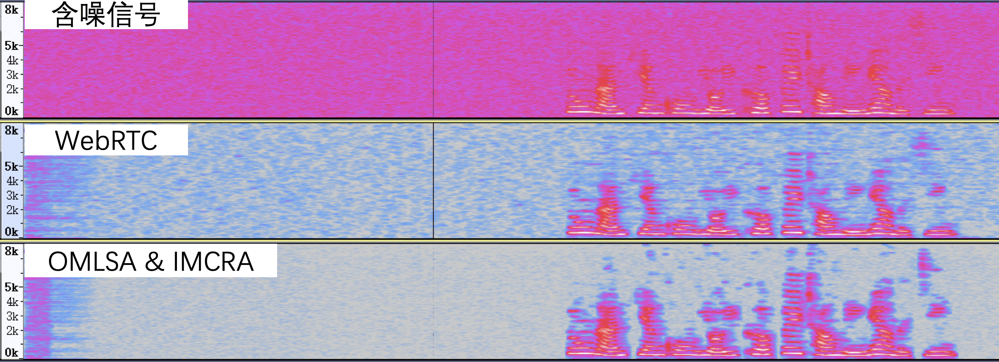

<head>
    
    
</head>

# Table of Contents

1.  [Algorithm](#orgddf98e5)
2.  [Review](#org40fb6c7)
    1.  [声音是如何保存成数字信号的？](#org2a1047a)
        1.  [音频信号的关键指标](#org2d4d6f6)
        2.  [WAV 文件的封装](#org4ec81ca)
    2.  [如何量化分析语音信号](#org2a5f930)
        1.  [语音的基本特征](#org204c90c)
        2.  [语音信号分析](#org1f1d555)
    3.  [如何分析与处理音乐信号](#org2df600f)
        1.  [常见的乐器种类和发音原理](#orgd48ed91)
        2.  [速度与节拍](#orgdb1f783)
        3.  [音调](#orga0de290)
        4.  [调式](#org7d30d1e)
        5.  [音乐场景问题案例分析](#org0578691)
    4.  [如何评价音频质量的好坏](#orgc2fce42)
        1.  [音频主观评价方法](#org37f42c7)
        2.  [音频客观评价方法](#orgbabb8eb)
    5.  [音频降噪如何对症下药](#orgd16dabc)
        1.  [噪声的分类](#org5040d37)
        2.  [如何降噪](#org506092f)
        3.  [降噪算法第一招：线性滤波器](#org4904e99)
        4.  [降噪算法第二招：谱减法](#org1370a3b)
        5.  [降噪算法第三招：基于统计模型的实时降噪算法](#orgde322a7)
        6.  [降噪算法第四招：子空间算法](#orgceeb4c9)
        7.  [降噪算法第五招：基于机器学习的降噪](#orgeec7db6)
3.  [Tips](#org1eec67c)
    1.  [Jupyter Notebook 为什么是现代 Python 的必学技术？](#org30c502d)
        1.  [什么是 Jupyter Notebook?](#org1edd0f8)
        2.  [Jupyter 的优点](#orgb17d155)
    2.  [字典、集合](#org18705f3)
        1.  [字典和集合的工作原理](#orgb5dc999)
        2.  [插入操作](#orge837a9a)
        3.  [查找操作](#org10e8ba6)
        4.  [删除操作](#org34568a7)
    3.  [Python “黑箱”：输入与输出](#orgde69fb3)
        1.  [输入输出基础](#org86c31df)
        2.  [文件输入输出](#org526dec1)
        3.  [JSON 序列化与实战](#org37fe6ef)
4.  [Share](#org65285a5)
    1.  [thread 和 future: 领略异步中的未来](#orged885fe)
        1.  [mutex](#org4941dfe)
        2.  [future](#orge2ec03c)
        3.  [promise](#org15456e9)
        4.  [packaged_task](#orgd825a9c)
    2.  [内存模型和atomic](#orgd82f907)
        1.  [C++ 的内存模型](#org61e1eed)
        2.  [atomic](#org785c08d)
        3.  [mutex](#org3adcca7)
        4.  [并发队列的接口](#org754be82)
    3.  [处理数据类型变化和错误：optional、variant、expected 和 Herbception](#org8348f00)
        1.  [optional](#org3012da6)
        2.  [variant](#org8cf7a76)
        3.  [expected](#org0e9ca0b)
        4.  [Herbception](#org4918c33)
    4.  [数字计算：介绍线性袋鼠和数值计算库](#orgdad83b1)
        1.  [Armadillo](#orga1ecbbd)
        2.  [对象的输出](#orge686d3a)
        3.  [表达式模板](#org49c748d)
        4.  [Boost.Multiprecision](#org92e2207)
    5.  [Boost: 你需要的“瑞士军刀”](#orga640d79)
        1.  [Boost.TypeIndex](#orgbf11478)
        2.  [Boost.Core](#org1840ed8)
    6.  [两个单元测试库：C++ 里如何进行单元测试](#orga4a17dd)
        1.  [Boost.Test](#org7778a02)
        2.  [Catch2](#org1fedbb7)

# Algorithm

Dynamic Inversion <https://onlinejudge.org/index.php?option=com_onlinejudge&Itemid=8&page=show_problem&problem=3141>

<https://dreamume.medium.com/dynamic-inversion-f0110c88244b>

# Review

搞定音频技术    冯建元

## 声音是如何保存成数字信号的？

### 音频信号的关键指标

使用麦克风的音频数字信号采集过程：

-   首先，声波通过空气传播到麦克风的震膜
-   然后，震膜随空气抖动的振幅大小产生相应的电学信号。我们把这种带有声学表征的电学信号叫做模拟信号（Anolog Signal）
-   最后，通过 A/DC（模数转换器）将模拟信号转换成数字信号（Digital Signal）。即通过 PCM（Pulse Code Modulation）脉冲编码调制解调器对连续变化的模拟信号进行抽样、量化和编码转换成离散的数字信号

这样我们就实现了音频信号的采集，我们常说的 PCM 文件就是未经封装的音频原始文件或者叫做音频“裸数据”

对于采样率，如果只是为了听见人声、听懂对方在说什么，那么为了节省传输码率我们可以把采样率降到 8kHz（比如打电话）。而在网络音频会议场景需要平衡音质和传输带宽消耗，我们一般可以使用 16kHz 或者 32kHz的采样率。如果是开线上音乐会或者音乐直播，我们通常会用较高的采样率来保证音质，比如 44.1kHz 或者 48kHz。更极端一点，在音乐制作录音的时候，我们会采用 96kHz 甚至更高的采样率来方便后续的调音和制作

2.1声道中的2指的是左右两个音箱，1指的是中间一个低音音箱。每个音箱都会播放一个单独的音频，这时候就需要同时有 3 路音频信号同时播放，或者叫通道数为 3

我们在实时在线互动的时候，由于编/解码器能力的限制（比如使用了单通道编/解码器），或者采集设备能力的限制（只能采集单声道的信号），音频信号通常为单声道的。这里通道数的物理含义就是其实就是同一时间采集或者播放的音频信号的总数

### WAV 文件的封装

wav 文件以 RIFF 格式为标准。RIFF 是 Resource Interchange File Format 的缩写。因此，每个 WAV 文件的头四个字节是 "RIFF"

wav 文件的封装格式非常简单，由 WAV 文件头部分和 WAV 文件数据体部分组成，其中 0 ～ 43 字节存放采样率、通道数、数据部分的标识符等信息，44 字节之后就是数据部分

<table border="2" cellspacing="0" cellpadding="6" rules="groups" frame="hsides">

<colgroup>
<col  class="org-right" />

<col  class="org-right" />

<col  class="org-left" />

<col  class="org-left" />
</colgroup>
<thead>
<tr>
<th scope="col" class="org-right">偏移地址</th>
<th scope="col" class="org-right">字节数</th>
<th scope="col" class="org-left">数据类型</th>
<th scope="col" class="org-left">内容</th>
</tr>
</thead>

<tbody>
<tr>
<td class="org-right">0x00</td>
<td class="org-right">4</td>
<td class="org-left">char</td>
<td class="org-left">RIFF</td>
</tr>

<tr>
<td class="org-right">0x04</td>
<td class="org-right">4</td>
<td class="org-left">long int</td>
<td class="org-left">文件长度</td>
</tr>

<tr>
<td class="org-right">0x08</td>
<td class="org-right">4</td>
<td class="org-left">char</td>
<td class="org-left">WAVE</td>
</tr>

<tr>
<td class="org-right">0x0C</td>
<td class="org-right">4</td>
<td class="org-left">char</td>
<td class="org-left">"fmt "</td>
</tr>

<tr>
<td class="org-right">0x10</td>
<td class="org-right">4</td>
<td class="org-left">&#xa0;</td>
<td class="org-left">过度字节（不定）</td>
</tr>

<tr>
<td class="org-right">0x14</td>
<td class="org-right">2</td>
<td class="org-left">int</td>
<td class="org-left">格式类别（0x10是 PCM 形式的声音格式）</td>
</tr>

<tr>
<td class="org-right">0x16</td>
<td class="org-right">2</td>
<td class="org-left">int</td>
<td class="org-left">通道数</td>
</tr>

<tr>
<td class="org-right">0x18</td>
<td class="org-right">4</td>
<td class="org-left">long int</td>
<td class="org-left">采样率</td>
</tr>

<tr>
<td class="org-right">0x1C</td>
<td class="org-right">4</td>
<td class="org-left">long int</td>
<td class="org-left">波形音频数据传输速率</td>
</tr>

<tr>
<td class="org-right">0x20</td>
<td class="org-right">2</td>
<td class="org-left">int</td>
<td class="org-left">采样帧大小</td>
</tr>

<tr>
<td class="org-right">0x22</td>
<td class="org-right">2</td>
<td class="org-left">int</td>
<td class="org-left">每样本的数据位数</td>
</tr>

<tr>
<td class="org-right">0x24</td>
<td class="org-right">4</td>
<td class="org-left">int</td>
<td class="org-left">"data"</td>
</tr>

<tr>
<td class="org-right">0x28</td>
<td class="org-right">4</td>
<td class="org-left">long int</td>
<td class="org-left">数据大小</td>
</tr>
</tbody>
</table>

其中，波形音频数据传输速率为通道数 x 每秒数据位数 x 样本的数据位数/8，播放器根据此值估算缓冲区大小

采样帧大小为通道数 x 位数/8。播放软件需要一次处理多个该值大小的字节数据，用该数值调整缓冲区

## 如何量化分析语音信号

### 语音的基本特征

语音安卓发音原理可以分为清音和浊音，语音的音调、能量分布等信息可以用基频、谐波、共振峰等特征来分析

1.  浊音和清音

    
    
    声道就是声音声音传播所通过的地方。发音的声道主要是指我们的三个腔体，即咽腔、口腔和鼻腔。而语音是由声源和声道共同作用产生的。按照声源的不同我们把语音分成以下两类：
    
    -   第一类是声带振动作为声源的声音，我们把它们叫做浊音。比如拼音中的“a，o，e“等
    -   第二类是由气体在经过唇齿等狭小区域由于空气和腔体摩擦而产生的声音，我们把它们叫做清音。比如拼音中的”shi、chi、xi“等
    
    
    
    上图是语音的频谱图，图上显示的是“实时音视频互动”这几个字的音频信号的时域图和频域图（频谱图）。时域就是信号幅度和时间的关系，而频域指的是能量与时间和频率的关系
    
    频域更方便我们观察不同频率的能量分布。我们可以看到浊音，比如最后两个字“互动”是明显的有规律的能量分布，即低频能量大于高频且有明显的能量比较集中的地方，如频谱图中的亮线。而“实时”和“视”这几个字，都有“sh“这个由牙齿间高速气流产生的清音。清音在频谱上显示为比较均匀的分布。在 13kHz 的高频，清音也由不少的能量
    
    根据这个简单的分布规律我们已经可以从频谱上分辨清浊音了

2.  基频

    在发浊音的时候，声带会振动从而产生一个声波，我们把这个声波叫做基波，并且把基波的频率叫做基频（一般用 F0 来表示）。这个基频其实就可以对应到我们平时所说的音调。比如，你唱歌音调比较高，其实就是你的声音基频比较高
    
    一般来说，男生的正常说话基频在 100 ～ 200Hz 之间，而女生的则会高一些，在 140 ～ 240Hz 之间。这就是为什么女生的声音听起来比男生的尖锐一些。基频会随年龄变化而变化，比如小孩的基频比较高，可以达到 300 Hz，而年龄越大则基频会越来越低。基频的能量对应的是浊音频谱中频率最低的亮线

3.  谐波

    声带振动产生的基波，在传输过程中会在声道表面反复碰撞反射，从而产生许多频率倍数于基频的声波，我们通常把这些声波叫做谐波。按照谐波频率从低到高，我们依次叫 1 次谐波，2 次谐波等等。下图中我们可以看一下基频信号和谐波信号在时域上的样子
    
    
    
    谐波频率和基频是浊音能量集中的地方，这也就是为什么我们能看见浊音的频谱是一个栅格的形状

4.  共振峰

    一个 200Hz 基频的浊音，大部分的能量都分布在 200Hz 以及 200Hz 的整数倍的频率上。那么是什么决定了哪个谐波的能量高、哪个谐波的能量低呢？
    
    由于高次谐波是由低次谐波在腔体表面碰撞反射得到的，并且碰撞反射会导致能量的衰减，但我们在看频谱图的时候发现谐波信号并不是从低到高依次衰减的。这是为什么呢？
    
    这是因为在这个浊音的产生过程中，声源的振动信号通过声道时，声道本身也会发生共鸣，与声道共振频率相近的能量会被增强，远离声道共振频率的部分则会被衰减，从而谐波的能量就组成了一组高低起伏的形状包络，我们把这些包络中的巅峰位置叫做共振峰
    
    
    
    比如上图英文单词 father 中的“a“这个音我们可以看到明显的三个共振峰，频率分别为 750Hz、1100Hz、2600Hz
    
    频率从低到高我们分别用 F1、F2、F3 等来表示第一共振峰、第二共振峰、第三共振峰
    
    上图我们可以看到，发不同的音，比如“a、i、u“等，共振峰的位置和峰值都是不一样的。这是因为我们之前说的声道的三个腔体随发音的不同，开合、形状都会发生变化。从而形成了不同的腔体共振频率。所以，共振峰的位置和幅度就和发音可以一一对应起来了。这其实也是语音识别背后的原理之一，即通过共振峰的位置和能量分布来识别音频代表的语音

### 语音信号分析

1.  窗函数

    我们分析音频时域或频域特征随时间的变化时，需要按照时间把音频截断成一个个小片段，每个小片段也就是我们说的音频帧。比如 10ms 的切片为 1 帧
    
    但如果直接截断信号则会导致频谱泄漏，即出现不该有的频谱分量。比如，你对一个 50Hz 的单频信号直接截断，可能会出现 60Hz、200Hz 的能量分量。因此，我们一般采用加窗，即在原有信号中乘一个两端为 0 的窗信号，来减少截断信号时的频谱泄漏。常用的窗函数有 Haning（汉宁窗）、Hamming（汉明窗）、Blackman（布莱克曼窗）等。在时域上加窗（Haning）的过程如下图所示：
    
    
    
    可以看到上图中加窗的过程其实就是输入信号乘以窗信号，得到了一个两边小、中间高的新信号

2.  短时能量

    由于语音的能量随时间的变化较快，比如能量小的时候可能就是没有在说话，而能量大的地方可能是语音中重读的地方。因此，短时能量常被用来判断语音的起止位置或者韵律。短时能量分析的定义如下公式所示：
    
    $ E_ {n} = \\sum^{\\infty}_ {m=- \\infty} [x(m) w(n - m)]^{2} $
    
    其中，x 代表采样点，w 代表窗函数。第 n 个点的短时能量 $ E_ {n} $就是由加窗后的采样信号的平方和来表示的。由于不涉及频谱分析，因此这里的窗可以使用简单的矩形窗
    
    短时能量主要有以下 3 个方面的应用：
    
    1.  可以用来区分请浊音。一般来说，清音部分的能量比浊音部分的能量要小很多
    2.  可以用来区分有声段和无声段。比如，可以设置一个能量阙值作为判断改语音段是否为静音段的条件
    3.  能量的起伏在语音识别里也被用于判断韵律（比如重读音节）的特征

3.  短时平均过零率

    短时平均过零率，顾名思义，就是每帧内信号通过零值的次数。连续的音频信号是围绕 0 值上下波动的，并且表现为音频信号正负号随时间不断切换。短时平均过零率可以通过以下公式来计算
    
    $ Z_ {n} = 1 / 2 \\sum^{n + N - 1}_ {m = n} \| sgn[x(m)] - sgn[x(m-1)] \| $
    
    $ sgn[x(n)] = \\left\\{ \\begin{array}{cc} 1, & x(n) >= 0 \\\\ -1, & x(n) < 0 \\end{array} \\right. $
    
    其中，N 位一帧中包含的信号点数，sgn 为符号函数，x 为音频采样点
    
    如果是正弦信号，例如之前图中的基频和谐波信号，它们的短时平均过零率，就是信号的频率除以两倍的采样频率
    
    短时平均过零率在一定程度上可以表示语音信号的频率信息。由于清音的频率集中的范围要高于浊音，所以浊音的过零率要低于清音，从而我们可以初步用短时平均过零率来判断清浊音
    
    除了判断清浊音。还可以将短时能量和短时平均过零率结合起来判断语音起止点的位置。在背景噪声较小的情况下，短时能量比较准确；但当背景噪声比较大时，短时平均过零率有较好的效果。因此，一般的音频识别系统就是通过这两个参数相结合，来判断待检测语音是否真的开始

4.  短时傅里叶变换

    短时傅里叶变换（Short-time Fourier Transform）是音频频域分析最常用的方法之一，简称 STFT
    
    我们在分析音频信号时经常会使用到频谱图，那你知道这个频谱图是怎么得到的吗？
    
    结合短时傅里叶变换的步骤（如下图），也许你就明白了：
    
    -   首先，对时域信号加滑动窗，在把音频切成若干个短帧的同时，防止频谱泄漏（窗可以使用汉宁窗）
    -   然后，对每一帧做快速傅里叶变换（Fast Fourier Transform，简称 FFT），把时域信号转换成复数频域信号
    
    
    
    上图中的 Hop Length 代表滑动窗移动一次的距离，并且 Overlap Length 就是两个相邻滑动窗重叠的范围
    
    清楚了这些，我们就可以回答刚才的问题了。其实呢，我们是把短时傅里叶变换的结果对复数频域信号求模，并取对数转换成分贝（dB），然后用热力图的形式展示出来，这样就能得到之前图中的频谱图。频谱图的横坐标为时间，纵坐标为频率，并且热力图中的颜色代表每个频点在当前时刻的能量大小。这样我们就可以通过频谱图来观察每个时刻的语音能量分布了

5.  梅尔谱（Mel spectrum）

    上面我们通过短时傅里叶变换得到的频谱图通常也叫做声谱、线性谱或者语谱
    
    由于心理和听力系统的构造，其实人耳对以 Hz 为单位的频率并不是很敏感。比如，人类很难区分 500Hz 和 510Hz 的声音。我们平时能区分的音调都是以指数排列的。比如，我们说的高八度其实就是把原有频率乘以 2。因此，用对数的频率坐标来表示可以更好地反映人的实际听感
    
    除此之外，人耳对不同频率声音大小的感知也是不同的。如下图所示，红线代表人耳感知到的响度和实际声压的对应关系，人耳感知的响度我们一般用 phon（方）来表示
    
    
    
    由上图可以看到，人类在 4kHz 的频率对声音的响度比较敏感，而在两端的高频和低频则需要更强的声压，人类才能感知。这其实和人类的进化有关，4kHz 多为猛兽的叫声能量分布范围，所以人耳对这类危险的频率较为警觉
    
    因此，为了结合人耳对频率的感知。需要使用对数的频率坐标，且通过分配滤波器对频谱图的能量按照听感重新分配，于是就有了梅尔谱等表示形式
    
    Mel 谱的计算步骤分为下面几步：
    
    -   首先，对语音信号进行预加重（平衡高低频能量）
    -   然后，语音信号通过 STFT 得到频率谱
    -   最后，通过三角滤波器组对频率谱逐帧进行滤波
    
    三角滤波器组如下图所示。我们可以看到三角滤波器组把频率划分成了若干个频段。敏感的频段滤波器分布比较密集，而不敏感的频段比较稀疏，这样就能更好地表征人耳的实际听感
    
    
    
    梅尔谱以及对梅尔谱再进一步求倒谱系数得到的 MFCC（梅尔倒谱系数），经常被用于语音识别、声音事件识别等领域。其实类似的基于人耳实际听感的表示还有 Bark 谱、Gamma Tone Filter 等

## 如何分析与处理音乐信号

### 常见的乐器种类和发音原理

日常中常见的乐器主要由三种：打击乐器、弦乐器和管乐器

打击乐器，比如我们常说的“敲锣打鼓”。这类乐器的发音主要是依靠打击振动。比如，鼓在鼓皮绷紧的状态下，受外力振动。振动的速度越快、力量越大、振幅越大，发出的声音就会越响亮

鼓的音调，取决于鼓的尺寸、鼓皮的材质等。一个鼓经过调音，比如调节鼓皮的松紧程度后音调就固定了，所以如果需要同时演奏不同的音调就需要一组鼓，比如架子鼓

第二种弦乐器，包括钢琴、二胡、小提琴等乐器。这类乐器发音来源于弦的振动。不同形状的弦发出的声音特点也有所不同：若弦短而细，且绷紧，则乐器发出的音调高；若弦长而粗，且不紧，则乐器发出的音调低

乐器的声音大小取决于弦的振幅大小。为了促使乐器能够发出洪亮的声音，一般会采用木制的共鸣箱以达到增强音量的效果。这一过程和人声浊音的发音十分相似，所以弦乐器也会有基频和谐波，弦乐器的谐波也叫做泛音。大提琴的声音，由于发音的基频和泛音的频率范围和人声相似，所以大提琴也被称为最像人声的乐器

第三种管乐器，包括笛子、号、萨克斯等乐器。这类乐器发音来源于空气柱振动。当吹奏管乐器时，抬起不同的手指会形成不同长度的空气柱，若空气柱越长，则音调越低。若空气柱短，则音调越高。比如竖笛，越短的笛子发出的声音音调越高

### 速度与节拍

一首曲子的节奏是由速度和节拍决定的。速度我们一般以 BPM（beats per minutes）来表示。我们在演奏或者歌唱练习时，用的节拍器就是按照 BPM 来打节奏的。比如 80BPM，节拍器就会每分钟发出 80 次“嘀嗒”声，如果是用鼓来打节奏，就每分钟打出 80 个间隔均匀的鼓点

而节拍用来描述音乐中的进程的规律。在音乐中，指有一定强弱分别的一系列拍子，在每隔一定时间重复出现。若干个这样有规律的拍子我们叫一个小节，比如常见的四拍一个小节。一首乐曲的节拍是作曲时就固定的，不会改变。一首乐曲可以是由若干种节拍相结合组成的。常见的节拍有四四拍 4/4、四二拍 2/4、四一拍 1/4、四三拍 3/4、八六拍 6/8 等

大部分流行歌曲比如老鹰乐队的《Hotel California》、周杰伦的《东风破》都是 4/4 拍，而 3/4 拍的歌曲因为给人一种跳跃的感觉，所以多被用于舞曲，比如约翰 施特劳斯的《蓝色多瑙河》。在流行乐种也有一些慢舞曲，比如朴树的《白桦林》，也为四三拍

所以，我们可以看到乐器的演奏其实就是按照节拍规定的音符演奏顺序，然后按照指定的速度演奏出来

那乐曲中的音调和调式是如何从频率等数学的角度来分析呢？

### 音调

基频和音调的英文都是 pitch，音乐信号中音调其实也是和乐器或者人声中的基频的频率 - 对应的。比如，我们给乐器调音中常说的中央 C 就是基频频率约为 261.6Hz，唱名为 do，并且它位于乐音体系的最中央的位置，因而得名。中央 C 在国际标准中为 C4，在德国标准中为 c1，为了避免混淆，我们这里统一用国际标准来做解读

那么我们平时说的 C 大调、D 大调和我们小时候音乐课的 do\re\mi\fa\so\la\ti 以及基频频率的关系是什么呢？

do\re\mi\fa\so\la\ti 是唱名，我们平时唱谱就是用这些音来把谱子唱出来的。他们和音名，也就是在音乐中包含的七个基本音调 CDEFGAB - 一一对应。我们以钢琴中的中央音为例，唱名、音名和基频频率之间的对应如下表所示：

<table border="2" cellspacing="0" cellpadding="6" rules="groups" frame="hsides">

<colgroup>
<col  class="org-left" />

<col  class="org-left" />

<col  class="org-left" />

<col  class="org-left" />

<col  class="org-left" />

<col  class="org-left" />

<col  class="org-left" />

<col  class="org-left" />

<col  class="org-left" />
</colgroup>
<thead>
<tr>
<th scope="col" class="org-left">唱名</th>
<th scope="col" class="org-left">do</th>
<th scope="col" class="org-left">re</th>
<th scope="col" class="org-left">mi</th>
<th scope="col" class="org-left">fa</th>
<th scope="col" class="org-left">so</th>
<th scope="col" class="org-left">la</th>
<th scope="col" class="org-left">ti</th>
<th scope="col" class="org-left">do</th>
</tr>
</thead>

<tbody>
<tr>
<td class="org-left">音名</td>
<td class="org-left">C4</td>
<td class="org-left">D4</td>
<td class="org-left">E4</td>
<td class="org-left">F4</td>
<td class="org-left">G4</td>
<td class="org-left">A4</td>
<td class="org-left">B4</td>
<td class="org-left">C5</td>
</tr>

<tr>
<td class="org-left">基频频率(Hz)</td>
<td class="org-left">261.6</td>
<td class="org-left">293.7</td>
<td class="org-left">329.6</td>
<td class="org-left">349.2</td>
<td class="org-left">392.0</td>
<td class="org-left">440.0</td>
<td class="org-left">493.9</td>
<td class="org-left">523.2</td>
</tr>
</tbody>
</table>

我们可以看到 C5 的基频频率正好是 C4 的两倍，这个其实就是我们说的度的概念，即 C5 比 C4 高八度，且一个八度其实就是基频频率相差一倍。高一个八度我们就把国际标准音名里后面的数字加 1.所以，比如 A 的音调从低到高课写为 A0、A1、A2 一直到 A9

### 调式

音乐中 C 大调的意思就是基础音调为 C，调式为大调。那么什么是大调、小调呢？

我们刚才说的两个八度音之间基频频率是 $ 2^{1} $的关系，而一个八度有 12 个半音的音程，这 12 个半音是按照比值为 $ 2^{\\frac{1}{12}} $ 的等比数列排布的。音程的单位是半音或者全音，2 个半音我们就叫 1 个全音，由此推理可得，高一个全音就需要把基频频率乘以 $ 2^{\\frac{2}{12}} $

我们常说的大、小调又叫自然大、小调，都属于 7 律调式。7 律调式说的就是这 12 个半音里我们只使用其中的 7 个。大调中，每两个音之间的音程大小，依序为全 - 全 - 半 - 全 - 全 - 全 - 半，这就是大调的组成规则，而小调中每两个音之间的音程大小，依序为全 - 半 - 全 - 全 - 半 - 全 - 全

有了调式我们还需要再指定一个基础音调，比如 C，代表这个音程规律是从哪里开始计数的，这样就可以把调式中所有的音都固定下来了。这个基础音调也叫起始音调，也就是音程间隔开始计算的那个音调，这个音调可以在一个八度里的任意一个半音位置作为开始，也就是说可以有 12 种不同的大调和小调

上表就是 C 大调中的一个八度，基础音调是 C，那么按照大调的“心法口诀”：“全全半，全全全半”那么 C4（do）和 D4（re）之间相差一个全音，频率差其实就是

$ 261.6 * 2^{\\frac{2}{12}} - 261.6 = 32.1 $

而 E4（mi）和 F4（fa）之间相差一个半音，频率差是

$ 329.6 * 2^{\\frac{1}{12}} - 329.6 = 19.6 $

现在的流行歌主要以自然大调和自然小调为主。但调式除了自然大调和自然小调外还有很多。比如，中国传统的“宫、商、角、徵、羽“就是一个 5 律调式，分别对应自然大调中的do、re、mi、so、la 等等，这里就不一一赘述了

### 音乐场景问题案例分析

1.  案例1:客户投诉音乐教学直播时低音鼓一直听不到声音

    低音鼓是打击乐器，一个鼓只有一个音调，这个时候我们就可以询问客户，他们的低音鼓是哪个音调的？假设客户说是 A1 音调的低音鼓。那么我们进一步分析出 A1 比 A4 低 3 个八度。也就是说，A1 的基础频率是 A4 的基础频率除以 8，也就是 55Hz。然后，我们可以先从采集设备能力问一下客户，他们用的是什么设备，这里我们假设客户回答是用的 iPad，但实际上苹果公司的 iPad 和 iPhone 的最低支持的录音频率是 100Hz，也就是说，设备不支持 55Hz 低频声音的采集
    
    在这个案例中，我们通过更换一个更专业一些的录音设备，比如外接一个可以采集低频的麦克风来解决问题，而且里面低音鼓的音调理解起到了关键作用。通过这个问题，我们可以举一反三，解决一系列乐器基频与采集设备、编解码器和播放设备能力不匹配导致的问题。例如，乐器是有高频泛音的乐器，比如小提琴，而音频的编/解码器只能支持 16kHz 的采样率，这样高频就缺失了，在远端就会感知到部分高音的缺失，这时就需要更换一个支持采样率更高的音频编/解码器来解决问题

2.  案例2:伴奏升调或降调

    有一款 K 歌的 App，有客户询问有没有办法调节一下伴奏，让唱不上高音的人能唱上去，或者让女生唱男生的歌。这类需求在我们线下 KTV 唱歌的时候也可能会遇到。歌曲在创作的时候伴奏和歌唱的调式都是固定的，有的歌曲高音部分普通人可能唱不到那么高，或者男生的歌的低音部分女生可能唱不了那么低。无论人声唱高了或者低了，伴奏的音调没变，就会出现人声和伴奏的音调不匹配的问题。听起来就会是不和谐的，或者说很容易被听出来“唱走调”
    
    这个时候我们就可以利用调式的概念。无论大、小调都有一个固定的音程距离，但起始音阶是可以不同的。那么如果我们把伴奏都下调一些。比如都乘以 $ 2^{\\frac{-1}{12}} $降一个半音，这样不改变音程距离，但实现了降调，并且这样伴奏还是相同的调式，但本来唱不上去的歌就可以也低一个半音，从而就可以和伴奏匹配了。同理，女生唱男生的歌，就可以把伴奏的频率整体提高一些。比如升一个半音，这样女生就可以用比较高的音调唱男生的歌了
    
    这里还有一个问题要注意，歌曲是有指定的速度和节拍的，如果一个人唱的快了或者慢了，甚至唱多了或漏了几个音，听上去也会感觉是“走调了”，这时改变伴奏的音调并不能解决这种速度或者缺漏音导致的不和谐情况
    
    我们刚才提到的变调算法有很多，比如 WSOLA，Phase Vocoder 等，是音频音效中常见的算法，在后续的课程中会展开

## 如何评价音频质量的好坏

音频的评价方法主要有两种。一种是主观评价，即组织足够数量的人来听被测音频样本，并给每个被测样本打分，最后根据测试人打分的高低来评判音频质量的好坏。主观测试是音频评价的黄金准则，这样的评价是最符合人的实际听感的。但是主观评测费时费力，在算法迭代、研发等中间过程中不一定是最经济的方案

另一种测试方法是客观测试，即通过数学方式计算出一些音频质量评价所需要的指标，比如信噪比（SNR）、频谱差异等。然后综合这些指标去拟合一个主观分数。这样就可以通过数学计算而不是人来给出一个音频质量的评价

### 音频主观评价方法

ITU（国际电信联盟）是联合国下属的一个专门机构，负责电信、通话等相关标准的制定。其中的无线电通信组（ITU-R）和远程通信标准化组织（ITU-T）为了统一国际的音频质量评价方法制定了一系列的主、客观评价方法。按照 ITU 的评价方法，你的音频算法或者系统的评价结果才会比较有公信力。好了，下面就让我们以 ITU 主观评价中的 MUSHRA 为例来介绍一下如何做音频主观评价

1.  MUSHRA

    MUSHRA（Multi-Stimulus Test with Hidden Reference and Anchor，多激励隐藏参考基准测试方法）属于 ITU-R BS.1534 中的推荐测试方法。它最早被用于流媒体与通信的相关编码的主观评价，现在也被广泛应用于心理声学相关研究中的音质主观评价。其测试的特点主要是在测试语料中混人无损音源作为参考（上限），全损音源作为锚点（下限），通过双盲听测试，对待测音源和隐藏参考音源与锚点进行主观评分
    
    所谓“双盲”就是测试人和提供测试的人都不知道自己要听的是哪段语料，这个在测试环节中很重要。比如，如果你提前告诉测试人“你的算法会让声音中的风声不那么刺耳”之类的暗示，或者在测试的时候双号为无损语料，单号为测试语料，这样的操作都会让测试结果不具有参考性
    
    MUSHRA 的分数是 0 到 100 分，按照从高到低的听感描述，如表 1 所示：
    
    <table border="2" cellspacing="0" cellpadding="6" rules="groups" frame="hsides">
    
    
    <colgroup>
    <col  class="org-left" />
    
    <col  class="org-left" />
    
    <col  class="org-left" />
    
    <col  class="org-left" />
    
    <col  class="org-left" />
    
    <col  class="org-left" />
    </colgroup>
    <thead>
    <tr>
    <th scope="col" class="org-left">分数</th>
    <th scope="col" class="org-left">80 ~ 100 分</th>
    <th scope="col" class="org-left">60 ~ 80 分</th>
    <th scope="col" class="org-left">40 ~ 60 分</th>
    <th scope="col" class="org-left">20 ~ 40 分</th>
    <th scope="col" class="org-left">0 ~ 20 分</th>
    </tr>
    </thead>
    
    <tbody>
    <tr>
    <td class="org-left">描述</td>
    <td class="org-left">非常好</td>
    <td class="org-left">好</td>
    <td class="org-left">一般</td>
    <td class="org-left">差</td>
    <td class="org-left">非常差</td>
    </tr>
    </tbody>
    </table>
    
    测试规范中有很多测试细节，这里为了保证测试的有效性，注意需要注意以下 4 点：
    
    1.  参考的标准音频和被测试音频间隔测试，连续重复 4 次
    2.  音频源采用 15 ～ 20s
    3.  一次完整的测试时间不应超过 15 ~ 20 min
    4.  测试成员：专家成员最少 10 人，非专家 20 人
    
    这里我解释一下为什么要注意这些细节：
    
    -   首先，测试语料需要重复 4 次主要是为了，防止只出现一次可能会导致误判。比如，听音者一开始没有集中精神打出了偏低的分数
    -   其次，音频源的时间控制是为了防止听音者产生听音疲劳，从而导致判断失误
    -   然后，由于集中精神听声音的细节就和瑜伽的正念训练一样，是一件耗费心神的事情，所以不宜时间太长。因此，一般测试时间都控制在 15 ~ 20 min
    -   最后，测试人员中要有音频专家，他们知道该听什么，以及该怎么听，这个可以保证测试的可重复性。但也不能都是专家，大部分应该是普通人。这是因为普通人的意见更有普适性。他们对一些明显的缺陷比如“颤音”、“漏音”比较敏感，而对一些声音的细微差异可能会给出相近的分数，然而这样更符合大众的听音习惯。如果都是专家则分数过于严苛反而偏离了人群总体的听感
    
    这里举一个用 MUSHRA 给不同语音合成算法打分的例子，具体如下图所示。途中的 REF 就是无损的音源，Archor35 就是我们说的锚点（预估只有 35 分）。这里还把无损音频的采样位深调为 8bit，标记为 8bit $ \\mu $-law REF。而其他则是代表不同的语音合成算法
    
    
    
    我们可以看到 WNET 的分数最高很接近无损音源，这代表这种算法的语音生产质量最好。锚点一般是质量很差的音频，在上图中甚至有些算法的分数比锚点还低，这代表他们的生成效果极差。这些极差的算法甚至还抬高了锚点的分数，我们可以看到 Anchor35 最后的 MUSHRA 评分在 50~60 分之间
    
    为了方便人们测试使用，GitHub 上有基于 Web 版的 [MUSHRA](https://github.com/audiolabs/webMUSHRA) 自动打分工具，你可以自行下载使用

2.  常用的主观评价标准

    MUSHRA 方法的测试面比较广，可以用于编/解码器，语音合成，甚至是耳机测评。除了 MUSHRA，在 ITU 中还有其他一些针对不同场景的音频测评标准，比如 ITU-T 评价标准中的 ITU-T P.800《语音质量的主观评价方法》，也就是我们常说的 MOS（Mean Option Scores，评价意见分），以及 ITU-T P.380《电话和宽带数字语音编码器的主观评价方法》、ITU-T P.805《对话质量的主观评价》等。ITU-R 主观评价标准中的 ITU-R BS.1116《音频系统中小损伤主观评价方法》、ITU-R BS.1285《音频系统中小损伤主观评价的预选方法》等。如果你有兴趣可以上 [ITU 官网](https://www.itu.int/zh/Pages/default.aspx) 自行查看

### 音频客观评价方法

主观评价的缺点是：人少了，执行不规范都会带来测试偏差

客观评价主要包括有参考评价和无参考评价。所谓有参考评价就是除了测试音频以外，还需要同时给出一个参考音频做为基准，通过计算测试音频和参考音频的区别来拟合出音频的主观得分。而无参考的客观评价则不需要参考音频，直接根据音频的频谱能量分布、连续性等指标来评分

1.  有参考音频质量评价

    我们先来看一下有参考的客观评价方法。在 2001 年，ITU-T P.862 标准定义了有参考客观评价算法 PESQ（Perceptual Evaluation of Speech Quality，语音质量感知评价），该算法主要用来评估窄带（8kHz 采样率）及宽带（16kHz 采样率）下的编解码损伤。该算法在过去的二十年中，被广泛的应用于通信质量的评定
    
    随着技术的发展，PESQ 的应用范围变得越来越窄，于是在 2011 年，P.863 标准定义了一套更全面、更准确的有参考客观评价算法 POLQA。相比 PESQ，POLQA 可评估的带宽更广，对噪声信号和延时的鲁棒性更好，其语音质量评分也更接近于主观的评分
    
    PESQ 算法已经开源，而 POLQA 你需要购买一套专门的设备和授权才能使用。所以目前做一些日常的测试中国呢，PESQ 还是用的比较多的方法。这里我们主要介绍一下 PESQ 算法的基本原理。PESQ 算法的处理步骤如下图所示：
    
    
    
    图中待测系统就是你的音频系统或者算法，比如一个编/解码器。为了消除系统延迟的影响，首先，将参考信号和系统处理后的信号经过相同的预处理后进行时间对齐；然后，进行听觉变换把音频信号转化为频谱信号；接着，再对能量谱逐帧进行差异处理；最后，取时间平均得到 PESQ 分数。如果发现有的音频片段差异特别巨大，则表明存在对齐错误，需要对没对齐的片段进行再对齐
    
    PESQ 的分数范围在 0 ~ 4.5 分，一般音质比较好的编/解码器，比如 64kbps 比特率的 OPUS 编解码器，可以达到 4.5 分，而分数越低则代表音质越差。比如 OPUS 的码率降到 6kbps 那 PESQ 可能就只有不到 3 的分数
    
    值得注意的是，PESQ 最多只能评测 16kHz 采样率的音频。如果要评价一个采样率比较高的音频信号，比如音乐信号，POLQA 会比较合适。POLQA 最高可以支持 48kHz 采样率的全带音频的客观质量评价。购买一套 POLQA 设备的价格都是百万级的，为了方便使用，你还可以考虑一下使用例如 [ViSQOL](https://arxiv.org/pdf/2004.09584.pdf) 等开源算法，也可以支持 48kHz 的音频采样率

2.  无参考音频质量评价

    有的时候我们可能无法获得参考音频，比如在打网络电话时，只有接收到的经过编/解码和网络传输的音频信号，没有远端的输入信号。这时候无参考音频质量评价方法就派上用场了。不需要参考信号，仅通过对输入信号本身或参数的分析即可得到一个质量评分。比较著名的无参考客观评价方法有 ITU-T P.563、ANIQUE+、E-model、ITU-T P.1201 等
    
    其中，ITU-T P.563 于 2004 年提出，主要是面向窄带语音的质量评估：ANIQUE+ 于 2006 年提出，也是面向窄带语音，其评分准确度据作者称超过了 PESQ，不过 PESQ 的测量不能反应网络的延时、丢包等，并不能完美适用于如今基于互联网传输的实时互动场景。E-model 于 2003 年提出，不同于上述两种方法，这是一个基于 VoIP 链路参数的损伤定量标准，不会直接基于信号域进行分析。ITU-T P.1201 系列于 2012 年提出，对于音频部分，该标准也不对音频信号直接进行分析，而是基于网络状态和信号状态对通信质量进行评分
    
    其实在实际使用中由于实时音频处理过程复杂，除了编解码器和网络对音频可能造成损伤，音频的处理步骤比如降噪、回声消除等步骤，也可能对音频的质量造成影响。现有的无参考音频质量评价还不能准确地反映音频的实际质量情况，比如隐私问题无法获得音频信号或者音频链路的信息指标无法准确获得。所以无参考音频质量评价还有很多有待研究的地方

## 音频降噪如何对症下药

噪声是一个相对的概念，如果你想听的目标只有人们说话的声音，那么所以其他的声音包括音乐、风声等就是噪声。在这里我们主要聊的是当保留目标是人声时，噪声会有哪些分类，它们有什么特点，以及我们如何更好地保留人声去除噪声。这也是音视频工程师的主要工作场景

### 噪声的分类

从通信系统的角度来说，噪声可以分为加性噪声和乘性噪声

加性噪声于信号之间满足加性条件，即加噪信号是由噪声和源信号相加得到的，这种情况下信号和噪声是不相关的，我们常见的自然噪声、人造的噪声如电子元器件发出的热噪声等都是这种

乘性噪声则是，噪声和信号是相关联的，比如信号的衰减、房间的混响、多普勒效应等。这类噪声往往是以信号乘积的形式出现，而且往往是从信道传输中产生，所以也叫信道噪声。我们这里主要讲的是人声与其它不相关的噪声的处理，所以主要是针对加性噪声来讲

加性噪声的种类如果按照声源，比如风声、汽笛声、键盘敲击声等，种类则成千上万，但从降噪方法的选择角度上来说，我们可以按照噪声是否平稳，把噪声分为两类：稳态噪声和非稳态噪声

-   稳态噪声：比如手机、电脑之类的设备低噪、电脑散热器的风扇声等等。它们一直存在其基本上响度、频率分布等声学特性都不随时间变化或者变换缓慢
-   非稳态噪声：比如开关门的声音、背景的人声、门铃声等等。这些噪声的统计特性随时间而变化。就好像你在一家餐馆里很多人在说话，还时不时掺杂着吃饭的时候碗碟碰撞的一些声音
    
    非稳态噪声按照是否连续又可以再分为连续性非稳态噪声和瞬态噪声，比如持续性的背景人声就是连续的噪声，而一些敲击声只会出现及其短暂的时间则为瞬态噪声

稳态噪声和非稳态噪声的时域图和频域图如下图所示：

很显然，稳态噪声由于在时间维度上没有变化，我们很容易通过对之前出现过的噪声进行建模，然后用相同的模型来对以后出现的噪声来进行抑制。而非稳态噪声尤其是瞬态噪声，则需要更多的依赖来区分其和正常语音之间的差异。如果更像是语音，则将其保留，反之则将其抑制

值得注意的是，这些噪声往往不是单独存在的，可能你的手机低噪是一直存在的，同时你又在人声鼎沸的地铁站，那这时候稳态和瞬态噪声就都会存在

### 如何降噪

清楚了噪声的分类后，接下来让我们看看目前有哪些常见的降噪算法，以及它们在降噪能力上有哪些不同。这里我们重点介绍基于统计模型的实时降噪算法，这是因为在实时音频降噪处理时主要应用的就是这种算法。另外，基于机器学习的降噪是基于 AI 的，因此之后会单独开一讲。至于其它三种算法，这里你有个简单了解就足够了

### 降噪算法第一招：线性滤波器

这在一些音频采集硬件的噪声处理中十分常见，因为硬件厂商知道自己的硬件噪声特性。比如由于电路设计在一些频段会有持续的电流声，这时可以采用一些比如高通滤波器来消除低频噪声、用一些陷波滤波器来消除某些频段的持续噪声

线性滤波器的处理方法算力要求十分低，但必须事先知道噪声会在哪个频段出现。所以在实际使用中一般会先做噪声频段检测，看看噪声出现在哪个或哪些频段，再设计线性滤波器或滤波器组来消除噪声

### 降噪算法第二招：谱减法

谱减法的核心思想是先取一段非人声段音频，记录下噪声的频谱能量，然后从所有的音频频谱中减去这个噪声频谱能量。这种方法对稳态噪声比较有效果。但如果是非问题噪声就会导致有的地方频谱减少了噪声有残留，有的地方频谱减多了人声有损伤。所以谱减法一般用于离线稳态噪声的降噪处理。离线的时候可以人工对音频进行分片处理，在每一个分片中噪声可以控制成稳态的。而在实时音频处理的时候，噪声状态经常是随时间变化的，我们很难让噪声一直保持绝对稳态

### 降噪算法第三招：基于统计模型的实时降噪算法

这类算法是实时音频降噪时最常用的算法类别。算法的思想就是利用统计的方法估算出音频频谱中每个频点所对应的噪声和语音的分量。基于统计的降噪方法其实都是针对相对平稳的噪声进行去除，且为了方便找出噪声和人声的直观统计区别，一般都需要基于两个假设

第一个假设：噪声相对于人声一定是在时域和频域上的声学统计特性都更平稳

第二个假设：所有的噪声都满足加性条件

所以基于这两个假设，我们就可以解释很大我们平时在使用这些降噪算法时所遇到的现象。比如，噪声中的瞬态噪声很难被抑制，比如敲桌子的声音、键盘声之类的。再比如在一些混响比较大的房间，听不出混响，且人声的失真也比较严重。了解了以上特性之后，让我们看看常见的几种基于统计的降噪

这里我主要介绍一下常用的分位数噪声估计和维纳滤波（Quantile Noise Estimation and Winner Filter）以及一些改进方法，比如OMLSA & IMCRA（Optimally Modified Log-Spectral Amplitude Estimator and Improved Minima Controlled Recursive Averaging）。分位数噪声估计和维纳滤波这种方法是 WebRTC 中自带的降噪算法

维纳滤波是根据最小均方误差 MMSE 准则（滤波器的输出信号与需要信号之差的均方值最小）设计的线性滤波器。我们这里用到的是实时频域维纳滤波器，目标就是求出当前帧每个频点的能量有多少占比是语音，即语音的先验信噪比（SNR）。我们把当前帧的含噪信号与噪声的信噪比叫做后验信噪比，而纯净语音信号与噪声的信噪比叫先验信噪比

因为在实时处理时没有纯净的参考信号，所以先验信噪比通常为后验信噪比结合判决引导的方法来估算。那么根据维纳滤波的原理降噪的步骤也就变成了从动态平滑的噪声模型得到噪声信号，然后根据含噪信号和噪声模型经过维纳滤波器进行降噪

WebRTC 中的降噪流程如下图所示

首先，做短时傅里叶变换（STFT），即对带噪信号加窗。接着，做快速傅里叶变换（FFT）再求模得到带噪信号的功率谱。然后，利用功率谱进行分位数噪声估计（Quantile Noise Estimation）、语音 存在概率（Noise Update）以及噪声抑制系数计算（Spectral Gain Computation）。最后，把得到的每个频点的抑制系数乘以带噪信号的频率谱得到降噪后的频率谱。再做逆短时傅里叶变换（ISTFT）即可得到降噪后的时域信号

这里就不一一展开了，内容很多，具体每一步怎么做你可以参考 Google 的 [WIPO](https://patentimages.storage.googleapis.com/a4/d9/d6/f3e557a291b982/WO2012158156A1.pdf) 专利（Noise Suppression Method and Apparatus Using Multiple Feature Modeling for Speech/noise Likelihood），里面和 WebRTC 开源库中的代码基本可以一一对应

我们这里主要讲一下使用分位数噪声估计和维纳滤波的降噪算法逻辑背后的思考

基于统计的降噪最主要的是对噪声进行实时建模，这个建模基于假设一，也就是说只对稳态的噪声进行建模。噪声建模迭代不能太快，比如这里 WebRTC 所用的分位数噪声估计都是在时频域上进行更新，且其更新周期大概为 700ms 左右。从听感上来说，如果噪声发生了变化，比如突然变大了，模型可能需要约 500ms～4s 来收敛到新的噪声模型，在这期间我们可能会听到一些噪声的残余

这里降噪的理念和我们之前讲的谱减法有些类似，就是利用无人声段进行噪声的估计。这样在实时处理中就需要在无人声段进行噪声模型的迭代。即更新噪声模型以适应非稳态噪声的时变性

那么为了区分人声和非人声就需要做一个人声判别也就是我们常说的 VAD（Voice Activity Detection）。这里的 VAD 就是利用几个人工提取的特征来进行统计得出的语音存在概率来判断的。这几个特征包括：频谱平坦度（Spectral Flatness），频谱差异度（Spectral Difference），以及根据先验、后验信噪比的差异得出的似然因子 LR（Likelihood Ratio）Factor。具体如下图所示：

似然因子在频域计算 log 均值得到 indicator 0，而根据频谱平坦度和差异度则可以分别得到 indicator 1 和 2。语音概率值就是根据这几个指标的加权平均（对应图中的 combination）和当前帧的似然因子来更新的。在实际计算中，当这个概率比较大时，也就是语音存在的可能性比较大，噪声模型的更新就很缓慢，反之则更新速度比较快

噪声模型则是通过分位数噪声估计来得到。“Quantile“是英文中 1/4 的意思。这里也就是通过一个经验假设在噪声能量谱中，里面能量最小的 1/4 是稳态噪声。我们应该用这个部分来迭代更新初始噪声模型

利用初始噪声模型以及含噪语音就可以得到频谱平坦度、频谱差异度，以及对数似然比特征，进而得到语音存在概率。有了语音存在概率，就可以更新噪声模型。有了噪声模型和含噪信号，那么根据加性假设，干净的语谱则是含噪信号减去噪声信号或者说含噪频谱乘以频谱增益

了解了算法原理后，我们基本上就可以总结出 WebRTC 原生降噪算法的 3 个特点了：

1.  由于 speech probability 的判断降噪在有人声的地方基本不会进行噪声模型的更新，从而不会对语音造成损伤也就是说基本不会吃字，但是如果噪声是在说话的时候发生了变化，那么噪声无法被有效消除
2.  基于 MMSE 的维纳滤波器有一个弊端，那就是对于浊音谐波间的噪声可能会有残留。这也就是为什么如果观测频谱的时候在谐波之间会有噪声的能量残留，这种噪声残留会随语音出现，听上去像是给语音加了伴奏。我们通常也把这种残留叫做音乐残留
3.  由于在低信噪比的时候，语音存在概率的判断会失效，那么就会产生比较大的语谱损伤。现在你在使用 WebRTC 的时候遇到噪声残留和音乐噪声大致就能判断出原因了。那么没有什么更好一点的方法可以把 WebRTC 的原生降噪改造一下呢？

这里简单介绍一下改进方法 OMLSA&IMCRA 算法

它是由 Israel Cohen 提出的音频降噪算法。OMLSA 是对人声进行估计，通过先验无声概率及先验信噪比 SNR 的估计来得到有声条件概率，从而实现了对人声谱的估计。IMCRA 则是通过信号的最小值跟踪，来计算得到条件有声概率，进而获得噪声谱的估计

将 OMLSA 同 IMCRA 相结合最后相当于是功率谱中最小点的追踪。这样藏在谐波之间的音乐噪声的能量由于明显小于谐波的能量就可以被去除了，这也是为什么这一算法可以有效减少音乐噪声

关于 WebRTC 原生降噪和 OMLSA&IMCRA 降噪的对比如下图所示：

从上图可以看出通过 OMLSA&IMCRA 降噪比 WebRTC 原生降噪得到的语谱更干净，残留噪声更少

### 降噪算法第四招：子空间算法

子空间算法主要是针对一些已知噪声类型，量身定做一个降噪算法。其思想就是把噪声和人声投影到一个高纬度的空间，让本来不容易分离的信号变成在高纬度占据一个可分的子空间，从而可分的信号。这类算法包括非负矩阵分解和字典建模等

什么时候会用到这种算法呢？比如你只是要去除风噪这一种噪声，你可以用非负矩阵分解的方式单独为风噪建模，从而模型会自动消除音频中的风噪。这个在去风噪的场景下效果也是不错的。但这类方法缺点也很明显，每一种噪声都得单独建模，在噪声类型不定的情况下就很难穷尽达到好的效果，这里我们可以看一下基于非负矩阵分解的降噪。如下图所示：

非负矩阵分解消除鼠标声（从上到下依次为：含噪信号、非负矩阵分解降噪之后的信号和原始语音信号

从上图可以看出通过非负矩阵分解来消除鼠标声，降噪之后的那些鼠标点击产生的黑色竖条就被消除了

### 降噪算法第五招：基于机器学习的降噪

这块最近还是比较火热的。它是通过数据训练的方式，训练人工神经网络来进行降噪。特点是噪声鲁棒性好，能兼顾稳态、非稳态甚至是瞬态噪声。比如下图中咖啡馆的噪声属于混合类型的噪声，传统降噪算法对语谱的损伤就很大，很多高频信息都丢失了，而使用 AI 算法在保留语谱的同时又起到了比较好的降噪效果

其实如果宏观地从整条音频链路的角度上来说，我们在实时音频中大部分采集的音频就是单通道了，这里介绍的算法也都是单通道降噪算法。如果采集的时候可以用多个麦克风或者麦克风阵列，则可以使用波束形成的方法先锁定声源方向来收音，比如选择说话人的方向来收音。这样采集来的信号，信噪比就比较高了，再通过单通道降噪就可以事半功倍

你可以针对不同的噪声类型选择合适的降噪算法。在实际使用的时候还必须结合应用场景的需要来权衡算法的复杂度来解决主要矛盾。比如，现在很多 TWS 耳机都是自带降噪算法的，但是耳机上的 DSP 芯片的算力有限，可能就用单个子空间算法来解决一下耳机常见的风噪就可以了

还有一些音乐场景我们可能需要牺牲一些降噪性能对降噪的幅度做限制。比如，每个频点最多只能降 3dB，这样来保证音乐信号不会被削弱

# Tips

Python 核心技术与实战    景霄

## Jupyter Notebook 为什么是现代 Python 的必学技术？

### 什么是 Jupyter Notebook?

按照 Jupyter 创始人 Fernando Pérez 的说法，他最初的梦想是做一个综合 Ju（Julia）、Py（Python）和 R 三种科学运算语言的计算工具平台，所以将其命名为 Ju-Py-te-R。发展到现在，Jupyter 已经称为一个几乎支持所有语言，能够把软件代码、计算输出、解释文档、多媒体资料整合在一起的多功能科学运算平台

英文里说一图胜千言（A picture is worth a thousand words）。看上面这个图，你就明白什么是 Jupyter Notebook 了

### Jupyter 的优点

-   整合所有的资源
-   交互式编程体验
-   零成本重现结果

推荐下面这些 Jupyter Notebook，作为你实践的第一站

-   第一个是 Jupyter 官方
    
    <https://mybinder.org/v2/gh/binder-examples/matplotlib-versions/mpl-v2.0/?filepath=matplotlib_versions_demo.ipynb>

-   第二个是 Google Research 提供的 Colab 环境，尤其适合机器学习的实践应用
    
    <https://colab.research.google.com/notebooks/basic_features_overview.ipynb>

## 字典、集合

在 Python3.7+，字典被确定为有序（注意：在 3.6 中，字典有序是一个 implementation detail，在 3.7 才正式成为语音特性，因此 3.6 中无法 100% 确保其有序性），而 3.6 之前是无序的

集合是一系列无序、唯一的元素组合

    d1 = {'name': 'jason', 'age': 20, 'gender': 'male'}
    d2 = dict({'name': 'jason', 'age': 20, 'gender': 'male'})
    d3 = dict([('name', 'jason'), ('age', 20), ('gender', 'male')])
    d4 = dict(name='jason', age=20, gender='male')
    d1 == d2 == d3 == d4
    
    s1 = {1, 2, 3}
    s2 = set([1, 2, 3])
    s1 == s2

字段访问可以直接索引键，如果不存在，就会抛出异常

    d1 = {'name': 'jason', 'age': 20, 'gender': 'male'}
    d['name']
    d['location']

也可以使用 get(key, default) 函数来进行索引

    d = {'name': 'jason', 'age': 20, 'gender': 'male'}
    d.get('name')
    d.get('location', 'null')

想要判断一个元素在不在字典或集合内，可以用 value in dict/set 来判断

    s = {1, 2, 3}
    1 in s
    10 in s
    
    d = {'name': 'jason', 'age': 20, 'gender': 'male'}
    'name' in d
    'location' in d

增加、删除、更新操作

    d = {'name': 'jason', 'age': 20}
    d['gender'] = 'male'
    d['dob'] = '1999-02-01'
    d[['dob'] = '1998-01-01'
    d.pop('dob')
    
    s = {1, 2, 3}
    s.add(4)
    s.remove(4)

注意集合的 pop() 操作是删除集合中最后一个元素，但集合是无序的，你无法知道会删除哪个元素，这个操作慎用

对于字典，我们通常会根据键或值，进行排序：

    d = {'b': 1, 'a': 2, 'c': 10}
    d_sorted_by_key = sorted(d.items(), key=lambda x: x[0]) # 根据键的升序排序
    d_sorted_by_value = sorted(d.items(), key=lambda x: x[1]) # 根据值的升序排序

这里返回了一个列表

对于集合，其排序和前面讲过的列表、元组很类似，直接调用 sorted(set) 即可，结果会返回一个排好序的列表

### 字典和集合的工作原理

字典和集合的内部结构都是一张哈希表

老版本 Python 的哈希表结构如下所示：

<table border="2" cellspacing="0" cellpadding="6" rules="groups" frame="hsides">

<colgroup>
<col  class="org-right" />

<col  class="org-left" />

<col  class="org-left" />

<col  class="org-left" />
</colgroup>
<thead>
<tr>
<th scope="col" class="org-right">&#xa0;</th>
<th scope="col" class="org-left">哈希值</th>
<th scope="col" class="org-left">键</th>
<th scope="col" class="org-left">值</th>
</tr>
</thead>

<tbody>
<tr>
<td class="org-right">0</td>
<td class="org-left">hash0</td>
<td class="org-left">key0</td>
<td class="org-left">value0</td>
</tr>

<tr>
<td class="org-right">1</td>
<td class="org-left">hash1</td>
<td class="org-left">key1</td>
<td class="org-left">value1</td>
</tr>

<tr>
<td class="org-right">2</td>
<td class="org-left">hash2</td>
<td class="org-left">key2</td>
<td class="org-left">value2</td>
</tr>

<tr>
<td class="org-right">&#x2026;</td>
<td class="org-left">&#x2026;</td>
<td class="org-left">&#x2026;</td>
<td class="org-left">&#x2026;</td>
</tr>
</tbody>
</table>

随着哈希表的扩张，它会变得越来越稀疏，举个例子，比如我有这样一个字典：

    {'name': 'mike', 'dob': '1999-01-01', 'gender': 'male'}

那么它会存储为类似下面的形式：

    entries = [
    ['--', '--', '--']
    [-230273521, 'dob', '1999-01-01'],
    ['--', '--', '--'],
    ['--', '--', '--'],
    [1231236123, 'name', 'mike'],
    ['--', '--', '--'],
    [9371539127, 'gender', 'male']
    ]

这样的设计结构显然非常浪费存储空间。为了提供存储空间的利用率，现在的哈希表除了字典本身的结构，会把索引和哈希值、键、值单独分开，也就是下面这样新的结构

Indices

<table border="2" cellspacing="0" cellpadding="6" rules="groups" frame="hsides">

<colgroup>
<col  class="org-left" />

<col  class="org-left" />

<col  class="org-left" />

<col  class="org-left" />

<col  class="org-left" />

<col  class="org-left" />

<col  class="org-left" />

<col  class="org-left" />
</colgroup>
<tbody>
<tr>
<td class="org-left">None</td>
<td class="org-left">index</td>
<td class="org-left">None</td>
<td class="org-left">None</td>
<td class="org-left">index</td>
<td class="org-left">None</td>
<td class="org-left">index</td>
<td class="org-left">&#x2026;</td>
</tr>
</tbody>
</table>

Entries

<table border="2" cellspacing="0" cellpadding="6" rules="groups" frame="hsides">

<colgroup>
<col  class="org-left" />

<col  class="org-left" />

<col  class="org-left" />
</colgroup>
<tbody>
<tr>
<td class="org-left">hash0</td>
<td class="org-left">key0</td>
<td class="org-left">value0</td>
</tr>

<tr>
<td class="org-left">hash1</td>
<td class="org-left">key1</td>
<td class="org-left">value1</td>
</tr>

<tr>
<td class="org-left">hash2</td>
<td class="org-left">key2</td>
<td class="org-left">value2</td>
</tr>

<tr>
<td class="org-left">&#x2026;</td>
<td class="org-left">&#x2026;</td>
<td class="org-left">&#x2026;</td>
</tr>
</tbody>
</table>

在新的哈希表结构下的存储形式，就会是下面这样：

    indices = [None, 1, None, None, 0, None, 2]
    entries = [
    [1231236123, 'name', 'mike'],
    [-230273521, 'dob', '1999-01-01'],
    [9371539127, 'gender', 'male']
    ]

### 插入操作

每次向字典或集合插入一个元素时，Python 会首先计算键的哈希值（hash(key)），再和 mask = PyDicMinSize - 1 做与操作，计算这个元素应该插入哈希表的位置 index = hash(key) & mask。如果哈希表中此位置是空的，那么这个元素就会被插入其中

而如果此位置已被占用，Python 便会比较两个元素的哈希值和键是否相等

-   若两者都相等，则表明这个元素已经存在，如果值不同，则更新值
-   若两者中有一个不相等，这种情况我们通常称为哈希冲突（hash collision），意思是两个元素的键不相等，但是哈希值相等。这种情况下，Python 便会继续寻找表中空余的位置，直到找到位置为止

通常来说，遇到这种情况，最简单的方式是线性寻找，即从这个位置开始，挨个往后寻找空位。当然，Python 内部对此进行了优化，让这个步骤更加高效

### 查找操作

和前面的插入操作类似，Python 会根据哈希值，找到其应该处于的位置；然后，比较哈希值这个位置中元素的哈希值和键，与需要查找的元素是否相等。如果相等，则直接返回；如果不等，则继续查找，直到找到空位或抛出异常为止

### 删除操作

对于删除操作，Python 会暂时对这个位置的元素，赋于一个特殊的值，等到重新调整哈希表的大小时，再将其删除

哈希冲突的发生，往往会降低字典和集合操作的速度。因此，为了保证其高效性，字典和集合内的哈希表，通常会保证其至少留有 1/3 的剩余空间。随着元素的不停插入，当剩余空间小于 1/3 时，Python 会重新获取更大的内存空间，扩充哈希表。不过，这种情况下，表内所有的元素位置都会被重新排放

虽然哈希冲突和哈希表大小的调整，都会导致速度减缓，但是这种情况发生的次数极少。所以，平均情况下，这仍能保证插入、查找和删除的时间复杂度为 O(1)

## Python “黑箱”：输入与输出

### 输入输出基础

    name = input('your name:')
    gender = input('you are a boy?(y/n)')
    
    welcome_str = 'Welcome to the matrix {prefix} {name}.'
    welcome_dic = {
        'prefix': 'Mr.' if gender == 'y' else 'Mrs'
        'name': name
    }
    
    print('authorizing...')
    print(welcome_str, format(**welcome_dic))

    a = input()
    b = input()
    
    print('a + b = {}'.format(a * b))
    print('type of a is {}, type of b is {}'.format(type(a), type(b)))
    print('a + b = {}'.format(int(a) + int(b)))

Python 对 int 类型没有最大限制，但是对 float 类型依然有精度限制

### 文件输入输出

下面是一段 NLP 任务代码：

    import re
    
    def parse(text):
        text = re.sub(r'[^\w ]', ' ', text)
        text = text.lower()
        word_list = text.split(' ')
        word_list = filter(None, word_list)
        word_cnt = {}
        for word in word_list:
            if word not in word_cnt:
                word_cnt[word] = 0
            word_cnt[word] += 1
        sorted_word_cnt = sorted(word_cnt.items(), key=lambda kv: kv[1], reverse=True)
    
        return sorted_word_cnt
    
    with open('in.txt', 'r') as fin:
        text = fin.read()
    
    word_and_freq = parse(text)
    
    with open('out.txt', 'w') as fout:
        for word, freq in word_and_freq:
            fout.write('{} {}\n'.format(word, freq))

如果文件太大，一次性读取可能造成内存崩溃，这时，我们可以给 read 指定参数 size，用来表示读取的最大长度。还可以通过 readline() 函数，每次读取一行，这种做法常用于数据挖掘（Data Mining）中的数据清洗

如果你使用了 with 语句，就不需要显式调用 close()。在 with 的语境下任务执行完毕后，close() 函数会被自动调用

### JSON 序列化与实战

    import json
    
    params = {
        'symbol': '123456',
        'type': 'limit',
        'price': 123.4
        'amout': 23
    }
    
    params_str = json.dumps(params)
    
    print('after json serialization')
    print('type of params_str = {}, params_str = {}'.format(type(params_str), params))
    
    original_params = json.loads(params_str)
    
    print('after json deserialization')
    print('type of original_params = {}, or original_params = {}'.format(type(original_params), original_params))

其中

-   json.dumps() 这个函数，接受 Python 的基本数据类型，然后将其序列化为 string
-   json.loads() 这个函数，接受一个合法字符串，然后将其反序列化为 Python 的基本数据类型

    import json
    
    params = {
        'symbol': '123456',
        'type': 'limit',
        'price': 123.4
        'amout': 23
    }
    
    with open('params.json', 'w') as fout:
        params\_str = json.dump(params, fout)
    
    with open('params.json', 'r') as fin:
        original\_params = json.load(fin)
    
    print('after json deserialization')
    print('type of original\_params = {}, or original\_params = {}'.format(type(original\_params), original_params))

# Share

现代 C++ 实战（吴咏炜） 笔记

## thread 和 future: 领略异步中的未来

### mutex

除了 mutex 和 recursive_mutex，C++ 标准库还提供了：

-   timed_mutex: 允许锁定超时的互斥量
-   recursive\_timed_mutex: 允许锁定超时的递归互斥量
-   shared_mutex: 允许共享和独占两种获得方式的互斥量
-   shared\_timed_mutex: 允许共享和独占两种获得方式的、允许锁定超时的互斥量

C++ 里另外还有 unique\_lock (C++) 和 scoped_lock (C++17)，提供了更多的功能

### future

    #include <chrono>
    #include <future>
    #include <iostream>
    #include <thread>
    
    using namespace std;
    
    int work() {
        // do some computing
        this_thread::sleep_for(2s);
        return 42;
    }
    
    int main() {
        auto fut = async(launch::async, work);
        cout << "I am waiting now\n";
        cout << "Answer: " << fut.get()
             << '\n';
    }

我们分析一下上面的代码：

-   work 函数现在不需要考虑条件变量之类的实现细节了，专心干好自己的计算活、老老实实返回结果就可以
-   调用 async 可以获得一个未来量，launch::async 是运行策略，告诉函数模板 async 应当在新线程里异步调用目标函数。在一些老版本的 GCC 里，不指定运行策略，默认不会起新线程
-   async 函数模板可以根据参数来推导出返回类型，在我们的例子里，返回类型是 future<int>
-   在未来量上调用 get 成员函数可以获得其结果。这个结果可以是返回值，也可以是异常，即，如果 work 抛出了异常，那 main 里在执行 fut.get() 时也会得到同样的异常，需要有相应的异常处理代码程序才能正常工作

这里有两个要点：

-   一个 future上只能调用一次 get 函数，第二次调用为未定义行为，通常导致程序崩溃
-   这样一来，自然一个 future 是不能直接在多个线程里用的

上面第一点是 future 的设计，需要在使用时注意一下。第二点则是可以解决的。要么直接拿 future 来移动构造一个 shared\_future，要么调用 future 的share 方法来生成一个 shared\_future，结果就可以在多个线程里用了 - 当然，每个 shared_future 上仍然还是只是调用一次 get 函数

### promise

我们上面用 async 函数生成了未来量，但这不是唯一的方式。另外有一种常用的方式是 promise，我们看上面的代码用 promise 怎么写：

    #include <chrono>
    #include <future>
    #include <iostream>
    #include <thread>
    #include <utility>
    
    using namespace std;
    
    class scoped_thread {
        // 定义同上，这里省略
    };
    
    void work(promise<int> prom) {
        this_thread::sleep(2s);
        prom.set_value(42);
    }
    
    int main() {
        promise<int> prom;
        auto fut = prom.get_future;
        scoped_thread th{work, move(prom)};
    
        // 干一些事
        cout << "I am waiting now\n";
        cout << "Answer: " << fut.get()
             << '\n';
    }

promise 和 future 在这里成对出现，可以看作是一个一次性管道：有人需要兑现承诺，往 promise 里放东西（set_value）；有人就像收期货一样，到时间去 future （写到这里想到，期货英文不就是 future 么）里拿（get）就行了。我们把 prom 移动给新线程，这样老线程就完全不需要管理它的生命周期了

就这个例子而言，使用 promise 没有 async 方便，但可以看到，这是一种非常灵活的方式，你不需要在一个函数结束时才去设置 future 的值。仍然需要注意的是，一组 promise 和 future 只能使用一次，既不能重复设，也不能重复取

promise 和 future 还有个有趣的用法是使用 void 类型模板参数。这种情况下，两个线程之间不是传递参数，而是进行同步：当一个线程在一个 future<void> 上等待时（使用 get() 或 wait()），另外一个线程可以通过调用 promise<void> 上的 set_value() 让其结束等待、继续往下执行。有兴趣的话，你可以自己试一下

### packaged_task

我们最后要讲一种 future 的用法是打包任务 packaged_task，我们同样给出完成相同功能的示例，方便对比：

    #include <chrono>
    #include <future>
    #include <iostream>
    #include <thread>
    #include <utility>
    
    using namespace std;
    
    class scoped_thread {
        // 定义同上，略
    };
    
    int work() {
        // do something computing
        this_thread::sleep_for(2s);
        return 42;
    }
    
    int main() {
        packaged_task<int()> task{work};
        auto fut = task.get_future();
        scoped_thread th{move(task)};
    
        // do something else
        this_thread::sleep_for(1s);
        cout << "I am waiting now\n";
        cout << "Answer: " << fut.get()
             << '\n';
    }

打包任务里打包的是一个函数，模板参数就是一个函数类型。跟 thread、future、promise 一样。packaged_task 只能移动，不能复制。它是个函数对象，可以像正常函数一样被执行，也可以传递给 thread 在新线程中执行。它的特别地方，自然也是你可以从它得到一个外来量了。通过这个未来量，你可以得到这个打包任务的返回值，或者，至少知道这个打包任务已经执行结束了

## 内存模型和atomic

假设我们有两个全局变量

    int x = 0;
    int y = 0;

一个线程执行：

    x = 1;
    y = 2;

另一个线程执行

    if (y == 2) {
        x = 3;
        y = 4;
    }

在多处理器架构中，各个处理器可能存在缓存不一致性问题。取决于具体的处理器类型、缓存策略和变量地址，对变量 y 的写入有可能先反映到主内存中去。之所以这个问题似乎并不常见，是因为常见的 x86 和 x86-64 处理器是在顺序执行方面做得最保守的 - 大部分其他处理器，如 ARM、DEC Alpha、PA-RISC、IMB Power、IMB z 架构和 Intel Itanium 在内存序问题上都比较“松散”。x86 使用的内存模型基本上提供了顺序一致性（sequential consistency）；相对的，ARM 使用的内存模型就只是松散一致性（relaxed consistency）

### C++ 的内存模型

编译器和 CPU 都有可能导致语句执行顺序不一样。我们需要在 x = 1 和 y = 2 两句语句之间加入内存屏障，禁止这两句语句交换顺序。我们在此种情况下最常用的两个概念是“获得”和“释放”

-   获得是一个对内存的读操作，当前线程的任何后面的读写操作都不允许重排到这个操作的前面去
-   释放是一个对内存的写操作，当前线程的任何前面的读写操作都不允许重排到这个操作的后面去

具体到我们上面的例子，我们需要把 y 声明成 atomic<int>。然后，我们在线程 1 需要使用释放语义

    x = 1;
    y.store(2, memory_order_release);

在线程 2 我们对 y 的读取应当使用获得语义，但存储之需要松散内存序即可：

    if (y.load(memory_order_acquire) == 2) {
        x = 3;
        y.store(4, memory_order_relaxed);
    }

我们可以用上图示意一下，每一边的代码都不允许重排越过黄色区域，且如果 y 上的释放早于 y 上的获取的话，释放前对内存的修改都在另一个线程的获取操作后可见

事实上，在我们把 y 改成 atomic<int> 之后，两个线程的代码一行不变，执行结果都会是符合我们的期望的。因为 atomic 变量的写操作缺省就是释放语义，读操作缺省就是获得语义（不严格的说法，精确表述见下面的内存序部分）。即

-   y = 2 相当于 y.store(2, memory\_order_release)
-   y == 2 相当于 y.load(memory\_order_acquire) == 2

但是，缺省行为可能对性能不利的：我们并不需要在任何情况下都保证操作的顺序性

另外，我们应当注意一下，acqure 和 release 通常都是配对出现的，目的是保证如果对同一个原子对象的 release 发生在 acquire 之前的话，release 之前发生的内存修改能够被 acquire 之后的内存读取全部看到

### atomic

C++11 在 <atomic> 头文件中引入了 atomic 模板，对原子对象进行了封装。我们可以将其应用到任何类型上去。当然对于不同的类型效果还是有所不同的：对于整型量和指针等简单类型，通常结果是无锁的原子对象；而对于另外一些类型，比如 64 位机器上大小不是1、2、4、8（有些平台/编译器也支持对更大的数据进行无锁原子操作）的类型，编译器会自动为这些原子对象的操作加上锁。编译器提供了一个原子对象的成员函数 is\_lock_free，可以检查这个原子对象上的操作是否是无锁的

原子操作有三类：

-   读：在读取的过程中，读取位置的内容不会发生任何变动
-   写：在写入的过程中，其他执行线程不会看到部分写入的结果
-   读-修改-写：读取内存、修改数值、然后写回内存，整个操作的过程中间不会有其他写入操作插入，其他执行线程不会看到部分写入的结果

\<atomic\> 头文件还定义了内存序，分别为

-   memory\_order_relaxed: 松散内存序，只用来保证对原子对象的操作是原子的
-   memory\_order_comsume: 目前不鼓励使用，就不说明了
-   memory\_order_acquire: 获得操作，在读取某原子对象时，当前线程的任何后面的读写操作都不允许重排到这个操作的前面去，并且其他现场在对同一个原子对象释放之前的所有内存写入都在当前线程可见
-   memory\_order_release: 释放操作，在写入某原子对象时，当前现场的任何前面的读写操作都不允许重排到这个操作的后面去，并且当前现场的所有内存写入都在对同一个院子对象进行获取的其他线程可见
-   memory\_order\_acq_rel: 获得释放操作，一个读-修改-写操作同时具有获得语义和释放语义，即它前后的任何读写操作都不允许重排，并且其他线程在对同一个院子对象释放之前的所有内存写入都在当前线程可见，当前线程的所有内存写入都在对同一个原子对象进行获取的其他线程可见
-   memory\_order\_seq_cst: 顺序一致性语义，对于读操作相当于获取，对于写操作相当于释放，对于读-修改-写操作相当于获取释放，是所有原子操作的默认内存序（除此之外，顺序一致性还保证了多个原子量的修改在所有线程里观察到的修改顺序都相同；我们目前的讨论暂不涉及多个原子量的修改）

atomic 有下面这些常用的成员函数：

-   默认构造函数（只支持零初始化）
-   拷贝构造函数被删除
-   使用内置对象类型的构造函数（不是原子操作）
-   可以从内置对象类型赋值到原子对象（相当于 store）
-   可以从原子对象隐式转换成内置对象（相当于 load）
-   store，写入对象到原子对象里，第二个可选参数是内存序类型
-   load，从原子对象读取内置对象，有个可选参数是内存序类型
-   is\_lock_free，判断对原子对象的操作是否无锁（是否可以用处理器的指令直接完成原子操作）
-   exchqnge；交换操作，第二个可选参数是内存序类型（这是读-修改-写操作）
-   compare\_exchange\_weak 和 compare\_exchange_strong，两个比较加交换（CAS）的版本，你可以分别指定成功和失败时的内存序，也可以只指定一个，或使用默认的最安全内存序（这是读-修改-写操作）
-   fetch\_add 和 fetch_sub，仅对整数和指针内置对象有效，对目标原子对象执行加或减操作，返回其原始值，第二个可选参数是内存序类型（这是读-修改-写操作）
-   ++ 和 -- （前置和后置），仅对整数和指针内置对象有效，对目标原子对象执行增一或减一，操作使用顺序一致性语义，并注意返回的不是原子对象的引用（这是读-修改-写操作）
-   += 和 -=，仅对整数和指针内置对象有效，对目标原子对象执行加或减操作，返回操作之后的数值，操作使用顺序一致性语义，并注意返回的不是原子对象的引用（这是读-修改-写操作）

### mutex

互斥量这里要补充两点：

-   互斥量的加锁操作（lock）具有获得语义
-   互斥量的解锁操作（unlock）具有释放语义

这里我们实现一个真正安全的双重检查锁定：

    class singleton {
    public:
        static singleton* instance();
        // ...
    private:
        static mutex lock_;
        static atomic<singleton*> inst_ptr_;
    };
    
    mutex singleton::lock_;
    atomic<singleton*> singleton::inst_ptr_;
    
    singleton* singleton::instance() {
        singleton* ptr = inst_ptr_.load(memory_order_acquire);
        if (ptr == nullptr) {
            lock_guard<mutex> guard{lock_};
            ptr = inst_ptr_.load(memory_order_relaxed);
            if (ptr == nullptr) {
                ptr = new singleton();
                inst_ptr_.store(ptr, memory_order_release);
            }
        }
    
        return inst_ptr_;
    }

有个小地方注意一下：为了和 inst\_ptr\_.load 语句对称，我在 inst\_ptr_.store 时使用了释放语义；不过，由于互斥量解锁本身具有释放语义，这么做并不是必需的

### 并发队列的接口

这里我们来检查一下并发对编程接口的冲击。回想标准库里 queue 有下面这样的接口：

    template <typename T> class queue {
    public:
        // ...
        T& front();
        const T& front() const;
        void pop();
        // ...
    };

事实上，上面这样的接口是不可能做到并发安全的。并发安全的接口大概长下面这样：

    template <typename T> class queue {
    public:
        // ...
        void wait_and_pop(T& dest);
        void try_pop(%& dest);
        // ...
    };

并发队列的实现，经常是用原子量来达到无锁和高性能的。单生产者、单消费者的并发队列，用原子量和获得、释放语义就能简单实现。对于多生产者或多消费者的情况，那实现就比较复杂了，一般会使用 compare\_exchange\_strong 或 compare\_exchange_weak，如果感兴趣，可以查看下面几项内容：

-   nvwa::fc_queue 给出了一个单生产者、单消费者的无锁并发长环形队列，代码长度是几百行的量级
-   moodycamel::ConcurrentQueue 给出了一个多生产者、多消费者的无锁通用并发队列，代码长度是几千行的量级
-   陈皓给出了一篇很棒的对无锁队列的中文描述，推荐阅读

## 处理数据类型变化和错误：optional、variant、expected 和 Herbception

C++ 里有另外一些结构也很适合进行错误处理

### optional

C++17 引入的 optional 模板代表一个“也许有效”“可选”的对象。语法上来说，一个 optional 对象优点像一个指针，但它所管理的对象是直接放在 optional 里的，没有额外的内存分配

构造一个 optional<T> 对象有以下几种方法：

1.  不传递任何参数，或者使用特殊参数 std::nullopt（可以和 nullptr 类比），可以构建一个“空”的 optional 对象，里面不包含有效值
2.  第一个参数是 std::in_place，后面跟构造 T 所需的参数，可以在 optional 对象上直接构造出 T 的有效值
3.  如果 T 类型支持拷贝构造或者移动构造的话，那在构造 optional<T> 时也可以传递一个 T 的左值或右值来将 T 对象拷贝或移动到 optional 中

对于上面的第 1 种情况，optional 对象里是没有值的，在布尔值上下文里，会得到 false（类似于空指针的行为）。类似的，在 optional 对象有值的情况下，你可以用 \* 和 -> 运算符去解引用（没值的情况下，结果是未定义的）

虽然 optional 是 C++17 才标准化的，但实际上这个用法更早就通行了。因为 optional 的实现不算复杂，有些库里就自己实现了一个版本

标准库的 optional 还支持下面的操作

-   安全的析构函数
-   显示的 has_value 成员函数，判断 optional 是否有值
-   value 成员函数，行为类似于 \*，但在 optional 对象无值时会抛出异常 std::bad\_potional_access
-   value_or 成员函数，在 optional 对象无值时返回传入的参数
-   swap 成员函数，和另外一个 optional 对象进行交换
-   reset 成员函数，清除 optional 对象包含的值
-   emplace 成员函数，在 optional 对象上构造一个新的值（不管成功与否，原值会被丢弃）
-   make\_optional 全局函数，产生一个 optional 对象（类似 make\_pair、make_unique 等）
-   全局比较操作
-   等等

如果我们认为无值就是数据无效，应当跳过剩下的处理，我们可以写出下面这样的高阶函数：

    template <typename T> constexpr bool has_value(const optional<T>& x) noexcept {
        return x.has_value();
    }
    
    template <typename T, typename... Args> constexpr bool has_value(const optional<T>& first,
                                                                     const optional<Args>&... other) noexcept {
        return first.has_value() && has_value(other...);
    }
    
    template <typename F> auto lift_optional(F&& f) {
        return [f = forward<F>(f)](auto&&... args) {
            typedef decay_t<decltype(f(forward<decltype(args)>(args).value()...))> result_type;
            if (has_value(args...)) {
                return optional<result_type>(f(forward<decltype(args)>(args).value()...));
            } else {
                return optional<result_type>();
            }
        };
    }

has\_value 在所有参数都有值时返回真，否则返回假。lift\_optional 接受一个函数，返回另外一个函数。在返回的函数里，参数时一个或多个 optional 类型，result\_type 是用参数的值（value()）去调用原先函数时的返回值类型，最后返回的则是 result\_type 的 optional 封装。函数内部会检查所有的参数是否都有值（通过调用 has_value）：有值时会去拿参数的值去调用原先的函数，否则返回一个空的 optional 对象

这个函数能把一个原本要求参数全部有效的函数抬升（lift）成一个接受和返回 optional 参数的函数，并且，只在参数全部有效时去调用原来的函数。这是一种非常函数式的编程方式。使用上面函数的示例代码如下：

    #include <iostream>
    #include <functional>
    #include <optional>
    #include <type_traits>
    #include <utility>
    
    using namespace std;
    
    constexpr int increase(int n) {
        return n + 1;
    }
    
    ostream& operator<<(ostream& os, optional<int>(x)) {
        if (x) {
            os << '(' << *x << ')';
        } else {
            os << "(Nothing)";
        }
    
        return os;
    }
    
    int main() {
        auto inc_opt = lift_optional(increase);
        auto plus_opt = lift_optional(plus<int>());
        cout << inc_opt(optional<int>())
             << endl;
        cout << plus_opt(make_optional(41), optional<int>())
             << endl;
        cout << plus_opt(make_optional(41), make_optional(1))
             << endl;
    }

### variant

    variant<string, int, char> obj{"Hello world"};
    cout << get<string>(obj) << endl;

可以注意到我上面构造时使用的是 const char\*，但构造函数仍然能够正确地选择 string 类型，这是因为标准要求实现在没有一个完全匹配的类型的情况下，会选择成员类型种能够以传入的类型来构造的那个类型进行形式为 string(const char\*) 的构造函数（不精确地说），所以上面的构造能够正确进行

跟 tuple 相似，variant 上可以使用 get 函数模板，其模板参数可以是代表序号的数字，也可以是类型。如果编译时可以确定序号或类型不合法，我们在编译时就会出错。如果序号或类型合法，但运行时发现 variant 里存储的并不是该类对象，我们则会得到一个异常 bad\_variant_access

variant 上还有一个重要的成员函数是 index，通过它我们能获得当前的数值的序号。就我们上面的例子而言，obj.index() 即为 1。正常情况下，variant 里总有一个有效的数值（缺省为第一个类型的默认构造结果），但如果 emplace 等修改操作中发生了异常，variant 里课可能没有任何有些数值，此时，index() 将会得到 variant_npos

从基本概念来讲，variant 就是一个安全的 union。其中比较有趣的一个非成员函数是 visit，文档里展示了一个非常简洁的、课根据当前包含的变量类型进行函数分发的方法

### expected

expected 不是 C++ 标准里的类型

    enum class error_code {
        success,
        operation_failure,
        object_not_found,
        // ...
    };
    
    variant<Obj, error_code> get_object(...);

这当然是一种可行的错误处理方式：我们可以判断返回值的 index()，来决定是否发生了错误。但这种方式不那么直截了当，也要去实现对允许的错误类型作出规定。Andrei Alexandrescu 在 2012 年首先提出的 Expected 模板，提供了另外一种错误处理方式。他的方法的要点在于，把完整的异常信息放在返回值，并在必要的时候，可以“重放”出来，或者手工检查是不是某种类型的异常

他的概念并没有被广泛推广，最主要的原因可能是性能。异常最被人诟病的地方是性能，而他的方式对性能完全没有帮助。不过，后面的类似模板都汲取了他的部分思想，至少会用一种显式的方式来明确说明当前是异常情况还是正常情况。在目前的 expected 的标准提案里，用法有点是 optional 和 variant 的某种混合：模板的声明形式像 variant，使用正常返回值像 optional

下面的代码展示了一个 expected 实现的基本用法

    #include <climits>
    #include <iostream>
    #include <string>
    #include <tl/expected.hpp>
    
    using namespace std;
    using tl::expected;
    using tl::unexpected;
    
    expected<int, string> safe_divide(int i, int j) {
        if (j == 0) return unexpected("divide by zero"s);
        if (i == INT_MIN && j == -1)
            return unexpected("integer divide overflows"s);
        if (i % j != 0) return unexpected("not integer division"s);
        else return i / j;
    }
    
    expected<int, string> caller(int i, int j, int k) {
        auto q = safe_divide(j , k);
        if (q) return i + *q;
        else q;
    }
    
    template <typename T, typename E> ostream& operator<<(ostream& os, const expected<T, E>& exp) {
        if (exp) {
            os << exp.value();
        } else {
            os << "unexpected: "
               << exp.error();
        }
    
        return os;
    }
    
    #defien CHECK(expr) \
        { \
        auto result = (expr); \
        cout << result; \
        if (result == unexpected("divide by zero"s)) { \
        count << ": Are you serious?"; \
        } else if (result == 42) { \
        coutn << ": Ha, I got you!"; \
        } \
        cout << endl; \
        }
    
    int main() {
        CHECK(caller(2, 1, 0));
        CHECK(caller(37, 20, 7));
        CHECK(caller(39, 21, 7));
    }

一个 expected<T, E> 差不多可以看作是 T 和 unexpected<E> 的 variant。在学过上面的 variant 之后，我们应该很容易看明白上面的程序了。下面是几个需要注意一下的地方：

-   如果一个函数要正常返回数据，代码无需任何特殊写法；如果它要表示出现了异常，则可以返回一个 unexpected 对象
-   这个返回值可以用来和一个正常值或 unexpected 对象比较，可以在布尔值上下文里检查是否有正常值，也可以用 \* 运算符来取得其中的正常值 - 与 optional 类似，在没有正常值的情况下使用 \* 是未定义行为
-   可以用 value 成员函数来取得其中的正常值，或使用 error 成员函数来取得其中的错误值 - 与 variant 类似，在 expected 中没有对应的值时产生异常 bad\_expected_access
-   返回错误跟抛出异常比较相似，但检查是否发生错误的代码还是要比异常处理啰嗦·

### Herbception

上面的用法初看还行，但真正用起来，你会发现仍然没有使用异常方便。这只是为了解决异常在错误处理性能问题上的无奈之举。大部分试图替换 C++ 异常的方法都是牺牲编程方便性，来换取性能。只有 Herb Sutter 提出了一个基本兼容当前 C++ 异常处理方式的错误处理方式，被戏称为 Herbception

上面使用 expected 的示例代码，如果改用 Herbception 的话，可以大致如下改造（示意，尚无法编译）：

    int safe_divide(int i, int j) throws {
        if (j == ) throw arithmetic_error::divide_by_zero;
        if (i == INT_MIN && j == -1) throw arithmetic_errc::integer_divide_overflows;
        if (i % j != 0) throw arithmetic_errc::not_integer_division;
        else return i / j;
    }
    
    int caller(int i, int j, int k) throws {
        return i + safe_divide(j, k);
    }
    
    #define CHECK(expr) \
        try { \
        int result = (expr); \
        cout << result; \
        if (result == 42) { \
        count << ": Ha, I got you!"; \
        } \
        } \
        catch (error e) { \
        if (e == arithmetic_errc::divide_by_zero) { \
        cout < <"Are you serious?"; \
        } \
        cout <, "An error occurred"; \
        } \
        count << endl
    
    int main() {
        CHECK(caller(2, 1, 0));
        CHECK(caller(37, 20, 7));
        CHECK(caller(39, 21, 7));
    }

我们可以看到，上面的代码和普通使用异常的代码非常相似，区别有以下几点：

-   函数需要使用 throws（注意不是 throw）进行声明
-   抛出异常的语法和一班异常语法相同，但抛出的是一个 std::error 值
-   捕捉异常时不需要使用引用（因为 std::error 是个“小”对象），且使用一般的比较操作来检查异常“类型”，不再使用开销的 RTTI

虽然语法上基本是使用异常的样子，但 Herb 的方案却没有异常的不确定开销，性能和使用 expected 相仿。他牺牲了异常类型的丰富，但从实际编程经验来看，越是体现出异常优越性的地方 - 异常处理点和异常发生点距离较远的时候 - 越不需要异常有丰富的类型。因此，总体上看，这是一个非常吸引人的方案。不过，由于提案时间较晚，争议颇多，这个方案要进入标准至少要 C++23 了。我们目前稍稍了解一下就行

## 数字计算：介绍线性袋鼠和数值计算库

### Armadillo

假设我们需要做一个简单的矩阵运算，对一个矢量进行旋转：

$ P = \\left[ \\begin{array}{c} 1 \\\\ 0 \\end{array} \\right] $

$ R = \\left[ \\begin{array}{cc} \\cos{(\\theta)} & - \\sin{(\\theta)} \\\\ \\sin{(\\theta)} & \\cos{(\\theta)} \\end{array} \\right] $

$ P^{\\prime} = R \\cdot P $

现代 C++ 里的写法：

    #include <armadillo>
    #include <cmath>
    #include <iostream>
    
    using namespace std;
    
    int main() {
        arma::vec pos(1.0, 0.0};
    
        auto& pi = arma::datum::pi;
        double angle = pi / 2;
        arma::mat rot = {
            {cos(angle), -sin(angle)},
            {sin(angle), cos(angle)}};
    
        cout << "Current position:\n"
             << pos;
        cout << "Rotating "
             << angle * 180 / pi
             << " deg\n";
        arma::vec new_pos = rot * pos;
        cout << "New position:\n"
             << new_pos;
      |}

-   所有的 Armadillo 的类型和函数都定义在 arma 命名空间下
-   Armadillo 在 arma::datum 下定义了包括 pi 和 e 在内的一些数学常量
-   vec 是矢量类型，mat 是矩阵类型，这两个类型实际上是 Col<double> 和 Mat<double> 的缩写别名
-   Armadillo 支持使用 C++11 的列表初始化语法来初始化对象
-   Armadillo 支持使用流来输出对象

Armadillo 也有行矢量 rowvec（即 Row<double>），也可以使用其他的数字类型，如 int、float 和 complex<float>。此外，除了大小不确定的线性代数对象之外，Armadillo 也提供了固定大小的子类型，如 vec::fixed<2> 和 mat::fixed<2, 2>；为方便使用，还提供了不少别名，如 imat22 代表 Mat<int>::fixed<2, 2> 等。固定大小的对象不需要动态内存分配，使用上有一定的性能优势

Armadillo 是一个非常复杂的库，我们列举一下部分功能：

-   Armadillo 支持三维的数据立方体，Cube 模板
-   Armadillo 支持稀疏矩阵，SpMat 模板
-   除了数学上的加、减、乘运算，Armadillo 支持按元素的乘法、除法、相等、不等、小于比较等（使用 %、/、==、!=、< 等）运算，结果的大小跟参数相同，每个元素是相应运算的结果。某些运算符可能不太直观，尤其是 % （不是取模）和 == （返回不是单个布尔值，而是矩阵）
-   Armadillo 支持对非固定大小的矢量、矩阵和立方体，改变其大小（.reshape() 和 resize()）
-   Armadillo 可以方便地按行（.col()）、列（.row()）、对角线（.diag()）读写矩阵的内容，包括用一个矢量去改写矩阵的对角线
-   Armadillo 可以方便地对矩阵进行转置（.t()）、求反（.inv()）
-   Armadillo 可以对矩阵进行特征分解（eigen\_sym()、eigen_gen()等）
-   Armadillo 支持傅里叶变换（fft()、fft2()等）
-   Armadillo 支持常见的统计计算，如平均值、中位值、标准偏差等（mean()、median()、stddev()等）
-   Armadillo 支持多项式方程求根（roots）
-   Armadillo 支持k-平均聚类（k-means clustering）算法（kmeans）
-   等等

### 对象的输出

我们上面已经展示了直接把对象输出到一个流。写法是

    cout << "Current position:\n"
         << pos;

实际上基本等价于调用 print 成员函数：

    pos.print("Current position:");

如果希望输出格式自己控制的话，可以使用 raw\_print 成员函数。比如，对于上面代码里对 new_pos 的输出，我们可以写出（需要包含 <iomanip>）：

    cout << fixed << setw(9)
         << setprecision(4);
    new_pos.raw_print(cout, "New position:");

### 表达式模板

对于符合操作：

$ y \\gets \\alpha A \\cdot x + \\beta y $

在某些情况下可以使用表达式模板（expression template）。我们先回过去看我上面的例子。有没有注意到我写的是

    arma::vec new_pos = rot * pos;

而没有使用 auto 来声明？

部分原因是 rot \* pos 的类型并不是 vec，而是

    const Glue<Mat<double>, Col<double>, glue_times>

换句话说，结果是一个表达式，而并没有实际进行计算。如果我用 auto 的话，行为上似乎一切都正常，但我每次输出这个结果时，都会重新进行一次矩阵的乘法！而我用 arma::vec 接收的话，构造时就直接进行了计算，存储了表达式的结果

我用下面的代码实际验证出了表达式模板产生的优化（fill::randu 表示对矢量和矩阵的内容进行随机填充）

    #include <armadillo>
    #include <iostream>
    
    using namespace std;
    using namespace arma;
    
    int main() {
        vec x(8, fill:randu);
        mat r(8, 8, fill::randu);
        vec result = 2.5 * r * x;
        cout << result;
    }

赋值语句右边的类型是：

    const Glue<eOp<double>, eop_scalar_times>, Col<double>, glue_times>

从上面的描述可以看到，表达式模板是把双刃剑：既可以提供代码的性能，又能增加代码被误用的可能性。在可能用到表达式模板的地方，你需要注意这些问题

### Boost.Multiprecision

1.  接口易用性

    -   使用基本的 cpp_int 对象不需要预先编译库，只需要 Boost 的头文件和一个好的编译器
    -   常用运算符 +、-、\*、/、% 一个不缺，全部都有
    -   可以自然地通过整数和字符串来进行构造
    -   提供了用户自定义字面量来高效地进行初始化
    -   在使用 IO 流时，输入输出既可以使用十进制，也可以通过 hex 来切换到十六进制
    
    下面的代码展示了它的基本功能：
    
        #include <iomanip>
        #include <iostream>
        #include <boost/multiprecision/cpp\_int.hpp>
        
        using namespace std;
        
        int main() {
            using namespace boost::multiprecision::literals;
            using boost::multiprecision::cpp\_int;
        
            cpp_int a = 0x123456789abcdef0_cppi;
            cpp_int b = 16;
            cpp_int c{"0400"};
            cpp_int result = a * b / c;
            cout << hex << result << endl;
            cout << dec << result << endl;
        }
    
    我们可以看到，cpp_int 可以通过自定义字面量（后缀 \_cppi；只能十六进制）来初始化，可以通过一个普通整数来初始化，也可以通过字符串来初始化（并可以使用 0x 和 0 前缀来选择十六进制和八进制）。拿它可以正常地进行加减乘除操作，也可以通过 IO 流来输入输出

2.  性能

    Boost.Multiprecision 使用了表达式模板和 C++11 的移动来避免不必要的拷贝。后者当然是件好事，而前者曾经坑了我一下 - 我第一次使用 Boost.Multiprecision 时非常困惑为什么我使用 half(n - 1) 调用下面的简单函数居然会编译不过
    
        template <typename N> inline N half(N n) {
            return n / 2;
        }
    
    我需要把 half(n - 1) 改写成 half(N(n - 1)) 才能得到期望的结果
    
    我做的计算挺简单，并不觉得表达式模板对我的计算有啥帮助，所以我最后禁用了表达式模板
    
        typedef boost::multiprecision::number<boost::multiprecision::cpp_int_backend<>,
            boost::multiprecision::et_off> int_type;
    
    类似于 armadillo 可以换不同的 BLAS 和 LAPACK 实现，Boost.Multiprecision 也可以改换不同的后端。比如，如果我们打算使用 GMP 的话，我们需要包含利用 GMP 的头文件，并把上面的 int\_type 的定义修正一下：
    
        #include <boost/multiprecision/gmp.hpp>
        
        typedef boost::multiprecision::number<boost::multiprecision::gmp_int,
                                              boost::multiprecision::et_off> int_type;
    
    注意，我并不是推荐你换用 GMP。如果你真的对性能非常渴求的话，应当进行测试来选择合适的后端。否则缺省的后端易用性最好 - 比如，使用 GMP 后端就不能使用自定义字面量了

## Boost: 你需要的“瑞士军刀”

### Boost.TypeIndex

TypeIndex 是一个很轻量级的库，它不需要链接，解决的也是使用模板时的一个常见问题，如何精确地知道一个表达式或变量的类型。我们看一个例子：

    #include <iostream>
    #include <typeinfo>
    #include <utility>
    #include <vector>
    #include <boost/type_index.hpp>
    
    using namespace std;
    using boost::typeindex::type_id;
    using boost::typeindex::type_id_with_cvr;
    
    int main() {
        vector<int> v;
        auto it = v.cbegin();
    
        cout << "*** Using typeid\n";
        cout << typeid(const int).name()
             << endl;
        cout << typeid(v).name() << endl;
        cout << typeid(it).name() << endl;
    
        cout << "*** Using type_id\n";
        cout << type_id<const int>() << endl;
        cout << type_id<decltype(v)>()
             << endl;
        cout << type_id<decltype(it)>()
             << endl;
    
        cout << "*** Using "
            "type_id_with_cvr\n";
        cout << type_id_with_cvr<const int>();
        cout << type_id_with_cvr<decltype(move((v)))>()
             << endl;
        cout << type_id_with_cvr<decltype((it))>()
             << endl;
    }

上面的代码，展示了标准的 typeid 和 Boost 的 type\_id 和 type\_id\_with_cvr 的使用，它们的区别是

-   typeid 是标准 C++ 的关键字，，可以应用到变量或类型上，返回一个 std::type_info。我们可以用它的 name 成员函数把结果转换成一个字符串，但标准不保证这个字符串的可读性和唯一性
-   type_id 是 Boost 提供的函数模板，必需提供类型做为模板参数 - 所以对于表达式和变量我们需要使用 decltype。结果可以直接输出到 IO 流上
-   type\_id\_with\_cvr 和 type_id 相似，但它获得的结果会包含 const/volatile 状态及索引类型

当然，上面说的前提都是你在调试中试图获得变量的类型，而不是要获得一个多态对象的运行时类型。后者还是离不开 RTTI 的 - 虽然你也可以用一些其他方式来模拟 RTTI，但我个人觉得一般的项目不太有必要这样做。下面的代码展示了 typeid 和 type_id 在获取对象类型上的差异：

    #include <iostream>
    #include <typeinfo>
    #include <boost/type_index.hpp>
    
    using namespace std;
    using boost::typeindex::type_id;
    
    class shape {
    public:
        virtual ~shape() {}
    };
    
    class circle: public shape {};
    
    #define CHECK_TYPEID(object, type) \
        cout << "typeid(" #object << ")" \
        << (typeid(object) == \
            typeid(type) \
            ? " is " \
            : " is NOT ") \
        << #type << endl
    
    #define CHECK_TYPE_ID(object, \
                          type) \
        cout << "type_id(" #object \
        << ")"                     \
        << (type_id<decltype( \
            object)>() == \
            type_id<type>() \
            ? " is " \
            : " is NOT ") \
        << #type << endl
    
    int main() {
        shape* ptr = new circle();
        CHECK_TYPEID(*ptr, shape);
        CHECK_TYPEID(*ptr, circle);
        CHECK_TYPE_ID(*ptr, shape);
        CHECK_TYPE_ID(*ptr, circle);
    
        delete ptr;
    
        return 0;
    }

输出为

    typeid(*ptr) is NOT shape
    typeid(*ptr) is circle
    type_id(*ptr) is shape
    type_id(*ptr) is NOT circle

### Boost.Core

Core 里面提供了一些通用的工具，这些工具常常被 Boost 的其他库用到，而我们也可以使用，不需要链接任何库，有些已经进入了 C++ 标准，我们在剩下的里面来挑几个讲讲

1.  boost::core::demangle

    boost::core::demangle 能够用来把 typeid 返回的内部名称“反粉碎”（demangle）成可读的形式：
    
        #include <iostream>
        #include <typeinfo>
        #include <vector>
        #include <boost/core/demangle.hpp>
        
        using namespace std;
        using boost::core::demangle;
        
        int main() {
            vector<int> v;
            auto it = v.cbegin();
        
            cout << "*** Using typeid\n";
            cout << typeid(const int).name()
                 << endl;
            cout << typeid(v).name() << endl;
            cout << typeid(it).name() << endl;
        
            cout << "*** Demangled\n";
            cout << demangle(typeid(const int).name())
                 << endl;
            cout << demangle(typeid(v).name())
                 << endl;
            cout << demangle(typeid(it).name())
                 << endl;
        }

2.  boost::noncopyable

    boost::noncopyable 提供了一种非常简单也很直白的把类声明成不可拷贝的方式
    
        #include <boost/core/noncopyable.hpp>
        
        class shape_wrapper : private boost::noncopyable {
            // ...
        };

3.  boost::swap

    你有没有印象在通用的代码如何对一个不知道类型的对象执行交换操作？标准做法是这样的：
    
        {
            using std::swap;
            swap(lhs, rhs);
        }
    
    即，我们需要（在某个小作用域里）引入 std::swap，然后让编译器在“看得到” std::swap 的情况下去编译 swap 指令。根据 ADL，如果在被交换的对象所属类型的名空间下有 swap 函数，那个函数会被优先使用，否则，编译器会选择通用的 std::swap
    
    使用 Boost 的话，你可以一行搞定
    
        boost::swap(lhs, rhs);
    
    当然，你需要包含头文件 <boost/core/swap.hpp>

4.  Boost.Conversion

    Conversion 同样是一个不需要链接的轻量级的库。它解决了标准 C++ 里的另一个问题，标准类型之间的转换不够方便。在 C++11 之前，这个问题尤为严重。在 C++11 里，标准引入了一系列的函数，已经可以满足常用类型之间的转换。但使用 Boost.Conversion 里的 lexical\_cast 更不需要去查阅方法名称或动脑子去努力记忆
    
        #include <iostream>
        #include <stdexcept>
        #include <string>
        #include <boost/lexical_cast.hpp>
        
        using namespace std;
        using boost::bad_lexical_cast;
        using boost::lexical_cast;
        
        int main() {
            int d = 42;
            auto d_str = lexical_cast<string>(d);
            cout << d_str << endl;
        
            auto f = lexical_cast<float>(d_str) / 4.0;
            cout << f << endl;
        
            try {
                int t = lexical_cast<int>("x");
                cout << t << endl;
            }
            catch (bad_lexical_cast& e) {
                cout << e.what() << endl;
            }
        
            try {
                int t = std::stoi("x");
                cout << t << endl;
            }
            catch (invalid_argument& e) {
                cout << e.what() << endl;
            }
        
            return 0;
        }

5.  Boost.ScopeExit

    我们说过 RAII 是推荐的 C++ 里管理资源的方式。不过，作为 C++ 程序员，跟 C 函数打交道也很正常。每次都写个新的 RAII 封装也有点浪费。Boost 里提供了一个简单的封装，你可以从下面的示例代码里看到它是如何使用的：
    
        #include <cstdio>
        #include <boost/scope_exit.hpp>
        
        void test() {
            FILE* fp = fopen("test.cpp", "r");
            if (fp == NULL) {
                perror("Cannot open file");
            }
            BOOST_SCOPE_EXIT(&fp) {
                if (fp) {
                    fclose(fp);
                    puts("File is closed");
                }
            } BOOST_SCOPE_EXIT_END
            puts("Faking an exception");
            throw 42;
        }
        
        int main() {
            try {
                test();
            } catch (int) {
                puts("Exception received");
            }
        }
    
    唯一需要说明的可能就是 BOOST\_SCOPE\_EXIT 里的那个 & 符号了 - 把它理解成 lambda 表达式的按引用捕获就对了（虽然 BOOST\_SCOPE\_EXIT 可以支持 C++98 的代码）。如果不需要捕获任何变量，BOOST\_SCOPE_EXIT 的参数必须填为 void

6.  Boost.Program_options

    传统上 C 代码里处理命令行参数会使用 getopt。这种方式有不少缺陷：
    
    -   一个选项通常要在三个地方重复：说明文本里，getopt 的参数里，以及对 getopt 的返回结果进行处理时
    -   对选项的附加参数需要手工写代码处理，因而常常不够严格
    
    Program\_options 正是解决这个问题的。使用这个库需要链接 boost\_program\_options 库
    
        #include <iostream>
        #include <string>
        #include <cstdlib>
        #include <boost/program\_options.hpp>
        
        namespace po = boost::program\_options;
        using std::cout;
        using std::endl;
        using std::string;
        
        string locale;
        string lang;
        int width = 72;
        bool keep\_indent = false;
        bool verbose = false;
        
        int main(int argc, char* argv[]) {
            po::options\_description desc("Usage: breakext [OPTION]... "
                                         "<Input File> [Ouptput File]\n"
                                         "\n"
                                         "Available options");
            desc.add\_options()
                ("locale,L",
                 po::value<string>(&locale),
                 "Locale of the console (system locale by default)")
                ("lang,l",
                 po::value<string>(&lang),
                 "Language of inpput (assume no language by default)")
                ("width,w",
                 po::value<int>(&width),
                 "Width of output text (72 by default )")
                ("help,h", "Show this help message and exit")
                (",i",
                 po::bool\_switch(&keep\_indent),
                 "Keep space indentation")
                (",v",
                 po::bool\_switch(&verbose),
                 "Be verbose");
        
            po::variables_map vm;
            try {
                po::store(
                    po::parse_command_line(argc, argv, desc),
                    vm);
            } catch (po::error& e) {
                cout << e.what() << endl;
                exit(1);
            }
            vm.notify();
        
            if (vm.count("help")) {
                count << desc << "\n";
                exit(1);
            }
        
            return 0;
        }
    
    略加说明一下：
    
    -   options_description 是基本的选项描述对象的类型，构造时我们给出对选项的基本描述
    -   options\_description 对象的 add_options 成员函数回返回一个函数对象，然后我们直接用括号就可以添加一系列的选项
    -   每个选项初始化时可以有两个或三个参数，第一项是选项的形式，使用长短选项用逗号隔开的字符串（可以只提供一种），最后一项是选项的文字描述，中间如果还有一项的话，就是选项的值描述
    -   选项的值描述可以用 value、bool_switch 等方法，参数是输出变量的指针
    -   variables_map，变量映射表，用来存储对命令行的扫描结果；他继承了标准的 std::map
    -   notify 成员函数用来把变量映射表的内容实际传送到选项值描述里提供的那些变量里去
    -   cout 成员函数继承自 std::map，只能得到 0 或 1 的结果

7.  Boost.Hana

    Boost 里自然也有模板元编程相关的东西。Hana 是一个使用了 C++11/14 实现技巧和惯用法的新库，也和一般的模板库一样，只要有头文件就能使用
    
    Hana 里定义了一整套供编译期使用的数据类型和函数。我们现在看一下它提供的部分类型
    
    -   type: 把类型转化成对象
    -   integral\_constant: 跟 std::integral\_constant 相似，但定义了更多的运算符和语法糖。特别的，你可以用字面量来生成一个 long long 类型的 integral\_constant，如 1_c
    -   string: 一个编译期使用的字符串类型
    -   tuple: 跟 std::tuple 类似，意图是当作编译期的 vector 来使用
    -   map: 编译期使用的关联数组
    -   set: 编译期使用的集合
    
    Hana 里的算法的名称跟标准库的类似，我就不一一列举了。下面的例子展示了一个基本用法：
    
        #include <boost/hana.hpp>
        
        namespace hana = boost::hana;
        
        class shape {};
        class circle {};
        class triangle {};
        
        int main() {
            using namespace hana::literals;
        
            constexpr auto tup =
                hana::make_tuple(
                    hana::type_c<shape *>,
                    hana::type_c<circle>,
                    hana::type_c<triangle>);
        
            constexpr auto no_pointers = 
                hana::remove_if(
                    tup,  {
                        return hana::traits::is_pointer(a);
                    });
        
            static_assert(
                no_pointers == hana::make_tuple(
                    hana::type_c<circle>,
                    hana::type_c<triangle));
            static_assert(
                hana::reverse(no_pointers) == 
                hana::make_tuple(
                    hana::type_c<triangle>,
                    hana::type_c<circle>));
            static_assert(tup[1_c] == hana::type_c<circle>);
        
            return 0;
        }
    
    这个程序可以编译，但没有任何运行输出。这个程序里，我们做了下面这几件事：
    
    -   使用 type_c 把类型转化成 type 对象，并构造了类型对象的 tuple
    -   使用 remove_if 算法移除了 tup 中的指针类型
    -   使用静态断言确认了结果是我们想要的
    -   使用静态断言确认了可以用 reverse 把 tup 反转一下
    -   使用静态断言确认了可以用方括号运算符来获取 tup 中的某一项
    
    可以看到，Hana 本质上以类似普通的运行期编程的写法，来做编译期的计算。上面展示的只是一些最基本的用法，而 Hana 的文档里展示了很多有趣的用法。尤其值得一看的是，文档中展示了如何利用 Hana 提供的机制，来自己定义 switch\_、case\_、default\_，使得下面的代码可以通过编译
    
        boost::any a = 'x';
        std::string r = 
            switch\_(a)(
                case\_<int>( {
                    return "int: "s + std::to\_string(i);
                }),
                case\_<char>( {
                    return "char: "s + std::string{c};
                }),
                default_(
                    [] { return "unknown"s; }));
        assert(r == "char: x"s);

## 两个单元测试库：C++ 里如何进行单元测试

### Boost.Test

我们先看一个单元测试的小例子

    #define BOOST_TEST_MAIN
    
    #include <boost/test/unit_test.hpp>
    #include <stdexcept>
    
    void test(int n) {
        if (n == 42) return;
    
        throw std::runtime_error("Not the answer");
    }
    
    BOOST_AUTO_TEST_CASE(my_test) {
        BOOST_TEST_MESSAGE("Testing");
        BOOST_TEST(1 + 1 == 2);
        BOOSTCHECK_THROW(test(41), std::runtime_error);
        BOOST_CHECK_NO_THROW(test(42));
    
        int expected = 5;
        BOOST_TEST(2 + 2 == expected);
        BOOST_CHECK(2 + 2 == expected);
    }
    
    BOOST_AUTO_TEST_CASE(null_test) {
    }

我们从代码里可以看到：

-   我们在包含单元测试的头文件之前定义了 BOOST_TEST_MAIN。如果编译时用到了多个源文件，只有一个应该定义该宏。多文件测试的时候，我一般会考虑把这个定义这个宏加包含放在一个单独的文件里（只有两行）
-   我们用 BOOST\_AUTO\_TEST\_CASE 来定义一个测试用例。一个测试用例里应当有多个测试语句（如 BOOST_CHECK）
-   我们用 BOOST\_CHECK 或 BOOST_TEST 来检查一个应当成立的布尔表达式（区别下面会讲）
-   我们用 BOOST\_CHECK_THROW 来检查一个应当抛出异常的语句
-   我们用 BOOST\_CHECK\_NO_THROW 来检查一个不应当抛出异常的语句

编译：

    # MSVC
    cl /DBOOST_TEST_DYN_LINK /EHsc /MD test.cpp
    
    # gcc
    g++ -DBOOST_TEST_DYN_LINK test.ccp -lboost_unit_test_framework
    
    # clang
    clang++ -DBOOST_TEST_DYN_LINK test.cpp -lboost_unit_test_framework

BOOST\_TEST 是一个较新加入 Boost.Test 的宏，能利用模板技巧来输出表达式的具体内容。但在某些情况下，BOOST\_TEST 试图输出表达式的内容会导致编译出错，这时可以改用更简单的 BOOST_CHECK

不管是 BOOST\_CHECK 还是 BOOST\_TEST，在测试失败时，执行仍然会继续。如果我们不想继续，可以考虑使用 BOOST\_REQUIRE 或 BOOST\_TEST_REQUIRE - 表达式一旦失败，整个测试用例会停止执行（但其它测试用例仍会正常执行）

缺省情况下单元测试的输出只包含错误信息和结果摘要，但输出的详细程度是可以通过命令行选项来进行控制的。如果我们在运行测试程序时加上命令行参数 --log_level=all（或 -l all），我们就可以得到更详尽的输出

假设我们有一个 split 函数，定义如下

    template <typename String, typename Delimiter> class split_view {
    public:
        typedef typename String::value_type char_type;
        class iterator { //... 
        };
    
        split_view(const String& str, Delimiter delimiter);
        iterator begin() const;
        iterator end() const;
        vector<basic_string<char_type>> to_vector() const;
        vector<basic_string_view<char_type>> to_vector_sv() const;
    };
    
    template <typename String, typename Delimiter> split_view<String, Delimiter> 
    split(const String& str, Delimiter delimiter);

这个函数的意图时把类似于字符串的类型（string 或 string\_view）分割开，并允许对分割的结果进行遍历。为了方便使用，结果也可以直接转化成字符串的数组（to\_vector）或字符串视图的数组（to\_vector_sv）。我们不用关心这个函数是如何实现的，我们就需要测试一下，该如何写呢？

首先，当然是写出一个测试用例的框架，把试验的待分割字符串写进去

    BOOST_AUTO_TEST_CASE(split_test) {
        string_view str{
            "&grant_type=client_credential"
            "&appid="
            "&secret=APPSECRET"};
    }

最简单直白的测试，显然是用 to\_vector 或 to\_vector_sv 来查看结果是否匹配了。这个很容易加进去

    vector<string> split_result_expected{
        "",
        "grant_type=client_"
        "credential",
        "appid=",
        "secret=APPSECRET"};
    auto result = split(str, '&');
    auto result_s = result.to_vector();
    BOOST_TEST(result_s == split_result_expected);

下面，我们进一步检查 to\_vector 和 to\_vector_sv 的结果是否一致

    auto result_sv = result.to_vector_sv();
    BOOST_TEST_REQUIRE(result_s.size() == result_sv.size());
    {
        auto it = result_sv.begin();
        for (auto& s : result_s) {
            BOOST_TEST(s == *it);
            ++it;
        }
    }

最后我们再测试可以遍历 result，并且结果和之前的相同

    size_t i = 0;
    auto it = result.begin();
    auto end = result.end();
    for (; it != end && i < result_s.size(); ++it) {
        BOOST_TEST(*it = result_s[i]);
        ++i;
    }
    BOOST_CHECK(it == end);

完整代码可参见：

<https://github.com/adah1972/nvwa/blob/master/test/boosttest_split.cpp>

Boost.Test 产生的可执行代码支持很多命令行参数，可以用 --help 命令行选项来查看。常用的有

-   build_info 可用来展示构建信息
-   color_output 可用来打开或关闭输出中的色彩
-   log_format 可用来指定日志输出的格式，包括纯文本、XML、JUnit 等
-   log\_level 可指定日志输出的级别，有 all、test\_suite、error、fatal_error、nothing 等一共 11 个级别
-   run_test 可选择只运行指定的测试用例
-   show_progress 可在测试时显示进度，在测试数量较大时比较有用

### Catch2

Catch2 的优点：

-   只需要单个头文件即可使用，不需要安装和链接，简单方便
-   可选使用 BDD（Behavior-Driven Development）风格的分节形式
-   测试失败可选直接进入调试器（Windows 和 MacOS 上）

我们拿前面的示例直接改造一下

    #define CATCH_CONFIG_MAIN
    #include "catch.hpp"
    #include <stdexcept>
    
    void test(int n) {
        if (n == 42) return;
    
        throw std::runtime_error("Not the answer");
    }
    
    TEST_CASE("My first test", "[my]") {
        INFO("Testing");
        CHECK(1 + 1 == 2);
        CHECK_THROW_AS(test(41), std::runtime_error);
        CHECK_NOTHROW(test(42));
    
        int expected = 5;
        CHECK(2 + 2 == expected);
    }
    
    TEST_CASE("A null test", "[null]") {
    }

可以看到，两者之间相似性很多，不同的地方值得一提的是测试用例的参数：第一项是名字，第二项是标签，可以一个或多个。你除了可以直接在命令行上写测试的名字（不需要选项）来选择运行哪个测试外，也可以写测试的标签来选择运行哪些测试

Catch2默认格式是纯文本的，可以通过使用 -r junit 或 -r xml 来改格式

BDD 风格的测试一般采用这样的结构

-   Scenario: 场景，我要做某某事
-   Given: 给定，已有的条件
-   When: 当，某个事件发生时
-   Then: 那样，就应该发生什么

如果我们要测试一个容器，那代码就应该是这个样子的

    SCENARIO("Int container can be accessed and modified",
             "[container]") {
        GIVEN("A container with initialized items") {
            IntContainer c{1, 2, 3, 4, 5};
            REQUIRE(c.size() == 5);
    
            WHEN("I access existing items") {
                THEN("The items can be retrived intact") {
                    check(c[0] == 1);
                    check(c[1] == 2);
                    check(c[2] == 3);
                    check(c[3] == 4);
                    check(c[4] == 5);
                }
            }
    
            WHEN("I modify items") {
                c[1] = -2;
                c[3] = -4;
    
                THEN("Only modified item are changed") {
                    check(c[0] == 1);
                    check(c[1] == -2);
                    check(c[2] == 3);
                    check(c[3] == -4);
                    check(c[4] == 5);
                }
            }
        }
    }

在 GIVEN 里 WHEN 之前的代码是在每次 WHEN 之前都会执行一遍的

如果你发现 Catch2 编译速度有点慢的话，这在实际项目中完全不是问题，因为慢的原因通常主要是构建 Catch2 的主程序部分，而这部分在项目中只需要做一次，以后不会再有变动。你需要的是分离下面这部分代码在主程序里

    #define CATCH_CONFIG_MAIN
    #include "catch.hpp"

只要这两行，来单独编译 Catch2 的主程序部分。你的实际测试代码里，则不要再定义 CATCH\_CONFIG_MAIN 了。你会发现，这样一分离后，编译速度会大大加快
