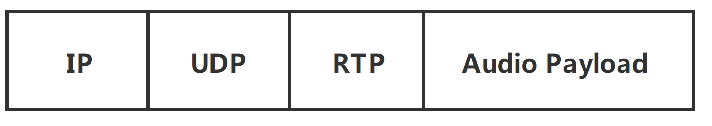
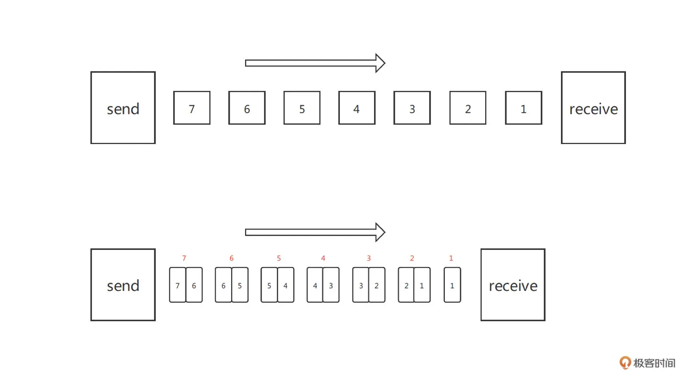
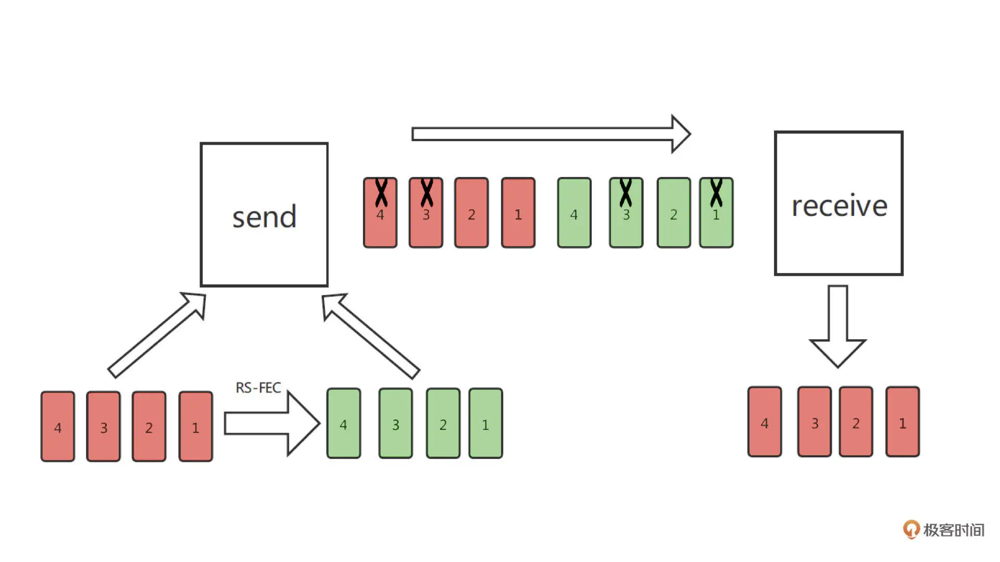
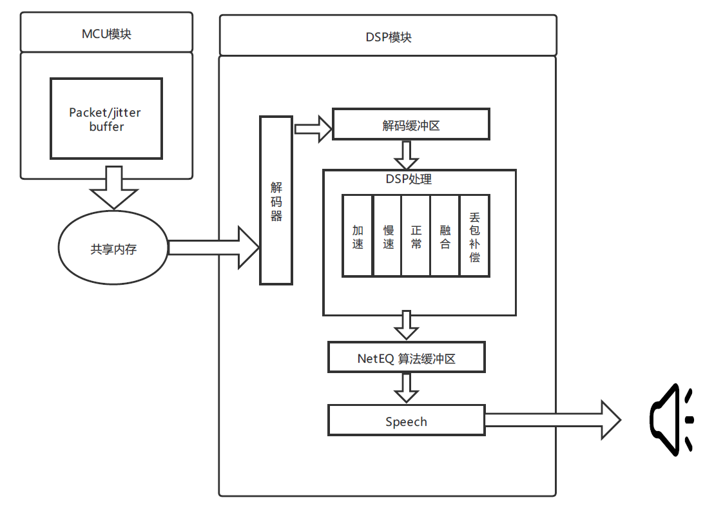
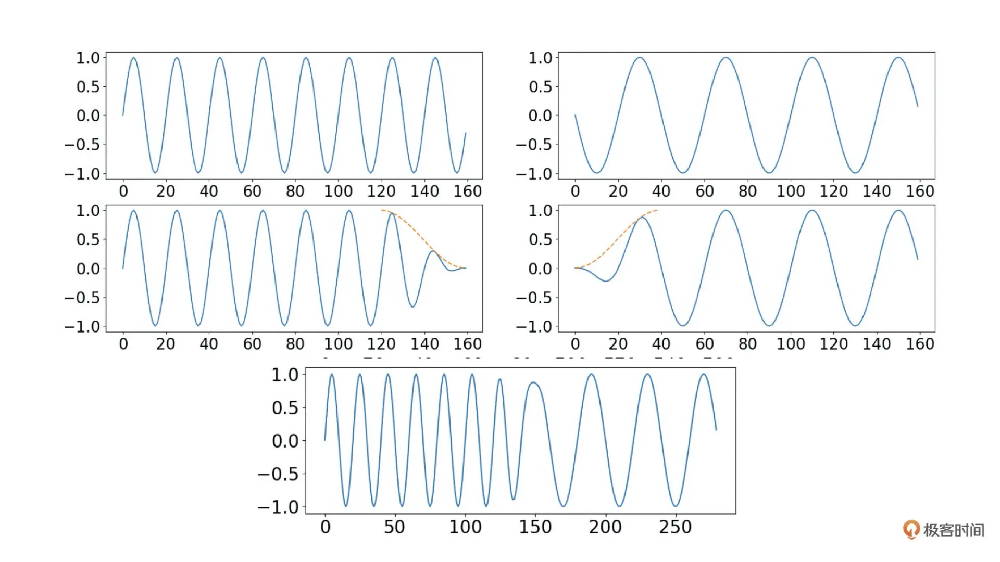

<head>
    
    
</head>

# Table of Contents

1.  [Algorithm](#orgdf3f1f7)
2.  [Review](#org831f627)
    1.  [网络差怎么办？音频网络传输与抗弱网策略](#org0f49f86)
        1.  [实时音频传输](#org025a8db)
        2.  [弱网是如何形成的](#org037f122)
        3.  [抗弱网策略](#org2843d3b)
        4.  [总结](#org846d234)
3.  [Tips](#org2981b7d)
4.  [Share](#orgcd416ff)
    1.  [性能测试的正确姿势：性能、时间和优化](#org560d0af)
        1.  [意外的测试结果](#orge4c6b2d)
        2.  [如何进行性能测试](#org00de10c)
        3.  [一个小测试框架](#orgc2fb9cb)
        4.  [浅谈优化的问题](#org73d1c11)

# Algorithm

Find First and Last Position of Element in Sorted Array <https://leetcode.com/problems/find-first-and-last-position-of-element-in-sorted-array>

<https://dreamume.medium.com/leetcode-34-find-first-and-last-position-of-element-in-sorted-array-e89345fb0782>

# Review

搞定音频技术    冯建元

## 网络差怎么办？音频网络传输与抗弱网策略

一般在弱网情况下，音频的体验可能表现为卡顿、杂音。如果情况严重可能会直接导致无法正常通话

### 实时音频传输

在实时音频交互的场景中，为了保证传输的实时性，一般使用基于 UDP 协议的 RTP 协议来传输音频数据。相较于 TCP 协议，UDP 提供了一种无需建立连接，就可以发送封装的 IP 数据包的方法

而 RTP 定义了我们音视频的数据包格式，其中包含了 RTP 版本号、包顺序编号等信息。而音频编码得到的压缩后的音频信息，就对应了数据包最后的 Audio Payload，也就是音频负载部分。我们可以通过下图来看看一个完整的音频数据包的组成形式

### 弱网是如何形成的

弱网状态中有三个常见的问题：丢包（Packet Loss）、延迟（Latency）和抖动（Jitter）

1.  丢包

    在网络传输中，数据包会经过很多复杂的路径，有的是在物理传输中发生了丢失，有的是在服务器、路由转发时由于拥堵或等待时间过长被抛弃

2.  延迟和抖动

    从发送到接收经过的时间我们把它叫做延迟
    
    音频在发送的时候是按照时间顺序等间隔发送的，但是由于每个数据包经过的路径不同，从而到达目的地的延迟也不一样。这就导致有的时候很长时间都没有一个数据包到达，而有的时候几乎是同时来了好几个数据包。这就是我们常说的抖动。如果我们按照数据包到达的顺序去播放音频，那么音频播放可能是乱序的而发生杂音，也可能是没有数据可以播放，导致卡顿

### 抗弱网策略

主要有网络丢包控制这一网络传输条件下的通用解决方法，和 NetEQ 这种音频独有的抗弱网策略这两块来解决弱网问题

1.  网络丢包控制

    简单地说，就是同一个包一次多发几个，只要不是都丢了就能至少收到一个包；又或者丢了包就再重传一个，只要速度够快还能赶上正常的播放时间就可以。这两种思想对应我们通常使用的前向纠错 FEC（Forward Error Correction）和自动重传请求 ARQ（Automatic Repeat-reQuest）这两个纠错算法
    
    FEC 是发送端通过信道编码和发送冗余信息，而接收端检测丢包，并且在不需要重传的前提下根据冗余信息恢复丢失的大部分数据包。即以更高的信道带宽作为恢复丢包的开销
    
    这里你需要注意的是：音频前向纠错遵循 RFC-2198 标准；而视频前向纠错遵循 RFC-5109 标准。音频由于数据包相比视频要小的多，可以直接用完整的音频包做冗余，而不是像视频用一个分辨率比较差的小数据包做冗余。如下图所示这就是 Simple-FEC 的原理
    
    我们看到上图中 FEC 就是每次发一个当前时间的数据包和一个上一时刻的冗余包，当其中一个数据包丢失时，我们可以用下一时刻的冗余包把数据恢复起来
    
    我们再看看另一种 FEC 的方法 [RS-FEC](https://datatracker.ietf.org/doc/html/rfc5510#page-15)，RS 码即里德 - 所罗门码（Reed-solomon Code）。这里我们结合下图来看一下
    
    我们假设每 m 个包（红色方块）进行一次 RS-FEC 编码得到 n 个冗余包（绿色方块）。冗余包加上原来的包，也就是我们在 m 个包的间隔时间里要发送 m+n 个包。RS-FEC 的特点是，我们只需要得到 m+n 个包中的任意 m 个包就可以把音频还原出来。在上图中，m = 4, n = 4，这样即使这 8 个包里连续丢了 4 个，也就是丢包率是 50%，都可以保证音频的流畅播放
    
    我们再来看看另一个常用的防丢包策略：ARQ。其实 ARQ 的原理非常简单。它就是采用使用确认信息（Acknowledgements Signal, ack），也就是接收端发回的确认信息，表征已正确接收数据包和超时时间。如果发送方在超时前没有收到确认信息 ack，那么发送端就会重传数据包，知道发送方收到确认信息 ack 或直到超过预先定义的重传次数
    
    可以看到相比 ARQ 的丢包恢复，由于 FEC 是连续发送的，且无需等待接收端回应，所以 FEC 在体验上的延时更小。但由于不管有没有丢包 FEC 都发送了冗余的数据包，所以它对信道带宽消耗较多。而相比 FEC 的丢包恢复，ARQ 因为要等待 ack 或者需要多次重传。因此，ARQ 延时较大，带宽利用率不高

2.  NetEQ

    其实为了解决弱网问题，在接收端音频解码时通常都有一套比较完整的抗丢包策略。实际上，很多音频编解码器或者开源实时音频框架中都自带了抗丢包策略，其中比较典型的是在 WebRTC 框架中的 NetEQ 模块。我们可以通过下图来了解一下
    
    我们可以看到，NetEQ 主要包括两个模块：MCU（Micro Control Unit，微控制单元）和 DSP（Digital Signal Processing，信号处理单元）。我们知道由于网络传输的不稳定性，虽然我们有 FEC 和 ARQ，但由于延迟或者严重丢包导致的数据包乱序，或者数据包丢失，还是会经常发生的
    
    在 MCU 里的 Jitter Buffer（抖动缓存区）或者说 Packet Buffer（数据包缓存区）就是通过开辟一个比较大的缓冲区域，让一段时间内到来的数据包在 Jitter Buffer 里存储、排序。然后按照播放顺序把数据包交给 DSP 中的解码器进行解码
    
    在 DSP 模块中，由解码缓冲区得到的音频信号并不是直接交给播放设备播放的。而是需要根据网络状态、缓冲区未处理的数据包长度，以及等待播放的音频长度等参数，来决定使用 DSP 处理中的五种决策方法中的哪一种来处理音频数据。接下来我们就来看这五种策略：加速、慢速、正常、融合和丢包补偿背后决策的原理、实现方法和实际听感的效果是什么样的
    
    其实 NetEQ 中主要定义了四种收包的情况：
    
    1.  过去帧和当前帧都正确接收
        
        这种情况下只需要考虑网路抖动带来的数据包堆积和数据包接收不足的问题
        
        所谓数据包堆积，就是同一时间到达了多个数据包都在等待播放，而这个时候需要使用加速策略（accelerate），即对音频信号采用变速不变调的算法来缩短解码后音频的长度，从而实现快速播放
        
        相反的，如果在缓冲中的数据就快播放完了但新包还未送达，那么这时候就需要慢速的方法来把音频时长拉长。这里用到的同样是变速不变调的算法，即只改变音频的播放速度而不改变音频的音调
        
        WebRTC 中使用的是一种叫 WSOLA 的算法来实现的，这其实是音效算法中变调不变速算法的一种反向应用，更具体地我会在音效算法的一讲中详细解读
        
        那快慢放的听感是什么样的呢？在网络有抖动的时候，你可能会感觉对面说话，有的时候会快一点，有的时候会慢一点。这种快慢感在语音的时候可能不是那么容易察觉，这是因为人说话本来就有快有慢。但是在音乐的场景下，因为你对一首歌比较熟悉，所以快慢放就会更容易被察觉
    
    2.  当前帧发生丢包或者延迟
        
        如果当前帧发生了丢包或者延迟导致当前没有音频数据可以播放，这个时候就需要额外的 PLC（Package Loss Compensation，丢包补偿）模块来重建音频。你还记得我们在编解码器中讲的 LPC 算法吗？其实常见的 PLC 算法就是通过重建或者复用上一帧的 LPC 系数和残差来还愿这一帧的音频数据，从而实现丢包隐藏的
        
        慢放虽然也可以增加音频的长度但一个慢放系数比例确定后，慢放所能增加的音频长度也就固定了，所以一般慢放用于解决需预测时间比较短的音频的拉长。而 PLC 具有可扩展性，所以一般负责整个一帧或者多帧的，长时间的丢包补偿
    
    3.  连续多帧丢包
        
        连续多帧丢包用 PLC 就不行了，因为 PLC 补出来的音频很大程度上是上一帧音频的延长。如果长时间使用 PLC，声音就会变得失真，从而影响听感。所以如果出现连续多帧丢包，我们就会逐帧递减 PLC 补出音频的能量增益。这也就是为什么，长时间的丢包后的听感是声音逐渐变小直到没有声音，而不是有一个奇怪的声音一直在延续
    
    4.  前一帧丢失，当前帧正常
        
        最后这种情况前一帧可能存在 PLC 的补帧操作，那么新来的音频数据和上一帧就会出现不连续的情况，这里我们就会用到融合的操作。操作也比较简单，就是把当前帧的新数据和之前帧的音频做交叉淡化，让它们的连接处能平稳过度
        
        交叉淡化的步骤如下图所示，其实就是前一帧信号的末尾取一段逐步衰减至 0，然后让后一帧的前端数据从 0 开始逐步提升。然后把这两帧重叠部分相加就可以实现比较平滑的拼接了
        
        上图中橙色虚线表示交叉淡化用的淡化增益，第一第二行分别表示原始数据和交差淡化衰减后的曲线，最后一行是两帧重叠部分相加、拼接后得到的数据

### 总结

NetEQ 中通过多个 Buffer 缓存以及快慢放的形式引入了延迟，从而提升了抗网络抖动的能力。然后通过 PLC 的方式解决丢包带来的音频卡顿。这与 FEC 和 ARQ 相比无需额外的带宽消耗，但是却增加了延迟

在实际中你可能需要针对自己的场景进行一些调整，比如说对于流畅通话比较重要的会议等场景，可以把 NetEQ 中的缓冲 Buffer 适量增大，这样可以进一步提升网络丢包的能力。但是 Buffer 也不能太大，这样会导致过多的延迟，从而影响通话效果

我们也可以在 NetEQ 中引入网络抖动情况的估计，比如在网络抖动严重的时候，动态增加 NetEQ 的 Jitter Buffer 的大小，而网络情况较好的时候减少一些 Jitter Buffer 的大小，从而降低延迟，这些都是可以改进的策略

# Tips

C++ 的喧哗？Bjarne Stroustrup 警告 C++ 的危险未来计划

<https://www.theregister.com/2018/06/18/bjarne_stroustrup_c_plus_plus/>

采访：2018年早期，Bjarne Stroustrup，C++ 的创造者，摩根斯坦利技术部门主任，哥伦比亚大学计算机科学访问教授，写了一封信邀请这些编程语言的演进监督来“Remember the Vasa!"

# Share

现代 C++ 实战（吴咏炜） 笔记

## 性能测试的正确姿势：性能、时间和优化

### 意外的测试结果

假设你想测试一下，memset 究竟有没有性能优势。于是，你写下了下面这样的测试代码

    #include <cstdio>
    #include <string>
    #include <time.h>
    
    int main() {
        constexpr int LOOPS = 10000000;
        char buf[80];
        clock_t t1;
        clock_t t2;
    
        t1 = clock();
        for (int i = 0; i < LOOPS; ++i)
            memset(buf, 0, sizeof buf);
        t2 = clock();
        pirntf("%g\n", (t2 - t1) * 1.0 / CLOCK_PER_SEC);
    
        t1 = clock();
        for (int i = 0; i < LOOPS; ++i) {
            for (size_t j = 0; j < sizeof buf; ++j)
                buf[j] = 0;
        }
        t2 = clock();
        printf("%g\n", (t2 - t1) * 1.0 / CLOCK_PER_SEC);
    
        return 0;
    }

这里单线程下正确的行为可能到了多线程就有问题。但从性能测试的角度，即使单线程也一样会遇到鬼！编译器非常聪明，它看到了：你往内存里写数据了，又没有使用写到内存的数据；同时这是本地变量，你也没有把变量的引用或指针传到其他地方去。所以，外界不会观测到数据的改变。没人看到的东西，干吗需要存在？于是乎，编译器就把写内存的代码彻底优化没了

你模模糊糊想起来，volatile 关键字可以影响编译器优化。那加上这个关键字是不是有效呢？于是你把代码改成下面这个样子

    volatile char buf[80];
    // ...
    for (int i = 0; i < LOOPS; ++i)
      memset(const_cast<char *>(buf), 0, sizeof buf);

volatile 关键字确实阻止了编译器优化，但这回它反向影响了。volatile 在 C++ 里的语义是，严格按照代码的指示对内存进行读写：你写一次，编译器就产生相应读的代码 - 一个不多，一个不少。这就导致了对内存操作的性能劣化。通常，你只在进行内存映射的输入输出时才有这么用的必要

如果不用 volatile，那编译器至少在理论上是可以对上面的代码做出更好的优化的。我们把 buf 改成一个普通的全局变量，就能测到一个更接近真实的效果了。我们可以看到，GCC 和 Clang 都做出了更好的优化，对 memset 和循环清零产生了完全相同的代码。GCC 在 Core i7 架构（-march=corei7）上产生的汇编代码如下

    pxor xmm0, xmm0
    movaps XMMWORD PTR buf[rip], xmm0
    movaps XMMWORD PTR buf[rip + 16], xmm0
    movaps XMMWORD PTR buf[rip + 32], xmm0
    movaps XMMWORD PTR buf[rip + 48], xmm0
    movaps XMMWORD PTR buf[rip + 64], xmm0

也就是说，编译器洞察了你要做的事情是往 buf 里写入 80 个零，因而采取了最高效的方式，一次写 16 个零，连写五次，根本就没有循环了

### 如何进行性能测试

1.  内存屏障问题

    使用全局变量并不意味着我们一定就能测到真实数据。以上面这个测试为例，虽然编译器看到我们往全局变量写入，就一定不可能把写入完全忽略掉，但它完全可能会做一些写入的合并。事实上，实测下来 Clang 就做了写入的合并，因此测试的结果数据看起来比 GCC 和 MSVC 要漂亮很多。从测试上面两种写法的区别上讲，问题还不算大，但如果我们想拿这个数据来计算代码的性能数据的话，那就要了命了
    
    一种可能的解法是加入内存屏障，告诉编译器到现在为止的内存修改都得给我完成了。全局锁就是一种通用的内存屏障，但在上面的代码里加入全局锁的话，加解锁的开销就会完全掩盖我们要测试部分的开销了。每种处理器架构都有自己的内存屏障指令，这比 C++ 或操作系统的锁要轻量一点，但对于我们上面的测试来讲，仍然是重了（约 10 倍的性能下降）。每一种编译器，基本上也都有非标准的轻量级内存屏障指令，只影响编译器优化，而不影响 CPU 的处理性能
    
    最后一种方式看起来最有希望，但遗憾的是，在我们上面的例子里，加入内存屏障本身会影响 GCC 产生的代码。仅针对目前的代码，我们可以写出下面这样一个内存屏障的函数
    
        #ifdef _MSC_VER
        #include <intrin.h>
        #endif
        
        inline void memory_fence() {
        #ifdef _MSC_VER
            _ReadWriteBarrier();
        #elif defined(__clang__)
            __asm__ __volatile__("" ::: "memory");
        #endif
        }
    
    然后我们在测试代码后调用这个函数，确保对内存的写入会生效。注意我们仍需使用全局变量作为写入目标才行
    
    这种解法的问题是，它实在太脆弱了。从原理上来讲，它能不能工作并没有任何人可以保证。对于一个新的编译器，代码很可能会无效；对于当前工作的编译器的一个新版本，代码也可能会变为无效
    
    目前最可靠也最跨平台的解决方案仍然是用锁。如果想使用锁，我们需要有一种比 clocl() 精度高得多的测量时间的办法
    
    Linux:
    
    <table border="2" cellspacing="0" cellpadding="6" rules="groups" frame="hsides">
    
    
    <colgroup>
    <col  class="org-left" />
    
    <col  class="org-right" />
    
    <col  class="org-left" />
    </colgroup>
    <thead>
    <tr>
    <th scope="col" class="org-left">函数</th>
    <th scope="col" class="org-right">精度（微秒）</th>
    <th scope="col" class="org-left">耗时（时钟周期）</th>
    </tr>
    </thead>
    
    <tbody>
    <tr>
    <td class="org-left">clock</td>
    <td class="org-right">1</td>
    <td class="org-left">~1800</td>
    </tr>
    
    
    <tr>
    <td class="org-left">gettimeofday</td>
    <td class="org-right">1</td>
    <td class="org-left">~69</td>
    </tr>
    
    
    <tr>
    <td class="org-left">clock_gettime</td>
    <td class="org-right">0.0265(38)</td>
    <td class="org-left">~67</td>
    </tr>
    
    
    <tr>
    <td class="org-left">std::chrono::system_lock</td>
    <td class="org-right">0.0274(38)</td>
    <td class="org-left">~68</td>
    </tr>
    
    
    <tr>
    <td class="org-left">std::chrono::steady_clock</td>
    <td class="org-right">0.0272(28)</td>
    <td class="org-left">~68</td>
    </tr>
    
    
    <tr>
    <td class="org-left">std::chrono::high_resolution_clock</td>
    <td class="org-right">0.0275(20)</td>
    <td class="org-left">~69</td>
    </tr>
    
    
    <tr>
    <td class="org-left">rdtsc</td>
    <td class="org-right">0.00965(48)</td>
    <td class="org-left">~24</td>
    </tr>
    </tbody>
    </table>
    
    Windows:
    
    <table border="2" cellspacing="0" cellpadding="6" rules="groups" frame="hsides">
    
    
    <colgroup>
    <col  class="org-left" />
    
    <col  class="org-right" />
    
    <col  class="org-left" />
    </colgroup>
    <thead>
    <tr>
    <th scope="col" class="org-left">函数</th>
    <th scope="col" class="org-right">精度（微秒）</th>
    <th scope="col" class="org-left">耗时（时钟周期）</th>
    </tr>
    </thead>
    
    <tbody>
    <tr>
    <td class="org-left">clock</td>
    <td class="org-right">1（毫秒）</td>
    <td class="org-left">~160</td>
    </tr>
    
    
    <tr>
    <td class="org-left">GetTickCout</td>
    <td class="org-right">15.63(49)（毫秒）</td>
    <td class="org-left">~10</td>
    </tr>
    
    
    <tr>
    <td class="org-left">GetPerformanceCounter</td>
    <td class="org-right">0.1</td>
    <td class="org-left">~61</td>
    </tr>
    
    
    <tr>
    <td class="org-left">GetSystemTimeAsFileTime</td>
    <td class="org-right">15.63(49)（毫秒）</td>
    <td class="org-left">~20</td>
    </tr>
    
    
    <tr>
    <td class="org-left">GetSystemTimePreciseAsFileTime</td>
    <td class="org-right">0.1</td>
    <td class="org-left">~100</td>
    </tr>
    
    
    <tr>
    <td class="org-left">std::chrono::system_lock</td>
    <td class="org-right">0.1</td>
    <td class="org-left">~100</td>
    </tr>
    
    
    <tr>
    <td class="org-left">std::chrono::steady_clock</td>
    <td class="org-right">0.1</td>
    <td class="org-left">~160</td>
    </tr>
    
    
    <tr>
    <td class="org-left">std::chrono::high_resolution_clock</td>
    <td class="org-right">0.1</td>
    <td class="org-left">~160</td>
    </tr>
    
    
    <tr>
    <td class="org-left">rdtsc</td>
    <td class="org-right">0.00973(93)</td>
    <td class="org-left">~25</td>
    </tr>
    </tbody>
    </table>
    
    精度的测量是取当函数返回的数值变化时的差值。当连续调用某一个计时函数时，它返回的结果是可能不变的。当它变化时，变化的数值就是它的测时精度。表中展示的就是这些精度测量结果的平均值（及方差，如果测试结果不完全一样的话）
    
    精度受 API 设计的影响，也受函数实现的影响。比如，Windows 上定义 CLOCK_PER_SEC 为 1000，显然 clock() 也就不可能获得高于一毫秒的精度了。C++11 的三种时钟从目前实现的接口上来看都允许实现一纳秒的精度，但实际精度则要远远低于一纳秒
    
    测试结果当然跟具体的硬件也可能有关系，但至少这里可以看到一些基本的共性：
    
    -   首先，clock() 函数不是个好选择，它的精度可能很差，本身耗时也可能会比较长
    -   其次，C++11 带来的三种时钟不管是精度还是自身开销都还算不错。既然其它方面没有区别，我们就选择使用能提供稳定增长保证的 steady\_clock（system\_clock 是不稳定的，系统时间被调整时，时钟返回的数值也会变化；high\_resolution_clock 的稳定性在标准中没有进行规定）[[1]​](https://en.cppreference.com/w/cpp/chrono#Clocks)
    -   最后，如果时间戳计数器（Time Stamp Counter[[2]​](https://en.wikipedia.org/wiki/Time_Stamp_Counter)） 可用的话，它能提供最高的精度和最短的耗时。它是处理器上的硬件计数器，精度高，速度快，在多核系统上也能提供正确的读数；但在多 CPU 插槽的系统上则不一定能提供相应的保证，因而在那种情况下可能需要把测试程序绑定到某个核上运行
    
    rdtsc 返回的数值单位是时钟周期数（但频率可能跟处理器的实际运行频率不同）。上表中测量各个函数的耗时用的就是 rdtsc
    
    我目前在 [代码库](https://github.com/adah1972/geek_time_cpp) 里加入了 rdtsc.h 文件。它的实现就是优先使用 x86 和 x86-64 平台提供的 rdtsc 的实现，在找不到时转而使用 stead_clock 作为替代
    
    额外提一句，我这边讲的性能测试是微观层面的测试，即所谓的 microbenchmarking，一般以函数为单位。这种测试是单线程的，需要干扰尽可能少。可能的干扰有：
    
    -   其他的应用程序 - 应尽可能关闭其他应用，尤其是会耗 CPU 的
    -   处理器的自动频率变化 - 最好关闭这类功能，如 Intel 的 Turbo Boost
    -   不同性能核之间的迁移 - 如果你的测试系统上有所谓的大小核，而你又没办法把程序绑定到某个核上面的话，那这样的系统不适合用来做微观层面的性能测试

2.  通用测试方法

    下面我们讨论一种我个人经常使用的通用的性能测试方法。由于编译器的很多优化机制并不能由代码来控制，这也只能算是一种最佳实践而已。根据你的特定平台，也许你可以找出更好的测试方法
    
    我的基本方法是：
    
    -   把待测的代码放到一个函数里，这样容易消除一些其它干扰
    -   可选地，把这个函数用 \__attribute\__((oninline))[[3]​](https://gcc.gnu.org/onlinedocs/gcc-11.2.0/gcc/Common-Function-Attributes.html) 或 \__declspec(noinline)[[4]​](https://docs.microsoft.com/en-us/cpp/cpp/noinline?view=msvc-170) 标注为不要内联
    -   确保有一个依赖函数直线结果的数值会被写到某个全局变量里。根据代码的规模和组织，可以直接在这个函数里写入，或者通过外部传入的一个全局变量的指针或引用来写入
    -   在函数的开头和结尾测量时间，并把测得的时长累加到某个地方
    -   在循环里反复调用被测函数，并在每次调用函数前后进行加解锁，产生内存屏障
    
    比如，memset 的测试代码可能就会变成这个样子
    
        char buf[80];
        uint64_t memset_duration;
        
        std::mutex mutex;
        
        void test_memset() {
            uint64_t t1 = rdtsc();
            memset(buf, 0, sizeof buf);
            uint64_t t2 = rdtsc();
            memset_duration += (t2 - t1);
        }
        
        int main() {
            constexpr int LOOPS = 10000000;
            for (int i = 0; i < LOOPS; ++i) {
                std::lock_guard guard{mutex};
                test_memset();
            }
        
            printf("%g\n", memset_duration * 1.0 / LOOPS);
        }
    
    使用这种方法，我们确实可以验证出在 GCC 和 Clang 下，两种清零方法在缓冲区大小已知的情况下可以获得相同的性能（如果大小要运行时才能决定，那就是另外一个需要单独测试的问题了）

### 一个小测试框架

利用 RAII，我们可以使用一个框架把代码再整理一下，使得测试更加简单和自动。这个框架毕竟简单，设计和实现我就不讲了

对于当前的例子，首先我们需要声明两个待测函数的索引

    enum profiled_functions {
        PF_TEST_MEMSET,
        PF_TEST_PLAIN_LOOP,
    };

然后，我们需要声明函数索引和函数名的关系：

    name_mapper name_map[] = {
        {PF_TEST_MEMSET, "test_memset"},
        {PF_TEST_PLAIN_LOOP, "test_plain_loop"},
        {-1, nullptr}};

对于待测函数，我们需要在函数开头插入一行代码，表示要对这个函数进行性能测试（利用一个 RAII 对象）：

    void test_memset() {
        PROFILE_CECK(PF_TEST_MEMSET);
        memset(buf, 0, sizeof buf);
    }

完整代码请参考 GitHub 上的 [代码库](https://github.com/adah1972/geek_time_cpp)。如果想检查不同架构下的性能差异的话，可以在 cmake 命令行上指定编译器和附加参数，如：

    CXX='g++ -march=corei7' cmake ...

此外，需要说明一下，跟 assert 类似，PROFILE\_CHECK 宏在 NDEBUG 宏被定义时就不生效了。所以，上面的输出在使用了 cmake -DCMAKE\_BUILD_TYPE=Release ... 时就不会有了

### 浅谈优化的问题

今天提到的测试困难，很大程度上都是 C++ 编译器的优化造成的。事实上，C++ 里很多未定义行为之所以成为未定义行为，也是跟性能有关的。为了追求性能，C++ 编译器是可谓无所不用其极。有些人觉得编译器忽略了人的意图，感到很不爽，但事实是，C++ 编译器在优化方面确实比大部分程序员做得更好。这也是现在基本上没人写汇编的原因 - 即使不考虑可移植性，在某一特定平台上要写出超出 C++ 编译器水平的汇编代码，也已经越来越困难了

但这种优化，虽然常常对程序有好处，也常常是违背程序员的直觉的。我这里另外举两个简单的例子，来说明一下为什么 C++ 编译器需要违反程序员的直觉

1.  优化和未定义行为

    假如我们有一个 int 类型的变量 x，那 x \* 2 / 2 的结果是几？
    
    如果 C++ 把有符号整数运算溢出的结果定义为补码的内存表示，也就是说，32 位正整数 0x40'00'00'00（$ 2^{30} $）乘以 2 的结果就是 0x80'00'00'00（$ -2^{31} $ ），再除以 2 的话，我们就不能得回原先的数值，而是得到了 0xC0'00'00'00（ $ -2^{30} $）。这样的话，x \* 2 / 2 就不能优化为 x
    
    那能不能使用异常呢？也不行。跟除零不一样，整数运算溢出不会产生硬件中断。而如果我们在每条加法、减法、乘法、除法（对，除法也可能溢出 - INT\_MIN / -1 就会）上都加入指令来检查是否发生溢出、并在发生溢出时报告异常的话，性能的退步是不可接受的 [[5]​](https://www.cs.utah.edu/~regehr/papers/overflow12.pdf)
    
    所以，C++ 的处理方式就是，规定有符号整数运算溢出为未定义行为 [[6]​](https://en.cppreference.com/w/cpp/language/ub) ，即程序员需要保证这种情况不会发生，否则后果自负。这在允许编译器把 x \* 2 / 2 优化成 x 的同时，也意味着，下面这样的代码返回的结果可能会跟程序员预想的不同（参见 [[7]​](https://godbolt.org/z/Ex5ad6vM9)）：
    
        bool test(int n) {
            return (n + 1) == INT_MIN;
        }
    
    你想的是，如果 n + 1 溢出了，应该会得到 INT_MIN 这个特殊的结果。但编译器可以认为溢出是永远不会发生的（因为正确的程序里不应该有未定义行为），因此可以直接返回 false。- 这也是实际可以在 GCC 和 Clang 上测到的结果

2.  优化和执行顺序

    假设我们有三个全局 int 变量 x、y 和 a，然后我们执行下面的代码
    
        x = a;
        y = 2;
    
    下面是某些编译器实际产生的汇编代码（参见 [[8]​](https://godbolt.org/z/zsfvsf63E)）：
    
        mov exa, DWORD PTR a
        mov DWORD PTR y, 2
        mov DOWRD PTR x, eax
    
    因为优化，读入 a 的数值到 eax 寄存器里，跟写入 2 到 y里是两个不相关操作，可以同时执行。这样的代码，比起完全按程序员指定的执行顺序产生的代码，可望得到更高的性能

