<head>
    
    
</head>

# Table of Contents

1.  [Algorithm](#orgdf3f1f7)
2.  [Review](#org831f627)
    1.  [网络差怎么办？音频网络传输与抗弱网策略](#org0f49f86)
        1.  [实时音频传输](#org025a8db)
        2.  [弱网是如何形成的](#org037f122)
        3.  [抗弱网策略](#org2843d3b)
        4.  [总结](#org846d234)
    2.  [空间音频入门：如何实现“声临其境”？](#orga49181a)
        1.  [方位判断与双耳效应](#org8987f34)
        2.  [距离感和空间感](#orgd3ac85d)
        3.  [空间音频的采集](#orgd84f723)
        4.  [空间音频的播放](#orgd426339)
    3.  [如何利用 HRTF 实现听音辨位](#org52b77f5)
        1.  [HRTF 简介](#org70a29ef)
        2.  [HRIR 与直达声渲染](#org5c2159c)
        3.  [RIR 与反射声渲染](#orge4d03ff)
        4.  [小结](#orged09c22)
    4.  [音效三剑客：变调、均衡器、混响](#org0fcab57)
        1.  [变调](#org80f3c7c)
        2.  [均衡器](#org32e62c3)
        3.  [混响](#orgfc656be)
        4.  [思考题](#orgfb5efd1)
    5.  [音频技术漫谈之好声音是怎么炼成的？](#org750cf1d)
        1.  [什么是高音质？](#org1be2ec2)
        2.  [什么是实时美声？](#orgf84985f)
        3.  [数据驱动](#org12a932f)
        4.  [理论支持](#orgdba2acd)
        5.  [算法融合](#orgdba1cd8)
    6.  [AI 变声：音频 AI 技术的集大成者](#org3689cc6)
        1.  [ASR](#org65c6e9e)
        2.  [TTS](#org0838cc6)
        3.  [VC](#orge90988a)
        4.  [小结](#org2ca193a)
3.  [Tips](#org2981b7d)
4.  [Share](#orgcd416ff)
    1.  [性能测试的正确姿势：性能、时间和优化](#org560d0af)
        1.  [意外的测试结果](#orge4c6b2d)
        2.  [如何进行性能测试](#org00de10c)
        3.  [一个小测试框架](#orgc2fb9cb)
        4.  [浅谈优化的问题](#org73d1c11)
    2.  [快速分配和释放内存：内存池](#orge966327)
        1.  [一个测试用例](#orge7d064a)
        2.  [PMR 内存池](#org19419bd)
        3.  [自定义内存池](#orga2196c2)
        4.  [生命周期陷阱](#org5453218)
    3.  [发现和识别内存问题：内存调试实践](#orgf19ea64)
        1.  [场景](#org9a4eff7)
        2.  [内存调试原理](#org225719b)
        3.  [“上下文”内存调试工具](#org6bad418)
        4.  [释放检查](#org006ce59)
        5.  [退出检查](#orgf7857be)
        6.  [一个小细节](#org3192c03)
        7.  [课后思考](#org3828720)
    4.  [访问对象的代理对象：视图类型](#org0e2cae0)
        1.  [span](#orgb5f7994)
        2.  [示例](#org45d57f7)
        3.  [一些技术细节](#orgeacbd2d)
        4.  [gsl::span 的性能问题](#org3976069)
        5.  [视图类型](#orgc62f6ac)
    5.  [参数传递的正确方法和模板的二进制膨胀](#org54c460f)
        1.  [转发引用](#org3fa9a52)
        2.  [auto&&](#org4726d4a)
        3.  [转发引用的问题](#org1ba625f)
        4.  [避免不必要的转发引用](#org8d68dd3)
        5.  [模板的二进制膨胀](#org857aa08)
        6.  [通过退化消减二进制膨胀](#org74c78b8)
        7.  [通过公共基类消减二进制膨胀](#org3a37bbc)

# Algorithm

Find First and Last Position of Element in Sorted Array <https://leetcode.com/problems/find-first-and-last-position-of-element-in-sorted-array>

<https://dreamume.medium.com/leetcode-34-find-first-and-last-position-of-element-in-sorted-array-e89345fb0782>

# Review

搞定音频技术    冯建元

## 网络差怎么办？音频网络传输与抗弱网策略

一般在弱网情况下，音频的体验可能表现为卡顿、杂音。如果情况严重可能会直接导致无法正常通话

### 实时音频传输

在实时音频交互的场景中，为了保证传输的实时性，一般使用基于 UDP 协议的 RTP 协议来传输音频数据。相较于 TCP 协议，UDP 提供了一种无需建立连接，就可以发送封装的 IP 数据包的方法

而 RTP 定义了我们音视频的数据包格式，其中包含了 RTP 版本号、包顺序编号等信息。而音频编码得到的压缩后的音频信息，就对应了数据包最后的 Audio Payload，也就是音频负载部分。我们可以通过下图来看看一个完整的音频数据包的组成形式

### 弱网是如何形成的

弱网状态中有三个常见的问题：丢包（Packet Loss）、延迟（Latency）和抖动（Jitter）

1.  丢包

    在网络传输中，数据包会经过很多复杂的路径，有的是在物理传输中发生了丢失，有的是在服务器、路由转发时由于拥堵或等待时间过长被抛弃

2.  延迟和抖动

    从发送到接收经过的时间我们把它叫做延迟
    
    音频在发送的时候是按照时间顺序等间隔发送的，但是由于每个数据包经过的路径不同，从而到达目的地的延迟也不一样。这就导致有的时候很长时间都没有一个数据包到达，而有的时候几乎是同时来了好几个数据包。这就是我们常说的抖动。如果我们按照数据包到达的顺序去播放音频，那么音频播放可能是乱序的而发生杂音，也可能是没有数据可以播放，导致卡顿

### 抗弱网策略

主要有网络丢包控制这一网络传输条件下的通用解决方法，和 NetEQ 这种音频独有的抗弱网策略这两块来解决弱网问题

1.  网络丢包控制

    简单地说，就是同一个包一次多发几个，只要不是都丢了就能至少收到一个包；又或者丢了包就再重传一个，只要速度够快还能赶上正常的播放时间就可以。这两种思想对应我们通常使用的前向纠错 FEC（Forward Error Correction）和自动重传请求 ARQ（Automatic Repeat-reQuest）这两个纠错算法
    
    FEC 是发送端通过信道编码和发送冗余信息，而接收端检测丢包，并且在不需要重传的前提下根据冗余信息恢复丢失的大部分数据包。即以更高的信道带宽作为恢复丢包的开销
    
    这里你需要注意的是：音频前向纠错遵循 RFC-2198 标准；而视频前向纠错遵循 RFC-5109 标准。音频由于数据包相比视频要小的多，可以直接用完整的音频包做冗余，而不是像视频用一个分辨率比较差的小数据包做冗余。如下图所示这就是 Simple-FEC 的原理
    
    我们看到上图中 FEC 就是每次发一个当前时间的数据包和一个上一时刻的冗余包，当其中一个数据包丢失时，我们可以用下一时刻的冗余包把数据恢复起来
    
    我们再看看另一种 FEC 的方法 [RS-FEC](https://datatracker.ietf.org/doc/html/rfc5510#page-15)，RS 码即里德 - 所罗门码（Reed-solomon Code）。这里我们结合下图来看一下
    
    我们假设每 m 个包（红色方块）进行一次 RS-FEC 编码得到 n 个冗余包（绿色方块）。冗余包加上原来的包，也就是我们在 m 个包的间隔时间里要发送 m+n 个包。RS-FEC 的特点是，我们只需要得到 m+n 个包中的任意 m 个包就可以把音频还原出来。在上图中，m = 4, n = 4，这样即使这 8 个包里连续丢了 4 个，也就是丢包率是 50%，都可以保证音频的流畅播放
    
    我们再来看看另一个常用的防丢包策略：ARQ。其实 ARQ 的原理非常简单。它就是采用使用确认信息（Acknowledgements Signal, ack），也就是接收端发回的确认信息，表征已正确接收数据包和超时时间。如果发送方在超时前没有收到确认信息 ack，那么发送端就会重传数据包，知道发送方收到确认信息 ack 或直到超过预先定义的重传次数
    
    可以看到相比 ARQ 的丢包恢复，由于 FEC 是连续发送的，且无需等待接收端回应，所以 FEC 在体验上的延时更小。但由于不管有没有丢包 FEC 都发送了冗余的数据包，所以它对信道带宽消耗较多。而相比 FEC 的丢包恢复，ARQ 因为要等待 ack 或者需要多次重传。因此，ARQ 延时较大，带宽利用率不高

2.  NetEQ

    其实为了解决弱网问题，在接收端音频解码时通常都有一套比较完整的抗丢包策略。实际上，很多音频编解码器或者开源实时音频框架中都自带了抗丢包策略，其中比较典型的是在 WebRTC 框架中的 NetEQ 模块。我们可以通过下图来了解一下
    
    我们可以看到，NetEQ 主要包括两个模块：MCU（Micro Control Unit，微控制单元）和 DSP（Digital Signal Processing，信号处理单元）。我们知道由于网络传输的不稳定性，虽然我们有 FEC 和 ARQ，但由于延迟或者严重丢包导致的数据包乱序，或者数据包丢失，还是会经常发生的
    
    在 MCU 里的 Jitter Buffer（抖动缓存区）或者说 Packet Buffer（数据包缓存区）就是通过开辟一个比较大的缓冲区域，让一段时间内到来的数据包在 Jitter Buffer 里存储、排序。然后按照播放顺序把数据包交给 DSP 中的解码器进行解码
    
    在 DSP 模块中，由解码缓冲区得到的音频信号并不是直接交给播放设备播放的。而是需要根据网络状态、缓冲区未处理的数据包长度，以及等待播放的音频长度等参数，来决定使用 DSP 处理中的五种决策方法中的哪一种来处理音频数据。接下来我们就来看这五种策略：加速、慢速、正常、融合和丢包补偿背后决策的原理、实现方法和实际听感的效果是什么样的
    
    其实 NetEQ 中主要定义了四种收包的情况：
    
    1.  过去帧和当前帧都正确接收
        
        这种情况下只需要考虑网路抖动带来的数据包堆积和数据包接收不足的问题
        
        所谓数据包堆积，就是同一时间到达了多个数据包都在等待播放，而这个时候需要使用加速策略（accelerate），即对音频信号采用变速不变调的算法来缩短解码后音频的长度，从而实现快速播放
        
        相反的，如果在缓冲中的数据就快播放完了但新包还未送达，那么这时候就需要慢速的方法来把音频时长拉长。这里用到的同样是变速不变调的算法，即只改变音频的播放速度而不改变音频的音调
        
        WebRTC 中使用的是一种叫 WSOLA 的算法来实现的，这其实是音效算法中变调不变速算法的一种反向应用，更具体地我会在音效算法的一讲中详细解读
        
        那快慢放的听感是什么样的呢？在网络有抖动的时候，你可能会感觉对面说话，有的时候会快一点，有的时候会慢一点。这种快慢感在语音的时候可能不是那么容易察觉，这是因为人说话本来就有快有慢。但是在音乐的场景下，因为你对一首歌比较熟悉，所以快慢放就会更容易被察觉
    
    2.  当前帧发生丢包或者延迟
        
        如果当前帧发生了丢包或者延迟导致当前没有音频数据可以播放，这个时候就需要额外的 PLC（Package Loss Compensation，丢包补偿）模块来重建音频。你还记得我们在编解码器中讲的 LPC 算法吗？其实常见的 PLC 算法就是通过重建或者复用上一帧的 LPC 系数和残差来还愿这一帧的音频数据，从而实现丢包隐藏的
        
        慢放虽然也可以增加音频的长度但一个慢放系数比例确定后，慢放所能增加的音频长度也就固定了，所以一般慢放用于解决需预测时间比较短的音频的拉长。而 PLC 具有可扩展性，所以一般负责整个一帧或者多帧的，长时间的丢包补偿
    
    3.  连续多帧丢包
        
        连续多帧丢包用 PLC 就不行了，因为 PLC 补出来的音频很大程度上是上一帧音频的延长。如果长时间使用 PLC，声音就会变得失真，从而影响听感。所以如果出现连续多帧丢包，我们就会逐帧递减 PLC 补出音频的能量增益。这也就是为什么，长时间的丢包后的听感是声音逐渐变小直到没有声音，而不是有一个奇怪的声音一直在延续
    
    4.  前一帧丢失，当前帧正常
        
        最后这种情况前一帧可能存在 PLC 的补帧操作，那么新来的音频数据和上一帧就会出现不连续的情况，这里我们就会用到融合的操作。操作也比较简单，就是把当前帧的新数据和之前帧的音频做交叉淡化，让它们的连接处能平稳过度
        
        交叉淡化的步骤如下图所示，其实就是前一帧信号的末尾取一段逐步衰减至 0，然后让后一帧的前端数据从 0 开始逐步提升。然后把这两帧重叠部分相加就可以实现比较平滑的拼接了
        
        上图中橙色虚线表示交叉淡化用的淡化增益，第一第二行分别表示原始数据和交差淡化衰减后的曲线，最后一行是两帧重叠部分相加、拼接后得到的数据

### 总结

NetEQ 中通过多个 Buffer 缓存以及快慢放的形式引入了延迟，从而提升了抗网络抖动的能力。然后通过 PLC 的方式解决丢包带来的音频卡顿。这与 FEC 和 ARQ 相比无需额外的带宽消耗，但是却增加了延迟

在实际中你可能需要针对自己的场景进行一些调整，比如说对于流畅通话比较重要的会议等场景，可以把 NetEQ 中的缓冲 Buffer 适量增大，这样可以进一步提升网络丢包的能力。但是 Buffer 也不能太大，这样会导致过多的延迟，从而影响通话效果

我们也可以在 NetEQ 中引入网络抖动情况的估计，比如在网络抖动严重的时候，动态增加 NetEQ 的 Jitter Buffer 的大小，而网络情况较好的时候减少一些 Jitter Buffer 的大小，从而降低延迟，这些都是可以改进的策略

## 空间音频入门：如何实现“声临其境”？

所谓空间音频的技术，就是把现实中这些对声音的感知，能够用空间音频采集设备和播放设备还原出来。空间音频涉及空间声学、空间声采集、空间声重放等细分领域，内容比较多。这里我会按照空间音频的基本原理以及空间音频的采集和播放，结合已有的解决方案，来给你讲一讲空间音频背后的原理和使用方法，从而让你能够快速步入空间音频这一音频“元宇宙”的入口

### 方位判断与双耳效应

我们先看这所谓的“方向感”是怎么产生的
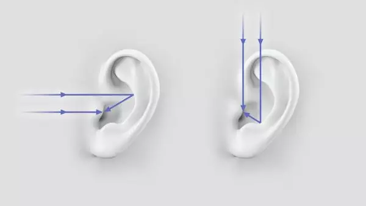
我们可以通过上图看到人耳的耳廓在接收不同方向的音源时，会让声波以不同的路径传导至内耳。这样，不同方向的声波传输到内耳的时候，音色就会由于耳廓的形状而产生各向异性。除此之外，由于我们有两个耳朵，所以音源在不同方向时声波到达耳朵的时间也会不同，这一点我们可以结合下图来理解一下
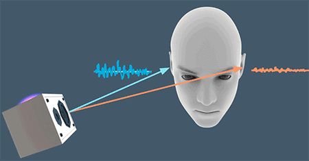
其实很简单，如果音源在你的左侧，那么左耳会先接收到声波；相反如果音源在右侧，右耳会先收到声音。同时由于人的头部也会对声音的传播产生影响，如果音源在左侧，那么声波需要越过头部这个“障碍”才能传递到右耳，那么相对于左耳，音色和能量可能都会有所衰减。这其实就是空间音频里常说的“双耳效应”，即依靠双耳间的音量差、时间差和音色差来判别声音方位的效应

### 距离感和空间感

距离感，给人的第一感觉是：如果这个声音的音量小，那么一定是因为它离我们比较远，而声音大则是距离近

而实际上声音的大小是相对的，比如可以音源离你很近但却只是低声细语，或者离得很远但用一个功率比较大的音箱，大声播放。所以用音量本身来判断声音的距离是不够的。实际上我们人耳对距离的感知是相对的。比如声音播放时音量由小变大，我们会感觉声音在靠近。或者同时播放两个吉他的声音，你会感觉声音小的是在远一些的位置

出了音量之外，还由于声波在空气传播中会产生衰减。而其中高频的声音衰减块、低频的衰减慢。那么同一个音量的声音，如果高频比较多，我们会觉得它离你更近一些。如下图所示，低频的声音可以传播得更远，而 8kHz 以上的声音如果超过 1 千米就很难被听到了
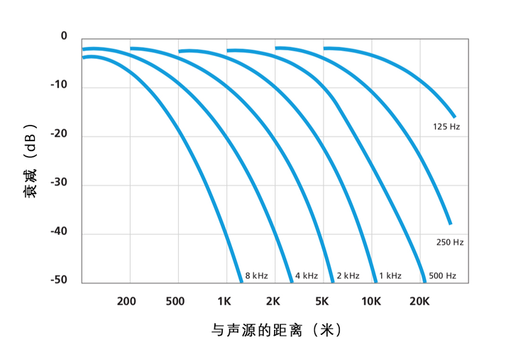
出了方向和距离，在之前讲回声消除的时候我们提到过混响的概念。其实混响也是我们感知声场空间大小的重要一环。简单地说，大房间的混响持续时间长，而小房间的混响持续时间短。我们能通过声音的混响来感知所在空间的大小。当然混响还和房间墙壁的材料、形状以及房间中障碍物的情况有关，所以我们对空间的感知相比方向和距离没有那么准确

### 空间音频的采集

1.  入耳式麦克风于人工头

    很显然想要把人耳听到的声音完整的保留，我们可以采用入耳式麦克风，直接把左右耳道接收到的音频给录下来。或者如下图所示，可以使用人工头的方式，通过仿生模型，构造人头和耳廓、耳道等部位，然后通过人工头上的人工耳中内置的麦克风来采集空间音频
    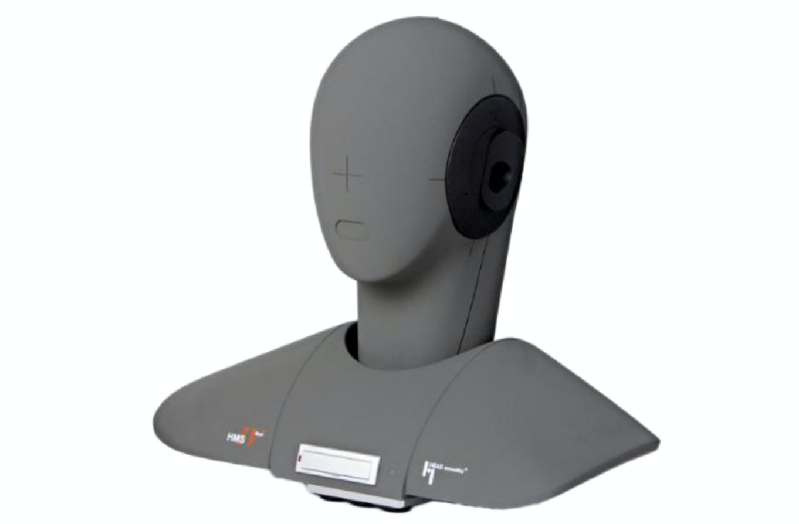
    入耳式麦克风和人工头采集的区别其实也显而易见的。如果你用入耳式麦克风采集的音频再用入耳式耳机播放，那么基本上可以做到完美还原。而如果是用人工头录制，那么由于耳廓的形状、头的形状等都和你自己有所不同，所以虽然可以做到很大程度上的空间还原，但和你自己实际到场景中去听，还是有一些差别的
    
    在实际使用中，每个人的耳朵、头的形状都不一样，但大体的形状和位置是相同的。所以利用人工头做音频录制在很多影视和游戏音频制作中会经常用到

2.  Ambisonics

    但拿人工头或者入耳式麦克风采集到的音频都还只是固定方向的立体声还原，且只能还原采集时人头朝向的声音。如果想把整个空间的声场都录下来，从而在回放的时候，你可以转动自己的头聆听任意方向的声音，那么就需要另一套叫做高保真立体声像复制（Ambisonics）的技术
    
    高保真度立体声像复制源于 20 世纪 70 年代牛津大学的一个三维空间声场重构技术研究。技术的核心是将远端中能听到的声音通过特制的麦克风录制，比如一阶 Ambisonics 麦克风（由四个完全相同的麦克风单元构成一个立方体阵列）的方式复制下来，我在下图展示了几个常见的一阶 Ambisonic 麦克风
    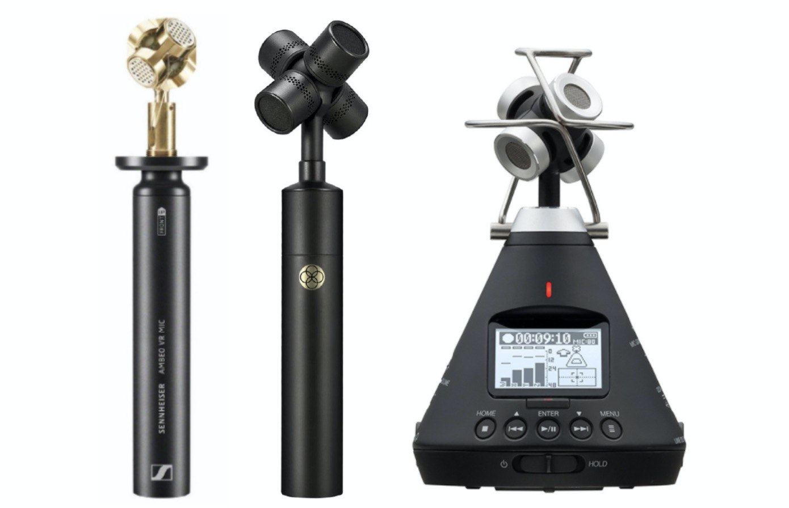
    这里由一阶 Ambisonic 麦克风采集的原始数据我们叫 A-format，是无法直接播放的，需要按照多通道转码格式先转为 4 通道的 B-format。4 通道的 B-format 也叫作一阶 B-format。其中的四个通道分别称为 W、X、Y 和 Z。简单一点来理解，这四个方向分别代表了一个球形声场的中心、左右、前后和上下。B-format 的数据就可以用软件渲染成人意播放设备支持的格式，比如立体声、2.1、5.1 甚至 7.1
    
    低阶的 Ambisonics 麦克风可以还原一个比较小的声场，而如果是飞机场、大型演唱会等场景，则可能需要一个如下图所示的高阶的 Ambisonic 麦克风。我们可以看到阶数越多需要的麦克风的个数也就越多
    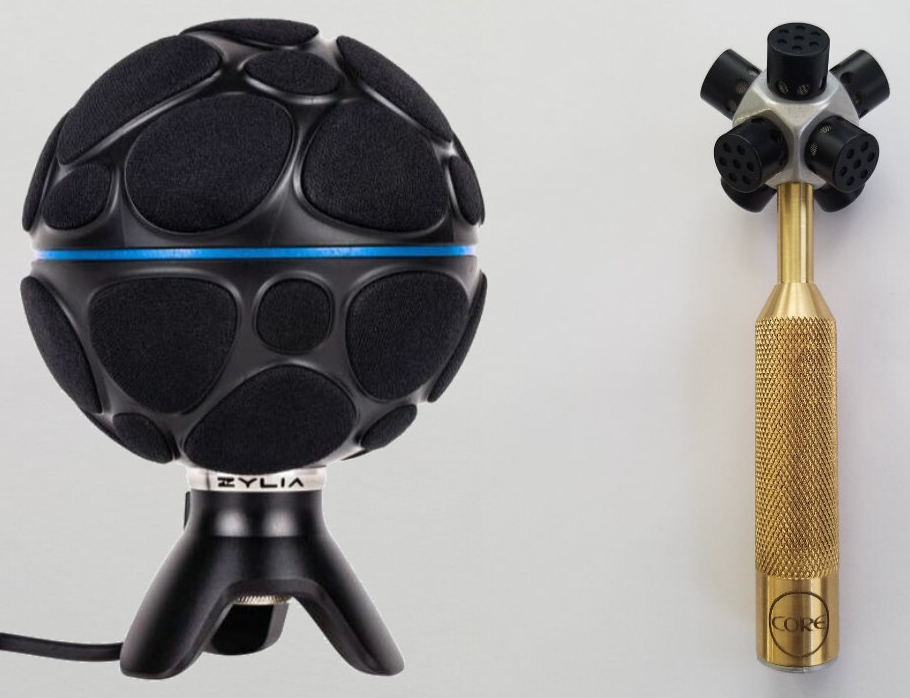
    Ambisonics 技术在 AR、VR 等需要转动视角的场景里可以很好地还原整个声场的听感，所以被广泛应用

### 空间音频的播放

空间音频最常用的方式就是使用耳机播放。在空间音频的原理部分我们说过，要想感受空间音频最少需要一个双声道的音频播放，来让左右耳感知音量、音色、时间延迟等差异，从而形成空间感。同时，由于耳机的播放单元离人耳比较近，无需引入额外的声波传递带来听感的变化。所以用耳机来还原空间音频相对比较准确

但是耳机由于受限于结构和功率的限制，在低音部分的表现可能就不如音箱来得“震撼”。而且如果需要同时给多人播放体验空间音频，多声道的音箱系统会是我们的另一条可选的播放途径。多通道音箱系统的渲染格式经过多年的发展已经比较标准化了。常见的多通道音箱系统由 2.0、2.1、5.1、5.1.2、7.1、7.1.2 等等。那么它们分别代表什么含义呢？

其实这里我们可以把数字分成 A.B.C 三个部分。其中，A 代表由多少个环绕声扬声器（前置、中置和环绕）的数量；B 表示由多少个超低音音箱；C 代表顶部或向上发声扬声器的数量

举个例子，如下图所示，这是一个 Dolby 7.1.4 声道的全景音箱系统。其中环绕扬声器是其中长方体表示的左前、中置、右前、左、右、左后、右后共 7 个环绕扬声器。超低音音箱是左上方的正方形，它一般都是用于增强 200Hz 以下的超低频率的声音并且由于低频部分的声波波长较长，在房间内左右的感知不明显，所以方位上来说只需要放在房间中的任何位置即可。而在顶部的扬声器一般在听音位置也是如下图沙发上方均匀排布（黑色圆形），用于提供来自上方的声音渲染
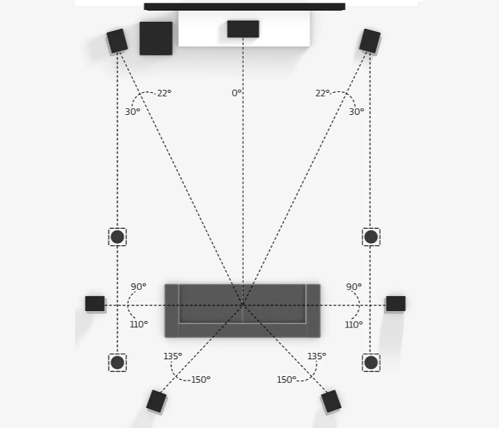
我们可以看到，不同的声音借由各个扬声器的位置和播放渲染可以实现比较好的声场还原。但是这种传统的家庭影院的布局并不能完美地还原声场。比如来自下方的声音就不能清晰重现，并且听音者只能在相对固定的位置（比如沙发）上才能获得正确的听感。所以这样的家庭影院看看电影还是不错的，但是玩一些 VR 游戏之类的就会显得声场渲染不足。

其实在普通的电影院也只是这种家庭影院的扩展，只是多一些环绕音箱让声音分辨力更强等等。从原理上来说音箱分布得越多、越密集，对声场得还原就越好。但显然这样所需的成本是巨大的，这其实也是多声道影院系统推出这么多年，推广一直受限的主要原因

我们在使用蓝牙耳机来听空间音频的时候，为什么有的时候会失去空间感呢？这里提示一下蓝牙耳机有很多协议，其中有的是单向高保真音频协议，例如 A2DP、LDAC 等；有的是双向低保真音频协议，例如 HFP（Hands-Free Profile）或 HSP（HeadSet Profile）

## 如何利用 HRTF 实现听音辨位

在空间音频的应用里最常见的一种就是“听音辨位”。比如在很多射击游戏中，我们能够通过耳机中目标的脚步、枪声等信息来判断目标的方向

这节课我们就来看看，我们如何利用 HRTF（Head Related Transfer Functions）头相关传递函数来实现“听音辨位”的

### HRTF 简介

空间中音源的声波从不同的方向传播到左右耳的路径不同，所以音量、音色、延迟在左右耳会产生不同的变化

其实这些声波变化的过程就是我们说的声波的空间传递函数，我们在讲回声消除的时候就是通过计算回声的空间传递函数来做回声信号估计的

那么如果我们预先把空间中不同位置声源的空间传递函数都测量并记录下来，然后利用这个空间传递函数，我们只需要有一个普通的单声道音频以及这个音源和听音者所在虚拟空间中的位置信息，就可以用预先采集好的空间传递函数来渲染出左右耳的声音，从而实现“听音辨位”的功能了

而这个和我们头部形状等信息相关的空间传递函数，也就是我们说的头部相关传递函数（HRTF）

让我们再想一下：音源的声波是如何传递到我们的双耳的？一部分声音没有受到房间的墙壁、地板或者障碍物的干扰，而是直接通过空气传播到我们的双耳，我们把这些直接到达我们耳朵的声音叫做直达声。还有一些声波，经过空间障碍物或者界面的多次反射最后传播到你的耳朵里，从而形成了空间中的折射声或者说混响。很显然，直达声和混响相加就是我们听到的所有的声音了

如果我们需要渲染一个真实的空间音频就需要渲染所有的直达声和混响

直达声和虚拟环境是没有关系的，而混响则和听音者以及音源所处环境的空间布局有关。比如你在一个小房间和荒野大漠中的混响显然是不同的，而且混响还会和音源、听音者以及环境的相对位置有关，比如你在房间的墙角和在房间中央的混响信号，经过的路径显然是不同的。因此直达声和混响我们通常要分开来处理

那接下来就让我们先来看看 HRTF 中和直达声渲染相关的 HRIR（Head Related Impulse Response），也就是头部相关冲击相应是如何做直达声渲染的

### HRIR 与直达声渲染

HRIR 其实就是预先采集的直达声到达双耳的空间传递函数。为了得到一个线性系统的传递函数，我们通常会用一个脉冲信号作为系统的输入，然后记录这个系统的输出信号。当我们做直达声渲染时，只需要将原始音频卷积对应方向位置的双耳冲击相应就可以得到一个直达声的空间立体声了

那么我们是如何采集 HRIR 的呢？

为了排除混响只录制 HRIR，我们需要在全消实验室录制 HRIR。下图就是一个在全消实验室录制 HRIR 的示意图。在下图我们看到，全消实验室的墙壁上有很多吸音尖劈，这些材料可以有效地吸收声波，所以在全消实验室里墙壁是不会产生混响的
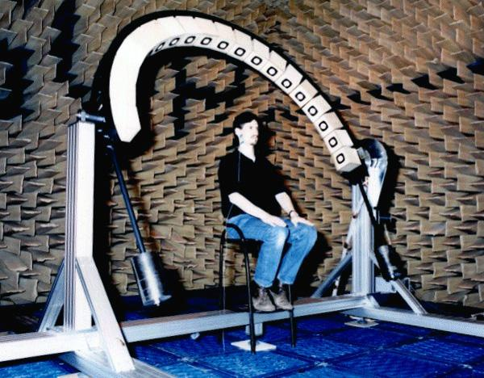
在采集 HRIR 时，真人采集就是让人带上入耳式麦克风，然后让扬声器（白色的一圈）在一个球面的不同位置播放脉冲信号。这样入耳式麦克风采集到的就是空间中各个角度的 HRIR 了。这里的扬声器是一个半弧形阵列，测完一个半弧形后可以改变俯仰角再测一组，直至把所有角度都测完

当我们把所有方向的数据都采集完毕后，就可以得到一个球形的数据集。下图就是一个球形 HRIR 的坐标示意图。我们可以看到下图中央是人头所在的位置，周围的红点就是 HRIR 采集时音源的方位
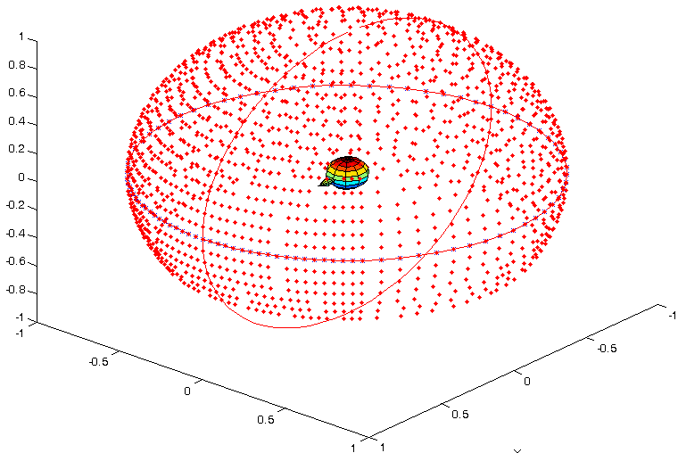
当然让一个真人一动不动地测完全套可以得到比较准确的数据，但是这一整套流程下来时间还是很长的。所以为了方便采集，也可以采用同样的方法，使用人工头来采集 HRIR，比如下图就是一个利用人工头来采集  HRIR 的例子。人工头上的耳廓可以更换，这样就可以实现可定制耳廓的 HRIR 的采集
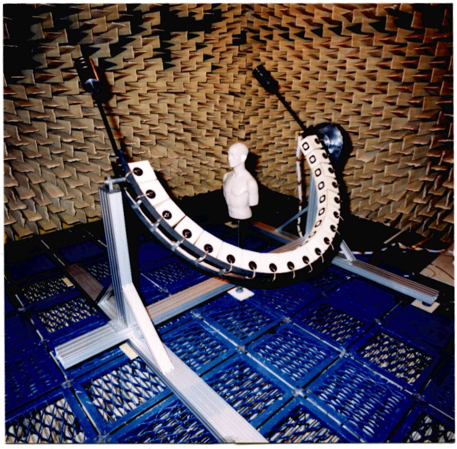
通过采集到的 HRIR，我们就可以把单通道的音频分别和某个角度的双耳 HRIR 做卷积，从而渲染出特定方向的声音。你可能会有疑问，人的耳朵外形轮廓有的不太一样，这会不会影响空间音频的效果呢？

确实每个人的头部形状可能不尽相同，如果你用别人的 HRIR 来做空间音频的渲染可能没有你自己平时听得那么自然。从实际使用的结果上来看，非定制化的 HRIR 渲染出的音频在角度的判断上差异不是很大，但是渲染后的音色可能会有一些细微的不同。但目前定制化的 HRIR 成本还是比较昂贵的，也许在未来人们都进入“元宇宙”，这种定制化的增强听感的需求会催生出一些新的更便宜且准确的定制化方案

现在你知道 HRIR 是怎么采集的了，我再分享几个开源的 HRIR 的数据集。如果你有兴趣可以拿去试一试。一个是 [MIT 的人工头数据集](http://sofacoustics.org/data/database/mit/)，一个是 [CIPIC的真人数据集](http://sofacoustics.org/data/database/cipic/)

### RIR 与反射声渲染

反射声或者说混响和空间环境、音源位置、听音者位置都是绑定在一起的。所以如果采用和人工头相似的方法去采集房间冲击响应（RIR），那么理论上一个房间内音源位置和听音位置的组合可以说是无限多的

并且就算可以用离散的方式采集一个房间内所有音源位置和听音位置的冲击响应，但是在虚拟环境里房间的形状、大小可以说是千变万化的，不可能每个都采用采样混响的方式来渲染

在实际使用中，其实混响的作用不是提供准确的方位感而是提供空间大小，或者说听音者所处环境的感知。实际上根据镜像原理（如下图所示）一个真实声源的声波在经过界面反射后传到听音者的耳中可以等效成一个镜像声源的直达声
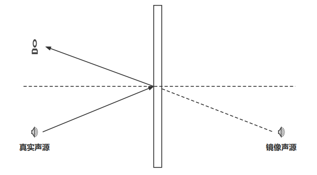
假设我们在一个长方体的房间里唱歌（如下图所示）。那么我们发出的声音经过 6 个界面的多次反射会形成多个镜像声源。所以其实混响会让对声源位置的判断变得更模糊，但是由于直达声一般来说会比经过反射的混响的音量大一些，所以在一般的房间内不至于让你的听音失去方向感
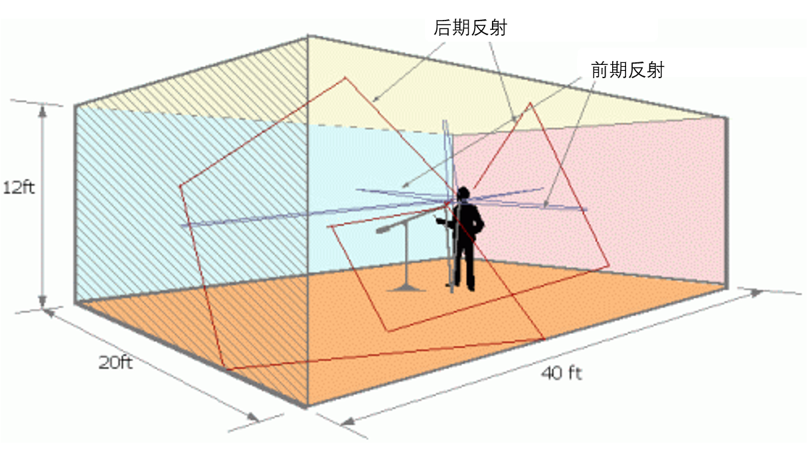
这里值得注意的是，反射声大致可以分为前期反射和后期反射。我们一般把前 50ms 的反射叫做前期反射，超过 50ms 的叫做后期反射。一般来说前期反射对我们语音的可懂度是有提升效果的，而后期反射太多则会让声音变浑浊，从而降低语音的可懂度

这里讲的镜像原理其实也就是生成 RIR 的一种方法。这里我分享一个基于镜像法的 [房间冲击响应的生成器](https://github.com/ehabets/RIR-Generator)

其实镜像法的原理就是给定房间界面的大小、界面的反射吸音系数、空气衰减系数、再通过镜像法建模得到房间中任意位置音源和听音者位置组合的房间冲击响应。用得到的冲击响应和原始音频做卷积就可以做混响的渲染了

在实际使用空间音频的时候，尤其是实时空间音频的渲染时，还有很多需要注意的地方，这里我罗列了几个常见的问题：

1.  如果我们想要用 RIR 给声音增加混响，那么我们原始的声音得是“干声”，也就是原始音频不能有混响。这一点是比较苛刻的。如果在普通的房间录制的声音，比如客厅或者卧室，其实都已经有 200ms 到 1s 左右的混响了。再卷积一个 RIR 那么得到的混响可能比预期的更为浑浊，混响时间也更长一些
2.  如果音源位置或者听音者位置是移动的，也就是说需要实时生成 RIR 来对混响进行建模，但镜像法生成混响，尤其在混响时间比较长的时候算力是比较大的。我们有的时候得做出取舍，比如一个房间就使用一个固定的预设 RIR 来避免算力无法实时计算。这也是很多游戏体验中混响在一个房间内都是一样的原因
3.  真实的不一定是好听的，在歌曲制作时我们经常会使用一些人工混响效果器来代替真实混响，或者采集一些比较好的固定混响的样本，比如用“维也纳金色大厅”的混响 RIR 来进行混响的渲染

### 小结

在实时交互的场景里，空间音频渲染时计算的实时性是很重要的。这里说的卷积和前面回声消除里讲的自适应滤波器一样，都是可以用频域卷积来加速的，比如采样率是 48kHz 的音频。如果需要和超过 64 点以上的卷积核做卷积，那么用频域卷积会快于时域卷积

## 音效三剑客：变调、均衡器、混响

为了实现某种特定的效果，音效算法的种类有很多，这里我主要介绍三种常见的音效算法：变调、均衡器和混响的设计和使用方法

### 变调

音调和基频是直接相关的，要变调其实就是要改变基频。而基频的本质是一个信号的循环周期的倒数，比如基频是 250Hz，那么当前时间的语音信号就是以 4ms 为周期的信号。我们要变调，其实就是把这个循环周期进行扩大或者缩小

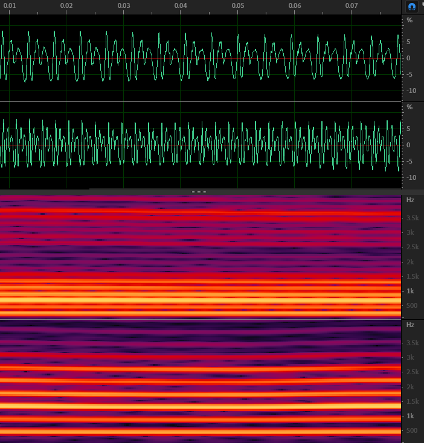

如上图所示，如果我们把语音信号的基频提升一倍，或者说提升一个八度或者 12 个半音，那么时域信号（绿线部分，上面为变调前，下面为变调后）语音的波形还是很相似的，只是每一个周期都缩短了一半

再看看频域信号（红色部分）是不是变得更稀疏了？最下面的那根亮线代表的基频从 250Hz 左右提升到了大约 500Hz 的位置。由于谐波的频率是基频的倍数，所以谐波之间的间隔也变大了

那么我们是如何实现音调提升的呢？

其实方法很简单，就是把原来的信号进行重采样，但不改变播放信号的采样率。简单来说，比如把原来的 20ms 的音频每两个点取一个点，然后按照相同的采样率进行播放，这样 10ms 内需要播放原来 20ms 的内容。这样一来，原本的信号循环时间周期就变成了二分之一，从而实现了升调

但这里有个问题，因为每一段时间内需要播放的音频信号的采样点是固定的。也就是说，通过下采样的方法，音频从原来的 20ms 缩短成了 10ms。直观的感受就是这个人的音调变高了，但说话的语速也变快了，也就是变速又变调

但我们想实现的变声只是改变音调，也就是所谓的“变调不变速“。其实，实现的方法也很简单，核心思想就是通过把音频中的信号按照一定的规律拼接起来，把音频的长度拉长或者缩短，这就是我们要讲的第一种变调算法 OLA（Overlap-and-Add）

其实 OLA 的思想和 STFT 中的 Overlap 的思想很相似

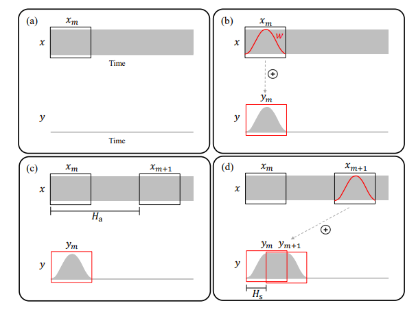

如上图所示，x 为输入信号、y 为输出信号。OLA 的过程按照下图中 b、c、d 的顺序：取一帧 $ x_ {m} $，选择间隔长度 $ H_ {a} $的下一帧 $ x_ {m+1} $，然后把这两帧加窗（汉宁窗）后，以步长 $ H_ {s} $ 把两帧重叠、相加在一起。很显然 $ H_ {a} $ 和 $ H_ {s} $的比值就是原始信号和输出信号长度的比值。这样我们就可以把原始音频拼接成不同长度的音频了，然后再经过重采样把音频恢复成和原始音频相同长度的音频再播放，这样就实现了变速不变调

有趣的是，如果不进行重采样直接播放，由于拼接起来的音频没有改变原始语音的基频周期，只是改变了音频的长短，这就实现了我们弱网对抗中用的“变速不变调“的算法

但是采样这种 Overlap 的方式虽然可以防止连接处的信号产生跳变，但不能保证每一个窗内覆盖的信号都处于周期中的相同相位，或者说两个窗内信号周期的起始位置不相同。这就会导致我们常说的“相位失真”

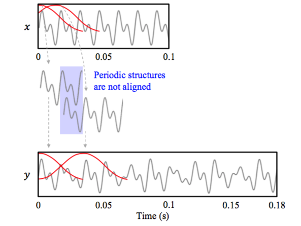

如下图所示，拼接的信号会出现时高时低的现象。所以如果我们能实时的根据信号本身的自相关属性，也就是把信号中相似的两段直接拼接在一起，这样就不会有相位的问题了。基于这样的思想，于是就有了波形相似叠加 WSOLA（Waveform similarity Overlap-Add）算法

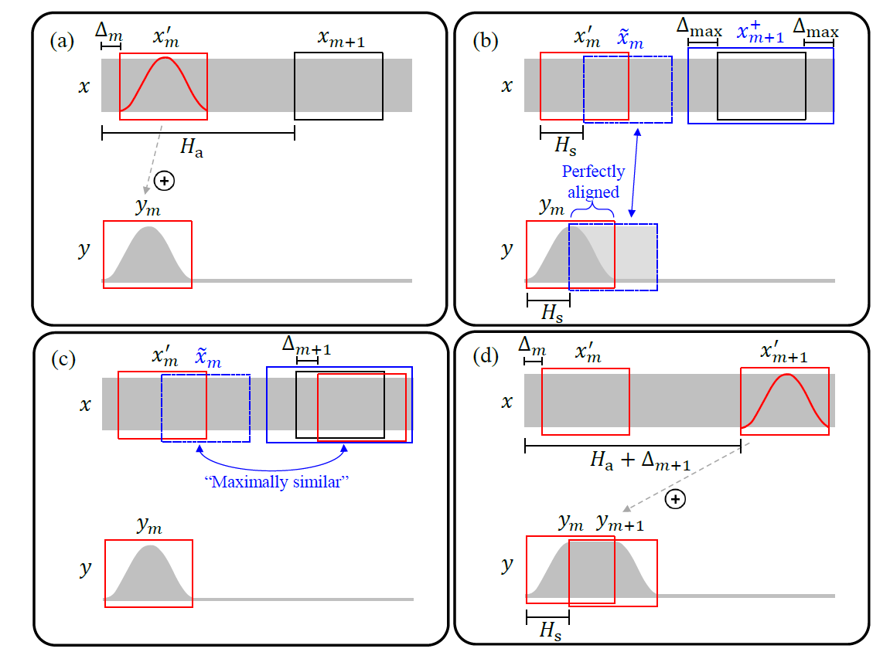

WSOLA 算法的计算步骤如上图所示，其实相比于 OLA，WSOLA 会再 $ x_ {m+1} $帧的附近寻找和输入信号中如果也移动步长 $ H_ {s} $的信号 $ \\tilde{x}_ {m} $相似度最高的一段 $ x^{\\prime}_ {m+1} $来做拼接

根据相似性原理，其实 WSOLA 合成出来的变调杂音基本已经没有了，WebRTC 中的快慢放用的就是 WSOLA。但 WSOLA 算法在实时变调中有一个问题，那就是每一帧出现的位置由于需要相似性搜索，所以需要更多的未来帧的信息，也就是说，需要引入更多的延迟

在时域变调的算法中还有一种 [PSOLA](http://articles.ircam.fr/textes/Schnell00a/index.pdf)（Pitch Synchronous Overlap and Add），顾名思义需要先计算 pitch，然后根据基音周期来改变 Overlap 的大小，这样就直接实现了变调。但是基频检测的鲁棒性没有 WSOLA 的相似性搜索高，所以 PSOLAde 的生成可能会出现不稳定的情况，你有兴趣看的话可以根据 [链接](http://articles.ircam.fr/textes/Schnell00a/index.pdf) 自行了解一下

其实变调算法除了在时域上做拼接，还可以在频域上实现，比如常见的 LSEE-MSTFTM、Phase Vocoder 等算法

我们看到 WSOLA 等方法通过相似性来寻找拼接对象，但是相似性说到底是通过计算两段时域信号的 MSE（mean squared error）取最小值来得到的，这种方法能尽量保持低频相位的连续性，但高频信号的相位差异可能不能确保一致

其中 Phase Vocoder 利用 STFT 中提供的相位信息，在变调扩展的同时会对每个傅里叶频点做相位修正，生成出的音质会比较高，所以在实时变调中常被使用。有兴趣的话，你可以查看 [文献](https://www.jstor.org/stable/3680093) 了解一下

理解了变调，我们就可以通过算法来改变音频的音调了。比如电影《小黄人大眼萌》中“小黄人”的声音，就是通过变调算法把原本男声的音调提高来实现的

那么电影《绿巨人》中浩克的那种低沉、怪异的音色又是怎么实现的呢？

### 均衡器

我们知道每个人都有自己独特的音色，比如有的人声音比较低沉，有的人声音比较清脆。其实对这些音色的感知主要是由于人们在发音时，频谱中不同频段的能量分布不同而导致的

比如声音低沉的人，可能低频分量比较低，而唱高音、音色饱满的人可能高频的能量也能保持得比较多。而其中最直接的可以改变音色，或者说改变声音在不同频率的能量分布的方法就是 EQ，也就是均衡器（Equalizer）

其实均衡器就是一组滤波器，比如常见的高通、低通、带通、带阻等形式。这些可能你之前在大学里的数字信号处理课程里学过。看字面意思应该就可以理解，高通、低通和带通就是让高频、低频或者某个频带的音频保留，而其他的频带都加以消弱，而带阻就是消弱某个频带的音频能量。比如我们觉得人声中齿音太多，想要去齿音，可以在 10kHz～14kHz 左右加一个带通滤波器，消弱一下这部分的能量

音频滤波器有很多种，比如常用的 FIR（Finite Impulse Response）和 IIR（ Infinite Impulse Response）Filter。如何根据你想要的频段和增益来设计 FIR 和 IIR 滤波器，其实早已编入了教材，不是信号处理专业的同学可以参考《数字信号处理》这本书

当然 EQ 的处理经过多年的发展已经有很多通用的滤波器可以选用了，比如椭圆、切比雪夫、巴特沃斯和贝塞尔滤波器等等。如果你想快速实现一个滤波器看看效果也可以直接使用 Matlab 中的 [滤波器设计 toolbox](https://ww2.mathworks.cn/help/signal/filter-design.html?s_tid=CRUX_lftnav) 来加速实现进程

如果不想自己编程实现，也可以利用一些音频处理软件来进行可视化的处理。比如在 Adobe Audition 中，我们可以看到各种常见的 EQ 均衡器。如下图所示，由上到下依次为 FFT 滤波器、图形均衡器以及科学滤波器。我们在离线自己做一些音频处理时，可以选择其中的一个或多个串行使用

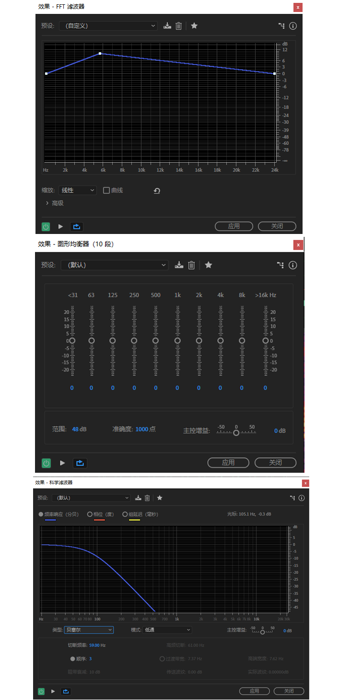

### 混响

我们知道可以通过采样的方式活着镜像法得到房间的混响 RIR，这样得到的混响叫做采样混响。采样混响真实，但是不一定好听，并且 RIR 需要和音频信号做卷积才能得到混响信号。当混响时间很长的时候需要的算力也是巨大的。在音乐制作时，为了营造更好的听感经常会使用一些人工混响效果器来产生混响，在实时音效里也可能因为要节省算力而采用人工混响效果器的方式来生成混响

简单地理解，混响信号可以看作是直达声和许多逐步衰减、不断延迟的回声信号叠加而成的。假设一个衰减系数 a 和延迟 D，那么混响信号 y(n) 可以用下面的等比数列来表示：

$ y(n) = x(n) + ax(n - D) + a^{2} x(n - 2D) + \\cdots $

其中 x(n) 是输入信号，D 为回声的延迟。而这种形式正是梳状滤波器的形式。如下图所示，所谓梳状滤波器，其实就是因为它的频率响应呈一个梳子的形状。梳状滤波常被用来消除某些不需要的谐波，但这里主要是利用了它的拖尾效应

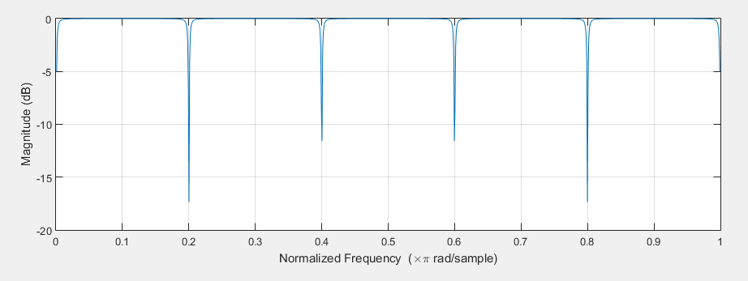

梳状滤波器的频谱曲线不平坦，呈现明显的梳状效应。从而对不同的频率分幅度会产生波动，导致梳状滤波器的拖尾声音带有很强的金属染色效应。而且回声只在延迟为 D 和 D 的倍数的时候出现，这就显得过于稀疏了。所以在梳状滤波器的基础上 Schroeder 使用多个梳状滤波器来解决混响不够密集的问题，然后用全通滤波器（Allpass filter）来消除金属声

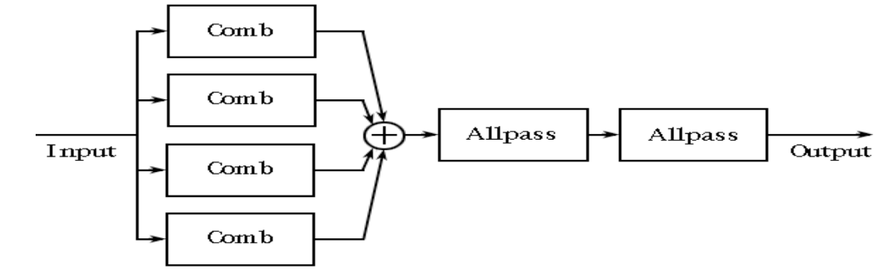

上图是 Schroeder 混响模型的结构图，其中每个 Comb 代表一个梳状滤波器。但 Schroeder 依靠全通滤波器生成的混响依旧不够密集

后续 Moorer 又对 Schroeder 模型进行了改良，把混响的生成拆成了直达声、早期混响、晚期混响这三个部分。加入了 FIR 模块来模拟早期混响，用 6 个梳状滤波器和一个全通滤波器来模拟晚期混响，并可以控制各部分的增益。有兴趣的话，你可以通过 [链接](http://freeverb3vst.osdn.jp/doc/Elec407-HybridReverb.pdf) 了解一下

其实 Moorer 模型之后，人们会用各种方式来对混响模型进行改造，现在的混响生成器基本上也都是开放出很多参数，可调节的混响效果器了。比如混血的初始延迟、干湿比、混响 RT60 时间等。这里介绍一个 [Freeverb3](http://www.nongnu.org/freeverb3/) 开源库，这里有很多基于不同算法的混响效果器实现方法，你可以根据自己的需求了解一下里面的内容

[链接](https://www.agora.io/cn/audio-demo) 里有声网研发的各种声音效果

### 思考题

绿巨人的音效，需要把原来的声音进行降调，比如降八度，然后可以使用 10 段均衡器，绿巨人的均衡器参数如下图所示，然后再加一个小房间的混响就可以实现了。你可以用 Audition 的效果模块自己试着调一调

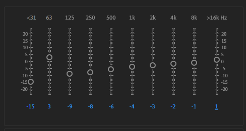

## 音频技术漫谈之好声音是怎么炼成的？

### 什么是高音质？

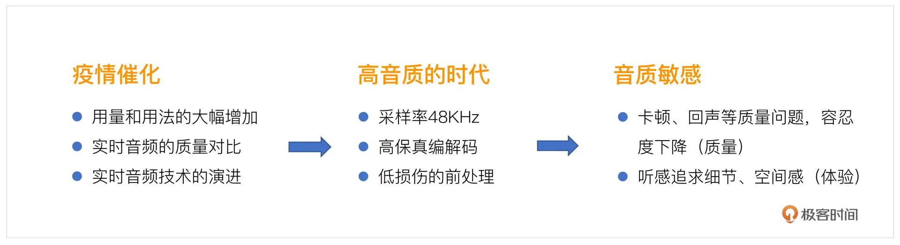

在实时领域，首先要满足采样率足够高这一条件，要达到 48kHz。简单来说，你能听到的大部分声音都能进行采样，这样就不会有频带上的损失

另一方面，我们现在所使用的一些编解码器能够做到高保真，在 4G、5G 这样普遍存在的情况下，我们可以使用码率较高的音频编解码器，使音频不会因为编解码导致衰减

在音乐场景，对降噪、回声消除我们就会做一些低损伤的前处理，尽量使音频保真

在高音质的情况下，我们对卡顿、回声这样的质量问题容忍度会下降，然后在听感上也会追求一些细节

### 什么是实时美声？

能不能让我们的声音更好听呢？比如在录制一首歌曲的时候，就会有调音师帮忙调音，跑调的时候是不是就可以修正一下，喷麦、齿音不好的地方也会被修正

实时美声可以让你的声音更好听、更动听。比如，在实时互动场景中美声，就好比你在实时美颜，如果你的美颜有一些偏差，就会暴露自己的本来面貌。实时美声也是这样，为了满足实时性以及设备低功耗的要求，在算法设计上我们要考虑设备是不是能把这样的算法跑起来，以及算法带来的额外的延迟会不会导致交流的不顺畅等

实时美声需要做哪些工作？我把它称之为实时美声设计的三驾马车。这里涉及的东西会比较多，我在专栏中有做一些知识点的拆解，这里只起到一个先导作用

### 数据驱动

我们要客观定义一下什么样的声音是好声音

首先我会去网上找一找相关信息，看看大家觉得什么样的人唱歌是好听的，或者什么样的人的声音是好听的，寻找一些这样的标签。还可以去找一找不同的性别，比如男声、女声分别有什么样的声音是好听的，去找一下相对应的形容词，再给形容词做一个分类。比如，你可能听说，这样的男声非常有磁性，或者这个男人说话十分的稳重，女生可能就说这个人说话很温柔或者比较有活力，这样的形容词就是标签

在标签的指引下，就会有萝莉音、御姐音这样的分类。加之近些年配音技术的不断成熟，大家对这些名词都很敏感。那像音色方面，可能就会说这个人的音色是比较高亢的、圆润的，其实这些也是标签

那么出了音色、年龄、性别分类以外，环境也会对声音产生影响。比如某些空间的混响，你在 KTV 唱歌和家里就不一样。再比如演讲会的音乐大厅，这些是专门为大规模的管弦乐或交响乐去做的空间，这种声音很需要空间感的塑造，所以混响也是可以划分为一类的

从玩法上来说，声音可以是正常的好听，也可以增加一些好玩的元素。比如用一些电音、自动修音甚至变声，把声音做一些整体的变换，这些都是从玩法上使声音更加好听的一些方向

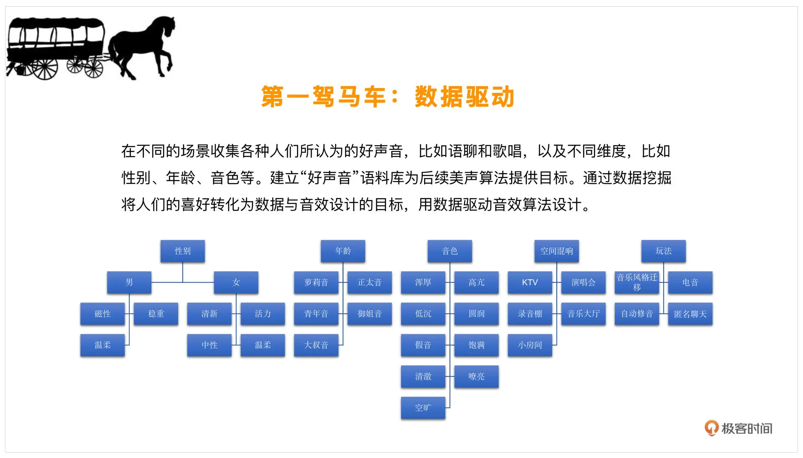

有了这样的一堆标签，我们就可以去网上找一些对应的目标，然后把这些声音下载下来，看看能不能收集一些这样的音乐素材。如果你身边恰好有这样的声音，也可以录制一下，分析一下他们有什么样的特点。从客观上来说，主要是年龄、性别、风格等等，主观上就是上述标签了。我们可以按照主观、客观这样的大分类来进行数据收集

### 理论支持

有了这样一些数据样本和数据分类，下一步就是寻找理论支持了

1.  覆盖的专业领域有很多

    像声学，这个人的发音是不是好，就跟发音腔体有关。比如你的发音是不是足够浑厚，你嘴巴的开度是不是足够大，声音的响度如何，还有共振峰决定了发音的音色，基频决定了发音的音调，这些都是在发声时需要注意的一些方向。声学方面还有混响，刚才提到过，不同房间会有不同的混响
    
    这块就有很多的理论支持，我们可以提取响度是怎样的，基频是怎样的，混响是怎样的，这样你就可以对声音进行分析了
    
    另外一块是语言学，主要和韵律、乐理有关。韵律就是指一个人的抑扬顿挫，从指标上来说就是你的音调变化以及你声音响度的变化，有些重读、重音，或者说你这个字拉得特别长，这些像语速、动态调整、语调的变化就是韵律。还有就是音乐上好不好听，就是说你是不是按照正确唱歌的做法去做的，这就跟乐理有关了，比如你是不是在调上，人声和乐器是不是需要配合，不同的音乐风格也会有所不同
    
    还有像心理学这块，是指我们感知声音。其实声音发成什么样子，在我们心理上的感知又是不一样的，我们可以感知到这个声音是冷色调还是暖色调，是有一些情绪标签的。心理上又可以根据双耳效应来感知你这个声音发的位置，不同的声音它的延迟（比如左右耳）是不一样的，那么在心理上就会感觉粗这个位置的方向感也是不一样的。这是我们要在最后做的，让声音从心理上也觉得是好听的
    
    前面是在塑造你发声的器官是不是正确，空间感是不是正确。其中，语言学决定了你的抑扬顿挫是不是正确，乐理决定了你唱歌是不是正确，心理学决定了你听音是不是正确，甚至和你的播放设备也有关系
    
    这块给了我们很多数学的方式，或者说数学描述的特征，去多维度地分析好声音的一般规律
    
    举个例子，比如像男性磁性的声音，它其实呈海鸥状，在低频和高频的能量会比较高，中频能量较低，就像一个海鸥展翅的形状，这样的声音往往会表现出比较磁性的特征。再比如说一些温柔的声音，它的节奏就不会那么快，同时咬文嚼字可能也没有那么清楚，这个时候听上去就会比较温柔
    
    在有了这些理论支持之后，我们就可以看一下好声音具体是怎么划分的。以下是好声音的金字塔：

    

    首先，我们的好声音一定是分性别的，因为女声的好听和男声的好听其实是不一样的。金字塔的最底端是普通好听，比较明确，这个男女都一样，比如清晰、没有明显的缺陷，这个就是指咬字清楚，没有明显的录音设备导致的缺陷，几乎每个人都能做到
    
    再往上就需要一些技巧在里面了。像温柔的声音，它的 pitch（音调）变化会比较小，抖动会比较少，停顿会比较多。像一些有活力的声音，男女会各有不同，男的可能稳重点你会觉得好听，但是女生的话，如果你觉得一个女生说话比较磁性，那么不一定是在表扬她，可鞥她的声音会比较低沉或者沙哑，不一定是好的，所以男女还是要做分类
    
    再往上就会考验到我们了。假如你是一个配音演员，那你就会需要这层的技巧，普通人可能不一定能发出这样的声音。比如甜美的声音，各项数值会比较平均，但 pitch 变化范围却会比较大，像魅惑还会涉及到一些词语、语言方面的选择，会有更高的要求
    
    再往上就是专业的配音演员才能达到的层级了。他可以根据不同的场景、不同的情感变化，来自由切换自己的声线，这是最难的，普通人很难实现
    
    以上就是好声音的金字塔，你可以对照看看自己在哪一层。这里注意一点，这个金字塔只指你修炼的难易程度，也就是自身靠声学训练或者美声训练去做的难易程度，但实际上如果我们用算法去实现，根据不同的场景、情感去做自由切换，则只要有不同的模式可以自由选择就能实现了
    
    反过来说，算法实现不一定很难，只要有足够的理论支持就可以了

### 算法融合

在我们又了数据驱动 - 音频和标签，然后根据理论支持明确了好声音的特征之后（哪些特征是重要的筛选一下，我们把它叫做降维），就需要设计算法去调整声音的细节了

1.  调整的方式主要有这样两种

    第一种，理论模型。比如我们要去变调，让这个人发音的调性是正确的，就需要做一些修音，这个时候可以采用一些变调算法。然后你觉得混响空间不够贴合伴奏，比如伴奏是在维也纳金色大厅这种比较大一些的音乐会的混响氛围，而这个人唱歌的时候是在混响比较小的客厅，这时就要改变混响，假如一些混响模型。这种链路式的一个一个模块去改造，根据理论模型就可以实现了，我们也称之为“链路式的理论推导”
    
    第二种，端到端的改变。随着 AI 技术的发展，我们可以用一些 AI 的方法，自动提取这个人的风格，而不是提取这样一个一个的链路。比如我们可以做一些整体的变声，整体去改变一个人的音色、音调，以及发音的时长、规律等等。这就是用 AI 方法做端到端的调整，这样我们就可以一次性的把这些工作都完成了
    
    从场景上来说，还会有不同的应用，这里我大概介绍一下会有哪些常用的应用场景，结合以下这张图示一起看一下：

    

    语聊美声主要就是突出男女声不同的声音特点，美声和音效还是有所区别的。语聊美声和歌唱美声主要是在不改变你说话 ID 的情况下，让你的声音更好听。语聊美声会做些小的细微的调整，比如根据你正常的发音，看看有没有受到设备或者自身状态的影响，导致声音不够饱满，什么意思呢？比如你的高频的谐波有很多的缺失，就可以做一些谐波增强或者加一些 EQ 的调整，动态调整一下你的频率范围、频率响度，这里把你的高频提升一些声音就会更加好听。这就是语聊美声
    
    而歌唱美声则不太一样，它会在歌唱场景下有一个特点，你需要和唱歌、伴奏去融合，刚才提过的混响范围不一样可能就会导致唱歌不是那么好听
    
    音效主要是做一些风格转换，可以用于匿名聊天，这块就可以用一些变声的方法。除此之外还有环境的变换，比如虚拟立体声，我们大部分时候用到的都是单通道的声音，也就是指左右耳发出的声音是一样的，而立体声就是双通道的，通过把单通道变成多通道就可以体现出声音所在的方向感，也就是增强空间感
    
    那么场景音效，就可以有一些不同的空间场景发出的混响的改变，就像大家普通会觉得在浴室唱歌特别自信，就是因为加了混响。这和房间的大小、装修材料都是有关系的，都可以通过场景音效模拟实现
    
    美音主要对应音色，人的音色调整其实是最直观的，比如感冒期间你可能鼻音比较重，高音的部分由于你的鼻腔共鸣被限制就没有了，反而低音部分被加强了，这个时候利用美音把你的 EQ 或者整个平响做一些调整，你的声音就可以从一个感冒的状态变成正常说话的状态

## AI 变声：音频 AI 技术的集大成者

AI 技术在音频领域发展十分迅速。除了我们之前讲的降噪、回声消除以及丢包补偿等方向可以用 AI 模型来提升音质听感之外，AI 模型还有很多有趣的应用。其中比较常见的有 ASR（Automatic Speech Recognition）可以理解为语言转文字，TTS（Text To Speech）文字转语音和 VPR（Voice Print Recognition）声纹识别等

在之前讲音效算法的时候，我们知道，要做到变声需要改变整个语音信号的基频，还需要改变语音的音色。传统算法是通过目标语音和原始语音，计算出基频差距和频谱能量分布的差异等特征，从而实现变声（Voice Conversition，VC）

但这些特征的差异，在发不同的音，不同的语境中可能都是不一样的。如果用一个平均值来进行整体语言的调整，你可能会发现有的音变声效果比较贴近目标语音，而有的音，可能会有比较大的偏离。整体听感上就会觉得变声效果时好时坏

甚至由于某些发音在改变了频谱能量分布后，共振峰发生了较大改变，连原本想表达的变声效果，我们需要实时对语音做动态的调整，而这使用传统算法显然是无法穷尽所有发音、语境的对应变化关系的

你可能已经发现了，如下图所示，如果我们可以做到语音转文字，文字也可以转语音，那么结合声纹识别（VPR）把人声的特性加入到 TTS 之中，是不是就可以实现变声的功能了？

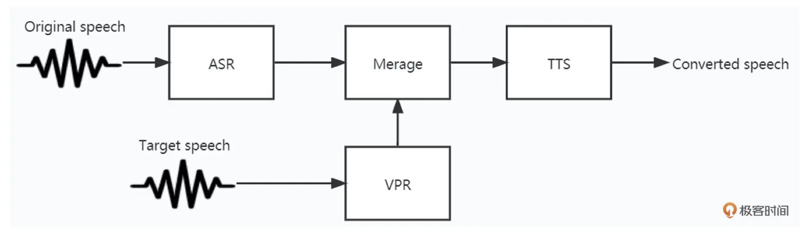

接下来我们就基于 AI 模型的变声算法的角度，来整体认识一下这些常见 AI 算法背后的原理，以及它们是如何组合、搭配实现变声功能的

### ASR

如下图，我们可以看一下 ASR 算法的级别原理

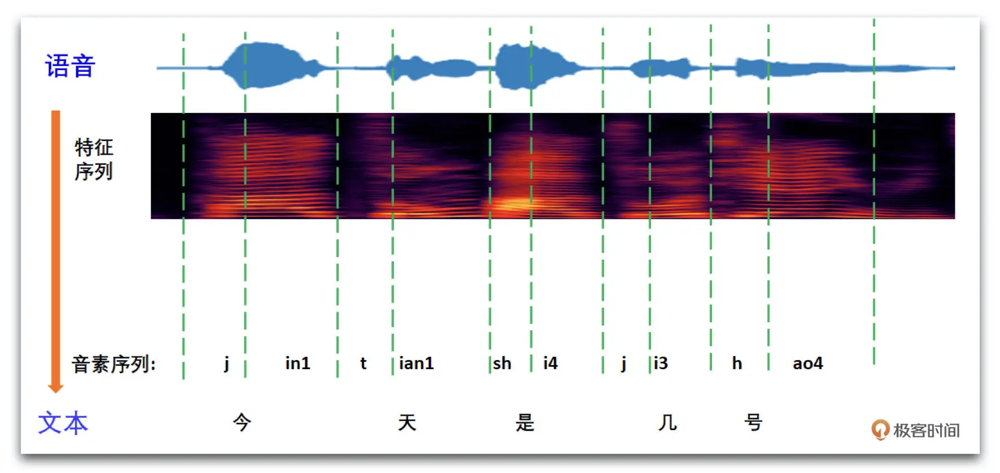

语音信号需要转换为频谱信号或者我们之前讲过的 MFCC 来作为语音特征序列。然后我们根据特征序列推断出对应的音素序列，音素在不同语言中有很多不同的表达形式，比如中文可以用汉语拼音来表示。最后根据音素和文字的映射字典（lexicon）就可以得到语言对应的文本了

ASR 在音频领域的研究一直都是比较火热的方向。目前在工业界，使用的最多的是基于 [Kaldi](https://github.com/kaldi-asr/kaldi) 开源框架的算法，有兴趣的话可以通过链接了解一下。Kaldi 模型以及其改进版本有很多，这里我主要介绍一下常见的 ASR 模型的构建方法

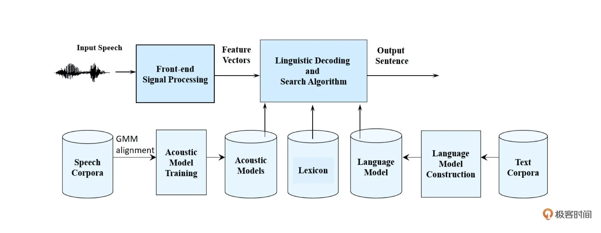

如上图所示，为了实现比较准确的 ASR 系统，我们需要构建两个主要的模型：声学模型（Acoustic Model）和语言模型（Language model）。然后通过语言解码器和搜索算法（Lingustic Decoding and search algorithm），结合声学模型和语言模型的结果，综合选择出概率最大的文字序列作为识别的输出。其中声学模型主要是通过语音数据库训练得到，而语言模型则主要是通过文本数据库训练得到

这里你可能会有疑问，为什么我们不能从音频的特征信息直接得到文字输出，而需要这么一套相对复杂的模型系统呢？

这是因为同音字、同音词、谐音、连读等发音特性，可能导致很多容易混淆的结果，从而同一段语音可能会得到多个备选的文字方案。比如上上图中根据音素序列可以得到“今天是几号”，也可能是“今天十几号”或者“晴天是几号”等。这时除了声学模型音素读取需要较高的准确性外，还需要语言模型根据上下文的语境来对 ASR 的结果进行修正

其实，最近这几年端到端的 ASR 的研究也有很多不错的进展。比如 [ESPNet 开源项目](https://github.com/espnet/espnet) 里就整合了许多基于 CTC、Transformer 等技术的端到端开源模型，有兴趣的同学可以通过链接自行了解一下

### TTS

好了，我们再来看看文字转语音（TTS）是如何实现的

其实语音合成作为 ASR 的逆过程，实现起来主要是先通过一个模型把文字转为语音的特征向量，比如 MFCC，或者基频、频谱包络、能量等特征组合的形式，然后再使用声码器（Vocoder）把语音特征转换为音频信号

那说到 TTS，就不得不提及 Google 发表的两篇重要论文，一个是 [WaveNet 声码器](https://arxiv.org/pdf/1609.03499.pdf)，另一个是 [声纹识别到多重声线语音合成的迁移学习](https://arxiv.org/abs/1806.04558)。其中 WaveNet 声码器首次把语音合成的音频结果提升到了和真人说话一样的自然度，而 VPR 结合 WaveNet 则是实现了端到端的文字到语音的生成。你可以在链接中找到这两篇论文

WaveNet 的基本思想是利用因果空洞卷积这种自回归的 AI 模型，来逐点实现音频时域 Wave 信号的生成。用通俗一点的话来说就是，WaveNet 是逐个采样点生成音频信号的，也就是说生成出的第 k 个点是第 k + 1 个点的输入。这种算法及其消耗算力，比如生成一秒 48kHz 采样的音频，需要循环调用 AI 模型计算 48000 次才能完成，但这样做得到的音频的效果自然度还是很不错的

为了缩减算力，同时保持模型生成的计算速度，人们后续对其做了一系列的改进。于是就有了后来的 Fast WaveNet、Parallel WaveNet、WaveRNN、WaveGlow 和 LPCNet 等

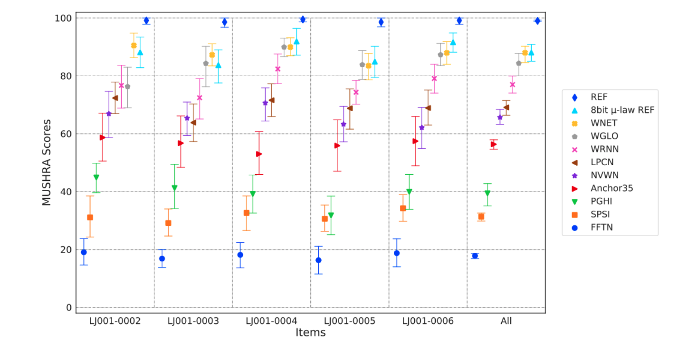

如上图所示，Fraunhoder IIS 和 International Audio Laboratories Eriangen 就曾联合发布过 [一篇回顾的论文](https://xueshu.baidu.com/usercenter/paper/show?paperid=3b94d755401ea9ace11884cf7bfeafbd)，注意分析了不同的 Vocoder 的 MUSHRA 评分

在实际使用中，为了追求效果，可以使用 WaveRNN 或者 WvveGLOW 这样效果比较好的模型。但这些模型在服务端部署还行，在移动端部署算力还是过大。移动端上 LPCNet 或者基于传统算法的 World Vocoder 是目前比较可行的 TTS 实现方法

好的，讲完声码器我们再看看多重声线语音合成的基本原理。如下图所示，要实现带有人意说话人音色的语音生成，需要依赖 3 个主要的模块，也就是 Speaker Encoder、Synthesizer 和 Vocoder 这三个模块

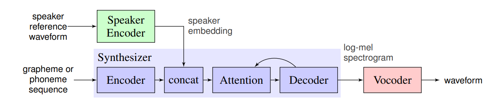

其中说话人的音色和发音习惯等声纹信息，可以通过一段事先准备好的说话人语料和一个 Speaker Encoder（说话人编码器）来提取。说话人编码器其实就是我们之前说的 VPR 声纹识别技术，常见的 VPR 技术有 I-vector、x-vector、GE2E、Deep Speaker、RawNet 等

VPR 主要目的就是把说话人的声音特点编码成固定长度的向量（SpeakerEmbeding）。好比我们一般用指纹来验证身份，而 VPR 得到的声纹也可以用于身份识别。所以 VPR 技术其实除了可以用于 TTS 和变声，也可以用于实现身份鉴定、声纹锁等功能

Synthesizer（合成器）则是通过音素和声纹信息合成出声码器所需的语谱特征。由于上图中使用的是 WaveNet 系列的 Vocoder，所以需要的是对数梅尔谱（log-mel spectrogram）作为声码器的输入。合成器也有一些现成的框架可以使用，比如 Google 的 Tacotron、微软的 Fastspeech 等。其实合成器的原理都大致相同，就是利用 AI 模型对音素序列进行编码，然后和声纹特征融合在一起，再通过 Decoder 模型得到声码器需要的输入特征

### VC

假如你想把自己的声音变成目标 A 的声音，只需要经过以下 6 个步骤：

1.  录制一段 A 的声音
2.  通过 VPR 得到一个 A 的声纹（Speaker Embeding）
3.  录制一段自己的声音
4.  用自己的声音通过 ASR 得到音素序列
5.  利用 TTS 的合成器把 A 的声纹和 ASR 得到的音素序列转换为声码器需要的特征
6.  利用声码器得到变声后的音频

实际上利用上面的技术，你只需要利用 VPR 提取任意目标的声音，就可以灵活地实现任意目标声音的转换。但要实现这么一整套 VC 系统，你需要同时实现 ASR、TTS 这两套可以说是音频领域最为复杂的 AI 模型。那和很多 AI 模型一样，你可能会想有没有什么办法可以实现端到端的变声呢？

答案是有的，尤其是基于 GAN（Generative Adversarial Networks）技术的变声模型，例如 [Cyclegan](https://paperswithcode.com/paper/maskcyclegan-vc-learning-non-parallel-voice)、[Stargan](https://paperswithcode.com/paper/stargan-vc-non-parallel-many-to-many-voice) 等模型，都在变声领域实现了端到端的变声方案，有兴趣的同学可以通过文稿中的链接了解一下

### 小结

相比于传统算法，基于 AI 模型的变声可以动态地根据发音的内容来对语音进行调整，从而实现更为自然且逼真的变声效果。基于 AI 的变声模型主要包括了三个模块：ASR、TTS 和 VPR

Kaldi 是目前最流行的 ASR 框架。而常见的端到端模型框架可以采用 ESPNet 等开源框架，在实际使用中，目前同等准确性和内容覆盖率的前提下，端到端模型和 Kaldi 框架比较起来算力会更大一些。而且端到端模型如果要针对某个场景做定制时，因为要重新训练模型，所以受到数据的限制可能会更大一些，所以端到端模型目前还没有得到大规模的使用

最后，变声技术把 ASR、TTS 和 VPR 技术融合起来，从而实现了高质量的变声系统。在实践中，目前这种基于 ASR、TTS 和 VPR 的变声系统，效果要优于传统音效算法和端到端的 AI 变声算法。但这套系统的算力、存储空间的复杂性还是很高的，在部署和成本方面仍然有很多挑战

# Tips

C++ 的喧哗？Bjarne Stroustrup 警告 C++ 的危险未来计划

<https://www.theregister.com/2018/06/18/bjarne_stroustrup_c_plus_plus/>

采访：2018年早期，Bjarne Stroustrup，C++ 的创造者，摩根斯坦利技术部门主任，哥伦比亚大学计算机科学访问教授，写了一封信邀请这些编程语言的演进监督来“Remember the Vasa!"

这里需要介绍一些 17 世纪的历史，Vasa 是瑞典国王要求建造的一艘强大的军舰，但它有一个设计缺陷：它太重了，以至于它被一阵风给吹翻了。通过讲述这艘翻了的船的故事，Stroustrup 对不断添加到 C++ 语言中的特性给出警告

已经提出了很多功能特性。Stroustrup 在他的信中称赞了 43 个提议。他主张这些参与 ISO 标准语言演进的，一组被称为 WG21，为提升语言工作但不是一起工作

在他的信中，他写道：

单独地看，很多提议都是有意义的。但是他们放在一起却对 C++ 的未来是有危害的

他清楚他不解释 Vasa 的命运意味着增加的改进魔咒。他把它作为构建坚固的基石的一课来学习经验和彻底地测试

在这个月初在瑞士 Rapperswil 的 C++ 标准委员会上最新的决定，Stroustrup 指出一些问题，主持人于是问他语言的下一步怎么走

# Share

现代 C++ 实战（吴咏炜） 笔记

## 性能测试的正确姿势：性能、时间和优化

### 意外的测试结果

假设你想测试一下，memset 究竟有没有性能优势。于是，你写下了下面这样的测试代码

    #include <cstdio>
    #include <string>
    #include <time.h>
    
    int main() {
        constexpr int LOOPS = 10000000;
        char buf[80];
        clock_t t1;
        clock_t t2;
    
        t1 = clock();
        for (int i = 0; i < LOOPS; ++i)
            memset(buf, 0, sizeof buf);
        t2 = clock();
        pirntf("%g\n", (t2 - t1) * 1.0 / CLOCK_PER_SEC);
    
        t1 = clock();
        for (int i = 0; i < LOOPS; ++i) {
            for (size_t j = 0; j < sizeof buf; ++j)
                buf[j] = 0;
        }
        t2 = clock();
        printf("%g\n", (t2 - t1) * 1.0 / CLOCK_PER_SEC);
    
        return 0;
    }

这里单线程下正确的行为可能到了多线程就有问题。但从性能测试的角度，即使单线程也一样会遇到鬼！编译器非常聪明，它看到了：你往内存里写数据了，又没有使用写到内存的数据；同时这是本地变量，你也没有把变量的引用或指针传到其他地方去。所以，外界不会观测到数据的改变。没人看到的东西，干吗需要存在？于是乎，编译器就把写内存的代码彻底优化没了

你模模糊糊想起来，volatile 关键字可以影响编译器优化。那加上这个关键字是不是有效呢？于是你把代码改成下面这个样子

    volatile char buf[80];
    // ...
    for (int i = 0; i < LOOPS; ++i)
      memset(const_cast<char *>(buf), 0, sizeof buf);

volatile 关键字确实阻止了编译器优化，但这回它反向影响了。volatile 在 C++ 里的语义是，严格按照代码的指示对内存进行读写：你写一次，编译器就产生相应读的代码 - 一个不多，一个不少。这就导致了对内存操作的性能劣化。通常，你只在进行内存映射的输入输出时才有这么用的必要

如果不用 volatile，那编译器至少在理论上是可以对上面的代码做出更好的优化的。我们把 buf 改成一个普通的全局变量，就能测到一个更接近真实的效果了。我们可以看到，GCC 和 Clang 都做出了更好的优化，对 memset 和循环清零产生了完全相同的代码。GCC 在 Core i7 架构（-march=corei7）上产生的汇编代码如下

    pxor xmm0, xmm0
    movaps XMMWORD PTR buf[rip], xmm0
    movaps XMMWORD PTR buf[rip + 16], xmm0
    movaps XMMWORD PTR buf[rip + 32], xmm0
    movaps XMMWORD PTR buf[rip + 48], xmm0
    movaps XMMWORD PTR buf[rip + 64], xmm0

也就是说，编译器洞察了你要做的事情是往 buf 里写入 80 个零，因而采取了最高效的方式，一次写 16 个零，连写五次，根本就没有循环了

### 如何进行性能测试

1.  内存屏障问题

    使用全局变量并不意味着我们一定就能测到真实数据。以上面这个测试为例，虽然编译器看到我们往全局变量写入，就一定不可能把写入完全忽略掉，但它完全可能会做一些写入的合并。事实上，实测下来 Clang 就做了写入的合并，因此测试的结果数据看起来比 GCC 和 MSVC 要漂亮很多。从测试上面两种写法的区别上讲，问题还不算大，但如果我们想拿这个数据来计算代码的性能数据的话，那就要了命了
    
    一种可能的解法是加入内存屏障，告诉编译器到现在为止的内存修改都得给我完成了。全局锁就是一种通用的内存屏障，但在上面的代码里加入全局锁的话，加解锁的开销就会完全掩盖我们要测试部分的开销了。每种处理器架构都有自己的内存屏障指令，这比 C++ 或操作系统的锁要轻量一点，但对于我们上面的测试来讲，仍然是重了（约 10 倍的性能下降）。每一种编译器，基本上也都有非标准的轻量级内存屏障指令，只影响编译器优化，而不影响 CPU 的处理性能
    
    最后一种方式看起来最有希望，但遗憾的是，在我们上面的例子里，加入内存屏障本身会影响 GCC 产生的代码。仅针对目前的代码，我们可以写出下面这样一个内存屏障的函数
    
        #ifdef _MSC_VER
        #include <intrin.h>
        #endif
        
        inline void memory_fence() {
        #ifdef _MSC_VER
            _ReadWriteBarrier();
        #elif defined(__clang__)
            __asm__ __volatile__("" ::: "memory");
        #endif
        }
    
    然后我们在测试代码后调用这个函数，确保对内存的写入会生效。注意我们仍需使用全局变量作为写入目标才行
    
    这种解法的问题是，它实在太脆弱了。从原理上来讲，它能不能工作并没有任何人可以保证。对于一个新的编译器，代码很可能会无效；对于当前工作的编译器的一个新版本，代码也可能会变为无效
    
    目前最可靠也最跨平台的解决方案仍然是用锁。如果想使用锁，我们需要有一种比 clocl() 精度高得多的测量时间的办法
    
    Linux:
    
    <table border="2" cellspacing="0" cellpadding="6" rules="groups" frame="hsides">
    
    
    <colgroup>
    <col  class="org-left" />
    
    <col  class="org-right" />
    
    <col  class="org-left" />
    </colgroup>
    <thead>
    <tr>
    <th scope="col" class="org-left">函数</th>
    <th scope="col" class="org-right">精度（微秒）</th>
    <th scope="col" class="org-left">耗时（时钟周期）</th>
    </tr>
    </thead>
    
    <tbody>
    <tr>
    <td class="org-left">clock</td>
    <td class="org-right">1</td>
    <td class="org-left">~1800</td>
    </tr>
    
    
    <tr>
    <td class="org-left">gettimeofday</td>
    <td class="org-right">1</td>
    <td class="org-left">~69</td>
    </tr>
    
    
    <tr>
    <td class="org-left">clock_gettime</td>
    <td class="org-right">0.0265(38)</td>
    <td class="org-left">~67</td>
    </tr>
    
    
    <tr>
    <td class="org-left">std::chrono::system_lock</td>
    <td class="org-right">0.0274(38)</td>
    <td class="org-left">~68</td>
    </tr>
    
    
    <tr>
    <td class="org-left">std::chrono::steady_clock</td>
    <td class="org-right">0.0272(28)</td>
    <td class="org-left">~68</td>
    </tr>
    
    
    <tr>
    <td class="org-left">std::chrono::high_resolution_clock</td>
    <td class="org-right">0.0275(20)</td>
    <td class="org-left">~69</td>
    </tr>
    
    
    <tr>
    <td class="org-left">rdtsc</td>
    <td class="org-right">0.00965(48)</td>
    <td class="org-left">~24</td>
    </tr>
    </tbody>
    </table>
    
    Windows:
    
    <table border="2" cellspacing="0" cellpadding="6" rules="groups" frame="hsides">
    
    
    <colgroup>
    <col  class="org-left" />
    
    <col  class="org-right" />
    
    <col  class="org-left" />
    </colgroup>
    <thead>
    <tr>
    <th scope="col" class="org-left">函数</th>
    <th scope="col" class="org-right">精度（微秒）</th>
    <th scope="col" class="org-left">耗时（时钟周期）</th>
    </tr>
    </thead>
    
    <tbody>
    <tr>
    <td class="org-left">clock</td>
    <td class="org-right">1（毫秒）</td>
    <td class="org-left">~160</td>
    </tr>
    
    
    <tr>
    <td class="org-left">GetTickCout</td>
    <td class="org-right">15.63(49)（毫秒）</td>
    <td class="org-left">~10</td>
    </tr>
    
    
    <tr>
    <td class="org-left">GetPerformanceCounter</td>
    <td class="org-right">0.1</td>
    <td class="org-left">~61</td>
    </tr>
    
    
    <tr>
    <td class="org-left">GetSystemTimeAsFileTime</td>
    <td class="org-right">15.63(49)（毫秒）</td>
    <td class="org-left">~20</td>
    </tr>
    
    
    <tr>
    <td class="org-left">GetSystemTimePreciseAsFileTime</td>
    <td class="org-right">0.1</td>
    <td class="org-left">~100</td>
    </tr>
    
    
    <tr>
    <td class="org-left">std::chrono::system_lock</td>
    <td class="org-right">0.1</td>
    <td class="org-left">~100</td>
    </tr>
    
    
    <tr>
    <td class="org-left">std::chrono::steady_clock</td>
    <td class="org-right">0.1</td>
    <td class="org-left">~160</td>
    </tr>
    
    
    <tr>
    <td class="org-left">std::chrono::high_resolution_clock</td>
    <td class="org-right">0.1</td>
    <td class="org-left">~160</td>
    </tr>
    
    
    <tr>
    <td class="org-left">rdtsc</td>
    <td class="org-right">0.00973(93)</td>
    <td class="org-left">~25</td>
    </tr>
    </tbody>
    </table>
    
    精度的测量是取当函数返回的数值变化时的差值。当连续调用某一个计时函数时，它返回的结果是可能不变的。当它变化时，变化的数值就是它的测时精度。表中展示的就是这些精度测量结果的平均值（及方差，如果测试结果不完全一样的话）
    
    精度受 API 设计的影响，也受函数实现的影响。比如，Windows 上定义 CLOCK_PER_SEC 为 1000，显然 clock() 也就不可能获得高于一毫秒的精度了。C++11 的三种时钟从目前实现的接口上来看都允许实现一纳秒的精度，但实际精度则要远远低于一纳秒
    
    测试结果当然跟具体的硬件也可能有关系，但至少这里可以看到一些基本的共性：
    
    -   首先，clock() 函数不是个好选择，它的精度可能很差，本身耗时也可能会比较长
    -   其次，C++11 带来的三种时钟不管是精度还是自身开销都还算不错。既然其它方面没有区别，我们就选择使用能提供稳定增长保证的 steady\_clock（system\_clock 是不稳定的，系统时间被调整时，时钟返回的数值也会变化；high\_resolution_clock 的稳定性在标准中没有进行规定）[[1]​](https://en.cppreference.com/w/cpp/chrono#Clocks)
    -   最后，如果时间戳计数器（Time Stamp Counter[[2]​](https://en.wikipedia.org/wiki/Time_Stamp_Counter)） 可用的话，它能提供最高的精度和最短的耗时。它是处理器上的硬件计数器，精度高，速度快，在多核系统上也能提供正确的读数；但在多 CPU 插槽的系统上则不一定能提供相应的保证，因而在那种情况下可能需要把测试程序绑定到某个核上运行
    
    rdtsc 返回的数值单位是时钟周期数（但频率可能跟处理器的实际运行频率不同）。上表中测量各个函数的耗时用的就是 rdtsc
    
    我目前在 [代码库](https://github.com/adah1972/geek_time_cpp) 里加入了 rdtsc.h 文件。它的实现就是优先使用 x86 和 x86-64 平台提供的 rdtsc 的实现，在找不到时转而使用 stead_clock 作为替代
    
    额外提一句，我这边讲的性能测试是微观层面的测试，即所谓的 microbenchmarking，一般以函数为单位。这种测试是单线程的，需要干扰尽可能少。可能的干扰有：
    
    -   其他的应用程序 - 应尽可能关闭其他应用，尤其是会耗 CPU 的
    -   处理器的自动频率变化 - 最好关闭这类功能，如 Intel 的 Turbo Boost
    -   不同性能核之间的迁移 - 如果你的测试系统上有所谓的大小核，而你又没办法把程序绑定到某个核上面的话，那这样的系统不适合用来做微观层面的性能测试

2.  通用测试方法

    下面我们讨论一种我个人经常使用的通用的性能测试方法。由于编译器的很多优化机制并不能由代码来控制，这也只能算是一种最佳实践而已。根据你的特定平台，也许你可以找出更好的测试方法
    
    我的基本方法是：
    
    -   把待测的代码放到一个函数里，这样容易消除一些其它干扰
    -   可选地，把这个函数用 \_\_attribute\_\_((oninline))[[3]​](https://gcc.gnu.org/onlinedocs/gcc-11.2.0/gcc/Common-Function-Attributes.html) 或 \_\_declspec(noinline)[[4]​](https://docs.microsoft.com/en-us/cpp/cpp/noinline?view=msvc-170) 标注为不要内联
    -   确保有一个依赖函数直线结果的数值会被写到某个全局变量里。根据代码的规模和组织，可以直接在这个函数里写入，或者通过外部传入的一个全局变量的指针或引用来写入
    -   在函数的开头和结尾测量时间，并把测得的时长累加到某个地方
    -   在循环里反复调用被测函数，并在每次调用函数前后进行加解锁，产生内存屏障
    
比如，memset 的测试代码可能就会变成这个样子
    
        char buf[80];
        uint64_t memset_duration;
        
        std::mutex mutex;
        
        void test_memset() {
            uint64_t t1 = rdtsc();
            memset(buf, 0, sizeof buf);
            uint64_t t2 = rdtsc();
            memset_duration += (t2 - t1);
        }
        
        int main() {
            constexpr int LOOPS = 10000000;
            for (int i = 0; i < LOOPS; ++i) {
                std::lock_guard guard{mutex};
                test_memset();
            }
        
            printf("%g\n", memset_duration * 1.0 / LOOPS);
        }
    
使用这种方法，我们确实可以验证出在 GCC 和 Clang 下，两种清零方法在缓冲区大小已知的情况下可以获得相同的性能（如果大小要运行时才能决定，那就是另外一个需要单独测试的问题了）

### 一个小测试框架

利用 RAII，我们可以使用一个框架把代码再整理一下，使得测试更加简单和自动。这个框架毕竟简单，设计和实现我就不讲了

对于当前的例子，首先我们需要声明两个待测函数的索引

    enum profiled_functions {
        PF_TEST_MEMSET,
        PF_TEST_PLAIN_LOOP,
    };

然后，我们需要声明函数索引和函数名的关系：

    name_mapper name_map[] = {
        {PF_TEST_MEMSET, "test_memset"},
        {PF_TEST_PLAIN_LOOP, "test_plain_loop"},
        {-1, nullptr}};

对于待测函数，我们需要在函数开头插入一行代码，表示要对这个函数进行性能测试（利用一个 RAII 对象）：

    void test_memset() {
        PROFILE_CECK(PF_TEST_MEMSET);
        memset(buf, 0, sizeof buf);
    }

完整代码请参考 GitHub 上的 [代码库](https://github.com/adah1972/geek_time_cpp)。如果想检查不同架构下的性能差异的话，可以在 cmake 命令行上指定编译器和附加参数，如：

    CXX='g++ -march=corei7' cmake ...

此外，需要说明一下，跟 assert 类似，PROFILE\_CHECK 宏在 NDEBUG 宏被定义时就不生效了。所以，上面的输出在使用了 cmake -DCMAKE\_BUILD_TYPE=Release ... 时就不会有了

### 浅谈优化的问题

今天提到的测试困难，很大程度上都是 C++ 编译器的优化造成的。事实上，C++ 里很多未定义行为之所以成为未定义行为，也是跟性能有关的。为了追求性能，C++ 编译器是可谓无所不用其极。有些人觉得编译器忽略了人的意图，感到很不爽，但事实是，C++ 编译器在优化方面确实比大部分程序员做得更好。这也是现在基本上没人写汇编的原因 - 即使不考虑可移植性，在某一特定平台上要写出超出 C++ 编译器水平的汇编代码，也已经越来越困难了

但这种优化，虽然常常对程序有好处，也常常是违背程序员的直觉的。我这里另外举两个简单的例子，来说明一下为什么 C++ 编译器需要违反程序员的直觉

1.  优化和未定义行为

    假如我们有一个 int 类型的变量 x，那 x \* 2 / 2 的结果是几？
    
    如果 C++ 把有符号整数运算溢出的结果定义为补码的内存表示，也就是说，32 位正整数 0x40'00'00'00（$ 2^{30} $）乘以 2 的结果就是 0x80'00'00'00（$ -2^{31} $ ），再除以 2 的话，我们就不能得回原先的数值，而是得到了 0xC0'00'00'00（ $ -2^{30} $）。这样的话，x \* 2 / 2 就不能优化为 x
    
    那能不能使用异常呢？也不行。跟除零不一样，整数运算溢出不会产生硬件中断。而如果我们在每条加法、减法、乘法、除法（对，除法也可能溢出 - INT\_MIN / -1 就会）上都加入指令来检查是否发生溢出、并在发生溢出时报告异常的话，性能的退步是不可接受的 [[5]​](https://www.cs.utah.edu/~regehr/papers/overflow12.pdf)
    
    所以，C++ 的处理方式就是，规定有符号整数运算溢出为未定义行为 [[6]​](https://en.cppreference.com/w/cpp/language/ub) ，即程序员需要保证这种情况不会发生，否则后果自负。这在允许编译器把 x \* 2 / 2 优化成 x 的同时，也意味着，下面这样的代码返回的结果可能会跟程序员预想的不同（参见 [[7]​](https://godbolt.org/z/Ex5ad6vM9)）：
    
        bool test(int n) {
            return (n + 1) == INT_MIN;
        }
    
    你想的是，如果 n + 1 溢出了，应该会得到 INT_MIN 这个特殊的结果。但编译器可以认为溢出是永远不会发生的（因为正确的程序里不应该有未定义行为），因此可以直接返回 false。- 这也是实际可以在 GCC 和 Clang 上测到的结果

2.  优化和执行顺序

    假设我们有三个全局 int 变量 x、y 和 a，然后我们执行下面的代码
    
        x = a;
        y = 2;
    
    下面是某些编译器实际产生的汇编代码（参见 [[8]​](https://godbolt.org/z/zsfvsf63E)）：
    
        mov exa, DWORD PTR a
        mov DWORD PTR y, 2
        mov DOWRD PTR x, eax
    
    因为优化，读入 a 的数值到 eax 寄存器里，跟写入 2 到 y里是两个不相关操作，可以同时执行。这样的代码，比起完全按程序员指定的执行顺序产生的代码，可望得到更高的性能

## 快速分配和释放内存：内存池

### 一个测试用例

下面是一些你可能想使用内存池的理由：

-   希望减少内存分配和释放的时间开销 - 更快的分配和释放
-   希望减少内存分配和释放的空间开销 - 更少的总体内存使用

下面则是一些反对使用内存池的理由：

-   你的通用内存分配器可能已经足够快了
-   使用内存池可能导致操作系统更难回收你已经不再需要的内存
-   使用内存池可能使得你的对象较难跟其他对象进行交互

如果你想要进行某个操作的性能测试，你就需要某种“典型场景“。作为例子，我这儿拿一个掺入了随机操作的过程当作测试场景。具体来说，我做的事情是

1.  产生随机数
2.  把这些随机数插入到一个 unordered_set 中，测量所需的时间
3.  把这些随机数从这个 unordered_set 里逐个删除，测量所需的时间
4.  再把这些随机数重新插入到 unordered_set 中，测量所需的时间

这虽然不是一个完美的例子，但确实可以让我们观察到内存池的作用。如果你有真实的场景，也可以借鉴这种方式来进行测试

    using TestType = unordered_set<int>;
    TestType s;

产生随机数的代码略复杂一点：

    mt19937 engine;
    uniform_int_distribution<int> dist;
    array<int, LEN> rand_nums{};
    for (int& num: rand_nums) num = dist(engine);

我们希望得到跨平台的稳定测试结果，因此指定了一个名声不错的伪随机数引擎 mt19937（否则默认的伪随机数引擎 default\_random\_engine 也没什么问题）。我们只需要一个简单的随机均匀分布，因而使用了默认构造的 uniform\_int\_distribution，不给出随机数的范围，来产生所以合法证书范围内的随机数。然后，我们在长度为 LEN 的数组中，每一项（注意此处必须使用引用的方式来范围遍历 rand_nums）都写入一个随机的整数。由于我们没有对随机数引擎使用真正随机的种子来初始化，这些随机数每次都是相同的，可以保证测试的稳定性

初始插入操作就简单了，只是把数组 rand_nums 里的每一项插入到 s 里。由于 s 这个变量的操作实在有点复杂，不管它是全局变量还是本地变量，编译器都不太可能把这些操作优化掉了。我们这个测试可以简单地测量总体耗时：

    t1 = rdtsc();
    for (int num: rand_nums) s.insert(num);
    t2 = rdtsc();

删除操作也类似

    t1 = rdtsc();
    for (int num: rand_nums) s.erase(num);
    t2 = rdtsc();

最后，我们再重复一遍插入的过程，看看重新插入的性能有没有变化。完整的测试代码可以看一下 [代码库](https://github.com/adah1972/geek_time_cpp)

运行测试代码，我们可以看到再次插入的性能比第一次高，在 Linux 上尤其明显

事实上，这还只是使用默认的内存分配器的结果。使用不同的内存分配器也能获得不同的效果。比如，在 Linux 上使用 [tcmalloc](https://github.com/gperftools/gperftools) 来取代默认的分配器 [[1]​](https://www.gnu.org/software/libc/manual/html_node/The-GNU-Allocator.html)，我们可以得到更好的测试结果

取决于你使用的平台的内存分配器的性能，也取决于你是否需要跨平台地得到更好的内存分配性能，内存池也许对你很有用，也许对你用处不大

### PMR 内存池

有了测试用例，我们可以验证一下多态分配器里提供的内存池的作用了。我们只需要对测试用例做一下小修改，把 TestType 相关的两行改成下面这样子就行

    using TestType = pmr::unordered_set<int>;
    pmr::unsynchronized_pool_resource res;
    pmr::polymorphic_allocator<int> a{&res};
    TestType s(a);

在 MacOS 和 Windows 上，我看到了更大的、全方位的性能提升。对于跨平台应用，这样的内存池确实会有效果

注意，我上面使用的是无多线程同步的 unsynchronized\_pool\_resource。有多线程同步的内存池就是另外一个故事了。在 Linux 上，性能反而会有下降；而在其他平台上，性能提升也很不明显。 - 一般而言，对于多线程的处理，通用内存分配器已经做了充足的优化，性能上可能反而会超出一般简单实现的内存池。内存池通常应该在单线程或线程本地（thread_local）的场景使用，至少从执行时间的角度来讲是如此

### 自定义内存池

利用同一类型的对象的大小完全相同这一特性，可以实现一个高度优化的内存池。只是利用类特定的分配和释放函数，使用场景会比较受限。下面我会描述利用这个思路实现一个内存池，既可以用在类特定的分配和释放函数里，也可以用在容器的分配器里

1.  基本策略

    作为内存池，最基本的要求就是减少向系统的内存分配器请求内存的次数。因此，我们希望单次内存分配就获得大块的内存（chunk），然后分割开给各个对象使用。这样的内存块，通常是某个特定大小的整数倍
    
    下一步，我们有两种不同的做法：
    
    1.  任何要求某个大小（或某个大小范围）的内存分配请求都到某一个内存池里分配和释放
    2.  任何要求某个特定类型的对象的内存分配请求都到某一个内存池里分配和释放
    
    第一种做法跟 SGI STL 差不多，而第二种做法是 C++ 的内存分配机制给我们的额外优化机会。两种做法各有一些优缺点，而我目前是采取了第二种做法，主要考虑下面这些因素：
    
    -   不同类型的对象使用不同的内存池，即使它们的大小相同。在很多场景下，把同一类型的对象放在一起，程序会有更好的局域性
    -   通过对象类型可以得出对象大小，但反过来则不可以。换句话说，按我们目前的方式，你可以把方案退化成只使用对象大小，因而讲解目前这种方式更具有通用性
    
    我做的另外一个选择是在大部分时间里不返回内存给内存分配器。原因是：
    
    -   返回内存给内存分配器反而更容易导致内存碎片，导致后续内存不足或消耗更大
    -   返回内存给内存分配器，通常内存分配器也没法返回给操作系统（因为内存碎片的原因），因此并不能减少程序的运行期内存开销
    -   不返回内存给内存分配器的话，实现简单，代码更小、更快
    
    我的一些实验表明，内存池也很难决定什么时候返回内存给内存分配器。如果某个内存块（chunk）全空就返回的话，程序向内存分配器请求内存的次数会明显增加。目前我能想到的唯一好处，是程序的对象数量会有明显的波动的时候：在某个时刻，又会产生大量的 B 对象，然后释放掉。仅在这种情况下，我的不返回选择会增加程序的最大内存开销。目前我就暂不考虑这种特殊场景了

2.  对象内存池

    根据上面的讨论，我们需要有一个内存块的数据结构，也需要决定一个内存块里放多少个对象。我们采用一个可特化的参数来决定后者：
    
        template <typenmae T> inline constexpr size_t memory_chunk_size = 64;
    
    也就是说，memory\_chunk\_size 默认大小是 64，但你可以针对某一特定类型来进行特化，改变其大小。比如，你想针对你的某一特定 Obj 类型把大小改成 32，你可以写
    
        template <> inline constexpr size_t memory_chunk_size<Obj> = 32;
    
    当然，一般情况下你没必要这么做。在大部分需要内存池的场景，默认大小已经工作得挺好了
    
    然后，我们需要定义一个数据结构，可以存放某种对象，也可以把内存块串成一个链表。显然，我们可以使用一个 union:
    
        union node {
            T data;
            node* next;
        };
    
    直接使用 T 类型的好处是我们可以自然地使用 T 类型的对齐特征，而不需要使用 alignas 之类的麻烦方式。不过，我们也有一些小复杂性需要解决：当 T 是一个带有非平凡构造函数和析构函数的对象时，上面的代码编译会有问题，因为编译器不知道在构造和析构时到底该怎么办了。我们只用这个结点来管理内存，因此我们声明空的构造函数和析构函数就好（注意，此处不能使用 = default）。此外，这样的内存结点显然也不应该进行复制，因此，我们最好要禁用拷贝构造函数和拷贝赋值运算符
    
        union node {
            T data;
            node* next;
            node() {}
            ~node() {}
            node(const node&) = delete;
            node& operator=(const node&) = delete;
        };
    
    然后，我们就可以定义出内存块了：
    
        template <typename T> class memory_chunk {
        public:
            union node {
                // ...
            };
            memory_chunk(memory_chunk* next_chunk);
            node *get_free_nodes() {
                return storage_.data();
            }
            memory_chunk* get_next() const {
                return next_chunk_;
            }
        private:
            memory_chunk* next_chunk_{};
            array<node, memory_chunk_size<T>> storage_;
        };
    
    内存块就是结点的数组，加上指向下一个内存块的指针，来把内存块串成一个链表。我们通过构造函数来初始化内存块
    
        template <typename T> memory_chunk<T>::memory_chunk(memory_chunk* next_chunk) : 
            next_chunk_(next_chunk) {
            for (size_t i = 0; i < storage_.size() - 1; ++i) 
                storage_[i].next = &storage_[i + 1];
            storage_[storage_.size() - 1].next = nullptr;
        }
    
    “下一个”内存块的指针由外部传入。对于结点的数组，我们使每个结点的 next 指针指向下一项；把内存块串成一个链表，供后面内存池来使用
    
    有了这些原料，我们的内存池就可以很方便地写出来了。类的定义如下
    
        template <typename T> class memory_pool {
        public:
            using ndoe = typename memory_chunk<T>::node;
            memory_pool() = default;
            memory_pool(const memory_pool&) = delete;
            memory_pool& operator=(const memory_pool&) = delete;
            ~memory_pool();
            T* allocate();
            void deallocate(T* ptr);
        private:
            node* free_list_{};
            memory_chunk<T>* chunk_list_{};
        };
    
    可以看到，内存池对象只有两个成员变量，free\_list\_ 和 chunk\_list\_，及三个成员函数，析构函数、allocate 和 deallocate。free\_list\_ 是空闲结点的链表，chunk\_list\_ 是所有内存块的链表。而在三个成员函数里，析构函数的意义是负责释放所有的内存块：
    
        template <typename T> memory_pool<T>::~memory_pool() {
            while (chunk_list_) {
                memory_chunk<T>* chunk = chunk_list_;
                chunk_list_ = chunk_list_->get_next();
                delete chunk;
            }
        }
    
    allocate 负责内存的分配
    
        template <typename T> T* memory_pool<T>::allocate() {
            if (free_list_ == nullptr) {
                chunk_list_ = new memory_chunk<T>(chunk_list_);
                free_list_ = chunk_list_->get_free_nodes();
            }
        
            T* result = &free_list_->data;
            free_list_ = free_list_->next;
            return result;
        }
    
    我们首先检查空闲列表 free\_list\_是否为空，为空则说明内存池里已经没有内存供对象使用，因此我们需要新申请一个内存块，然后让 chunk\_list\_ 指向这个新内存块，并让 free\_list\_ 指向其首项。随后，分配内存只是简单地从结点链表上摘下一项，并调整链表的首项指针
    
    deallocate 当然就是负责内存的释放
    
        template <typename T> void memory_pool<T>::deallocate(T* ptr) {
            auto free_item = reinterpret_cast<node*>(ptr);
            free_item->next = free_list_;
            free_list_ = free_item;
        }
    
    顺便说一句，对于调整链表这样的操作，标准库提供的 std::exchange 工具可以让代码更加简洁。比如，allocate 最后三条语句可以缩成一条：return &exchange(free\_list\_, free_list\_->next)->data;

3.  内存池应用：类特定的分配和释放函数

    虽然类特定的分配和释放函数已经不那么经常使用，我们还是可以看一下如何把内存池用到这一最简单的应用场景中。这也可以让我们测一下这种极端情况下的内存池收益
    
    之前提过，对于某一个类 Obj，我们要使用类特定的分配和释放函数，只需在其中声明这样两个成员函数
    
        class Obj {
            // ...
            void *operator new(size_t size);
            void operator delete(void* ptr) noexcept;
        };
    
    这里我省去了声明前的 static，这是允许的，效果相同（不管写不写 static，这两个函数都是静态的）。我们可以在这个类的实现文件（非头文件）里加入下面的内容即可使用内存池：
    
        memory_pool<Obj> obj_pool;
        
        void* Obj::operator new(size_t size) {
            assert(size == sizeof(Obj));
            return obj_pool.allocate();
        }
        
        void Obj::operator delete(void *ptr) noexcept {
            obj_pool.deallocate(static_cast<Obj *>(ptr));
        }
    
    对于这样的对象，及没有类特定的分配和释放函数的对象，分别做大量的 new 和 delete 操作，我在 Linux（默认分配和释放性能最好的主流平台）上得到，不使用内存池时平时每次分配和释放耗时 107 个时钟周期，使用内存池则降为 8 个时钟周期
    
    如果使用 tcmalloc，区别就小一点，不使用内存池也只要 27 个时钟周期

4.  内存池应用：分配器

    上面的测试可以让我们看到内存池带来的收益会有多大，但手工使用 new 和 delete 早就已经不是推荐的做法了。最常见的情况，我们需要把对象放在容器里面。因此，我们需要让分配器支持内存池
    
    除了我们定义分配器需要的那些必要定义外，我们需要定义的核心成员函数是 allocate 和 deallocate。实现的示意如下：
    
        template <typename T> memory_pool<T>& get_memory_pool() {
            thread_local memory_pool<T> pool;
            return pool;
        }
        
        template <typename T, typename Base = allocator<T>> struct pooled_allocator : private Base {
            // ...
            T* allocate(size_t n) {
                if (n == 1) return get_memory_pool<T>().allocate();
                else return Base::allocate(n);
            }
        
            void deallocate(T* p, size_t n) {
                if (n == 1) return get_memory_pool<T>().deallocate();
                else Base::deallocate(p, n);
            }
        };
    
    也就是说，对于每一种特定类型 T，我们都有一个专属的线程本地内存池。这个内存池会在首次使用被创建，在线程退出时被销毁
    
    在 allocate 和 deallocate 函数里，我们首先检查需要分配和释放的对象个数。当前的实现不能处理超过单个对象大小的分配和释放，因此，这样的请求会直接转到基类的内存分配器进行处理，默认情况下是系统的 std::allocator，它会使用 operator new 和 operator delete 来进行分配和释放。我们仅针对单个对象的内存分配和释放使用线程本地内存池，因此这个分配器适合 list、map、set 这样的对元素单独分配内存的容器，而不适合 vector、deque 这样的批量分配内存的容器。- 后者实际上也基本没有使用内存池的必要了
    
    使用这个内存池很简单，把容器的 Allocator 模板参数设成目前实现的 pooled\_allocator 即可。使用之前的测试，我们需要把 TestType 定义成下面的形式
    
        using TestType = unordered_set<int, hash<int>, equal_to<int>, pooled_allocator<int>>;
    
    由于 Allocator 是最后一个参数，我们必须把之前类模板的默认模板参数也手工补上，也就是 hash<int> 和 equal_to<int> 这两个

### 生命周期陷阱

如果你原封不动按我目前给出的代码来自己实现一遍的话，你很可能看到程序在退出时挂起或崩溃。问题是这样发生的

1.  我们有一个全局对象，在构造时会把它的析构函数调用挂到程序退出时需要执行的代码中
2.  在这个全局对象首次需要内存时，我们会初始化内存池的实例。同时，它的析构函数会挂到线程退出需要执行的代码中。注意这比第 1 步要晚
3.  内存池析构会发生在全局对象析构之前（即使它们都是全局对象或者都是线程本地对象，也一定是后构造的先析构），它会释放所有的内存
4.  在全局对象析构时，如果有任何读写之前分配的堆上内存的操作，都是未定义行为

那么问题如何解决呢？我们可以选择以下几种方式：

-   确保内存池的构造先于全局对象的构造。把全局对象改成 thread\_local 是一件简单的事（或者如果我们只需要单线程操作的话，可以把 get\_memory\_pool 里的 thread\_local 改成 static），但问题是，内存池实例的类型是实现定义的，很难预料。对于我们的 unordered\_set<int, ...>，真正需要实例化的内存池类型可能是 pooled\_allocator<std::\_\_detail::\_Hash_node<int, false>>，并且会随编译器不同而不同
-   在线程退出时不释放内存。问题是，如果我们重复起停线程的话，就会有内存泄漏了。只有在我们起的线程数量固定的情况下，这种方法才可行
-   不使用全局对象或线程本地对象，而是只使用本地对象。这当然对程序是一种限制

很遗憾，似乎真没有完美的解决方案！你只能根据你的实际使用场景，选择其中最合适的一种了

## 发现和识别内存问题：内存调试实践

### 场景

目前已经存在一些工具，可以让你在自己不写任何代码的情况下，帮助你来进行内存调试。不过，这些工具主要帮你解决的问题是内存泄漏，部分可以帮你解决内存踩踏问题。它们不能帮你解决内存相关的所有问题，比如

-   内存检测工具可能需要使用自己的特殊内存分配器，因此不能和你的特殊内存分配器协作（不使用标准的 malloc / free）
-   某些内存调试工具对性能影响很大，无法在实际场景中测试
-   你需要检查程序各个模块的分别内存占用情况
-   你需要检查程序各个线程的分别内存占用情况
-   ...

总的来说，如果一些需求超出了现有的工具的能力，那自己写点代码来帮助调试，也不是一件非常困难的事情

### 内存调试原理

内存调试的基本原理，就是在内存分配的时候记录跟分配相关的一些基本信息，然后，在后面的某个时间点，可以通过检查记录下来的信息来检查跟之前分配的匹配情况，如

-   在（测试）程序退出时检查是否有未释放的内存，即有没有产生内存泄漏
-   在释放内存时检查内存是不是确实是之前分配的
-   根据记录的信息来对内存的使用进行分门别类的统计

根据不同的使用场景，我们需要在分配内存时记录不同的信息，比如：

-   需要检查有没有内存泄漏，我们可以只记录总的内存分配和释放次数
-   需要检查内存泄漏的数量和位置，我们需要在每个内存块里额外记录分配内存的大小，及调用内存分配的代码的位置（文件、行号之类）；但这样记录下来的位置不一定是真正有问题的代码的位置
-   需要检查实际造成内存泄漏的代码的位置，我们最好能够记录内存分配时的完整调用栈（而非分配内存的调用发生的位置）；注意这通常是一个平台相关的解决方案
-   作为一种简单、跨平台的替换方案，我们可以在内存分配时记录一个“上下文”，这样在有内存泄漏时可以缩小错误范围，知道在什么上下文里发生了问题
-   这个“上下文”里可以包含模块、线程之类的信息，随后我们就可以针对模块或线程来进行统计
-   我们可以在分配内存时往里安插一个特殊的标识，并在释放时检查并清除这个标识，用来识别是不是释放了不该释放的内存，或者发生了重复释放

### “上下文”内存调试工具

1.  上下文

    从内存调试的角度，可能有用的上下文定义有：
    
    -   文件名加行号
    -   文件名加函数名
    -   函数名加行号
    -   等等
    
我目前使用了文件名加函数名这种方式，把上下文定义成：

        struct context {
            const char* file;
            const char* func;
        };
    
可以利用标准宏或编译器提供的特殊宏。下面的写法适用于任何编译器：
    
        context{__FILE__, __func__};
    
如果你使用 GCC 的话，你应该会想用 PRETTY_FUNCTION_ 来替代 func [[1]​](https://gcc.gnu.org/onlinedocs/gcc/Function-Names.html)。而如果你使用 MSVC，\_\_FUNCSIG\_\_\_ 可能会是个更好的选择 [[2]​](https://docs.microsoft.com/en-us/cpp/preprocessor/predefined-macros?view=msvc-170) 

2.  上下文的产生和销毁

    我们使用一个类栈的数据结构来存放所有的上下文，并使用后进先出的方式来加入或抛弃上下文。代码非常直白，如下所示：
    
        thread_local stack<context> context_stack;
        
        const context default_ctx{"<UNKNOWN>", "<UNKNOWN>"};
        
        const context& get_current_context() {
            if (context_stack.empty()) return default_ctx;
        
            return context_stack.top();
        }
        
        void restore_context() {
            context_stack.pop();
        }
        
        void save_context(const context& ctx) {
            context_stack.push(ctx);
        }
    
    但如果要求你次次小心地手工调用 restore\_context_ 和 save\_context_ 的话，那也太麻烦、太容易出错了。这时，我们可以写一个小小的 RAII 类，来自动化对这两个函数的调用
    
        class checkpoint {
        public:
            explicit checkpoint(const context& ctx) {
                save_context(ctx);
            }
        
            ~checkpoint() {
                restore_context();
            }
        };
    
    再加上一个宏会更方便一点：
    
        #define MEMORY_CHECKPOINT() \
            checkpoint func_checkpoint{ \
              context{__FILE__, __func__}}
    
    然后，你就只需要在自己的函数里加上一行代码，就可以跟踪函数内部的内存使用了：
    
        void SomeFunc() {
            MEMORY_CHECKPOINT();
            // 函数里的其他操作
        }

3.  记录上下文

    我们需要定义一堆额外的布置分配和释放函数。简单起见，我们在这些函数里，简单转发内存分配和释放请求到新的函数：
    
        void *operator new(size_t size, const context& ctx) {
            void *ptr = alloc_mem(size, ctx);
            if (ptr) return ptr;
            else throw bad_alloc();
        }
        
        void* operator new {
            // 同上，略
        }
        
        void * operator new(size_t size, align_val_t align_val, const context& ctx) {
            void* ptr = alloc_mem(size, ctx, size_t(align_val));
            if (ptr) return ptr;
            else throw bad_alloc();
        }
        
        void* operator new {
            // 同上，略
        }
        
        void operator delete(void* ptr, const context&) noexcept {
            free_mem(ptr);
        }
        
        void operator delete noexcept {
            free_mem(ptr);
        }
        
        void operator delete(void* ptr, align_val_t align_val, const context&) noexcept {
            free_mem(ptr, size_t(align_val));
        }
        
        void operator delete noexcept {
            free_mem(ptr, size_t(align_val));
        }
    
    标准的分配和释放函数也类似地只是转发而已，但我们这时就会需要用上前面产生的上下文。代码重复比较多，我就只列举最典型的两个函数
    
        void *operator new(size_t size) {
            return operator new(size, get_current_context());
        }
        
        void operator delete(void *ptr) noexcept {
            free_mem(ptr);
        }
    
    下面，我们需要把重点放到 alloc\_mem_ 和 free\_mem_ 两个函数上。我们先写出这两个函数的原型
    
        void* alloc_mem(size_t size, const context& ctx, size_t alignment = __STDCPP_DEFAULT_NEW_ALIGNMENT__);
        void free_mem(void *usr_ptr, size_t alignment = __STDCPP_DEFAULT_NEW_ALIGNMENT__);
    
    alloc\_mem_ 接受大小、上下文和对齐值（默认为系统的默认对齐值 \_\_STDCPP\_\_DEFAULT\_\_NEW\_\_ALIGNMENT_\_\_），进行内存分配，并把上下文记录下来。显然，下面的问题就是：
    
    -   我们需要记录多少额外信息？
    -   我们需要把信息记录到哪里？
    
    鉴于再释放内存时，通用的接口只能拿到一个指针，我们需要通过这个指针找到我们原先记录的信息，因此，我们得出结论，只能把额外的信息记录到分配给用户的内存前面。也就是说，我们需要在分配内存时多分配一点空间，在开头存上我们需要的额外信息，然后把额外信息后的内容返回给用户。这样，在用户释放内存的时候，我们才能简单地找到我们记录的额外信息
    
    我们需要额外存储的信息也不能只是上下文。关键地：
    
    -   我们需要记录用户申请的内存大小，并用指针把所有的内存块串起来，以便在需要时报告内存泄漏的数量和大小
    -   我们需要记录额外信息的大小，因为在不同的对齐值下，额外信息的指针和返回给用户的指针之间的差值会不相同
    -   我们需要魔术数来辅助校验内存的有效性，帮助检测释放非法内存和重复释放
    
因此，我们把额外信息的结构定义如下
    
        struct alloc_list_base {
            alloc_list_base* next;
            alloc_list_base* prev;
        };
        
        struct alloc_list_t : alloc_list_base {
            size_t size;
            context ctx;
            uint32_t head_size;
            uint32_t magic;
        };
        
        alloc_list base alloc_list = {
            &alloc_lsit,                // head (next)
            &alloc_list,                // tail (prev)
        };
    
从 alloc\_list\_\_t_ 分出一个 alloc\_list\_\_base_ 子类的目的是方便我们统一对链表头尾的操作，不需要特殊处理。alloc\_list_ 的 next 成员指向链表头，prev 成员指向链表尾；把 alloc\_list_ 也算进去，整个链表构成一个环形
    
alloc\_list\_\_t_ 内容有效时我们会在 magic 中填入一个特殊数值，这里我们随便取一个
    
        constexpr uint32_t CMT_MAGIC = 0x4D'58'54'43; // "CTXM";
    
在实现 alloc\_mem_ 之前，我们先把对齐函数的实现写出来
    
        constexpr uint32_t align(size_t alignment, size_t s) {
            return static_cast<uint32_t>( (s + alignment - 1) & ~(alignment - 1));
        }
    
这样，我们终于可以写出 alloc\_mem_ 定义了
    
        size_t current_mem_alloc = 0;
        
        void* alloc_mem(size_t size, const context& ctx, size_t alignment = __STDCPP_DEFAULT_NEW_ALIGNMENT__) {
            uint32_t aligned_list_node_size = align(alignment, sizeof(alloc_list_t));
            size_t s = size + aligned_list_node_size;
            auto ptr = static_cast<alloc_list_t*>(aligned_alloc(alignment, align(alignment, s)));
            if (ptr == nullptr) return nullptr;
        
            auto usr_ptr = reinterpret_cast<byte *>(ptr) + aligned_list_node_size;
            ptr->ctx = ctx;
            ptr->size = size;
            ptr->head_size = aligned_list_node_size;
            ptr->magic = MAGIC;
            ptr->prev = alloc_list.prev;
            ptr->next = &alloc_list;
            alloc_list.prev->next = ptr;
            alloc_list.prev = ptr;
            current_mem_alloc += size;
        
            return usr_ptr;
        }

### 释放检查

倒推链表结点地址的代码如下（简化版）：

    alloc_list_t* convert_usr_ptr(void* usr_ptr, size_t alignment) {
        auto offset = static_cast<byte *>(usr_ptr) - static_cast<byte *>(nullptr);
        auto byte_ptr = static_cast<byte *>(usr_ptr);
    
        if (offset & alignment != 0) return nullptr;
        auto ptr = reinterpret_cast<alloc_list_t *>(byte_ptr - align(alignment, sizeof(alloc_list_t)));
        if (ptr->magic != MAGIC) return nullptr;
    
        return ptr;
    }

检查逻辑基本就在上面了。free\_mem_ 函数则相当简单

    void free_mem(void* usr_ptr, size_t alignment = __STDCPP_DEFAULT_NEW_ALIGNMENT__) {
        if (usr_ptr == nullptr) return;
    
        auto ptr = convert_user_ptr(usr_ptr, alignment);
        if (ptr == nullptr) {
            puts("Invalid pointer or double-free");
            abort();
        }
    
        current_mem_alloc -= ptr->size();
        ptr->magic = 0;
        ptr->prev->next = ptr->next;
        ptr->next->prev = ptr->prev;
        free(ptr);
    }

### 退出检查

我们在链表结点里存储了上下文信息，这就让我们后续可以做很多调试工作了。一种典型的应用是在程序退出时进行内存泄漏检查。我们可以使用一个全局 RAII 对象来控制调用 check\_leask_，这可以保证泄漏检查会发生在 main 全部执行完成之后

    class invoke_check_leak_t {
    public:
        ~invoke_check_leak_t() {
            check_leaks();
        }
    } invoke_check_leak;

而 check\_leaks_ 所需要做的事情，也就只是遍历内存块的链表而已

    int check_leaks() {
        int leak_cnt = 0;
        auto ptr = static_cast<alloc_list_t *>(alloc_list.next);
        while (ptr != &alloc_list) {
            if (ptr->magic != MAGIC) {
                printf("error: heap data corrupt near %p\n", &ptr->magic);
                abort();
            }
    
            auto usr_ptr = reinterpret_cast<const byte*>(ptr) + ptr->head_size;
            printf("Leaked object at %p (size %zu, ", usr_ptr, ptr->size);
            print_context(ptr->ctx);
            printf(")\n");
    
            ptr = static_cast<alloc_list_t*>(ptr->next);
            ++leak_cnt;
        }
    
        if (leak_cnt)
            printf("*** %d leaks found\n", leak_cnt);
    
        return leak_cnt;
    }

main 函数为

    int main() {
        auto ptr1 = new char[10];
        MEMORY_CHECKPOINT();
        auto ptr2 = new char[20];
    }

### 一个小细节

context\_stack_ 也需要使用内存，按目前的实现，它的内存占用会计入到“当前”上下文里去，这可能会是一个不必要、且半随机的干扰。为此，我们给它准备一个独立的分配器，使得它占用的内存不被上下文所记录。它的实现如下所示

    template <typename T> struct malloc_allocator {
        typedef T value_type;
        typedef std::true_type is_always_equal;
        typedef std::true_type propagate_on_containter_move_assignment;
    
        malloc_allocator() = default;
        template <typename U> malloc_allocator(const malloc_allocator<U>&) {}
        template <typename U> struct rebind {
            typedef malloc_allocator<U> other;
        };
    
        T* allocate(size_t n) {
            return static_cast<T*>(malloc(n * sizeof(T)));
        }
    
        void deallocate(T* p, size_t) {
            free(p);
        }
    };

除了一些常规的固定代码，这个分配器的主要功能体现在它的 allocate 和 deallocate 的实现上，里面直接调用了 malloc 和 free，而不是 operator new 和 operator delete，也非常简单

然后，我们只需要让我们的 context\_stack_ 使用这个分配器即可

    thread_local stack<context, deque<context, malloc_allocator<context>>> context_stack;

### 课后思考

Nvwa 项目提供了一个根据本讲思路实现的完整的内存调试器，请参考其中的 memory\_trace\_.\* 和 aligned\_memory_.\* 文件 [[3]​](https://github.com/adah1972/nvwa/)。 它比本讲的介绍更加复杂一些，对跨平台和实际使用场景考虑更多，如：

-   多线程加锁保护，并通过自定义的 fast\_mutex_ 来规避 MSVC 中的 std::mutex 的重入问题
-   不直接调用标准的 aligned\_alloc_ 和 free 来分配和释放内存，解决对齐分配的跨平台性问题
-   对 new[] 和 delete 的不匹配使用有较好的检测
-   使用 RAII 计数对象来尽可能延迟对 check\_leaks_ 的调用
-   更多的错误检测和输出
-   ...

## 访问对象的代理对象：视图类型

### span

C++20 引入的 span 是一个非常有用的视图类型 [[2]​](https://en.cppreference.com/w/cpp/container/span) 。如果你想在 C++14/17 环境里使用 span 的话，则可以使用微软 GSL 库中定义的 gsl::span [[3]​](https://github.com/microsoft/GSL) 。除了名空间的不同（std 还是 gsl），它们目前行为基本一致，除了一点：gsl::span 会做越界检查，因而更安全，但也可能因此带来一些性能问题

### 示例

假设我们有一个通用的打印整数序列的函数

    void print(span<int> sp) {
        for (int n : sp) cout << n << ' ';
        cout << '\n';
    }

我们可以使用各种各样提供连续存储的整数“容器”作为实参传给 print 函数。比如，下面这些变量都是可以传递给 print 的

    array a{1 ,2, 3, 4, 5};
    int b[]{1 ,2, 3, 4, 5};
    vector v{1 ,2, 3, 4, 5};

而不提供连续存储的容器则不能这么用，如

    list lst{1, 2, 3, 4, 5};

span<char> 会允许你更改底层的数据，而 string\_view 不允许。刨除接口上的区别，span<const char> 跟 string_view 有相似之处。我上面给出的 print 实际是 const 不正确的，你如果有一个容器的 const 引用的话，将无法使用 print 函数来打印

正确的 print 版本和另外一个修改容器内容的 increase 函数如下所示：

    void print(span<const int> sp) {
        for (int n : sp) cout << n << ' ';
        cout << '\n';
    }
    
    void increase(span<int> sp, int value = 1) {
        for (int& n : sp) n += value;
    }

如果我们调用 increase(a) 的话，a 的内容就会变为 {2, 3, 4, 5, 6}

### 一些技术细节

我们可以直接使用指针加长度来构造 span，我们也可以用连续存储的序列范围作为参数来构造 span（GSL 和 C++20 使用了不同的方法来限制容器类型，但结果仍是基本一致的），一般有

-   C 风格数组
-   array
-   vector
-   其他 span

跟连续存储的序列容器（如 vector）及 string_view 一样，span 具有一些标准的 STL 成员函数，如

-   begin
-   end
-   front
-   back
-   size
-   empty
-   data
-   operator[]
-   ...

span 也有一些自己特有的成员函数

-   size_bytes：字节数来计算的序列大小（而非元素数）
-   first: 开头若干项组成的新 span（注意这和 string\_view::remove\_prefix 和 string\_view::remove\_suffix 代码风格不同，不修改自身）
-   last: 结尾若干项组成的新 span（注意这和 string\_view::remove\_prefix 和 string\_view::remove\_suffix 代码风格不同，不修改自身）
-   subspan: 根据给定的偏移量和长度组成的新 span（这和 string\_view::substr 就比较类似了）

span 还有一个特点，它的长度可以是编译器确定的。它有第二个模板参数 extent，默认值是 dynamic_extent，代表动态的长度，这种方式较为常用和灵活。但如果你的 span 可以在编译期确定长度的话，你也完全可以利用这一特性来对代码进行进一步的优化。事实上，对于数组和 array 的情况，如果你不指定模板参数的话，默认推导就会得出一个编译期固定的长度

比如，对于我们前面定义的变量 a，我们使用 span sp{a}; 这样的声明会产生的实际类型不是 span<int, dynamic_extent>，而是 span<int, 5>。由于长度编码在类型里，长度不占用内存空间，因而它比 span<int> 一般要少占用一半内存（虽然这通常不重要）。同时，动态长度的 span 能通过静态长度的 span 构造出来，因此把这个静态长度的 sp 传给 print 函数也没有问题

最后，再重复一遍，span 本质上就是指针加长度的一个语法糖，程序员必须保证在使用 span 时，底层的数据一直合法地存在，否则会导致未定义行为。我曾经见过一个很隐晦的 bug，本质上代码差不多是下面这个样子（Data 是某个结构体）

    span<Data> sp;
    // ...
    if (...) {
        vector<Data> v = ...;
        sp = v;
    }
    Dosomething(sp);

### gsl::span 的性能问题

前面我提到过，gsl::span 会做越界检查，更安全，但也因此可能带来一些性能问题。最典型的情况就是把一个 span 的内容复制到另一个 span 里去，如

    std::copy(sp1.begin(), sp1.end(), sp2.begin());

目前测试下来，除了 MSVC 标准库的 copy 实现对 span 有特殊的处理逻辑，其他环境都会因为每拷贝一个元素都要执行越界检查而导致巨大的性能损失。当然，取决于具体的编译器，产生的影响也各不相同。在最坏的情况下，我看到过使用 gsl::span 要比使用 std::span 性能劣化几十倍

所幸，这个问题有一个非常简单的解决方法，使用 gsl::copy 即可：

    gsl::copy(sp1, sp2);

### 视图类型

到 C++17 为止，视图还不是一个语言层面能真正表达的概念。而到了 C++20，我们就真正有了 view 这个概念，来支持对视图的表达 [[4]​](https://en.cppreference.com/w/cpp/ranges/view)

C++20 范围库里提供的各种有用的视图 [[5]​](https://en.cppreference.com/w/cpp/ranges) 。今天我再讲一个 elements\_view 作为例子 [[6]​](https://en.cppreference.com/w/cpp/ranges/elements_view)

对于一个有类 tuple 元素类型的容器（包括 map、unordered\_map、vector<tuple<...> > 等），elements\_view 的作用是形成所有元素中的某一项的视图。特别地，取第 0 项的也被称为 keys\_view（keys\_view<R> 相当于 elements_view<R, 0>），取第 1 项的也被称为 values\_view （values\_view<R> 相当于 elements\_view<R, 1>）。这就使得我们访问一个 map 中的所有“键”（keys）或所有“值”（values）变得非常方便

比如，如果使用我之前介绍的 output\_container 的“升级”版本 output\_range [[7]​](https://github.com/adah1972/output_range) ，我们可以用下面的代码来输出 map 中的第二项

    map<int, string> mp\{\{1, "one"\}, \{2, "two"\}, \{3, "three"\}\};
    auto vv = mp | views::values;
    cout << vv << endl;

vv 就是一个 mp 里所有“值” 的视图，它的实际类型相当复杂，你不会想手工把它写出来的 - 这点上，范围库里的视图跟我们前面介绍的 string\_view 和 span 不同。不过，你仍然可以用 auto 来对它进行接收和复制，这些都是非常轻量的操作。程序员产生的输出为：

    { one, two, three }

## 参数传递的正确方法和模板的二进制膨胀

对于现代 C++，非可选的出参和出入参通常使用引用方式，这样的代码写起来会更加方便。而可选的出参和出入参则一般使用指针方式，可以用空指针表示这个参数不被使用。而入参就复杂多了

-   如果一个入参是不可选，且它的类型为内置类型或小对象（可按两个指针的大小作初步估算），应当使用值传参的方式（Obj obj）：数字类型、指针类型、视图类型一般会使用这种方式
-   如果一个入参是不可选，默认可使用 const 左值引用的方式（const Obj& obj）：容器、大对象和堆上分配内存的对象一般会使用这种方式
-   如果一个入参是可选的，则可以使用指针传参，使用空指针表示这个参数不存在（Obj\* ptr 或 const Obj\* ptr）
-   如果一个入参是不可选、移动友好的，且在函数中需要产生一个拷贝，那可以使用值方式传参（Obj obj）

前三种情况都比较直白，应该只有最后一种需要说明一下。使用值传参的典型情况是构造函数、赋值运算符和利用入参构造新对象的函数。这里，我再举一个构造函数来说明一下。如果我们需要传递一个字符串给构造函数，让构造函数把它作为成员变量存下来以供后续使用和更改，那我们这个参数使用 string 就挺合适

    class Obj {
    public:
        explicit Obj(string name) : name_(move(name)) {}
        // ...
    private:
        string name_;
    };

这样写的话，如果我们传递一个左值 string 给 Obj 构造函数的话，编译器会产生一次拷贝和一次移动，把名字写到 name\_ 里，比使用 const string& 作为参数类型多一次移动。它的优点是当 string 是一个临时对象的时候（包括用户传递字符串字面量的情况），Obj 的构造函数会通过两次移动把名字写到 name\_ 里。这时候，如果我们使用的是 const string& 的话，临时构造出来的 string 对象就不能被移动，而是白白地构造和析构了，浪费

当然，入参也可以是右值引用，但这对于普通的函数（移动构造函数、移动赋值运算符之外）就很少见了，因此大部分情况下没有必要要求入参必须是个临时对象。同时提供左值引用和右值引用的重载是一种可能性，但除了在追求极致优化的基础库里，一般并不值得这么做

上面说的情况都是参数类型（Obj）已知的情况。对于函数模板，参数类型本身可能是一个模板参数。这种情况下，我们又应该如何处理呢？

### 转发引用

实际上，基本原则跟上面仍然是类似的，除了我们需要把参数继续往下传到另外一个函数去、并且我们不知道这个参数会如何被使用的情况。这时，我们通常会使用转发引用

转发引用的一个典型形式是在 make\_unique、make\_shared、emplace 等函数或方法里传递未知数量和类型的参数，如

    template <typename T, typename... Args> auto make_unique(Args&&... args) {
        return unique_ptr<T>(new T(forward<Args>(args)...));
    }

刨除不常见的 const 右值的情况，我们来具体分析一下常见的三种场景（先限定单参数的情况）：

-   当给定的参数是 const 左值（如 const Obj&）时，Args 被推导为 const Obj&，这样，在引用坍缩后，Args&& 仍然是 const Obj&
-   当给定的参数是非 const 左值（如 Obj&）时，Args 被推导为 Obj&，这样，在引用坍缩后，Args&& 仍然是 Obj&
-   当给定的参数是右值（如 Obj&&）时，Args 被推导为 Obj，这样，Args&& 当然仍保持为 Obj&&

一般而言，转发引用之后总会跟着 forward 的使用。反过来，如果转发引用后面没有 forward 的话，则是非常可疑的（ranges  是一种常见的例外）[[1]​](https://quuxplusone.github.io/blog/2022/02/02/look-what-they-need/)

### auto&&

转发引用的另外一种常见用法是 auto&&。可能的场景有

-   在变量声明中使用
-   在范型 lambda 表达式中使用
-   在 C++20 的函数模板参数声明中使用

我们可以写

    auto&& x = ...;

我们可以写

    for (auto&& item : rng) {
        // ...
    }

我们也可以写

    auto lambda =  {
        // ...
    };

到了 C++20，我们还可以写

    auto process(auto&& x, auto&& y) {
        // ...
    }

这么写着还真方便，也不用管参数是不是 const，及到底是左值还是右值

### 转发引用的问题

拿范型 lambda 表达式那个例子来说，它本质上相当于下面的函数对象定义：

    struct Unnamed {
        template <typename T1, typename T2> auto operator()(T1&& x, T2&& y) const {
            // ...
        }
    } lambda;

粗粗一看，似乎也没什么问题

假设我们有下面的变量定义：

    int n;
    long long lln;
    span<const int> sp;

问题来了：下面的表达式会产生多少个不同的特化？

    lambda(n, lln);
    lambda(lln, n);
    lambda(n, 1);
    lambda(n, sp[0]);
    lambda(sp[0], lln);

### 避免不必要的转发引用

那这是不是真的会成为一个问题呢？这 ... 取决于具体情况，尤其取决于代码是不是可以被良好地內联。作为一般的指导原则，消除不必要的特化是最简单的处理方式

就我们目前这个具体例子来说，假设我们不修改入参 x 和 y，我们有两种不同的处理方式：

-   如果我们的参数只会是内置类型（如上面用到的 int、long long 等），我们可以按值传参
-   如果我们对参数类型和大小无法确定，那使用 const 引用会是一个不错的选择

如果把这个例子的 auto&& 改一下：

    auto lambda =  {
        // ...
    };

那我们至少可以把上面的五种特化缩减到三种了

    Unnamed::operator()<int, long long>;
    Unnamed::operator()<long long, int>;
    Unnamed::operator()<int, int>;

注意，我注意想说明的是我们应当避免不必要的转发引用，而不是避免所有的转发引用。特别是，如果你在 auto&& 后面需要使用 forward 来进行转发的话（类似于 forward<decltype(x) > (x)），那转发引用的使用通常是合适的

### 模板的二进制膨胀

模板在带来方便和性能的同时，也可能使代码产生膨胀，这是一个需要权衡的问题。之前讲到的视图类型，实际上既可能消减二进制代码，也坑增加二进制代码

对于像 span 这样的类型，它明显可以消减二进制代码。如果我们的 print 函数的定义改成：

    template <typename T> void print(const T& rng) {
        for (const auto& n : rng) cout << n << ' ';
        cout << '\n';
    }

那它显然可以工作，而且还非常灵活。但是，现在当我们传递 vector<int>、array<int, 5>、array<int, 8>、int[5]、int[8] 时，那就是五种不同的特化了

而像 elements_view 这样的类型就反过来潜在可能会增加二进制代码。不过，相对其他一些不使用视图类型的方案，它在易用性和性能方面的提升，很可能大大超过了潜在的二进制膨胀的危害

### 通过退化消减二进制膨胀

某些二进制膨胀问题不太好解决，有一些则是很容易解决的。比如之前说的使用 span 的例子。下面，我们再来看一个很具体的例子，如果高效地实现一个通用的日志函数的传参

为了高效地传递大对象，日志函数的对外接口可能长下面这个样子：

    template <typename... Args> void log(log_level, const Args&... args);

这里，我们用 const 左值引用传参，规避了前面说的不同引用类型的参数会带来的额外特化。但这里我们还会遇到一个常见问题：字面量 "hello" 和 "world" 被视作同一类型 - const char[6] - 但它们和 "hi" - const char[3] - 就不是同一类型了。这时候，我们需要非引用方式传参时候的退化行为，把 const char 数组当作 const char\* 处理

我们可以简单地把目前的这个 log 函数模板重命名为 log_impl，而新增一个简单转发的 log 函数模板：

    template <typename... Args> void log(log_level, const Args&... args) {
        log_impl(level, try_decay(args)...);
    }

这个函数够简单，一般可以內联。即使不能內联，它会带来的额外膨胀也非常小。所以，我们只需要专心实现 try_decay 就行了

这里，我们就有一定的自由度来选择到底该怎么做了。我目前的策略是这样的

-   对于可以退化为 const char\* 的类型，强制类型转换成 const char\*
-   对于其他数组类型，将其转变为 span
-   其他情况直接完美转发

代码如下：

    template <typename T> constexpr decltype(auto) try_decay(T&& value) {
        using decayed_type = decay_t<T>;
        using remove_ref_type = remove_reference_t<T>;
        if constexpr (is_same_v<decayed_type, const char*>) 
            return decayed_type(value);
        else if constexpr (is_array_v<remove_ref_type>) 
            return span<remove_extent_t<remove_ref_type>>(value);
        else 
            return forward<T>(value);
    }

需要注意一下，使用转发引用的函数都潜在存在此类问题。所以，在 C++11 开始的新时代里，也并不是使用 emplace\_back 一定比 push_back 更好，即使你正确使用、没有犯低级错误 [[2]​](https://quuxplusone.github.io/blog/2021/03/03/push-back-emplace-back/)

### 通过公共基类消减二进制膨胀

除了参数类型，还有一种常见的优化类模板方法的办法，就是抽取公共基类

类模板里通常有很多方法，一般总有些是跟模板参数相关的。但是，也常常可能存在一些方法，跟模板参数没有任何关系，或者很容易就能改造成没有关系。这类方法也是模板二进制膨胀的来源之一

想象一下，类模板 Obj<T> 里有方法 CommonMethod()。当我们用不同的类型，如 int 和 char，去实例化的时候，我们就可能会编译产生方法 Obj<int>::CommonMethod() 和 Obj<char>::CommonMethod()。这是两个无关的成员函数，因此编译器一般不会为你进行优化。在你每次实例化时，编译器都会在需要用到 CommonMethod 时提供一份新的代码，而不会看到不同的 CommonMethod 实际是一样的。我们需要显式地告诉编译器，不同的 CommonMethod 实际上是同一份。一种通行的做法，就是把这样的方法放到一个公用的非模板基类里去。如下所示：

    class ObjBase {
    public:
        void CommonMethod();
    };
    
    template <typename T> class Obj: private ObjBase {
    public:
        // 如果 CommonMethod 是一个 Obj 需要暴露的方法
        using ObjBase::CommonMethod;
        // ...
    };

Ojb 私有继承 ObjBase，这是一种实现继承关系。我们让 Obj 可以使用 ObjBase 的数据成员和方法，但不允许别人通过一个 ObjBase 的引用或指针来访问 Obj。如果 CommonMethod 原来是一个私有方法，那 Obj 现在直接使用就可以了。如果 CommonMethod 原来是一个公开或保护方法，那我们需要在合适的位置使用 using 来确保它能被调用者或者子类使用

某些标准库实现里的模板类就会使用这种方法来进行优化
