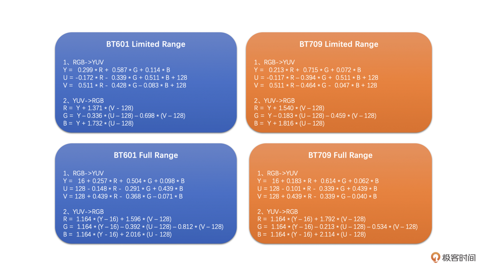

<head>
    
    
</head>

# Table of Contents

1.  [Algorithm](#org3659110)
2.  [Review](#org1c159cf)
    1.  [基本概念：从参数的角度看视频图像](#orga5b27e7)
    2.  [YUV & RGB](#orgc06dd03)
    3.  [RGB 和 YUV 之间的转换](#org6f58e25)
    4.  [缩放算法：如何高质量地缩放图像](#org4e83dcb)
        1.  [缩放的基本原理](#orgce9ae91)
        2.  [三种插值算法](#orgf9a4a6c)
3.  [Tips](#org752c0b3)
4.  [Share](#orgf8e22a1)
    1.  [概述](#org6a7c63a)
        1.  [为什么我们需要拷贝交换语义?](#org624cc04)
        2.  [它如何实施？](#orgb55cbf5)
    2.  [一个深度的解释](#orgfdbb7b2)
        1.  [目标](#org584aeef)
        2.  [一个失败的解决方案](#orgcbd294e)
        3.  [一个成功的解决方案](#orgd30f099)
        4.  [C++11?](#org6a6efe9)

# Algorithm

Course Schedule: <https://leetcode.com/problems/course-schedule/>

<https://dreamume.medium.com/leetcode-207-course-schedule-1c4801ea7e76>

# Review

攻克视频技术    李江

## 基本概念：从参数的角度看视频图像

视频行业常见的分辨率有 QCIF(176 x 144)、CIF(352 x 288)、D1(704 x 576 或 720 x 576)、还有我们比较熟悉的 360P(640 x 360)、720P(1280 x 720)、1080P(1920 x 1080)、4K(3840 x 2160)、8K(7680 x 4320) 等

**Stride** 也可以称之为跨距，是图像存储的时候有的一个概念。它指的是图形存储时内存中每行像素所占用的空间。字节对齐引起的概念。比如要 16 字节对齐，则可能没行最后有一些多余的填充字节

**帧率** 一般帧率达到 10 ～ 12 帧每秒，人眼就会认为是流畅的。当然，可能会有个体差异

通常，我们在电影院看的电影帧率一般是 24fps，监控行业常用 25fps，声网常用的帧率有 15fps、24fps、30fps

**码率** 指视频在单位时间内的数据量的大小，一般是 1 秒内的数据量，单位一般是 Kb/s 或 Mb/s。

## YUV & RGB

YUV 存储方式主要分为两大类：Planar 和 Packed 两种。Planar 格式的 YUV 是先连续存储所有像素点的 Y，然后接着存储所有像素点的 U，之后再存储所有像素点的 V，也可以是Y、V、U的顺序。Packed 格式的 YUV 是先存储完所有像素的 Y，然后 U、V 连续的交错存储

1.  YUV 4:4:4
    
    每一个 Y 对应有一个 U、V

2.  YUV 4:2:2
    
    每左右两个像素的 Y 共用一个 U、V。存储方式主要有以下 4 种类型：
    
    1.  YU16（或者称为 I422、YUV422P）
        
        该类型是 Planar 格式，顺序为 Y、U、V
    
    2.  YV16（YUV422P）
        
        该类型是 Planar 格式，顺序为 Y、V、U
    
    3.  NV16（YUV422SP）
        
        Packed 格式，顺序为 Y、U、V
    
    4.  NV61（YUV422SP）
        
        Packed 格式，顺序为 Y、V、U

3.  YUV 4:2:0
    
    这是最常见也是最常用的 YUV 类型。每上、下、左、右 4 个像素点共用一个 U 和一个 V，存储方式主要分为以下 4 种：
    
    1.  YU12（I420、YUV420P）
        
        Planar 格式，顺序为 Y、U、V
    
    2.  YV12（YUV420P）
        
        Planar 格式，顺序为 Y、V、U
    
    3.  NV12（YUV420SP）
        
        Packed 格式，存储完 Y 之后，U、V 连续交错存储
    
    4.  NV21（YUV420SP）
        
        Packed 格式，存储完 Y 之后，V、U 连续交错存储

## RGB 和 YUV 之间的转换

**Color Range** 对一个 8bit 的 RGB 图像，每个 R、G、B 分量取值分两种，一种是 Full Range，一种是 Limited Range。Full Range 的 R、G、B 取值范围都是 0 ~ 255。而 Limited Range 的 R、G、B 取值范围是 16 ~ 235

YUV 和 RGB 转换的标准主要是 BT601 和 BT709（其实还有 BT2020）。简单来讲，BT709 和 BT601 定义了一个 RGB 和 YUV 互换的标准规范。BT601 是表情包的标准，而 BT709 是高清的标准

下面我们来看看这两种标准分别在 Full Range 和 Limited Range 下的 RGB 和 YUV 之间的转换公式

在处理 YUV 图像的存储和读取的时候，也是有 Stride 这个概念的。事实上，YUV 出问题的情况更多

## 缩放算法：如何高质量地缩放图像

最常用的是插值算法和目前比较火的 AI 超分算法

插值算法的原理都是使用周围已有的像素值通过一定的加权运算得到“插值像素值“。插值算法主要包括：最近邻插值算法（Nearest）、双线性插值算法（Billinear）、双三次插值算法（BiCubic）等

### 缩放的基本原理

图像的缩放就是将原图像的已有像素经过加权运算得到目标图像的目标像素

假设原图像的分辨率是 w0 x h0，我们需要缩放到 w1 x h1。那我们只需要将目标图像中的像素位置（x, y）映射到原图像的（x \* w0 / w1，y \* h0 / h1），再插值得到这个像素值就可以了，这个插值得到的像素值就是目标图像像素点（x，y）的像素值

### 三种插值算法

1.  最近邻插值

    -   首先，将目标图像中的目标像素位置，映射到原图像的映射位置
    -   然后，找到原图像中映射位置周围的 4 个像素
    -   最后，取离映射位置最近的像素点的像素做为目标像素

2.  双线性插值

    也取待插值像素周围的 4 个像素，将这 4 个像素值通过一定的运算得到最后的插值像素
    
    线性插值原理是一种以距离作为权重的插值方式，距离越近权重越大，距离越远权重越小
    
    
    
    如上图，已知（x1, y1）和（x2, y2）两点，根据 x 值求对应的 y 值：
    
    $ y = \\frac{x_ {2} - x}{x_ {2} - x_ {1}} y_ {1} + \\frac{x - x_ {1}}{x_ {2} - x_ {1}} y_ {2} $
    
    双线性插值本质上就是在两个方向上做线性插值，双线性插值其实就是三次线性插值的过程，我们先通过两次线性插值得到两个中间值，然后再通过对这两个中间值进行一次插值得到最终的结果，如下图所示
    
    
    
    假设我们要插值求的是 p 点，其坐标为（x, y）。已知周围 4 个像素为 a、b、c、d。我们先通过 a 和 b 水平线性插值求得 m，再通过 c、d 水平插值求得 n。有了 m 和 n之后，再通过 m、n 垂直插值得 p 点的像素值。计算过程如下
    
    $ val(m) = \\frac{x - x_ {1}}{x_ {2} - x_ {1}} val(b) + \\frac{x_ {2} - x}{x_ {2} - x_ {1}} val(a) $
    
    $ val(n) = \\frac{x - x_ {1}}{x_ {2} - x_ {1}} val(d) + \\frac{x_ {2} - x}{x_ {2} - x_ {1}} val(c) $
    
    $ val(p) = \\frac{y - y_ {1}}{y_ {2} - y_ {1}} val(m) + \\frac{y_ {2} - y}{y_ {2} - y_ {1}} val(n) $

3.  双三次插值

    双三次插值原理跟前面两种差不多，不同的是：
    
    1.  双三次插值选取的是周围 16 个像素，比前两种插值算法多了 3 倍
    2.  双三次插值算法的周围像素的权重计算是使用一个特殊的 BiCubic 基函数来计算的
    
    先通过 BiCubic 基函数计算得到 16 个像素的权重，然后将 16 个像素加权平均就得到最终的插值像素
    
    BiCubic 基函数形式如下
    
    $ W(x) = \\left\\{ \\begin{array}{cc} (a + 2) \| x \|^{3} - (a + 3) \| x \|^{2} + 1 & \| x \| \\le 1 \\\\ a \| x \|^{3} - 5a \| x \|^{2}  + 8a \| x \| - 4a & 1 < \| x \| < 2 \\\\ 0 & others \\end{array} \\right. $
    
    其中 a 通常取值为 -0.5，代入之后得
    
    $ W(x) = \\left\\{ \\begin{array}{cc} 1.5 \| x \|^{3}  - 2.5 \| x \|^{2} + 1 & \| x \| \\le 1 \\\\ -0.5 \| x \|^{3} + 2.5 \| x \|^{2}  - 4 \| x \| + 2 & 1 < \| x \| < 2 \\\\ 0 & others \\end{array} \\right. $
    
    双三次插值的权重值是分水平和垂直两个方向分别求得的，计算公式是一样的，都是上面的公式。对于周围 16 个点中的每一个点，其坐标值为（x, y），而目标图像中的目标像素在原图像中的映射坐标为 p(u, v)。那么通过上面的公式可以求得其水平权重 W(u - x)，垂直权重 W(v - y)。将 W(u - x) 乘以 W(v - y) 得到最终权重值，然后再用最终权重值乘以该点的像素值，并对 16 个点分别做同样的操作并求和，就得到待插值的像素值了。公式如下
    
    $ p(u, v) = \\sum^{3}_ {x = 0} \\sum^{3}_ {y=0} W(u - x) * W(v - y) * p(x, y) $
    
    其中 p() 表示该像素的像素值

# Tips

早期反射

<https://ccrma.stanford.edu/~jos/pasp/Early_Reflections.html>

混响环境的脉冲反应的早期反射部分经常是头 100ms。然而，为更好的精确度，应该扩展到混响达到它的渐进统计行为的时间

因为早期反响相对稀疏且持续一个相对短的时间，它们经常用拍打延迟线 (TDL) 实现

如果算力可负担，最好空间化早期反射以便它们从 3D 空间的正确方向过来。早期反射在空间印象上有很强的影响，例如，听者探知听力空间形状

上图显示一个早期和后续混响独立实现的一个混响基本示意图。TDL 上的拍打可能包括空气吸收模拟的低通过滤

当后续混响逻辑上在早期反射结束后开始，如上图，他可能实际上更有成本效益地从 TDL 一个早期拍打（或一系列拍打）反馈后续混响单位，这样覆盖部分。这对后续混响需要时间来构建完全密度时有帮助

通常早期反射可用于后续混响模拟。例如，通常长延迟线的输入信号可在各点总结，因此实现一个转置的拍打延迟线

可观察到好的音乐大厅有立体声记录的脉冲反应以一个大约延迟 1.9 秒的平滑的衰减快速边沿化

# Share

什么是拷贝交换语义？

## 概述

### 为什么我们需要拷贝交换语义?

<https://stackoverflow.com/questions/3279543/what-is-the-copy-and-swap-idiom/3279550#3279550>

任何管理一个资源的类需要实现 Big Three Rule

**The rule of three** 如果你需要直接定义析构、拷贝构造或拷贝赋值操作，你需要直接定义所有这三个

当复制构造和析构的目的和实现是直接的，拷贝赋值函数是最微妙且困难的。它如何做？需要避免什么缺陷？

拷贝交换语义是一个解决方案，且协助赋值操作达成两个事情：避免代码重复，避免强异常保证

### 它如何实施？

概念上，它通过使用拷贝构造函数功能来创建一个数据的本地拷贝，然后用 swap 函数获取拷贝的数据，并用它与旧数据交换。临时拷贝然后被析构

为了使用拷贝交换语义，我们需要三件事情：一个拷贝构造函数，一个析构和一个交换函数

一个交换函数是一个不抛异常的函数交换一个类的两个对象，成员到成员。我们可尝试使用 std::swap，但这是不行的；std::swap 使用拷贝构造和拷贝赋值函数，且我们最终尝试定义赋值函数

## 一个深度的解释

### 目标

让我们考虑一个具体的例子。我们想要管理一个动态数组。我们开始一个构造函数、拷贝构造函数和析构函数

    #include <algorithm>
    #include <cstddef>
    
    class dumb_array {
    public:
      dumb_array(std::size_t size = 0) : mSize(size), 
                                         mArray(mSize ? new int[mSize]() : nullptr) {}
      dumb_array(const dumb_array& other) : mSize(other.mSize), 
                                            mArray(mSize ? new int[mSize] : nullptr) {
        std::copy(other.mArray, other.mArray + mSize, mArray);
      }
    
      ~dumb_array() {
        delete [] mArray;
      }
    private:
      std::size_t mSize;
      int* mArray;
    };

这个类可以很好地管理数组，但它需要 operator= 来协助

### 一个失败的解决方案

这里有一个实现

    dumb_array& operator=(const dumb_array& other) {
      if (this != other) {
        delete [] mArray;
        mArray = nullptr;
    
        mSize = other.mSize;
        mArray = mSize ? new int[mSize] : nullptr;
        std::copy(other.mArray, other.mArray + mSize, mArray);
      }
    
      return *this;
    }

然而，这个实现有三个问题：

1.  首先是自我赋值测试
    
    通常情况下自我赋值很少发生，所以大多数情况下该检测是一个浪费

2.  只提供基本异常保障。如果 new int[mSize] 失败，\*this 已被修改，为保证强异常，代码应该如下
    
        dumb_array& operator=(const dumb_array& other) {
          if (this != other) {
            std::size_t newSize = other.mSize;
            int* newArray = mSize ? new int[mSize] : nullptr;
            std::copy(other.mArray, other.mArray + mSize, newArray);
        
            delete [] mArray;
            mSize = other.mSize;
            mArray = newArray;
          }
        
          return *this;
        }

3.  代码重复

### 一个成功的解决方案

拷贝交换语义将解决这些问题。我们需要添加一个 swap 函数

    class dumb_array {
    public:
      // ...
      friend void swap(dumb_array& first, dumb_array& second) {
        using std::swap;
    
        swap(first.mSize, second.mSize);
        swap(first.mArray, second.mArray);
      }
    
      // ...
    };

我们的赋值函数

    dumb_array& opeartor=(dumb_array other) {
      swap(*this, other);
    
      return *this;
    }

### C++11?

管理资源我们现在是 The Rule of Four，移动构造函数如下：

    class dumb_array {
    public:
      // ...
      dumb_array(dumb_array&& other) noexcept 
        : dumb_array() {
        swap(*this, other);
      }
      // ...
    };

