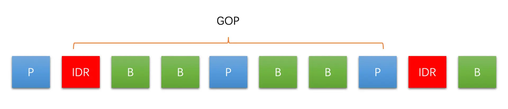
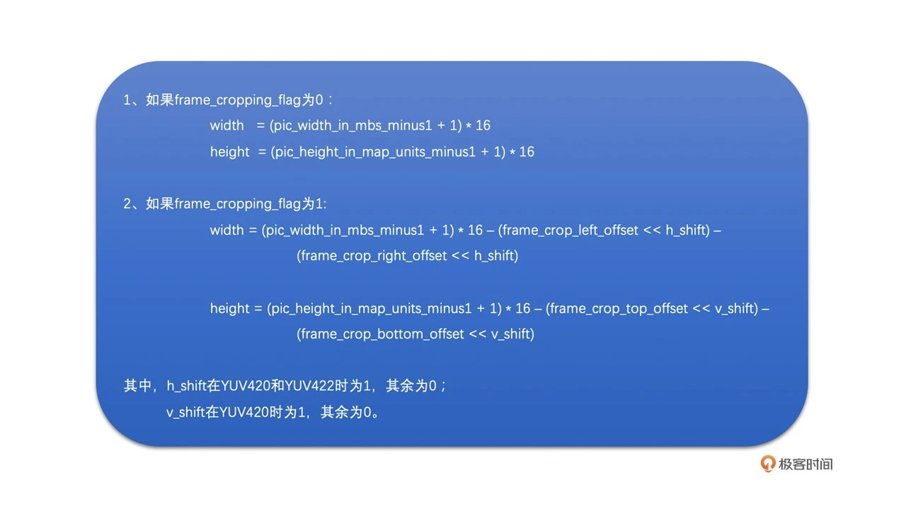
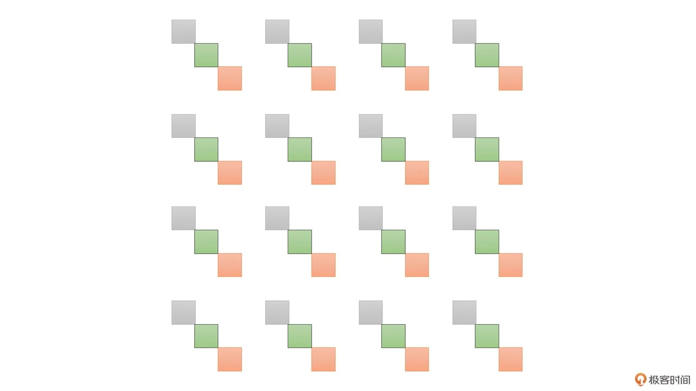
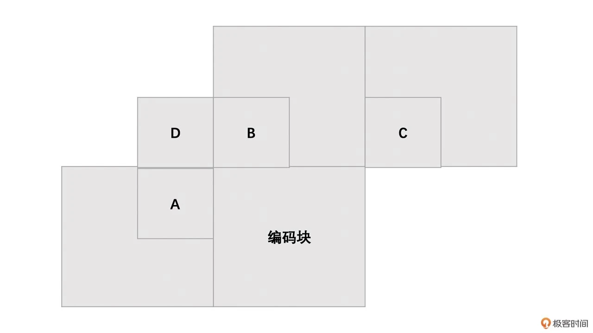
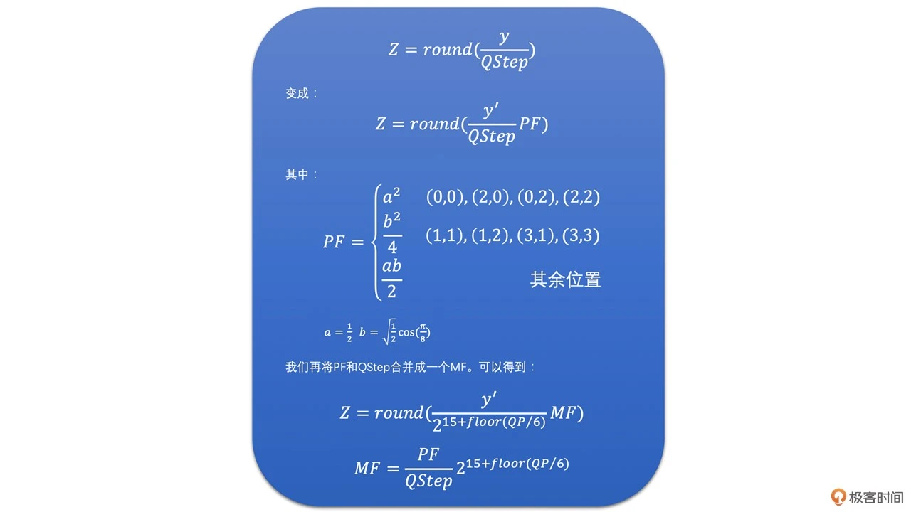

<head>
    
    
</head>

# Table of Contents

1.  [Algorithm](#org0305a6b)
2.  [Review](#org1ad9c95)
    1.  [码流结构：原来你是这样的 H264](#org51d1992)
        1.  [H264 的编码结构](#orgfdfd052)
        2.  [帧类型](#org3c1e9d7)
        3.  [GOP](#org10cd6db)
        4.  [Slice](#org363b056)
        5.  [H264 的码流结构](#org060e2fd)
        6.  [码流结构](#org0ce1e1e)
        7.  [NALU](#org4a5e206)
        8.  [常见工程问题](#orgcf13127)
    2.  [帧内预测：如何减少空间冗余](#org8c37b9e)
        1.  [不同块大小的帧内预测模式](#org2c9abaf)
        2.  [4 x 4 亮度块的帧内预测模式](#orgce26837)
        3.  [16 x 16 亮度块的帧内预测模式](#orgec876c5)
        4.  [8 x 8 色度块的帧内预测模式](#org3ad4b34)
        5.  [帧内预测模式的选择](#org3337055)
    3.  [帧间预测：如何减少时间冗余](#org446be4d)
        1.  [帧间编码](#org19a38c8)
    4.  [变换量化：如何减少视觉冗余？](#orga65ce03)
        1.  [常规视频编码中的 DCT 变换和量化](#org8f7140d)
        2.  [H264 中的 DCT 变换和量化](#org509cfa7)
3.  [Tips](#org4d472b9)
    1.  [最新混响预想的质量](#orgbb2a2fe)
    2.  [Schroeder 全通段](#org6ffa5ac)
    3.  [嵌套全通过滤器](#org205586f)
4.  [Share](#org20d2c72)

# Algorithm

Wiggle Sort II: <https://leetcode.com/problems/wiggle-sort-ii/>

<https://dreamume.medium.com/leetcode-324-wiggle-sort-ii-6441a4b6c06b>

# Review

攻克视频技术    李江

## 码流结构：原来你是这样的 H264

视频编码的码流结构其实就是指视频经过编码之后得到的二进制数据是怎么组织的，换句话说，就是编码后的码流我们怎么将一帧帧编码后的图像数据分离出来，以及在二进制码流数据中，哪一块数据是一帧图像，哪一块数据是另外一帧图像

### H264 的编码结构

GOP 是以其中的 IDR 帧作为分隔点的；最后的 Slice 是我们深入帧内部以后的一个重要概念

### 帧类型

帧类型分 3 大类，分别是 I 帧、P 帧和 B 帧

三种帧的示例图如下所示，例如，从左到右，第一个 B 帧参考第一个 I 帧和第一个 P 帧，第一个 P 帧只参考第一个 I 帧（箭头是从参考帧指向编码帧）

由于 P 帧和 B 帧需要参考其他帧。如果编码或者解码的过程中有一个参考帧出现错误的话，那依赖它的 P 或 B 帧肯定也会出现错误，而这些有问题的 P 帧（B 帧虽然也可以用来作为参考帧，但是一般用的比较少，所以这里不讨论）又会继续作为之后 P 帧或 B 帧的参考帧。因此，错误会不断地传递。为了避免错误地不断传递，就有了一种特殊的 I 帧叫 IDR 帧，也叫立即刷新帧

H264 编码标准中规定，IDR 帧之后的帧不能再参考 IDR 帧之前的帧。这样，如果某一帧编码错误，之后的帧参考了这个错误帧，则也会出错。此时编码一个 IDR 帧，由于它不参考其他帧，所以只要它自己编码是正确的就不会有问题，这样就截断了编码错误地传递

普通的 I 帧就是指当前帧只使用帧内预测编码，但是后面的 P 和 B 帧还是可以参考普通 I 帧之前的帧。但是这里我要说明一下，一般来说我们不太会使用这种普通 I 帧，大多数情况下还是直接使用 IDR 帧，尤其是在流媒体场景，比如 RTC 场景

### GOP

从一个 IDR 帧开始到下一个 IDR 帧的前一帧为止，这里面包含的 IDR 帧、普通 I 帧、P 帧和 B 帧，我们称为一个 GOP（图像组）（这是 closed GOP，还有一种 opened GOP，比较少见，这里不讨论）

我们可以看到 GOP 的大小是由 IDR 帧之间的间隔来确定的，而这个间隔我们有一个重要的概念来表示，叫做关键帧间隔。关键帧间隔越大，两个 IDR 相隔就会越远，GOP 也就越大；反之GOP 小

GOP 越大，I 帧少，编码效率高，但会导致 IDR 帧距离太大，点播场景时进行视频的 seek 操作就会不方便

并且，在 RTC 和直播场景中，可能会因为网络原因导致丢包而引起接收端的丢帧，大的 GOP 最终可能导致参考帧丢失而出现解码错误，从而引起长时间花屏和卡顿。GOP 需要根据实际的场景来选择

### Slice

Slice 其实是为了并行编码设计的。我们可以将一帧图像划分成几个 Slice，并且 Slice 之间相互独立、互不依赖、独立编码

在机器性能比较高的情况下，我们就可以多线程并行对多个 Slice 进行编码，从而提升速度。但也因为一帧内的几个 Slice 是相互独立的，所以如果帧内预测的话，就不能跨 Slice 进行，因此编码性能会差一些

H264 中编码的基本单位是块，所以一个 Slice 又包含整数个宏块。宏块 MB 大小是 16 x 16。在做帧内和帧间预测的时候，我们又可以将宏块继续划分成不同大小的子块，用来给复杂区域做精细化编码

总结来说，图像内的层次结构就是一帧图像可以划分成一个或多个 Slice，而一个 Slice 包含多个宏块，且一个宏块又可以划分成多个不同尺寸的子块。如下图所示：

### H264 的码流结构

先从最外层的码流结构讲起，怎么判断视频编码数据的开始；然后再介绍里面的 NALU（网络抽象层单元）数据，看看通过它怎么区分不同类型的帧；再详细聊聊 NALU 有几种类型，以及通过什么方式来区分 NALU 类型

### 码流结构

H264 码流有两种格式：一种是 Annexb 格式；一种是 MP4 格式。两种格式区别是

1.  Annexb 格式使用起始码来表示一个编码数据的开始。起始码本身不是图像编码的内容，只是用来分隔用的。起始码有两种，一种是 4 字节的“00 00 00 01“，一种是 3 字节的 “00 00 01“
    
    这里需要注意一下，由于图像编码出来的数据中也有可能出现“00 00 00 01“和“00 00 01“的数据。那这种情况怎么办呢？为了防止这种情况，H264 会将图像编码数据中的下面几种字符串做如下处理：
    
    1.  “00 00 00” 修改为“00 00 03 00“
    
    2.  “00 00 01”修改为“00 00 03 01”
    
    3.  “00 00 02”修改为“00 00 03 02“
    
    4.  “00 00 03“修改为“00 00 03 03“
    
    同样在解码端，我们在去掉起始码之后，也需要将对应的字节串转换回来
    
    

2.  MP4 格式没有起始码，而是在图像编码数据的开始使用了 4 个字节作为长度标识，用来表示编码数据的长度，这样我们每次读取 4 个字节，计算出编码数据长度，然后取出编码数据，再继续读取 4 个字节得到长度，一直继续下去就可以取出所有的编码数据了
    
    

这两种格式差别不大，接下来我们主要使用 Annexb 格式来讲解 H264 码流中的 NALU

### NALU

出了图像数据，视频编码的时候还有一些编码参数数据，为了能够将一些通用的编码参数提取出来，不在图像编码数据中重复，H264 设计了两个重要的参数集：一个是 SPS（序列参数集）；一个是 PPS（图像参数集）

其中，SPS 主要包含的是图像的宽、高、YUV 格式和位深等基本信息；PPS 则主要包含熵编码类型、基础 QP 和最大参考帧数量等基本编码信息。如果没有 SPS、PPS 里面的基础信息，之后的 I 帧、P 帧、B 帧就都没有办法进行解码。因此 SPS 和 PPS 是至关重要的

所以，H264 的码流主要是由 SPS、PPS、I Slice、P Slice 和 B Slice 组成的，如下图所示：

我们知道了 H264 码流主要由 SPS、PPS 和三种 Slice 组成，那我们如何在码流中区分这几种数据呢？

为了解决这个问题，H264 设计了 NALU（网络抽象层单元）。SPS、NALU、PPS 都是一个 NALU。每一个 NALU 又都是由一个 1 字节的 NALU Header 和若干字节的 NALU Data 组成的。而对于每一个 Slice NALU，其 NALU Data 又是由 Slice Header 和 Slice Data 组成，并且 Slice Data 又是由一个个 MB Data 组成。其结构如下：

这里我们重点介绍一下 NALU Header。它总共占用 1 个字节，具体如下图所示

其中

-   F: forbidden_zero_bit，占 1 bit，禁止位，H264 码流必须为 0
-   NRI: nal_ref_idc，占 2bits，可以取 00 ~ 11，表示当前 NALU 的重要性。参考帧、SPS 和 PPS 对应的 NALU
-   Type：nal_unit_type，占 5 bits，表示 NALU 的类型。其取值如下表所示
    
    

有了 NALU 类型表格，我们解析出 NALU Header 的 Type 字段，查询表格就可以得到哪个 NALU 是 SPS，哪个是 PPS，以及哪个是 IDR 帧了

这里需要注意一下，NALU 类型只区分了 IDR Slice 和非 IDR Slice，至于非 IDR slice 是普通 I Slice、P Slice 还是 B Slice，则需要继续解析 Slice Header 中的 Slice Type 字段得到。我们通过下面两个例子来看看常见的 NALU 里的 NALU Header 是怎样的

下面我们再来看一个实际码流的例子，看看在实际编码出来的二进制数据中，各种 NALU 是怎么“放置”在数据中的。下图是我用二进制查看工具打开实际编码后的码流数据。我们可以看到在码流的开始部分是一个起始码，之后紧接着是一个 SPS 的 NALU。在 SPS 后面是一个 PPS 的 NALU。然后就是一个 IDR Slice 的 NALU 和一个非 IDR Slice NALU

### 常见工程问题

1.  多 Slice 时如何判断哪几个 Slice 是同一帧的？

    码流中没有字段表示一帧包含几个 Slice，那我们如何知道多 Slice 编码时一帧的开始和结束分别对应哪个 Slice 呢？
    
    
    
    其实，Slice NALU 由 NALU Header 和 NALU Data 组成，其中 NALU Data 里面就是 Slice 数据，而 Slice 数据又是由 Slice Header 和 Slice Data 组成。在 Slice Header 开始的地方有一个 first_mb_in_slice 的字段，表示当前 Slice 的第一个宏块 MB 在当前编码图像中的序号。我们只要解析出这个宏块的序号出来
    
    -   如果 first_mb_in_slice 的值等于 0，就代表了当前 Slice 的第一个宏块是一帧的第一个宏块，也就是当前 Slice 就是一帧的第一个 Slice
    -   如果 first_mb_in_slice 的值不等于 0，就代表了当前 Slice 不是一帧的第一个 Slice。并且，使用同样的方式一直往下找，直到找到下一个 first_mb_in_slice 为 0 的 Slice，就代表新的一帧的开始，那么其前一个 Slice 就是前一帧的最后一个 Slice 了
    
    
    
    其中，first_mb_in_slice 是以无符号指数哥伦布编码的，需要使用对应的解码方式才能解码出来。但是有一个小技巧，如果只是需要判断 first_mb_in_slice 是不是等于 0，不需要计算出实际值的话，只需要通过下面的方式计算就可以了
    
    

2.  如何从 SPS 中获取图像的宽高

    在 SPS 中有几个字段用来表示分辨率的大小。我们可以解码出这几个字段并通过一定的规则计算得到分辨率的大小。这几个字段分别是
    
    
    
    这几个字段都是通过无符号指数哥伦布编码的，需要先解码出来。解码得到具体值之后，通过以下方法就可以得到分辨率了。注意，pic_height_im_map_units_minus1 需要考虑帧编码和场编码的区别，其中场编码已经很少使用了，我们这里不再考虑
    
    

3.  如何计算得到 QP 值

    量化过程是引人失真最主要的环节。而量化最主要的参数就是 QP 值，并且 QP 值的大小严重影响到编码画面的清晰度。因此 QP 值非常重要。那么我们如何从码流中计算得到 QP 值呢？
    
    在 PPS 中有一个全局基础 QP，字段是 pic_init_qp_minus26。当前序列中所有依赖该 PPS 的 Slice 共用这个基础 QP，且每一个 Slice 在这个基础 QP 的基础上做调整。在 Slice Header 中有一个 slice_qp_delta 字段来描述这个调整偏移值。更进一步，H264 允许在宏块级别对 QP 做更进一步的精细化调节。这个字段在宏块数据里面，叫做 mb_qp_delta
    
    
    
    宏块 QP 需要解析整个 Slice 数据，计算量大。一般我们直接计算到 Slice QP 就可以了。计算方法如下：
    
    

## 帧内预测：如何减少空间冗余

一般来说，一幅图像中相邻像素的亮度和色度是比较接近的，并且亮度和色度信息也是逐渐变化的，不太会出现突变。也就是说，图像具有空间相关性。帧内预测就是利用这个特点来进行的。即帧内预测通过利用已经编码的相邻像素的值来预测待编码的像素值，最后达到减少空间冗余的目的

这里需要注意的一个点就是，我们是通过已经编码了的像素值去预测待编码的像素值。你可能会问，已经编码了的像素值变成码流了，不再是一个个像素了，怎么去预测待编码的像素呢？其实已经编码了的像素是会重建成重建像素，用来做之后待编码块的参考像素的。你可以认为是已经编码的块会解码成像素用来做参考像素

下面我们以 H264 标准来讲解每种帧内预测模式是怎么做预测的

### 不同块大小的帧内预测模式

在 H264 标准里面，块分为宏块和子块。宏块的大小是 16 x 16（YUV 4:2:0 图像亮度块为 16 x 16，色度块为 8 x 8）。在帧内预测中，亮度宏块可以继续划分成 16 个 4 x 4 的子块。因为图像中有的地方细节很多，我们需要划分成更小的块来做预测会更精细，所以会将宏块再划分成 4 x 4 的子块。如下图所示

帧内预测是根据块的大小分为不同的预测模式的。还有一个点就是亮度块和色度块的预测分开进行的。主要有以下 3 点规则：

1.  宏块大小是 16 x 16，其中亮度块为 16 x 16，色度块为 8 x 8
2.  帧内预测中亮度块和色度块是分开独立进行预测的，即亮度块参考已编码亮度块的像素，而色度块参考已编码色度块的像素
3.  16 x 16 的亮度块可以继续划分成 16 个 4 x 4 的子块

所以，我们在实际帧内预测的时候就会分为：4 x 4 亮度块的预测、16 x 16 亮度块的预测、8 x 8 色度块的预测（注意亮度 8 x 8 模式和 I_PCM 模式很少使用，我们这里不做讨论）

### 4 x 4 亮度块的帧内预测模式

因为 4 x 4 的块帧内预测模式最多，并且基本包含亮度 16 x 16 和色度 8 x 8 模式，所以我们接下来先从 4 x 4 亮度块的帧内预测模式讲起

4 x 4 亮度块的帧内预测模式总共有 9 个。其中有 8 种方向模式和一种 DC 模式，且方向模式指的是预测是有方向角度的

1.  Vertical 模式
    
    Vertical 模式就是指，当前编码亮度块的每一列的像素值，都是复制上边已经编码块的最下面那一行的对应位置的像素值
    
    Vertical 模式得到的预测块同一列中的像素值都是一样的。该模式得到的块就叫做 Vertical 预测块。注意，该模式只有在上边块存在的时候才可用，如果不存在则该模式不可用
    
    该模式下预测块像素值计算方法如下：
    
    

2.  Horizontal 模式
    
    Horizontal 模式就是指，当前编码亮度块的每一行的像素值，都是复制左边已经编码块的最右边那一列的对应位置的像素值。Horizontal 模式得到的预测块同一行中的像素值都是一样的，该模式得到的块就叫做 Horizontal 预测块。注意，该模式只有在左边块存在的时候才可用
    
    该模式下预测块像素值计算方法如下：
    
    
    
    示意图如下：
    
    

3.  DC 模式
    
    DC 模式指当前编码亮度块的每一个像素值，是上边已经编码块的最下面一行和左边已编码块右边最后一列的所有像素值的平均值。注意，DC 模式预测得到的块中每一个像素值都是一样的。DC 模式得到的块就叫做 DC 预测块
    
    根据上边块和左边块是不是存在，该模式下预测块像素值计算方法如下：
    
    
    
    示意图如下：
    
    

4.  Diagonal Down-Left 模式
    
    Diagonal Down-Left 模式是上边块和右上块（上边块和右上块有可能是一个块，因为可能是一个 16 x 16 的亮度块，意思理解就可以）的像素通过插值得到。如果上边块和右上块不存在则该模式无效
    
    该模式下预测块像素值计算方法如下：
    
    
    
    示意图如下：
    
    

5.  Diagonal Down-Right 模式
    
    Diagonal Down-Right 模式需要通过上边块、左边块和左上角对角的像素通过插值得到。如果这三个有一个不存在则该模式无效
    
    该模式下预测块像素值计算方法如下：
    
    
    
    示意图如下：
    
    

6.  Vertical-Right 模式
    
    Vertical-Right 模式是需要通过上边块、左边块以及左上角对角的像素插值得到的。必须要这三个都有效才能使用，否则模式无效
    
    该模式下预测块像素值计算方法如下：
    
    
    
    示意图如下：
    
    

7.  Horizontal-Down 模式
    
    Horizontal-Down 模式需要通过上边块、左边块以及左上角对角的像素插值得到。必须要这三个都有效才能使用，否则模式无效
    
    
    
    示意图如下：
    
    

8.  Vertical-Left 模式
    
    Vertical-Left 模式是需要通过上边块和右上块（上边块和右上块有可能是一个块，因为可能是一个 16 x 16 的亮度块，意思理解就可以）最下面一行的像素通过插值得到。如果这两种块不存在则该模式不可用。该模式下预测块像素值计算方法如下：
    
    
    
    示意图如下：
    
    

9.  Horizontal-Up 模式
    
    Horizontal-Up 模式是需要通过左边块的像素通过插值得到的。如果左边块不存在，则该模式不可用
    
    该模式下预测块像素值计算方法如下：
    
    
    
    示意图如下：
    
    

### 16 x 16 亮度块的帧内预测模式

16 x 16 亮度块总共有 4 种预测模式。他们分别是 Vertical 模式，Horizontal 模式、DC 模式和 Plane 模式，前面三种模式跟 4 x 4 的原理是一样的，这里不重复了。16 x 16 亮度块的帧内预测的 4 种模式的示意图如下：

接下来我们介绍一下 Plane 模式。这种模式相比前面三种模式稍微复杂一些，但是基本原理都差不多。Plane 预测块的每一个像素值，都是将上边已经编码块的最下面那一行，和左边已编码块右边最后一列的像素值经过下面公式计算得到的

### 8 x 8 色度块的帧内预测模式

8 x 8 色度块的帧内预测模式跟 16 x 16 亮度块的是一样的，也是总共有 4 种，分别为 DC 模式、Vertical 模式、Horizontal 模式、Plane 模式。与 16 x 16 亮度块不同的是，块大小不同，所以参考像素值数量会不同，但基本是一致的

### 帧内预测模式的选择

我们先把思路讲一讲，具体细节不展开。等把编码基础弄明白了之后可以阅读一下 x264 代码，里面有关于具体如何去选择模式的方法

以亮度块为例。一个 16 x 16 的亮度块，我们可以不划分，直接使用 4 种 16 x 16 的帧内预测模式，最多得到 4 种预测块；也可以划分成 16 个 4 x 4 的子块，每一个子块最多有 9 种帧内预测模式

对于每一个块或者子块，我们可以得到预测块，再用实际待编码的块减去预测块就可以得到残差块。主要有下面 3 种方案来得到最优预测模式

-   第一种方案，先对每一种预测模式的残差块的像素值求绝对值再求和，称之为 cost，然后取其中残差块绝对值之和也就是 cost 最小的预测模式为最优预测模式
-   第二种方案，对残差块先进行 Hadamard 变换，变换到频域之和再求绝对值求和，同样称为 cost，然后取 cost 最小的预测模式为最优预测模式
-   第三种方案，也可以对残差块直接进行 DCT 变换量化熵编码，计算得到失真大小和编码后的码流大小，然后通过 [率失真优化](https://www.jianshu.com/p/6f8be3709003?utm_campaign=maleskine&utm_content=note&utm_medium=seo_notes&utm_source=recommendation) 的方法来选择最优预测模式

这里稍微简单介绍一下率失真优化的思想

我们知道预测之后经过 DCT 变换再量化会丢失高频信息。一般来说 QP 越大，丢失的信息越多，失真就越大，但是码流大小也越小；反之，QP 越小，丢失的信息越少，但是码流大小也越大。我们一般会在失真和码流大小之间平衡，尽量找到在一定码率下，失真最小的模式作为最优的预测模式，这就是率失真优化的思想

其实还有很多不同的方案，比如有的为了加速模式选择的过程，率失真计算的时候，只会进行 DCT 变换和量化，不会进行熵编码。码流大小直接通过 QP 值估算或者使用预测模式的大小来代替。这些方案都可以，具体看编码器的实现。一般来说，选择过程越精细效果越好，但速度越慢

通过上面讲的这些方法我们找到了每一个 4 x 4 块的最优模式之后，将这 16 个 4 x 4 块的 cost 加起来，与 16 x 16 块的最小 cost 对比，选择 cost 最小的块划分方式和预测模式作为帧内预测模式

## 帧间预测：如何减少时间冗余

[参考文献](https://blog.csdn.net/leixiaohua1020/article/details/45936267)

有三点需要特别强调一下：

1.  在帧内预测中，我们是在当前编码的图像内寻找已编码块的像素作为参考像素计算预测值。而帧间预测是在其他已经编码的图像中去寻找参考像素块的
2.  帧间预测是可以在多个已经编码的图像里面去寻找像素块的，我们称之为多参考。多参考和单参考（只在一帧图像里面寻找参考像素块）其实底层的原理是一样的，只是多参考需要多搜索几个参考图像去寻找参考块而已，所以我们讲解的时候就使用单参考讲解
3.  帧间预测既可以参考前面的图像也可以参考后面的图像（如果参考后面的图像，后面的图像需要提前先编码，然后再变吗当前图像）。只参考前面图像的帧我们称为前向参考帧，也叫 P 帧；参考后面的图像或者前面后面图像都参考的帧，我们称之为双向参考帧，也叫做 B 帧。B 帧相比 P 帧主要是需要先编码后面的帧，并且 B 帧一个编码块可以有两个预测块，这两个预测块分别由两个参考帧预测得到，最后加权平均得到最终的预测块。P 帧和 B 帧的底层逻辑基本是一样的

### 帧间编码

1.  块大小

    帧间预测的块划分类型要多很多。宏块大小 16 x 16，可以划分为 16 x 8，8 x 16，8 x 8 三种，其中 8 x 8 可以继续划分成 8 x 4，4 x 8 和 4 x 4，这是亮度块的划分。在 YUV 4:2:0 中，色度块宽高大小都是亮度块的一半。亮度宏块的划分方式如下图所示：
    
    

2.  参考帧和运动矢量

    在帧间预测中，我们会在已经编码的帧里面找到一个块来作为预测块，这个已经编码的帧称之为参考帧。在 H264 标准中，P 帧最多支持从 16 个参考帧中选出一个作为编码块的参考帧，但是同一个帧中的不同块可以选择不同的参考帧，这就是多参考
    
    通常在 RTC 场景中，比如 WebRTC 中，P 帧中的所有块都参考同一个参考帧，并且一般会选择当前编码帧的前一帧来作为参考帧。为什么呢？
    
    这是因为自然界的运动一般是连续的，同时在短时间之内的变化相对比较小，所以前面的帧通常是最接近当前编码帧的，并且两者的差距比较小。因此，我们比较容易从前一帧中找到一个跟当前编码块差距很小的块作为预测块，这样编码块减去预测块得到的残差块的像素值很多都是 0，压缩效率是不是就很高了？
    
    好了，选择好了参考帧之后，我们还有一个问题。虽然运动变化比较小，但是还是有变化啊，比如说下图中的场景
    
    
    
    我们用运动矢量来表示编码帧中编码块和参考帧中的预测块之间的位置的差值
    
    比如上图中小车的位置，我们用运动矢量来表示，我们称（32 - 80，80 - 80）也就是（-48，0）为运动矢量。我们先把运动矢量编码到码流当中，这样解码段只要解码出运动矢量，使用运动矢量就可以在参考帧中找到预测块了，我们再解码出残差（如果有的话），残差块加上预测块就可以恢复出图像了

3.  运动搜索

    运动搜索的目标就是在参考帧中找到一个块，称之为预测块，且这个预测块与编码块的差距最小。从计算机的角度来说就是，编码块跟这个预测块的差值，也就是残差块的像素绝对值之间（下面我们用 SAD 表示残差块的像素绝对值之和）最小
    
    现在是不是目标就清晰很多了。运动搜索就是从参考帧中第一个像素开始，将一个个 16 x 16 大小的块都遍历一遍。我们总是可以找到差距最小的块，这种方法我们称之为全搜索算法
    
    搜索算法中每一个搜索的点都是搜索块的左上角像素点。下面解释一些快速的搜索算法
    
    1.  钻石搜索算法
        
        钻石搜索算法又称为菱形搜索算法。就是以一个菱形的模式去寻找最优预测块。这里我们以亮度 16 x 16 的块的运动搜索为例，将算法的思想分为以下几个步骤：
        
        1.  从搜索的起始点开始，以起始点作为菱形的中心点。首先以该中心点为左上角像素的 16 x 16 的块作为预测块，求得残差块并求得像素绝对值之和，也就是 SAD。之后对菱形 4 个角的 4 个点分别做同样的操作求得 SAD 值。得到最小的 SAD 值，最小 SAD 值对应的点就是当前最佳匹配点
        
        2.  如果最佳匹配点是菱形的中心点，那我们就找到了预测块了，搜索结束
        
        3.  如果最佳匹配点不是菱形的中心点，则用以当前最佳匹配点为中心点的菱形继续搜索，重复之前的步骤直到菱形的中心点为最佳匹配点
        
        
        
        如上图，第一步，以绿色点（起点）为中心点，搜索绿色点和旁边蓝色线连接的 4 个点，得到的最佳匹配点为橙色点，非中心点
        
        第二步，再以橙色点为中心，搜索橙色点和旁边黄色线连接的 4 个点，最佳匹配点是中心点橙色点，搜索完毕，橙色点为最佳点
    
    2.  六边形搜索算法
        
        跟钻石搜索相似，以 16 x 16 的块为例，主要有下面几个步骤：
        
        1.  从搜索的起始点开始，以起始点作为六边形的中心点。求得中心点作为左上角像素的预测块的 SAD 值。之后对六边形的角上的 6 个点做同样的操作求得 SAD 值。得到最小的 SAD 值，而最小 SAD 值对应的点就是当前最佳匹配点
        
        2.  如果最佳匹配点是六边形的中心点，那我们就用以该点为中心点的菱形和正方形各进行一次精细化搜索。找到中心点、菱形的 4 个顶点和正方形 4 个顶点中 SAD 最小的点作为最佳匹配点
        
        3.  如果最佳匹配点不是六边形的中心点，则用以当前最佳匹配点为中心点的六边形继续搜索，重复之前的步骤直到中心点为最佳匹配点
        
        
        
        如上图，第一步，以绿色点（起点）为中心点，搜索中心点和旁边蓝色线连接的 6 个点，得到的最佳匹配点为橙色点，非中心点
        
        第二步，再以橙色点为中心点，搜索橙色点和旁边黄色线连接的 6 个点，最佳匹配点是中心点橙色点
        
        第三步，再以橙色点为中心点，搜索橙色点和旁边蓝色线连接菱形的 4 个点，最佳匹配点为黑色点
        
        第四步，还是以橙色点为中心点，搜索旁边红色线连接的正方形的 4 个点，并与菱形搜索得到的最佳匹配点黑色点比较，找到最后的最佳匹配点为红色点，搜索完毕
    
    搜索的起始点可以使用当前编码块的左边块、右边块、左上角块和右上角块的运动矢量预测得到。具体预测方法我们会在下面的运动矢量预测小节里面讲解。其总体的思路就是我们认为，一般一个块最大也就 16 x 16 的大小，而运动的物体一般远大于这个大小，所以相邻块的运动方向大多数是很相似的。因此，我们一般会通过相邻已经编码块的运动矢量来预测当前块的运动矢量。这个预测的运动矢量也经常用做搜索的起点
    
    实验数据表明，快速搜索算法相比全搜索算法压缩性能下降非常小，速度却可以提升十几倍到几十倍。所以总的来说，我们可以认为快速搜索算法是远好于全搜索算法的，并且一般全搜索算法是不会实际使用的
    
    如果运动矢量中实际数值可能不是整数的话，我们可通过对参考帧进行半像素和 1 / 4 像素插值（统称为亚像素插值）的方式来解决
    
    就是我们用插值的方式将非整像素也计算出来

4.  亚像素插值

    用已经有的像素插值求得半像素和 1/4 像素。其中半像素通过整像素插值得到，1/4 像素又是通过整像素和半像素插值得到 1/4 像素。半像素的插值过程可以通过下面的图表示
    
    
    
    其中，灰色为整像素点，橙色为水平半像素，黄色为垂直半像素点，绿色为中心半像素点
    
    半像素点的插值是以 6 个整像素点使用六抽头插值滤波器计算得到的，滤波器权重系数为：(1/32, -5/32, 5/8, 5/8, -5/32, 1/32）。具体计算方法如下
    
    
    
    得到半像素后，1/4 像素就比较简单，由整像素和半像素求平均值得到，其插值过程可以通过下图表示
    
    
    
    其中，红色点为 1/4 像素点，具体计算方法如下
    
    
    
    整个半像素和 1/4 像素的插值过程可以通过下图表示
    
    
    
    插值得到了所有的半像素和 1/4 像素之后，我们就可以用运动矢量表示 0.5 个像素和 0.25 个像素的移动了。如果只是整像素的图像，那就只能表示出向前行驶了 48 个像素或者 49 个像素，没办法表示 48.5 个像素
    
    我们用下面的几幅图像来直观地感受一下一个 4 x 4 的像素块的半像素图像和 1/4 像素图像的像素位置。首先来看一幅 4 x 4 的像素块的像素位置
    
    
    
    下面图中的红色的 4x4 像素表示水平半像素图像
    
    
    
    下面图中的红色的 4x4 像素表示垂直半像素图像
    
    
    
    下面图中的红色的 4x4 像素表示水平、垂直半像素图像
    
    
    
    下面图中的绿色的 4x4 像素表示水平 1/4 像素图像
    
    
    
    下面图中的绿色的 4x4 像素表示垂直 1/4 像素图像
    
    
    
    下面图中的绿色的 4x4 像素表示水平、垂直 1/4 像素图像
    
    
    
    如之前的小车的例子，插值得到的小车跟原始的小车的对应像素点的像素值并不是完全一样的，毕竟插值得到的像素点是利用滤波算法加权平均得到的
    
    因此，半像素插值得到的预测块并不一定就比整像素预测块的残差小，我们可以在整数像素预测块、半像素预测块和 1/4 像素预测块里面选择一个最好的。怎么选择呢？其实是在整像素运动搜索的基础上，再做一次精细化的亚像素运动搜索

5.  亚像素精度运动搜索

    一般搜索算法如下：
    
    1.  先通过快速搜索算法进行整像素运动搜索得到整像素的运动矢量
    2.  对参考帧进行半像素和 1/4 像素插值
    3.  以整像素运动矢量指向的整像素为起点，进行钻石搜索算法，分别求得中心点及上、下、左、右四个半像素点对应预测块的残差块，得到 SAD 值。取 SAD 值最小的点为最佳匹配点
    4.  以半像素运动搜索的最佳匹配点为起点，分别求得中心点及上、下、左、右四个 1/4 像素点对于预测块的残差块，得到 SAD 值，并取最小的点为最佳匹配点
    
    假设整像素运动矢量为（a0, b0），半像素最佳匹配点相对于整像素最佳匹配点为（a1, b1），1/4 像素最佳匹配点相对于半像素最佳匹配点的运动矢量为（a2, b2），则最后运动矢量（a, b）的值的计算方法如下
    
    
    
    因为浮点数会有精度误差，所有我们通过乘以 4 把它变成整数

6.  运动矢量预测

    运动矢量跟我们的编码块一样不是直接编码进去的，而是先用周围相邻块的运动矢量预测一个预测运动矢量，称为 MVP。将当前运动矢量与 MVP 的残差称之为 MVD，然后编码到码流中去了。解码端使用同样的运动矢量预测算法得到 MVP，并从码流中解码出运动矢量残差 MVD，MVP + MVD 就是运动矢量了
    
    那运动矢量预测算法是怎样的呢？我们以 16 x 16 宏块为例通过下图来描述
    
    
    
    步骤如下：
    
    1.  取当前编码宏块的左边块 A、上边块 B、右上块 C。如果右上块不存在或参考帧与当前编码宏块不同（多参考的时候会存在），则使用左上块 D 替换 C，即 C = D
    2.  求得 A、B、C 块的参考帧有多少个与当前编码块的参考帧相同，记为 count
    3.  如果 count > 1，则取 A、B、C 块的运动矢量的中值（就是 A、B、C 块运动矢量的 3 个 x 和 3 个 y 分别取中间值作为 MVP 的 x 和 y）
    4.  如果 count = 1，则直接将这个块的运动矢量作为 MVP
    5.  如果 count = 0，并且 B、C 都不存在，A 存在的话，则直接将 A 的运动矢量作为 MVP
    6.  如果上述条件都不满足，则取 A、B、C 块运动矢量的中值

7.  SKIP 模式

    一种特殊的帧间模式，就是 SKIP 模式。它的定义是这样的，如果运动矢量就是 MVP，也就是说 MVD 为 (0, 0)，同时，残差块经过变换量化后系数也都是等于 0，那么当前编码块的模式就是 SKIP
    
    相比于 SKIP，其他模式要么 MVD 不为 0，要么就是量化后的残差系数不为 0，或者两者都不为 0。所以说 SKIP 模式是一种特例，由于 MVD 和残差块都是等于 0，因此压缩效率特别高
    
    比如说 P 帧中的静止部分，前后两帧不会变化，运动矢量直接为 0，而且残差块像素值本身因为几乎没有变化基本为 0，只有少部分噪声引起的比较小的值，量化后更是全部变成了 0。这种图像中的静止部分或者是图像中的背景部分大多数时候都是 SKIP 模式。这种模式非常省码率，且压缩效率非常高。因为需要编码的信息非常少，所以单独在这里讨论一下
    
    到这里基本的帧间编码的知识我们都有了，接下来我们再总体过一下 P 帧宏块的模式选择的过程

8.  帧间模式的选择

    编码块帧间模式的选择其实就是参考帧的选择、运动矢量的确定，以及块大小（也就是块划分的方式）的选择，如果 SKIP 模式单独拿出来算的话就再加上一个判断是不是 SKIP 模式。我们主要是确定这 4 个东西
    
    之前的讨论当中我们都是以当前编码帧的前一帧作为参考帧的，也就是说是单参考的，不涉及到参考帧的选择。其实，如果是多参考的话，编码块在选择参考帧的时候只需要遍历每一个参考帧进行块划分，然后再对每一个块进行运动搜索得到运动矢量就可以了。跟单参考相比就是多了一个参考帧遍历的操作。所以我们这里还是以单参考帧的方式来讲讲帧间模式的选择过程
    
    注意，帧间模式的选择大多数是看编码器的实现的，并且不同编码器实现都会不一样，所以我们只是讲讲其中一种模式选择的思路，具体的细节各个编码器都各不相同。具体选择过程如下：
    
    1.  首先判断当前宏块是不是可以作为 SKIP 块（通过相邻已经编码的块是不是存在 SKIP 块，和当前块使用 MVP 做运动矢量之后，残差块变换量化后是不是都为 0 等算法来判断），如果可以作为 SKIP 块则模式选择结束，不再进行下面的划分了
    2.  宏块大小为 16 x 16。首先不划分宏块，直接使用 16 x 16 大小的块，在参考帧中进行运动搜索，得到运动矢量和预测块，通过 MVP 求得 MVD，通过预测块求得残差块，并求得残差块的 SATD 值（残差块经过 Hadamard 变换之后求绝对值再求和），估计 MVD 的编码后占用的字节数，将两个值加起来作为 cost16x16
    3.  将 16 x 16 块划分成 4 个 8 x 8 的子块，分别进行运动搜索，并求得每一个 8 x 8 子块的 MVD 和残差块，最后分别得到 4 个子块的 cost8x8
        1.  如果 4 个 8 x 8 子块的 cost8x8 之和小于 16 x 16 块的 cost16x16 的话，我们再分别对每一个 8 x 8 子块划分成 4 个 4 x 4 子块，同样分别进行运动搜索，得到每一个 4 x 4 子块的 cost4x4
            1.  如果 4 个 cost4x4 之和小于 cost8x8，则将 8 x 8 块划分成 4 x 8和 8 x 4 两种子块分别求得 cost4x8 和 cost8x4，再根据 4 个 cost4x4、2 个 cost4x8 和 2 个 cost8x4 的大小，选择最终的 8x8 划分的方式，并将对应的 cost 值更新到 cost8x8
            2.  否则不划分 8 x 8 子块
        2.  如果 4 个 8 x 8 子块的最新的 cost8x8 之和还是小于 cost16x16 的话，则再将 16 x 16 划分成两个 8 x 16 和 16 x 8 子块，并分别求得 cost8x16 和 cost16x8，对比 8x8、16x8、8x16 的 cost 值，并决定最终 16x16 块的划分方式
        3.  否则的话，不划分 16x16 的块
    4.  得到了编码宏块的帧间模式之后，我们还需要对编码宏块进行帧内模式的选择。是的，没错，在 P 帧和 B 帧中的宏块也是可以使用帧内模式的，所以我们需要看是帧间模式 cost 更小还是帧内模式 cost 更小。但一般来说，P 帧和 B 帧宏块决策出来绝大多数还是帧间模式

## 变换量化：如何减少视觉冗余？

通过下图你可以很清楚地看到视频编码的过程，并且能够更直观地感受 DCT 变换和量化在整个视频编码中的重要性

由于 H264 中用到的 DCT 变换和量化跟常规的 DCT 变换和量化有一些区别，其主要在于 H264 使用整数变换代替常规的 DCT 变换，并将 DCT 变换中的一部分计算整合到量化中，从而减少浮点运算漂移问题。因此，我们还会对 H264 中的 DCT 变换和量化做一些介绍，最后对比一下 H264 中的变换和量化与常规的变换和量化的区别

### 常规视频编码中的 DCT 变换和量化

1.  DCT 变换

    DCT 变换就是离散余弦变换。它能够将空域的信号（对于图像来说，空域就是你平时看到的图像）转换到频域（对于图像来说，就是将图像做完 DCT 变换之后的数据）上表示，并能够比较好的去除相关性。其主要用于视频压缩领域。现在常用的视频压缩算法中基本上都有 DCT 变换
    
    图片经过 DCT 变换之后，低频信息集中在左上角，而高频信息则分散在其他的位置。通常情况下，图片的高频信息多但是幅值比较小。高频信息主要描述图片的边缘信息。我们可以去除一些高频信息，减少信息量，从而达到压缩的目的
    
    DCT 变换本身是无损的，同时也是可逆的。一维 DCT 变换公式如下：其中 f(i) 是指第 i 个样点的信号值，N 代表信号样点的总个数
    
    
    
    二维 DCT 变换公式如下：其中 f(i, j) 是指第 (i,j) 位置的样点的信号值，N 代表信号样点的总个数
    
    
    
    一般在编码标准中图像是进行二维 DCT 变换的，因为图像是个二维信号。但是实际上在代码里面我们经常将二维 DCT 变换转换成两个一维 DCT 变换来进行
    
    在视频压缩中，DCT 变换是在帧内预测和帧间预测之后进行的。也就是说，DCT 变换其实是对残差块做的。我们在编码时会将图像划分成一个个宏块，而宏块又可以划分成一个个子块。那 DCT 变换是在宏块上进行还是在子块上进行呢？
    
    其实，通常情况下 DCT 变换是在 4x4 的子块上进行的（也可以在 8x8 子块上进行，但是只有在扩展 profile 才支持，由于原理是一样的，因此这里不再展开讨论），即便预测时并没有对宏块再做划分。也就是说，不管宏块有没有被划分到 4x4 的子块，我们在做 DCT 变换时，都是在一个个 4x4 块上进行的。如下图所示：
    
    
    
    好了，如果我们将上面的 DCT 变换公式用在 4x4 的变换块上，则 4x4 的 DCT 变换就可以通过下面的 4x4 的矩阵乘法来表示了
    
    
    
    为了让你更好地理解 DCT 变换，我们通过下面的例子来看一下 4x4 的残差块的 DCT 变换结果。我们称左上角的系数为 DC 系数，而其他系数为 AC 系数：
    
    
    
    对这个 4x4 的残差块运用公式，可得：
    
    
    
    我们可以得到下面的图
    
    
    
    从上面 DCT 变换的公式和矩阵表示方式中，我们可以看到，DCT 变换的计算过程中涉及到了 cos 函数。那也就是说计算的过程中一定涉及到了浮点运算。而浮点运算计算速度比较慢。那么没有什么运算可以将图像块比较快速的转换到频域吗？答案肯定是有的。那就是 Hadamard 变换，也叫哈达玛变换

2.  Hadamard 变换

    在视频编码过程中，Hadamard 变换也经常会用到。Hadamard 变换可以替代 DCT 变换将残差块快速转换到频域，以便用来估计一下当前块编码之后的大小
    
    其实在 H264 的亮度 16x16 帧内预测块和色度 8x8 预测块中也会使用到 Hadamard 变换。稍后我们会在 H264 中的 DCT 变换和量化部分对它进行简单介绍。下面我们先来看一下 Hadamard 变换的矩阵表示形式
    
    
    
    Hadamard 变换没有浮点运算，因此其计算速度很快，并且也能够将图像块从空域变换到频域。因此，我们可以用它一定程度上粗略的代替 DCT 变换，从而用来简化运算

3.  量化

    我们将图像块变换到频域之后，AC 系数比较多，但是一般幅值比较小。并且，我们可以去除一些 AC 系数，达到压缩图像的目的，同时人眼看起来差距不大。这个去除 AC 系数的操作就是量化
    
    其实量化的操作并不是针对 AC 系数去做的，DC 系数也同样会做量化，只是通常情况下，DC 系数比较大，从而量化后变换为 0 的概率比 AC 系数要小。量化操作其实非常简单，就是除法操作。计算公式如下
    
    
    
    在量化过程中，最重要的就是 QStep（用户一般接触到的是 QP，两者可以查表转换）
    
    其中，在 H264 中 QP 和 QStep 之间的转换表格如下：
    
    
    
    通常 QStep 值越大，DC 系数和 AC 系数被量化成 0 的概率也就越大，从而压缩程度就越大，但是丢失的信息也就越多。这个值太大了会造成视频出现一个个块状的效应，且严重的时候看起来像马赛克一样；这个值比较小的话，压缩程度也会比较小，从而图像失真就会比较小，但是压缩之后的码流大小就会比较大
    
    我们通过一个例子来看一下量化的结果
    
    
    
    这就是常规的变换和量化的计算过程。实际上 H264 里面的变换和量化是这样的吗？原理上是的，但是实际计算过程变了。因为 DCT 变换过程中涉及到浮点运算，在不同机器上解码会因为精度问题产生漂移导致误差。同样，量化过程有除法运算，大多数时候其结果还是浮点型的数字，在不同机器上解码也会有误差

### H264 中的 DCT 变换和量化

H264 为了减少这种浮点型运算漂移带来的误差，将 DCT 变换改成了整数变换，DCT 变换中的浮点运算和量化过程合并，这样就只有一次浮点运算过程，以此来减少不同机器上浮点运算产生的误差。下面我们来看看 H264 中的变换和量化

1.  H264 的整数变换和量化

    我们知道常规的 DCT 变换的矩阵计算方式如下：
    
    
    
    而在 H264 中，我们通过下面的推导过程，将 DCT 变换一步步修改为帧数变换。最后 H264 中的 DCT 变换就变成了整数变换。其矩阵的计算方式如下
    
    
    
    我们将点乘左边的部分取出来，就是 H264 中的整数变换了。公式如下
    
    
    
    我们同样使用上面 DCT 变换的例子来做一下整数变换。其结果如下
    
    
    
    在前面整数变换里，DCT 变换中的点乘部分被拿出来了，这一部分的计算被合并到了 H264 的量化过程中。因此 H264 的量化过程如下所示
    
    
    
    其中，MF 我们一般都是通过表格查询得到。表格如下，其中，对于 QP 大于 5 的情况，使用 QP = QP % 6 进行查询
    
    
    
    上面整数变换之后，我们用 H264 的量化公式对其进行量化后得到的结果如下
    
    
    
    我们可以看到虽然 H264 的 DCT 变换和量化过程跟常规的 DCT 变换和量化不一样，但是最后量化的结果其实还是一样的

2.  H264 各模式块的 DCT 变换和量化过程

    1.  亮度 16x16 帧内预测块
        
        亮度 16x16 块，首先被划分成 16 个 4x4 的小块做整数变换。变换之后将 16 个 4x4 小块的 DC 系数都拿出来，组成一个 4x4 的 DC 块，再对这个 4x4 的 DC 块进行 hadamard 变换。然后，再总体进行量化操作
        
        
    
    2.  其他模式亮度块
        
        对于除亮度 16x16 帧内预测块之外的其他亮度块，都是直接划分成 4x4 的块进行整数变换，之后再进行量化操作就可以了
        
        
    
    3.  色度块
        
        对于 YUV420 图像，色度块大小是 8x8。我们先将 8x8 色度块划分成 4 个 4x4 的小块做整数变换。变换之后将 4 个小块的 DC 系数拿出来，组成一个 2x2 的 DC 块，再对这个 2x2 DC 块进行 Hadamard 变换。最后总体进行量化操作
        
        

# Tips

最新混响近似值

<https://ccrma.stanford.edu/~jos/pasp/Late_Reverberation_Approximations.html>

## 最新混响预想的质量

从感知的立场，一个想要的好的最新混响脉冲反应主要质量是

1.  一个平滑的（但不过度平滑）衰减，且
2.  一个平滑的（但不过度规则）频率反应

提供一个指数级的衰减不是问题因为稳定线性系统和自然混响衰减都是指数级的。更困难的问题是让它变平滑，即，没有抖动、鼓击或其他不规则声音。一般来说，当回响密度足够高时为平滑衰减结果。注意，然而，短期能量的相同波动需要发声自然，对应一个衰减噪声过程

一个平滑频率反应展示不大、隔离间隔或爆发。当模式统一扩散，在频域模式密度足够大时它一般满足，而在同一地点不断增大或隔离形成隔断时不行。另一方面，模式不应该是太规范的空间，因为这样会产生可听见的在时域脉冲反应上的周期声音

一个 Moore 做的有趣实验是尝试指数化衰减白噪声作为一个最新的混响脉冲反应。这个信号满足平滑准则（时域和频域），且它发声非常自然。然而，因为自然混响衰减在高频更快，理想的最新混响脉冲反应是指数级衰减“颜色”噪声，高频能量衰减比低频能量衰减更快

在最新混响的反响密度的 Schroeder 拇指规则是 1000 回响每秒或以上。然而，对脉冲声音，10,000 回响每秒或以上对一个平滑反应可能是必要的

## Schroeder 全通段

原始的 Schroeder-Logan 论文对人造混响使用全通过滤开启一个活跃的研究线路直到现在。从很多年开始，数字化混响算法被设计成跟 Schroeder 使用延迟线、梳状过滤器和全通过滤器的方式相似。甚至特殊硬件实时高效实现这些结构。今天，这些元素继续作为人造混响和相关音效的商业设备的基础服务。也有典型地使用软件模拟人造混响

Schroeder 全通过滤器的建议使用特别聪明因为这个建议并不自然。而是，他认识到从时长和密度方面分割混响颜色的概念上和实际的工具。然而，Schroeder 1961 年的论文标题为《无颜色的人造混响》，在真实世界中没有这样的无颜色混响。然而，它作为更好的自然混响是有意义的。无颜色混响只能在虚拟世界中是一个更好的混响

在 Schroeder 最初的工作中，及后续的很多工作，全通过滤器作为级数排列，如下图：

每个全通可被认为从前一阶段扩展每个非零输入采样为一整个无穷全通脉冲反应。对这个原因，Schroeder 全通段有时被称为脉冲扩展或脉冲扩散。然而没有一个扩散反射的物理模型，单一反射扩散到许多反射

另一个 Schroeder 全通段的有趣解释是作为一个数字化波浪指导模型，其理想弦（或圆柱形声学导管）的驱动点阻抗在一个实际阻抗上反射终止。即，一个输入信号被视为物理速度的采样，然后输出信号是在相同物理点上跟对应力（或压力）的采样成比例。延迟线包含旅行波浪采样；头半部分对应旅行波浪朝向弦（或导管）的远端，而后半部分保持旅行波浪采样回到驱动点

## 嵌套全通过滤器

另一个增加一个全通脉冲反应密度的常见的方法是嵌套两个或多个全通过滤器。一般来说，一个嵌套全通过滤器在当一个或多个它的延迟元素被另一个全通过滤器取代时创建。头序嵌套全通过滤器相当于 lattice 过滤器。这个相当意味着任意序 N 转换函数（任意 N 极和零）可能被嵌套头序全通过滤器的延迟元素的线性组合获得，因为这是 lattice 过滤器的已知属性

一般来说，一个稳定全通过滤器里的任意延迟元素或延迟线可被任意稳定全通过滤器取代，且结果是一个稳定全通过滤器

# Share

proof of Lagrange’s four-square theorem

<https://planetmath.org/proofoflagrangesfoursquaretheorem>

下面的证明是必要的 Lagrange 的来源，在大约 1770 年。首先，我们需要三个引理

**引理1** 对任意整数 a, b, c, d, w, x, y, z，有

$ \\begin{aligned} (a^{2} + b^{2} + c^{2} + d^{2})(w^{2} + x^{2} + y^{2} + z^{2}) &= (aw + bx + cy + dz)^{2} \\\\ &+ (ax - bw - cz + dy)^{2} \\\\ &+ (ay + bz - cw - dx)^{2} \\\\ &+ (az - by + cx - dw)^{2} \\end{aligned} $

**引理2** 如果 2m 是两个平方数的和，则 m 也是

证明：假设 $ 2m = x^{2} + y^{2} $。则 x 和 y 都是奇数或都是偶数。因此，对公式

$ m = (\\frac{x - y}{2})^{2} + (\\frac{x+y}{2})^{2} $

对右边进行整理即可得到 2m 也是两个平方数之和

**引理3** 如果 p 是一个奇素数，则 $ a^{2} + b^{2} + 1 = kp, \\exists a, b, k, 0 < k < p $

证明：设 p = 2n + 1，考虑集合

$ A := \\{a^{2} \| a = 0, 1, \\ldots, n \\} \\text{ and } B := \\{-b^{2} - 1 \| b = 0, 1, \\ldots, n \\} $

我们有如下事实：

1.  A 中没有两个元素模 p 同余，如果 $ a^{2} \\equiv c^{2} $ (mod p)，则要么 $ p \| (a - c) $ 要么 $ p \| (a + c) $，因为 $ a - c , a + c \\le 2n < p, 0 \\le a, c $，则我们有 a = c
2.  B 也类似
3.  进一步，$ A \\cap B = \\emptyset $，因为 A 中元素非负，B 中元素都为负数
4.  因此，$ C := A \\cup B $ 有 2n + 2 或 p + 1 个元素

因此，通过颌巢原理，C 中有两个元素模 p 同余。另外，通过头两个事实，两个元素必须来自不同的集合。结果，我们有如下等式：

$ a^{2} + b^{2} + 1 = kp $

k 明显应该是正数。$ p^{2} = (2n + 1)^{2} > 2n^{2} + 1 \\ge a^{2} + b^{2} + 1 = kp $，这样 p > k

基本上，引理 3 说的是对任意素数 p，某个乘子 0 < m < p 是四个平方数的和，因为 $ a^{2} + b^{2} + 1 = a^{2} + b^{2} + 1^{2} + 0^{2} $

证明定理：通过引理 1 我们只需要显示一个任意素数 p 是四个平方数的和，因为 p = 2 时是明显的，假设 p 是一个奇素数，通过引理 3，我们有

$ mp = a^{2} + b^{2} + c^{2} + d^{2}, \\exists m, a, b, c, 0 < m < p $

如果 m = 1，则已证明。为完成证明，我们将显示如果 m > 1 则 np 是四个平方数的和，$ 1 \\le n \\le m $

如果 m 是偶数，则 a, b, c, d 中有 0 个或 2 个或 4 个是偶数。我们可分割 a, b, c, d 为两组，每组包含相同奇偶属性的数。则引理 2 允许我们用 n = m / 2

现在假设 m 是奇数但 > 1，我们写

$ w \\equiv a \\qquad (mod \\quad m) $

$ x \\equiv b \\qquad (mod \\quad m) $

$ y \\equiv c \\qquad (mod \\quad m) $

$ z \\equiv d \\qquad (mod \\quad m) $

w, x, y, z 都在 (-m/2, m/2) 区间中。我们有

$ w^{2} + x^{2} + y^{2} + z^{2} < 4 \\cdot \\frac{m^{2}}{4} = m^{2} $

$ w^{2} + x^{2} + y^{2} + z^{2} \\equiv 0 \\qquad (mod \\quad m) $

这样 $ w^{2} + x^{2} + y^{2} + z^{2} = nm, \\exists n >= 0 $。因为 $ w^{2} + x^{2} + y^{2} + z^{2} < m^{2}, n < m $。如果 n = 0，则 w = x = y = z = 0，这样 $ a \\equiv b \\equiv c \\equiv d \\equiv 0 \\qquad (mod \\quad 0) $，其意味着 $ mp = a^{2} + b^{2} + c^{2} + d^{2} = m^{2}q $，或 $ m \| p $。但 p 是素数，则 m = p，这和 m < p 矛盾。看乘积 $ (a^{2} + b^{2} + c^{2} + d^{2})(w^{2} + x^{2} + y^{2} + z^{2}) $ 并检查引理 1。左边是 $ nm^{2}p $，右边，我们有一个四个平方数之和。则

$ ax - bw - cz + dy = (ax - bw) + (dy - cz) $

$ ay + bz - cw - dx = (ay - cw) + (bz - dx) $

$ az - by + cx - dw = (az - dw) + (cx - by) $

是 m 的倍数。则根据引理 1 有

$ aw + bx + cy + dz \\equiv w^{2} + x^{2} + y^{2} + z^{2} \\equiv 0 \\qquad (mod \\quad m) $

引理 1 中的等式因此可被 $ m^{2} $ 整除。结果是一个四个平方数之和 np。因为 0 < n < m，证明完成

