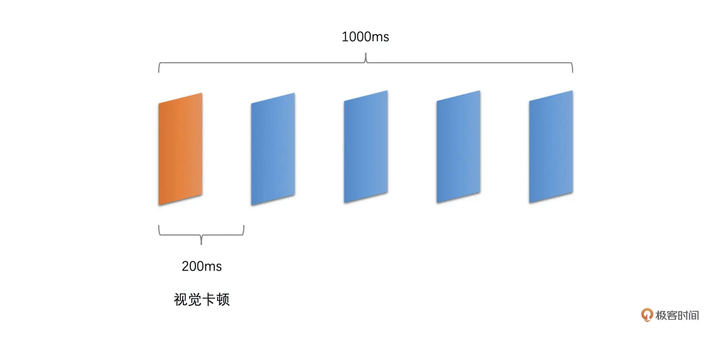
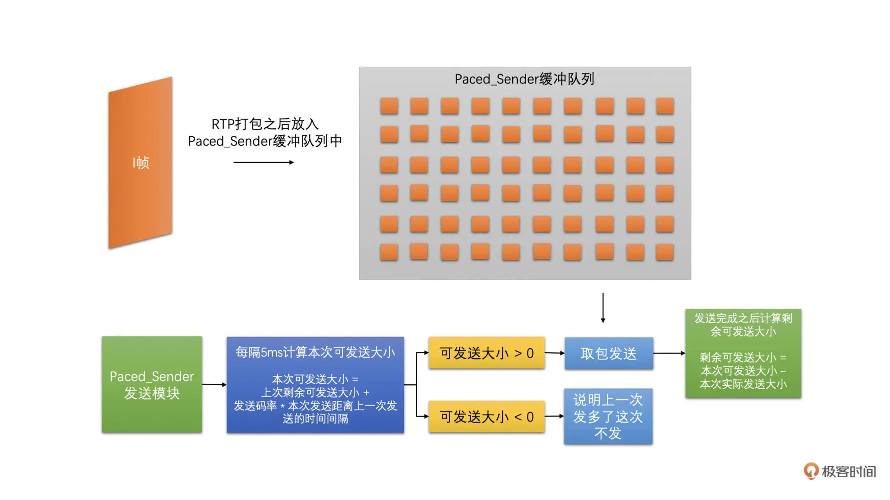
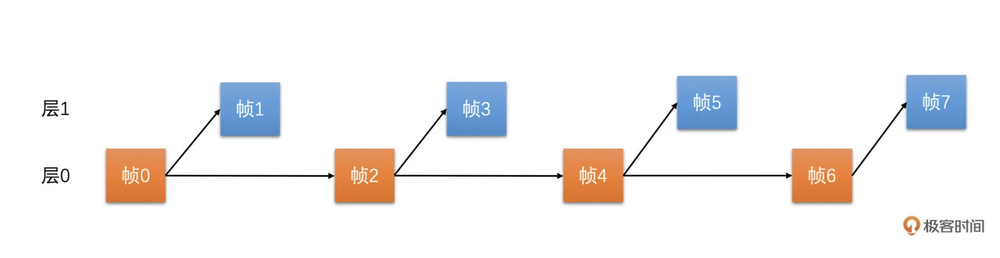

<head>
    
    
</head>

# Table of Contents

1.  [Algorithm](#orgf6a82dc)
2.  [Review](#orgde04ee5)
    1.  [带宽预测：3 大算法准确预估网络带宽](#orgd1cc3c3)
        1.  [带宽预测](#orgaa477f2)
    2.  [码控算法：如何控制视频的编码码率](#org3e64997)
        1.  [码控的原理](#orgda791f4)
        2.  [码控的类型](#orgdbbd617)
        3.  [CBR 算法](#orga206cbd)
        4.  [复杂度求解](#org41625e8)
    3.  [Jitter Buffer: 拿什么拯救你，花屏卡顿问题](#org4c2718e)
        1.  [卡顿问题](#orga3c4636)
        2.  [花屏问题](#org25356de)
    4.  [SVC: 如何实现视频编码可伸缩](#orgfb6f2a5)
        1.  [为什么需要 SVC](#org99619eb)
        2.  [什么是 SVC](#org2a596f1)
        3.  [SVC 的分类](#org6449915)
    5.  [MP4 & FLV: 不要再说 AVI 了](#orgb4edff4)
        1.  [FLV](#orge8d92be)
        2.  [FLV Header](#org3684242)
        3.  [FLV Body](#orge013a6b)
        4.  [MP4](#org69af1b5)
3.  [Tips](#org9efa57a)
4.  [Share](#org6d916bc)

# Algorithm

Elimination Game: <https://leetcode.com/problems/elimination-game/>

<https://dreamume.medium.com/leetcode-390-elimination-game-99458b053fb>

# Review

攻克视频技术    李江

## 带宽预测：3 大算法准确预估网络带宽

RTP 和 RTCP 使用 UDP 作为传输层协议，因此需要自己实现拥塞控制算法，声网实现了一个全球实时通信网 SD-RTN，并研发了 Agora Universal Transport（AUT）传输算法。SD-RTN 和 AUT 内部实现了适合不同网络模型的拥塞控制和丢包重传等一整套高质量的传输算法和策略

今天，我们主要讨论拥塞控制中的带宽预测算法。带宽预测几乎是整个音视频传输和弱网对抗中最重要的环节，也是最难的环节

由于 WebRTC 在实时音视频中占据绝对的领导地位，它的带宽预测算法非常的成熟，因此，我们今天将以 WebRTC 的带宽预测算法作为讨论的对象，对其进行深入剖析和探讨

### 带宽预测

预测实际的带宽，我们就可以控制音视频数据的发送数据量。比如说，控制音视频数据的编码码率或者直接控制发送 RTP 包的速度，这都是可以的。控制住音视频发送的数据量是为了不会在网络带宽不够的时候，我们还发送超过网络带宽承受能力的数据量，最后导致网络出现长延时和高丢包等问题，继而引发接收端出现延时高或者卡顿的问题。因此，带宽预测是非常重要的

而现在的网络中，大多存在两种类型的网络设备：一种是有较大缓存的；一种是没有缓存或者缓存很小的

-   前者在网络中需要转发数据过多的时候，会把数据先缓存在自己的缓冲队列中，等待前面的数据发送完之后再发送当前数据。这种情况就会在网络带宽不够的时候，需要当前数据等一段时间才能发送，因此表现出来的现象就是网络不好时，延时会加大
-   后者在网络中需要发送的数据过多的时候，会直接将超过带宽承受能力的数据丢弃掉。这种情况就会在网络带宽不够的时候，出现高丢包的现象

通过下面的图很容易理解

为了兼顾这两种类型的网络，WebRTC 中设计了两个主要的带宽预测算法：一个是基于延时的带宽预测算法；一个是基于丢包的带宽预测算法

1.  基于延时的带宽预测算法

    基于延时的带宽预测算法主要是通过计算一组 RTP 包它们的发送时长和接收时长，来判断当前延时的变化趋势，并根据当前的延时变化趋势来调整更新预测的带宽值。比如说
    
    -   如果延时有明显变大的趋势就说明实际带宽值应该比当前的发送码率要小，则需要降低预测的带宽值
    -   如果说延迟没有变大，说明当前带宽良好，可能实际带宽值比当前的发送码率还要大，则可以提高预测的带宽值，直到延时有明显变大的趋势再降低预测的带宽值。我们不断这样实时调整更新带宽，来实现带宽预测
    
    基于延时的带宽预测算法主要有 4 个步骤：
    
    1.  计算一组 RTP 包的发送时长和接收时长，并计算延时
    2.  需要根据当前延时和历史延时的大小来计算延时变化的趋势
    3.  根据延时变化趋势判断网络状况
    4.  根据网络状况调整更新预测带宽值
    
    
    
    1.  计算延时
    
        WebRTC 中计算延时的时候是将 RTP 包按照发送时间来分组的，并且要求当前组中的第一个包和最后一个包的发送时间相差不能大于 5ms，而大于 5ms 则是新的一组的开始。同时，由于 UDP 会出现包乱序到达的情况，可能导致后面包的发送时间比前面包的还小。为了防止这种情况的发生，我们要求乱序的包不参与计算
        
        并且发送端在发送每一个 RTP 包的时候会记录每一个包的包序号和实际发送时间，并把这些信息记录到一个发送历史数据里面方便之后计算使用（这个发送历史数据好几个计算需要用到，挺重要的）
        
        
        
        
        
        同时，接收端收到每一个包的时候也会记录包的包序号和实际的接收时间。每隔一段时间就会将这些统计信息发送到发送端。现在的 WebRTC 版本中接收端是通过 RTCP 协议的 Transport-CC 报文反馈接收信息的，这个报文主要包含两个信息：
        
        1.  每一个包序号对应的包是不是接收到了
        2.  实际的这个包相比前一个包的接收间隔
        
        接收端将这些信息组成 Transport-CC 报文发送给发送端
        
        如果发送端收到这个报文，就可以知道每一个 RTP 包有没有接收到了。如果没有接收到就是丢包了。同时也可以知道没有丢失的 RTP 包的接收时间
        
        发送端就可以根据发送历史数据中各个包的发送时间和 Transport-CC 报文中计算得到的各个包的接收时间，来计算出前后两组包之间的发送时长和接收时长了。计算方法如下
        
        
        
        其中 Transport-CC 报文格式可以参考下图，具体各字段的解释可以参考这个 [RFC 文档](https://datatracker.ietf.org/doc/html/draft-holmer-rmcat-transport-wide-cc-extensions-01) 和 [这篇文章](https://blog.jianchihu.net/webrtc-research-transport-cc-rtp-rtcp.html)。总的来说，就是通过 Transport-CC 报文，我们可以计算得到每一个包是不是丢失了，以及没有丢失的每一个包的接收时间。这里不做过多展开
        
        
        
        将接收时长减去发送时长就是延时了
        
        -   如果接收时长大于发送时长，延时就大于 0，说明当前网络有点承受不了当前的发送数据量，产生了缓存，继而产生了延时
        -   如果接收时长几乎等于发送时长，延时就几乎为 0，说明当前网络可以承受当前的发送量，因此几乎没有延时
        -   如果接收时长小于发送时长，也就是延时小于 0 呢？这种情况比较特殊，一般出现在之前因为网络带宽不够已经缓存了一部分数据，但是网络在明显变好，从而网络设备快速地将缓存中的数据发送出去的时候。这种情况下就会出现接收时长很短，导致接收时长还小于发送时长，这个时候延时就是一个负数
        
        这三种情况具体可参考下图：
        
        
        有了延时之后，我们还不能直接使用这个延时来判断网络的好坏，因为网络变化很快而且存在噪声，有的时候延时会因为网络噪声突然变大或变小。因此，我们需要通过当前延时和历史延时数据来判断延时变化的趋势，来平滑掉网络噪声引起的单个延时抖动
        
        说到这里就必须引入一个重要的滤波器，那就是 Trendline Filter。这个滤波器就是用来计算得到延时变化趋势的
    
    2.  延时变化的趋势
    
        Trendline Filter 中保存了 20 个最近的延时数据，这些延时数据跟前面直接计算的延时还不完全一样。它们包含了两个部分：一个是当前这个 RTP 包组所属的 Transport-CC 报文到达发送端的时间；另一个是经过平滑后的累积延时，它是通过前面计算得到的延时和历史累积延时加权平均计算之后得到的。这样也可以一定程度上防止延时波动太大的问题
        
        在 WebRTC 看来，如果设 RTP 包组所属的 Transport-CC 报文的到达时间为 x，累积延时为 y 的话，那么 x 和 y 应该是呈线性关系，也就是说 y = kx + b。Trandline Filter 就是使用 20 个延时数据，通过线性回归的方法，求得其中的 k 值，也就是斜率。这个斜率就表示延时变化的趋势。其中线性回归的求解方式用的是最小二乘法。示意图和求解公式如下
        
        
        
        
        
        
        
        当斜率 k > 0 时，表示有延时；当 k = 0 时，表示几乎没有延时；当 k < 0 时，表示不仅没有延时，反而接收速度更快
        
        我们还需要一个根据当前延时趋势和延时阙值，来判断网络是不是真的变好和变坏的模块，叫做过载检测器
    
    3.  网络状态判断
    
        过载检测器有两个主要的工作：一个是通过当前的延时趋势和延时阙值来判断当前网络是处于过载、欠载还是正常状态；一个是通过当前的延时趋势来更新延时阙值，是的，延时阙值不是静态不变的，阙值是跟着延时趋势不断自适应调整的
        
        我们下面先来看看网络状态的判断，之后再来讨论一下阙值的更新
        
        网络状态的判断其实比较简单。就是将延时趋势 k 乘以一个固定增益 4 和包组的数量（包组数量最大是 60）作为当前的修改后延时值。将当前的修改后延时值跟延时阙值进行比较，然后根据比较的结果来判断网络状态。步骤如下图所示：
        
        
        
        得到网络状态后，我们会使用当前的修改后的延时值去更新当前的延时阙值。为什么需要这么做呢？
        
        我认为，延时阙值的更新是因为网络是不断变化的，延时变化也很快，而有的时候延时很大，有的时候又很小。为了防止阙值太大，网络状况检测不够灵敏，同时也防止阙值太小，网络状况检测太敏感了。所以延时阙值会随着当前的延时做缓慢的调整。其调整的公式如下
        
        
        
        有了修改后延时和延时阙值之后，我们就可以计算网络状态了。又根据网络所处的具体状态，我们就可以调整更新当前的带宽值了。而负责更新带宽值的模块就是速率控制器。下面我们就来详细讨论一下如何将网络状态转化到实际带宽的调整上去
    
    4.  带宽调整更新
    
        速率控制器的主要工作是更新预测带宽值。它里面维护着一个状态机。这个状态机主要是用来干什么的呢？其实，状态机主要用来根据过载检测器检测到的网络状态和状态机目前所处的状态，来更新状态机的状态的
        
        状态机有三个状态，分别是上升、保持和下降状态。当处于上升状态时，速率控制器需要提升带宽值；当处于下降状态时，需要降低带宽值；当处于保持状态时，则不更新带宽值。我们通过下图来看一下过载检测器检测到的网络状态是如何影响状态机状态变化的
        
        
        
        我们可以看到，当过载检测器检测到过载时，状态机都切换到下降状态。这个很好理解，因为过载意味着实际带宽值小于发送码率了，需要调低带宽值，继而发送码率因为预估带宽值下降了也会下降
        
        当过载检测器检测到正常时，状态机都向上调一个状态，什么意思呢？
        
        就是如果之前状态机处于下降状态，则更改为保持状态；如果状态机之前处于保持状态，则更改为上升状态；如果是上升状态那就不用变化了。这个也好理解，因为过载检测器检测到正常，说明当前实际发送数据量还没有达到网络的最大承受量，则可以继续调高预估带宽值，或者之前在降低带宽值的话，就不再继续降低预估带宽值了
        
        当过载检测器处于欠载的状态时，状态机全部切换到保持状态。这个有点不好理解。欠载了不是需要直接提高预估带宽值的吗？为什么保持带宽不变呢？
        
        这是因为 WebRTC 认为欠载主要发生前面因为过载了在网络设备中缓存了一定数据，之后网络状态变好了的时候，网络设备可以快速的发送完缓存中的数据，从而排空缓存。这个时候不要提高发送码率，等缓存排空之后，因为缓存带来的延时就会接近于 0 了，这对于降低端到端延时是很有用的，而过载检测器自然就会进入到正常状态。这样状态机就可以切换到上升状态，从而也就可以调高预估带宽值了
        
        下面我们介绍一下具体调节预估带宽的公式
        
        带宽调整更新逻辑中，上调带宽逻辑比较复杂。因此，我们先介绍相对简单点的下降带宽调整。下降带宽其实很简单，就是预估带宽等于 0.85 倍的接收码率
        
        
        
        但是下降带宽的时候需要做另外一个事情就是更新当前网络的最大带宽。因为处于下降带宽的过程中，说明当前发送数据量已经达到甚至超过了网络的承受能力。这个时候适合更新网络的最大带宽，将当前的接收码率与之前的最大带宽做加权平均求得当前的最大带宽，并更新最大带宽的标准差。这两个值之后调高带宽的时候需要用
        
        这个地方需要提一下，为什么预估带宽和最大带宽都是用接收码率来计算的，那是因为发送码率可能会超出网络承受能力，不一定能很好的反映真实的网络带宽，相比而言，接收端的接收码率更能够表示真实的网络带宽
        
        在上升带宽的时候，是有两种情况的
        
        当前接收码率离最大带宽比较远，具体就是当前接收码率大于最大带宽加上 3 倍的最大带宽标准差，或者小于最大带宽减去 3 倍的标准差。这个时候应该快速调高预估带宽，我们使用的是乘性增的方式增加带宽值，就是每隔一秒钟将预估带宽乘以 1.08 倍。但是为了防止带宽大幅增长，预估带宽不能大于 1.5 倍的接收码率
        
        当前接收码率离最大带宽近，具体就是当前接收码率大于最大带宽减去 3 倍标准差，并小于最大带宽加上 3 倍标准差。这时使用更小的幅度增加带宽，使用加性增的方式增加带宽值。预估带宽是每隔一个 RTT（往返时间，由其它模块计算得到）增加半个包的大小。如果一个包按照 1400 字节算的话，那就是每过一个 RTT 的时间就增加 700 字节
        
        

2.  基于丢包的带宽预测算法

    当网络上有较大缓存的网络设备在遇到数据量太大的时候会把数据放在缓存中，延迟发送。其表现就是网络延时加大。这种情况下我们基于延时做带宽预测是比较准确的
    
    而没有缓存或缓存很小的网络设备，在遇到数据量太大的时候是直接将数据丢弃的。这会引起丢包率上升。为了能够更快更准确地做带宽预测，WebRTC 针对这种情况设计了基于丢包的带宽预测算法
    
    基于丢包的带宽预测算法相比基于延时的带宽预测算法简单很多，没有那么多步骤。其整体思路就是根据 Transport-CC 报文反馈的信息计算丢包率，然后再根据丢包率的多少直接进行带宽调整更新
    
    1.  丢包率的计算
    
        接收端将接收到的每一个包的信息放到 Transport-CC 报文中，包括每一个 RTP 包的序号以及这个包有没有接收到。而没有接收到就代表这个包丢失了。这样就简单了，发送端收到这个 Transport-CC 报文之后只需要统计这个 Transport-CC 报文总共有多少个包，以及丢失了多少个包，就可以计算得到丢包率了
        
        
    
    2.  带宽调整
    
        有了丢包率之后，我们就可以做带宽调整了。根据丢包率可以分三种情况。具体如下：
        
        -   如果丢包率 < 2%，认为当前网络状况很好，需要调高带宽值，带宽值等于过去 1 秒钟所有预测得到的带宽值的最小值 \* 1.08
        -   如果 2% < 丢包率 < 10%，认为当前网络状况正常，不做带宽调整
        -   如果丢包率 > 10%，认为网络状况不好，需要降低带宽值，带宽值等于当前预估带宽值 \* (1 - 0.5 \* 丢包率)
        
        如下图
        
        
        
        由于网络中一般两种网络设备都有，因此，最终的预估带宽值等于这两者中的最小值
        
        这里有一个问题，在网络变差的时候，预估带宽会快速地被下调，但是网络变好的时候预估带宽会比较缓慢的上升，同时如果当前发送码率比较小的话，预估带宽还会被限制，不能超过 1.5 倍的接收码率
        
        也就是说，如果我们当前视频处于静止画面的状态，发送的码率会很小。这样预估带宽就很难从一个比较小的带宽调整上去。如果此时画面突然动起来，即便实际网络带宽足够，还是会因为预估带宽不够而限制发送码率，从而导致画面出现模糊和马赛克等问题
        
        还有就是程序刚开始启动的时候，预估带宽的爬升也需要慢慢的加上去。但是在做音视频通信的时候，有可能一开始就会出现视频画面变化比较快的情况，这样可能刚开始的时候视频画面就会是模糊的或者有很多马赛克
        
        下面我们讲第三种带宽预测算法，用来解决上面的问题，它可以帮助我们快速地探测出当前网络的最大带宽

3.  最大带宽探测算法

    第一步，发送端设定一个探测的目标带宽，一般设置为当前带宽的 2 倍、3 倍或者 6 倍。发送端在发送数据的时候就以这个探测目标带宽的速度快速发送 RTP 包，一般发送时间（也叫做探测时间）是 15ms，同时将这段时间用于探测使用的 RTP 包信息保存在发送端（前面基于延时的带宽预测的时候，也需要保存发送的 RTP 包的发送时间等信息，其实都是保存在发送历史数据里面，只是探测的 RTP 包会多保存一些信息），并给这些 RTP 包标上是探测包的标记以及探测的 cluster_id，每一次探测使用的 cluster_id 都不同，用于区分每次探测的 RTP 包，防止多次探测时弄混了
    
    
    
    第二步，接收端并不关注当前包是不是探测包，而是直接统计每一个包的序号和接收时间，将统计结果组成 Transport-CC 报文反馈给发送端
    
    第三步，发送端接收到 Transport-CC 报文之后，会看报文中的每一个包是不是探测包，如果是探测包，就从发送端发送的历史数据中，取出其 cluster_id 和发送时间，并且从 Transport-CC 报文中得到接收时间，再把这些信息送入到探测带宽计算器中，当探测带宽计算器中相同 cluster_id 的 RTP 包信息数量达到一定值之后，就可以计算最终探测到的带宽值了。计算方法如下
    
    -   首先，根据发送的探测 RTP 包总大小，和探测 RTP 包的总发送时间，相除就得到了发送端的最大带宽值了
    -   然后，再根据接收端接收到的探测 RTP 包总大小，和探测 RTP 包的总接收时间，相除就得到了接收端的最大带宽值了
    -   之后，取两者中的最小值作为探测到的网络最大带宽值。同时，如果接收端的最大带宽小于 0.9 倍的发送带宽，说明当前探测目标带宽已经到了最大带宽了，为了保险一些，最后将最大带宽取为接收端最大带宽的 0.95 倍
    -   最后，如果当前过载检测器检测不是在过载状态的话，预估带宽值更新为探测到的最大带宽值
    
    具体如图所示：
    
    
    
    
    
    最大带宽探测算法一般是在程序刚开始启动的时候使用并在程序运行的过程中进行周期性的探测，每隔一段时间定时探测一下。其实如果你自己设计带宽预测算法的话，也可以在实际发送带宽很小的时候探测一下，防止出现因为实际发送码率很小，而无法准确预测网络当前最大带宽值的问题

## 码控算法：如何控制视频的编码码率

我们先简单看一下码控算法的原理和类型，然后再重点讲解其中最难也是在 RTC 场景中最重要的 CBR 码控算法

通过下面的图可以清楚地了解码控算法在整个发送端流程中的位置和重要性

### 码控的原理

码控，就是码率控制，它是编码器的一个重要模块，主要的作用就是用算法来控制编码器输出码流的大小。虽然它是编码器的一个非常重要的部分，但是它并不是编码标准的一部分，也就是说，标准并没有给码控设定规则。我们平时用的编码器的码控都是编码器程序自己实现的

那码控的原理是什么呢？其实码控就是为每一帧编码图像选择一个合适的 QP 值的过程

我们知道当一帧图像的画面确定了之后，画面的复杂度和 QP 值几乎决定了它编码之后的大小。由于编码器无法决定画面的复杂度，因此，码控的目标就是选择一个合适的 QP 值，以此来控制编码后码流的大小。当然有些码控算法是可以直接外部指定哪个 QP 值去编码的，就不需要编码器的码控算法去做决策了。但是最后的原理是一样的

### 码控的类型

常用的码控算法主要有：VBR（动态码率）、CQP（恒定 QP）、CRF（恒定码率因子）和 CBR（恒定码率）这几种

VBR 指的是编码器输出码率随着原始视频画面复杂度的变化不断的变化。通常当画面复杂或者说运动比较多的时候使用的码率会比较高；而当画面比较简单的时候使用的码率会比较低。VBR 主要的目标是保证视频画面质量，因此比较适合视频点播和短视频场景使用

CQP 很简单就是从头到尾每一个画面都是用同一个 QP 值去编码。根据我们视频编码的课程可知：

-   在画面复杂的时候，残差比较大，相同 QP 值做量化之后的残差还是比较大的，编码之后的图像大小就会比较大
-   而画面简单的时候，残差很小，同一个 QP 值量化之后残差可能很小，甚至都为 0 了，编码之后的大小就会很小

觉得 CQP 是一种特殊的 VBR，但要注意的是 CQP 一般用来衡量编码算法的性能，在实际工程当中不会使用

CRF 是 x264 默认的码控算法。它与 CQP 不同的是它的 QP 是会变化的。在画面运动大的时候，它会根据具体算法提高 QP 值；在画面运动小的时候，它会降低 QP 值

它的思想是：运动很大的时候，人眼不太关注细节，因此 QP 可以稍微大一点；运动比较小的时候，人眼会将注意力放在细节上面，因此 QP 稍微小一点。所以相比 CQP，CRF 能够更省码率一些。但是 CRF 码控总体上得到的编码后图像的大小，还是随着图像的画面复杂度在变化的。因此，我觉得 CRF 也算是一种特殊的 VBR

CBR 是恒定码率，这种码控方式用户需要设置一个目标码率值给编码器。编码器在编码的时候不管图像画面复杂或简单、运动多或运动少的时候，都尽量使得输出的码率接近设置的目标码率

这种方式非常适合 RTC 场景，因为 RTC 场景希望编码的码率跟实际预测的带宽值接近，不能超出目标码率太多，也希望能够尽量有效地利用可用带宽，不能太低于目标码率，从而尽量保证编码后图像画面清晰

因此，在 RTC 场景中，我们会将预估带宽分出一定比例给视频数据，并将这部分带宽值当作目标码率设置给编码器。需要编码器的码控算法，能够在各种网络状态下和各种画面变化的情况下，都能使得输出的码率尽量接近于当前预估带宽得到的目标码率

### CBR 算法

为了实现恒定码率，我们需要做很多个步骤，一步步的将输出码率逼近目标码率，而不是一步到位确定 QP 就可以实现恒定码率的目标的。所以，我们会分很多级做调整，分别是帧组级、帧级、宏块组 GOM（Group of MB）级。具体如下图所示：

具体的操作过程如下：

-   先确定帧组级（帧组就是将连续的几个帧组成一组，一般选择 8 个帧一组）的输出大小尽量接近目标码率
-   然后，确定组内的每一帧具体应该分配多少的大小（称之为目标帧大小），才能保证帧组最后输出的大小可以达到要求
-   接下来，我们再根据这个目标帧大小，确定一个帧级的 QP 值
-   之后，我们再确定帧内的宏块组（宏块组就是连续的几行宏块组成的一组宏块，一般可以选 4 行宏块）应该分配多少大小，来保证当前帧最后的输出大小能接近于目标帧大小
-   最后，我们再确定宏块的 QP 值
    
    还有一个很重要的事情，就是我们需要能够保证在不同的画面复杂度和不同的运动程度的情况下，并且输出码率都要尽量接近目标码率的话，我们还需要先计算得到当前帧的复杂度

简单来说，这个复杂度是能够大概衡量当前帧在做完预测之后残差值的总体大小的。当然，我们并不是真正去做预测得到残差的，而是通过一些算法近似估算一下残差的大概大小的。因为残差的大小和 QP 值决定了最后图像编码后的大小

同时，在这里说明一下，因为我们主要讲解 RTC 下的 CBR 码控，所以我们只考虑 I 帧和 P 帧，不考虑 B 帧

下面我们讲如何计算图像的复杂度，之后我们再依次讨论一下如何在帧组级、帧级、宏块组 GOM 级别做码控操作，最后得到宏块的 QP 值

### 复杂度求解

根据帧类型复杂度求解可以分为两种算法：第一种就是 I 帧的复杂度计算；第二种就是 P 帧的复杂度计算

I 帧只做帧内预测，而帧内预测是用编码块周围已编码的像素来预测当前编码块的像素值的，因此，方差是一个比较能够表达 I 帧复杂度的值

方差越大，表示帧的内部变化程度越剧烈，而你用周围的像素去预测当前编码块的像素值的话，有很大的可能会产生较大的残差。而方差越小的话，说明帧内的变化比较小，因此周围像素有较大的概率能够比较好的预测出待编码块的像素值。因此，我们计算 I 帧的复杂度的时候，是求每一个宏块的方差，最后将帧的所有宏块的方差之和作为帧的复杂度。具体求解过程如下图所示

P 帧主要做帧间预测，我们知道，帧间预测就是去参考帧中找一个块来作为当前帧编码块的预测块，因此，我们选择使用将当前帧的宏块减去参考帧对应位置的宏块，求 SAD 值，并将所有宏块的 SAD 值加起来作为 P 帧的复杂度。具体求解过程如下图所示

我们会保存记录下 I 帧和 P 帧内部每一个宏块的复杂度值，这是因为后面还有地方会使用到

1.  帧组级

    CBR 虽然是恒定码率，但它的意思是保证一段时间内的输出码率接近目标码率，比如说 1 秒或者几百毫秒，而不是保证每一帧输出都严格接近目标码率的
    
    这是因为算法没办法做到每一帧都这么精确。算法是根据一段时间内前面已经编码的结果来调节还未编码帧的 QP，从而来达到一组帧的输出大小尽量接近目标码率的。因此，我们在开始的时候，需要根据目标码率来确定帧组的目标大小，之后再确定帧组内每一帧的目标大小
    
    我们先根据设定的目标码率和帧率值将两者相除，就可以计算得到每一帧的平均大小。然后，我们将帧组的帧数（一般 8 个帧作为一组）乘以帧的平均大小，就是帧组的目标大小了
    
    在编码器刚开始编码的时候，帧组的剩余大小就是帧组的目标大小。当编码帧组中第一帧的时候，我们将帧组的剩余大小除以帧组的帧数，就得到帧组中第一帧的目标帧大小。当帧组中的第一帧编码完成之后，我们需要用第一帧的实际编码后的大小来更新帧组的剩余大小
    
    很简单就是将帧组的剩余大小减去第一帧编码后的实际大小。然后，第二帧的目标帧大小就是等于更新后的帧组的剩余大小除以帧组的剩余帧数。如此继续这样计算下去
    
    具体计算过程可以参考下图
    
    

2.  帧级

    有了帧组级目标帧大小后，我们就能够计算当前帧的 SliceQP 了（我们这里为了讲述原理尽量简单清晰，只考虑一帧一个 Slice，多 Slice 原理是一致的）
    
    我们根据前面计算得到的当前编码帧的帧复杂度和目标帧大小，再加上前面已经编码完成了的帧的复杂度和编码使用的 QStep（与 QP 一一对应）以及使用这个 QStep 编码之后实际的编码大小来计算。公式如下：
    
    
    
    I 帧和 P 帧使用不同的公式，因为复杂度的计算方式不一样
    
    公式大体的意思是：一帧编码后的大小应该是和帧的复杂度成正比的，并且跟帧使用的 QStep 是成反比的。但是具体多少比例怎么知道呢？
    
    我们不知道，但是我们可以根据前面已经编码好了的帧估算一下。我们先大体计算一下，它们这些帧的复杂度和 QStep 跟最终的编码大小大概成多少比例。然后再使用这个比例来估算在当前帧的复杂度下，我们大概需要使用多少的 QStep 能使得输出的大小尽量接近目标帧大小
    
    我们通过上面的公式计算得到了当前编码帧的 QStep 了，再通过之前章节里 QStep 和 QP 转化表格就可以转换成相应的 SliceQP 了
    
    像 VP8 编码，它没有宏块级别的 QP 值，到这里就确定了最终的 QP，但 H264 还可以在宏块级别调整宏块的 QP，因此，为了更精细化地调节码率，我们还可以根据已经编码宏块的实际使用的大小来调整未编码宏块的 QP

3.  GOM 级

    帧的实际剩余大小是用帧的目标大小减去帧中已编码 GOM 的实际大小。我们再使用帧的实际剩余大小加上前一个 GOM 的实际编码大小，减去该 GOM 的目标大小，就是帧的目标剩余大小
    
    帧的实际剩余大小加上 GOM 的实际编码大小，就是去掉前一个 GOM 的目标大小，再减去前一个 GOM 的目标大小，就是当前的帧目标剩余大小了
    
    具体计算过程如下图所示
    
    
    
    我们将帧的实际剩余大小除以帧的目标剩余大小：
    
    -   如果这个比例大于 1，说明我们剩余的大小多了，之后的 GOM 可以将 QP 调低一些，我们将后面的 GOM 中的宏块 QP 值减去 1 或者 2 即可
    -   如果这个比例小于 1，说明我们剩余的大小少了，之后的 GOM 的 QP 需要调高一些，我们将后面的 GOM 中的宏块 QP 值加 1 或者 2 即可
        
        也就是说，通过这个计算之后，我们就得到了 GOM 中所有宏块的 QP 值了。然后，我们再根据这个 QP 值去编码每一个宏块
    
    到这里我们还有一个步骤要做，就是需要计算一下当前 GOM 的目标大小，以备下一个 GOM 编码的时候做 GOM 级码控计算的时候使用
    
    GOM 的目标大小是通过当前 GOM 的复杂度、当前帧剩余 GOM 的复杂度之和以及帧的剩余大小来计算的。计算公式如下所示
    
    
    
    GOM 的复杂度的值用前面复杂度计算是记录保存的宏块复杂度的值来计算的
    
    其实，我们还可以通过每一个宏块调整一下 QP 的方式来做进一步精细化的调节，但是这个内容有点复杂了。这里不展开讲解

## Jitter Buffer: 拿什么拯救你，花屏卡顿问题

Jitter Buffer 模块是好几个卡顿和花屏问题的处理模块。Jitter Buffer 工作在接收端，主要功能就是在接收端收到包之后进行组帧，并判断帧的完整性、可解码性、发送丢包重传请求、发送关键帧请求以及估算网络抖动。其中组帧、判断帧完整性、判断帧可解码性、丢包重传、关键帧请求都是这节课的重点。Jitter Buffer 在接收端所处的位置如下图所示：

### 卡顿问题

一般来说，人眼在帧率达到 10fps 并且均匀播放时就不太能看出来卡顿了。如果两帧之间的播放时间间隔超过了 200ms，人眼就可以明显看出卡顿了。那一般什么情况下会导致两帧之间的播放时间超过 200ms 呢？

接下来我们按照下图中采集到渲染这条链路中每一个可能引起卡顿问题的原因依次来介绍

1.  帧率不够

    如果实际采集到的帧率或者设置的帧率本身就只有 5fps，即便是均匀播放，两帧之间的间隔也会达到 200 ms，那么这种情况下肯定会出现卡顿。画面看起来就像是快速播放的 PPT。这种情况下相信你能明显地看出来卡顿的原因。如下图所示
    
    
    
    解决办法是提高帧率，比如提高到 15fps 或者更高，有的时候采集帧率就是上不去，那就要定位一下采集帧率不高的原因

2.  机器性能不好，导致前处理或者编码耗时太长

    在实时通话场景中，画面是需要实时地做前处理（美颜等操作）并编码之后发送到对端进行解码播放的。如果本身机器性能不够，而画面分辨率又很高，那么这可能导致前处理一帧或者编码器编码一帧的耗时很高。如下面两张图所示
    
    
    
    
    
    这种情况在比较老的手机上特别容易出现
    
    当出现这种情况时，我们可以在高分辨率的时候尽量使用 GPU 做前处理，并使用硬件编码或则将软件编码设置为快速档加速处理的速度。GPU 做前处理和硬件编码消耗 CPU 比较小，并且速度更快。软件编码设置为快速档时很多费时间的编码工具都被关闭了，因此可以提高编码的速度，但这样压缩率也会下降

3.  编码器输出码率超过实际网络带宽

    这种情况是 RTC 实时通话场景中卡顿问题最常见的根因。当出现的时候往往会引起比较长时间的卡顿，有可能维持 1～2 秒钟时间。有的时候，网络突然变差，从而网络预估出来的带宽很小，但是实际播放的画面很复杂，且需要的编码码率又比较高，这样就比较容易出现发送码率大于实际带宽的问题
    
    在之前的课程中，我们讲过当发送码率大于实际带宽的时候，对于有缓冲区的网络设备，它一开始会将包放在缓冲区，且当缓冲区放不下了还是会丢包，而对于没有缓冲区的网络设备，它是直接就丢包
    
    当包被丢弃了，对端就不能完整地恢复出一帧图像了。而我们知道，当一帧图像不能解码，那么之后所有参考它的图像就都不能解码了。并且，在 RTC 场景中，我们一般使用连续参考的参考帧结构，就是后面的 P 帧参考它的前一帧，这也就会导致下一个 IDR 帧到来之前画面都会卡死，这样卡顿的时间就会很长
    
    我们需要对发送码率做严格的限制，防止它超过预估带宽。这就需要编码器的输出码率要能够贴合预估带宽。也就是说，我给编码器设置多少编码码率，编码器最好就编码出多少码率
    
    在 RTC 视频通话场景下我们最好选择 CBR 的码控算法，从而保证输出码率能够比较好地贴合预估带宽

4.  复杂帧编码后过大或者 I 帧比较大

    虽然我们选择使用 CBR 的码控来编码可以使得一段时间内（比如说 500ms 或者 1 秒钟）的编码输出码率尽量地贴合预估带宽，但是有的时候编码画面变化很大的帧或者需要编码 IDR 帧的时候，还是会使得编码后这一帧的大小会比较大。如果一次将这种大帧打包出来的所有包都直接发送到网络中，则会在一瞬间加剧网络的负担，从而容易引起网络丢包，继而引起卡顿的可能。如下面两张图所示
    
    
    
    
    
    为了能够减少这种大帧带来的瞬时网络波动，我们可以在编码打包之后、发送之前，加一个平滑发送的模块来平滑地发送视频包。这个模块在 WebRTC 中叫做 PacedSender（节奏发送器）
    
    PacedSender 主要的工作原理就是编码输出的码流打包之后先放到它的缓冲区中，而不是直接发送。之后它再按照预估带宽大小对应的发送速度，将缓冲区中的数据发送到网络当中。如下图所示
    
    
    
    一般 PacedSender 每隔 5ms 左右发送一次包，并且它会在内部记录上一个 5ms 发送周期发送完之后剩余可发送的大小。同时，每隔 5ms 左右，它计算当前距离上一次发送包的时间差，乘上发送码率得到这段时间可以发送多少大小的数据。然后再加上上一次剩余可发送大小得到本次可发送大小。因为发送的时候是一个个 RTP 包发送的，而一般一个包差不多就是 1500 字节，所以上一个剩余可发送的大小可能为负数
    
    如果本次可发送大小小于 0，就从缓冲区中取包发送出去。并且，发送完包之后将剩余可发送大小减去发送包的大小。之后如果剩余可发送大小小于或等于 0，则停止发送，并等待下一个 5ms 发送周期再发送
    
    PacedSender 是通过控制实际发送码率来平滑发送的，这样能防止编码输出码率超过网络带宽太多，直接将包一次性发送到网络导致卡顿。但是我们要注意，如果编码器输出码率差网络带宽太多，也会导致 PacedSender 缓冲太多数据包，从而引起延时太长
    
    因此，编码器码控还是需要贴合网络预估带宽的。PacedSender 大多时候是用来防止一两帧编码后太大引起数据量突增造成丢包。因此，码控和 PacedSender 都很重要，它们是一起协作来减少卡顿的

5.  网络本身就有一定的丢包率

    当然，我们选择 CBR 的码控同时使用了平滑发送方法，但有的时候网络变化太快了或者我们处在一个无线网络环境下，就是会有一定的丢包率
    
    这就要使用我们前面讲到过的丢包重传策略了。因为对于视频来说，如果视频帧出现了丢包的话，帧就不完整了，那么当前帧也就不能拿去解码，就可能引起卡顿。如果强行解码，从这一帧开始到下一个 IDR 帧中间的帧，几乎都会出现解码花屏或者解码错误，而解码错误也会引起卡顿
    
    丢包重传请求策略是在 Jitter Buffer 里面实现的。当接收端接收到视频 RTP 包之后，会检查 RTP 序列号
    
    如果序列号不连续，出现了跳变，也就是说，当前 RTP 包序列号减去收到的最大 RTP 包序列号大于 1，那么就认为中间的包有可能丢失了，Jitter Buffer 就将中间没有收到包的包序号都加入到丢包列表中。因为 UDP 经常会出现乱序到达的情况，如果中间的包后面到来了，也就是说 RTP 包序号小于收到的最大 RTP 包序号，Jitter Buffer 就将这个包序号从丢包列表中删除，防止重复传输
    
    接收端每隔一定时间将丢包列表组成 RTCP 协议中的 NACK 报文发送给发送端，发送端会保存之前的发送历史数据。发送端收到 NACK 报文之后，就会解出 NACK 报文中携带的丢失包的序号，并且在发送的历史数据中找出这个包重新发送给接收端。接收端收到包就将丢包列表中的对应序列号删除。如下图所示
    
    
    
    但是这里有一个问题就是，有的包重传一次需要一段时间才能到接收端，因为 NACK 发送给发送端需要时间，重传包传输到接收端也需要时间，中间正好一来一往，差不多一个 RTT（往返时间）时间
    
    因此，每个丢失包序号发送重传请求之后，下一次需要等一个 RTT 的时间。如果接收端等待一个 RTT 的时间后还没有收到对应序号的 RTP 包，则再次将该序号加入到重传请求中，不能每次 NACK 请求都把所有丢包列表中的序号加入到报文中，防止重传重复发送，加重网络负担。同时重传也是有次数限制的，如果一个包重传请求发送了好几次，比如说 10 次，还没有收到，那就不再将该包加入到 NACK 报文中

6.  重传也没有收到包

    一般来说，前面的策略用上了之后，卡顿会小很多。但是，有的时候就是会有极端情况出现。毕竟，网络是千变万化的。如果实在是前面策略都用上了，还是出现了有包没有收到，导致帧不完整，继而导致没有帧可以解码成功的话，那么我们就需要使出最后的大招了，那就是关键帧请求，也叫 I 帧请求。I 帧请求使用 RTCP 协议中的 FIR 报文。这个策略也是工作在 Jitter Buffer 中的。具体如下图所示
    
    
    
    如果有一帧出现了丢包的情况，导致后面的帧都无法解码了，那么接收端这个时候就需要发起一个关键帧请求报文给发送端，发送端收到关键帧请求之后应该立即编码一个 IDR 帧。这样接收端收到 IDR 帧之后就可以解码了，而前面不能解码的帧就全部删除掉。同时，将丢包列表清空

### 花屏问题

1.  帧不完整

    帧出现了丢包就送去解码的话，若能解码成功，那肯定会出现解码花屏的问题。尤其是 ffmpeg 作为解码器的时候，帧不完整也有很大的概率成功解码，但是得到解码后的图像却是花屏的。如下图所示
    
    
    
    因此，我们在解码一帧数据之前一定要保证帧是完整的。那怎么保证呢？
    
    在 RTP 包里面，RTP 头有一个标志位 M，表示是一帧的结尾。因此只要收到这个标志位为 1 的包就代表收到了这一帧的最后一个包。那么如何判断一帧的第一个包有没有收到呢？如果收到了一帧的第一个包，也收到了这一帧最后一个包，那我们就有了一帧的第一个和最后一个包的 RTP 序列号了。只要中间的序列号对应的 RTP 包都收到了，那么当前帧就完整了，是不是？
    
    怎么确定一帧第一个包有没有收到？
    
    -   在单包模式打包方式的时候，一帧只打一个包，最后一个包就是第一个包。那只要收到最后一个包就等于收到了第一个包，很容易判断
    -   在组合打包方式的时候，一个包里面有好几个帧，那么，只要按照协议将几帧分离开来就可以。这时帧肯定是完整的。因为包丢了的话，这几帧就都丢了
    -   在分片打包的时候，分片打包一帧会分成好几个包打包，而丢掉了一个包，帧就不完整了。我们知道分片打包时 FU Header 里面有一个 S 标志位。这个标志位表示的是第一个包，那我们是不是就可以使用这个标志位来判断是不是收到了第一个包了呢？
    
    RTP 打包的时候是以 Slice 为单位打包的，而不是以帧为单位打包的。因此，前面几种方式都是只能表示一个 Slice 完整了，而不能表示一帧完整了。因为一帧是有可能有多个 Slice 的
    
    再一次强调前面关于单包、组合打包、分片打包的帧完整性判断都是错误的。那正确的帧完整性判断应该怎么做呢？
    
    我们也是在 Jitter Buffer 中来对帧进行完整性判断的。首先，我们使用前面的判断 Slice 的完整性，保证一个个 Slice 是完整的。然后，之前我们讲到过使用 slice_header 中的 first_mb_in_slice 字段，来判断当前 Slice 是不是第一个 Slice。如果这个 first_mb_in_slice 字段为 0，就代表是帧的第一个 Slice 了
    
    我们找到帧的第一个 Slice，而 Slice 也判断了是完整的，再通过 RTP 头的 M 标志位判断了帧的最后一个包。如果第一个 Slice 的第一个包到帧的最后一个包之间的 RTP 包都收到了，那就代表帧完整了。这是一种方法。如下图所示：
    
    
    
    从上面的图中我们可以看到两个帧都是完整的。而下面图中的帧 1 是不完整的
    
    
    
    还有另外一种方法，是 WebRTC 中在使用的方法，就是将每一个收到的包都排好序放在队列里面。Jitter Buffer 收到了当前帧的最后一个包（RTP 头的标志位 M 为 1）之后呢，从这个包往前遍历，要求 RTP 序列号一直连续，直到 RTP 时间戳出现一个跳变，代表已经到了前面帧的包了
    
    如果包序号一直是连续的，那么代表当前帧就是完整的了。因为两帧的时间戳是不可能一样的。这也是一种方法。但是这种方法需要所有包都放在一个队列里面，并且排好序。它没有前一种方法灵活。如下图所示
    
    

2.  参考帧不完整

    一帧完整之后，还需要对应的参考帧也完整。如果是连续参考的话，或者说你不知道编码器使用的参考结构的话，你就需要保证从 IDR 帧开始到当前帧为止所有的帧都是完整的，并且前面的帧都已经解码了，那当前帧才能送去解码。因为只要有一帧没有解码就会出现花屏。具体如下图所示。这部分功能一般也是实现在 Jitter Buffer 中
    
    
    
    当然，有的时候我们并不一定使用连续参考，比如，我们下一节课会讲到的 SVC 编码，就不是连续参考的。那就不要求前面的帧都完整才可以解码。或者，你自己设计了参考结构，并不是使用了连续参考的方法做编码的，也不需要要求所有的帧都完整
    
    这个时候你需要设计自己的协议告诉接收端什么时候是可解码的，防止出现花屏。如果没有的话，那就当作连续参考处理，防止花屏的出现。因为这种情况一旦出现，到下一个 IDR 帧到来都会一直花屏，这是不能接受的

3.  YUV 格式问题

    渲染的时候 YUV 格式弄错了会导致花屏。这种情况有一个特点，就是图像的大体轮廓是对的，但是颜色是有问题的。如下图所示，左图 YUV 格式是正确的，而右图 YUV 格式是错误的
    
    
    
    根因是 YUV 中的 Y 分量是对的，但是 UV 是错误的。这就有可能就是 NV12 当作 NV21 处理了，或者 I420 当作 NV21 处理了

4.  Stride 问题

    解码后渲染前一定要处理好 YUV 的 stride 问题，不要和宽度弄混了。如果出现类似下图现象的话，去看看你的 Stride 是不是弄错了
    
    

## SVC: 如何实现视频编码可伸缩

视频会议场景中经常会使用的视频编码传输相关的技术 - SVC 编码，也叫做可伸缩视频编码。它的作用是可以实现在一个码流里面包含多个可解码的子码流，服务器可以根据接收端的网络状况，下发对应码率的码流，从而实现可伸缩性

### 为什么需要 SVC

对于视频会议技术商来说，如何提供几十、上百个人的高质量视频通话技术是一个难题。为什么呢？

比如说，我和你两个人进行视频通话，我是发送端，网络非常好，你是接收端，网络比较差。如下图所示

由于服务端到接收端的网络比较差，那么最后会引起

-   一组视频 RTP 包的接收时长很长，而一组视频 RTP 包的发送时长比较小
-   或者发送端的视频 RTP 包发送给接收端之后，网络中丢包率很高

如果不做带宽预测和码控的话最终接收端看到发送端的画面会非常卡

遇到这种情况，发送端通过基于延时和基于丢包的带宽预测算法估算出发送端到接收端之间的网络带宽值。得到这个带宽值之后，发送端的视频码控算法就会将码率降下来，同时，码率下降引起 QP 上升，画面质量下降，但是流畅性变好，不会一直卡死

这是 1 对 1 视频会议场景遇到网络不好时的拥塞控制策略

那么对于多人会议，就不太好给视频码算法控设置目标码率了

### 什么是 SVC

SVC 是指一个码流当中，我们可以分成好几层。比如说分成三层

-   第 0 层是最底层，可以独立进行编解码，不依赖第 1 层和第 2 层
-   第 1 层编解码依赖于第 0 层，但是不依赖第 2 层
-   第 2 层编解码需要依赖于第 0 层和第 1 层

并且，第 0 层质量最低，第 0 层加第 1 层次之，三层加在一起的时候质量最高。注意这里的质量不是直接指的画面质量，而是帧率、分辨率的高低所代表的质量

这样分层的好处就是我们编码一个码流，可以组合出好几个不同的可解码码流出来。比如说上面三层 SVC 的例子：第 0 层就是一个可以独立解码的码流；第 0 层加上第 1 层也是一个可以独立解码的码流；第 0 层加上第 1 层和第 2 层也是一个可以解码的码流

对于网络差的人，服务器给他转发第 0 层码率对应的 RTP 包；对于网络中等的人来说，服务器给他转发第 0 层加第 1 层码流对应的 RTP 包；对于网络很好的人，转发所有层码流的 RTP 包

### SVC 的分类

根据是在帧率上做 SVC 还是在分辨率上做 SVC，我们可以将 SVC 分为时域 SVC 和空域 SVC 两种。接下来我们逐一看一下

1.  时域 SVC

    第一种 SVC 分层编码方式是我们可以在帧率上做 SVC，这种 SVC 称之为时域 SVC
    
    一般我们在 RTC 场景中选择使用连续参考的参考结构来做编码，如下图所示
    
    
    
    这种参考结构非常简单，但是有一个很大的问题就是只要有一帧被丢弃或不完整，就会导致后面的帧都不能解码，强行解码就会出现花屏
    
    因此，我们把参考结构稍微换一下，隔一帧参考一帧，变成一个两层的结构，就可以解决连续参考的问题，如下图所示
    
    
    
    帧 0 是 I 帧不需要参考，且是第 0 层的帧。帧 1 是 P 帧，参考帧 0，且是第一层的帧。帧 2 是 P 帧，参考帧 0，不参考帧 1，是第 0 层的帧。帧 3 是 P 帧，参考帧 2，是第 1 层的帧
    
    下面我们看一个三层时域 SVC 编码的参考帧结构，如下图所示
    
    
    
    帧 0 是 I 帧不需要参考，是第 0 层的帧，帧 1 是 P 帧，参考帧 0，与两层时域 SVC 不同，它是第 2 层的帧。帧 2 是 P 帧，参考帧 0，不参考帧 1，是第 1 层的帧。帧 3 是 P 帧，参考帧 1，是第 2 层的帧。帧 4 是 P 帧，参考帧 0，是第 0 层的帧，帧 5 是 P 帧，参考帧 4，是第 2 层的帧
    
    这个就是时域 SVC 编码。它通过调整参考帧结构就能实现分层编码。低层的帧不会参考高层的帧。如果我们丢弃高层的帧，底层的帧也是可以顺利地完成解码而不会出现花屏，只是帧率会降低。但是相比连续参考结构中丢失一帧就直接卡死的体验要好很多
    
    因为只需要调整一下参考结构，本身常用的编码标准都支持这种参考帧选择的方式，是符合常规标准的。因此，解码器都支持，没有兼容性问题
    
    但是它也有缺点，一般自然运动是连续的，选择前一帧作为参考帧一般压缩率会比较高，因为前后相邻的两帧很相似。而时域 SVC 这种跨帧参考的方式会使得压缩率有一定的下降。两层 SVC 编码效率大概下降 10%，三层大概下降 15%

2.  空域 SVC

    空域 SVC 是在分辨率上做分层。比如说，我们现在需要编码一个 720P 的视频。我们分成两层：第 0 层是 360P 的分辨率；第 0 层加第 1 层是 720P 的分辨率。如下图所示
    
    
    
    空域 SVC 的优点也是我们可以在一个码流当中分出多个码流出来。比如说，两层空域 SVC，第 0 层是一个可以独立解码的码流，只是分辨率是 360P。第 1 层依赖于第 0 层，两个层次加起来是 720P 分辨率的码流。每个不同的分辨率都对应不同的码率。因此，也可以用来解决多人视频会议的问题，只是丢弃了高层次的层之后分辨率会变小
    
    但是我必须说明一下，H264、H265、VP8 这些常用的编码标准（除了扩展）都是不支持空域 SVC 的。因此，市面上的绝大多数的解码器也都不支持空域 SVC 这种一个码流里面含有多种分辨率的视频码流解码。所以现在很少会使用空域 SVC，也很少有编码器实现空域 SVC。并且，这种多分辨率的空域 SVC 相比多个编码器编码不同分辨率的方式，在压缩率上也没有多少优势，而且还不符合常规的标准
    
    因此，在 WebRTC 中直接使用多个编码器编码多种分辨率的方式替代空域 SVC

3.  时域 SVC 如何实现可伸缩

    一些经验之谈。首先，我们需要一些字段来描述码流中当前帧的层号、帧序号等 SVC 信息。因为这些字段只有在编码器编码的时候才知道。我们需要在编码出来一帧之后，在 RTP 包里面打包上这些信息发送给服务器和接收端。为什么需要告诉服务器和接收端呢？我们先来讲讲服务器如何根据网络情况做分层转发策略
    
    一般来说，视频会议使用如下的架构做视频数据转发
    
    
    
    服务器到接收器的链路上，服务器是发送端，在服务器上也需要做带宽预测，预测算法是一样的
    
    服务器会预测得到每一个接收端和服务器之间链路的带宽值。发送端发送 RTP 包到服务器，服务器需要通过计算 RTP 包的大小和当前 RTP 包所属的帧属于哪一层得到每一层对应的码率。这样服务器在转发的时候，就可以根据到接收端之间链路的带宽值和对应的每一层的码率来选择到底转发几层
    
    比如说，视频的码率是 2M，时域 SVC 编码，总共是 3 层，总帧率是 24fps。第一层帧率是 6fps，码率是 500k；第二层帧率是 6fps，码率是 500k；第三层帧率是 12fps，码率是 1M（这里假设码率按帧数平均分配）
    
    假设某一个接收端只有 600k，那服务器就只转发第一层给它，第二层第三层不转发。另一个接收端有 1.5M，那我们就转发第一层和第二层给它，还有一个接收端是 10M，我们就全转给它
    
    这里有一个重要的点是服务器如何知道每一个 RTP 包对应帧所在的层号，以及接收端如何知道当前帧可不可以解码，因为接收端是不知道服务器到底给自己转发几层的码流的
    
    这里我们可以参考 VP8 编码的 RTP 协议标准。VP8 的 RTP 协议在 RTP 头和 VP8 码流数据的中间还有一个 RTP 描述头，这个描述头主要用来放帧号、层号等信息的。具体如下图所示
    
    
    
    其中，几个重要的字段的解释如下：
    
    -   I: 占 1 位，表示有没有 PictureID 字段，为 1 表示有
    -   L: 占 1 位，表示有没有 TL0PICIDX 字段，为 1 表示有
    -   T：占 1 位，表示有没有 Tid 和 Y 字段，为 1 表示有
    -   M：占 1 为，表示 PictureID 字段占 7 位还是 15 位，为 1 表示占 15 位
    -   PictureID：占 7 位或者 15 位，表示帧序号
    -   Tid：占 2 位，表示层号
    -   TL0PICIDX：占 8 位，表示当前帧所属的 SVC 单元，每过一个 Tid 为 0 的帧，TL0PICIDX 加 1
    -   Y：占 1 位，表示当前帧是不是只参考 Tid=0 的帧
    
    服务器可以从 RTP 描述头得到 RTP 包对应的层号。这样服务器就可以通过 RTP 的层号和 RTP 的包大小来估算每一层的码率了
    
    而接收端可以根据帧号、层号和层同步标志位等信息来判断当前帧是不是可以解码，而不用去解码视频码流
    
    
    
    从上图我们可以看到
    
    -   帧 0 是 IDR 帧，只要完整了就一定可以解码
    -   帧 1 是 P 帧，由于它的 Y 标志位为 1，代表它只参考了同一个 TL0PICIDX 中 Tid=0 的帧，也就是帧 0，因此，只要帧 0 可解，帧 1 就可以解码
    -   帧 2 判断逻辑同帧 1，只要帧 0 可解，帧 2 就可以解码，不依赖于帧 1 是不是可解
    -   帧 3 也是 P 帧，但是由于它的 Y=0，代表它不是只参考了 Tid=0 的帧，因此只有同一个 TL0PICIDX 中前面的帧都可解了才认为是可解的，也就是说只有帧 0、帧 1、帧 2 都可解它才可解，这里注意一下，因为帧 3 可以多参考，它可以同时参考帧 1 和帧 2，只是图中没有画出来
    -   帧 4 是 P 帧，但是它的 Tid=0，因此它只参考前面的帧 0，所以只要 TL0PICIDX-1 的 Tid=0 的帧可以解码，它就可以解码。也就是帧 0 可以解码，帧 4 就可以解码
    -   对于帧 5 判断同帧 1，帧 6 判断同帧 2，帧 7 判断同帧 3，&#x2026;
    
    我们可以看到帧 1、帧 3 丢弃了的话，并不影响帧 0 和帧 2 的可解码性判断。帧 1、帧 2、帧 3 都丢失了，可不会影响帧 4 的可解码性的判断。因此，我们的服务器就可以通过丢层的方式来实现对不同带宽的接收端下发不同帧率码率的码流了
    
    H264 其实在标准的附录 G 直接定义了 SVC 的相关字段，也就是说在 H264 的编码码流里面就可以用 SVC 信息。如下图所示
    
    
    
    但是由于是附录 G 的内容，实现这一部分的解码器很少。因此不推荐使用这种方式传递 SVC 的相关信息。因为这种码流结构很多常规的 H264 解码器是不支持解码的，通用性不好，所以我们建议使用 RTP 扩展头来传输时域 SVC 的信息
    
    我们可以直接使用 VP8 的 RTP 描述头的格式，且编码码流还是保持常规标准的码流就可以，这样常规的 H264 解码器都能解码。服务器和接收端直接从 RTP 扩展头里面读取相关的 SVC 信息就可以了。而对于 SVC 编码，openh264 已经实现了最大 4 层的时域 SVC。你可以直接使用 openh264 就可以实现 SVC 编码了

## MP4 & FLV: 不要再说 AVI 了

音视频封装其实就是将一帧帧视频和音频数据按照对应封装的标准有组织地存放在一个文件里面，并且再存放一些额外的基础信息，比如说分辨率、采样率等信息。那到底怎么组织这些基础信息还有音视频数据呢？我们接下来先看看 FLV 是怎么做的

### FLV

FLV 是一种非常常见的音视频封装，尤其是在流媒体场景中经常用到。FLV 封装也是比较简单的封装格式，它是由一个个 Tag 组成的。Tag 又分为视频 Tag、音频 Tag 和 Script Tag，分别用来存放视频数据、音频数据和 MetaData 数据

下图就是 FLV 的总体架构图

其总体格式图如下

### FLV Header

FLV Header 占 9 个字节。前 3 个字节是文件的标识，固定是 FLV。之后的 1 个字节表示版本。在之后的 1 个字节中的第 6 位表示是否存在音频数据，第 8 位表示是否存在视频数据，其他位都为 0。最后的 4 个字节表示从文件开头到 FLV Body 开始的长度，一般就是等于 9

### FLV Body

在 FLV Header 之后就是 FLV Body 了，这就是存放主要数据的地方，放置着一个个 Tag。在每一个 Tag 前面都有一个 4 字节的 Previous Tag Size，表示前一个 Tag 的大小，方便往回到。再之后就是具体的 Tag 了。Tag 又是由 Tag Header 和 Tag Data 组成，其中 Tag Header 占用 11 个字节，格式如上图

其中最重要的是时间戳，因为播放的速度还有音视频同步都需要依赖这个时间戳的值。时间戳占用 3～4 字节，如果 3 字节不够的话，时间戳的单位是 ms。RTP 的时间戳单位是 1 / 90000 秒，MP4 的时间戳是可以自定义的。这个时间戳的单位也是至关重要的，不要弄错了

接下来就是 Tag Data 了。Tag Data 有 Script、音频和视频。首先来看一下 Script Tag 的 Data。这个 Tag 存放的是 MetaData 数据，主要包括宽、高、时长、采样率等基础信息

Script Data 使用 2 个 AMF 包来存放信息。第一个 AMF 包是 onMetaData 包。第 1 个字节表示的是 AMF 包的类型，一般是字符串类型，值是 0x02，之后是 2 字节的长度，一般长度总是 10，值是 0x000A。之后就是 10 字节长度字符串了，值是 onMetaData

第二个 AMF 包的第一个字节是数组类型，值是 0x08，紧接着 4 个字节为数组元素的个数。后面即为各数组元素的封装，数组元素为元素名称和值组成的对。常见的数组元素如下表所示

音频 Tag Data 的第一个字节表示音频的编码方式、采样率和位宽等信息，如下图所示。之后就是音频数据了

视频 Tag 的第 1 个字节包含了这个 Tag 的视频帧类型和视频编码方式，格式如下图

对于 H264 数据，紧接着会有 4 字节的 AVC Packet Type 格式，如下图所示

其中最重要的就是 CTS。这是因为 H264 有 B 帧这种类型，涉及到显示时间戳 PTS 和解码时间戳 DTS。前面 Tag Header 里的时间戳就是 DTS，PTS 等于 DTS + CTS，这个需要注意一下。接下来就是存放具体的视频数据

如果 AVC 包类型是 0，则数据格式如下图所示

如果 AVC 包类型为 1，则数据格式如下图所示

这就是 FLV 封装

### MP4

MP4 由一个个 box 组成，每一个 box 存放了不同的数据，而且 box 里面还可以嵌套着 box

MP4 最外层的 box 主要有三个，分别是 File Type box (ftyp box）、Movie box（moov box）和 Media Data box（mdat box）。其中最重要、最复杂的就是 moov box 了，它里面存放了音视频的基本信息和每一个音视频数据的具体位置

还有一点需要说明的是，在 MP4 文件中，视频的一帧和音频的一段编码数据称为一个 sample。连续的几个 sample 称之为 trunk，而视频的所有 sample 称为一个视频 track，同样音频的所有 sample 也称为一个音频 track

因此一般 MP4 文件是由音频 track 和视频 track 组成，而 track 由 sample 组成，其中若干个 sample 组成一个 chunk

好了，下面我们就来看看比较重要的 box 吧。因为，MP4 的 box 特别多，我们不会一个个都介绍，我们只介绍一下比较重要的 box

每一个 box 都是由 Box Header 和 Box Data 组成。Box Header 的结构如下图所示：

根据 Box Header 中的 type 我们将 box 分为不同类型的 box，每一种不同的 box 对应的 Box Data 都是不一样。Box Data 里面又可以嵌套 box。MP4 的总体 box 分布图如下图所示

首先，ftyp box 放在 MP4 文件的开始，用来表示文件类型，该 box 的 Box Data 包含了 4 字节的主版本（major brand）、4 字节的版本号（minor version）和若干个 4 字节数组组成的兼容版本（compatiblebrands）

mdat box 是 MP4 的音视频数据存放的地方。mdat box 基本由头部和数据两部分组成，box type 是 "mdat" 的 ASCII 码值。对于 H264 来说，是一个个 NALU，码流格式使用的是之前章节讲的格式。这里的 NLAU 不再包含 SPS 和 PPS，这些数据已经放到 moov box 里面了，此处 NALU 类型是图像数据或者 SEI 数据

另一个 box 就是最重要的 moov box，用来存放 Metadata 信息。这个 box 可以放在 ftyp 的后面也可以放置在文件的最里面。moov box 里面会一层层嵌套很多层 box。总体嵌套逻辑就是 movie 里面是 track，track 里面是 sample，多个 sample 又组成了一个个 chunk

moov box 首先有一个 mvhd box（movie header box）主要存放文件的基本信息，比如说 MP4 文件的创建时间、时间单位、总时长等信息

moov box 中的另外一个重要的 box 就是 tack box，这个 box 音频和视频各有一个。具体是音频 trak 还是视频 trak，会在 trak box 中的 media box 里面的 hdlr box 中表示出来

trak box 内部有一个 tkhd box（track header box）主要是表示 track 的一些基本信息，比如说视频的宽高信息和音频的音量信息等

trak box 还有一个 mdia box，它是媒体信息 box。它包含了 3 个子 box，一个是 mdhd box，一个是刚才提到的 hdlr box，一个是最重要的 minf box，这个 box 里面包含了 sample 的很多信息，这些信息是找到并正确使用音频和视频数据的关键

mdhd box 里面最重要的一个值就是时间单位 time scale，这个时间单位是 sample 的时间戳的单位，控制播放速度和音视频同步都需要使用到这个值

hdlr box 主要包含了 track 的类型信息，表明是音频还是视频 track

minf box 里面包含了一个 stbl box（sample table box），里面存放着可以计算得到每一个 chunk 的偏移地址、每一个 sample 在文件中的地址信息和大小、每一个 sample 的时间戳和每一个视频 IDR 帧的地址信息。下面我们来详细介绍一下这些 box

其中，stts box 中放置的是每一个 sample 的时长，这个值是 DTS

ctts box 放置着 CTS，也就是每一个 sample 的 PTS 和 DTS 的差值

stss box 中放置的是哪些 sample 是关键帧

stsc box 中放置的是 sample 到 chunk 的映射表，也就是哪些 sample 属于哪个 chunk

stco box 或 co64 box 中放置着每个 chunk 在文件中的偏移地址

stsz box 中放置着每一个 sample 的大小

1.  工程实践

    接下来我们结合一个工程问题来实践一下。我们如何计算每一个 sample 在文件中的具体位置，判断它是不是关键帧，并计算它的具体时间
    
    计算 sample 的具体位置需要使用 stco（或 co64）、stsc 和 stsz。我们首先通过 stsc 将每一个 sample 属于哪一个 chunk 计算出来。这样每一个 chunk 的第一个 sample 就知道是哪个了。然后我们通过 stco 和 co64 就可以知道对应序号的 chunk 的第一个 sample 在文件中的地址了。我们再通过 stsz 查询每个 sample 的大小，从 chunk 的第一个 sample 的地址将中间的 sample 的大小一个个地加上去就可以得到每一个 sample 的地址了
    
    
    
    而 sample 是不是关键帧，我们只需要通过 stss 对应每一个 sample 序号查询就可以得到
    
    
    
    计算 sample 的时间我们需要用到 stts 和 ctts。我们先通过 stts 得到每一个 sample 的时长，第 n 个 sample 的结束时间就是第 n-1 个 sample 的结束时间加上第 n 个 sample 的时长。但是需要注意一下，这个是 DTS，我们还需要通过 ctts box 得到每一个 sample 的 PTS 和 DTS 的差值。最后每一个 sample 的 PTS 就是等于 DTS 加上 CTS

# Tips

Schroeder 混响

<https://ccrma.stanford.edu/~jos/pasp/Schroeder_Reverberators.html>

人造混响的主题于 1960 年代由 Manfred Schroeder 和 Ben Logan 提出。早期 Schroeder 混响包含如下元素；

-   一些全通过滤器的系列连接
-   一个反馈梳妆过滤器的并行边
-   一个混合矩阵

上图是一个例子，该图中

$ AP^{g}_ {N} \\triangleq \\frac{-g + z^{-N}}{1 - gz^{-N}} $

记为一个 Schroeder 全通段带延迟长度 N 采样及系数 g

$ FBCF^{g}_ {N} \\triangleq \\frac{1}{1 - gz^{-N}} $

记为一个反馈梳妆过滤器带延迟长度 N 及采样 g，且 MM 记为混合矩阵

$ MM = \\left[ \\begin{array}{cccc} 1 & 1 & 1 & 1 \\\\ -1 & -1 & -1 & -1 \\\\ -1 & 1 & -1 & 1 \\\\ 1 & -1 & 1 & -1 \\end{array} \\right] $

其可以用四个加法和两个取负来有效实现

$ OutA = s_ {1} + s_ {2} $

$ OutB = -OutA $

$ OutC = -OutD $

$ OutD = s_ {1} - s_ {2} $

$ s_ {1} = x_ {1} + x_ {3} $

$ s_ {2} = x_ {2} + x_ {4} $

全通过滤器提供“无色”高密度回响在混响器的后期脉冲响应中。这些全通过滤器也作为散射器。当全通过滤器在理论上“无色”，感知上，它们的脉冲反应当它们极端短时（小于 10ms大约）是无色。更长的全通脉冲反应听起来跟反馈梳妆过滤器相似。对稳定状态的音调，比如正弦波，全通属性在每个频率给出相同的增益，不像梳妆过滤器

Schroeder 建议一个全通延时线的过程长度接近

$ M_ {i}T \\approx \\frac{100 ms}{3^{i}}, \\qquad i = 0, 1, 2, 3, 4, $

且接近互斥的素数。选择 100 ms 使得当 g = 0.708，60 dB（$ t_ {60} $）延时为 2 秒。这样，对 $ i = 0, t_ {60} \\approx 2 $，且每个连续全通有一个脉冲反应大约是之前一个的三分之一。以这种方式使用 5 个系列全通过滤会出现一个每秒 810 的脉冲反应回响密度，其接近想要的每秒一千

平行梳妆过滤器边在混响器频率反应预想给出一个心理上适合的波动。一个反馈梳妆过滤器可模拟一对平行墙，这样可选择在每个梳妆过滤器上延迟线长度为它从一个平面波到从一个墙广播到另一个并返回的采样数量。然而，在他原始论文中，Schroeder 描述了一个更心理学上的接近动机：

对一个 1 秒混响时间的房间在每 100 cps [Hz] 间隔有 15 个大的反应高峰。但，可能希望如果一个人造混响器有一个可比较的反应峰值它会更像一个真实的房间。我们能够确定这个期望通过主观评估混响器反应包含几个并行连接的梳妆过滤器。对一个 0.04 秒的延时，每 100 cps [Hz] 的反应峰值数为 4。这样，并行 3 到 4 个不对称延迟的梳妆过滤器，需要估计有 T[60] = 1 秒混响时间的频率反应的房间的峰值数。同样，梳妆过滤器的开放循环增益不应该超过 0.85 或 -1.4 dB 来防止反应波动过度

这样，可以选择多少任意的梳妆过滤器延迟线长度，且使用足够的并行（素数延迟线长度）来达到在频率反应数量级上的一个可感知适配波动密度

最后，对多频道听，Schroeder 建议在混响器输出一个混合矩阵，它的目标是取出任意数目的未矫正的音频频道混响（对任意数量的输出说话者）

# Share

