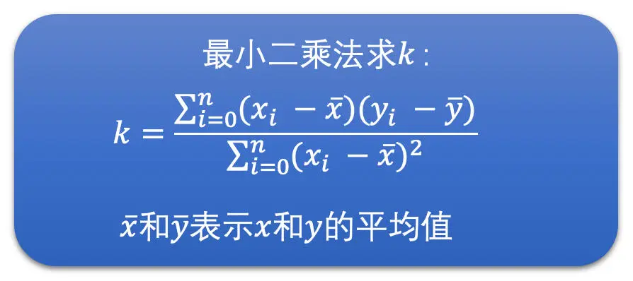

<head>
    
    
</head>

# Table of Contents

1.  [Algorithm](#orgf6a82dc)
2.  [Review](#orgde04ee5)
    1.  [带宽预测：3 大算法准确预估网络带宽](#orgd1cc3c3)
        1.  [带宽预测](#orgaa477f2)
    2.  [码控算法：如何控制视频的编码码率](#org3e64997)
        1.  [码控的原理](#orgda791f4)
        2.  [码控的类型](#orgdbbd617)
        3.  [CBR 算法](#orga206cbd)
        4.  [复杂度求解](#org41625e8)
3.  [Tips](#org9efa57a)
4.  [Share](#org6d916bc)

# Algorithm

Elimination Game: <https://leetcode.com/problems/elimination-game/>

<https://dreamume.medium.com/leetcode-390-elimination-game-99458b053fb>

# Review

攻克视频技术    李江

## 带宽预测：3 大算法准确预估网络带宽

RTP 和 RTCP 使用 UDP 作为传输层协议，因此需要自己实现拥塞控制算法，声网实现了一个全球实时通信网 SD-RTN，并研发了 Agora Universal Transport（AUT）传输算法。SD-RTN 和 AUT 内部实现了适合不同网络模型的拥塞控制和丢包重传等一整套高质量的传输算法和策略

今天，我们主要讨论拥塞控制中的带宽预测算法。带宽预测几乎是整个音视频传输和弱网对抗中最重要的环节，也是最难的环节

由于 WebRTC 在实时音视频中占据绝对的领导地位，它的带宽预测算法非常的成熟，因此，我们今天将以 WebRTC 的带宽预测算法作为讨论的对象，对其进行深入剖析和探讨

### 带宽预测

预测实际的带宽，我们就可以控制音视频数据的发送数据量。比如说，控制音视频数据的编码码率或者直接控制发送 RTP 包的速度，这都是可以的。控制住音视频发送的数据量是为了不会在网络带宽不够的时候，我们还发送超过网络带宽承受能力的数据量，最后导致网络出现长延时和高丢包等问题，继而引发接收端出现延时高或者卡顿的问题。因此，带宽预测是非常重要的

而现在的网络中，大多存在两种类型的网络设备：一种是有较大缓存的；一种是没有缓存或者缓存很小的

-   前者在网络中需要转发数据过多的时候，会把数据先缓存在自己的缓冲队列中，等待前面的数据发送完之后再发送当前数据。这种情况就会在网络带宽不够的时候，需要当前数据等一段时间才能发送，因此表现出来的现象就是网络不好时，延时会加大
-   后者在网络中需要发送的数据过多的时候，会直接将超过带宽承受能力的数据丢弃掉。这种情况就会在网络带宽不够的时候，出现高丢包的现象

通过下面的图很容易理解

为了兼顾这两种类型的网络，WebRTC 中设计了两个主要的带宽预测算法：一个是基于延时的带宽预测算法；一个是基于丢包的带宽预测算法

1.  基于延时的带宽预测算法

    基于延时的带宽预测算法主要是通过计算一组 RTP 包它们的发送时长和接收时长，来判断当前延时的变化趋势，并根据当前的延时变化趋势来调整更新预测的带宽值。比如说
    
    -   如果延时有明显变大的趋势就说明实际带宽值应该比当前的发送码率要小，则需要降低预测的带宽值
    -   如果说延迟没有变大，说明当前带宽良好，可能实际带宽值比当前的发送码率还要大，则可以提高预测的带宽值，直到延时有明显变大的趋势再降低预测的带宽值。我们不断这样实时调整更新带宽，来实现带宽预测
    
    基于延时的带宽预测算法主要有 4 个步骤：
    
    1.  计算一组 RTP 包的发送时长和接收时长，并计算延时
    2.  需要根据当前延时和历史延时的大小来计算延时变化的趋势
    3.  根据延时变化趋势判断网络状况
    4.  根据网络状况调整更新预测带宽值
    
    
    
    1.  计算延时
    
        WebRTC 中计算延时的时候是将 RTP 包按照发送时间来分组的，并且要求当前组中的第一个包和最后一个包的发送时间相差不能大于 5ms，而大于 5ms 则是新的一组的开始。同时，由于 UDP 会出现包乱序到达的情况，可能导致后面包的发送时间比前面包的还小。为了防止这种情况的发生，我们要求乱序的包不参与计算
        
        并且发送端在发送每一个 RTP 包的时候会记录每一个包的包序号和实际发送时间，并把这些信息记录到一个发送历史数据里面方便之后计算使用（这个发送历史数据好几个计算需要用到，挺重要的）
        
        
        
        
        
        同时，接收端收到每一个包的时候也会记录包的包序号和实际的接收时间。每隔一段时间就会将这些统计信息发送到发送端。现在的 WebRTC 版本中接收端是通过 RTCP 协议的 Transport-CC 报文反馈接收信息的，这个报文主要包含两个信息：
        
        1.  每一个包序号对应的包是不是接收到了
        2.  实际的这个包相比前一个包的接收间隔
        
        接收端将这些信息组成 Transport-CC 报文发送给发送端
        
        如果发送端收到这个报文，就可以知道每一个 RTP 包有没有接收到了。如果没有接收到就是丢包了。同时也可以知道没有丢失的 RTP 包的接收时间
        
        发送端就可以根据发送历史数据中各个包的发送时间和 Transport-CC 报文中计算得到的各个包的接收时间，来计算出前后两组包之间的发送时长和接收时长了。计算方法如下
        
        
        
        其中 Transport-CC 报文格式可以参考下图，具体各字段的解释可以参考这个 [RFC 文档](https://datatracker.ietf.org/doc/html/draft-holmer-rmcat-transport-wide-cc-extensions-01) 和 [这篇文章](https://blog.jianchihu.net/webrtc-research-transport-cc-rtp-rtcp.html)。总的来说，就是通过 Transport-CC 报文，我们可以计算得到每一个包是不是丢失了，以及没有丢失的每一个包的接收时间。这里不做过多展开
        
        
        
        将接收时长减去发送时长就是延时了
        
        -   如果接收时长大于发送时长，延时就大于 0，说明当前网络有点承受不了当前的发送数据量，产生了缓存，继而产生了延时
        -   如果接收时长几乎等于发送时长，延时就几乎为 0，说明当前网络可以承受当前的发送量，因此几乎没有延时
        -   如果接收时长小于发送时长，也就是延时小于 0 呢？这种情况比较特殊，一般出现在之前因为网络带宽不够已经缓存了一部分数据，但是网络在明显变好，从而网络设备快速地将缓存中的数据发送出去的时候。这种情况下就会出现接收时长很短，导致接收时长还小于发送时长，这个时候延时就是一个负数
        
        这三种情况具体可参考下图：
        
        
        有了延时之后，我们还不能直接使用这个延时来判断网络的好坏，因为网络变化很快而且存在噪声，有的时候延时会因为网络噪声突然变大或变小。因此，我们需要通过当前延时和历史延时数据来判断延时变化的趋势，来平滑掉网络噪声引起的单个延时抖动
        
        说到这里就必须引入一个重要的滤波器，那就是 Trendline Filter。这个滤波器就是用来计算得到延时变化趋势的
    
    2.  延时变化的趋势
    
        Trendline Filter 中保存了 20 个最近的延时数据，这些延时数据跟前面直接计算的延时还不完全一样。它们包含了两个部分：一个是当前这个 RTP 包组所属的 Transport-CC 报文到达发送端的时间；另一个是经过平滑后的累积延时，它是通过前面计算得到的延时和历史累积延时加权平均计算之后得到的。这样也可以一定程度上防止延时波动太大的问题
        
        在 WebRTC 看来，如果设 RTP 包组所属的 Transport-CC 报文的到达时间为 x，累积延时为 y 的话，那么 x 和 y 应该是呈线性关系，也就是说 y = kx + b。Trandline Filter 就是使用 20 个延时数据，通过线性回归的方法，求得其中的 k 值，也就是斜率。这个斜率就表示延时变化的趋势。其中线性回归的求解方式用的是最小二乘法。示意图和求解公式如下
        
        
        
        
        
        
        
        当斜率 k > 0 时，表示有延时；当 k = 0 时，表示几乎没有延时；当 k < 0 时，表示不仅没有延时，反而接收速度更快
        
        我们还需要一个根据当前延时趋势和延时阙值，来判断网络是不是真的变好和变坏的模块，叫做过载检测器
    
    3.  网络状态判断
    
        过载检测器有两个主要的工作：一个是通过当前的延时趋势和延时阙值来判断当前网络是处于过载、欠载还是正常状态；一个是通过当前的延时趋势来更新延时阙值，是的，延时阙值不是静态不变的，阙值是跟着延时趋势不断自适应调整的
        
        我们下面先来看看网络状态的判断，之后再来讨论一下阙值的更新
        
        网络状态的判断其实比较简单。就是将延时趋势 k 乘以一个固定增益 4 和包组的数量（包组数量最大是 60）作为当前的修改后延时值。将当前的修改后延时值跟延时阙值进行比较，然后根据比较的结果来判断网络状态。步骤如下图所示：
        
        
        
        得到网络状态后，我们会使用当前的修改后的延时值去更新当前的延时阙值。为什么需要这么做呢？
        
        我认为，延时阙值的更新是因为网络是不断变化的，延时变化也很快，而有的时候延时很大，有的时候又很小。为了防止阙值太大，网络状况检测不够灵敏，同时也防止阙值太小，网络状况检测太敏感了。所以延时阙值会随着当前的延时做缓慢的调整。其调整的公式如下
        
        
        
        有了修改后延时和延时阙值之后，我们就可以计算网络状态了。又根据网络所处的具体状态，我们就可以调整更新当前的带宽值了。而负责更新带宽值的模块就是速率控制器。下面我们就来详细讨论一下如何将网络状态转化到实际带宽的调整上去
    
    4.  带宽调整更新
    
        速率控制器的主要工作是更新预测带宽值。它里面维护着一个状态机。这个状态机主要是用来干什么的呢？其实，状态机主要用来根据过载检测器检测到的网络状态和状态机目前所处的状态，来更新状态机的状态的
        
        状态机有三个状态，分别是上升、保持和下降状态。当处于上升状态时，速率控制器需要提升带宽值；当处于下降状态时，需要降低带宽值；当处于保持状态时，则不更新带宽值。我们通过下图来看一下过载检测器检测到的网络状态是如何影响状态机状态变化的
        
        
        
        我们可以看到，当过载检测器检测到过载时，状态机都切换到下降状态。这个很好理解，因为过载意味着实际带宽值小于发送码率了，需要调低带宽值，继而发送码率因为预估带宽值下降了也会下降
        
        当过载检测器检测到正常时，状态机都向上调一个状态，什么意思呢？
        
        就是如果之前状态机处于下降状态，则更改为保持状态；如果状态机之前处于保持状态，则更改为上升状态；如果是上升状态那就不用变化了。这个也好理解，因为过载检测器检测到正常，说明当前实际发送数据量还没有达到网络的最大承受量，则可以继续调高预估带宽值，或者之前在降低带宽值的话，就不再继续降低预估带宽值了
        
        当过载检测器处于欠载的状态时，状态机全部切换到保持状态。这个有点不好理解。欠载了不是需要直接提高预估带宽值的吗？为什么保持带宽不变呢？
        
        这是因为 WebRTC 认为欠载主要发生前面因为过载了在网络设备中缓存了一定数据，之后网络状态变好了的时候，网络设备可以快速的发送完缓存中的数据，从而排空缓存。这个时候不要提高发送码率，等缓存排空之后，因为缓存带来的延时就会接近于 0 了，这对于降低端到端延时是很有用的，而过载检测器自然就会进入到正常状态。这样状态机就可以切换到上升状态，从而也就可以调高预估带宽值了
        
        下面我们介绍一下具体调节预估带宽的公式
        
        带宽调整更新逻辑中，上调带宽逻辑比较复杂。因此，我们先介绍相对简单点的下降带宽调整。下降带宽其实很简单，就是预估带宽等于 0.85 倍的接收码率
        
        
        
        但是下降带宽的时候需要做另外一个事情就是更新当前网络的最大带宽。因为处于下降带宽的过程中，说明当前发送数据量已经达到甚至超过了网络的承受能力。这个时候适合更新网络的最大带宽，将当前的接收码率与之前的最大带宽做加权平均求得当前的最大带宽，并更新最大带宽的标准差。这两个值之后调高带宽的时候需要用
        
        这个地方需要提一下，为什么预估带宽和最大带宽都是用接收码率来计算的，那是因为发送码率可能会超出网络承受能力，不一定能很好的反映真实的网络带宽，相比而言，接收端的接收码率更能够表示真实的网络带宽
        
        在上升带宽的时候，是有两种情况的
        
        当前接收码率离最大带宽比较远，具体就是当前接收码率大于最大带宽加上 3 倍的最大带宽标准差，或者小于最大带宽减去 3 倍的标准差。这个时候应该快速调高预估带宽，我们使用的是乘性增的方式增加带宽值，就是每隔一秒钟将预估带宽乘以 1.08 倍。但是为了防止带宽大幅增长，预估带宽不能大于 1.5 倍的接收码率
        
        当前接收码率离最大带宽近，具体就是当前接收码率大于最大带宽减去 3 倍标准差，并小于最大带宽加上 3 倍标准差。这时使用更小的幅度增加带宽，使用加性增的方式增加带宽值。预估带宽是每隔一个 RTT（往返时间，由其它模块计算得到）增加半个包的大小。如果一个包按照 1400 字节算的话，那就是每过一个 RTT 的时间就增加 700 字节
        
        

2.  基于丢包的带宽预测算法

    当网络上有较大缓存的网络设备在遇到数据量太大的时候会把数据放在缓存中，延迟发送。其表现就是网络延时加大。这种情况下我们基于延时做带宽预测是比较准确的
    
    而没有缓存或缓存很小的网络设备，在遇到数据量太大的时候是直接将数据丢弃的。这会引起丢包率上升。为了能够更快更准确地做带宽预测，WebRTC 针对这种情况设计了基于丢包的带宽预测算法
    
    基于丢包的带宽预测算法相比基于延时的带宽预测算法简单很多，没有那么多步骤。其整体思路就是根据 Transport-CC 报文反馈的信息计算丢包率，然后再根据丢包率的多少直接进行带宽调整更新
    
    1.  丢包率的计算
    
        接收端将接收到的每一个包的信息放到 Transport-CC 报文中，包括每一个 RTP 包的序号以及这个包有没有接收到。而没有接收到就代表这个包丢失了。这样就简单了，发送端收到这个 Transport-CC 报文之后只需要统计这个 Transport-CC 报文总共有多少个包，以及丢失了多少个包，就可以计算得到丢包率了
        
        
    
    2.  带宽调整
    
        有了丢包率之后，我们就可以做带宽调整了。根据丢包率可以分三种情况。具体如下：
        
        -   如果丢包率 < 2%，认为当前网络状况很好，需要调高带宽值，带宽值等于过去 1 秒钟所有预测得到的带宽值的最小值 \* 1.08
        -   如果 2% < 丢包率 < 10%，认为当前网络状况正常，不做带宽调整
        -   如果丢包率 > 10%，认为网络状况不好，需要降低带宽值，带宽值等于当前预估带宽值 \* (1 - 0.5 \* 丢包率)
        
        如下图
        
        
        
        由于网络中一般两种网络设备都有，因此，最终的预估带宽值等于这两者中的最小值
        
        这里有一个问题，在网络变差的时候，预估带宽会快速地被下调，但是网络变好的时候预估带宽会比较缓慢的上升，同时如果当前发送码率比较小的话，预估带宽还会被限制，不能超过 1.5 倍的接收码率
        
        也就是说，如果我们当前视频处于静止画面的状态，发送的码率会很小。这样预估带宽就很难从一个比较小的带宽调整上去。如果此时画面突然动起来，即便实际网络带宽足够，还是会因为预估带宽不够而限制发送码率，从而导致画面出现模糊和马赛克等问题
        
        还有就是程序刚开始启动的时候，预估带宽的爬升也需要慢慢的加上去。但是在做音视频通信的时候，有可能一开始就会出现视频画面变化比较快的情况，这样可能刚开始的时候视频画面就会是模糊的或者有很多马赛克
        
        下面我们讲第三种带宽预测算法，用来解决上面的问题，它可以帮助我们快速地探测出当前网络的最大带宽

3.  最大带宽探测算法

    第一步，发送端设定一个探测的目标带宽，一般设置为当前带宽的 2 倍、3 倍或者 6 倍。发送端在发送数据的时候就以这个探测目标带宽的速度快速发送 RTP 包，一般发送时间（也叫做探测时间）是 15ms，同时将这段时间用于探测使用的 RTP 包信息保存在发送端（前面基于延时的带宽预测的时候，也需要保存发送的 RTP 包的发送时间等信息，其实都是保存在发送历史数据里面，只是探测的 RTP 包会多保存一些信息），并给这些 RTP 包标上是探测包的标记以及探测的 cluster_id，每一次探测使用的 cluster_id 都不同，用于区分每次探测的 RTP 包，防止多次探测时弄混了
    
    
    
    第二步，接收端并不关注当前包是不是探测包，而是直接统计每一个包的序号和接收时间，将统计结果组成 Transport-CC 报文反馈给发送端
    
    第三步，发送端接收到 Transport-CC 报文之后，会看报文中的每一个包是不是探测包，如果是探测包，就从发送端发送的历史数据中，取出其 cluster_id 和发送时间，并且从 Transport-CC 报文中得到接收时间，再把这些信息送入到探测带宽计算器中，当探测带宽计算器中相同 cluster_id 的 RTP 包信息数量达到一定值之后，就可以计算最终探测到的带宽值了。计算方法如下
    
    -   首先，根据发送的探测 RTP 包总大小，和探测 RTP 包的总发送时间，相除就得到了发送端的最大带宽值了
    -   然后，再根据接收端接收到的探测 RTP 包总大小，和探测 RTP 包的总接收时间，相除就得到了接收端的最大带宽值了
    -   之后，取两者中的最小值作为探测到的网络最大带宽值。同时，如果接收端的最大带宽小于 0.9 倍的发送带宽，说明当前探测目标带宽已经到了最大带宽了，为了保险一些，最后将最大带宽取为接收端最大带宽的 0.95 倍
    -   最后，如果当前过载检测器检测不是在过载状态的话，预估带宽值更新为探测到的最大带宽值
    
    具体如图所示：
    
    
    
    
    
    最大带宽探测算法一般是在程序刚开始启动的时候使用并在程序运行的过程中进行周期性的探测，每隔一段时间定时探测一下。其实如果你自己设计带宽预测算法的话，也可以在实际发送带宽很小的时候探测一下，防止出现因为实际发送码率很小，而无法准确预测网络当前最大带宽值的问题

## 码控算法：如何控制视频的编码码率

我们先简单看一下码控算法的原理和类型，然后再重点讲解其中最难也是在 RTC 场景中最重要的 CBR 码控算法

通过下面的图可以清楚地了解码控算法在整个发送端流程中的位置和重要性

### 码控的原理

码控，就是码率控制，它是编码器的一个重要模块，主要的作用就是用算法来控制编码器输出码流的大小。虽然它是编码器的一个非常重要的部分，但是它并不是编码标准的一部分，也就是说，标准并没有给码控设定规则。我们平时用的编码器的码控都是编码器程序自己实现的

那码控的原理是什么呢？其实码控就是为每一帧编码图像选择一个合适的 QP 值的过程

我们知道当一帧图像的画面确定了之后，画面的复杂度和 QP 值几乎决定了它编码之后的大小。由于编码器无法决定画面的复杂度，因此，码控的目标就是选择一个合适的 QP 值，以此来控制编码后码流的大小。当然有些码控算法是可以直接外部指定哪个 QP 值去编码的，就不需要编码器的码控算法去做决策了。但是最后的原理是一样的

### 码控的类型

常用的码控算法主要有：VBR（动态码率）、CQP（恒定 QP）、CRF（恒定码率因子）和 CBR（恒定码率）这几种

VBR 指的是编码器输出码率随着原始视频画面复杂度的变化不断的变化。通常当画面复杂或者说运动比较多的时候使用的码率会比较高；而当画面比较简单的时候使用的码率会比较低。VBR 主要的目标是保证视频画面质量，因此比较适合视频点播和短视频场景使用

CQP 很简单就是从头到尾每一个画面都是用同一个 QP 值去编码。根据我们视频编码的课程可知：

-   在画面复杂的时候，残差比较大，相同 QP 值做量化之后的残差还是比较大的，编码之后的图像大小就会比较大
-   而画面简单的时候，残差很小，同一个 QP 值量化之后残差可能很小，甚至都为 0 了，编码之后的大小就会很小

觉得 CQP 是一种特殊的 VBR，但要注意的是 CQP 一般用来衡量编码算法的性能，在实际工程当中不会使用

CRF 是 x264 默认的码控算法。它与 CQP 不同的是它的 QP 是会变化的。在画面运动大的时候，它会根据具体算法提高 QP 值；在画面运动小的时候，它会降低 QP 值

它的思想是：运动很大的时候，人眼不太关注细节，因此 QP 可以稍微大一点；运动比较小的时候，人眼会将注意力放在细节上面，因此 QP 稍微小一点。所以相比 CQP，CRF 能够更省码率一些。但是 CRF 码控总体上得到的编码后图像的大小，还是随着图像的画面复杂度在变化的。因此，我觉得 CRF 也算是一种特殊的 VBR

CBR 是恒定码率，这种码控方式用户需要设置一个目标码率值给编码器。编码器在编码的时候不管图像画面复杂或简单、运动多或运动少的时候，都尽量使得输出的码率接近设置的目标码率

这种方式非常适合 RTC 场景，因为 RTC 场景希望编码的码率跟实际预测的带宽值接近，不能超出目标码率太多，也希望能够尽量有效地利用可用带宽，不能太低于目标码率，从而尽量保证编码后图像画面清晰

因此，在 RTC 场景中，我们会将预估带宽分出一定比例给视频数据，并将这部分带宽值当作目标码率设置给编码器。需要编码器的码控算法，能够在各种网络状态下和各种画面变化的情况下，都能使得输出的码率尽量接近于当前预估带宽得到的目标码率

### CBR 算法

为了实现恒定码率，我们需要做很多个步骤，一步步的将输出码率逼近目标码率，而不是一步到位确定 QP 就可以实现恒定码率的目标的。所以，我们会分很多级做调整，分别是帧组级、帧级、宏块组 GOM（Group of MB）级。具体如下图所示：

具体的操作过程如下：

-   先确定帧组级（帧组就是将连续的几个帧组成一组，一般选择 8 个帧一组）的输出大小尽量接近目标码率
-   然后，确定组内的每一帧具体应该分配多少的大小（称之为目标帧大小），才能保证帧组最后输出的大小可以达到要求
-   接下来，我们再根据这个目标帧大小，确定一个帧级的 QP 值
-   之后，我们再确定帧内的宏块组（宏块组就是连续的几行宏块组成的一组宏块，一般可以选 4 行宏块）应该分配多少大小，来保证当前帧最后的输出大小能接近于目标帧大小
-   最后，我们再确定宏块的 QP 值
    
    还有一个很重要的事情，就是我们需要能够保证在不同的画面复杂度和不同的运动程度的情况下，并且输出码率都要尽量接近目标码率的话，我们还需要先计算得到当前帧的复杂度

简单来说，这个复杂度是能够大概衡量当前帧在做完预测之后残差值的总体大小的。当然，我们并不是真正去做预测得到残差的，而是通过一些算法近似估算一下残差的大概大小的。因为残差的大小和 QP 值决定了最后图像编码后的大小

同时，在这里说明一下，因为我们主要讲解 RTC 下的 CBR 码控，所以我们只考虑 I 帧和 P 帧，不考虑 B 帧

下面我们讲如何计算图像的复杂度，之后我们再依次讨论一下如何在帧组级、帧级、宏块组 GOM 级别做码控操作，最后得到宏块的 QP 值

### 复杂度求解

根据帧类型复杂度求解可以分为两种算法：第一种就是 I 帧的复杂度计算；第二种就是 P 帧的复杂度计算

I 帧只做帧内预测，而帧内预测是用编码块周围已编码的像素来预测当前编码块的像素值的，因此，方差是一个比较能够表达 I 帧复杂度的值

方差越大，表示帧的内部变化程度越剧烈，而你用周围的像素去预测当前编码块的像素值的话，有很大的可能会产生较大的残差。而方差越小的话，说明帧内的变化比较小，因此周围像素有较大的概率能够比较好的预测出待编码块的像素值。因此，我们计算 I 帧的复杂度的时候，是求每一个宏块的方差，最后将帧的所有宏块的方差之和作为帧的复杂度。具体求解过程如下图所示

P 帧主要做帧间预测，我们知道，帧间预测就是去参考帧中找一个块来作为当前帧编码块的预测块，因此，我们选择使用将当前帧的宏块减去参考帧对应位置的宏块，求 SAD 值，并将所有宏块的 SAD 值加起来作为 P 帧的复杂度。具体求解过程如下图所示

我们会保存记录下 I 帧和 P 帧内部每一个宏块的复杂度值，这是因为后面还有地方会使用到

1.  帧组级

    CBR 虽然是恒定码率，但它的意思是保证一段时间内的输出码率接近目标码率，比如说 1 秒或者几百毫秒，而不是保证每一帧输出都严格接近目标码率的
    
    这是因为算法没办法做到每一帧都这么精确。算法是根据一段时间内前面已经编码的结果来调节还未编码帧的 QP，从而来达到一组帧的输出大小尽量接近目标码率的。因此，我们在开始的时候，需要根据目标码率来确定帧组的目标大小，之后再确定帧组内每一帧的目标大小
    
    我们先根据设定的目标码率和帧率值将两者相除，就可以计算得到每一帧的平均大小。然后，我们将帧组的帧数（一般 8 个帧作为一组）乘以帧的平均大小，就是帧组的目标大小了
    
    在编码器刚开始编码的时候，帧组的剩余大小就是帧组的目标大小。当编码帧组中第一帧的时候，我们将帧组的剩余大小除以帧组的帧数，就得到帧组中第一帧的目标帧大小。当帧组中的第一帧编码完成之后，我们需要用第一帧的实际编码后的大小来更新帧组的剩余大小
    
    很简单就是将帧组的剩余大小减去第一帧编码后的实际大小。然后，第二帧的目标帧大小就是等于更新后的帧组的剩余大小除以帧组的剩余帧数。如此继续这样计算下去
    
    具体计算过程可以参考下图
    
    

2.  帧级

    有了帧组级目标帧大小后，我们就能够计算当前帧的 SliceQP 了（我们这里为了讲述原理尽量简单清晰，只考虑一帧一个 Slice，多 Slice 原理是一致的）
    
    我们根据前面计算得到的当前编码帧的帧复杂度和目标帧大小，再加上前面已经编码完成了的帧的复杂度和编码使用的 QStep（与 QP 一一对应）以及使用这个 QStep 编码之后实际的编码大小来计算。公式如下：
    
    
    
    I 帧和 P 帧使用不同的公式，因为复杂度的计算方式不一样
    
    公式大体的意思是：一帧编码后的大小应该是和帧的复杂度成正比的，并且跟帧使用的 QStep 是成反比的。但是具体多少比例怎么知道呢？
    
    我们不知道，但是我们可以根据前面已经编码好了的帧估算一下。我们先大体计算一下，它们这些帧的复杂度和 QStep 跟最终的编码大小大概成多少比例。然后再使用这个比例来估算在当前帧的复杂度下，我们大概需要使用多少的 QStep 能使得输出的大小尽量接近目标帧大小
    
    我们通过上面的公式计算得到了当前编码帧的 QStep 了，再通过之前章节里 QStep 和 QP 转化表格就可以转换成相应的 SliceQP 了
    
    像 VP8 编码，它没有宏块级别的 QP 值，到这里就确定了最终的 QP，但 H264 还可以在宏块级别调整宏块的 QP，因此，为了更精细化地调节码率，我们还可以根据已经编码宏块的实际使用的大小来调整未编码宏块的 QP

3.  GOM 级

    帧的实际剩余大小是用帧的目标大小减去帧中已编码 GOM 的实际大小。我们再使用帧的实际剩余大小加上前一个 GOM 的实际编码大小，减去该 GOM 的目标大小，就是帧的目标剩余大小
    
    帧的实际剩余大小加上 GOM 的实际编码大小，就是去掉前一个 GOM 的目标大小，再减去前一个 GOM 的目标大小，就是当前的帧目标剩余大小了
    
    具体计算过程如下图所示
    
    
    
    我们将帧的实际剩余大小除以帧的目标剩余大小：
    
    -   如果这个比例大于 1，说明我们剩余的大小多了，之后的 GOM 可以将 QP 调低一些，我们将后面的 GOM 中的宏块 QP 值减去 1 或者 2 即可
    -   如果这个比例小于 1，说明我们剩余的大小少了，之后的 GOM 的 QP 需要调高一些，我们将后面的 GOM 中的宏块 QP 值加 1 或者 2 即可
        
        也就是说，通过这个计算之后，我们就得到了 GOM 中所有宏块的 QP 值了。然后，我们再根据这个 QP 值去编码每一个宏块
    
    到这里我们还有一个步骤要做，就是需要计算一下当前 GOM 的目标大小，以备下一个 GOM 编码的时候做 GOM 级码控计算的时候使用
    
    GOM 的目标大小是通过当前 GOM 的复杂度、当前帧剩余 GOM 的复杂度之和以及帧的剩余大小来计算的。计算公式如下所示
    
    
    
    GOM 的复杂度的值用前面复杂度计算是记录保存的宏块复杂度的值来计算的
    
    其实，我们还可以通过每一个宏块调整一下 QP 的方式来做进一步精细化的调节，但是这个内容有点复杂了。这里不展开讲解

# Tips

Schroeder 混响

<https://ccrma.stanford.edu/~jos/pasp/Schroeder_Reverberators.html>

人造混响的主题于 1960 年代由 Manfred Schroeder 和 Ben Logan 提出。早期 Schroeder 混响包含如下元素；

-   一些全通过滤器的系列连接
-   一个反馈梳妆过滤器的并行边
-   一个混合矩阵

上图是一个例子，该图中

$ AP^{g}_ {N} \\triangleq \\frac{-g + z^{-N}}{1 - gz^{-N}} $

记为一个 Schroeder 全通段带延迟长度 N 采样及系数 g

$ FBCF^{g}_ {N} \\triangleq \\frac{1}{1 - gz^{-N}} $

记为一个反馈梳妆过滤器带延迟长度 N 及采样 g，且 MM 记为混合矩阵

$ MM = \\left[ \\begin{array}{llll} 1 & 1 & 1 & 1 \\\\ -1 & -1 & -1 & -1 \\\\ -1 & 1 & -1 & 1 \\\\ 1 & -1 & 1 & -1 \\end{array} \\right] $

其可以用四个加法和两个取负来有效实现

$ OutA = s_ {1} + s_ {2} $

$ OutB = -OutA $

$ OutC = -OutD $

$ OutD = s_ {1} - s_ {2} $

$ s_ {1} = x_ {1} + x_ {3} $

$ s_ {2} = x_ {2} + x_ {4} $

全通过滤器提供“无色”高密度回响在混响器的后期脉冲响应中。这些全通过滤器也作为散射器。当全通过滤器在理论上“无色”，感知上，它们的脉冲反应当它们极端短时（小于 10ms大约）是无色。更长的全通脉冲反应听起来跟反馈梳妆过滤器相似。对稳定状态的音调，比如正弦波，全通属性在每个频率给出相同的增益，不像梳妆过滤器

Schroeder 建议一个全通延时线的过程长度接近

$ M_ {i}T \\approx \\frac{100 ms}{3^{i}}, \\qquad i = 0, 1, 2, 3, 4, $

且接近互斥的素数。选择 100 ms 使得当 g = 0.708，60 dB（$ t_ {60} $）延时为 2 秒。这样，对 $ i = 0, t_ {60} \\approx 2 $，且每个连续全通有一个脉冲反应大约是之前一个的三分之一。以这种方式使用 5 个系列全通过滤会出现一个每秒 810 的脉冲反应回响密度，其接近想要的每秒一千

平行梳妆过滤器边在混响器频率反应预想给出一个心理上适合的波动。一个反馈梳妆过滤器可模拟一对平行墙，这样可选择在每个梳妆过滤器上延迟线长度为它从一个平面波到从一个墙广播到另一个并返回的采样数量。然而，在他原始论文中，Schroeder 描述了一个更心理学上的接近动机：

对一个 1 秒混响时间的房间在每 100 cps [Hz] 间隔有 15 个大的反应高峰。但，可能希望如果一个人造混响器有一个可比较的反应峰值它会更像一个真实的房间。我们能够确定这个期望通过主观评估混响器反应包含几个并行连接的梳妆过滤器。对一个 0.04 秒的延时，每 100 cps [Hz] 的反应峰值数为 4。这样，并行 3 到 4 个不对称延迟的梳妆过滤器，需要估计有 T[60] = 1 秒混响时间的频率反应的房间的峰值数。同样，梳妆过滤器的开放循环增益不应该超过 0.85 或 -1.4 dB 来防止反应波动过度

这样，可以选择多少任意的梳妆过滤器延迟线长度，且使用足够的并行（素数延迟线长度）来达到在频率反应数量级上的一个可感知适配波动密度

最后，对多频道听，Schroeder 建议在混响器输出一个混合矩阵，它的目标是取出任意数目的未矫正的音频频道混响（对任意数量的输出说话者）

# Share

