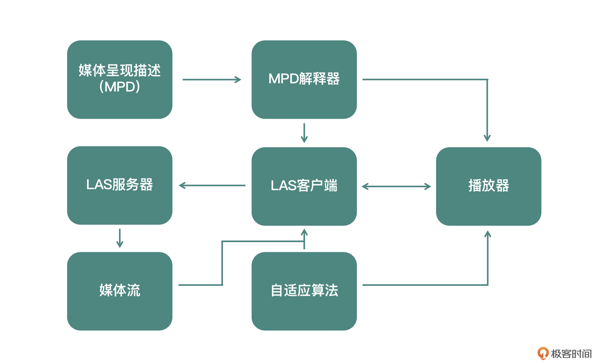
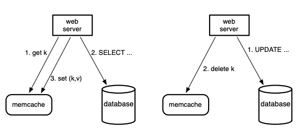

<head>
    
    
</head>

# Table of Contents

1.  [Algorithm](#orgc2e6ec3)
2.  [Review](#org8075d53)
    1.  [如何做音视频的封装与转码](#orgb6d52a4)
        1.  [封装容器格式：MP4](#org7db09a1)
    2.  [直播行业的发展概况与技术迭代](#org1771992)
        1.  [行业的演变](#orga6db7b0)
        2.  [技术迭代](#orgfe3c54d)
        3.  [小结](#orge03383a)
    3.  [如何使用 ffprobe 分析音视频参数内容](#org87066a4)
        1.  [音视频容器格式分析](#org1a6415c)
        2.  [音视频流分析](#orgc237df2)
        3.  [音视频包分析](#orgc93ce0a)
        4.  [音视频帧分析](#org77051cb)
    4.  [如何高效查找并使用 FFmpeg 常用参数](#org8b93a3a)
        1.  [FFmpeg 输入输出组成](#orga213469)
        2.  [如何查找各个模块参数的帮助信息](#org3f5d786)
        3.  [FFmpeg 公共基础参数](#org34bb278)
    5.  [FFmpeg 和它的朋友们是怎么处理 MP4 的](#org678f7e2)
        1.  [用 FFmpeg 生成 MP4 文件](#orgf9a63e9)
        2.  [faststart 参数](#orgd4b30fe)
        3.  [DASH 参数](#org8919e56)
        4.  [用 FFmpeg 解析 MP4 文件](#org46489df)
        5.  [如何用 GPAC 生成 MP4](#org33dee81)
        6.  [Shaka-Packager 的 HLS 与 DASH](#org9f5e49d)
    6.  [如何使用 FFmpeg 与 Handbrake 做转码](#orgd3d9bbc)
        1.  [如何使用 FFmpeg 转码](#orgfc7ba87)
3.  [Tips](#org7497310)
    1.  [iOS 平台音频渲染（一）：使用 AudioQueue 渲染音频](#org6d5da76)
        1.  [AVAudioSession](#org652fc80)
        2.  [AudioQueue 详解](#orge1a3583)
        3.  [AudioQueue 运行流程](#org5b25c36)
        4.  [iOS 平台的音频格式](#org1eb44eb)
    2.  [iOS 平台音频渲染（二）：使用 AudioUnit 渲染音频](#orgcb666de)
        1.  [AudioUnit 的分类](#orgfb5f561)
        2.  [创建 AudioUnit](#orgffb4305)
        3.  [RemoteIO 详解](#org7a86039)
        4.  [小结](#org5683819)
    3.  [移动平台的视频渲染（一）：OpenGL ES 基础](#org51cd03a)
        1.  [视频渲染技术选型](#orgd103508)
        2.  [平台上的 API](#org0838e62)
        3.  [跨平台的 OpenGL ES](#orgcf64bc8)
        4.  [平台提供的最新技术](#org2fa5e34)
        5.  [OpenGL ES](#org3e9f698)
    4.  [移动平台的视频渲染（二）：OpenGL ES 上下文环境搭建](#org32b8082)
        1.  [自定义一个 EAGLView](#org8f55a1f)
        2.  [构建 EAGLContext](#orgbaf01a2)
        3.  [窗口管理](#orgb14ba96)
        4.  [SDL 的介绍和使用](#org9a6ba90)
    5.  [移动平台的视频渲染（三）：OpenGL ES 实操](#orgb6673a9)
        1.  [GLSL 语法与内建函数](#org491615d)
        2.  [GLSL 的内置变量与内嵌函数](#org3b1151d)
        3.  [OpenGL ES 的纹理](#org5d4fe08)
        4.  [纹理坐标系](#orgfd68d57)
        5.  [纹理创建和绑定](#org5bac937)
        6.  [纹理的上传与下载](#org610974d)
        7.  [物体坐标与纹理绘制](#orgc66cffd)
4.  [Share](#org33b8af6)
    1.  [简介](#org66cf3c7)
    2.  [概括](#org033656e)
        1.  [查询缓存](#org2e31bb5)
        2.  [一般化缓存](#org2ce3cc1)
    3.  [一个簇中的延迟和加载](#orgad688be)
        1.  [减少延迟](#orgf564775)
        2.  [减少负载](#org9bf5089)
        3.  [处理异常](#org2a76a23)
    4.  [领域中：复制](#orgb42741c)
        1.  [领域无效](#orga4fcd2e)
        2.  [领域池](#orgd37a856)
        3.  [冷簇热身](#org11a2c86)
    5.  [跨领域：一致性](#org711928f)

# Algorithm

Leetcode 460: LFU Cache: <https://leetcode.com/problems/lfu-cache/>

<https://dreamume.medium.com/leetcode-460-lfu-cache-32d4ac1a9965>

# Review

音视频技术入门课    刘岐

## 如何做音视频的封装与转码

视频转码主要涉及编码压缩算法（Encoding）、格式封装操作（Muxing）、数据传输（例如 RTMP、RTP）、格式解封装（Demuxing）、解码解压算法（Decoding）几方面的操作。这些操作需要一个共识的协定，所以通常音视频技术都会有固定的参考标准

标准中没有写明的，通常兼容性不好。所以在我们将视频流、音频流写入到一个封装容器中之前，需要先弄清楚这个容器是否支持我们当前的视频流、音频流数据

### 封装容器格式：MP4

MP4 格式标准为 ISO-14496 Part 12、ISO-14496 Part 14，标准内容并不是特别多，如果要了解 MP4 的格式信息，我们首先要清楚几个概念：

1.  MP4 文件由许多 Box 和 FullBox 组成
2.  每个 Box 由 Header 和 Data 两部分组成
3.  FullBox 则是 Box 的扩展，在 Box 结构的基础上，在 Header 中增加 8bit 位 version 标志和 24bit 位的 flags 标志
4.  Header 包含了整个 Box 的长度的大小（Size）和类型（Type），当 Size 等于 0 时，代表这个 Box 是文件中的最后一个 Box；当 Size 等于 1 时说明 Box 长度需要更多的 bits 位来描述，在后面定义一个 64bits 位的 largesize 用来描述 Box 的长度；当 Type 为 uuid 时，说明这个 Box 中的数据是用户自定义扩展类型
5.  Data 为 Box 的实际数据，可以是纯数据，也可以是更多的子 Box
6.  当一个 Box 中 Data 是一系列的子 Box 时，这个 Box 又可以称为 Container Box

MP4 文件中 Box 组成，你可以仔细阅读一下 [参考标准 ISO-14496 Part 12](http://mp4ra.org/#/references)

MP4 封装格式文件中，我们经常会遇到 moov box 与 mdat box。我们存储音频与视频数据的索引信息，就是存在 moov box 中，音频和视频的索引信息在 moov 中分别存储在不同的 trak 里面，trak 里面会保存对应的数据采样相关的索引信息，通过获得 moov 中的索引信息之后，根据索引信息我们才能从 mdat 中读取音视频数据，所以 MP4 文件中必不可少的是 moov 信息，如果缺少 moov 信息的话，这个点播文件将无法被成功打开

关于 MP4 封装里面能否存放我们当前想存的 codec，还需要查找一下参考标准或者公共约定的标准，看看是否允许存放，你可以参考 [MP4 网站](http://mp4ra.org/#/codecs)

moov 一般在 MP4 文件的头部，一般需要先写入 mdat 中的音视频数据，这样我们就知道数据采样存储的位置和大小，然后才能写入到 moov 中，解决办法是生成文件之后做一个后处理，也就是将 moov 移动到 mdat 前面

## 直播行业的发展概况与技术迭代

### 行业的演变

2013 年秋天，SimpleRtmpServer（SRS）的出现为 RTMP 服务器的建设带来了革命性的改变，SRS 发展至今已经发布了 4.0 版本，它采用了比较前卫的协程方式（用 StateThread 做基础库）做任务控制，而如果需要提升更高的并发，需要扩展多进程的方式，就可以借助第三方的能力来处理，例如 Docker，自己启动多进程来控制多任务

SRS 原生支持的功能比较全，例如 RTMP 转 HTTP+FLV、转 HLS、转 WebRTC 等常用功能，运维操作方面支持 Reload，项目文档健全。在互联网娱乐直播领域，由于 RTMP 可以保证从画面采集端至播放器端的整体延迟在 3s 左右，所以这个协议被广泛应用

与此同时，支持动态多码率的解决方案 HLS（HTTP Live Streaming）与 DASH（Dynamic Adaptive Streaming over HTTP）目前还在以草案的方式向前迭代，并未发布正式的参考标准。FFmpeg、Gstreamer 等工具软件，也在跟随草案的更新进行功能迭代。当时，HLS 主要用于移动端与电视盒中，DASH 也开始逐步被一些服务商采用，比如 Youtube、Vimeo、Akamai 等

同期动态多码率的解决方案除了 HLS 和 DASH 外，还有 Adobe 的 HDS（HTTP Dynamic Streaming）。由于 HDS 的参考标准并不像 HLS 和 DASH 那样，由 RFC 或者 ITU 两个开发标准定制、组织、维护，而是 Adobe 自己在维护，所以推动起来并不是很顺畅，应用的客户也并不多

从 2013 年开始，基于 RTMP 的直播平台开始逐渐发迹，呈现形式也主要是互联网的 Web 浏览器。基于 RTMP 协议的直播称为主流选择的原因如下

1.  Flash Player 能够直接播放基于 RTMP 协议传输的音视频数据
2.  Web 浏览器已经默认内置 Flash Player 插件，不需要额外安装插件
3.  RTMP 推流、播放有很多开源实现，能够快速搭建起端到端的解决方案

技术的成熟使 PC 端涌现出大量基于 Web 浏览器的视频秀场类直播、游戏类直播以及部分户外直播。与此同时，移动端直播 App 也开始零零散散地出现

2015 年，一个名为“17“的移动端 App 毫无征兆地成为了当时的爆款，但又迅速被 App Store 下架。自此事件开始，直播领域拉开了千播大战的序幕。各色各样的直播 App 开始被大力推广，其底层的技术原理大同小异，推流协议也仍然是 RTMP，拉流协议均以 RTMP 或 HTTP+FLV 为主，各家 App 主要的差别在于起播时间，视频清晰度以及直播卡顿率

直播应用主要集中在以下四大领域

1.  广电单向发布直播流，如 IPTV、电视盒、常用 HLS、DASH、HDS 这类端到端且画面延迟 10s 左右的直播流媒体协议
2.  安防监控采集直播流，如海康、大华、水滴摄像头等，常用 H.323/SIP+RTP 等延迟 50ms～500ms 左右的协议
3.  互联网/移动互联网互娱直播流，如秀场直播、游戏电竞直播、户外活动直播、街拍直播等，常用 RTMP、HTTP+FLV 等延迟 3s 左右的直播协议
4.  视频会议直播流，如 Polycom、Cisco 等，常用 H.323/SIP+RTP 协议

我们看一下这四个领域的特点

<table border="2" cellspacing="0" cellpadding="6" rules="groups" frame="hsides">

<colgroup>
<col  class="org-left" />

<col  class="org-left" />

<col  class="org-left" />

<col  class="org-left" />

<col  class="org-left" />
</colgroup>
<thead>
<tr>
<th scope="col" class="org-left">领域</th>
<th scope="col" class="org-left">采集观看比</th>
<th scope="col" class="org-left">延迟可接受程度</th>
<th scope="col" class="org-left">采集设备</th>
<th scope="col" class="org-left">播放端</th>
</tr>
</thead>

<tbody>
<tr>
<td class="org-left">广电</td>
<td class="org-left">远少于观众</td>
<td class="org-left">10 秒～20 秒</td>
<td class="org-left">卫星、摄像机</td>
<td class="org-left">电视、电视盒 App、手机 App 播放器、PC 浏览器</td>
</tr>

<tr>
<td class="org-left">安防</td>
<td class="org-left">远超过观众</td>
<td class="org-left">300 毫秒～1 秒</td>
<td class="org-left">监控摄像头设备</td>
<td class="org-left">PC 播放器软件、少量手机 App</td>
</tr>

<tr>
<td class="org-left">互娱直播</td>
<td class="org-left">大主播数量少，但观众多，小主播数量多，但观众少</td>
<td class="org-left">3 秒左右</td>
<td class="org-left">PC 摄像头、PC 本地软件、移动端手机</td>
<td class="org-left">PC 浏览器、手机 App 播放器</td>
</tr>

<tr>
<td class="org-left">视频会议</td>
<td class="org-left">几乎相等</td>
<td class="org-left">50 毫秒～500 毫秒</td>
<td class="org-left">PC 摄像头、PC 本地软件、移动端手机</td>
<td class="org-left">PC 播放器软件、少量手机 App</td>
</tr>
</tbody>
</table>

### 技术迭代

技术部分的迭代包含了 5 个维度：音视频编码的迭代、音视频传输协议的迭代、音视频封装的迭代、音视频传输质量优化策略的迭代以及平台功能的迭代

1.  音视频编码的迭代

    自 2008FLV 正式支持 H.264 开始，H.264 编码因为码率较低、图像质量高、容错和网络适应性更强而脱颖而出
    
    2013 年，PPLive 和迅雷率先宣布采用 H.265（即 HEVC）进行视频压缩，在实现同等清晰度的前提下视频码率比 H.264 更低，但因为 HEVC 专利池问题的复杂性，只有 Safari 浏览器支持 HEVC 的解码，而 Chrome 等浏览器不支持
    
    2018 年之后，谷歌联合一众巨头共同组建了开放媒体联盟（Alliance for Open Media）并推出了 AV1 视频编解码标准，同样在 WebRTC 中被大范围应用
    
    直到今天，视频编码标准中应用最广泛的依然是 H.264、HEVC 以及 AV1，下一代视频编解码标准 VVC 已经正式发布，而 AV2 也在紧锣密鼓地制订中，业界很多企业也在用 AI 技术进行视频编解码方面的相关研究
    
    相对于视频编码，音频编码标准从十年前单向直播领域的 MP3 发展为现在大范围应用的复杂音乐内容压缩编码标准的 AAC。会议直播从 G.711、G.729 音频编码标准发展到更优秀的语音通话实时编码与处理标准 Opus，再到谷歌刚刚发布的 Lyra，音频编码也随着时代的发展与应用场景的演变在不断迭代

2.  音视频传输协议的迭代

    音视频编码的迭代给我们提供了更多的选择，能够在保证清晰度的前提下占用更少的空间。而音视频传输协议的迭代带给我们的则是更低的延迟
    
    1.  低延时直播场景（延迟 3s 左右）
    
        2010 年前，直播多采用 RTSP 传输协议，当 Adobe 的 RTMP 传输协议开放后，基于 RTMP 的应用开始广泛起来，随着用户的增多，平台逐渐将播放协议从 RTMP 协议转变为 HTTP 协议，在建立连接时会节省很多 Handshake 相关操作，缩短首画显示的时间
        
        在域名解析优化方面，分为 DNS、HTTPDNS、私有化协议预解析域名
        
        整体来看，国内直播目前还是以 RTMP、HTTP 传输协议为主，为了降低延迟，主要采用 DNS 协议调度，并额外增加了 HTTPDNS 与私有化的协议解析域名进行调度，从而解决运营商的内容和流量劫持问题。之所以 RTMP 和 HTTP 会成为主流选择，主要还是因为传输协议比较通用，CDN 厂商支持比较健全。除 RTMP 与 HTTP 外，还有一些介于封装和传输协议之间较为模糊的标准，如 HLS 和 DASH
    
    2.  视频会议场景（延迟 50ms～500ms）
    
        主要是用 WebRTC

3.  视频封装的迭代

    2010 年之前，直播流传输的通常是音视频的裸流，或者是常用的 mpegts 直播流。在 Adobe 开发 RTMP 之后，FLV 随即成为了主流的直播封装格式
    
    在 PC 直播平台与移动端直播出现的早期，HLS 与 DASH 是同时存在的。HLS 与 DASH 采用的是 mpegts 与 fragment mp4 的子封装格式，虽然 HLS 与 DASH 也支持动态多码率切换，但是延迟较高。近期推出的 LLDASH 与 LLHLS 都改善了延迟的状况，但由于依然需要在关键帧出切片，高延时问题并没有得到很好地解决，反而还会带来额外的协议方面的开销
    
    时至今日，FLV 封装格式在国内依然被大范围应用，随着 Flash Player 播放器在浏览器中停止更新，PC 直播平台也开始逐渐转向 HLS 与 DASH。但是 FLV 格式因为可以自行开发移动客户端的特性，在移动端仍有很大的用武之地
    
    两年前，快手自研了一套动态多码率自适应切换清晰度的技术 LAS（Live Adaptive Streaming），并于 2020 年开源。开源前该技术已经在快手大规模平稳运行多年，解决了 HLS 的高延迟问题，同时也解决了 RTMP 和 HTTP+FLV 的直播过程因网络质量变化，不能自动动态切换清晰度，导致直播卡顿率高等问题
    
    视频封装的迭代还在不断演进，而且愈加丰富。单从 FFmpeg 的 Formats 格式支持来看，十年间发展了不计其数的封装格式。由于环境差异，国内外侧重使用的封装技术略有差别，国内还是以 FLV 为主，其次是 HLS/DASH 及其衍生的封装格式，还有已经形成实际使用标准且有数亿用户的 LAS。随着时间的发展，相信视频封装格式的演变将会越来越倾向于特定的业务与场景，从而可以针对不同场景使用不同的封装格式
    
    

4.  音视频传输质量优化策略的迭代

    2016 年，谷歌公布 BBR 网络传输优化算法并提供源代码以后，做 TCP 传输优化的专家越来越多，大量更优的网络传输质量优化算法随之出现
    
    还有很多直播平台基于 UDP 在不断地做一些直播传输质量优化的尝试，例如使用 KCP 替代 TCP，再比如快手发布的 KTP 传输优化，都可以替代 TCP 传输来提升音视频传输质量。再后来，还有很多平台尝试用 QUIC 替代 TCP 传输，来提升音视频传输质量，降低音视频端到端的延迟
    
    对主播推流端弱网优化，做动态切换帧率、动态切换码率、降低分辨率等操作，确保主播端推流不会卡顿，但是这种做法又提升了服务端处理录制兼容、转码兼容等问题的难度，这些问题都在努力解决中
    
    为了降低直播卡顿率，各直播平台还在不断优化传输协议，从 AppEx 到 BBR、KCP、再到 QUIC，整个行业投入了大量的精力对网络进行针对性地优化，专门处理丢包、拥塞、抖动、慢启动等常见的网络问题，也有越来越多的链路传输优化专家开始着手进行更多的探索与深入研究

5.  平台功能的迭代

    在互联网直播平台刚刚出现的时候，平台方主要关注音视频直播技术的功能性完善，随着音视频技术人员的增多以及直播平台的功能平台的趋于同质化，大家比拼的点从功能完善性逐渐转变成了功能创新，例如设计冲顶大会、在线抓娃娃等新的直播场景
    
    创新很容易被复制，在创意逐渐干涸后，比拼的关键点从音视频流媒体技术本身转变为音视频平台服务质量。这对直播平台提出了更高的要求和挑战，因为提升 QoS 与 QoE 需要的不单单是音视频技术，还包括大数据、弹性计算、深度学习等。通过大数据可以及时发现用户体验的好坏，通过弹性计算可以实时调整相关服务，而通过深度学习则可以节省运维、运营成本。这些都需要大量的用户积累，长时间的技术投入以及深厚的技术功底，确保用户体验、降低卡顿率、提升清晰度、节省运维成本等工作也被纳入到直播技术中
    
    时至今日，要想提升服务质量，已经不单单需要功能的创新了。更重要的是要有大量的数据作为服务的支撑，以数据来驱动业务发展。如果没有健康的数据展现，我们所做的技术投入都有可能是徒劳的，我们将无法准确评估 QoE、QoS 都是否得到了有效提升，也无法判断研发完成并投入使用的功能是否被大多数用户所喜爱

### 小结

直播相关的参考标准一直在不断迭代和演进，我们可以通过 RFC、ITU、MPEG 等工作组中找到这些标准

## 如何使用 ffprobe 分析音视频参数内容

### 音视频容器格式分析

当我们拿到一个视频文件、一个视频直播 URL 链接时，使用 ffprobe 的 -show_format 参数就能得到格式信息，我们看一下输出内容

    [FORMAT]
    filename=/Users/liuqi/Movies/Test/Tos-4k-1920.mov
    nb_streams=2
    nb_programs=0
    format_name=mov,mp4,m4a,3gp,3g2,mj2
    format_long_name=QuickTime / MOV
    start_time=0.000000
    duration=734.167000
    size=738876331
    bit_rate=8051316
    probe_score=100
    TAG:major_brand=qt
    TAG:minor_version=512
    TAG:compatible_brands=qt
    TAG:encoder=Lavf54.29.104
    [/FORMAT]

从输出的信息第二行的后缀看，这是一个 mov 文件。nb_streams 显示的是 2，也就是说这个容器格式里有两个流；nb_programs 是 0，表示这里面不存在 program 信息，这个 program 信息常见于广电用的 mpegts 流里，比如某个卫视频道的节目；start_time 是这个容器里正常的显示开始的时间 0.00000；duration 是这个容器文件的总时长 734.167 秒；接着就是 size 表示这个 mov 文件大小；bit_rate 是这个文件的码率

然后下面就是 probe 查找容器格式的得分，FFmpeg 在 probe 这个文件中对应的得分是 100，这个得分通常用来确定使用哪个容器模块来解析这个 probe 文件。最后就是对应容器的 TAG

### 音视频流分析

音视频流的信息可以使用 ffprobe 的 -show_streams 获取到，我们以视频文件中的视频流为例

    [STREAM]
    index=0                         //流的索引号
    codec_name=h264
    codec_long_name=H.264 / AVC / MPEG-4 AVC / MPEG-4 part 10 //流的编码详细描述
    profile=High                                              //流的 profile
    codec_type=video
    codec_tag_string=avc1           //流的 codec tag 字符串
    codec_tag=0x31637661            //流的 codec tag，也是字符串，只不过以 16 进制方式存储
    width=1920
    height=800
    codec_width=1920
    codec_height=800
    has_b_frames=2                  //IPB 帧排列时两个 P 之间包含两个 B
    sample_aspect_ratio=1:1         //像素点采样比例
    display_aspect_ratio=12:5       //显示图像比例
    pix_fmt=yuv420p
    level=40                        //与 profile 一起出现，对应的是参考标准中有对应的参数描述
    color_range=unknown             //调色必备参数
    color_space=unknown             //调色必备参数
    color_transfer=unknown          //调色必备参数
    color_primaries=unknown         //调色必备参数
    field_order=progressive         //隔行扫描逐行扫描标识
    r_frame_rate=24/1               //实际帧率
    avg_frame_rate=24/1
    time_base=1/24                  //时间基，通常和帧率有对应关系
    start_pts=0                     //开始时间戳
    start_time=0.0000               //开始时间
    duration_ts=17620               //duration 时间戳
    duration=734.166667             //duration 时间
    bit_rate=7862427                //码率
    max_bit_rate=N/A                //最大码率
    bits_per_raw_sample=8           //原始数据每个采样占位
    nb_frames=17620                 //总帧数
    extradata_size=42               //extradata 大小
    TAG:language=eng                //这个是 TAG，主要是展示语种
    TAG:handler_name=VideoHandle    //句柄名
    TAG:vendor_id=FFMP              //生成 MP4 文件工具
    TAG:encoder=libx264             //视频编码器标识
    [/STREAM]

这个流的 profile 是 High profile，Level 是 40，也就是我们常说的 4.0。Profile 和 level 更详细的信息可以查看 H.264 的参考标准文档的附录 A 部分

注意这个 codec 的 tag_string 是 avc1，因为视频编码会封装到容器中，不同的容器对 tag_string 的支持也不同，我们现在看到的是 H.264，其实在 HLS 的参考标准里，fragment mp4 里 HEVC 编码的 tag_string 就不只是 avc1 一种 TAG 了，HEVC 编码被封装到 fragment mp4 的话还可以支持 HVC1、HEV1。而在 HLS 的 fragment mp4 里，我们需要指定封装成 HVC1 的 tag_string 才可以被正常地播放出来，这个在我们排查问题时也是需要用到的

has_b_frames 表示每个 GOP 之间包含多少个 B 帧。sample_aspect_ratio（SAR）数据采样高宽比，display_aspect_ratio（DAR）显示宽高比，这两个数值中间如果有差别的话，肯定有一个因素，就是像素点不是矩形的，不是 1 比 1 的单个像素点。这就产生了 Pixel Aspect Ratio（PAR）像素高宽比。我们可以这么理解它们的关系:

$ DAR = SAR \\times PAR $

视频的场编码我们看到字段是 field_order=progressive，也就是逐行编码

duration 与容器格式里吗的 duration 有些不同，duration=734.166667，因为容器格式和视频流是两个信息存储空间，所以难免会有一些差别

视频封装到容器中的时候，会有多个地方记录视频帧信息，加上视频流有可能是可变帧率的，因此需要多个参考值。在解决问题的时候，我们可以把多个值提取出来，分析哪个更适合我们自己的使用场景，当然并不是固定某一个就肯定是准确的，帧率爱复杂业务场景下很容易出现各种诡异的问题，FFmpeg 能做的就是把各个节点的帧率信息尽量全面地提供给我们

然后我们看到这个视频流里面一共包含了 17620 帧图像，这个数据有些容器不一定能拿得到，有些不一定能拿得准，所以我们除了通过 show_streams 获取这些信息之外，还可以单独对视频包进行逐包查看与分析

### 音视频包分析

在我们拿到视频文件或视频流 URL 之后，为了更精准地分析问题，也会经常用到 ffprobe 的 -show_packets 参数，ffprobe 的 show_packets 参数可以将音视频的所有包都列出来

因为音频包和视频包放在一起交错显示，我们可以通过使用 select_streams v 来只读取视频流的包。ffprobe 默认输出内容是平铺模式的，所以一屏只能输出几个包的信息，为了一屏能够输出更多的信息，我们可以考虑使用 -of 来定制输出的信息格式，例如 xml，那么输出的 packet 信息格式就是这样

    <packets>
            <packet codec_type="video" stream_index="0" pts="0" pts_time="0.000000" dts="-2" dts_time="-0.083333" duration="1" duration_time="0.041667" size="5264" pos="36" flags="K_"/>
            <packet codec_type="video" stream_index="0" pts="4" pts_time="0.166667" dts="-1" dts_time="-0.041667" duration="1" duration_time="0.041667" size="13" pos="5300" flags="__"/>
            <packet codec_type="video" stream_index="0" pts="2" pts_time="0.083333" dts="0" dts_time="0.000000" duration="1" duration_time="0.041667" size="13" pos="5313" flags="__"/>
            <packet codec_type="video" stream_index="0" pts="1" pts_time="0.041667" dts="1" dts_time="0.041667" duration="1" duration_time="0.041667" size="13" pos="6382" flags="__"/>
            <packet codec_type="video" stream_index="0" pts="3" pts_time="0.125000" dts="2" dts_time="0.083333" duration="1" duration_time="0.041667" size="13" pos="7417" flags="__"/>
            <packet codec_type="video" stream_index="0" pts="8" pts_time="0.333333" dts="3" dts_time="0.125000" duration="1" duration_time="0.041667" size="17" pos="8378" flags="__"/>
            <packet codec_type="video" stream_index="0" pts="6" pts_time="0.250000" dts="4" dts_time="0.166667" duration="1" duration_time="0.041667" size="15" pos="9407" flags="__"/>
            <packet codec_type="video" stream_index="0" pts="5" pts_time="0.208333" dts="5" dts_time="0.208333" duration="1" duration_time="0.041667" size="13" pos="9933" flags="__"/>
            <packet codec_type="video" stream_index="0" pts="7" pts_time="0.291667" dts="6" dts_time="0.250000" duration="1" duration_time="0.041667" size="13" pos="10913" flags="__"/>
            <packet codec_type="video" stream_index="0" pts="12" pts_time="0.500000" dts="7" dts_time="0.291667" duration="1" duration_time="0.041667" size="17" pos="11884" flags="__"/>
            <packet codec_type="video" stream_index="0" pts="10" pts_time="0.416667" dts="8" dts_time="0.333333" duration="1" duration_time="0.041667" size="15" pos="12907" flags="__"/>
            <packet codec_type="video" stream_index="0" pts="9" pts_time="0.375000" dts="9" dts_time="0.375000" duration="1" duration_time="0.041667" size="13" pos="13927" flags="__"/>
            <packet codec_type="video" stream_index="0" pts="11" pts_time="0.458333" dts="10" dts_time="0.416667" duration="1" duration_time="0.041667" size="13" pos="14450" flags="__"/>
            <packet codec_type="video" stream_index="0" pts="16" pts_time="0.666667" dts="11" dts_time="0.458333" duration="1" duration_time="0.041667" size="17" pos="15482" flags="__"/>
            <packet codec_type="video" stream_index="0" pts="14" pts_time="0.583333" dts="12" dts_time="0.500000" duration="1" duration_time="0.041667" size="15" pos="16480" flags="__"/>
            <packet codec_type="video" stream_index="0" pts="13" pts_time="0.541667" dts="13" dts_time="0.541667" duration="1" duration_time="0.041667" size="13" pos="17462" flags="__"/>
            <packet codec_type="video" stream_index="0" pts="15" pts_time="0.625000" dts="14" dts_time="0.583333" duration="1" duration_time="0.041667" size="13" pos="18478" flags="__"/>

从输出的内容中可以看到，show_packets 里面包含了多个 packet 包，最后的 flags 可以查看这个数据包是 Keyframe 关键帧还是普通帧，是不是 Discard 包等

Discard 包通常会在解码或者播放的时候被丢弃，这个是需要注意的，分析问题的时候可能会遇到这种情况。在这些信息中，我们发现 pts 还有对应的 pts_time，这是因为 pts 是跟 stream 的 timebase 做时间转换之前的数值，而 pts_time 这个值是与 stream 的 timebase 做时间转换之后的值，pts、dts、duration 是 int64 的类型，pts_time、dts_time、duration_time 是 double 浮点类型

我们还可以看到，pts 与 dts 数值的排列顺序有些不太一样，dts 是顺序排列的，pts 是前后跳的，这是因为编码的时候视频数据中有 B 帧，解码的时候可以顺序解码，但是显示的时候需要重新按照 pts 的顺序显示。用 show_packets 我们能看到 pts 与 dts 的顺序不是一一对应的，也能看到是否是 keyframe，但无法确认 packet 是 I 帧、P 帧还是 B 帧

### 音视频帧分析

这里我们用 ffprobe 的 -show_frames 来看一下拿到的视频帧信息都有哪些

    
    <frames>
           <frame media_type="video" stream_index="0" key_frame="1" pts="0" pts_time="0.000000" pkt_dts="0" pkt_dts_time="0.000000" best_effort_timestamp="0" best_effort_timestamp_time="0.000000" pkt_duration="1" pkt_duration_time="0.041667" pkt_pos="36" pkt_size="5264" width="1920" height="800" pix_fmt="yuv420p" sample_aspect_ratio="1:1" pict_type="I" coded_picture_number="0" display_picture_number="0" interlaced_frame="0" top_field_first="0" repeat_pict="0" chroma_location="left">
               <side_data_list>
                   <side_data side_data_type="H.26[45] User Data Unregistered SEI message"/>
               </side_data_list>
           </frame>
           <frame media_type="video" stream_index="0" key_frame="0" pts="1" pts_time="0.041667" pkt_dts="1" pkt_dts_time="0.041667" best_effort_timestamp="1" best_effort_timestamp_time="0.041667" pkt_duration="1" pkt_duration_time="0.041667" pkt_pos="6382" pkt_size="13" width="1920" height="800" pix_fmt="yuv420p" sample_aspect_ratio="1:1" pict_type="B" coded_picture_number="3" display_picture_number="0" interlaced_frame="0" top_field_first="0" repeat_pict="0" chroma_location="left"/>
           <frame media_type="video" stream_index="0" key_frame="0" pts="2" pts_time="0.083333" pkt_dts="2" pkt_dts_time="0.083333" best_effort_timestamp="2" best_effort_timestamp_time="0.083333" pkt_duration="1" pkt_duration_time="0.041667" pkt_pos="5313" pkt_size="13" width="1920" height="800" pix_fmt="yuv420p" sample_aspect_ratio="1:1" pict_type="B" coded_picture_number="2" display_picture_number="0" interlaced_frame="0" top_field_first="0" repeat_pict="0" chroma_location="left"/>
           <frame media_type="video" stream_index="0" key_frame="0" pts="3" pts_time="0.125000" pkt_dts="3" pkt_dts_time="0.125000" best_effort_timestamp="3" best_effort_timestamp_time="0.125000" pkt_duration="1" pkt_duration_time="0.041667" pkt_pos="7417" pkt_size="13" width="1920" height="800" pix_fmt="yuv420p" sample_aspect_ratio="1:1" pict_type="B" coded_picture_number="4" display_picture_number="0" interlaced_frame="0" top_field_first="0" repeat_pict="0" chroma_location="left"/>
           <frame media_type="video" stream_index="0" key_frame="0" pts="4" pts_time="0.166667" pkt_dts="4" pkt_dts_time="0.166667" best_effort_timestamp="4" best_effort_timestamp_time="0.166667" pkt_duration="1" pkt_duration_time="0.041667" pkt_pos="5300" pkt_size="13" width="1920" height="800" pix_fmt="yuv420p" sample_aspect_ratio="1:1" pict_type="P" coded_picture_number="1" display_picture_number="0" interlaced_frame="0" top_field_first="0" repeat_pict="0" chroma_location="left"/>
           <frame media_type="video" stream_index="0" key_frame="0" pts="5" pts_time="0.208333" pkt_dts="5" pkt_dts_time="0.208333" best_effort_timestamp="5" best_effort_timestamp_time="0.208333" pkt_duration="1" pkt_duration_time="0.041667" pkt_pos="9933" pkt_size="13" width="1920" height="800" pix_fmt="yuv420p" sample_aspect_ratio="1:1" pict_type="B" coded_picture_number="7" display_picture_number="0" interlaced_frame="0" top_field_first="0" repeat_pict="0" chroma_location="left"/>
           <frame media_type="video" stream_index="0" key_frame="0" pts="6" pts_time="0.250000" pkt_dts="6" pkt_dts_time="0.250000" best_effort_timestamp="6" best_effort_timestamp_time="0.250000" pkt_duration="1" pkt_duration_time="0.041667" pkt_pos="9407" pkt_size="15" width="1920" height="800" pix_fmt="yuv420p" sample_aspect_ratio="1:1" pict_type="B" coded_picture_number="6" display_picture_number="0" interlaced_frame="0" top_field_first="0" repeat_pict="0" chroma_location="left"/>
           <frame media_type="video" stream_index="0" key_frame="0" pts="7" pts_time="0.291667" pkt_dts="7" pkt_dts_time="0.291667" best_effort_timestamp="7" best_effort_timestamp_time="0.291667" pkt_duration="1" pkt_duration_time="0.041667" pkt_pos="10913" pkt_size="13" width="1920" height="800" pix_fmt="yuv420p" sample_aspect_ratio="1:1" pict_type="B" coded_picture_number="8" display_picture_number="0" interlaced_frame="0" top_field_first="0" repeat_pict="0" chroma_location="left"/>
           <frame media_type="video" stream_index="0" key_frame="0" pts="8" pts_time="0.333333" pkt_dts="8" pkt_dts_time="0.333333" best_effort_timestamp="8" best_effort_timestamp_time="0.333333" pkt_duration="1" pkt_duration_time="0.041667" pkt_pos="8378" pkt_size="17" width="1920" height="800" pix_fmt="yuv420p" sample_aspect_ratio="1:1" pict_type="P" coded_picture_number="5" display_picture_number="0" interlaced_frame="0" top_field_first="0" repeat_pict="0" chroma_location="left"/>
           <frame media_type="video" stream_index="0" key_frame="0" pts="9" pts_time="0.375000" pkt_dts="9" pkt_dts_time="0.375000" best_effort_timestamp="9" best_effort_timestamp_time="0.375000" pkt_duration="1" pkt_duration_time="0.041667" pkt_pos="13927" pkt_size="13" width="1920" height="800" pix_fmt="yuv420p" sample_aspect_ratio="1:1" pict_type="B" coded_picture_number="11" display_picture_number="0" interlaced_frame="0" top_field_first="0" repeat_pict="0" chroma_location="left"/>
           <frame media_type="video" stream_index="0" key_frame="0" pts="10" pts_time="0.416667" pkt_dts="10" pkt_dts_time="0.416667" best_effort_timestamp="10" best_effort_timestamp_time="0.416667" pkt_duration="1" pkt_duration_time="0.041667" pkt_pos="12907" pkt_size="15" width="1920" height="800" pix_fmt="yuv420p" sample_aspect_ratio="1:1" pict_type="B" coded_picture_number="10" display_picture_number="0" interlaced_frame="0" top_field_first="0" repeat_pict="0" chroma_location="left"/>
           <frame media_type="video" stream_index="0" key_frame="0" pts="11" pts_time="0.458333" pkt_dts="11" pkt_dts_time="0.458333" best_effort_timestamp="11" best_effort_timestamp_time="0.458333" pkt_duration="1" pkt_duration_time="0.041667" pkt_pos="14450" pkt_size="13" width="1920" height="800" pix_fmt="yuv420p" sample_aspect_ratio="1:1" pict_type="B" coded_picture_number="12" display_picture_number="0" interlaced_frame="0" top_field_first="0" repeat_pict="0" chroma_location="left"/>
           <frame media_type="video" stream_index="0" key_frame="0" pts="12" pts_time="0.500000" pkt_dts="12" pkt_dts_time="0.500000" best_effort_timestamp="12" best_effort_timestamp_time="0.500000" pkt_duration="1" pkt_duration_time="0.041667" pkt_pos="11884" pkt_size="17" width="1920" height="800" pix_fmt="yuv420p" sample_aspect_ratio="1:1" pict_type="P" coded_picture_number="9" display_picture_number="0" interlaced_frame="0" top_field_first="0" repeat_pict="0" chroma_location="left"/>
           <frame media_type="video" stream_index="0" key_frame="0" pts="13" pts_time="0.541667" pkt_dts="13" pkt_dts_time="0.541667" best_effort_timestamp="13" best_effort_timestamp_time="0.541667" pkt_duration="1" pkt_duration_time="0.041667" pkt_pos="17462" pkt_size="13" width="1920" height="800" pix_fmt="yuv420p" sample_aspect_ratio="1:1" pict_type="B" coded_picture_number="15" display_picture_number="0" interlaced_frame="0" top_field_first="0" repeat_pict="0" chroma_location="left"/>
           <frame media_type="video" stream_index="0" key_frame="0" pts="14" pts_time="0.583333" pkt_dts="14" pkt_dts_time="0.583333" best_effort_timestamp="14" best_effort_timestamp_time="0.583333" pkt_duration="1" pkt_duration_time="0.041667" pkt_pos="16480" pkt_size="15" width="1920" height="800" pix_fmt="yuv420p" sample_aspect_ratio="1:1" pict_type="B" coded_picture_number="14" display_picture_number="0" interlaced_frame="0" top_field_first="0" repeat_pict="0" chroma_location="left"/>
           <frame media_type="video" stream_index="0" key_frame="0" pts="15" pts_time="0.625000" pkt_dts="15" pkt_dts_time="0.625000" best_effort_timestamp="15" best_effort_timestamp_time="0.625000" pkt_duration="1" pkt_duration_time="0.041667" pkt_pos="18478" pkt_size="13" width="1920" height="800" pix_fmt="yuv420p" sample_aspect_ratio="1:1" pict_type="B" coded_picture_number="16" display_picture_number="0" interlaced_frame="0" top_field_first="0" repeat_pict="0" chroma_location="left"/>
           <frame media_type="video" stream_index="0" key_frame="0" pts="16" pts_time="0.666667" pkt_dts="16" pkt_dts_time="0.666667" best_effort_timestamp="16" best_effort_timestamp_time="0.666667" pkt_duration="1" pkt_duration_time="0.041667" pkt_pos="15482" pkt_size="17" width="1920" height="800" pix_fmt="yuv420p" sample_aspect_ratio="1:1" pict_type="P" coded_picture_number="13" display_picture_number="0" interlaced_frame="0" top_field_first="0" repeat_pict="0" chroma_location="left"/>
           <frame media_type="video" stream_index="0" key_frame="0" pts="17" pts_time="0.708333" pkt_dts="17" pkt_dts_time="0.708333" best_effort_timestamp="17" best_effort_timestamp_time="0.708333" pkt_duration="1" pkt_duration_time="0.041667" pkt_pos="24496" pkt_size="13" width="1920" height="800" pix_fmt="yuv420p" sample_aspect_ratio="1:1" pict_type="B" coded_picture_number="18" display_picture_number="0" interlaced_frame="0" top_field_first="0" repeat_pict="0" chroma_location="left"/>
           <frame media_type="video" stream_index="0" key_frame="1" pts="18" pts_time="0.750000" pkt_dts="18" pkt_dts_time="0.750000" best_effort_timestamp="18" best_effort_timestamp_time="0.750000" pkt_duration="1" pkt_duration_time="0.041667" pkt_pos="18961" pkt_size="4554" width="1920" height="800" pix_fmt="yuv420p" sample_aspect_ratio="1:1" pict_type="I" coded_picture_number="17" display_picture_number="0" interlaced_frame="0" top_field_first="0" repeat_pict="0" chroma_location="left"/>

这一段输出信息中帧信息有两个 keyframe，也可以理解是一个 GOP 大小的帧，这里 pts 顺序排列的

ffprobe 中的 -show_entries 可指定自己想要的字段，例如配合 show_packet，我想拿到 packet 的 pts_time、dts_time 和 flags，那么就可以用 show_packets 与 show_entries 来操作。命令如下

    ffprobe -show_packets -select_streams v -of xml -show_entries packet=pts_time,dts_time,flags ~/Movies/Test/Tos-4k-2910.mov

## 如何高效查找并使用 FFmpeg 常用参数

### FFmpeg 输入输出组成

FFmpeg 工作原理比较简单，它没有指定输出文件的参数。它不用 -o 指定输出，它会分析命令行然后确定输出，下面示例

    ffmpeg -i i.mp4 a.mp4 -vcodec mpeg4 b.mp4

这个命令会输出两个文件，分别是 a.mp4 和 b.mp4

因为 b.mp4 的输出参数部分我指定了 vcodec 为 mpeg4，所以 b.mp4 的视频编码采用的是 mpeg4。而 a.mp4 的输出部分我没有指定任何信息。所以 a.mp4 使用的是 mp4 格式默认的视频编码，也就是 H264 编码。我们一起来看一下命令行执行的输出信息

    Output #0, mp4, to 'a.mp4':
      Metadata:
        major_brand     : mp42
        minor_version   : 512
        compatible_brands: mp42iso2avc1mp41
        encoder         : Lavf59.25.100
      Stream #0:0(und): Video: h264 (avc1 / 0x31637661), yuv420p(tv, bt709, progressive), 1920x800 [SAR 1:1 DAR 12:5], q=2-31, 24 fps, 12288 tbn (default)
        Metadata:
          creation_time   : 2022-04-01T09:59:10.000000Z
          handler_name    : VideoHandler
          vendor_id       : [0][0][0][0]
          encoder         : Lavc59.33.100 libx264
        Side data:
          cpb: bitrate max/min/avg: 0/0/0 buffer size: 0 vbv_delay: N/A
      Stream #0:1(eng): Audio: aac (LC) (mp4a / 0x6134706D), 44100 Hz, stereo, fltp, 128 kb/s (default)
        Metadata:
          creation_time   : 2022-04-01T09:59:10.000000Z
          handler_name    : Stereo
          vendor_id       : [0][0][0][0]
          encoder         : Lavc59.33.100 aac
    Output #1, mp4, to 'b.mp4':
      Metadata:
        major_brand     : mp42
        minor_version   : 512
        compatible_brands: mp42iso2avc1mp41
        encoder         : Lavf59.25.100
      Stream #1:0(und): Video: mpeg4 (mp4v / 0x7634706D), yuv420p(tv, bt709, progressive), 1920x800 [SAR 1:1 DAR 12:5], q=2-31, 200 kb/s, 24 fps, 12288 tbn (default)
        Metadata:
          creation_time   : 2022-04-01T09:59:10.000000Z
          handler_name    : VideoHandler
          vendor_id       : [0][0][0][0]
          encoder         : Lavc59.33.100 mpeg4
        Side data:
          cpb: bitrate max/min/avg: 0/0/200000 buffer size: 0 vbv_delay: N/A
      Stream #1:1(eng): Audio: aac (LC) (mp4a / 0x6134706D), 44100 Hz, stereo, fltp, 128 kb/s (default)
        Metadata:
          creation_time   : 2022-04-01T09:59:10.000000Z
          handler_name    : Stereo
          vendor_id       : [0][0][0][0]
          encoder         : Lavc59.33.100 aac
    frame=  116 fps= 73 q=28.0 q=2.0 size=       0kB time=00:00:05.22 bitrate=   0.1kbits/s speed=3.28x

可以看到 FFmpeg 的输入可以是多个，输出也可以是多个，但是每一个输出都会根据输入的信息做一个参数复制。遇到不用于输出封装格式的默认 codec，FFmpeg 会转成默认的封装格式对应的编码

如果想要指定编码，每个输出格式都需要输出对应的编码，如果不想要重新编码，可以使用 -vcodec copy，-acodec copy、-scodec copy 这样的参数，来进行只转封装不转码（做解码后再编码）的操作。不做视频转码操作可节省 CPU 的计算资源，CPU 占用率会降低很多，但是如果输入的视频码率特别高的话，文件也会特别大，这种情况下做一下转码还是有必要的

FFmpeg 的命令行参数分别通常是这样

    ffmpeg [第一个输入文件对应的解析参数] -i 第一个输入文件名 [第二个输入文件对应的解析参数 ] -i 第二个输入文件名 [如果有第三个文件输入] [-i] [如果有第三个文件] [第一个输出文件对应的参数] [第一个输出文件名] [第二个输出文件对应的参数] [第二个输出文件名] [第三个输出文件对应的参数] [第三个输出文件名]

### 如何查找各个模块参数的帮助信息

    ffmpeg --help

    Getting help:
        -h      -- print basic options
        -h long -- print more options
        -h full -- print all options (including all format and codec specific options, very long)
        -h type=name -- print all options for the named decoder/encoder/demuxer/muxer/filter/bsf/protocol
        See man ffmpeg for detailed description of the options.

还有个 type=name 的方式查看帮助信息。如看 FLV 的封装

    ffmpeg -h muxer=flv
    
    Muxer flv [FLV (Flash Video)]:
        Common extensions: flv.
        Mime type: video/x-flv.
        Default video codec: flv1.
        Default audio codec: adpcm_swf.
    flv muxer AVOptions:
      -flvflags          <flags>      E.......... FLV muxer flags (default 0)
         aac_seq_header_detect              E.......... Put AAC sequence header based on stream data
         no_sequence_end              E.......... disable sequence end for FLV
         no_metadata                  E.......... disable metadata for FLV
         no_duration_filesize              E.......... disable duration and filesize zero value metadata for FLV
         add_keyframe_index              E.......... Add keyframe index metadata

我们怎么确定使用的 type 是真实存在的？这时就需要从头部看 FFmpeg 的 help 信息了

    Print help / information / capabilities:
    -L                  show license
    -h topic            show help
    -? topic            show help
    -help topic         show help
    --help topic        show help
    -version            show version
    -buildconf          show build configuration
    -formats            show available formats
    -muxers             show available muxers
    -demuxers           show available demuxers
    -devices            show available devices
    -codecs             show available codecs
    -decoders           show available decoders
    -encoders           show available encoders
    -bsfs               show available bit stream filters
    -protocols          show available protocols
    -filters            show available filters
    -pix_fmts           show available pixel formats
    -layouts            show standard channel layouts
    -sample_fmts        show available audio sample formats
    -dispositions       show available stream dispositions
    -colors             show available color names
    -sources device     list sources of the input device
    -sinks device       list sinks of the output device
    -hwaccels           show available HW acceleration methods

### FFmpeg 公共基础参数

1.  公共操作部分

    日志输出参数 -report，-v 参数设置日志级别，主要分为 quiet、panic、fatal、error、warning、info、verbose、debug、trace 9 个级别，默认 info，如果什么信息都不想看，用 quiet

2.  每个文件主要操作部分

    -ss 定位文件的开始时间，-t 规定输出文件时间长度，如果我们想做分片转码的话，就可以使用 -ss 和 -t 两个参数分隔视频文件。另外，要注意 -ss 指定的位置最好是关键帧位置。比如说，我们可以通过 ffprobe -show_packet input.mp4 找到视频关键帧对应的 pts 位置，然后通过 -ss 定位到关键帧位置，-t 设置为下一个关键帧减去当前关键帧的时间长度，这样就能完成切片了
    
    需要注意的是，-ss 放在 -i 参数左侧来定位开始的位置比放在右侧要快很多，但是放在 -i 左侧的话，定位通常不准确，但如果我们把 -ss 的时间点位设置为关键帧对应的点位，那定位就是准确的。另外，我们还可以使用 -codec:v copy -an 去掉音频，从而达到分离音视频的目的
    
    如果想给视频添加 metadata 信息的话，例如指定文件的标题等信息，可以通过 -metadata 参数来设置 metadata
    
    我们通过命令行测一下效果
    
        ffmpeg -f lavfi -i testsrc=s=176x144 -metadata title="This Is A Test" -t 2 out.mp4
    
    我们确认一下
    
        ffmpeg -i out.mp4
    
        Input #0, mov,mp4,m4a,3gp,3g2,mj2, from 'out.mp4':
          Metadata:
            major_brand     : isom
            minor_version   : 512
            compatible_brands: isomiso2avc1mp41
            title           : This Is A Test
            encoder         : Lavf58.77.100
          Duration: 00:00:02.00, start: 0.000000, bitrate: 49 kb/s
          Stream #0:0(und): Video: h264 (High 4:4:4 Predictive) (avc1 / 0x31637661), yuv444p, 176x144 [SAR 1:1 DAR 11:9], 44 kb/s, 25 fps, 25 tbr, 12800 tbn, 50 tbc (default)
            Metadata:
              handler_name    : VideoHandler
              vendor_id       : [0][0][0][0]

3.  视频操作部分

    -   -r:v 设置视频帧率
    -   -vb 设置视频码率
    -   -vframes 设置视频输出的帧数
    -   -aspect 设置视频的宽高比
    -   -vn 关闭视频流处理操作
    -   -vf 视频简单滤镜处理，一般不支持多图层、多输入、多输出的滤镜

4.  音频操作部分

    -   -ar 设置音频采样率
    -   -ab 设置音频码率
    -   -aframes 设置音频输出的帧数
    -   -ac 设置音频的声道数量
    -   -an 关闭音频流处理操作
    -   -af 给音频做简单滤镜处理，一般不支持多图层、多输入、多输出的滤镜
    -   -vol 设置音频的音量

5.  公共高级参数

    -filter_complex 参数可以将音视频混合在一条参数字符串里进行操作，也可以输入、输出多个视频流和音频流。如果滤镜字符串太长的话，一条命令行可能会遇到很多麻烦，例如命令行支持的输入内容长度有最大限制，从而导致无法输入完整的 FFmpeg 命令参数，这是我们可以考虑使用外挂 filter 脚本来处理，使用参数 -filter_script 能够解决这些问题
    
    -copytb 参数设定 timebase 与输入的相同，确保时间戳不会跳变，当然这么做会有一定的风险，毕竟视频的 MPEGTS 封装格式与 MP4 的封装格式对应的 timebase 还是有差别的，如果强制使用相同的 timebase 则会引起时间戳间隔相关问题，严重的话甚至会引起丢帧。-force_key_frames 在做编码的时候可以根据这个参数做强制关键帧设定，-force_key_frames 支持表达式方式处理。FFmpeg 的表达式处理可以参考 [FFmpeg 官方文档](https://ffmpeg.org/ffmpeg-utils.html#Expression-Evaluation)

## FFmpeg 和它的朋友们是怎么处理 MP4 的

MP4 标准非常灵活，可扩展性比较好，所以使用广泛。有很多常见的格式是基于 MP4 做了一些扩展，然后被应用到比较广的范围，比如 CMAF、DASH、HLS。而且 MP4 的参考标准是一个开放的标准，我们通常以编号为 ISO-14496-12 来查找标准文档。因为 MP4 的使用范围比较广

尽管 FFmpeg 的目标是自己不去创造标准，但是难免会有一些工具或者用户会根据自己的臆测做一些定制或者修改，导致与我们公认的标准出现一些偏差

### 用 FFmpeg 生成 MP4 文件

首先，查看 MP4 的 muxer 对应的参数，输入 ffmpeg -h muxer=mp4，看一下输出的内容

    Muxer mp4 [MP4 (MPEG-4 Part 14)]:
        Common extensions: mp4.
        Mime type: video/mp4.
        Default video codec: h264.
        Default audio codec: aac.
    mov/mp4/tgp/psp/tg2/ipod/ismv/f4v muxer AVOptions:
      -movflags          <flags>      E.......... MOV muxer flags (default 0)
         rtphint                      E.......... Add RTP hint tracks
         empty_moov                   E.......... Make the initial moov atom empty
         frag_keyframe                E.......... Fragment at video keyframes
         frag_every_frame              E.......... Fragment at every frame
         separate_moof                E.......... Write separate moof/mdat atoms for each track
         frag_custom                  E.......... Flush fragments on caller requests
         isml                         E.......... Create a live smooth streaming feed (for pushing to a publishing point)
         faststart                    E.......... Run a second pass to put the index (moov atom) at the beginning of the file
         omit_tfhd_offset              E.......... Omit the base data offset in tfhd atoms
         disable_chpl                 E.......... Disable Nero chapter atom
         default_base_moof              E.......... Set the default-base-is-moof flag in tfhd atoms
         dash                         E.......... Write DASH compatible fragmented MP4
         cmaf                         E.......... Write CMAF compatible fragmented MP4
         frag_discont                 E.......... Signal that the next fragment is discontinuous from earlier ones
         delay_moov                   E.......... Delay writing the initial moov until the first fragment is cut, or until the first fragment flush
         global_sidx                  E.......... Write a global sidx index at the start of the file
         skip_sidx                    E.......... Skip writing of sidx atom
         write_colr                   E.......... Write colr atom even if the color info is unspecified (Experimental, may be renamed or changed, do not use from scripts)
         prefer_icc                   E.......... If writing colr atom prioritise usage of ICC profile if it exists in stream packet side data
         write_gama                   E.......... Write deprecated gama atom
         use_metadata_tags              E.......... Use mdta atom for metadata.
         skip_trailer                 E.......... Skip writing the mfra/tfra/mfro trailer for fragmented files
         negative_cts_offsets              E.......... Use negative CTS offsets (reducing the need for edit lists)
      -moov_size         <int>        E.......... maximum moov size so it can be placed at the begin (from 0 to INT_MAX) (default 0)
      -rtpflags          <flags>      E.......... RTP muxer flags (default 0)
         latm                         E.......... Use MP4A-LATM packetization instead of MPEG4-GENERIC for AAC
         rfc2190                      E.......... Use RFC 2190 packetization instead of RFC 4629 for H.263
         skip_rtcp                    E.......... Don't send RTCP sender reports
         h264_mode0                   E.......... Use mode 0 for H.264 in RTP
         send_bye                     E.......... Send RTCP BYE packets when finishing
      -skip_iods         <boolean>    E.......... Skip writing iods atom. (default true)
      -iods_audio_profile <int>        E.......... iods audio profile atom. (from -1 to 255) (default -1)
      -iods_video_profile <int>        E.......... iods video profile atom. (from -1 to 255) (default -1)
      -frag_duration     <int>        E.......... Maximum fragment duration (from 0 to INT_MAX) (default 0)
      -min_frag_duration <int>        E.......... Minimum fragment duration (from 0 to INT_MAX) (default 0)
      -frag_size         <int>        E.......... Maximum fragment size (from 0 to INT_MAX) (default 0)
      -ism_lookahead     <int>        E.......... Number of lookahead entries for ISM files (from 0 to 255) (default 0)
      -video_track_timescale <int>        E.......... set timescale of all video tracks (from 0 to INT_MAX) (default 0)
      -brand             <string>     E.......... Override major brand
      -use_editlist      <boolean>    E.......... use edit list (default auto)
      -fragment_index    <int>        E.......... Fragment number of the next fragment (from 1 to INT_MAX) (default 1)
      -mov_gamma         <float>      E.......... gamma value for gama atom (from 0 to 10) (default 0)
      -frag_interleave   <int>        E.......... Interleave samples within fragments (max number of consecutive samples, lower is tighter interleaving, but with more overhead) (from 0 to INT_MAX) (default 0)
      -encryption_scheme <string>     E.......... Configures the encryption scheme, allowed values are none, cenc-aes-ctr
      -encryption_key    <binary>     E.......... The media encryption key (hex)
      -encryption_kid    <binary>     E.......... The media encryption key identifier (hex)
      -use_stream_ids_as_track_ids <boolean>    E.......... use stream ids as track ids (default false)
      -write_btrt        <boolean>    E.......... force or disable writing btrt (default auto)
      -write_tmcd        <boolean>    E.......... force or disable writing tmcd (default auto)
      -write_prft        <int>        E.......... Write producer reference time box with specified time source (from 0 to 2) (default 0)
         wallclock       1            E..........
         pts             2            E..........
      -empty_hdlr_name   <boolean>    E.......... write zero-length name string in hdlr atoms within mdia and minf atoms (default false)
      -movie_timescale   <int>        E.......... set movie timescale (from 1 to INT_MAX) (default 1000)

因为 MP4 灵活性比较好，变种形态也比较多，为了方便使用，FFmpeg 就增加了很多符合标准又有可能用不到的参数，我们一会儿抽取一些例子来讲讲

我们看一下 FFmpeg 封装 MP4 常用的参数有哪些

MP4 的 muxer 支持的参数比较复杂，例如支持在视频关键帧处切片，支持设置 moov 容器的最大大小、支持设置 encrypt 加密等。下面我们用常见的参数来举几个例子

### faststart 参数

正常情况下，FFmpeg 生成 moov 是在 mdat 写完之后，但我们可以通过参数 faststart 把 moov 容器移动到 mdat 前面，我们可以参考下面这个例子

    ./ffmpeg -i input.flv -c copy -f mp4 output.mp4

使用 mp4info 查看 output.mp4 的容器出现顺序

使用参数 faststart，就会在生成上边的结构之后将 moov 移动到 mdat 前面

    ./ffmpeg -i input.flv -c copy -f mp4 -movflags faststart output.mp4

### DASH 参数

当生成 DASH 格式的时候，里面有一种特殊的 MP4 格式，其实我们也可以把它理解成 MP4 切片，可以通过 DASH 参数生成

    ./ffmpeg -i input.flv -c copy -f mp4 -movflags dash output.mp4

图中可以看到，这个 DASH 格式的 MP4 文件存储的容器信息与常规的 MP4 格式有些差别，以 sidx、moof 与 mdat 这三种容器为主

有些时候，我们在做 MP4 切片操作的时候，可以会出现一些问题，例如，editlist 的时间戳相关计算变量与实际数据对应的时间戳有偏差，导致视频丢帧或音画略有不同步的现象。这个时候我们可以考虑把 use_editlist 操作项设置成忽略

MP4 切片很常用，当我们做 HLS/DASH 直播、生成点播内容，还有做 MP4 上传云端实时转码等操作时，MP4 切片都是比较常见操作

### 用 FFmpeg 解析 MP4 文件

首先 FFmpeg 在解析 MP4 文件格式的时候，可能会因为 MP4 的内容生成得不标准产生一些奇奇怪怪的问题，例如前面我们提到的音视频不同步或者视频抖动等问题。FFmpeg 针对出现的这类问题也做了格式上的兼容，但用户可能需要自己手动设置一些参数，定制一下，才可以解决这些问题

FFmpeg 这么做的主要原因是之前大部分用户使用是正常的，异常素材只有少部分用户才会遇到。为了尽量不改变原有用户的使用习惯，只能通过新用户自己设置参数的形式来避免出现异常情况。我们看一下操作选项

    Demuxer mov,mp4,m4a,3gp,3g2,mj2 [QuickTime / MOV]:
        Common extensions: mov,mp4,m4a,3gp,3g2,mj2,psp,m4b,ism,ismv,isma,f4v,avif.
    mov,mp4,m4a,3gp,3g2,mj2 AVOptions:
      -use_absolute_path <boolean>    .D.V....... allow using absolute path when opening alias, this is a possible security issue (default false)
      -seek_streams_individually <boolean>    .D.V....... Seek each stream individually to the closest point (default true)
      -ignore_editlist   <boolean>    .D.V....... Ignore the edit list atom. (default false)
      -advanced_editlist <boolean>    .D.V....... Modify the AVIndex according to the editlists. Use this option to decode in the order specified by the edits. (default true)
      -ignore_chapters   <boolean>    .D.V.......  (default false)
      -use_mfra_for      <int>        .D.V....... use mfra for fragment timestamps (from -1 to 2) (default auto)
         auto            -1           .D.V....... auto
         dts             1            .D.V....... dts
         pts             2            .D.V....... pts
      -use_tfdt          <boolean>    .D.V....... use tfdt for fragment timestamps (default true)
      -export_all        <boolean>    .D.V....... Export unrecognized metadata entries (default false)
      -export_xmp        <boolean>    .D.V....... Export full XMP metadata (default false)
      -activation_bytes  <binary>     .D......... Secret bytes for Audible AAX files
      -audible_key       <binary>     .D......... AES-128 Key for Audible AAXC files
      -audible_iv        <binary>     .D......... AES-128 IV for Audible AAXC files
      -audible_fixed_key <binary>     .D......... Fixed key used for handling Audible AAX files
      -decryption_key    <binary>     .D......... The media decryption key (hex)
      -enable_drefs      <boolean>    .D.V....... Enable external track support. (default false)
      -max_stts_delta    <int>        .D......... treat offsets above this value as invalid (from 0 to UINT32_MAX) (default 4294487295)

从内容中可以看到，FFmpeg 的 MP4 demuxer 里提供了 editlist 相关的一些操作，比如 ignore_editlist、-use_tfdt 等。MP4 切片时，可能会遇到切片的时间戳与 editlist 参考计算出来的时间戳对不上的问题，用户就可以使用 -use_tfdt 选项，来选择是否使用 tfdt 里面的时间戳

FFmpeg 为什么会给 MP4 的 demuxer 加这么多兼容性的参数呢？

因为可以生成和处理 MP4 文件的工具不止 FFmpeg，还有其他的工具，例如 GPAC、Shaka-Packager。工具多了，生成出来的 MP4 文件可能不统一，存在一定的差异，这个差异就可能引起兼容性问题

### 如何用 GPAC 生成 MP4

其实要说生成 MP4 更接近参考标准的，就要数 GPAC 了，可能你之前并没有听说过 GPAC，但是 GPAC 里的 MP4Box 工具你应该听说过。下面我们先来了解一下 MP4Box。和使用 FFmpeg 类似，我们先看一下 help 信息

    MP4Box --help

这是输出的内容

    MP4Box [option] input [option]
    
    General Options:
    
    -h (string):                   print help
      * general: general options help
      * hint: hinting options help
      * dash: DASH segmenter help
      * import: import options help
      * encode: encode options help
      * meta: meta handling options help
      * extract: extraction options help
      * dump: dump options help
      * swf: Flash (SWF) options help
      * crypt: ISMA E&A options help
      * format: supported formats help
      * live: BIFS streamer help
      * core: libgpac core options
      * all: print all the above help screens
      * opts: print all options
      * VAL: search for option named VAL (without - or --) in MP4Box, libgpac core and all filters
    
    -hx (string):                  look for given string in all possible options
    -nodes:                        list supported MPEG4 nodes
    -node (string):                get given MPEG4 node syntax and QP infolist
    -xnodes:                       list supported X3D nodes
    -xnode (string):               get given X3D node syntax
    -snodes:                       list supported SVG nodes
    -languages:                    list supported ISO 639 languages
    -boxes:                        list all supported ISOBMF boxes and their syntax
    -fstat:                        print filter session statistics (import/export/encrypt/decrypt/dashing)
    -fgraph:                       print filter session graph (import/export/encrypt/decrypt/dashing)
    -v:                            verbose mode
    -version:                      get build version
    ---  INPUT:                    escape option if INPUT starts with - character

我们使用 MP4Box 查看一下 MP4 文件信息

    # MP4Box -info ~/Movies/Test/ToS-4k-1920.mov
    
    * Movie Info *
      Timescale 1000 - 2 tracks
      Computed Duration 00:12:14.167 - Indicated Duration 00:12:14.167
      Fragmented File: no
      File Brand qt   - version 512
        Compatible brands: qt
      Created: UNKNOWN DATE  Modified: UNKNOWN DATE
    File has no MPEG4 IOD/OD
    1 UDTA types: A9737772 (1)
    
    Track # 1 Info - TrackID 1 - TimeScale 24
    Media Duration 00:12:14.166 - Indicated Duration 00:12:14.166
    Track has 1 edit lists: track duration is 00:12:14.167
    Media Info: Language "Undetermined (und)" - Type "vide:avc1" - 17620 samples
    Visual Sample Entry Info: width=1920 height=800 (depth=24 bits)
    Visual Track layout: x=0 y=0 width=1920 height=800
    MPEG-4 Config: Visual Stream - ObjectTypeIndication 0x21
    AVC/H264 Video - Visual Size 1920 x 800
      AVC Info: 1 SPS - 1 PPS - Profile High @ Level 4
      NAL Unit length bits: 32
      Pixel Aspect Ratio 1:1 - Indicated track size 1920 x 800
      Chroma format YUV 4:2:0 - Luma bit depth 8 - chroma bit depth 8
      SPS#1 hash: DEC7C9D830854068543D5AE5BC84AA68081EC57C
      PPS#1 hash: 12874FF8439E10C45D6C9B519B94BDAADC9759BD
    Self-synchronized
      RFC6381 Codec Parameters: avc1.640028
      Average GOP length: 17 samples
      Max sample duration: 1 / 24
    
    Track # 2 Info - TrackID 2 - TimeScale 44100
    Media Duration 00:12:14.122 - Indicated Duration 00:12:14.122
    Track has 1 edit lists: track duration is 00:12:14.123
    Media Info: Language "Undetermined (und)" - Type "soun:mp4a" - 31616 samples
    MPEG-4 Config: Audio Stream - ObjectTypeIndication 0x40
    MPEG-4 Audio AAC LC (AOT=2 implicit) - 2 Channel(s) - SampleRate 44100
    Synchronized on stream 1
      RFC6381 Codec Parameters: mp4a.40.2
    Alternate Group ID 1
      All samples are sync
      Max sample duration: 1024 / 44100

从帮助信息中我们可以看到，MP4Box 也可以切 DASH 和 HLS，除了 MP4Box，我们还可以尝试使用 Shaka-Packager 来做对应的操作

### Shaka-Packager 的 HLS 与 DASH

Shaka-Packager 是谷歌的一个开源项目，除了用 FFmpeg 和 GPAC 做 HLS、DASH 之外，用 Shaka-Packager 其实也是个不错的选择，我们稍微了解一下

例如，用 Shaka-Packager 做一个 HLS 视频流加密操作

    packager 'input=../in.mp4,stream=video,segment_template=output$Number$.m4s,playlist_name=video_playlist.m3u8,init_segment=init.mp4'
    --hls_master_playlist_output="master_playlist.m3u8"
    --hls_base_url="http://127.0.0.1/" --enable_raw_key_encryption
    --protection_scheme cbcs --keys
    key=61616161616161616161616161616161:key_id=61616161616161616161616161616161
    --clear_lead 0

这样就可以通过 Shaka-Packager 生成一个 DRM 的 HLS 了，输入一个 MP4 文件，视频流输出 m4s，列表名为 video_playlist.m3u8，mp4 切片的初始文件名为 init.mp4，master 列表名为 master_playlist.m3u8，使用 raw_key 方式加密内容，加密保护模式为 cbcs 模式，密钥是 61616161616161616161616161616161，切片的 init 之后的第一个 MP4 切片文件不加密，从第二个开始加密

Shaka-Packager 也是一个很大的项目，更多的能力需要你自己慢慢去挖掘。[Shaka-Packager 官方文档](https://shaka-project.github.io/shaka-packager/html/) 的内容也比较全，可以参考一下

总的来说，Shaka-Packager 和 GPAC 比 FFmpeg 要简单得多，使用的 API 操作也比较容易，所以如果不是多格式、多 codec，对兼容性要求不高且音视频应用场景简单的话，Shaka-Packager 和 GPAC 也是不错的选择

## 如何使用 FFmpeg 与 Handbrake 做转码

在做视频转码时，大多数人除了经常用 FFmpeg 之外，还会用一些免费的带界面的转码工具

### 如何使用 FFmpeg 转码

1.  用 CPU 转码

    通常是用 CPU 解码，然后用 libx264、libx265、librav1e 之类的编码器编码，也叫软编码，当然也有人用 OpenH264 或者其他自己定制的编码器，因为编码参数大多数是与编码的参考标准对应的，通用的或者常见的编码参数在 libx264、libx265、librav1e 里面相差无几，所以这里我使用 FFmpeg 和 libx264 做软编码
    
    使用命令行 ffmpeg -h encoder=libx264 查看一下参数内容
    
        Encoder libx264 [libx264 H.264 / AVC / MPEG-4 AVC / MPEG-4 part 10]:
            General capabilities: dr1 delay threads
            Threading capabilities: other
            Supported pixel formats: yuv420p yuvj420p yuv422p yuvj422p yuv444p yuvj444p nv12 nv16 nv21 yuv420p10le yuv422p10le yuv444p10le nv20le gray gray10le
        libx264 AVOptions:
          -preset            <string>     E..V....... Set the encoding preset (cf. x264 --fullhelp) (default "medium")
          -tune              <string>     E..V....... Tune the encoding params (cf. x264 --fullhelp)
          -profile           <string>     E..V....... Set profile restrictions (cf. x264 --fullhelp)
          -fastfirstpass     <boolean>    E..V....... Use fast settings when encoding first pass (default true)
          -level             <string>     E..V....... Specify level (as defined by Annex A)
          -passlogfile       <string>     E..V....... Filename for 2 pass stats
          -wpredp            <string>     E..V....... Weighted prediction for P-frames
          -a53cc             <boolean>    E..V....... Use A53 Closed Captions (if available) (default true)
          -x264opts          <string>     E..V....... x264 options
          -crf               <float>      E..V....... Select the quality for constant quality mode (from -1 to FLT_MAX) (default -1)
          -crf_max           <float>      E..V....... In CRF mode, prevents VBV from lowering quality beyond this point. (from -1 to FLT_MAX) (default -1)
          -qp                <int>        E..V....... Constant quantization parameter rate control method (from -1 to INT_MAX) (default -1)
          -aq-mode           <int>        E..V....... AQ method (from -1 to INT_MAX) (default -1)
             none            0            E..V.......
             variance        1            E..V....... Variance AQ (complexity mask)
             autovariance    2            E..V....... Auto-variance AQ
             autovariance-biased 3            E..V....... Auto-variance AQ with bias to dark scenes
          -aq-strength       <float>      E..V....... AQ strength. Reduces blocking and blurring in flat and textured areas. (from -1 to FLT_MAX) (default -1)
          -psy               <boolean>    E..V....... Use psychovisual optimizations. (default auto)
          -psy-rd            <string>     E..V....... Strength of psychovisual optimization, in <psy-rd>:<psy-trellis> format.
          -rc-lookahead      <int>        E..V....... Number of frames to look ahead for frametype and ratecontrol (from -1 to INT_MAX) (default -1)
          -weightb           <boolean>    E..V....... Weighted prediction for B-frames. (default auto)
          -weightp           <int>        E..V....... Weighted prediction analysis method. (from -1 to INT_MAX) (default -1)
             none            0            E..V.......
             simple          1            E..V.......
             smart           2            E..V.......
          -ssim              <boolean>    E..V....... Calculate and print SSIM stats. (default auto)
          -intra-refresh     <boolean>    E..V....... Use Periodic Intra Refresh instead of IDR frames. (default auto)
          -bluray-compat     <boolean>    E..V....... Bluray compatibility workarounds. (default auto)
          -b-bias            <int>        E..V....... Influences how often B-frames are used (from INT_MIN to INT_MAX) (default INT_MIN)
          -b-pyramid         <int>        E..V....... Keep some B-frames as references. (from -1 to INT_MAX) (default -1)
             none            0            E..V.......
             strict          1            E..V....... Strictly hierarchical pyramid
             normal          2            E..V....... Non-strict (not Blu-ray compatible)
          -mixed-refs        <boolean>    E..V....... One reference per partition, as opposed to one reference per macroblock (default auto)
          -8x8dct            <boolean>    E..V....... High profile 8x8 transform. (default auto)
          -fast-pskip        <boolean>    E..V....... (default auto)
          -aud               <boolean>    E..V....... Use access unit delimiters. (default auto)
          -mbtree            <boolean>    E..V....... Use macroblock tree ratecontrol. (default auto)
          -deblock           <string>     E..V....... Loop filter parameters, in <alpha:beta> form.
          -cplxblur          <float>      E..V....... Reduce fluctuations in QP (before curve compression) (from -1 to FLT_MAX) (default -1)
          -partitions        <string>     E..V....... A comma-separated list of partitions to consider. Possible values: p8x8, p4x4, b8x8, i8x8, i4x4, none, all
          -direct-pred       <int>        E..V....... Direct MV prediction mode (from -1 to INT_MAX) (default -1)
             none            0            E..V.......
             spatial         1            E..V.......
             temporal        2            E..V.......
             auto            3            E..V.......
          -slice-max-size    <int>        E..V....... Limit the size of each slice in bytes (from -1 to INT_MAX) (default -1)
          -stats             <string>     E..V....... Filename for 2 pass stats
          -nal-hrd           <int>        E..V....... Signal HRD information (requires vbv-bufsize; cbr not allowed in .mp4) (from -1 to INT_MAX) (default -1)
             none            0            E..V.......
             vbr             1            E..V.......
             cbr             2            E..V.......
          -avcintra-class    <int>        E..V....... AVC-Intra class 50/100/200/300/480 (from -1 to 480) (default -1)
          -me_method         <int>        E..V....... Set motion estimation method (from -1 to 4) (default -1)
             dia             0            E..V.......
             hex             1            E..V.......
             umh             2            E..V.......
             esa             3            E..V.......
             tesa            4            E..V.......
          -motion-est        <int>        E..V....... Set motion estimation method (from -1 to 4) (default -1)
             dia             0            E..V.......
             hex             1            E..V.......
             umh             2            E..V.......
             esa             3            E..V.......
             tesa            4            E..V.......
          -forced-idr        <boolean>    E..V....... If forcing keyframes, force them as IDR frames. (default false)
          -coder             <int>        E..V....... Coder type (from -1 to 1) (default default)
             default         -1           E..V.......
             cavlc           0            E..V.......
             cabac           1            E..V.......
             vlc             0            E..V.......
             ac              1            E..V.......
          -b_strategy        <int>        E..V....... Strategy to choose between I/P/B-frames (from -1 to 2) (default -1)
          -chromaoffset      <int>        E..V....... QP difference between chroma and luma (from INT_MIN to INT_MAX) (default 0)
          -sc_threshold      <int>        E..V....... Scene change threshold (from INT_MIN to INT_MAX) (default -1)
          -noise_reduction   <int>        E..V....... Noise reduction (from INT_MIN to INT_MAX) (default -1)
          -udu_sei           <boolean>    E..V....... Use user data unregistered SEI if available (default false)
          -x264-params       <dictionary> E..V....... Override the x264 configuration using a :-separated list of key=value parameters
    
    libx264 编码支持的图像色彩格式主要包括 yuv420p、yuvj420p、yuv422p、yuvj422p、yuv444p、yuvj444p、nv12、nv16、nv21、yuv420p10le、yuv422p10le、yuv444p10le、nv20le、gray、gray10le，我们通常统一编码成 yuv420p 即可。如果确定播放器可以支持 HDR 的话，也可以考虑用 yuv420p10le。但是如果想要在 Web 浏览器上正常播放出来的话，yuv420p 是最稳定的格式
    
    为了解决设置编码参数是参数太多、太琐碎的问题，libx264 提供了预置模版 preset，在 FFmpeg 里默认用的是 medium 模版，也就是平衡画质与编码速度的最优选择。除了 medium，还可以按照帮助信息里面的提示，通过使用 x264 &#x2013;fullhelp 查看 x264 的其他 preset，例如还有 ultrafast、superfast、veryfast、faster、fast、slow、slower、veryslow、placebo
    
    除了 preset 模板，还有调优类型的模板 tune，包括 film、animation、grain、stillimage、psnr、ssim、fastdecode、zerolatency 等不同的模版
    
    <table border="2" cellspacing="0" cellpadding="6" rules="groups" frame="hsides">
    
    
    <colgroup>
    <col  class="org-left" />
    
    <col  class="org-left" />
    </colgroup>
    <thead>
    <tr>
    <th scope="col" class="org-left">tune</th>
    <th scope="col" class="org-left">使用情景</th>
    </tr>
    </thead>
    
    <tbody>
    <tr>
    <td class="org-left">film</td>
    <td class="org-left">电影、真人类型</td>
    </tr>
    
    
    <tr>
    <td class="org-left">animation</td>
    <td class="org-left">动画</td>
    </tr>
    
    
    <tr>
    <td class="org-left">grain</td>
    <td class="org-left">需保留大量的 grain 时使用了释放语义</td>
    </tr>
    
    
    <tr>
    <td class="org-left">stillimage</td>
    <td class="org-left">静态图像编码时使用</td>
    </tr>
    
    
    <tr>
    <td class="org-left">psnr</td>
    <td class="org-left">为提高 psnr 做了优化的参数</td>
    </tr>
    
    
    <tr>
    <td class="org-left">ssim</td>
    <td class="org-left">为提高 ssim 做了优化的参数</td>
    </tr>
    
    
    <tr>
    <td class="org-left">fastdecode</td>
    <td class="org-left">可快速解码的参数</td>
    </tr>
    
    
    <tr>
    <td class="org-left">zerolatency</td>
    <td class="org-left">画面低延迟</td>
    </tr>
    </tbody>
    </table>
    
    不同的模板支持的参数也略有差别，比如视频编码想做画面延迟低的直播流的话，可以考虑设置 tune 为 zerolatency。因为 zerolatency 模板里已经包含了低延迟编码的参数
    
    <table border="2" cellspacing="0" cellpadding="6" rules="groups" frame="hsides">
    
    
    <colgroup>
    <col  class="org-left" />
    
    <col  class="org-left" />
    </colgroup>
    <thead>
    <tr>
    <th scope="col" class="org-left">参数</th>
    <th scope="col" class="org-left">作用</th>
    </tr>
    </thead>
    
    <tbody>
    <tr>
    <td class="org-left">&#x2013;bframes 0</td>
    <td class="org-left">设置 B 帧为 0，视频流里面没有 B 帧</td>
    </tr>
    
    
    <tr>
    <td class="org-left">&#x2013;force-cfr</td>
    <td class="org-left">强制 cfr 恒定码率</td>
    </tr>
    
    
    <tr>
    <td class="org-left">&#x2013;no-mbtree</td>
    <td class="org-left">不设置宏块树</td>
    </tr>
    
    
    <tr>
    <td class="org-left">&#x2013;sliced-threads</td>
    <td class="org-left">每一帧切成多个 slice 线程来处理</td>
    </tr>
    
    
    <tr>
    <td class="org-left">&#x2013;sync-lookahead 0</td>
    <td class="org-left">不需要提前预存多个帧做缓存</td>
    </tr>
    
    
    <tr>
    <td class="org-left">&#x2013;rc-lockahead 0</td>
    <td class="org-left">用来处理帧类型而预读的帧数</td>
    </tr>
    </tbody>
    </table>
    
    其中宏块树是一种视频编码结构，在编码时它可以增加 slice 处理的层数，降低视频编码的码率，但是复杂度会略有提升，所以耗时也会增加一些
    
    slice 的意思是将一帧图像切成多个切片，然后将多个片放到多个线程里处理，从而达到并发处理的目的。因为 lookahead 是 0，不需要提前预存多个帧做缓存，也没有双向参考帧 B 帧，不需要预读多个帧做缓存，所以最大限度地降低了帧缓存引起的画面延迟
    
    除了以上两类模板，在给视频转码做转码的时候，有时也会被要求转成恒定码率的视频流，也就是我们常说的 CBR，这个 CBR 可以通过参数 nal-hrd cbr 来设置，但是实际的码率不一定能够控制得很好，所以通常会搭配 FFmpeg 的 maxrate、minrate 与 bufsize 来精确地控制码率，一般 bufsize 控制比 maxrate 小大概 1/3～1/2 即可，达到的效果如图所示
    
    如果使用当前 FFmpeg 里面的 libx264 参数无法达到要求，但用 x264 没问题的话，我们就可以通过 FFmpeg 预留的 x264opts 来设置更多 x264 的参数，例如设置 x264 为 OpenGOP 模式，就需要使用参数 -x264opts "open-gop=1" 来达到使用 OpenGOP 的编码模式的效果 
    
    在同画质下，使用 OpenGOP 比 CloseGOP 码率更低一些，但是也可能会引入一些不稳定因素，例如视频切片的时候找不到关键帧，这一点需要我们注意
    
    接下来我们实际操作一下，先下载《大雄兔》或者《钢铁之泪》，这两部是开放版权的，先输入命令
    
        ffmpeg -i ~/Movies/Test/ToS-4k-1920.mov -pix_fmt yuv420p -vcodec libx264 -nal-hrd cbr -tune zerolatency -preset superfast -maxrate 900k -minrate 890k -bufsize 300k -x264opts "open-gop=1" output.ts
    
    输出的内容是
    
        
        Input #0, mov,mp4,m4a,3gp,3g2,mj2, from '/Users/liuqi/Movies/Test/ToS-4k-1920.mov':
          Metadata:
            major_brand     : qt
            minor_version   : 512
            compatible_brands: qt
            encoder         : Lavf54.29.104
          Duration: 00:12:14.17, start: 0.000000, bitrate: 8051 kb/s
          Stream #0:0[0x1](eng): Video: h264 (High) (avc1 / 0x31637661), yuv420p(progressive), 1920x800 [SAR 1:1 DAR 12:5], 7862 kb/s, 24 fps, 24 tbr, 24 tbn (default)
            Metadata:
              handler_name    : VideoHandler
              vendor_id       : FFMP
              encoder         : libx264
          Stream #0:1[0x2](eng): Audio: aac (LC) (mp4a / 0x6134706D), 44100 Hz, stereo, fltp, 182 kb/s (default)
            Metadata:
              handler_name    : SoundHandler
              vendor_id       : [0][0][0][0]
        Stream mapping:
          Stream #0:0 -> #0:0 (h264 (native) -> h264 (libx264))
          Stream #0:1 -> #0:1 (aac (native) -> mp2 (native))
        Press [q] to stop, [?] for help
        [libx264 @ 0x619000006480] CBR HRD requires constant bitrate
        [libx264 @ 0x619000006480] using SAR=1/1
        [libx264 @ 0x619000006480] using cpu capabilities: MMX2 SSE2Fast SSSE3 SSE4.2 AVX FMA3 BMI2 AVX2
        [libx264 @ 0x619000006480] profile High, level 4.0, 4:2:0, 8-bit
        Output #0, mpegts, to 'output.ts':
          Metadata:
            major_brand     : qt
            minor_version   : 512
            compatible_brands: qt
            encoder         : Lavf59.25.100
          Stream #0:0(eng): Video: h264, yuv420p(progressive), 1920x800 [SAR 1:1 DAR 12:5], q=2-31, 24 fps, 90k tbn (default)
            Metadata:
              handler_name    : VideoHandler
              vendor_id       : FFMP
              encoder         : Lavc59.33.100 libx264
            Side data:
              cpb: bitrate max/min/avg: 900000/0/0 buffer size: 300000 vbv_delay: N/A
          Stream #0:1(eng): Audio: mp2, 44100 Hz, stereo, s16, 384 kb/s (default)
            Metadata:
              handler_name    : SoundHandler
              vendor_id       : [0][0][0][0]
              encoder         : Lavc59.33.100 mp2
        frame=  240 fps=0.0 q=39.0 Lsize=     778kB time=00:00:09.99 bitrate= 637.3kbits/s speed=11.5x
        video:218kB audio:469kB subtitle:0kB other streams:0kB global headers:0kB muxing overhead: 13.097445%
        [libx264 @ 0x619000006480] frame I:3     Avg QP:16.91  size: 16651
        [libx264 @ 0x619000006480] frame P:237   Avg QP: 6.68  size:   733
        [libx264 @ 0x619000006480] mb I  I16..4: 71.5% 23.2%  5.3%
        [libx264 @ 0x619000006480] mb P  I16..4:  0.3%  0.7%  0.0%  P16..4:  2.3%  0.0%  0.0%  0.0%  0.0%    skip:96.7%
        [libx264 @ 0x619000006480] 8x8 transform intra:43.0% inter:46.2%
        [libx264 @ 0x619000006480] coded y,uvDC,uvAC intra: 19.4% 18.2% 3.9% inter: 0.1% 0.3% 0.0%
        [libx264 @ 0x619000006480] i16 v,h,dc,p: 60%  9% 24%  7%
        [libx264 @ 0x619000006480] i8 v,h,dc,ddl,ddr,vr,hd,vl,hu: 12% 15% 27%  9%  6%  7%  9%  6%  8%
        [libx264 @ 0x619000006480] i4 v,h,dc,ddl,ddr,vr,hd,vl,hu: 20% 19% 29%  5%  5%  6%  8%  3%  5%
        [libx264 @ 0x619000006480] i8c dc,h,v,p: 78% 10% 10%  2%
        [libx264 @ 0x619000006480] Weighted P-Frames: Y:1.3% UV:0.0%
        [libx264 @ 0x619000006480] kb/s:178.99
    
    需要注意的是，设置视频编码流为 CloseGOP，关键帧间隔的 -g 设置成 fps 的一半即可，fps 需要使用参数 -r:v 来设置，例如设置 -r:v 为 30，就是 30fps，那么 -g 可以设置为 15，也就是每隔 15 帧会有一个关键帧，这样可以达到 0.5 秒钟一个关键帧。当然，实际上这么做会很浪费带宽，常规的秀场直播设置 2～5 秒钟一个关键帧即可

2.  用 GPU 转码

    需要先确认一下自己当前电脑里的 GPU 是否可以做转码，然后安装对应的音视频编解码环境（GPU 相关的驱动、软件、开发库等）
    
    FFmpeg 支持的硬件加速方案，按照各 OS 厂商、Chip 厂商特定方案，还有行业联盟定义的标准来分的话，大致可以分成 3 类：
    
    -   操作系统：包括 Windows、Linux、macOS/iOS、 Android 等
    -   Chip 厂商的特定方案：包括 Intel、AMD、Nvidia 等
    -   行业标准或事实标准：包括 OpenMAX 和 OpenCL、Vulkan、OpenGL 还有 cuda 等
    
    下面是 Windows 环境下，在 AMD、Intel、Nvidia 的 GPU 上用 dxva2 和 d3d11va 来解码，再使用厂商提供的编码器编码的例子
    
    1.  AMD AMF
        
            ffmpeg -hwaccel dxva2 -hwaccel_output_format dxva2_vld -i <video> -c:v h264_amf -b:v 2M -y out.mp4
            ffmpeg -hwaccel d3d11va -hwaccel_output_format d3d11 -i <video> -c:v h264_amf -b:v 2M -y out.mp4
    
    2.  Intel QSV
        
            ffmpeg -hwaccel dxva2 -hwaccel_output_format dxva2_vld -i <video> -c:v h264_qsv -vf hwmap=derive_device=qsv,format=qsv -b:v 2M -y out.mp4
            ffmpeg -hwaccel d3d11va -hwaccel_output_format d3d11 -i <video> -c:v h264_qsv -vf hwmap=derive_device=qsv,format=qsv -b:v 2M -y out.mp4
    
    3.  Nvidia NVENC
        
            ffmpeg -hwaccel d3d11va -hwaccel_output_format d3d11 -i <video> -c:v h264_nven -b:v 2M -y out.mp4
    
    比如我自己本机是苹果电脑，那么我使用 videotoolbox 做转码就可以
    
        ffmpeg -vcodec h264_vda -i input.mp4 -vcodec h264_videotoolbox -b:v 2000k output.mp4
    
    更多 GPU 转码或音视频滤镜处理相关的操作，你可以通过 GPU 对应的开发者官方网站了解，当然，FFmpeg 也提供了一些快速上手的 [操作手册](https://trac.ffmpeg.org/wiki/HWAccelIntro)，你也可以作为参考

3.  使用 Handbrake 转码

    我们打开 Handbrake 之后，先选择一个我们想要转码的视频文件，然后就会顺利打开 Handbrake 的界面
    
    设置基础能力部分有很多预置模板，点“预设“的话，我们可以把参数调整为适配最终输出的格式
    
    不用预设的参数也可以自己定义，例如自己定制输出尺寸、滤镜以及视频编码参数，也有对应的使用 FFmpeg 做转码时相关参数的设置项
    
    如果使用 x264 编码的话，也有预设模板和调优模板
    

# Tips

移动端音视频开发实战    展晓凯

## iOS 平台音频渲染（一）：使用 AudioQueue 渲染音频

### AVAudioSession

它以单例的形式存在，用于管理与获取 iOS 设备音频的硬件信息

1.  基本设置

    1.  根据我们需要硬件设备提供的能力来设置类别
        
            [audioSession setCategory:AVAudioSessionCategoryPlayback error:&error];
    
    2.  设置 I/O 的 Buffer，Buffer 越小说明延迟越低
        
            NSTimeInterval bufferDuration = 0.002;
            [audioSession setPreferredIOBufferDuration:bufferDuration error:&error];
    
    3.  设置采样频率，让硬件设备按照设置的采样率来采集或者播放音频
        
            double hwSampleRate = 44100.0;
            [audioSession setPreferredSampleRate:hwSampleRate error:&error];
    
    4.  当设置完毕所有参数之后就可以激活 AudioSession 了
        
            [audioSession setActive:YES error:&error];

2.  深入理解 AudioSession

    关于 Category 和 CategoryOptions
    
    1.  Category 是向系统描述应用需要的能力，常用的分类如下
        1.  AVAudioSessionCategoryPlayback：用于播放录制音乐或者其他声音的类别，如果要在应用程序转换到后台时继续播放（锁屏情况下），在 Xcode 中设置 UIBackgroundModes 即可。默认情况下，使用此类别意味着，应用的音频不可混合，激活音频会话将中断其他不可混合的音频会话。如果使用混音，则使用 AVAudioSessionCategoryOptionMixWithOthers
        2.  AVAudioSessionCategoryPlayAndRecord：同时需要录音（输入）和播放（输出）音频的类别，例如 K 歌、RTC 场景。注意：用户必须打开音频录制权限（iPhone 麦克风权限）
    2.  CategoryOptions 是向系统设置类别的可选项，具体分类如下
        1.  AVAudioSessionCategoryOptionDefaultToSpeaker：此选项只能在使用 PlayAndRecord 类别时设置。它用于保证在没有使用其他配件（如耳机）的情况下，音频始终会路由至扬声器而不是听筒。而如果类别设置的是 Playback，系统会自动使用 Speaker 进行输出，无需进行此项设置
        2.  AVAudioSessionCategoryOptionAllowBluetooth：此选项代表音频录入和输出全部走蓝牙设备，仅可以为 PlayAndRecord 还有 Record 这两个类别设置这个选项，注意此时播放和录制的声音音质均为通话音质（16kHz），适用于 RTC 的通话场景，但不适用于 K 歌等需要高音质采集与播放的场景
        3.  AVAudioSessionCategoryOptionAllowBluetoothA2DP：此选项代表音频可以输出到高音质（立体声、仅支持音频输出不支持音频录入）的蓝牙设备中。如果使用 Playback 类别，系统将自动使用这个 A2DP 选项，如果使用 PlayAndRecord 类别，需要开发者自己手动设置这个选项，音频采集将使用机身内置麦克风（在需要高音质输入输出场景下可以设置成这个）
        4.  监听音频焦点抢占，一般在检测到音频被打断的时候处理一些自己业务上的操作，比如暂停播放音频等，代码如下
            
                [[NSNotificationCenter defaultCenter] addObserver:self 
                                                         selector:@selector(audioSessionInterruptionNoti:)
                                                             name:AVAudioSessionInterruptionNotification
                                                           object:[AVAudioSession sharedInstance]];
                
                - (void)audioSessionInterruptionNoti:(NSNotification *)noti {
                  AVAudioSessionInterruptionType type = 
                    [noti.userInfo[AVAudioSessionInterruptionTypeKey] intValue];
                  if (type == AVAudioSessionInterruptionTypeBegan) {
                    // do something
                  }
                }
        5.  监听声音硬件路由变化，当检测到插拔耳机或者接入蓝牙设备的时候，业务需要做一些自己的操作，代码如下
            
                [[NSNotificationCenter defaultCenter] addObserver:self 
                                                         selector:@selector(audioRouteChangeListenerCallback:)
                                                             name:AVAudioSessionRouteChangeNotification
                                                           object:nil];
                
                - (void)audioRouteChangeListenerCallback:(NSNotification *)notification {
                  NSDictionary* interruptionDict = notification.userInfo;
                  NSInteger routeChangeReason = 
                    [[interruptionDict valueForKey:AVAudioSessionRouteChangeReasonKey] intergerValue];
                  if (routeChangeReason == AVAudioSessionRouteChangeReasonCategoryChange ||
                      routeChangeReason == AVAudioSessionRouteChangeReasonCategoryOverride) {
                    // do something
                  }
                }
        6.  申请录音权限，首先判断授权状态，如果没有询问过，就询问用户授权，如果拒绝了就引导用户进入设置页面手动打开
            
                AVAuthorizationStatus status = 
                  [AVCaptureDevice authorizationStatusForMediaType:AVMediaTypeAudio];
                if (status == AVAuthorizationStatusNotDetermined) {
                  [[AVAudioSession sharedInstance] requestRecordPermission:^(BOOL granted) {
                    }];
                 } else if (status == AVAuthorizationStatusNotRestricted || 
                            status == AVAuthorizationStatusDenied) {
                  // 引导用户跳入设置页面
                 } else {
                  // 已授权
                 }
    
    注意从 iOS 10 开始，所有访问任何设备的应用都必须静态声明其意图。为此，应用程序现在必须在其 Info.plist 文件中包含 NSMicrophoneUsageDescription 键，并为此密钥提供目的字符串

### AudioQueue 详解

iOS 为开发者在 AudioToolbox 这个 framework 中提供了一个名为 AudioQueueRef 的类，AudioQueue 内部会完成以下职责：

-   连接音频的硬件进行录音或者播放
-   管理内存
-   根据开发者配置的格式，调用编解码器进行音频格式转换

AudioQueue 暴露给开发者的接口如下

-   使用正确的音频格式、回调方法等参数，创建出 AudioQueueRef 对象
-   为 AudioQueueRef 分配 Buffer，并将 Buffer 入队，启动 AudioQueue
-   在 AudioQueueRef 的回调中填充指定格式的音频数据，并且重新入队
-   暂停、恢复等常规接口

### AudioQueue 运行流程

分为启动和运行阶段，启动阶段主要是应用程序配置和启动 AudioQueue；运行阶段主要是 AudioQueue 开始播放之后回调给应用程序填充 buffer，并重新入队，3 个 buffer 周而复始地运行起来；直到应用程序调用 AudioQueue 的 Pause 或者 Stop 等接口

1.  启动阶段

    1.  配置 AudioQueue
        
            AudioQueueNewInput(&dataformat, playCallback, (__bridge void *)self, 
                               NULL, NULL, 0, &queueRef);
        
        dataformat 就是音频格式，函数返回值如果为 noErr 则说明配置成功
    
    2.  分配 3 个 Buffer，并且依次灌到 AudioQueue 中
        
            for (int i = 0; i < kNumberBuffers; ++i) {
              AudioQueueAllocateBuffer(queueRef, bufferBytesSize, &buffers[i]);
              AudioQueueEnqueueBuffer(queueRef, buffers[i], 0, NULL);
             }
    
    3.  调用 Play 方法进行播放
        
            AudioQueueStart(queueRef, NULL);

2.  运行阶段

    1.  AudioQueue 启动之后会播放第一个 buffer
    2.  当播放完第一个 buffer 之后，会继续播放第二个 buffer，但是与此同时将第一个 buffer 回调给业务层由开发者进行填充，填充完毕重新入队
    3.  第二个 buffer 播放完毕后，会继续播放第三个 buffer，与此同时会将第二个 buffer 回调给业务层由开发者进行填充，填充完毕重新入队
    4.  第三个 buffer 播放完毕后，会继续循环播放队列中的第一个 buffer，也会将第三个 buffer 回调给业务层由开发者进行填充，填充完毕重新入队
    
    代码如下：

        static void playCallback(void *aqData, AudioQueueRef inAQ, AudioQueueRef inBuffer) {
          KSAudioPlayer *player = (__bridge KSAudioPlayer *)aqData;
          // fill data
          AudioQueueEnqueueBuffer(player->queueRef, inBuffer, numPackets, player.mPacketDescs);
        }

3.  AudioQueue 中 Codec 运行流程

    1.  开发者配置 AudioQueue 的时候告诉 AudioQueue 具体编码格式
    2.  开发者在回调函数中按照原始格式填充 buffer
    3.  AudioQueue 会自己采用合适的 Codec 将压缩数据解码成 PCM 进行播放

### iOS 平台的音频格式

音频格式 ASBD（AudioSessionBasicDescription），以下对一些字段进行解释

-   mFormatID 这个参数用来指定音频的编码格式，此处音频编码格式指定为 PCM 格式
-   mFormatFlags 是用来描述声音表示格式的参数，代码中的第一个参数指定每个 sample 的表示格式是 Float 格式。这个类似于我们之前讲解的每个 sample 使用两个字节（Sint16）来表示；然后后面的参数 NonInterleaved，如果指定 NonInterleaved，那么左声道在 mBuffers[0] 里，右声道在 mBuffers[1] 里，如果是 Interleaved，左右声道数据交错排列在 mBuffers[0] 中
-   mBitsPerChannel 表示一个声道的音频数据用多少位来表示，我们知道采样使用 Float 来表示，所以这里就使用 8 乘以每个采样的字节数来赋值
-   最后是参数 mBytesPerFrame 和 mBytesPerPacket，如果是 NonInterleaved，就赋值为 bytesPerSample，否则为 bytesPerSample \* channels

如果要播放一个 MP3 或 M4A 文件，如下代码设置 ASBD

    NSURL *fileURL = [NSURL URLWithString:filePath];
    OSStatus status = 
      AudioFileOpenURL((__bridge CFURLRef)fileURL, kAudioFileReadPermission,
                       kAudioFileCAFType, &_mAudioFile);
    if (status != noErr) {
      NSLog(@"open file error");
     }
    
    // 获取文件格式
    UInt32 dataFormatSize = sizeof(dataFormat);
    AudioFileGetProperty(_mAudioFile, kAudioFilePropertyDataFormat, 
                         &dataFormatSize, &dataFormat);

## iOS 平台音频渲染（二）：使用 AudioUnit 渲染音频

在以下场景中，更适合使用 AudioUnit，而不是高层次的音频框架

-   VOIP 场景下，想使用低延迟的音频 I/O
-   合成多路声音并且回放，比如游戏或者音乐合成器（弹唱、多轨乐器）的应用
-   使用 AudioUnit 里特有的功能，比如：均衡器、压缩器、混响器等效果器，以及回声消除、Mix 两轨音频等
-   需要图状结构来处理音频时，可以使用 iOS 提供的 AUGraph 和 AVAudioEngine 的 API 接口，把音频处理模块组装到灵活的图状结构中

### AudioUnit 的分类

iOS 根据 AudioUnit 的功能不同，将 AudioUnit 分成了 5 大类

-   Effect Unit
    
    第一个类型是 kAudioUnitType_Effect，主要提供声音特效处理的功能。子类型及用途如下：
    
    -   均衡效果器：子类型是 kAudioUnitSubType_NBandEQ，主要作用是给声音的某一些频带增强或者减弱能量，这个效果器需要指定多个频带，然后为每个频带设置宽度以及增益，最终将改变声音在频域上的能量分布
    -   压缩效果器：子类型是 kAudioUnitSubType_DynamicsProcessor，主要作用是当声音较小的时候可以提高声音的能量，当声音能量超过了设置的阙值，可以降低声音的能量，当然我们要设置合适的作用时间和释放时间以及触发值，最终可以将声音在时域上的能量压缩到一定范围之内
    -   混响效果器：子类型是 kAudioUnitSubType_Reverb2，是对人声处理非常重要的效果器，可以想象我们在一个空房子中，有非常多的反射声和原始声音叠加在一起，可以从听感上会更有震撼力，但是同时也会使原始声音更加模糊，遮盖掉原始声音的一些细节，所以混响设置得大或小对不同的人来讲非常不一致，可以根据自己的喜好来设置
    
    这三种是常用的，当然这个大类型下面还有很多子类型的效果器，像高通（High Pass）、低通（Low Pass）、带通（Band Pass）、延迟（Delay）、压限（Limiter）等效果器

-   Mixer Units
    
    第二个大类型是 kAudioUnitType_Mixer，主要提供 Mix 多路声音的功能。子类型及用途如下：
    
    -   3D Mixer：这个效果器在移动设备上无法使用，只能在 OS X 上
    
    -   MultiChannelMixer：子类型是 kAudioUnitSubType_MultiChannelMixer，这个效果器是我们重点介绍的对象，它是多路声音混音的效果器，可以接收多路音频的输入，还可以分别调整每一路音频的增益与开关，并将多路音频合并成一路

-   I/O Units
    
    第三个大类型是 kAudioUnitType_Output，它的用途就像它分类的名字一样，主要提供的就是 I/O 功能
    
    -   RemoteIO：子类型是 kAudioUnitSubType_RemoteIO，用来采集与播放音频
    
    -   Generic Output：子类型是 kAudioUnitSubType_GenericOutput，当开发者需要离线处理，或者说在 AUGraph 中不使用 Speaker（扬声器）来驱动整个数据流，而是希望使用一个输出（可以放入内存队列或者进行磁盘 I/O 操作）来驱动数据流的话，就使用这个子类型

-   Format Converter Units
    
    第四个大类型是 kAudioUnitType_formatConverter，提供格式转换的功能
    
    -   AUConverter：子类型是 kAudioUnitSubType_AUConverter，某些效果器对输入的音频格式有明确的要求，比如 3D Mixer Unit 就必须使用 UInt16 格式的 sample，或者开发者将音频数据后续交给一些其他编码器处理，又或者开发者想使用 SInt16 格式的 PCM 裸数据进行其他 CPU 上音频算法计算等场景下，就需要用到这个 ConverterNode
        
        比较典型的场景是我们自定义的一个音频播放器，由 FFmpeg 解码出来的 PCM 数据是 SInt16 格式表示的，我们不可以直接让 RemoteIO Unit 播放，而是需要构建一个 ConvertNode，将 SInt16 格式表示的数据转换为 Float32 表示的数据，然后再给到 RemoteIO Unit，最终才能正常播放出来
    -   Time Pitch：子类型是 kAudioUnitSubType_NewTimePitch，即变速变调效果器，这是一个比较意思的效果器，可以对声音的音高、速度进行更改，像 Tom 猫这样的应用场景就可以使用这个效果器实现
-   Generator Units
    
    第五个大类型是 kAudioUnitType_Generator，在开发中我们经常用它来提供播放器的功能。子类型及用途说明如下：
    
    -   AudioFilePlayer：子类型是 kAudioUnitSubType_AudioFilePlayer，在 AudioUnit 里面，如果我们的输入不是麦克风，而是一个媒体文件，要怎么办呢？当然也可以自己进行解码，通过转换之后给 RemoteIO Unit 播放出来。但其实还有一种更加简单、方便的方式，那就是使用 AudioFilePlayer 这个 AudioUnit，其实数据源还是会调用 AudioFile 里面的解码功能，将媒体文件中的压缩数据解压成为 PCM 裸数据，最终再交给 AudioUnitPlayer Unit 进行后续处理
        
        这里需要注意，我们必须在 AUGraph 初始化了之后，再去配置 AudioFilePlayer 的数据源以及播放范围等属性，否则会出现错误

### 创建 AudioUnit

构建 AudioUnit 时，需要指定类型（Type）、子类型（Subtype）以及厂商（Manufacture）

厂商一般情况下比较固定，直接写成 kAudioUnitManufacturer_Apple

如下我们创建一个 RemoteIO 类型的 AudioUnit：

    AudioComponentDescription ioUnitDescription;
    ioUnitDescription.componentType = kAudioUnitType_Output;
    ioUnitDescription.componentSubType = kAudioUnitSubType_RemoteIO;
    ioUnitDescription.componentManufacturer = kAudioUnitManufacturer_Apple;
    ioUnitDescription.componentFlags = 0;
    ioUnitDescription.componentFlagsMask = 0;

用这个描述构造真正的 AudioUnit 有两种方法：一种是直接使用 AudioUnit 裸的创建方式；第二种使用 AUGraph 和 AUNode （其实一个 AUNode 就是对 AudioUnit 的封装）方式来构建

1.  裸创建方式
    
    先根据 AudioUnit 描述，找出实际的 AudioUnit 类型
    
        AudioComponent ioUnitRef = AudioComponentFindNext(NULL, &ioUnitDescription);
    
    然后声明一个 AudioUnit 引用
    
        AudioUnit ioUnitInstance;
    
    最后根据类型创建出这个 AudioUnit 实例
    
        AudioComponentInstanceNew(ioUnitRef, &ioUnitInstance);

2.  AUGraph 创建方式
    
    先实例化一个 AUGraph
    
        AudioGraph processingGraph;
        NewAUGraph(processingGraph);
    
    再添加一个 AUNode
    
        AUNode ioNode;
        AUGraphAddNode(processingGraph, &ioUnitDescription, &ioNode);
    
    打开 AUGraph，这个过程中也间接实例化 AUGraph 中所有的 AUNode 的过程。注意，必须在获取 AudioUnit 之前打开整个 Graph
    
        AUGraphOpen(processingGraph);
    
    最后在 AUGraph 中的某个 Node 里面获得 AudioUnit 的引用
    
        AudioUnit ioUnit;
        AUGraphNodeInfo(processingGraph, ioNode, NULL, &ioUnit);
    
    使用 AUGraph 的结构可以在我们的应用中搭建出扩展性更高的系统

### RemoteIO 详解

RemoteIO Unit 分为 Element0 和 Element1，其中 Element0 控制输出端，Element1 控制输入端，同时每个 Element 又分为 Input Scope 和 Output Scope。如果开发者想要使用扬声器的播放声音功能，那么必须将这个 Unit 的 Element0 的 OutputScope 和 Speaker 进行连接。而如果开发者想要使用麦克风的录音功能，那么必须将这个 Unit 的 Element1 的 InputScope 和麦克风进行连接。使用扬声器的代码如下：

    OSStatus status = noErr;
    UInt32 oneFlag = 1;
    Uint32 busZero = 0;             // Element 0
    status = AudioUnitSetProperty(remoteIOUnit,
                                  kAudioOutputUnitProperty_EnableIO,
                                  kAudioUnitScope_Output,
                                  busZero,
                                  &oneFlag,
                                  sizeof(oneFlag));
    CheckStatus(status, @"Could not Connect to Speaker", YES);

上面这段代码就是把 RemoteIO Unit 中 Element0 的 OutputScope 连接到 Speaker 上

    static void CheckStatus(OSStatus status, NSString* message, BOOL fatal) {
      if (status != noErr) {
        char fourCC[16];
        *(UInt32 *)fourCC = CFSwapInt32HostToBig(status);
        fourCC[4] = '\0';
        if (isprint(fourCC[0]) && isprint(fourCC[1]) && isprint(fourCC[2]) && isprint(fourCC[3]))
          NSLog(@"%@: %s", message, fourCC);
        else 
          NSLog(@"%@: %d", message, (int)status);
        if (fatal) exit(-1);
      }
    }

连接成功后，就应该给 AudioUnit 设置数据格式（ASBD）了

    AudioUnitSetProperty(remoteIOUnit, kAudioUnitProperty_StreamFormat, 
                         kAudioUnitScope_Output, 1, &asbd, sizeof(asbd));

接下来我们看下如何控制输入，在 K 歌应用的场景中，会采集到用户的人声处理之后且立即给用户一个耳返（将声音在 50ms 之内输出到耳机中，让用户可以听到），那么如何让 RemoteIO Unit 利用麦克风采集出来的声音，经过中间效果器处理，最终输出到 Speaker 中播放给用户

如上图所示，首先要知道数据可以从通道中传递是由最右端 Speaker（RemoteIO Unit）来驱动的，它会向它的前一级 AUNode 去要数据（图中序号 1），然后它的前一级会继续向上一级节点要数据（图中序号 2），最终会从我们的 RemoteIO Unit 的 Element1（即麦克风）中取得数据，这样就可以将数据按照相反的方向一级一级地传递下去，最终传递到 RemoteIOUnit 的 Element0（即 Speaker，图中序号 6）就可以让用户听到了

当然这时候你可能会想离线处理的时候是不能播放的，那么应该由谁来驱动呢？其实在离线处理的时候，应该使用 Mixer Unit 这个大类型下面的子类型为 Generic Output 的 Audio Unit 来做驱动端。那么这些 AudioUnit 或者说 AUNode 是如何进行连接的呢？有两种方式，第一种是直接将 AUNode 连接起来；第二种是通过回调把两个 AUNode 连接起来

1.  直接连接的方式
    
        AUGraphConnectNodeInput(mPlayerGraph, mPlayerNode, 0, mPlayerIONode, 0);
    
    这段代码把 Audio File Player Unit 和 RemoteIO Unit 连接起来了，当 RemoteIO Unit 需要播放数据的时候，就会调用 AudioFilePlayer Unit 来获得数据，最终数据数据会传递到 RemoteIO 中播放

2.  回调的方式
    
        AURenderCallbackStruct renderProc;
        renderProc.inputProc = &inputAvailableCallback;
        renderProc.inputProcRefCon = (__bridge void *)self;
        AUGraphSetNodeInputCallback(mGraph, ioNode, 0, &renderProc);
    
    当这个 RemoteIO Unit 需要数据输入的时候就会回调这个回调函数，该回调函数的实现如下
    
        static OSStatus renderCallback(void *inRefCon, AudioUnitRenderActionFlags *ioActionFlags,
                                       const audiotimeStamp *inTimeStamp, UInt32 inBusNumber,
                                       UInt32 inNumberFrames, AudioBufferList *ioData) {
          OSStatus status = noErr;
          __unsafe_unretained AUGraphRecorder *THIS = (__bridge AUGraphRecorder *)inRefCon;
          AudioUnitRender(THIS->mixerUnit, ioActionFlags, inTimeStamp, 0, inNumberFrames, ioData);
          return status;
        }
    
    这个回调函数主要做两件事情，第一件事情是去 Mixer Unit 里面要数据，得到数据之后放入 ioData 中，也就填充了回调方法中的数据，从而实现了 Mixer Unit 和 RemoteIO Unit 的连接

### 小结

-   AVAudioPlayer：如果你要直接播放一个本地音频文件（无论是本地路径还是内存中的数据），使用 AVAudioPlayer 会是最佳选择
-   AVPlayer：如果是普通网络协议（HTTP、HLS）音频文件要直接播放，使用 AVPlayer 会是最佳选择
-   AudioQueue：如果你的输入是 PCM（比如视频播放器场景、RTC 等需要业务自己 Mix 或者处理 PCM 的场景），其实使用 AudioQueue 是合适的一种方式
-   AudioUnit：如果需要构造一个复杂的低延迟采集、播放、处理的音频系统，那么使用 AudioUnit （实际实现可能是使用 AUGraph 或者 AVAudioEngine 框架）会是最佳选择

## 移动平台的视频渲染（一）：OpenGL ES 基础

### 视频渲染技术选型

目前各个平台最终渲染到屏幕上的都是 RGBA 格式的，因为硬件对屏幕上的设计就是按照每个像素点分为四个子像素来实现的，所以 YUV 和 RGBA 之间是可以相互转换的

### 平台上的 API

iOS 平台的 SDK 层也提供了 Quartz 2D 把位图（Bitmap）绘制到屏幕上，在一些自定义 View 以及获得 snapshot 的场景下使用。这种方式的优点是各自平台的开发者使用起来非常简单，无需了解更深层次的绘图原理就能做一些简单的图形图像处理，也可以利用系统提供的一些 API 进行各种变换、阴影以及渐变的处理。缺点也比较明显，需要各个平台独立书写自己平台代码进行渲染绘制，并且当需要一些高级处理和更高性能的时候，就会捉襟见肘，比如视频的美颜、跟脸贴纸以及一些视频编辑的处理等

### 跨平台的 OpenGL ES

在移动设备上，各个平台提供了更加底层的图形绘制接口，就是众所周知的 OpenGL ES。在跨平台方面具有独特的优势，由于是最底层的图形绘制接口，所以在性能以及图形的高级处理方面也都没有任何问题。缺点其实也很明显，就是掌握这项技术的学习成本是比较高的，不单单要了解 OpenGL ES 的各种概念，并且还要为不同平台创建自己的上下文环境，同时还得掌握 OpenGL 自己的编程语言 GLSL 的语法和运行机制

### 平台提供的最新技术

Vulkan 是用于高性能 3D 渲染的渲染方法，是 Khronos Group 组织开发的新一代 API，在 iOS 平台上底层是 MoltenVK 来实现的

由于这项渲染技术是 OpenGL 的下一代，所以渲染性能方面是非常好的，并且在模块化角度也更好一些。但是有两个缺点，一是对现有的渲染系统做大规模的迁移，没有特别友好的方案；另外一个就是对于普通的开发人员来讲，上手难度比较高。但总的来说，未来它将成为用于专业图形图像渲染引擎的底层技术

同样 iOS 平台提供了 Metal 来作为 OpenGL 的替代者，在 iOS12 系统之后弃用 OpenGL ES，系统的一些框架全面改成默认 Metal 支持。由于 Metal 的设计和 OpenGL 比较类似，开发者上手难度并不大，绘制性能也有比较明显的提升，主要缺点是跨平台性比较差

### OpenGL ES

OpenGL 的全称是 Open Graphics Library，它用于二维或三维图像的处理与渲染，是一个功能强大、调用方便的底层图形库。它定义了一套跨编程语言、跨平台编程的专业图形程序接口。而 OpenGL ES（OpenGL for Embedded Systems）是它在嵌入式设备上的版本，这个版本是针对智能手机等嵌入式设备设计的，可以理解为是 Open GL 的一个子集

目前，OpenGL 的最新版本已经达到了 3.0 以上，由于兼容性以及现存渲染系统的架构，目前 OpenGL ES 2.0 还是使用最广泛的版本

1.  上下文环境

    作为 OpenGL ES 的上下文环境，iOS 平台为开发者提供了 EAGL，而 Android 平台（Linux 平台）为开发者提供了 EGL

2.  OpenGL（ES）的用途

    要想了解 OpenGL ES 能做什么，就不得不提到一个开源项目 - GPUImage。它的实现非常优雅、完备。尤其是在 iOS 平台，提供了视频录制、视频编辑、离线保存这些场景
    
    其中很重要的一部分就是内部滤镜的实现，在里面我们可以找到大部分图形图像处理 Shader 的实现，包括
    
    -   基础的图像处理算法：饱和度、对比度、亮度、色调曲线、灰度、白平衡等
    -   图像像素处理的实现：锐化、高斯模糊等
    -   视觉效果的实现：素描、卡通、浮雕效果等
    -   各种混合模式的实现
    
    除此之外，开发者也可以自己去实现美颜滤镜效果、廋脸效果以及粒子效果等等
    
    GPUImage 框架是使用 OpenGL ES 中的 GLSL 书写出了上述的各种 Shader。GLSL（OpenGL Shading Language）是 OpenGL 的着色器语言，也是 2.0 版本中最出色的功能。开发人员可以使用这种语言编写程序运行在 GPU 上进行图像处理。使用 GLSL 写的代码最终可以编译、链接成为一个 GLProgram
    
    一个 GLProgram 分成两部分，一是顶点着色器（Vertex Shader），二是片元着色器（Fragment Shader），这两部分分别完成各自在 OpenGL 渲染管线中的功能

3.  OpenGL 渲染管线

    我们平时说的点、直线、三角形都是几何图元，是在顶点着色器中指定的，用这些几何图元创建的物体叫做模型，而根据这些模型创建并显示图像的过程就是我们所说的渲染
    
    在显存中，像素点被组织成帧缓冲区（framebuffer），帧缓冲区保存了显卡为了控制屏幕上所有像素的颜色以及强度所需要的全部信息
    
    OpenGL 渲染管线其实就是 OpenGL 引擎把图像（内存中的 RGBA 数据）一步步渲染到屏幕上去的步骤。渲染管线主要分为以下几个阶段：
    
    
    1.  阶段一：指定几何对象
    
        集合对象，就是刚才我们说的几何图元，OpenGL 引擎会根据开发者的指令去绘制几何图元。OpenGL（ES）提供给开发者的绘制方法 glDrawArrays 的第一个参数 mode，就是指定绘制方法。绘制方式的可选值有点、线、三角形三种，分别对应与不同的场景中
        
        粒子效果的场景中，我们一般用点（GL_POINTS）来绘制；直线的场景中，我们主要用线（GL_LINES）来绘制；所有二维图形图像的渲染，都用三角形（GL_TRIANGLE_STRIP）来绘制
        
        我们根据不同的场景选择的绘制方式，就决定了 OpenGL（ES）渲染管线的第一阶段怎么去绘制几何图元
    
    2.  阶段二：顶点变换
    
        不论阶段指定的是哪种几何对象，所有的几何数据都要来到顶点处理阶段，顶点处理阶段的操作就是变换顶点的位置：一是根据模型视图和投影矩阵的计算来改变物体（顶点）坐标的位置；二是根据纹理坐标与纹理矩阵来改变纹理坐标的位置。这里的输出是用 gl_Position 来表示具体的顶点位置的，如果是用点（GL_POINTS）来绘制几何图元的话，还应该输出 gl_PointSize
        
        如果涉及三维的渲染，这里还会处理光照计算和法线变换
    
    3.  阶段三：图元组装
    
        这里我们根据应用程序送往图元的规则（如 GL_POINTS、GL_TRIANGLES 等）以及具体的纹理坐标，把纹理组装成图元
    
    4.  阶段四：栅格化操作
    
        由上一阶段传递过来的图元数据，在这里会被分解成更小的单元并对应帧缓冲区的各个像素。这些单元叫做“片元”，一个片元可能包含窗口颜色、纹理坐标等属性。片元的属性则是图元上顶点数据经过插值而确定的，这其实就是栅格化操作，这个操作能够确定每一个片元是什么
    
    5.  阶段五：片元处理
    
        通过纹理坐标取得纹理中相对应的片元像素值，根据自己的需要改变这个片元，比如调节饱和度、锐化等，最终输出的是一个四维向量 gl_FragColor，我们用它来表示修改之后的片元像素
    
    6.  阶段六：帧缓冲操作
    
        帧缓冲操作是渲染管线的最后一个阶段，执行帧缓冲的写入等操作，OpenGL 引擎负责把最终的像素值写入到帧缓冲区中
        
        这就是 OpenGL 渲染管线的六个步骤，从指定几何图元到帧缓冲区写入像素，图像就被 OpenGL 引擎一步步地渲染到屏幕（FBO）上去了
        
        OpenGL ES 2.0 版本最出色的功能就是顶点变换阶段和片元处理阶段。开发者可以使用顶点着色器自己完成顶点变换阶段；也能使用片元（像素）着色器来完成片元处理阶段

4.  创建显卡执行程序

    假如我们已经完成了一组 Shader 的实例。那如何让显卡来运行这一组 Shader 呢？或者说如何用我们的 Shader 来替换掉 OpenGL 渲染管线中的那两个阶段呢？下面我们就来学习一下如何把 Shader 扔给 OpenGL 的渲染管线，这一部分叫做接口程序部分，就是利用 OpenGL 提供的接口来驱动 OpenGL 进行渲染。我们先来看下图，它描述了如何创建一个显卡的可执行程序
    
    
    
    首先看图的右半部分，也就是创建 Shader 的过程
    
    1.  创建 Shader
    
        第一步是调用 glCreateShader 方法创建一个对象，作为 Shader 的容器，这个函数返回一个容器的句柄，函数原型如下
        
            GLuint glCreateShader(GLenum shaderType)
        
        函数原型中的参数 shaderType 有两种类型：
        
        -   一是 GL_VERTEX_SHADER，创建顶点着色器时开发者应传入的类型
        -   二是 GL_FRAGMENT_SHADER，创建片元着色器时开发者应传入的类型
        
        第二步就是给创建的这个 Shader 添加源代码，对应图片最右边的两个 Shader Content，它们就是根据 GLSL 语法和内嵌函数书写出来的两个着色器程序，都是字符串类型。这个函数的作用就是把开发者的着色器程序加载到着色器句柄所关联的内存中，函数原型如下：
        
            void glShaderSource(GLuint shader, int *lenOfStrings)
        
        最后一步就是来编译这个 Shader，编译 Shader 的函数原型如下
        
            void glCompileShader(GLuint shader)
        
        编译完成之后，怎么知道这个 Shader 被编译成功了呢？我们可以使用下面这个函数来验证
        
            void glGetShaderiv(GLuint shader, GLenum pname, GLint* params)
        
        其中，第一个参数 GLuint shader 就是我们要验证的 Shader 句柄；第二个参数 GLenum pname 是我们要验证的这个 Shader 的状态值，我们一般在这里验证是否编译成功，这个状态值选择 GL_COMPILE_STATUS。第三个参数 GLint\* params 就是返回值，当返回值是 1 的时候，说明这个 Shader 编译成功了；如果是 0，就说明这个 shader 没有被编译成功
        
        这个时候，我们就需要知道着色器代码中的哪一行出了问题，所以还需要开发者再次调用这个函数，只不过是获取这个 Shader 的另外一种状态，这个时候状态值应该选择 GL_INFO_LOG_LENGTH，那么返回值返回的就是错误原因字符串的长度，我们可以利用这个长度分配出一个 buffer，然后调用获取出 Shader 的 InfoLog 函数，原型如下
        
            void glGetShaderInfoLog(GLuint object, int maxLen, int* len, char* log)
        
        之后我们可以把 InfoLog 打印出来，帮助我们来调试实际的 Shader 中的错误。按照上面的步骤我们可以创建出 Vertex Shader 和 Fragment Shader，那么接下来我们看图片中的左半部分，也就是如何通过这两个 Shader 来创建 Program
    
    2.  创建 Program
    
        首先我们创建一个程序的实例作为程序的容器，这个函数返回程序的句柄。函数原型如下
        
            void glCreateProgram(void)
        
        紧接着将把上面部分编译的 shader 附加（Attach）到刚刚创建的程序中，调用的函数名称如下
        
            void glAttachShader(GLuint program, GLuint shader)
        
        其中，第一个参数 GLuint program 就是传入在上面一步返回的程序容器的句柄，第二个参数 GLuint shader 就是编译的 Shader 的句柄，当然要为每一个 shader 都调用一次这个方法才能把两个 Shader 都关联到 Program 中去
        
        当顶点着色器和片元着色器都被附加到程序中之后，最后一步就是链接程序，链接函数原型如下
        
            void glLinkProgram(GLuint program)
        
        第一个参数就是传入程序容器的句柄，第二个参数代表我们要检查这个程序的哪一个状态，这里面我们传入 GL_LINK_STATUS，最后一个参数就是返回值。返回值是 1 则代表链接成功，如果返回值是 0 则代表链接失败。类似于编译 Shader 的操作，如果链接失败了，可以获取错误信息，以便修改程序
        
        获取错误信息时，也得先调用这个函数，但是第二个参数我们传递的是 GL_INFO_LOG_LENGTH，代表获取出这个程序的 InfoLog 的长度，拿到长度之后我们分配出一个 char\* 的内存空间以获取出 InfoLog，函数原型如下
        
            void glGetProgramInfoLog(GLuint object, int maxLen, int* len, char *log)
        
        调用这个函数返回的 InfoLog，可以作为 Log 打印出来，以便定位问题
        
        到这里我们就创建出了一个 Program。回顾一下整个过程和 C 语言的编译和链接阶段非常相似，对比构造 OpenGL Program，编译阶段做了编译顶点着色器和片元着色器，并且把两个着色器 Attach 到 Program 中，链接阶段就是链接这个 Program
        
        创建显卡执行程序之后就是如何使用这个程序，其实使用这个构建出来的程序也很简单，调用 glUseProgram 这个方法即可，然后将一些内存中的数据与指令传递给这个程序，让这个程序运行起来。但是要想完全运行到手机上，还需要为 OpenGL ES 的运行提供一个上下文环境

## 移动平台的视频渲染（二）：OpenGL ES 上下文环境搭建

iOS 平台上的上下文使用的是 EAGL，iOS 平台不允许直接渲染到屏幕上，而是渲染到一个叫 renderBuffer 的对象上。这个对象你可以理解为一个特殊的 Framebuffer，最终再调用 EAGLContext 的 presentRenderBuffer 方法，就可以将渲染结果输出到屏幕上去了。EAGL 提供的方式是必须创建一个 renderBuffer，然后让 OpenGL ES 渲染到这个 RenderBuffer 上去

RenderBuffer 需要绑定一个 CAEAGLLayer，而这个 Layer 实际上就可以一对一地关联到我们自定义的一个 UIView。开发者最后调用 EAGLContext 的 presentRenderBuffer 方法，这样就可以将渲染结果输出到屏幕上。实际上，在这个方法的内部实现中，EAGL 也会执行类似于前面 EGL 中的 swapBuffer 过程。具体使用步骤如下：

### 自定义一个 EAGLView

我们先自定义一个继承自 UIView 的 View，然后重写父类 UIView 的 layerClass 方法，并且一定要返回 CAEAGLLayer 这个类型

    +(Class)layerClass {
      return [CAEAGLLayer class];
    }

接下来在这个 View 的初始化方法中，我们拿到 layer 并强制把类型转换为 CAEAGLLayer 类型的变量，然后给这个 layer 设置对应的参数

    - (id)initWithFrame:(CGRect)frame {
      if (self = [super initWithFrame:frame]) {
        CAEAGLLayer *eaglLyaer = (CAEAGLLayer *)[self layer];
        NSDictionary* dict = 
          [NSDictionary dictionaryWithObjectsAndKeys:@(NO),
                        kEAGLDrawablePropertyRetainedBacking,
                        kEAGLColorFormatRGB565,
                        kEAGLDrawablePropertyColorFormat,
                        nil];
        [eaglLyaer setOpaque:YES];
        [eaglLyaer setDrawableProperties:dict];
      }
    
      return self;
    }

### 构建 EAGLContext

我们必须为每一个线程绑定 OpenGL ES 上下文，所以要开辟一个线程，开发者在 iOS 中开辟一个新线程的方法很多，可以使用 gcd，也可以使用 NSOperationQueue，或 pthread，创建 OpenGL ES 的上下文代码如下

    EAGLContext *_context = [[EAGLContext alloc] initWithAPI:kEAGLRenderingAPIOpenGLES2];

创建成功后就绑定

    [EAGLContext setCurrentContext:_context];

接下来我们来建立另一端的连接

### 窗口管理

创建 RenderBuffer 并且把它绑定到前面自定义 EAGLView 的 Layer 上，首先是创建帧缓冲区

    glGenFramebuffers(1, &_framebuffer);

然后创建绘制缓冲区

    glGenRenderbuffers(1, &_renderbuffer);

绑定帧缓冲区到渲染管线

    glBindFramebuffers(GL_FRAMEBUFFER, _framebuffer);

绑定绘制缓存区到渲染管线

    glBindRenderbuffers(GL_RENDERBUFFER, _renderbuffer);

为绘制缓冲区分配存储区，这里我们把 CAEAGLLayer 的绘制存储区作为绘制缓冲区的存储区

    [_context renderBufferStorage:GL_RENDERBUFFER, fromDrawable:(CAEAGLLayer *)self.layer];

获取绘制缓冲区的像素宽度

    glGetRenderBufferParameteriv(GL_RENDER_BUFFER, GL_RENDER_BUFFER_WIDTH, &_backingWidth);

获取绘制缓冲区的像素高度

    glGetRenderBufferParameteriv(GL_RENDER_BUFFER, GL_RENDER_BUFFER_HEIGHT, &_backingHeight);

绑定绘制缓冲区到帧缓冲区

    glFramebufferRenderbuffer(GL_FRAMEBUFFER, GL_COLOR_ATTACHMENT0, GL_RENDERBUFFER, &_renderbuffer);

检查 Framebuffer 的 status

    GLenum status = glCheckFramebufferStatus(GL_FRAMEBUFFER);
    if (status != GL_FRAMEBUFFER_COMPLETE) {
      // failed to make complete frame buffer object
     }

完成以上操作，我们就把 EAGL 和我们的 Layer（设备的屏幕）连接起来了，当我们绘制了一帧之后（当然绘制过程也必须在这个线程中），调用以下代码就可以将绘制的结果显示到屏幕上了

    [_context presentRenderbuffer:GL_RENDERBUFFER];

这样我们就搭建好了 iOS 平台的 OpenGL ES 的上下文环境

### SDL 的介绍和使用

SDL 可以给开发者提供面向 libSDL 的 API 编程，它的内部能解决多个平台的 OpenGL 上下文环境和窗口管理的问题。开发者只需要交叉编译这个库到各自的平台上，就可以达到一份代码运行到多个平台的目的。FFmpeg 中的 ffplay 工具就是基于 libSDL 开发的，SDL 不单单可以渲染视频画面，也可以渲染音频

但是对于移动开发者来说，它也有一些缺点，比如使用 SDL 会牺牲一些更加灵活的控制，甚至某些场景下的功能实现不了。所以到底用不用 SDL，你可以根据实际需求区考量，但了解这个库是十分有必要的

我们这个部分的讲解是基于 Mac + CLion 的 C++ 工程，最后学习怎么去使用 sdl2 这个库来构建 OpenGL ES 的上下文环境

首先是安装 sdl2 库，我们可以通过命令行来安装

    brew install sdl2

安装后，可以使用命令来查看安装列表和安装路径

    brew list
    brew list sdl2

如果安装路径是：/usr/local/Cellar/sdl2/2.0.14_1，需要在工程的 CMakeLists.txt 文件里，加入配置

    include_directories(/usrl/local/Cellar/sdl2/2.0.14_1/include/)
    link_directories(/usrl/local/Cellar/sdl2/2.0.14_1/lib)

在工程里加入 SDL 库和 OpenGL 库链接配置

    target_link_libraries(
        SDL_OpenGL
        SDL2
        "-framework OpenGL"
    )

加入头文件

    #include "SDL2/SDL.h"
    #include "OpenGL/gl3.h"

接下来就是整个使用 SDL 渲染的整体流程，在讲解过程中我们参考这个流程结构图

结合上图，我们来详细讲解其中的关键流程。首先，我们需要创建窗口和 OpenGL 上下文

    SDL_Window *window = SDL_CreateWindow("hello OpenGL", 0, 0, 300, 300, SDL_WINDOW_OPENGL);
    SDL_GLCONTEXT context = SDL_GL_CreateContext(window);

进行循环渲染和更新窗口操作，然后退出

    while (true) {
      drawFromOpenGL();             // 执行要做的渲染
      SDL_GL_SwapWindow(window);    // 相当于执行了 eglSwapBuffers 操作
      if (SDL_PollEvent(&event) && event.type == SDL_QUIT) {
        // 在点击窗口 close 时退出循环
        break;
      }
      SDL_Delay(30);                // 单位 ms，设置刷新频率
     }

最后，释放资源

    SDL_GL_DeleteContext(context);
    SDL_DestroyWindow(window);
    SDL_Quit();

## 移动平台的视频渲染（三）：OpenGL ES 实操

### GLSL 语法与内建函数

在让 GLProgram 跑起来之前，我们还需要学习一下 GLSL 的语法和内建函数，这样才能够学会用 GLSL 书写着色器

GLSL（OpenGL Shading Language）就是 OpenGL 为了实现着色器给开发人员提供的一种开发语言

GLSL 变量的修饰符

<table border="2" cellspacing="0" cellpadding="6" rules="groups" frame="hsides">

<colgroup>
<col  class="org-left" />

<col  class="org-left" />
</colgroup>
<thead>
<tr>
<th scope="col" class="org-left">修饰符</th>
<th scope="col" class="org-left">具体描述</th>
</tr>
</thead>

<tbody>
<tr>
<td class="org-left">const</td>
<td class="org-left">修饰常量</td>
</tr>

<tr>
<td class="org-left">attribute</td>
<td class="org-left">修饰经常改变的变量，只可以在顶点着色器中使用</td>
</tr>

<tr>
<td class="org-left">uniform</td>
<td class="org-left">修饰不经常改变的变量，可用于顶点着色器和片元着色器</td>
</tr>

<tr>
<td class="org-left">varying</td>
<td class="org-left">修饰在顶点着色器计算，然后传递到片元着色器中使用的变量</td>
</tr>
</tbody>
</table>

接着我们看一下 GLSL 的基本数据类型: int、float、bool，注意 GLSL 中的 float 是可以再加一个修饰符的，这个修饰符用来指定精度。修饰符的可选项有三种

<table border="2" cellspacing="0" cellpadding="6" rules="groups" frame="hsides">

<colgroup>
<col  class="org-left" />

<col  class="org-left" />
</colgroup>
<thead>
<tr>
<th scope="col" class="org-left">修饰符</th>
<th scope="col" class="org-left">指定的精度</th>
</tr>
</thead>

<tbody>
<tr>
<td class="org-left">highp</td>
<td class="org-left">32bit，一般用于顶点坐标（vertex Coordinate）</td>
</tr>

<tr>
<td class="org-left">medium</td>
<td class="org-left">16bit，一般用于纹理坐标（texture Coordinate）</td>
</tr>

<tr>
<td class="org-left">lowp</td>
<td class="org-left">8bit，一般用于颜色表示（color）</td>
</tr>
</tbody>
</table>

数组在 GLSL 中就是向量类型（vec），向量类型是 Shader 中最常用的一个数据类型，因为在做数据传递的时候经常要传递多个参数，相较于写多个基本数据类型，使用向量类型更加简单。比如，通过 OpenGL 接口把物体坐标和纹理坐标传递到顶点着色器中，用的就是向量类型。每个顶点都是一个四维向量，在顶点着色器中利用这两个四维向量就能去做自己的运算，你可以看下它的声明方式

    attribute vec4 position;

接下来是矩阵类型（matrix），比如

    uniform lowp mat4 colorMatrix;

OpenGL 为开发者提供了以下接口，把内存中的数据（mColorMatrixLocation）传递给着色器

    glUniformMatrix4fv(mColorMatrixLocation, 1, false, mColorMatrix);

其中，mColorMatrix 是这个变量在接口程序中的句柄。这里一定要注意，上边的这个函数不属于 GLSL 部分，而是属于客户端代码，也就是说，我们调用这个函数来和着色器进行交互

接下来就是纹理类型，这个类型一般只在片元着色器中使用，下面 GLSL 代码是二维纹理类型的声明方式

    uniform sampler2D texSampler

那客户端如何写代码来把图像传递进来呢？首先我们需要拿到这个变量的句柄，定义为 mGLUniformTexture，然后就可以给它绑定一个纹理，接口程序的代码如下

    glActiveTexture(GL_TEXTURE0);
    glBindTexture(GL_TEXTURE_2D, textId);
    glUniform1i(mGLUniformTexture, 0);

上面接口程序中第一行代码激活的是哪个纹理句柄，在第三行代码中的第二个参数就需要传递对应的 Index，就比如说代码中激活的纹理句柄是 GL_TEXTURE0，对应的第三行代码中的第二个参数 Index 就是 0，句柄的个数在不同的平台不一样，但是一般都会在 32 个以上

在 GLSL 中有一个特殊的修饰符就是 varying，这个修饰符修饰的变量都是用来在顶点着色器和片元着色器之间传递参数的。最常见的使用场景就是在顶点着色器中修饰纹理坐标，顶点着色器会改变这个纹理坐标，然后把这个坐标传递到片元着色器，代码如下

    attribute vec2 texcoord;
    varying vec2 v_texcoord;
    void main(void) {
      // 计算顶点坐标
      v_texcoord = texcoord;
    }

接着在片元着色器中也要声明同名的变量，然后使用 texture2D 方法来取出二维纹理中这个纹理坐标点上的纹理像素值，代码如下

    varying vec2 v_texcoord;
    vec4 texel = texture2D(texSampler, v_texcoord);

取出了这个坐标点上的像素值，就可以进行像素变化操作了，比如说去提高对比度，最终将改变的像素值赋值给 gl_FragColor

### GLSL 的内置变量与内嵌函数

内置变量最常见的是两个 Shader 的输出变量，一个是顶点着色器的内置变量 gl_position，它用来设置顶点转换到屏幕坐标的位置

    vec4 gl_position;

另外一个内置变量用来设置每一个粒子矩形大小，一般是在粒子效果的场景下，需要为粒子设置绘制的半径大小时使用

    float gl_pointSize;

其次是片元着色器的内置变量 gl_FragColor，用来指定当前纹理坐标所代表的像素点的最终颜色值

    vec4 gl_FragColor;

然后是 GLSL 内嵌函数部分，我们在这里只介绍常用的几个常用函数

<table border="2" cellspacing="0" cellpadding="6" rules="groups" frame="hsides">

<colgroup>
<col  class="org-left" />

<col  class="org-left" />
</colgroup>
<thead>
<tr>
<th scope="col" class="org-left">内嵌函数</th>
<th scope="col" class="org-left">说明</th>
</tr>
</thead>

<tbody>
<tr>
<td class="org-left">abs(genType x)</td>
<td class="org-left">绝对值函数</td>
</tr>

<tr>
<td class="org-left">floor(genType x)</td>
<td class="org-left">向下取整</td>
</tr>

<tr>
<td class="org-left">ceil(genType x)</td>
<td class="org-left">向上取整</td>
</tr>

<tr>
<td class="org-left">mod(genType x, genType y)</td>
<td class="org-left">取模</td>
</tr>

<tr>
<td class="org-left">min(genType x, genType y)</td>
<td class="org-left">最小值</td>
</tr>

<tr>
<td class="org-left">max(genType x, genType y)</td>
<td class="org-left">最大值</td>
</tr>

<tr>
<td class="org-left">clamp(genType x, genType y, genType z)</td>
<td class="org-left">取得中间值</td>
</tr>

<tr>
<td class="org-left">step(genType edge, genType x)</td>
<td class="org-left">如果 x &lt; edge，返回 0.0，否则 1.0</td>
</tr>

<tr>
<td class="org-left">smoothstep(genType edge0, genType edge1, genType x)</td>
<td class="org-left">如果 x &lt;= edge0, 0.0, x &gt;= edge1, 1.0, 否则执行 0～1 之间的平滑差值</td>
</tr>

<tr>
<td class="org-left">mix(genType x, genType y, genType a)</td>
<td class="org-left">这个函数在 mix 两个纹理图像的时候非常有用</td>
</tr>
</tbody>
</table>

其他可去 [官方文档](https://www.khronos.org/opengles/sdk/docs/manglsl/docbook4/) 进行查询

### OpenGL ES 的纹理

OpenGL 中的纹理用 GLUint 类型来表示，通常我们称之为 Texture 或者 TextureID，可以用来表示图像、视频画面等数据。在我们这个专栏里，只需要处理二维的纹理，每个二维纹理都由许多小的片元组成，每一个片元我们可以理解为一个像素点。大多数的渲染过程，都是基于纹理进行操作的，最简单的一种方式就是从一个图像文件加载数据，然后上传到显存中构造成一个纹理，具体的方式后面我们会介绍

### 纹理坐标系

为了访问到纹理中的每一个片元（像素点），OpenGL ES 构造了纹理坐标空间，坐标空间的定义是从左下角的（0，0）到右上角的（1，1）。横轴维度称为 S 轴，左边为 0，右边是 1，纵轴维度称为 T 轴，下面是 0，上面是 1。按照这个规则就构成了左图所示的坐标系，可以看到上下左右四个顶点的坐标位置，而中间的位置就是（0.5，0.5）

### 纹理创建和绑定

下面我们来看看如何加载一张图片作为 OpenGL 中的纹理。首先要在显卡中创建一个纹理对象，OpenGL ES 提供了方法原型如下：

    void glGenTextures(GLsizei n, GLuint* textures)

这个方法中第一额参数是需要创建几个纹理对象，第二个参数是一个数组（指针）的形式，函数执行之后会将创建好的纹理句柄放入到这个数组中。如果仅仅需要创建一个纹理对象的话，只需要声明一个 GLuint 类型的 texId，然后将这个纹理 ID 取地址作为第二个参数，就可以创建出这个纹理对象，代码如下

    glGenTextures(1, &texId);

执行完上面这个指令之后，OpenGL 引擎就会在显卡中创建出一个纹理对象，并且把这个纹理对象的句柄存储到 texId 这个变量中

那接下来我们要对这个纹理对象进行操作，具体应该怎么做呢？OpenGL ES 提供的都是类似于状态机的调用方式，也就是说在对某个 OpenGL ES 对象操作之前，先进行绑定操作，然后接下来所有操作的目标都是针对这个绑定的对象进行的。对于纹理 ID 的绑定调用代码如下

    glBindTextures(GL_TEXTURE_2D, texId);

执行完上面这个指令之后，OpenGL ES 引擎认为这个纹理对象已经处于绑定状态，那么接下来所有对于纹理的操作都是针对这个纹理对象的了，当我们操作完毕之后可以调用如下代码进行解绑

    glBindTextures(GL_TEXTURE_2D, 0);

上面这行指令执行完毕之后，就代表我们不会对 texId 这个纹理对象做任何操作了，所以上面这行代码一般在一个 GLProgram 执行完成之后调用

那一般对纹理的操作或者设置有哪些呢？

首先就是纹理的过滤方式，当纹理对象被渲染到物体表面上的时候，纹理的过滤方式指定纹理的放大和缩小规则。实际上，是 OpenGL ES 的绘制管线中将纹理的元素映射到片元这一过程中的映射规则，因为纹理（可以理解为一张图片）大小和物体（可以理解为手机屏幕的渲染区域）大小不太可能一致，所以要指定放大和缩小的时候应该具体确定每个片元（像素）是如何被填充的

放大（magnification）规则的设置：

    glTexParameteri(GL_TEXTURE_2D, GL_TEXTURE_MAG_FILTER, GL_LINEAR);

缩小（minification）规则的设置：

    glTexParameteri(GL_TEXTURE_2D, GL_TEXTURE_MIN_FILTER, GL_LINEAR);

上述两个指令设置的过滤方式都是 GL_LINEAR，这种过滤方式叫做双线性过滤，底层使用双线性插值算法来平滑像素之间的过渡部分，OpenGL 的具体实现会使用四个邻接的纹理元素，并在它们之间用一个线性插值算法做插值，这种过滤方式是最常用的

OpenGL 还提供了 GL_NEAREST 过滤方式，GL_NEAREST 被称为最邻近过滤，底层为每个片段选择最近的纹理元素进行填充，缺点就是当放大的时候会丢失掉一些细节，会有很严重的锯齿效果。因为是原始的直接放大，相当于降采样。而当缩小的时候，因为没有足够的片段来绘制所有的纹理单元，也会丢失很多细节，是真正的降采样

其实 OpenGL 还提供了另外一种技术，叫做 MIP 贴图，但是这种技术会占用更多的内存，优点是渲染也会更快。当缩小和放大到一定程度之后效果也比双线性过滤的方式更好，但是它对纹理的尺寸以及内存的占用是有一定限制的。不过，在处理以及渲染视频的时候不需要放大或者缩小这么多倍，所以在这种场景下 MIP 贴图并不适用

接下来，我们看纹理对象的另外一个设置，也就是在纹理坐标系中的 s 轴和 t 轴超出范围的纹理处理规则，常见的代码设置如下：

    glTexParameteri(GL_TEXTURE_2D, GL_TEXTURE_WRAP_S, GL_CLAMP_TO_EDGE);
    glTexParameteri(GL_TEXTURE_2D, GL_TEXTURE_WRAP_T, GL_CLAMP_TO_EDGE);

上述代码的含义就是，给这个纹理的 s 轴和 t 轴的坐标设置为 GL_CLAMP_TO_EDGE 类型，代表所有大于 1 的像素值都按照 1 这个点的像素值来绘制，所有小于 0 的值都按照 0 这个点的像素值来绘制。除此之外，OpenGL ES 还提供了 GL_REPEAT 和 GL_MIRRORED_REPEAT 的处理规则，从名字可以看出，GL_REPEAT 代表超过 1 的会从 0 再重复一遍，而 GL_MIRRORED_REPEAT 就是完全镜像地平铺一遍

### 纹理的上传与下载

假设我们有一张 PNG 类型的图片，我们需要将它解码为内存中 RGBA 裸数据，所以首先我们需要解码。可以采用跨平台（C++ 层）的方式，引用 libpng 这个库来进行解码操作，当然也可以采用各自平台的 API 进行解码。无论哪一种方式，最终都可以得到 RGBA 的数据。等拿到 RGBA 的数据之后，记为 uint8_t 数组类型的 pixels

接下来就是要将 PNG 素材的内容放到这个纹理对象上面去了，如何上传到纹理上面去呢？代码如下

    glTexImage2D(GL_TEXTURE_2D, 0, GL_RGBA, width, height, 0, GL_RGBA, GL_UNSIGNED_BYTE, pixels);

执行上述指令的前提是我们已经绑定了某个纹理，OpenGL 的大部分纹理一般只接受 RGBA 类型的数据。当然在视频场景下，考虑性能问题也会使用到 GL_LUMINANCE 类型，不过需要在片元着色器中，把 YUV420P 格式转换成 RGBA 格式。上述指令正确执行之后，RGBA 的数组表示的像素内容会上传到显卡里面 texId 所代表的纹理对象中，以后要使用这个图片，直接使用这个纹理 ID 就可以了

既然有内存数据上传到显存的操作，那么一定也会有显存的数据回传内存的操作，这个应该如何实现呢？代码如下

    glreadPixels(0, 0, width, height, GL_RGBA, GL_UNSIGNED_BYTE, pixels);

执行上述指令的前提是我们已经绑定了某个纹理，然后将绑定的这个纹理对象代表的内容拷贝回 pixels 这个数组中，这个拷贝会比较耗时，并且拷贝时间会和分辨率（width \\ height）大小成正比。一般在实际的开发工作中要尽量避免这种内存和显存之间的数据拷贝和传输，而是使用各个平台的快速映射 API 去完成内存与显存的拷贝工作

### 物体坐标与纹理绘制

1.  物体坐标系

    OpenGL 规定物体坐标系中 X 轴从左到右是从 - 1 到 1 变化的，Y 轴从下到上是从 -1 到 1 变化的，物体的中心点是（0，0）的位置
    
    接下来的任务就是将这个纹理绘制到物体（屏幕）上，首先要搭建好各自平台的 OpenGL ES 的环境，包括上下文与窗口管理，然后创建显卡可执行程序，最终让程序跑起来

2.  纹理的绘制

    先来看一个最简单的顶点着色器（Vertex Shader），代码如下
    
        static char* COMMON_VERTEX_SHADER =
          "attribute vec4 position;    \n"
          "attribute vec2 texcoord;    \n"
          "varying vec2 v_texcoord;    \n"
          "    \n"
          "void main(void)    \n"
          "{    \n"
          "    gl_Position = position;    \n"
          "    v_texcoord = texcoord;    \n"
          "}    \n";
    
    片元着色器（Fragment Shader），代码如下
    
        static char* COMMON_FRAG_SHADER =
          "precision highp float;    \n"
          "varying highp vec2 v_texcoord;    \n"
          "uniform sampler2D texSamper;    \n"
          "    \n"
          "void main(void)    \n"
          "{    \n"
          "    gl_FragColor = texture2D(texSamper, v_texcoord);    \n"
          "}    \n";
    
    利用上面两个 Shader 创建好的这个 Program，我们记为 mGLProgId。接下来我们需要将这个 Program 中的重点属性以及常量的句柄寻找出来，以备后续渲染过程中向顶点着色器和片元着色器传递数据
    
        mGLVertexCoords = glGetAttribLocation(mGLProgId, "position");
        mGLTextureCoords = glGetAttribLocation(mGLProgId, "texcoord");
        mGLUniformTexture = glGetUniformLocation(mGLProgId, "texSamper");
    
    在这个例子里，我们要从 Program 的顶点着色器中读取两个 attribute，并放置到全局变量的 mGLVertexCoords 与 mGLTextureCoords 中，从 Program 的片元着色器中读取出来的 uniform 会放置到 mGLUniformTexture 这个变量里
    
    首先，规定窗口大小
    
        glViewport(0, 0, screenWidth, screenHeight);
    
    然后使用显卡绘制程序
    
        glUseProgram(mGLProgId);
    
    设置物体坐标与纹理坐标
    
        GLfloat vertices[] = {-1.0f, -1.0f, 1.0f, -1.0f, -1.0f, 1.0f, 1.0f, 1.0f};
        glVertexAttribPointer(mGLVertexCoords, 2, GL_FLOAT, 0, 0, vertices);
        glEnableVertexAttribArray(mGLVertexCoords);
    
    设置纹理坐标
    
        GLfloat texCoords1[] = {0.0f, 0.0f, 1.0f, 0.0f, 0.0f, 1.0f, 1.0f, 1.0f};
        GLfloat texCoords2[] = {0.0f, 1.0f, 1.0f, 1.0f, 0.0f, 0.0f, 1.0f, 0.0f};
        glVertexAttribPointer(mGLTextureCoords, 2, GL_FLOAT, 0, 0, texCoords2);
        glEnableVertexAttribArray(mGLTextureCoords);
    
    代码中有两个纹理坐标数组，分别是 texCoords1 和 texCoords2，最终我们使用的是 texCoords2 这个纹理坐标。因为我们的纹理对象是将一个 RGBA 格式的 PNG 图片上传到显卡上，其实上传上来本身就需要转换坐标系，这两个纹理坐标恰好做了一个上下的翻转，从而将计算机坐标和 OpenGL 坐标系进行转换。对于第一次上传内存数据的场景纹理坐标一般都会选用 texCoords2。但是如果这个纹理对象是 OpenGL 中的一个普通纹理对象的话，则需要使用 texCoords1
    
    接下来，指定我们要绘制的纹理对象，并且将纹理句柄传递给片元着色器中的 uniform 常量
    
        glActiveTexture(GL_TEXTURE0)
        glBindTexture(GL_TEXTURE0, texId);
        glUniform1i(mGLUniformTexture, 0);
    
    执行绘制操作
    
        glDrawArrays(GL_TRIANGLE_STRIP, 0, 4);
    
    上述这行指令执行成功之后，就相当于将最初内存中的 PNG 图片绘制到默认的 FBO 上去了，最终再通过各平台的窗口管理操作（Android 平台的 swapBuffer、iOS 平台的 renderBuffer），就可以让用户在屏幕上看到了
    
    当确定这个纹理对象不再使用了，则需要删除它，执行代码
    
        glDeleteTextures(1, &texId);
    
    如果不调用这个方法，就会造成显存的泄露。同时调用删除纹理对象的时候，也必须要在 OpenGL 线程中进行操作
    
    除此之外，关于纹理的绘制我们还要额外注意一点：我们提交给 OpenGL 的绘图指令并不会马上送给图形硬件执行，而是会放到一个指令缓冲区中。考虑性能的问题，等缓冲区满了以后，这些指令会被一次性地送给图形硬件执行，指令比较少或比较简单的时候，是没办法填满缓冲区的，所以这些指令不能马上执行，也就达不到我们想要的效果。因此每次写完绘图代码，想让它立即完成效果的时候，就需要我们自己手动调用 glFlush() 或 glFinish() 函数
    
    -   glFlush：将缓冲区中的指令（无论是否为满）立刻送给图形硬件执行，发送完立即返回
    -   glFinish：将缓冲区中的指令（无论是否为满）立刻送给图像硬件执行，但是要等待图像硬件执行完后这些指令才返回
    
    在遇到绘图指令不能马上执行时，手动调用这两个函数可能会解决我们的问题

# Share

Scaling Memcache at Facebook

<https://www.usenix.org/system/files/tech-schedule/nsdi13-proceedings.pdf>

## 简介

社交网站对基础设施有很大挑战。数亿用户每天使用这些网络及引入的计算、网络和 I/O 需求对传统 Web 架构难以满足。一个社交网络架构需要(1) 允许临近间实时交流 (2) 聚集多个源的变动内容 (3) 能够访问和更新非常流行的共享内容 (4) 扩展到处理每秒百万级用户

我们描述我们如何改进开源版本的 memcached 和使用它作为构建块构建大型社交网络的一个分布式键值存储。我们讨论我们的处理从单服务器簇到多个地理分布簇。据我们所知，这个系统是世界上最大的 memcached 安装，处理超过每秒十亿次请求和存储万亿次条目

本文是最新的系列工作识别灵活性和利用分布式键值存储[1, 2, 5, 6, 12, 14, 34, 36]。本文聚焦于 memcached - 一个开源的内存哈希表实现，它提供低成本低延迟地访问共享存储。它使我们能构建数据密集特性。例如，一个特性是处理每页请求为数百个数据库查询，而不会移除原型阶段因为它会太慢且昂贵。在我们的应用程序中，然而，Web 网页通常从 memcached 服务器获取数千个键值对

我们的目标之一是呈现重要主题合并我们开发的不同伸缩。当质量像性能、效率、容错和一致性对所有伸缩都是重要的，我们的经验显示在特别的大小一些质量需要更高效来获得其他。例如，维护数据一致性在小规模更容易如果复制相对小当更大的数量时复制节点是必要的。另外，当服务器数量增长且网络变成瓶颈时找到一个优化地沟通调度会变得重要

本文包含四个主要贡献：(1) 我们描述基于 memcached 的 Facebook 架构的演化 (2) 我们确定加强 memcached 改进性能和增加内存有效性 (3) 我们提供机制改进我们的能力来操作我们的系统伸缩 (4) 我们特征化引入我们系统的产品工作负载

## 概括

如下属性极大地影响我们的设计。首先，用户消费比他们创建的内容更多。这个行为结果在工作负载中被获取数据和建议内存支配有重要的优势。其次，我们的读操作从多个源比如 MySQL 数据库、HDFS 安装和后端服务获取数据。这种多样性需要一个灵活地内存策略能够从不同的源存储数据

Memcached 提供一个简单操作集合（设置、获取和删除）使它在大型分布式系统中作为基础组件更有吸引力。我们开始的开源版本提供一个单机内存哈希表。在本文中，我们讨论我们如何用这个基础构建块，使它更高效，且使用它来构建一个分布式键值存储，其能处理每秒十亿次请求。因此，我们使用 memcached 来指代源代码或一个运行二进制，memcached 用来描述分布式系统

### 查询缓存

我们依赖 memcache 负责我们数据库的读负载。特别地，我们使用 memcache 作为一个需求填充 look-aside 缓存，如上图。当一个 Web 服务器需要数据，它首先通过提供一个字符串键从 memcache 请求值。如果该键值没有缓存，则 Web 服务器从数据库或其他后端服务获取且用键值对更新缓存。对写请求，Web 服务器处理 SQL 描述到数据库且然后发送一个删除请求到 memcache 无效化陈旧的数据。我们选择删除缓存数据而不是更新是因为删除是幂等的。memcache 不是数据的权威来源且因此允许消除缓存数据

有几种方式处理 MySQL 数据库超额的读数据，我们选择使用 memcache。它对给定限制工程师资源和时间是最好的选择。另外，当我们的工作负载改变时从我们的表示层隔离我们的缓存层允许我们独立调整每个层

### 一般化缓存

我们也可处理 memcache 为一个更一般化键值存储。例如，工程师使用 memcache 来存储从复杂的机器学习算法中预先计算的结果，其结果之后可用于各种其他应用程序。它对新服务只产生少量影响来平衡现存的更匹配的基础设施而不会过度影响节奏、优化、供应和维护一个更大服务器群

memcached 提供非服务器到服务器的协调；它是一个单服务器的内存哈希表。在本文之后我们描述我们基于 memcached 在 Facebook 工作负载下如何构建一个分布式键值存储。我们的系统提供一套配置、聚合且日常服务来管理 memcached 实例为一个分布式系统

我们结构化我们的论文来抽象化三个不同方向伸缩合并的主题。我们的重读工作负载和宽扩散是当我们有一个服务器簇时主要的考虑。当它需要扩展到多个前端簇，我们处理簇间数据复制。最后，我们描述机制提供一个一致性用户体验。操作复杂度和容错在所有伸缩中是重要的。我们呈现重要的数据支持我们的设计决定且引导读者关注 Atikoglu 的工作对我们工作负载更详细的分析。在高层，上图显示了最后的架构，我们组织同一地区的簇为一个领域且指定一个主领域提供一个数据流来保持非主领域的更新

当我们的系统演化我们优先两个主要的设计目标。(1) 任何改变必须影响一个用户面临或操作问题。优化有限制的很少考虑 (2) 我们处理读暂存陈旧数据的可能性作为一个处理参数，跟响应类似。我们愿意暴露陈旧数据缓和一个后端存储服务过载

## 一个簇中的延迟和加载

我们现在考虑在一个簇中伸缩到数千个服务器的挑战。在这个规模下，我们的作用更多在减少获取缓存数据的延迟或由于缓存缺失导致的数据导入

### 减少延迟

是否一个数据结果的请求在缓存中命中或缺失，memcache 反应的延迟对一个用户请求的响应时间是一个重要因素。一个单用户网页请求可经常导致数百个独立的 memcache 获取请求。例如，加载一个我们流行的页面结果平均有 521 个从 memcache 的获取项目数据

我们支持一个簇中有数百个 memcached 服务器来减少数据库和其他服务的负载。条目通过一致性哈希分布于 memcached 服务器中。这样 Web 服务器必须日常地跟许多 memcached 服务器沟通来满足一个用户请求。这样，所有 Web 服务器在一个短时间段内沟通每个 memcached 服务器。这种 all-to-all 沟通范式会导致大量冲突或导致某单个服务器变成许多 Web 服务器的瓶颈。数据复制通常可均衡单个服务器瓶颈，但导致通常情况下严重的内存低效

我们缩减延迟主要通过 memcache 客户端，其运行在每个 Web 服务器上。这个客户端有一堆函数，包括串行化、压缩、请求例行、错误处理和请求批量处理。客户端维护一个所有有效服务器的 map，其通过一个辅助配置系统更新

1.  并行请求和批量

    我们构建我们的 Web 应用程序代码来最小化必要的网络往返次数来响应网页请求。我们构建一个有向不循环图代表数据间的依赖。一个 Web 服务器使用这个图来最大化可并行获取的条目数量。一般的，这些批量处理包含每个请求 24 个键

2.  客户端服务器通信

    Memcached 服务器互相不通信。当合适时，我们嵌入系统复杂性到一个无状态的客户端而不是在 memcached 服务器中。这极大地简化 memcached 且允许我们聚焦在更受限的用户例子中有高性能。保存客户端无状态使得软件快速迭代和简化我们的开发进程。客户端逻辑由两个部分组成：一个可嵌入到应用程序的库或作为一个单独的代理命名为 mcrouter。这个代理呈现一个 memcached 服务器接口且路由这个请求 / 回复从或到其他服务器
    
    客户端使用 UDP 和 TCP 来跟 memcached 通信。我们对 get 请求依赖 UDP 来减少延迟和过载。因为 UDP 是无连接的，Web 服务器中每个线程被允许直接通信 memcached 服务器，傍路 mrouter，不建立和维护一个连接因此减少过载。UDP 实现探测包被丢弃或接受乱序（使用序列号）且在客户端认为是错误。它不提供任何机制来尝试恢复它们。在我们的基础设施中，我们找到这个决定来实践。在峰值加载下，memcache 客户端观察到 0.25% 的 get 请求被丢弃。大约 80% 的这些丢失由于迟到的包或丢包。客户端处理 get 错误作为缓存未命中，但 Web 服务器在查询数据之后将跳过插入的条目到 memcached 来避免额外的负载到可能的过载网络服务器
    
    对可靠性，客户端执行设置和删除操作在 TCP 上通过一个 mcrouter 实例运行在 Web 服务器上。对我们需要确认一个状态改变的操作（更新和删除），TCP 均衡需要来添加一个重试机制到我们的 UDP 实现
    
    
    
    Web 服务器依赖一个高度并行和过度订阅来达到高吞吐量。开放 TCP 连接的高内存需求使得在每个 Web 线程和 memcached 服务器之间不通过 mcrouter 进行某些形式的强制连接的开放连接的成本是不可承受的。强制这些连接改进 TCP 高吞吐连接减少网络、CPU 和内存资源的需要。上图显示 Web 服务器通过 UDP 和 通过 TCP 经 mcrouter 的一般、中值和 95 百分比延迟。在所有情况中，这些一般化的标准演变少于 1 %。如数据所示，依赖 UDP 可对服务器请求减少 20% 的延迟

3.  incast 冲突

    Memcache 客户端实现流控制机制来限制 incast 冲突。当一个客户端请求大量键，响应会被吞没组件当这些响应全到来的时候。因此因此使用一个滑动窗口机制来控制未完成的请求的数量。当客户端接收到一个响应，下一个请求可被发送。跟 TCP 冲突控制相似，滑动窗口大小对成功请求的增长缓慢且当一个请求未回复时收缩。应用到所有 memcache 请求的窗口独立于目标；而 TCP 窗口只应用于一个流
    
    
    
    上图显示在用户请求总数上窗口大小的影响在运行状态下，等待被调度到 Web 服务器内部。数据从一个前端簇的多个 racks 聚集。用户请求在每个 Web 服务器呈现一个泊松达到过程。根据 Little 法则，$ L = \\lambda W $，在服务器（L）上入队的请求数量跟一个请求处理时间（W）成比例，假设输入请求速度为常量（我们实验中就是）。Web 请求等待被调度的时间直接显示为系统中 Web 请求的数量。对更小的窗口大小，应用程序需要调度更多串行 memcache 请求组，增加 Web 请求时间。当窗口大小变得很大，同时处理的 memcache 请求数量会导致 incast 冲突。结果为 memcache 错误和应用程序回退到它的持久化数据，其将导致 Web 请求更慢地处理。这是在这些极端不需要的延迟可避免和 incast 冲突最小化之间的一个平衡

### 减少负载

我们使用 memcache 来减少在更昂贵的路径上比如数据库查询的数据获取频率。Web 服务器在想要的数据在缓存没有命中时回退到这些路径。以下子节描述这些技术来减少负载

1.  租约

    我们引入一个新的机制我们称之为租约来处理两个问题：陈旧集合和爆发人群。一个陈旧集合发生在当一个 Web 服务器在 memcache 中设置一个值没有对应到最新应该被缓存的值时。这在并行更新到 memcache 重排序时会发生。一个爆发人群在一个特殊的键在重读和写活动时发生。写活动重复无效化当前设置的值，许多读操作缺省为更多高成本的路径。我们的租赁机制解决这两个问题
    
    直观上，一个 memcached 实例给定一个租赁给一个客户端来设置数据到缓存当客户端遇到一个缓存缺失时。租赁是一个 64 位 token 绑定到客户端原始请求的特殊键。客户端提供租赁 token 当在缓存设置值时。用这个租赁 token，memcached 可检查和决定是否数据应该被存储和裁决并行写。验证可能失败当 memcached 已经无效化该租赁 token 由于收到一个删除请求，这跟如何加载连接 / 存储条件操作相似
    
    一个对租赁直接的修改也会缓和爆发人群。每个 memcached 服务器规范它返回 token 的速度。默认，我们配置这些服务器对每个键每 10 秒返回一个 token。对 10 秒内一个键的值的请求的 token 被处理为一个特殊的通知告诉客户端等待一个短的时间。典型的，租赁的客户端将在毫秒级别成功地设置数据。然后，当等待的客户端重新尝试请求，数据通常会呈现在缓存中
    
    为阐述这个观点我们收集所有缓存未命中的键的集合一周内轻易感染上爆发人群。没有租赁，所有的缓存未命中结果在峰值的数据库查询速度是 17K/s。如租赁，数据库峰值查询速度是 1.3K/s。因为我们支持我们基于峰值的数据库，我们的租赁机制可获得显著的收益

2.  陈旧值

    对租赁，我们可最小化应用程序的等待时间在某些事例上。我们可进一步缩减这个时间通过确定返回过期数据是可接受的形势。当一个键被删除，它的值被转移到一个数据结构保存最近删除的项目，它会在被刷新前暂时缓存一小段时间。一个 get 请求可返回一个租赁 token 或数据被标注为陈旧。应用程序可继续用陈旧数据不需要等待从数据库获取最新的值。我们的经验显示因为缓存数据趋于单调增长的数据库快照，大部分应用程序可使用一个陈旧值不需要任何改变

1.  Memcache 池

    使用 memcache 作为一个一般目的缓存层需要工作负载来共享基础设施，不管不同的访问范型、内存占用情况和服务质量需求。不同的应用程序工作负载可能产生负面的干涉结果减少命中率
    
    为适应这些差异，我们分出一个簇的 memcached 服务器为独立的池。我们指定一个池作为缺省且对有问题的键提供独立的池。例如，我们可提供一个小池给频繁访问且缓存缺失不昂贵的键。我们可以也提供一个大池对不频繁访问且缓存缺失不可承受的键
    
    
    
    上图显示两个不同条目的集合的工作集，一个是低变动另一个是高变动。工作集估计为采样所有操作的百万分之一条目。对每个这样的条目，我们收集最小、平均和最大条目大小。这些大小被总结且乘以一百万来估计工作集。每日和每周工作集的不同显示总变动数。不同变动特征的条目交互为一个不幸的方式：低变动键仍然有效在高变动键不再访问之前被驱逐。把这些键放在不同的池中防止这类负面的干扰，且允许我们设置合适的高变动池协调缓存未命中成本

2.  池中复制

    在一些池中，我们使用复制来改进延迟和 memcached 服务器效率。我们选择复制一个池中键类当 (1) 应用程序日常同时获取许多键 (2) 整个数据集适合在一个或两个 memcached 服务器中 (3) 请求率比单个服务器更高可管理
    
    我们喜欢在这个实例中复制进一步分隔键空间。考虑一个 memcached 服务器持有 100 个条目和可控的响应每秒 500k 个请求。每个请求请求 100 个键。在 memcached 中每个请求获取 100 个键而不是 1 个键的差异很小。为扩展系统处理 1M 请求每秒，假设我们添加第二个服务器且在两个服务器间平等地分隔键空间。客户端现在需要分隔每个请求的 100 个键为两个 50 个键的平行请求。结果，两个服务器依然需要处理每秒 1M 个请求。然而，如果我们复制所有 100 个键到多个服务器，一个客户端的 100 个键请求可发送到任意复制节点。这缩短了每个服务器负载为 500k 请求每秒。每个客户端选择复制节点基于它自己的 IP 地址。这个处理需要转发无效的数据到所有复制节点来维持一致性

### 处理异常

无法从 memcache 获取数据会导致过度负载到后端服务，其进一步引起叠加异常。我们必须处理两个伸缩性的异常：(1) 小数量的主机由于网络或服务器故障无法访问或 (2) 一个宽范围的无法正常工作影响簇中大比例的服务器。如果一整个簇被脱机，我们引导用户 Web 请求到其他簇，其有效地移除该簇中 memcache 的所有负载

对小规模的无法运行问题我们依赖一个自动化补偿系统。这些响应不是常态且可执行几分钟。这个期间足够长导致上述的迭代异常且我们引入一个机制来进一步隔绝后端服务和异常。我们给出一小集合机器，命名为 Gutter，负责响应故障的服务器。Gutter 账号在一个簇中大约为 memcached 服务器的 1%

当一个 memcached 客户端接收到对它的 get 请求无响应时，客户端假设服务器已故障且处理请求给一个特殊的 Gutter 池。如果这个二次请求未命中，客户端在查询数据库后将插入适合的键值对到 Gutter 机器。Gutter 中的条目快速过期来删除 Gutter 的无效。Gutter 基于陈旧数据的成本限制后端服务负载

注意这个设计跟客户端重新哈希 memcached 服务器的键不同，这样的处理有迭代异常的风险由于没有统一的键访问频率。例如，单个键可结算 20% 的服务器请求。服务器变得响应该热键也变得过载。通过移动负载到空闲服务器我们限制了这个风险

一般的，每个失败请求导致后端存储的一个命中，可能的过载。通过使用 Gutter 来存储这些结果，一个小比例的故障转换为在 Gutter 中命中因此减少后端存储的负载。实际上，这个系统每天缩减客户可见故障率为 99%且转换 10%～25% 的故障为命中。如果一个 memcached 服务器整个故障，命中率在 gutter 池中 4 分钟内一般会超过 35% 且通常接近 50%。这样当一些 memcached 服务器由于故障或最小网络事件，Gutter 保护后端服务面临的暴增流量的问题

## 领域中：复制

当需求增长时总是诱惑通过购买更多的 Web 和 memcached 服务器来扩展一个簇。然而，简单的扩展系统不能解决所有问题。当更多的服务器用于增加的用户流量时高需求条目将变得更流行。当 memcached 服务器数量增加时 incast 冲突也更严重。我们因此分割我们的 Web 和 memcached 服务器为多个前端簇。这些簇，及一个存储簇包含数据库，定义为一个领域。这个领域架构也允许更小的故障域和一个可跟踪网络配置。我们对更多独立故障域复制数据，可跟踪网络配置和一个缩减 incast 冲突

本节分析多个前端簇共享相同存储簇的影响。特别地，我们处理跨这些簇复制和潜在的禁止这种复制的内存效率的结果

### 领域无效

当领域中存储簇持有权威数据拷贝，用户需求可复制数据到前端簇。存储簇对无效缓存数据响应来确保前端簇和权威版本一致。作为一个优化，一个 Web 服务器修改数据也发送无效到它拥有的簇来提供写后读语法对单个用户请求和减少陈旧数据呈现在它本地缓存的时间

当交易提交时 SQL 语句修改权威状态补偿到包含需要无效化的 memcache 键。我们在每个数据库上使用无效后端程序（命名为 mcsqueal）。每个后端程序检测数据库提交的 SQL 语句，提取任何删除，在该领域的每一个前端簇中广播这些删除到 memcache 。上图显示这个处理。我们认识到大多数无效化不删除数据；只有 4% 的删除处理缓存数据事实无效的结果

1.  缩减包速度

    当 mcsqueal 可直接联系 memcached 服务器，从一个后端簇到前端簇发送包的结果速度将不可接受地高。这个包速问题是有多个数据库和多个 memcached 服务器在簇边界通信的结果。无效后端程序批量删除数据为更少的包且发送它们到每个前端簇运行 mcrouter 实例修饰服务器的集合。这些 mcrouters 从每个批量解包且路由这些无效到位于前端簇里正确的 memcached 服务器。批量结果对每包删除数据的中位数有 18 倍地改进

2.  经 Web 服务器无效

    对 Web 服务器广播无效数据到所有前端簇来说更简单。这个处理不幸地会遭遇两个问题。首先，它产生更多的包开支因为 Web 服务器在批量无效时比 mcsqueal 流水线更低效。其次，它没有很多办法处理当一个系统性无效问题导致比如一个配置错误引起的错误路由删除数据。过去，这常常需要整个 memcache 基础设施的一个滚动重启，这是一个我们需要避免的慢和打断的进程。相反的，在 SQL 语句中嵌入无效操作，其数据库提交和存储在可靠的日志中，允许 mcsqueal 简单重演错误路由或丢失的无效数据

### 领域池

每个簇独立地缓存依赖于发送给它的用户请求的混合。如果用户请求随机路由到所有有效前端簇然后缓存的数据将在所有前端簇中粗略相同。这允许我们用一个脱机簇来维持而不会遭受命中率下降。过度复制数据可能使内存低效，特别对大型频繁访问的数据。我们可缩减复制节点数通过多个前端簇共享相同的 memcached 服务器集合。我们成之为一个领域池

跨越簇边界会发生更多的延时。另外，我们的网络在簇边界比单个簇内少 40% 的平均有效带宽。复制使得更多的 memcached 服务器使用更少的簇内带宽，更低的延时和更好的容错。对一些数据，它更有好的成本来放弃复制数据的优势和每个领域有单个拷贝。领域内扩展 memcache 一个主要的挑战是决定是否一个键需要被复制到所有前端簇或每个领域有一个单独的拷贝。当领域池里服务器故障时 Gutter 也可以使用

<table border="2" cellspacing="0" cellpadding="6" rules="groups" frame="hsides">

<colgroup>
<col  class="org-left" />

<col  class="org-left" />

<col  class="org-left" />
</colgroup>
<thead>
<tr>
<th scope="col" class="org-left">&#xa0;</th>
<th scope="col" class="org-left">A（簇）</th>
<th scope="col" class="org-left">B（领域）</th>
</tr>
</thead>

<tbody>
<tr>
<td class="org-left">用户中位数</td>
<td class="org-left">30</td>
<td class="org-left">1</td>
</tr>

<tr>
<td class="org-left">每秒 Get 请求</td>
<td class="org-left">3.26 M</td>
<td class="org-left">485 K</td>
</tr>

<tr>
<td class="org-left">中位值大小</td>
<td class="org-left">10.7 kB</td>
<td class="org-left">4.34 kB</td>
</tr>
</tbody>
</table>

上图总结了在我们的应用程序中有大值的两种条目。我们移动一种（B）到领域池当另一种（A）未解除时。注意客户端访问条目落入 B 类别幅度小于 A 类别。类别 B 的低访问速度使它为一个领域池的主要替代物因为它对簇内带宽没有负面影响。类别 B 也占据 每个簇野池的 25% 这样领域提供显著的存储效率。在类别 A 中的条目，然而，两倍大且访问更加频繁，这些不作为领域考虑。决定迁移数据到领域池是基于当前访问速度、数据集大小和唯一用户访问特别项目数量的人工启发

### 冷簇热身

当我们把一个新簇推上线，一个现存的故障，或执行调度维护缓存将有非常低的命中率兼容隔离后端服务的能力。一个系统称为冷簇热身迁移这种情况通过允许客户端在冷簇中（例如，前端簇缓存为空）来获取热簇数据（有正常命中率的缓存数据的簇）而不是从持久化存储中。这利用前面提到的簇间数据复制。用这个系统冷簇在几小时内获得全容量的数据而不需要几天

小心避免由于竞争条件导致的不一致。例如，如果一个客户端在冷簇做一个数据库升级，且一个子请求从另一个客户端获取陈旧数据在热簇获取无效之前，则该项目将在冷簇中处于含糊的不一致。Memcached 删除支持非零延迟时间，拒绝特殊延迟时间的添加操作。默认的，所有删除到冷簇处理为第二次延迟。当一个未命中在冷簇中被删除，客户端从热簇中重请求该键且在冷簇中添加它。添加的失败显示在数据库中更新的数据已经有效且然后客户端将从数据库重获取值。仍然有一个理论上的可能性删除使得延迟超过两秒，这对大部分情况是不真实的。冷簇热身的操作收益远超罕见缓存一致问题的成本。我们确认一旦冷簇命中率稳定且收益将下降

## 跨领域：一致性

对数据中心的广域地理位置有几个有利条件。首先，把 Web 服务器靠近终端用户可显著改善延时。其次，地理多样化可迁移事件的影响比如自然灾害或大动力故障。第三，新的位置可提供更便宜的能力且其他经济刺激。我们获得这些优势通过利用多个领域。每个领域包含一个存储簇和几个前端簇。我们指定一个领域持有主数据库且其他领域获得只读复制；我们回复 MySQL 复制机制来保持复制数据库跟主数据库地更新。在这个设计中，Web 服务器体验低延迟当访问要么本地 memcached 服务器或本地数据库节点。当扩展跨多个领域，维持一致性在 memcache 数据和持久化数据之间变成主要技术挑战。这些挑战源自一个问题：复制数据库可能比主数据库慢
