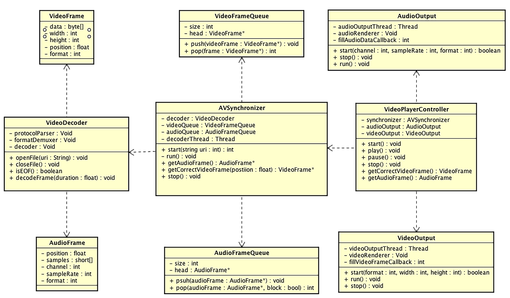

<head>
    
    
</head>

# Table of Contents

1.  [Algorithm](#orga1a02e7)
2.  [Review](#orgbd73e16)
    1.  [FFmpeg 基础模块（一）：容器相关的 API 操作](#org2a8af30)
        1.  [AVFormat 模块](#org25a4f11)
        2.  [AVFormat 前处理部分](#orgbb1d307)
        3.  [AVFormat 读写处理部分](#org133f5f1)
3.  [Tips](#orgcce1410)
    1.  [播放器项目实战（一）：场景分析与架构设计](#org645bf24)
        1.  [输入分析](#org8075659)
        2.  [输出分析](#org40d2789)
        3.  [架构设计](#org9616449)
        4.  [每个模块具体实现](#orgd7907fe)
4.  [Share](#orgc3efd8e)
    1.  [基于时间段会话粘性](#org33aa388)
    2.  [应用程序控制的会话粘性](#orge36efa9)

# Algorithm

Leetcode 488: Zuma Game: <https://leetcode.com/problems/zuma-game/>

<https://dreamume.medium.com/leetcode-488-zuma-game-c157ba8bf61f>

# Review

音视频技术入门课    刘岐

## FFmpeg 基础模块（一）：容器相关的 API 操作

FFmpeg 目录结构

<table border="2" cellspacing="0" cellpadding="6" rules="groups" frame="hsides">

<colgroup>
<col  class="org-left" />

<col  class="org-left" />
</colgroup>
<thead>
<tr>
<th scope="col" class="org-left">目录</th>
<th scope="col" class="org-left">主要包含的代码</th>
</tr>
</thead>

<tbody>
<tr>
<td class="org-left">libavcodec</td>
<td class="org-left">编码、解码的框架与子模块代码</td>
</tr>

<tr>
<td class="org-left">libavdevice</td>
<td class="org-left">输入、输出外设框架与设备模块代码</td>
</tr>

<tr>
<td class="org-left">libavfilter</td>
<td class="org-left">滤镜模块与视频、音频、字幕的特效处理模块代码</td>
</tr>

<tr>
<td class="org-left">libavformat</td>
<td class="org-left">目录主要包含了封装、解封装、传输协议的框架与子模块代码</td>
</tr>

<tr>
<td class="org-left">libavutil</td>
<td class="org-left">FFmpeg 提供的基础组件，比如加密解密算法、内存管理代码</td>
</tr>

<tr>
<td class="org-left">libswresample</td>
<td class="org-left">音频的采样与重采样处理相关的代码</td>
</tr>

<tr>
<td class="org-left">libswscale</td>
<td class="org-left">视频图像缩放与色彩转换等处理相关的代码</td>
</tr>

<tr>
<td class="org-left">fftools</td>
<td class="org-left">FFmpeg、ffprobe、ffplay 这些应用程序的代码</td>
</tr>

<tr>
<td class="org-left">tests</td>
<td class="org-left">FFmpeg 项目的自动化自测子系统</td>
</tr>

<tr>
<td class="org-left">ffbuild、compat</td>
<td class="org-left">FFmpeg 工程构建的目录</td>
</tr>

<tr>
<td class="org-left">doc</td>
<td class="org-left">FFmpeg 的通用框架的参数、各模块参数的文档，API 说明文档以及提供给 API 用户作为 -API 使用用例的参考代码</td>
</tr>
</tbody>
</table>

### AVFormat 模块

avformat_version、avformat_configuration、avformat_license 这三个接口都是用来调试的，确定使用的 FFmpeg 版本、编译配置信息以及 License。因为 FFmpeg 本身是 LGPL 的，但是 FFmpeg 可以引入其他第三方库，比如 libfdkaac 是 nonfree 的，就有可能存在专利收费的法律风险

如果引入了 libx264 这样的编码器，FFmpeg 会自动切换成 GPL 的 License，这个时候如果你想要基于 FFmpeg 做定制或者开发，就需要注意 GPL 的 License 法律风险，相关情况最好还是咨询一下开源 License 法律援助律师，尽量避免给自己的项目和公司带来不必要的麻烦

### AVFormat 前处理部分

当我们做音视频内容处理的时候，首先接触到的应该是 AVFormatContext 模块相关的操作，也就是我们这里说的 AVFormat 部分，但是操作 AVFormat 的时候，会有一个前处理部分，主要包含网络初始化、模块遍历、申请上下文空间、打开文件，还有分析音视频流等操作。下面我们逐个了解一下 AVFormat 前处理部分的接口与作用

-   avformat_network_init 和 avformat_network_deinit 两个接口，是网络相关模块的初始化和撤销网络相关模块初始化
-   av_muxer_iterate 和 av_demuxer_iterate 两个接口，是 muxer 和 demuxer 的遍历接口，如果你想查找自己需要的 muxer 或者 demuxer 是否在当前使用的 FFmpeg 库中，用这两个接口可以全面地查找
-   avformat_alloc_context 和 avformat_free_context 两个接口可以用来申请与释放 AVFormatContext 上下文结构
-   avformat_new_stream 接口用来创建新的 AVStream
-   av_stream_add_side_data 接口用来向 AVStream 中添加新的 side data 信息，例如视频旋转信息，通常是可以存储在 side data 里面的
-   av_stream_new_side_data 接口用来申请新的 side data
-   av_stream_get_side_data 接口用来获取 side data
-   avformat_alloc_output_context2 接口用来申请将要输出的文件的 AVFormatContext，可以通过 avformat_free_context 释放申请的 AVFormatContext
-   av_find_input_format 接口可以根据传入的 short_name 来获得对应的 AVFormat 模块，例如 MP4
-   avformat_open_input 接口主要用处是打开一个 AVInputFormat，并挂在 AVFormatContext 模块上，这个接口里面会调用 avformat_alloc_context，可以通过接口 avformat_close_input 来关闭和释放 avformat_open_input 里对应的 alloc 操作
-   av_find_best_stream 接口用来找到多个视频流或多个音频流中最优的那个流
-   avformat_find_stream_info 接口主要用来建立 AVStream 的信息，获得的信息大多数情况下是比较准确的。使用 avformat_find_stream_info 接口来获得 AVStream 信息的话，会比较消耗时间。因为里面需要通过 try_decode 进行解码操作，来获得更精准的 AVStream 信息，所以有些固定场景不使用 avformat_find_stream_info，是为了节省时间方面的开销

我们可以通过 probesize、analyzeduration 来设置读取的音视频数据的阙值，avformat_find_stream_info 里面也会遍历这个阙值，所以通过设置 probesize 和 analyzeduration 也可以节省一些时间

如果有多个类似 AAC 或者 H264 这样的 codec 的话，avformat_find_stream_info 内部会使用最先遍历的 codec，其实我们可以在使用 avformat_find_stream_info 之前指定解码器，预期的结果会更准确一些

### AVFormat 读写处理部分

看完 AVFormat 前处理部分的操作，接下来我们进入 AVFormat 读写处理的部分

-   av_read_frame 接口用来从 AVFormatContext 中读取 AVPacket
-   当拖动进度条的时候，我们可以调用 avformat_seek_file（旧版是 av_seek_frame）接口，seek 到自己想要指定的位置，但前提是对应的封装格式得支持精确 seek，seek 支持以下四种模式
    1.  AVSEEK_FLAG_BACKWARD    // 往回 seek
    
    2.  AVSEEK_FLAG_BYTE    // 以字节数的方式 seek
    
    3.  AVSEEK_FLAG_ANY    // 可 seek 到任意帧
    
    4.  AVSEEK_FLAG_FRAME    // 以帧数量的方式 seek

-   avformat_flush 接口主要是用来清空当前 AVFormatContext 中的 buffer

-   avformat_write_header 接口主要用在“写”操作的开头部分，通常指传输协议的开始，写封装格式头部。avformat_write_header 里会调用到 avformat_init_output，通常 avformat_write_header 函数的最后一个参数可以传入 Option，Option 可以控制容器模块中的 Option
    
    写 MP4 文件有很多 Option，可以通过 ffmpeg -h muxer=mp4 看到生成的 MP4 的一些列参数，也就是 Option

-   avformat_init_output 接口主要用来做容器格式初始化部分的操作，例如打开文件，或者有一些容器格式内部的信息需要初始化的时候

-   av_interleaved_write_frame 接口支持在写入 AVPacket 的时候，根据 dts 时间戳交错写入数据。使用这个接口有一个需要注意的地方，就是数据会先写入到 buffer 里用来交错存储数据，这个 buffer 会不断变大，如果有必要的话，可以考虑自己调用 avio_flush 或者写 NULL 把 buffer 写到磁盘

-   av_write_frame 接口是不按照交错的形式存储 AVPacket，不过在写入文件的时候是直接写入到磁盘，不会有 buffer，所以可以考虑自己先做交错再用这个接口，不过我一般选择使用 av_interleave_write_frame，因为比较方便，不需要自己做数据交错排列的操作

-   av_write_trailler 接口是写数据到封装容器的收尾部分。可以关闭和释放在此之前申请的内存，另外，MP4 文件如果需要把 moov 移动到 MP4 文件头部，也是在这个接口里面完成的

# Tips

移动端音视频开发实战    展晓凯

## 播放器项目实战（一）：场景分析与架构设计

最基本的功能是从零开始播放视频，能听到声音、看到画面，并且声音和画面是要对齐的，然后还需要支持暂停和继续播放功能；另外，需要支持 seek 功能，高级一点的也会支持切换音轨（如果视频中有多个音轨的话）、添加字幕等功能

### 输入分析

输入资源可能是不同的协议，比如本地磁盘（file）或者是 HTTP、RTMP、HLS 等协议，也有可能是不同的封装格式，比如 MP4、FLV、MOV。这些封装格式通常会有两个 Stream（轨道/流），分别是音频流（轨道）和视频流（轨道）。每个轨道存储的都是压缩后的编码格式，音频一般为 AAC、视频一般为 H264

### 输出分析

音频、视频的输出都用独立的线程管理，另外需要一个音视频同步模块

### 架构设计

音视频同步模块向外界暴露获取音频数据、视频数据的接口，这两个接口提供数据的同时要保持同步。音视频同步模块在内部组装输入模块，负责解码线程的调度。然后我们把音视频同步模块、音频输出模块、视频输出模块封装到调度器中，调度器模块会分别向音频输出模块和视频输出模块注册回调函数，调度器模块的回调函数中就调用音视频同步模块来获取音视频数据

基于以上架构设计，我们可以进一步整理类图设计，如下图所示

我们看一下类图设计中的各个模块：

-   VideoPlayerController：调度器模块的类，内部维护音视频同步模块、音视频输出模块，向上层业务暴露开始播放、暂停、继续播放、停止播放等接口；向音视频输出模块暴露两个获取裸数据的接口
-   AudioOutput: 音频输出模块，在不同平台会有不同的实现，但是一般音频的渲染要放在单独的一个线程中进行，在运行过程中会调用注册过来的回调函数来获取音频数据
-   VideoOutput: 视频输出模块，虽然我们统一使用 OpenGL ES 来渲染视频，但是前面也讲过，OpenGL ES 在不同平台也会有自己的上下文环境，所以这里采用了 Void 类型的实现，当然，必须由我们主动开启一个线程来作为 OpenGL ES 的渲染线程，它会在运行过程中调用注册过来的回调函数，来获取视频的裸数据进行渲染
-   AVSynchronizer: 音视频同步模块，用来组合输入模块及音频队列和视频队列，主要给它的客户端代码 VideoPlayerContrller 这个调度器提供接口，接口包括开始、结束，还有最重要的获取音频数据和对应时间戳的视频帧等。此外，它也会维护一个解码线程，并且根据音视频队列的状态来暂停或继续运行这个解码线程
-   AudioFrame: 音频帧，这个结构体中记录了一段 PCM Buffer 以及这一帧的时间戳等信息
-   AudioFrameQueue: 音频队列，主要用于存储音频帧，为它的客户端代码音视频同步模块提供压入和弹出操作，由于解码线程和声音播放线程会作为生产者和消费者同时访问这个队列，所以这个队列要确保具有线程安全性
-   VideoFrame: 视频帧，这个结构体中记录了 YUV 数据以及这一帧数据的宽、高以及时间戳等信息
-   VideoFrameQueue: 视频队列，主要用于存储视频帧，为它的客户端代码音视频同步模块提供压入和弹出操作，由于解码线程和声音播放线程会作为生产者和消费者同时访问这个队列，所以这个队列要确保具有线程安全性
-   VideoDecoder: 输入模块，因为还没有确定具体的技术实现，这里根据分析写了三个实例变量，协议层解析器、格式解封装器还有解码器，并且它主要向 AVSynchronizer 暴露一些接口，如打开文件资源（网络或本地）、关闭文件资源、解码出一定时间长度的音视频帧等

### 每个模块具体实现

1.  输入模块

    从输入文件到最终得到裸数据，会经历解析协议、解封装、解码三个步骤。我们可以选择一些成熟的技术，选择 FFmpeg 这个开源库作为输入模块的技术选型是最适合不过的了
    
    FFmpeg 中的 libavformat 模块可以处理各种不同的协议以及不同的封装，先用 libavformat 模块把文件解封装成每一路流，之后再进行解码。最简单的方式是直接使用 FFmpeg 的 libavcodec 模块来实现，但是如果需要更高性能的解码手段，我们可以使用 Android 和 iOS 平台各自的硬件解码器

2.  输出模块

    iOS 平台比较常见的就是 AudioQueue 和 AudioUnit，AudioQueue 是更高层次的音频 API，是建立在 AudioUnit 的基础之上的，我们最终选择 AudioUnit，首先是因为音频渲染过程中有可能存在音频格式的转换，这时使用 AudioUnit 会更加方便；其次我们也要为后续的录音、音效处理等打下使用 AudioUnit 的基础

3.  音视频同步模块

    由于需要维护解码线程，因此使用 PThread 来创建一个线程会是一个好的选择，另外需要维护一个队列，由于 STL 提供的队列不能保证现场安全性，所以对于音视频队列，我们自己写一个保证线程安全的链表来实现
    
    音视频同步的策略一般为三种：音频向视频同步；视频向音频同步；音视频统一向外部时钟同步。我们选择业界常用的第二种同步方式，在代码实现阶段，音视频同步这块逻辑放到获取视频帧的方法里面就可以了

4.  控制器模块

    控制器需要把上述的三个模块合理地组装起来。在开始播放的时候，需要把资源的地址传递给 AVSynchronizer，如果能够成功地打开文件，那么就去实例化 VideoOutput 和 AudioOutput
    
    在实例化这两个类的同时，要传入回调函数，这两个回调函数又分别去调用 AVSynchronizer 里获取音频和视频的方法，这样就可以有序地组织多个模块，最终如果暂停、继续的指令调用下来，也响应地去调用各个模块对应的生命周期方法

# Share

为你的典型负载均衡配置粘会话

<https://docs.aws.amazon.com/elasticloadbalancing/latest/classic/elb-sticky-sessions.html>

缺省，一个典型的负载均衡独立路由每个请求到最小负载的注册实例。然而，你可使用粘会话特性（也称为会话相似），其启动负载均衡绑定一个用户会话到一个特定的实例。这确保所有从用户的请求在会话期间发送到相同的实例

管理粘会话的关键是决定你的负载均衡多长应该一致路由用户的请求到相同的实例。如果你的应用程序有它自己的会话 cookie，则你可配置弹性负载均衡这样会话 cookie 继续应用程序会话 cookie 指定的时间段。如果你的应用程序没有自己的会话 cookie，则你可配置弹性负载均衡来创建一个会话 cookie 通过指定你自己的粘时间段

弹性负载均衡创建一个 cookie，名为 AWSELB，用来映射会话到实例

需求

-   一个 HTTP/HTTPS 负载均衡
-   每个有效的区域至少一个重实例

兼容性

-   cookie 路径属性的 RFC 允许下划线。然而，弹性负载均衡 URI 编码下划线字符为 %5F 因为一些浏览器，比如 Internet Explorer 7，期望下划线在 URI 中编码为 %5F。因为潜在的影响浏览器当前的工作，弹性负载均衡继续 URI 编码下划线字符。例如，如果 cookie 有属性 path=/my_path，弹性负载均衡改变这个属性在前向请求中为 path=/my%5Fpath
-   你不能设置安全标志或 HttpOnly 标志在你的基于时间段会话粘 cookie 中。然而，这些 cookie 包含不敏感数据。注意如果你设置安全标志或 HttpOnly 标志到一个应用程序控制会话粘 cookie 上，它也会设置到 AWSELB cookie 上
-   如果你在一个应用程序 cookie 的 Set-Cookie 段尾部有一个逗号，负载均衡会忽略这个 cookie

## 基于时间段会话粘性

负载均衡使用一个特殊的 cookie，AWSELB，来跟踪每个请求到每个监听者的实例。当负载均衡收到一个请求，它首先检查看看是否这个 cookie 呈现在请求中。如果是，请求被发送到 cookie 指定的实例。如果没有这样的 cookie，负载均衡基于现有的负载均衡算法选择一个实例。一个 cookie 插入到该实例相同用户子序列请求的响应中。粘策略配置定义一个 cookie 过期时间，这确定每个 cookie 有效时间段。负载均衡不刷新 cookie 过期时间且在使用之前不检查是否 cookie 已过期。cookie 过期之后，会话不在有粘性。客户应该从 cookie 存储中在过期时移除 cookie

对 CORS（跨源资源共享）请求，一些浏览器需要 SameSite=None; Secure 来启动粘性。在这样的情况下，弹性负载均衡创建一个第二粘性 cookie，AWSELBCORS，其包括源粘性 cookie 相同的信息及 SameSite 属性。客户端收到两个 cookie

如果一个实例故障或变得不健康，负载均衡停止路由请求到该实例，且基于现存的负载均衡算法选择一个新的健康实例。请求路由到新实例如果没有 cookie 且会话不再有粘性

如果一个客户端切换到一个不同后端端口的监听者，粘性被丢失

为启动负载均衡的基于时间段的粘性会话使用控制台

1.  打开 Amazon EC2 控制台: <https://console.aws.amazon.com/ec2/>
2.  在导航栏，在负责均衡下，选择负载均衡器
3.  选择你的负载均衡器
4.  在描述 Tab 页，选择编辑粘性
5.  在编辑粘性页面，选择启动负载均衡器产生 cookie 粘性
6.  （可选）对过期周期，第二位的 cookie 过期周期，如果你不指定过期周期，粘性会话会在浏览器会话期间一直持有
7.  选择保存

为启动负载均衡器的基于时间段的粘性会话，使用 AWS CLI

1.  使用如下 create-lb-cookie-stickiness-policy 命令来创建一个负载均衡器产生的 cookie 粘性策略及一个 60 秒的 cookie 过期时间
    
        aws elb create-lb-cookie-stickiness-policy --load-balancer-name my-loadbalancer --policy-name my-duration-cookie-policy --cookie-expiration-period 60

2.  使用如下 set-load-balancer-polices-of-listener 命令来启动特定负载均衡器的会话粘性
    
        aws elb set-load-balancer-policies-of-listener --load-balancer-name my-loadbalancer --load-balancer-port 443 --policy-names my-duration-cookie-policy
    
    注：set-load-balancer-policies-of-listener 命令替换付诸在指定负载均衡器端口策略的当前集合。每次使用这个命令，指定 --policy-names 选项来列出启动的所有策略

3.  （可选）使用如下 describe-load-balancers 命令来检查策略是否启动
    
        aws elb describe-load-balancers --load-balancer-name my-loadbalancer
    
    响应保护如下信息，其显示策略被启动在监听者指定的端口上
    
        {
            "LoadBalancerDescriptions": [
                {
                    ...
                    "ListenerDescriptions": [
                        {
                            "Listener": {
                                "InstancePort": 443, 
                                "SSLCertificateId": "arn:aws:iam::123456789012:server-certificate/my-server-certificate", 
                                "LoadBalancerPort": 443, 
                                "Protocol": "HTTPS", 
                                "InstanceProtocol": "HTTPS"
                            }, 
                            "PolicyNames": [
                                "my-duration-cookie-policy", 
                                "ELBSecurityPolicy-2016-08"
                            ]
                        },
                        ...
                    ],            
                    ...
                    "Policies": {
                        "LBCookieStickinessPolicies": [
                         {
                                "PolicyName": "my-duration-cookie-policy", 
                                "CookieExpirationPeriod": 60
                            }
        
                        ], 
                        "AppCookieStickinessPolicies": [], 
                        "OtherPolicies": [
                            "ELBSecurityPolicy-2016-08"
                        ]
                    },
                    ...
                }
            ]
        }

## 应用程序控制的会话粘性

负载均衡器使用一个特殊的 cookie 来关联实例处理初始化请求的会话，但遵从指定在策略配置里的应用程序 cookie 生命周期。负载均衡器只插入一个新的粘性 cookie 如果应用程序响应包含一个新的应用程序 cookie。负载均衡器粘性 cookie 不在每个请求中升级。如果应用程序 cookie 直接移除或过期，会话停止粘性直到一个新的应用程序 cookie 被处理

被后端实例设置的在 cookie 中的如下属性发送到客户端：path，port，domain，secure，httponly，discard，max-age，expires，version，comment，commenturl 和 samesite

如果一个实例故障或变得不健康，负载均衡器停止路由请求到该实例，且基于现存的负载均衡算法选择一个新的健康实例。负载均衡器处理会话为新的到新的健康实例，且继续路由请求到该实例甚至故障的实例已恢复

为启动应用程序控制会话粘性使用控制台

1.  打开 Amazon EC2 控制台：<https://console.aws.amazon.com/ec2/>
2.  在导航栏，在负载均衡下，选择负载均衡器
3.  选择你的负载均衡器
4.  在描述 Tab 页，选择编辑粘性
5.  在编辑粘性页面，选择启动应用程序产生 cookie 粘性
6.  对 cookie 名称，输入你的应用程序 cookie 名称
7.  选择保存

为启动应用程序控制会话粘性使用控制台

1.  使用如下 create-app-cookie-stickiness-policy 命令来创建一个应用程序产生的 cookie 粘性策略
    
        aws elb create-app-cookie-stickiness-policy --load-balancer-name my-loadbalancer --policy-name my-app-cookie-policy --cookie-name my-app-cookie

2.  使用如下 set-load-balancer-policies-of-listener 命令来对一个负载均衡器启动会话粘性
    
        aws elb set-load-balancer-policies-of-listener --load-balancer-name my-loadbalancer --load-balancer-port 443 --policy-names my-app-cookie-policy
    
    注：set-load-balancer-policies-of-listener 命令替代指定负载均衡器端口的策略的当前集合。每次使用这个命令，指定 --policy-name 选项来列出启动的所有策略

3.  （可选）使用如下 describe-load-balancers 命令来检查粘性策略是否启动
    
        aws elb describe-load-balancers --load-balancer-name my-loadbalancer

4.  响应包含如下信息，其显示对监听者指定端口该策略已启动
    
        {
            "LoadBalancerDescriptions": [
                {
                    ...
                    "ListenerDescriptions": [
                        {
                            "Listener": {
                                "InstancePort": 443, 
                                "SSLCertificateId": "arn:aws:iam::123456789012:server-certificate/my-server-certificate", 
                                "LoadBalancerPort": 443, 
                                "Protocol": "HTTPS", 
                                "InstanceProtocol": "HTTPS"
                            }, 
                            "PolicyNames": [
                                "my-app-cookie-policy",  
                                "ELBSecurityPolicy-2016-08"
                            ]
                        }, 
                        {
                            "Listener": {
                                "InstancePort": 80, 
                                "LoadBalancerPort": 80, 
                                "Protocol": "TCP", 
                                "InstanceProtocol": "TCP"
                            }, 
                            "PolicyNames": []
                        }
                    ],
                    ...
                    "Policies": {
                        "LBCookieStickinessPolicies": [], 
                        "AppCookieStickinessPolicies": [
                        {
                                "PolicyName": "my-app-cookie-policy", 
                                "CookieName": "my-app-cookie"
                            }
        
                        ], 
                        "OtherPolicies": [
                            "ELBSecurityPolicy-2016-08" 
                        ]
                    }, 
                    ...
                }
            ]
        }
