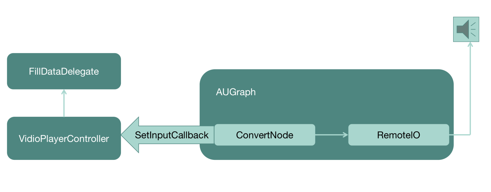

<head>
    
    
</head>

# Table of Contents

1.  [Algorithm](#orga1a02e7)
2.  [Review](#orgbd73e16)
    1.  [FFmpeg 基础模块（一）：容器相关的 API 操作](#org2a8af30)
        1.  [AVFormat 模块](#org25a4f11)
        2.  [AVFormat 前处理部分](#orgbb1d307)
        3.  [AVFormat 读写处理部分](#org133f5f1)
        4.  [小结](#orgf2a5158)
    2.  [FFmpeg 基础模块（二）：AVIO、AVDictionary 与 AVOption](#orgd9592fd)
        1.  [AVIO](#orga328979)
        2.  [AVDictionary 与 AVOption](#org1a6e062)
    3.  [FFmpeg 基础模块（三）：AVCodec](#orgaac15c1)
        1.  [AVCodec 接口](#org8007a3c)
        2.  [编码和解码的操作接口](#orge4aff47)
        3.  [关键参数 AVPacket](#org84af8b0)
3.  [Tips](#orgcce1410)
    1.  [播放器项目实战（一）：场景分析与架构设计](#org645bf24)
        1.  [输入分析](#org8075659)
        2.  [输出分析](#org40d2789)
        3.  [架构设计](#org9616449)
        4.  [每个模块具体实现](#orgd7907fe)
    2.  [播放器项目实战（二）：底层核心模块的实现](#org8c16781)
        1.  [解码模块的实现](#org2706356)
4.  [Share](#orgc3efd8e)
    1.  [基于时间段会话粘性](#org33aa388)
    2.  [应用程序控制的会话粘性](#orge36efa9)

# Algorithm

Leetcode 488: Zuma Game: <https://leetcode.com/problems/zuma-game/>

<https://dreamume.medium.com/leetcode-488-zuma-game-c157ba8bf61f>

# Review

音视频技术入门课    刘岐

## FFmpeg 基础模块（一）：容器相关的 API 操作

FFmpeg 目录结构

<table border="2" cellspacing="0" cellpadding="6" rules="groups" frame="hsides">

<colgroup>
<col  class="org-left" />

<col  class="org-left" />
</colgroup>
<thead>
<tr>
<th scope="col" class="org-left">目录</th>
<th scope="col" class="org-left">主要包含的代码</th>
</tr>
</thead>

<tbody>
<tr>
<td class="org-left">libavcodec</td>
<td class="org-left">编码、解码的框架与子模块代码</td>
</tr>

<tr>
<td class="org-left">libavdevice</td>
<td class="org-left">输入、输出外设框架与设备模块代码</td>
</tr>

<tr>
<td class="org-left">libavfilter</td>
<td class="org-left">滤镜模块与视频、音频、字幕的特效处理模块代码</td>
</tr>

<tr>
<td class="org-left">libavformat</td>
<td class="org-left">目录主要包含了封装、解封装、传输协议的框架与子模块代码</td>
</tr>

<tr>
<td class="org-left">libavutil</td>
<td class="org-left">FFmpeg 提供的基础组件，比如加密解密算法、内存管理代码</td>
</tr>

<tr>
<td class="org-left">libswresample</td>
<td class="org-left">音频的采样与重采样处理相关的代码</td>
</tr>

<tr>
<td class="org-left">libswscale</td>
<td class="org-left">视频图像缩放与色彩转换等处理相关的代码</td>
</tr>

<tr>
<td class="org-left">fftools</td>
<td class="org-left">FFmpeg、ffprobe、ffplay 这些应用程序的代码</td>
</tr>

<tr>
<td class="org-left">tests</td>
<td class="org-left">FFmpeg 项目的自动化自测子系统</td>
</tr>

<tr>
<td class="org-left">ffbuild、compat</td>
<td class="org-left">FFmpeg 工程构建的目录</td>
</tr>

<tr>
<td class="org-left">doc</td>
<td class="org-left">FFmpeg 的通用框架的参数、各模块参数的文档，API 说明文档以及提供给 API 用户作为 -API 使用用例的参考代码</td>
</tr>
</tbody>
</table>

### AVFormat 模块

avformat_version、avformat_configuration、avformat_license 这三个接口都是用来调试的，确定使用的 FFmpeg 版本、编译配置信息以及 License。因为 FFmpeg 本身是 LGPL 的，但是 FFmpeg 可以引入其他第三方库，比如 libfdkaac 是 nonfree 的，就有可能存在专利收费的法律风险

如果引入了 libx264 这样的编码器，FFmpeg 会自动切换成 GPL 的 License，这个时候如果你想要基于 FFmpeg 做定制或者开发，就需要注意 GPL 的 License 法律风险，相关情况最好还是咨询一下开源 License 法律援助律师，尽量避免给自己的项目和公司带来不必要的麻烦

### AVFormat 前处理部分

当我们做音视频内容处理的时候，首先接触到的应该是 AVFormatContext 模块相关的操作，也就是我们这里说的 AVFormat 部分，但是操作 AVFormat 的时候，会有一个前处理部分，主要包含网络初始化、模块遍历、申请上下文空间、打开文件，还有分析音视频流等操作。下面我们逐个了解一下 AVFormat 前处理部分的接口与作用

-   avformat_network_init 和 avformat_network_deinit 两个接口，是网络相关模块的初始化和撤销网络相关模块初始化
-   av_muxer_iterate 和 av_demuxer_iterate 两个接口，是 muxer 和 demuxer 的遍历接口，如果你想查找自己需要的 muxer 或者 demuxer 是否在当前使用的 FFmpeg 库中，用这两个接口可以全面地查找
-   avformat_alloc_context 和 avformat_free_context 两个接口可以用来申请与释放 AVFormatContext 上下文结构
-   avformat_new_stream 接口用来创建新的 AVStream
-   av_stream_add_side_data 接口用来向 AVStream 中添加新的 side data 信息，例如视频旋转信息，通常是可以存储在 side data 里面的
-   av_stream_new_side_data 接口用来申请新的 side data
-   av_stream_get_side_data 接口用来获取 side data
-   avformat_alloc_output_context2 接口用来申请将要输出的文件的 AVFormatContext，可以通过 avformat_free_context 释放申请的 AVFormatContext
-   av_find_input_format 接口可以根据传入的 short_name 来获得对应的 AVFormat 模块，例如 MP4
-   avformat_open_input 接口主要用处是打开一个 AVInputFormat，并挂在 AVFormatContext 模块上，这个接口里面会调用 avformat_alloc_context，可以通过接口 avformat_close_input 来关闭和释放 avformat_open_input 里对应的 alloc 操作
-   av_find_best_stream 接口用来找到多个视频流或多个音频流中最优的那个流
-   avformat_find_stream_info 接口主要用来建立 AVStream 的信息，获得的信息大多数情况下是比较准确的。使用 avformat_find_stream_info 接口来获得 AVStream 信息的话，会比较消耗时间。因为里面需要通过 try_decode 进行解码操作，来获得更精准的 AVStream 信息，所以有些固定场景不使用 avformat_find_stream_info，是为了节省时间方面的开销

我们可以通过 probesize、analyzeduration 来设置读取的音视频数据的阙值，avformat_find_stream_info 里面也会遍历这个阙值，所以通过设置 probesize 和 analyzeduration 也可以节省一些时间

如果有多个类似 AAC 或者 H264 这样的 codec 的话，avformat_find_stream_info 内部会使用最先遍历的 codec，其实我们可以在使用 avformat_find_stream_info 之前指定解码器，预期的结果会更准确一些

### AVFormat 读写处理部分

看完 AVFormat 前处理部分的操作，接下来我们进入 AVFormat 读写处理的部分

-   av_read_frame 接口用来从 AVFormatContext 中读取 AVPacket
-   当拖动进度条的时候，我们可以调用 avformat_seek_file（旧版是 av_seek_frame）接口，seek 到自己想要指定的位置，但前提是对应的封装格式得支持精确 seek，seek 支持以下四种模式
    1.  AVSEEK_FLAG_BACKWARD    // 往回 seek
    
    2.  AVSEEK_FLAG_BYTE    // 以字节数的方式 seek
    
    3.  AVSEEK_FLAG_ANY    // 可 seek 到任意帧
    
    4.  AVSEEK_FLAG_FRAME    // 以帧数量的方式 seek

-   avformat_flush 接口主要是用来清空当前 AVFormatContext 中的 buffer

-   avformat_write_header 接口主要用在“写”操作的开头部分，通常指传输协议的开始，写封装格式头部。avformat_write_header 里会调用到 avformat_init_output，通常 avformat_write_header 函数的最后一个参数可以传入 Option，Option 可以控制容器模块中的 Option
    
    写 MP4 文件有很多 Option，可以通过 ffmpeg -h muxer=mp4 看到生成的 MP4 的一些列参数，也就是 Option

-   avformat_init_output 接口主要用来做容器格式初始化部分的操作，例如打开文件，或者有一些容器格式内部的信息需要初始化的时候

-   av_interleaved_write_frame 接口支持在写入 AVPacket 的时候，根据 dts 时间戳交错写入数据。使用这个接口有一个需要注意的地方，就是数据会先写入到 buffer 里用来交错存储数据，这个 buffer 会不断变大，如果有必要的话，可以考虑自己调用 avio_flush 或者写 NULL 把 buffer 写到磁盘

-   av_write_frame 接口是不按照交错的形式存储 AVPacket，不过在写入文件的时候是直接写入到磁盘，不会有 buffer，所以可以考虑自己先做交错再用这个接口，不过我一般选择使用 av_interleave_write_frame，因为比较方便，不需要自己做数据交错排列的操作

-   av_write_trailler 接口是写数据到封装容器的收尾部分。可以关闭和释放在此之前申请的内存，另外，MP4 文件如果需要把 moov 移动到 MP4 文件头部，也是在这个接口里面完成的

### 小结

FFmpeg 中有很多重要的模块，比如 AVFormat 模块、AVcodec 模块、AVfilter 模块等。其中 AVFormat 是用来做封装格式处理的模块。这个模块的内部提供了很多常用的接口，比如前处理部分的 avformat_find_stream_info 等接口，读写处理部分的 avformat_write_header、av_interleave_write_frame 等接口，了解这些接口的用途和可能出现的问题及解决办法，可以让我们在实践中更好地使用它们去做容器封装和解封装方面的操作

<table border="2" cellspacing="0" cellpadding="6" rules="groups" frame="hsides">

<colgroup>
<col  class="org-left" />

<col  class="org-left" />

<col  class="org-left" />
</colgroup>
<thead>
<tr>
<th scope="col" class="org-left">AVFormat 模块</th>
<th scope="col" class="org-left">接口</th>
<th scope="col" class="org-left">用途</th>
</tr>
</thead>

<tbody>
<tr>
<td class="org-left">调试</td>
<td class="org-left">avformat_version</td>
<td class="org-left">确定使用的 FFmpeg 版本</td>
</tr>

<tr>
<td class="org-left">&#xa0;</td>
<td class="org-left">avformat_configuration</td>
<td class="org-left">确定编译配置信息</td>
</tr>

<tr>
<td class="org-left">&#xa0;</td>
<td class="org-left">avformat_license</td>
<td class="org-left">确定 license（注意法律风险）</td>
</tr>

<tr>
<td class="org-left">前处理</td>
<td class="org-left">avformat_network_init</td>
<td class="org-left">网络相关模块的初始化</td>
</tr>

<tr>
<td class="org-left">&#xa0;</td>
<td class="org-left">avformat_network_deinit</td>
<td class="org-left">撤销网络相关模块的初始化</td>
</tr>

<tr>
<td class="org-left">&#xa0;</td>
<td class="org-left">av_muxer_iterate</td>
<td class="org-left">muxer 的遍历接口</td>
</tr>

<tr>
<td class="org-left">&#xa0;</td>
<td class="org-left">av_demuxer_iterate</td>
<td class="org-left">demuxer 的遍历接口</td>
</tr>

<tr>
<td class="org-left">&#xa0;</td>
<td class="org-left">avformat_alloc_context</td>
<td class="org-left">申请 AVFormatContext 上下文结构</td>
</tr>

<tr>
<td class="org-left">&#xa0;</td>
<td class="org-left">avformat_free_context</td>
<td class="org-left">释放 AVFormatContext 上下文结构</td>
</tr>

<tr>
<td class="org-left">&#xa0;</td>
<td class="org-left">avformat_new_stream</td>
<td class="org-left">创建新的 AVStream</td>
</tr>

<tr>
<td class="org-left">&#xa0;</td>
<td class="org-left">av_stream_add_side_data</td>
<td class="org-left">向 AVStream 中添加新的 side data 信息</td>
</tr>

<tr>
<td class="org-left">&#xa0;</td>
<td class="org-left">av_stream_new_side_data</td>
<td class="org-left">申请新的 side data</td>
</tr>

<tr>
<td class="org-left">&#xa0;</td>
<td class="org-left">av_stream_get_side_data</td>
<td class="org-left">获取 side data</td>
</tr>

<tr>
<td class="org-left">&#xa0;</td>
<td class="org-left">avformat_alloc_output_context2</td>
<td class="org-left">申请将要输出的文件的 AVFormatContext</td>
</tr>

<tr>
<td class="org-left">&#xa0;</td>
<td class="org-left">av_find_input_format</td>
<td class="org-left">根据传入的 short_name 获得对应的 AVFormat 模块</td>
</tr>

<tr>
<td class="org-left">&#xa0;</td>
<td class="org-left">avformat_open_input</td>
<td class="org-left">打开一个 AVInputFormat 并挂在 AVFormatContext</td>
</tr>

<tr>
<td class="org-left">&#xa0;</td>
<td class="org-left">avformat_find_stream_info</td>
<td class="org-left">建立 AVStream 的信息</td>
</tr>

<tr>
<td class="org-left">&#xa0;</td>
<td class="org-left">av_find_best_stream</td>
<td class="org-left">找到最优流</td>
</tr>

<tr>
<td class="org-left">读写处理</td>
<td class="org-left">av_read_frame</td>
<td class="org-left">从 AVFormatContext 中读取 AVPacket</td>
</tr>

<tr>
<td class="org-left">&#xa0;</td>
<td class="org-left">avformat_seek_file</td>
<td class="org-left">seek 到自己想要指定的位置</td>
</tr>

<tr>
<td class="org-left">&#xa0;</td>
<td class="org-left">avformat_flush</td>
<td class="org-left">清空当前 AVFormatContext 中的 buffer</td>
</tr>

<tr>
<td class="org-left">&#xa0;</td>
<td class="org-left">avformat_write_header</td>
<td class="org-left">“写”操作的开头部分</td>
</tr>

<tr>
<td class="org-left">&#xa0;</td>
<td class="org-left">avformat_init_output</td>
<td class="org-left">做容器格式的初始化部分的操作</td>
</tr>

<tr>
<td class="org-left">&#xa0;</td>
<td class="org-left">av_interleaved_write_frame</td>
<td class="org-left">写入 AVPacket 时，根据 dts 时间戳交错写入数据</td>
</tr>

<tr>
<td class="org-left">&#xa0;</td>
<td class="org-left">av_write_frame</td>
<td class="org-left">不按照交错的形式存储 AVPacket</td>
</tr>

<tr>
<td class="org-left">&#xa0;</td>
<td class="org-left">av_write_trailler</td>
<td class="org-left">写数据到封装容器的收尾部分</td>
</tr>
</tbody>
</table>

## FFmpeg 基础模块（二）：AVIO、AVDictionary 与 AVOption

在日常使用 API 开发应用的时候，还会遇到需要从自己定义的内存或文件中读写数据，然后套用在 AVFormat 中的场景，这时可以使用 AVIO

### AVIO

AVIO 部分常见的接口看上去比较多，主要是为了方便读、写内存时做一些字节对齐与大小端定义的操作，了解了它内在的结构之后，你就会觉得清晰多了

当你想知道一个 URL 字符串是什么协议的时候，通过 avio_find_protocol_name 接口就能得到协议的名称，例如 http、rtmp、rtsp 等

    const char* avio_find_protocol_name(const char *url);

avio_alloc_context 接口主要用来申请 AVIOContext 句柄，并且可以在申请的时候注册 read_packet、write_packet 与 seek 回调，然后可以将 AVIOContext 句柄挂载到 AVFormatContext 的 pb 上面。挂载完成后，在操作 AVFormatContext 的 read_packet、write_packet、seek 的时候，会调用这里注册过的回调接口，注册的时候如果把回调接口设置成 NULL，就会使用 AVIOContext 子模块默认的流程。这里申请的 AVIOContext 可以通过 avio_context_free 来释放

    AVIOContext *avio_alloc_context(unsigned char *buffer,
                                    int buffer_size,
                                    int write_flag,
                                    void *opaque,
                                    int (*read_packet)(void *opaque, uint8_t* buf, int buf_size),
                                    int (*write_packet)(void *opaque, uint8_t* buf, int buf_size),
                                    int64_t (*seek)(void *opaque, int64_t offset, int whence));
    void avio_context_free(AVIOContext **s);

下面这一系列的读写接口，从名字就可以看出来，其中 w 是写，r 是读，l 或者 le 代表小端方式读写，b 或者 be 代表大端读写，8 代表 8 位，16 代表 16 位，24、32、64 分别代表 24 位、32 位、64 位。至于是大端读写还是小端读写，你可以根据实际的参考标准的要求进行操作

    void avio_w8(AVIOContext *s, int b);
    void avio_write(AVIOContext *s, const unsigned char *buf, int size);
    void avio_wl64(AVIOContext *s, uint64_t val);
    void avio_wb64(AVIOContext *s, uint64_t val);
    void avio_wl32(AVIOContext *s, unsigned int val);
    void avio_wb32(AVIOContext *s, unsigned int val);
    void avio_wl24(AVIOContext *s, unsigned int val);
    void avio_wb24(AVIOContext *s, unsigned int val);
    void avio_wl16(AVIOContext *s, unsigned int val);
    void avio_wb16(AVIOContext *s, unsigned int val);
    int avio_put_str(AVIOContext *s, const char* str);
    int avio_put_str16le(AVIOContext *s, const char* str);
    int avio_put_str16be(AVIOContext *s, const char* str);
    
    int avio_read(AVIOContext *s, unsigned char *buf, int size);
    int avio_read_partial(AVIOContext *s, unsigned char *buf, int size);
    int avio_r8(AVIOContext *s);
    unsigned int avio_rl16(AVIOContext *s);
    unsigned int avio_rl24(AVIOContext *s);
    unsigned int avio_rl32(AVIOContext *s);
    uint64_t avio_rl64(AVIOContext *s);
    unsigned int avio_rl16(AVIOContext *s);
    unsigned int avio_rb24(AVIOContext *s);
    unsigned int avio_rl32(AVIOContext *s);
    uint64_t avio_rb64(AVIOContext *s);
    int avio_get_str(AVIOContext *pb, int maxlen, char *buf, int buflen);
    int avio_get_str16le(AVIOContext *pb, int maxlen, char *buf, int buflen);
    int avio_get_str16be(AVIOContext *pb, int maxlen, char *buf, int buflen);

当解析部分封装格式的时候，有一些字段暂时不用或者不需要解析，就可以使用 avio_skip、avio_seek 来跳过对应的字节，或者通过 avio_seek 定位到想要去的字节处，如果想要知道文件读写之后当前的文件位置，可以通过 avio_tell 来获得

    int64_t avio_seek(AVIOContext *s, int64_t offset, int whence);
    int64_t avio_skip(AVIOContext *s, int64_t offset);
    static av_always_inline int64_t avio_tell(AVIOContext *s);

AVIOContext 句柄文件当前已经写入的内容大小，可以通过 avio_size 来获取

    int64_t avio_size(AVIOContext *s);

通过 avio_feof 可以判断当前位置是否是 AVIOContext 的 EOF（文件末尾）

    int avio_feof(AVIOContext *s);

如果在操作 AVIOContext 写内容的时候内存不断增长，可以尝试用 avio_flush 把内容刷到目标文件中去

    int avio_flush(AVIOContext *s);

当写入文件需要先临时放在内存中，最后按照自己的计划将内容刷到文件中的话，可以考虑使用 avio_open_dyn_buf、avio_get_dyn_buf、avio_close_dyn_buf 来操作

    int avio_open_dyn_buf(AVIOContext **s);
    int avio_get_dyn_buf(AVIOContext *s, uint8_t **pbuffer);
    int avio_close_dyn_buf(AVIOContext *s, uint8_t **pbuffer);

比如操作 HLS 直播流的时候，考虑到 fragment mp4 文件的特殊性，我希望先把文件内容写入到内存中，确保写入的数据拿到音视频包完整的流信息数据，然后生成 HLS 列表时能够写入准确的流信息内容，我会调用 avio_open_dyn_buf、avio_get_dyn_buf、avio_close_dyn_buf 来解决问题

再比如生成 fragment mp4 的 HLS 时，需要有一个 fragment mp4 的 init 头内容，这个 init 头部内容，通常可以用 avio_open_dyn_buf、avio_get_dyn_buf、avio_close_dyn_buf 来做临时缓存，并且定时刷新到 init 头中

avio_close 与 avio_closep 几乎相同，用来释放申请的资源，但是在 avio_closep 里会调用 avio_close，并清空 AVIOContext 句柄内容，然后置空。这样可以确保 AVIOContext 的操作安全，不会出现 use_after_free 的问题，所以有时候用 avio_closep 会更安全一些

    int avio_close(AVIOContext *s);
    int avio_closep(AVIOContext **s);

avio_open 和 avio_open2 都是用来打开 FFmpeg 的输入输出文件的，它们之间的差别是 avio_open2 可以注册一个 AVIOInterruptCB 的 callback 做超时中断处理，而且可以在 open 的时候设置 AVDictionary 来操作 AVIO 目标对象的 options

    int avio_open(AVIOContext **s, const char *url, int flags);
    int avio_open2(AVIOContext **s, const char *url, int flags, const AVIOInterruptCB *int_cb, AVDictionary **options);

我们可以通过 AVDictionary 或者 AVOption 来设置参数，这两个 API 系列主要用来设置操作目标的 format、codec、protocol 的参数，最终达到与命令行使用参数一样的效果

### AVDictionary 与 AVOption

在使用 FFmpeg 命令行做封装、解封装、编解码、网络传输的时候，都会用到一些参数，比如我们录制 MP4 的时候，希望在录制完成之后把 moov 移动到文件头部，就需要添加一个参数 -movflags faststart。那么在使用 FFmpeg 的 SDK 时，就需要使用 dict 或 opt 的操作方式，来将参数传给 FFmpeg 内部 MP4 的 muxer 模块

1.  通过 opt 操作设置参数
    
        AVFormatContext *oc;
        avformat_alloc_output_context2(&oc, NULL, NULL, "out.mp4");
        av_opt_set(oc->priv_data, "movflags", "faststart", 0); /* 直接设置容器对象的参数 */
        avformat_write_header(oc, NULL);
        av_interleave_write_frame(oc, pkt);
        av_write_trailer(oc);

2.  通过 dict 操作设置参数
    
        AVFormatContext *oc;
        AVDictionary *opt = NULL;       /* 先定义一个 AVDictionary 变量 */
        avformat_alloc_output_context2(&oc, NULL, NULL, "out.mp4");
        av_dict_set(&opt, "movflags", "faststart", 0); /* 将参数设置到 AVDictionary 变量中 */
        avformat_write_header(oc, &opt);               /* 打开文件时传 AVDictionary 参数 */
        av_dict_free(&opt);                            /* 使用完 AVDictionary 参数后立即释放以防止内存泄露 */
        av_interleave_write_frame(oc, pkt);
        av_write_trailer(oc);

这两种操作都可以正常工作，av_opt_set 可以直接设置对应对象的参数，这样使用的话能够直接让设置的参数生效。而 av_dict_set 可以把参数设置到 AVDictionary 变量中，这样可以复用到多个对象里，但是设置起来稍微麻烦一些

1.  opt 接口列表
    
        av_opt_set_int 只接受整数
        av_opt_set_double 只接受浮点数
        av_opt_set_q 只接受分子与分母，例如{1, 25}这样
        av_opt_set_bin 只接受二进制数据
        av_opt_set_image_size 只接受图像宽与高，例如1920，1080这样
        av_opt_set_video_rate 只接受分子与分母，例如{1, 25}这样
        av_opt_set_pixel_fmt 只接受枚举类型，例如AV_PIX_FMT_YUV420P
        av_opt_set_sample_fmt 只接受采样数据格式枚举类型，例如AV_SAMPLE_FMT_S16
        av_opt_set_channel_layout 只接受音频通道布局枚举类型，例如AV_CHANNEL_LAYOUT_5POINT0
        av_opt_set_dict_val 接受AVDictionary类型，例如设置metadata时候可以使用
        av_opt_set_chlayout 只接受音频通道布局枚举类型，例如AV_CHANNEL_LAYOUT_5POINT0
        av_opt_set_defaults 设置对象的默认值，例如hlsenc有自己对应的操作选项的默认值，全部设置对应的默认值
        av_opt_set_defaults2 设置对象的默认值，例如hlsenc有自己对应的操作选项的默认值，全部设置对应的默认值
        av_opt_set_from_string 解析key=value格式的字符串并设置对应的参数与值
        
        av_opt_next 获得opt操作的对象的下一个参数
        av_opt_get_int 获得对象参数的值为整数
        av_opt_get_double 获得对象参数的值为双精度浮点数
        av_opt_get_q 获得对象参数为分子分母数，例如{1, 25}这样
        av_opt_get_image_size 获得图像的宽和高，例如1920，1080这样
        av_opt_get_video_rate 获得视频的帧率，例如{1, 25}这样
        av_opt_get_pixel_fmt 获得视频的像素点格式枚举类型，例如AV_PIX_FMT_YUV420P
        av_opt_get_sample_fmt 获得音频的采样格式枚举类型，例如AV_SAMPLE_FMT_S16
        av_opt_get_channel_layout 获得音频的采样布局枚举类型，例如AV_CHANNEL_LAYOUT_5POINT0
        av_opt_get_dict_val 获得AVDictionary类型，通常是key-value方式
        av_opt_get_key_value 获得key=value类型
    
    使用 opt 中的这些接口进行操作时，可以精确地设置到参数值的类型，直接操作对象，比如某个封装格式模块、某个编解码模块，非常方便

2.  dict 接口列表
    
        av_dict_count 获得dict参数的数量整数
        av_dict_parse_string 一次性解析多组key=value格式的字符串为dict
        av_dict_free 释放因设置dict申请的内存空间
        av_dict_copy 复制dict参数与值
        av_dict_get_string 获得dict的参数值为字符串，用key=value格式字符串获得到value
        av_dict_set_int 设置dict参数的值为整数

## FFmpeg 基础模块（三）：AVCodec

AVCodec 是存储编解码器信息的结构体，当我们使用编解码器的时候会用到 AVCodec，而 FFmpeg 除了 AVCodec 结构体之外，还有一个 AVCodecContext，是 FFmpeg 内部流程中处理编解码时，用来记录和存储上下文的结构体

### AVCodec 接口

在使用 FFmpeg 的编解码器之前，首先需要找到编解码器

    const AVCodec *avcodec_find_decoder(enum AVCodecID id);
    const AVCodec *avcodec_find_decoder_by_name(const char *name);
    const AVCodec *avcodec_find_encoder(enum AVCodecID id);
    const AVCodec *avcodec_find_encoder_by_name(const char* name);

这里需要注意的是，如果编码器和解码器的 find 接口使用没有问题，用 avcodec_find_decoder 查找编码器的话，在这里可能能找到 AVCodec，但是在后续用来做编码的时候会报错

通常我们也可以在做编码操作之前，调用接口 av_codec_is_encoder 来确认当前拿到的 AVCodec 是不是编码器，或者通过 av_codec_is_decoder 来确认是不是解码器

找到 AVCodec 之后，最好不要直接使用，推荐的做法是与 FFmpeg 内部流程中的 AVCodecContext 建立关联

    AVCodecContext *avcodec_alloc_context3(const AVCodec *codec);
    void avcodec_free_context(AVCodecContext **avctx);

从示例代码中可以看到，AVCodec 与 AVCodecContext 可以通过 avcodec_alloc_context3 接口来申请并建立关联，因为涉及内存申请操作，所以用完之后需要使用 avcodec_free_context 释放资源

申请完 AVCodecContext 上下文之后，接下来可以打开编码器或者解码器

    int avcodec_open2(AVCodecContext *avctx, const AVCodec *codec, AVDictionary **options);

你应该已经发现了，这个 avcodec_open2 有三个参数，第一个是 AVCodecContext，它是处理编解码时，用来记录和存储上下文的结构体，第三个参数是 AVDictionary，这个参数用来设置 AVCodec 编码器或者解码器内部的参数，可以使用 ffmpeg -h encoder=libx264 查看 libx264 的内部可设置的参数

这个函数第二个参数可以传 NULL，因为在之前 avcodec_alloc_context3 函数将 AVCodec 和 AVCodecContext 关联上了。如果想要关闭编码器，推荐你使用 avcodec_free_context 来做一次释放，这样比较干净，因为 avcodec_free_context 里面已经有 avcodec_close 操作了

### 编码和解码的操作接口

编码和解码的操作接口

    int avcodec_send_packet(AVCodecContext *avctx, const AVPacket *avpkt);
    int avcodec_receive_frame(AVCodecContext *avctx, AVFrame* frame);
    int avcodec_send_frame(AVCodecContext *avctx, const AVFrame* frame);
    int avcodec_receive_packet(AVCodecContext *avctx, AVPacket* avpkt);

avcodec_send_packet 和 avcodec_receive_frame 是用来做解码的组合，avcodec_send_frame 与 avcodec_receive_packet 是用来做编码的组合

大多数场景下，可以调用一次 avcodec_send_packet，将 AVPacket 送到解码器里，然后 avcodec_receive_frame 读取一次 AVFrame，但是稳妥起见，avcodec_receive_frame 有时候会返回 EAGAIN，所以我们还需要确认读全了 AVFrame，再做 avcodec_receive_frame 操作

FFmpeg 旧版本其实是用 avcodec_decode_video2 和 avcodec_decode_audio4 来做的音视频的解码，从 2016 年 04 月 21 日开始，FFmpeg 新增了 avcodec_send_packet 和 avcodec_receive_frame 这样的组合解码与组合编码接口，主要是为了解决一个 AVPacket 中包含多个视频帧或者音频包的情况

如果解码结束，给 avcodec_send_packet 写一个 NULL 的 AVPacket 包就可以了。编码的话，给 avcodec_send_frame 设置 AVFrame 为 NULL 就表示编码结束了

### 关键参数 AVPacket

在 AVFormat 和 AVCodec 之间有一个关键的参数，就是我们这几节课频繁见到的 AVPacket。AVPacket 的内容构建也有一系列的接口需要我们了解，构造 AVPacket 内容的时候用这些接口会非常方便

如果你想使用 AVPacket 的话，可以通过 av_packet_alloc 来申请一个 AVPacket

    AVPacket *av_packet_alloc(void);

但这次申请的只是一个 AVPacket 的内存空间，里面的 buf 和 data 的内存空间不会被申请。如果想要申请 buf 和 data 的空间的话，可以考虑在 av_packet_alloc 之后使用 av_new_packet 来解决

    int av_new_packet(AVPacket *pkt, int size)

当使用 av_new_packet 申请带 buf 和 data 的 AVPacket 的时候，需要给 av_new_packet 传递一个要申请的 buf 空间大小的值

通过 av_packet_alloc 申请的 AVPacket 需要用 av_packet_free 来释放申请的内存空间。当然，av_new_packet 申请的 buf 在 av_packet_free 里也会一并释放

如果这里的 buf 或者 data 如果想要指向第三方 data 内存区域的话，最好还是使用 av_packet_from_data

    int av_packet_from_data(AVPacket *pkt, uint8_t* data, int size);

之所以用这个函数是为了避免很多不必要的问题，比如你把 data 指向你自己申请的内存空间，那么很有可能会缺少 data 指向 buf，然后那个 buf 是有 PADDING 空间预留的

    pkt->buf = av_buffer_create(data, size + AV_INPUT_BUFFER_PADDING_SIZE, av_buffer_default_free, NULL, 0);

这个 AV_INPUT_BUFFER_PADDING_SIZE 能解决很重要的问题，尤其是在后续做 packet 里面的 data 分析的时候，可能会出现 crash。因为 FFmpeg 内部的 parser 在解析 data 的时候做了一些优化，但是会有一些额外的开销，FFmpeg 的 codec 模块会预读一段数据，这个时候可能会因为内存越界出现 crash 错误

    /**
     * @ingroup lavc_decoding
     * Required number of additionally allocated bytes at the end of the input bitstream for decoding.
     * This is mainly needed because some optimized bitstream readers read
     * 32 or 64 bit at once and could read over the end. 
     * Note: If the first 23 bits of the additional bytes are not 0, then damaged
     * MPEG bitstreams could cause overread and segfault.
     */
    #define AV_INPUT_BUFFER_PADDING_SIZE 64

说到对音视频流做 parser，我们可以大概了解一下

    AVCodecParserContext *av_parser_init(int codec_id);
    int av_parser_parse2(AVCodecParserContext *s,
                         AVCodecContext *avctx,
                         uint8_t *buf, int buf_size,
                         int64_t pts, int64_t dts, int64_t pos);
    void av_parser_close(AVCodecParserContext *s);

有些音视频的编码数据，是会把一部分数据相关的头信息存储在 AVPacket 的 data 中的，这个时候可以使用 parser 来做解析，获得相关的 codec 信息。如果你想要知道哪些 codec 有 parser 的话，可以在编译 FFmpeg 代码那一步就通过 ./configure &#x2013;list-parsers 来查看

比如说 H.264 的数据，可以通过 parser 来得到编码数据的 NALUnit 信息，之前讲过 ffprobe -show_frames 可以看到音视频流的 frames 信息，parser 解析出来有一些信息是在这个 frames 里面展示出来的。这些信息也主要用来传给解码器作为解码处理的一个参考

# Tips

移动端音视频开发实战    展晓凯

## 播放器项目实战（一）：场景分析与架构设计

最基本的功能是从零开始播放视频，能听到声音、看到画面，并且声音和画面是要对齐的，然后还需要支持暂停和继续播放功能；另外，需要支持 seek 功能，高级一点的也会支持切换音轨（如果视频中有多个音轨的话）、添加字幕等功能

### 输入分析

输入资源可能是不同的协议，比如本地磁盘（file）或者是 HTTP、RTMP、HLS 等协议，也有可能是不同的封装格式，比如 MP4、FLV、MOV。这些封装格式通常会有两个 Stream（轨道/流），分别是音频流（轨道）和视频流（轨道）。每个轨道存储的都是压缩后的编码格式，音频一般为 AAC、视频一般为 H264

### 输出分析

音频、视频的输出都用独立的线程管理，另外需要一个音视频同步模块

### 架构设计

音视频同步模块向外界暴露获取音频数据、视频数据的接口，这两个接口提供数据的同时要保持同步。音视频同步模块在内部组装输入模块，负责解码线程的调度。然后我们把音视频同步模块、音频输出模块、视频输出模块封装到调度器中，调度器模块会分别向音频输出模块和视频输出模块注册回调函数，调度器模块的回调函数中就调用音视频同步模块来获取音视频数据

基于以上架构设计，我们可以进一步整理类图设计，如下图所示

我们看一下类图设计中的各个模块：

-   VideoPlayerController：调度器模块的类，内部维护音视频同步模块、音视频输出模块，向上层业务暴露开始播放、暂停、继续播放、停止播放等接口；向音视频输出模块暴露两个获取裸数据的接口
-   AudioOutput: 音频输出模块，在不同平台会有不同的实现，但是一般音频的渲染要放在单独的一个线程中进行，在运行过程中会调用注册过来的回调函数来获取音频数据
-   VideoOutput: 视频输出模块，虽然我们统一使用 OpenGL ES 来渲染视频，但是前面也讲过，OpenGL ES 在不同平台也会有自己的上下文环境，所以这里采用了 Void 类型的实现，当然，必须由我们主动开启一个线程来作为 OpenGL ES 的渲染线程，它会在运行过程中调用注册过来的回调函数，来获取视频的裸数据进行渲染
-   AVSynchronizer: 音视频同步模块，用来组合输入模块及音频队列和视频队列，主要给它的客户端代码 VideoPlayerContrller 这个调度器提供接口，接口包括开始、结束，还有最重要的获取音频数据和对应时间戳的视频帧等。此外，它也会维护一个解码线程，并且根据音视频队列的状态来暂停或继续运行这个解码线程
-   AudioFrame: 音频帧，这个结构体中记录了一段 PCM Buffer 以及这一帧的时间戳等信息
-   AudioFrameQueue: 音频队列，主要用于存储音频帧，为它的客户端代码音视频同步模块提供压入和弹出操作，由于解码线程和声音播放线程会作为生产者和消费者同时访问这个队列，所以这个队列要确保具有线程安全性
-   VideoFrame: 视频帧，这个结构体中记录了 YUV 数据以及这一帧数据的宽、高以及时间戳等信息
-   VideoFrameQueue: 视频队列，主要用于存储视频帧，为它的客户端代码音视频同步模块提供压入和弹出操作，由于解码线程和声音播放线程会作为生产者和消费者同时访问这个队列，所以这个队列要确保具有线程安全性
-   VideoDecoder: 输入模块，因为还没有确定具体的技术实现，这里根据分析写了三个实例变量，协议层解析器、格式解封装器还有解码器，并且它主要向 AVSynchronizer 暴露一些接口，如打开文件资源（网络或本地）、关闭文件资源、解码出一定时间长度的音视频帧等

### 每个模块具体实现

1.  输入模块

    从输入文件到最终得到裸数据，会经历解析协议、解封装、解码三个步骤。我们可以选择一些成熟的技术，选择 FFmpeg 这个开源库作为输入模块的技术选型是最适合不过的了
    
    FFmpeg 中的 libavformat 模块可以处理各种不同的协议以及不同的封装，先用 libavformat 模块把文件解封装成每一路流，之后再进行解码。最简单的方式是直接使用 FFmpeg 的 libavcodec 模块来实现，但是如果需要更高性能的解码手段，我们可以使用 Android 和 iOS 平台各自的硬件解码器

2.  输出模块

    iOS 平台比较常见的就是 AudioQueue 和 AudioUnit，AudioQueue 是更高层次的音频 API，是建立在 AudioUnit 的基础之上的，我们最终选择 AudioUnit，首先是因为音频渲染过程中有可能存在音频格式的转换，这时使用 AudioUnit 会更加方便；其次我们也要为后续的录音、音效处理等打下使用 AudioUnit 的基础

3.  音视频同步模块

    由于需要维护解码线程，因此使用 PThread 来创建一个线程会是一个好的选择，另外需要维护一个队列，由于 STL 提供的队列不能保证现场安全性，所以对于音视频队列，我们自己写一个保证线程安全的链表来实现
    
    音视频同步的策略一般为三种：音频向视频同步；视频向音频同步；音视频统一向外部时钟同步。我们选择业界常用的第二种同步方式，在代码实现阶段，音视频同步这块逻辑放到获取视频帧的方法里面就可以了

4.  控制器模块

    控制器需要把上述的三个模块合理地组装起来。在开始播放的时候，需要把资源的地址传递给 AVSynchronizer，如果能够成功地打开文件，那么就去实例化 VideoOutput 和 AudioOutput
    
    在实例化这两个类的同时，要传入回调函数，这两个回调函数又分别去调用 AVSynchronizer 里获取音频和视频的方法，这样就可以有序地组织多个模块，最终如果暂停、继续的指令调用下来，也响应地去调用各个模块对应的生命周期方法

## 播放器项目实战（二）：底层核心模块的实现

### 解码模块的实现

我们使用 FFmpeg 这个开源库来完成输入模块的协议解析、封装格式拆分、解码操作等行为，你可以看一下 FFmpeg 在解码场景下的核心流程，如上图

整体的运行流程分为以下几个阶段：

-   建立连接、准备资源阶段：使用 openInput 方法向外提供接口
-   读取数据进行拆封装、解码、处理数据阶段：使用 decodeFrames 方法向外提供接口
-   释放资源阶段：使用 releaseResource方法向外提供接口

其中第二个阶段是一个循环并且会放在单独的线程中来运行

1.  openInput

    这个方法的职责是建立与媒体资源的连接通道，并且分配一些全局需要用到的资源，最后将建立连接通道与分配资源的结果返回给调用端。这个方法的实现主要分为三个核心部分
    
    
    
    1.  建立连接与找出流信息
        
        第一步就是与媒体资源建立连接，成功建立连接之后，就可以找出这个资源所包含的流的信息，比如声音轨的声道数、采样率、表示格式或者视频轨的宽、高、fps 等。如果是本地资源，这个过程会很快，如果是网络资源，可能就需要一段时间。找到流信息失败的话可以重试，具体的重试逻辑可以根据不同的业务场景进行设置，在这里我们一般会进行重试 3 次的策略
        
        find_stream_info 这个函数的内部会发生实际的解码行为，所以解码的数据越多，花费的时间也会越长，对应得到的 MetaData 也会越准确。对此，我们一般通过设置 probesize 和 max_analyze_duration 这两个参数来改善秒开的时间
        
        probesize 代表探测数据量，max_analyze_duration 代表最大的解析数据的长度。如果达到了设置的值，还没有解析出对应的视频流和音频流的 MetaData，那么 find_stream_info 这个函数就会返回失败，紧接着业务层可以提高这两个参数的数值，进入下一次重试，如果 find_stream_info 解析成功，就会将对应的流信息填充到对应的结构体中
    
    2.  根据流信息打开解码器
        
        找出对应的流信息之后，就要打开每个流的解码器了。如果声音有两路流，有的播放器允许切换，比如我们之前说的 ffplay 就支持带入参数进行选择，VLC 播放器可以实时切换
    
    3.  分配解码后的数据存储对象
        
        每个流都要分配一个 AVFrame 的结构体，用来存放解码之后的原始数据。对于音频流，可能还要额外分配一个重采样的上下文，将解码之后的音频格式进行重采样，把它变成业务层需要的 PCM 格式，这里我们只分配资源，具体的解码和转换行为下节课会讲到
    
    这三个步骤完成之后，整个初始化阶段就完成了。但如果是一个网络资源的话，一般我们需要设置一个超时时间，否则在弱网情况下会出现一些函数阻塞时间特别长的问题。在 FFmpeg 的设计中，寻找流信息阶段，还有实际的 read_frame 等阶段，它们的内部会在另外一个线程调用开发者设置的超时判断的回调函数，询问是否达到超时的条件。返回 1 则代表超时，FFmpeg 会断开连接通道，阻塞的函数也会直接返回；返回 0 则代表不超时，会继续阻塞进行 IO 操作
    
    这个机制要想生效，需要在建立连接通道之前，将自己定义的函数给 AVFormatContext 的 interrupt_callback 赋值。一般在销毁资源的时候，直接让这个函数返回 0，或者为弱网也提供一个超时的读取时间，这个设置是非常有用的，它可以保证你的解码模块不会因为一些阻塞的 IO 调用变得不可用

2.  decodeFrames

    我们再看 decodeFrames 这个方法的实现，这个接口主要负责将音视频压缩数据解码成裸数据，然后经过处理封装成自定义的结构体，最后返回给调用端
    
    
    
    压缩数据在 FFmpeg 中使用 AVPacket 这个结构体来表示。在视频流中，一个 AVPacket 里面只包含一个视频帧，在音频流中，一个 AVPacket 里面有可能包含多个音频帧，所以我们需要根据 AVPacket 的类型决定它所走的解码流程，这里我们可以根据 AVPacket 里面的 stream_index 来判定它是音频类型还是视频类型
    
    视频部分只需要解码一次，就可以得到 AVFrame 的视频裸数据（一般是 YUV 格式）。音频部分需要判定这个 AVPacket 里面的压缩数据是否被全部消耗干净了，并以此作为一次解码结束的条件
    
    我们不希望向外界暴露 Input 这个模块的细节，即不希望向调用者暴露内部使用的是 FFmpeg 的解码器库还是硬件解码器或者其他的解码器库等细节，所以解码之后，需要封装成 AudioFrame 和 VideoFrame 的自定义结构体。但是在将 AVFrame 中的数据封装成自定义数据结构的过程中，有可能出现 AVFrame 中音频或者视频的表示方式和调用端预期的表示方式不一样的情况，那么就需要做个转换
    
    音频格式的转换，FFmpeg 提供 libswresample 库让开发者使用，一般称为重采样。开发者需要用原始音频和目标音频格式，来调用 swr_alloc_set_opts 方法，初始化重采样的上下文，其中音频格式用声道、采样率、表示格式来表示。初始化成功之后，就可以调用 swr_convert 方法，将解码器输出的 AVFrame 转换为目标音频格式类型的 AVFrame，重采样之后的数据就是开发者需要的音频格式的数据了。使用完毕之后调用 swr_free 方法来释放掉重采样的上下文
    
    视频格式的转换，FFmpeg 提供 libswscale 库让开发者使用。一般情况下如果原始视频的裸数据表示格式不是 YUV420P 的话，那么就需要使用这个库来把非 YUV420P 格式的视频数据转换为 YUV420P 格式
    
    开发者需要先根据源格式（包括视频宽、高、表示格式）和目标格式（包括视频宽、高、表示格式）调用 sws_getCachedContext 方法，来构造出转换视频的上下文。构造成功之后，就可以调用 sws_scale 方法，将解码器输出的 AVFrame 转换为目标格式的 AVPicture 类型的结构体。最终使用完毕后调用 sws_freeContext 来释放掉这个转换上下文

3.  releaseResource

    最后是销毁资源这个方法的实现，第一步是销毁音频相关的资源，包括分配的 AVFrame 以及音频解码器，另外如果分配了重采样上下文以及重采样输出的音频缓冲 buffer，那么也要一并销毁掉。然后是销毁视频相关的资源，包括分配的 AVFrame 与视频解码器，另外如果分配了格式转换上下文与转换后的 AVPicture，也要一并销毁掉。最后断开连接通道以及销毁掉上下文

4.  音频播放模块的实现

    设计一个回调函数用来获取要渲染的 PCM 数据，一般是定义一个协议（Protocol），由调用端去实现这个协议，重写协议里面定义的方法，下面来看这个协议的定义
    
        @protocol FillDataDelegate <NSObject>
          - (NSInteger)fillAudioData:(SInt16*)sampleBuffer
                           numFrames:(NSInteger)frameNum 
                         numChannels:(NSInteger)channels;
        @end
    
    类的初始化方法，传入声道数、采样率、采样的表示格式，以及实现上面填充数据协议的对象这几个参数
    
    在这个方法实现中，首先要构造一个 AVAudioSession，然后给这个 Session 设置用途类型以及采样率等；接下来设置音频被中断的监听器，方便应用程序在特殊情况下可以给出相应的处理；最后就是核心流程构造 AUGraph，用来实现音频播放
    
    在 AUGraph 中需要添加一个 ConvertNode，将调用端填充的 SInt16 格式音频数据转换为 Float32 格式的音频数据，Float32 格式是 RemoteIONode 可以播放出来的。最后需要给 ConvertNode 配置一个 InputCallback，在这个 InputCallback 的实现中调用 Delegate 的 fillAudioData 方法，让调用端来填充数据
    
    调用 AUGraphInitialize 方法来初始化整个 AUGraph。最终构造出来的 AUGraph 以及和客户端代码的调用关系如图所示
    
    接下来是 play 方法实现，直接调用 AUGraphStart 方法启动这个 AUGraph 就可以了。一旦启动，RemoteIO 这个 AudioUnit 就会启动播放，需要音频数据的时候，就向前一级 AudioUnit（ConvertNode）去拉取数据，而 ConvertNode 则会去找到自己的 InputCallback，在 InputCallback 的实现中，会去和 delegate（调用端）要数据，然后就在实现这个 Protocol 的客户端代码中填充数据，最终就可以播放出来了
    
    至于 pause 方法，直接调用 AUGraphStop 方法就可以停掉 AUGraph 的运行，音频就会停止渲染。如果想恢复的话，重新调用 play 方法即可
    
    最后是销毁函方法，先停掉 AUGraph，然后调用 AUGraphClose 方法关闭这个 AUGraph，并移除掉 AUGraph 里面所有的 Node，最终调用 DisposeAUGraph，这样就可以彻底销毁整个 AUGraph 了

5.  视频（画面）播放模块的实现

    书写一个继承自 UIView 的 VideoOutput 类，并重写父类的 layerClass 这个方法，返回 CAEAGLLayer 类型；然后在初始化方法中创建 OpenGL 线程。线程模型我们采用 NSOperationQueue 来实现，这里我们会把所有 OpenGL ES 的操作都封装在 NSOperationQueue 中完成
    
    为什么要使用这种线程模型呢？由于一些低端设备执行一次 OpenGL 的绘制耗费的时间可能比较长，如果使用 GCD 的线程模型的话，就有可能导致 DispatchQueue 里面的绘制操作累积得越来越多，并且不能清空。如果使用 NSOperationQueue 的话，可以在检测到这个 Queue 里面的 Operation 的数量，当超过定义的阙值（Threshold）时，就会清空老的 operation，只保留最新的绘制操作
    
    iOS 平台规定：App 进入后台之后，就不可以再进行 OpenGL ES 的渲染过程。所以这里我们需要注册两个监听事件
    
    -   WillResignActiveNotification，当 App 从活跃状态转到非活跃状态的时候，或者说即将进入后台的时候系统会发出这个事件
    -   DidBecomeActiveNotification，当 App 从后台到前台时系统会发出这个事件
    
    我们分别为这两个事件注册回调函数，然后设置一个全局变量 enableOpenGLRenderFlag，在进入后台的监听事件中把它设置成 NO，再回到前台的监听事件中，把它设置成 YES。在 OpenGL ES 绘制过程中，应该先判定这个变量是否为 YES，不是则不进行绘制
    
    初始化方法的实现，先给 layer 设置属性，然后初始化 NSOperationQueue，并且直接将 OpenGL ES 的上下文以及 GLProgram 的构建作为一个 Block（代码块）扔到这个 Queue 中
    
    这个 Block 中会先分配一个 EAGLContext，然后为这个 NSOperationQueue 线程绑定这个刚创建好的上下文，然后创建 frameBuffer 和 renderBuffer，并且把这个 UIView 的 layer 设置为 renderBuffer 的 storage，再将 frameBuffer 和 renderBuffer 绑定起来，这样绘制过程中绘制到 frameBuffer 上的内容就相当于绘制到了 renderBuffer 上。最好使用前面提到的 VertexShader 和 FragmentShader 构造出 GLProgram
    
    渲染方法中，在发起绘制之前，我们需要判断当前 OperationQueue 里面的 operation 的数目，如果大于规定的阙值（一般为 2 或者 3），就说明每一次绘制花费的时间较多，导致渲染队列积攒的数量越来越多了，我们应该删除最久的绘制操作，只保留与阙值个数对应的绘制操作数量，然后将本次绘制操作加入到绘制队列中
    
    由于在初始化过程中已经给这个线程绑定了 OpenGL ES 的上下文，所以可以在这个线程中直接进行 OpenGL ES 的渲染操作。在绘制开始时，判定布尔型变量 enableOpenGLRenderFlag 的值，如果是 YES，就绑定 frameBuffer，然后使用 GLProgram 进行绘制，最后绑定 renderBuffer，并调用 EAGLContext 的 PresentRenderBuffer，将刚刚绘制的内容显示到 layer 上去，最终用户就可以在 UIView 中看到我们刚刚绘制的内容了
    
    最后是销毁方法，由于所有涉及 OpenGL ES 的操作都要放到绑定了上下文环境的线程中去操作，所以这个方法中对 OpenGL ES 的操作也要保证放到 OperationQueue 中去执行。在具体实现中，首先要把 GLProgram 释放掉，然后把 frameBuffer 和 renderBuffer 释放掉，最后解除本线程与 OpenGL 上下文之间的绑定
    
    UIView 的 dealloc 方法主要负责回收所有的资源，首先移除所有的监听事件，然后清空 OperationQueue 里面未执行的操作，最后释放所有的资源

# Share

为你的典型负载均衡配置粘会话

<https://docs.aws.amazon.com/elasticloadbalancing/latest/classic/elb-sticky-sessions.html>

缺省，一个典型的负载均衡独立路由每个请求到最小负载的注册实例。然而，你可使用粘会话特性（也称为会话相似），其启动负载均衡绑定一个用户会话到一个特定的实例。这确保所有从用户的请求在会话期间发送到相同的实例

管理粘会话的关键是决定你的负载均衡多长应该一致路由用户的请求到相同的实例。如果你的应用程序有它自己的会话 cookie，则你可配置弹性负载均衡这样会话 cookie 继续应用程序会话 cookie 指定的时间段。如果你的应用程序没有自己的会话 cookie，则你可配置弹性负载均衡来创建一个会话 cookie 通过指定你自己的粘时间段

弹性负载均衡创建一个 cookie，名为 AWSELB，用来映射会话到实例

需求

-   一个 HTTP/HTTPS 负载均衡
-   每个有效的区域至少一个重实例

兼容性

-   cookie 路径属性的 RFC 允许下划线。然而，弹性负载均衡 URI 编码下划线字符为 %5F 因为一些浏览器，比如 Internet Explorer 7，期望下划线在 URI 中编码为 %5F。因为潜在的影响浏览器当前的工作，弹性负载均衡继续 URI 编码下划线字符。例如，如果 cookie 有属性 path=/my_path，弹性负载均衡改变这个属性在前向请求中为 path=/my%5Fpath
-   你不能设置安全标志或 HttpOnly 标志在你的基于时间段会话粘 cookie 中。然而，这些 cookie 包含不敏感数据。注意如果你设置安全标志或 HttpOnly 标志到一个应用程序控制会话粘 cookie 上，它也会设置到 AWSELB cookie 上
-   如果你在一个应用程序 cookie 的 Set-Cookie 段尾部有一个逗号，负载均衡会忽略这个 cookie

## 基于时间段会话粘性

负载均衡使用一个特殊的 cookie，AWSELB，来跟踪每个请求到每个监听者的实例。当负载均衡收到一个请求，它首先检查看看是否这个 cookie 呈现在请求中。如果是，请求被发送到 cookie 指定的实例。如果没有这样的 cookie，负载均衡基于现有的负载均衡算法选择一个实例。一个 cookie 插入到该实例相同用户子序列请求的响应中。粘策略配置定义一个 cookie 过期时间，这确定每个 cookie 有效时间段。负载均衡不刷新 cookie 过期时间且在使用之前不检查是否 cookie 已过期。cookie 过期之后，会话不在有粘性。客户应该从 cookie 存储中在过期时移除 cookie

对 CORS（跨源资源共享）请求，一些浏览器需要 SameSite=None; Secure 来启动粘性。在这样的情况下，弹性负载均衡创建一个第二粘性 cookie，AWSELBCORS，其包括源粘性 cookie 相同的信息及 SameSite 属性。客户端收到两个 cookie

如果一个实例故障或变得不健康，负载均衡停止路由请求到该实例，且基于现存的负载均衡算法选择一个新的健康实例。请求路由到新实例如果没有 cookie 且会话不再有粘性

如果一个客户端切换到一个不同后端端口的监听者，粘性被丢失

为启动负载均衡的基于时间段的粘性会话使用控制台

1.  打开 Amazon EC2 控制台: <https://console.aws.amazon.com/ec2/>
2.  在导航栏，在负责均衡下，选择负载均衡器
3.  选择你的负载均衡器
4.  在描述 Tab 页，选择编辑粘性
5.  在编辑粘性页面，选择启动负载均衡器产生 cookie 粘性
6.  （可选）对过期周期，第二位的 cookie 过期周期，如果你不指定过期周期，粘性会话会在浏览器会话期间一直持有
7.  选择保存

为启动负载均衡器的基于时间段的粘性会话，使用 AWS CLI

1.  使用如下 create-lb-cookie-stickiness-policy 命令来创建一个负载均衡器产生的 cookie 粘性策略及一个 60 秒的 cookie 过期时间
    
        aws elb create-lb-cookie-stickiness-policy --load-balancer-name my-loadbalancer --policy-name my-duration-cookie-policy --cookie-expiration-period 60

2.  使用如下 set-load-balancer-polices-of-listener 命令来启动特定负载均衡器的会话粘性
    
        aws elb set-load-balancer-policies-of-listener --load-balancer-name my-loadbalancer --load-balancer-port 443 --policy-names my-duration-cookie-policy
    
    注：set-load-balancer-policies-of-listener 命令替换付诸在指定负载均衡器端口策略的当前集合。每次使用这个命令，指定 --policy-names 选项来列出启动的所有策略

3.  （可选）使用如下 describe-load-balancers 命令来检查策略是否启动
    
        aws elb describe-load-balancers --load-balancer-name my-loadbalancer
    
    响应保护如下信息，其显示策略被启动在监听者指定的端口上
    
        {
            "LoadBalancerDescriptions": [
                {
                    ...
                    "ListenerDescriptions": [
                        {
                            "Listener": {
                                "InstancePort": 443, 
                                "SSLCertificateId": "arn:aws:iam::123456789012:server-certificate/my-server-certificate", 
                                "LoadBalancerPort": 443, 
                                "Protocol": "HTTPS", 
                                "InstanceProtocol": "HTTPS"
                            }, 
                            "PolicyNames": [
                                "my-duration-cookie-policy", 
                                "ELBSecurityPolicy-2016-08"
                            ]
                        },
                        ...
                    ],            
                    ...
                    "Policies": {
                        "LBCookieStickinessPolicies": [
                         {
                                "PolicyName": "my-duration-cookie-policy", 
                                "CookieExpirationPeriod": 60
                            }
        
                        ], 
                        "AppCookieStickinessPolicies": [], 
                        "OtherPolicies": [
                            "ELBSecurityPolicy-2016-08"
                        ]
                    },
                    ...
                }
            ]
        }

## 应用程序控制的会话粘性

负载均衡器使用一个特殊的 cookie 来关联实例处理初始化请求的会话，但遵从指定在策略配置里的应用程序 cookie 生命周期。负载均衡器只插入一个新的粘性 cookie 如果应用程序响应包含一个新的应用程序 cookie。负载均衡器粘性 cookie 不在每个请求中升级。如果应用程序 cookie 直接移除或过期，会话停止粘性直到一个新的应用程序 cookie 被处理

被后端实例设置的在 cookie 中的如下属性发送到客户端：path，port，domain，secure，httponly，discard，max-age，expires，version，comment，commenturl 和 samesite

如果一个实例故障或变得不健康，负载均衡器停止路由请求到该实例，且基于现存的负载均衡算法选择一个新的健康实例。负载均衡器处理会话为新的到新的健康实例，且继续路由请求到该实例甚至故障的实例已恢复

为启动应用程序控制会话粘性使用控制台

1.  打开 Amazon EC2 控制台：<https://console.aws.amazon.com/ec2/>
2.  在导航栏，在负载均衡下，选择负载均衡器
3.  选择你的负载均衡器
4.  在描述 Tab 页，选择编辑粘性
5.  在编辑粘性页面，选择启动应用程序产生 cookie 粘性
6.  对 cookie 名称，输入你的应用程序 cookie 名称
7.  选择保存

为启动应用程序控制会话粘性使用控制台

1.  使用如下 create-app-cookie-stickiness-policy 命令来创建一个应用程序产生的 cookie 粘性策略
    
        aws elb create-app-cookie-stickiness-policy --load-balancer-name my-loadbalancer --policy-name my-app-cookie-policy --cookie-name my-app-cookie

2.  使用如下 set-load-balancer-policies-of-listener 命令来对一个负载均衡器启动会话粘性
    
        aws elb set-load-balancer-policies-of-listener --load-balancer-name my-loadbalancer --load-balancer-port 443 --policy-names my-app-cookie-policy
    
    注：set-load-balancer-policies-of-listener 命令替代指定负载均衡器端口的策略的当前集合。每次使用这个命令，指定 --policy-name 选项来列出启动的所有策略

3.  （可选）使用如下 describe-load-balancers 命令来检查粘性策略是否启动
    
        aws elb describe-load-balancers --load-balancer-name my-loadbalancer

4.  响应包含如下信息，其显示对监听者指定端口该策略已启动
    
        {
            "LoadBalancerDescriptions": [
                {
                    ...
                    "ListenerDescriptions": [
                        {
                            "Listener": {
                                "InstancePort": 443, 
                                "SSLCertificateId": "arn:aws:iam::123456789012:server-certificate/my-server-certificate", 
                                "LoadBalancerPort": 443, 
                                "Protocol": "HTTPS", 
                                "InstanceProtocol": "HTTPS"
                            }, 
                            "PolicyNames": [
                                "my-app-cookie-policy",  
                                "ELBSecurityPolicy-2016-08"
                            ]
                        }, 
                        {
                            "Listener": {
                                "InstancePort": 80, 
                                "LoadBalancerPort": 80, 
                                "Protocol": "TCP", 
                                "InstanceProtocol": "TCP"
                            }, 
                            "PolicyNames": []
                        }
                    ],
                    ...
                    "Policies": {
                        "LBCookieStickinessPolicies": [], 
                        "AppCookieStickinessPolicies": [
                        {
                                "PolicyName": "my-app-cookie-policy", 
                                "CookieName": "my-app-cookie"
                            }
        
                        ], 
                        "OtherPolicies": [
                            "ELBSecurityPolicy-2016-08" 
                        ]
                    }, 
                    ...
                }
            ]
        }
