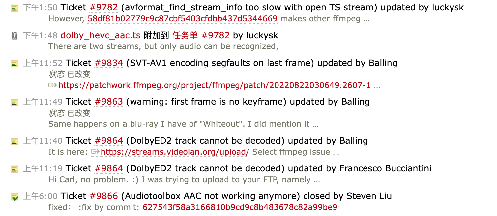
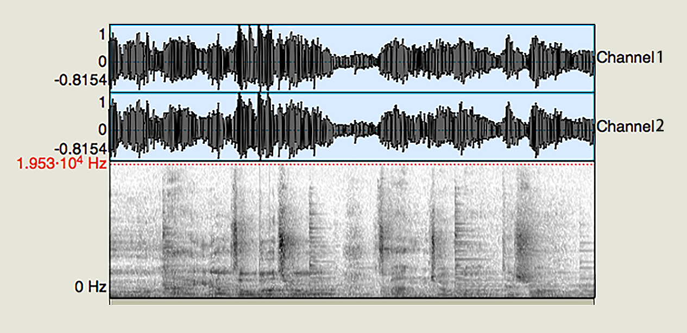
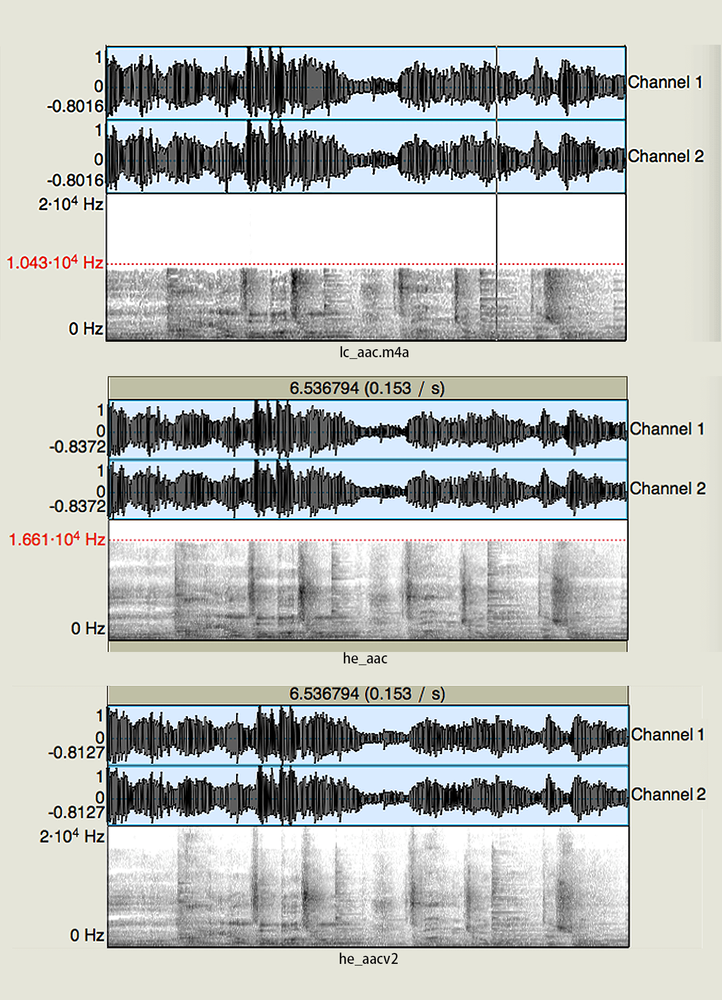
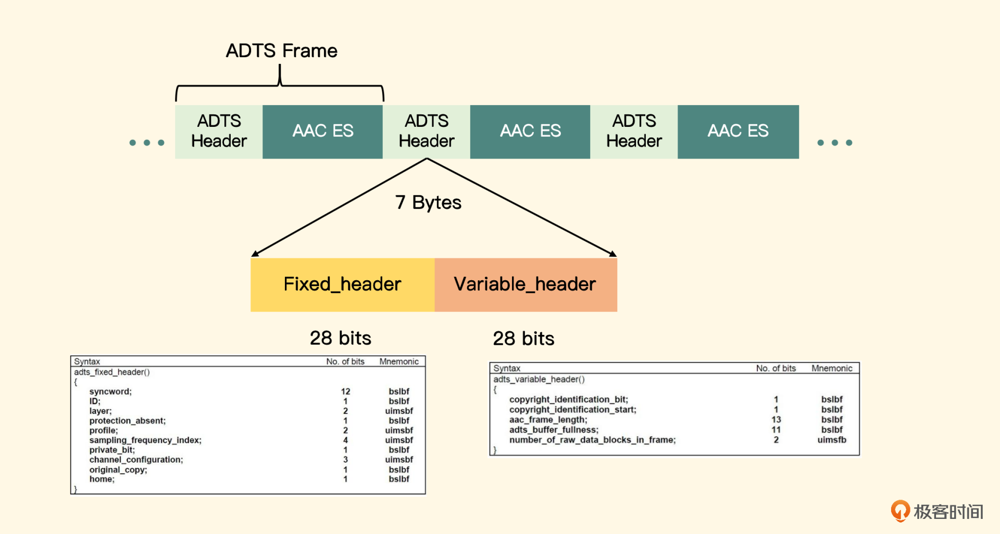
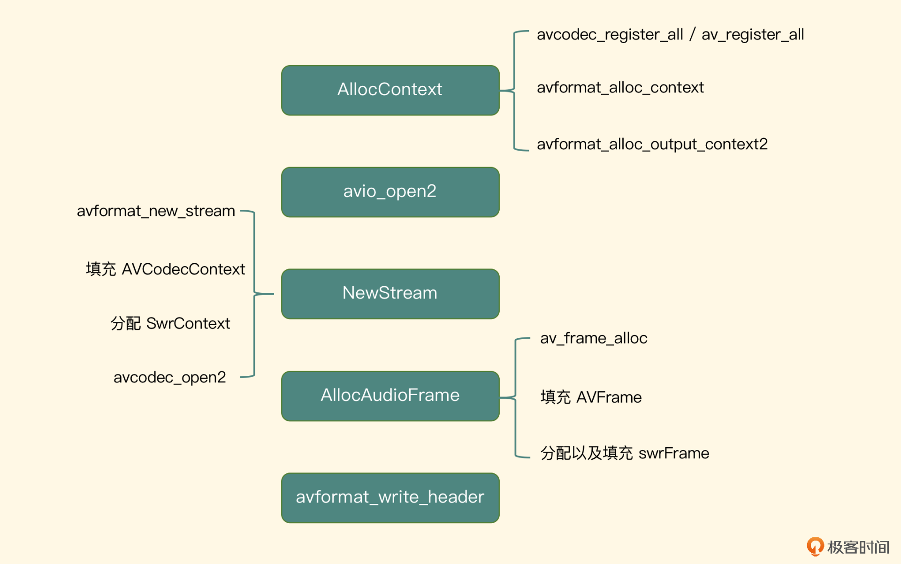

<head>
    
    
</head>

# Table of Contents

1.  [Algorithm](#orgac4e5f3)
2.  [Review](#orge511766)
    1.  [FFmpeg 有哪些常见的应用场景](#org17821c2)
        1.  [Remuxing](#org559d4ad)
        2.  [Transcoding](#org330bbb8)
        3.  [推流](#orgab57ff7)
    2.  [如何在 FFmpeg 中定制一个自己专属的模块](#orgf81665f)
        1.  [为 FFmpeg 添加自己的 AVFormat 模块](#org8eabd62)
    3.  [如何参与到 FFmpeg 社区交流中](#orgac2e834)
        1.  [角色介绍](#org001af3e)
        2.  [交流的工具](#orgee392ed)
        3.  [邮件列表](#org59cd9a5)
        4.  [IRC](#org1f0878b)
        5.  [Bug 反馈渠道](#orgcc0ee9b)
        6.  [代码贡献渠道](#orgd49346b)
        7.  [成为维护者](#orgd3784fe)
        8.  [搭建本地验证环境](#orgfb057ff)
        9.  [本地验证代码](#org6abc1d3)
        10. [本地验证 patch 代码风格](#orgc1a6868)
3.  [Tips](#orge7fb241)
    1.  [播放器项目实践（三）：让你的播放器跑起来](#org4cecdbb)
        1.  [AVSync 模块的实现](#org6435c32)
        2.  [维护解码线程](#org49fc1bb)
        3.  [音视频同步](#org7ab9eca)
        4.  [中控模块](#org9fad027)
    2.  [iOS 平台音频采集：如何使用 AudioQueue 和 AudioUnit 采集音频](#org4179063)
        1.  [设置 AVAudioSession](#org8dae562)
        2.  [如何使用 AudioQueue 采集音频](#orgfafff25)
        3.  [如何使用 AudioUnit 采集音频](#orge32e2ea)
    3.  [如何编码出一个 AAC 文件](#org4f6b8ee)
        1.  [常见的音频编码格式](#org0e54203)
        2.  [AAC 编码格式详解](#org4a22447)
        3.  [使用软件编码器编码 AAC](#org116b199)
4.  [Share](#org7725822)

# Algorithm

Leetcode 546: Remove Boxes: <https://leetcode.com/problems/remove-boxes/>

<https://dreamume.medium.com/leetcode-546-remove-boxes-fe3ac464d475>

# Review

音视频技术入门课    刘岐

## FFmpeg 有哪些常见的应用场景

### Remuxing

使用 avformat_open_input、avformat_find_stream_info 来打开输入文件，并根据输入文件中的音视频流信息建立音视频流，也就是 AVStreams

使用 avformat_alloc_output_context2、avformat_new_stream 和 avformat_write_header 来打开输出文件，并建立音视频流，输出文件会用到 AVOutputFormat，并建立封装格式操作的 AVFormatContext，作为操作上下文的结构体，并且会尝试写入输出文件的封装格式头部信息

从输入文件中读取音视频数据包，将音视频数据包写入输出文件会使用 av_read_frame 函数，从输入文件中读取 AVPacket 音视频数据包，还会使用 av_interleave_write_frame 函数，将读取到的音视频数据包写入输出文件

然后是关闭输出文件和输入文件，使用 av_write_trailer 函数，在关闭输出文件之前做写封装收尾工作。使用 avformat_free_context 函数关闭输出文件，并释放因操作输出文件封装格式申请的资源。最后使用 avformat_close_input 关闭输入文件并释放相关资源

当然，除了以上这些操作之外，还有一些 API 是我们可以根据自己的需要使用的。其实在日常操作时，做 remux 主要还是用于收录一些音视频内容的场景中，用得更多的还是编码或者转码的操作。因为音视频的编码数据格式比较多，需要统一转成相同的编码，换句话说，就是将输入的音视频内容转成统一规格输出的场景，比收录场景更常见

### Transcoding

打开文件的操作，可以定义为 open_input_file，这样将输入文件操作相关的代码放在一个函数里面比较清晰

    static int open_input_file(const char* filename) {
      int ret;
      unsigned int i;
    
      ifmt_ctx = NULL;
      if ((ret = avformat_open_input(&ifmt_ctx, filename, NULL, NULL)) < 0) {
        av_log(NULL, AV_LOG_ERROR, "Cannot open input file\n");
        return ret;
      }
    
      if ((ret = avformat_find_stream_info(ifmt_ctx, NULL)) < 0) {
        av_log(NULL, AV_LOG_ERROR, "Cannot find stream information\n");
        return ret;
      }
    
      stream_ctx = av_calloc(ifmt_ctx->nb_streams, sizeof(*stream_ctx));
      if (!stream_ctx) return AVERROR(ENOMEM);
    
      for (i = 0; i < ifmt_ctx->nb_streams; ++i) {
        AVStream *stream = ifmt_ctx->streams[i];
        const AVCodec *dec = avcodec_find_decoder(stream->codecpar->codec_id);
        AVCodecContext *codec_ctx;
        if (!dec) {
          av_log(NULL, AV_LOG_ERROR, "Failed to find decoder for stream #%u\n", i);
          return AVERROR_DECODER_NOT_FOUND;
        }
        codec_ctx = avcodec_alloc_context3(dec);
        if (!codec_ctx) {
          av_log(NULL, AV_LOG_ERROR, "Failed to allocate the decoder context for stream #%u\n", i);
          return AVERROR(ENOMEM);
        }
        ret = avcodec_parameters_to_context(codec_ctx, stream->codecpar);
        if (ret < 0) {
          av_log(NULL, AV_LOG_ERROR, "Failed to copy decoder parameters to input decoder context for stream #%u\n", i);
          return ret;
        }
    
        /* Reencode video & audio and remux subtitles etc. */
        if (codec_ctx->codec_type == AVMEDIA_TYPE_VIDEO ||
            codec_ctx->codec_type == AVMEDIA_TYPE_AUDIO) {
          if (codec_ctx->codec_type == AVMEDIA_TYPE_VIDEO)
            codec_ctx->framerate = av_guess_frame_rate(ifmt_ctx, stream, NULL);
          ret = avcodec_open2(codec_ctx, dec, NULL);
          if (ret < 0) {
            av_log(NULL, AV_LOG_ERROR, "Failed to open decoder for stream #%u\n", i);
            return ret;
          }
        }
        stream_ctx[i].dec_ctx = codec_ctx;
    
        stream_ctx[i].dec_frame = av_frame_alloc();
        if (!stream_ctx[i].dec_frame) return AVERROR(ENOMEM);
      }
    
      av_dump_format(ifmt_ctx, 0, filename, 0);
    
      return 0;
    }

avcodec_alloc_context3 申请 AVCodecContext 上下文，用 avcodec_parameters_to_context 将解析到的 AVStream 流信息中的 AVCodecParameter 复制到 AVCodecContext 对应字段中，方便后面解码的时候用

使用 avcodec_open2 打开解码器，然后是打开输出文件

    static int open_output_file(const char* filename) {
      AVStream *out_stream;
      AVStream *in_stream;
      AVCodecContext *dec_ctx, *enc_ctx;
      const AVCodec *encoder;
      int ret;
      unsigned int i;
    
      ofmt_ctx = NULL;
      avformat_alloc_output_context2(&ofmt_ctx, NULL, NULL, filename);
      if (!ofmt_ctx) {
        av_log(NULL, AV_LOG_ERROR, "Could not create output context\n");
        return AVERROR_UNKNOWN;
      }
    
      for (i = 0; i < ifmt_ctx->nb_streams; ++i) {
        out_stream = avformat_new_stream(ofmt_ctx, NULL);
        if (!out_stream) {
          av_log(NULL, AV_LOG_ERROR, "Failed allocating output stream\n");
          return AVERROR_UNKNOWN;
        }
        in_stream = ifmt_ctx->streams[i];
        dec_ctx = stream_ctx[i].dec_ctx;
    
        if (dec_ctx->codec_type == AVMEDIA_TYPE_VIDEO ||
            dec_ctx->codec_type == AVMEDIA_TYPE_AUDIO) {
          /* in this example, we choose transcoding to same codec */
          encoder = avcodec_find_encoder(dec_ctx->codec_id);
          if (!encoder) {
            av_log(NULL, AV_LOG_FATAL, "Necessary encoder not found\n");
            return AVERROR_INVALIDDATA;
          }
          enc_ctx = avcodec_alloc_context3(encoder);
          if (!enc_ctx) {
            av_log(NULL, AV_LOG_FATAL, "Failed to allocate the encoder context\n");
            return AVERROR(ENOMEM);
          }
    
          /* In this example, we transcode to same properties (picture size,
             sample rate etc.). These properties can be changed for output
             streams easily using filters */
          if (dec_ctx->codec_type == AVMEDIA_TYPE_VIDEO) {
            enc_ctx->height = dec_ctx->height;
            enc_ctx->width = dec_ctx->width;
            enc_ctx->sample_aspect_ratio = dec_ctx->sample_aspect_ratio;
            /* take first format from list of supported formats */
            if (encoder->pix_fmts)
              enc_ctx->pix_fmts = encoder->pix_fmts[0];
            else
              enc_ctx->pix_fmts = dec_ctx->pix_fmt;
            enc_ctx->time_base = av_inv_q(dec_ctx->framerate);
          } else {
            enc_ctx->sample_rate = dec_ctx->sample_rate;
            ret = av_channel_layout_copy(&enc_ctx->ch_layout, &dec_ctx->ch_layout);
            if (ret < 0) return ret;
            enc_ctx->sample_fmt = encoder->sample_fmts[0];
            enc_ctx->time_base = (AVRational){1, enc_ctx->sample_rate};
          }
    
          if (ofmt_ctx->oformat->flags & AVFMT_GLOBALHEADER)
            enc_ctx->flags |= AV_CODEC_FLAG_GLOBAL_HEADER;
    
          /* Third parameter can be used to pass settings to encoder */
          ret = avcodec_open2(enc_ctx, encoder, NULL);
          if (ret < 0) {
            av_log(NULL, AV_LOG_ERROR, "Cannot open video encoder for stream #%u\n", i);
            return ret;
          }
    
          ret = avcodec_parameters_from_context(out_stream->codecpar, enc_ctx);
          if (ret < 0) {
            av_log(NULL, AV_LOG_ERROR, "Failed to copy encoder parameters to output stream #%u\n", i);
            return ret;
          }
    
          out_stream->time_base = enc_ctx->time_base;
          stream_ctx[i].enc_ctx = enc_ctx;
        } else if (dec_ctx->codec_type == AVMEDIA_TYPE_UNKNOWN) {
          av_log(NULL, AV_LOG_FATAL, "Elementary stream #%d is of unknown type, cannot proceed\n", i);
          return AVERROR_INVALIDDATA;
        } else {
          /* if this steam must be remuxed */
          ret = avcodec_parameters_copy(out_stream->codepar, in_stream->codecpar);
          if (ret < 0) {
            av_log(NULL, AV_LOG_ERROR, "Copying parameters for stream #%u failed\n", i);
            return ret;
          }
          out_stream->time_base = in_stream->time_base;
        }
      }
    
      av_dump_format(ofmt_ctx, 0, filename, 1);
    
      if (!(ofmt_ctx->oformat->flags & AVFMT_NOFILE)) {
        ret = avio_open(&ofmt_ctx->pb, filename, AVIO_FLAG_WRITE);
        if (ret < 0) {
          av_log(NULL, AV_LOG_ERROR, "Cannot open output file '%s'\n", filename);
          return ret;
        }
      }
    
      /* init muxer, write output file header */
      ret = avformat_write_header(ofmt_ctx, NULL);
      if (ret < 0) {
        av_log(NULL, AV_LOG_ERROR, "Error occurred when opening output file\n");
        return ret;
      }
    
      return 0;
    }

设置原始数据操作相关的滤镜初始化，例如调色、调音色、放大、缩小等操作，这些操作可以在自己拿到解码后的数据后，用 OpenGL 等强大的库来完成，这里就不展开介绍了

接下来是循环操作：拿到 AVPacket、解码、取原始数据、编码，再拿到 AVPacket、再解码、再取原始数据、再编码，直到遇到退出相关的条件为止

    static int encode_write_frame(unsigned int stream_index, int flush) {
      StreamContext *stream = &stream_ctx[stream_index];
      FilteringContext *filter = &filter_ctx[stream_index];
      AVFrame *filt_frame = flush ? NULL : filter->filtered_frame;
      AVPacket *enc_pkt = filter->enc_pkt;
      int ret;
    
      av_log(NULL, AV_LOG_INFO, "Encoding frame\n");
      /* encode filtered frame */
      av_packet_unref(enc_pkt);
    
      ret = avcodec_send_frame(stream->enc_ctx, filt_frame);
    
      if (ret < 0) return ret;
    
      while (ret >= 0) {
        ret = avcodec_receive_packet(stream->enc_ctx, enc_pkt);
    
        if (ret == AVERROR(EAGAIN) || ret == AVERROR_EOF) return 0;
    
        /* prepare packet for muxing */
        enc_pkt->stream_index = stream_index;
        av_packet_rescale_ts(enc_pkt,
                             stream->enc_ctx->time_base,
                             ofmt_ctx->streams[stream_index]->time_base);
    
        av_log(NULL, AV_LOG_ERROR, "Muxing frame\n");
        /* mux encoded frame */
        ret = av_interleaved_write_frame(ofmt_ctx, enc_pkt);
      }
    
      return ret;
    }
    
    while (1) {
      if ((ret = av_read_frame(ifmt_ctx, packet)) < 0) break;
    
      stream_index = packet->stream_index;
      av_log(NULL, AV_LOG_ERROR, "Demuxer gave frame of stream_index %u\n", stream_index);
    
      if (filter_ctx[stream_index].filter_graph) {
        StreamContext *stream = &stream_ctx[stream_index];
    
        av_packet_rescale_ts(packet,
                             ifmt_ctx->streams[stream_index]->time_base,
                             stream->dec_ctx->time_base);
        ret = avcodec_send_packet(stream->dec_ctx, packet);
        if (ret < 0) {
          av_log(NULL, AV_LOG_ERROR, "Decoding failed\n");
          break;
        }
    
        while (ret >= 0) {
          ret = avcodec_receive_frame(stream->dec_ctx, stream->dec_frame);
          if (ret == AVERROR_EOF || ret == AVERROR(EAGAIN)) break;
          else if (ret < 0) goto end;
    
          stream->dec_frame->pts = stream->dec_frame->best_effort_timestamp;
          ret = encode_write_frame(stream->dec_frame, stream_index);
          if (ret < 0) goto end;
        }
      }
    
      av_packet_unref(packet);
     }

通过 av_read_frame 循环读取 AVPacket，然后调用 avcodec_send_packet 将 AVPacket 发送给解码器解码，通过 avcodec_receive_frame 拿到解码后的 AVFrame 数据，然后通过编码器给 AVFrame 的数据编码，再写到输出文件里。这时候，写编码后的 AVPacket 数据用的是交错的方式。最后千万被忘了收尾工作，不然内存就泄漏了

### 推流

前面两个例子涵盖了 API 大部分接口了，其实做推流的话也比较简单，可以任选 Remuxing 或 Transcoding 里的任何一个例子

设置输出文件的时候，有一个 avformat_alloc_output_context2 操作，从我们 Remuxing 例子中可以看到，最后一个字段是输出文件名，这里可以改成 RTMP 的 URL 地址

需要注意的是，因为是推 RTMP 的直播流，所以输出格式要设置成 FLV，否则会报错，报错内容是这样的

    [NULL @ 0x3dc1900] Unable to find a suitable output format for 'rtmp://127.0.0.1/live/stream'

所以最后 avformat_alloc_output_context2 的第一个参数是输出的 AVFormatContext，第二个参数可以设置成 NULL 交给 FFmpeg 自动查找，第三个参数设置为 "flv" 字符串，第四个参数就是我们输出的 URL 地址

为了控制节奏，我们可以在循环 av_read_frame 操作的时候，在 av_read_frame 的下一句加上 usleep(40000) 来控制节奏，也就是 sleep 40 毫秒。最后，别忘了在头文件声明部分加上 #include <unistd.h>，不然编译会报错

## 如何在 FFmpeg 中定制一个自己专属的模块

### 为 FFmpeg 添加自己的 AVFormat 模块

AVFormat 是各种音视频文件格式（包括网络文件格式）的封装模块，要添加一个自己专属的 AVFormat 模块，需要先“发明”一种自己的文件格式，然后用代码实现，这里为了简洁一点，我们使用固定的编解码格式

1.  kwai 文件格式

    我们把新“发明”的文件格式命名为 kwai，格式定义如下：
    
    -   支持音视频，文件固定包含一个音频轨和一个视频轨
    -   音频固定为 AAC，视频固定为 H264
    -   音视频交错存储
    -   音视频数据块的长度，32 位无符合整数，大端序，后面跟音视频数据
    -   长度字段最高位，音频为 0，视频为 1
    
    文件头定义如下：
    
    -   4 字节文件魔数，固定为 kwai
    -   4 字节版号，32 位无符号整数，大端序
    -   4 字节采样率，32 位无符号整数，大端序
    -   1 字节填充字符，无任何意义，固定为 0
    -   1 字节音频声道数
    -   2 字节视频宽度，32 位整数，大端序
    -   2 字节视频高度，32 位整数，大端序
    -   2 字节帧率分子，16 位整数，大端序
    -   2 字节帧率分母，16 位整数，大端序
    -   26 字节其他文本信息，最后一字节为 0，即 NULL 字符，主要是为了方便字符串处理
    
    这样定制内容，主要是为了演示不同长度整数的处理，外加一个额外的填充字符，同时也是为了数据对齐，人眼看起来比较直观，后面我们会在文件头的 16 机制数据表示时感受到这种效果

2.  添加文件

    首先，我们在 libavformat 目录下创建两个文件：kwaienc.c 和 kwaidec.c
    
    接下来在 libavformat/Makefile 中增加下面这段内容
    
        OBJS-$(CONFIG_kwai_DEMUXER) += kwaidec.o
        OBJS-$(CONFIG_kwai_MUXER) += kwaienc.o
    
    接下来在 libavformat/allformats.c 中增加下面这段内容
    
        extern const AVOutputFormat ff_kwai_muxer;
        extern const AVInputFormat ff_kwai_demuxer;
    
    执行命令 ./configure &#x2013;list-muxers 和 ./configure &#x2013;list-demuxers 可以列出所有的格式，如果能从输出结果中找到 kwai，就说明添加成功了
    
        ./configure --list-muxers
        ./configure --list-demuxers
    
    然后重新执行 configure
    
        ./configure --enable-muxer=kwai --enable-demuxer=kwai

3.  添加文件封装格式

    文件封装（就是 AVOutputFormat）是一个输出格式，它的输入端也是一个 AVFormat（也就是 AVInputFormat）。下面，我们先注册我们的 kwai 封装文件格式，内容在 kwaienc.c 中。一般来说，分为这几步：
    
    1.  定义文件格式结构体
    2.  准备参数
    3.  定义一个类
    4.  向 FFmpeg 注册文件格式
    5.  实现回调函数

4.  定义文件格式结构体

    我们先定义一个结构体，用来描述和存储文件的各种参数。其中，这个结构体的第一个成员必须是一个 AVClass 类型的指针，不需要特别处理，FFmpeg 内部会用到。其他参数，你可以参考代码内的注释
    
        typedef struct kwaiMuxContext {
          AVClass *class;               /* AVClass 指针 */
          uint32_t magic;               /* 魔数 */
          uint32_t version;             /* 版本号，目前固定为 1 */
          uint32_t sample_rate;         /* 音频采样率，常用的 AAC 格式为 44100 */
          uint8_t channels;             /* 声道数 */
          uint32_t width;               /* 视频宽度 */
          uint32_t height;              /* 视频高度 */
          AVRational fps;               /* 帧率 */
          char *info;                   /* 文件的其他描述信息，字符串 */
        } kwaiMuxContext;

5.  准备参数

    准备一个 AVOption 结构体数组，用来存放 kwai 文件格式的相关参数。比如，我们下面定义了一个字符串格式的 info 参数和一个整数格式的 version 参数，最后用了一个空（NULL）结构体元素结尾。这两个参数都可以在命令行上使用，后面我们会看到具体的用法
    
    FFmpeg 会自动为这些参数申请存储空间。从下面的代码里我们可以看到，这些参数其实指向了我们上面定义的结构体，当在命令行上指定参数的时候，会修改相应的结构体指针
    
        static const AVOption options[] = {
          {"info", "kwai info", offsetof(kwaiMuxContext, info), AV_OPT_TYPE_STRING,
           {.str = NULL}, INT_MIN, INT_MAX, AV_OPT_FLAG_ENCODING_PARAM, "kwaiflags"},
          {"version", "kwai version", offsetof(kwaiMuxContext, version), AV_OPT_TYPE_INT,
           {.64 = 1}, 0, 9, AV_OPT_FLAG_ENCODING_PARAM, "kwaiflags" },
          {NULL},
        };

6.  定义一个类

    定义一个 AVClass 结构体，指定 kwai 文件格式的名称，关联上面定义的参数等
    
        static const AVClass kwai_muxer_class = {
          .class_name = "kwai muxer",
          .item_name = av_default_item_name,
          .option = options,
          .version = LIBAVUTIL_VERSION_INT,
        };

7.  向 FFmpeg 注册文件格式

    有了上述内容，我们就可以向 FFmpeg 注册我们的 kwai 文件格式了。其中 ff_kwai_muxer 这个名字对应我们上面在 allformats.c 文件中添加的名字，这样 FFmpeg 在编译器中就可以找到我们定义的文件格式了
    
        const AVOutputFormat ff_kwai_muxer = {
          .name = "kwai",               /* 格式名称 */
          .long_name = null_if_config_small("kwai / kwai"), /* 长名称 */
          .extensions = "kwai",                             /* 文件扩展名 */
          .priv_data_size = sizeof(kwaiMuxContext),         /* 私有数据内存大小 */
          .audio_codec = AV_CODEC_ID_AAC,                   /* 音频编码 */
          .video_codec = AV_CODEC_ID_H264,                  /* 视频编码 */
          .init = kwai_init,                                /* 初始化回调函数 */
          .write_header = kwai_write_header,                /* 写文件头回调 */
          .write_packet = kwai_write_packet,                /* 写文件内容回调 */
          .write_trailer = kwai_write_trailer,              /* 写文件尾回调 */
          .deinit = kwai_free,                              /* 写文件结束后，释放内存回调 */
          .flags = 0,                                       /* 其他标志（略） */
          .priv_class = &kwai_muxer_class,                  /* 私有的文件结构体，指向我们上一步定义的内容 */
        };

8.  实现回调函数

    
    
    1.  初始化函数
        
        初始化函数在最初打开文件时调用，这个函数的输入参数是一个 AVFormatContext 结构体指针，由 FFmpeg 在打开文件时传入。这个结构体指针包含了文件的类型、流的数量（nb_streams）和各种参数。根据这些参数，我们就可以完成 kwai 封装器的初始化工作了
        
            static int kwai_init(AVFormatContext *s) {
              AVStream *st;                 /* 音视频流，每一个 stream 代表一个类型，如音频流、视频流等 */
              kwaiMuxContext* kwai = s->priv_data; /* 指向私有的结构体，已初始化为默认值 */
              printf("init nb_streams: %d\n", s->nb_streams);
              if (s->nb_streams < 2) {      /* 音视频流数量，我们只接受一个音频流和一个视频流的输入 */
                return AVERROR_INVALIDDATA; /* 简单出错处理 */
              }
              st = find_stream(s, AVMEDIA_TYPE_AUDIO); /* 查找音频流，该函数后面解释 */
              if (!st) return AVERROR_INVALIDDATA;     /* 简单出错处理，如果找不到音频流则返回 */
              kwai->sample_rate = st->codecpar->sample_rate; /* 记住输入音频流的采样率 */
              kwai->channels = st->codecpar->channels;       /* 记住声道数 */
              st = find_stream(s, AVMEDIA_TYPE_VIDEO); /* 查找视频流，该函数后面解释 */
              if (!st) return AVERROR_INVALIDDATA;     /* 简单出错处理，如果找不到音频流则返回 */
              kwai->width = st->codecpar->width;
              kwai->height = st->codecpar->height;
              /* kwai->fps = st->codecpar->fps; */
              kwai->fps = (AVRational){15, 1}; /* 记住帧率 */
            
              return 0;
            }
            
            static AVStream *find_stream(AVFormatContext* s, enum AVMediaType type) {
              int i = 0;
              for (; i < s->nb_streams; ++i) {
                AVStream* stream = s->streams[i];
                if (stream->codecpar->codec_type == type) return stream;
              }
            
              return NULL;
            }
    
    2.  写头文件
        
        初始化完成后，下一步就是写文件头，其实写文件头函数也是一个回调函数，都是由 FFmpeg 的核心逻辑回调的，所以我们只需要照着输入输出格式定义好文件就可以了
        
            static int kwai_write_header(AVFormatContext *s) {
              kwaiMuxContext* kwai = s->priv_data;
              kwai->magic = MKTAG('K', 'W', 'A', 'I');
              /* avio_wb32(s->pb, kwai->magic); */
              avio_write(s->pb, (uint8_t *)&kwai->magic, 4);
              avio_wb32(s->pb, kwai->version);
              avio_wb32(s->pb, kwai->sample_rate);
              avio_wb8(s->pb, 0);
              avio_wb8(s->pb, kwai->channels);
              avio_wb16(s->pb, kwai->width);
              avio_wb16(s->pb, kwai->height);
              avio_wb16(s->pb, kwai->fps.num); /* 帧率分子 */
              avio_wb16(s->pb, kwai->fps.den); /* 帧率分母 */
              char info[16] = {0};
              if (kwai->info) {
                strncpy(info, kwai->info, sizeof(info) - 1);
              }
              avio_write(s->pb, info, sizeof(info));
            
              return 0;
            }
        
        info 字符串占 26 个字节（包括结尾的 NULL 字符），这主要是为了使文件头部分正好是 48 个字节，对人眼比较友好
    
    3.  写音视频数据
        
        如果初始化和写文件头正常，FFmpeg 就开始写音视频数据了。其中，输入参数除了 AVFormatContext 结构体指针外，还有一个 AVPacket 结构体指针，里面存放了具体要求的音视频数据。音视频会交错存储，首先写入当前数据的时间戳（64 位的 pts 值），然后是以 32 位无符号整数表示的长度（其中视频的长度最高位置 1），接着写入实际的音视频数据
        
            static int kwai_write_packet(AVFormatContext *s, AVPacket *pkt) {
              /* kwaiMuxContext* kwai = s->priv_data; */
              if (!pkt) return 1;
            
              uint32_t size = pkt->size;    /* 获取数据大小 */
              AVStream *st = s->streams[pkt->stream_index];
              if (st->codecpar->codec_type == AVMEDIA_TYPE_AUDIO) {
                printf("Audio: %04d pts: %lld\n", size, pkt->pts); /* 打印音频字节数和 pts */
              } else if (st->codecpar->codec_type == AVMEDIA_TYPE_VIDEO) {
                printf("Video: %04d pts: %lld\n", size, pkt->pts); /* 打印视频字节数和 pts */
                size |= (1 << 31);                                 /* 如果是视频，将长度的最高位置 1 */
              } else {
                return 0;                   /* ignore any other types */
              }
            
              avio_wb64(s->pb, pkt->pts);
              avio_wb32(s->pb, size);
              avio_write(s->pb, pkt->data, pkt->size); /* 实际的音视频数据 */
            
              return 0;
            }
    
    4.  文件结束处理
        
        文件结束时，调用 write_trailer 回调写尾部数据，并调用 deinit 回调释放相应的内存，这里我们的封装器实现得比较简单，所以简单放两个空函数即可
        
            static int kwai_write_trailer(AVFormatContext *s, AVPacket *pkt) {
              return 0;
            }
            
            static void kwai_free(AVFormatContext *s) {
            }
    
    5.  编译运行
        
        最后，直接执行 make 就可以编译了。不过，这时候由于我们没有实现解封装器，会提示 ff_kwai_demuxer 不存在。为了能“骗过”编译器，我们可以先在 kwaidec.c 里定义一下，临时代码如下
        
            #include "avformat.h"
            const AVInputFormat ff_kwai_demuxer;
        
        编译通过后，我们就可以使用熟悉的命令行来生成一个 kwai 类型的文件了。先找一个标准的 MP4 文件（如 input.mp4）作为输入，命令行如下
        
            ./ffmpeg -i input.mp4 -bsf:v h264_mp4toannexb -info 'a simple test' out.kwai
        
        上述命令中，我们使用了 h264_mp4toannexb 这个 filter，它的主要作用是将 MP4 中的 H264 视频容器数据封装转换为传统的使用 startcode 分割的 annexb 比特流格式。因为大多数解码器只支持这种格式。此外，我们还使用 -info 参数增加了一些文本信息，输出文件名为 out.kwai
        
        下面，我们先分析一下文件格式是否符合我们的预期。Windows 平台可以使用一些 16 进制编辑器打开文件查看，输出内容如下：
        
            00000000: 6b77 6169 0000 0001 0000 ac44 0002 0280  kwai.......D....
            00000010: 01e0 000f 0001 6120 7369 6d70 6c65 2074  ......a simple t
            00000020: 6573 7400 0000 0000 0000 0000 0000 0000  est.............
            00000030: 0000 0000 0000 0000 0000 0017 de02 004c  ...............L

## 如何参与到 FFmpeg 社区交流中

### 角色介绍

社区中主要有这么几类人

-   贡献者（contributor）：主要指给开源项目贡献代码或文档的人，还有参与 code review 并且 review 意见被采纳的人
-   维护者（maintainer）：主要指对代码或文档有提交和维护责任的人
-   委员会（committee）：主要指负责社区日常运作、流程管理这一类工作的人

### 交流的工具

FFmpeg 开源社区主要是通过邮件列表和 IRC 聊天室沟通。IRC 聊天室比较即时，但是整体不如用邮件列表通用

### 邮件列表

通过 FFmpeg 官方网站 [邮件列表页](https://ffmpeg.org/contact.html#MailingLists) 我们可以看到，命令行用户是在 ffmpeg-user 列表里交流，API 用户是在 libav-user 列表里交流，FFmpeg 的开发者是在 ffmpeg-devel 列表里交流

libav-user 列表里问问题、交流，几乎没什么人回复，主要是因为 API 用户自己业务场景或自己使用的方式出现了一些问题，别人也不太愿意看你的代码，所以自己挖的坑还是需要自己仔细研究怎么填

ffmpeg-devel 列表里，主要是以 Patch 为沟通的基础，在这里提需求几乎没人理，反馈 Bug 也没人理，但是你修改了 FFmpeg 内部的代码的话，做成 patch 发到这个列表里，获得回应的概率会高一些

ffmpeg-user 里比较热闹，主要是命令行遇到问题，有些参数执行的效果有问题等。这里收到回复的概率更大，但需要注意一点，不要“top-posting“，这是 FFmpeg 社区邮件列表里沟通最基本的原，即回复邮件的时候不要在邮件内容的最上面回复，推荐的做法是想要回复哪一句就在哪一句的下面新起一行回复

如果对整个邮件都存在不同意见的话，可以在邮件的最下方回复。邮件列表是有每日归档的，归档时有统一的格式要求。所有的记录在 [归档列表](https://lists.ffmpeg.org/pipermail/ffmpeg-devel/) 里面都能找到。邮件列表使用方法是先使用邮箱注册到邮件列表，然后在自己邮箱里确认注册成功就可以了

### IRC

聊天室主要是分为用户聊天室和开发者聊天室，用户主要是命令行用户和 API 用户，开发者是指 FFmpeg 内部代码开发者。用户聊天室人会多一些，活跃度高一些，开发者聊天室用户少，所以活跃度没有那么高，并且大多是关于开发内容的临时性沟通，主要沟通还是在邮件列表里面，所以通常大家不怎么用 IRC 交流，除非特别着急的时候。如果你有兴趣的话，可以看一下 [IRC 相关的参考链接](https://ffmpeg.org/contact.html#IRCChannels)

成为 contributor 还需要给 FFmpeg 反馈 Bug、贡献代码。接下来我们一起看一下 FFmpeg 反馈 Bug 和贡献代码的渠道

### Bug 反馈渠道

FFmpeg 是通过 [trac](https://trac.ffmpeg.org/timeline) 来管理 Bug 的。Bug 也分很多种，有需求类 Bug，也有阻塞型 Bug。提 Bug 的格式也需要注意，主要是需要说清楚自己的环境、FFmpeg 的版本和使用的参数，把 FFmpeg 执行命令的那一行到结束的所有的内容都贴到 Bug 说明里，不需要自己做内容剪切

自己提了 Bug 以后，不一定能够及时得到解决。如果我们自己分析并解决了 Bug，再把代码回馈给 FFmpeg 的话，是个参与 FFmpeg 开发不错的路径，而且还会降低使用风险。因为 FFmpeg 是 LGPL 的 License，如果不反馈修改过的代码的话，可能会涉及开源使用合规相关的法务问题，尽管 FFmpeg 目前不太追究法律问题了，但是还是要考虑一下合规性的

### 代码贡献渠道

当前，给 FFmpeg 贡献代码采用的是向邮件列表发送 patch 的方式，发送 patch 到邮件列表后，邮件列表里面的开发者和维护者们会通过回邮件的方式做 code review，可能会提一些 comments，他们做 code review 的时候，也是在邮件内容中对自己有意见的那一行或者那一部分做出回复，不会 top-posting

而 patch 是需要通过 git format-patch 来生成的，在发送 patch 之前，你需要自己验证一下代码格式是否符合标准，在源代码目录的 tools 目录下有一个 [patcheck](https://ffmpeg.org/developer.html#Coding-Rules-1) ，它可以辅助你检查代码是否符合 FFmpeg 的基本标准，在修改完代码之后，自己本地需要做一下 FFmpeg 自测，操作步骤如下：

1.  make fate-rsync SAMPLES=fate-suite/
2.  make fate   SAMPLES=fate-suite/

也可以在做 configure 编译配置的时候指定 fate 测试样本

    ./configure --samples=fate-suite/
    make fate-rsync
    make fate

在配置（configure）的时候，添加一个 -samples=fate-suite 来指定测试样本下载的目录

在 make fate 通过以后，才能确保修改的代码对原有的 FFmpeg 代码和能力没有太大的影响。如果 make fate 不通过的话，说明代码修改得还是不够好，会影响一些我们没有看到的逻辑

发送 patch 到邮件列表的时候，我推荐你使用 git send-email 的方式来发送，这样可以按照标准格式将 patch 发送到邮件列表，如果打开文本复制粘贴到邮件里面的话，很容易出现乱码

FFmpeg 的邮件列表和其他工具基本上是联动的，如果我们发一个 patch 想确认是否正常的话，FFmpeg 还提供了个 [patchwork 工具](https://patchwork.ffmpeg.org/project/ffmpeg/list/)，在 patchwork 里也可以看到你的 patch 是否正常。因为 FFmpeg 支持的平台比较多，所以平台兼容性也在考虑范围之内

当然，我们在修改完代码以后，做 git commit 的时候提交信息需要尽量全面地描述修改的原因、你的思考以及背后的逻辑，这样别人才能知道你为什么这样修改代码

### 成为维护者

要成为维护者的话，首先需要达到几个关键的指标：

1.  代码覆盖量达到一定的标准，就拿某个模块来说，如果这个模块代码有 5000 行，其中有超过 50% 的代码是你写的，那么你就有机会成为这个模块的维护者
2.  在 FFmpeg 做 Bugfix 的 patch、完善功能的 patch 以及性能优化的 patch，达到一定数量以后，你就可以尝试申请成为 FFmpeg 的维护者。数量没有一个明确的量化值，但多多益善

### 搭建本地验证环境

当有人发 patch 到邮件列表里面的时候，patchwork 会自动将 patch 放到自己的队列里面。如果想要成为维护者，可以考虑自己在本地搭建一个环境，从 patchwork 队列里将自己维护的模块或相关的 patch 自动下载到本地的，合并到自己本地的代码库里自动地 make fate

如果你希望成为维护者，patch 的兼容性就是一个必要条件，所以在本地搭建自动化回测的各个系统环境是必不可少的，一些基本的可自动化验证的环境也是必不可少的。你可以参考以下几个环境

1.  通过用 QEMU 模拟 MIPS + Linux 的环境
    
        ../configure --target-exec='.../qemu-mips -cpu 74Kf -L/usr/mips-linux-gnu/' --samples=... --enable-gpl --cross-prefix=/usr/mips-linux-gnu/bin/ --cc='ccache mips-linux-gnu-gcc-4.4' --arch=mips --target-os=linux --enable-cross-compile --disable-pthreads --disable-mipsfpu --disable-iconv

2.  通过 WINE 模拟 windows 环境
    
        ../configure  --cc='ccache i686-w64-mingw32-gcc'  --samples=... --arch=x86 --target-os=mingw32 --cross-prefix=i686-w64-mingw32- --enable-gpl --pkg-config=./pig-config --target_exec=wine

3.  X86 Linux 环境

4.  X86 MacOS 环境

5.  M1 MacOS 环境

### 本地验证代码

新增的 patch 对代码的修改是否会引起内存泄露，这也是不可缺少的一步。你可以尝试使用 AddressSanitizer 或 Valgrind 做代码修改的内存操作异常检测。比如我本地用的是 AddressSanitizer

    --extra-ldflags=' -O0 -g3 -fsanitize=address -Wno-error -fPIC -I/usr/local/include' --cflags='-O0 -g3 -fsanitize=address -Wno-error -fPIC '

如果出现异常，比如内存操作不标准的话，执行 FFmpeg 做验证的时候会报错：

    ==58865==ERROR: AddressSanitizer: attempting free on address which was not malloc()-ed: 0x6130000013b8 in thread T0
        #0 0x10cbf7639 in wrap_free+0xa9 (libclang_rt.asan_osx_dynamic.dylib:x86_64h+0x48639)
        #1 0x10a4676f4 in av_free mem.c:251
        #2 0x109433230 in mov_free movenc.c:6755
        #3 0x109470296 in deinit_muxer mux.c:423
        #4 0x109471671 in av_write_trailer mux.c:1281
        #5 0x108e1eece in of_write_trailer ffmpeg_mux.c:533
        #6 0x108e41c77 in transcode ffmpeg.c:4095
        #7 0x108e410d2 in main ffmpeg.c:4242
        #8 0x11069f51d in start+0x1cd (dyld:x86_64+0x551d)
    
    0x6130000013b8 is located 56 bytes inside of 304-byte region [0x613000001380,0x6130000014b0)
    allocated by thread T0 here:
        #0 0x10cbf7c03 in wrap_posix_memalign+0xb3 (libclang_rt.asan_osx_dynamic.dylib:x86_64h+0x48c03)
        #1 0x10a467536 in av_malloc mem.c:105
        #2 0x10a4678a4 in av_mallocz mem.c:266
        #3 0x10946f152 in avformat_alloc_output_context2 mux.c:122
        #4 0x108e2272a in open_output_file ffmpeg_opt.c:2900
        #5 0x108e20b4a in open_files ffmpeg_opt.c:3668
        #6 0x108e20998 in ffmpeg_parse_options ffmpeg_opt.c:3724
        #7 0x108e40ff7 in main ffmpeg.c:4225
        #8 0x11069f51d in start+0x1cd (dyld:x86_64+0x551d)
    
    SUMMARY: AddressSanitizer: bad-free (libclang_rt.asan_osx_dynamic.dylib:x86_64h+0x48639) in wrap_free+0xa9
    ==58865==ABORTING

### 本地验证 patch 代码风格

用 patcheck 检查代码风格

    [root@onvideo-liuqi05-01 ffmpeg]# ./tools/patcheck 0001-avfilter-vsrc_ddagrab-add-options-for-more-control-o.patch 
    patCHeck 1e10.0
    This tool is intended to help a human check/review patches. It is very far from
    being free of false positives and negatives, and its output are just hints of what
    may or may not be bad. When you use it and it misses something or detects
    something wrong, fix it and send a patch to the ffmpeg-devel mailing list.
    License: GPL, Author: Michael Niedermayer
    
    possibly unused variables
    possibly never written:allow_fallback
    possibly constant     :allow_fallback
    possibly never written:force_fmt
    possibly constant     :force_fmt
    
    Missing changelog entry (ignore if minor change)
    [root@onvideo-liuqi05-01 ffmpeg]# 

# Tips

移动端音视频开发实战    展晓凯

## 播放器项目实践（三）：让你的播放器跑起来

### AVSync 模块的实现

AVSync 模块除了负责音视频的同步之外，还要维护一个解码线程，主要工作就是线程的创建、暂停、运行、销毁，就是我们架构图中 AVsynchronizer 这个类

这个类的实现分成两部分，第一部分是维护解码线程，第二部分就是音视频同步。主要接口与实现有以下四个

-   提供初始化接口，内部实现为：使用外界传递过来的 URI 去实例化解码器模块，实例化成功之后，创建音频队列与视频队列，并且创建解码线程，将音视频解码后的数据放入队列中
-   提供获取音频数据接口，内部实现为：如果音频队列中有音频就直接去返回，同时要记录下这个音频帧的时间戳，如果音频队列中没有音频就返回静音数据
-   提供获取视频帧接口，内部实现为：返回与当前播放的音频帧时间戳对齐的视频帧
-   提供销毁接口，内部实现为：先停掉解码线程，然后销毁解码器，最后再销毁音视频队列

### 维护解码线程

AVSync 模块创建的解码线程扮演了生产者的角色，生产出来的数据根据类型分别存放到音频队列和视频队列中。而 AVSync 模块向外暴露的获取音频数据和视频帧的方法，扮演了消费者的角色。消费者会从音视频队列里面获取数据，这是一个标准的生产者 - 消费者模型

由于是在 Native 层来维护线程，所以我们选用 Posix 线程模型来创建一个解码线程。创建成功后就让解码线程运行起来，解码音频帧和视频帧。解码出来的音视频帧封装为我们自定义的结构体 AudioFrame 和 VideoFrame，然后把它们分别放入音视频队列中。解码线程内部代码如下

    while (isOnDecoding) {
      isDecodingFrames = true;
      decodeFrames();
      isDecodingFrames = false;
      pthread_mutex_lock(&videoDecoderLock);
      pthread_cond_wait(&videoDecoderCondition, &videoDecoderLock);
      pthread_mutex_unlock(&videoDecoderLock);
     }

我们设置一个变量名字叫做 max_bufferDuration，值设置为 0.2s。每一次调用 decodeFrames 这个方法，都会将两个队列填充到 max_bufferDuration 的刻度之上，这个方法执行结束之后，解码线程就在 Wait 出等待 Signal 指令

我们设置一个变量名字叫做 min_bufferDuration，值设置为 0.1s。消费者每一次消费数据之后，我们要判断队列里面的音视频缓冲长度是否在 min_bufferDuration 刻度以下，如果在这个刻度以下，就发送 Signal 指令，让生产者线程继续生产数据

    bool isBufferedDurationDecreasedToMin = bufferedDuration <= minBufferedDuration;
    if (isBufferedDurationDecreasedToMin && !isDecodingFrames) {
      int getLockCode = pthread_mutex_lock(&videoDecoderLock);
      pthread_cond_signal(&videoDecoderCondition);
      pthread_mutex_unlock(&videoDecoderLock);
     }

当生产线程收到 Signal 指令之后，就会进入下一轮的解码。伴随着生产线程和消费者线程的协同工作，整个视频播放器也就运行起来了

还需要注意一点，在销毁这个模块的时候，需要先把 isOnDecoding 这个变量设置为 false，然后再发送一次 Signal 指令，让解码线程有机会结束。否则，解码线程就有可能一直在这里等待，成为一个僵尸线程

### 音视频同步

音视频同步的策略一般分为三种：音频向视频同步、视频向音频同步，以及音频视频统一向外部时钟同步，在使用 ffplay 播放视频文件的时候，所指定的对齐方式就是上面所说的三种方式

<table border="2" cellspacing="0" cellpadding="6" rules="groups" frame="hsides">

<colgroup>
<col  class="org-left" />

<col  class="org-left" />

<col  class="org-left" />
</colgroup>
<thead>
<tr>
<th scope="col" class="org-left">方式</th>
<th scope="col" class="org-left">对齐操作</th>
<th scope="col" class="org-left">缺点</th>
</tr>
</thead>

<tbody>
<tr>
<td class="org-left">音频向视频同步</td>
<td class="org-left">画面流畅</td>
<td class="org-left">音频丢帧/插入静音帧，用户易感知到</td>
</tr>

<tr>
<td class="org-left">视频向音频同步</td>
<td class="org-left">音频可以连续的播</td>
<td class="org-left">视频有可能会跳帧，用户不易感知到</td>
</tr>

<tr>
<td class="org-left">统一向外部时钟同步</td>
<td class="org-left">最大程度地保证音视频都不跳帧</td>
<td class="org-left">控制不好外部时钟，可能出现音频和视频都跳帧的情况</td>
</tr>
</tbody>
</table>

1.  音频向视频同步
    
    当我们向 AudioOutput 模块填充音频数据的时候，会和当前渲染的视频帧的时间戳进行比较。这个差值如果在阙值范围之内，就可以直接将这一阵音频帧填充给 AudioOutput 模块，让用户听到这个声音，如果不在阙值范围内，就需要做对齐操作
    
    如果要填充的音频帧的时间戳比当前渲染的视频帧时间戳小，那就需要跳帧操作，具体的跳帧操作可以是加快播放速度，也可以是丢掉一部分音频帧的实现
    
    如果音频帧的时间戳逼当前渲染的视频帧时间戳大，那么就需要等待，具体实现有两种，我们可以将音频的速度放慢，播放给用户听，也可以填充空数据给 AudioOutput 模块，进行播放。一旦视频的时间戳赶上了音频的时间戳，就可以将本帧音频帧的数据填充给 AudioOutput 模块了
    
    这种方式优点是可以视频每一帧都播放给用户看，画面可以说是最流畅的。但音频就会有丢帧或者插入静音帧的情况。所以这种对齐方式也会有一个比较大的缺点，就是音频有可能会加速或跳变，也有可能会有静音数据或慢速播放。如果使用变速手段来实现，并且变速系数不太大的话，用户感知可能不太强，但是如果使用丢帧或者插入空数据来实现，用户的耳朵是可以明显感觉到卡顿的

2.  视频向音频同步
    
    由于不论是哪个平台播放音频的引擎，都可以保证播放音频是线性的，即播放音频的时间长度与实际这段音频所代表的时间长度是一致的。由于音频线性渲染这一特性，当客户端代码跟我们要视频帧的时候，就会先计算出当前视频队列头部视频帧元素和当前音频播放帧时间戳的差值
    
    如果在阙值范围之内，就可以渲染这一帧视频帧；如果不在阙值范围内的话就要进行对齐操作。如果当前队列头部视频帧的时间戳小于当前播放音频帧的时间戳的话，就进行跳帧操作；如果大于当前播放音频帧的时间戳，就等待一会儿（重复渲染上一帧或者不进行重复渲染）。这种对齐方式的优点是音频可以连续播放，缺点就是视频有可能会跳帧，也有可能重复播放，不会那么流畅。但是用户的眼睛是不太容易分辨轻微的丢帧和跳帧的现象

3.  统一向外部时钟同步
    
    实现就是单独在外部维护一轨时钟，我们要保证这个外部时钟的更新是按照时间慢慢增加的，而我们获取音频数据和视频数据的时候，都要和这个外部时钟对齐。如果没有超过阙值，那么久直接渲染，如果超过阙值我们就进行对齐操作
    
    具体的对齐操作就是使用上述两种方式里的对齐操作，用这些方式分别对齐音频和视频。优点是可以最大程度地保证音视频都不跳帧，缺点是如果控制不好外部时钟，极有可能出现音频和视频都跳帧的情况
    
    由于人的耳朵比眼睛敏感，所以我们实现的播放器中就选用视频向音频对齐的方式

### 中控模块

中控模块就是架构类图中 VideoPlayerContrller 这个类，这个类就是上面提到的各个模块有序地组织起来，让单独运行的各个模块可以协同配合起来。由于每个模块都有各自的线程在运行，所以这个类需要维护好各个模块的生命周期，否则容易产生多线程的问题

1.  初始化阶段

    我们希望即使客户端代码没有提供渲染的 View，播放器也应该能够播放出声音，可以单独播放音频。在某些场景下是一个比较有用的功能，比如可以加速秒开，可以做一些画中画功能。要想达到这样的目标，我们需要把播放器的初始值和渲染界面的初始化分开。所以，初始化阶段可以分为两部分，一部分是播放器的初始化，另外一部分是渲染界面的初始化
    
    首先我们来看播放器的初始化，因为在初始化的过程中需要和资源建立连接，并执行 I/O 操作，所以这里必须要开辟一个线程来做初始化操作，即利用 PThread 创建一个 InitThread 来执行。在这个线程中，先实例化 AVSynchronizer 这个对象，然后调用这个对象的 init 方法，来建立和媒体资源的连接通道
    
    如果打开链接失败，那么回调客户端打开资源失败；如果打开连接成功，就拿出音频流信息（Channel、SampleRate、SampleFormat）来初始化 AudioOutput，并把这个对象注册给 AudioOutput，用来提供音频数据。AudioOutput 初始化成功后，就直接调用 AVSync 模块的 start 方法，以及 AudioOutput 的播放方法，并且将初始化成功回调给客户端，至此我们的播放器可以正常地播放音频了
    
    接下来是渲染界面初始化的阶段，如果业务层在某个时机可以显示视频的画面了，那么就让 Surface（Texture） View 显示，按照 Surface（Texture）View 的生命周期，调用端会拿着 Surface  调用到 JNI 层，JNI 层会把 Surface 构建成 ANativeWindow，然后调用中控系统的 initVideoOutput 方法。这个方法内部用传递进来的 ANativeWindow 对象和界面的宽、高以及获取视频帧的回调函数来初始化 VideoOutput 对象

2.  运行阶段

    由于在初始化阶段，我们已经通过调用 AudioOutput 的 start 方法开启了音频输出模块，所以当 AudioOutput 模块将自己缓冲区里面的音频数据播放完毕之后，就会立马通过回调方法让我们的中控模块填充音频数据，那中控模块填充音频数据的方法是如何实现的呢？
    
    这次我们从结果出发来看这个方法的实现
    
    1.  填充静音数据，当以下情况出现的时候，要填充静音数据给 AudioOutput 进行播放
        -   播放器状态是暂停状态
        
        -   AVSync 中的音频队列已经空了
        
        -   AVSync 已经被销毁了或者解码完毕了
    
    2.  填充真实数据，当以上情况都不满足的情况下，就去 AVSync 模块中获取音频数据，等填充了音频数据之后，要做两件事
        -   更新当前播放的时间戳，用于做后续的音画同步
        
        -   给 VideoOutput（视频输出模块）发送一个指令，让 VideoOutput 模块更新视频帧
    
    VideoOutput 模块接收到这个指令之后，就可以调用回调方法来获取一帧视频帧，由于在初始化的时候，已经把中控系统注册给 VideoOutput 用来获取视频帧了，所以这里会调用中控模块获取视频帧的方法。这个方法会调用 AVSync 模块，来获取一个与音频匹配的视频帧，然后返回给视频播放模块，将最新的一帧视频帧更新到画面中
    
    运行阶段还有暂停和继续播放接口的实现，由于当前实现整个播放器是由音频播放模块来驱动的，所以只需要让音频播放模块暂停和继续就好了
    
    销毁阶段要先停掉音频，首先调用 AudioOutput 对象的 stop 方法；然后要停掉 AVSync 模块，由于这个模块内部组合了输入模块，所以要把输入模块的连接给断开，输入模块中利用 FFmpeg 的超时设置可以快速断开连接，然后需要使用 pthread_join 这个排程的方法，等待解码线程运行结束，再把音频队列、视频队列以及解码器都给销毁掉
    
    
    
    最后一步是停止 VideoOutput 模块，通过调用 VideoOutput 的销毁资源方法（里面会销毁 frameBuffer、renderBuffer、Program 等）来实现，最后再调用音频输出模块的销毁方法

## iOS 平台音频采集：如何使用 AudioQueue 和 AudioUnit 采集音频

### 设置 AVAudioSession

设置授权后，要开启一个音频会话，即设置对应的 AVAudioSession，代码如下

    [[AVAudioSession sharedInstance] setPreferredIOBufferDuration:AUDIO_RECORD_BUFFER_DURATION 
                                                            error:&error];
    [[AVAudioSession sharedInstance] setPreferredSampleRate:48000 error:nil];
    [[AVAudioSession sharedInstance] setCategory:AVAudioSessionCategoryPlayAndRecord error:nil];
    [[AVAudioSession sharedInstance] setActive:YES error:nil];

第一行是设置缓冲区的大小，一般设置得越大延迟越高，但是性能越好。如果需要实时耳返的话，一般设置 5~8ms；不需要实时耳返的场景，设置 23ms 左右即可。目前的主流设备可以都设置成 48K 的采样率，兼容性是最好的；如果是不戴耳机或戴有线耳机的情况，根据上面的设置就可以，如果是蓝牙耳机想保留高音质采集，就需要这样设置

    [[AVAudioSession sharedInstance] setCategory:AVAudioSessionCategoryPlayAndRecord 
                                     withOptions:AVAudioSessionCategoryOptionAllowBluetoothA2DP 
                                           error:nil];

这里的麦克风使用的是机身麦克风，如果想使用蓝牙本身的麦克风，设置代码如下

    [[AVAudioSession sharedInstance] setCategory:AVAudioSessionCategoryPlayAndRecord  
                                     withOptions:AVAudioSessionCategoryOptionAllowBluetooth 
                                           error:nil];

### 如何使用 AudioQueue 采集音频

第一步是创建采集音频类型的 AudioQueue

    AudioQueueNewInput(&dataformat, recoderCB, (__bridge void *)self, NULL, NULL, 0, &queueRef);

dataformat 代表期望 AudioQueue 采集音频之后返回给业务层的具体的音频格式，recoderCB 实现如下

    static void recoderCB(void *aqData, 
                          AudioQueueRef inAQ, 
                          AudioQueueBufferRef inBuffer, 
                          const AudioTimeStamp *timestamp, 
                          UInt32 inNumPackets, 
                          const AudioStreamPacketDescription *inPacketDesc) {
        //1 inBuffer->mAudioData 处理 & IO
    
        //2 重新入队
        AudioQueueEnqueueBuffer(inAQ, inBuffer, 0, NULL);
    }

当创建好一个 AudioQueue 之后，一般要为这个 AudioQueue 分配 3 个 buffer，然后依次入队

    for (int i = 0; i < kNumberBuffers; i++) {
      AudioQueueAllocateBuffer(queueRef, self.bufferBytesSize, &buffers[i]);
      AudioQueueEnqueueBuffer(queueRef, buffers[i], 0, NULL);
    }

bufferByteSize 代表每个 buffer 的数据大小，这个可以根据 dataFormat 与期望的数据长度（比如 50ms）来计算

最后调用 Start 方法启动 AudioQueue

    AudioQueueStart(mQueue, NULL)

### 如何使用 AudioUnit 采集音频

激活 AVAudioSession 之后，就要构造一个 AUGraph，这里启用 RemoteIO 这个 AudioUnit 的 InputElement，代码如下

    static UInt32 kInputBus = 1;
    UInt32 flag = 1;
    AudioUnitSetProperty(ioUnit, 
                         kAudioOutputUnitProperty_EnableIO, 
                         kAudioUnitScope_Input, 
                         kInputBus, 
                         &flag, 
                         sizeof(flag));

RemoteIO 这个 AudioUnit 比较特殊，InputElement（kInputBus 值为 1）代表的是麦克风，而 OutputElement 代表的是扬声器

为了支持后续扩展 Mix 伴奏功能，我们需要额外在 AUGraph 中增加 MultiChannerMixer 这个 AudioUnit。由于每个 AudioUnit 的输入输出格式并不相同，所以这里还要使用 AudioConverter 这个 AudioUnit 来把输入的 AudioUnit 连接到 MixerUnit 上。最终让 MixerUnit 连接上 RemoteIO 的 OutputElement，将声音送到耳机或者扬声器上

这里需要注意，如果没有插耳机的情况下需要 Mute（消音）掉这一路，否则就会出现啸叫的现象。到这里我们就把 AUGraph 构建出来了，如下图所示

如何把采集的音频存储成一个文件？

我们可以在 RemoteIO 这个节点的 OutputElement 增加一个回调，然后在回调方法中来拉取预期节点的数据，同时也可以去写文件，首先给 RemoteIO 这个 AudioUnit 的 OutputElement 增加一个回调

    AURenderCallbackStruct finalRenderProc;
    finalRenderProc.inputProc = &renderCallback;
    finalRenderProc.inputProcRefCon = (__bridge void *)self;
    status = AUGraphSetNodeInputCallback(_auGraph, _ioNode, 0, &finalRenderProc);

然后在上述的回调方法的实现中，把它的前一级 MixerUnit 的数据渲染出来，同时写文件

    static OSStatus renderCallback(void *inRefCon,
            AudioUnitRenderActionFlags *ioActionFlags, const AudioTimeStamp         
            *inTimeStamp, UInt32 inBusNumber, UInt32 inNumberFrames, AudioBufferList         
            *ioData){
        OSStatus result = noErr;
        __unsafe_unretained AudioRecorder *THIS = (__bridge AudioRecorder *)inRefCon;
        AudioUnitRender(THIS->_mixerUnit, ioActionFlags,
                inTimeStamp, 0, inNumberFrames, ioData);
        //Write To File
        return result;
    }

关于写文件，可使用 AudioToolbox 来给文件编码，但这里我们使用一个更高级的 API - ExtAudioFile 来写文件，其实这个 ExtAudioFile 内部封装了 AudioToolbox 里面的 AudioConverterReference。iOS 提供的这个 API 只需要我们设置好输入格式和输出格式以及输出文件路径和文件格式

    AudioStreamBasicDescription destinationFormat;
    CFURLRef destinationURL;
    result = ExtAudioFileCreateWithURL(destinationURL, kAudioFileCAFType,
            &destinationFormat, NULL, kAudioFileFlags_EraseFile, &audioFile);
    result = ExtAudioFileSetProperty(audioFile,
            kExtAudioFileProperty_ClientDataFormat, sizeof(clientFormat),
            &clientFormat);
    UInt32 codec = kAppleHardwareAudioCodecManufacturer;
    result = ExtAudioFileSetProperty(audioFile,
            kExtAudioFileProperty_CodecManufacturer, sizeof(codec), &codec);

在需要给文件编码时，就直接写入数据

    ExtAudioFileWriteAsync(audioFile, inNumberFrames, ioData);

在停止写入的时候调用关闭方法即可

    ExtAudioFileDispose(audioFile);

## 如何编码出一个 AAC 文件

### 常见的音频编码格式

-   WAV 格式
    
    WAV 编码的一种实现（有多种实现，但是都不会进行压缩操作）就是在 PCM 数据格式的前面加上 44 字节，分别用来描述 PCM 的采样率、声道数、数据格式等信息
    
    WAV 编码的特点是音质非常好，几乎可以被所有软件播放，适用于多媒体开发的中间文件、保存音乐和音乐素材

-   MP3 编码
    
    MP3 具有不错的压缩比，使用 LAME 编码（最常使用的一种 MP3 编码器）的中高码率（320 Kbps 左右）的 MP3，听感上非常接近 WAV 源文件，当然在不同的应用场景下，我们自己应该调整合适的参数来达到最好的效果
    
    MP3 编码的特点是音质在 128 Kbps 以上表现还不错，压缩比比较高，大量软件和硬件都支持，兼容性最好，适用于高比特率下对兼容性有要求的音乐欣赏

-   AAC 编码
    
    AAC 是新一代的音频有损压缩技术，它通过一些附加的编码技术，如 SBR、PS 等，衍生出了 LC-AAC、HE-AAC、HE-AACv2 三种主要的编码规格（Profile）。LC-AAC 就是比较传统的 AAC，主要用在中高码率的场景编码（>= 80 Kbps）；HE-AAC，相当于 AAC+SBR，主要用在中低码率场景编码（<= 80 Kbps）；而 HE-AACv2，相当于 AAC+SBR+PS，主要用于双声道、低码率场景下的编码（<= 84 Kbps）
    
    事实上，大部分 AAC 编码器的实现中，将码率设成小于等于 48 Kbps 会自动启用 PS 技术，而大于 48 Kbps 就不加 PS，就相当于普通的 HE-AAC
    
    AAC 编码的特点是在小于 128 Kbps 的码率下，表现优异，当下应用广泛，多用于 128 Kbps 以下的音频编码、视频中音频轨的编码以及音乐场景下的编码

-   Opus 编码
    
    Opus 集成了以语音编码为导向的 SILK 和低延迟编码为导向的 CELT，所以它同时具有这两者的优点，可以无缝调节高低码率。在较低码率时，使用线性预测编码，在高码率时使用变换编码
    
    Opus 具有非常低的算法延迟，最低可以做到 5 ms 的延迟，默认为 22.5 ms，非常适合用在低延迟语音通话场景。与 MP3、AAC 等常见格式相比，在低码率（64 Kbps 及以下）场景下，Opus 具有更好的音质表现，同时也有更低的延迟表现。WebRTC 中采用的音频默认编码就是 Opus 编码，并且在 Opus 编码的协议中，开发者也可以加入自己的增强信息（类似于 H264 中的 SEI）用于一些场景功能的扩展
    
    Opus 编码的特点是支持众多的帧长范围、码率范围、频率范围，内部有机制，来处理防止丢包策略，在低码率下依然能保持优质的音质。它主要适用于 VOIP 场景下的语音编码

AAC 编码的方式有两种，一种是软编码，另一种是 Android 和 iOS 平台的硬件编码。

### AAC 编码格式详解

1.  AAC 的编码规

    AAC 编码器常用的编码规格有三种，分别是 LC-AAC、HE-AAC、HE-AACv2，这三种编码规格以及使用的消除冗余的技术手段如下图所示
    
    LC-AAC 的 Profile 是最基础的 AAC 的编码规格，它的复杂度最低，兼容性也是最好的，双声道音频在 128 Kbps 的码率下可以达到全频带（44.1 KHz）的覆盖
    
    在 LC-AAC 的基础上添加 SBR 技术，形成 HE-AAC 的编码规格，SBR 全称是 Spectral Band Replication，其实就是消除频域上的冗余信息，可以在降低码率的情况下保持音质。内部实现原理就是把频谱切割开，低频单独编码保存，来保留主要的频谱部分，高频单独放大编码以保留音质，这样就保证在降低码率的情况下，更大程度地保留了音质
    
    在 HE-AAC 的基础上添加 PS 技术，就形成了 HE-AACv2 的编码规格，PS 全称是 Parametric Stereo，其实就是消除立体声中左右声道之间的冗余信息，所以使用这个编码规格编码的源文件必须是双声道的。内部实现原理就是存储了一个声道的全量信息，然后再花很少的字节用参数描述另一个声道和全量信息声道有差别的地方，这样就达到了在 HE-AAC 基础上进一步提高压缩比的效果
    
    我们使用 FFmpeg 命令行，用不同的编码规格，来把同一个输入文件编码称为三个文件，然后使用可视化的音频分析软件 Praat 看一下它们的质量，我们先来看一下原始文件 source.wav（双声道、采样率为 44.1 kHz）导入到 Praat 中的频谱分布
    
    可以看到图片中高频的部分到了 22050，根据奈奎斯特采样定律，编码之后频带分布到 22050 就是全频带分布（原始格式 44.1 KHz），使用下面命令来编码文件
    
        ffmpeg -i source.wav -acodec libfdk_aac -b:a 48K lc_aac.m4a
        ffmpeg -i source.wav -acodec libfdk_aac -profile:a aac_he -b:a 48K he_aac.m4a
        ffmpeg -i source.wav -acodec libfdk_aac -profile:a aac_he_v2 -b:a 48K he_v2_aac.m4a
    
    这三行命令使用的都是 libfdkaac 编码器，但是使用了不同编码器规格，编码出了三个 M4A 文件。接下来我们把三个文件放到 Praat 中，如下图
    
    可以看到 lcaac.m4a 的频带分布到了 10 KHz 就被截断了，对高频部分影响比较大；而 heaac 这个文件的截止频率大约到了 16 KHz 以上，明显要比第一个好很多；再看第三个文件几乎达到了全频带覆盖，结合之前介绍的原理你就知道为什么这种编码规格可以达到全频带覆盖了

2.  AAC 的封装格式

    常见的 AAC 编码的封装格式有两种，一种是 ADTS 封装格式，可以简单理解为 AAC 为后缀的文件，另外一种是 ADIF 封装格式，可以简单地理解为以 M4A 为后缀名的文件
    
    ADIF 全称是 Audio Data Interchange Format，是 AAC 定义在 MPEG 4 里面的格式，字面意思是交换格式，是将整个流的 Meta 信息（包含 AAC 流的声道、采样率、规格、时长）写到头部，解码器只有解析了头部信息之后才可以解码具体的音频帧，像 M4A 封装格式、FLV 封装格式、MP4 封装格式都是这样的
    
    ADTS 全称是 Audio Data Transport Stream，是 AAC 定义在 MPEG 2 里面的格式，含义就是传输流格式，特点是从流中的任意帧位置都可以直接进行解码。这种格式实现的原理是在每一帧 AAC 原始数据块的前面都会加上一个头信息（ADTS+ES），形成一个音频帧，然后不断地写入文件中形成一个完整可播放的 AAC 文件
    
    如图所示，ADTS 头分为固定头和可变头两部分，各自需要 28 位来表示，要构造一个 ADTS 头其实就是分配这 7 个字节，下面我们来分配一下这七个字节
    
        int adtsLength = 7;
        char *packet = malloc(sizeof(char) * adtsLength);
        packet[0] = (char)0xFF;
        packet[1] = (char)0xF9;
    
    前 12 位表示同步字，固定为全 1，接下来的 4 位表示的是 ID，我们这里是 ADTS 的封装格式 ID，也就是 1；Layer 一般固定为 00，protectionabsent 代表是否进行误码校验，这里我们填 1
    
    后面的字节是编码规格、采样率下标（注意是下标、而不是采样率）、声道配置（注意是声道配置，而不是声道数）、数据长度的组合（注意 packetLen 是原始数据长度加上 ADTS 头的长度），最后一个字节一般也是固定的代码，如下
    
        int profile = 2; // AAC LC
        int freqIdx = 4; // 44.1KHz
        int chanCfg = 2; // CPE
        packet[2] = (byte) (((profile - 1) << 6) + (freqIdx << 2) + (chanCfg >> 2));
        packet[3] = (byte) (((chanCfg & 3) << 6) + (packetLen >> 11));
        packet[4] = (byte) ((packetLen & 0x7FF) >> 3);
        packet[5] = (byte) (((packetLen & 7) << 5) + 0x1F);
        packet[6] = (char) 0xFC;
    
    这里具体的编码 Profile、采样率的下标以及声道数配置，可以点击 [链接](https://wiki.multimedia.cx/index.php?title=MPEG-4_Audio#Channel_Configurations) 查看相关的所有表示。一般编码器（Android 的 MediaCodec 或者 iOS 的 AudioToolbox）编码出来的 AAC 原始数据块我们成为 ES 流，需要在前面加上 ADTS 的头，才可以形成可播放的 AAC 文件。对于这种 ADTS 的压缩音频帧，也可以直接使用 FFmpeg 封装成 M4A 格式的文件
    
    在 FFmpeg 中，有一个类型的 Filter 叫做 bit stream filter，主要是应用在一些编码格式的转封装行为中。对于 AAC 编码上述的两种封装格式，FFmpeg 提供了 aacadtstoasc 类型的 bit stream filter，用来把 ADTS 格式的压缩包（AVPacket）转换成 ADIF 格式的压缩包（Packet）。使用这个 Filter 可以很方便地完成 AAC 到 M4A 封装格式的转换，不用重新进行解码编码的操作，FFmpeg 帮助开发者隐藏了实现细节，并且提供了更好的代码可读性

### 使用软件编码器编码 AAC

我们用 FFmpeg API 的原因，是我们以后想使用别的编码格式，只需要调整相应的编码器 ID 或者或者编码器 Name 就可以了

为同时运行在 Android 和 iOS 中，我们构建一个 C++ 类，叫 audioencoder，向外暴露三个接口，分别是初始化、编码以及销毁方法（实现会根据 FFmpeg 版本不同稍有不同，FFmpeg 5.0 以上改动较大）

1.  初始化

    接口定义如下：
    
        int init(int bitRate, int channels, int sampleRate, int bitsPerSample,
              const char* aacFilePath, const char * codec_name);
    
    对于双声道的音频，一般我们设置 128 Kb 就可以了
    
    调用 avformatalloccontext 方法分配出封装格式，然后调用 avformatallocoutputcontext2 传入输出文件格式，分配出上下文，即分配输出封装格式。之后调用 avioopen2 方法将 AAC 的编码路径传入，相当于打开文件连接通道。这样就可以确定 Muxer 与 Protocol 了
    
    有了容器之后，就应该向容器中添加音频轨了，调用 avformatnewstream 传入刚才的 FormatContext 构建出一个音频流（AVStream），接着要为这个 Stream 分配一个编码器，编码器是一个 AVCodecContext 类型的结构体，先调用 avcodecfindencoderbyname 函数，根据编码器名称找出对应的编码器，接着根据编码器分配出编码器上下文，然后给编码器上下文填充以下几个属性
    
    -   首先是 codectype，赋值为 AVMEDIATYPEAUDIO，代表音频类型
    -   其次是 bitrate、samplerate、channels 等基本属性
    -   然后是 channellayout，可选值是两个常量 AVCHLAYOUTMONO 代表单声道、AVCHLAYOUTSTEREO 代表立体声
    -   最后也是最重要的 samplefmt，代表采样格式，使用的是 AVSAMPLEFMTS16，即用 2 个字节来表示一个采样点
    
    这样，我们就把 AVCodecContext 这个结构体构造完成了，然后还可以设置 profile，这里可以设置 FFPROFILEAACLOW。最后调用 avcodecopen2 来打开这个编码器上下文，接下来为编码器指定 framesize 的大小，一般指定 1024 作为一帧的大小，现在我们就把音频轨以及这个音频轨里面编码器部分给打开了
    
    需要注意的是，某些编码器只允许特定格式的 PCM 作为输入源，比如对声道数、采样率、表示格式（比如 lame 编码器就不允许 SInt16 的表示格式）是有要求的。这时候就需要构造一个重采样器，来将 PCM 数据转换为可适配编码器输入的 PCM 数据，就是前面讲过的需要将输入的声道、采样率、表示格式和输出的声道、采样率、表示格式，传递给初始化方法，然后分配出重采样上下文 SwrContext
    
    接下来还要分配一个 AVFrame 类型的 inputFrame，作为客户端代码输入的 PCM 数据存放的地方，这里需要知道 inputFrame 分配的 buffer 的大小，默认一帧大小是 1024，所以对应的 buffer（按照 uint8t 类型作为一个元素来分配）大小就应该是
    
        bufferSize = frame_size * sizeof(SInt16) * channels;
    
    也可以调用 FFmpeg 提供的方法 avsamplesgetbuffersize 来帮助开发者计算，其实这个方法内部的计算公式就是上面所列的公式。如果需要重采样的处理的话，也需要额外分配一个重采样之后的 AVFrame 类型的 swrFrame，作为最终得到结果的 AVFrame
    
    在初始化方法的最后，需要调用 FFmpeg 提供的方法 avformatwriteheader 将这个音频文件的 Header 部分写进去，然后记录一个标志 isWriteHeaderSuccess，使其为 true，因为后续在销毁资源的阶段，需要根据这个标志来判断是否调用 write trailer 方法写入文件尾部

2.  编码方法

    编码接口定义如下
    
        void encode(byte* buffer, int size);
    
    传入的参数是 uint8t 类型数组和它的长度，这个接口的职责就是将传递进来的 PCM 数据编码并写到文件中。接口内部实现就是将这个 buffer 填充入 inputFrame，因为前面我们已经知道每一帧 buffer 需要填充的大小是多少了，所以这里可以利用一个 while 循环来做数据的缓冲，一次性填充到 AVFrame 中去
    
    调用 avcodecsendframe，当返回值大于 0 的时候，再调用 avcodecreceivepacket 来得到编码后的数据 AVPacket，然后调用 avinterleavewriteframe 方法，就可以将这个 packet 写到最终的文件中去

3.  销毁方法

    接口定义如下：
    
        void destroy();
    
    这个方法需要销毁前面分配的资源以及打开的连接通道。如果初始化了重采样器，那么就销毁重采样的数据缓冲区以及重采样上下文；然后销毁为输入 PCM 数据分配的 AVFrame 类型的 inputFrame，再判断标志 isWriteHeaderSuccess 变量，决定是否需要填充 duration 以及调用方法 avwritetrailer，然后关闭编码器和连接通道，最终释放 FormatContext

# Share

