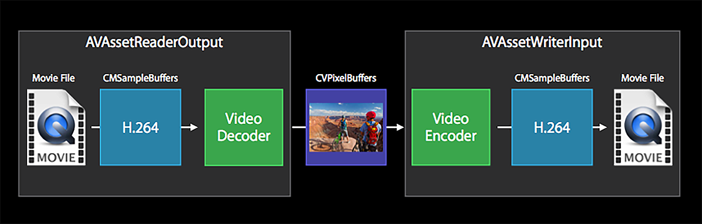

<head>
    
    
</head>

# Table of Contents

1.  [Algorithm](#org0570736)
2.  [Review](#org1e9f23b)
    1.  [折叠表达式：高效的编译期展开](#org38cf984)
        1.  [基本用法](#org7cc5341)
        2.  [折叠表达式的应用场景](#org8d56b0d)
        3.  [编译期遍历](#org049ec0b)
3.  [Tips](#orgc536cd0)
    1.  [如何用软件编码器来编码 H264](#org20067f8)
        1.  [编码适配器](#org7fd47b6)
        2.  [初始化与创建编码器接口](#orga8bead1)
        3.  [软件编码适配器](#orgb0be274)
        4.  [软件编码器实现](#org1ae1bbc)
        5.  [销毁接口](#org733d911)
    2.  [如何使用移动平台的硬件编码器](#orge6bbaaa)
        1.  [VideoToolbox 硬件编码器](#org199a8b7)
        2.  [把编码器集成到 ELImage 框架](#orgf6ffde6)
        3.  [iOS 高层次的硬件编解码 API](#org906f741)
    3.  [视频录制项目实战：场景分析与架构设计](#org1a5183f)
        1.  [视频录制器的场景分析](#org380e9c6)
        2.  [音频模块架构设计](#org47d88e6)
        3.  [iOS 平台的实现](#orge5f9142)
        4.  [视频模块架构设计](#org37dde34)
        5.  [风险分析](#org1058b6c)
    4.  [如何实现视频录制器的底层模块？（上）](#org69698b8)
        1.  [音频模块](#orgd5627eb)
        2.  [音频队列的实现](#orgae64d71)
        3.  [iOS 平台的实现](#orgfd8ea9f)
    5.  [如何实现视频录制器的底层模块？（下）](#org4915111)
        1.  [音频编码模块的实现](#org3de50dd)
        2.  [视频模块](#orgc9bbfad)
        3.  [iOS 平台画面编码后入队](#org3bd2b0c)
    6.  [视频录制项目实战：让你的录制器运行起来](#orgea4b1f7)
        1.  [Muxer 模块](#org1a13a9d)
        2.  [销毁资源](#org076b7a9)
        3.  [中控系统](#org55d6b9e)
4.  [Share](#org9b30639)
    1.  [App 启动速度怎么做优化与监控？](#org44f93e2)
        1.  [如何做一个方法级别启动耗时检查工具来辅助分析和监控？](#org197a5a8)

# Algorithm

Leetcode 2421: Number of Good Paths: <https://leetcode.com/problems/number-of-good-paths/>

<https://dreamume.medium.com/leetcode-2421-number-of-good-paths-54969f636723>

# Review

现代 C++ 编程实战    吴咏炜

## 折叠表达式：高效的编译期展开

### 基本用法

1.  一元折叠

    之前有一个编译期递归的例子
    
        template <typename T>
        constexpr auto sum(T x) {
            return x;
        }
        
        template <typename T1, typename T2,
                  typename... Targ>
        constexpr auto sum(T1 x, T2 y,
                           Targ... args) {
            return sum(x + y, args...);
        }
    
    而使用 [折叠表达式](https://en.cppreference.com/w/cpp/language/fold) 的话，我们可以把代码简化成下面这个样子：
    
        template <typename... Args>
        constexpr auto sum(Args... args) {
            return (... + args);
        }
    
    首先，折叠表达式应用在可变模板的情况下，所以，我们需要有 typename&#x2026; Args 这样的模板参数，及 Args&#x2026; args、const Args&&#x2026; args、Args&&&#x2026; args 之类的函数参数包 [Parameter pack](https://en.cppreference.com/w/cpp/language/parameter_pack)
    
    其次，我们在折叠表达式里使用参数包有一种特殊的形式。我们一定会用到圆括号（漏括号是初学时的常见错误）、参数包名称、运算符和 &#x2026;。上面的代码用的是“一元左折叠”，形式是“(&#x2026; 运算符 参数包名称)”
    
    最后，我们看一下折叠表达式是如何展开的。如果参数包只有一项（args0），那结果就是这个参数自身（args0）；如果参数包有两项（args0, args1），那结果就是这两项用运算符拼接起来（args0 + args1）；如果参数包有三项（args0, args1, args2），那结果就是这三项用运算符拼接起来（args0 + args1 + args2）；以此类推
    
    如果你初步理解了，那我得声明一下，我上面做了简化。对于超过两项的折叠表达式展开，我们有时候需要关注一下运算符的结合问题，即我们需要的是 (args0 + args1) + args2，还是 args0 + (args1 + args2)。显而易见，对于加法，以及其他满足结合律的运算符，这两者的区别并不重要。但是，即使对于加法，实际上这两种顺序都不是完全没有区别的（如浮点数），而对于减法、除法之类的运算，那就更不用说了。所以，我们需要区分一元左折叠和一元右折叠两种不同的方式，它们分别对应于 (args0 + args1) + args2 和 args0 + (args1 + args2)。写折叠表达式时的区别是，一元左折叠的 &#x2026; 在左边，而一元右折叠的 &#x2026; 在右边：(&#x2026; + args) 和 (args + &#x2026;)
    
    下面用符号描述一下。令 E 代表参数包，N 代表参数包里的参数数量，则
    
    -   一元左折叠是 (… op E)，展开后成为 (((E1​ op E2​) op …) op EN​)
    -   一元右折叠是 (E op …)，展开后成为 (E1​ op (… op (EN−1​ op EN​)))

2.  与和或的折叠

    在大部分折叠表达式的展开过程中，参数包为空是一个错误。不过，为了方便实际使用的场景，C++ 对于使用 && 和 \|\| 的折叠表达式有特殊处理，允许参数包为空。这种情况下，&& 得到 true，\|\| 得到 false——也就是说，相当于折叠表达式默认填充了一项不影响正常运算结果的数据：true && args0 && &#x2026; 和 false \|\| args0 \|\| &#x2026;

3.  逗号的折叠

    很多人可能没注意到，逗号也是一个 [运算符](https://en.cppreference.com/w/cpp/language/operator_other)，表达式a, b 的意思是（当然，不是在能被当作函数参数的地方；如果可能被编译器误解，多加一重括号就行），对 a 和 b 依次进行求值，返回后一个表达式 b 的结果。在使用逗号的折叠表达式里，参数包也允许为空，此时表达式的结果相当于 void()，即没有数值

4.  二元折叠

    在参数包里提供了运算所需的所有参数时，一元折叠表达式就很好了。但还有很大的一类展开场景，我们没法用一元折叠表达式，因为我们需要在函数里提供某个参数。一种典型的情况就是，我们需要把一堆参数输出到某个流里
    
        cout << args0 << args1 << ... << argsN;
    
    这里我们就需要用到所谓的“二元左折叠”了。如果待输出的参数组成了我们的参数包 args，我们用下面的代码就能输出：
    
        (cout << ... << args);
    
    类似地，我们有“二元右折叠”，道理相同，我就不展开了
    
    二元折叠相当于提供了一个“初值”，所以参数包允许为空。对于空参数包，(&#x2026; + args) 是不合法代码，而 (0 + &#x2026; + args) 就是合法的了
    
    下面用符号描述一下。令 E 代表参数包，N 代表参数包里的参数数量，I 代表“初值参数”，则：
    
    -   二元左折叠是 (I op … op E)，展开后成为 ((((I op E1​) op E2​) op …) op EN​)
    -   二元右折叠是 (E op … op I)，展开后成为 (E1​ op (… op (EN−1​ op (EN​ op I))))

### 折叠表达式的应用场景

1.  空指针检查

    作为一种编译期展开的功能，折叠表达式能够达到跟手写展开完全相同的效果，但表达上要精炼得多。比如，我们有代码需要检查给定的指针（有可能有智能指针）是否有为空的情况，我们就可以写
    
        if (ptr1 == nullptr ||
            ptr2 == nullptr ||
            …
            ptrN == nullptr) {
          // 记录日志，出错返回，等等
        }
    
    这当然不算糟糕，但下面这样的写法是不是好上一点点？
    
        if (is_any_null(ptr1, ptr2, …, ptrN)) {
          // 记录日志，出错返回，等等
        }
    
    而 is_any_null 的实现非常简单：
    
        template <typename... Args>
        constexpr bool
        is_any_null(const Args&... args) {
            return (... || (args == nullptr));
        }

2.  返回值检查

    比上面这种更复杂一点的，是调用多个函数，检查返回值，并在返回值表示不成功时终止代码执行。示意代码如下：
    
        error_t result{};
        result = check1(…);
        if (result != error_t::ok) {
          return result;
        }
        result = check2(…);
        if (result != error_t::ok) {
          return result;
        }
        result = check3(…);
        if (result != error_t::ok) {
          return result;
        }
        result = check4(…);
        if (result != error_t::ok) {
          return result;
        }
        return error_t::ok;
    
    利用折叠表达式，我们也可以这样简化代码：
    
        return checked_exec(
          error_t::ok,
          [&] { return check1(…); },
          [&] { return check2(…); },
          [&] { return check3(…); },
          [&] { return check4(…); });
    
    当然，我们需要提供 checked_exec 的定义：
    
        template <typename R,
                  typename... Fn>
        R checked_exec(const R& expected,
                       Fn&&... fn)
        {
          R result = expected;
          (void)(((result = forward<Fn>(
                     fn)()) == expected) &&
                 ...);
          return result;
        }
    
    在参数展开和内联后，我们上面对 checked_exec 的调用就大致相当于下面的代码：
    
        error_t result = error_t::ok;
        (void)(((result = check1(…)) == error_t::ok) &&
               (((result = check2(…)) == error_t::ok) &&
                (((result = check3(…)) == error_t::ok) &&
                 ((result = check4(…)) == error_t::ok))));
        return result;
    
    这里我严格按一元右折叠的形式进行了展开，但就如上面讨论过的，这里左折叠和右折叠是等价的。此时，去掉一些括号，代码会更加清晰
    
        (void)((result = check1(…)) == error_t::ok &&
               (result = check2(…)) == error_t::ok &&
               (result = check3(…)) == error_t::ok &&
               (result = check4(…)) == error_t::ok);
    
    所以，我们看到了，利用折叠表达式和短路规则，我们可以实现 checked_exec 或类似的函数，来简化一些重复的检查，让代码更加清晰，并避免低级错误

### 编译期遍历

利用逗号折叠表达式，我们可以实现一些编译期的遍历操作。最基本的，当然就是直接遍历所有的参数了。利用这种方式，我们可以来实现带分隔符的打印操作

    template <typename T,
              typename First,
              typename... Rest>
    void print_with_separator(
      const T& sep,
      const First& first,
      const Rest&... rest)
    {
      cout << first;
      ((cout << sep << rest), ...);
      cout << endl;
    }

这个代码很简单，可以内联，因此我也没有必要像之前描述的那样进一步进行传参优化了。这里的编译期展开就利用了逗号折叠表达式。比如，当我们以 print_with_separator(", ", "one", "two", "three") 来调用时，函数体展开成大致这个样子（去掉了不必要的括号）

    cout << "one";
    ((cout << ", " << "two"),
     (cout << ", " << "three"));
    cout << endl;

逗号前的那个表达式就成了我们希望在参数包 args 上反复执行的内容

使用类似的方式，我们可以打印一个 tuple。这时，代码就稍微复杂一些了：我们需要根据需要遍历的项数预先生成编译期的整数序列，也就是之前讨论过的 make_index_sequence，然后利用折叠表达式来逐项遍历

不过呢，我们这次会使用标准库里的一个对 make_index_sequence 的小小封装 [std::integer_sequence](https://en.cppreference.com/w/cpp/utility/integer_sequence)

    template <class... T>
    using index_sequence_for =
      make_index_sequence<sizeof...(T)>;

这个类模板会根据模板参数的项数来生成一个合适的序列。比如，如果传给 index_sequence_for 的模板参数有三项的话，那结果类型就会是 index_sequence<0, 1, 2>

然后，print_tuple 就可以这样实现

    template <typename Tup,
              size_t... Is>
    void output_tuple_members(
      ostream& os,
      const Tup& tup,
      index_sequence<Is...>)
    {
      ((os << (Is != 0 ? ", " : "")
           << get<Is>(tup)),
       ...);
    }
    
    template <typename... Args>
    void print_tuple(const tuple<Args...>& args)
    {
      cout << '(';
      output_tuple_members(
        cout, args,
        index_sequence_for<Args...>{});
      cout << ')';
    }

对于一个三项的 tuple，最后展开出来的代码就差不多是这个样子

    cout << '(';
    ((cout << (0 != 0 ? ", " : "")
           << get<0>(args)),
     (cout << (1 != 0 ? ", " : "")
           << get<1>(args)),
     (cout << (2 != 0 ? ", " : "")
           << get<2>(args)));
    cout << ')';

显然，它确实能够完成我们需要的打印任务。如果我们传它一个 make_tuple(1, "two", 3.14159)，打印结果就会是

    (1, two, 3.14159)

# Tips

移动端音视频开发实战    展晓凯

## 如何用软件编码器来编码 H264

在移动平台上只要兼容性没有问题、清晰度相差不大，性能肯定是第一个要考虑的因素。iOS 平台，因为硬件编码器的兼容性比较好，基本上用不到 libx264 这些软件编码器，所以这节课的实例只需要运行在 Android 平台上，结构图也会以 Android 平台为基础进行绘制。不过编码部分的代码都是使用 C++ 来书写的，是跨平台的。如果你在 iOS 平台有需要的话，可以直接使用这个工具类。这个工具类的输入是一张纹理，输出是 H264 的裸流

### 编码适配器

首先抽象出一个接口，基于这个接口，我们会有一个软件编码器的实现和一个硬件编码器的实现

### 初始化与创建编码器接口

先看这个编码器模块的初始化接口

    void init(const char* h264Path, int width, int height, int videoBitRate, float frameRate)

传入的参数分别是编码之后 H264 文件的存储路径、编码视频的宽和高、编码 H264 的比特率、编码的帧率等。这个接口的职责是把这些视频编码的 MetaData 信息存储到全局变量里，并且打开一个可写入二进制流的文件。接下来看一下创建编码器的接口

    virtual int createEncoder(EGLCore* eglCore, int inputTexId) = 0;

可以看到这个方法是一个纯虚的方法，代表由具体的子类来完成实际的编码器实例化操作。再来看一下它具体的参数，第一个参数是 EGLCore，代表了 OpenGL ES 的上下文。第二个参数是预览控制器里渲染到屏幕上的纹理 ID。把纹理 ID 传递进来不难理解，但是为什么需要把 EGLCore 传递进来呢？

因为编码的过程是一个较耗时的操作，它不应该阻塞预览线程，否则一旦出现抖动（线程 CPU 轮转不及时）就会造成预览线程的卡顿，影响用户预览。因此我们会把编码放到一个独立的编码线程里。不同的编码器需要的视频帧格式有一些不一样，所以我们这个类也需要负责把这个纹理对象转换成编码器需要的数据格式，那就会涉及 OpenGL ES 的操作了，把 EGLCore 传递进来，方便创建编码线程的 OpenGL ES 上下文

这也就引出了编码器模块入口的接口名字——VideoEncoderAdapter。类的名字其实就是根据这个类的职责而确定的，这个类实际上就是把输入的纹理 ID 做一个转换，让转换之后的数据可以作为具体编码器的输入，所以这也是这个接口的名字所代表的意义。我们这节课要实现的就是这个软件编码器适配器，即 SoftEncoderAdapter，下节课我们会完成硬件编码器适配器的实现，即 HWEncoderAdapter

图里的这个 Init 函数就需要构建出 OpenGL ES 环境，并且创建编码器，如果成功返回 0，否则返回负数

1.  编码接口

    下面我们来看这个类的编码接口
    
        virtual void encode() = 0;
    
    同样，这也是一个纯虚的方法，由子类自己来完成编码操作，这个接口的职责是利用自己构造的 OpenGL ES 渲染线程，来实现纹理转换适配编码器和实际编码的过程

2.  销毁接口

    最后是销毁编码器接口
    
        virtual void encode() = 0;
    
    这也是一个纯虚的方法，由子类来完成具体实现，这个接口的职责是销毁编码器、销毁 OpenGL ES 渲染线程及资源

### 软件编码适配器

我们先来看一下软件编码器的整体结构

从图里可以看到，整个软件编码器模块的实现中包含两个线程和一个队列，其中站在这个队列的角度来看，纹理拷贝线程是生产者，它生产的视频帧会放到 VideoFrameQueue 里。而编码线程是一个消费者，它从 VideoFrameQueue 里取出视频帧，调用 VideoX264Encoder 进行编码，编码好的 H264 数据输出到目标文件中

1.  视频队列

    先来看 VideoFrameQueue，这是一个线程安全的队列，实际上就是一个线程安全的链表，链表里的每个 Node 节点的内部元素都是一个 VideoFrame 的结构体，结构体定义如下
    
        typedef struct VideoFrame_t {
              unsigned char * buffer; //YUV420P的图像数据
              int size;//图像数据的大小
              int timeMills;//所代表的时间戳
              int duration; //这一帧图像所代表的时间长度
        } VideoFrame;
    
    这个 VideoFrameQueue 提供了四个接口
    
    -   init 方法，这个方法会初始化一个锁来保证线程安全，同时也会初始化头指针和尾部指针为空。此外，还会初始化一个代表是否要丢弃所有帧的布尔变量 mAbortRequest
    -   put 方法，在保证线程安全（即在操作指针前后上锁和解锁）的前提下，把新的元素放到这个链表的最后，并发出一个 signal 指令
    -   get 方法，在保证线程安全性的前提下，取出头部指针指向的元素并返回，然后把头部指针指向下一个元素。如果没有元素可以取出的话，就 wait，等到 signal 指令来了之后，再取出元素，signal 指令有可能是在 put 函数里调用，也有可能是在 abort 函数里调用
    -   abort 方法，当要放弃队列里所有元素的时候被调用，实现就是在保证线程安全的前提下，把队列里所有的元素销毁掉，之后 put 方法和 get 方法再次被调用时就会被忽略
    
    在这个类的析构函数里，也把队列里剩余的所有元素都逐一取出，并且释放掉，防止内存泄露

2.  编码线程

    编码线程的职责就是取出队列里的视频帧，然后调用实际的编码器来编码，核心代码如下
    
        encoder = new VideoX264Encoder();
        encoder->init(videoWidth, videoHeight, videoBitRate, frameRate, h264File);
        LiveVideoFrame *videoFrame = NULL;
        while(true){
            if (videoFramePool->getYUY2Packet(&videoFrame, true) < 0) {
                break;
            }
            if(videoFrame){
                //调用编码器编码这一帧数据
                encoder->encode(videoFrame);
                delete videoFrame;
                videoFrame = NULL;
            }
        }
        if(NULL != encoder){
            encoder->destroy();
            delete encoder;
            encoder = NULL;
        }
    
    在编码线程里首先实例化编码器，然后进入一个 while 循环，不断从 VideoFrameQueue 里取出视频帧元素，调用编码器去编码，如果从 VideoFrameQueue 里面获取元素返回值小于 0 的话，就跳出循环，销毁编码器

3.  纹理拷贝线程

    因为软件编码器需要的是 YUV 的数据，所以我们要把显存可以控制的纹理 ID 转换成内存中的 YUV 数据，就需要调用 glReadPixels 来执行拷贝操作。因为纹理从显存拷贝到内存中需要耗费的时间比较长，为了尽量不阻塞预览界面的渲染线程，就建立了这个纹理拷贝线程
    
    这个线程首先要初始化 OpenGL ES 的上下文环境，然后把上下文绑定到这个纹理拷贝线程上。这个纹理拷贝线程要拷贝的纹理 ID，就是 createEncoder 这个方法传递进来的第二个参数的纹理 ID，而这个纹理是在摄像头预览线程的上下文里创建的，那怎么操作才能让我们的纹理拷贝线程也可以访问到它呢？
    
    这也是我们要把 EGLCore 从预览控制类里面传递过来的原因，这里要使用 OpenGL 里共享上下文的概念。在创建 OpenGL ES 上下文的时候，使用已经存在的 EGLContext 而不是 EGL_NO_CONTEXT，这样新创建的这个上下文就可以和已经存在的 EGLContext 共享所有的 OpenGL ES 对象了，包括纹理对象、帧缓存对象等
    
    createEncoder 方法已经把渲染线程里封装的 EGLCore 对象传递过来了，也就可以获得摄像头预览线程的 OpenGL ES 的上下文了。创建 OpenGL ES 上下文的时候，把它当做第三个参数传递进去，这样在当前纹理拷贝线程中，就可以访问摄像头预览线程里创建的纹理对象了
    
    然后创建一个离屏渲染的 Surface，代码如下
    
        eglCore = new EGLCore();
        eglCore->init(previewGLContext);
        copyTexSurface = eglCore->createOffscreenSurface(videoWidth, videoHeight);
        eglCore->makeCurrent(copyTexSurface);
    
    既然是纹理拷贝，就需要创建一个拷贝的目标，也就是一个输出纹理对象。此外，还需要创建一个帧缓存对象，帧缓存对象是任何一个 OpenGL Program 渲染的目标。当然像之前直接渲染到屏幕上的都会有一个默认的帧缓存对象，但目前的场景并不是向屏幕上绘制，而是进行纹理拷贝，所以需要我们自己创建一个帧缓存对象。创建纹理 ID 和帧缓存对象的代码如下
    
        glGenFramebuffers(1, &mFBO);
        glGenTextures(1, &outputTexId);
        glFramebufferTexture2D(GL_FRAMEBUFFER, GL_COLOR_ATTACHMENT0, GL_TEXTURE_2D, outputTexId, 0);
    
    在真正进行拷贝之前，需要显式地绑定一下这个帧缓存对象，然后使用一个通用的 renderer 来执行渲染操作，renderer 的渲染目标就是绑定的这个帧缓存对象，又因为我们把输出纹理 ID 绑定到了这个帧缓存对象上，所以就相当于把输入纹理的内容绘制到输出纹理上去了。完成拷贝之后，需要再跟这个帧缓存对象解绑，代码如下
    
        glViewport(0, 0, videoWidth, videoHeight);
        glBindFramebuffer(GL_FRAMEBUFFER, mFBO);
        checkGlError("glBindFramebuffer FBO");
        renderer->renderToTexture(texId, outputTexId);
        glBindFramebuffer(GL_FRAMEBUFFER, 0);
    
    在拷贝到目标纹理之后，就可以让预览线程继续去做自己的工作了，但是在拷贝成功之前，需要阻塞预览线程，具体实现就是调用 encode 方法的时候使用条件锁 wait，等纹理拷贝线程拷贝成功了之后，发一个 signal 指令过来，encode 方法接收到 signal 指令就可以让预览线程继续运行。这样就可以完成最短时间的阻塞预览线程，防止预览界面的 fps 降低
    
    接下来要做的就是，把这个输出纹理 ID 的内容拷贝到内存里，这就涉及显存和内存的数据交换问题了。前面我们讲过在做视频处理和编解码的时候，要遵循一个原则：尽量少做显存和内存的交换。由于使用 X264 进行编码，而 X264 的输入必须是内存中的数据，在这种不得已的情况下，必须要把显存里的数据拷贝到内存中。OpenGL ES 中提供了显存到内存的数据转换 API——glReadPixels
    
        void glReadPixels(GLint x, 
                          GLint y, 
                          GLsizei width, 
                          GLsizei height, 
                          GLenum format, 
                          GLenum type, 
                          void *pixels);
    
    它一共有七个参数，第一个参数和第二个参数表示读取纹理矩形左下角的横、纵坐标，坐标系就是 OpenGL 的纹理坐标系；第三个参数和第四个参数表示矩形的宽度和高度；第五个参数是读取的内容格式，一般都读取 RGBA 格式的数据；第六个参数是读取的内容在内存里的表示格式
    
    第七个参数就是我们要存储到的内存区域的指针。这个函数默认会读取出 RGBA 格式的数据，并且会非常耗时，读取的内容区域越大，所消耗的时间也会越多。对于分辨率较大的纹理 ID，读取一帧数据所耗费的时间就比较多了。所以这里我们把显存到内存中的数据交换（耗时、性能低）和拷贝纹理（速度快）分成两个阶段，来达到不阻塞摄像头预览线程的目的
    
    优化显存到内存的数据转换，主要思路就是减少数据量的读取，那怎么才能减少数据量的读取呢？
    
    常用的做法就是把一张 RGBA 格式的纹理 ID 先转换成 YUY2 格式，YUY2 格式是为每个像素保留 Y 分量，而 UV 分量在水平方向上每两个像素采样一次，也就是一个像素 RGBA 格式使用 4 个字节来表示，而 YUY2 格式使用 2 个字节来表示，这样读取的数据量就少了一半，所耗费的时间也几乎减少到了原始时间的一半
    
    但是需要我们做的额外工作就是，在显存中通过一个 OpenGL Program 把 RGBA 格式转换成 YUY2 格式，然后再进行读取，最后把 YUY2 格式的数据交给编码器进行编码，优化读取时间的代码我会在录制器项目里会给你一个 host_gpu_copier.cpp 的实现文件
    
    接下来我们介绍 VideoX264Encoder 这个类的实现，这个类的职责就是把 YUY2 的原始图像数据编码成 H264 的压缩数据，然后写到 H264 的文件里

### 软件编码器实现

使用 libx264 这个库来编码 H264 的时候，并不是直接使用它的 API，而是基于 FFmpeg 的 API 来开发。当然，在这之前要把 libx264 交叉编译到 FFmpeg 中去，现在把 FFmpeg 的头文件和静态库文件配置到工程里，然后建立一个 video_x264_encoder 的 C++ 类文件，下面我们看一下这个类向外暴露的接口定义、职责和实现

1.  初始化接口

    先看初始化接口的定义
    
        int init(int width, int height, int videoBitRate, float  frameRate, FILE* h264File)
    
    这个接口需要传入编码视频的宽、高、码率和帧率，最后一个参数是编码之后要写入的 H264 文件。这个接口的职责是初始化编码器上下文以及编码之前的 AVFrame 结构体，如果成功返回 0，否则返回负数。核心实现如下
    
    -   使用 avcodec_register_all 方法，注册所有格式和编解码器
    -   创建并配置编码器上下文 AVCodecContext
        -   找出 H264 的 encoder
        -   创建 AVCodecContext
        -   为 AVCodecContext 配置对应的参数
        -   打开编码器
    -   分配 AVFrame，存储编码之前 YUV420P 的原始数据

2.  编码接口

    接下来我们看实际的编码接口
    
        int encode(VideoFrame *videoFrame);
    
    这个接口需要传入的参数是一个 VideoFrame 的结构体，这个结构体里实际包含了这一帧图片的 YUY2 数据和时间信息。这个方法的职责就是把这一帧图像编码成 H264 的数据，并写入文件。如果编码失败返回负数，正确编码这一帧返回 0。内部实现比较简单，就是把 YUV 数据封装成 AVFrame 的结构体，然后调用 FFmpeg 方法 avcodec_encode_video2 来执行编码，得到的是一个 Annexb 格式的 H264 的数据，然后可以直接写入文件
    
    考虑到性能，在显卡里读出来的是 YUY2 格式，所以这里的输入格式是 YUY2 的视频帧表示格式，而 libx264 输入一般都是 YUV420P 格式，所以要在送给 libx264 之前，把它转换成 YUV420P 格式的数据。从 YUY2 到 YUV420P 格式的具体转换过程已做优化，在 armv7 平台上利用 Neon 指令集来做加速，在 x86 平台使用 SSE 指令集来做加速，这些加速操作其实都是 SIMD 指令集的应用，这里我们就不展开说了，后面的视频录制器项目会给出代码实例

### 销毁接口

最后一个是销毁接口，这个接口负责销毁编码器的上下文，以及销毁分配的 AVFrame 等资源

    void destroy();

## 如何使用移动平台的硬件编码器

在 iOS 8.0 以后，系统提供了 VideoToolbox 编码 API，这个 API 充分利用硬件来做编码工作，来提升 App 的性能和编码速度。使用 VideoToolbox 可以给系统带来两个好处

1.  提高编码性能，大大降低 CPU 的使用率
2.  提高编码效率，编码一帧的时间缩短

当然 VideoToolbox 既可以充当编码器又可以充当解码器，这节课我们主要介绍它作为编码器的工作流程，讲一讲如何使用 VideoToolbox 把摄像头采集到的纹理编码成一段 H264 的码流。我们会创建一个名叫 H264HWEncoderImpl 类，然后按照 ELImage 的组件规则把它封装进 ELImage 框架中，集成进去之后，就可以给原来的预览项目增加录制视频的功能

### VideoToolbox 硬件编码器

1.  输入与输出

    我们先来看一下使用 VideoToolbox 进行编解码的输入和输出是什么，只有明确了这一点，才能知道如何给 VideoToolbox 提供视频帧的原始数据，还有怎么从 VideoToolbox 里获取编码后的数据。我们可以看一下 VideoToolbox 的数据流转结构图
    
    从上图中可以看到，编码器的输入是 CVPixelBuffer 类型的结构体，输出是 CMSampleBuffer 类型的结构体。所以在 ELImage 框架中，我们需要把纹理 ID 封装成 CVPixelBuffer 的数据结构。这个数据结构是使用 VideoToolbox 编码的核心，必须要了解清楚。Apple Developer 官网上对于这个数据结构给出的解释是，在主内存中存储所有像素点数据的一个对象
    
    那什么是主内存呢？你可以这样理解，主内存其实并不是我们平时所操作的内存，但它可以关联到内存中的地址，简单理解就是这块存储区域在缓存里，但是我们在访问这块区域之前必须先锁定这块区域
    
        CVPixelBufferLockBaseAddress(pixel_buffer, 0);
    
    然后才可以访问这一块内存区域，获取出内存中的指针
    
        void* data = CVPixelBufferGetBaseAddress(pixel_buffer)
    
    操作 data 这个变量可以给这块内存区域填充内容或读取内容，使用完之后，要解锁这块区域
    
        CVPixelBufferRelease(pixel_buffer);
    
    从它的使用方式来看，不是普通的内存访问，否则不会在访问内存区域之前和之后加上锁定、解锁等操作。前面我们也说过，做视频开发时有一个原则就是尽量少做显存和内存的交换，在 iOS 平台上，我们应该使用它提供的加速 API 来完成这样的操作
    
    Camera 回调的 YUV 数据就存储在 CVPixelBuffer 类型的对象里，只不过当时使用的引用类型是 CVImageBufferRef，但是在 iOS 头文件定义中可以看到，它们是等同的
    
    你可以回顾一下当时在 Camera 的回调中我们是如何把 CVPixelBuffer 里面的内容构造成纹理对象的。常规手段就是手动获取 YUV 数据的内存地址，然后利用 OpenGL 提供的 glTexImage2D 方法，把内存中的数据上传到显存构建的纹理对象上。而 iOS 的 CoreVideo 这个 framework 提供的加速方法可以把纹理和 CVPixelBuffer 关联起来
    
        CVOpenGLESTextureCacheCreateTextureFromImage
    
    所以我们需要把一个纹理 ID 和一个 CVPixelBuffer 通过上述这个方法关联起来，然后把这个纹理 ID 作为目标（实际是这个纹理 ID 绑定的 FBO）进行绘制，就可以在 CVPixelBuffer 中获取到数据了，最后把 CVPixelBuffer 送给 VideoToolbox 就可以了
    
    接下来我们看这个编码器输出的类型，从图里可以看出这是一个 CMSampleBuffer 类型的对象，如果你还有印象的话，第 14 节课Camera 回调给我们的视频帧也是 CMSampleBuffer 类型的对象，但是它们所包含的内容完全不一样，Camera 预览返回的 CMSampleBuffer 里存储的数据是一个 CVPixelBuffer，而经过 VideoToolbox 编码输出的 CMSampleBuffer 里存储的数据是一个 CMBlockBuffer 的引用，如图所示
    
    
    
    图片展示了 CMSampleBuffer 的构成方式，左边代表了压缩数据（编码器输出的格式）的构成，右边代表了非压缩格式（摄像头采集到的数据或者解码器解码出来的数据）的构成。而 CMBlockBuffer 就是编码之后数据存放的对象，我们可以调用 CMBlockBufferGetDataPointer 方法来获取出内存中的指针，然后可以使用对应内存中的数据去写文件或者发送到网络

2.  初始化与构建编码器

    初始化方法签名如下
    
        - (void)initEncode:(int)width height:(int)height fps:(int)fps
                maxBitRate:(int)maxBitRate avgBitRate:(int)avgBitRate;
    
    这个初始化方法的职责就是构建编码器，实现主要分为两部分，一是构建编码器会话，另外一个就是给编码器设置参数。还记得之前我们常说的一句关于 iOS 多媒体 API 的规则吗？使用任何 API 之前都要配置对应的 Session
    
    使用麦克风和 Speaker 之前，需要配置的是 AudioSession，使用 Camera 之前需要配置的是 AVCaptureSession，而这里需要配置的就是 VTCompressionSession。这个会话就代表了我们要使用编码器，使用解码能力的时候需要配置 VTDecompressionSessionRef。那如何定制一个我们需要的编码器会话呢？
    
    首先调用 VTCompressionSessionCreate 方法，把我们要编码的视频的宽、高、编码器类型（kCMVideoCodecType_H264）、回调函数以及回调函数上下文传递进去，构造出一个编码器会话。这个函数的返回值是一个 OSStatus 类型，如果构造成功则返回的是 0，否则就要给出初始化编码器会话失败的提示。构造成功之后要给这个会话设置参数，设置参数的代码如下：
    
        VTSessionSetProperty(EncodingSession, kVTCompressionPropertyKey_RealTime, kCFBooleanTrue);
        VTSessionSetProperty(EncodingSession, kVTCompressionPropertyKey_ProfileLevel, kVTProfileLevel_H264_High_AutoLevel);
        VTSessionSetProperty(EncodingSession, kVTCompressionPropertyKey_AllowFrameReordering, kCFBooleanFalse);
        VTSessionSetProperty(EncodingSession, kVTCompressionPropertyKey_MaxKeyFrameInterval, (__bridge CFTypeRef)(@(fps)));
        VTSessionSetProperty(EncodingSession, kVTCompressionPropertyKey_ExpectedFrameRate, (__bridge CFTypeRef)(@(fps)));
        VTSessionSetProperty(EncodingSession, kVTCompressionPropertyKey_DataRateLimits, (__bridge CFArrayRef)@[@(maxBitRate / 8), @1.0]);
        VTSessionSetProperty(EncodingSession, kVTCompressionPropertyKey_AverageBitRate, (__bridge CFTypeRef)@(avgBitRate));
    
    代码里的第一个参数设置的是需要实时编码；第二个参数设置的是 H264 的 Profile，使用的是 High 的 AutoLevel 规格；第三个参数的设置代表不要 B 帧；第四个参数是设置关键帧的间隔，也就是 gop size；第五个参数是设置帧率；第六个参数和第七个参数共同来控制编码器输出的码率。设置完这些参数之后，调用 VTCompressionSessionPrepareToEncodeFrames 方法，告诉编码器可以开始编码了

3.  编码视频帧

    接下来，我们看 encode 的方法，函数的输入参数是一个 CVPixelBuffer， 然后还需要构造出当前编码视频帧的时间戳和时长，最后把这三个参数传递给编码方法，给这一帧视频编码
    
        int64_t currentTimeMills = CFAbsoluteTimeGetCurrent() * 1000;
        if(-1 == encodingTimeMills){
            encodingTimeMills = currentTimeMills;
        }
        int64_t encodingDuration = currentTimeMills - encodingTimeMills;
        CMTime pts = CMTimeMake(encodingDuration, 1000.); // timestamp is in ms.
        CMTime dur = CMTimeMake(1, m_fps);
        VTEncodeInfoFlags flags;
        OSStatus statusCode = VTCompressionSessionEncodeFrame(EncodingSession, imageBuffer, pts, dur, NULL, NULL, &flags);
        if (statusCode != noErr) {
            error = @"H264: VTCompressionSessionEncodeFrame failed ";
            return;
        }
    
    在创建编码器会话的时候，我们指定了一个回调函数，这个回调函数是在编码器编码成功一帧之后，把编码的这一帧数据封装到 CMSampleBuffer 结构中回调这个函数，而我们需要做的就是在这个回调函数里拿出编码之后的 H264 数据。回调函数原型如下：
    
        void didCompressH264(void *outputCallbackRefCon, void *sourceFrameRefCon,
                OSStatus status, VTEncodeInfoFlags infoFlags, CMSampleBufferRef sampleBuffer)
    
    在这个回调函数里，我们需要处理编码之后的数据。首先判断 status，如果编码成功就返回 0（实际上头文件中定义了一个枚举类型是 noErr）；如果不成功不作处理。成功了的话，首先判断一下编码成功后的当前帧是否是关键帧，判断关键帧的方法如下：
    
        CFArrayRef array = CMSampleBufferGetSampleAttachmentsArray(sampleBuffer, true);
        CFDictionaryRef dic = (CFDictionaryRef)CFArrayGetValueAtIndex(array, 0);
        BOOL keyframe = !CFDictionaryContainsKey(dic, kCMSampleAttachmentKey_NotSync);
    
    为什么要判断关键帧呢？
    
    因为 VideoToolbox 编码器在每一个关键帧前面都会输出 sps 和 pps 信息，所以如果这一帧是关键帧，就取出对应的 sps 和 pps 信息
    
    那怎么取出对应的 sps 和 pps 信息呢？图里提到 CMSampleBuffer 里面有一个成员是 CMVideoFormatDesc，而 sps 和 pps 信息就在这个对视频格式的描述里面。取出 sps 的代码如下：
    
        CMFormatDescriptionRef format = CMSampleBufferGetFormatDescription(sampleBuffer);
        size_t sparameterSetSize, sparameterSetCount;
        const uint8_t *sparameterSet;
        size_t paramSetIndex = 0;//代表sps
        OSStatus statusCode = CMVideoFormatDescriptionGetH264
        ParameterSetAtIndex(format, paramSetIndex, &sparameterSet, &sparameterSetSize,
                &sparameterSetCount, 0 );
    
    取出 pps 的代码如下：
    
        size_t pparameterSetSize, pparameterSetCount;
        const uint8_t *pparameterSet;
              size_t paramSetIndex = 1;//代表pps
        OSStatus statusCode = CMVideoFormatDescriptionGetH264
        ParameterSetAtIndex(format, paramSetIndex, &pparameterSet, &pparameterSetSize,
              &pparameterSetCount, 0 );
    
    这样我们就成功地取出了 sps 和 pps 的信息了，接着再把这一帧（有可能是关键帧也有可能是非关键帧）的实际内容提取出来进行处理。首先，取出这一帧的时间戳，代码如下：
    
        CMTime pts = CMSampleBufferGetPresentationTimeStamp(buffer);
        double presentationTimeMills = CMTimeGetSeconds(pts)*1000;
    
    然后可以拿出具体的压缩后的数据，代码如下：
    
        CMBlockBufferRef data = CMSampleBufferGetDataBuffer(buffer);
    
    取出真正的压缩后的数据 CMBlockBuffer，就可以访问这块内存，拿出具体的数据了，然后再根据是否是关键帧，决定要不要在前面加入 sps 和 pps，写成 Annexb 格式的 H264 码流

4.  释放编码器

    最后是释放编码器，首先调用 VTCompressionSessionCompleteFrames 方法，强制编码器完成编码行为，然后调用 VTCompressionSessionInvalidate 方法，结束编码器会话，最后调用 CFRelease 方法，释放编码器会话
    
    到这里，我们已经把 VideoToolbox 的使用封装到了这个 H264HWEncoderImpl 类里，并提供出了初始化、编码和销毁的接口，那接下来就把这个类集成到我们的 ELImage 框架中吧

### 把编码器集成到 ELImage 框架

我们已经把 Camera 连接到了 GLImageView 上面，用户也可以在屏幕上预览到摄像头采集到的图像了。在这个设计里，Camera 是输入节点，它把采集到的 YUV 数据渲染成为纹理对象，然后传递给 GLImageView，GLImageView 把纹理对象渲染到 UIView 上

而这节课我们要书写的 VideoEncoder 也是一个输出节点，在 Camera 的 targets 里增加这个 VideoEncoder 的输出节点，然后这个输出节点负责把纹理对象编码成 H264 码流，并写到磁盘里。怎么构建这个节点并集成入 ELImage 框架里呢？

首先建立 ELImageVideoEncoder 实现 ELImageInput 这个 Protocol，代表我们新建立的这个节点是可以被输入纹理对象的，然后书写初始化方法，可以让调用端在创建这个节点的时候把编码参数传递进来，初始化方法定义如下：

    - (id) initWithFPS: (float) fps maxBitRate:(int)maxBitRate
          avgBitRate:(int)avgBitRate encoderWidth:(int)encoderWidth
          encoderHeight:(int)encoderHeight;

因为实现了 ELImageInput 这个 Protocol，所以需要重写保存输入纹理和渲染纹理的方法，在这个类里新建一个 ELImageTextureFrame 指针类型的纹理，来保存输入的纹理对象，然后建立一个 EncoderRenderer，把输入纹理对象渲染到编码纹理对象上。但这个渲染过程有两个细节需要注意

-   要把纹理对象渲染之后送到编码器里，就会涉及 OpenGL 坐标系转换到计算机坐标系的问题。所以在渲染到目标纹理对象的时候，要把整个图像 HFlip 一下，也就是把每个坐标的 Y 顶点 0、1 互换一下
    
    物体坐标如下：
    
        static const GLfloat imageVertices[] = {
            -1.0f, -1.0f,
            1.0f, -1.0f,
            -1.0f, 1.0f,
            1.0f, 1.0f,
        };
    
    纹理坐标如下：
    
        static const GLfloat hFlipTextureCoordinates[] = {
            0.0f, 1.0f,
            1.0f, 1.0f,
            0.0f, 0.0f,
            1.0f, 0.0f,
        };

-   渲染到的目标纹理对象需要交给编码器编码，也就是说我们的目标纹理对象必须和一个 CVPixelBuffer 关联起来，所以在构建目标纹理对象的时候，一定不能和创建普通的纹理对象一样。其实，把一个纹理对象和一个 CVPixelBuffer 关联起来的方法，在 ELImageVideoCamera 这个类里已经使用过了，只不过这里关联的纹理格式会使用 iOS 特有的 BGRA 格式。代码如下：
    
        CVOpenGLESTextureCacheCreateTextureFromImage (kCFAllocatorDef
                ault, coreVideoTextureCache, renderTarget, NULL, GL_TEXTURE_2D,
                GL_RGBA, _width, _height, GL_BGRA,GL_UNSIGNED_BYTE, 0,
                &renderTexture);
    
    代码里的 renderTarget 就是一个 CVPixelBuffer 的引用，和之前的渲染一样，上述代码将源纹理对象渲染到了目标纹理对象，只不过这里的处理就是把图像做一个上下翻转
    
    再来看最关键的一步，渲染完成之后，实际上渲染的内容就会在这个 CVPixelBuffer 里，这样我们就可以把这个 renderTarget 传递给编码器进行编码操作了。当然，在交给编码器之前要先锁定这个 CVPixelBuffer，编码器使用完了之后再解锁。书写完这个节点，整个 ELImage 框架就可以完成预览、录制这两个场景了

### iOS 高层次的硬件编解码 API

先来看一下图片，它展示了 AVFoundation 与 VideoToolbox 的关系

如图所示，iOS 平台提供的 AVFoundation 底层使用了 VideoToolbox，但是它们的关注点不一样。VideoToolbox 更关注编码成内存中的 CMSampleBuffer 结构体，以及解码成主内存（或者理解为显存）里的 CVPixelBuffer 结构体，而 AVFoundation 更关注解码直接显示以及编码到文件中

下面我们来看一下 AVFoundation 这个层次提供的几个重要的 API

-   AVAssetWriter
    
    从名字就可以看出，这是为了写入本地文件提供的 API，这个类可以方便地把图像和音频写成一个完整的本地视频文件。它是如何利用 VideoToolbox 编码视频文件的呢？我们可以参考下面的图片来理解
    
    
    
    可以看到，AVAssetWriter 是从 OpenGL ES 中拿到纹理对象，关联到 CoreVideo 这个 framework 提供的 CVPixelBuffer 里，然后使用 VideoToolbox 编码，最后把编码的 H264 码流写到 H264 文件或者封装到一个视频文件中。但如果只是封装成一个 MP4 文件，其实并不需要这么麻烦，我们可以利用 iOS 给我们封装好的 API 很简单地完成这种场景，如下图所示
    
    
    
    可以看到，AVAssetWriterInput 把编码器的编码和后续的处理和封装的工作组装到了一起，提供了更单一的接口调用，完成的功能也更加清晰，这也是 iOS 平台提供的多媒体 API 强大的地方。当然这仅限于本地文件，如果在直播场景中需要把编码后的码流推送到流媒体服务器的话，就不能使用这个 API 了

-   AVAssetReader
    
    从名字上来看，这是为了读取本地文件而存在的一个类。这个类可以方便地把本地文件中的音频和视频解码出来。下面我们来看一下怎么用 VideoToolbox 解码视频，然后经过处理，最终再使用 VideoToolbox 编码成为一个本地的视频文件
    
    
    
    虽然前面没有介绍怎么使用 VideoToolbox 解码 H264 数据，但是你可以认为它就是编码的一个逆过程，上图中需要我们自己写很多代码来控制多种状态，包括输入、输出等。而在 AVFoundation 里，针对解码部分，iOS 平台直接封装了一个更高级的 API，你可以看一下图片左边的内容
    
    
    
    AVAssetReaderOutput 也只支持本地文件的解码，不支持网络媒体文件的输入。同样，在这里也不再展示代码了，你可以参考 GPUImage 框架里的 GPUImageMovie 这个类，我们在里面的离线处理操作的场景，详细地对 AVAssetReaderInput 这个 API 的使用做出了说明

-   AVAssetExportSession
    
    这个类可以用来拼接视频、合并音频和视频、不做任何处理的转换格式以及压缩视频等多种场景，其实它是对 VideoToolbox 解码、编码的一个更高层次的封装，如图所示
    
    
    
    通过图片可以看到，这个类不允许我们进行中间的处理操作，显然它是一个更高层次的封装，只允许我们设置一些预设和提供输入输出文件路径等，所以相比使用 VideoToolbox，或者使用 AVAssetReader 和 AVAssetWriter 来实现，AVAssetExportSession 提供的功能更单一，接口也更简单
    
    在我们工作中，在不同的场景下选用不同的技术实现是非常重要的，这不单单会影响开发的效率，也会直接影响产品的体验。学习 iOS 平台的多媒体时，了解这些 API 对我们的工作有很大帮助

## 视频录制项目实战：场景分析与架构设计

### 视频录制器的场景分析

视频录制器运行起来之后，需要展示给用户一个视频预览页面，让用户可以看到摄像头里采集到的画面，用户将预览画面调整满意之后，就可以点击录制按钮。接下来录制器需要把用户的声音和画面全都录制下来，并编码生成一个 MP4 文件。在录制过程中，也可以让用户选择是否需要开启背景音乐，方便用户唱歌或展示舞蹈等

场景看上去还是挺简单的，但是针对这个场景如何设计出一个合理的架构却是一个比较复杂的工作。从录制视频的角度来讲，每个平台都有自己独特的 API 可供开发者调用，但是要想合理地使用这些 API，还需要通过架构的手段拆分出具体的模块，定义清楚每个模块的边界或者职责，再根据平台特性为某个技术模块确定实现细节。基于业务场景分析，录制器项目可拆分成两部分，一部分是音频，另一部分是画面（视频）

### 音频模块架构设计

我们先来看音频模块的架构设计示意图

我们先从最顶层来解读这张架构图，图最上边的一部分从左到右依次为 Input、Output、PCM 队列和 Consumer，下面来逐一看一下这 4 个模块

-   Input 代表输入模块，输入之一是麦克风，用来采集用户的声音；第二个是伴奏文件的解码器，用来解码用户选择的背景音乐，所以输入模块要由这两部分共同来实现
-   Output 代表输出模块，输出之一就是利用渲染音频的 API 把背景音乐的声音播放出来，在 iOS 平台，如果用户戴着有线耳机的话，可以把用户自己发出的声音同时播放出来，来达到耳返监听的功能；第二个是记录数据，把背景音乐和用户声音的数据保存下来；那保存到哪里呢？就是接下来介绍的数据存储模块
-   PCM 队列代表数据存储模块，把背景音乐和用户声音的 PCM 数据存入队列里，这个队列应该保证多线程访问时线程的安全性
-   Consumer 代表消费者模块，负责从数据存储模块里取出 PCM 数据，做音频 AAC 的编码，最终封装到 MP4 文件里。从数据存储模块角度来看，它属于一个消费者的角色，所以我们也叫它消费者模块

### iOS 平台的实现

1.  Input 模块

    输入模块主要分为两部分，一部分是采集人声，另一部分是解码 BGM
    
    -   采集人声应该使用 RemoteIO 这个 AudioUnit，启用它的 InputElement 采集人声数据。采集到人声之后，如果要做处理直接在 AUGraph 里加入音效的 AudioUnit 节点，最终汇入 MixerAudioUnit 里
    -   解码伴奏，在 AUGraph 里直接使用 AudioFilePlayer 这个 AudioUnit 解码伴奏，如果要加入升降调的处理，可以在这个节点之后连接上一个 NewTimepitch 的 AudioUnit
    
    然后使用一个 Mixer 的 AudioUnit 把人声和伴奏两轨声音合并起来，输出给下面的 Output 模块

2.  Output 模块

    如果想要完成伴奏和耳返播放功能，这里使用 RemoteIO 这个 AudioUnit 的 OutputElement，把 MixerUnit 输出的音频播放出来就可以了。接下来还需要实现把 PCM 数据放入 PCM 队列的功能，这就需要给 AudioUnit 注册一个回调函数，利用 Converter 的 AudioUnit 把转换成 SInt16 采样格式表示的 PCM 数据放到音频队列里

3.  PCM 队列

    我们可以使用 C++ 自己写一个线程安全的链表，提供先入先出的接口来完成队列的功能，这个队列的代码可以和 Andorid 平台共享一份代码

4.  Consumer 模块

    最后是 Consumer 模块的实现，开启一个线程在后台将 PCM 队列中的数据取出来之后，使用 AudioToolbox 或者 libfdk_aac 编码成 AAC 码流。最后利用 FFmpeg 把编码后的 AAC 数据封装到 MP4 文件的声音轨道里。这个模块主要是使用 C++ 语言调用 FFmpeg 的 API 来实现的，所以可以和 Android 平台共享一份代码，你可以对照架构图的 iOS 部分再梳理一下

### 视频模块架构设计

相比于音频的架构设计，视频的架构相对简单一些，整体架构图如下

1.  iOS 平台的实现

    在 iOS 平台上，Input 模块的实现自然会使用系统提供给开发者的 Camera 这个 API 来实现。Output 模块，分为预览和编码，预览的实现直接使用 EAGL 和 OpenGL 再结合自定义的一个 UIView 来完成；编码的实现是使用 VideoToolbox 进行硬件编码，直接使用我们的 ELImage 框架来完成即可。我们之前讲解过，这里的不同之处在于编码之后的 H264 数据不要写入文件里，而是应该放到 H264 的队列里
    
    第三个模块是 H264 队列模块，可以使用一个线程安全的链表来实现，链表里每一个节点元素都是 H264 的数据包，这个模块的实现可以和 Android 平台共享一份代码
    
    最后一个模块就是消费者模块，在 Consumer 模块取出队列里的 H264 数据包，然后利用 FFmpeg 的 Mux 模块把 H264 的包封装到 MP4 的视频轨道部分，和之前封装到这个文件中的音频轨道共同组成一个完整的 MP4 文件。这个模块主要使用 C++ 语言调用 FFmpeg 的 API 来实现，也可以和 Android 平台共享一份代码

### 风险分析

整个架构的风险点有两个

-   编码器方面，各平台（尤其是 Android 平台）硬件编码器的兼容性问题，还有如果在 Android 平台使用软件编码器的话，中低端机上软件编码器的性能问题
-   音视频对齐方面，由于音视频是分开采集的，这里我们需要考虑音视频同步的问题

最后再补充一点测试用例方面的注意事项，在测试完 App 的 Top 机型和主流系统之后，要重点测试 Android 平台的硬件编码覆盖面，还要测试音视频对齐的问题，这里我们可以使用自动化检测音画对齐的工具来处理

## 如何实现视频录制器的底层模块？（上）

### 音频模块

我们主要讲解音频队列在 Android 平台和 iOS 平台的实现，还有如何把采集的音频数据放到队列里的问题，最重要的还有一部分是如何在音频模块里加入播放背景音乐的功能。其中音频队列的实现在双端我们采用一套代码，都使用 C++ 来实现

### 音频队列的实现

1.  队列元素定义

    讲解队列的具体实现之前，我们先来看一下队列里存放的元素，结构体定义如下
    
        typedef struct AudioPacket {
            short * buffer;
            int size;
            AudioPacket() {
                buffer = NULL;
                size = 0;
            }
            ~AudioPacket() {
                if (NULL != buffer) {
                    delete[] buffer;
                    buffer = NULL;
                }
            }
        } AudioPacket;
    
    这个结构体定义了一个 AudioPacket，每采集一段时间的 PCM 音频数据，就封装成一个这样的结构体对象，然后放到 PCM 队列里。上一节课我们也提到过自己写一个链表来实现这个队列，链表的节点定义如下
    
        typedef struct AudioPacketList {
            AudioPacket *pkt;
            struct AudioPacketList *next;
            AudioPacketList(){
                pkt = NULL;
                next = NULL;
            }
        } AudioPacketList;

2.  队列实现

    为了保证线程的安全性，需要定义以下两个变量：
    
        pthread_mutex_t mLock;
        pthread_cond_t mCondition;
    
    然后定义一个 mFirst 节点来指向头部节点，定义一个 mLast 节点指向尾部节点。队列提供的两个最重要的接口就是 push 和 pop，我们分别定义为 put 和 get 方法，put 函数定义如下
    
        int put(AudioPacket* audioPacket);
    
    在这个 put 方法的实现中，会先判断队列是否被 abort 掉了，如果被 abort 掉了就代表队列不再工作，直接返回；如果不是 abort 状态，就把调用端传递进来的 AudioPacket 实例组装成一个链表节点放入链表中。当然为了保证线的程安全性，在放入链表的过程中要先上锁，再操作链表
    
    当放入链表结束之后发出一个 signal 指令。原因是 get 方法有可能被 block 住了（队列是一个 Blocking Queue），所以要通过发送这个指令让 wait 线程继续从队列里取得元素，最后释放锁。核心代码如下
    
        if (mAbortRequest) {
            delete pkt;
            return -1;
        }
        AudioPacketList *pkt1 = new AudioPacketList();
        if (!pkt1)
            return -1;
        pkt1->pkt = pkt;
        pkt1->next = NULL;
        pthread_mutex_lock(&mLock);
        if (mLast == NULL) {
            mFirst = pkt1;
        } else {
            mLast->next = pkt1;
        }
        mLast = pkt1;
        pthread_cond_signal(&mCondition);
        pthread_mutex_unlock(&mLock);
        return 0;
    
    接下来是 get 接口，方法原型如下
    
        int get(AudioPacket **audioPacket);
    
    get 方法的主要实现是把 mFirst 指向的节点拿出来返回调用端，并把 mFirst 指向它的下一级节点。如果当前队列为空的话，就 block 住（用来实现 Blocking Queue 的特性），等有元素后再放进来，或者这个队列被 abort 掉之后，才可以返回，实现代码如下
    
        AudioPacketList *pkt1;
        int ret = 0;
        pthread_mutex_lock(&mLock);
        for (;;) {
            if (mAbortRequest) {
                ret = -1;
                break;
            }
            pkt1 = mFirst;
            if (pkt1) {
                mFirst = pkt1->next;
                if (!mFirst)
                    mLast = NULL;
                mNbPackets--;
                *pkt = pkt1->pkt;
                delete pkt1;
                pkt1 = NULL;
                ret = 1;
                break;
            else {
                pthread_cond_wait(&mCondition, &mLock);
            }
        =}
        pthread_mutex_unlock(&mLock);
        return ret;
    
    最核心的两个方法已经实现了，剩下的就是 abort 方法了，这个方法需要把我们的布尔型变量 mAbortRequest 设置为 true，并且同时要发出一个 signal 指令，防止别的线程会被 block 在取数据的接口中（即 get 方法中）；还有一个销毁方法，就是把队列中所有的元素遍历出来，然后释放掉

### iOS 平台的实现

这个部分我们要实现在 iOS 平台采集音频、播放伴奏，同时把采集的人声 PCM 数据和播放的伴奏 PCM 数据合并成一轨 PCM 数据存到队列里。我们先来看一下整体架构图

图里的人声采集，之前讲过是把采集的声音直接编码到磁盘的文件中了。这节课我们会对人声采集部分进行相应的改造，而播放伴奏的部分，你可以回想一下我们之前留的 MixerUnit，就是为了后续扩展使用的。而扩展的地方就在这里，播放伴奏就是把 AudioFilePlayer 这个 AudioUnit 也连接上 MixerUnit，这样用户听到的就是伴奏和人声合并到一起的声音了

1.  伴奏的解码与播放

    这个部分我们重点来看一下伴奏的解码以及与 MixerUnit 的连接操作，具体的入队操作我们下节课会介绍。我们在之前讲过的类的基础上进行改造，从构造 AUGraph 的类中找到方法 addAudioUnitNodes，添加以下代码：
    
        AudioComponentDescription playerDescription;
        bzero(&playerDescription, sizeof(playerDescription));
        playerDescription.componentManufacturer = kAudioUnitManufacturer_Apple;
        playerDescription.componentType = kAudioUnitType_Generator;
        playerDescription.componentSubType = kAudioUnitSubType_AudioFilePlayer;
        AUGraphAddNode(_auGraph, &playerDescription, &mPlayerNode);
    
    这段代码是向 AUGraph 中加入 AudioFilePlayer 这个 AUNode。接着在 getUnitsFromNode 方法中加入下面代码
    
        AUGraphNodeInfo(mPlayerGraph, mPlayerNode, NULL, &mPlayerUnit);
    
    上述代码是找出 mPlayerNode 对应的 AudioUnit，并赋值给全局变量 mPlayerUnit，以便后续给它设置参数。接着在 setUnitProperties 方法的最后一行给新找出来的 AudioUnit 设置声音格式
    
        AudioUnitSetProperty(mPlayerUnit, kAudioUnitProperty_StreamFormat,
                kAudioUnitScope_Output, 0, &_clientFormat32float,
                sizeof(_clientFormat32float));
    
    接下来就将这个 mPlayerUnit 连接到 Mixer 上，首先更改 Mixer 这个 AudioUnit 中输入 Unit 的数目，也就是把这个函数中定义的局部变量 mixerElementCount 更改为 2，代表有两路输入要给 Mixer 这个 AUNode。然后把 mPlayerNode 连接到 mixerNode 的 bus 为 1 的输入端，代码如下
    
        AUGraphConnectNodeInput(_auGraph, mPlayerNode, 0, _mixerNode, 1);
    
    在执行完 AUGraph 初始化方法之后，要给 Player 这个 AudioUnit 来配置参数，下面是配置过程
    
    首先要把想要播放的文件路径设置给 Player Unit，代码如下
    
        AudioFileID musicFile;
        CFURLRef songURL = (__bridge  CFURLRef) _playPath;
        AudioFileOpenURL(songURL, kAudioFileReadPermission, 0, &musicFile);
        AudioUnitSetProperty(mPlayerUnit, kAudioUnitProperty_
                ScheduledFileIDs, kAudioUnitScope_Global, 0, &musicFile,
                sizeof(musicFile));
    
    设置完播放的文件之后，要看一个对 AudioFilePlayer 这个 AudioUnit 非常重要的概念，即 ScheduledAudioFileRegion，它是 AudioToolbox 里提供的一个结构体，从名字上看是计划对 AudioFile 进行访问的区域，其实这个结构体就是用来控制 AudioFilePlayer 的，结构体里面可以设置的内容如下：
    
    -   mAudioFile：要播放的音频文件的 AudioFileID
    -   mFramesToPlay：要播放的音频帧数目，通过获取出要播放的 AudioFile 的 Format 和总的 Packet 数目来计算
    -   mLoopCount：设置循环播放的次数
    -   mStartTime：设置开始播放的时间，拖动（Seek）功能一般通过设置这个参数来实现
    -   mCompletionProc：播放音频完成之后的回调函数
    -   mCompletionProcUserData：用来设置回调函数的上下文
    
    配置好这个结构体之后，把它设置给 AudioFilePlayer 这个 Unit
    
        AudioUnitSetProperty(mPlayerUnit, kAudioUnitProperty_ScheduledFileRegion,
              kAudioUnitScope_Global, 0,&rgn, sizeof(rgn))
    
    最后给出 AudioFilePlayer 最后一部分的配置
    
        UInt32 defaultVal = 0;
        AudioUnitSetProperty(mPlayerUnit, kAudioUnitProperty_ScheduledFilePrime,
              kAudioUnitScope_Global, 0, &defaultVal, sizeof(defaultVal));
        AudioTimeStamp startTime;
        memset (&startTime, 0, sizeof(startTime));
        startTime.mFlags = kAudioTimeStampSampleTimeValid;
        startTime.mSampleTime = -1;
        AudioUnitSetProperty(mPlayerUnit, kAudioUnitProperty_ScheduleStartTimeStamp,
              kAudioUnitScope_Global, 0, &startTime, sizeof(startTime));
    
    注意，这个配置必须在 AUGraph 初始化之后，否则是不生效的，因为在构造的 AUGraph 初始化之后，内部才会真正地初始化 AudioFilePlayer 这个 AudioUnit，所以配置放到这个位置，它设置的参数才是有效的。这一点类似于把 AUGraph 里的 AUNode 找出来赋值给 AudioUnit，如果 AUGraph 没有被打开的话，就相当于这个 Graph 里面的 AUNode 还没有被实例化，我们也不可能找出对应的 AudioUnit
    
    在播放的过程中，可以通过获取 kAudioUnitProperty_CurrentPlayTime 得到播放时长（是相对于设置的开始时间的时间），计算出当前播放到的位置。其实，播放器的配置时机正确是最重要的，具体的配置信息比较简单，你可以对照着整个项目中的代码示例梳理一遍
    
    之前我们已经把 RemoteIO 这个 AudioUnit 采集的音频直接编码到了文件中，但这节课不能直接写入文件中，而是要封装成 AudioPacket 放入队列里，那应该如何实现呢？

2.  音频入队

    首先找到给 RemoteIO 设置的回调函数，我们原来的操作是从前一级 MixerNode 里取出数据写文件，现在要把这个函数里关于写文件的操作都去掉，把取出来的数据封装成 AudioPacket 放到队列里。但队列要求 PCM 数据是 SInt16 格式的，而从 MixerNode 里取出来的是 Float32 格式的数据，如何转换呢？答案也非常简单，就是使用 ConvertNode
    
    先在 MixerNode 后面添加一个 Float32 转换为 SInt16 的 ConvertNode。但是，不可以直接把这个 ConvertNode 连接到 RemoteIO 上。因为 SInt16 的表示格式和 RemoteIO 要求的输入格式不匹配，所以需要在这个 ConvertNode 之后再添加一级 ConvertNode，用来把 SInt16 格式转换成 Float32 格式。然后把第二个 ConvertNode 连接到原来的 RemoteIO 上
    
    获取数据的话，可以在第一个 ConvertNode 对应的 Unit 上添加一个 RenderNotify 回调函数，在函数里把数据封装成 AudioPacket 送入队列。接下来看一下具体实现
    
    首先构建 Float32 转换 SInt16 的 ConvertNode，代码如下
    
        AudioComponentDescription convertDescription;
        bzero(&convertDescription, sizeof(convertDescription));
        convertDescription.componentManufacturer = kAudioUnitManufacturer_Apple;
        convertDescription.componentType = kAudioUnitType_FormatConverter;
        convertDescription.componentSubType = kAudioUnitSubType_AUConverter;
        AUGraphAddNode(_auGraph, &convertDescription, &_c32fTo16iNode);
    
    然后取出这个 AUNode 对应的 AudioUnit，分别构造 Float32 的 Format 和 SInt16 的 Format，把这两个 Format 作为参数分别设置给 AudioUnit 的输入和输出，代码如下
    
        AudioUnitSetProperty(_c32fTo16iUnit,
                kAudioUnitProperty_StreamFormat, kAudioUnitScope_Output, 0,
                &c16iFmt, sizeof(c16iFmt));
        AudioUnitSetProperty(_c32fTo16iUnit,
                kAudioUnitProperty_StreamFormat, kAudioUnitScope_Input, 0,
                &c32fFmt, sizeof(c32fFmt));
    
    接下来给这个 ConvertNode 的 AudioUnit 增加一个 RenderNotify。注意，RenderNotify 和之前使用的 InputCallback 是不一样的，InputCallback 是下一级节点需要数据的时候会调用的函数，让配置的这个函数来填充数据；但 RenderNotify 的调用机制不同，它从它的上一级节点获取到数据之后才会在这个节点调用这个函数，并且它可以让开发者做一些额外的操作（比如音频处理或编码文件），所以在这个场景下使用 RenderNotify 这个方法会更合理。设置代码如下
    
        AudioUnitAddRenderNotify(c32fTO16iUnit, &mixerRenderNotify,
                 (__bridge void *)self);
    
    在 mixerRenderNotify 这个回调函数里，拿到的 PCM 数据就是 SInt16 格式的了，之后将 PCM 数据封装成 AudioPacket 放到音频队列里，代码如下
    
        AudioBuffer buffer = ioData->mBuffers[0];
        int sampleCount = buffer.mDataByteSize / 2;
        short *packetBuffer = new short[sampleCount];
        memcpy(packetBuffer, buffer.mData, buffer.mDataByteSize);
        AudioPacket *audioPacket = new AudioPacket();
        audioPacket->buffer = packetBuffer;
        audioPacket->size = buffer.mDataByteSize / 2;
        packetPool->pushAudioPacketToQueue(audioPacket);
    
    接下来，构建将 SInt16 格式转换成 Float32 格式的 ConvertNode，构建 AUNode 的方法和之前是一样的，但设置的参数和之前恰好是相反的，代码如下
    
        AudioUnitSetProperty(_c16iTo32fUnit, kAudioUnitProperty_StreamFormat,
              kAudioUnitScope_Output, 0, &c32fFmt, sizeof(c32fFmt));
        AudioUnitSetProperty(_c16iTo32fUnit, kAudioUnitProperty_StreamFormat,
              kAudioUnitScope_Input, 0, &c16iFmt, sizeof(c16iFmt));
    
    最后让 c32fTo16iNode 连接上 c16iTo32fNode，并将 c16iTo32fNode 连接到 RemoteIO 上，代码如下
    
        AUGraphConnectNodeInput(_auGraph, _c32fTo16iNode, 0, _c16iTo32fNode, 0);
        AUGraphConnectNodeInput(_auGraph, _c16iTo32fNode, 0, _ioNode, 0);
    
    通过这一系列改造，就可以把 PCM 数据取出来并存入到音频队列里，同时用户也可以听到伴奏以及自己声音的耳返。注意当用户没有插入有线耳机的时候，要把 MixerUnit 对人声的这一路 mute 掉，否则会出现啸叫的现象

## 如何实现视频录制器的底层模块？（下）

上节课我们一起实现了视频录制器中的音频模块，把人声和伴奏的 PCM 数据放到了 PCM 队列中。这节课我们会先构造出音频编码器，把 PCM 数据编码成 AAC 的包放到音频队列里，然后进入视频模块的学习，视频模块的目标是把采集到视频帧编码成 H264 的包放到视频队列里

### 音频编码模块的实现

我们先来看音频编码模块，输入是从 PCM 音频队列里获取的 PCM 数据，输出会放到另外一个 AAC 格式的音频队列中。这节课的重点是把这个编码器集成到整个系统中，这里我们会以软件编码为例来讲解。如果你有兴趣，还可以自己把硬件编码的实现集成到这个视频录制器项目中

音频的编码应该也放到一个单独的线程里，所以我们建立一个类 AudioEncoderAdapter，利用 PThread 维护一个编码线程，不断从音频队列里取出 PCM 数据，然后调用编码器把这些数据编码成 AAC 数据，最后把 AAC 数据封装成 AudioPacket 数据结构，并放入 AAC 的队列里。其中编码器是我们自己封装的一个 AudioEncoder 类，它是在之前编码器类的基础上进行改造的，下面我们来逐一看一下各个类的具体实现

1.  改造编码器

    先看 AudioEncoder 类，回顾一下之前编码器的结构，当时在初始化函数中直接给出了一个文件路径，让 FFmpeg 帮我们输出到这个文件中，而在这里要改造一下
    
    因为这个类只负责编码，不需要完成封装格式以及写文件的工作，用不到 FFmpeg 中 libavformat 这个模块，使用它的 libavcodec 模块就可以完成工作。所以我们改造一下初始化方法，只需要分配出编码器，把编码器的参数设置进去，然后分配出存放 PCM 数据的缓冲区以及输送给编码器之前的 AVFrame 结构体就可以了
    
    实际的编码过程也需要修改一下，首先在 AudioEncoder 这个类中定义一个回调方法
    
        static int fill_pcm_frame_callback(int16_t *samples, int frame_size,
              int nb_channels, void *context)
    
    这个回调函数用来让调用端填充 PCM 数据，把 PCM 数据编码之后是 FFmpeg 中 AVPacket 的结构体，最后把这个 FFmpeg 的数据结构转换成我们自己定义的数据结构 AudioPacket，返回给调用端
    
    最终的销毁方法比较简单，释放掉分配的存放 PCM 数据的缓存区，以及编码前的 AVFrame 数据结构，关掉编码器上下文并释放掉。这就是编码器类核心的改造过程

2.  编码器适配器

    接下来我们完成编码器的适配器——AudioEncoderAdapter，从名字上就可以看出这个类承担的职责就是控制线程调度与转换数据送给编码器进行编码。初始化方法原型如下
    
        void init(LivePacketPool* pcmPacketPool, int audioSampleRate, int audioChannels,
              int audioBitRate, const char* audio_codec_name);
    
    初始化方法需要调用端把 PCM 数据存放的队列的池子传递进来，因为这个类需要往从池子的 PCM 队列中取数据以及向池子里 AAC 队列里存数据，此外还需要调用端把编码文件的采样率、声道数、比特率，还有编码器的名称传递进来，因为这个类还需要按照这些参数去寻找并配置编码器。这个方法的实现需要构建出编码后的 AAC 存放队列，并启动一个编码线程来编码，接下来我们看一下编码线程的主要工作流程
    
        audioEncoder = new AudioEncoder();
        audioEncoder->init(audioBitRate,audioChannels,audioSampleRate,
                audioCodecName,fill_pcm_frame_callback,this);
        while(isEncoding){
            AudioPacket *audioPacket = NULL;
            int ret = audioEncoder->encode(&audioPacket);
            if(ret >= 0 && NULL != audioPacket){
                aacPacketPool->pushAudioPacketToQueue(audioPacket);
            }
        }
        if (NULL != audioEncoder) {
            audioEncoder->destroy();
            delete audioEncoder;
            audioEncoder = NULL;
        }
    
    先用初始化函数的参数来实例化一个编码器，除此之外还要加上一个回调函数，这个回调函数负责按照帧大小和声道数取出 PCM 数据队列里的 PCM 数据，接下来我们看一下这个回调函数的实现
    
        int AudioEncoderAdapter::getAudioFrame(int16_t * samples,
                int frame_size, int nb_channels) {
            int sampleCnt = frame_size * nb_channels;
            int samplesInShortCursor = 0;
            while (true) {
                if (packetBufferSize == 0) {
                    int ret = this->getAudioPacket();
                    if (ret < 0) {
                        return ret;
                    }
                }
                int copyToSamplesInShortSize = sampleCnt - samplesInShortCursor;
                if (packetBufferCursor + copyToSamplesInShortSize <= packetBufferSize) {
                    memcpy(samples + samplesInShortCursor, packetBuffer
                            + packetBufferCursor, copyToSamplesInShortSize *
                            sizeof(short));
                    packetBufferCursor += copyToSamplesInShortSize;
                    samplesInShortCursor = 0;
                    break;
                } else {
                    int subPacketBufferSize = packetBufferSize – packetBufferCursor;
                    memcpy(samples + samplesInShortCursor, packetBuffer
                            + packetBufferCursor, subPacketBufferSize *
                            sizeof(short));
                    samplesInShortCursor += subPacketBufferSize;
                    packetBufferSize = 0;
                    continue;
                }
            }
            return frame_size * nb_channels;
        }
    
    这个函数看起来很复杂，下面我们来一一分析
    
    -   在这个函数的输入参数里，希望我们填充的帧大小是 frame_size，声道数是 nb_channels，填充目标是 samples 这一块内存区域，所以需要填充进去的采样的数目可以这样计算
        
            int sampleCnt = frame_size * nb_channels;
    
    -   由于从 PCM 队列中取出的 PCM 的 buffer 大小和编码器需要的 sampleCnt 大小不一定相同，所以如果 PCM 队列的 buffer 小于 sampleCnt，就需要积攒多个放到这个内存区域里，如果大于 sampleCnt，就需要拆分，并放入下一次编码器要求放入的内存区域里。所以这里设置一个 samplesInShortCursor 的变量，代表已经给这个填充区域填充进去了多少个采样。对于 PCM 队列读取出来的 buffer，用 packetBuffer 来代表，使用 packetBufferSize 代表这个 buffer 的大小，使用 packetBufferCursor 代表已经使用了这个 buffer 多少数据
    
    -   如果 PCM 队列里读取出来的 buffer 已经被耗尽了，就调用 getAudioPacket 方法去 PCM 队列中读取一个新的 buffer。如果返回小于 0 的值，代表已经结束，就返回小于 0 的值，编码器则结束；如果返回大于 0 的值，就代表正确读出了 PCM 数据，并且把采样存放到了全局变量 packetBuffer 里，采样数目存放到 packetBufferSize 里，然后计算还需要为编码器填充的内存区域填充多少数据
        
            int copyToSamplesInShortSize = sampleCnt - samplesInShortCursor;
    
    -   然后判断当前 PCM 队列读取出来的 Buffer 是否还有这么多的数据可用于填充
        
            if (packetBufferCursor + copyToSamplesInShortSize <= packetBufferSize)
    
    -   如果 packetBuffer 里面还有足够多的数据，就拷贝数据，然后把 packetBufferCursor 的大小加上拷贝的大小；如果数据不够用，就先计算一下 packetBuffer 里面还有多少数据，并把剩余的数据全部拷贝到编码器需要我们填充的内存区域里，然后把 packetBufferSize 设置为 0，进行下一次循环，再一次从 PCM 队列中读取出新的 packetBuffer，重复做这个循环中的事情，直到填充满编码器需要我们填充的内存区域为止
    
    再来看一下 getAudioPacket 方法，在两个平台音频采集的实现不同，在 Android 平台上，伴奏和人声都要单独入队，而在 iOS 平台上，人声和伴奏是合并之后入队，所以实现有所不同
    
    -   iOS 平台的实现是把伴奏和人声合并之后放到了人声队列中，所以在 iOS 平台就从人声队列中取出数据直接填充 packetBuffer 了
    -   对于 Android 平台，我们需要实现一个子类，继承自当前类并且重写 getAudioPacket 这个方法，在这个方法的实现中首先调用父类方法拿到人声数据，然后再读取伴奏队列中的 PCM 数据，把读取出来的数据与父类填充的 packetBuffer 合并之后，再存入 packetBuffer 中，这样就可以无缝地接入到整个系统中了
    
    继续回到编码线程的主体流程中，有一个判断 isEncoding 的 while 循环，这个布尔型变量为了控制编码循环，在循环中不断调用编码器的编码方法。当然，编码器编码时，第一步就是调用上面说的回调函数填充 PCM 数据，然后把它编码成一个 AudioPacket 结构体并返回。调用端拿到 AudioPacket 之后，判断返回值是正确编码，就把它放到 AAC 的队列里；如果返回值是编码失败的话，就跳出循环，最终销毁编码器
    
    这个适配器还要提供一个销毁的方法，进入销毁方法之后先把 isEncoding 这个变量设置为 false，然后丢弃 PCM 的队列，然后等待编码线程结束，最后销毁分配的 packetBuffer 等资源

### 视频模块

这个部分与之前的工程不同之处在于编码之后的 H264 数据不会直接写入文件，而是会放到视频队列中，所以这里我们会重点介绍视频队列的实现，还有怎么把编码之后的 H264 数据放入队列里

1.  视频队列的实现

    视频队列的实现其实和音频队列是非常类似的，所以就不再重复了，但是要看一下具体的接口，以便后续使用
    
    初始化接口，负责队列的初始化工作，要想使用队列，第一步就应该调用这个方法
    
        void init();
    
    入队接口，如果要存入队列一个视频帧，调用这个接口方法，如果存入成功则返回 0，否则返回负数
    
        int put(VideoPacket* videoPacket);
    
    获取视频帧接口，职责是从队列里拿出一个视频帧
    
        int get(VideoPacket** packet);
    
    这个方法是一个阻塞方法，如果队列为空就会阻塞住，直到队列被丢弃或者有了新的视频帧放入。如果正确取到视频帧就返回 0，而如果返回小于 0 的值，则代表队列被丢弃掉了
    
    丢弃队列方法，即不再接受任何入队和出队的请求，一般在队列使用结束之前调用这个方法
    
        void abort();
    
    接下来的这个方法是私有方法，当队列被销毁的时候调用，这个方法会把队列中所有的元素取出来并且销毁掉
    
        void flush();
    
    另外，存放的每个元素和音频队列也是不一样的，视频帧结构体定义如下
    
        typedef struct VideoPacket {
            byte * buffer;
            int size;
            int timeMills;
            int duration;
            VideoPacket() {
                buffer = NULL;
                size = 0;
                timeMills = -1;
                duration = 0;
            }
            ~VideoPacket() {
                if (NULL != buffer) {
                    delete[] buffer;
                    buffer = NULL;
                }
            }
        } VideoPacket;
    
    可以看到这个结构体中记录了这一帧视频帧的数据和数据长度，还有这一帧视频帧的时间戳和时长，在析构函数中会释放掉视频帧所占的内存

### iOS 平台画面编码后入队

iOS 平台的实现也会基于之前的硬件编码项目做一些改动，把编码后的 H264 的 Packet 放入视频队列里替换掉之前写文件的操作，以供后续的 Muxer 模块使用

通过之前的学习我们知道每一帧的前面都必须要拼接上开始码（StartCode 00 00 00 01），这样当解码器每读取到 00 00 00 01 这个开始码的时候，就知道这是一个视频帧的开始了，然后读取下一个开始码的时候，就知道上一个视频帧结束了。所以我们在 SPS 和 PPS 以及普通的视频帧前面都拼接上这样一个开始码

但是在不同的封装格式里，视频帧的封装是不确定的，所以这里只负责把视频帧前面拼接上开始码，然后送到视频队列里，后续的封装处理就是 Mux 模块的事情了。又因为 muxer 模块最终会封装成 MP4 格式的，所以 SPS 和 PPS 只需要入队一次，我们可以在全局变量列表中新增一个布尔类型变量来标志是否做了 SPS 和 PPS 入队，然后把 SPS 和 PPS 前面都加上开始码，并将这个数组拼接到一起，封装成一个 VideoPacket，最后放入队列中。代码如下

    const char bytesHeader[] = "\x00\x00\x00\x01";
    size_t headerLength = 4;
    VideoPacket* spsPpsPacket = new VideoPacket();
    size_t length = 2 * headerLength + sps.length + pps.length;
    spsPpsPacket->buffer = new unsigned char[length];
    spsPpsPacket->size = int(length);
    memcpy(spsPpsPacket->buffer, bytesHeader, headerLength);
    memcpy(spsPpsPacket->buffer + headerLength, (unsigned
            char*)[sps bytes], sps.length);
    memcpy(spsPpsPacket->buffer + headerLength + sps.length,
            bytesHeader, headerLength);
    memcpy(spsPpsPacket->buffer + headerLength*2 + sps.length,
             (unsigned char*)[pps bytes], pps.length);
    spsPpsPacket->timeMills = 0;
    LivePacketPool::GetInstance()->pushRecordingVideoPacketToQueue(spsPpsPacket);

在上述代码中可以看到，先在 SPS 前面拼接上开始码，再拼接上 SPS 的内容，接下来会再拼接上一个开始码，然后再拼接上 PPS 的内容。到这里，这一帧特殊类型的帧就拼接完成了。接下来封装成一个 VideoPacket，最后把构造好的这个 packet 推送到视频队列里

## 视频录制项目实战：让你的录制器运行起来

这节课我们也会分成两部分来讲解，第一部分是实现 Muxer 模块，这部分的职责是把压缩后的音视频数据封装成 MP4 格式并写入文件中，第二部分学习整个录制器的中控系统，用来管理各个模块的生命周期和数据流转，让整个录制器项目跑起来

### Muxer 模块

音频帧和视频帧都编码完毕之后，接下来就要把它们封装到一个容器里，比如 MP4、FLV、RMVB、AVI 等，录制器架构是通过一个 Muxer 模块来完成这个职责的。上一节课中的 AAC 和 H264 这两个队列就是 Muxer 模块的输入，那这个模块的输出又是什么？在我们现在的场景下就是磁盘上的一个 MP4 文件，当然也可以是网络流媒体服务器，那就成为直播场景的推流器了

注意，这个模块也需要有一个自己单独的线程，我们叫它 Muxer 线程。由于不想影响采集以及实时耳返和预览的过程，所以在编码时单独抽取出一个线程。那为什么我们又要为封装和文件流输出（对应于 FFmpeg 的 Muxer 层和 Protocol 层）单独抽取出一个线程来呢？

仔细观察可以发现，编码其实是一个 CPU 密集型操作（即使是硬件编码，也是要占用 CPU 的时间片和编码的硬件设备进行内存数据交换的），而我们的封装和文件流输出却不是 CPU 密集型的，尤其是 IO 输出到网络时，那么不应该由输出来影响整个编码过程

拆分开之后每个模块各司其职，统一接口，对整个系统的维护以及扩展会有极大的好处，比如，由软件编码升级为硬件编码，由于接口不变，直接更改编码模块的实现就好了，或者我们的封装格式由 MP4 转换为 FLV 的话，也只需要改动封装模块

整个 Muxer 模块我们会分为三部分来讲解，第一部分是初始化

1.  初始化

    我们先来看一下如何用 FFmpeg 实现格式封装与文件流输出，封装和输出其实就是 FFmpeg 里面的 libavformat 这个模块所承担的职责，来看一下初始化方法的定义
    
        int init(char* videoOutputURI, int videoWidth,
                int videoHeight,float videoFrameRate,int videoBitRate,
                int audioSampleRate, int audioChannels, int audioBitRate,
                char* audio_codec_name)
    
    初始化方法的参数比较多。第一部分就是输出的文件路径；第二部分是视频流的参数，包括视频宽、高、帧率以及比特率、视频编码格式（默认为 H264 格式）；第三部分就是音频流的参数，包括音频的采样率、声道数、比特率，以及音频编码器的名称
    
    这个初始化的方法内部核心流程是，构造一个 Container（对应 FFmpeg 中的结构体类型是 AVFormatContext），根据上述的视频参数配置好一路视频流（AVStream）添加到这个 Container 中，然后根据上述的音频参数再配置一路音频流（AVStream）添加到 Container 中
    
    下面来看一下具体实现，第一步先注册 FFmpeg 里面的所有封装格式、编解码器以及网络配置开关（如果需要将视频流推送到网络上的话）
    
        avcodec_register_all();
        av_register_all();
        avformat_network_init();
    
    然后根据输出目录来构造一个 Container，即构造一个 AVFormatContext 类型的结构体，其实这个结构体就是 FFmpeg 中使用 libavformat 模块的入口
    
        AVFormatContext* oc;
        avformat_alloc_output_context2(&oc, NULL, "mp4", videoOutputURI);
        AVOutputFormat* fmt = oc->oformat;
    
    接下来构造一路视频流，并加入这个 Container 里。先使用常量 AV_CODEC_ID_H264 找出 H264 的编码器，然后在 Container 里增加一路 H264 编码的视频流，并找出这路流的编码器上下文，对这个上下文的属性依次赋值，就构造好了这路视频流。代码如下
    
        AVCodec *video_codec = avcodec_find_encoder(AV_CODEC_ID_H264);
        AVStream *st = avformat_new_stream(oc, video_codec);
        st->id = oc->nb_streams - 1;
        AVCodecContext *c = st->codec;
        c->codec_id = AV_CODEC_ID_H264;
        c->bit_rate = videoBitRate;
        c->width = videoWidth;
        c->height = videoHeight;
        c->time_base.den = 30000;
        c->time_base.num = (int) (30000 / videoFrameRate);
        c->gop_size = videoFrameRate;
        if (oc->oformat->flags & AVFMT_GLOBALHEADER)
            c->flags |= CODEC_FLAG_GLOBAL_HEADER;
    
    接下来构造一路音频流，整个过程和视频流的构建非常类似，不同的是，编码器是通过传递进来的编码器名称寻找的，代码如下：
    
        AVCodec *audio_codec = avcodec_find_encoder_by_name(codec_name);
        AVStream *st = avformat_new_stream(oc, audio_codec);
        st->id = oc->nb_streams - 1;
        AVCodecContext *c = st->codec;
        c->sample_fmt = AV_SAMPLE_FMT_S16;
        c->bit_rate = audioBitRate;
        c->codec_type = AVMEDIA_TYPE_AUDIO;
        c->sample_rate = audioSampleRate;
        c->channel_layout = audioChannels == 1 ? AV_CH_LAYOUT_MONO :
        AV_CH_LAYOUT_STEREO;
        c->channels = av_get_channel_layout_nb_channels(c->channel_layout);
        c->flags |= CODEC_FLAG_GLOBAL_HEADER;
    
    完成音频流的添加之后，这里需要给音频编码器上下文填充 extradata 属性，这也是前面我们讲解的 AAC 封装格式的实际运用了。还记得之前编码 AAC 的时候要在编码出来的数据前面加上 ADTS 的头吗？其实在 ADTS 头部信息可以提取出编码器的 Profile、采样率以及声道数的信息。在 MP4 文件中 AAC 是 ADIF 格式的，而在 FFmpeg 的实现中是在全局的 extradata 中配置这些信息。那么，我们来看一下如何为 FFmpeg 的音频编码器上下文来设置这个 extradata
    
        int profile = 2;  //AAC LC
        int freqIdx = 4;  //44.1Khz
        int chanCfg = 2;  //Stereo Channel
        char dsi[2];
        dsi[0] = (profile<<3) | freqIdx>>1);
        dsi[1] = ((freqIdx&1)<<7) | (chanCfg<<3);
        memcpy(c->extradata, dsi, 2);
    
    你可能会有疑问，视频流的这个 extradata 变量该设置什么呢？视频的编码器中的变量设置稍后会讲解，因为在视频流中的这个变量存放的是 SPS 和 PPS 的信息，是由编码器在编码过程的第一步输出的，所以放在封装和输出部分来讲解。音频这里我们也要配置一个音频格式转换的滤波器，就是 ADTS 到 ADIF 格式的转换器
    
        bsfc = av_bitstream_filter_init("aac_adtstoasc");
    
    上述步骤完成之后，说明我们的 Container（封装格式）已经初始化好了，然后就是打开文件的连接通道，可调用 FFmpeg 的 Protocol 层来完成操作，代码如下
    
        AVIOInterruptCB int_cb = { interrupt_cb, this };
        oc->interrupt_callback = int_cb;
        avio_open2(&oc->pb, videoOutputURI, AVIO_FLAG_WRITE, &oc->interrupt_callback, NULL);
    
    如果 avio_open2 函数的返回值大于等于 0，就设置 isConnected 变量为 true，代表已经成功地打开了文件输出通道。上述代码中需要注意的是，我们需要配置一个超时回调函数进去，这个回调函数主要是给 FFmpeg 的协议层用的，返回 1 则代表结束 I/O 操作，返回 0 则代表继续 I/O 操作，超时回调函数实现如下
    
        static int interrupt_cb(void* ctx) {
            if(getCurrentTimeMills() – latestFrameTime > 15 * 1000)
                return 1;
            return 0;
        }
    
    上述代码表示如果当前时间超过了封装上一帧的时间（15s），就终止协议层的 I/O 操作，当然，每次封装一帧之后就要更新 latestFrameTime 这个变量。这个回调函数的配置是非常重要的，特别是在我们和网络打交道的时候
    
    初始化方法到这里就配置结束了，接下来看实际的封装和输出

2.  封装和输出

    构建好了这个 Container 之后，再不断地将音频帧和视频帧交错地封装进来，然后通过输出通道写出到文件或者网络中。先来看一下主体的流程
    
        int ret = 0;
        double video_time = getVideoStreamTimeInSecs();
        double audio_time = getAudioStreamTimeInSecs();
        if (audio_time < video_time){
            ret = write_audio_frame(oc, audio_st);
        } else {
            ret = write_video_frame(oc, video_st);
        }
        latestFrameTime = getCurrentTimeMills();
        return ret;
    
    由于音视频一般是交错存储的，也就是存储一帧视频后，再存储一段时间的音频（不一定是一帧音频，这要看视频的 fps 是多少，因为代码中是按照时间比较来决定写入的），之后再存储一帧视频，所以在某一个时间点是要封装音频还是封装视频，是由当前两路流上已经封装的时间戳来决定的。代码显示先获取两路流上当前的时间戳信息，然后进行比较，封装和输出时间戳比较小的那一路流，并且更新 latestFrameTime 这个变量来辅助前面配置的超时回调函数判断
    
    接下来分别看一下封装和输出音频以及视频流（write_audio/video_frame）的实现，先来看音频流部分
    
        int ret = AUDIO_QUEUE_ABORT_ERR_CODE;
        AudioPacket* audioPacket = NULL;
        fillAACPacketCallback(&audioPacket, fillAACPacketContext);
        audioStreamTimeInsecs = audioPacket->position;
    
    封装音频流时，先从 AAC 的音频队列中取出一帧音频帧，然后取出这个 AAC 音频帧的时间戳信息，存储到全局变量中的 audioStreamTimeInsecs 中，作为我们要写入音频这路流的时间戳信息，以便编码之前取出音频流中编码到的时间信息。然后将这个 AAC 的 Packet 转换成一个 AVPacket 类型的结构体，代码如下
    
        AVPacket pkt = { 0 };
        av_init_packet(&pkt);
        pkt.data = audioPacket->data;
        pkt.size = audioPacket->size;
        pkt.dts = pkt.pts = 
          lastAudioPacketPresentationTimeMills / 1000.0f / av_q2d(st->time_base);
        pkt.duration = 1024;
        pkt.stream_index = st->index;
    
    接着将这个 pkt 作为调用 bitStreamFilter 转换的输入 Packet，经过转换之后，这个 ADTS 封装格式的 AAC 就变成了一个 ADIF 封装格式的 AAC 了，之后就可以通过输出通道输出了，具体代码如下
    
        AVPacket newpacket;
        av_init_packet(&newpacket);
        ret = av_bitstream_filter_filter(bsfc, st->codec, NULL,
                &newpacket.data, &newpacket.size, pkt.data, pkt.size,
                pkt.flags & AV_PKT_FLAG_KEY);
        if (ret >= 0) {
            newpacket.pts = pkt.pts;
            newpacket.dts = pkt.dts;
            newpacket.duration = pkt.duration;
            newpacket.stream_index = pkt.stream_index;
            ret = av_interleaved_write_frame(oc, &newpacket);
        }
        av_free_packet(&newpacket);
    
    到这里，我们就把从队列中取得的一帧 ADTS 封装格式的 AAC 写到 Container 中的音频轨道中了
    
    接下来看一下视频流是怎么封装和输出的，首先填充视频编码器上下文中的 extradata，这一点非常重要，否则等这个视频进行播放的时候，解码器无法正确初始化就不能够正确解码视频。先来看取出 H264 队列中的视频帧，部分代码
    
        VideoPacket *h264Packet = NULL;
        fillH264PacketCallback(&h264Packet, fillH264PacketContext);
        videoStreamTimeInSecs= h264Packet->timeMills / 1000.0;
    
    接下来看一下如何正确填充 extradata，之前我们已经把 SPS 和 PPS 的信息拼接起来封装为一帧 H264 数据放到视频帧队列中了，所以这里在拿出了 H264 帧之后首先判定是否是 SPS 类型的帧，判断规则是取出这一帧 H264 数据的 index 为 4 的下标，按位与上 0x1F 得到 NALU Type，然后和 H264 中预定义的类型进行比较，代码如下
    
        uint8_t* outputData = (uint8_t *) ((h264Packet)->buffer);
        int nalu_type = (outputData[4] & 0x1F);
    
    判定帧类型是不是 SPS 类型，也就是判定 nalu_type 是不是等于 7，如果相等的话，将这一帧 H264 数据拆分成 SPS 和 PPS 信息（之前把 SPS 和 PPS 拼接成了一帧放入到了视频队列中），拆分过程在这里就不再展示代码了，核心实现就是找出 H264 的 StartCode，即以 00 00 00 01 开始的部分，第一个就是 SPS，第二个就是 PPS
    
    把 SPS 和 PPS 分别放到两个 uint8_t 的数组里，一个是 spsFrame，另外一个是 ppsFrame，并且这个数组的长度也存放到对应的变量中。最后把 spsFrame 和 ppsFrame 封装到视频编码器上下文的 extradata 中，代码如下
    
        AVCodecContext *c = videoStream->codec;
        int extradata_len = 8 + spsFrameLen - 4 + 1 + 2 + ppsFrameLen - 4;
        c->extradata = (uint8_t*) av_mallocz(extradata_len);
        c->extradata_size = extradata_len;
        c->extradata[0] = 0x01;
        c->extradata[1] = spsFrame[4 + 1];
        c->extradata[2] = spsFrame[4 + 2];
        c->extradata[3] = spsFrame[4 + 3];
        c->extradata[4] = 0xFC | 3;
        c->extradata[5] = 0xE0 | 1;
        int tmp = spsFrameLen - 4;
        c->extradata[6] = (tmp >> 8) & 0x00ff;
        c->extradata[7] = tmp & 0x00ff;
        int i = 0;
        for (i = 0; i < tmp; i++)
            c->extradata[8 + i] = spsFrame[4 + i];
        c->extradata[8 + tmp] = 0x01;
        int tmp2 = ppsFrameLen - 4;
        c->extradata[8 + tmp + 1] = (tmp2 >> 8) & 0x00ff;
        c->extradata[8 + tmp + 2] = tmp2 & 0x00ff;
        for (i = 0; i < tmp2; i++)
            c->extradata[8 + tmp + 3 + i] = ppsFrame[4 + i];
    
    上述拼接规则是我在 FFmpeg 的源码里提取出来的（源码在 libavformat 目录中， avc.c 这个文件里面的方法 ff_isom_write_avcc 中），上述代码分为以下几部分:
    
    -   第一部分是元数据部分，即下标从 0 到 5，代表了 version、profile、profile compat、level 以及两个保留位
    -   第二部分是 SPS，包括 SPS 的大小以及 SPS 的内部信息
    -   第三部分是 PPS，首先是 PPS 的数目，然后是 PPS 的大小和 PPS 的内部信息
    
    这个拼接规则比较重要，一定要好好理解一下，你在工作中使用硬件解码器加速视频播放器或者离线保存的项目中，会经常用到这个拼接规则，只不过是通过 extradata 解析出 SPS 和 PPS 信息。封装好视频流编码器的 extradata 之后，才表示这个 Container 准备好了，在这里要调用 write_header 方法，把这些 MetaData 写出到文件或者网络流中，代码如下：
    
        int ret = avformat_write_header(oc, NULL);
        if (ret >= 0) {
            isWriteHeaderSuccess = true;
        }
    
    当 write header 成功的时候，将变量 isWriteHeaderSuccess 设置为 true，方便后续在实现销毁操作时用来判断是否需要执行 write trailer 的操作
    
    接下来就是真正地将视频帧封装并且输出了，而这里最重要的就是视频帧封装格式的转换，在音频的封装过程中，我们将 ADTS 格式的转换为 ADIF 格式的，使用了 ADTS 到 ASC 的转换过滤器，而在这里是没有这样的转换过滤器可供我们直接使用的，所以需要手动转换，这个转换过程也很简单，把 H264 视频帧起始的 StartCode 部分替换为这一帧视频帧的大小即可，代码如下
    
        pkt.data = outputData;
        if(pkt.data[0] == 0x00 && pkt.data[1] == 0x00 &&
                pkt.data[2] == 0x00 && pkt.data[3] == 0x01){
            bufferSize -= 4;
            pkt.data[0] = ((bufferSize) >> 24) & 0x00ff;
            pkt.data[1] = ((bufferSize) >> 16) & 0x00ff;
            pkt.data[2] = ((bufferSize) >> 8) & 0x00ff;
            pkt.data[3] = ((bufferSize)) & 0x00ff;
        }
    
    如上面代码所示，代表帧大小的这个 bufferSize 的字节顺序是很重要的，必须按照代码中的大尾端（big endian）字节序拼接才可以
    
    接下来就是将这个 AVPacket 的 size 设置为 bufferSize，将 pts 和 dts 设置为从 H264 队列中取出来的 pts 和 dts，此外还需要将视频编码器上下文的 frame_number 加 1，代表又增加了一帧视频帧，最后还有一个对于 AVPacket 来说非常重要的属性—flags，即标识这个视频帧是否是关键帧，那应该如何来确定取出来的 H264 这一帧视频帧是否是关键帧呢？
    
    还是得回到上面判断 NALU Type 的地方，如果 NALU Type 不是 SPS，就判断是否是关键帧，即 nalu_type 是否等于 5，如果是关键帧，就把 flags 设置为 1，可以使用 FFmpeg 中定义的宏 AV_PKT_FLAG_KEY；如果不是关键帧就设置为 0，因为解码器要按照是否是关键帧来构造解码过程中的参考队列。至此我们的封装工作就结束了。接下来就是输出部分，其实输出和音频流的输出是一样的，代码如下
    
        av_interleaved_write_frame(oc, &pkt);
    
    封装和输出视频帧结束后，就可以再回到 Mux 模块的主体流程了，主体流程会不断地进行循环，直到音频或者视频的封装和输出函数返回小于 0 的值则结束，但何时返回小于 0 的值呢？
    
    其实就是在获取 AAC 队列和 H264 队列的时候，如果这个队列被 abort 掉了，那么就返回小于 0 的值，那这两个队列又是何时被 abort 掉的呢？其实就是在停止整个 Mux 流程的时候。停止 Mux 模块如下，首先会 abort 掉这两个队列，然后等待主体 Mux 流程的线程停止，之后调用销毁资源方法

### 销毁资源

对于销毁资源，首先要做的是判断输出通道是否打开，并且确定它是否做了 writeHeader 操作，如果做了的话，就要执行 write_trailer 操作，然后设置好 duration，代码如下

    if (isConnected && isWriteHeaderSuccess) {
        av_write_trailer(oc);
        oc->duration = duration * AV_TIME_BASE;
    }

这里有一点比较重要，如果我们没有 write header 而又在销毁的时候调用了 write trailer，那么 FFmpeg 程序会直接崩溃，所以这里使用了一个布尔变量来保证 write header 和 write trailer 的成对出现。由于 Mux 模块不做编码工作，所以没有打开过任何编码器，也就无需关闭编码器，但是对于音频来讲，还使用了一个 bitStreamFilter，所以需要关闭它

    av_bitstream_filter_close(bsfc);

最后关闭掉输出通道，释放掉整个 AVFormatContext

    if (isConnected) {
        avio_close(oc->pb);
        isConnected = false;
    }
    avformat_free_context(oc);

这样我们就完成了整个 Muxer 模块，接下来我再讲解一下中控系统，将各个模块串联起来，完成我们整个视频录制器项目

### 中控系统

最后我们需要写一个控制器来把所有的模块串联起来，从而完成整个项目。在进入录制视频阶段之前，就已经有了视频的预览界面，即已经启动了视频采集模块，只不过不会启动编码线程进行编码，然后，在控制器中初始化 H264 视频队列和 PCM 的音频队列，并调用上面的 Muxer 模块的初始化方法

如果初始化成功的话，就应该在启动音频的采集和编码模块，最后再启动视频的采集和编码模块（因为有可能出现输出通道建立不成功的情况，所以先初始化 Muxer 模块，再初始化编码模块）。但是如果初始化失败的话，就把最 H264 视频队列和 PCM 音频队列销毁掉。代码如下

    PacketPool* packetPool = PacketPool::GetInstance();
    packetPool->initRecordingVideoPacketQueue();
    packetPool->initAudioPacketQueue(audioSampleRate);
    packetPool->initAudioPacketQueue();
    videoPacketConsumerThread = new VideoPacketConsumerThread();
    int initCode = videoPacketConsumerThread->init(videoPath,
            videoWidth, videoheight, videoFrameRate, videoBitRate,
            audioSampleRate,audioChannels, audioBitRate,
            "libfdk_aac");
    if(initCode >= 0){
        videoPacketConsumerThread->startAsync();
        //Start Producer
    } else{
        packetPool->destoryRecordingVideoPacketQueue();
        packetPool->destoryAudioPacketQueue();
        packetPool->destoryAudioPacketQueue();
    }

如果初始化成功，就启动音频采集模块，然后启动音频编码线程，接着启动视频编码模块，这样整个系统就运行起来了。来看一下具体的实现代码

    audioRecorder->start();
    audioEncoder->start();
    videoScheduler->startEncoding();

此时我们就可以看到

-   音频采集线程不断地将声音采集到了 PCM 队列中，然后音频编码线程不断地从 PCM 队列中取出数据并进行编码，将编码之后的 AAC 数据送到 AAC 队列中
-   视频采集线程不断地将预览画面采集下来，然后丢给了视频编码线程进行编码，最终编码为 H264 数据并送到 H264 的队列中
-   而最开始启动的 Mux 模块，会不断地从这两个队列（AAC 队列与 H264 队列）中取出 AAC 的音频帧和 H264 的视频帧，然后封装到 MP4 的 Container 中，最终输出到本地磁盘的文件中

当停止录制的时候，首先会停掉生产者部分，也就是停掉视频的编码，然后停掉音频的编码，接下来停掉音频的采集、视频的采集，最后停掉 Mux 模块，这样就可以结束整个录制过程了

    videoScheduler->stopEncoding();
    audioEncoder->stop();
    audioRecorder->stop();
    videoPacketConsumerThread->stop();

最后我们终于完成了整个项目。启动这个程序之后，点击录制按钮，进入预览界面，我们可以找一个合适的画面，选择开始录制，你可以先做个自我介绍，然后选择一个伴奏，唱一首歌曲，然后点击停止录制，最终把我们生成的 MP4 文件导出，播放这个 MP4 文件，就可以看到我们刚才的表演了

# Share

iOS 开发高手课    戴铭

## App 启动速度怎么做优化与监控？

### 如何做一个方法级别启动耗时检查工具来辅助分析和监控？

fishhook 实现的大致思路是，通过重新绑定符号，可以实现对 c 方法的 hook。dyld 是通过更新 Mach-O 二进制的 \__DATA segment 特定的部分中的指针来绑定 lazy 和 non-lazy 符号，通过确认传递给 rebind_symbol 里每个符号名称更新的位置，就可以找出对应替换来重新绑定这些符号

针对 fishhook 里的关键代码，和你具体说下 fishhook 的实现原理

首先，遍历 dyld 里的所有 image，取出 image header 和 slide。代码如下：

    if (!_rebindings_head->next) {
        _dyld_register_func_for_add_image(_rebind_symbols_for_image);
    } else {
        uint32_t c = _dyld_image_count();
        // 遍历所有 image
        for (uint32_t i = 0; i < c; i++) {
            // 读取 image header 和 slider
            _rebind_symbols_for_image(_dyld_get_image_header(i), _dyld_get_image_vmaddr_slide(i));
        }
    }

接下来，找到符号表相关的 command，包括 linkedit segment command、symtab command 和 dysymtab command。代码如下：

    segment_command_t *cur_seg_cmd;
    segment_command_t *linkedit_segment = NULL;
    struct symtab_command* symtab_cmd = NULL;
    struct dysymtab_command* dysymtab_cmd = NULL;
    uintptr_t cur = (uintptr_t)header + sizeof(mach_header_t);
    for (uint i = 0; i < header->ncmds; i++, cur += cur_seg_cmd->cmdsize) {
        cur_seg_cmd = (segment_command_t *)cur;
        if (cur_seg_cmd->cmd == LC_SEGMENT_ARCH_DEPENDENT) {
            if (strcmp(cur_seg_cmd->segname, SEG_LINKEDIT) == 0) {
                // linkedit segment command
                linkedit_segment = cur_seg_cmd;
            }
        } else if (cur_seg_cmd->cmd == LC_SYMTAB) {
            // symtab command
            symtab_cmd = (struct symtab_command*)cur_seg_cmd;
        } else if (cur_seg_cmd->cmd == LC_DYSYMTAB) {
            // dysymtab command
            dysymtab_cmd = (struct dysymtab_command*)cur_seg_cmd;
        }
    }

然后，获得 base 和 indirect 符号表。实现代码如下：

    // 找到 base 符号表的地址
    uintptr_t linkedit_base = (uintptr_t)slide + linkedit_segment->vmaddr - linkedit_segment->fileoff;
    nlist_t *symtab = (nlist_t *)(linkedit_base + symtab_cmd->symoff);
    char *strtab = (char *)(linkedit_base + symtab_cmd->stroff);
    // 找到 indirect 符号表
    uint32_t *indirect_symtab = (uint32_t *)(linkedit_base + dysymtab_cmd->indirectsymoff);

最后，有了符号表和传入的方法替换数组，就可以进行符号表访问指针地址的替换了，具体实现如下：

    uint32_t *indirect_symbol_indices = indirect_symtab + section->reserved1;
    void **indirect_symbol_bindings = (void **)((uintptr_t)slide + section->addr);
    for (uint i = 0; i < section->size / sizeof(void *); i++) {
        uint32_t symtab_index = indirect_symbol_indices[i];
        if (symtab_index == INDIRECT_SYMBOL_ABS || symtab_index == INDIRECT_SYMBOL_LOCAL ||
            symtab_index == (INDIRECT_SYMBOL_LOCAL   | INDIRECT_SYMBOL_ABS)) {
            continue;
        }
        uint32_t strtab_offset = symtab[symtab_index].n_un.n_strx;
        char *symbol_name = strtab + strtab_offset;
        if (strnlen(symbol_name, 2) < 2) {
            continue;
        }
        struct rebindings_entry *cur = rebindings;
        while (cur) {
            for (uint j = 0; j < cur->rebindings_nel; j++) {
                if (strcmp(&symbol_name[1], cur->rebindings[j].name) == 0) {
                    if (cur->rebindings[j].replaced != NULL &&
                        indirect_symbol_bindings[i] != cur->rebindings[j].replacement) {
                        *(cur->rebindings[j].replaced) = indirect_symbol_bindings[i];
                    }
                    // 符号表访问指针地址的替换
                    indirect_symbol_bindings[i] = cur->rebindings[j].replacement;
                    goto symbol_loop;
                }
            }
            cur = cur->next;
        }
    symbol_loop:;

以上，就是 fishhook 的实现原理了。fishhook 是对底层的操作，其中查找符号表的过程和堆栈符号化实现原理基本类似，了解了其中原理对于理解可执行文件 Mach-O 内部结构会有很大的帮助

接下来，我们再看一个问题：只靠 fishhook 就能够搞定 objc_msgSend 的 hook 了吗？

当然还不够。我前面也说了，objc_msgSend 是用汇编语言实现的，所以我们还需要从汇编层面多加点料

你需要先实现两个方法 pushCallRecord 和 popCallRecord，来分别记录 objc_msgSend 方法调用前后的时间，然后相减就能够得到方法的执行耗时

下面我针对 arm64 架构，编写一个可保留未知参数并跳转到 c 中任意函数指针的汇编代码，实现对 objc_msgSend 的 Hook

arm64 有 31 个 64 bit 的整数型寄存器，分别用 x0 到 x30 表示。主要的实现思路是：

-   入栈参数，参数寄存器是 x0~ x7。对于 objc_msgSend 方法来说，x0 第一个参数是传入对象，x1 第二个参数是选择器 \_cmd。syscall 的 number 会放到 x8 里
-   交换寄存器中保存的参数，将用于返回的寄存器 lr 中的数据移到 x1 里
-   使用 bl label 语法调用 pushCallRecord 函数
-   执行原始的 objc_msgSend，保存返回值
-   使用 bl label 语法调用 popCallRecord 函数

具体的汇编代码，如下所示：

    static void replacementObjc_msgSend() {
      __asm__ volatile (
        // sp 是堆栈寄存器，存放栈的偏移地址，每次都指向栈顶。
        // 保存 {q0-q7} 偏移地址到 sp 寄存器
          "stp q6, q7, [sp, #-32]!\n"
          "stp q4, q5, [sp, #-32]!\n"
          "stp q2, q3, [sp, #-32]!\n"
          "stp q0, q1, [sp, #-32]!\n"
        // 保存 {x0-x8, lr}
          "stp x8, lr, [sp, #-16]!\n"
          "stp x6, x7, [sp, #-16]!\n"
          "stp x4, x5, [sp, #-16]!\n"
          "stp x2, x3, [sp, #-16]!\n"
          "stp x0, x1, [sp, #-16]!\n"
        // 交换参数.
          "mov x2, x1\n"
          "mov x1, lr\n"
          "mov x3, sp\n"
        // 调用 preObjc_msgSend，使用 bl label 语法。bl 执行一个分支链接操作，label 是无条件分支的，是和本指令的地址偏移，范围是 -128MB 到 +128MB
          "bl __Z15preObjc_msgSendP11objc_objectmP13objc_selectorP9RegState_\n"
          "mov x9, x0\n"
          "mov x10, x1\n"
          "tst x10, x10\n"
        // 读取 {x0-x8, lr} 从保存到 sp 栈顶的偏移地址读起
          "ldp x0, x1, [sp], #16\n"
          "ldp x2, x3, [sp], #16\n"
          "ldp x4, x5, [sp], #16\n"
          "ldp x6, x7, [sp], #16\n"
          "ldp x8, lr, [sp], #16\n"
        // 读取 {q0-q7}
          "ldp q0, q1, [sp], #32\n"
          "ldp q2, q3, [sp], #32\n"
          "ldp q4, q5, [sp], #32\n"
          "ldp q6, q7, [sp], #32\n"
          "b.eq Lpassthrough\n"
        // 调用原始 objc_msgSend。使用 blr xn 语法。blr 除了从指定寄存器读取新的 PC 值外效果和 bl 一样。xn 是通用寄存器的64位名称分支地址，范围是0到31
          "blr x9\n"
        // 保存 {x0-x9}
          "stp x0, x1, [sp, #-16]!\n"
          "stp x2, x3, [sp, #-16]!\n"
          "stp x4, x5, [sp, #-16]!\n"
          "stp x6, x7, [sp, #-16]!\n"
          "stp x8, x9, [sp, #-16]!\n"
        // 保存 {q0-q7}
          "stp q0, q1, [sp, #-32]!\n"
          "stp q2, q3, [sp, #-32]!\n"
          "stp q4, q5, [sp, #-32]!\n"
          "stp q6, q7, [sp, #-32]!\n"
        // 调用 postObjc_msgSend hook.
          "bl __Z16postObjc_msgSendv\n"
          "mov lr, x0\n"
        // 读取 {q0-q7}
          "ldp q6, q7, [sp], #32\n"
          "ldp q4, q5, [sp], #32\n"
          "ldp q2, q3, [sp], #32\n"
          "ldp q0, q1, [sp], #32\n"
        // 读取 {x0-x9}
          "ldp x8, x9, [sp], #16\n"
          "ldp x6, x7, [sp], #16\n"
          "ldp x4, x5, [sp], #16\n"
          "ldp x2, x3, [sp], #16\n"
          "ldp x0, x1, [sp], #16\n"
          "ret\n"
          "Lpassthrough:\n"
        // br 无条件分支到寄存器中的地址
          "br x9"
        );
    }

现在，你就可以得到每个 Objective-C 方法的耗时了。接下来，我们再看看怎样才能够做到像下图那样记录和展示方法调用的层级关系和顺序呢？

第一步，设计两个结构体：CallRecord 记录调用方法详细信息，包括 obj 和 SEL 等；ThreadCallStack 里面，需要用 index 记录当前调用方法树的深度

有了 SEL 再通过 NSStringFromSelector 就能够取得方法名，有了 obj 通过 object_getClass 能够得到 Class ，再用 NSStringFromClass 就能够获得类名。结构的完整代码如下

    // Shared structures.
    typedef struct CallRecord_ {
      id obj;   //通过 object_getClass 能够得到 Class 再通过 NSStringFromClass 能够得到类名
      SEL _cmd; //通过 NSStringFromSelector 方法能够得到方法名
      uintptr_t lr;
      int prevHitIndex;
      char isWatchHit;
    } CallRecord;
    typedef struct ThreadCallStack_ {
      FILE *file;
      char *spacesStr;
      CallRecord *stack;
      int allocatedLength;
      int index; //index 记录当前调用方法树的深度
      int numWatchHits;
      int lastPrintedIndex;
      int lastHitIndex;
      char isLoggingEnabled;
      char isCompleteLoggingEnabled;
    } ThreadCallStack;

第二步，pthread_setspecific() 可以将私有数据设置在指定线程上，pthread_getspecific() 用来读取这个私有数据。利用这个特性，我们就可以将 ThreadCallStack 的数据和该线程绑定在一起，随时进行数据存取。代码如下

    static inline ThreadCallStack * getThreadCallStack() {
      ThreadCallStack *cs = (ThreadCallStack *)pthread_getspecific(threadKey); //读取
      if (cs == NULL) {
        cs = (ThreadCallStack *)malloc(sizeof(ThreadCallStack));
    #ifdef MAIN_THREAD_ONLY
        cs->file = (pthread_main_np()) ? newFileForThread() : NULL;
    #else
        cs->file = newFileForThread();
    #endif
        cs->isLoggingEnabled = (cs->file != NULL);
        cs->isCompleteLoggingEnabled = 0;
        cs->spacesStr = (char *)malloc(DEFAULT_CALLSTACK_DEPTH + 1);
        memset(cs->spacesStr, ' ', DEFAULT_CALLSTACK_DEPTH);
        cs->spacesStr[DEFAULT_CALLSTACK_DEPTH] = '\0';
        cs->stack = (CallRecord *)calloc(DEFAULT_CALLSTACK_DEPTH, sizeof(CallRecord)); //分配 CallRecord 默认空间
        cs->allocatedLength = DEFAULT_CALLSTACK_DEPTH;
        cs->index = cs->lastPrintedIndex = cs->lastHitIndex = -1;
        cs->numWatchHits = 0;
        pthread_setspecific(threadKey, cs); //保存数据
      }
      return cs;
    }

第三步，因为要记录深度，而一个方法的调用里会有更多的方法调用，所以我们可以在方法的调用里增加两个方法 pushCallRecord 和 popCallRecord，分别记录方法调用的开始时间和结束时间，这样才能够在开始时对深度加一、在结束时减一

    //开始时
    static inline void pushCallRecord(id obj, uintptr_t lr, SEL _cmd, ThreadCallStack *cs) {
      int nextIndex = (++cs->index); //增加深度
      if (nextIndex >= cs->allocatedLength) {
        cs->allocatedLength += CALLSTACK_DEPTH_INCREMENT;
        cs->stack = (CallRecord *)realloc(cs->stack, cs->allocatedLength * sizeof(CallRecord));
        cs->spacesStr = (char *)realloc(cs->spacesStr, cs->allocatedLength + 1);
        memset(cs->spacesStr, ' ', cs->allocatedLength);
        cs->spacesStr[cs->allocatedLength] = '\0';
      }
      CallRecord *newRecord = &cs->stack[nextIndex];
      newRecord->obj = obj;
      newRecord->_cmd = _cmd;
      newRecord->lr = lr;
      newRecord->isWatchHit = 0;
    }
    //结束时
    static inline CallRecord * popCallRecord(ThreadCallStack *cs) {
      return &cs->stack[cs->index--]; //减少深度
    }

耗时检查的完整代码，你可以在我的开源项目里查看。在需要检测耗时时间的地方调用 [SMCallTrace start]，结束时调用 stop 和 save 就可以打印出方法的调用层级和耗时了。你还可以设置最大深度和最小耗时检测，来过滤不需要看到的信息

