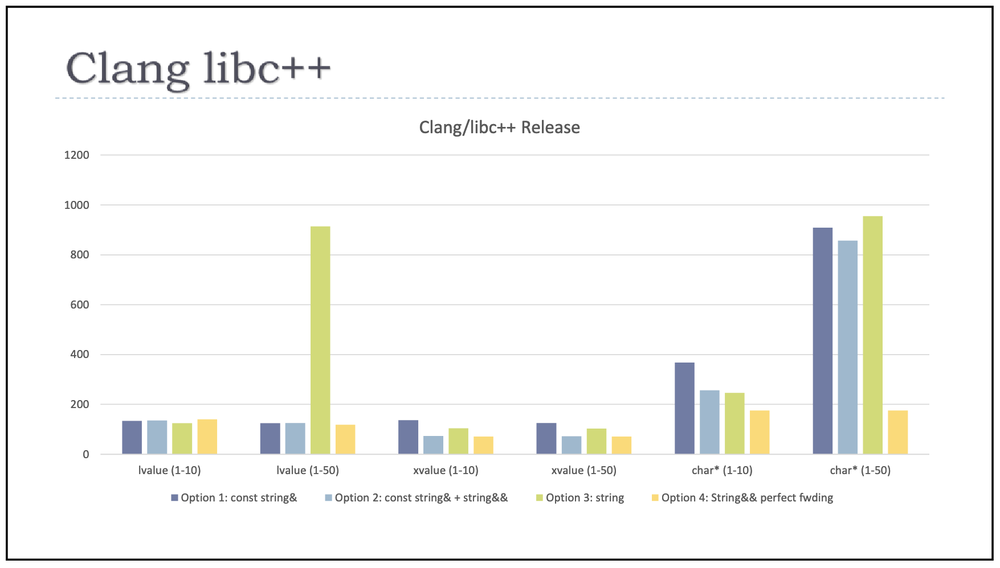

<head>
    
    
</head>

# Table of Contents

1.  [Algorithm](#org6d8c53b)
2.  [Review](#org983f324)
    1.  [对象传参和返回的最佳实践](#org0f17853)
        1.  [传统的对象传递方式](#org1044bf1)
        2.  [现代 C++ 的对象传递方式](#org290a058)
        3.  [针对移动的优化](#org43a3ca9)
        4.  [值传参？](#org8faeffd)
        5.  [“不可教授”的极致性能传参方式](#org9da6307)
        6.  [字符串的特殊处理](#org928d320)
3.  [Tips](#orgf17aa84)
    1.  [链接器：符号是怎么绑定到地址上的？](#org4b6cc2b)
        1.  [编译时链接器做了什么？](#orga961b6e)
        2.  [动态库链接](#orgf57f8c7)
4.  [Share](#orgbfd024d)
    1.  [一个可信的故事](#orgac99cd0)
    2.  [疏漏的谎言](#org3671c05)

# Algorithm

Leetcode 2430: Maximum Deletions on a String: <https://leetcode.com/problems/maximum-deletions-on-a-string/>

<https://dreamume.medium.com/leetcode-2430-maximum-deletions-on-a-string-da886dad7e62>

# Review

现代 C++ 编程实战    吴咏炜

## 对象传参和返回的最佳实践

### 传统的对象传递方式

Herb Sutter 在 CppCon 2014 时早就总结过，传统的——即 C++98 的——对象传递方式应该是我们的基本出发点 [[1]​](https://www.youtube.com/watch?v=xnqTKD8uD64)。可以用表格示意如下：

<table border="2" cellspacing="0" cellpadding="6" rules="groups" frame="hsides">

<colgroup>
<col  class="org-left" />

<col  class="org-left" />

<col  class="org-left" />

<col  class="org-left" />
</colgroup>
<thead>
<tr>
<th scope="col" class="org-left">&#xa0;</th>
<th scope="col" class="org-left">复制代价低（如 int）</th>
<th scope="col" class="org-left">复制代价中（如 string 或大结构体），或不知道（如在模板中）</th>
<th scope="col" class="org-left">复制代价高（如 vector 和大结构体的数组）</th>
</tr>
</thead>

<tbody>
<tr>
<td class="org-left">出</td>
<td class="org-left">&#xa0;</td>
<td class="org-left">X f()</td>
<td class="org-left">f(X&amp;)</td>
</tr>

<tr>
<td class="org-left">入/出</td>
<td class="org-left">&#xa0;</td>
<td class="org-left">f(X&amp;)</td>
<td class="org-left">&#xa0;</td>
</tr>

<tr>
<td class="org-left">入</td>
<td class="org-left">f(X)</td>
<td class="org-left">f(const X&amp;)</td>
<td class="org-left">f(const X&amp;)</td>
</tr>

<tr>
<td class="org-left">入且保留一份</td>
<td class="org-left">f(X)</td>
<td class="org-left">f(const X&amp;)</td>
<td class="org-left">f(const X&amp;)</td>
</tr>
</tbody>
</table>

简单解释一下表格里的行列：

-   表格把对象的类型按复制代价分成三种，然后按出入参有四种不同的情况，分别进行讨论
-   复制代价低指相当于拷贝几个整数的开销；复制代价中指大于几个整数的开销，直至约 1 KB 的连续内存，且不涉及内存分配；除此之外属于代价高的情况
-   “出”指我们想要从函数中取得（返回）某个对象的情况；“入 / 出”指传递给函数且让函数修改该对象的情况；“入”指纯粹传递给函数作为参数且不修改该对象的情况；“入且保留一份”指函数会把参数指代的对象保存到某个地方，如类的成员变量或全局变量里

当需要取得一个复制代价低到中的对象时，我们可以直接使用函数的返回值。由于 C++98 没有移动，复制代价高的对象只能使用出参的方式来返回，如容器。如果一个对象既是出参又是入参，那我们就只能使用按引用传递的出入参了。如果是纯粹的入参，那不管我们怎么使用，我们就只考虑复制代价：如果复制代价很低，比如小于等于两个指针的大小，那直接按值传递就好；否则，按 const 引用传递性能更高，明确表达了该函数不修改此入参的意图。对于入参的这两种方式，我们都无法修改调用方手里的对象

对于表格右上角的复制代价高的对象返回，我们还有一种方式是把它分配在堆上，然后返回 X\*。这样会带来内存分配的开销，但之后这个对象的传递就非常方便了，在很多场景下仍然是值得的

### 现代 C++ 的对象传递方式

到了现代 C++，上面的建议仍然基本适用。不过，我们需要做一点小小的调整：

<table border="2" cellspacing="0" cellpadding="6" rules="groups" frame="hsides">

<colgroup>
<col  class="org-left" />

<col  class="org-left" />

<col  class="org-left" />

<col  class="org-left" />
</colgroup>
<thead>
<tr>
<th scope="col" class="org-left">&#xa0;</th>
<th scope="col" class="org-left">复制代价低（如 int）或只能移动（如 unique_ptr）</th>
<th scope="col" class="org-left">移动代价低（如 vector 和 string）到中（如 array&lt;vector&gt; 或大结构体），或不知道（如在模板中）</th>
<th scope="col" class="org-left">移动代价高（如大结构体的数组或 array）</th>
</tr>
</thead>

<tbody>
<tr>
<td class="org-left">出</td>
<td class="org-left">&#xa0;</td>
<td class="org-left">X f()</td>
<td class="org-left">f(X&amp;)</td>
</tr>

<tr>
<td class="org-left">入/出</td>
<td class="org-left">&#xa0;</td>
<td class="org-left">f(X&amp;)</td>
<td class="org-left">f(X&amp;)</td>
</tr>

<tr>
<td class="org-left">入</td>
<td class="org-left">f(X)</td>
<td class="org-left">f(const X&amp;)</td>
<td class="org-left">f(const X&amp;)</td>
</tr>

<tr>
<td class="org-left">入且保留一份</td>
<td class="org-left">f(X)</td>
<td class="org-left">f(const X&amp;)</td>
<td class="org-left">f(const X&amp;)</td>
</tr>
</tbody>
</table>

表格的形式基本不变，但我们加入了一些移动相关的情况。尤其是，对于是否可以使用函数返回值来返回对象，主要的衡量标准成了移动的代价。现在我们可以返回一个 vector，甚至一个 vector 的 array（在 array 不是很大的情况下）。对于 unique_ptr 或其他只能移动的对象，我们也可以参照 int 这样的小对象来处理，在除了出入参的情况外一律使用值的方式来传递和返回

对于右上角的大对象返回，我们之前说过可以在堆上分配并返回指针。到了现代 C++，我们对此建议的修改是，使用 unique_ptr（如果不确定是否会“共享”）或 make_shared（如果确定需要共享）——有所有权的裸指针已经不再建议使用了

这就是我们传递对象的基本方式了。如果我们对性能有特殊需求的话——比如，设计一些供其他人使用的公共库——那我们可能需要进一步细分后面移动相关的情况

### 针对移动的优化

<table border="2" cellspacing="0" cellpadding="6" rules="groups" frame="hsides">

<colgroup>
<col  class="org-left" />

<col  class="org-left" />

<col  class="org-left" />

<col  class="org-left" />
</colgroup>
<thead>
<tr>
<th scope="col" class="org-left">&#xa0;</th>
<th scope="col" class="org-left">复制代价低（如 int）或只能移动（如 unique_ptr）</th>
<th scope="col" class="org-left">移动代价低（如 vector 和 string）到中（如 array&lt;vector&gt; 或大结构体），或不知道（如在模板中）</th>
<th scope="col" class="org-left">移动代价高（如大结构体的数组或 array）</th>
</tr>
</thead>

<tbody>
<tr>
<td class="org-left">出</td>
<td class="org-left">&#xa0;</td>
<td class="org-left">X f()</td>
<td class="org-left">f(X&amp;)</td>
</tr>

<tr>
<td class="org-left">入/出</td>
<td class="org-left">&#xa0;</td>
<td class="org-left">f(X&amp;)</td>
<td class="org-left">f(X&amp;)</td>
</tr>

<tr>
<td class="org-left">入</td>
<td class="org-left">f(X)</td>
<td class="org-left">f(const X&amp;)</td>
<td class="org-left">f(const X&amp;)</td>
</tr>

<tr>
<td class="org-left">入且保留一份</td>
<td class="org-left">f(X)</td>
<td class="org-left">f(const X&amp;) + f(X&amp;&amp;)</td>
<td class="org-left">f(const X&amp;) + f(X&amp;&amp;)</td>
</tr>
</tbody>
</table>

针对最后一行移动进行的额外优化（和 Herb 不同，我觉得单独区分“入且移动一份”没什么意义——反而在概念上引发复杂性和矛盾——因而没有对这种情况单独进行讨论）。事实上，我们使用移动构造函数和移动赋值运算符，正是这种针对移动的优化

再拿 Herb 的例子来说明一下。假设我们有一个 employee 类：

    class employee {
    public:
        // ...
        void set_name(const string& name) {
            name_ = name;
        }
    private:
        string name_;
    };

考虑到我们传递的对象可能是个临时对象——如果我们传递字符串字面量的话，就会产生出一个临时的 string 对象——我们可以针对移动来优化一下：

    class employee {
    public:
        // ...
        void set_name(const string& name) {
            name_ = name;
        }
        void set_name(string&& name) {
            name_ = move(name);
        }
    private:
        string name_;
    };

这样，当参数是一个右值时，我们就可以使用这个右值引用的重载，直接把名字移到 name\_ 里，省去了复制字符串及潜在的内存分配开销

需要注意的是，通常只有在你设计某些基础设施、需要达到较高的优化时，才需要这么去做。对于普通的 employee 类，这么做的必要性不高（employee::set_name 不会成为一个影响你程序性能的因素吧？）；而对于像 std::string 这样的基础库，那这样的优化就完全必要了

### 值传参？

对以上的代码有一种简化的写法，值得探讨一下。它就是值传参：

    class employee {
    public:
        // ...
        void set_name(string name) {
            name_ = move(name);
        }
    private:
        string name_;
    };

这里我们通过 string 的值传参，把两种情况合成了一种。当传进来的 string 是一个左值时，我们先进行一次拷贝构造，然后进行了一次移动赋值；当传进来的 string 是一个右值时，我们先进行一次移动构造，然后进行了一次移动赋值。这样，似乎我们以一次移动为代价，把两种情况归一了。看起来似乎还不错？

之前讲的 smart_ptr 的赋值运算符，我就是以这种方式来实现的。这种用法有一个专门的名字，叫“拷贝并交换惯用法”（copy-and-swap idiom）[[2]​](https://stackoverflow.com/a/3279550/816999)。它能优雅地归并拷贝和移动赋值运算符，取消自赋值检查，并实现强异常安全性

但是，如果我们考虑到 set_name 有可能被多次重复调用的话（虽然对于这个类似乎并不太会发生），那这个实现对于左值有一个潜在的重大缺陷：不能充分利用已经分配的内存。因此，容器和字符串的标准实现中都不使用这种方式来赋值。我们也需要记住 Howard Hinnant 的话：“不要盲目地认为构造和赋值具有相同的开销。”—— 一般而言，容器和字符串的拷贝赋值开销小于拷贝构造

当我们采用最平常不过的 const string& 的传参形式时，在函数体内是一个拷贝赋值操作。当 name\_ 的已分配空间比新名字的长度大时，我们不需要任何新的内存分配，拷贝赋值操作会直接把字符串复制到目标字符串缓冲区里。仅当目标缓冲区空间不足时，我们才会需要新的内存分配。可想而知，在典型的赋值场景下，在几次分配之后，缓冲区就足够大了，我们就不再会需要分配内存，因此我们后面就不再会有内存的分配和释放操作

而当我们采用 string 的值传参时，对于左值参数，我们每次都必然会发生一次内存分配操作（通常还伴随着老的 name\_ 的内存释放）。因此，在有重复调用的场景下，值传参可能并不合适

不过，这也意味着，值传参的方式对于构造函数是非常合适的（对象构造不可能发生多次）。我们完全可以写：

    class employee {
    public:
        employee(string name) : name_(std::move(name)) {}
        // ...
    };

事实上，这也是 clangd 会提示我们做的一个现代化（modernize）的更改 [[3]​](https://clangd.llvm.org/)。下面图里的提示来自 Vim 插件 YouCompleteMe（它内部使用 clangd）[[4]​](https://ycm-core.github.io/YouCompleteMe/)

如果你的构造函数有多个参数的话，这样写的好处尤其明显——因为如果我们使用左值和右值的重载的话，重载的数量会随着参数的数量而指数式上升！

### “不可教授”的极致性能传参方式

有没有注意到 set_name 两种重载形式非常接近？它和我在之前讨论完美转发时用的例子非常像，两个函数体内部唯一的区别就只是对 std::move 的调用了。我们确实可以把这个函数改造成模板形式，然后使用完美转发。考虑到参数不能是任意类型，我们再用 enable_if 加上了可对 string 赋值的限制。最终代码如下

    class employee {
    public:
        // ...
        template<S, typename = enable_if_t<is_assignable_v<string&, S>>>
        void set_name(S&& name) {
            name_ = forward<S>(name);
        }
        // ...
    };

该代码还有下列问题

-   对于不同形式的实参，会实际生成多份函数实例（本例中函数简单可内联，还问题不大）
-   实现代码必须放在头文件里（至少在可以用 C++20 模块之前）
-   因为这是个函数模板，它不能是虚函数

如果这些问题都可以接受的话，那我们获得的好处，就是性能了。Herb 实测了一些场景，这种写法确实可以获得最高的性能。他的测试结果总结在下图里：

对于 string 的左值（第一、二种情况）和右值（第三、四种情况），我们可以看到只有中等大小的左值情况下 string 值传参性能比较差，其他各种方式差异并不大。小字符串左值 string 值传参没有问题的原因是，string 一般都有小字符串优化，对于较短的字符串不需要进行堆上内存分配，因此左值值传参的问题要在字符串较长时才会暴露出来。而到了使用字符指针传参（第五、六种情况）给 set_name 这样的函数时，前三种方式都会临时构造一个 string，会多发生一次字符串复制和 / 或堆上内存分配；只有最后一种方式没有这种额外开销，本质上直接调用了 string::operator=(const char\*)

再强调一下，如果你的类不是处于代码瓶颈上、或潜在可能处于代码瓶颈上（当你设计某种基础库时），这样的大招很可能是不必要的。但 C++ 允许你在真正必要的时候写出这样的代码，让使用代码的人轻轻松松地获得性能的提升——他们并不需要关心 set_name 这样的函数的实现细节

### 字符串的特殊处理

C++17 引入了 string_view，对于“出”、“出 / 入”和“入且保留一份”的情况，我们仍然可以使用上面的建议（包括选择是不是使用完美转发）。不过，对于纯入参的情况，或者在“入且保留一份”的情况下你不打算使用移动优化的话，现在使用 string_view 是一个对字符串字面量更为友好的选择

使用 string_view 的话，我们可以把 set_name 实现成：

    class employee {
    public:
        // ...
        void set_name(string_view name) {
            name_ = forward<S>(name);
        }
        // ...
    };

使用这一形式的话，我们代码的性能只会在使用字符串右值时略有损失，如使用 emp.set_name(get_name_by_id(…)) 这样的代码。通常这不会是一个问题

如果真需要极致优化的话，你仍然可以使用之前的方式，不过，需要注意，对于字符串字面量，形参 string_view 和 string&& 会导致重载有二义性。你需要使用完美转发的方式，或者使用形参为 const char\*、const string& 和 string&& 的三个重载

# Tips

iOS 开发高手课    戴铭

## 链接器：符号是怎么绑定到地址上的？

编译的几个主要过程:

-   首先，你写好代码后，LLVM 会预处理你的代码，比如把宏嵌入到对应的位置
-   预处理完后，LLVM 会对代码进行词法分析和语法分析，生成 AST 。AST 是抽象语法树，结构上比代码更精简，遍历起来更快，所以使用 AST 能够更快速地进行静态检查，同时还能更快地生成 IR（中间表示）
-   最后 AST 会生成 IR，IR 是一种更接近机器码的语言，区别在于和平台无关，通过 IR 可以生成多份适合不同平台的机器码。对于 iOS 系统，IR 生成的可执行文件就是 Mach-O

### 编译时链接器做了什么？

为什么要让链接器做符号和地址绑定这样一件事儿呢？不绑定的话，又会有什么问题？

如果地址和符号不做绑定的话，要让机器知道你在操作什么内存地址，你就需要在写代码时给每个指令设好内存地址。写这样的代码的过程，就像你直接在和不同平台的机器沟通，连编译生成 AST 和 IR 的步骤都省掉了，甚至优化平台相关的代码都需要你自己编写

链接器在链接多个目标文件的过程中，会创建一个符号表，用于记录所有已定义的和所有未定义的符号。链接时如果出现相同符号的情况，就会出现“ld: dumplicate symbols”的错误信息；如果在其他目标文件里没有找到符号，就会提示“Undefined symbols”的错误信息

说完了链接器解决的问题，我们再一起来看看链接器对代码主要做了哪几件事儿

-   去项目文件里查找目标代码文件里没有定义的变量
-   扫描项目中的不同文件，将所有符号定义和引用地址收集起来，并放到全局符号表中
-   计算合并后长度及位置，生成同类型的段进行合并，建立绑定
-   对项目中不同文件里的变量进行地址重定位

链接器在整理函数的符号调用关系时，就可以帮你理清有哪些函数是没被调用的，并自动去除掉。那这是怎么实现的呢？

链接器在整理函数的调用关系时，会以 main 函数为源头，跟随每个引用，并将其标记为 live。跟随完成后，那些未被标记 live 的函数，就是无用函数。然后，链接器可以通过打开 Dead code stripping 开关，来开启自动去除无用代码的功能。并且，这个开关是默认开启的

### 动态库链接

Mach-O 文件是编译后的产物，而动态库在运行时才会被链接，并没参与 Mach-O 文件的编译和链接，所以 Mach-O 文件中并没有包含动态库里的符号定义。也就是说，这些符号会显示为“未定义”，但它们的名字和对应的库的路径会被记录下来。运行时通过 dlopen 和 dlsym 导入动态库时，先根据记录的库路径找到对应的库，再通过记录的名字符号找到绑定的地址

dlopen 会把共享库载入运行进程的地址空间，载入的共享库也会有未定义的符号，这样会触发更多的共享库被载入。dlopen 也可以选择是立刻解析所有引用还是滞后去做。dlopen 打开动态库后返回的是引用的指针，dlsym 的作用就是通过 dlopen 返回的动态库指针和函数符号，得到函数的地址然后使用

使用 dyld 加载动态库，有两种方式：有程序启动加载时绑定和符号第一次被用到时绑定。为了减少启动时间，大部分动态库使用的都是符号第一次被用到时再绑定的方式

加载过程开始会修正地址偏移，iOS 会用 ASLR 来做地址偏移避免攻击，确定 Non-Lazy Pointer 地址进行符号地址绑定，加载所有类，最后执行 load 方法和 Clang Attribute 的 constructor 修饰函数

每个函数、全局变量和类都是通过符号的形式定义和使用的，当把目标文件链接成一个 Mach-O 文件时，链接器在目标文件和动态库之间对符号做解析处理

系统上的动态链接器会使用共享缓存，共享缓存在 /var/db/dyld/。当加载 Mach-O 文件时，动态链接器会先检查是否有共享缓存。每个进程都会在自己的地址空间映射这些共享缓存，这样做可以起到优化 App 启动速度的作用

而关于动态链接器的作用顺序是怎样的，你可以先看看 Mike Ash 写的这篇关于 dyld 的博客： [dyld: Dynamic Linking On OS X](https://www.mikeash.com/pyblog/friday-qa-2012-11-09-dyld-dynamic-linking-on-os-x.html)。这篇博客里面，很详细地讲解了 dyld 所做的事情

简单来说， dyld 做了这么几件事儿：

-   先执行 Mach-O 文件，根据 Mach-O 文件里 undefined 的符号加载对应的动态库，系统会设置一个共享缓存来解决加载的递归依赖问题
-   加载后，将 undefined 的符号绑定到动态库里对应的地址上
-   最后再处理 +load 方法，main 函数返回后运行 static terminator

调用 +load 方法是通过 runtime 库处理的。你可以通过一个[可编译的开源 runtime 库](https://github.com/RetVal/objc-runtime)来了解 runtime，从源码层面去看程序启动时 runtime 做了哪些事情。在 debug-objc 下创建一个类，在 +load 方法里断点查看走到这里调用的堆栈如下：

    0  +[someclass load]
    1  call_class_loads()
    2  ::call_load_methods
    3  ::load_images(const char *path __unused, const struct mach_header *mh)
    4  dyld::notifySingle(dyld_image_states, ImageLoader const*, ImageLoader::InitializerTimingList*)
    11 _dyld_start

在 load_images 方法里断点 p path 可以打印出所有加载的动态链接库，这个方法的 hasLoadMethods 用于快速判断是否有 +load 方法

prepare_load_methods 这个方法会获取所有类的列表然后收集其中的 +load 方法，在代码里可以发现 Class 的 +load 是先执行的，然后执行 Category 

为什么这样做呢？我们通过 prepare_load_methods 这个方法可以看出，在遍历 Class 的 +load 方法时会执行 schedule_class_load 方法，这个方法会递归到根节点来满足 Class 收集完整关系树的需求

最后， call_load_methods 会创建一个 autoreleasePool 使用函数指针来动态调用类和 Category 的 +load 方法

如果你想了解 Cocoa 的 Foundation 库的话，可以通过 GNUStep 源码来学习。比如 ，NSNotificationCenter 发送通知是按什么顺序发送的，你可以查看 NSNotificationCenter.m 里的 addObserver 方法和 postNotification 方法，看看观察者是怎么添加的，以及是怎么被遍历通知到的

# Share

统计学过去的鬼魂

<https://crypto.stanford.edu/~blynn/pr/ghost.html>

抛一个硬币 20 次

1.  假设我们每次看见头。这将使我强烈相信这个硬币是作弊的
2.  假设我们得到 THHTHHHTTTHHTHTHHTHH。让我们称这个特殊的序列为 S。S 不会触使我产生作弊的强烈质疑。S 中有 12 个头，这样硬币更容易出现头，但没有什么证据来这么说。事实上，我相信还有可能说硬币更容易出现背

我们如何用数学公式化我的猜测？根据我的本科教科书：

1.  对一个公平的硬币，抛 20 次获得 20 个头的概率为 $ 2^{-20} $，其小于百万分之一。这么小的概率出现，所以这个硬币很可能是作弊的
2.  对一个公平的硬币，出现 12 次头的概率大约为 0.25。因为 0.25 不小，我们缺乏明显的证据证明该硬币是作弊的

作者之后在缩进段落中称述：“如同我们观察到的概率越小的结果，我们会更强烈感觉该硬币是作弊的。或更一般的，对一个假说 H 和数据 D，则如果 P(D \| H) 很小则 H 更可能是假的

对此，我毫不怀疑地接受这个原则。我的大学教授知道他们在做什么，对吧？

## 一个可信的故事

这样我们可进行讨论，让我们命名上面的原则，称它为逆反命题，因为一个特别地争论处理如下。假设 A 意味着 B。通过逆命题定律，如果 B 为假，则 A 为假：

$ A \\to B \\Longrightarrow \\neg B \\to \\neg A $

用 H 替换 A 且用很可能 $ \\neg D $ 替换 B：

$ H \\to \\neg D \\text{ is likely} \\Longrightarrow D \\text{ is likely} \\to \\neg H $

我们可以把 "is likely" 移动到等式右边：

$ H \\to \\neg D \\text{ is likely} \\Longrightarrow D \\to \\neg H \\text{ is likely} $

我们有了逆反命题定律。最后的步骤看起来不合理，但我们可用之愚弄某些人：“你看，因为 D 发生，它表示 D 很可能发生，这意味着 $ \\neg H $。当然，不能简单得到 $ \\neg H $，因为有小的概率 D 不可能发生但发生了。这样我们得到 $ \\neg H $ 是可能的“

我们一步步分析我的教科书中对序列 S 的这个过程。我们对这个问题使用二项式分布，这样我们统计 S 中 12 个头，且计算 $ P(\\ge 12) $，即对公平硬币抛 20 次至少出现 12 次头的概率为

$ \\sum_ {k} {20 \\choose k} 2^{-20} [ 12 \\le k \\le 20 ] $

我们可用 haskell 进行计算

    > let { ch n 0 = 1; ch n k = n*(ch (n - 1) (k - 1)) / fromIntegral k }
    > sum[ch 20 k | k <- [12..20]] / 2^20
    0.2517223358154297

其概率稍微大于 0.25，且因此大于 0.05，因此我们认为我们缺乏强烈地证据来否认硬币是公平的

如果我们用 20 替代 12 呢？

    > sum[ch 20 k | k <- [20..20]] / 2^20
    9.5367431640625e-7

我们获得一个远小于 0.05 的概率，这样硬币每次抛出结果为头，我们因此得到一个强烈地证据确定硬币是公平的假设是假的

## 疏漏的谎言

虽然最后的结果符合我们的预期，但过程中仍有一些奇怪的地方：

1.  为什么所有包含 12 个头的序列处理都是一样的？
2.  为什么我们计算 $ P(X \\ge 12) $？这个不等式是怎么来的？

为什么我们故意忽略一些数据？如果能让我回到本科生时期，也许我会向年轻的我说：“任何特殊序列的概率，比如 S，总是 $ 2^{-20} $，所以不需要关注于特殊的序列。因为每次抛硬币跟其他次都是独立的，统计头数才是有意义的“

“对不等式：出现 k 次头的概率是

$ P(X = k) = {20 \\choose k} 2^{-20} $

该值非常小。如果我们对大的 k 求 $ P(X \\ge k) $ 和小的 k 求 $ P(X \\le k) $ 则我们获得一个概率很小，对其他的 k 值则大。即我们获得一个数可区分可能和非可能“

即以前的我会说我们做我们做的因为它有效。我们随意摆弄直到我们发现想要的一个几乎消失的数量。它是可行的（我们只需要跟 0.05 比较）且信服的（因为它包含了想要的数学知识）

这样是满意的吗？一方面，它更好地描述为“跟着这个标准过程，P 值小于 0.05；因此我们有明显的证明认为假说是假的“而不是“k 看着像某种极值使得假说可能为假“。另一方面，如果我们解决所有这些麻烦来量化假说为真有多强力的证据，为什么不做适当的工作并调整每一步，而不是处理一些临时的过程？

也许过程只是临时出现的因此变种被忽略来避免惊吓不在中学的新同学。让我们假设这样且尝试从第一原理衍生概率理论，作者坚持的一个就是逆反命题

我们有一个硬币。我们的假说认为它是公平的。20 次抛的任何特殊序列比如 S 的概率是 $ 2^{-20} $。通过逆反命题，看到这样一个不寻常的输出表示我们的假说很可能是错的。这样，我们将一直相信硬币是作弊了的

考虑滚动一个 $ 2^{20} $ 面我们认为公平的骰子。在一次滚动之后，我们看到一个数有 $ 2^{-20} $ 的机会出现。这远小于 0.05

则明显的结论是：逆反命题是错的
