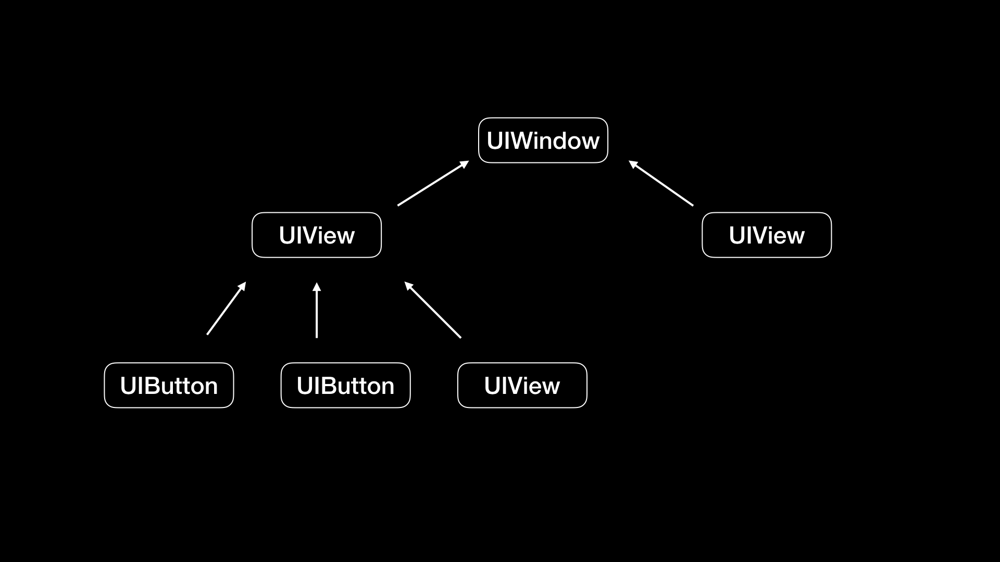

<head>
    
    
</head>

# Table of Contents

1.  [Algorithm](#orgc85d0b5)
2.  [Review](#orgc24edf6)
    1.  [Clang、Infer 和 OCLint ，我们应该使用谁来做静态分析？](#orgc8ff4ff)
        1.  [Clang 静态分析器](#org78b293a)
        2.  [Infer](#org24ce45b)
        3.  [小结](#org5544979)
    2.  [如何利用 Clang 为 App 提质](#org2ea292b)
        1.  [Clang 做了哪些事](#org5c3489b)
        2.  [Clang 提供了什么能力](#orge6a377d)
    3.  [无侵入的埋点方案如何实现](#orgdab6cee)
        1.  [运行时方法替换方式进行埋点](#orga5ff070)
        2.  [事件唯一标识](#org86a3489)
3.  [Tips](#org1e81d96)
    1.  [获取所有线程号](#org2e83b4a)
    2.  [获取通用寄存器信息](#orgb6b89bb)
    3.  [获取堆栈信息](#org585d1e2)
    4.  [获取堆栈符号](#orgd732988)
4.  [Share](#orgcff46b5)
    1.  [基本形式](#orgedb6e40)
    2.  [证明](#orgbc2f88a)
    3.  [声明](#orgbcdbf9b)
    4.  [证明](#org8cdfd6a)

# Algorithm

Leetcode 629: K Inverse Pairs Array: <https://leetcode.com/problems/k-inverse-pairs-array/>

<https://dreamume.medium.com/leetcode-629-k-inverse-pairs-array-5165ffb98674>

# Review

iOS 开发高手课    戴铭

## Clang、Infer 和 OCLint ，我们应该使用谁来做静态分析？

### Clang 静态分析器

Clang 静态分析器（Clang Static Analyzer）是一个用 C++ 开发的，用来分析 C、C++ 和 Objective-C 的开源工具，是 Clang 项目的一部分，构建在 Clang 和 LLVM 之上。Clang 静态分析器的分析引擎用的就是 Clang 的库

Clang 静态分析器专门为速度做过优化，可以在保证查出错误的前提下，使用更聪明的算法减少检查的工作量

[下载地址](https://clang-analyzer.llvm.org/release_notes.html) 而卸载它的话，删除这个解压后的目录即可

在 Clang 静态分析器中，常用的就是 scan-build 和 scan-view 这两个工具

scan-build 和 scan-view 所在的目录路径在 checker 目录的 bin 子目录里

scan-build 是用来运行分析器的命令行工具；scan-view 包含了 scan-build 工具，会在 scan-build 执行完后将结果可视化

scan-build 的原理是，将编译器构建改成另一个“假的”编译器来构建，这个“假的”编译器会执行 Clang 来编译，然后执行静态分析器分析你的代码

scan-build 的使用方法，也很简单，你只需要到项目目录下，使用如下命令即可：

    \yourpath\scan-build -k -V make

更多的参数和使用说明查看 [链接](https://clang-analyzer.llvm.org/scan-build)

Clang 静态分析器是由分析引擎 (analyzer core) 和 checkers 组成的。所有的 checker 都是基于底层分析引擎之上的。通过分析引擎提供的功能，我们可以编写新的 checker

checker 架构能够方便用户扩展代码检查的规则，或者通过自定义来扩展 bug 类型。如果你想编写自己的 checker，可以在 Clang 项目的 lib/StaticAnalyzer/Checkers 目录下找到示例参考，比如 ObjCUnusedIVarsChecker.cpp 就是用来检查是否有定义了，但是从未使用过的变量

当然，如果为了编写自定义的 checker 一开始就埋头进去看那些示例代码是很难看懂的，你甚至都不能知道编写 checker 时有哪些方法可以为我所用。所以，你需要先了解 Clang 静态分析器提供了哪些功能接口，然后再参考官方的大量实例，去了解怎么使用这些功能接口，在这之后再动手开发才会事半功倍

接下来，我就跟你聊聊开发 checker 时需要了解的 Clang 静态分析器提供的一些功能接口

checker 的官方示例代码里有一个非常实用的，也就是内存泄露检查示例 MallocChecker，你可以点击 [链接](https://clang.llvm.org/doxygen/MallocChecker_8cpp_source.html)

在这段代码开头，我们可以看到引入了 clang/AST/ 和 clang/StaticAnalyzer/Core/PathSensitive/ 目录下的头文件。这两个目录下定义的接口功能非常强大，大部分 checker 都是基于此开发的

clang/AST/ 目录中，有语法树遍历 RecursiveASTVisitor，还有语法树层级遍历 StmtVisitor，遍历过程中，会有很多回调函数可以让 Checker 进行检查。比如，方法调用前的回调 checkPreCall、方法调用后的回调 checkPostCall，CFG（Control Flow Graph 控制流程图） 分支调用时的回调 checkBranchCondition、CFG 路径分析结束时的回调 checkEndAnalysis 等等。有了这些回调，我们就可以从语法树层级和路径上去做静态检查的工作了

clang/StaticAnalyzer/Core/PathSensitive/ 目录里，可以让 checker 检查变量和值上的更多变化。从目录 PathSensitive，我们也能看出这些功能叫做路径敏感分析（Path-Sensitive Analyses），是从条件分支上去跟踪，而这种跟踪是跟踪每一种分支去做分析

但是，要去追踪所有路径的话，就可能会碰到很多复杂情况，特别是执行循环后，问题会更复杂，需要通过路径合并来简化复杂的情况，但是简化后可能就不会分析出所有的路径。所以，考虑到合理性问题的话，我们还是需要做些取舍，让其更加合理，达到尽量输出更多信息的目的，来方便我们开发 checker，检查出更多的 bug

路径敏感分析也包含了模拟内存管理，SymbolManager 符号管理里维护着变量的生命周期分析。想要了解具体实现的话，你可以点击 [链接](https://clang.llvm.org/doxygen/SymbolManager_8h_source.html)

这个内存泄露检查示例 MallocChecker 里，运用了 Clang 静态分析器提供的语法树层级节点检查、变量值路径追踪以及内存管理分析功能接口，对我们编写自定义的 checker 是一个很全面、典型的示例

追其根本，编写自己的 checker ，其核心还是要更多地掌握 Clang 静态分析器的内在原理。很早之前，苹果公司就在 [LLVM Developers Meeting](https://www.youtube.com/watch?v=4lUJTY373og&t=102s) 上，和我们分享过怎样通过 Clang 静态分析器去找 bug。你可以点击 [链接](https://llvm.org/devmtg/2008-08/Kremenek_StaticAnalyzer.pdf)，查看相应的 PPT，这对我们了解 Clang 静态分析器的原理有很大的帮助

不过，checker 架构也有不完美的地方，比如每执行完一条语句，分析引擎需要回去遍历所有 checker 中的回调函数。这样的话，随着 checker 数量的增加，整体检查的速度也会变得越来越慢

如果你想列出当前 Clang 版本下的所有 checker，可以使用如下命令：

    clang —analyze -Xclang -analyzer-checker-help

下面显示的就是常用的 checker：

    debug.ConfigDumper              配置表
    debug.DumpCFG                   显示控制流程图
    debug.DumpCallGraph             显示调用图
    debug.DumpCalls                 打印引擎遍历的调用
    debug.DumpDominators            打印控制流程图的 dominance tree
    debug.DumpLiveVars              打印实时变量分析结果
    debug.DumpTraversal             打印引擎遍历的分支条件
    debug.ExprInspection            检查分析器对表达式的理解
    debug.Stats                     使用分析器统计信息发出警告
    debug.TaintTest                 标记污染的符号
    debug.ViewCFG                   查看控制流程图
    debug.ViewCallGraph             使用 GraphViz 查看调用图
    debug.ViewExplodedGraph         使用 GraphViz 查看分解图

接下来，我和你举个例子来说明如何使用 checker 。我们先写一段代码：

    int main() {
      int a;
      int b = 10;
      a = b;
    
      return a;
    }

接下来，我们使用下面这条命令，调用 DumpCFG 这个 checker 对上面代码进行分析：

    clang -cc1 -analyze -analyzer-checker=debug.DumpCFG

显示结果如下：

    int main()
     [B2 (ENTRY)]
       Succs (1): B1
    
     [B1]
       1: int a;
       2: 10
       3: int b = 10;
       4: b
       5: [B1.4] (ImplicitCastExpr, LValueToRValue, int)
       6: a
       7: [B1.6] = [B1.5]
       8: a
       9: [B1.8] (ImplicitCastExpr, LValueToRValue, int)
      10: return [B1.9];
       Preds (1): B2
       Succs (1): B0
    
     [B0 (EXIT)]
       Preds (1): B

可以看出，代码的控制流程图被打印了出来。控制流程图会把程序拆得更细，可以把执行过程表现得更直观，有助于我们做静态分析

### Infer

Infer 是 Facebook 开源的、使用 OCaml 语言编写的静态分析工具，可以对 C、Java 和 Objective-C 代码进行静态分析，可以检查出空指针访问、资源泄露以及内存泄露

Infer 的安装，有从源码安装和直接安装 binary releases 两种方式

如果想在 macOS 上编译源码进行安装的话，你需要预先安装一些工具，这些工具在后面编译时会用到，命令行指令如下：

    brew install autoconf automake cmake opam pkg-config sqlite gmp mpfr
    brew cask install java

你可以使用如下所示的命令，通过编译源码来安装：

    # Checkout Infer
    git clone https://github.com/facebook/infer.git
    cd infer
    # Compile Infer
    ./build-infer.sh clang
    # install Infer system-wide...
    sudo make install
    # ...or, alternatively, install Infer into your PATH
    export PATH=`pwd`/infer/bin:$PATH

使用源码安装所需的时间会比较长，因为会编译一个特定的 Clang 版本，而 Clang 是个庞大的工程，特别是第一次编译的耗时会比较长。我在第一次编译时，就大概花了一个多小时。所以，直接安装 binary releases 会更快些，在终端输入：

    brew install infer

Infer 就安装好了

接下来，我通过一个示例和你分享下如何使用 Infer。我们可以先写一段 Objective-C 代码：

    #import <Foundation/Foundation.h>
    
    @interface Hello: NSObject
    
    @property NSString* s;
    
    @end
    
    @implementation Hello
    
    NSString* m() {
        Hello* hello = nil;
        return hello->_s;
    }
    
    @end

在终端输入：

    infer -- clang -c Hello.m

结果如下：

    Capturing in make/cc mode...
    Found 1 source file to analyze in /Users/ming/Downloads/jikeshijian/infer-out
    Starting analysis...
    
    legend:
      "F" analyzing a file
      "." analyzing a procedure
    
    F.
    *Found 5 issues*
    
    hello.m:10: error: NULL_DEREFERENCE
      pointer `hello` last assigned on line 9 could be null and is dereferenced at line 10, column 12.
      8.   NSString* m() {
      9.       Hello* hello = nil;
      10. *>*    return hello->_s;
      11.   }
    
    hello.m:10: warning: DIRECT_ATOMIC_PROPERTY_ACCESS
      Direct access to ivar `_s` of an atomic property at line 10, column 12. Accessing an ivar of an atomic property makes the property nonatomic.
      8.   NSString* m() {
      9.       Hello* hello = nil;
      10. *>*    return hello->_s;
      11.   }
    
    hello.m:4: warning: ASSIGN_POINTER_WARNING
      Property `s` is a pointer type marked with the `assign` attribute at line 4, column 1. Use a different attribute like `strong` or `weak`.
      2.   
      3.   @interface Hello: NSObject
      4. *>*@property NSString* s;
      5.   @end
      6.   
    
    hello.m:10: warning: DIRECT_ATOMIC_PROPERTY_ACCESS
      Direct access to ivar `_s` of an atomic property at line 10, column 12. Accessing an ivar of an atomic property makes the property nonatomic.
      8.   NSString* m() {
      9.       Hello* hello = nil;
      10. *>*    return hello->_s;
      11.   }
    
    hello.m:4: warning: ASSIGN_POINTER_WARNING
      Property `s` is a pointer type marked with the `assign` attribute at line 4, column 1. Use a different attribute like `strong` or `weak`.
      2.   
      3.   @interface Hello: NSObject
      4. *>*@property NSString* s;
      5.   @end
      6.   
    
    
    *Summary of the reports*
    
      DIRECT_ATOMIC_PROPERTY_ACCESS: 2
             ASSIGN_POINTER_WARNING: 2
                   NULL_DEREF

可以看出，我们前面的 hello.m 代码里一共有五个问题，其中包括一个错误、四个警告。第一个错误如下：

    hello.m:10: error: NULL_DEREFERENCE
      pointer `hello` last assigned on line 9 could be null and is dereferenced at line 10, column 12.
      8.   NSString* m() {
      9.       Hello* hello = nil;
      10. *>*    return hello->_s;
      11.   }

这个错误的意思是， hello 可能为空，需要去掉第 10 行 12 列的引用。我把这行代码做下修改，去掉引用：

    return hello.s;

再到终端运行一遍 infer 命令：

    infer -- clang -c Hello.m

然后，就发现只剩下了一个警告:

    hello.m:4: warning: ASSIGN_POINTER_WARNING
      Property `s` is a pointer type marked with the `assign` attribute at line 4, column 1. Use a different attribute like `strong` or `weak`.
      2.   
      3.   @interface Hello: NSObject
      4. *>*@property NSString* s;
      5.   @end
      6.  

这个警告的意思是说，属性 s 是指针类型，需要使用 strong 或 weak 属性。这时，我将 s 的属性修改为 strong：

    @property(nonatomic, strong) NSString* s;

运行 Infer 后，发现没有问题了。

    Capturing in make/cc mode...
    Found 1 source file to analyze in /Users/ming/Downloads/jikeshijian/infer-out
    Starting analysis...
    
    legend:
      "F" analyzing a file
      "." analyzing a procedure
    
    F.
    *No issues found

接下来，为了帮助你理解 Infer 的工作原理，我来梳理下 Infer 工作的流程：

-   第一个阶段是转化阶段，将源代码转成 Infer 内部的中间语言。类 C 语言使用 Clang 进行编译，Java 语言使用 javac 进行编译，编译的同时转成中间语言，输出到 infer-out 目录
-   第二个阶段是分析阶段，分析 infer-out 目录下的文件。分析每个方法，如果出现错误的话会继续分析下一个方法，不会被中断，但是会记录下出错的位置，最后将所有出错的地方进行汇总输出
    
    默认情况下，每次运行 infer 命令都会删除之前的 infer-out 文件夹。你可以通过 &#x2013;incremental 参数使用增量模式。增量模式下，运行 infer 命令不会删除 infer-out 文件夹，但是会利用这个文件夹进行 diff，减少分析量
    
    一般进行全新一轮分析时直接使用默认的非增量模式，而对于只想分析修改部分情况时，就使用增量模式

Infer 检查的结果，在 infer-out 目录下，是 JSON 格式的，名字叫做 report.json 。生成 JSON 格式的结果，通用性会更强，集成到其他系统时会更方便

### 小结

其中 Clang 静态分析器和 Xcode 的集成度高，也支持命令行。不过，它们检查的规则少，基本都是只能检查出较大的问题，比如类型转换问题，而对内存泄露问题检查的侧重点则在于可用性

OCLint 检查规则多、定制性强，能够发现很多潜在问题。但缺点也是检查规则太多，反而容易找不到重点；可定制度过高，导致易用性变差

Infer 的效率高，支持增量分析，可小范围分析。可定制性不算最强，属于中等

## 如何利用 Clang 为 App 提质

基于 Clang 还可以开发出用于代码增量分析、代码可视化、代码质量报告来保障 App 质量的系统平台，比如 [CodeChecker](https://github.com/Ericsson/CodeChecker)

比如，当周末发现线上问题时，你会发现很多时候分析问题的人都不在电脑边，无法及时处理问题。这时，我们就需要一款在线网页代码导航工具，比如 Mozilla 开发的 [DXR](https://github.com/mozilla/dxr#dxr)，方便在便携设备上去操作、分析问题，这样的工具都是基于 Clang 开发的

### Clang 做了哪些事

我们先看看下面这段示例代码：

    int main() {
      int a;
      int b = 10;
      a = b;
    
      return a;
    }

首先，Clang 会对代码进行词法分析，将代码切分成 Token。输入一个命令可以查看上面代码的所有的 Token。命令如下：

    clang -fmodules -E -Xclang -dump-tokens main.m

这个命令的作用是，显示每个 Token 的类型、值，以及位置。你可以在 [这个链接](https://opensource.apple.com//source/lldb/lldb-69/llvm/tools/clang/include/clang/Basic/TokenKinds.def) 中，看到 Clang 定义的所有 Token 类型。我们可以把这些 Token 类型，分为下面这 4 类

-   关键字：语法中的关键字，比如 if、else、while、for 等
-   标识符：变量名
-   字面量：值、数字、字符串
-   特殊符号：加减乘除等符号

接下来，词法分析完后就会进行语法分析，将输出的 Token 先按照语法组合成语义，生成类似 VarDecl 这样的节点，然后将这些节点按照层级关系构成抽象语法树（AST）

在终端输入下面的这条命令，你就可以查看前面源码的语法树：

    clang -fmodules -fsyntax-only -Xclang -ast-dump main.m

打印出来效果如下：

    TranslationUnitDecl 0xc75b450 <<invalid sloc>> <invalid sloc>
    |-TypedefDecl 0xc75b740 <<invalid sloc>> <invalid sloc> implicit __builtin_va_list ‘char *’
    `-FunctionDecl 0xc75b7b0 <test.cpp:1:1, line:7:1> line:1:5 main ‘int (void)’
      `-CompoundStmt 0xc75b978 <line:2:1, line:7:1>
        |-DeclStmt 0xc75b870 <line:3:2, col:7>
        | `-VarDecl 0xc75b840 <col:2, col:6> col:6 used a ‘int’
        |-DeclStmt 0xc75b8d8 <line:4:2, col:12>
        | `-VarDecl 0xc75b890 <col:2, col:10> col:6 used b ‘int’ cinit
        |   `-IntegerLiteral 0xc75b8c0 <col:10> ‘int’ 10
    
    <<<<<<<<<<<<<<<<<<<<<<<<<<<<<<< a = b <<<<<<<<<<<<<<<<<<<<<<<<<<<<<<<<<<<<<<<<
        |-BinaryOperator 0xc75b928 <line:5:2, col:6> ‘int’ lvalue ‘=‘
        | |-DeclRefExpr 0xc75b8e8 <col:2> ‘int’ lvalue Var 0xc75b840 ‘a’ ‘int’
        | `-ImplicitCastExpr 0xc75b918 <col:6> ‘int’ <LValueToRValue>
        |   `-DeclRefExpr 0xc75b900 <col:6> ‘int’ lvalue Var 0xc75b890 ‘b’ ‘int’
    <<<<<<<<<<<<<<<<<<<<<<<<<<<<<<<<<<<<<<<<<<<<<<<<<<<<<<<<<<<<<<<<<<<<<<<<<<<<<<
    
        `-ReturnStmt 0xc75b968 <line:6:2, col:9>
          `-ImplicitCastExpr 0xc75b958 <col:9> ‘int’ <LValueToRValue>
            `-DeclRefExpr 0xc75b940 <col:9> ‘int’ lvalue Var 0xc75b840 ‘a’ ‘int

其中 TranslationUnitDecl 是根节点，表示一个编译单元；Decl 表示一个声明；Expr 表示的是表达式；Literal 表示字面量，是一个特殊的 Expr；Stmt 表示陈述

除此之外，Clang 还有众多种类的节点类型。Clang 里，节点主要分成 Type 类型、Decl 声明、Stmt 陈述这三种，其他的都是这三种的派生。通过扩展这三类节点，就能够将无限的代码形态用有限的形式来表现出来了

### Clang 提供了什么能力

Clang 为一些需要分析代码语法、语义信息的工具提供了基础设施。这些基础设施就是 LibClang、Clang Plugin 和 LibTooling

1.  LibClang

    LibClang 提供了一个稳定的高级 C 接口，Xcode 使用的就是 LibClang。LibClang 可以访问 Clang 的上层高级抽象的能力，比如获取所有 Token、遍历语法树、代码补全等。由于 API 很稳定，Clang 版本更新对其影响不大。但是，LibClang 并不能完全访问到 Clang AST 信息
    
    使用 LibClang 可以直接使用它的 C API。官方也提供了 Python binding 脚本供你调用。还有开源的 node-js/ruby binding。你要是不熟悉其他语言，还有个第三方开源的 Objective-C 写的 [ClangKit](https://github.com/macmade/ClangKit)

2.  Clang Plugins

    Clang Plugins 可以让你在 AST 上做些操作，这些操作能够集成到编译中，成为编译的一部分。插件是在运行时由编译器加载的动态库，方便集成到构建系统中
    
    使用 Clang Plugins 一般都是希望能够完全控制 Clang AST，同时能够集成在编译流程中，可以影响编译的过程，进行中断或者提示。关于 Clang Plugins 开发的更多内容，我会在第 37 篇文章“如何编写 Clang 插件？”中和你详细说明

3.  LibTooling

    LibTooling 是一个 C++ 接口，通过 LibTooling 能够编写独立运行的语法检查和代码重构工具。LibTooling 的优势如下：
    
    -   所写的工具不依赖于构建系统，可以作为一个命令单独使用，比如 clang-check、clang-fixit、clang-format
    -   可以完全控制 Clang AST
    -   能够和 Clang Plugins 共用一份代码
    
    与 Clang Plugins 相比，LibTooling 无法影响编译过程；与 LibClang 相比，LibTooling 的接口没有那么稳定，也无法开箱即用，当 AST 的 API 升级后需要更新接口的调用
    
    但是，LibTooling 基于能够完全控制 Clang AST 和可独立运行的特点，可以做的事情就非常多了
    
    -   改变代码：可以改变 Clang 生成代码的方式。基于现有代码可以做出大量的修改。还可以进行语言的转换，比如把 OC 语言转成 JavaScript 或者 Swift
    -   做检查：检查命名规范，增加更强的类型检查，还可以按照自己的定义进行代码的检查分析
    -   做分析：对源码做任意类型分析，甚至重写程序。给 Clang 添加一些自定义的分析，创建自己的重构器，还可以基于工程生成相关图形或文档进行分析
    
    在 LibTooling 的基础之上有个开发人员工具合集 Clang tools，Clang tools 作为 Clang 项目的一部分，已经提供了一些工具，主要包括：
    
    -   语法检查工具 clang-check
    -   自动修复编译错误工具 clang-fixit
    -   自动代码格式工具 clang-format
    -   新语言和新功能的迁移工具
    -   重构工具
    
    如果你打算基于 LibTooling 来开发工具，Clang tools 将会是很好的范例
    
    官方有一个教程叫作 [Tutorial for building tools using LibTooling and LibASTMatchers](https://clang.llvm.org/docs/LibASTMatchersTutorial.html)，可以一步步地告诉你怎样使用 LibTooling 来构建一个语言转换的工具。通过这个教程，你可以掌握 LibTooling 的基本使用方法
    
    此外，还能够模拟内存分配进行分析，Clang 静态分析器里对应的模块是 MemRegion，其中内存模型是基于 “ [A Memory Model for Static Analysis of C Programs](http://lcs.ios.ac.cn/~xuzb/canalyze/memmodel.pdf)"这篇论文而来。在 Clang 里的具体实现代码，你可以查看 [MemRegion.h](https://code.woboq.org/llvm/clang/include/clang/StaticAnalyzer/Core/PathSensitive/MemRegion.h.html) 和 [RegionStore.cpp](https://codebrowser.dev/llvm/clang/lib/StaticAnalyzer/Core/RegionStore.cpp.html) 这两个文件。对于 Clang 静态分析器的原理描述，你可以参看 [官方说明](https://github.com/llvm-mirror/clang/tree/master/lib/StaticAnalyzer)

## 无侵入的埋点方案如何实现

在 iOS 开发中，埋点可以解决两大类问题：一是了解用户使用 App 的行为，二是降低分析线上问题的难度。目前，iOS 开发中常见的埋点方式，主要包括代码埋点、可视化埋点和无埋点这三种

-   代码埋点主要就是通过手写代码的方式来埋点，能很精确的在需要埋点的代码处加上埋点的代码，可以很方便地记录当前环境的变量值，方便调试，并跟踪埋点内容，但存在开发工作量大，并且埋点代码到处都是，后期难以维护等问题
-   可视化埋点，就是将埋点增加和修改的工作可视化了，提升了增加和维护埋点的体验
-   无埋点，并不是不需要埋点，而更确切地说是“全埋点”，而且埋点代码不会出现在业务代码中，容易管理和维护。它的缺点在于，埋点成本高，后期的解析也比较复杂，再加上 view_path 的不确定性。所以，这种方案并不能解决所有的埋点需求，但对于大量通用的埋点需求来说，能够节省大量的开发和维护成本

在这其中，可视化埋点和无埋点，都属于是无侵入的埋点方案，因为它们都不需要在工程代码中写入埋点代码。所以，采用这样的无侵入埋点方案，既可以做到埋点被统一维护，又可以实现和工程代码的解耦

接下来，我们就通过今天这篇文章，一起来分析一下无侵入埋点方案的实现问题吧

### 运行时方法替换方式进行埋点

我们都知道，在 iOS 开发中最常见的三种埋点，就是对页面进入次数、页面停留时间、点击事件的埋点。对于这三种常见情况，我们都可以通过运行时方法替换技术来插入埋点代码，以实现无侵入的埋点方法。具体的实现方法是：先写一个运行时方法替换的类 SMHook，加上替换的方法 hookClass:fromSelector:toSelector，代码如下

    #import "SMHook.h"
    #import <objc/runtime.h>
    
    @implementation SMHook
    
    + (void)hookClass:(Class)classObject fromSelector:(SEL)fromSelector toSelector:(SEL)toSelector {
        Class class = classObject;
        // 得到被替换类的实例方法
        Method fromMethod = class_getInstanceMethod(class, fromSelector);
        // 得到替换类的实例方法
        Method toMethod = class_getInstanceMethod(class, toSelector);
    
        // class_addMethod 返回成功表示被替换的方法没实现，然后会通过 class_addMethod 方法先实现；返回失败则表示被替换方法已存在，可以直接进行 IMP 指针交换 
        if(class_addMethod(class, fromSelector, method_getImplementation(toMethod), method_getTypeEncoding(toMethod))) {
          // 进行方法的替换
            class_replaceMethod(class, toSelector, method_getImplementation(fromMethod), method_getTypeEncoding(fromMethod));
        } else {
          // 交换 IMP 指针
            method_exchangeImplementations(fromMethod, toMethod);
        }
    
    }
    
    @end

这个方法利用运行时 method_exchangeImplementations 接口将方法的实现进行了交换，原方法调用时就会被 hook 住，从而去执行指定的方法

页面进入次数、页面停留时间都需要对 UIViewController 生命周期进行埋点，你可以创建一个 UIViewController 的 Category，代码如下

    @implementation UIViewController (logger)
    
    + (void)load {
        static dispatch_once_t onceToken;
        dispatch_once(&onceToken, ^{
            // 通过 @selector 获得被替换和替换方法的 SEL，作为 SMHook:hookClass:fromeSelector:toSelector 的参数传入 
            SEL fromSelectorAppear = @selector(viewWillAppear:);
            SEL toSelectorAppear = @selector(hook_viewWillAppear:);
            [SMHook hookClass:self fromSelector:fromSelectorAppear toSelector:toSelectorAppear];
    
            SEL fromSelectorDisappear = @selector(viewWillDisappear:);
            SEL toSelectorDisappear = @selector(hook_viewWillDisappear:);
    
            [SMHook hookClass:self fromSelector:fromSelectorDisappear toSelector:toSelectorDisappear];
        });
    }
    
    - (void)hook_viewWillAppear:(BOOL)animated {
        // 先执行插入代码，再执行原 viewWillAppear 方法
        [self insertToViewWillAppear];
        [self hook_viewWillAppear:animated];
    }
    - (void)hook_viewWillDisappear:(BOOL)animated {
        // 执行插入代码，再执行原 viewWillDisappear 方法
        [self insertToViewWillDisappear];
        [self hook_viewWillDisappear:animated];
    }
    
    - (void)insertToViewWillAppear {
        // 在 ViewWillAppear 时进行日志的埋点
        [[[[SMLogger create]
           message:[NSString stringWithFormat:@"%@ Appear",NSStringFromClass([self class])]]
          classify:ProjectClassifyOperation]
         save];
    }
    - (void)insertToViewWillDisappear {
        // 在 ViewWillDisappear 时进行日志的埋点
        [[[[SMLogger create]
           message:[NSString stringWithFormat:@"%@ Disappear",NSStringFromClass([self class])]]
          classify:ProjectClassifyOperation]
         save];
    }
    
    @end

可以看到，Category 在 +load() 方法里使用了 SMHook 进行方法替换，在替换的方法里执行需要埋点的方法 [self insertToViewWillAppear]。这样的话，每个 UIViewController 生命周期到了 ViewWillAppear 时都会去执行 insertToViewWillAppear 方法

那么，我们要怎么区别不同的 UIViewController 呢？我一般采取的做法都是，使用 NSStringFromClass([self class]) 方法来取类名。这样，我就能够通过类名来区别不同的 UIViewController 了

对于点击事件来说，我们也可以通过运行时方法替换的方式进行无侵入埋点。这里最主要的工作是，找到这个点击事件的方法 sendAction:to:forEvent:，然后在 +load() 方法使用 SMHook 替换成为你定义的方法。完整代码实现如下

    + (void)load {
        static dispatch_once_t onceToken;
        dispatch_once(&onceToken, ^{
            // 通过 @selector 获得被替换和替换方法的 SEL，作为 SMHook:hookClass:fromeSelector:toSelector 的参数传入
            SEL fromSelector = @selector(sendAction:to:forEvent:);
            SEL toSelector = @selector(hook_sendAction:to:forEvent:);
            [SMHook hookClass:self fromSelector:fromSelector toSelector:toSelector];
        });
    }
    
    - (void)hook_sendAction:(SEL)action to:(id)target forEvent:(UIEvent *)event {
        [self insertToSendAction:action to:target forEvent:event];
        [self hook_sendAction:action to:target forEvent:event];
    }
    - (void)insertToSendAction:(SEL)action to:(id)target forEvent:(UIEvent *)event {
        // 日志记录
        if ([[[event allTouches] anyObject] phase] == UITouchPhaseEnded) {
            NSString *actionString = NSStringFromSelector(action);
            NSString *targetName = NSStringFromClass([target class]);
            [[[SMLogger create] message:[NSString stringWithFormat:@"%@ %@",targetName,actionString]] save];
        }
    }

和 UIViewController 生命周期埋点不同的是，UIButton 在一个视图类中可能有多个不同的继承类，相同 UIButton 的子类在不同视图类的埋点也要区别开。所以，我们需要通过 “action 选择器名 NSStringFromSelector(action)” +“视图类名 NSStringFromClass([target class])”组合成一个唯一的标识，来进行埋点记录

除了 UIViewController、UIButton 控件以外，Cocoa 框架的其他控件都可以使用这种方法来进行无侵入埋点。以 Cocoa 框架中最复杂的 UITableView 控件为例，你可以使用 hook setDelegate 方法来实现无侵入埋点。另外，对于 Cocoa 框架中的手势事件（Gesture Event），我们也可以通过 hook initWithTarget:action: 方法来实现无侵入埋点

### 事件唯一标识

通过运行时方法替换的方式，我们能够 hook 住所有的 Objective-C 方法，可以说是大而全了，能够帮助我们解决绝大部分的埋点问题

这时，我首先想到的就是，能不能通过视图层级的路径来解决这个问题。因为每个页面都有一个视图树结构，通过视图的 superview 和 subviews 的属性，我们就能够还原出每个页面的视图树。视图树的顶层是 UIWindow，每个视图都在树的子节点上。如下图所示：

一个视图下的子节点可能是同一个视图的不同实例，比如上图中 UIView 视图节点下的两个 UIButton 是同一个类的不同实例，所以光靠视图树的路径还是没法唯一确定出视图的标识。那么，这种情况下，我们又应该如何区别不同的视图呢？

这时，我们想到了索引：每个子视图在父视图中都会有自己的索引，所以如果我们再加上这个索引的话，每个视图的标识就是唯一的了

接下来的一个问题是，视图层级路径加上在父视图中的索引来进行唯一标识，是不是就能够涵盖所有情况了呢？

当然不是。我们还需要考虑类似 UITableViewCell 这种具有可复用机制的视图，Cell 会在页面滚动时不断复用，所以加索引的方式还是没法用

但这个问题也并不是无解的。UITableViewCell 需要使用 indexPath，这个值里包含了 section 和 row 的值。所以，我们可以通过 indexPath 来确定每个 Cell 的唯一性

除了 UITableViewCell 这种情况之外， UIAlertController 也比较特殊。它的特殊性在于视图层级的不固定，因为它可能出现在任何页面中。但是，我们都知道它的功能区分往往通过弹窗内容来决定，所以可以通过内容来确定它的唯一标识

除此之外，还有更多需要特殊处理的情况，但我们总是可以通过一些办法去确定它们的唯一性，所以我在这里也就不再一一列举了。思路上来说就是，想办法找出元素间不相同的因素然后进行组合，最后形成一个能够区别于其他元素的标识来

除了上面提到的这些特殊情况外，还有一种情况使得我们也难以得到准确的唯一标识。如果视图层级在运行时会被更改，比如执行 insertSubView:atIndex:、removeFromSuperView 等方法时，我们也无法得到唯一标识，即使只截取部分路径也无法保证后期代码更新时不会动到这个部分。就算是运行时视图层级不会修改，以后需求迭代页面更新频繁的话，视图唯一标识也需要同步的更新维护

这种问题就不好解决了，事件唯一标识的准确性难以保障，这也是通过运行时方法替换进行无侵入埋点很难在各个公司全面铺开的原因。虽然无侵入埋点无法覆盖到所有情况，全面铺开面临挑战，但是无侵入埋点还是解决了大部分的埋点需求，也节省了大量的人力成本

# Tips

调研 iOS 获取所有线程信息

BSBacktraceLogger 已实现了获取所有线程堆栈的方法，地址为 git@github.com:bestswifter/BSBacktraceLogger.git，我们就通过研究这个代码来了解如何获取 iOS 系统中所有线程的信息

## 获取所有线程号

参看如下代码

    thread_act_array_t threads;
    mach_msg_type_number_t thread_count = 0;
    const task_t this_task = mach_task_self();
    
    kern_return_t kr = task_threads(this_task, &threads, &thread_count);
    if(kr != KERN_SUCCESS) {
        return @"Fail to get information of all threads";
    }

这里 threads 存储了所有的线程号，thread_count 为线程数组长度

## 获取通用寄存器信息

参看如下代码，thread 为某个线程号

    bool bs_fillThreadStateIntoMachineContext(thread_t thread, _STRUCT_MCONTEXT *machineContext) {
        mach_msg_type_number_t state_count = BS_THREAD_STATE_COUNT;
        kern_return_t kr = thread_get_state(thread, BS_THREAD_STATE, (thread_state_t)&machineContext->__ss, &state_count);
        return (kr == KERN_SUCCESS);
    }

这个函数返回后，在 machineContext->\__ss 里存储了 thread 这个线程的通用寄存器的信息

然后把 pc、lr 寄存器单独存起来

## 获取堆栈信息

fp 寄存器内容需要通过如下函数再取一下，然后再存起来

    kern_return_t bs_mach_copyMem(const void *const src, void *const dst, const size_t numBytes){
        vm_size_t bytesCopied = 0;
        kern_return_t res =
            vm_read_overwrite(mach_task_self(), (vm_address_t)src, (vm_size_t)numBytes, (vm_address_t)dst, &bytesCopied);
        NSLog(@"the bytesCopied is %lu", bytesCopied);
    
        return res;
    }
    
    BSStackFrameEntry frame = {0};
    const uintptr_t framePtr = bs_mach_framePointer(&machineContext);
    if (framePtr == 0 ||
        bs_mach_copyMem((void *)framePtr, &frame, sizeof(frame)) != KERN_SUCCESS) {
        return @"Fail to get frame pointer";
    }

然后只要 frame.previous 不为 0，不断用 bs_mach_copyMem 函数获取上一栈地址，然后存起来

    for(; i < 50; i++) {
        backtraceBuffer[i] = frame.return_address;
        if (backtraceBuffer[i] == 0 ||
           frame.previous == 0 ||
           bs_mach_copyMem(frame.previous, &frame, sizeof(frame)) != KERN_SUCCESS) {
              break;
        }
    }

## 获取堆栈符号

以上拿到的堆栈信息里存的还是地址，还需要把地址转换成符号才行

以下是符号化函数

    void bs_symbolicate(const uintptr_t* const backtraceBuffer,
                        Dl_info* const symbolsBuffer,
                        const int numEntries,
                        const int skippedEntries){
        int i = 0;
    
        if(!skippedEntries && i < numEntries) {
            bs_dladdr(backtraceBuffer[i], &symbolsBuffer[i]);
            i++;
        }
    
        for(; i < numEntries; i++) {
            bs_dladdr(CALL_INSTRUCTION_FROM_RETURN_ADDRESS(backtraceBuffer[i]), &symbolsBuffer[i]);
        }
    }

意思就是对之前存储的寄存器地址和堆栈地址进行符号化，具体符号化函数如下

    bool bs_dladdr(const uintptr_t address, Dl_info* const info) {
        info->dli_fname = NULL;
        info->dli_fbase = NULL;
        info->dli_sname = NULL;
        info->dli_saddr = NULL;
    
        const uint32_t idx = bs_imageIndexContainingAddress(address);
        if(idx == UINT_MAX) {
            return false;
        }
        const struct mach_header* header = _dyld_get_image_header(idx);
        const uintptr_t imageVMAddrSlide = (uintptr_t)_dyld_get_image_vmaddr_slide(idx);
        const uintptr_t addressWithSlide = address - imageVMAddrSlide;
        const uintptr_t segmentBase = bs_segmentBaseOfImageIndex(idx) + imageVMAddrSlide;
        if(segmentBase == 0) {
            return false;
        }
    
        info->dli_fname = _dyld_get_image_name(idx);
        info->dli_fbase = (void*)header;
    
        // Find symbol tables and get whichever symbol is closest to the address.
        const BS_NLIST* bestMatch = NULL;
        uintptr_t bestDistance = ULONG_MAX;
        uintptr_t cmdPtr = bs_firstCmdAfterHeader(header);
        if(cmdPtr == 0) {
            return false;
        }
        for(uint32_t iCmd = 0; iCmd < header->ncmds; iCmd++) {
            const struct load_command* loadCmd = (struct load_command*)cmdPtr;
            if(loadCmd->cmd == LC_SYMTAB) {
                const struct symtab_command* symtabCmd = (struct symtab_command*)cmdPtr;
                const BS_NLIST* symbolTable = (BS_NLIST*)(segmentBase + symtabCmd->symoff);
                const uintptr_t stringTable = segmentBase + symtabCmd->stroff;
    
                for(uint32_t iSym = 0; iSym < symtabCmd->nsyms; iSym++) {
                    // If n_value is 0, the symbol refers to an external object.
                    if(symbolTable[iSym].n_value != 0) {
                        uintptr_t symbolBase = symbolTable[iSym].n_value;
                        uintptr_t currentDistance = addressWithSlide - symbolBase;
                        if((addressWithSlide >= symbolBase) &&
                           (currentDistance <= bestDistance)) {
                            bestMatch = symbolTable + iSym;
                            bestDistance = currentDistance;
                        }
                    }
                }
                if(bestMatch != NULL) {
                    info->dli_saddr = (void*)(bestMatch->n_value + imageVMAddrSlide);
                    info->dli_sname = (char*)((intptr_t)stringTable + (intptr_t)bestMatch->n_un.n_strx);
                    if(*info->dli_sname == '_') {
                        info->dli_sname++;
                    }
                    // This happens if all symbols have been stripped.
                    if(info->dli_saddr == info->dli_fbase && bestMatch->n_type == 3) {
                        info->dli_sname = NULL;
                    }
                    break;
                }
            }
            cmdPtr += loadCmd->cmdsize;
        }
        return true;
    }

其中 bs_imageIndexContainingAddress 函数用来获取当前要符号化的地址所在的 image index 号

    uint32_t bs_imageIndexContainingAddress(const uintptr_t address) {
        const uint32_t imageCount = _dyld_image_count();
        const struct mach_header* header = 0;
    
        for(uint32_t iImg = 0; iImg < imageCount; iImg++) {
            header = _dyld_get_image_header(iImg);
            if(header != NULL) {
                // Look for a segment command with this address within its range.
                uintptr_t addressWSlide = address - (uintptr_t)_dyld_get_image_vmaddr_slide(iImg);
                uintptr_t cmdPtr = bs_firstCmdAfterHeader(header);
                if(cmdPtr == 0) {
                    continue;
                }
                for(uint32_t iCmd = 0; iCmd < header->ncmds; iCmd++) {
                    const struct load_command* loadCmd = (struct load_command*)cmdPtr;
                    if(loadCmd->cmd == LC_SEGMENT) {
                        const struct segment_command* segCmd = (struct segment_command*)cmdPtr;
                        if(addressWSlide >= segCmd->vmaddr &&
                           addressWSlide < segCmd->vmaddr + segCmd->vmsize) {
                            return iImg;
                        }
                    }
                    else if(loadCmd->cmd == LC_SEGMENT_64) {
                        const struct segment_command_64* segCmd = (struct segment_command_64*)cmdPtr;
                        if(addressWSlide >= segCmd->vmaddr &&
                           addressWSlide < segCmd->vmaddr + segCmd->vmsize) {
                            return iImg;
                        }
                    }
                    cmdPtr += loadCmd->cmdsize;
                }
            }
        }
        return UINT_MAX;
    }

然后获取该 image 在内存中的偏移地址，要查询的符号地址需要减去该偏移地址来得到符号偏移地址

然后获取该 image 在实际内存中的基地址（通过找到该 image LinkEdit 段获取），代码如下

    uintptr_t bs_segmentBaseOfImageIndex(const uint32_t idx) {
        const struct mach_header* header = _dyld_get_image_header(idx);
    
        // Look for a segment command and return the file image address.
        uintptr_t cmdPtr = bs_firstCmdAfterHeader(header);
        if(cmdPtr == 0) {
            return 0;
        }
        for(uint32_t i = 0;i < header->ncmds; i++) {
            const struct load_command* loadCmd = (struct load_command*)cmdPtr;
            if(loadCmd->cmd == LC_SEGMENT) {
                const struct segment_command* segmentCmd = (struct segment_command*)cmdPtr;
                if(strcmp(segmentCmd->segname, SEG_LINKEDIT) == 0) {
                    return segmentCmd->vmaddr - segmentCmd->fileoff;
                }
            }
            else if(loadCmd->cmd == LC_SEGMENT_64) {
                const struct segment_command_64* segmentCmd = (struct segment_command_64*)cmdPtr;
                if(strcmp(segmentCmd->segname, SEG_LINKEDIT) == 0) {
                    return (uintptr_t)(segmentCmd->vmaddr - segmentCmd->fileoff);
                }
            }
            cmdPtr += loadCmd->cmdsize;
        }
        return 0;
    }

该基地址还要加上内存中的偏移地址才是真正内存中的地址

然后再找到该 image 符号表段在内存中的地址，找到最匹配符号偏移地址的符号表项，然后就能获得该符号表项的字符串描述了

最后就是格式化打印堆栈了

# Share

Hölder's Inequality

<https://artofproblemsolving.com/wiki/index.php/H%C3%B6lder%27s_Inequality>

## 基本形式

如果 $ a_ {1}, a_ {2}, \\ldots, a_ {n}, b_ {1}, b_ {2}, \\ldots, b_ {n}, z_ {1}, z_ {2}, \\ldots, z_ {n} $ 是非负实数且 $ \\lambda_ {a}, \\lambda_ {b}, \\ldots, \\lambda_ {z} $ 是非负实数且和为 1，则 

$ a^{\\lambda_ {a}}_ {1} b^{\\lambda_ {b}}_ {1} \\cdots z^{\\lambda_ {z}}_ {1} + \\cdots + a^{\\lambda_ {a}}_ {n} b^{\\lambda_ {b}}_ {n} \\cdots z^{\\lambda_ {z}}_ {n} \\le (a_ {1} + a_ {2} + \\cdots + a_ {n})^{\\lambda_ {a}} \\cdots (z_ {1} + z_ {2} + \\cdots z_ {n})^{\\lambda_ {z}} $

$ \\forall \\lambda_ {a} + \\lambda_ {b} + \\cdots + \\lambda_ {z} = 1 $。例如，当 $ \\lambda_ {a} = \\lambda_ {b} = \\frac{1}{2} $，Hölder 不等式变成

$ (a_ {1} + a_ {2} + \\cdots + a_ {n})^{\\frac{1}{2}} (b_ {1} + b_ {2} + \\cdots + b_ {n})^{\\frac{1}{2}} \\ge (a_ {1}b_ {1})^{\\frac{1}{2}} + (a_ {2}b_ {2})^{\\frac{1}{2}} + \\cdots + (a_ {n}b_ {n})^{\\frac{1}{2}} $

这就是 Cauchy-schwarz 不等式

我们可更精确地描述不等式：设 $ \\{\\{ a_ {ij} \\}^{n}_ {i=1} \\}^{m}_ {j=1} $ 为几个非负实数序列，且设 $ \\{ \\lambda_ {i} \\}^{n}_ {i=1} $ 为一个非负实数序列且 $ \\sum \\lambda = 1 $。则

$ \\sum_ {j} \\prod_ {i} a^{\\lambda_ {i}}_ {ij} \\le \\prod_ {i} \\left( \\sum_ {j} a_ {ij} \\right)^{\\lambda_ {i}} $

## 证明

对整数 $ 1 \\le k \\le m $，让我们定义

$ \\beta_ {k} = \\frac{\\prod_ {i} a^{\\lambda_ {i}}_ {ik}}{\\sum_ {j} \\prod_ {i} a^{\\lambda_ {i}}_ {ij}} $

可知，$ \\sum \\beta_ {j} = 1 $。则对所有整数 $ 1 \\le i \\le n $，通过 AM-GM 定理

$ \\sum_ {j} a_ {ij} = \\sum_ {j} \\beta_ {j} \\left(\\frac{a_ {ij}}{\\beta_ {j}} \\right) \\ge \\prod_ {j} \\left( \\frac{a_ {ij}}{\\beta_ {j}} \\right)^{\\beta_ {j}} $

因此

$ \\prod_ {i} \\left( \\sum_ {j} a_ {ij} \\right)^{\\lambda_ {i}} \\ge \\prod_ {i} \\prod_ {j} \\left(\\frac{a_ {ij}}{\\beta_ {j}} \\right)^{\\lambda_ {i}\\beta_ {j}} = \\prod_ {j} \\left[ \\prod_ {i} \left(\\frac{a_ {ij}}{\\beta_ {j}} \\right)^{\\lambda_ {i}} \\right]^{\\beta_ {j}} $

但从我们的 $ \\beta_ {j} $ 的选择，对所有整数 $ 1 \\le j \\le m $,

$ \\prod_ {i} \\left(\\frac{a_ {ij}}{\\beta_ {j}} \\right)^{\\lambda_ {i}} = \\frac{\\prod_ {i} a^{\\lambda_ {i}}_ {ij}}{\\beta_ {k}} = \\frac{\\prod_ {j} a^{\\lambda_ {i}}_ {ij}}{\\prod_ {j} a^{\\lambda_ {i}}_ {ij} / \\sum_ {j} \\prod_ {i} a^{\\lambda_ {i}}_ {ij}} = \\sum_ {j} \\prod_ {i} a^{\\lambda_ {i}}_ {ij} $

因此

$ \\prod_ {j} \\left[ \\prod_ {i} \\left( \\frac{a_ {ij}}{\\beta_ {j}} \\right)^{\\lambda_ {i}} \\right]^{\\beta_ {j}} = \\prod_ {k} \\left( \\sum_ {j} \\prod_ {i} a^{\\lambda_ {i}}_ {ij} \\right)^{\\beta_ {k}} = \\sum_ {j} \\prod_ {i} a^{\\lambda_ {i}}_ {ij} $

因为 $ \\beta_ {k} $ 的和是 1，因此

$ \\prod_ {i} \\left(\\sum_ {j} a_ {ij} \\right)^{\\lambda_ {i}} \\ge \\sum_ {j} \\prod_ {i} a^{\\lambda_ {i}}_ {ij} $

当 $ a_ {ij} / \\beta_ {j} = a_ {ij^{\\prime}} / \\beta_ {j^{\\prime}}, \\forall i, j, j^{\\prime} $ 时等式成立，例如，当所有序列 $ \\{ a_ {ij} \\}^{m}_ {j=1} $ 成比例时

## 声明

如果 $ p, q > 1, 1 / p + 1 / q = 1, f \\in L^{p}, g \\in L^{q} $ 则 $ fg \\in L^{1} $ 且 $ \|\| fg \|\|_ {1} \\le \|\|f\|\|_ {p} \|\| g \|\|_ {q} $

## 证明

如果 $ \|\| f \|\|_ {p} = 0 $ 则 f = 0。当 $ \|\| g \|\|_ {q} $ 为 0 是一样。另一方面，我们可假设 $ f(x), g(x) \\in \\mathbb{R} \\forall x $，设 $ a = \\frac{\| f(x)\|^{p}}{\|\| f \|\|^{p}_ {p}}, b = \\frac{\| g(x) \|^{q}}{\|\| g \|\|^{q}_ {q}}, \\alpha = 1 / p, \\beta = 1 / q $。由 Young 不等式我们有

$ \\frac{\| f(x) \|}{\|\| f \|\|_ {p}} \\frac{\| g(x) \|}{\|\| g \|\|_ {q}} \\le \\frac{1}{p} \\frac{\| f(x) \|^{p}}{\|\| f \|\|^{p}_ {p}} + \\frac{1}{q} \\frac{\| g(x)\|^{q}}{\|\| g \|\|^{q}_ {q}} $

这些函数是可度量的，这样通过积分我们有

$ \\frac{\|\| fg \|\|_ {1}}{\|\| f \|\|_ {p} \|\| g \|\|_ {q}} \\le \\frac{1}{p} \\frac{\|\| f(x) \|\|^{p}}{\|\| f \|\|^{p}_ {p}} + \\frac{1}{q} \\frac{\|\| g(x) \|\|^{q}}{\|\| g \|\|^{q}_ {q}} = \\frac{1}{p} + \\frac{1}{q} = 1 $

