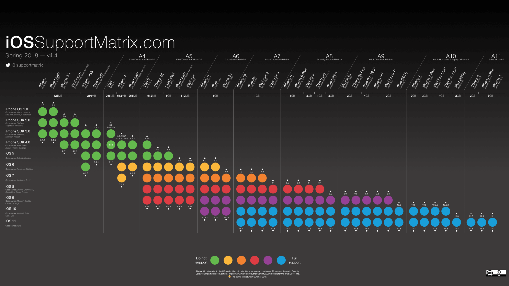
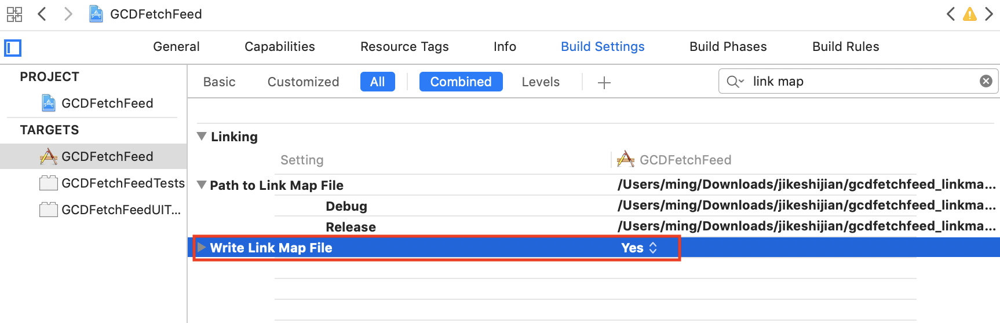
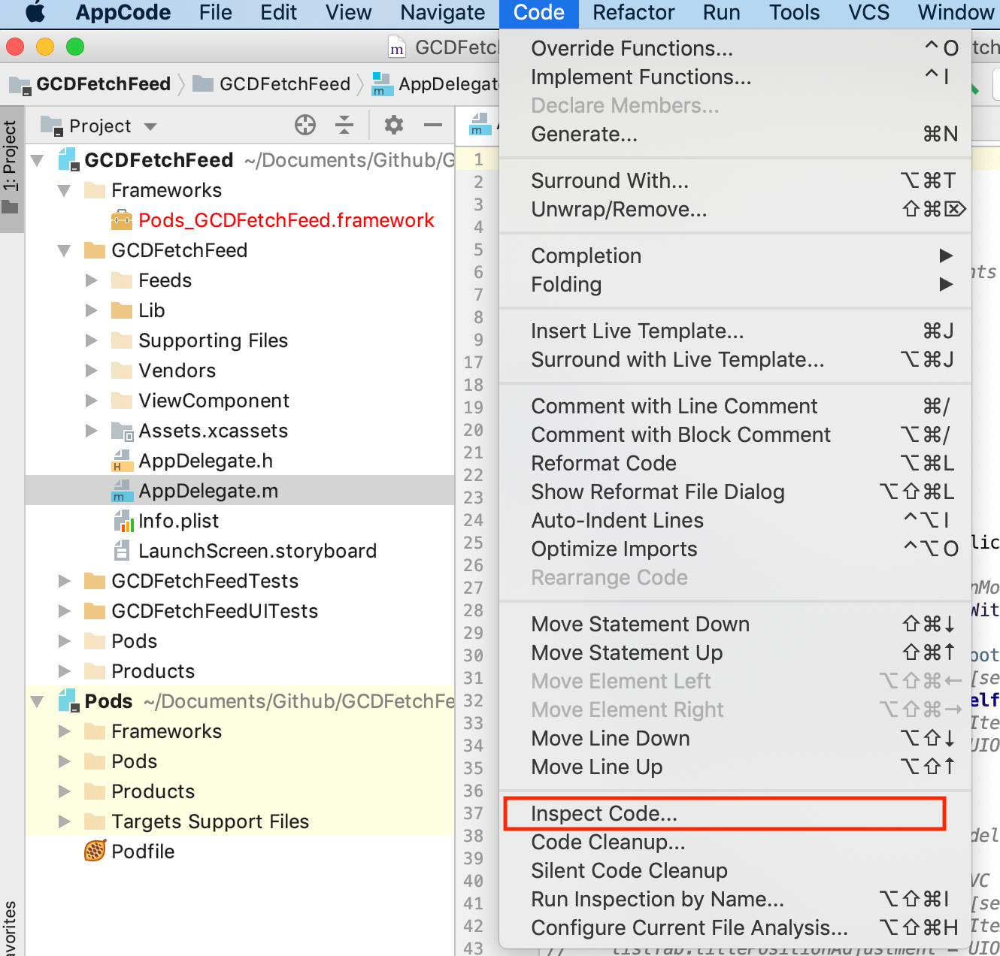
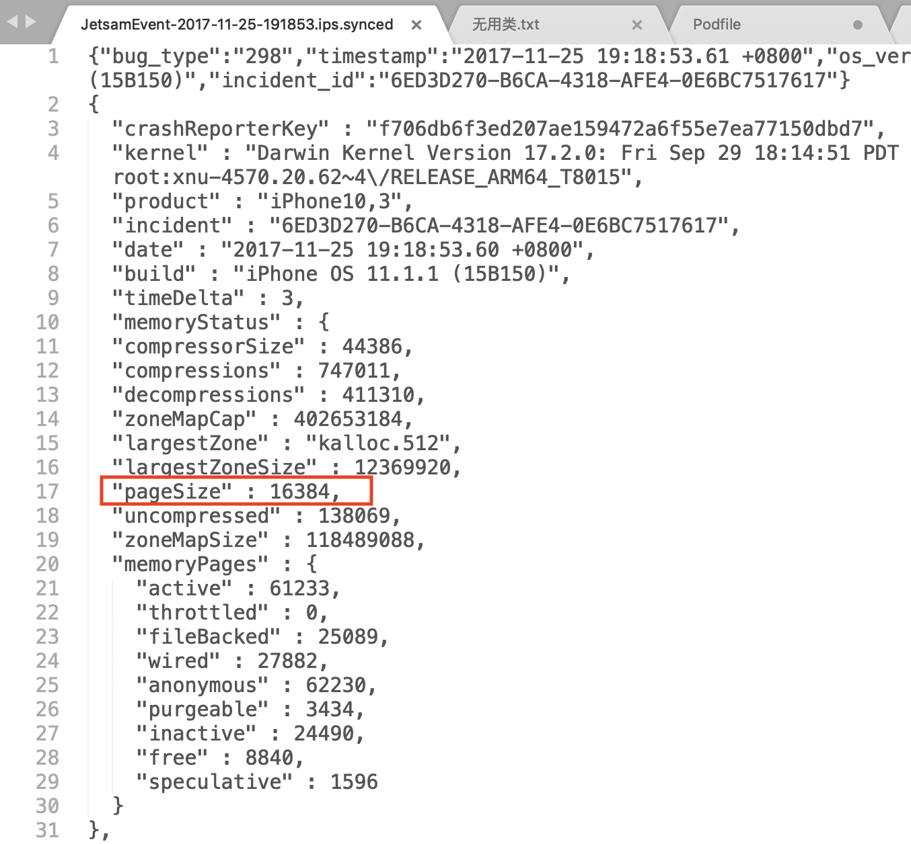
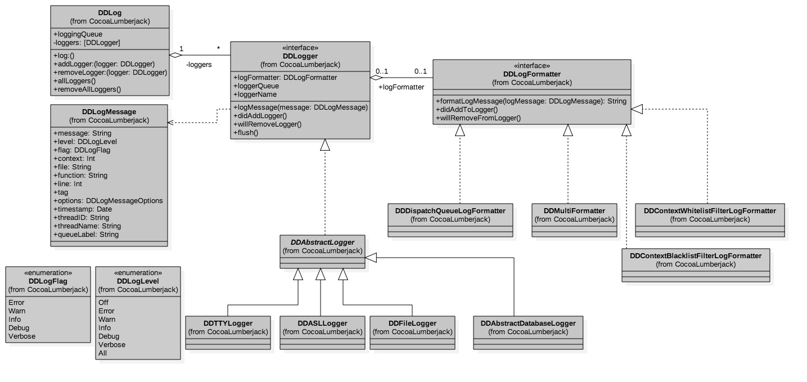
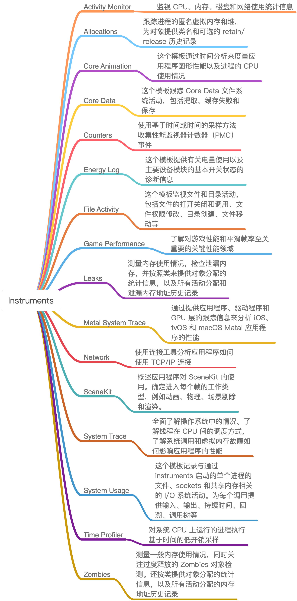
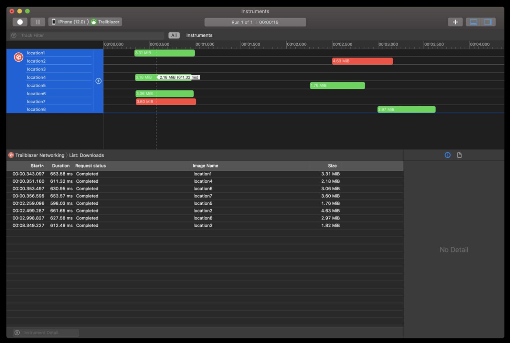

<head>
    
    
</head>

# Table of Contents

1.  [Algorithm](#orgcef5afa)
2.  [Review](#orge5a069e)
    1.  [包大小：如何从资源和代码层面实现全方位瘦身](#orgaad56e7)
        1.  [官方 App Thinning](#orgd790c68)
        2.  [无用图片资源](#orgc405c28)
        3.  [图片资源压缩](#org29ea6f0)
        4.  [代码瘦身](#org2799933)
    2.  [iOS 崩溃千奇百怪，如何全面监控](#org08f3495)
        1.  [我们先来看看信号可捕获的崩溃日志收集](#orgc7e853a)
        2.  [信号捕获不到的崩溃信息怎么收集](#orgd2dc2b6)
        3.  [采集到崩溃信息后如何分析并解决崩溃问题呢？](#org4f132cc)
    3.  [如何利用 RunLoop 原理去监控卡顿](#org4c1e879)
        1.  [RunLoop 原理](#org018c6b2)
        2.  [loop 的六个状态](#org840b55b)
        3.  [如何检查卡顿](#org88cdf54)
        4.  [如何获取卡顿的方法堆栈信息](#org02d90e3)
    4.  [临近 OOM，如何获取详细内存分配信息，分析内存问题](#org0a46080)
        1.  [通过 JetsamEvent 日志计算内存限制值](#org2508660)
        2.  [通过 XNU 获取内存限制值](#orgca47c86)
        3.  [通过内存警告获取内存限制值](#orgd65b8e8)
        4.  [定位内存问题信息收集](#orgc359611)
    5.  [日志监控：怎样获取 App 中的全量日志](#org6ca1d2b)
        1.  [获取 NSLog 的日志](#org2e64306)
        2.  [获取 CocoaLumberjack 日志](#org4ac0978)
    6.  [性能监控：衡量 App 质量的那把尺](#org3749eec)
        1.  [Instruments](#orgc892cb4)
        2.  [线上性能监控](#org8326eeb)
        3.  [CPU 使用率的线上监控方法](#org71b62e0)
        4.  [FPS 线上监控方法](#orgf78204f)
        5.  [内存使用量的线上监控方法](#org92a6335)
    7.  [远超你想象的多线程的那些坑](#org9d9ea44)
        1.  [常驻线程](#org1e88ea8)
        2.  [并发](#org38976b7)
        3.  [内存问题](#org18f7af1)
3.  [Tips](#orga86a7d1)
    1.  [简介](#org5a0f327)
    2.  [在 C++ 模板中编码图灵机](#org87b29ff)
    3.  [C++ 模板是图灵完备的](#orgc5ec997)
4.  [Share](#orgf0e372c)
    1.  [Hölder 指数形式](#org0179d3b)
    2.  [定义积分的形式](#org729b009)
    3.  [证明](#org2e129ba)

# Algorithm

Leetcode 818: Race Car: <https://leetcode.com/problems/race-car>

<https://dreamume.medium.com/leetcode-818-race-car-6d92b634893f>

# Review

iOS 开发高手课    戴铭

## 包大小：如何从资源和代码层面实现全方位瘦身

相信你的团队也曾遇到过或正在经历着对包大小进行优化的任务，特别是 App Store 规定了安装包大小超过 150MB 的 App 不能使用 OTA（over-the-air）环境下载，也就是只能在 WiFi 环境下下载。所以，150MB 就成了 App 的生死线，一旦超越了这条线就很有可能会失去大量用户

如果你的 App 要再兼容 iOS7 和 iOS8 的话，苹果 [官方规定](https://help.apple.com/app-store-connect/#/dev611e0a21f) 主二进制 text 段的大小不能超过 60MB。如果没有达到这个标准，你甚至都没法提交 App Store

而实际情况是，业务复杂的 App 轻轻松松就超过了 60MB。虽然我们可以通过静态库转动态库的方式来快速避免这个限制，但是静态库转动态库后，动态库的大小差不多会增加一倍，这样 150MB 的限制就更难守住

另外，App 包体积过大，对用户更新升级率也会有很大影响

### 官方 App Thinning

App Thinning 是由苹果公司推出的一项可以改善 App 下载进程的新技术，主要是为了解决用户下载 App 耗费过高流量的问题，同时还可以节省用户 iOS 设备的存储空间

App Thinning 会专门针对不同的设备来选择只适用于当前设备的内容以供下载。比如，iPhone 6 只会下载 2x 分辨率的图片资源，iPhone 6plus 则只会下载 3x 分辨率的图片资源

下图来自 [iOS Support Matrix](http://iossupportmatrix.com/)，列出来的是历来各个 iOS 设备的指令集详细矩阵分布。从中，我们可以一窥所有设备的芯片指令集以及支持的最高和最低 iOS 版本

使用 App Thinning 后，用户下载时就只会下载一个适合自己设备的芯片指令集架构文件

App Thinning 有三种方式，包括：App Slicing、Bitcode、On-Demand Resources

-   App Slicing，会在你向 iTunes Connect 上传 App 后，对 App 做切割，创建不同的变体，这样就可以适用到不同的设备
-   On-Demand Resources，主要是为游戏多关卡场景服务的。它会根据用户的关卡进度下载随后几个关卡的资源，并且已经过关的资源也会被删掉，这样就可以减少初装 App 的包大小
-   Bitcode ，是针对特定设备进行包大小优化，优化不明显

那么，如何在你项目里使用 App Thinning 呢？

其实，这里的大部分工作都是由 Xcode 和 App Store 来帮你完成的，你只需要通过 Xcode 添加 xcassets 目录，然后将图片添加进来即可

### 无用图片资源

图片资源的优化空间，主要体现在删除无用图片和图片资源压缩这两方面。而删除无用图片，又是其中最容易、最应该先做的。像代码瘦身这样难啃的骨头，我们就留在后面吧。那么，我们是如何找到并删除这些无用图片资源的呢？

删除无用图片的过程，可以概括为下面这 6 大步

1.  通过 find 命令获取 App 安装包中的所有资源文件，比如 find *Users/daiming/Project* -name
2.  设置用到的资源的类型，比如 jpg、gif、png、webp
3.  使用正则匹配在源码中找出使用到的资源名，比如 pattern = @"@"(.+?)""
4.  使用 find 命令找到的所有资源文件，再去掉代码中使用到的资源文件，剩下的就是无用资源了
5.  对于按照规则设置的资源名，我们需要在匹配使用资源的正则表达式里添加相应的规则，比如 @“image\_%d”
6.  确认无用资源后，就可以对这些无用资源执行删除操作了。这个删除操作，你可以使用 NSFileManger 系统类提供的功能来完成

如果你不想自己重新写一个工具的话，可以选择开源的工具直接使用。我觉得目前最好用的是 [LSUnusedResources](https://github.com/tinymind/LSUnusedResources)，特别是对于使用编号规则的图片来说，可以通过直接添加规则来处理

### 图片资源压缩

对于 App 来说，图片资源总会在安装包里占个大头儿。对它们最好的处理，就是在不损失图片质量的前提下尽可能地作压缩。目前比较好的压缩方案是，将图片转成 WebP

[WebP](https://developers.google.com/speed/webp/) 是 Google 公司的一个开源项目

首先，我们一起看看选择 WebP 的理由：

-   WebP 压缩率高，而且肉眼看不出差异，同时支持有损和无损两种压缩模式。比如，将 Gif 图转为 Animated WebP ，有损压缩模式下可减少 64% 大小，无损压缩模式下可减少 19% 大小
-   WebP 支持 Alpha 透明和 24-bit 颜色数，不会像 PNG8 那样因为色彩不够而出现毛边

接下来，我们再看看怎么把图片转成 WebP？
Google 公司在开源 WebP 的同时，还提供了一个图片压缩工具 [cwebp](https://developers.google.com/speed/webp/docs/precompiled) 来将其他图片转成 WebP。cwebp 使用起来也很简单，只要根据图片情况设置好参数就行

cwebp 语法如下

    cwebp [options] input_file -o output_file.webp

比如，你要选择无损压缩模式的话，可以使用如下所示的命令

    cwebp -lossless original.png -o new.webp

其中，-lossless 表示的是，要对输入的 png 图像进行无损编码，转成 WebP 图片。不使用 -lossless ，则表示有损压缩

在 cwebp 语法中，还有一个比较关键的参数 -q float

图片色值在不同情况下，可以选择用 -q 参数来进行设置，在不损失图片质量情况下进行最大化压缩

-   小于 256 色适合无损压缩，压缩率高，参数使用 -lossless -q 100
-   大于 256 色使用 75% 有损压缩，参数使用 -q 75
-   远大于 256 色使用 75% 以下压缩率，参数 -q 50 -m 6

除了 cwebp 工具外，你还可以选择由腾讯公司开发的 [iSparta](http://isparta.github.io/)。iSpart 是一个 GUI 工具，操作方便快捷，可以实现 PNG 格式转 WebP，同时提供批量处理和记录操作配置的功能。如果是其他格式的图片要转成 WebP 格式的话，需要先将其转成 PNG 格式，再转成 WebP 格式

图片压缩完了并不是结束，我们还需要在显示图片时使用 libwebp 进行解析。这里有一个 iOS 工程使用 libwebp 的范例，你可以点击 [链接](https://github.com/carsonmcdonald/WebP-iOS-example)

不过，WebP 在 CPU 消耗和解码时间上会比 PNG 高两倍。所以，我们有时候还需要在性能和体积上做取舍

我的建议是，如果图片大小超过了 100KB，你可以考虑使用 WebP；而小于 100KB 时，你可以使用网页工具 [TinyPng](https://tinypng.com/) 或者 GUI 工具 [ImageOptim](https://imageoptim.com/mac) 进行图片压缩。这两个工具的压缩率没有 WebP 那么高，不会改变图片压缩方式，所以解析时对性能损耗也不会增加

### 代码瘦身

可执行文件就是 Mach-O 文件，其大小是由代码量决定的。通常情况下，对可执行文件进行瘦身，就是找到并删除无用代码的过程。而查找无用代码时，我们可以按照找无用图片的思路，即：

-   首先，找出方法和类的全集
-   然后，找到使用过的方法和类
-   接下来，取二者的差集得到无用代码
-   最后，由人工确认无用代码可删除后，进行删除即可

1.  LinkMap 结合 Mach-O 找无用代码

    我们可以通过分析 LinkMap 来获得所有的代码类和方法的信息。获取 LinkMap 可以通过将 Build Setting 里的 Write Link Map File 设置为 Yes，然后指定 Path to Link Map File 的路径就可以得到每次编译后的 LinkMap 文件了。设置选项如下图所示
    
    
    
    LinkMap 文件分为三部分：Object File、Section 和 Symbols
    
    -   Object File 包含了代码工程的所有文件
    -   Section 描述了代码段在生成的 Mach-O 里的偏移位置和大小
    -   Symbols 会列出每个方法、类、block，以及它们的大小
    
    通过 LinkMap ，你不光可以统计出所有的方法和类，还能够清晰地看到代码所占包大小的具体分布，进而有针对性地进行代码优化
    
    得到了代码的全集信息以后，我们还需要找到已使用的方法和类，这样才能获取到差集，找出无用代码。所以接下来，我就先和你说说怎么通过 Mach-O 取到使用过的方法和类
    
    之前提过 iOS 的方法都会通过 objc_msgSend 来调用。而，objc_msgSend 在 Mach-O 文件里是通过 \__objc_selrefs 这个 section 来获取 selector 这个参数的
    
    所以，\__objc_selrefs 里的方法一定是被调用了的。\__objc_classrefs 里是被调用过的类，\__objc_superrefs 是调用过 super 的类。通过 \__objc_classrefs 和 \__objc_superrefs，我们就可以找出使用过的类和子类
    
    那么，Mach-O 文件的 \__objc_selrefs、\__objc_classrefs 和 \__objc_superrefs 怎么查看呢？
    
    我们可以使用 [MachOView](https://sourceforge.net/projects/machoview/) 来查看 Mach-O 文件里的信息。MachOView 同时也是一款开源软件，如果你对源码感兴趣的话，可以点击 [链接](https://github.com/gdbinit/MachOView)
    
    但是，这种查看方法并不是完美的，还会有些问题。原因在于， Objective-C 是门动态语言，方法调用可以写成在运行时动态调用，这样就无法收集全所有调用的方法和类。所以，我们通过这种方法找出的无用方法和类就只能作为参考，还需要二次确认

2.  通过 AppCode 找出无用代码

    用过不少工具，但效果其实都不是很好，都卡在了各种运用运行时调用方法的写法上。即使是大名鼎鼎的 AppCode 在这方面也做得不是很好，当代码量过百万行时 AppCode 的静态分析会“歇菜”
    
    但是，如果工程量不是很大的话，我还是建议你直接使用 AppCode 来做分析。毕竟代码量达到百万行的工程并不多。而，那些代码量达到百万行的团队，则会自己通过 Clang 静态分析来开发工具，去检查无用的方法和类
    
    用 AppCode 做分析的方法很简单，直接在 AppCode 里选择 Code->Inspect Code 就可以进行静态分析
    
    
    
    静态分析完以后，我们可以在 Unused code 里看到所有的无用代码
    
    -   无用类：Unused class 是无用类，Unused import statement 是无用类引入声明，Unused property 是无用的属性
    -   无用方法：Unused method 是无用的方法，Unused parameter 是无用参数，Unused instance variable 是无用的实例变量，Unused local variable 是无用的局部变量，Unused value 是无用的值
    -   无用宏：Unused macro 是无用的宏
    -   无用全局：Unused global declaration 是无用全局声明
    
    看似 AppCode 已经把所有工作都完成了，其实不然。下面，我再和你列举下 AppCode 静态检查的问题：
    
    -   JSONModel 里定义了未使用的协议会被判定为无用协议
    -   如果子类使用了父类的方法，父类的这个方法不会被认为使用了
    -   通过点的方式使用属性，该属性会被认为没有使用
    -   使用 performSelector 方式调用的方法也检查不出来，比如 self performSelector:@selector(arrivalRefreshTime)
    -   运行时声明类的情况检查不出来。比如通过 NSClassFromString 方式调用的类会被查出为没有使用的类，比如 layerClass = NSClassFromString(@“SMFloatLayer”)。还有以[[self class] accessToken] 这样不指定类名的方式使用的类，会被认为该类没有被使用。像 UITableView 的自定义的 Cell 使用 registerClass，这样的情况也会认为这个 Cell 没有被使用
    
    基于以上种种原因，使用 AppCode 检查出来的无用代码，还需要人工二次确认才能够安全删除掉

3.  运行时检查类是否真正被使用过

    即使你使用 LinkMap 结合 Mach-O 或者 AppCode 的方式，通过静态检查已经找到并删除了无用的代码，那么就能说包里完全没有无用的代码了吗?
    
    实际上，在 App 的不断迭代过程中，新人不断接手、业务功能需求不断替换，会留下很多无用代码。这些代码在执行静态检查时会被用到，但是线上可能连这些老功能的入口都没有了，更是没有机会被用户用到。也就是说，这些无用功能相关的代码也是可以删除的
    
    那么，我们要怎么检查出这些无用代码呢？
    
    通过 ObjC 的 runtime 源码，我们可以找到怎么判断一个类是否初始化过的函数，如下：
    
        #define RW_INITIALIZED (1<<29)
        bool isInitialized() {
           return getMeta()->data()->flags & RW_INITIALIZED;
        }
    
    isInitialized 的结果会保存到元类的 class_rw_t 结构体的 flags 信息里，flags 的 1<<29 位记录的就是这个类是否初始化了的信息。而 flags 的其他位记录的信息，你可以参看 objc runtime 的源码，如下：
    
        // 类的方法列表已修复
        #define RW_METHODIZED         (1<<30)
        
        // 类已经初始化了
        #define RW_INITIALIZED        (1<<29)
        
        // 类在初始化过程中
        #define RW_INITIALIZING       (1<<28)
        
        // class_rw_t->ro 是 class_ro_t 的堆副本
        #define RW_COPIED_RO          (1<<27)
        
        // 类分配了内存，但没有注册
        #define RW_CONSTRUCTING       (1<<26)
        
        // 类分配了内存也注册了
        #define RW_CONSTRUCTED        (1<<25)
        
        // GC：class有不安全的finalize方法
        #define RW_FINALIZE_ON_MAIN_THREAD (1<<24)
        
        // 类的 +load 被调用了
        #define RW_LOADED             (1<<23)
    
    flags 采用位方式记录布尔值的方式，易于扩展、所用存储空间小、检索性能也好。所以，经常阅读优秀代码，特别有助于提高我们自己的代码质量
    
    具体编写运行时无用类检查工具时，我们可以在线下测试环节去检查所有类，先查出哪些类没有初始化，然后上线后针对那些没有初始化的类进行多版本监测观察，看看哪些是在主流程外个别情况下会用到的，判断合理性后进行二次确认，最终得到真正没有用到的类并删掉

## iOS 崩溃千奇百怪，如何全面监控

KVO 问题、NSNotification 线程问题、数组越界、野指针等崩溃信息，是可以通过信号捕获的。但是，像后台任务超时、内存被打爆、主线程卡顿超阈值等信息，是无法通过信号捕捉到的

### 我们先来看看信号可捕获的崩溃日志收集

收集崩溃日志最简单的方法，就是打开 Xcode 的菜单选择 Product -> Archive

然后，在提交时选上“Upload your app’s symbols to receive symbolicated reports from Apple”，以后你就可以直接在 Xcode 的 Archive 里看到符号化后的崩溃日志了

但是这种查看日志的方式，每次都是纯手工的操作，而且时效性较差。所以，目前很多公司的崩溃日志监控系统，都是通过 [PLCrashReporter](https://github.com/microsoft/plcrashreporter) 这样的第三方开源库捕获崩溃日志，然后上传到自己服务器上进行整体监控的

而没有服务端开发能力，或者对数据不敏感的公司，则会直接使用 [Fabric](https://get.fabric.io/) 或者 [Bugly](https://bugly.qq.com/v2/) 来监控崩溃

通过注册 signalHandler 来捕获到。其实现代码，如下所示：

    void registerSignalHandler(void) {
        signal(SIGSEGV, handleSignalException);
        signal(SIGFPE, handleSignalException);
        signal(SIGBUS, handleSignalException);
        signal(SIGPIPE, handleSignalException);
        signal(SIGHUP, handleSignalException);
        signal(SIGINT, handleSignalException);
        signal(SIGQUIT, handleSignalException);
        signal(SIGABRT, handleSignalException);
        signal(SIGILL, handleSignalException);
    }
    
    void handleSignalException(int signal) {
        NSMutableString *crashString = [[NSMutableString alloc]init];
        void* callstack[128];
        int i, frames = backtrace(callstack, 128);
        char** traceChar = backtrace_symbols(callstack, frames);
        for (i = 0; i <frames; ++i) {
            [crashString appendFormat:@"%s\n", traceChar[i]];
        }
        NSLog(crashString);
    }

上面这段代码对各种信号都进行了注册，捕获到异常信号后，在处理方法 handleSignalException 里通过 backtrace_symbols 方法就能获取到当前的堆栈信息。堆栈信息可以先保存在本地，下次启动时再上传到崩溃监控服务器就可以了

### 信号捕获不到的崩溃信息怎么收集

先介绍下 iOS 后台保活的 5 种方式：Background Mode、Background Fetch、Silent Push、PushKit、Background Task

-   使用 Background Mode 方式的话，App Store 在审核时会提高对 App 的要求。通常情况下，只有那些地图、音乐播放、VoIP 类的 App 才能通过审核
-   Background Fetch 方式的唤醒时间不稳定，而且用户可以在系统里设置关闭这种方式，导致它的使用场景很少
-   Silent Push 是推送的一种，会在后台唤起 App 30 秒。它的优先级很低，会调用 application:didReceiveRemoteNotifiacation:fetchCompletionHandler: 这个 delegate，和普通的 remote push notification 推送调用的 delegate 是一样的
-   PushKit 后台唤醒 App 后能够保活 30 秒。它主要用于提升 VoIP 应用的体验
-   Background Task 方式，是使用最多的。App 退后台后，默认都会使用这种方式

接下来，我们就看一下，Background Task 方式为什么是使用最多的，它可以解决哪些问题？

在你的程序退到后台以后，只有几秒钟的时间可以执行代码，接下来就会被系统挂起。进程挂起后所有线程都会暂停，不管这个线程是文件读写还是内存读写都会被暂停。但是，数据读写过程无法暂停只能被中断，中断时数据读写异常而且容易损坏文件，所以系统会选择主动杀掉 App 进程

而 Background Task 这种方式，就是系统提供了 beginBackgroundTaskWithExpirationHandler 方法来延长后台执行时间，可以解决你退后台后还需要一些时间去处理一些任务的诉求

Background Task 方式的使用方法，如下面这段代码所示：

    - (void)applicationDidEnterBackground:(UIApplication *)application {
        self.backgroundTaskIdentifier = [application beginBackgroundTaskWithExpirationHandler:^( void) {
            [self yourTask];
        }];
    }

在这段代码中，yourTask 任务最多执行 3 分钟，3 分钟内 yourTask 运行完成，你的 App 就会挂起。 如果 yourTask 在 3 分钟之内没有执行完的话，系统会强制杀掉进程，从而造成崩溃，这就是为什么 App 退后台容易出现崩溃的原因

后台崩溃造成的影响是未知的。持久化存储的数据出现了问题，就会造成你的 App 无法正常使用

接下来，我们再看看第二个问题：如何避免后台崩溃呢？

你知道了， App 退后台后，如果执行时间过长就会导致被系统杀掉。那么，如果我们要想避免这种崩溃发生的话，就需要严格控制后台数据的读写操作。比如，你可以先判断需要处理的数据的大小，如果数据过大，也就是在后台限制时间内或延长后台执行时间后也处理不完的话，可以考虑在程序下次启动或后台唤醒时再进行处理

同时，App 退后台后，这种由于在规定时间内没有处理完而被系统强制杀掉的崩溃，是无法通过信号被捕获到的。这也说明了，随着团队规模扩大，要想保证 App 高可用的话，后台崩溃的监控就尤为重要了

那么，我们又应该怎么去收集退后台后超过保活阈值而导致信号捕获不到的那些崩溃信息呢？

采用 Background Task 方式时，我们可以根据 beginBackgroundTaskWithExpirationHandler 会让后台保活 3 分钟这个阈值，先设置一个计时器，在接近 3 分钟时判断后台程序是否还在执行。如果还在执行的话，我们就可以判断该程序即将后台崩溃，进行上报、记录，以达到监控的效果

还有哪些信号捕获不到的崩溃情况？怎样监控其他无法通过信号捕获的崩溃信息？

其他捕获不到的崩溃情况还有很多，主要就是内存打爆和主线程卡顿时间超过阈值被 watchdog 杀掉这两种情况

其实，监控这两类崩溃的思路和监控后台崩溃类似，我们都先要找到它们的阈值，然后在临近阈值时还在执行的后台程序，判断为将要崩溃，收集信息并上报

对于内存打爆信息的收集，你可以采用内存映射（mmap）的方式来保存现场。主线程卡顿时间超过阈值这种情况，你只要收集当前线程的堆栈信息就可以了

### 采集到崩溃信息后如何分析并解决崩溃问题呢？

我们采集到的崩溃日志，主要包含的信息为：进程信息、基本信息、异常信息、线程回溯

-   进程信息：崩溃进程的相关信息，比如崩溃报告唯一标识符、唯一键值、设备标识
-   基本信息：崩溃发生的日期、iOS 版本
-   异常信息：异常类型、异常编码、异常的线程
-   线程回溯：崩溃时的方法调用栈

通常情况下，我们分析崩溃日志时最先看的是异常信息，分析出问题的是哪个线程，在线程回溯里找到那个线程；然后，分析方法调用栈，符号化后的方法调用栈可以完整地看到方法调用的过程，从而知道问题发生在哪个方法的调用上

一些被系统杀掉的情况，我们可以通过异常编码来分析。你可以在维基百科上，查看 [完整的异常编码](https://en.wikipedia.org/wiki/Hexspeak)。这里列出了 44 种异常编码，但常见的就是如下三种

-   0x8badf00d，表示 App 在一定时间内无响应而被 watchdog 杀掉的情况
-   0xdeadfa11，表示 App 被用户强制退出
-   0xc00010ff，表示 App 因为运行造成设备温度太高而被杀掉

## 如何利用 RunLoop 原理去监控卡顿

导致卡顿问题的几种原因:

-   复杂 UI 、图文混排的绘制量过大
-   在主线程上做网络同步请求
-   在主线程做大量的 IO 操作
-   运算量过大，CPU 持续高占用
-   死锁和主子线程抢锁

### RunLoop 原理

对于 iOS 开发来说，监控卡顿就是要去找到主线程上都做了哪些事儿。我们都知道，线程的消息事件是依赖于 NSRunLoop 的，所以从 NSRunLoop 入手，就可以知道主线程上都调用了哪些方法。我们通过监听 NSRunLoop 的状态，就能够发现调用方法是否执行时间过长，从而判断出是否会出现卡顿

所以，我推荐的监控卡顿的方案是：通过监控 RunLoop 的状态来判断是否会出现卡顿

RunLoop 这个对象，在 iOS 里由 CFRunLoop 实现。简单来说，RunLoop 是用来监听输入源，进行调度处理的。这里的输入源可以是输入设备、网络、周期性或者延迟时间、异步回调。RunLoop 会接收两种类型的输入源：一种是来自另一个线程或者来自不同应用的异步消息；另一种是来自预订时间或者重复间隔的同步事件

RunLoop 的目的是，当有事件要去处理时保持线程忙，当没有事件要处理时让线程进入休眠。所以，了解 RunLoop 原理不光能够运用到监控卡顿上，还可以提高用户的交互体验。通过将那些繁重而不紧急会大量占用 CPU 的任务（比如图片加载），放到空闲的 RunLoop 模式里执行，就可以避开在 UITrackingRunLoopMode 这个 RunLoop 模式时是执行。UITrackingRunLoopMode 是用户进行滚动操作时会切换到的 RunLoop 模式，避免在这个 RunLoop 模式执行繁重的 CPU 任务，就能避免影响用户交互操作上体验

接下来，我就通过 CFRunLoop 的源码来跟你分享下 RunLoop 的原理

第一步

通知 observers：RunLoop 要开始进入 loop 了。紧接着就进入 loop。代码如下：

    //通知 observers
    if (currentMode->_observerMask & kCFRunLoopEntry ) 
        __CFRunLoopDoObservers(runloop, currentMode, kCFRunLoopEntry);
    //进入 loop
    result = __CFRunLoopRun(rl, currentMode, seconds, returnAfterSourceHandled, previousMode);

第二步

开启一个 do while 来保活线程。通知 Observers：RunLoop 会触发 Timer 回调、Source0 回调，接着执行加入的 block。代码如下：

    // 通知 Observers RunLoop 会触发 Timer 回调
    if (currentMode->_observerMask & kCFRunLoopBeforeTimers)
        __CFRunLoopDoObservers(runloop, currentMode, kCFRunLoopBeforeTimers);
    // 通知 Observers RunLoop 会触发 Source0 回调
    if (currentMode->_observerMask & kCFRunLoopBeforeSources)
        __CFRunLoopDoObservers(runloop, currentMode, kCFRunLoopBeforeSources);
    // 执行 block
    __CFRunLoopDoBlocks(runloop, currentMode);

接下来，触发 Source0 回调，如果有 Source1 是 ready 状态的话，就会跳转到 handle_msg 去处理消息。代码如下：

    if (MACH_PORT_NULL != dispatchPort ) {
        Boolean hasMsg = __CFRunLoopServiceMachPort(dispatchPort, &msg)
        if (hasMsg) goto handle_msg;
    }

第三步

回调触发后，通知 Observers：RunLoop 的线程将进入休眠（sleep）状态。代码如下：

    Boolean poll = sourceHandledThisLoop || (0ULL == timeout_context->termTSR);
    if (!poll && (currentMode->_observerMask & kCFRunLoopBeforeWaiting)) {
        __CFRunLoopDoObservers(runloop, currentMode, kCFRunLoopBeforeWaiting);
    }

第四步

进入休眠后，会等待 mach_port 的消息，以再次唤醒。只有在下面四个事件出现时才会被再次唤醒

-   基于 port 的 Source 事件
-   Timer 时间到
-   RunLoop 超时
-   被调用者唤醒

等待唤醒的代码如下：

    do {
        __CFRunLoopServiceMachPort(waitSet, &msg, sizeof(msg_buffer), &livePort) {
            // 基于 port 的 Source 事件、调用者唤醒
            if (modeQueuePort != MACH_PORT_NULL && livePort == modeQueuePort) {
                break;
            }
            // Timer 时间到、RunLoop 超时
            if (currentMode->_timerFired) {
                break;
            }
    } while (1);

第五步

唤醒时通知 Observer：RunLoop 的线程刚刚被唤醒了。代码如下：

    if (!poll && (currentMode->_observerMask & kCFRunLoopAfterWaiting))
        __CFRunLoopDoObservers(runloop, currentMode, kCFRunLoopAfterWaiting);

第六步

RunLoop 被唤醒后就要开始处理消息了：

-   如果是 Timer 时间到的话，就触发 Timer 的回调
-   如果是 dispatch 的话，就执行 block
-   如果是 source1 事件的话，就处理这个事件

消息执行完后，就执行加到 loop 里的 block。代码如下：

    handle_msg:
    // 如果 Timer 时间到，就触发 Timer 回调
    if (msg-is-timer) {
        __CFRunLoopDoTimers(runloop, currentMode, mach_absolute_time())
    } 
    // 如果 dispatch 就执行 block
    else if (msg_is_dispatch) {
        __CFRUNLOOP_IS_SERVICING_THE_MAIN_DISPATCH_QUEUE__(msg);
    } 
    
    // Source1 事件的话，就处理这个事件
    else {
        CFRunLoopSourceRef source1 = __CFRunLoopModeFindSourceForMachPort(runloop, currentMode, livePort);
        sourceHandledThisLoop = __CFRunLoopDoSource1(runloop, currentMode, source1, msg);
        if (sourceHandledThisLoop) {
            mach_msg(reply, MACH_SEND_MSG, reply);
        }
    }

第七步

根据当前 RunLoop 的状态来判断是否需要走下一个 loop。当被外部强制停止或 loop 超时时，就不继续下一个 loop 了，否则继续走下一个 loop 。代码如下：

    if (sourceHandledThisLoop && stopAfterHandle) {
         // 事件已处理完
        retVal = kCFRunLoopRunHandledSource;
    } else if (timeout) {
        // 超时
        retVal = kCFRunLoopRunTimedOut;
    } else if (__CFRunLoopIsStopped(runloop)) {
        // 外部调用者强制停止
        retVal = kCFRunLoopRunStopped;
    } else if (__CFRunLoopModeIsEmpty(runloop, currentMode)) {
        // mode 为空，RunLoop 结束
        retVal = kCFRunLoopRunFinished;
    }

整个 RunLoop 过程，我们可以总结为如下所示的一张图片

这里只列出了 CFRunLoop 的关键代码，你可以点击 [链接](https://opensource.apple.com/source/CF/CF-1153.18/CFRunLoop.c.auto.html) 查看完整代码

### loop 的六个状态

通过对 RunLoop 原理的分析，我们可以看出在整个过程中，loop 的状态包括 6 个，其代码定义如下：

    typedef CF_OPTIONS(CFOptionFlags, CFRunLoopActivity) {
        kCFRunLoopEntry , // 进入 loop
        kCFRunLoopBeforeTimers , // 触发 Timer 回调
        kCFRunLoopBeforeSources , // 触发 Source0 回调
        kCFRunLoopBeforeWaiting , // 等待 mach_port 消息
        kCFRunLoopAfterWaiting ), // 接收 mach_port 消息
        kCFRunLoopExit , // 退出 loop
        kCFRunLoopAllActivities  // loop 所有状态改变
    }

如果 RunLoop 的线程，进入睡眠前方法的执行时间过长而导致无法进入睡眠，或者线程唤醒后接收消息时间过长而无法进入下一步的话，就可以认为是线程受阻了

所以，如果我们要利用 RunLoop 原理来监控卡顿的话，就是要关注这两个阶段。RunLoop 在进入睡眠之前和唤醒后的两个 loop 状态定义的值，分别是 kCFRunLoopBeforeSources 和 kCFRunLoopAfterWaiting ，也就是要触发 Source0 回调和接收 mach_port 消息两个状态

接下来，我们就一起分析一下，如何对 loop 的这两个状态进行监听，以及监控的时间值如何设置才合理

### 如何检查卡顿

要想监听 RunLoop，你就首先需要创建一个 CFRunLoopObserverContext 观察者，代码如下：

    CFRunLoopObserverContext context = {0,(__bridge void*)self,NULL,NULL};
    runLoopObserver = CFRunLoopObserverCreate(kCFAllocatorDefault,kCFRunLoopAllActivities,YES,0,&runLoopObserverCallBack,&context);

将创建好的观察者 runLoopObserver 添加到主线程 RunLoop 的 common 模式下观察。然后，创建一个持续的子线程专门用来监控主线程的 RunLoop 状态

一旦发现进入睡眠前的 kCFRunLoopBeforeSources 状态，或者唤醒后的状态 kCFRunLoopAfterWaiting，在设置的时间阈值内一直没有变化，即可判定为卡顿。接下来，我们就可以 dump 出堆栈的信息，从而进一步分析出具体是哪个方法的执行时间过长

开启一个子线程监控的代码如下：

    //创建子线程监控
    dispatch_async(dispatch_get_global_queue(0, 0), ^{
        //子线程开启一个持续的 loop 用来进行监控
        while (YES) {
            long semaphoreWait = dispatch_semaphore_wait(dispatchSemaphore, dispatch_time(DISPATCH_TIME_NOW, 3 * NSEC_PER_SEC));
            if (semaphoreWait != 0) {
                if (!runLoopObserver) {
                    timeoutCount = 0;
                    dispatchSemaphore = 0;
                    runLoopActivity = 0;
                    return;
                }
                //BeforeSources 和 AfterWaiting 这两个状态能够检测到是否卡顿
                if (runLoopActivity == kCFRunLoopBeforeSources || runLoopActivity == kCFRunLoopAfterWaiting) {
                    //将堆栈信息上报服务器的代码放到这里
                } //end activity
            }// end semaphore wait
            timeoutCount = 0;
        }// end while
    });

代码中的 NSEC_PER_SEC，代表的是触发卡顿的时间阈值，单位是秒。可以看到，我们把这个阈值设置成了 3 秒。那么，这个 3 秒的阈值是从何而来呢？这样设置合理吗？

其实，触发卡顿的时间阈值，我们可以根据 WatchDog 机制来设置。WatchDog 在不同状态下设置的不同时间，如下所示：

-   启动（Launch）：20s
-   恢复（Resume）：10s
-   挂起（Suspend）：10s
-   退出（Quit）：6s
-   后台（Background）：3min（在 iOS 7 之前，每次申请 10min； 之后改为每次申请 3min，可连续申请，最多申请到 10min）

通过 WatchDog 设置的时间，我认为可以把启动的阈值设置为 10 秒，其他状态则都默认设置为 3 秒。总的原则就是，要小于 WatchDog 的限制时间。当然了，这个阈值也不用小得太多，原则就是要优先解决用户感知最明显的体验问题

### 如何获取卡顿的方法堆栈信息

子线程监控发现卡顿后，还需要记录当前出现卡顿的方法堆栈信息，并适时推送到服务端供开发者分析，从而解决卡顿问题。那么，在这个过程中，如何获取卡顿的方法堆栈信息呢？

获取堆栈信息的一种方法是直接调用系统函数。这种方法的优点在于，性能消耗小。但是，它只能够获取简单的信息，也没有办法配合 dSYM 来获取具体是哪行代码出了问题，而且能够获取的信息类型也有限。这种方法，因为性能比较好，所以适用于观察大盘统计卡顿情况，而不是想要找到卡顿原因的场景

直接调用系统函数方法的主要思路是：用 signal 进行错误信息的获取。具体代码如下：

    static int s_fatal_signals[] = {
        SIGABRT,
        SIGBUS,
        SIGFPE,
        SIGILL,
        SIGSEGV,
        SIGTRAP,
        SIGTERM,
        SIGKILL,
    };
    
    static int s_fatal_signal_num = sizeof(s_fatal_signals) / sizeof(s_fatal_signals[0]);
    
    void UncaughtExceptionHandler(NSException *exception) {
        NSArray *exceptionArray = [exception callStackSymbols]; //得到当前调用栈信息
        NSString *exceptionReason = [exception reason];       //非常重要，就是崩溃的原因
        NSString *exceptionName = [exception name];           //异常类型
    }
    
    void SignalHandler(int code)
    {
        NSLog(@"signal handler = %d",code);
    }
    
    void InitCrashReport()
    {
        //系统错误信号捕获
        for (int i = 0; i < s_fatal_signal_num; ++i) {
            signal(s_fatal_signals[i], SignalHandler);
        }
    
        //oc未捕获异常的捕获
        NSSetUncaughtExceptionHandler(&UncaughtExceptionHandler);
    }
    
    int main(int argc, char * argv[]) {
        @autoreleasepool {
            InitCrashReport();
            return UIApplicationMain(argc, argv, nil, NSStringFromClass([AppDelegate class]));

另一种方法是，直接用 PLCrashReporter 这个开源的第三方库来获取堆栈信息。这种方法的特点是，能够定位到问题代码的具体位置，而且性能消耗也不大。所以，也是我推荐的获取堆栈信息的方法

具体如何使用 PLCrashReporter 来获取堆栈信息，代码如下所示：

    // 获取数据
    NSData *lagData = [[[PLCrashReporter alloc]
                                              initWithConfiguration:[[PLCrashReporterConfig alloc] initWithSignalHandlerType:PLCrashReporterSignalHandlerTypeBSD symbolicationStrategy:PLCrashReporterSymbolicationStrategyAll]] generateLiveReport];
    // 转换成 PLCrashReport 对象
    PLCrashReport *lagReport = [[PLCrashReport alloc] initWithData:lagData error:NULL];
    // 进行字符串格式化处理
    NSString *lagReportString = [PLCrashReportTextFormatter stringValueForCrashReport:lagReport withTextFormat:PLCrashReportTextFormatiOS];
    //将字符串上传服务器
    NSLog(@"lag happen, detail below: \n %@",lagReportString);

搜集到卡顿的方法堆栈信息以后，就是由开发者来分析并解决卡顿问题了

在今天这篇文章中，我们用到的从监控卡顿到收集卡顿问题信息的完整代码，你都可以点击 [链接](https://github.com/ming1016/DecoupleDemo/blob/master/DecoupleDemo/SMLagMonitor.m) 查看

## 临近 OOM，如何获取详细内存分配信息，分析内存问题

JetSam 机制，指的就是操作系统为了控制内存资源过度使用而采用的一种资源管控机制

### 通过 JetsamEvent 日志计算内存限制值

想要了解不同机器在不同系统版本的情况下，对 App 的内存限制是怎样的，有一种方法就是查看手机中以 JetsamEvent 开头的系统日志（我们可以从设置 -> 隐私 -> 分析中看到这些日志）

在这些系统日志中，查找崩溃原因时我们需要关注 per-process-limit 部分的 rpages。rpages 表示的是 ，App 占用的内存页数量；per-process-limit 表示的是，App 占用的内存超过了系统对单个 App 的内存限制

这部分日志的结构如下：

    "rpages" : 89600,
    "reason" : "per-process-limit",

现在，我们已经知道了内存页数量 rpages 为 89600，只要再知道内存页大小的值，就可以计算出系统对单个 App 限制的内存是多少了

内存页大小的值，我们也可以在 JetsamEvent 开头的系统日志里找到，也就是 pageSize 的值。如下图红框部分所示：

可以看到，内存页大小 pageSize 的值是 16384。接下来，我们就可以计算出当前 App 的内存限制值：pageSize \* rpages / 1024 /1024 =16384 \* 89600 / 1024 / 1024 得到的值是 1400 MB，即 1.4G

这些 JetsamEvent 日志，都是系统在杀掉 App 后留在手机里的。在查看这些日志时，我们就会发现，很多日志都是 iOS 系统内核强杀掉那些优先级不高，并且占用的内存超过限制的 App 后留下的

这些日志属于系统级的，会存在系统目录下。App 上线后开发者是没有权限获取到系统目录内容的，也就是说，被强杀掉的 App 是无法获取到系统级日志的，只能线下设备通过连接 Xcode 获取到这部分日志。获取到 Jetsam 后，就能够算出系统对 App 设置的内存限制值

那么，iOS 系统是怎么发现 Jetsam 的呢？

iOS 系统会开启优先级最高的线程 vm_pressure_monitor 来监控系统的内存压力情况，并通过一个堆栈来维护所有 App 的进程。另外，iOS 系统还会维护一个内存快照表，用于保存每个进程内存页的消耗情况

当监控系统内存的线程发现某 App 内存有压力了，就发出通知，内存有压力的 App 就会去执行对应的代理，也就是你所熟悉的 didReceiveMemoryWarning 代理。通过这个代理，你可以获得最后一个编写逻辑代码释放内存的机会。这段代码的执行，就有可能会避免你的 App 被系统强杀

系统在强杀 App 前，会先做优先级判断。那么，这个优先级判断的依据是什么呢？

iOS 系统内核里有一个数组，专门用于维护线程的优先级。这个优先级规定就是：内核用线程的优先级是最高的，操作系统的优先级其次，App 的优先级排在最后。并且，前台 App 程序的优先级是高于后台运行 App 的；线程使用优先级时，CPU 占用多的线程的优先级会被降低

iOS 系统在因为内存占用原因强杀掉 App 前，至少有 6 秒钟的时间可以用来做优先级判断。同时，JetSamEvent 日志也是在这 6 秒内生成的

除了 JetSamEvent 日志外，我们还可以通过 XNU 来获取内存的限制值

### 通过 XNU 获取内存限制值

在 XNU 中，有专门用于获取内存上限值的函数和宏。我们可以通过 memorystatus_priority_entry 这个结构体，得到进程的优先级和内存限制值。结构体代码如下：

    typedef struct memorystatus_priority_entry {
      pid_t pid;
      int32_t priority;
      uint64_t user_data;
      int32_t limit;
      uint32_t state;
    } memorystatus_priority_entry_t;

在这个结构体中，priority 表示的是进程的优先级，limit 就是我们想要的进程内存限制值

### 通过内存警告获取内存限制值

通过 XNU 的宏获取内存限制，需要有 root 权限，而 App 内的权限是不够的，所以正常情况下，作为 App 开发者你是看不到这个信息的。那么，如果你不想越狱去获取这个权限的话，还可以利用 didReceiveMemoryWarning 这个内存压力代理事件来动态地获取内存限制值

iOS 系统在强杀掉 App 之前还有 6 秒钟的时间，足够你去获取记录内存信息了。那么，如何获取当前内存使用情况呢？

iOS 系统提供了一个函数 task_info， 可以帮助我们获取到当前任务的信息。关键代码如下：

    struct mach_task_basic_info info;
    mach_msg_type_number_t size = sizeof(info);
    kern_return_t kl = 
      task_info(mach_task_self(), 
                MACH_TASK_BASIC_INFO, 
                (task_info_t)&info, &size);

代码中，task_info_t 结构里包含了一个 resident_size 字段，用于表示使用了多少内存。这样，我们就可以获取到发生内存警告时，当前 App 占用了多少内存。代码如下：

    float used_mem = info.resident_size;
    NSLog(@"使用了 %f MB 内存", used_mem / 1024.0f / 1024.0f)

### 定位内存问题信息收集

现在，我们已经可以通过三种方法来获取内存上限值了，而且通过内存警告的方式还能够动态地获取到这个值。有了这个内存上限值以后，你就可以进行内存问题的信息收集工作了

要想精确地定位问题，我们就需要 dump 出完整的内存信息，包括所有对象及其内存占用值，在内存接近上限值的时候，收集并记录下所需信息，并在合适的时机上报到服务器里，方便分析问题

获取到了每个对象的内存占用量还不够，你还需要知道是谁分配的内存，这样才可以精确定位到问题的关键所在。一个对象可能会在不同的函数里被分配了内存并被创建了出来，当这个对象内存占用过大时，如果不知道是在哪个函数里创建的话，问题依然很难精确定位出来。那么，怎样才能知道是谁分配的内存呢？

这个问题，我觉得应该从根儿上去找答案。内存分配函数 malloc 和 calloc 等默认使用的是 nano_zone。nano_zone 是 256B 以下小内存的分配，大于 256B 的时候会使用 scalable_zone 来分配

在这里，我主要是针对大内存的分配监控，所以只针对 scalable_zone 进行分析，同时也可以过滤掉很多小内存分配监控。比如，malloc 函数用的是 malloc_zone_malloc，calloc 用的是 malloc_zone_calloc

使用 scalable_zone 分配内存的函数都会调用 malloc_logger 函数，因为系统总是需要有一个地方来统计并管理内存的分配情况

具体实现的话，你可以查看 malloc_zone_malloc 函数的实现，代码如下：

    void *malloc_zone_malloc(malloc_zone_t *zone, size_t size) {
      MALLOC_TRACE(TRACE_malloc | DBG_FUNC_START, (uintptr_t)zone, size, 0, 0);
      void *ptr;
      if (malloc_check_start && (malloc_check_counter++ >= malloc_check_start)) {
        internal_check();
      }
      if (size > MALLOC_ABSOLUTE_MAX_SIZE) {
        return NULL;
      }
      ptr = zone->malloc(zone, size);
      // 在 zone 分配完内存后就开始使用 malloc_logger 进行进行记录
      if (malloc_logger) {
        malloc_logger(MALLOC_LOG_TYPE_ALLOCATE | MALLOC_LOG_TYPE_HAS_ZONE,
                      (uintptr_t)zone, 
                      (uintptr_t)size, 
                      0, 
                      (uintptr_t)ptr, 
                      0);
      }
      MALLOC_TRACE(TRACE_malloc | DBG_FUNC_END, (uintptr_t)zone, size, (uintptr_t)ptr, 0);
    
      return ptr;
    }

其他使用 scalable_zone 分配内存的函数的方法也类似，所有大内存的分配，不管外部函数是怎么包装的，最终都会调用 malloc_logger 函数。这样的话，问题就好解决了，你可以使用 fishhook 去 Hook 这个函数，加上自己的统计记录就能够通盘掌握内存的分配情况。出现问题时，将内存分配记录的日志捞上来，你就能够跟踪到导致内存不合理增大的原因了

## 日志监控：怎样获取 App 中的全量日志

### 获取 NSLog 的日志

它的作用是，输出信息到标准的 Error 控制台和系统日志（syslog）中。在内部实现上，它其实使用的是 ASL（Apple System Logger，是苹果公司自己实现的一套输出日志的接口）的 API，将日志消息直接存储在磁盘上

那么，我们如何才能获取到通过 ASL 存放在系统日志中的日志呢？

ASL 会提供接口去查找所有的日志，通过 [CocoaLumberjack](https://github.com/CocoaLumberjack/CocoaLumberjack) 这个第三方日志库里的 DDASLLogCapture 这个类，我们可以找到实时捕获 NSLog 的方法。DDASLLogCapture 会在 start 方法里开启一个异步全局队列去捕获 ASL 存储的日志。start 方法的代码如下

    + (void)start {
        //...
        dispatch_async(dispatch_get_global_queue(DISPATCH_QUEUE_PRIORITY_DEFAULT, 0), ^(void) {
            [self captureAslLogs];
        });
    }

可以看出，捕获 ASL 存储日志的主要处理都在 captureAslLogs 方法里。在日志被保存到 ASL 的数据库时，syslogd（系统里用于接收分发日志消息的日志守护进程） 会发出一条通知。因为发过来的这一条通知可能会有多条日志，所以还需要先做些合并的工作，将多条日志进行合并。具体的实现，你可以查看 captureAslLogs 方法的实现，关键代码如下：

    + (void)captureAslLogs {
        @autoreleasepool {
          // ...
            notify_register_dispatch(kNotifyASLDBUpdate, &notifyToken, dispatch_get_global_queue(DISPATCH_QUEUE_PRIORITY_HIGH, 0),^(int token) {
                @autoreleasepool {
                    ...
                    // 利用进程标识兼容在模拟器情况时其他进程日志无效通知
                    [self configureAslQuery:query];
    
                    // 迭代处理所有新日志
                    aslmsg msg;
                    aslresponse response = asl_search(NULL, query);
    
                    while ((msg = asl_next(response))) {
                        // 记录日志
                        [self aslMessageReceived:msg];
    
                        lastSeenID = (unsigned long long)atoll(asl_get(msg, ASL_KEY_MSG_ID));
                    }
                    asl_release(response);
                    asl_free(query);
    
                    if (_cancel) {
                        notify_cancel(token);
                        return;
                    }
                }
            });

在上面这段代码中，notify_register_dispatch 的作用是用来注册进程间的系统通知。其中，kNotifyASLDBUpdate 宏表示的就是，日志被保存到 ASL 数据库时发出的跨进程通知，其键值是 com.apple.system.logger.message

既然是跨进程通知，那么多个 App 之间也是可以进行通知的。不过对于 iPhone 来说，多个 App 同时保活的机会太少，所以一般都是接收系统功能发出的通知

在 iOS 系统中，类似地把日志保存到 ASL 数据库时发出的通知还有很多种，比如键值是 com.apple.system.lowdiskspace 的 kNotifyVFSLowDiskSpace 宏，该通知是在系统磁盘空间不足时发出的。当捕获到这个通知时，你可以去清理缓存空间，避免发生缓存写入磁盘失败的情况

更多的跨进程通知宏，你可以在 notify_keys.h 里看到，终端查看命令如下：

    cat /usr/include/notify_keys.h

接下来，我继续和你说说 captureAslLogs 方法，看看 captureAslLogs 是怎么处理 ASL 日志的

在 captureAslLogs 方法里，处理日志的方法是 aslMessageReceived，入参是 aslmsg 类型，由于 aslmsg 类型不是字符串类型，无法直接查看。所以在 aslMessageReceived 方法的开始阶段，会使用 asl_get 方法将其转换为 char 字符串类型。类型转换代码如下：

    const char* messageCString = asl_get( msg, ASL_KEY_MSG );

接下来，char 字符串会被转换成 NSString 类型，NSString 是 Objective-C 里字符串类型，转成 NSString 更容易在 Objective-C 里使用

    NSString *message = @(messageCString);

因为 CocoaLumberjack 的日志最后都是通过 DDLog:log:message: 方法进行记录的，其中 message 参数的类型是 DDLogMessage，所以 NSString 类型还需要转换成 DDLogMessage 类型

因为 DDLogMessage 类型包含了日志级别，所以转换类型后还需要设置日志的级别。CocoaLumberjack 这个第三方日志库，将捕获到的 NSLog 日志的级别设置为了 Verbose。那为什么要这么设置呢？

CocoaLumberjack 的日志级别，包括两类：

-   第一类是 Verbose 和 Debug ，属于调试级
-   第二类是 Info、Warn、Error ，属于正式级，适用于记录更重要的信息，是需要持久化存储的。特别是，Error 可以理解为严重级别最高

将日志级别定义为 Verbose，也只是基于 CocoaLumberjack 对 NSLog 日志的理解。其实，NSLog 是被苹果公司专门定义为记录错误信息的：

Logs an error message to the Apple System Log facility.

接下来我们再看看如何通过 DDLog 使用 DDLogMessage 作为参数添加一条 ASL 日志。下面是 DDLog 记录 ASL 日志相关的代码：

    DDLogMessage *logMessage = 
      [[DDLogMessage alloc] initWithMessage:message 
                                      level:_captureLevel 
                                       flag:flag 
                                    context:0 
                                       file:@"DDASLLogCapture" 
                                   function:nil 
                                       line:0 
                                        tag:nil 
                                     option:0 
                                  timestamp:timeStamp];
    [DDLog log:async message:logMessage]

到这里，通过 ASL 获取 NSLog 日志的过程你就应该很清楚了。你可以直接使用 CocoaLumberjack 这个库通过 [DDASLLogCapture start] 捕获所有 NSLog 的日志

你现在已经清楚了 CocoaLumberjack 的捕获原理和方法，如果不想引入这个第三方库的话，也可以按照它的思路写个简化版的工具出来，只要这个工具能够把日志记录下来，并且能够在出现问题的时候，把日志上传到服务器，方便我们进行问题的追踪和定位即可

为了使日志更高效，更有组织，在 iOS 10 之后，使用了新的统一日志系统（Unified Logging System）来记录日志，全面取代 ASL 的方式。以下是官方原话：

Unified logging is available in iOS 10.0 and later, macOS 10.12 and later, tvOS 10.0 and later, and watchOS 3.0 and later, and supersedes ASL (Apple System Logger) and the Syslog APIs. Historically, log messages were written to specific locations on disk, such as /etc/system.log. The unified logging system stores messages in memory and in a data store, rather than writing to text-based log files

接下来，我们就看看 iOS 10 之后，如何来获取 NSLog 日志

统一日志系统的方式，是把日志集中存放在内存和数据库里，并提供单一、高效和高性能的接口去获取系统所有级别的消息传递

macOS 10.12 开始使用了统一日志系统，我们通过控制台应用程序或日志命令行工具，就可以查看到日志消息

但是，新的统一日志系统没有 ASL 那样的接口可以让我们取出全部日志，所以为了兼容新的统一日志系统，你就需要对 NSLog 日志的输出进行重定向

对 NSLog 进行重定向，我们首先想到的就是采用 Hook 的方式。因为 NSLog 本身就是一个 C 函数，而不是 Objective-C 方法，所以我们就可以使用 fishhook 来完成重定向的工作。具体的实现代码如下所示：

    static void (&orig_nslog)(NSString *format, ...);
    
    void redirect_nslog(NSString *format, ...) {
        // 可以在这里先进行自己的处理
    
        // 继续执行原 NSLog
        va_list va;
        va_start(va, format);
        NSLogv(format, va);
        va_end(va);
    }
    
    int main(int argc, const char * argv[]) {
        @autoreleasepool {
            struct rebinding nslog_rebinding = {"NSLog",redirect_nslog,(void*)&orig_nslog};
    
            NSLog(@"try redirect nslog %@,%d",@"is that ok?");
        }
        return

可以看到，我在上面这段代码中，利用了 fishhook 对方法的符号地址进行了重新绑定，从而只要是 NSLog 的调用就都会转向 redirect_nslog 方法调用

在 redirect_nslog 方法中，你可以先进行自己的处理，比如将日志的输出重新输出到自己的持久化存储系统里，接着调用 NSLog 也会调用的 NSLogv 方法进行原 NSLog 方法的调用。当然了，你也可以使用 fishhook 提供的原方法调用方式 orig_nslog，进行原 NSLog 方法的调用。上面代码里也已经声明了类 orig_nslog，直接调用即可

NSLog 最后写文件时的句柄是 STDERR，我先前跟你说了苹果对于 NSLog 的定义是记录错误的信息，STDERR 的全称是 standard error，系统错误日志都会通过 STDERR 句柄来记录，所以 NSLog 最终将错误日志进行写操作的时候也会使用 STDERR 句柄，而 dup2 函数是专门进行文件重定向的，那么也就有了另一个不使用 fishhook 还可以捕获 NSLog 日志的方法。你可以使用 dup2 重定向 STDERR 句柄，使得重定向的位置可以由你来控制，关键代码如下：

    int fd = open(path, (O_RDWR | O_CREAT), 0644);
    dup2(fd, STDERR_FILENO);

其中，path 就是你自定义的重定向输出的文件地址

这样，我们就能够获取到各个系统版本的 NSLog 了。那么，通过其他方式打的日志，我们怎么才能获取到呢？

现在与日志相关的第三方库里面，使用最多的就是 CocoaLumberjack。而且，其他的很多第三库的思路也和 CocoaLumberjack 类似，都是直接在 CocoaLumberjack 的基础上包装了一层，增加了统一管控力和易用性而已

接下来，我们就先看看 CocoaLumberjack 的整体架构是怎样的，进而找到获取 CocoaLumberjack 所有日志的方法

### 获取 CocoaLumberjack 日志

CocoaLumberjack 主要由 DDLog、DDLoger、DDLogFormatter 和 DDLogMessage 四部分组成，其整体架构如下图所示：

在这其中，DDLog 是个全局的单例类，会保存 DDLogger 协议的 logger；DDLogFormatter 用来格式化日志的格式；DDLogMessage 是对日志消息的一个封装；DDLogger 协议是由 DDAbstractLogger 实现的。logger 都是继承于 DDAbstractLogger：

-   日志输出到控制台是通过 DDTTYLogger 实现的
-   DDASLLogger 就是用来捕获 NSLog 记录到 ASL 数据库的日志
-   DDAbstractDatabaseLogger 是数据库操作的抽象接口
-   DDFileLogger 是用来保存日志到文件的，还提供了返回 CocoaLumberjack 日志保存文件路径的方法，使用方法如下：
    
        DDFileLogger *fileLogger = [[DDFileLogger alloc] init];
        NSString *logDirectory = [fileLogger.logFileManager logsDirectory];
    
    其中，logDirectory 方法可以获取日志文件的目录路径。有了目录以后，我们就可以获取到目录下所有的 CocoaLumberjack 的日志了，也就达到了我们要获取 CocoaLumberjack 所有日志的目的

## 性能监控：衡量 App 质量的那把尺

通常情况下，App 的性能问题虽然不会导致 App 不可用，但依然会影响到用户体验。如果这个性能问题不断累积，达到临界点以后，问题就会爆发出来。这时，影响到的就不仅仅是用户了，还有负责 App 开发的你

为了能够主动、高效地发现性能问题，避免 App 质量进入无人监管的失控状态，我们就需要对 App 的性能进行监控。目前，对 App 的性能监控，主要是从线下和线上两个维度展开

### Instruments

除了对各种性能问题进行监控外，最新版本的 Instruments 10 还有以下两大优势：

-   Instruments 基于 os_signpost 架构，可以支持所有平台
-   Instruments 由于标准界面（Standard UI）和分析核心（Analysis Core）技术，使得我们可以非常方便地进行自定义性能监测工具的开发。当你想要给 Instruments 内置的工具换个交互界面，或者新创建一个工具的时候，都可以通过自定义工具这个功能来实现

从整体架构来看，Instruments 包括 Standard UI 和 Analysis Core 两个组件，它的所有工具都是基于这两个组件开发的。而且，你如果要开发自定义的性能分析工具的话，完全基于这两个组件就可以实现

开发一款自定义 Instruments 工具，主要包括以下这几个步骤：

1.  在 Xcode 中，点击 File > New > Project
2.  在弹出的 Project 模板选择界面，将其设置为 macOS
3.  选择 Instruments Package，点击后即可开始自定义工具的开发了

经过上面的三步之后，会在新创建的工程里面生成一个.instrpkg 文件，接下来的开发过程主要就是对这个文件的配置工作了。这些配置工作中最主要的是要完成 Standard UI 和 Analysis Core 的配置

上面这些内容，就是你在开发一个自定义 Instruments 工具时，需要完成的编码工作了。可以看到，Instruments 10 版本的自定义工具开发还是比较简单的。与此同时，苹果公司还提供了大量的代码片段，帮助你进行个性化的配置。你可以 [链接](https://help.apple.com/instruments/developer/mac/current/)，查看官方指南中的详细教程

如果你想要更好地进行个性化定制，就还需要再了解 Instruments 收集和处理数据的机制，也就是分析核心（Analysis Core ）的工作原理

Analysis Core 收集和处理数据的过程，可以大致分为以下这三步：

1.  处理我们配置好的各种数据表，并申请存储空间 store
2.  store 去找数据提供者，如果不能直接找到，就会通过 Modeler 接收其他 store 的输入信号进行合成
3.  store 获得数据源后，会进行 Binding Solution 工作来优化数据处理过程

这里需要强调的是，在我们通过 store 找到的这些数据提供者中，对开发者来说最重要的就是 os_signpost。os_signpost 的主要作用，是让你可以在程序中通过编写代码来获取数据。你可以在工程中的任何地方通过 os_signpost API ，将需要的数据提供给 Analysis Core

苹果公司在 WWDC 2018 Session 410 [Creating Custom Instruments](https://developer.apple.com/videos/play/wwdc2018/410) 里提供了一个范例：通过 os_signpost API 将图片下载的数据提供给 Analysis Core 进行监控观察。这个示例在 App 的代码如下所示： 

    os_signpost(.begin, 
                log: parsinglog, 
                name:"Parsing", "Parsing started SIZE:%ld", data.count)
    // Decode the JSON we just downloaded
    let result = try jsonDecoder.decode(Trail.self, from: data)
    os_signpost(.end, log: parsingLog, name:"Parsing", "Parsing finished")

需要注意的是，上面代码中，os_signpost 的 begin 和 end 需要成对出现

上面这段代码就是使用 os_signpost 的 API 获取了程序里的数据。接下来，我们再看看 Instruments 是如何通过配置数据表来使用这些数据的。配置的数据表的 XML 设计如下所示：

    <os-signpost-interval-schema>
    <id>json-parse</id>
    <title>Image Download</title>
    <subsystem>"com.apple.trailblazer</subsystem>
    <category>"Networking</category>
    <name>"Parsing"</name>
    <start-pattern>
    <message>"Parsing started SIZE:" ?data-size</message> 
    </start-pattern>
    <column>
    <mnemonic>data-size</mnemonic>
    <title>JSON Data Size</title>
    <type>size-in-bytes</type>
    <expression>?data-size</expression>
    </column>
    </os-signpost-interval-schema>

这里，我们配置数据表是要对数据输出进行可视化配置，从而可以将代码中的数据展示出来。如下图所示，就是对下载图片大小监控的效果

通过上面的分析我们可以看到，Instruments 10 通过提供 os_signpost API 的方式使得开发者监控自定义的性能指标时更方便，从而解决了在此之前只能通过重新建设工具来完成的问题。并且，Instruments 通过 XML 标准数据接口解耦展示和数据分析的思路，也非常值得我们借鉴和学习

在线下性能监控中，Instruments 可以说是王者，但却对线上监控无能为力。那么，对于线上的性能监控，我们应该怎么实现呢？

### 线上性能监控

对于线上性能监控，我们需要先明白两个原则：

1.  监控代码不要侵入到业务代码中
2.  采用性能消耗最小的监控方案

线上性能监控，主要集中在 CPU 使用率、FPS 的帧率和内存这三个方面。接下来，我们就分别从这三个方面展开讨论吧

### CPU 使用率的线上监控方法

App 作为进程运行起来后会有多个线程，每个线程对 CPU 的使用率不同。各个线程对 CPU 使用率的总和，就是当前 App 对 CPU 的使用率。明白了这一点以后，我们也就摸清楚了对 CPU 使用率进行线上监控的思路

在 iOS 系统中，你可以在 usr/include/mach/thread_info.h 里看到线程基本信息的结构体，其中的 cpu_usage 就是 CPU 使用率。结构体的完整代码如下所示：

    struct thread_basic_info {
      time_value_t    user_time;     // 用户运行时长
      time_value_t    system_time;   // 系统运行时长
      integer_t       cpu_usage;     // CPU 使用率
      policy_t        policy;        // 调度策略
      integer_t       run_state;     // 运行状态
      integer_t       flags;         // 各种标记
      integer_t       suspend_count; // 暂停线程的计数
      integer_t       sleep_time;    // 休眠的时间
    };

因为每个线程都会有这个 thread_basic_info 结构体，所以接下来的事情就好办了，你只需要定时（比如，将定时间隔设置为 2s）去遍历每个线程，累加每个线程的 cpu_usage 字段的值，就能够得到当前 App 所在进程的 CPU 使用率了。实现代码如下：

    + (integer_t)cpuUsage {
        thread_act_array_t threads; //int 组成的数组比如 thread[1] = 5635
        mach_msg_type_number_t threadCount = 0; //mach_msg_type_number_t 是 int 类型
        const task_t thisTask = mach_task_self();
        //根据当前 task 获取所有线程
        kern_return_t kr = task_threads(thisTask, &threads, &threadCount);
    
        if (kr != KERN_SUCCESS) {
            return 0;
        }
    
        integer_t cpuUsage = 0;
        // 遍历所有线程
        for (int i = 0; i < threadCount; i++) {
    
            thread_info_data_t threadInfo;
            thread_basic_info_t threadBaseInfo;
            mach_msg_type_number_t threadInfoCount = THREAD_INFO_MAX;
    
            if (thread_info((thread_act_t)threads[i], 
                            THREAD_BASIC_INFO, 
                            (thread_info_t)threadInfo, &threadInfoCount) == KERN_SUCCESS) {
                // 获取 CPU 使用率
                threadBaseInfo = (thread_basic_info_t)threadInfo;
                if (!(threadBaseInfo->flags & TH_FLAGS_IDLE)) {
                    cpuUsage += threadBaseInfo->cpu_usage;
                }
            }
        }
        assert(vm_deallocate(mach_task_self(), 
                             (vm_address_t)threads, 
                             threadCount * sizeof(thread_t)) == KERN_SUCCESS);
        return cpuUsage;
    }

### FPS 线上监控方法

FPS 是指图像连续在显示设备上出现的频率。FPS 低，表示 App 不够流畅，还需要进行优化

但是，和前面对 CPU 使用率和内存使用量的监控不同，iOS 系统中没有一个专门的结构体，用来记录与 FPS 相关的数据。但是，对 FPS 的监控也可以比较简单的实现：通过注册 CADisplayLink 得到屏幕的同步刷新率，记录每次刷新时间，然后就可以得到 FPS。具体的实现代码如下：

    - (void)start {
        self.dLink = [CADisplayLink displayLinkWithTarget:self selector:@selector(fpsCount:)];
        [self.dLink addToRunLoop:[NSRunLoop mainRunLoop] forMode:NSRunLoopCommonModes];
    }
    
    // 方法执行帧率和屏幕刷新率保持一致
    - (void)fpsCount:(CADisplayLink *)displayLink {
        if (lastTimeStamp == 0) {
            lastTimeStamp = self.dLink.timestamp;
        } else {
            total++;
            // 开始渲染时间与上次渲染时间差值
            NSTimeInterval useTime = self.dLink.timestamp - lastTimeStamp;
            if (useTime < 1) return;
            lastTimeStamp = self.dLink.timestamp;
            // fps 计算
            fps = total / useTime; 
            total = 0;
        }
    }

### 内存使用量的线上监控方法

通常情况下，我们在获取 iOS 应用内存使用量时，都是使用 task_basic_info 里的 resident_size 字段信息。但是，我们发现这样获得的内存使用量和 Instruments 里看到的相差很大。后来，在 2018 WWDC Session 416 [iOS Memory Deep Dive](https://developer.apple.com/videos/play/wwdc2018/416/) 中，苹果公司介绍说 phys_footprint 才是实际使用的物理内存

内存信息存在 task_info.h （完整路径 usr/include/mach/task.info.h）文件的 task_vm_info 结构体中，其中 phys_footprint 就是物理内存的使用，而不是驻留内存 resident_size。结构体里和内存相关的代码如下：

    struct task_vm_info {
      mach_vm_size_t  virtual_size;       // 虚拟内存大小
      integer_t region_count;             // 内存区域的数量
      integer_t page_size;
      mach_vm_size_t  resident_size;      // 驻留内存大小
      mach_vm_size_t  resident_size_peak; // 驻留内存峰值
    
      // ...
    
      /* added for rev1 */
      mach_vm_size_t  phys_footprint;     // 物理内存
    
      // ...
    };

OK，类似于对 CPU 使用率的监控，我们只要从这个结构体里取出 phys_footprint 字段的值，就能够监控到实际物理内存的使用情况了。具体实现代码如下：

    uint64_t memoryUsage() {
        task_vm_info_data_t vmInfo;
        mach_msg_type_number_t count = TASK_VM_INFO_COUNT;
        kern_return_t result = 
            task_info(mach_task_self(), TASK_VM_INFO, (task_info_t) &vmInfo, &count);
        if (result != KERN_SUCCESS)
            return 0;
        return vmInfo.phys_footprint;
    }

## 远超你想象的多线程的那些坑

### 常驻线程

常驻线程，指的就是那些不会停止，一直存在于内存中的线程。我们在文章开始部分，说到的 AFNetworking 2.0 专门创建了一个线程来接收 NSOperationQueue 的回调，这个线程其实就是一个常驻线程。接下来，我们就看看常驻线程这个问题是如何引起的，以及是否有对应的解决方案

我们先通过 AFNetworking 2.0 创建常驻线程的代码，来看一下这个线程是怎么创建的

    + (void)networkRequestThreadEntryPoint:(id)__unused object {
        @autoreleasepool {
            // 先用 NSThread 创建了一个线程
            [[NSThread currentThread] setName:@"AFNetworking"];
            // 使用 run 方法添加 runloop
            NSRunLoop *runLoop = [NSRunLoop currentRunLoop];
            [runLoop addPort:[NSMachPort port] forMode:NSDefaultRunLoopMode];
            [runLoop run];
        }
    }

AFNetworking 2.0 先用 NSThread 创建了一个线程，并使用 NSRunLoop 的 run 方法给这个新线程添加了一个 runloop

这里我需要先和你说明白一个问题，通过 NSRunLoop 添加 runloop 的方法有三个：

-   run 方法。通过 run 方法添加的 runloop ，会不断地重复调用 runMode:beforeDate: 方法，来保证自己不会停止
-   runUntilDate: 和 runMode:beforeDate 方法。这两个方法添加的 runloop，可以通过指定时间来停止 runloop

NSURLConnection 发起请求后，所在的线程需要一直存活，以等待接收 NSURLConnectionDelegate 回调方法。但是，网络返回的时间不确定，所以这个线程就需要一直常驻在内存中。为了不干扰主线程，于是创建了一个常驻线程

但是，AFNetworking 在 3.0 版本时，使用苹果公司新推出的 NSURLSession 替换了 NSURLConnection，从而避免了常驻线程这个坑。NSURLSession 可以指定回调 NSOperationQueue，这样请求就不需要让线程一直常驻在内存里去等待回调了。实现代码如下：

    self.operationQueue = [[NSOperationQueue alloc] init];
    self.operationQueue.maxConcurrentOperationCount = 1;
    self.session = 
      [NSURLSession sessionWithConfiguration:self.sessionConfiguration 
                                    delegate:self 
                               delegateQueue:self.operationQueue];

如果你需要确实需要保活线程一段时间的话，可以选择使用 NSRunLoop 的另外两个方法 runUntilDate: 和 runMode:beforeDate，来指定线程的保活时长。让线程存活时间可预期，总比让线程常驻，至少在硬件资源利用率这点上要更加合理

或者，你还可以使用 CFRunLoopRef 的 CFRunLoopRun 和 CFRunLoopStop 方法来完成 runloop 的开启和停止，达到将线程保活一段时间的目的

### 并发

使用 GCD 在进行数据读写操作时，总是需要一段时间来等待磁盘响应的，如果在这个时候通过 GCD 发起了一个任务，那么 GCD 就会本着最大化利用 CPU 的原则，会在等待磁盘响应的这个空档，再创建一个新线程来保证能够充分利用 CPU

而如果 GCD 发起的这些新任务，都是类似于数据存储这样需要等待磁盘响应的任务的话，那么随着任务数量的增加，GCD 创建的新线程就会越来越多，从而导致内存资源越来越紧张，等到磁盘开始响应后，再读取数据又会占用更多的内存。结果就是，失控的内存占用会引起更多的内存问题

[FMDB](https://github.com/ccgus/fmdb) 是一个开源的第三方数据库框架，通过 FMDatabaseQueue 这个核心类，将与读写数据库相关的磁盘操作都放到一个串行队列里执行，从而避免了线程创建过多导致系统资源紧张的情况

FMDatabaseQueue 使用起来也很简单，示例代码如下

    // 标记文章已读
    - (RACSignal *)markFeedItemAsRead:(NSUInteger)iid fid:(NSUInteger)fid{
        @weakify(self);
        return [RACSignal createSignal:^RACDisposable *(id<RACSubscriber> subscriber) {
            @strongify(self);
            // 改写成 FMDatabaseQueue 串行队列进行数据库操作
            FMDatabaseQueue *queue = 
              [FMDatabaseQueue databaseQueueWithPath:self.feedDBPath];
            [queue inDatabase:^(FMDatabase *db) {
                FMResultSet *rs = [FMResultSet new];
                // 读取文章数据
                if (fid == 0) {
                    rs = [db executeQuery:@"select * from feeditem where isread = ? and iid >= ? order by iid desc", @(0), @(iid)];
                } else {
                    rs = [db executeQuery:@"select * from feeditem where isread = ? and iid >= ? and fid = ? order by iid desc", @(0), @(iid), @(fid)];
                }
                NSUInteger count = 0;
                while ([rs next]) {
                    count++;
                }
                // 更新文章状态为已读
                if (fid == 0) {
                    [db executeUpdate:@"update feeditem set isread = ? where iid >= ?", @(1), @(iid)];
                } else {
                    [db executeUpdate:@"update feeditem set isread = ? where iid >= ? and fid = ?", @(1), @(iid), @(fid)];
                }
    
                [subscriber sendNext:@(count)];
                [subscriber sendCompleted];
                [db close];
            }];
    
            return nil;
        }];
    }

### 内存问题

创建线程的过程，需要用到物理内存，CPU 也会消耗时间。而且，新建一个线程，系统还需要为这个进程空间分配一定的内存作为线程堆栈。堆栈大小是 4KB 的倍数。在 iOS 开发中，主线程堆栈大小是 1MB，新创建的子线程堆栈大小是 512KB

除了内存开销外，线程创建得多了，CPU 在切换线程上下文时，还会更新寄存器，更新寄存器的时候需要寻址，而寻址的过程还会有较大的 CPU 消耗

所以，线程过多时内存和 CPU 都会有大量的消耗，从而导致 App 整体性能降低，使得用户体验变成差。CPU 和内存的使用超出系统限制时，甚至会造成系统强杀。这种情况对用户和 App 的伤害就更大了

# Tips

C++ Templates are Turing Complete

<https://rtraba.files.wordpress.com/2015/05/cppturing.pdf>

## 简介

C++ 模板已知可以在编译期执行复杂的计算。第一个例子是 Erwin Unruh 在编译期计算素数的一个小程序，在本文中我们将展示一个 C++ 模板是图灵完备的证明。我们假设读者已熟悉 C++ 模板和计算的基本理论。证明是非常直接的：我们显示任意图灵机如何嵌入在 C++ 模板实例机制中

## 在 C++ 模板中编码图灵机

一个图灵机是一个四元组 $ (K, \\sum, \\delta, s) $，K 是一个有限状态集，$ \\sum $ 是一个字母表，$ s \\in K $ 是开始的状态，$ \\delta $ 是转换函数 $ K \\times \\sum \\to ( K \\cup \\{ h \\}) \\times (\\sum \\cup \\{\\Leftarrow, \\Rightarrow\\}) $。特殊状态 h 是挂起状态，$ \\Leftarrow, \\Rightarrow $ 是特殊符号表示左边和右边，且 $ \\# \\in \\sum $ 是空白符号

为阐述一个图灵机如何编码为一个 C++ 模板元程序，我们使用一个例子，一个替换字符串中 a 字符为 # 号且然后挂起

$ K = \\{q_ {0}, q_ {1}, h \\} $

$ \\sum = \\{a, \\# \\} $

$ s = q_ {0} $

<table border="2" cellspacing="0" cellpadding="6" rules="groups" frame="hsides">

<colgroup>
<col  class="org-left" />

<col  class="org-left" />

<col  class="org-left" />
</colgroup>
<thead>
<tr>
<th scope="col" class="org-left">q</th>
<th scope="col" class="org-left">σ</th>
<th scope="col" class="org-left">δ(q, σ)</th>
</tr>
</thead>

<tbody>
<tr>
<td class="org-left">q0</td>
<td class="org-left">a</td>
<td class="org-left">(q1, #)</td>
</tr>

<tr>
<td class="org-left">q0</td>
<td class="org-left">#</td>
<td class="org-left">(h, #)</td>
</tr>

<tr>
<td class="org-left">q1</td>
<td class="org-left">a</td>
<td class="org-left">(q0, a)</td>
</tr>

<tr>
<td class="org-left">q1</td>
<td class="org-left">#</td>
<td class="org-left">(q0, =&gt;)</td>
</tr>
</tbody>
</table>

我们编码 K 状态集和字母表 $ \\sum \\cup \\{\\Leftarrow, \\Rightarrow\\} $ 为空 C++ 类型：

    // States
    struct Halt {};
    struct Q0 {};
    struct Q1 {};
    
    // Alphabet
    struct Left {};
    struct Right {};
    struct A {};
    struct Blank {};

为编码磁带，我们使用一个标准函数式列表

    // Tape representation
    struct Nil { };
    template<class Head, class Tail>
    struct Pair {
      typedef Head head;
      typedef Tail tail;
    };

使用这些类，磁带 a#a 编码为 C++ 类型 Pair<A, Pair<Blank, Pair<A, Nil>>>。为表示在磁带上特殊位置的图灵机位置，我们分隔磁带为三部分：左边，当前磁带单元的内容和右边。这样 $ abc \\underline{d} e $，图灵机位于 d，将表达为三元组 (abc, d, e)。为提供方便访问磁带单元到读头的左边，左边磁带的内容以反向的顺序存储。这样磁带 $ abc \\underline{d} e $ 被编码为三个类型：

<table border="2" cellspacing="0" cellpadding="6" rules="groups" frame="hsides">

<colgroup>
<col  class="org-left" />

<col  class="org-left" />
</colgroup>
<tbody>
<tr>
<td class="org-left">abc</td>
<td class="org-left">Pair&lt;C, Pair&lt;B, Pair&lt;A, Nil&gt;&gt;&gt;</td>
</tr>

<tr>
<td class="org-left">d</td>
<td class="org-left">D</td>
</tr>

<tr>
<td class="org-left">e</td>
<td class="org-left">Pair&lt;E, Nil&gt;</td>
</tr>
</tbody>
</table>

转换函数 $ \\delta(q, \\sigma) $ 从当前状态 q 和磁带单元 $ \\sigma $ 的内容映射到后续状态和行为（字符写为 $ \\Leftarrow $ 或 $ \\Rightarrow $）。为在模板中实现 $ \\delta $，我们提供一个模板类 TransitionFunction<State, Character> 的特化。在每个实例中有对 next_state 和 action 的 typedefs，其编码下一个状态和行为

    // Transition Function
    template<typename State, typename Character>
    struct TransitionFunction {};
    
    // q0 a -> (q1, #)
    template<> struct TransitionFunction<Q0, A> {
      typedef Q1 next_state;
      typedef Blank action;
    };
    
    // q0 # -> (h, #)
    template<> struct TransitionFunction<Q0, Blank> {
      typedef Halt next_state;
      typedef Blank action;
    };
    
    // q1 a -> (q0, a)
    template<> struct TransitionFunction<Q1, A> {
      typedef Q0 next_state;
      typedef A action;
    };
    
    // q1 # -> (q0, ->)
    template<> struct TransitionFunction<Q1, Blank> {
      typedef Q0 next_state;
      typedef Right action;
    };

一个配置是 $ K \\times \\sum^{ * } \\times \\sum \\times \\sum^{ * } $ 的一个成员且代表计算中机器状态和在一个点上的磁带。我们编码一个配置作为模板类 Configuration<> 的一个实例，其模板参数如下：

<table border="2" cellspacing="0" cellpadding="6" rules="groups" frame="hsides">

<colgroup>
<col  class="org-left" />

<col  class="org-left" />
</colgroup>
<thead>
<tr>
<th scope="col" class="org-left">模板参数</th>
<th scope="col" class="org-left">解释</th>
</tr>
</thead>

<tbody>
<tr>
<td class="org-left">State</td>
<td class="org-left">机器的当前状态</td>
</tr>

<tr>
<td class="org-left">Tape_Left</td>
<td class="org-left">读头的左边的磁带内容（反向顺序）</td>
</tr>

<tr>
<td class="org-left">Tape_Current</td>
<td class="org-left">读头上的磁带单元内容</td>
</tr>

<tr>
<td class="org-left">Tape_Right</td>
<td class="org-left">读头的右边的磁带内容</td>
</tr>

<tr>
<td class="org-left">Delta</td>
<td class="org-left">转换函数</td>
</tr>
</tbody>
</table>

Configuration<> 类里面，next_state 和 action 为 $ \\delta(q, \\sigma) $ 计算的结果，且一个帮助类 ApplyAction 被初始化来计算下一个配置:

    // Representation of a Configuration
    template<typename State, typename Tape_Left, typename Tape_Current,
      typename Tape_Right, template<typename Q, typename Sigma> class Delta>
    struct Configuration {
    typedef typename Delta<State, Tape_Current>::next_state next_state;
    typedef typename Delta<State, Tape_Current>::action action;
    typedef typename ApplyAction<next_state, action, Tape_Left, Tape_Current, Tape_Right, 
                                 Delta>::halted_configuration halted_configuration;
    };

ApplyAction 类有五个版本，来处理：

-   写一个字母到当前磁带单元
-   转换到挂起状态
-   左移
-   右移
-   当在磁带最右边非空单元时右移

每个实例化下一个 Configuration<>，且迭代定义 halted_configuration

    // Default action: write to current tape cell
    template<typename NextState, typename Action, typename Tape_Left, typename Tape_Current,
      typename Tape_Right, template<typename Q, typename Sigma> class Delta>
    struct ApplyAction {
    typedef Configuration<NextState, Tape_Left, Action, Tape_Right, Delta>::halted_configuration halted_configuration;
    };
    
    // Move read head left
    template<typename NextState, typename Tape_Left, typename Tape_Current,
      typename Tape_Right, template<typename Q, typename Sigma> class Delta>
    struct ApplyAction<NextState, Left, Tape_Left, Tape_Current, Tape_Right, Delta> {
    typedef Configuration<NextState, typename Tape_Left::tail, typename Tape_Left::head,
                          Pair<Tape_Current, Tape_Right>, Delta>::halted_configuration halted_configuration;
    };
    
    // Move read head right
    template<typename NextState, typename Tape_Left, typename Tape_Current,
      typename Tape_Right, template<typename Q, typename Sigma> class Delta>
    struct ApplyAction<NextState, Right, Tape_Left, Tape_Current, Tape_Right, Delta> {
      typedef Configuration<NextState, Pair<Tape_Current, Tape_Left>, 
                            typename Tape_Right::head, typename Tape_Right::tail,
                            Delta>::halted_configuration halted_configuration;
    };
    
    // Move read head right when there are no nonblank characters
    // to the right -- generate a new Blank symbol
    template<typename NextState, typename Tape_Left, typename Tape_Current,
             template<typename Q, typename Sigma> class Delta>
    struct ApplyAction<NextState, Right, Tape_Left, Tape_Current, Nil, Delta> {
      typedef Configuration<NextState, Pair<Tape_Current, Tape_Left>, 
                            Blank, Nil, Delta>::halted_configuration halted_configuration;
    };
    
    template<typename Action, typename Tape_Left, typename Tape_Current,
             typename Tape_Right, template<typename Q, typename Sigma> class Delta>
    struct ApplyAction<Halt, Action, Tape_Left, Tape_Current, Tape_Right, Delta> {
      // We halt by not declearing a halted_configuration.
      // This causes the compiler to display an error message
      // showing the halting configuration
    };

为运行这个图灵机，我们实例化 Configuration<> 在一个合适的开始配置上。例如，应用机器到字符串 aaa，我们使用开始配置 $ (q_ {0}, \\underline{a} aa) $:

    // An example "run": on the tape aaa starting in state q0
    typedef Configuration<Q0, Nil, A, Pair<A, Pair<A, Nil>>, TransitionFunction>::halted_configuration Foo;

当用 g++ 编译时，产生如下的错误信息；错误信息显示一个从它的开始配置 $ (q_ {0}, \\underline{a} aa) $ 到它的挂起配置 $ (h, \\# \\# \\# \\underline{\\#}) $ 的 trace

    turing.cpp: In instantiation of ‘Configuration<Q0,Pair<Blank,Pair<Blank,Pair<Blank,Nil> > >,Blank,Nil,
    TransitionFunction>’:
    turing.cpp:82: instantiated from ‘Configuration<Q1,Pair<Blank,Pair<Blank,Nil> >,Blank,Nil,TransitionFunction>’
    turing.cpp:82: instantiated from ‘Configuration<Q0,Pair<Blank,Pair<Blank,Nil> >,A,Nil,TransitionFunction>’
    turing.cpp:82: instantiated from ‘Configuration<Q1,Pair<Blank,Nil>,Blank,Pair<A,Nil>,TransitionFunction>’
    turing.cpp:82: instantiated from ‘Configuration<Q0,Pair<Blank,Nil>,A,Pair<A,Nil>,TransitionFunction>’
    turing.cpp:82: instantiated from ‘Configuration<Q1,Nil,Blank,Pair<A,Pair<A,Nil> >,TransitionFunction>’
    turing.cpp:82: instantiated from ‘Configuration<Q0,Nil,A,Pair<A,Pair<A,Nil>>,TransitionFunction>’
    turing.cpp:163: instantiated from here
    turing.cpp:91: no type named ‘halted_configuration’ in ‘struct ApplyAction<Halt,Blank,Pair<Blank,
    Pair<Blank,Pair<Blank,Nil> > >,Blank,Nil,TransitionFunction>’

## C++ 模板是图灵完备的

在前面章节中，我们给出了一个 C++ 模板中编码图灵机的简单例子。它直接编码任意图灵机，通过定义合适的字母表和状态类型，且定义相关转换函数的特例

设 M 为一个图灵机且 $ \\alpha $ 为一个开始配置。假设 $ \\alpha \\vdash_ {M} s_ {1} \\vdash_ {M} s_ {2} \\vdash_ {M} \\ldots $ 是这个图灵机的追踪。如下引理阐明如果你编译一个初始配置对应 $ \\alpha $ 编码为 M 的 C++ 程序，则 C++ 编译器将产生对应 $ s_ {1}, s_ {2}, \\ldots $ 的配置模板实例。一个重要的说明是我们假设一个 C++ 编译器对它将产生的模板实例的数量没有限制

**引理 1** 设 M 为一个图灵机，且 $ \\alpha $ 是一个开始配置。设 p 为一个 C++ 程序编码 M 和配置 $ \\alpha $。设 $ \\phi : (K \\times \\sum^{ * } \\times \\sum \\times \\sum^{ * }) \\to $ 类型为一个映射，其编码 M 的配置作为 Configuration 模板实例。如果 $ \\alpha \\vdash^{ * }_ {M} \\beta $，则一个没有实例限制的 C++ 编译器将编译程序 p，实例化为 $ \\phi (\\beta) $

一个引理 1 的形式化证明呈现问题，因为不得不定义 C++ 模板实例的语义，这以前没有尝试过。我相信对任何熟悉 C++ 模板实例化的人来说从之前的编码章节中梳理出来的道理是成立的

**定理 1** 在没有实例化边界的情况下，C++ 模板是图灵完备的

证明：从之前章节的构建和引理 1 即可得出

**引论 1** 在没有实例化限制的情况下，当编译一个给定程序时是否一个 C++ 编译器会挂起不是确定性的

意识到这个困难，C++ 标准委员会允许编译器限制递归嵌套模板实例的深度，17 作为推荐的最小限制值。编译器采用了这个限制，许多编译器有一个选项来增大这个值

    template<int Depth, int A, typename B>
    struct K17 {
      static const int x = K17<Depth+1, 0, K17<Depth, A, B>>::x
        + K17<Depth + 1, 1, K17<Depth, A, B>>::x
        + K17<Depth + 1, 2, K17<Depth, A, B>>::x
        + K17<Depth + 1, 3, K17<Depth, A, B>>::x
        + K17<Depth + 1, 4, K17<Depth, A, B>>::x;
    };
    template<int A, typename B>
    struct K17<16, A, B> {
      static const int x = 1;
    };
    static const int z = K17<0, 0, int>::x;

上面是一个标准 C++ 程序不超过 17 层嵌套模板实例化的限制，但却实例化了 $ 5^{17} = 762,939,453,125 $ 个模板

这个限制在编译器上不会转化为任意可靠的时间或空间边界。它可在 C++ 程序中直接构建 $ k^{17} $ 个模板（k 没有推荐的限制值）

# Share

Young 不等式

<https://artofproblemsolving.com/wiki/index.php/Young%27s_Inequality>

## Hölder 指数形式

如果 a, b 为非负实数，且 p, q 为正实数满足 $ \\frac{1}{p} + \\frac{1}{q} = 1 $，则如下不等式对所有 a, b 成立

$ \\frac{a^{p}}{p} + \\frac{b^{q}}{q} \\ge ab $

当 $ a^{p} = b^{q} $ 时等式成立

## 定义积分的形式

假设 f 是一个在 [0, t] 区间中严格递增且连续的函数，且 f(0) = 0。则如下不等式成立 $ \\forall a \\in [0, c], b \\in [0, f(c)] $

$ \\int^{a}_ {0} f(x) dx + \\int^{b}_ {0}f^{-1}(x) dx \\ge ab $

当 f(a) = b 时等式成立

## 证明

log 函数是凹函数且我们知道 $ \\frac{1}{p} + \\frac{1}{q} = 1 $，这样通过 Jensen 不等式，我们有

$ \\log{(\\frac{a^{p}}{p} + \\frac{b^{q}}{q})} \\ge \\frac{1}{p} \\log{(a^{p})} + \\frac{1}{q} \\log{(b^{q})} $

$ \\log{(\\frac{a^{p}}{p} + \\frac{b^{q}}{q})} \\ge \\log{a} + \\log{b} = \\log{ab} $

则得证

