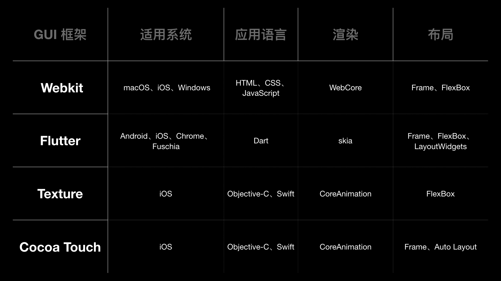
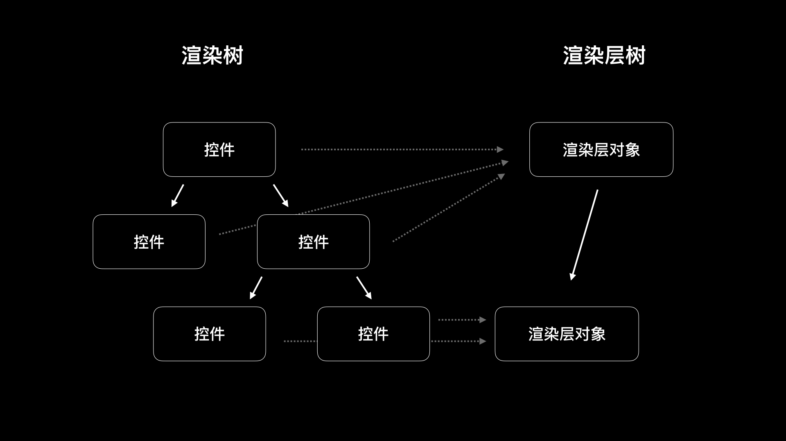
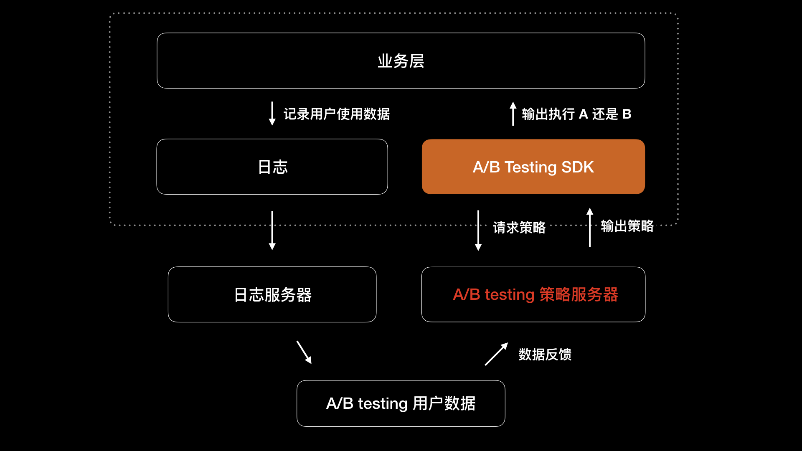
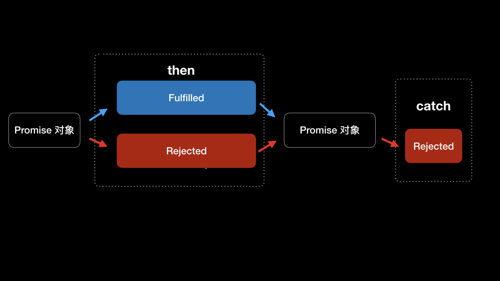
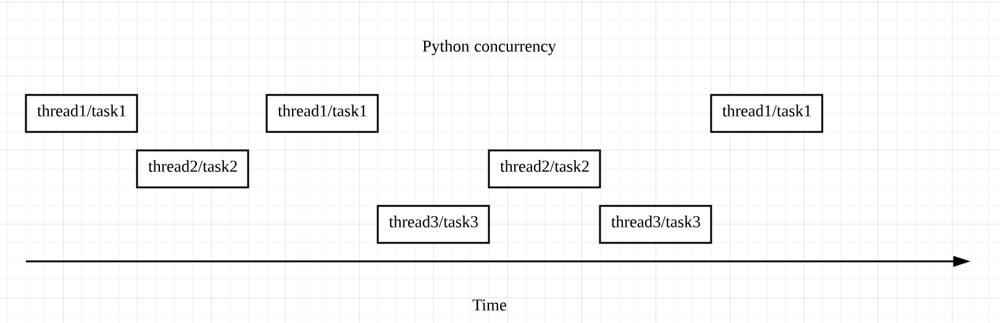
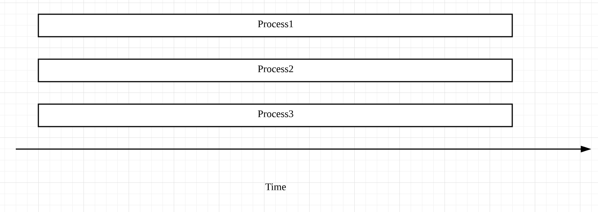
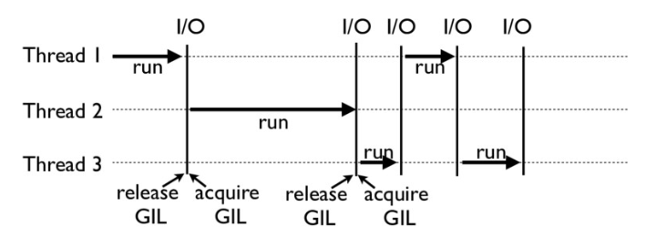
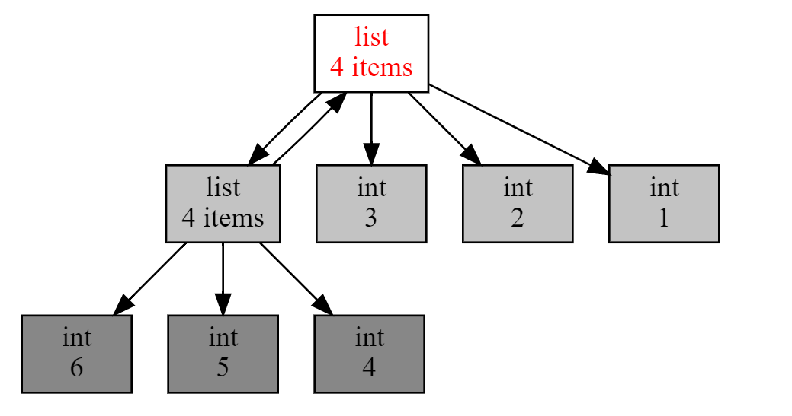
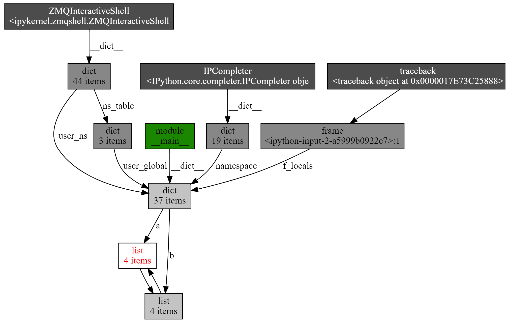

<head>
    
    
</head>

# Table of Contents

1.  [Algorithm](#org9ca71b4)
2.  [Review](#orge87800e)
    1.  [怎么减少 App 电量消耗](#org586500f)
        1.  [如何获取电量？](#org27b027c)
        2.  [如何诊断电量问题](#org7292a29)
        3.  [优化电量](#orge3c669d)
    2.  [基础模块 matrix-iOS](#orgfa1b8fb)
        1.  [子线程监控检测时间间隔](#org059121a)
        2.  [子线程监控退火算法](#orga938349)
        3.  [RunLoop 卡顿时间阈值设置](#org082c2e3)
        4.  [CPU 使用率阈值设置](#org3af60ec)
    3.  [除了 Cocoa，iOS还可以用哪些 GUI 框架开发](#org9c46f90)
        1.  [目前流行的 GUI 框架](#org3de3fcd)
        2.  [GUI 框架里都有什么](#orgd364848)
        3.  [渲染流程](#org4988933)
        4.  [Texture 里 Node 的异步绘制](#org63b79ab)
    4.  [细说 iOS 响应式框架变迁，哪些思想可以为我所用](#org50552da)
        1.  [Monad](#org7e2756f)
        2.  [函数响应式编程例子](#org1392786)
    5.  [如何构造酷炫的物理效果和过场动画效果](#org73df54e)
        1.  [Lottie](#org872b45d)
        2.  [Bodymovin](#org5c06343)
        3.  [在 iOS 中使用 Lottie](#org34a1f1a)
        4.  [多平台支持](#org99cd2f1)
        5.  [Lottie 实现原理](#orgdda535e)
    6.  [A/B 测试：验证决策效果的利器](#orgde3973e)
        1.  [App 开发中的 A/B 测试](#orgeeae845)
        2.  [A/B 测试全景设计](#orgad0bfc4)
        3.  [A/B 测试 SDK](#org720c945)
    7.  [怎样构建底层的发布和订阅事件总线](#orge4ada85)
        1.  [Promise](#orga7f8fc9)
        2.  [PromiseKit](#orgd78409d)
3.  [Tips](#org75855a9)
    1.  [metaclass，是潘多拉魔盒还是阿拉丁神灯](#org7da0a53)
        1.  [metaclass 的超越变形特性有什么用](#orgfb92776)
        2.  [metaclass 的超越变形特性怎么用](#org5025ee7)
        3.  [Python 底层语言设计层面是如何实现 metaclass 的](#org98b0703)
        4.  [使用 metaclass 的风险](#org464e563)
    2.  [深入理解迭代器和生成器](#orgfbccffe)
        1.  [生成器](#org589bdfe)
        2.  [生成器，还能玩什么花样](#orge0202ab)
    3.  [揭秘 Python 协程](#orgad77d1c)
        1.  [从一个爬虫说起](#org93673de)
        2.  [解密协程运行时](#orgc05e8a3)
        3.  [实战：豆瓣近日推荐电影爬虫](#org4bbf801)
    4.  [Python并发编程之Futures](#org60250f9)
        1.  [区分并发和并行](#org72b2585)
        2.  [并发编程之 Futures](#org0020727)
        3.  [到底什么是 Futures](#org1bf71a4)
        4.  [为什么多线程每次只能有一个线程执行](#org2aa9914)
    5.  [并发编程之Asyncio](#orgcad7ec2)
        1.  [Asyncio 工作原理](#orgaca15b5)
        2.  [Asyncio 用法](#org0dd210b)
        3.  [Asyncio 有缺陷吗](#org64e5dd4)
        4.  [多线程还是 Asyncio](#orgb9299f8)
    6.  [你真的懂Python GIL（全局解释器锁）吗](#orgc60a0e0)
        1.  [一个不解之谜](#orgc50e841)
        2.  [为什么有 GIL](#org9c42f3d)
        3.  [GIL 是如何工作的](#org606df29)
        4.  [Python 的线程安全](#orgf5c2deb)
        5.  [如何绕过 GIL](#org51a6ee8)
    7.  [带你解析 Python 垃圾回收机制](#orgcc6d0b1)
        1.  [计数引用](#orgb820c7c)
        2.  [循环引用](#org6e9fc66)
        3.  [调试内存泄漏](#orgb7de2a1)
4.  [Share](#org88c1461)
    1.  [Young 不等式](#org190c1b5)
    2.  [Hölder 不等式](#orgd3649ea)
    3.  [Minkowski 不等式](#org2f8b138)

# Algorithm

Leetcode 2538: [Difference Between Maximum and Minimum Price Sum](https://leetcode.com/problems/difference-between-maximum-and-minimum-price-sum)

<https://dreamume.medium.com/leetcode-2538-difference-between-maximum-and-minimum-price-sum-ea1c56d492ab>

# Review

iOS 开发高手课    戴铭

## 怎么减少 App 电量消耗

### 如何获取电量？

    [UIDevice currentDevice].batteryMonitoringEnabled = YES;
    NSLog(@"the battery level is %f", [UIDevice currentDevice].batteryLevel);

### 如何诊断电量问题

首先想到可能就是这个页面有没有开启定位，网络请求是不是频繁，亦或是定时任务时间是不是间隔过小

当你用排除法将所有功能注释掉后，如果还有问题，那么这个耗电一定是由其他线程引起的。创建这个耗电线程的地方可能是在其他地方，比如是由第三方库引起，或者是公司其他团队开发的库

先反过来看看出现电量问题的期间，哪个线程是有问题的。通过下面的这段代码，你就可以获取到所有线程的信息：

    thread_act_array_t threads;
    mach_msg_type_number_t threadCount = 0;
    const task_t thisTask = mach_task_self();
    kern_return_t kr = task_threads(thisTask, &threads, &threadCount);

从上面代码可以看出，通过 task_threads 函数，我们就能够得到所有的线程信息数组 threads，以及线程总数 threadCount。threads 数组里的线程信息结构体 thread_basic_info 里有一个记录 CPU 使用百分比的字段 cpu_usage。thread_basic_info 结构体的代码如下：

    struct thread_basic_info {
            time_value_t    user_time;      /* user 运行的时间 */
            time_value_t    system_time;    /* system 运行的时间 */
            integer_t       cpu_usage;      /* CPU 使用百分比 */
            policy_t        policy;         /* 有效的计划策略 */
            integer_t       run_state;      /* run state (see below) */
            integer_t       flags;          /* various flags (see below) */
            integer_t       suspend_count;  /* suspend count for thread */
            integer_t       sleep_time;     /* 休眠时间 */
    };

有了这个 cpu_usage 字段，你就可以通过遍历所有线程，去查看是哪个线程的 CPU 使用百分比过高了。如果某个线程的 CPU 使用率长时间都比较高的话，比如超过了 90%，就能够推断出它是有问题的。这时，将其方法堆栈记录下来，你就可以知道到底是哪段代码让你 App 的电量消耗多了

通过这种方法，你就可以快速定位到问题，有针对性地进行代码优化。多线程 CPU 使用率检查的完整代码如下：

    // 轮询检查多个线程 CPU 情况
    + (void)updateCPU {
        thread_act_array_t threads;
        mach_msg_type_number_t threadCount = 0;
        const task_t thisTask = mach_task_self();
        kern_return_t kr = task_threads(thisTask, &threads, &threadCount);
        if (kr != KERN_SUCCESS) {
            return;
        }
        for (int i = 0; i < threadCount; i++) {
            thread_info_data_t threadInfo;
            thread_basic_info_t threadBaseInfo;
            mach_msg_type_number_t threadInfoCount = THREAD_INFO_MAX;
            if (thread_info((thread_act_t)threads[i], 
                            THREAD_BASIC_INFO, 
                            (thread_info_t)threadInfo, &threadInfoCount) == KERN_SUCCESS) {
                threadBaseInfo = (thread_basic_info_t)threadInfo;
                if (!(threadBaseInfo->flags & TH_FLAGS_IDLE)) {
                    integer_t cpuUsage = threadBaseInfo->cpu_usage / 10;
                    if (cpuUsage > 90) {
                        //cup 消耗大于 90 时打印和记录堆栈
                        NSString *reStr = smStackOfThread(threads[i]);
                        //记录数据库中
                        [[[SMLagDB shareInstance] increaseWithStackString:reStr] subscribeNext:^(id x) {}];
                        NSLog(@"CPU useage overload thread stack：\n%@",reStr);
                    }
                }
            }
        }
    }

### 优化电量

对 CPU 的使用要精打细算，要避免让 CPU 做多余的事情。对于大量数据的复杂计算，应该把数据传到服务器去处理，如果必须要在 App 内处理复杂数据计算，可以通过 GCD 的 dispatch_block_create_with_qos_class 方法指定队列的 Qos 为 QOS_CLASS_UTILITY，将计算工作放到这个队列的 block 里。在 QOS_CLASS_UTILITY 这种 Qos 模式下，系统针对大量数据的计算，以及复杂数据处理专门做了电量优化

接下来，我们再看看除了 CPU 会影响耗电，对电量影响较大的因素还有哪些呢？

除了 CPU，I/O 操作也是耗电大户。任何的 I/O 操作，都会破坏掉低功耗状态。那么，针对 I/O 操作要怎么优化呢？

业内的普遍做法是，将碎片化的数据磁盘存储操作延后，先在内存中聚合，然后再进行磁盘存储。碎片化的数据进行聚合，在内存中进行存储的机制，可以使用系统自带的 NSCache 来完成

NSCache 是线程安全的，NSCache 会在到达预设缓存空间值时清理缓存，这时会触发 cache:willEvictObject: 方法的回调，在这个回调里就可以对数据进行 I/O 操作，达到将聚合的数据 I/O 延后的目的。I/O 操作的次数减少了，对电量的消耗也就减少了

SDWebImage 图片加载框架，在图片的读取缓存处理时没有直接使用 I/O，而是使用了 NSCache。使用 NSCache 的相关代码如下：

    - (UIImage *)imageFromMemoryCacheForKey:(NSString *)key {
        return [self.memCache objectForKey:key];
    }
    
    - (UIImage *)imageFromDiskCacheForKey:(NSString *)key {
        // 检查 NSCache 里是否有
        UIImage *image = [self imageFromMemoryCacheForKey:key];
        if (image) {
            return image;
        }
        // 从磁盘里读
        UIImage *diskImage = [self diskImageForKey:key];
        if (diskImage && self.shouldCacheImagesInMemory) {
            NSUInteger cost = SDCacheCostForImage(diskImage);
            [self.memCache setObject:diskImage forKey:key cost:cost];
        }
        return diskImage;
    }

可以看出，SDWebImage 将获取的图片数据都放到了 NSCache 里，利用 NSCache 缓存策略进行图片缓存内存的管理。每次读取图片时，会检查 NSCache 是否已经存在图片数据：如果有，就直接从 NSCache 里读取；如果没有，才会通过 I/O 读取磁盘缓存图片

使用了 NSCache 内存缓存能够有效减少 I/O 操作，你在写类似功能时也可以采用这样的思路，让你的 App 更省电

CPU 和 I/O 这两大耗电问题都解决后，还有什么要注意的呢？这里还有两份关于 App 电量消耗的资料，你可以对照你的 App 来查看

苹果公司专门维护了一个电量优化指南 [Energy Efficiency Guide for iOS Apps](https://developer.apple.com/library/archive/documentation/Performance/Conceptual/EnergyGuide-iOS/)，分别从 CPU、设备唤醒、网络、图形、动画、视频、定位、加速度计、陀螺仪、磁力计、蓝牙等多方面因素提出了电量优化方面的建议。所以，当使用了苹果公司的电量优化指南里提到的功能时，严格按照指南里的最佳实践去做就能够保证这些功能不会引起不合理的电量消耗

同时，苹果公司在 2017 年 WWDC 的 Session 238 也分享了一个关于如何编写节能 App 的主题 [Writing Energy Efficient Apps](https://developer.apple.com/videos/wwdc2017)

## 基础模块 matrix-iOS

微信最近开源了一个卡顿监控系统 [matrix-iOS](https://github.com/tencent/matrix/tree/master/matrix/matrix-iOS)，对性能的优化考虑得非常全面，这些优化不仅能够应用在卡顿监控上，对于其他监控都有很好的借鉴作用，所以非常值得我们深入了解一下。接下来，我就这个话题和你展开一下

微信团队开源的卡顿监控系统 [matrix](https://github.com/Tencent/matrix) 支持 iOS 和 android，如果你的 App 现在还没有卡顿监控系统，可以考虑直接集成 matrix-iOS，直接在 Podfile 里添加 pod ‘matrix-wechat’ 就可以了。如果已经有了卡顿监控系统，我建议你阅读下 matrix-iOS 的代码，里面有很多细节值得我们学习。比如：

-   子线程监控检测时间间隔：matrix-iOS 监控卡顿的子线程是通过 NSThread 创建的，检测时间间隔正常情况是 1 秒，在出现卡顿情况下，间隔时间会受检测线程退火算法影响，按照斐波那契数列递增，直到没有卡顿时恢复为 1 秒
-   子线程监控退火算法：避免一个卡顿会写入多个文件的情况
-   RunLoop 卡顿时间阈值设置：对于 RunLoop 超时阈值的设置，我在第 13 篇文章里建议设置为 3 秒，微信设置的是 2 秒
-   CPU 使用率阈值设置：当单核 CPU 使用率超过 80%，就判定 CPU 占用过高。CPU 使用率过高，可能导致 App 卡顿

matrix-iOS 卡顿监控系统的主要代码在 WCBlockMonitorMgr.mm 文件中

### 子线程监控检测时间间隔

matrix-iOS 是在 addMonitorThread 方法里，通过 NSThread 添加一个子线程来进行监控的。addMonitorThread 方法代码如下：

    - (void)addMonitorThread {
        m_bStop = NO;
        m_monitorThread = 
            [[NSThread alloc] initWithTarget:self 
                                    selector:@selector(threadProc) 
                                      object:nil];
        [m_monitorThread start];
    }

threadProc 方法包括了子线程监控卡顿的所有逻辑。它的代码比较多，我先和你分析与检测时间间隔相关的代码，然后再和你分析其他的主要代码：

    while (YES) {
        @autoreleasepool {
            if (g_bMonitor) {
                // 检查是否卡顿，以及卡顿原因
                // ...
                // 针对不同卡顿原因进行不同的处理
                // ...
            }
    
            // 时间间隔处理，检测时间间隔正常情况是1秒，间隔时间会
            // 受检测线程退火算法影响，按照斐波那契数列递增，直到没有卡顿时恢复为1秒。
            for (int nCnt = 0; nCnt < m_nIntervalTime && !m_bStop; nCnt++) {
                if (g_MainThreadHandle && g_bMonitor) {
                    int intervalCount = g_CheckPeriodTime / g_PerStackInterval;
                    if (intervalCount <= 0) {
                        usleep(g_CheckPeriodTime);
                    } else {
                        // ...
                    }
                } else {
                    usleep(g_CheckPeriodTime);
                }
            }
    
            if (m_bStop) {
                break;
            }
        }
     }

可以看出，创建的子线程通过 while 使其成为常驻线程，直到主动执行 stop 方法才会被销毁。其中，使用 usleep 方法进行时间间隔操作， g_CheckPeriodTime 就是正常情况的时间间隔的值，退火算法影响的是 m_nIntervalTime，递增后检测卡顿的时间间隔就会不断变长。直到判定卡顿已结束，m_nIntervalTime 的值会恢复成 1

接下来，跟踪 g_CheckPeriodTime 的定义就能够找到正常情况下子线程卡顿监控的时间间隔。 g_CheckPeriodTime 的定义如下：

    static useconds_t g_CheckPeriodTime = g_defaultCheckPeriodTime;

其中 g_defaultCheckPeriodTime 的定义是：

    #define BM_MicroFormat_Second 1000000
    const static useconds_t g_defaultCheckPeriodTime = 1 * BM_MicroFormat_Second;

可以看出，子线程监控检测时间间隔 g_CheckPeriodTime，被设置的值就是 1 秒

### 子线程监控退火算法

子线程监控检测时间间隔设置为 1 秒，在没有卡顿问题，不需要获取主线程堆栈信息的情况下性能消耗几乎可以忽略不计。但是，当遇到卡顿问题时，而且一个卡顿持续好几秒的话，就会持续获取主线程堆栈信息，增加性能损耗。更重要的是，持续获取的这些堆栈信息都是重复的，完全没有必要

所以，matrix-iOS 采用了退火算法递增时间间隔，来避免因为同一个卡顿问题，不断去获取主线程堆栈信息的情况，从而提升了算法性能

同时，一个卡顿问题只获取一个主线程堆栈信息，也就是一个卡顿问题 matrix-iOS 只会进行一次磁盘存储，减少了存储 I/O 也就减少了性能消耗

所以，这种策略能够有效减少由于获取主线程堆栈信息带来的性能消耗

那么，matrix-iOS 是如何实现退火算法的呢?

因为触发退火算法的条件是卡顿，所以我们先回头来看看子线程监控卡顿主方法 threadProc 里和发现卡顿后处理相关的代码：

    while (YES) {
        @autoreleasepool {
            if (g_bMonitor) {
                // 检查是否卡顿，以及卡顿原因
                EDumpType dumpType = [self check];
                if (m_bStop) {
                    break;
                }
    
                // 针对不同卡顿原因进行不同的处理
                // ...
                if (dumpType != EDumpType_Unlag) {
                    if (EDumpType_BackgroundMainThreadBlock == dumpType ||
                        EDumpType_MainThreadBlock == dumpType) {
                        if (g_CurrentThreadCount > 64) {
                            // 线程数超过64个，认为线程过多造成卡顿，不用记录主线程堆栈
                            dumpType = EDumpType_BlockThreadTooMuch;
                            [self dumpFileWithType:dumpType];
                        } else {
                            EFilterType filterType = [self needFilter];
                            if (filterType == EFilterType_None) {
                                if (g_MainThreadHandle) {
                                    if (g_PointMainThreadArray != NULL) {
                                        free(g_PointMainThreadArray);
                                        g_PointMainThreadArray = NULL;
                                    }
                                    g_PointMainThreadArray = 
                                        [m_pointMainThreadHandler getPointStackCursor];
                                    // 函数主线程堆栈写文件记录
                                    m_potenHandledLagFile = 
                                        [self dumpFileWithType:dumpType];
                                    // 回调处理主线程堆栈文件
                                    // ...
                                } else {
                                    // 主线程堆栈写文件记录
                                    m_potenHandledLagFile = 
                                        [self dumpFileWithType:dumpType];
                                    // ...
                                }
                            } else {
                                // 对于 filterType 满足退火算法、主线程堆栈数太少、一天内记录主线程堆栈过多这些情况不用进行写文件操作
                                // ...
                            }
                        }
                    } else {
                        m_potenHandledLagFile = [self dumpFileWithType:dumpType];
                    }
                } else {
                    [self resetStatus];
                }
            }
    
            // 时间间隔处理，检测时间间隔正常情况是1秒，间隔时间会受检测线程退火算法影响，按照斐波那契数列递增，直到没有卡顿时恢复为1秒。
            // ...
        }
    }

按照微信团队的经验，线程数超出 64 个时会导致主线程卡顿，如果卡顿是由于线程多造成的，那么就没必要通过获取主线程堆栈去找卡顿原因了。根据 matrix-iOS 的实测，每隔 50 毫秒获取主线程堆栈会增加 3% 的 CPU 占用，所以当检测到主线程卡顿以后，我们需要先判断是否是因为线程数过多导致的，而不是一有卡顿问题就去获取主线程堆栈

如果不是线程过多造成的卡顿问题，matrix-iOS 会通过 needFilter 方法去对比前后两次获取的主线程堆栈，如果两次堆栈是一样的，那就表示卡顿还没结束，满足退火算法条件，needFilter 方法会返回 EFilterType。EFilterType 为 EFilterType_Annealing，表示类型为退火算法。满足退火算法后，主线程堆栈就不会立刻进行写文件操作

在 needFilter 方法里，needFilter 通过 [m_pointMainThreadHandler getLastMainThreadStack] 获取当前主线程堆栈，然后记录在 m_vecLastMainThreadCallStack 里。下次卡顿时，再获取主线程堆栈，新获取的堆栈和上次记录的 m_vecLastMainThreadCallStack 堆栈进行对比：

-   如果两个堆栈不同，表示这是一个新的卡顿，就会退出退火算法
-   如果两个堆栈相同，就用斐波那契数列递增子线程检查时间间隔

递增时间的代码如下：

    if (bIsSame) {
        NSUInteger lastTimeInterval = m_nIntervalTime;
        // 递增 m_nIntervalTime
        m_nIntervalTime = m_nLastTimeInterval + m_nIntervalTime;
        m_nLastTimeInterval = lastTimeInterval;
        MatrixInfo(@"call stack same timeinterval = %lu", 
                   (unsigned long) m_nIntervalTime);
    
        return EFilterType_Annealing;
    } 

可以看出，将子线程检查主线程时间间隔增加后，needFilter 就直接返回 EFilterType_Annealing 类型表示当前情况满足退火算法。使用退火算法，可以有效降低没有必要地获取主线程堆栈的频率。这样的话，我们就能够在准确获取卡顿的前提下，还能保障 App 性能不会受卡顿监控系统的影响

### RunLoop 卡顿时间阈值设置

RunLoop 超时检查的相关逻辑代码都在 check 方法里。check 方法和 RunLoop 超时相关代码如下：

    - (EDumpType)check
    {
        // 1. RunLoop 超时判断
        // RunLoop 是不是处在执行方法状态中
        BOOL tmp_g_bRun = g_bRun;
        // 执行了多长时间
        struct timeval tmp_g_tvRun = g_tvRun;
    
        struct timeval tvCur;
        gettimeofday(&tvCur, NULL);
        unsigned long long diff = 
            [WCBlockMonitorMgr diffTime:&tmp_g_tvRun endTime:&tvCur];
    
        // ...
    
        m_blockDiffTime = 0;
        // 判断执行时长是否超时
        if (tmp_g_bRun && tmp_g_tvRun.tv_sec && tmp_g_tvRun.tv_usec && 
            __timercmp(&tmp_g_tvRun, &tvCur, <) && 
            diff > g_RunLoopTimeOut) {
            m_blockDiffTime = tvCur.tv_sec - tmp_g_tvRun.tv_sec;
    
            // ...
    
            return EDumpType_MainThreadBlock;
        }
    
        // ...
    
        // 2. CPU 使用率
    
        // ...
    
        // 3. 没问题
    
        return EDumpType;
    }

可以看出，在判断执行时长是否超时代码中的 g_RunLoopTimeOut 就是超时的阈值。通过这个阈值，我们就可以知道 matrix-iOS 设置的 RunLoop 卡顿时间阈值是多少了。g_RunLoopTimeOut 的定义如下：

    static useconds_t g_RunLoopTimeOut = g_defaultRunLoopTimeOut;
    const static useconds_t g_defaultRunLoopTimeOut = 2 * BM_MicroFormat_Second;

可以看出，matrix-iOS 设置的 RunLoop 卡顿时间阈值是 2 秒

还有一点我需要再说明一下，我们所说的卡顿监控方案，主要是针对那些在一段时间内用户无法点击，通过日志也很难复现问题的情况而做的。这样的卡顿问题属于头部问题，对用户的伤害是最大的，是需要优先解决的。这种方案，是不适合短时间掉帧的情况的。短时间掉帧问题对用户体验也有影响，但是属于优化问题

除了 RunLoop 超时会造成卡顿问题外，在 check 方法里还有对于 CPU 使用率的判断处理，那么我再带你来看看 matrix-iOS 是如何通过 CPU 使用率来判断卡顿的

### CPU 使用率阈值设置

matrix-iOS 是如何设置这个 CPU 使用率阈值的呢？check 方法里的相关代码如下:

    if (m_bTrackCPU) {
        unsigned long long checkPeriod = 
            [WCBlockMonitorMgr diffTime:&g_lastCheckTime endTime:&tvCur];
        gettimeofday(&g_lastCheckTime, NULL);
        // 检查是否超过 CPU 使用率阈值限制，报 CPU 使用率一段时间过高
        if ([m_cpuHandler cultivateCpuUsage:cpuUsage periodTime:(float)checkPeriod / 1000000]) {
            MatrixInfo(@"exceed cpu average usage");
            BM_SAFE_CALL_SELECTOR_NO_RETURN(_delegate, 
                                            @selector(onBlockMonitorIntervalCPUTooHigh:), 
                                            onBlockMonitorIntervalCPUTooHigh:self)
            if ([_monitorConfigHandler getShouldGetCPUIntervalHighLog]) {
                return EDumpType_CPUIntervalHigh;
            }
        }
        // 针对 CPU 满负荷情况，直接报 CPU 使用率过高引起卡顿
        if (cpuUsage > g_CPUUsagePercent) {
            MatrixInfo(@"check cpu over usage dump %f", cpuUsage);
            BM_SAFE_CALL_SELECTOR_NO_RETURN(_delegate, 
                                            @selector(onBlockMonitorCurrentCPUTooHigh:), 
                                            onBlockMonitorCurrentCPUTooHigh:self)
            if ([_monitorConfigHandler getShouldGetCPUHighLog]) {
                return EDumpType_CPUBlock;
            }
        }
    }

通过上面代码，你会发现 matrix-iOS 使用了两个阈值，分别返回两种类型的问题，对应两种导致卡顿的情况：

-   一个是， CPU 已经满负荷，直接返回 CPU 使用率过高引起卡顿
-   另一个是，持续时间内 CPU 使用率一直超过某个阈值，就返回 CPU 使用率造成了卡顿

CPU 使用率阈值就在 cultivateCpuUsage:cpuUsage periodTime:periodSec 方法里。阈值相关逻辑代码如下:

    if (cpuUsage > 80. && m_tickTok == 0 && m_bLastOverEighty == NO) {
        MatrixInfo(@"start track cpu usage");
        m_foregroundOverEightyTotalSec = 0;
        m_backgroundOverEightyTotalSec = 0;
        m_bLastOverEighty = YES;
    }

## 除了 Cocoa，iOS还可以用哪些 GUI 框架开发

在 iOS 开发时，默认使用的都是系统自带的 Cocoa Touch 框架，所以如果你还想进一步提高界面响应速度，赶超其他使用 Cocoa Touch 框架的 App 用户体验时，就要考虑使用其他的 GUI 框架来优化 App 界面的响应速度了

### 目前流行的 GUI 框架

现在流行的 GUI 框架除了 Cocoa Touch 外，还有 WebKit、Flutter、Texture（原名 AsyncDisplayKit）、Blink、Android GUI 等。其中，WebKit、Flutter、Texture 可以用于 iOS 开发。接下来，我就和你说说这三款 GUI 框架

WebKit 框架包含了 WebCore 和 JavaScriptCore，使用 HTML 和 CSS 进行布局，使用 JavaScript 编写程序。WebKit 还提供了 Objective-C 应用程序编程接口，方便基于 Cocoa API 的应用使用。在 iOS 开发中，我们最常使用的 UIWebView 和 WKWebView 控件都是基于 WebKit 框架

[深入剖析 WebKit](https://ming1016.github.io/2017/10/11/deeply-analyse-webkit/) 详细分析了它的原理

Flutter 是 Google 公司于 2017 年推出的一个移动应用开发的 GUI 框架，使用 Dart 语言编写程序，一套代码可以同时运行在 iOS 和 Android 平台

Texture 框架的基本单元，是基于 UIView 抽象的节点 ASDisplayNode。和 UIView 不同的是 ，ASDisplayNode 是线程安全的，可以在后台线程上并行实例化和配置整个层级结构。Texture 框架的开发语言，使用的是苹果公司自家的 Objective-C 和 Swift

WebKit、Flutter、Texture 这三个 GUI 框架，与 Cocoa Touch 的对比，如下图所示：

Texture 和其他 GUI 框架一样都是使用的应用更加广泛的 FlexBox 布局。使用 FlexBox 布局的好处是，可以让 iOS 开发者用到前端先进的 W3C 标准响应式布局。目前， FlexBox 已经是布局的趋势，连 iOS 新推出的 UIStackView 布局方式，也是按照 FlexBox 布局思路来设计的

另外，Texture 是这些框架中唯一使用异步节点计算的框架。使用异步节点计算，可以提高主线程的响应速度。所以，Texture 在节点计算上的效率要比其他框架高

基于以上三个方面的原因，如果要从 Cocoa Touch 框架前移到其他的 GUI 框架，从学习成本、收益等角度考虑的话，转到 Texture 会是个不错的选择

因此，我会和你重点分析一下 Texture 框架。因为现在的 GUI 技术已经非常成熟了，各种 GUI 框架的底层也大同小异，所以接下来我会先和你介绍 GUI 框架中的通用性内容，然后再与你讲述 Texture 的独特之处

### GUI 框架里都有什么

控件之间的关系是由渲染树（Render Tree）这种抽象的树结构来记录的。渲染树关注的是界面的布局，控件在界面中的位置和大小都是由渲染树来确定

基于渲染树，GUI 框架还会创建一个渲染层树（RenderLayer Tree），渲染层树由渲染层对象组成，根据 GUI 框架的优化条件来确定创建哪些渲染层对象，每次新创建一个渲染层对象就会去设置它的父对象和兄弟对象。渲染层对象创建完毕，接下来就需要将各渲染层对象里的控件按照渲染树布局生成 Bitmap，最后 GPU 就可以渲染 Bitmap 来让你看到界面了

控件、渲染树、渲染层树之间的关系，如下图所示：

WebKit 和 Flutter 都是开源项目，我们可以通过它们的代码看到 GUI 框架具体是怎么实现控件、渲染树、渲染层树和生成 Bitmap 的

WebKit 在 GUI 框架层面的效率并不低，单就渲染来说，它的性能一点也不弱于 Cocoa Touch 和 Flutter 框架

-   使用 WebKit 的网页显示慢，主要是由于 CSS（Cascading Style Sheet） 和 JavaScript 资源加载方式导致的
-   同时，解析时 HTML、CSS、JavaScript 需要兼容老版本，JavaScript 类型推断失败会重来，列表缺少重用机制等原因，导致 WebKit 框架的整体性能没有其他框架好

开始的时候，Flutter 也是基于 Chrome 浏览器引擎的。后来，谷歌公司考虑到 Flutter 的性能，所以去掉了 HTML、CSS、JavaScript 的支持，而改用自家的 Dart 语言以甩掉历史包袱。关于这方面的细节，你可以查看 [Flutter 创始人 Eric 的采访视频](https://zhuanlan.zhihu.com/p/52666477) 来了解

### 渲染流程

GUI 框架中的渲染，一般都会经过布局、渲染、合成这三个阶段

布局阶段要完成的主要工作，是依据渲染树计算出控件的大小和位置。WebKit 用 CSS 来布局，CSS 会提供 Frame 布局和 FlexBox 布局；Flutter 也支持 Frame 布局和 FlexBox 布局；Cocoa Touch 框架本身不支持 FlexBox 布局，但是通过 Facebook 的 [Yoga 库](https://yogalayout.com/) 也能够使用 FlexBox 布局

由于 Frame 布局需要精确描述每个界面元素的具体位置和大小，无论从代码编写，还是从代码可读性上看，成本都会高很多。所以说，FlexBox 对于 iOS 开发来说是另外一种很好的选择

渲染阶段的主要工作，是利用图形函数计算出界面的内容。一般情况下，对于 2D 平面的渲染都是使用 CPU 计算，对 3D 空间的渲染会使用 GPU 计算

Cocoa Touch 和 Texture 框架使用的是 Core Animation，3D 使用的是 Metal 引擎。Flutter 使用的是 Skia，3D 使用的是 OpenGL(ES)

在渲染这方面，我觉得 WebKit 做得更出色，考虑到多平台支持，WebKit 将渲染接口抽象了出来，实现层根据平台进行区分，比如在 iOS 上就用 CoreGraphics 来渲染，在 Android 就用 Skia 渲染

合成阶段的主要工作，是合并图层。这样做的目的，主要是节省显示内存，只显示一屏需要的像素，也只进行这些像素数据的计算。这个过程完成后，再将所得数据进行光栅化处理，最后交给 GPU 渲染成你可以看到的 Bitmap

通过上面的内容，我们可以看到，主流 GUI 框架的内容和渲染流程，区别并不是很大

但 Texture 对于那些希望能够在用户交互体验上进行大幅提升的 iOS 开发者来说，很小的切换成本，同时性能能大幅提升的收益，其实是很有诱惑力的

通过对 GUI 框架都包括什么和渲染流程的分析，再次印证了我们的观点：Texture 是个值得推荐的框架，不仅在于它与 Cocoa Touch 框架的相似使得学习成本较低，还得益于它本身在性能上的先进性

那么，接下来我就再跟你说说 Texture 最大的优势是什么？以及它是怎么做到的？

### Texture 里 Node 的异步绘制

Texture 最大的优势就是开发了线程安全的 ASDisplayNode，而且还能够很好的和 UIView 共生。这样的话，我们就可以在原有使用 UIView 开发的程序基础之上使用 Texture，而不用完全重构所有界面

随着 CPU 多核技术的发展，界面渲染计算都在主线程完成，对于多核 CPU 来说确实是有些浪费。ASDisplayNode 是 UIView 和 CALayer 的抽象，能实现不在主线程执行视图的布局绘制和层级计算，充分发挥多核 CPU 的优势

首先，我们来看看 Texture 最核心的线程安全节点 ASDisplayNode 是做什么的？

在 Cocoa Touch 框架里，当 CALayer 内容更新时会去找 CALayer 的 delegate，也就是 displayLayer: 方法。UIView 会实现 displayLayer: 这个 delegate 方法。UIView 里实现 drawRect: 这个 delegate 方法能够自定义 CALayer

在 Texture 中，ASDisplayNode 替代了这个 delegate，解耦了 UIView 和 CALayer，并将 UIView 包装成 ASDisplayView，将 CALayer 包装成 ASDisplayLayer 供外部使用

然后，我们再来看看 ASDisplayNode 是如何进行异步绘制的？

ASDisplayLayer 是整个绘制的起点，绘制事件先在 displayBlock 设置好，然后 ASDisplayNode 调用 displayBlock 来进行异步绘制。整个过程分为三步

第一步，得到 displayBlock。这个 Block 里有需要绘制的内容，对应的代码如下：

    asyncdisplaykit_async_transaction_operation_block_t displayBlock = 
        [self _displayBlockWithAsynchronous:asynchronously 
                           isCancelledBlock:isCancelledBlock 
                                rasterizing:NO];

其中，displayBlock 就是需要绘制的内容

第二步，定义一个回调 completionBlock ，绘制完成后执行。代码如下：

    asyncdisplaykit_async_transaction_operation_completion_block_t completionBlock 
    = ^(id<NSObject> value, BOOL canceled) {
        ASDisplayNodeCAssertMainThread();
        if (!canceled && !isCancelledBlock()) {
            // displayBlock 执行的是绘图操作，返回的类型是 UIImage
            UIImage *image = (UIImage *)value;
            BOOL stretchable = 
                (NO == UIEdgeInsetsEqualToEdgeInsets(image.capInsets, UIEdgeInsetsZero));
            if (stretchable) {
                ASDisplayNodeSetResizableContents(layer, image);
            } else {
                layer.contentsScale = self.contentsScale;
                // 设置为 CALayer 的寄宿图
                layer.contents = (id)image.CGImage;
            }
            [self didDisplayAsyncLayer:self.asyncLayer];
    
            if (rasterizesSubtree) {
                ASDisplayNodePerformBlockOnEverySubnode(self, NO, ^(ASDisplayNode * _Nonnull node) {
                        [node didDisplayAsyncLayer:node.asyncLayer];
                    });
            }
        }
    };

上面代码中，completionBlock 里就是绘制完成后需要去执行的事情，内容是完成 CALayer 寄宿图的设置。 value 是 displayBlock 返回的值，类型是 UIImage。displayBlock 用的是线程安全的 Core Graphics，所以你可以安心地把 displayBlock 放到后台线程去异步执行

第三步，如果设置为异步展示，就先向上找到属性 asyncdisplaykit_parentTransactionContainer 为 YES 的 CALayer，获取 containerLayer 的 ASAsyncTransaction，然后将 displayBlock 添加到 ASAsyncTransaction 的调度队列里，根据 drawingPriority 优先级执行 displayBlock。具体代码如下:

    if (asynchronously) {
        // 向上找到属性 asyncdisplaykit_parentTransactionContainer 为 YES 的 CALayer
        CALayer *containerLayer = 
            layer.asyncdisplaykit_parentTransactionContainer ? : layer;
    
        // 获取 containerLayer 的 ASAsyncTransaction
        _ASAsyncTransaction *transaction = containerLayer.asyncdisplaykit_asyncTransaction;
    
        // 将 displayBlock 添加到 ASAsyncTransaction 的调度队列里
        [transaction addOperationWithBlock:displayBlock 
                                  priority:self.drawingPriority 
                                     queue:[_ASDisplayLayer displayQueue] 
                                completion:completionBlock];
    } else {
      // 设置为不是异步就直接调用 displayBlock 进行绘制
      UIImage *contents = (UIImage *)displayBlock();
      completionBlock(contents, NO);
    }

可以看到，displayBlock 被添加到 ASAsyncTransaction 里进行调度。这里，ASAsyncTransactionQueue 是 Texture 的调度队列

通过上面这三步，Texture 就完成了 ASDisplayNode 的异步绘制

## 细说 iOS 响应式框架变迁，哪些思想可以为我所用

说到 iOS 响应式框架，最开始被大家知道的是 ReactiveCocoa（简称 RAC），后来比较流行的是 RxSwift。但据我了解，iOS 原生开发使用 ReactiveCocoa 框架的团队并不多，而前端在推出 React.js 后，响应式思路遍地开花

那么，响应式框架到底是什么，为什么在 iOS 原生开发中没被广泛采用，却能在前端领域得到推广呢？

我们先来看看响应式框架，它指的是能够支持响应式编程范式的框架。使用了响应式框架，你在编程时就可以使用数据流传播数据的变化，响应这个数据流的计算模型会自动计算出新的值，将新的值通过数据流传给下一个响应的计算模型，如此反复下去，直到没有响应者为止

React.js 框架的底层有个 Virtual DOM（虚拟文档对象模型），页面组件状态会和 Virtual DOM 绑定，用来和 DOM（文档对象模型）做映射与转换。当组件状态更新时，Virtual DOM 就会进行 Diff 计算，最终只将需要渲染的节点进行实际 DOM 的渲染

JavaScript 每次操作 DOM 都会全部重新渲染，而 Virtual DOM 相当于 JavaScript 和 DOM 之间的一个缓存，JavaScript 每次都是操作这个缓存，对其进行 Diff 和变更，最后才将整体变化对应到 DOM 进行最后的渲染，从而减少没必要的渲染

React.js 的 Virtual DOM 映射和转换 DOM 的原理，如下图所示。我们一起通过原理，来分析一下它的性能提升

可以看出，操作 Virtual DOM 时并不会直接进行 DOM 渲染，而是在完成了 Diff 计算得到所有实际变化的节点后才会进行一次 DOM 操作，然后整体渲染。而 DOM 只要有操作就会进行整体渲染

直接在 DOM 上进行操作是非常昂贵的，所以视图组件会和 Virtual DOM 绑定，状态的改变直接更改 Virtual DOM。Virtual DOM 会检查两个状态之间的差异，进行最小的修改，所以 React.js 具有很好的性能。也正是因为性能良好，React.js 才能够在前端圈流行起来

而反观 iOS，ReactiveCocoa 框架的思路，其实与 React.js 中页面组件状态和 Virtual DOM 绑定、同步更新的思路是一致的。那为什么 ReactiveCocoa 在 iOS 原生开发中就没流行起来呢？

我觉得，主要原因是前端 DOM 树的结构非常复杂，进行一次完整的 DOM 树变更，会带来严重的性能问题，而有了 Virtual DOM 之后，不直接操作 DOM 可以避免对整个 DOM 树进行变更，使得我们不用再担忧应用的性能问题

但是，这种性能问题并不存在于 iOS 原生开发。这，主要是得易于 Cocoa Touch 框架的界面节点树结构要比 DOM 树简单得多，没有前端那样的历史包袱

与前端 DOM 渲染机制不同，Cocoa Touch 每次更新视图时不会立刻进行整个视图节点树的重新渲染，而是会通过 setNeedsLayout 方法先标记该视图需要重新布局，直到绘图循环到这个视图节点时才开始调用 layoutSubviews 方法进行重新布局，最后再渲染

所以说，ReactiveCocoa 框架并没有为 iOS 的 App 带来更好的性能。当一个框架可有可无，而且没有明显收益时，一般团队是没有理由去使用的。那么，像 ReactiveCocoa 这种响应式思想的框架在 iOS 里就没有可取之处了吗？

ReactiveCocoa 是将函数式编程和响应式编程结合起来的库，通过函数式编程思想建立了数据流的通道，数据流动时会经过各种函数的处理最终到达和数据绑定的界面，由此实现了数据变化响应界面变化的效果

### Monad

ReactiveCocoa 是采用号称纯函数式编程语言里的 Monad 设计模式搭建起来的，核心类是 RACStream。我们使用最多的 RACSignal（信号类，建立数据流通道的基本单元） ，就是继承自 RACStream。RACStream 的定义如下：

    typedef RACStream * (^RACStreamBindBlock)(id value, BOOL *stop);
    
    /// An abstract class representing any stream of values.
    ///
    /// This class represents a monad, upon which many stream-based operations can
    /// be built.
    ///
    /// When subclassing RACStream, only the methods in the main @interface body need
    /// to be overridden.
    @interface RACStream : NSObject
    
    + (instancetype)empty;
    + (instancetype)return:(id)value;
    - (instancetype)bind:(RACStreamBindBlock (^)(void))block;
    - (instancetype)concat:(RACStream *)stream;
    - (instancetype)zipWith:(RACStream *)stream;
    
    @end

通过定义的注释可以看出，RACStream 的作者也很明确地写出了 RACStream 类表示的是一个 Monad，所以我们在 RACStream 上可以构建许多基于数据流的操作；RACStreamBindBlock，就是用来处理 RACStream 接收到数据的函数。那么，Monad 就一定是好的设计模式吗？

从代码视觉上看，Monad 为了避免赋值语句做了很多数据传递的管道工作。这样的话，我们在分析问题时，就很容易从代码层面清晰地看出数据流向和变化。而如果是赋值语句，在分析数据时就需要考虑数据状态和生命周期，会增加调试定位的成本，强依赖调试工具去观察变量

不过无论是赋值方式还是 Monad 方式，编译后生成的代码都是一样的。王垠在他的博文 [函数式语言的宗教](http://www.yinwang.org/blog-cn/2013/03/31/purely-functional) 里详细分析了 Monad，并且写了两段分别采用赋值和函数式的代码，编译后的机器码实际上是一样的。如果你感兴趣的话，可以看一下这篇文章

所以，如果你不想引入 ReactiveCocoa 库，还想使用函数响应式编程思想来开发程序的话，完全不用去重新实现一个采用 Monad 模式的 RACStream，只要在上层按照函数式编程的思想来搭建数据流管道，在下层使用赋值方式来管理数据就可以了。并且，采用这种方式，可能会比 Monad 这种“纯”函数来得更加容易

### 函数响应式编程例子

这个案例要完成的功能是：添加学生基本信息，添加完学生信息后，通过按钮点击累加学生分数，每次点击按钮分数加 5；所得分数在 30 分内，颜色显示为灰色；分数在 30 到 70 分之间，颜色显示为紫色；分数在 70 分内，状态文本显示不合格；超过 70 分，分数颜色显示为红色，状态文本显示合格。初始态分数为 0，状态文本显示未设置

这个功能虽然不难完成，但是如果我们将这些逻辑都写在一起，那必然是条件里套条件，当要修改功能时，还需要从头到尾再捋一遍

如果把逻辑拆分成小逻辑放到不同的方法里，当要修改功能时，查找起来也会跳来跳去，加上为了描述方法内逻辑，函数名和参数名也需要非常清晰。这，无疑加重了开发和维护成本，特别是函数里面的逻辑被修改了后，我们还要对应着修改方法名。否则，错误的方法名，将会误导后来的维护者

那么，使用函数响应式编程方式会不会好一些呢？

这里，我给出了使用函数响应式编程方式的代码，你可以对比看看是不是比条件里套条件和方法里套方法的写法要好

首先，创建一个学生的记录，在创建记录的链式调用里添加一个处理状态文本显示的逻辑。代码如下：

    // 添加学生基本信息
    self.student = [[[[[SMStudent create]
                       name:@"ming"]
                      gender:SMStudentGenderMale]
                     studentNumber:345]
                    filterIsASatisfyCredit:^BOOL(NSUInteger credit){
                        if (credit >= 70) {
                            // 分数大于等于 70 显示合格
                            self.isSatisfyLabel.text = @"合格";
                            self.isSatisfyLabel.textColor = [UIColor redColor];
                            return YES;
                        } else {
                            // 分数小于 70 不合格
                            self.isSatisfyLabel.text = @"不合格";
                            return NO;
                        }
                    }];

可以看出，当分数小于 70 时，状态文本会显示为“不合格”，大于等于 70 时会显示为“合格”

接下来，针对分数，我再创建一个信号，当分数有变化时，信号会将分数传递给这个分数信号的两个订阅者。代码如下：

    // 第一个订阅的credit处理
    [self.student.creditSubject subscribeNext:^(NSUInteger credit) {
        NSLog(@"第一个订阅的credit处理积分%lu",credit);
        self.currentCreditLabel.text = [NSString stringWithFormat:@"%lu",credit];
        if (credit < 30) {
            self.currentCreditLabel.textColor = [UIColor lightGrayColor];
        } else if(credit < 70) {
            self.currentCreditLabel.textColor = [UIColor purpleColor];
        } else {
            self.currentCreditLabel.textColor = [UIColor redColor];
        }
    }];
    
    // 第二个订阅的credit处理
    [self.student.creditSubject subscribeNext:^(NSUInteger credit) {
        NSLog(@"第二个订阅的credit处理积分%lu",credit);
        if (!(credit > 0)) {
            self.currentCreditLabel.text = @"0";
            self.isSatisfyLabel.text = @"未设置";
        }
    }];

可以看出，这两个分数信号的订阅者分别处理了两个功能逻辑：

-   第一个处理的是分数颜色
-   第二个处理的是初始状态下状态文本的显示逻辑

整体看起来，所有的逻辑都围绕着分数这个数据的更新自动流动起来，也能够很灵活地通过信号订阅的方式进行归类处理

采用这种编程方式，上层实现方式看起来类似于 ReactiveCocoa，而底层实现却非常简单，将信号订阅者直接使用赋值的方式赋值给一个集合进行维护，而没有使用 Monad 方式。底层对信号和订阅者的实现代码如下所示：

    @interface SMCreditSubject : NSObject
    
    typedef void(^SubscribeNextActionBlock)(NSUInteger credit);
    
    + (SMCreditSubject *)create;
    
    // 发送信号
    - (SMCreditSubject *)sendNext:(NSUInteger)credit;
    // 接收信号
    - (SMCreditSubject *)subscribeNext:(SubscribeNextActionBlock)block;
    
    @end
    
    @interface SMCreditSubject()
    
    @property (nonatomic, assign) NSUInteger credit; // 积分
    @property (nonatomic, strong) SubscribeNextActionBlock subscribeNextBlock; // 订阅信号事件
    @property (nonatomic, strong) NSMutableArray *blockArray; // 订阅信号事件队列
    
    @end
    
    @implementation SMCreditSubject
    
    // 创建信号
    + (SMCreditSubject *)create {
        SMCreditSubject *subject = [[self alloc] init];
        return subject;
    }
    
    // 发送信号
    - (SMCreditSubject *)sendNext:(NSUInteger)credit {
        self.credit = credit;
        if (self.blockArray.count > 0) {
            for (SubscribeNextActionBlock block in self.blockArray) {
                block(self.credit);
            }
        }
        return self;
    }
    
    // 订阅信号
    - (SMCreditSubject *)subscribeNext:(SubscribeNextActionBlock)block {
        if (block) {
            block(self.credit);
        }
        [self.blockArray addObject:block];
        return self;
    }
    
    #pragma mark - Getter
    - (NSMutableArray *)blockArray {
        if (!_blockArray) {
            _blockArray = [NSMutableArray array];
        }
        return _blockArray;
    }

如上面代码所示，订阅者都会记录到 blockArray 里，block 的类型是 SubscribeNextActionBlock

最终，我们使用函数式编程的思想，简单、高效地实现了这个功能。这个例子完整代码，你可以点击 [链接](https://github.com/ming1016/RACStudy) 查看

## 如何构造酷炫的物理效果和过场动画效果

### Lottie

[Lottie 框架](http://airbnb.io/lottie/#/) 很好地解决了动画制作与开发隔离，以及多平台统一的问题

Lottie 是 Airbnb 开源的一个动画框架。Lottie 这个名字来自于一名德国导演洛特·赖尼格尔（Lotte Reiniger），她最著名的电影叫作“阿赫迈德王子历险记（The Adventures of Prince Achmed）”。这个框架和其他的动画框架不太一样，动画的编写和维护将由动画设计师完成，完全无需开发者操心

动画设计师做好动画以后，可以使用 [After Effects](https://www.adobe.com/products/aftereffects.html) 将动画导出成 JSON 文件，然后由 Lottie 加载和渲染这个 JSON 文件，并转换成对应的动画代码。由于是 JSON 格式，文件也会很小，可以减少 App 包大小。运行时还可以通过代码控制更改动画，比如更改颜色、位置以及任何关键值。另外，Lottie 还支持页面切换的过场动画（UIViewController Transitions）

动画设计师使用 After Effects 创作，然后使用 [Bodymovin](https://github.com/airbnb/lottie-web) 进行导出的，开发者完全不用做什么额外的代码工作，就能够使用原生方式将其渲染出来

Bodymovin 是 Hernan Torrisi 做的一个 After Effects 的插件，起初导出的 JSON 文件只是通过 JavaScript 在网页中进行动画的播放，后来才将 JSON 文件的解析渲染应用到了其他平台上

那么，如何使用 Bodymovin 呢？

### Bodymovin

需要先到 [Adobe 官网](https://exchange.adobe.com/apps/cc/12557) 下载 Bodymovin 插件，并在 After Effects 中安装。使用 After Effects 制作完动画后，选择 Windows 菜单，找到 Extensions 的 Bodymovin 项，在菜单中选择 Render 按钮就可以输出 JSON 文件了

[LottieFiles 网站](https://lottiefiles.com/) 还是一个动画设计师分享作品的平台，每个动画效果的 JSON 文件都可下载使用。所以，如果你现在没有动画设计师配合的话，可以到这个网站去查找并下载一个 Bodymovin 生成的 JSON 文件，然后运用到工程中去试试效果

### 在 iOS 中使用 Lottie

在 iOS 开发中使用 Lottie 也很简单，只要集成 Lottie 框架，然后在程序中通过 Lottie 的接口控制 After Effects 生成的动画 JSON 就行了

首先，你可以通过 CocoaPods 集成 Lottie 框架到你工程中。Lottie iOS 框架的 GitHub 地址是 [lottie-ios](https://github.com/airbnb/lottie-ios/)，官方也提供了 [学习示例](https://github.com/airbnb/lottie-ios/tree/master/Example)

然后，快速读取一个由 Bodymovin 生成的 JSON 文件进行播放。具体代码如下所示：

    LOTAnimationView *animation = [LOTAnimationView animationNamed:@"Lottie"];
    [self.view addSubview:animation];
    [animation playWithCompletion:^(BOOL animationFinished) {
      // 动画完成后需要处理的事情
    }];

利用 Lottie 的动画进度控制能力，还可以完成手势与动效同步的问题。动画进度控制是 LOTAnimationView 的 animationProgress 属性，设置属性的示例代码如下：

    CGPoint translation = [gesture getTranslationInView:self.view];
    CGFloat progress = translation.y / self.view.bounds.size.height;
    animationView.animationProgress = progress;

Lottie 还带有一个 UIViewController animation-controller，可以自定义页面切换的过场动画，示例代码如下：

    #pragma mark -- 定制转场动画
    
    // 代理返回推出控制器的动画
    - (id<UIViewControllerAnimatedTransitioning>)animationControllerForPresentedController:(UIViewController *)presented 
                                                                      presentingController:(UIViewController *)presenting 
                                                                          sourceController:(UIViewController *)source {
      LOTAnimationTransitionController *animationController = 
          [[LOTAnimationTransitionController alloc] initWithAnimationNamed:@"vcTransition1" 
                                                            fromLayerNamed:@"outLayer" 
                                                              toLayerNamed:@"inLayer" 
                                                   applyAnimationTransform:NO];
      return animationController;
    }
    
    // 代理返回退出控制器的动画
    - (id<UIViewControllerAnimatedTransitioning>)animationControllerForDismissedController:(UIViewController *)dismissed {
        LOTAnimationTransitionController *animationController = 
            [[LOTAnimationTransitionController alloc] initWithAnimationNamed:@"vcTransition2" 
                                                              fromLayerNamed:@"outLayer" 
                                                                toLayerNamed:@"inLayer" 
                                                     applyAnimationTransform:NO];
        return animationController;
    }

Lottie 在运行期间提供接口和协议来更改动画，有动画数据搜索接口 LOTKeyPath，以及设置动画数据的协议 LOTValueDelegate。详细的说明和使用示例代码，你可以参看 [官方 iOS 教程](http://airbnb.io/lottie/#/ios)

### 多平台支持

Lottie 支持多平台，除了 支持 iOS、Android、React Native 和 Flutter。除了官方维护的这些平台外，Lottie 还支持 [Windows](https://github.com/CommunityToolkit/Lottie-Windows)、[Qt](https://blog.qt.io/blog/2019/03/08/announcing-qtlottie/)、[Skia](https://skia.org/user/modules/skottie)。陈卿还实现了 [React](https://github.com/chenqingspring/react-lottie)、[Vue](https://github.com/chenqingspring/vue-lottie)、[Angular](https://github.com/chenqingspring/ng-lottie) 的支持

有了这么多平台的支持，对于动画设计师来说，可以安心做动画，只要简单地转换就可以完美展现动画效果，再也不用担心到开发者那里动画效果被大打折扣了。而对于开发者来说，再也不用写那些难以维护的大量动效代码了，而且 App 安装包的体积还变小了

那么，这么神奇的框架，在 iOS 里到底是怎么实现的呢？接下来，我们就看下 Lottie 的实现原理吧

通过原理的学习，你会掌握通过 JSON 来控制代码逻辑的能力。比如，你可以把运营活动流程的代码逻辑设计为一种规范，再设计一个拖拽工具用来创建运营活动流程，最后生成一份表示运营活动逻辑的 JSON，下发到 App 内来开启新的运营活动

### Lottie 实现原理

实际上，Lottie iOS 在 iOS 内做的事情就是将 After Effects 编辑的动画内容，通过 JSON 文件这个中间媒介，一一映射到 iOS 的 LayerModel、Keyframe、ShapeItem、DashElement、Marker、Mask、Transform 这些类的属性中并保存了下来，接下来再通过 CoreAnimation 进行渲染。这就和你手动写动画代码的实现是一样的，只不过这个过程的精准描述，全部由动画设计师通过 JSON 文件输入进来了

Lottie iOS 使用系统自带的 Codable 协议来解析 JSON 文件，这样就可以享受系统升级带来性能提升的便利，比如 ShapeItem 这个类设计如下：

    // Shape Layer
    class ShapeItem: Codable {
    
      /// shape 的名字
      let name: String
    
      /// shape 的类型
      let type: ShapeType
    
      // 和 json 中字符映射
      private enum CodingKeys : String, CodingKey {
        case name = "nm"
        case type = "ty"
      }
      // 初始化
      required init(from decoder: Decoder) throws {
        let container = try decoder.container(keyedBy: ShapeItem.CodingKeys.self)
        self.name = try container.decodeIfPresent(String.self, forKey: .name) ?? "Layer"
        self.type = try container.decode(ShapeType.self, forKey: .type)
      }
    
    }

通过上面代码可以看出，ShapeItem 有两个属性，映射到 JSON 的字符键值是 nm 和 ty，分别代表 shape 的名字和类型。下面，我们再一起看一段 Bodymovin 生成的 JSON 代码：

    {"ty":"st","fillEnabled":true,"c":{"k":[{"i":{"x":[0.833],"y":[0.833]},"o":{"x":[0.167],"y":[0.167]},"n":["0p833_0p833_0p167_0p167"],"t":22,"s":[0,0.65,0.6,1],"e":[0.76,0.76,0.76,1]},{"t":36}]},"o":{"k":100},"w":{"k":3},"lc":2,"lj":2,"nm":"Stroke 1","mn":"ADBE Vector Graphic - Stroke"}

在这段 JSON 代码中，nm 键对应的值是 Stroke 1，ty 键对应的值是 st。那我们再来看看，st 是什么类型

我们知道，ShapeType 是个枚举类型，它的定义如下：

    enum ShapeType: String, Codable {
      case ellipse = "el"
      case fill = "fl"
      case gradientFill = "gf"
      case group = "gr"
      case gradientStroke = "gs"
      case merge = "mm"
      case rectangle = "rc"
      case repeater = "rp"
      case round = "rd"
      case shape = "sh"
      case star = "sr"
      case stroke = "st"
      case trim = "tm"
      case transform = "tr"
    }

通过上面的枚举定义，可以看到 st 对应的是 stroke 类型

Lottie 就是通过这种方式，定义了一系列的类结构，可以将 JSON 数据全部映射过来。所有映射用的类都放在 Lottie 的 Model 目录下。使用 CoreAnimation 渲染的相关代码都在 NodeRenderSystem 目录下，比如前面举例的 Stoke

在渲染前会生成一个节点，实现在 StrokeNode.swift 里，然后对 StokeNode 这个节点渲染的逻辑在 StrokeRenderer.swift 里。核心代码如下：

    // 设置 Context
    func setupForStroke(_ inContext: CGContext) {
      inContext.setLineWidth(width) // 行宽
      inContext.setMiterLimit(miterLimit)
      inContext.setLineCap(lineCap.cgLineCap) // 行间隔
      inContext.setLineJoin(lineJoin.cgLineJoin)
      // 设置线条样式
      if let dashPhase = dashPhase, let lengths = dashLengths {
        inContext.setLineDash(phase: dashPhase, lengths: lengths)
      } else {
        inContext.setLineDash(phase: 0, lengths: [])
      }
    }
    
    // 渲染
    func render(_ inContext: CGContext) {
      guard inContext.path != nil && inContext.path!.isEmpty == false else {
        return
      }
      guard let color = color else { return }
      hasUpdate = false
      setupForStroke(inContext)
      inContext.setAlpha(opacity) // 设置透明度
      inContext.setStrokeColor(color) // 设置颜色
      inContext.strokePath()
    }

如果是手写动画，这些代码就需要不断重复地写。使用第三方库去写动画的话，也无非就是多封装了一层，而属性的设置、动画时间的设置等，还是需要手动添加很多代码来完成

但是，使用 Lottie 后，你就完全不用去管这些代码了，只需要在 After Effects 那设置属性、控制动画时间就好了

## A/B 测试：验证决策效果的利器

A/B 测试，也叫桶测试或分流测试，指的是针对一个变量的两个版本 A 和 B，来测试用户的不同反应，从而判断出哪个版本更有效，类似统计学领域使用的双样本假设测试

简单地说，A/B 测试就是检查 App 的不同用户在使用不同版本的功能时，哪个版本的用户反馈最好

### App 开发中的 A/B 测试

从 App 开发层面看，新版本发布频繁，基本上是每月或者每半月会发布一个版本。那么，新版本发布后，我们还需要观察界面调整后情况如何，性能问题修复后线上情况如何，新加功能使用情况如何等。这时，我们就需要进行 A/B 测试来帮助我们分析这些情况，通过度量每个版本的测试数据，来确定下一个版本应该如何迭代

对于 App 版本迭代的情况简单说就是，新版本总会在旧版本的基础上做修改。这里，我们可以把旧版本理解为 A/B 测试里的 A 版本，把新版本理解为 B 版本。在 A/B 测试中 A 版本和 B 版本会同时存在，B 版本一开始是将小部分用户放到 B 测试桶里，逐步扩大用户范围，通过分析 A 版本和 B 版本的数据，看哪个版本更接近期望的目标，最终确定用哪个版本

总的来说，A/B 测试就是以数据驱动的可回退的灰度方案，客观、安全、风险小，是一种成熟的试错机制

### A/B 测试全景设计

一个 A/B 测试框架主要包括三部分：

1.  策略服务，为策略制定者提供策略
2.  A/B 测试 SDK，集成在客户端内，用来处理上层业务去走不同的策略
3.  日志系统，负责反馈策略结果供分析人员分析不同策略执行的结果

其中，策略服务包含了决策流程、策略维度。A/B 测试 SDK 将用户放在不同测试桶里，测试桶可以按照系统信息、地址位置、发布渠道等来划分。日志系统和策略服务，主要是用作服务端处理的，这里我就不再展开了

下图是 A/B 测试方案的结构图：

今天我主要跟你说下客户端内的 A/B 测试 SDK。从 iOS 开发者的角度看 A/B 测试，如何设计或选择一个好用的 A/B 测试 SDK 框架才是我们最关心的

### A/B 测试 SDK

谈到 A/B 测试 SDK 框架，我们需要首先要考虑的是生效机制。生效机制主要分为冷启动生效和热启动生效，相对于冷启动，热启动落实策略要及时些。但是，考虑到一个策略可能关联到多个页面或者多个功能，冷启动可以保持策略整体一致性

所以我的结论是，如果一个策略只在一个地方生效的话，可以使用热启动生效机制；而如果一个策略在多个地方生效的话，最好使用冷启动生效机制

除了生效机制，A/B 测试 SDK 框架对于业务方调用接口的设计也很重要。你所熟悉的著名 [AFNetworking](https://github.com/AFNetworking/AFNetworking) 网络库和 [Alamofire](https://github.com/Alamofire/Alamofire) 网络库的作者 Mattt ，曾编写过一个叫作 [SkyLab](https://github.com/mattt/SkyLab) 的 A/B 测试库

SkyLab 使用的是 NSUserDefault 保存策略，使得每个用户在使用过程中，不管是在哪个测试桶里，都能够保持相同的策略。 SkyLab 对外的调用接口，和 AFNetworking 一样使用的是 Block ，来接收版本 A 和 B 的区别处理。这样设计的接口易用性非常高

通过 SkeyLab 原理的学习，你能够体会到如何设计一个优秀易用的接口。这，对你开发公用库的帮助会非常大

接下来，我们先看看 SkeyLab 接口使用代码，示例如下：

    // A/B Test
    [SkyLab abTestWithName:@"Title" A:^{
        self.titleLabel.text = NSLocalizedString(@"Hello, World!", nil);
    } B:^{
        self.titleLabel.text = NSLocalizedString(@"Greetings, Planet!", nil);
    }];

可以看出，Mattt 这个人的接口设计功底有多强了。你一看这两个 block 参数名称，就知道是用来做 A/B 测试的，简单明了。接下来，我们再进入接口看看 Mattt 是具体怎么实现的

    + (void)abTestWithName:(NSString *)name
                         A:(void (^)())A
                         B:(void (^)())B
    {
        [self splitTestWithName:name conditions:[NSArray arrayWithObjects:@"A", @"B", nil] block:^(NSString *choice) {
            if ([choice isEqualToString:@"A"] && A) {
                // 执行版本 A
                A();
            } else if ([choice isEqualToString:@"B"] && B) {
                // 执行版本 B
                B();
            }
        }];
    }

你会发现 SkyLab:abTestWithName:A:B: 方法只是一个包装层，里面真正的实现是 SkyLab:splitTestWithName:conditions:block 方法，其定义如下：

    + (void)splitTestWithName:(NSString *)name
                   conditions:(id <NSFastEnumeration>)conditions
                        block:(void (^)(id condition))block;

通过定义你会发现，conditions 参数是个 id 类型，通过类型约束，即使用 NSFastEnumeration 协议进行了类型限制。Mattt 是希望这个参数能够接收字典和数组，而字典和数组都遵循 NSFastEnumeration 协议的限制，两者定义如下：

    @interface NSDictionary<__covariant KeyType, __covariant ObjectType> : NSObject <NSCopying, NSMutableCopying, NSSecureCoding, NSFastEnumeration>
    
    @interface NSArray<__covariant ObjectType> : NSObject <NSCopying, NSMutableCopying, NSSecureCoding, NSFastEnumeration>

在这里，我和你介绍这个接口的设计方式，是因为这个设计非常赞，非常值得我们学习。类型约束，是苹果公司首先在 Swift 泛型引入的一个特性，后来引入到了 Objective-C 中

而之所以设计 conditions 这个支持数组和字典的参数，本来是为了扩展这个 SkyLab 框架，使其不仅能够支持 A/B 测试，还能够支持更为复杂的 [Multivariate testing](https://en.wikipedia.org/wiki/Multivariate_statistics) 或 [Multinomial testing](https://en.wikipedia.org/wiki/Multinomial_test)。Multivariate testing 和 Multinomial testing 的区别在于，支持更多版本变体来进行测试验证

接下来，我们再看看 SkyLab 是如何做人群测试桶划分的

SkyLab 使用的是随机分配方式，会将分配结果通过 NSUserDefaults 进行持续化存储，以确保测试桶的一致性。其实测试桶分配最好由服务端来控制，这样服务端能够随时根据用户群的维度分布分配测试桶

如果你所在项目缺少服务端支持的话，SkyLab 对测试桶的分配方式还是非常值得借鉴的。SkyLab 对 A/B 测试的测试桶分配代码如下：

    static id SLRandomValueFromArray(NSArray *array) {
        if ([array count] == 0) {
            return nil;
        }
        // 使用 arc4random_uniform 方法随机返回传入数组中某个值
        return [array objectAtIndex:(NSUInteger)arc4random_uniform([array count])];
    }

代码中的 array 参数就是包含 A 和 B 两个版本的数组，随机返回 A 版本或 B 版本，然后保存返回版本。实现代码如下：

    condition = SLRandomValueFromArray(mutableCandidates);
    // 判断是否需要立刻进行同步保存
    BOOL needsSynchronization = 
        ![condition isEqual:[[NSUserDefaults standardUserDefaults] objectForKey:SLUserDefaultsKeyForTestName(name)]];
    // 通过 NSUserDefaults 进行保存
    [[NSUserDefaults standardUserDefaults] setObject:condition 
                                              forKey:SLUserDefaultsKeyForTestName(name)];
    if (needsSynchronization) {
        [[NSUserDefaults standardUserDefaults] synchronize];
    }

持久化存储后，当前用户就命中了 A 和 B 版本中的一个，后续的使用会一直按照某个版本来，操作的关键数据会通过日志记录，并反馈到统计后台。至此，你就可以通过 A、B 版本的数据比较，来决策哪个版本更优了

## 怎样构建底层的发布和订阅事件总线

事件总线是对发布和订阅设计模式的一种实现，通过发布、订阅可以将组件间一对一和一对多的耦合关系解开。这种设计模式，特别适合数据层通过异步发布数据的方式告知 UI 层订阅者，使得 UI 层和数据层可以不用耦合在一起，在重构数据层或者 UI 层时不影响业务层

现在，我们先一起来捋一下 iOS 系统里有没有现成可用的技术，当数据层异步发布数据后，可以通过 Delegate 回调给 UI 层来进行展示，但是这个只适合一对一的模式。如果异步处理完后，还需要将数据发布给其他 UI 进行处理和展示的话，就需要继续发布给其他 Delegate，从而造成 Delegate 套 Delegate 的情况

使用 Block 和使用 Delegate 的情况类似。如果需要不断异步发布给下一个数据订阅者的话，也会出现 Block 回调嵌套其他 Block 回调的情况

iOS 系统里也有一对多模式的技术，比如 KVO 和 NSNotificationCenter

使用 KVO 是强依赖属性的，只要更新了属性就会发布给所有的观察者，对应关系过于灵活，难以管控和维护。NSNotificationCenter 也有类似的问题，通过字符串来维护发布者和订阅者之间的关系，不仅可读性差，而且和 KVO 一样面临着难以管控和维护的情况

总的来说，由于 Delegate 和 Block 只适合做一对一数据传递，KVO 和 NSNotificationCenter 虽然可以支持一对多的数据传递，但存在过于灵活而无法管控和维护的问题，而事件总线需要通过发布和订阅这种可管控方式实现一对一和一对多数据传递。由此可以看出，iOS 现有的 Delegate、Block、KVO、NSNotificationCenter 等技术并不适合来做事件总线

既然 iOS 系统提供的技术没有适合做事件总线的，那么有没有好的第三方库可以处理事件总线呢？

其实，响应式第三方库 ReactiveCocoa 和 RxSwift 对事件总线的支持是没有问题的，但这两个库更侧重的是响应式编程，事件总线只是其中很小的一部分。所以，使用它们的话，就有种杀鸡焉用牛刀的感觉

那么，事件总线有没有小而美的第三方库可用呢？

### Promise

现在前端领域有一种模式叫作 Promise，这是一种专门针对异步数据操作编写的一套统一规则的模式

本质上，这种模式本质是通过 Promise 对象保存异步数据操作，同时 Promise 对象提供统一的异步数据操作事件处理的接口。这样，事件总线的数据订阅和数据发布事件，就可以通过 Promise 对象提供的接口实现出来，比以前通过 Delegate 回调处理异步事件来说更加合理

接下来，我们再一起看看，Promise 模式中的 Promise 对象是怎么运作的

Promise 的概念最早是在 [E 语言](http://erights.org/elib/distrib/pipeline.html) 中被提出的。C++ 11 以 std :: promise 模板形式加入到标准库中，随后出现了 CommonJS Promises/A 规范，jQuery 将这个规范实现后引入到 jQuery 1.5 版本中

Promise 模式大受欢迎后， ECMAScript 6 将其写入了语言标准，统一了用法，并提供了原生 的 Promise 对象。 Promise 对象里保存有异步事件，Promise 的统一接口，使得其他异步操作都能够用相同的接口来处理事件

Promise 对象会有三种状态，分别是 pending、fulfilled、rejected：

-   pending 表示 Promise 对象当前正在等待异步事件处理中
-   fulfilled 指的是 Promise 对象当前处理的异步事件已经成功完成
-   rejected 表示 Promise 对象当前处理的异步事件没有成功

Promise 对象还有两个重要的方法，分别是 then 和 catch。Promise 对象每次执行完 then 和 catch 方法后，这两个方法会返回先前的 Promise 对象，同时根据异步操作结果改变 Promise 对象的状态

then 和 catch 方法与 Promise 对象状态更改关系，如下图所示：

如上图所示，执行 then 方法后返回的 Promise 对象是 rejected 状态的话，程序会直接执行 catch 方法。then 方法执行的就是订阅操作，Promise 对象触发 then 方法就是事件总线中的发布操作，then 方法执行完返回 Promise 对象能够继续同步执行多个 then 方法，由此，实现了一个发布操作对应多个订阅事件

有了 Promise 对象后，整个异步发布和订阅操作都以同步操作的方式表现出来了。Promise 对象不仅能够避免回调层层嵌套，而且通过 Promise 的统一接口，使得事件总线的发布和订阅操作更加规范和易用

### PromiseKit

ECMAScript 6 已经内置了 Promise 对象，使得前端开发者无需引入其他库就能够直接使用 Promise 来进行日常开发。随后，Homebrew 的作者 Max Howell 开发了 PromiseKit，将 Promise 标准带到了 iOS 中。所以，现在 iOS 上也有了小而美的事件总线技术

我们先来看看如何使用 Promise 对象的 then 和 catch 方法

假设有这么一个需求：

-   首先，通过一个异步请求获取当前用户信息
-   然后，根据获取到的用户信息里的用户编号再去异步请求获取用户的时间轴列表
-   最后，将用户的时间轴列表数据，赋值给当前类的时间轴列表属性

这里，我先给出使用 PromiseKit 实现的具体代码，然后我再和你分析其中的关键步骤

使用 PromiseKit 实现的代码如下：

    firstly {
        // 异步获取当前用户信息
        fetchUserInfo()
    }.then { userInfo in
        // 使用异步获取到的用户信息中的 uid 再去异步获取用户的 timeline
        fetchUserTimeline(uid: userInfo.uid)
    }.then { timeline in
        // 记录 timeline
        self.timeline = timeline
    }.catch {
        // 整个方法链的错误都会在这处理
    }

可以看出，多次异步请求通过 Promise 的方法调用，看起来就像进行同步操作一样，顺序和逻辑也更加清晰了。使用 then 方法可以让异步操作一个接着一个地按顺序进行。如果异步操作 fetchUserInfo 失败，会返回一个状态是 rejected 的 Promise 对象，返回的这个 Promise 对象会跳过后面所有的 then 方法直接执行 catch 方法。这就和事件总线中发布事件触发后，订阅事件会一个接一个执行是一样的

除了 then 和 catch 方法以外，PromiseKit 还有一些好用的方法

-   比如 always 方法。使用了 always 方法以后， Promise 对象每次在执行方法时，都会执行一次 always 方法
-   再比如 when 方法。这个方法的使用场景就是，指定多个异步操作，等这些操作都执行完成后就会执行 when 方法。when 方法类似 GCD 里面的 Dispatch Group，虽然实现的功能一样，但是代码简单了很多，使用起来也更加方便

PromiseKit 还为苹果的 API 提供了扩展。这些扩展需要单独集成，你可以在 [PromiseKit 组织页面](https://github.com/PromiseKit) 获取。目前大部分常用的 API 都有扩展，比如 UIKit、Foundation、CoreLocation、QuartzCore、CloudKit 等等，甚至还支持了第三方的框架 Alamofire

如果你觉得 PromiseKit 提供的扩展还不够，还想让你使用的第三方库也支持 Promises 的话，可以通过 PromiseKit 提供的扩展文档，或者直接查看已支持的第三方库（比如 Alamofire ）的扩展实现，去学习如何让其他库也支持 Promises

# Tips

Python 核心技术与实战    景霄

## metaclass，是潘多拉魔盒还是阿拉丁神灯

### metaclass 的超越变形特性有什么用

[YAML](https://pyyaml.org/wiki/PyYAMLDocumentation) 是一个家喻户晓的 Python 工具，可以方便地序列化 / 逆序列化结构数据。YAMLObject 的一个超越变形能力，就是它的任意子类支持序列化和反序列化（serialization & deserialization）。比如说下面这段代码:

    class Monster(yaml.YAMLObject):
      yaml_tag = u'!Monster'
      def __init__(self, name, hp, ac, attacks):
        self.name = name
        self.hp = hp
        self.ac = ac
        self.attacks = attacks
      def __repr__(self):
        return "%s(name=%r, hp=%r, ac=%r, attacks=%r)" % (
           self.__class__.__name__, self.name, self.hp, self.ac,      
           self.attacks)
    
    yaml.load("""
    --- !Monster
    name: Cave spider
    hp: [2,6]    # 2d6
    ac: 16
    attacks: [BITE, HURT]
    """)
    
    Monster(name='Cave spider', hp=[2, 6], ac=16, attacks=['BITE', 'HURT'])
    
    print yaml.dump(Monster(
        name='Cave lizard', hp=[3,6], ac=16, attacks=['BITE','HURT']))
    
    # 输出
    # !Monster
    # ac: 16
    # attacks: [BITE, HURT]
    # hp: [3, 6]
    # name: Cave lizard

调用统一的 yaml.load()，就能把任意一个 yaml 序列载入成一个 Python Object；而调用统一的 yaml.dump()，就能把一个 YAMLObject 子类序列化。对于 load() 和 dump() 的使用者来说，他们完全不需要提前知道任何类型信息，这让超动态配置编程成了可能。在我的实战经验中，许多大型项目都需要应用这种超动态配置的理念

比方说，在一个智能语音助手的大型项目中，我们有 1 万个语音对话场景，每一个场景都是不同团队开发的。作为智能语音助手的核心团队成员，我不可能去了解每个子场景的实现细节

在动态配置实验不同场景时，经常是今天我要实验场景 A 和 B 的配置，明天实验 B 和 C 的配置，光配置文件就有几万行量级，工作量真是不小。而应用这样的动态配置理念，我就可以让引擎根据我的文本配置文件，动态加载所需要的 Python 类

对于 YAML 的使用者，这一点也很方便，你只要简单地继承 yaml.YAMLObject，就能让你的 Python Object 具有序列化和逆序列化能力。是不是相比普通 Python 类，有一点“变态”，有一点“超越”？

### metaclass 的超越变形特性怎么用

因为篇幅原因，我们这里只看 YAMLObject 的 load() 功能。简单来说，我们需要一个全局的注册器，让 YAML 知道，序列化文本中的 !Monster 需要载入成 Monster 这个 Python 类型

一个很自然的想法就是，那我们建立一个全局变量叫 registry，把所有需要逆序列化的 YAMLObject，都注册进去。比如下面这样：

    registry = {}
    
    def add_constructor(target_class):
        registry[target_class.yaml_tag] = target_class

然后，在 Monster 类定义后面加上下面这行代码：

    add_constructor(Monster)

但这样的缺点也很明显，对于 YAML 的使用者来说，每一个 YAML 的可逆序列化的类 Foo 定义后，都需要加上一句话，add_constructor(Foo)。这无疑给开发者增加了麻烦，也更容易出错，毕竟开发者很容易忘了这一点

那么，更优的实现方式是什么样呢？如果你看过 YAML 的源码，就会发现，正是 metaclass 解决了这个问题

    # Python 2/3 相同部分
    class YAMLObjectMetaclass(type):
      def __init__(cls, name, bases, kwds):
        super(YAMLObjectMetaclass, cls).__init__(name, bases, kwds)
        if 'yaml_tag' in kwds and kwds['yaml_tag'] is not None:
          cls.yaml_loader.add_constructor(cls.yaml_tag, cls.from_yaml)
      # 省略其余定义
    
    # Python 3
    class YAMLObject(metaclass=YAMLObjectMetaclass):
      yaml_loader = Loader
      # 省略其余定义
    
    # Python 2
    class YAMLObject(object):
      __metaclass__ = YAMLObjectMetaclass
      yaml_loader = Loader
      # 省略其余定义

你可以发现，YAMLObject 把 metaclass 都声明成了 YAMLObjectMetaclass，尽管声明方式在 Python 2 和 3 中略有不同。在 YAMLObjectMetaclass 中， 下面这行代码就是魔法发生的地方：

    cls.yaml_loader.add_constructor(cls.yaml_tag, cls.from_yaml) 

YAML 应用 metaclass，拦截了所有 YAMLObject 子类的定义。也就说说，在你定义任何 YAMLObject 子类时，Python 会强行插入运行下面这段代码，把我们之前想要的add_constructor(Foo)给自动加上

所以 YAML 的使用者，无需自己去手写add_constructor(Foo) 。怎么样，是不是其实并不复杂？

### Python 底层语言设计层面是如何实现 metaclass 的

要理解 metaclass 的底层原理，你需要深入理解 Python 类型模型。下面，我将分三点来说明

第一，所有的 Python 的用户定义类，都是 type 这个类的实例

可能会让你惊讶，事实上，类本身不过是一个名为 type 类的实例。在 Python 的类型世界里，type 这个类就是造物的上帝。这可以在代码中验证：

    # Python 3和Python 2类似
    class MyClass:
      pass
    
    instance = MyClass()
    
    type(instance)
    # 输出
    <class '__main__.C'>
    
    type(MyClass)
    # 输出
    <class 'type'>

你可以看到，instance 是 MyClass 的实例，而 MyClass 不过是“上帝”type 的实例

第二，用户自定义类，只不过是 type 类的\__call\__运算符重载

当我们定义一个类的语句结束时，真正发生的情况，是 Python 调用 type 的\__call\__运算符。简单来说，当你定义一个类时，写成下面这样时：

    class MyClass:
      data = 1

Python 真正执行的是下面这段代码：

    class = type(classname, superclasses, attributedict)

这里等号右边的type(classname, superclasses, attributedict)，就是 type 的\__call\__运算符重载，它会进一步调用

    type.__new__(typeclass, classname, superclasses, attributedict)
    type.__init__(class, classname, superclasses, attributedict)

当然，这一切都可以通过代码验证，比如下面这段代码示例：

    class MyClass:
      data = 1
    
    instance = MyClass()
    MyClass, instance
    # 输出
    (__main__.MyClass, <__main__.MyClass instance at 0x7fe4f0b00ab8>)
    instance.data
    # 输出
    1
    
    MyClass = type('MyClass', (), {'data': 1})
    instance = MyClass()
    MyClass, instance
    # 输出
    (__main__.MyClass, <__main__.MyClass at 0x7fe4f0aea5d0>)
    
    instance.data
    # 输出
    1

由此可见，正常的 MyClass 定义，和你手工去调用 type 运算符的结果是完全一样的

第三，metaclass 是 type 的子类，通过替换 type 的\__call\__运算符重载机制，“超越变形”正常的类

其实，理解了以上几点，我们就会明白，正是 Python 的类创建机制，给了 metaclass 大展身手的机会

一旦你把一个类型 MyClass 的 metaclass 设置成 MyMeta，MyClass 就不再由原生的 type 创建，而是会调用 MyMeta 的\__call\__运算符重载

    class = type(classname, superclasses, attributedict) 
    # 变为了
    class = MyMeta(classname, superclasses, attributedict)

所以，我们才能在上面 YAML 的例子中，利用 YAMLObjectMetaclass 的\__init\__方法，为所有 YAMLObject 子类偷偷执行add_constructor()

### 使用 metaclass 的风险

由于 metaclass 会"扭曲变形"正常的 Python 类型模型。所以，如果使用不慎，对于整个代码库造成的风险是不可估量的

换句话说，metaclass 仅仅是给小部分 Python 开发者，在开发框架层面的 Python 库时使用的。而在应用层，metaclass 往往不是很好的选择

也正因为这样，据我所知，在很多硅谷一线大厂，使用 Python metaclass 需要特例特批

## 深入理解迭代器和生成器

严谨地说，迭代器（iterator）提供了一个 next 的方法。调用这个方法后，你要么得到这个容器的下一个对象，要么得到一个 StopIteration 的错误

而可迭代对象，通过 iter() 函数返回一个迭代器，再通过 next() 函数就可以实现遍历。for in 语句将这个过程隐式化

我们来看下面这段代码，主要向你展示怎么判断一个对象是否可迭代。当然，这还有另一种做法，是 isinstance(obj, Iterable)

    def is_iterable(param):
        try: 
            iter(param) 
            return True
        except TypeError:
            return False
    
    params = [
        1234,
        '1234',
        [1, 2, 3, 4],
        set([1, 2, 3, 4]),
        {1:1, 2:2, 3:3, 4:4},
        (1, 2, 3, 4)
    ]
    
    for param in params:
        print('{} is iterable? {}'.format(param, is_iterable(param)))
    
    ########## 输出 ##########
    
    # 1234 is iterable? False
    # 1234 is iterable? True
    # [1, 2, 3, 4] is iterable? True
    # {1, 2, 3, 4} is iterable? True
    # {1: 1, 2: 2, 3: 3, 4: 4} is iterable? True
    # (1, 2, 3, 4) is iterable? True

### 生成器

生成器是懒人版本的迭代器

我们知道，在迭代器中，如果我们想要枚举它的元素，这些元素需要事先生成。这里，我们先来看下面这个简单的样例

    import os
    import psutil
    
    # 显示当前 python 程序占用的内存大小
    def show_memory_info(hint):
        pid = os.getpid()
        p = psutil.Process(pid)
    
        info = p.memory_full_info()
        memory = info.uss / 1024. / 1024
        print('{} memory used: {} MB'.format(hint, memory))

    def test_iterator():
        show_memory_info('initing iterator')
        list_1 = [i for i in range(100000000)]
        show_memory_info('after iterator initiated')
        print(sum(list_1))
        show_memory_info('after sum called')
    
    def test_generator():
        show_memory_info('initing generator')
        list_2 = (i for i in range(100000000))
        show_memory_info('after generator initiated')
        print(sum(list_2))
        show_memory_info('after sum called')
    
    %time test_iterator()
    %time test_generator()
    
    ########## 输出 ##########
    
    # initing iterator memory used: 48.9765625 MB
    # after iterator initiated memory used: 3920.30078125 MB
    # 4999999950000000
    # after sum called memory used: 3920.3046875 MB
    # Wall time: 17 s
    # initing generator memory used: 50.359375 MB
    # after generator initiated memory used: 50.359375 MB
    # 4999999950000000
    # after sum called memory used: 50.109375 MB
    # Wall time: 12.5 s

声明一个迭代器很简单，[i for i in range(100000000)]就可以生成一个包含一亿元素的列表。每个元素在生成后都会保存到内存中，你通过代码可以看到，它们占用了巨量的内存，内存不够的话就会出现 OOM 错误

不过，我们并不需要在内存中同时保存这么多东西，比如对元素求和，我们只需要知道每个元素在相加的那一刻是多少就行了，用完就可以扔掉了

于是，生成器的概念应运而生，在你调用 next() 函数的时候，才会生成下一个变量。生成器在 Python 的写法是用小括号括起来，(i for i in range(100000000))，即初始化了一个生成器

这样一来，你可以清晰地看到，生成器并不会像迭代器一样占用大量内存，只有在被使用的时候才会调用。而且生成器在初始化的时候，并不需要运行一次生成操作，相比于 test_iterator() ，test_generator() 函数节省了一次生成一亿个元素的过程，因此耗时明显比迭代器短

### 生成器，还能玩什么花样

数学中有一个恒等式，$ (1 + 2 + 3 + ... + n)^2 = 1^3 + 2^3 + 3^3 + ... + n^3 $，想必你高中就应该学过它。现在，我们来验证一下这个公式的正确性。老规矩，先放代码，你先自己阅读一下，看不懂的也不要紧，接下来我再来详细讲解

    def generator(k):
        i = 1
        while True:
            yield i ** k
            i += 1
    
    gen_1 = generator(1)
    gen_3 = generator(3)
    print(gen_1)
    print(gen_3)
    
    def get_sum(n):
        sum_1, sum_3 = 0, 0
        for i in range(n):
            next_1 = next(gen_1)
            next_3 = next(gen_3)
            print('next_1 = {}, next_3 = {}'.format(next_1, next_3))
            sum_1 += next_1
            sum_3 += next_3
        print(sum_1 * sum_1, sum_3)
    
    get_sum(8)
    
    ########## 输出 ##########
    
    # <generator object generator at 0x000001E70651C4F8>
    # <generator object generator at 0x000001E70651C390>
    # next_1 = 1, next_3 = 1
    # next_1 = 2, next_3 = 8
    # next_1 = 3, next_3 = 27
    # next_1 = 4, next_3 = 64
    # next_1 = 5, next_3 = 125
    # next_1 = 6, next_3 = 216
    # next_1 = 7, next_3 = 343
    # next_1 = 8, next_3 = 512
    # 1296 1296

这段代码中，你首先注意一下 generator() 这个函数，它返回了一个生成器

接下来的 yield 是魔术的关键。对于初学者来说，你可以理解为，函数运行到这一行的时候，程序会从这里暂停，然后跳出，不过跳到哪里呢？答案是 next() 函数。那么 i \*\* k 是干什么的呢？它其实成了 next() 函数的返回值

这样，每次 next(gen) 函数被调用的时候，暂停的程序就又复活了，从 yield 这里向下继续执行；同时注意，局部变量 i 并没有被清除掉，而是会继续累加。我们可以看到 next_1 从 1 变到 8，next_3 从 1 变到 512

我们再来看一个问题：给定一个 list 和一个指定数字，求这个数字在 list 中的位置

下面这段代码你应该不陌生，也就是常规做法，枚举每个元素和它的 index，判断后加入 result，最后返回

    def index_normal(L, target):
        result = []
        for i, num in enumerate(L):
            if num == target:
                result.append(i)
        return result
    
    print(index_normal([1, 6, 2, 4, 5, 2, 8, 6, 3, 2], 2))
    
    ########## 输出 ##########
    
    # [2, 5, 9]

那么使用迭代器可以怎么做呢？二话不说，先看代码

    def index_generator(L, target):
        for i, num in enumerate(L):
            if num == target:
                yield i
    
    print(list(index_generator([1, 6, 2, 4, 5, 2, 8, 6, 3, 2], 2)))
    
    ########## 输出 ##########
    
    # [2, 5, 9]

index_generator 会返回一个 Generator 对象，需要使用 list 转换为列表后，才能用 print 输出

接下来我们再来看一个问题：给定两个序列，判定第一个是不是第二个的子序列（LeetCode 链接如下：<https://leetcode.com/problems/is-subsequence/>）

我们维护两个指针指向两个列表的最开始，然后对第二个序列一路扫过去，如果某个数字和第一个指针指的一样，那么就把第一个指针前进一步。第一个指针移出第一个序列最后一个元素的时候，返回 True，否则返回 False

那么如果我们用迭代器和生成器呢？

    def is_subsequence(a, b):
        b = iter(b)
        return all(i in b for i in a)
    
    print(is_subsequence([1, 3, 5], [1, 2, 3, 4, 5]))
    print(is_subsequence([1, 4, 3], [1, 2, 3, 4, 5]))
    
    ########## 输出 ##########
    
    # True
    # False

b = iter(b)，把列表 b 转化成了一个迭代器

(i in b)，大致等价于下面这段代码：

    while True:
        val = next(b)
        if val == i:
            yield True

这里非常巧妙地利用生成器的特性，next() 函数运行的时候，保存了当前的指针。比如再看下面这个示例：

    b = (i for i in range(5))
    
    print(2 in b)
    print(4 in b)
    print(3 in b)
    
    ########## 输出 ##########
    
    # True
    # True
    # False

至于最后的 all() 函数，就很简单了。它用来判断一个迭代器的元素是否全部为 True，如果是则返回 True，否则就返回 False

## 揭秘 Python 协程

协程是实现并发编程的一种方式。一说并发，你肯定想到了多线程 / 多进程模型，没错，多线程 / 多进程，正是解决并发问题的经典模型之一。最初的互联网世界，多线程 / 多进程在服务器并发中，起到举足轻重的作用

随着互联网的快速发展，你逐渐遇到了 C10K 瓶颈，也就是同时连接到服务器的客户达到了一万个。于是很多代码跑崩了，进程上下文切换占用了大量的资源，线程也顶不住如此巨大的压力，这时， NGINX 带着事件循环出来拯救世界了

如果将多进程 / 多线程类比为起源于唐朝的藩镇割据，那么事件循环，就是宋朝加强的中央集权制。事件循环启动一个统一的调度器，让调度器来决定一个时刻去运行哪个任务，于是省却了多线程中启动线程、管理线程、同步锁等各种开销。同一时期的 NGINX，在高并发下能保持低资源低消耗高性能，相比 Apache 也支持更多的并发连接

再到后来，出现了一个很有名的名词，叫做回调地狱（callback hell），手撸过 JavaScript 的朋友肯定知道我在说什么。我们大家惊喜地发现，这种工具完美地继承了事件循环的优越性，同时还能提供 async / await 语法糖，解决了执行性和可读性共存的难题。于是，协程逐渐被更多人发现并看好，也有越来越多的人尝试用 Node.js 做起了后端开发

使用生成器，是 Python 2 开头的时代实现协程的老方法了，Python 3.7 提供了新的基于 asyncio 和 async / await 的方法

### 从一个爬虫说起

我们先看一个简单的爬虫例子：

    import time
    
    def crawl_page(url):
        print('crawling {}'.format(url))
        sleep_time = int(url.split('_')[-1])
        time.sleep(sleep_time)
        print('OK {}'.format(url))
    
    def main(urls):
        for url in urls:
            crawl_page(url)
    
    %time main(['url_1', 'url_2', 'url_3', 'url_4'])
    
    ########## 输出 ##########
    
    # crawling url_1
    # OK url_1
    # crawling url_2
    # OK url_2
    # crawling url_3
    # OK url_3
    # crawling url_4
    # OK url_4
    # Wall time: 10 s

（注意：本节的主要目的是协程的基础概念，因此我们简化爬虫的 scrawl_page 函数为休眠数秒，休眠时间取决于 url 最后的那个数字。）

看起来很简单，但你仔细一算，它也占用了不少时间，五个页面分别用了 1 秒到 4 秒的时间，加起来一共用了 10 秒。这显然效率低下，该怎么优化呢？

于是，一个很简单的思路出现了——我们这种爬取操作，完全可以并发化。我们就来看看使用协程怎么写

    import asyncio
    
    async def crawl_page(url):
        print('crawling {}'.format(url))
        sleep_time = int(url.split('_')[-1])
        await asyncio.sleep(sleep_time)
        print('OK {}'.format(url))
    
    async def main(urls):
        for url in urls:
            await crawl_page(url)
    
    %time asyncio.run(main(['url_1', 'url_2', 'url_3', 'url_4']))
    
    ########## 输出 ##########
    
    # crawling url_1
    # OK url_1
    # crawling url_2
    # OK url_2
    # crawling url_3
    # OK url_3
    # crawling url_4
    # OK url_4
    # Wall time: 10 s

看到这段代码，你应该发现了，在 Python 3.7 以上版本中，使用协程写异步程序非常简单

首先来看 import asyncio，这个库包含了大部分我们实现协程所需的魔法工具

async 修饰词声明异步函数，于是，这里的 crawl_page 和 main 都变成了异步函数。而调用异步函数，我们便可得到一个协程对象（coroutine object）

举个例子，如果你 print(crawl_page(''))，便会输出，提示你这是一个 Python 的协程对象，而并不会真正执行这个函数

再来说说协程的执行。执行协程有多种方法，这里我介绍一下常用的三种

首先，我们可以通过 await 来调用。await 执行的效果，和 Python 正常执行是一样的，也就是说程序会阻塞在这里，进入被调用的协程函数，执行完毕返回后再继续，而这也是 await 的字面意思。代码中 await asyncio.sleep(sleep_time) 会在这里休息若干秒，await crawl_page(url) 则会执行 crawl_page() 函数

其次，我们可以通过 asyncio.create_task() 来创建任务，这个我们下节课会详细讲一下，你先简单知道即可

最后，我们需要 asyncio.run 来触发运行。asyncio.run 这个函数是 Python 3.7 之后才有的特性，可以让 Python 的协程接口变得非常简单，你不用去理会事件循环怎么定义和怎么使用的问题（我们会在下面讲）。一个非常好的编程规范是，asyncio.run(main()) 作为主程序的入口函数，在程序运行周期内，只调用一次 asyncio.run

这样，你就大概看懂了协程是怎么用的吧。不妨试着跑一下代码，欸，怎么还是 10 秒？

10 秒就对了，还记得上面所说的，await 是同步调用，因此， crawl_page(url) 在当前的调用结束之前，是不会触发下一次调用的。于是，这个代码效果就和上面完全一样了，相当于我们用异步接口写了个同步代码

现在又该怎么办呢？

其实很简单，也正是我接下来要讲的协程中的一个重要概念，任务（Task）。老规矩，先看代码

    import asyncio
    
    async def crawl_page(url):
        print('crawling {}'.format(url))
        sleep_time = int(url.split('_')[-1])
        await asyncio.sleep(sleep_time)
        print('OK {}'.format(url))
    
    async def main(urls):
        tasks = [asyncio.create_task(crawl_page(url)) for url in urls]
        for task in tasks:
            await task
    
    %time asyncio.run(main(['url_1', 'url_2', 'url_3', 'url_4']))
    
    ########## 输出 ##########
    
    # crawling url_1
    # crawling url_2
    # crawling url_3
    # crawling url_4
    # OK url_1
    # OK url_2
    # OK url_3
    # OK url_4
    # Wall time: 3.99 s

你可以看到，我们有了协程对象后，便可以通过 asyncio.create_task 来创建任务。任务创建后很快就会被调度执行，这样，我们的代码也不会阻塞在任务这里。所以，我们要等所有任务都结束才行，用for task in tasks: await task 即可

这次，你就看到效果了吧，结果显示，运行总时长等于运行时间最长的爬虫

当然，你也可以想一想，这里用多线程应该怎么写？而如果需要爬取的页面有上万个又该怎么办呢？再对比下协程的写法，谁更清晰自是一目了然

其实，对于执行 tasks，还有另一种做法：

    import asyncio
    
    async def crawl_page(url):
        print('crawling {}'.format(url))
        sleep_time = int(url.split('_')[-1])
        await asyncio.sleep(sleep_time)
        print('OK {}'.format(url))
    
    async def main(urls):
        tasks = [asyncio.create_task(crawl_page(url)) for url in urls]
        await asyncio.gather(*tasks)
    
    %time asyncio.run(main(['url_1', 'url_2', 'url_3', 'url_4']))
    
    ########## 输出 ##########
    
    # crawling url_1
    # crawling url_2
    # crawling url_3
    # crawling url_4
    # OK url_1
    # OK url_2
    # OK url_3
    # OK url_4
    # Wall time: 4.01 s

这里的代码也很好理解。唯一要注意的是，\*tasks 解包列表，将列表变成了函数的参数；与之对应的是， \*\* dict 将字典变成了函数的参数

另外，asyncio.create_task，asyncio.run 这些函数都是 Python 3.7 以上的版本才提供的，自然，相比于旧接口它们也更容易理解和阅读

### 解密协程运行时

说了这么多，现在，我们不妨来深入代码底层看看。有了前面的知识做基础，你应该很容易理解这两段代码

    import asyncio
    
    async def worker_1():
        print('worker_1 start')
        await asyncio.sleep(1)
        print('worker_1 done')
    
    async def worker_2():
        print('worker_2 start')
        await asyncio.sleep(2)
        print('worker_2 done')
    
    async def main():
        print('before await')
        await worker_1()
        print('awaited worker_1')
        await worker_2()
        print('awaited worker_2')
    
    %time asyncio.run(main())
    
    ########## 输出 ##########
    
    # before await
    # worker_1 start
    # worker_1 done
    # awaited worker_1
    # worker_2 start
    # worker_2 done
    # awaited worker_2
    # Wall time: 3 s

    import asyncio
    
    async def worker_1():
        print('worker_1 start')
        await asyncio.sleep(1)
        print('worker_1 done')
    
    async def worker_2():
        print('worker_2 start')
        await asyncio.sleep(2)
        print('worker_2 done')
    
    async def main():
        task1 = asyncio.create_task(worker_1())
        task2 = asyncio.create_task(worker_2())
        print('before await')
        await task1
        print('awaited worker_1')
        await task2
        print('awaited worker_2')
    
    %time asyncio.run(main())
    
    ########## 输出 ##########
    
    # before await
    # worker_1 start
    # worker_2 start
    # worker_1 done
    # awaited worker_1
    # worker_2 done
    # awaited worker_2
    # Wall time: 2.01 s

不过，第二个代码，到底发生了什么呢？为了让你更详细了解到协程和线程的具体区别，这里我详细地分析了整个过程。步骤有点多，别着急，我们慢慢来看

1.  asyncio.run(main())，程序进入 main() 函数，事件循环开启
2.  task1 和 task2 任务被创建，并进入事件循环等待运行；运行到 print，输出 'before await'
3.  await task1 执行，用户选择从当前的主任务中切出，事件调度器开始调度 worker_1
4.  worker_1 开始运行，运行 print 输出'worker_1 start'，然后运行到 await asyncio.sleep(1)， 从当前任务切出，事件调度器开始调度 worker_2
5.  worker_2 开始运行，运行 print 输出 'worker_2 start'，然后运行 await asyncio.sleep(2) 从当前任务切出
6.  以上所有事件的运行时间，都应该在 1ms 到 10ms 之间，甚至可能更短，事件调度器从这个时候开始暂停调度
7.  一秒钟后，worker_1 的 sleep 完成，事件调度器将控制权重新传给 task_1，输出 'worker_1 done'，task_1 完成任务，从事件循环中退出
8.  await task1 完成，事件调度器将控制器传给主任务，输出 'awaited worker_1'，·然后在 await task2 处继续等待
9.  两秒钟后，worker_2 的 sleep 完成，事件调度器将控制权重新传给 task_2，输出 'worker_2 done'，task_2 完成任务，从事件循环中退出
10. 主任务输出 'awaited worker_2'，协程全任务结束，事件循环结束

接下来，我们进阶一下。如果我们想给某些协程任务限定运行时间，一旦超时就取消，又该怎么做呢？再进一步，如果某些协程运行时出现错误，又该怎么处理呢？同样的，来看代码

    import asyncio
    
    async def worker_1():
        await asyncio.sleep(1)
        return 1
    
    async def worker_2():
        await asyncio.sleep(2)
        return 2 / 0
    
    async def worker_3():
        await asyncio.sleep(3)
        return 3
    
    async def main():
        task_1 = asyncio.create_task(worker_1())
        task_2 = asyncio.create_task(worker_2())
        task_3 = asyncio.create_task(worker_3())
    
        await asyncio.sleep(2)
        task_3.cancel()
    
        res = await asyncio.gather(task_1, task_2, task_3, return_exceptions=True)
        print(res)
    
    %time asyncio.run(main())
    
    ########## 输出 ##########
    
    # [1, ZeroDivisionError('division by zero'), CancelledError()]
    # Wall time: 2 s

你可以看到，worker_1 正常运行，worker_2 运行中出现错误，worker_3 执行时间过长被我们 cancel 掉了，这些信息会全部体现在最终的返回结果 res 中

不过要注意return_exceptions=True这行代码。如果不设置这个参数，错误就会完整地 throw 到我们这个执行层，从而需要 try except 来捕捉，这也就意味着其他还没被执行的任务会被全部取消掉。为了避免这个局面，我们将 return_exceptions 设置为 True 即可

到这里，发现了没，线程能实现的，协程都能做到。那就让我们温习一下这些知识点，用协程来实现一个经典的生产者消费者模型吧

    import asyncio
    import random
    
    async def consumer(queue, id):
        while True:
            val = await queue.get()
            print('{} get a val: {}'.format(id, val))
            await asyncio.sleep(1)
    
    async def producer(queue, id):
        for i in range(5):
            val = random.randint(1, 10)
            await queue.put(val)
            print('{} put a val: {}'.format(id, val))
            await asyncio.sleep(1)
    
    async def main():
        queue = asyncio.Queue()
    
        consumer_1 = asyncio.create_task(consumer(queue, 'consumer_1'))
        consumer_2 = asyncio.create_task(consumer(queue, 'consumer_2'))
    
        producer_1 = asyncio.create_task(producer(queue, 'producer_1'))
        producer_2 = asyncio.create_task(producer(queue, 'producer_2'))
    
        await asyncio.sleep(10)
        consumer_1.cancel()
        consumer_2.cancel()
    
        await asyncio.gather(consumer_1, consumer_2, producer_1, producer_2, return_exceptions=True)
    
    %time asyncio.run(main())
    
    ########## 输出 ##########
    
    # producer_1 put a val: 5
    # producer_2 put a val: 3
    # consumer_1 get a val: 5
    # consumer_2 get a val: 3
    # producer_1 put a val: 1
    # producer_2 put a val: 3
    # consumer_2 get a val: 1
    # consumer_1 get a val: 3
    # producer_1 put a val: 6
    # producer_2 put a val: 10
    # consumer_1 get a val: 6
    # consumer_2 get a val: 10
    # producer_1 put a val: 4
    # producer_2 put a val: 5
    # consumer_2 get a val: 4
    # consumer_1 get a val: 5
    # producer_1 put a val: 2
    # producer_2 put a val: 8
    # consumer_1 get a val: 2
    # consumer_2 get a val: 8
    # Wall time: 10 s

### 实战：豆瓣近日推荐电影爬虫

任务描述：<https://movie.douban.com/cinema/later/beijing/> 这个页面描述了北京最近上映的电影，你能否通过 Python 得到这些电影的名称、上映时间和海报呢？这个页面的海报是缩小版的，我希望你能从具体的电影描述页面中抓取到海报

听起来难度不是很大吧？我在下面给出了同步版本的代码和协程版本的代码，通过运行时间和代码写法的对比，希望你能对协程有更深的了解。（注意：为了突出重点、简化代码，这里我省略了异常处理。）

    import requests
    from bs4 import BeautifulSoup
    
    def main():
        url = "https://movie.douban.com/cinema/later/beijing/"
        init_page = requests.get(url).content
        init_soup = BeautifulSoup(init_page, 'lxml')
    
        all_movies = init_soup.find('div', id="showing-soon")
        for each_movie in all_movies.find_all('div', class_="item"):
            all_a_tag = each_movie.find_all('a')
            all_li_tag = each_movie.find_all('li')
    
            movie_name = all_a_tag[1].text
            url_to_fetch = all_a_tag[1]['href']
            movie_date = all_li_tag[0].text
    
            response_item = requests.get(url_to_fetch).content
            soup_item = BeautifulSoup(response_item, 'lxml')
            img_tag = soup_item.find('img')
    
            print('{} {} {}'.format(movie_name, movie_date, img_tag['src']))
    
    %time main()
    
    ########## 输出 ##########
    
    # 阿拉丁 05月24日 https://img3.doubanio.com/view/photo/s_ratio_poster/public/p2553992741.jpg
    # 龙珠超：布罗利 05月24日 https://img3.doubanio.com/view/photo/s_ratio_poster/public/p2557371503.jpg
    # 五月天人生无限公司 05月24日 https://img3.doubanio.com/view/photo/s_ratio_poster/public/p2554324453.jpg
    # ... ...
    # 直播攻略 06月04日 https://img3.doubanio.com/view/photo/s_ratio_poster/public/p2555957974.jpg
    # Wall time: 56.6 s

    import asyncio
    import aiohttp
    
    from bs4 import BeautifulSoup
    
    async def fetch_content(url):
        async with aiohttp.ClientSession(
            headers=header, connector=aiohttp.TCPConnector(ssl=False)
        ) as session:
            async with session.get(url) as response:
                return await response.text()
    
    async def main():
        url = "https://movie.douban.com/cinema/later/beijing/"
        init_page = await fetch_content(url)
        init_soup = BeautifulSoup(init_page, 'lxml')
    
        movie_names, urls_to_fetch, movie_dates = [], [], []
    
        all_movies = init_soup.find('div', id="showing-soon")
        for each_movie in all_movies.find_all('div', class_="item"):
            all_a_tag = each_movie.find_all('a')
            all_li_tag = each_movie.find_all('li')
    
            movie_names.append(all_a_tag[1].text)
            urls_to_fetch.append(all_a_tag[1]['href'])
            movie_dates.append(all_li_tag[0].text)
    
        tasks = [fetch_content(url) for url in urls_to_fetch]
        pages = await asyncio.gather(*tasks)
    
        for movie_name, movie_date, page in zip(movie_names, movie_dates, pages):
            soup_item = BeautifulSoup(page, 'lxml')
            img_tag = soup_item.find('img')
    
            print('{} {} {}'.format(movie_name, movie_date, img_tag['src']))
    
    %time asyncio.run(main())
    
    ########## 输出 ##########
    
    # 阿拉丁 05月24日 https://img3.doubanio.com/view/photo/s_ratio_poster/public/p2553992741.jpg
    # 龙珠超：布罗利 05月24日 https://img3.doubanio.com/view/photo/s_ratio_poster/public/p2557371503.jpg
    # 五月天人生无限公司 05月24日 https://img3.doubanio.com/view/photo/s_ratio_poster/public/p2554324453.jpg
    # ... ...
    # 直播攻略 06月04日 https://img3.doubanio.com/view/photo/s_ratio_poster/public/p2555957974.jpg
    # Wall time: 4.98 s

## Python并发编程之Futures

### 区分并发和并行

首先你要辨别一个误区，在 Python 中，并发并不是指同一时刻有多个操作（thread、task）同时进行。相反，某个特定的时刻，它只允许有一个操作发生，只不过线程 / 任务之间会互相切换，直到完成。我们来看下面这张图:

图中出现了 thread 和 task 两种切换顺序的不同方式，分别对应 Python 中并发的两种形式——threading 和 asyncio

对于 threading，操作系统知道每个线程的所有信息，因此它会做主在适当的时候做线程切换。很显然，这样的好处是代码容易书写，因为程序员不需要做任何切换操作的处理；但是切换线程的操作，也有可能出现在一个语句执行的过程中（比如 x += 1），这样就容易出现 race condition 的情况

而对于 asyncio，主程序想要切换任务时，必须得到此任务可以被切换的通知，这样一来也就可以避免刚刚提到的 race condition 的情况

至于所谓的并行，指的才是同一时刻、同时发生。Python 中的 multi-processing 便是这个意思，对于 multi-processing，你可以简单地这么理解：比如你的电脑是 6 核处理器，那么在运行程序时，就可以强制 Python 开 6 个进程，同时执行，以加快运行速度，它的原理示意图如下：

对比来看，

-   并发通常应用于 I/O 操作频繁的场景，比如你要从网站上下载多个文件，I/O 操作的时间可能会比 CPU 运行处理的时间长得多
-   而并行则更多应用于 CPU heavy 的场景，比如 MapReduce 中的并行计算，为了加快运行速度，一般会用多台机器、多个处理器来完成

### 并发编程之 Futures

1.  单线程与多线程性能比较

    接下来，我们一起通过具体的实例，从代码的角度来理解并发编程中的 Futures，并进一步来比较其与单线程的性能区别
    
    假设我们有一个任务，是下载一些网站的内容并打印。如果用单线程的方式，它的代码实现如下所示（为了简化代码，突出主题，此处我忽略了异常处理）：
    
        import requests
        import time
        
        def download_one(url):
            resp = requests.get(url)
            print('Read {} from {}'.format(len(resp.content), url))
        
        def download_all(sites):
            for site in sites:
                download_one(site)
        
        def main():
            sites = [
                'https://en.wikipedia.org/wiki/Portal:Arts',
                'https://en.wikipedia.org/wiki/Portal:History',
                'https://en.wikipedia.org/wiki/Portal:Society',
                'https://en.wikipedia.org/wiki/Portal:Biography',
                'https://en.wikipedia.org/wiki/Portal:Mathematics',
                'https://en.wikipedia.org/wiki/Portal:Technology',
                'https://en.wikipedia.org/wiki/Portal:Geography',
                'https://en.wikipedia.org/wiki/Portal:Science',
                'https://en.wikipedia.org/wiki/Computer_science',
                'https://en.wikipedia.org/wiki/Python_(programming_language)',
                'https://en.wikipedia.org/wiki/Java_(programming_language)',
                'https://en.wikipedia.org/wiki/PHP',
                'https://en.wikipedia.org/wiki/Node.js',
                'https://en.wikipedia.org/wiki/The_C_Programming_Language',
                'https://en.wikipedia.org/wiki/Go_(programming_language)'
            ]
            start_time = time.perf_counter()
            download_all(sites)
            end_time = time.perf_counter()
            print('Download {} sites in {} seconds'.format(len(sites), end_time - start_time))
        
        if __name__ == '__main__':
            main()
        
        # 输出
        # Read 129886 from https://en.wikipedia.org/wiki/Portal:Arts
        # Read 184343 from https://en.wikipedia.org/wiki/Portal:History
        # Read 224118 from https://en.wikipedia.org/wiki/Portal:Society
        # Read 107637 from https://en.wikipedia.org/wiki/Portal:Biography
        # Read 151021 from https://en.wikipedia.org/wiki/Portal:Mathematics
        # Read 157811 from https://en.wikipedia.org/wiki/Portal:Technology
        # Read 167923 from https://en.wikipedia.org/wiki/Portal:Geography
        # Read 93347 from https://en.wikipedia.org/wiki/Portal:Science
        # Read 321352 from https://en.wikipedia.org/wiki/Computer_science
        # Read 391905 from https://en.wikipedia.org/wiki/Python_(programming_language)
        # Read 321417 from https://en.wikipedia.org/wiki/Java_(programming_language)
        # Read 468461 from https://en.wikipedia.org/wiki/PHP
        # Read 180298 from https://en.wikipedia.org/wiki/Node.js
        # Read 56765 from https://en.wikipedia.org/wiki/The_C_Programming_Language
        # Read 324039 from https://en.wikipedia.org/wiki/Go_(programming_language)
        # Download 15 sites in 2.464231112999869 seconds
    
    这种方式应该是最直接也最简单的：
    
    -   先是遍历存储网站的列表
    -   然后对当前网站执行下载操作
    -   等到当前操作完成后，再对下一个网站进行同样的操作，一直到结束
    
    我们可以看到总共耗时约 2.4s。单线程的优点是简单明了，但是明显效率低下，因为上述程序的绝大多数时间，都浪费在了 I/O 等待上。程序每次对一个网站执行下载操作，都必须等到前一个网站下载完成后才能开始。如果放在实际生产环境中，我们需要下载的网站数量至少是以万为单位的，不难想象，这种方案根本行不通
    
    接着我们再来看，多线程版本的代码实现：
    
        import concurrent.futures
        import requests
        import threading
        import time
        
        def download_one(url):
            resp = requests.get(url)
            print('Read {} from {}'.format(len(resp.content), url))
        
        
        def download_all(sites):
            with concurrent.futures.ThreadPoolExecutor(max_workers=5) as executor:
                executor.map(download_one, sites)
        
        def main():
            sites = [
                'https://en.wikipedia.org/wiki/Portal:Arts',
                'https://en.wikipedia.org/wiki/Portal:History',
                'https://en.wikipedia.org/wiki/Portal:Society',
                'https://en.wikipedia.org/wiki/Portal:Biography',
                'https://en.wikipedia.org/wiki/Portal:Mathematics',
                'https://en.wikipedia.org/wiki/Portal:Technology',
                'https://en.wikipedia.org/wiki/Portal:Geography',
                'https://en.wikipedia.org/wiki/Portal:Science',
                'https://en.wikipedia.org/wiki/Computer_science',
                'https://en.wikipedia.org/wiki/Python_(programming_language)',
                'https://en.wikipedia.org/wiki/Java_(programming_language)',
                'https://en.wikipedia.org/wiki/PHP',
                'https://en.wikipedia.org/wiki/Node.js',
                'https://en.wikipedia.org/wiki/The_C_Programming_Language',
                'https://en.wikipedia.org/wiki/Go_(programming_language)'
            ]
            start_time = time.perf_counter()
            download_all(sites)
            end_time = time.perf_counter()
            print('Download {} sites in {} seconds'.format(len(sites), end_time - start_time))
        
        if __name__ == '__main__':
            main()
        
        ## 输出
        # Read 151021 from https://en.wikipedia.org/wiki/Portal:Mathematics
        # Read 129886 from https://en.wikipedia.org/wiki/Portal:Arts
        # Read 107637 from https://en.wikipedia.org/wiki/Portal:Biography
        # Read 224118 from https://en.wikipedia.org/wiki/Portal:Society
        # Read 184343 from https://en.wikipedia.org/wiki/Portal:History
        # Read 167923 from https://en.wikipedia.org/wiki/Portal:Geography
        # Read 157811 from https://en.wikipedia.org/wiki/Portal:Technology
        # Read 91533 from https://en.wikipedia.org/wiki/Portal:Science
        # Read 321352 from https://en.wikipedia.org/wiki/Computer_science
        # Read 391905 from https://en.wikipedia.org/wiki/Python_(programming_language)
        # Read 180298 from https://en.wikipedia.org/wiki/Node.js
        # Read 56765 from https://en.wikipedia.org/wiki/The_C_Programming_Language
        # Read 468461 from https://en.wikipedia.org/wiki/PHP
        # Read 321417 from https://en.wikipedia.org/wiki/Java_(programming_language)
        # Read 324039 from https://en.wikipedia.org/wiki/Go_(programming_language)
        # Download 15 sites in 0.19936635800002023 seconds
    
    非常明显，总耗时是 0.2s 左右，效率一下子提升了 10 倍多
    
    我们具体来看这段代码，它是多线程版本和单线程版的主要区别所在：
    
        with concurrent.futures.ThreadPoolExecutor(max_workers=5) as executor:
             executor.map(download_one, sites)
    
    这里我们创建了一个线程池，总共有 5 个线程可以分配使用。executer.map() 与前面所讲的 Python 内置的 map() 函数类似，表示对 sites 中的每一个元素，并发地调用函数 download_one()
    
    顺便提一下，在 download_one() 函数中，我们使用的 requests.get() 方法是线程安全的（thread-safe），因此在多线程的环境下，它也可以安全使用，并不会出现 race condition 的情况
    
    另外，虽然线程的数量可以自己定义，但是线程数并不是越多越好，因为线程的创建、维护和删除也会有一定的开销。所以如果你设置的很大，反而可能会导致速度变慢。我们往往需要根据实际的需求做一些测试，来寻找最优的线程数量
    
    当然，我们也可以用并行的方式去提高程序运行效率。你只需要在 download_all() 函数中，做出下面的变化即可：
    
        with futures.ThreadPoolExecutor(workers) as executor
        =>
        with futures.ProcessPoolExecutor() as executor: 
    
    在需要修改的这部分代码中，函数 ProcessPoolExecutor() 表示创建进程池，使用多个进程并行的执行程序。不过，这里我们通常省略参数 workers，因为系统会自动返回 CPU 的数量作为可以调用的进程数
    
    我刚刚提到过，并行的方式一般用在 CPU heavy 的场景中，因为对于 I/O heavy 的操作，多数时间都会用于等待，相比于多线程，使用多进程并不会提升效率。反而很多时候，因为 CPU 数量的限制，会导致其执行效率不如多线程版本

### 到底什么是 Futures

Python 中的 Futures 模块，位于 concurrent.futures 和 asyncio 中，它们都表示带有延迟的操作。Futures 会将处于等待状态的操作包裹起来放到队列中，这些操作的状态随时可以查询，当然，它们的结果或是异常，也能够在操作完成后被获取

通常来说，作为用户，我们不用考虑如何去创建 Futures，这些 Futures 底层都会帮我们处理好。我们要做的，实际上是去 schedule 这些 Futures 的执行

比如，Futures 中的 Executor 类，当我们执行 executor.submit(func) 时，它便会安排里面的 func() 函数执行，并返回创建好的 future 实例，以便你之后查询调用

这里再介绍一些常用的函数。Futures 中的方法 done()，表示相对应的操作是否完成——True 表示完成，False 表示没有完成。不过，要注意，done() 是 non-blocking 的，会立即返回结果。相对应的 add_done_callback(fn)，则表示 Futures 完成后，相对应的参数函数 fn，会被通知并执行调用

Futures 中还有一个重要的函数 result()，它表示当 future 完成后，返回其对应的结果或异常。而 as_completed(fs)，则是针对给定的 future 迭代器 fs，在其完成后，返回完成后的迭代器

所以，上述例子也可以写成下面的形式：

    import concurrent.futures
    import requests
    import time
    
    def download_one(url):
        resp = requests.get(url)
        print('Read {} from {}'.format(len(resp.content), url))
    
    def download_all(sites):
        with concurrent.futures.ThreadPoolExecutor(max_workers=5) as executor:
            to_do = []
            for site in sites:
                future = executor.submit(download_one, site)
                to_do.append(future)
    
            for future in concurrent.futures.as_completed(to_do):
                future.result()
    def main():
        sites = [
            'https://en.wikipedia.org/wiki/Portal:Arts',
            'https://en.wikipedia.org/wiki/Portal:History',
            'https://en.wikipedia.org/wiki/Portal:Society',
            'https://en.wikipedia.org/wiki/Portal:Biography',
            'https://en.wikipedia.org/wiki/Portal:Mathematics',
            'https://en.wikipedia.org/wiki/Portal:Technology',
            'https://en.wikipedia.org/wiki/Portal:Geography',
            'https://en.wikipedia.org/wiki/Portal:Science',
            'https://en.wikipedia.org/wiki/Computer_science',
            'https://en.wikipedia.org/wiki/Python_(programming_language)',
            'https://en.wikipedia.org/wiki/Java_(programming_language)',
            'https://en.wikipedia.org/wiki/PHP',
            'https://en.wikipedia.org/wiki/Node.js',
            'https://en.wikipedia.org/wiki/The_C_Programming_Language',
            'https://en.wikipedia.org/wiki/Go_(programming_language)'
        ]
        start_time = time.perf_counter()
        download_all(sites)
        end_time = time.perf_counter()
        print('Download {} sites in {} seconds'.format(len(sites), end_time - start_time))
    
    if __name__ == '__main__':
        main()
    
    # 输出
    # Read 129886 from https://en.wikipedia.org/wiki/Portal:Arts
    # Read 107634 from https://en.wikipedia.org/wiki/Portal:Biography
    # Read 224118 from https://en.wikipedia.org/wiki/Portal:Society
    # Read 158984 from https://en.wikipedia.org/wiki/Portal:Mathematics
    # Read 184343 from https://en.wikipedia.org/wiki/Portal:History
    # Read 157949 from https://en.wikipedia.org/wiki/Portal:Technology
    # Read 167923 from https://en.wikipedia.org/wiki/Portal:Geography
    # Read 94228 from https://en.wikipedia.org/wiki/Portal:Science
    # Read 391905 from https://en.wikipedia.org/wiki/Python_(programming_language)
    # Read 321352 from https://en.wikipedia.org/wiki/Computer_science
    # Read 180298 from https://en.wikipedia.org/wiki/Node.js
    # Read 321417 from https://en.wikipedia.org/wiki/Java_(programming_language)
    # Read 468421 from https://en.wikipedia.org/wiki/PHP
    # Read 56765 from https://en.wikipedia.org/wiki/The_C_Programming_Language
    # Read 324039 from https://en.wikipedia.org/wiki/Go_(programming_language)
    # Download 15 sites in 0.21698231499976828 seconds

这里，我们首先调用 executor.submit()，将下载每一个网站的内容都放进 future 队列 to_do，等待执行。然后是 as_completed() 函数，在 future 完成后，便输出结果

不过，这里要注意，future 列表中每个 future 完成的顺序，和它在列表中的顺序并不一定完全一致。到底哪个先完成、哪个后完成，取决于系统的调度和每个 future 的执行时间

### 为什么多线程每次只能有一个线程执行

前面我说过，同一时刻，Python 主程序只允许有一个线程执行，所以 Python 的并发，是通过多线程的切换完成的。你可能会疑惑这到底是为什么呢

这里我简单提一下全局解释器锁的概念，具体内容后面会讲到

事实上，Python 的解释器并不是线程安全的，为了解决由此带来的 race condition 等问题，Python 便引入了全局解释器锁，也就是同一时刻，只允许一个线程执行。当然，在执行 I/O 操作时，如果一个线程被 block 了，全局解释器锁便会被释放，从而让另一个线程能够继续执行

## 并发编程之Asyncio

我们知道，在处理 I/O 操作时，使用多线程与普通的单线程相比，效率得到了极大的提高。你可能会想，既然这样，为什么还需要 Asyncio？

诚然，多线程有诸多优点且应用广泛，但也存在一定的局限性：

-   比如，多线程运行过程容易被打断，因此有可能出现 race condition 的情况
-   再如，线程切换本身存在一定的损耗，线程数不能无限增加，因此，如果你的 I/O 操作非常 heavy，多线程很有可能满足不了高效率、高质量的需求

### Asyncio 工作原理

事实上，Asyncio 和其他 Python 程序一样，是单线程的，它只有一个主线程，但是可以进行多个不同的任务（task），这里的任务，就是特殊的 future 对象。这些不同的任务，被一个叫做 event loop 的对象所控制。你可以把这里的任务，类比成多线程版本里的多个线程

为了简化讲解这个问题，我们可以假设任务只有两个状态：一是预备状态；二是等待状态。所谓的预备状态，是指任务目前空闲，但随时待命准备运行。而等待状态，是指任务已经运行，但正在等待外部的操作完成，比如 I/O 操作

在这种情况下，event loop 会维护两个任务列表，分别对应这两种状态；并且选取预备状态的一个任务（具体选取哪个任务，和其等待的时间长短、占用的资源等等相关），使其运行，一直到这个任务把控制权交还给 event loop 为止

当任务把控制权交还给 event loop 时，event loop 会根据其是否完成，把任务放到预备或等待状态的列表，然后遍历等待状态列表的任务，查看他们是否完成

-   如果完成，则将其放到预备状态的列表
-   如果未完成，则继续放在等待状态的列表

而原先在预备状态列表的任务位置仍旧不变，因为它们还未运行

这样，当所有任务被重新放置在合适的列表后，新一轮的循环又开始了：event loop 继续从预备状态的列表中选取一个任务使其执行…如此周而复始，直到所有任务完成

值得一提的是，对于 Asyncio 来说，它的任务在运行时不会被外部的一些因素打断，因此 Asyncio 内的操作不会出现 race condition 的情况，这样你就不需要担心线程安全的问题了

### Asyncio 用法

讲完了 Asyncio 的原理，我们结合具体的代码来看一下它的用法。还是以上节课下载网站内容为例，用 Asyncio 的写法我放在了下面代码中（省略了异常处理的一些操作），接下来我们一起来看：

    import asyncio
    import aiohttp
    import time
    
    async def download_one(url):
        async with aiohttp.ClientSession() as session:
            async with session.get(url) as resp:
                print('Read {} from {}'.format(resp.content_length, url))
    
    async def download_all(sites):
        tasks = [asyncio.create_task(download_one(site)) for site in sites]
        await asyncio.gather(*tasks)
    
    def main():
        sites = [
            'https://en.wikipedia.org/wiki/Portal:Arts',
            'https://en.wikipedia.org/wiki/Portal:History',
            'https://en.wikipedia.org/wiki/Portal:Society',
            'https://en.wikipedia.org/wiki/Portal:Biography',
            'https://en.wikipedia.org/wiki/Portal:Mathematics',
            'https://en.wikipedia.org/wiki/Portal:Technology',
            'https://en.wikipedia.org/wiki/Portal:Geography',
            'https://en.wikipedia.org/wiki/Portal:Science',
            'https://en.wikipedia.org/wiki/Computer_science',
            'https://en.wikipedia.org/wiki/Python_(programming_language)',
            'https://en.wikipedia.org/wiki/Java_(programming_language)',
            'https://en.wikipedia.org/wiki/PHP',
            'https://en.wikipedia.org/wiki/Node.js',
            'https://en.wikipedia.org/wiki/The_C_Programming_Language',
            'https://en.wikipedia.org/wiki/Go_(programming_language)'
        ]
        start_time = time.perf_counter()
        asyncio.run(download_all(sites))
        end_time = time.perf_counter()
        print('Download {} sites in {} seconds'.format(len(sites), end_time - start_time))
    
    if __name__ == '__main__':
        main()
    
    ## 输出
    # Read 63153 from https://en.wikipedia.org/wiki/Java_(programming_language)
    # Read 31461 from https://en.wikipedia.org/wiki/Portal:Society
    # Read 23965 from https://en.wikipedia.org/wiki/Portal:Biography
    # Read 36312 from https://en.wikipedia.org/wiki/Portal:History
    # Read 25203 from https://en.wikipedia.org/wiki/Portal:Arts
    # Read 15160 from https://en.wikipedia.org/wiki/The_C_Programming_Language
    # Read 28749 from https://en.wikipedia.org/wiki/Portal:Mathematics
    # Read 29587 from https://en.wikipedia.org/wiki/Portal:Technology
    # Read 79318 from https://en.wikipedia.org/wiki/PHP
    # Read 30298 from https://en.wikipedia.org/wiki/Portal:Geography
    # Read 73914 from https://en.wikipedia.org/wiki/Python_(programming_language)
    # Read 62218 from https://en.wikipedia.org/wiki/Go_(programming_language)
    # Read 22318 from https://en.wikipedia.org/wiki/Portal:Science
    # Read 36800 from https://en.wikipedia.org/wiki/Node.js
    # Read 67028 from https://en.wikipedia.org/wiki/Computer_science
    # Download 15 sites in 0.062144195078872144 seconds

这里的 Async 和 await 关键字是 Asyncio 的最新写法，表示这个语句 / 函数是 non-block 的，正好对应前面所讲的 event loop 的概念。如果任务执行的过程需要等待，则将其放入等待状态的列表中，然后继续执行预备状态列表里的任务

主函数里的 asyncio.run(coro) 是 Asyncio 的 root call，表示拿到 event loop，运行输入的 coro，直到它结束，最后关闭这个 event loop。事实上，asyncio.run() 是 Python3.7+ 才引入的，相当于老版本的以下语句：

    loop = asyncio.get_event_loop()
    try:
        loop.run_until_complete(coro)
    finally:
        loop.close()

至于 Asyncio 版本的函数 download_all()，和之前多线程版本有很大的区别：

    tasks = [asyncio.create_task(download_one(site)) for site in sites]
    await asyncio.gather(*task)

这里的asyncio.create_task(coro)，表示对输入的协程 coro 创建一个任务，安排它的执行，并返回此任务对象。这个函数也是 Python 3.7+ 新增的，如果是之前的版本，你可以用asyncio.ensure_future(coro)等效替代。可以看到，这里我们对每一个网站的下载，都创建了一个对应的任务

再往下看，asyncio.gather(\*aws, loop=None, return_exception=False)，则表示在 event loop 中运行aws序列的所有任务。当然，除了例子中用到的这几个函数，Asyncio 还提供了很多其他的用法，你可以查看 [链接](https://docs.python.org/3/library/asyncio-eventloop.html) 

### Asyncio 有缺陷吗

实际工作中，想用好 Asyncio，特别是发挥其强大的功能，很多情况下必须得有相应的 Python 库支持。你可能注意到了，上节课的多线程编程中，我们使用的是 requests 库，但今天我们并没有使用，而是用了 aiohttp 库，原因就是 requests 库并不兼容 Asyncio，但是 aiohttp 库兼容

Asyncio 软件库的兼容性问题，在 Python3 的早期一直是个大问题，但是随着技术的发展，这个问题正逐步得到解决

另外，使用 Asyncio 时，因为你在任务的调度方面有了更大的自主权，写代码时就得更加注意，不然很容易出错

举个例子，如果你需要 await 一系列的操作，就得使用 asyncio.gather()；如果只是单个的 future，或许只用 asyncio.wait() 就可以了。那么，对于你的 future，你是想要让它 run_until_complete() 还是 run_forever() 呢？诸如此类，都是你在面对具体问题时需要考虑的

### 多线程还是 Asyncio

总的来说，你可以遵循以下伪代码的规范：

    if io_bound:
        if io_slow:
            print('Use Asyncio')
        else:
            print('Use multi-threading')
    else if cpu_bound:
        print('Use multi-processing')

-   如果是 I/O bound，并且 I/O 操作很慢，需要很多任务 / 线程协同实现，那么使用 Asyncio 更合适
-   如果是 I/O bound，但是 I/O 操作很快，只需要有限数量的任务 / 线程，那么使用多线程就可以了
-   如果是 CPU bound，则需要使用多进程来提高程序运行效率

## 你真的懂Python GIL（全局解释器锁）吗

### 一个不解之谜

比如下面这段很简单的 cpu-bound 代码：

    def CountDown(n):
        while n > 0:
            n -= 1

现在，假设一个很大的数字 n = 100000000，我们先来试试单线程的情况下执行 CountDown(n)。在我手上这台号称 8 核的 MacBook 上执行后，我发现它的耗时为 5.4s

这时，我们想要用多线程来加速，比如下面这几行操作：

    from threading import Thread
    
    n = 100000000
    
    t1 = Thread(target=CountDown, args=[n // 2])
    t2 = Thread(target=CountDown, args=[n // 2])
    t1.start()
    t2.start()
    t1.join()
    t2.join()

我又在同一台机器上跑了一下，结果发现，这不仅没有得到速度的提升，反而让运行变慢，总共花了 9.6s

我还是不死心，决定使用四个线程再试一次，结果发现运行时间还是 9.8s，和 2 个线程的结果几乎一样

第一个怀疑：我的机器出问题了吗？

这不得不说也是一个合理的猜想。因此我又找了一个单核 CPU 的台式机，跑了一下上面的实验。这次我发现，在单核 CPU 电脑上，单线程运行需要 11s 时间，2 个线程运行也是 11s 时间。虽然不像第一台机器那样，多线程反而比单线程更慢，但是这两次整体效果几乎一样呀！

看起来，这不像是电脑的问题，而是 Python 的线程失效了，没有起到并行计算的作用

顺理成章，我又有了第二个怀疑：Python 的线程是不是假的线程？

Python 的线程，的的确确封装了底层的操作系统线程，在 Linux 系统里是 Pthread（全称为 POSIX Thread），而在 Windows 系统里是 Windows Thread。另外，Python 的线程，也完全受操作系统管理，比如协调何时执行、管理内存资源、管理中断等等

所以，虽然 Python 的线程和 C++ 的线程本质上是不同的抽象，但它们的底层并没有什么不同

### 为什么有 GIL

GIL，是最流行的 Python 解释器 CPython 中的一个技术术语。它的意思是全局解释器锁，本质上是类似操作系统的 Mutex。每一个 Python 线程，在 CPython 解释器中执行时，都会先锁住自己的线程，阻止别的线程执行

当然，CPython 会做一些小把戏，轮流执行 Python 线程。这样一来，用户看到的就是“伪并行”——Python 线程在交错执行，来模拟真正并行的线程

那么，为什么 CPython 需要 GIL 呢？这其实和 CPython 的实现有关。下一节我们会讲 Python 的内存管理机制，今天先稍微提一下

CPython 使用引用计数来管理内存，所有 Python 脚本中创建的实例，都会有一个引用计数，来记录有多少个指针指向它。当引用计数只有 0 时，则会自动释放内存

什么意思呢？我们来看下面这个例子：

    >>> import sys
    >>> a = []
    >>> b = a
    >>> sys.getrefcount(a)
    3

这个例子中，a 的引用计数是 3，因为有 a、b 和作为参数传递的 getrefcount 这三个地方，都引用了一个空列表

这样一来，如果有两个 Python 线程同时引用了 a，就会造成引用计数的 race condition，引用计数可能最终只增加 1，这样就会造成内存被污染。因为第一个线程结束时，会把引用计数减少 1，这时可能达到条件释放内存，当第二个线程再试图访问 a 时，就找不到有效的内存了

所以说，CPython 引进 GIL 其实主要就是这么两个原因：

-   一是设计者为了规避类似于内存管理这样的复杂的竞争风险问题（race condition）
-   二是因为 CPython 大量使用 C 语言库，但大部分 C 语言库都不是原生线程安全的（线程安全会降低性能和增加复杂度）

### GIL 是如何工作的

下面这张图，就是一个 GIL 在 Python 程序的工作示例。其中，Thread 1、2、3 轮流执行，每一个线程在开始执行时，都会锁住 GIL，以阻止别的线程执行；同样的，每一个线程执行完一段后，会释放 GIL，以允许别的线程开始利用资源

细心的你可能会发现一个问题：为什么 Python 线程会去主动释放 GIL 呢？毕竟，如果仅仅是要求 Python 线程在开始执行时锁住 GIL，而永远不去释放 GIL，那别的线程就都没有了运行的机会

没错，CPython 中还有另一个机制，叫做 check_interval，意思是 CPython 解释器会去轮询检查线程 GIL 的锁住情况。每隔一段时间，Python 解释器就会强制当前线程去释放 GIL，这样别的线程才能有执行的机会

不同版本的 Python 中，check interval 的实现方式并不一样。早期的 Python 是 100 个 ticks，大致对应了 1000 个 bytecodes；而 Python 3 以后，interval 是 15 毫秒。当然，我们不必细究具体多久会强制释放 GIL，这不应该成为我们程序设计的依赖条件，我们只需明白，CPython 解释器会在一个“合理”的时间范围内释放 GIL 就可以了

整体来说，每一个 Python 线程都是类似这样循环的封装，我们来看下面这段代码：

    for (;;) {
        if (--ticker < 0) {
            ticker = check_interval;
    
            /* Give another thread a chance */
            PyThread_release_lock(interpreter_lock);
    
            /* Other threads may run now */
    
            PyThread_acquire_lock(interpreter_lock, 1);
        }
    
        bytecode = *next_instr++;
        switch (bytecode) {
            /* execute the next instruction ... */ 
        }
    }

从这段代码中，我们可以看到，每个 Python 线程都会先检查 ticker 计数。只有在 ticker 大于 0 的情况下，线程才会去执行自己的 bytecode

### Python 的线程安全

不过，有了 GIL，并不意味着我们 Python 编程者就不用去考虑线程安全了。即使我们知道，GIL 仅允许一个 Python 线程执行，但前面我也讲到了，Python 还有 check interval 这样的抢占机制。我们来考虑这样一段代码：

    import threading
    
    n = 0
    
    def foo():
        global n
        n += 1
    
    threads = []
    for i in range(100):
        t = threading.Thread(target=foo)
        threads.append(t)
    
    for t in threads:
        t.start()
    
    for t in threads:
        t.join()
    
    print(n)

如果你执行的话，就会发现，尽管大部分时候它能够打印 100，但有时侯也会打印 99 或者 98

这其实就是因为，n+=1这一句代码让线程并不安全。如果你去翻译 foo 这个函数的 bytecode，就会发现，它实际上由下面四行 bytecode 组成：

    >>> import dis
    >>> dis.dis(foo)
    LOAD_GLOBAL              0 (n)
    LOAD_CONST               1 (1)
    INPLACE_ADD
    STORE_GLOBAL             0 (n)

而这四行 bytecode 中间都是有可能被打断的！

所以，千万别想着，有了 GIL 你的程序就可以高枕无忧了，我们仍然需要去注意线程安全。正如我开头所说，GIL 的设计，主要是为了方便 CPython 解释器层面的编写者，而不是 Python 应用层面的程序员。作为 Python 的使用者，我们还是需要 lock 等工具，来确保线程安全。比如我下面的这个例子:

    n = 0
    lock = threading.Lock()
    
    def foo():
        global n
        with lock:
            n += 1

### 如何绕过 GIL

学到这里，估计有的 Python 使用者感觉自己像被废了武功一样，觉得降龙十八掌只剩下了一掌。其实大可不必，你并不需要太沮丧。Python 的 GIL，是通过 CPython 的解释器加的限制。如果你的代码并不需要 CPython 解释器来执行，就不再受 GIL 的限制

事实上，很多高性能应用场景都已经有大量的 C 实现的 Python 库，例如 NumPy 的矩阵运算，就都是通过 C 来实现的，并不受 GIL 影响

所以，大部分应用情况下，你并不需要过多考虑 GIL。因为如果多线程计算成为性能瓶颈，往往已经有 Python 库来解决这个问题了

换句话说，如果你的应用真的对性能有超级严格的要求，比如 100us 就对你的应用有很大影响，那我必须要说，Python 可能不是你的最优选择

当然，可以理解的是，我们难以避免的有时候就是想临时给自己松松绑，摆脱 GIL，比如在深度学习应用里，大部分代码就都是 Python 的。在实际工作中，如果我们想实现一个自定义的微分算子，或者是一个特定硬件的加速器，那我们就不得不把这些关键性能（performance-critical）代码在 C++ 中实现（不再受 GIL 所限），然后再提供 Python 的调用接口

总的来说，你只需要重点记住，绕过 GIL 的大致思路有这么两种就够了：

-   绕过 CPython，使用 JPython（Java 实现的 Python 解释器）等别的实现
-   把关键性能代码，放到别的语言（一般是 C++）中实现

## 带你解析 Python 垃圾回收机制

Python 程序在运行的时候，需要在内存中开辟出一块空间，用于存放运行时产生的临时变量；计算完成后，再将结果输出到永久性存储器中。如果数据量过大，内存空间管理不善就很容易出现 OOM（out of memory），俗称爆内存，程序可能被操作系统中止

而对于服务器，这种设计为永不中断的系统来说，内存管理则显得更为重要，不然很容易引发内存泄漏。什么是内存泄漏呢？

-   这里的泄漏，并不是说你的内存出现了信息安全问题，被恶意程序利用了，而是指程序本身没有设计好，导致程序未能释放已不再使用的内存
-   内存泄漏也不是指你的内存在物理上消失了，而是意味着代码在分配了某段内存后，因为设计错误，失去了对这段内存的控制，从而造成了内存的浪费

那么，Python 又是怎么解决这些问题的？换句话说，对于不会再用到的内存空间，Python 是通过什么机制来回收这些空间的呢？

### 计数引用

Python 中一切皆对象。因此，你所看到的一切变量，本质上都是对象的一个指针

就是当这个对象的引用计数（指针数）为 0 的时候，说明这个对象永不可达，自然它也就成为了垃圾，需要被回收

    import os
    import psutil
    
    # 显示当前 python 程序占用的内存大小
    def show_memory_info(hint):
        pid = os.getpid()
        p = psutil.Process(pid)
    
        info = p.memory_full_info()
        memory = info.uss / 1024. / 1024
        print('{} memory used: {} MB'.format(hint, memory))

    def func():
        show_memory_info('initial')
        a = [i for i in range(10000000)]
        show_memory_info('after a created')
    
    func()
    show_memory_info('finished')
    
    ########## 输出 ##########
    
    # initial memory used: 47.19140625 MB
    # after a created memory used: 433.91015625 MB
    # finished memory used: 48.109375 MB

通过这个示例，你可以看到，调用函数 func()，在列表 a 被创建之后，内存占用迅速增加到了 433 MB：而在函数调用结束后，内存则返回正常

这是因为，函数内部声明的列表 a 是局部变量，在函数返回后，局部变量的引用会注销掉；此时，列表 a 所指代对象的引用数为 0，Python 便会执行垃圾回收，因此之前占用的大量内存就又回来了

明白了这个原理后，我们稍微修改一下代码：

    def func():
        show_memory_info('initial')
        global a
        a = [i for i in range(10000000)]
        show_memory_info('after a created')
    
    func()
    show_memory_info('finished')
    
    ########## 输出 ##########
    
    # initial memory used: 48.88671875 MB
    # after a created memory used: 433.94921875 MB
    # finished memory used: 433.94921875 MB

新的这段代码中，global a 表示将 a 声明为全局变量。那么，即使函数返回后，列表的引用依然存在，于是对象就不会被垃圾回收掉，依然占用大量内存

同样，如果我们把生成的列表返回，然后在主程序中接收，那么引用依然存在，垃圾回收就不会被触发，大量内存仍然被占用着：

    def func():
        show_memory_info('initial')
        a = [i for i in derange(10000000)]
        show_memory_info('after a created')
        return a
    
    a = func()
    show_memory_info('finished')
    
    ########## 输出 ##########
    
    # initial memory used: 47.96484375 MB
    # after a created memory used: 434.515625 MB
    # finished memory used: 434.515625 MB

这是最常见的几种情况。由表及里，下面，我们深入看一下 Python 内部的引用计数机制。老规矩，先来看代码：

    import sys
    
    a = []
    
    # 两次引用，一次来自 a，一次来自 getrefcount
    print(sys.getrefcount(a))
    
    def func(a):
        # 四次引用，a，python 的函数调用栈，函数参数，和 getrefcount
        print(sys.getrefcount(a))
    
    func(a)
    
    # 两次引用，一次来自 a，一次来自 getrefcount，函数 func 调用已经不存在
    print(sys.getrefcount(a))
    
    ########## 输出 ##########
    
    # 2
    # 4
    # 2

简单介绍一下，sys.getrefcount() 这个函数，可以查看一个变量的引用次数。这段代码本身应该很好理解，不过别忘了，getrefcount 本身也会引入一次计数

另一个要注意的是，在函数调用发生的时候，会产生额外的两次引用，一次来自函数栈，另一个是函数参数

    import sys
    
    a = []
    
    print(sys.getrefcount(a)) # 两次
    
    b = a
    
    print(sys.getrefcount(a)) # 三次
    
    c = b
    d = b
    e = c
    f = e
    g = d
    
    print(sys.getrefcount(a)) # 八次
    
    ########## 输出 ##########
    
    # 2
    # 3
    # 8

看到这段代码，需要你稍微注意一下，a、b、c、d、e、f、g 这些变量全部指代的是同一个对象，而 sys.getrefcount() 函数并不是统计一个指针，而是要统计一个对象被引用的次数，所以最后一共会有八次引用

如果我偏偏想手动释放内存，应该怎么做呢？

你只需要先调用 del a 来删除对象的引用；然后强制调用 gc.collect()，清除没有引用的对象，即可手动启动垃圾回收

    import gc
    
    show_memory_info('initial')
    
    a = [i for i in range(10000000)]
    
    show_memory_info('after a created')
    
    del a
    gc.collect()
    
    show_memory_info('finish')
    print(a)
    
    ########## 输出 ##########
    
    # initial memory used: 48.1015625 MB
    # after a created memory used: 434.3828125 MB
    # finish memory used: 48.33203125 MB
    
    ---------------------------------------------------------------------------
    NameError                                 Traceback (most recent call last)
    <ipython-input-12-153e15063d8a> in <module>
         11 
         12 show_memory_info('finish')
    ---> 13 print(a)
    
    NameError: name 'a' is not defined

### 循环引用

请仔细观察下面这段代码：

    def func():
        show_memory_info('initial')
        a = [i for i in range(10000000)]
        b = [i for i in range(10000000)]
        show_memory_info('after a, b created')
        a.append(b)
        b.append(a)
    
    func()
    show_memory_info('finished')
    
    ########## 输出 ##########
    
    # initial memory used: 47.984375 MB
    # after a, b created memory used: 822.73828125 MB
    # finished memory used: 821.73046875 MB

事实上，Python 本身能够处理这种情况，我们刚刚讲过的，可以显式调用 gc.collect() ，来启动垃圾回收

    import gc
    
    def func():
        show_memory_info('initial')
        a = [i for i in range(10000000)]
        b = [i for i in range(10000000)]
        show_memory_info('after a, b created')
        a.append(b)
        b.append(a)
    
    func()
    gc.collect()
    show_memory_info('finished')
    
    ########## 输出 ##########
    
    # initial memory used: 49.51171875 MB
    # after a, b created memory used: 824.1328125 MB
    # finished memory used: 49.98046875 MB

所以你看，Python 的垃圾回收机制并没有那么弱

Python 使用标记清除（mark-sweep）算法和分代收集（generational），来启用针对循环引用的自动垃圾回收

先来看标记清除算法。我们先用图论来理解不可达的概念。对于一个有向图，如果从一个节点出发进行遍历，并标记其经过的所有节点；那么，在遍历结束后，所有没有被标记的节点，我们就称之为不可达节点。显而易见，这些节点的存在是没有任何意义的，自然的，我们就需要对它们进行垃圾回收

当然，每次都遍历全图，对于 Python 而言是一种巨大的性能浪费。所以，在 Python 的垃圾回收实现中，mark-sweep 使用双向链表维护了一个数据结构，并且只考虑容器类的对象（只有容器类对象才有可能产生循环引用）。具体算法这里我就不再多讲了，毕竟我们的重点是关注应用

而分代收集算法，则是另一个优化手段

Python 将所有对象分为三代。刚刚创立的对象是第 0 代；经过一次垃圾回收后，依然存在的对象，便会依次从上一代挪到下一代。而每一代启动自动垃圾回收的阈值，则是可以单独指定的。当垃圾回收器中新增对象减去删除对象达到相应的阈值时，就会对这一代对象启动垃圾回收

事实上，分代收集基于的思想是，新生的对象更有可能被垃圾回收，而存活更久的对象也有更高的概率继续存活。因此，通过这种做法，可以节约不少计算量，从而提高 Python 的性能

### 调试内存泄漏

objgraph，一个非常好用的可视化引用关系的包。在这个包中，我主要推荐两个函数，第一个是 show_refs()，它可以生成清晰的引用关系图

通过下面这段代码和生成的引用调用图，你能非常直观地发现，有两个 list 互相引用，说明这里极有可能引起内存泄露。这样一来，再去代码层排查就容易多了

    import objgraph
    
    a = [1, 2, 3]
    b = [4, 5, 6]
    
    a.append(b)
    b.append(a)
    
    objgraph.show_refs([a])

而另一个非常有用的函数，是 show_backrefs()。下面同样为示例代码和生成图，你可以自己先阅读一下：

    import objgraph
    
    a = [1, 2, 3]
    b = [4, 5, 6]
    
    a.append(b)
    b.append(a)
    
    objgraph.show_backrefs([a])

相比刚才的引用调用图，这张图显得稍微复杂一些。不过，我仍旧推荐你掌握它，因为这个 API 有很多有用的参数，比如层数限制（max_depth）、宽度限制（too_many）、输出格式控制（filename output）、节点过滤（filter, extra_ignore）等。所以，建议你使用之前，先认真看一下 [文档](https://mg.pov.lt/objgraph/)

# Share

Young’s, Minkowski’s, and Hölder’s inequalities

<https://www2.math.upenn.edu/~brweber/Courses/2011/Math361/Notes/YMandH.pdf>

这是目前看到非常简洁清晰的讲解版本，但里面对 Minkowski 不等式的证明有问题，本文中用 <https://planetmath.org/proofofminkowskiinequality> 中的证明替代

## Young 不等式

当 $ 1 < p < \\infty $ 且 $ a, b \\ge 0 $时，young 不等式为

$ ab \\le \\frac{p-1}{p} a^{\\frac{p}{p-1}} + \\frac{1}{p} b^{p} $

Young 不等式是 Cauchy 不等式的远达一般化形式。特别地，如果 p = 2，则 $ \\frac{1}{p} = \\frac{p-1}{2} = \\frac{1}{2} $，则为 Cauchy 不等式:

$ ab \\le \\frac{1}{2} a^{2} + \\frac{1}{2} b^{2} $

**辅助定理（ $ e^{x} $ 的插值不等式）** 如果 $ t \\in [0, 1] $，则

$ e^{ta + (1-t)b} \\le te^{a} + (1-t)e^{b} $

证明：通过图形 $ e^{x} $ 上两点 $ (a, e^{a}), (b, e^{b}) $ 的直线公式表达为

$ t \\to (ta + (1-t)b, te^{a} +(1-t)e^{b}) $

因为 $ e^{x} $ 是凹函数，任意连接该函数上两点之间的直线都在该图形上方。则有

$ e^{ta+(1-t)b} \\le te^{a} + (1-t)e^{b} $

**Young 不等式** 假设 a 和 b 是实数，且 p > 1，则

$ ab \\le \\frac{p-1}{p} a^{\\frac{p}{p-1}} + \\frac{1}{p} b^{p} $

证明：

$ \\begin{aligned} ab &= e^{\\log{a} + \\log{b}} \\\\ &= Exp \\left( \\frac{p-1}{p} \\frac{p}{p-1} \\log{a} + (1 - \\frac{p-1}{p}) \\left( \\frac{1}{1 - \\frac{p-1}{p}}\\right) \\log{b} \\right) \\end{aligned} $

我们使用上面的辅助定理，则

$ \\begin{aligned} ab &\\le \\frac{p-1}{p} Exp\\left(\\frac{p}{p-1} \\log{a}\\right) + \\left( 1 - \\frac{p-1}{p}\\right) Exp \\left(\\left( \\frac{1}{1 - \\frac{p-1}{p}}\\right) \\log{b}\\right) \\\\ &= \\frac{p-1}{p} Exp \\left(\\frac{p}{p-1} \\log{a} \\right) + \\frac{1}{p} Exp(p \\log{b}) \\\\ &= \\frac{p-1}{p} a^{\\frac{p}{p-1}} + \\frac{1}{p} b^{p} \\end{aligned} $

## Hölder 不等式

**定理（Hölder 不等式）** 如果 $ X, Y \\in \\mathcal{V}_ {F} $，则

$ \\sum^{\\infty}_ {i=1}x_ {i}y_ {i} \\le \|\| X \|\|_ {\\frac{p}{p-1}} \|\| Y \|\|_ {p} $

证明：利用 Young 不等式我们有

$ \\begin{aligned} \\sum^{\\infty}_ {i=1} \\frac{x_ {i}}{\|\| X \|\|_ {\\frac{p}{p-1}}} \\frac{y_ {i}}{\|\| Y \|\|_ {p}} &\\le \\sum^{\\infty}_ {i=1} \\frac{\| x_ {i} \|}{\|\| X \|\|_ {\\frac{p}{p-1}}} \\frac{\| y_ {i} \|}{\|\| Y \|\|_ {p}} \\\\ &\\le \\sum^{\\infty}_ {i=1} \\left( \\frac{p-1}{p} \\frac{\| x_ {i} \|^{\\frac{p}{p-1}}}{\|\| X \|\|^{\\frac{p}{p-1}}_ {\\frac{p}{p-1}}} + \\frac{1}{p} \\frac{\| y_ {i} \|^{p}}{\|\| Y \|\|^{p}_ {p}} \\right) \\\\ &= \\frac{p-1}{p} \\frac{1}{\|\| X \|\|^{\\frac{p}{p-1}}_ {\\frac{p}{p-1}}} \\sum^{\\infty}_ {i=1} \| x_ {i} \|^{\\frac{p}{p-1}} + \\frac{1}{p} \\frac{1}{\|\| Y \|\|^{p}_ {p}} \\sum^{\\infty}_ {i=1} \| y_ {i} \|^{p} \\\\ &= \\frac{p-1}{p} + \\frac{1}{p} \\end{aligned} $

然后我们有

$ \\begin{aligned} \\frac{1}{\|\| X \|\|_ {\\frac{p}{p-1}} \|\| Y \|\|_ {p}} \\sum^{\\infty}_ {i=1} x_ {i}y_ {i} &= \\sum^{\\infty}_ {i=1} \\frac{x_ {i}}{\|\| X \|\|_ {\\frac{p}{p-1}}} \\frac{y_ {i}}{\|\| Y \|\|_ {p}} \\\\ &\\le 1 \\end{aligned} $

两边都乘以 $ \|\| X \|\|_ {\\frac{p}{p-1}} \|\| Y \|\|_ {p} $ 我们有

$ \\sum^{\\infty}_ {i=1} x_ {i}y_ {i} \\le \|\| X \|\|_ {\\frac{p}{p-1}} \|\| Y \|\|_ {p} $

则得证

## Minkowski 不等式

**定理（Minkowski 不等式）** 如果 $ 1 \\le p < \\infty $，则任意 $ X, Y \\in \\mathcal{V}_ {F} $，我们有

$ \|\| X + Y \|\|_ {p} \\le \|\| X \|\|_ {p} + \|\| Y \|\|_ {p} $

证明：

当 p = 1 时通过三角不等式可直接证明成立

所以我们假设 p > 1，通过三角不等式我们有

$ \| x_ {i} + y_ {i} \|^{p} = \| x_ {i} + y_ {i} \| \| x_ {i} + y_ {i} \|^{p-1} \\le (\| x_ {i} \| + \| y_ {i} \|) \| x_ {i} + y_ {i} \|^{p-1} $

设 $ q = \\frac{p}{p-1} $，则 $ \\frac{1}{p} + \\frac{1}{q} = 1 $，运用 Hölder 不等式，我们有

$ \\sum^{\\infty}_ {i=1} \| x_ {i} \| \| x_ {i} + y_ {i} \|^{p-1} \\le \\left( \\sum^{\\infty}_ {i=1} \| x_ {i} \|^{p} \\right)^{\\frac{1}{p}} \\left( \\sum^{\\infty}_ {i=1} \| x_ {i} + y_ {i} \|^{(p-1)q} \\right)^{\\frac{1}{q}} $

$ \\sum^{\\infty}_ {i=1} \| y_ {i} \| \| x_ {i} + y_ {i} \|^{p-1} \\le \\left( \\sum^{\\infty}_ {i=1} \| y_ {i} \|^{p} \\right)^{\\frac{1}{p}} \\left( \\sum^{\\infty}_ {i=1} \| x_ {i} + y_ {i} \|^{(p-1)q} \\right)^{\\frac{1}{q}} $

对这两个不等式相加，由于 $ 1 - \\frac{1}{q} = \\frac{1}{p} $，且 (p-1)q = p ，则右边后半部分得

$ \\left( \\sum^{\\infty}_ {i=1} \| x_ {i} + y_ {i} \|^{(p-1)q} \\right)^{\\frac{1}{q}} = \\left( \\sum^{\\infty}_ {i=1} \| x_ {i} + y_ {i} \|^{p} \\right)^{\\frac{p}{p-1}} $

再代入之前的不等式即得证

