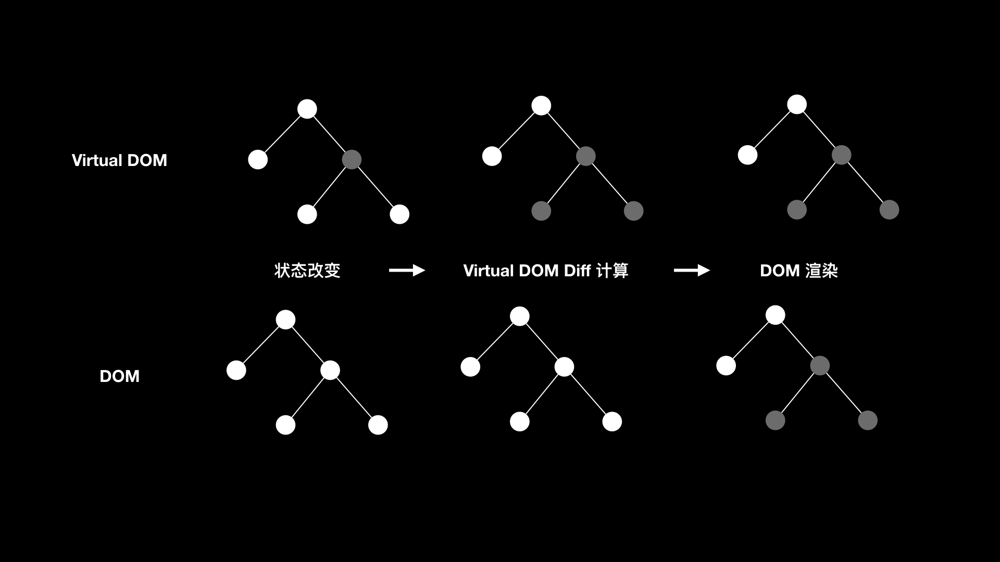

<head>
    
    
</head>

# Table of Contents

1.  [Algorithm](#org9ca71b4)
2.  [Review](#orge87800e)
    1.  [怎么减少 App 电量消耗](#org586500f)
        1.  [如何获取电量？](#org27b027c)
        2.  [如何诊断电量问题](#org7292a29)
        3.  [优化电量](#orge3c669d)
    2.  [基础模块 matrix-iOS](#orgfa1b8fb)
        1.  [子线程监控检测时间间隔](#org059121a)
        2.  [子线程监控退火算法](#orga938349)
        3.  [RunLoop 卡顿时间阈值设置](#org082c2e3)
        4.  [CPU 使用率阈值设置](#org3af60ec)
    3.  [除了 Cocoa，iOS还可以用哪些 GUI 框架开发](#org9c46f90)
        1.  [目前流行的 GUI 框架](#org3de3fcd)
        2.  [GUI 框架里都有什么](#orgd364848)
        3.  [渲染流程](#org4988933)
        4.  [Texture 里 Node 的异步绘制](#org63b79ab)
    4.  [细说 iOS 响应式框架变迁，哪些思想可以为我所用](#org50552da)
        1.  [Monad](#org7e2756f)
        2.  [函数响应式编程例子](#org1392786)
    5.  [如何构造酷炫的物理效果和过场动画效果](#org73df54e)
        1.  [Lottie](#org872b45d)
        2.  [Bodymovin](#org5c06343)
        3.  [在 iOS 中使用 Lottie](#org34a1f1a)
        4.  [多平台支持](#org99cd2f1)
        5.  [Lottie 实现原理](#orgdda535e)
    6.  [A/B 测试：验证决策效果的利器](#orgde3973e)
        1.  [App 开发中的 A/B 测试](#orgeeae845)
        2.  [A/B 测试全景设计](#orgad0bfc4)
        3.  [A/B 测试 SDK](#org720c945)
    7.  [怎样构建底层的发布和订阅事件总线](#orge4ada85)
        1.  [Promise](#orga7f8fc9)
        2.  [PromiseKit](#orgd78409d)

# Algorithm

Leetcode 2538: [Difference Between Maximum and Minimum Price Sum](https://leetcode.com/problems/difference-between-maximum-and-minimum-price-sum)

<https://dreamume.medium.com/leetcode-2538-difference-between-maximum-and-minimum-price-sum-ea1c56d492ab>

# Review

iOS 开发高手课    戴铭

## 怎么减少 App 电量消耗

### 如何获取电量？

    [UIDevice currentDevice].batteryMonitoringEnabled = YES;
    NSLog(@"the battery level is %f", [UIDevice currentDevice].batteryLevel);

### 如何诊断电量问题

首先想到可能就是这个页面有没有开启定位，网络请求是不是频繁，亦或是定时任务时间是不是间隔过小

当你用排除法将所有功能注释掉后，如果还有问题，那么这个耗电一定是由其他线程引起的。创建这个耗电线程的地方可能是在其他地方，比如是由第三方库引起，或者是公司其他团队开发的库

先反过来看看出现电量问题的期间，哪个线程是有问题的。通过下面的这段代码，你就可以获取到所有线程的信息：

    thread_act_array_t threads;
    mach_msg_type_number_t threadCount = 0;
    const task_t thisTask = mach_task_self();
    kern_return_t kr = task_threads(thisTask, &threads, &threadCount);

从上面代码可以看出，通过 task_threads 函数，我们就能够得到所有的线程信息数组 threads，以及线程总数 threadCount。threads 数组里的线程信息结构体 thread_basic_info 里有一个记录 CPU 使用百分比的字段 cpu_usage。thread_basic_info 结构体的代码如下：

    struct thread_basic_info {
            time_value_t    user_time;      /* user 运行的时间 */
            time_value_t    system_time;    /* system 运行的时间 */
            integer_t       cpu_usage;      /* CPU 使用百分比 */
            policy_t        policy;         /* 有效的计划策略 */
            integer_t       run_state;      /* run state (see below) */
            integer_t       flags;          /* various flags (see below) */
            integer_t       suspend_count;  /* suspend count for thread */
            integer_t       sleep_time;     /* 休眠时间 */
    };

有了这个 cpu_usage 字段，你就可以通过遍历所有线程，去查看是哪个线程的 CPU 使用百分比过高了。如果某个线程的 CPU 使用率长时间都比较高的话，比如超过了 90%，就能够推断出它是有问题的。这时，将其方法堆栈记录下来，你就可以知道到底是哪段代码让你 App 的电量消耗多了

通过这种方法，你就可以快速定位到问题，有针对性地进行代码优化。多线程 CPU 使用率检查的完整代码如下：

    // 轮询检查多个线程 CPU 情况
    + (void)updateCPU {
        thread_act_array_t threads;
        mach_msg_type_number_t threadCount = 0;
        const task_t thisTask = mach_task_self();
        kern_return_t kr = task_threads(thisTask, &threads, &threadCount);
        if (kr != KERN_SUCCESS) {
            return;
        }
        for (int i = 0; i < threadCount; i++) {
            thread_info_data_t threadInfo;
            thread_basic_info_t threadBaseInfo;
            mach_msg_type_number_t threadInfoCount = THREAD_INFO_MAX;
            if (thread_info((thread_act_t)threads[i], 
                            THREAD_BASIC_INFO, 
                            (thread_info_t)threadInfo, &threadInfoCount) == KERN_SUCCESS) {
                threadBaseInfo = (thread_basic_info_t)threadInfo;
                if (!(threadBaseInfo->flags & TH_FLAGS_IDLE)) {
                    integer_t cpuUsage = threadBaseInfo->cpu_usage / 10;
                    if (cpuUsage > 90) {
                        //cup 消耗大于 90 时打印和记录堆栈
                        NSString *reStr = smStackOfThread(threads[i]);
                        //记录数据库中
                        [[[SMLagDB shareInstance] increaseWithStackString:reStr] subscribeNext:^(id x) {}];
                        NSLog(@"CPU useage overload thread stack：\n%@",reStr);
                    }
                }
            }
        }
    }

### 优化电量

对 CPU 的使用要精打细算，要避免让 CPU 做多余的事情。对于大量数据的复杂计算，应该把数据传到服务器去处理，如果必须要在 App 内处理复杂数据计算，可以通过 GCD 的 dispatch_block_create_with_qos_class 方法指定队列的 Qos 为 QOS_CLASS_UTILITY，将计算工作放到这个队列的 block 里。在 QOS_CLASS_UTILITY 这种 Qos 模式下，系统针对大量数据的计算，以及复杂数据处理专门做了电量优化

接下来，我们再看看除了 CPU 会影响耗电，对电量影响较大的因素还有哪些呢？

除了 CPU，I/O 操作也是耗电大户。任何的 I/O 操作，都会破坏掉低功耗状态。那么，针对 I/O 操作要怎么优化呢？

业内的普遍做法是，将碎片化的数据磁盘存储操作延后，先在内存中聚合，然后再进行磁盘存储。碎片化的数据进行聚合，在内存中进行存储的机制，可以使用系统自带的 NSCache 来完成

NSCache 是线程安全的，NSCache 会在到达预设缓存空间值时清理缓存，这时会触发 cache:willEvictObject: 方法的回调，在这个回调里就可以对数据进行 I/O 操作，达到将聚合的数据 I/O 延后的目的。I/O 操作的次数减少了，对电量的消耗也就减少了

SDWebImage 图片加载框架，在图片的读取缓存处理时没有直接使用 I/O，而是使用了 NSCache。使用 NSCache 的相关代码如下：

    - (UIImage *)imageFromMemoryCacheForKey:(NSString *)key {
        return [self.memCache objectForKey:key];
    }
    
    - (UIImage *)imageFromDiskCacheForKey:(NSString *)key {
        // 检查 NSCache 里是否有
        UIImage *image = [self imageFromMemoryCacheForKey:key];
        if (image) {
            return image;
        }
        // 从磁盘里读
        UIImage *diskImage = [self diskImageForKey:key];
        if (diskImage && self.shouldCacheImagesInMemory) {
            NSUInteger cost = SDCacheCostForImage(diskImage);
            [self.memCache setObject:diskImage forKey:key cost:cost];
        }
        return diskImage;
    }

可以看出，SDWebImage 将获取的图片数据都放到了 NSCache 里，利用 NSCache 缓存策略进行图片缓存内存的管理。每次读取图片时，会检查 NSCache 是否已经存在图片数据：如果有，就直接从 NSCache 里读取；如果没有，才会通过 I/O 读取磁盘缓存图片

使用了 NSCache 内存缓存能够有效减少 I/O 操作，你在写类似功能时也可以采用这样的思路，让你的 App 更省电

CPU 和 I/O 这两大耗电问题都解决后，还有什么要注意的呢？这里还有两份关于 App 电量消耗的资料，你可以对照你的 App 来查看

苹果公司专门维护了一个电量优化指南 [Energy Efficiency Guide for iOS Apps](https://developer.apple.com/library/archive/documentation/Performance/Conceptual/EnergyGuide-iOS/)，分别从 CPU、设备唤醒、网络、图形、动画、视频、定位、加速度计、陀螺仪、磁力计、蓝牙等多方面因素提出了电量优化方面的建议。所以，当使用了苹果公司的电量优化指南里提到的功能时，严格按照指南里的最佳实践去做就能够保证这些功能不会引起不合理的电量消耗

同时，苹果公司在 2017 年 WWDC 的 Session 238 也分享了一个关于如何编写节能 App 的主题 [Writing Energy Efficient Apps](https://developer.apple.com/videos/wwdc2017)

## 基础模块 matrix-iOS

微信最近开源了一个卡顿监控系统 [matrix-iOS](https://github.com/tencent/matrix/tree/master/matrix/matrix-iOS)，对性能的优化考虑得非常全面，这些优化不仅能够应用在卡顿监控上，对于其他监控都有很好的借鉴作用，所以非常值得我们深入了解一下。接下来，我就这个话题和你展开一下

微信团队开源的卡顿监控系统 [matrix](https://github.com/Tencent/matrix) 支持 iOS 和 android，如果你的 App 现在还没有卡顿监控系统，可以考虑直接集成 matrix-iOS，直接在 Podfile 里添加 pod ‘matrix-wechat’ 就可以了。如果已经有了卡顿监控系统，我建议你阅读下 matrix-iOS 的代码，里面有很多细节值得我们学习。比如：

-   子线程监控检测时间间隔：matrix-iOS 监控卡顿的子线程是通过 NSThread 创建的，检测时间间隔正常情况是 1 秒，在出现卡顿情况下，间隔时间会受检测线程退火算法影响，按照斐波那契数列递增，直到没有卡顿时恢复为 1 秒
-   子线程监控退火算法：避免一个卡顿会写入多个文件的情况
-   RunLoop 卡顿时间阈值设置：对于 RunLoop 超时阈值的设置，我在第 13 篇文章里建议设置为 3 秒，微信设置的是 2 秒
-   CPU 使用率阈值设置：当单核 CPU 使用率超过 80%，就判定 CPU 占用过高。CPU 使用率过高，可能导致 App 卡顿

matrix-iOS 卡顿监控系统的主要代码在 WCBlockMonitorMgr.mm 文件中

### 子线程监控检测时间间隔

matrix-iOS 是在 addMonitorThread 方法里，通过 NSThread 添加一个子线程来进行监控的。addMonitorThread 方法代码如下：

    - (void)addMonitorThread {
        m_bStop = NO;
        m_monitorThread = 
            [[NSThread alloc] initWithTarget:self 
                                    selector:@selector(threadProc) 
                                      object:nil];
        [m_monitorThread start];
    }

threadProc 方法包括了子线程监控卡顿的所有逻辑。它的代码比较多，我先和你分析与检测时间间隔相关的代码，然后再和你分析其他的主要代码：

    while (YES) {
        @autoreleasepool {
            if (g_bMonitor) {
                // 检查是否卡顿，以及卡顿原因
                // ...
                // 针对不同卡顿原因进行不同的处理
                // ...
            }
    
            // 时间间隔处理，检测时间间隔正常情况是1秒，间隔时间会
            // 受检测线程退火算法影响，按照斐波那契数列递增，直到没有卡顿时恢复为1秒。
            for (int nCnt = 0; nCnt < m_nIntervalTime && !m_bStop; nCnt++) {
                if (g_MainThreadHandle && g_bMonitor) {
                    int intervalCount = g_CheckPeriodTime / g_PerStackInterval;
                    if (intervalCount <= 0) {
                        usleep(g_CheckPeriodTime);
                    } else {
                        // ...
                    }
                } else {
                    usleep(g_CheckPeriodTime);
                }
            }
    
            if (m_bStop) {
                break;
            }
        }
     }

可以看出，创建的子线程通过 while 使其成为常驻线程，直到主动执行 stop 方法才会被销毁。其中，使用 usleep 方法进行时间间隔操作， g_CheckPeriodTime 就是正常情况的时间间隔的值，退火算法影响的是 m_nIntervalTime，递增后检测卡顿的时间间隔就会不断变长。直到判定卡顿已结束，m_nIntervalTime 的值会恢复成 1

接下来，跟踪 g_CheckPeriodTime 的定义就能够找到正常情况下子线程卡顿监控的时间间隔。 g_CheckPeriodTime 的定义如下：

    static useconds_t g_CheckPeriodTime = g_defaultCheckPeriodTime;

其中 g_defaultCheckPeriodTime 的定义是：

    #define BM_MicroFormat_Second 1000000
    const static useconds_t g_defaultCheckPeriodTime = 1 * BM_MicroFormat_Second;

可以看出，子线程监控检测时间间隔 g_CheckPeriodTime，被设置的值就是 1 秒

### 子线程监控退火算法

子线程监控检测时间间隔设置为 1 秒，在没有卡顿问题，不需要获取主线程堆栈信息的情况下性能消耗几乎可以忽略不计。但是，当遇到卡顿问题时，而且一个卡顿持续好几秒的话，就会持续获取主线程堆栈信息，增加性能损耗。更重要的是，持续获取的这些堆栈信息都是重复的，完全没有必要

所以，matrix-iOS 采用了退火算法递增时间间隔，来避免因为同一个卡顿问题，不断去获取主线程堆栈信息的情况，从而提升了算法性能

同时，一个卡顿问题只获取一个主线程堆栈信息，也就是一个卡顿问题 matrix-iOS 只会进行一次磁盘存储，减少了存储 I/O 也就减少了性能消耗

所以，这种策略能够有效减少由于获取主线程堆栈信息带来的性能消耗

那么，matrix-iOS 是如何实现退火算法的呢?

因为触发退火算法的条件是卡顿，所以我们先回头来看看子线程监控卡顿主方法 threadProc 里和发现卡顿后处理相关的代码：

    while (YES) {
        @autoreleasepool {
            if (g_bMonitor) {
                // 检查是否卡顿，以及卡顿原因
                EDumpType dumpType = [self check];
                if (m_bStop) {
                    break;
                }
    
                // 针对不同卡顿原因进行不同的处理
                // ...
                if (dumpType != EDumpType_Unlag) {
                    if (EDumpType_BackgroundMainThreadBlock == dumpType ||
                        EDumpType_MainThreadBlock == dumpType) {
                        if (g_CurrentThreadCount > 64) {
                            // 线程数超过64个，认为线程过多造成卡顿，不用记录主线程堆栈
                            dumpType = EDumpType_BlockThreadTooMuch;
                            [self dumpFileWithType:dumpType];
                        } else {
                            EFilterType filterType = [self needFilter];
                            if (filterType == EFilterType_None) {
                                if (g_MainThreadHandle) {
                                    if (g_PointMainThreadArray != NULL) {
                                        free(g_PointMainThreadArray);
                                        g_PointMainThreadArray = NULL;
                                    }
                                    g_PointMainThreadArray = 
                                        [m_pointMainThreadHandler getPointStackCursor];
                                    // 函数主线程堆栈写文件记录
                                    m_potenHandledLagFile = 
                                        [self dumpFileWithType:dumpType];
                                    // 回调处理主线程堆栈文件
                                    // ...
                                } else {
                                    // 主线程堆栈写文件记录
                                    m_potenHandledLagFile = 
                                        [self dumpFileWithType:dumpType];
                                    // ...
                                }
                            } else {
                                // 对于 filterType 满足退火算法、主线程堆栈数太少、一天内记录主线程堆栈过多这些情况不用进行写文件操作
                                // ...
                            }
                        }
                    } else {
                        m_potenHandledLagFile = [self dumpFileWithType:dumpType];
                    }
                } else {
                    [self resetStatus];
                }
            }
    
            // 时间间隔处理，检测时间间隔正常情况是1秒，间隔时间会受检测线程退火算法影响，按照斐波那契数列递增，直到没有卡顿时恢复为1秒。
            // ...
        }
    }

按照微信团队的经验，线程数超出 64 个时会导致主线程卡顿，如果卡顿是由于线程多造成的，那么就没必要通过获取主线程堆栈去找卡顿原因了。根据 matrix-iOS 的实测，每隔 50 毫秒获取主线程堆栈会增加 3% 的 CPU 占用，所以当检测到主线程卡顿以后，我们需要先判断是否是因为线程数过多导致的，而不是一有卡顿问题就去获取主线程堆栈

如果不是线程过多造成的卡顿问题，matrix-iOS 会通过 needFilter 方法去对比前后两次获取的主线程堆栈，如果两次堆栈是一样的，那就表示卡顿还没结束，满足退火算法条件，needFilter 方法会返回 EFilterType。EFilterType 为 EFilterType_Annealing，表示类型为退火算法。满足退火算法后，主线程堆栈就不会立刻进行写文件操作

在 needFilter 方法里，needFilter 通过 [m_pointMainThreadHandler getLastMainThreadStack] 获取当前主线程堆栈，然后记录在 m_vecLastMainThreadCallStack 里。下次卡顿时，再获取主线程堆栈，新获取的堆栈和上次记录的 m_vecLastMainThreadCallStack 堆栈进行对比：

-   如果两个堆栈不同，表示这是一个新的卡顿，就会退出退火算法
-   如果两个堆栈相同，就用斐波那契数列递增子线程检查时间间隔

递增时间的代码如下：

    if (bIsSame) {
        NSUInteger lastTimeInterval = m_nIntervalTime;
        // 递增 m_nIntervalTime
        m_nIntervalTime = m_nLastTimeInterval + m_nIntervalTime;
        m_nLastTimeInterval = lastTimeInterval;
        MatrixInfo(@"call stack same timeinterval = %lu", 
                   (unsigned long) m_nIntervalTime);
    
        return EFilterType_Annealing;
    } 

可以看出，将子线程检查主线程时间间隔增加后，needFilter 就直接返回 EFilterType_Annealing 类型表示当前情况满足退火算法。使用退火算法，可以有效降低没有必要地获取主线程堆栈的频率。这样的话，我们就能够在准确获取卡顿的前提下，还能保障 App 性能不会受卡顿监控系统的影响

### RunLoop 卡顿时间阈值设置

RunLoop 超时检查的相关逻辑代码都在 check 方法里。check 方法和 RunLoop 超时相关代码如下：

    - (EDumpType)check
    {
        // 1. RunLoop 超时判断
        // RunLoop 是不是处在执行方法状态中
        BOOL tmp_g_bRun = g_bRun;
        // 执行了多长时间
        struct timeval tmp_g_tvRun = g_tvRun;
    
        struct timeval tvCur;
        gettimeofday(&tvCur, NULL);
        unsigned long long diff = 
            [WCBlockMonitorMgr diffTime:&tmp_g_tvRun endTime:&tvCur];
    
        // ...
    
        m_blockDiffTime = 0;
        // 判断执行时长是否超时
        if (tmp_g_bRun && tmp_g_tvRun.tv_sec && tmp_g_tvRun.tv_usec && 
            __timercmp(&tmp_g_tvRun, &tvCur, <) && 
            diff > g_RunLoopTimeOut) {
            m_blockDiffTime = tvCur.tv_sec - tmp_g_tvRun.tv_sec;
    
            // ...
    
            return EDumpType_MainThreadBlock;
        }
    
        // ...
    
        // 2. CPU 使用率
    
        // ...
    
        // 3. 没问题
    
        return EDumpType;
    }

可以看出，在判断执行时长是否超时代码中的 g_RunLoopTimeOut 就是超时的阈值。通过这个阈值，我们就可以知道 matrix-iOS 设置的 RunLoop 卡顿时间阈值是多少了。g_RunLoopTimeOut 的定义如下：

    static useconds_t g_RunLoopTimeOut = g_defaultRunLoopTimeOut;
    const static useconds_t g_defaultRunLoopTimeOut = 2 * BM_MicroFormat_Second;

可以看出，matrix-iOS 设置的 RunLoop 卡顿时间阈值是 2 秒

还有一点我需要再说明一下，我们所说的卡顿监控方案，主要是针对那些在一段时间内用户无法点击，通过日志也很难复现问题的情况而做的。这样的卡顿问题属于头部问题，对用户的伤害是最大的，是需要优先解决的。这种方案，是不适合短时间掉帧的情况的。短时间掉帧问题对用户体验也有影响，但是属于优化问题

除了 RunLoop 超时会造成卡顿问题外，在 check 方法里还有对于 CPU 使用率的判断处理，那么我再带你来看看 matrix-iOS 是如何通过 CPU 使用率来判断卡顿的

### CPU 使用率阈值设置

matrix-iOS 是如何设置这个 CPU 使用率阈值的呢？check 方法里的相关代码如下:

    if (m_bTrackCPU) {
        unsigned long long checkPeriod = 
            [WCBlockMonitorMgr diffTime:&g_lastCheckTime endTime:&tvCur];
        gettimeofday(&g_lastCheckTime, NULL);
        // 检查是否超过 CPU 使用率阈值限制，报 CPU 使用率一段时间过高
        if ([m_cpuHandler cultivateCpuUsage:cpuUsage periodTime:(float)checkPeriod / 1000000]) {
            MatrixInfo(@"exceed cpu average usage");
            BM_SAFE_CALL_SELECTOR_NO_RETURN(_delegate, 
                                            @selector(onBlockMonitorIntervalCPUTooHigh:), 
                                            onBlockMonitorIntervalCPUTooHigh:self)
            if ([_monitorConfigHandler getShouldGetCPUIntervalHighLog]) {
                return EDumpType_CPUIntervalHigh;
            }
        }
        // 针对 CPU 满负荷情况，直接报 CPU 使用率过高引起卡顿
        if (cpuUsage > g_CPUUsagePercent) {
            MatrixInfo(@"check cpu over usage dump %f", cpuUsage);
            BM_SAFE_CALL_SELECTOR_NO_RETURN(_delegate, 
                                            @selector(onBlockMonitorCurrentCPUTooHigh:), 
                                            onBlockMonitorCurrentCPUTooHigh:self)
            if ([_monitorConfigHandler getShouldGetCPUHighLog]) {
                return EDumpType_CPUBlock;
            }
        }
    }

通过上面代码，你会发现 matrix-iOS 使用了两个阈值，分别返回两种类型的问题，对应两种导致卡顿的情况：

-   一个是， CPU 已经满负荷，直接返回 CPU 使用率过高引起卡顿
-   另一个是，持续时间内 CPU 使用率一直超过某个阈值，就返回 CPU 使用率造成了卡顿

CPU 使用率阈值就在 cultivateCpuUsage:cpuUsage periodTime:periodSec 方法里。阈值相关逻辑代码如下:

    if (cpuUsage > 80. && m_tickTok == 0 && m_bLastOverEighty == NO) {
        MatrixInfo(@"start track cpu usage");
        m_foregroundOverEightyTotalSec = 0;
        m_backgroundOverEightyTotalSec = 0;
        m_bLastOverEighty = YES;
    }

## 除了 Cocoa，iOS还可以用哪些 GUI 框架开发

在 iOS 开发时，默认使用的都是系统自带的 Cocoa Touch 框架，所以如果你还想进一步提高界面响应速度，赶超其他使用 Cocoa Touch 框架的 App 用户体验时，就要考虑使用其他的 GUI 框架来优化 App 界面的响应速度了

### 目前流行的 GUI 框架

现在流行的 GUI 框架除了 Cocoa Touch 外，还有 WebKit、Flutter、Texture（原名 AsyncDisplayKit）、Blink、Android GUI 等。其中，WebKit、Flutter、Texture 可以用于 iOS 开发。接下来，我就和你说说这三款 GUI 框架

WebKit 框架包含了 WebCore 和 JavaScriptCore，使用 HTML 和 CSS 进行布局，使用 JavaScript 编写程序。WebKit 还提供了 Objective-C 应用程序编程接口，方便基于 Cocoa API 的应用使用。在 iOS 开发中，我们最常使用的 UIWebView 和 WKWebView 控件都是基于 WebKit 框架

[深入剖析 WebKit](https://ming1016.github.io/2017/10/11/deeply-analyse-webkit/) 详细分析了它的原理

Flutter 是 Google 公司于 2017 年推出的一个移动应用开发的 GUI 框架，使用 Dart 语言编写程序，一套代码可以同时运行在 iOS 和 Android 平台

Texture 框架的基本单元，是基于 UIView 抽象的节点 ASDisplayNode。和 UIView 不同的是 ，ASDisplayNode 是线程安全的，可以在后台线程上并行实例化和配置整个层级结构。Texture 框架的开发语言，使用的是苹果公司自家的 Objective-C 和 Swift

WebKit、Flutter、Texture 这三个 GUI 框架，与 Cocoa Touch 的对比，如下图所示：

Texture 和其他 GUI 框架一样都是使用的应用更加广泛的 FlexBox 布局。使用 FlexBox 布局的好处是，可以让 iOS 开发者用到前端先进的 W3C 标准响应式布局。目前， FlexBox 已经是布局的趋势，连 iOS 新推出的 UIStackView 布局方式，也是按照 FlexBox 布局思路来设计的

另外，Texture 是这些框架中唯一使用异步节点计算的框架。使用异步节点计算，可以提高主线程的响应速度。所以，Texture 在节点计算上的效率要比其他框架高

基于以上三个方面的原因，如果要从 Cocoa Touch 框架前移到其他的 GUI 框架，从学习成本、收益等角度考虑的话，转到 Texture 会是个不错的选择

因此，我会和你重点分析一下 Texture 框架。因为现在的 GUI 技术已经非常成熟了，各种 GUI 框架的底层也大同小异，所以接下来我会先和你介绍 GUI 框架中的通用性内容，然后再与你讲述 Texture 的独特之处

### GUI 框架里都有什么

控件之间的关系是由渲染树（Render Tree）这种抽象的树结构来记录的。渲染树关注的是界面的布局，控件在界面中的位置和大小都是由渲染树来确定

基于渲染树，GUI 框架还会创建一个渲染层树（RenderLayer Tree），渲染层树由渲染层对象组成，根据 GUI 框架的优化条件来确定创建哪些渲染层对象，每次新创建一个渲染层对象就会去设置它的父对象和兄弟对象。渲染层对象创建完毕，接下来就需要将各渲染层对象里的控件按照渲染树布局生成 Bitmap，最后 GPU 就可以渲染 Bitmap 来让你看到界面了

控件、渲染树、渲染层树之间的关系，如下图所示：

WebKit 和 Flutter 都是开源项目，我们可以通过它们的代码看到 GUI 框架具体是怎么实现控件、渲染树、渲染层树和生成 Bitmap 的

WebKit 在 GUI 框架层面的效率并不低，单就渲染来说，它的性能一点也不弱于 Cocoa Touch 和 Flutter 框架

-   使用 WebKit 的网页显示慢，主要是由于 CSS（Cascading Style Sheet） 和 JavaScript 资源加载方式导致的
-   同时，解析时 HTML、CSS、JavaScript 需要兼容老版本，JavaScript 类型推断失败会重来，列表缺少重用机制等原因，导致 WebKit 框架的整体性能没有其他框架好

开始的时候，Flutter 也是基于 Chrome 浏览器引擎的。后来，谷歌公司考虑到 Flutter 的性能，所以去掉了 HTML、CSS、JavaScript 的支持，而改用自家的 Dart 语言以甩掉历史包袱。关于这方面的细节，你可以查看 [Flutter 创始人 Eric 的采访视频](https://zhuanlan.zhihu.com/p/52666477) 来了解

### 渲染流程

GUI 框架中的渲染，一般都会经过布局、渲染、合成这三个阶段

布局阶段要完成的主要工作，是依据渲染树计算出控件的大小和位置。WebKit 用 CSS 来布局，CSS 会提供 Frame 布局和 FlexBox 布局；Flutter 也支持 Frame 布局和 FlexBox 布局；Cocoa Touch 框架本身不支持 FlexBox 布局，但是通过 Facebook 的 [Yoga 库](https://yogalayout.com/) 也能够使用 FlexBox 布局

由于 Frame 布局需要精确描述每个界面元素的具体位置和大小，无论从代码编写，还是从代码可读性上看，成本都会高很多。所以说，FlexBox 对于 iOS 开发来说是另外一种很好的选择

渲染阶段的主要工作，是利用图形函数计算出界面的内容。一般情况下，对于 2D 平面的渲染都是使用 CPU 计算，对 3D 空间的渲染会使用 GPU 计算

Cocoa Touch 和 Texture 框架使用的是 Core Animation，3D 使用的是 Metal 引擎。Flutter 使用的是 Skia，3D 使用的是 OpenGL(ES)

在渲染这方面，我觉得 WebKit 做得更出色，考虑到多平台支持，WebKit 将渲染接口抽象了出来，实现层根据平台进行区分，比如在 iOS 上就用 CoreGraphics 来渲染，在 Android 就用 Skia 渲染

合成阶段的主要工作，是合并图层。这样做的目的，主要是节省显示内存，只显示一屏需要的像素，也只进行这些像素数据的计算。这个过程完成后，再将所得数据进行光栅化处理，最后交给 GPU 渲染成你可以看到的 Bitmap

通过上面的内容，我们可以看到，主流 GUI 框架的内容和渲染流程，区别并不是很大

但 Texture 对于那些希望能够在用户交互体验上进行大幅提升的 iOS 开发者来说，很小的切换成本，同时性能能大幅提升的收益，其实是很有诱惑力的

通过对 GUI 框架都包括什么和渲染流程的分析，再次印证了我们的观点：Texture 是个值得推荐的框架，不仅在于它与 Cocoa Touch 框架的相似使得学习成本较低，还得益于它本身在性能上的先进性

那么，接下来我就再跟你说说 Texture 最大的优势是什么？以及它是怎么做到的？

### Texture 里 Node 的异步绘制

Texture 最大的优势就是开发了线程安全的 ASDisplayNode，而且还能够很好的和 UIView 共生。这样的话，我们就可以在原有使用 UIView 开发的程序基础之上使用 Texture，而不用完全重构所有界面

随着 CPU 多核技术的发展，界面渲染计算都在主线程完成，对于多核 CPU 来说确实是有些浪费。ASDisplayNode 是 UIView 和 CALayer 的抽象，能实现不在主线程执行视图的布局绘制和层级计算，充分发挥多核 CPU 的优势

首先，我们来看看 Texture 最核心的线程安全节点 ASDisplayNode 是做什么的？

在 Cocoa Touch 框架里，当 CALayer 内容更新时会去找 CALayer 的 delegate，也就是 displayLayer: 方法。UIView 会实现 displayLayer: 这个 delegate 方法。UIView 里实现 drawRect: 这个 delegate 方法能够自定义 CALayer

在 Texture 中，ASDisplayNode 替代了这个 delegate，解耦了 UIView 和 CALayer，并将 UIView 包装成 ASDisplayView，将 CALayer 包装成 ASDisplayLayer 供外部使用

然后，我们再来看看 ASDisplayNode 是如何进行异步绘制的？

ASDisplayLayer 是整个绘制的起点，绘制事件先在 displayBlock 设置好，然后 ASDisplayNode 调用 displayBlock 来进行异步绘制。整个过程分为三步

第一步，得到 displayBlock。这个 Block 里有需要绘制的内容，对应的代码如下：

    asyncdisplaykit_async_transaction_operation_block_t displayBlock = 
        [self _displayBlockWithAsynchronous:asynchronously 
                           isCancelledBlock:isCancelledBlock 
                                rasterizing:NO];

其中，displayBlock 就是需要绘制的内容

第二步，定义一个回调 completionBlock ，绘制完成后执行。代码如下：

    asyncdisplaykit_async_transaction_operation_completion_block_t completionBlock 
    = ^(id<NSObject> value, BOOL canceled) {
        ASDisplayNodeCAssertMainThread();
        if (!canceled && !isCancelledBlock()) {
            // displayBlock 执行的是绘图操作，返回的类型是 UIImage
            UIImage *image = (UIImage *)value;
            BOOL stretchable = 
                (NO == UIEdgeInsetsEqualToEdgeInsets(image.capInsets, UIEdgeInsetsZero));
            if (stretchable) {
                ASDisplayNodeSetResizableContents(layer, image);
            } else {
                layer.contentsScale = self.contentsScale;
                // 设置为 CALayer 的寄宿图
                layer.contents = (id)image.CGImage;
            }
            [self didDisplayAsyncLayer:self.asyncLayer];
    
            if (rasterizesSubtree) {
                ASDisplayNodePerformBlockOnEverySubnode(self, NO, ^(ASDisplayNode * _Nonnull node) {
                        [node didDisplayAsyncLayer:node.asyncLayer];
                    });
            }
        }
    };

上面代码中，completionBlock 里就是绘制完成后需要去执行的事情，内容是完成 CALayer 寄宿图的设置。 value 是 displayBlock 返回的值，类型是 UIImage。displayBlock 用的是线程安全的 Core Graphics，所以你可以安心地把 displayBlock 放到后台线程去异步执行

第三步，如果设置为异步展示，就先向上找到属性 asyncdisplaykit_parentTransactionContainer 为 YES 的 CALayer，获取 containerLayer 的 ASAsyncTransaction，然后将 displayBlock 添加到 ASAsyncTransaction 的调度队列里，根据 drawingPriority 优先级执行 displayBlock。具体代码如下:

    if (asynchronously) {
        // 向上找到属性 asyncdisplaykit_parentTransactionContainer 为 YES 的 CALayer
        CALayer *containerLayer = 
            layer.asyncdisplaykit_parentTransactionContainer ? : layer;
    
        // 获取 containerLayer 的 ASAsyncTransaction
        _ASAsyncTransaction *transaction = containerLayer.asyncdisplaykit_asyncTransaction;
    
        // 将 displayBlock 添加到 ASAsyncTransaction 的调度队列里
        [transaction addOperationWithBlock:displayBlock 
                                  priority:self.drawingPriority 
                                     queue:[_ASDisplayLayer displayQueue] 
                                completion:completionBlock];
    } else {
      // 设置为不是异步就直接调用 displayBlock 进行绘制
      UIImage *contents = (UIImage *)displayBlock();
      completionBlock(contents, NO);
    }

可以看到，displayBlock 被添加到 ASAsyncTransaction 里进行调度。这里，ASAsyncTransactionQueue 是 Texture 的调度队列

通过上面这三步，Texture 就完成了 ASDisplayNode 的异步绘制

## 细说 iOS 响应式框架变迁，哪些思想可以为我所用

说到 iOS 响应式框架，最开始被大家知道的是 ReactiveCocoa（简称 RAC），后来比较流行的是 RxSwift。但据我了解，iOS 原生开发使用 ReactiveCocoa 框架的团队并不多，而前端在推出 React.js 后，响应式思路遍地开花

那么，响应式框架到底是什么，为什么在 iOS 原生开发中没被广泛采用，却能在前端领域得到推广呢？

我们先来看看响应式框架，它指的是能够支持响应式编程范式的框架。使用了响应式框架，你在编程时就可以使用数据流传播数据的变化，响应这个数据流的计算模型会自动计算出新的值，将新的值通过数据流传给下一个响应的计算模型，如此反复下去，直到没有响应者为止

React.js 框架的底层有个 Virtual DOM（虚拟文档对象模型），页面组件状态会和 Virtual DOM 绑定，用来和 DOM（文档对象模型）做映射与转换。当组件状态更新时，Virtual DOM 就会进行 Diff 计算，最终只将需要渲染的节点进行实际 DOM 的渲染

JavaScript 每次操作 DOM 都会全部重新渲染，而 Virtual DOM 相当于 JavaScript 和 DOM 之间的一个缓存，JavaScript 每次都是操作这个缓存，对其进行 Diff 和变更，最后才将整体变化对应到 DOM 进行最后的渲染，从而减少没必要的渲染

React.js 的 Virtual DOM 映射和转换 DOM 的原理，如下图所示。我们一起通过原理，来分析一下它的性能提升

可以看出，操作 Virtual DOM 时并不会直接进行 DOM 渲染，而是在完成了 Diff 计算得到所有实际变化的节点后才会进行一次 DOM 操作，然后整体渲染。而 DOM 只要有操作就会进行整体渲染

直接在 DOM 上进行操作是非常昂贵的，所以视图组件会和 Virtual DOM 绑定，状态的改变直接更改 Virtual DOM。Virtual DOM 会检查两个状态之间的差异，进行最小的修改，所以 React.js 具有很好的性能。也正是因为性能良好，React.js 才能够在前端圈流行起来

而反观 iOS，ReactiveCocoa 框架的思路，其实与 React.js 中页面组件状态和 Virtual DOM 绑定、同步更新的思路是一致的。那为什么 ReactiveCocoa 在 iOS 原生开发中就没流行起来呢？

我觉得，主要原因是前端 DOM 树的结构非常复杂，进行一次完整的 DOM 树变更，会带来严重的性能问题，而有了 Virtual DOM 之后，不直接操作 DOM 可以避免对整个 DOM 树进行变更，使得我们不用再担忧应用的性能问题

但是，这种性能问题并不存在于 iOS 原生开发。这，主要是得易于 Cocoa Touch 框架的界面节点树结构要比 DOM 树简单得多，没有前端那样的历史包袱

与前端 DOM 渲染机制不同，Cocoa Touch 每次更新视图时不会立刻进行整个视图节点树的重新渲染，而是会通过 setNeedsLayout 方法先标记该视图需要重新布局，直到绘图循环到这个视图节点时才开始调用 layoutSubviews 方法进行重新布局，最后再渲染

所以说，ReactiveCocoa 框架并没有为 iOS 的 App 带来更好的性能。当一个框架可有可无，而且没有明显收益时，一般团队是没有理由去使用的。那么，像 ReactiveCocoa 这种响应式思想的框架在 iOS 里就没有可取之处了吗？

ReactiveCocoa 是将函数式编程和响应式编程结合起来的库，通过函数式编程思想建立了数据流的通道，数据流动时会经过各种函数的处理最终到达和数据绑定的界面，由此实现了数据变化响应界面变化的效果

### Monad

ReactiveCocoa 是采用号称纯函数式编程语言里的 Monad 设计模式搭建起来的，核心类是 RACStream。我们使用最多的 RACSignal（信号类，建立数据流通道的基本单元） ，就是继承自 RACStream。RACStream 的定义如下：

    typedef RACStream * (^RACStreamBindBlock)(id value, BOOL *stop);
    
    /// An abstract class representing any stream of values.
    ///
    /// This class represents a monad, upon which many stream-based operations can
    /// be built.
    ///
    /// When subclassing RACStream, only the methods in the main @interface body need
    /// to be overridden.
    @interface RACStream : NSObject
    
    + (instancetype)empty;
    + (instancetype)return:(id)value;
    - (instancetype)bind:(RACStreamBindBlock (^)(void))block;
    - (instancetype)concat:(RACStream *)stream;
    - (instancetype)zipWith:(RACStream *)stream;
    
    @end

通过定义的注释可以看出，RACStream 的作者也很明确地写出了 RACStream 类表示的是一个 Monad，所以我们在 RACStream 上可以构建许多基于数据流的操作；RACStreamBindBlock，就是用来处理 RACStream 接收到数据的函数。那么，Monad 就一定是好的设计模式吗？

从代码视觉上看，Monad 为了避免赋值语句做了很多数据传递的管道工作。这样的话，我们在分析问题时，就很容易从代码层面清晰地看出数据流向和变化。而如果是赋值语句，在分析数据时就需要考虑数据状态和生命周期，会增加调试定位的成本，强依赖调试工具去观察变量

不过无论是赋值方式还是 Monad 方式，编译后生成的代码都是一样的。王垠在他的博文 [函数式语言的宗教](http://www.yinwang.org/blog-cn/2013/03/31/purely-functional) 里详细分析了 Monad，并且写了两段分别采用赋值和函数式的代码，编译后的机器码实际上是一样的。如果你感兴趣的话，可以看一下这篇文章

所以，如果你不想引入 ReactiveCocoa 库，还想使用函数响应式编程思想来开发程序的话，完全不用去重新实现一个采用 Monad 模式的 RACStream，只要在上层按照函数式编程的思想来搭建数据流管道，在下层使用赋值方式来管理数据就可以了。并且，采用这种方式，可能会比 Monad 这种“纯”函数来得更加容易

### 函数响应式编程例子

这个案例要完成的功能是：添加学生基本信息，添加完学生信息后，通过按钮点击累加学生分数，每次点击按钮分数加 5；所得分数在 30 分内，颜色显示为灰色；分数在 30 到 70 分之间，颜色显示为紫色；分数在 70 分内，状态文本显示不合格；超过 70 分，分数颜色显示为红色，状态文本显示合格。初始态分数为 0，状态文本显示未设置

这个功能虽然不难完成，但是如果我们将这些逻辑都写在一起，那必然是条件里套条件，当要修改功能时，还需要从头到尾再捋一遍

如果把逻辑拆分成小逻辑放到不同的方法里，当要修改功能时，查找起来也会跳来跳去，加上为了描述方法内逻辑，函数名和参数名也需要非常清晰。这，无疑加重了开发和维护成本，特别是函数里面的逻辑被修改了后，我们还要对应着修改方法名。否则，错误的方法名，将会误导后来的维护者

那么，使用函数响应式编程方式会不会好一些呢？

这里，我给出了使用函数响应式编程方式的代码，你可以对比看看是不是比条件里套条件和方法里套方法的写法要好

首先，创建一个学生的记录，在创建记录的链式调用里添加一个处理状态文本显示的逻辑。代码如下：

    // 添加学生基本信息
    self.student = [[[[[SMStudent create]
                       name:@"ming"]
                      gender:SMStudentGenderMale]
                     studentNumber:345]
                    filterIsASatisfyCredit:^BOOL(NSUInteger credit){
                        if (credit >= 70) {
                            // 分数大于等于 70 显示合格
                            self.isSatisfyLabel.text = @"合格";
                            self.isSatisfyLabel.textColor = [UIColor redColor];
                            return YES;
                        } else {
                            // 分数小于 70 不合格
                            self.isSatisfyLabel.text = @"不合格";
                            return NO;
                        }
                    }];

可以看出，当分数小于 70 时，状态文本会显示为“不合格”，大于等于 70 时会显示为“合格”

接下来，针对分数，我再创建一个信号，当分数有变化时，信号会将分数传递给这个分数信号的两个订阅者。代码如下：

    // 第一个订阅的credit处理
    [self.student.creditSubject subscribeNext:^(NSUInteger credit) {
        NSLog(@"第一个订阅的credit处理积分%lu",credit);
        self.currentCreditLabel.text = [NSString stringWithFormat:@"%lu",credit];
        if (credit < 30) {
            self.currentCreditLabel.textColor = [UIColor lightGrayColor];
        } else if(credit < 70) {
            self.currentCreditLabel.textColor = [UIColor purpleColor];
        } else {
            self.currentCreditLabel.textColor = [UIColor redColor];
        }
    }];
    
    // 第二个订阅的credit处理
    [self.student.creditSubject subscribeNext:^(NSUInteger credit) {
        NSLog(@"第二个订阅的credit处理积分%lu",credit);
        if (!(credit > 0)) {
            self.currentCreditLabel.text = @"0";
            self.isSatisfyLabel.text = @"未设置";
        }
    }];

可以看出，这两个分数信号的订阅者分别处理了两个功能逻辑：

-   第一个处理的是分数颜色
-   第二个处理的是初始状态下状态文本的显示逻辑

整体看起来，所有的逻辑都围绕着分数这个数据的更新自动流动起来，也能够很灵活地通过信号订阅的方式进行归类处理

采用这种编程方式，上层实现方式看起来类似于 ReactiveCocoa，而底层实现却非常简单，将信号订阅者直接使用赋值的方式赋值给一个集合进行维护，而没有使用 Monad 方式。底层对信号和订阅者的实现代码如下所示：

    @interface SMCreditSubject : NSObject
    
    typedef void(^SubscribeNextActionBlock)(NSUInteger credit);
    
    + (SMCreditSubject *)create;
    
    // 发送信号
    - (SMCreditSubject *)sendNext:(NSUInteger)credit;
    // 接收信号
    - (SMCreditSubject *)subscribeNext:(SubscribeNextActionBlock)block;
    
    @end
    
    @interface SMCreditSubject()
    
    @property (nonatomic, assign) NSUInteger credit; // 积分
    @property (nonatomic, strong) SubscribeNextActionBlock subscribeNextBlock; // 订阅信号事件
    @property (nonatomic, strong) NSMutableArray *blockArray; // 订阅信号事件队列
    
    @end
    
    @implementation SMCreditSubject
    
    // 创建信号
    + (SMCreditSubject *)create {
        SMCreditSubject *subject = [[self alloc] init];
        return subject;
    }
    
    // 发送信号
    - (SMCreditSubject *)sendNext:(NSUInteger)credit {
        self.credit = credit;
        if (self.blockArray.count > 0) {
            for (SubscribeNextActionBlock block in self.blockArray) {
                block(self.credit);
            }
        }
        return self;
    }
    
    // 订阅信号
    - (SMCreditSubject *)subscribeNext:(SubscribeNextActionBlock)block {
        if (block) {
            block(self.credit);
        }
        [self.blockArray addObject:block];
        return self;
    }
    
    #pragma mark - Getter
    - (NSMutableArray *)blockArray {
        if (!_blockArray) {
            _blockArray = [NSMutableArray array];
        }
        return _blockArray;
    }

如上面代码所示，订阅者都会记录到 blockArray 里，block 的类型是 SubscribeNextActionBlock

最终，我们使用函数式编程的思想，简单、高效地实现了这个功能。这个例子完整代码，你可以点击 [链接](https://github.com/ming1016/RACStudy) 查看

## 如何构造酷炫的物理效果和过场动画效果

### Lottie

[Lottie 框架](http://airbnb.io/lottie/#/) 很好地解决了动画制作与开发隔离，以及多平台统一的问题

Lottie 是 Airbnb 开源的一个动画框架。Lottie 这个名字来自于一名德国导演洛特·赖尼格尔（Lotte Reiniger），她最著名的电影叫作“阿赫迈德王子历险记（The Adventures of Prince Achmed）”。这个框架和其他的动画框架不太一样，动画的编写和维护将由动画设计师完成，完全无需开发者操心

动画设计师做好动画以后，可以使用 [After Effects](https://www.adobe.com/products/aftereffects.html) 将动画导出成 JSON 文件，然后由 Lottie 加载和渲染这个 JSON 文件，并转换成对应的动画代码。由于是 JSON 格式，文件也会很小，可以减少 App 包大小。运行时还可以通过代码控制更改动画，比如更改颜色、位置以及任何关键值。另外，Lottie 还支持页面切换的过场动画（UIViewController Transitions）

动画设计师使用 After Effects 创作，然后使用 [Bodymovin](https://github.com/airbnb/lottie-web) 进行导出的，开发者完全不用做什么额外的代码工作，就能够使用原生方式将其渲染出来

Bodymovin 是 Hernan Torrisi 做的一个 After Effects 的插件，起初导出的 JSON 文件只是通过 JavaScript 在网页中进行动画的播放，后来才将 JSON 文件的解析渲染应用到了其他平台上

那么，如何使用 Bodymovin 呢？

### Bodymovin

需要先到 [Adobe 官网](https://exchange.adobe.com/apps/cc/12557) 下载 Bodymovin 插件，并在 After Effects 中安装。使用 After Effects 制作完动画后，选择 Windows 菜单，找到 Extensions 的 Bodymovin 项，在菜单中选择 Render 按钮就可以输出 JSON 文件了

[LottieFiles 网站](https://lottiefiles.com/) 还是一个动画设计师分享作品的平台，每个动画效果的 JSON 文件都可下载使用。所以，如果你现在没有动画设计师配合的话，可以到这个网站去查找并下载一个 Bodymovin 生成的 JSON 文件，然后运用到工程中去试试效果

### 在 iOS 中使用 Lottie

在 iOS 开发中使用 Lottie 也很简单，只要集成 Lottie 框架，然后在程序中通过 Lottie 的接口控制 After Effects 生成的动画 JSON 就行了

首先，你可以通过 CocoaPods 集成 Lottie 框架到你工程中。Lottie iOS 框架的 GitHub 地址是 [lottie-ios](https://github.com/airbnb/lottie-ios/)，官方也提供了 [学习示例](https://github.com/airbnb/lottie-ios/tree/master/Example)

然后，快速读取一个由 Bodymovin 生成的 JSON 文件进行播放。具体代码如下所示：

    LOTAnimationView *animation = [LOTAnimationView animationNamed:@"Lottie"];
    [self.view addSubview:animation];
    [animation playWithCompletion:^(BOOL animationFinished) {
      // 动画完成后需要处理的事情
    }];

利用 Lottie 的动画进度控制能力，还可以完成手势与动效同步的问题。动画进度控制是 LOTAnimationView 的 animationProgress 属性，设置属性的示例代码如下：

    CGPoint translation = [gesture getTranslationInView:self.view];
    CGFloat progress = translation.y / self.view.bounds.size.height;
    animationView.animationProgress = progress;

Lottie 还带有一个 UIViewController animation-controller，可以自定义页面切换的过场动画，示例代码如下：

    #pragma mark -- 定制转场动画
    
    // 代理返回推出控制器的动画
    - (id<UIViewControllerAnimatedTransitioning>)animationControllerForPresentedController:(UIViewController *)presented 
                                                                      presentingController:(UIViewController *)presenting 
                                                                          sourceController:(UIViewController *)source {
      LOTAnimationTransitionController *animationController = 
          [[LOTAnimationTransitionController alloc] initWithAnimationNamed:@"vcTransition1" 
                                                            fromLayerNamed:@"outLayer" 
                                                              toLayerNamed:@"inLayer" 
                                                   applyAnimationTransform:NO];
      return animationController;
    }
    
    // 代理返回退出控制器的动画
    - (id<UIViewControllerAnimatedTransitioning>)animationControllerForDismissedController:(UIViewController *)dismissed {
        LOTAnimationTransitionController *animationController = 
            [[LOTAnimationTransitionController alloc] initWithAnimationNamed:@"vcTransition2" 
                                                              fromLayerNamed:@"outLayer" 
                                                                toLayerNamed:@"inLayer" 
                                                     applyAnimationTransform:NO];
        return animationController;
    }

Lottie 在运行期间提供接口和协议来更改动画，有动画数据搜索接口 LOTKeyPath，以及设置动画数据的协议 LOTValueDelegate。详细的说明和使用示例代码，你可以参看 [官方 iOS 教程](http://airbnb.io/lottie/#/ios)

### 多平台支持

Lottie 支持多平台，除了 支持 iOS、Android、React Native 和 Flutter。除了官方维护的这些平台外，Lottie 还支持 [Windows](https://github.com/CommunityToolkit/Lottie-Windows)、[Qt](https://blog.qt.io/blog/2019/03/08/announcing-qtlottie/)、[Skia](https://skia.org/user/modules/skottie)。陈卿还实现了 [React](https://github.com/chenqingspring/react-lottie)、[Vue](https://github.com/chenqingspring/vue-lottie)、[Angular](https://github.com/chenqingspring/ng-lottie) 的支持

有了这么多平台的支持，对于动画设计师来说，可以安心做动画，只要简单地转换就可以完美展现动画效果，再也不用担心到开发者那里动画效果被大打折扣了。而对于开发者来说，再也不用写那些难以维护的大量动效代码了，而且 App 安装包的体积还变小了

那么，这么神奇的框架，在 iOS 里到底是怎么实现的呢？接下来，我们就看下 Lottie 的实现原理吧

通过原理的学习，你会掌握通过 JSON 来控制代码逻辑的能力。比如，你可以把运营活动流程的代码逻辑设计为一种规范，再设计一个拖拽工具用来创建运营活动流程，最后生成一份表示运营活动逻辑的 JSON，下发到 App 内来开启新的运营活动

### Lottie 实现原理

实际上，Lottie iOS 在 iOS 内做的事情就是将 After Effects 编辑的动画内容，通过 JSON 文件这个中间媒介，一一映射到 iOS 的 LayerModel、Keyframe、ShapeItem、DashElement、Marker、Mask、Transform 这些类的属性中并保存了下来，接下来再通过 CoreAnimation 进行渲染。这就和你手动写动画代码的实现是一样的，只不过这个过程的精准描述，全部由动画设计师通过 JSON 文件输入进来了

Lottie iOS 使用系统自带的 Codable 协议来解析 JSON 文件，这样就可以享受系统升级带来性能提升的便利，比如 ShapeItem 这个类设计如下：

    // Shape Layer
    class ShapeItem: Codable {
    
      /// shape 的名字
      let name: String
    
      /// shape 的类型
      let type: ShapeType
    
      // 和 json 中字符映射
      private enum CodingKeys : String, CodingKey {
        case name = "nm"
        case type = "ty"
      }
      // 初始化
      required init(from decoder: Decoder) throws {
        let container = try decoder.container(keyedBy: ShapeItem.CodingKeys.self)
        self.name = try container.decodeIfPresent(String.self, forKey: .name) ?? "Layer"
        self.type = try container.decode(ShapeType.self, forKey: .type)
      }
    
    }

通过上面代码可以看出，ShapeItem 有两个属性，映射到 JSON 的字符键值是 nm 和 ty，分别代表 shape 的名字和类型。下面，我们再一起看一段 Bodymovin 生成的 JSON 代码：

    {"ty":"st","fillEnabled":true,"c":{"k":[{"i":{"x":[0.833],"y":[0.833]},"o":{"x":[0.167],"y":[0.167]},"n":["0p833_0p833_0p167_0p167"],"t":22,"s":[0,0.65,0.6,1],"e":[0.76,0.76,0.76,1]},{"t":36}]},"o":{"k":100},"w":{"k":3},"lc":2,"lj":2,"nm":"Stroke 1","mn":"ADBE Vector Graphic - Stroke"}

在这段 JSON 代码中，nm 键对应的值是 Stroke 1，ty 键对应的值是 st。那我们再来看看，st 是什么类型

我们知道，ShapeType 是个枚举类型，它的定义如下：

    enum ShapeType: String, Codable {
      case ellipse = "el"
      case fill = "fl"
      case gradientFill = "gf"
      case group = "gr"
      case gradientStroke = "gs"
      case merge = "mm"
      case rectangle = "rc"
      case repeater = "rp"
      case round = "rd"
      case shape = "sh"
      case star = "sr"
      case stroke = "st"
      case trim = "tm"
      case transform = "tr"
    }

通过上面的枚举定义，可以看到 st 对应的是 stroke 类型

Lottie 就是通过这种方式，定义了一系列的类结构，可以将 JSON 数据全部映射过来。所有映射用的类都放在 Lottie 的 Model 目录下。使用 CoreAnimation 渲染的相关代码都在 NodeRenderSystem 目录下，比如前面举例的 Stoke

在渲染前会生成一个节点，实现在 StrokeNode.swift 里，然后对 StokeNode 这个节点渲染的逻辑在 StrokeRenderer.swift 里。核心代码如下：

    // 设置 Context
    func setupForStroke(_ inContext: CGContext) {
      inContext.setLineWidth(width) // 行宽
      inContext.setMiterLimit(miterLimit)
      inContext.setLineCap(lineCap.cgLineCap) // 行间隔
      inContext.setLineJoin(lineJoin.cgLineJoin)
      // 设置线条样式
      if let dashPhase = dashPhase, let lengths = dashLengths {
        inContext.setLineDash(phase: dashPhase, lengths: lengths)
      } else {
        inContext.setLineDash(phase: 0, lengths: [])
      }
    }
    
    // 渲染
    func render(_ inContext: CGContext) {
      guard inContext.path != nil && inContext.path!.isEmpty == false else {
        return
      }
      guard let color = color else { return }
      hasUpdate = false
      setupForStroke(inContext)
      inContext.setAlpha(opacity) // 设置透明度
      inContext.setStrokeColor(color) // 设置颜色
      inContext.strokePath()
    }

如果是手写动画，这些代码就需要不断重复地写。使用第三方库去写动画的话，也无非就是多封装了一层，而属性的设置、动画时间的设置等，还是需要手动添加很多代码来完成

但是，使用 Lottie 后，你就完全不用去管这些代码了，只需要在 After Effects 那设置属性、控制动画时间就好了

## A/B 测试：验证决策效果的利器

A/B 测试，也叫桶测试或分流测试，指的是针对一个变量的两个版本 A 和 B，来测试用户的不同反应，从而判断出哪个版本更有效，类似统计学领域使用的双样本假设测试

简单地说，A/B 测试就是检查 App 的不同用户在使用不同版本的功能时，哪个版本的用户反馈最好

### App 开发中的 A/B 测试

从 App 开发层面看，新版本发布频繁，基本上是每月或者每半月会发布一个版本。那么，新版本发布后，我们还需要观察界面调整后情况如何，性能问题修复后线上情况如何，新加功能使用情况如何等。这时，我们就需要进行 A/B 测试来帮助我们分析这些情况，通过度量每个版本的测试数据，来确定下一个版本应该如何迭代

对于 App 版本迭代的情况简单说就是，新版本总会在旧版本的基础上做修改。这里，我们可以把旧版本理解为 A/B 测试里的 A 版本，把新版本理解为 B 版本。在 A/B 测试中 A 版本和 B 版本会同时存在，B 版本一开始是将小部分用户放到 B 测试桶里，逐步扩大用户范围，通过分析 A 版本和 B 版本的数据，看哪个版本更接近期望的目标，最终确定用哪个版本

总的来说，A/B 测试就是以数据驱动的可回退的灰度方案，客观、安全、风险小，是一种成熟的试错机制

### A/B 测试全景设计

一个 A/B 测试框架主要包括三部分：

1.  策略服务，为策略制定者提供策略
2.  A/B 测试 SDK，集成在客户端内，用来处理上层业务去走不同的策略
3.  日志系统，负责反馈策略结果供分析人员分析不同策略执行的结果

其中，策略服务包含了决策流程、策略维度。A/B 测试 SDK 将用户放在不同测试桶里，测试桶可以按照系统信息、地址位置、发布渠道等来划分。日志系统和策略服务，主要是用作服务端处理的，这里我就不再展开了

下图是 A/B 测试方案的结构图：

今天我主要跟你说下客户端内的 A/B 测试 SDK。从 iOS 开发者的角度看 A/B 测试，如何设计或选择一个好用的 A/B 测试 SDK 框架才是我们最关心的

### A/B 测试 SDK

谈到 A/B 测试 SDK 框架，我们需要首先要考虑的是生效机制。生效机制主要分为冷启动生效和热启动生效，相对于冷启动，热启动落实策略要及时些。但是，考虑到一个策略可能关联到多个页面或者多个功能，冷启动可以保持策略整体一致性

所以我的结论是，如果一个策略只在一个地方生效的话，可以使用热启动生效机制；而如果一个策略在多个地方生效的话，最好使用冷启动生效机制

除了生效机制，A/B 测试 SDK 框架对于业务方调用接口的设计也很重要。你所熟悉的著名 [AFNetworking](https://github.com/AFNetworking/AFNetworking) 网络库和 [Alamofire](https://github.com/Alamofire/Alamofire) 网络库的作者 Mattt ，曾编写过一个叫作 [SkyLab](https://github.com/mattt/SkyLab) 的 A/B 测试库

SkyLab 使用的是 NSUserDefault 保存策略，使得每个用户在使用过程中，不管是在哪个测试桶里，都能够保持相同的策略。 SkyLab 对外的调用接口，和 AFNetworking 一样使用的是 Block ，来接收版本 A 和 B 的区别处理。这样设计的接口易用性非常高

通过 SkeyLab 原理的学习，你能够体会到如何设计一个优秀易用的接口。这，对你开发公用库的帮助会非常大

接下来，我们先看看 SkeyLab 接口使用代码，示例如下：

    // A/B Test
    [SkyLab abTestWithName:@"Title" A:^{
        self.titleLabel.text = NSLocalizedString(@"Hello, World!", nil);
    } B:^{
        self.titleLabel.text = NSLocalizedString(@"Greetings, Planet!", nil);
    }];

可以看出，Mattt 这个人的接口设计功底有多强了。你一看这两个 block 参数名称，就知道是用来做 A/B 测试的，简单明了。接下来，我们再进入接口看看 Mattt 是具体怎么实现的

    + (void)abTestWithName:(NSString *)name
                         A:(void (^)())A
                         B:(void (^)())B
    {
        [self splitTestWithName:name conditions:[NSArray arrayWithObjects:@"A", @"B", nil] block:^(NSString *choice) {
            if ([choice isEqualToString:@"A"] && A) {
                // 执行版本 A
                A();
            } else if ([choice isEqualToString:@"B"] && B) {
                // 执行版本 B
                B();
            }
        }];
    }

你会发现 SkyLab:abTestWithName:A:B: 方法只是一个包装层，里面真正的实现是 SkyLab:splitTestWithName:conditions:block 方法，其定义如下：

    + (void)splitTestWithName:(NSString *)name
                   conditions:(id <NSFastEnumeration>)conditions
                        block:(void (^)(id condition))block;

通过定义你会发现，conditions 参数是个 id 类型，通过类型约束，即使用 NSFastEnumeration 协议进行了类型限制。Mattt 是希望这个参数能够接收字典和数组，而字典和数组都遵循 NSFastEnumeration 协议的限制，两者定义如下：

    @interface NSDictionary<__covariant KeyType, __covariant ObjectType> : NSObject <NSCopying, NSMutableCopying, NSSecureCoding, NSFastEnumeration>
    
    @interface NSArray<__covariant ObjectType> : NSObject <NSCopying, NSMutableCopying, NSSecureCoding, NSFastEnumeration>

在这里，我和你介绍这个接口的设计方式，是因为这个设计非常赞，非常值得我们学习。类型约束，是苹果公司首先在 Swift 泛型引入的一个特性，后来引入到了 Objective-C 中

而之所以设计 conditions 这个支持数组和字典的参数，本来是为了扩展这个 SkyLab 框架，使其不仅能够支持 A/B 测试，还能够支持更为复杂的 [Multivariate testing](https://en.wikipedia.org/wiki/Multivariate_statistics) 或 [Multinomial testing](https://en.wikipedia.org/wiki/Multinomial_test)。Multivariate testing 和 Multinomial testing 的区别在于，支持更多版本变体来进行测试验证

接下来，我们再看看 SkyLab 是如何做人群测试桶划分的

SkyLab 使用的是随机分配方式，会将分配结果通过 NSUserDefaults 进行持续化存储，以确保测试桶的一致性。其实测试桶分配最好由服务端来控制，这样服务端能够随时根据用户群的维度分布分配测试桶

如果你所在项目缺少服务端支持的话，SkyLab 对测试桶的分配方式还是非常值得借鉴的。SkyLab 对 A/B 测试的测试桶分配代码如下：

    static id SLRandomValueFromArray(NSArray *array) {
        if ([array count] == 0) {
            return nil;
        }
        // 使用 arc4random_uniform 方法随机返回传入数组中某个值
        return [array objectAtIndex:(NSUInteger)arc4random_uniform([array count])];
    }

代码中的 array 参数就是包含 A 和 B 两个版本的数组，随机返回 A 版本或 B 版本，然后保存返回版本。实现代码如下：

    condition = SLRandomValueFromArray(mutableCandidates);
    // 判断是否需要立刻进行同步保存
    BOOL needsSynchronization = 
        ![condition isEqual:[[NSUserDefaults standardUserDefaults] objectForKey:SLUserDefaultsKeyForTestName(name)]];
    // 通过 NSUserDefaults 进行保存
    [[NSUserDefaults standardUserDefaults] setObject:condition 
                                              forKey:SLUserDefaultsKeyForTestName(name)];
    if (needsSynchronization) {
        [[NSUserDefaults standardUserDefaults] synchronize];
    }

持久化存储后，当前用户就命中了 A 和 B 版本中的一个，后续的使用会一直按照某个版本来，操作的关键数据会通过日志记录，并反馈到统计后台。至此，你就可以通过 A、B 版本的数据比较，来决策哪个版本更优了

## 怎样构建底层的发布和订阅事件总线

事件总线是对发布和订阅设计模式的一种实现，通过发布、订阅可以将组件间一对一和一对多的耦合关系解开。这种设计模式，特别适合数据层通过异步发布数据的方式告知 UI 层订阅者，使得 UI 层和数据层可以不用耦合在一起，在重构数据层或者 UI 层时不影响业务层

现在，我们先一起来捋一下 iOS 系统里有没有现成可用的技术，当数据层异步发布数据后，可以通过 Delegate 回调给 UI 层来进行展示，但是这个只适合一对一的模式。如果异步处理完后，还需要将数据发布给其他 UI 进行处理和展示的话，就需要继续发布给其他 Delegate，从而造成 Delegate 套 Delegate 的情况

使用 Block 和使用 Delegate 的情况类似。如果需要不断异步发布给下一个数据订阅者的话，也会出现 Block 回调嵌套其他 Block 回调的情况

iOS 系统里也有一对多模式的技术，比如 KVO 和 NSNotificationCenter

使用 KVO 是强依赖属性的，只要更新了属性就会发布给所有的观察者，对应关系过于灵活，难以管控和维护。NSNotificationCenter 也有类似的问题，通过字符串来维护发布者和订阅者之间的关系，不仅可读性差，而且和 KVO 一样面临着难以管控和维护的情况

总的来说，由于 Delegate 和 Block 只适合做一对一数据传递，KVO 和 NSNotificationCenter 虽然可以支持一对多的数据传递，但存在过于灵活而无法管控和维护的问题，而事件总线需要通过发布和订阅这种可管控方式实现一对一和一对多数据传递。由此可以看出，iOS 现有的 Delegate、Block、KVO、NSNotificationCenter 等技术并不适合来做事件总线

既然 iOS 系统提供的技术没有适合做事件总线的，那么有没有好的第三方库可以处理事件总线呢？

其实，响应式第三方库 ReactiveCocoa 和 RxSwift 对事件总线的支持是没有问题的，但这两个库更侧重的是响应式编程，事件总线只是其中很小的一部分。所以，使用它们的话，就有种杀鸡焉用牛刀的感觉

那么，事件总线有没有小而美的第三方库可用呢？

### Promise

现在前端领域有一种模式叫作 Promise，这是一种专门针对异步数据操作编写的一套统一规则的模式

本质上，这种模式本质是通过 Promise 对象保存异步数据操作，同时 Promise 对象提供统一的异步数据操作事件处理的接口。这样，事件总线的数据订阅和数据发布事件，就可以通过 Promise 对象提供的接口实现出来，比以前通过 Delegate 回调处理异步事件来说更加合理

接下来，我们再一起看看，Promise 模式中的 Promise 对象是怎么运作的

Promise 的概念最早是在 [E 语言](http://erights.org/elib/distrib/pipeline.html) 中被提出的。C++ 11 以 std :: promise 模板形式加入到标准库中，随后出现了 CommonJS Promises/A 规范，jQuery 将这个规范实现后引入到 jQuery 1.5 版本中

Promise 模式大受欢迎后， ECMAScript 6 将其写入了语言标准，统一了用法，并提供了原生 的 Promise 对象。 Promise 对象里保存有异步事件，Promise 的统一接口，使得其他异步操作都能够用相同的接口来处理事件

Promise 对象会有三种状态，分别是 pending、fulfilled、rejected：

-   pending 表示 Promise 对象当前正在等待异步事件处理中
-   fulfilled 指的是 Promise 对象当前处理的异步事件已经成功完成
-   rejected 表示 Promise 对象当前处理的异步事件没有成功

Promise 对象还有两个重要的方法，分别是 then 和 catch。Promise 对象每次执行完 then 和 catch 方法后，这两个方法会返回先前的 Promise 对象，同时根据异步操作结果改变 Promise 对象的状态

then 和 catch 方法与 Promise 对象状态更改关系，如下图所示：

如上图所示，执行 then 方法后返回的 Promise 对象是 rejected 状态的话，程序会直接执行 catch 方法。then 方法执行的就是订阅操作，Promise 对象触发 then 方法就是事件总线中的发布操作，then 方法执行完返回 Promise 对象能够继续同步执行多个 then 方法，由此，实现了一个发布操作对应多个订阅事件

有了 Promise 对象后，整个异步发布和订阅操作都以同步操作的方式表现出来了。Promise 对象不仅能够避免回调层层嵌套，而且通过 Promise 的统一接口，使得事件总线的发布和订阅操作更加规范和易用

### PromiseKit

ECMAScript 6 已经内置了 Promise 对象，使得前端开发者无需引入其他库就能够直接使用 Promise 来进行日常开发。随后，Homebrew 的作者 Max Howell 开发了 PromiseKit，将 Promise 标准带到了 iOS 中。所以，现在 iOS 上也有了小而美的事件总线技术

我们先来看看如何使用 Promise 对象的 then 和 catch 方法

假设有这么一个需求：

-   首先，通过一个异步请求获取当前用户信息
-   然后，根据获取到的用户信息里的用户编号再去异步请求获取用户的时间轴列表
-   最后，将用户的时间轴列表数据，赋值给当前类的时间轴列表属性

这里，我先给出使用 PromiseKit 实现的具体代码，然后我再和你分析其中的关键步骤

使用 PromiseKit 实现的代码如下：

    firstly {
        // 异步获取当前用户信息
        fetchUserInfo()
    }.then { userInfo in
        // 使用异步获取到的用户信息中的 uid 再去异步获取用户的 timeline
        fetchUserTimeline(uid: userInfo.uid)
    }.then { timeline in
        // 记录 timeline
        self.timeline = timeline
    }.catch {
        // 整个方法链的错误都会在这处理
    }

可以看出，多次异步请求通过 Promise 的方法调用，看起来就像进行同步操作一样，顺序和逻辑也更加清晰了。使用 then 方法可以让异步操作一个接着一个地按顺序进行。如果异步操作 fetchUserInfo 失败，会返回一个状态是 rejected 的 Promise 对象，返回的这个 Promise 对象会跳过后面所有的 then 方法直接执行 catch 方法。这就和事件总线中发布事件触发后，订阅事件会一个接一个执行是一样的

除了 then 和 catch 方法以外，PromiseKit 还有一些好用的方法

-   比如 always 方法。使用了 always 方法以后， Promise 对象每次在执行方法时，都会执行一次 always 方法
-   再比如 when 方法。这个方法的使用场景就是，指定多个异步操作，等这些操作都执行完成后就会执行 when 方法。when 方法类似 GCD 里面的 Dispatch Group，虽然实现的功能一样，但是代码简单了很多，使用起来也更加方便

PromiseKit 还为苹果的 API 提供了扩展。这些扩展需要单独集成，你可以在 [PromiseKit 组织页面](https://github.com/PromiseKit) 获取。目前大部分常用的 API 都有扩展，比如 UIKit、Foundation、CoreLocation、QuartzCore、CloudKit 等等，甚至还支持了第三方的框架 Alamofire

如果你觉得 PromiseKit 提供的扩展还不够，还想让你使用的第三方库也支持 Promises 的话，可以通过 PromiseKit 提供的扩展文档，或者直接查看已支持的第三方库（比如 Alamofire ）的扩展实现，去学习如何让其他库也支持 Promises
