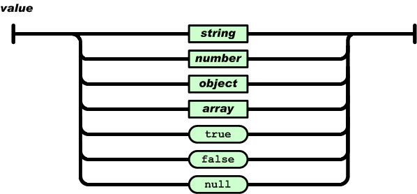

<head>
    
    
</head>

# Table of Contents

1.  [Algorithm](#org45cd5b0)
2.  [Review](#org38985d5)
    1.  [如何提高 JSON 解析的性能](#org4a9f7a4)
        1.  [什么是 JSON](#org2b754c0)
        2.  [JSON 的使用场景](#org71d9693)
        3.  [JSONDecoder 如何解析 JSON](#org6bb4350)
        4.  [提高 JSON 解析性能](#org0b30e96)
    2.  [如何用 Flexbox 思路开发？跟自动布局比，Flexbox 好在哪](#org8d43f07)
        1.  [Flexbox 好在哪](#org685e766)
        2.  [Texture 如何使用 Flexbox 思路进行布局](#orgea441fb)
        3.  [Flexbox 算法](#orgf2282af)
    3.  [怎么应对各种富文本表现需求](#org60c417d)
        1.  [WebView](#org3e48296)
        2.  [YYText](#orgfb597ba)
    4.  [如何在 iOS 中进行面向测试驱动开发和面向行为驱动开发及 Code Review](#org7985774)
        1.  [TDD](#orge182e27)
        2.  [BDD](#orgbed5f2e)
        3.  [Kiwi](#org8bcb42c)
        4.  [Code Review](#orgbd57ee7)
        5.  [推荐书籍](#org13b8856)
    5.  [iOS 系统内核 XNU：App 如何加载](#orgfd12b20)
        1.  [iOS 系统架构](#org89fb223)
        2.  [XNU](#org099c693)
        3.  [XNU 怎么加载 App](#org0c1de2a)
    6.  [iOS 黑魔法 Runtime Method Swizzling 背后的原理](#orgbf2320e)
        1.  [直接使用 Runtime 方法交换开发的风险有哪些](#org5f7576e)
        2.  [更安全的方法交换库 Aspects](#org9d8c637)
    7.  [libffi：动态调用和定义 C 函数](#orge3f735f)
        1.  [libffi 原理分析](#org7cbe784)
        2.  [ffi_type（参数类型）](#orgb38100d)
        3.  [ffi_cif（模板）](#orgbf110c6)
        4.  [ffi_call（函数调用）](#org25e9b99)
        5.  [如何使用 libffi](#org9b5c7e0)
        6.  [调用 C 函数](#org1cb4e36)
        7.  [定义 C 函数](#org3111cb2)
3.  [Tips](#org832e860)
    1.  [巧用上下文管理器和With语句精简代码](#org43bac86)
        1.  [什么是上下文管理器](#org4febfaf)
        2.  [上下文管理器的实现](#orgfa9ee0d)
    2.  [真的有必要写单元测试吗](#orgb56da31)
        1.  [什么是单元测试](#orgb2940a4)
        2.  [单元测试的几个技巧](#orgcb4ba54)
        3.  [高质量单元测试的关键](#orge81e05d)
    3.  [pdb & cProfile：调试和性能分析的法宝](#orgffb88a6)
        1.  [如何使用 pdb](#org6e625c2)
        2.  [用 cProfile 进行性能分析](#orga026416)
    4.  [带你初探量化世界](#org62be717)
        1.  [Python 算法交易](#org2278e24)
    5.  [RESTful & Socket：搭建交易执行层核心](#org8a2d84a)
        1.  [REST 简介](#org4b9e845)
        2.  [交易所 API 简介](#org2f9fabd)
        3.  [手把手教你使用 API 下单](#org0a14e86)
    6.  [RESTful & Socket：行情数据对接和抓取](#org8c1a6fd)
        1.  [行情数据](#orgf665f83)
        2.  [Websocket 介绍](#org9492eef)
        3.  [行情抓取模块](#org4201953)
    7.  [Pandas & Numpy：策略与回测系统](#org50c893e)
        1.  [OHLCV 数据](#org9e1e77c)
        2.  [回测框架](#org31b5260)
        3.  [交易策略](#orge041962)
        4.  [模拟交易](#orgc2d828f)
4.  [Share](#orgd225176)
    1.  [Pixel Aspect Ratio](#org954f554)
    2.  [Display Aspect Ratio](#org0cc60f7)
    3.  [Sample Aspect Ratios](#org1918b82)

# Algorithm

Leetcode 2565: [Subsequence With the Minimum Score](http://leetcode.com/problems/subsequence-with-the-minimum-score)

<https://dreamume.medium.com/leetcode-2565-subsequence-with-the-minimum-score-24b84a0448c8>

# Review

iOS 开发高手课    戴铭

## 如何提高 JSON 解析的性能

### 什么是 JSON

JSON 基于两种结构：

-   名字 / 值对集合：这种结构在其他编程语言里被实现为对象、字典、Hash 表、结构体或者关联数组
-   有序值列表：这种结构在其他编程语言里被实现为数组、向量、列表或序列

各种编程语言都以某种形式支持着这两种结构。比如，PHP 的 Array 既支持名字 / 值对集合又支持有序值列表；在 Swift 里键值集合就是字典，有序值列表就是数组。名字 / 值对集合在 JSON 和 JavaScript 里都被称为对象。JSON 语法图以及说明，你可以在 [JSON 官网](https://www.json.org/) 查看。在这里，我只列出了几个用的比较多的语法图

如上面语法图所示，对象是以左大括号开头和右大括号结尾，名字后面跟冒号，名字 / 值对用逗号分隔。比如：

    {"name1":"val1","name2":"val2"}

有序值列表在 JSON 和 JavaScript 里都叫数组，其语法图如下：

可以看出数组是以左中括号开头，以右中括号结尾，值以逗号分隔。数组代码如下所示：

    [[7,11,21]]

语法图中值的语法图如下：

可以看出，值可以是字符串、数字、对象、数组、布尔值 ture、布尔值 false、空值。根据这个语法，JSON 可以通过实现对象和数组的嵌套来描述更为复杂的数据结构

JSON 是没有注释的，水平制表符、换行符、回车符都会被当做空格。字符串由双引号括起来，里面可以使零到多个 Unicode 字符序列，使用反斜杠来进行转义

### JSON 的使用场景

JSON 的数据结构和任何一门编程语言的语法结构比起来都要简单得多，但它能干的事情却一点儿也不少，甚至可以完整地描述出一门编程语言的代码逻辑。比如，下面的这段 JavaScript 代码：

    if (hour < 18) {
      greeting = "Good day";
    }

这段 JavaScript 代码的逻辑是，当 hour 变量小于 18 时，greeting 设置为 Good day 字符串，根据 JavaScript 的语法规则，完整逻辑的语法树结构可以通过 JSON 描述出来。对应的 JSON，如下：

    {
      "type": "Program",
      "body": [
        {
          "type": "IfStatement",
          "test": {
            "type": "BinaryExpression",
            "left": {
              "type": "Identifier",
              "name": "hour"
            },
            "operator": "<",
            "right": {
              "type": "Literal",
              "value": 18,
              "raw": "18"
            }
          },
          "consequent": {
            "type": "BlockStatement",
            "body": [
              {
                "type": "ExpressionStatement",
                "expression": {
                  "type": "AssignmentExpression",
                  "operator": "=",
                  "left": {
                    "type": "Identifier",
                    "name": "greeting"
                  },
                  "right": {
                    "type": "Literal",
                    "value": "Good day",
                    "raw": "\"Good day\""
                  }
                }
              }
            ]
          },
          "alternate": null
        }
      ],
      "sourceType": "module"
    }

JavaScript 编程语言的语法树能够使用 JSON 来描述，其他编程语言同样也可以，比如 Objective-C 或 Swift，都能够生成自己的语法树结构，转成 JSON 后能够在运行期被动态地识别。因此，App 的业务逻辑动态化就不仅限于使用 JavaScript 这一门语言来编写，而是可以选择使用其他你熟悉的语言

JSON 不仅可以描述业务数据使得业务数据能够动态更新，还可以用来描述业务逻辑，以实现业务逻辑的动态化，除此之外还可以用来描述页面布局。比如，我以前就做过这么一件事儿：解析一个 H5 页面编辑器生成的 JSON，将 JSON 对应生成 iOS 原生界面布局代码。我当时是用 Swift 语言来编写这个项目的，完整代码在 [链接](https://github.com/ming1016/HTN/tree/master/Sources/H5Editor)

在这个项目中，对 JSON 的解析使用的是系统自带的 JSONDecoder 的 decode 方法，具体代码如下：

    let jsonData = jsonString.data(using: .utf8)!
    let decoder = JSONDecoder()
    let jsonModel = try! decoder.decode(H5Editor.self, from: jsonData)

上面代码中的，H5Editor 是一个结构体，能够记录 JSON 解析后的字典和数组。H5Editor 结构体完整定义，请点击 [链接](https://github.com/ming1016/HTN/blob/master/Sources/H5Editor/H5EditorStruct.swift)

### JSONDecoder 如何解析 JSON

JSONDecoder 的代码，你可以 [官网](https://github.com/apple/swift/blob/main/stdlib/public/Darwin/Foundation/JSONEncoder.swift) 上查看

接下来，我先跟你说下解析 JSON 的入口， JSONDecoder 的 decode 方法。下面是 decode 方法的定义代码：

    open func decode<T : Decodable>(_ type: T.Type, from data: Data) throws -> T {
        let topLevel: Any
        do {
           topLevel = try JSONSerialization.jsonObject(with: data)
        } catch {
            throw DecodingError.dataCorrupted(DecodingError.Context(codingPath: [], 
                    debugDescription: "The given data was not valid JSON.", 
                    underlyingError: error))
        }
        // JSONDecoder 的初始化
        let decoder = __JSONDecoder(referencing: topLevel, options: self.options)
        // 从顶层开始解析 JSON
        guard let value = try decoder.unbox(topLevel, as: type) else {
            throw DecodingError.valueNotFound(type, 
                DecodingError.Context(codingPath: [], 
                    debugDescription: "The given data did not contain a top-level value."))
        }
    
        return value
    }

接下来，我们通过上面的代码一起来看看 decode 方法是如何解析 JSON 的

上面 decode 方法入参 T.type 的 T 是一个泛型，具体到解析 H5 页面编辑器生成的 JSON 的例子，就是 H5Editor 结构体；入参 data 就是 JSON 字符串转成的 Data 数据

decode 方法在解析完后会将解析到的数据保存到传入的结构体中，然后返回。在 decode 方法里可以看到，对于传入的 Data 数据会首先通过 JSONSerialization 方法转化成 topLevel 原生对象，然后 topLevel 原生对象通过 JSONDecoder 初始化成一个 JSONDecoder 对象，最后使用 JSONDecoder 的 unbox 方法将数据和传入的结构体对应上，并保存在结构体里进行返回

可以看出，目前 JSONSerialization 已经能够很好地解析 JSON，JSONDecoder 将其包装以后，通过 unbox 方法使得 JSON 解析后能很方便地匹配 JSON 数据结构和 Swift 原生结构体

试想一下，如果要将 JSON 应用到更大的场景时，比如对编程语言的描述或者界面布局的描述，其生成的 JSON 文件可能会很大，并且对这种大 JSON 文件解析性能的要求也会更高。那么，有比 JSONSerialization 性能更好的解析 JSON 的方法吗？

### 提高 JSON 解析性能

2019 年 2 月，Geoff Langdale 和 Daniel Lemire 发布了 [simdjson](https://github.com/lemire/simdjson)。simdjson 是一款他们研究了很久的快速 JSON 解析器， 号称每秒可解析千兆字节 JSON 文件。simdjson 和其他 JSON 解析器对比如下图所示：

可以看出，只有 simdjson 能够达到每秒千兆字节级别，并且远远高于其他 JSON 解析器。那么 ，simdjson 是怎么做到的呢？接下来，我通过 simdjson 解析 JSON 的两个阶段来跟你说明下这个问题

第一个阶段，使用 simdjson 去发现需要 JSON 里重要的字符集，比如大括号、中括号、逗号、冒号等，还有类似 true、false、null、数字这样的原子字符集。第一个阶段是没有分支处理的，这个阶段与词法分析非常类似

第二个阶段，simdjson 也没有做分支处理，而是采用的堆栈结构，嵌套关系使用 goto 的方式进行导航。simdjson 通过索引可以处理所有输入的 JSON 内容而无需使用分支，这都归功于聪明的条件移动操作，使得遍历过程变得高效了很多

通过 simdjson 解析 JSON 的两个阶段可以看出，simdjson 的主要思路是尽可能地以最高效的方式将 JSON 这种可读性高的数据格式转换为计算机能更快理解的数据格式

为了达到快速解析的目的， simdjson 在第一个阶段一次性使用了 64 字节输入进行大规模的数据操作，检查字符和字符类时以及当获得掩码应用变换时以 64 位进行位操作。这种方式，对于大的 JSON 数据解析性能提升是非常明显的

如果你想更详细地了解这两个阶段的解析思路，可以查看这篇论文“ [Parsing Gigabytes of JSON per Second](https://arxiv.org/abs/1902.08318)”。其实，simdjson 就是对这篇论文的实现，你可以在 [simdjson](https://github.com/simdjson/simdjson) 上查看具体的实现代码。在我看来，一边看论文，一边看对应的代码实现，不失为一种高效的学习方式

而如果你想要在工程中使用 simdjson 的话，直接使用它提供的一个简单接口即可。具体的使用代码如下：

    #include "simdjson/jsonparser.h"
    
    //...
    
    const char * filename = ... // JSON 文件
    std::string_view p = get_corpus(filename);
    ParsedJson pj = build_parsed_json(p); // 解析方法
    // you no longer need p at this point, can do aligned_free((void*)p.data())
    if( ! pj.isValid() ) {
        // 出错处理
    }
    aligned_free((void*)p.data());

## 如何用 Flexbox 思路开发？跟自动布局比，Flexbox 好在哪

你很有可能不知道 Flexbox 是啥，但一定不会对 React Native、Weex 和 Texture（AsyncDisplayKit） 感到陌生，而 Flexbox 就是这些知名布局库采用的布局思路。不可小觑的是，苹果公司官方的 UIStackView，也是采用 Flexbox 思路来实现布局的

### Flexbox 好在哪

目前来看，iOS 系统提供的布局方式有两种：

-   一种是 Frame 这种原始方式，也就是通过设置横纵坐标和宽高来确定布局
-   另一种是自动布局（Auto Layout），相比较于 Frame 需要指出每个视图的精确位置，自动布局对于视图位置的描述更加简洁和易读，只需要确定两个视图之间的关系就能够确定布局

通过 [Masonry](https://github.com/SnapKit/Masonry) 和 [SnapKit](https://github.com/SnapKit/SnapKit) 这些第三方库，自动布局的易用性也有了很大提升。而且 iOS 12 以后，苹果公司也已经解决了自动布局在性能方面的问题

那么在这种情况下，我们为什么还要关注其他布局思路呢？关于原因，我觉得主要包括以下两个方面

其一，自动布局思路本身还可以再提高。Flexbox 比自动布局提供了更多、更规范的布局方法，布局方式考虑得更全面，使用起来也更加方便。同时，苹果公司基于 Flexbox 的布局思路，又在自动布局之上封装了一层 UIStackView

其二，针对多个平台的库需要使用更加通用的布局思想。Flexbox 在 2009 年被 W3C 提出，可以很简单、完整地实现各种页面布局，而且还是响应式的，开始被应用于前端领域，目前所有浏览器都已支持。后来通过 React Native 和 Weex 等框架，它被带入到客户端开发中，同时支持了 iOS 和 Android

与自动布局思路类似，Flexbox 使用的也是描述性的语言来布局。使用 Flexbox 布局的视图元素叫 Flex 容器（flex container），其子视图元素叫作 Flex 项目（flex item）。Flexbox 布局的主要思想是，通过 Flex 容器设定的属性来改变内部 Flex 项目的宽、高，并调整 flex 项目的位置来填充 flex 容器的可用空间

下图来自 W3C 官网，表示了 flex 容器和 flex 项目间的关系，其中 Main-Axis 表示横轴方向，Cross-Axis 表示纵轴方向

关于 Flexbox 的详细入门资料，你可以参看阮一峰老师的“[Flex 布局教程：语法篇](https://www.ruanyifeng.com/blog/2015/07/flex-grammar.html)”一文。而 Flexbox 在 W3C 上完整的定义，你可以点击[链接](https://www.w3.org/TR/css-flexbox-1/) 查看

如果你的工程目前还没有迁移到 React Native 或 Weex，那我觉得你可以通过 Texture 来使用 Flexbox 思路开发界面布局

### Texture 如何使用 Flexbox 思路进行布局

基于 Flexbox 的布局思路，Texture 框架的布局方案考虑得十分长远，也已经十分成熟，虽然学习起来需要费些力气，但是性能远好于苹果的自动布局，而且写起来更简单

Texture 框架的布局中，Texture 考虑到布局扩展性，提供了一个基类 ASLayoutSpec。这个基类 提供了布局的基本能力，使 Texture 可以通过它扩展实现多种布局思路，比如 Wrapper、Inset、Overlay、Ratio、Relative、Absolute 等布局思路，也可以继承 ASLayoutSpec 来自定义你的布局算法

ASLayoutSpec 的子类，及其具体的功能如下：

    ASAbsoluteLayoutSpec // 绝对布局
    ASBackgroundLayoutSpec // 背景布局
    ASInsetLayoutSpec // 边距布局
    ASOverlayLayoutSpec // 覆盖布局
    ASRatioLayoutSpec // 比例布局
    ASRelativeLayoutSpec // 顶点布局
    ASCenterLayoutSpec // 居中布局
    ASStackLayoutSpec // 盒子布局
    ASWrapperLayoutSpec // 填充布局
    ASCornerLayoutSpec // 角标布局

ASLayoutSpec 子类实现了各种布局思路，ASLayoutSpec 会制定各种布局相通的协议方法，遵循这些协议后可以保证这些子类能够使用相同的规则去实现更丰富的布局

通过 ASLayoutSpec 遵循的 ASLayoutElement 协议，可以知道 ASLayoutSpec 提供的基本能力有哪些。ASLayoutElement 协议定义如下：

    @protocol ASLayoutElement <ASLayoutElementExtensibility, ASTraitEnvironment, ASLayoutElementAsciiArtProtocol>
    
    #pragma mark - Getter
    
    @property (nonatomic, readonly) ASLayoutElementType layoutElementType;
    @property (nonatomic, readonly) ASLayoutElementStyle *style;
    - (nullable NSArray<id<ASLayoutElement>> *)sublayoutElements;
    
    #pragma mark - Calculate layout
    
    // 要求节点根据给定的大小范围返回布局
    - (ASLayout *)layoutThatFits:(ASSizeRange)constrainedSize;
    // 在子 layoutElements 上调用它来计算它们在 calculateLayoutThatFits: 方法里实现的布局
    - (ASLayout *)layoutThatFits:(ASSizeRange)constrainedSize parentSize:(CGSize)parentSize;
    // 重写此方法以计算 layoutElement 的布局
    - (ASLayout *)calculateLayoutThatFits:(ASSizeRange)constrainedSize;
    // 重写此方法允许你接收 layoutElement 的大小。使用这些值可以计算最终的约束大小。但这个方法要尽量少用
    - (ASLayout *)calculateLayoutThatFits:(ASSizeRange)constrainedSize
                         restrictedToSize:(ASLayoutElementSize)size
                     relativeToParentSize:(CGSize)parentSize;
    
    - (BOOL)implementsLayoutMethod;
    
    @end

通过上面代码可以看出，协议定义了 layoutThatFits 和 calculateLayoutThatFits 等回调方法。其中，layoutThatFits 回调方法用来要求节点根据给定的大小范围返回布局，重写 calculateLayoutThatFits 方法用以计算 layoutElement 的布局。定义了统一的协议方法，能让 ASLayoutSpec 统一透出布局计算能力，统一规范的协议方法，也有利于布局算法的扩展

接下来，我们一起看看 ASLayoutSpec 的子类中，应用最广泛的 ASStackLayoutSpec。它和 iOS 中自带的 UIStackView 类似，布局思路参照了 Flexbox，比如 horizontalAlignment、alignItems、flexWrap 等属性很容易和 Flexbox 对应上

下面示例是一段官方的 ASStackLayoutSpec 示例代码。ASStackLayoutSpec 布局思路和 Flexbox 是一样的，所以我们通过示例可以了解，如何通过 Texture 使用 Flexbox 布局思路开发界面：

    - (ASLayoutSpec *)layoutSpecThatFits:(ASSizeRange)constraint
    {
        // 创建一个纵轴方向的 ASStackLayoutSpec 视图容器 vStack
        ASStackLayoutSpec *vStack = [[ASStackLayoutSpec alloc] init];
        // 设置两个子节点，第一个节点是标题，第二个正文内容
        [vStack setChildren:@[titleNode, bodyNode]];
    
        // 创建一个横轴方向的 ASStackLayoutSpec 视图容器 hstack
        ASStackLayoutSpec *hstack = [[ASStackLayoutSpec alloc] init];
        hStack.direction          = ASStackLayoutDirectionHorizontal;
        hStack.spacing            = 5.0; // 设置节点间距为5
    
        // 在 hStack 里添加 imageNode 和 vStack 节点
        [hStack setChildren:@[imageNode, vStack]];
    
        // 创建一个 ASInsetLayoutSpec 容器，设置四周边距为5，将 hStack 作为其子节点
        ASInsetLayoutSpec *insetSpec = 
                [ASInsetLayoutSpec insetLayoutSpecWithInsets:UIEdgeInsetsMake(5,5,5,5) child:hStack];
    
        return insetSpec;
    }

上面这段代码，会先创建一个纵轴方向的 ASStackLayoutSpec 视图容器 vStack；然后，为 vStack 设置两个子节点，第一个节点是标题，第二个节点是正文内容；接下来，创建一个横轴方向的 ASStackLayoutSpec 视图容器 hstack，在 hStack 里添加 imageNode 和 vStack 节点；最后，创建一个 ASInsetLayoutSpec 容器，设置四周边距为 5，将 hStack 作为其子节点

除了 Texture 用到了 Flexbox 的布局思路，React Native 和 Weex 也用到了这个布局思路。这两个框架对 Flexbox 算法的实现，是一个叫作 [Yoga](https://github.com/facebook/yoga) 的 C++ 库

除了 React Native 和 Weex 之外，Yoga 还为很多其他开源框架提供支持，比如 [Litho](https://fblitho.com/)、[CompenentKit](https://componentkit.org/) 等

为了能够用于各个平台，Yoga 是由 C/C++ 语言编写的，依赖少，编译后的二进制文件也小，可以被方便地集成到 Android 和 iOS 上

随着新硬件的不断推出，比如手表和折叠屏手机，你可能还需要掌握更多的布局算法，以不变应万变。比如说，除了 Flexbox 思路的布局 ASStackLayoutSpec 以外，Texture 中还有 Wrapper、Inset、Overlay、Ratio、Relative、Absolute 等针对不同场景的布局思路，同时还支持自定义布局算法

那么，接下来我就跟你聊聊 Flexbox 的算法是怎样的。了解 Flexbox 的布局算法设计，一方面能够让你更好地理解 Flexbox 布局；另一方面，你也可以借此完整地了解一个布局算法是怎样设计的，使得你以后也能够设计出适合自己业务场景的布局算法

### Flexbox 算法

Flexbox 算法的主要思想是，让 flex 容器能够改变其 flex 项目的宽高和顺序，以填充可用空间，flex 容器可以通过扩大项目来填充可用空间，或者缩小项目以防止其超出其可用空间

首先，创建一组匿名的 flex 项目，按照这组匿名 flex 项目设置的排列规则对其进行排列

-   第一步，确定 flex 项目的 main space 和 cross space，如果 flex 容器定义了大小就直接使用定义的大小；否则， 从 flex 容器的可用空间里减去 margin、border、padding
-   第二步，确定每个项目 的 flex base 大小和假设的大小，其中假设的大小是项目依据它最小和最大的大小属性来确定的。flex 容器的大小，由它的大小属性来确定

这个计算过程中，flex 容器的最小内容大小，是由它所有项目的最小内容大小之和算出的；而 flex 容器的最大内容大小，则是由它所有项目的最大内容大小之和确定出

接着，将 flex 项目收集到 flex lines 中。如果 flex 容器是单行，那么就把所有的 flex 项目都收集到单个 flex line 里。否则，就从第一个未收集的项目开始尽可能多地收集 flex 项目到 flex line 里，根据 flex 容器的 inner 大小判断是否当前 flex line 收集满。重复操作，直到将所有 flex 项目都被收集到了 flex lines 里

处理完 flex lines 后，需要通过使用过的大小和可用大小来确定每个项目的 cross 大小，然后计算每个 flex line 的 cross 大小以及 flex line 里每个 flex 项目的 cross 大小

最后，进行 Main-Axis 对齐和 Cross-Axis 对齐

-   Main-Axis 对齐就是分配剩余空间。对于每个 flex line，如果有剩余空间， margin 设置为 auto 的话，就平均分配剩余空间
-   Cross-Axis 对齐，先要解决自动 margin，然后沿 cross-axis 对齐所有 flex items；随后确定 flex container 使用的 cross 大小；最后对齐所有 flex lines

结合视图的概念，简化后 Flexbox 布局算法如下图：

如图中所示，其中 View 类似 flex container，View 的 Subviews 类似 flex items，flexbox 的算法简而言之就是：首先依据 View 的 margin、padding、border 确定出横纵大小，接下来确定排列，根据 View 的大小确定 Subviews 的行内容，确定出行中每个 Subview 的大小，最终确定出 Subview 的位置

## 怎么应对各种富文本表现需求

简单来说，富文本就是一段有属性的字符串，可以包含不同字体、不同字号、不同背景、不同颜色、不同字间距的文字，还可以设置段落、图文混排等等属性

我以前做过一个 [RSS 阅读器](https://github.com/ming1016/GCDFetchFeed)，阅读器启动后，需要抓取最新的 RSS 内容进行展示。RSS 里面的文章内容属于富文本，是用 HTML 标签来描述的，包含了文字样式、链接和图片

比如，RSS 阅读器中的某篇文章内容如下：

    <item>
    <title>涉国资流失嫌疑 东方广益6亿元入股锤子科技被调查</title>
    <link>https://www.cnbeta.com/articles/tech/841851.htm</link>
    <description>
    <![CDATA[
    
<strong>据虎嗅得到的独家消息，成都成华区监察委已立案调查“东方广益6亿元入股锤子科技（北京）股份有限公司”事宜，认为这个项目有国有资产流失嫌疑。</strong>成华区监察委员会成立于2018年2月，按照管理权限对全区行使公权力的公职人员依法实行监察，履行监督、调查和处置职责。
 <a href="https://www.cnbeta.com/articles/tech/841851.htm" target="_blank"><strong>阅读全文</strong></a>
    ]]>
    </description>
    <author>ugmbbc</author>
    <source>cnBeta.COM</source>
    <pubDate>Sat, 27 Apr 2019 09:46:45 GMT</pubDate>
    <guid>https://www.cnbeta.com/articles/tech/841851.htm</guid>
    </item>

文章的 HTML 代码就在上面 RSS 中的 description 标签里。解析出 RSS 中所有文章的 HTML 代码，并将它们保存到本地数据库中

接下来，如何展示 HTML 内容呢？当时，我的第一反应就是使用 WebView 控件来展示

### WebView

使用 WebView 显示文章只需要创建一个 UIWebView 对象，进行一些基本滚动相关的设置，然后读取 HTML 字符串就可以了，具体实现代码如下：

    self.wbView = [[UIWebView alloc] init];
    self.wbView.delegate = self;
    [self.view addSubview:self.wbView];
    [self.wbView mas_makeConstraints:^(MASConstraintMaker *make) {
        make.top.left.right.bottom.equalTo(self.view);
    }];
    self.wbView.scalesPageToFit = YES; // 确保网页的显示尺寸和屏幕大小相同
    self.wbView.scrollView.directionalLockEnabled = YES; // 只在一个方向滚动
    self.wbView.scrollView.showsHorizontalScrollIndicator = NO; // 不显示左右滑动
    [self.wbView setOpaque:NO]; // 默认是透明的
    
    // 读取文章 html 字符串进行展示
    [self.wbView loadHTMLString:articleString baseURL:nil];

和 UIWebView 的 loadRequest 相比，UIWebView 通过 loadHTMLString 直接读取 HTML 代码，省去了网络请求的时间，展示的速度非常快。不过，HTML 里的图片资源还是需要通过网络请求来获取。所以，如果能够在文章展示之前就缓存下图片，那么无需等待，就能够快速完整地展示丰富的文章内容了

那么，我应该使用什么方案来缓存文章中的图片呢？

在 Cocoa 层使用 NSURLProtocol 可以拦截所有 HTTP 的请求，因此我可以利用 NSURLProtocol 来缓存文章中的图片

接下来，我再来和你说说，如何用我写的一个 Web 页面预加载库 [STMURLCache](https://github.com/ming1016/GCDFetchFeed/blob/master/GCDFetchFeed/GCDFetchFeed/STMURLCache.m) 来预缓存 HTML 里的图片。这个库你也可以应用到自己项目中

首先，我需要从数据库中取出所有未缓存图片的文章内容 HTML。实现代码如下：

    [[[[[SMDB shareInstance] selectAllUnCachedFeedItems] 
        subscribeOn:[RACScheduler schedulerWithPriority:RACSchedulerPriorityDefault]] 
       deliverOn:[RACScheduler mainThreadScheduler]] 
      subscribeNext:^(NSMutableArray *x) {
        // 在数据库中获取所有未缓存的文章数据 x
        NSMutableArray *urls = [NSMutableArray array];
        if (x.count > 0) {
            self.needCacheCount = x.count;
            for (SMFeedItemModel *aModel in x) {
                // 将文章数据中的正文内容都存在 urls 数组中
                [urls addObject:aModel.des];
            }
        }
        // ...
    }];

如上面代码所示，在数据库中获取到所有未缓存文章的数据后，遍历所有数据，提取文章数据中的正文 HTML 内容保存到一个新的数组 urls 中

然后，使用 STMURLCache 开始依次预下载文章中的图片进行缓存。实现代码如下：

    [[STMURLCache create:^(STMURLCacheMk *mk) {
        mk.whiteUserAgent(@"gcdfetchfeed").diskCapacity(1000 * 1024 * 1024);
    }] preloadByWebViewWithHtmls:[NSArray arrayWithArray:urls]].delegate = self;

STMURLCache 使用 preloadByWebViewWithHtmls 方法去预缓存所有图片，在 STMURLCache 初始化时，会设置 UserAgent 白名单，目的是避免额外缓存了其他不相关 UIWebView 的图片

缓存图片的核心技术还是 NSURLProtocol，STMURLCache 最终也是使用 NSURLProtocol 来缓存图片的。NSURLProtocol 是一个抽象类，专门用来处理特定协议的 URL 数据加载。你可以使用自定义 URL 处理的方式，来重新定义系统 URL 加载。STMURLCache 缓存图片的具体实现代码，你可以在 [STMURLProtocol](https://github.com/ming1016/GCDFetchFeed/blob/master/GCDFetchFeed/GCDFetchFeed/STMURLProtocol.m) 这个类里查看

STMURLProtocol 会在所有网络请求的入口 canInitWithRequest 方法中加上过滤条件，比如 STMURLCache 在初始化时设置 UserAgent 白名单，过滤代码如下：

    // User-Agent来过滤
    if (sModel.whiteUserAgent.length > 0) {
        // 在 HTTP header 里取出 User Agent
        NSString *uAgent = [request.allHTTPHeaderFields objectForKey:@"User-Agent"];
        if (uAgent) {
            // 不在白名单中返回 NO，不会进行缓存
            if (![uAgent hasSuffix:sModel.whiteUserAgent]) {
                return NO;
            }
        } else {
            return NO;
        }
    }

UserAgent 白名单过滤会通过 request 的 allHTTPHeaderFields 获取到当前网络请求的 UserAgent，然后和已经设置的 UserAgent 白名单做比较：如果在白名单中就进行缓存；否则，就不会缓存

STMURLProtocol 还可以根据域名进行过滤，这样可以灵活、精确地控制缓存范围。如果你设置了域名白名单，那么只有在白名单里的域名下的网络请求才会执行缓存，过滤代码如下：

    //对于域名白名单的过滤
    if (sModel.whiteListsHost.count > 0) {
        id isExist = [sModel.whiteListsHost objectForKey:request.URL.host];
        // 如果当前请求的域名不在白名单中也会返回 NO
        if (!isExist) {
            return NO;
        }
    }

如代码所示，当前网络请求的域名可以通过 request.URL.host 属性获取到，获取到网络请求的域名后，再去看域名白名单里是否有，如果有就缓存，没有就返回 NO，不进行缓存操作

在 canInitWithRequest 方法中满足缓存条件后，开始缓存的方法是 startLoading。startLoading 方法会判断已缓存和未缓存的情况，如果没有缓存会发起网络请求，将请求到的数据保存在本地。如果有缓存，则会直接从本地读取缓存，实现代码如下：

    // 从缓存里读取数据
    NSData *data = [NSData dataWithContentsOfFile:self.filePath];
    NSURLResponse *response = 
        [[NSURLResponse alloc] initWithURL:self.request.URL 
                                  MIMEType:[otherInfo objectForKey:@"MIMEType"] 
                     expectedContentLength:data.length 
                          textEncodingName:[otherInfo objectForKey:@"textEncodingName"]];
    
    [self.client URLProtocol:self
          didReceiveResponse:response 
          cacheStoragePolicy:NSURLCacheStorageNotAllowed];
    
    // 使用 NSURLProtocolClient 的 URLProtocol:didLoadData 方法加载本地数据
    [self.client URLProtocol:self didLoadData:data];
    [self.client URLProtocolDidFinishLoading:self];

如代码所示，STMURLProtocol 先通过缓存的路径获取到缓存的数据，再使用 NSURLProtocolClient 的 URLProtocol:didLoadData 方法加载本地缓存数据，以减少网络请求

显示文章内容时使用 NSURLProtocol，对于那些已经缓存过图片的文章就不用发起图片的网络请求，显示的速度跟本地加载显示速度一样快

虽然通过 URLProtocol 重新定义系统 URL 加载的方式，来直接读取预缓存提升了加载速度，但在长列表的 Cell 上展示富文本，就需要性能更高、内存占用更小的方法。那么接下来，我们再看看除了 UIWebView 还有没有什么方法可以展示富文本呢？

在长列表这种场景下，如果不用 HTML 来描述富文本的话，想要使用原生 iOS 代码来描述富文本的话，你还可以使用苹果官方的 [TextKit](https://developer.apple.com/documentation/appkit/textkit) 和 [YYText](https://github.com/ibireme/YYText) 来展示

其中，YYText 不仅兼容 UILabel 和 UITextView，在异步文字布局和渲染上的性能也非常好

### YYText

集成 YYText 到你的 App 非常简单，只需要在 Podfile 中添加 pod ‘YYText’ 就可以了。下面代码展示了如何展示图文混排的富文本：

    NSMutableAttributedString *text = [NSMutableAttributedString new];
    UIFont *font = [UIFont systemFontOfSize:16];
    NSMutableAttributedString *attachment = nil;
    
    // 嵌入 UIImage
    UIImage *image = [UIImage imageNamed:@"dribbble64_imageio"];
    attachment = 
      [NSMutableAttributedString yy_attachmentStringWithContent:image 
                                                    contentMode:UIViewContentModeCenter 
                                                 attachmentSize:image.size 
                                                    alignToFont:font 
                                                      alignment:YYTextVerticalAlignmentCenter];
    [text appendAttributedString: attachment];
    
    // 嵌入 UIView
    UISwitch *switcher = [UISwitch new];
    [switcher sizeToFit];
    attachment = 
      [NSMutableAttributedString yy_attachmentStringWithContent:switcher 
                                                    contentMode:UIViewContentModeBottom 
                                                 attachmentSize:switcher.size 
                                                    alignToFont:font 
                                                      alignment:YYTextVerticalAlignmentCenter];
    [text appendAttributedString: attachment];
    
    // 嵌入 CALayer
    CASharpLayer *layer = [CASharpLayer layer];
    layer.path = ;//...
    attachment = 
      [NSMutableAttributedString yy_attachmentStringWithContent:layer
                                                    contentMode:UIViewContentModeBottom 
                                                 attachmentSize:switcher.size 
                                                    alignToFont:font
                                                      alignment:YYTextVerticalAlignmentCenter];
    [text appendAttributedString: attachment];

如代码所示，YYText 对于富文本的图文混排使用的是自定义的 NSMutableAttributedString 分类，自定义分类不光简化了 NSMutableAttributedString，还增加了功能，除了图片外，可以嵌入 UIView 和 CALayer

通过上面 YYText 描述富文本的代码，你会发现原生代码描述富文本跟 HTML 比，既复杂又啰嗦。HTML 代码更易读、更容易维护，所以除了长列表外，我建议你都使用 HTML 来描述富文本

对于 UIWebView 内存占用高的问题，你可以考虑使用 HTML 代码转原生代码的思路解决。比如，你可以参考我以前做的将 HTML 代码转原生代码的示例项目 [HTN](https://github.com/ming1016/HTN) 里的解决思路

## 如何在 iOS 中进行面向测试驱动开发和面向行为驱动开发及 Code Review

从开发模式划分的话，开发方式可以分为 TDD（Test-driven development，面向测试驱动开发）和 BDD（Behavior-driven development ，面向行为驱动开发）

-   TDD 的开发思路是，先编写测试用例，然后在不考虑代码优化的情况下快速编写功能实现代码，等功能开发完成后，在测试用例的保障下，再进行代码重构，以提高代码质量
-   BDD 是 TDD 的进化，基于行为进行功能测试，使用 DSL（Domain Specific Language，领域特定语言）来描述测试用例，让测试用例看起来和文档一样，更易读、更好维护

TDD 编写的测试用例主要针对的是开发中最小单元进行测试，适合单元测试。而 BDD 的测试用例是对行为的描述，测试范围可以更大一些，在集成测试和系统测试时都可以使用。同时，不仅开发者可以使用 BDD 的测试用例高效地发现问题，测试团队也能够很容易参与编写。这，都得益于 BDD 可以使用易于编写行为功能测试的 DSL 语言

### TDD

我刚刚也已经提到了，TDD 在确定功能需求后，首先就会开始编写测试用例，用来检验每次的代码更新，能够让我们更快地发现问题，并能保正不会漏掉问题。其实，这就是通过测试用例来推动开发

在思想上，和拿到功能需求后直接开发功能的区别是，TDD 会先考虑如何对功能进行测试，然后再去考虑如何编写代码，这就给优化代码提供了更多的时间和空间，即使几个版本过后再来优化，只要能够通过先前写好的测试用例，就能够保证代码质量

所以说，TDD 非常适合快速迭代的节奏，先尽快实现功能，然后再进行重构和优化。如果我们不使用 TDD 来进行快速迭代开发，虽然在最开始的时候开发效率会比 TDD 高，但是过几个版本再进行功能更新时，就需要在功能验证上花费大量的时间，反而得不偿失

### BDD

相比 TDD，BDD 更关注的是行为方式的设计，通过对行为的描述来验证功能的可用性。行为描述使用的 DSL，规范、标准而且可读性高，可以当作文档来使用

BDD 的 Objective-C 框架有 [Kiwi](https://github.com/kiwi-bdd/Kiwi)、[Specta](https://github.com/specta/specta)、[Expecta](https://github.com/specta/expecta) 等，Swift 框架有 [Quick](https://github.com/Quick/Quick)

Kiwi 框架不光有 Specta 的 DSL 模式，Expecta 框架的期望语法，还有 Mocks 和 Stubs 这样的模拟存根能力。所以接下来，我就跟你说说这个 iOS 中非常有名并且好用的 BDD 框架，以及怎么用它来进行 BDD 开发

### Kiwi

将 Kiwi 集成到你的 App 里，只需要在 Podfile 里添加 pod ‘Kiwi’ 即可。下面这段代码，是 Kiwi 的使用示例：

    // describe 表示要测试的对象
    describe(@"RSSListViewController", ^{
        // context 表示的是不同场景下的行为
        context(@"when get RSS data", ^{
            // 同一个 context 下每个 it 调用之前会调用一次 beforeEach
            beforeEach(^{
                id dataStore = [DataStore new];
            });
    
    
            // it 表示测试内容，一个 context 可以有多个 it
            it(@"load data", ^{
                // Kiwi 使用链式调用，should 表示一个期待，用来验证对象行为是否满足期望
                [[theValue(dataStore.count) shouldNot] beNil];
            });
        });
    });

上面这代码描述的是在 RSS 列表页面，当获取 RSS 数据时去读取数据这个行为的测试用例。这段测试用例代码，包含了 Kiwi 的基本元素，也就是 describe、context、it。这些元素间的关系可以表述为：

-   describe 表示要测试的对象，context 表示的是不同场景下的行为，一个 describe 里可以包含多个 context
-   it 表示的是需要测试的内容，同一个场景下的行为会有多个需要测试的内容，也就是说一个 context 下可以有多个 it

测试内容使用的是 Kiwi 的 DSL 语法，采用的是链式调用。上面示例代码中 shouldNot 是期望语法，期望是用来验证对象行为是否满足期望

期望语法可以是期望数值和数字，也可以是期望字符串的匹配，比如：

    [[string should] containString:@"rss"];

should containString 语法表示的是，期望 string 包含了 rss 字符串。Kiwi 里的期望语法非常丰富，还有正则表达式匹配、数量变化、对象测试、集合、交互和消息、通知、异步调用、异常等。完整的期望语法描述，你可以查看 Wiki 的 [Expectations 部分](https://github.com/allending/Kiwi/wiki/Expectations)

除了期望语法外，Kiwi 还支持模拟对象和存根语法

模拟对象能够降低对象之间的依赖，可以模拟难以出现的情况。模拟对象包含了模拟 Null 对象、模拟类的实例、模拟协议的实例等。存根可以返回指定选择器或消息模式的请求，可以存根对象和模拟对象

模拟对象和存根的详细语法定义，你可以查看 Wiki 的 [Mocks and Stubs 部分](https://github.com/allending/Kiwi/wiki/Mocks-and-Stubs)

### Code Review

在写分类时，分类里增加的方法名要尽量加上前缀，而如果是系统自带类的分类的话，方法名就一定要加上前缀，来避免方法名重复的问题

分类的作用如其名，就是对类做分类用的，所以我建议你，能够把一个类里的公共方法放到不同的分类里，便于管理维护。分类特别适合多人负责同一个类时，根据不同分类来进行各自不同功能的代码维护

可以参考其他公司对 iOS 开发制定的编码规范来完善自己团队的编码规范，比如 [Spotify](https://github.com/spotify/ios-style) 的 Objective-C 编码规范、[纽约时报](https://github.com/NYTimes/objective-c-style-guide) 的 Objective-C 的编码规范、Raywenderlich 的 [Objective-C](https://github.com/kodecocodes/objective-c-style-guide) 和 [Swift](https://github.com/kodecocodes/swift-style-guide) 编码规范

Swift 语言的话，你可以使用 [SwiftLint](https://github.com/realm/SwiftLint) 工具来检查代码规范。Swift 通过 Hook Clang 和 SourceKit 中 AST 的回调来检查源代码，如何使用 SourceKit 开发工具可以参看这篇文章“[Uncovering SourceKit](https://www.jpsim.com/uncovering-sourcekit/)“

SwiftLint 检查的默认规则，你可以参考 [规则说明](https://github.com/realm/SwiftLint/blob/main/Rules.md) 。SwiftLint 也支持自定义检查规则，支持你添加自己制定的代码规范。你可以在 SwiftLint 目录下添加一个 .swiftlint.yml 配置文件来自定义基于正则表达式的自定义规则。具体方法，你可以参看官方定义 [自定义规则](https://github.com/realm/SwiftLint/blob/main/README_CN.md)

如果你是使用 Objective-C 语言开发的话，可以使用 OCLint 来做代码规范检查。关于 OCLint 如何定制自己的代码规范检查，你可以参看杨萧玉的这篇博文“ [使用 OCLint 自定义 MVVM 规则](http://yulingtianxia.com/blog/2019/01/27/MVVM-Rules-for-OCLint/) “

人工检查，就是使用类似 Phabricator 这样的 Code Review 工具平台，来分配人员审核提交代码，审核完代码后，审核人可以进行通过、打回、评论等操作。这里需要注意的是，人工检查最容易沦为形式主义，因此为了避免团队成员人工检查成为形式，在开始阶段最好能让团队中编码习惯好、喜欢交流的人来做审核人，以起到良好的示范作用，并以此作为后续的执行标准

### 推荐书籍

[Raywenderlich](https://store.kodeco.com/) 出版的图书质量都非常不错，可以一步一步教你掌握一些开发知识，内容非常实用，而且这些图书的涉及面广

[objc.io](https://www.objc.io/books/) 的图书会从原理和源代码实现的角度来讲解知识点，也非常不错，内容比 Raywenderlich 出版的图书更深入，适合有一定 iOS 开发经验的人阅读

## iOS 系统内核 XNU：App 如何加载

### iOS 系统架构

iOS 系统是基于 ARM 架构的，大致可以分为四层：

-   最上层是用户体验层，主要是提供用户界面。这一层包含了 SpringBoard、Spotlight、Accessibility
-   第二层是应用框架层，是开发者会用到的。这一层包含了开发框架 Cocoa Touch
-   第三层是核心框架层，是系统核心功能的框架层。这一层包含了各种图形和媒体核心框架、Metal 等
-   第四层是 Darwin 层，是操作系统的核心，属于操作系统的内核态。这一层包含了系统内核 XNU、驱动等

其中，用户体验层、应用框架层和核心框架层，属于用户态，是上层 App 的活动空间。Darwin 是用户态的下层支撑，是 iOS 系统的核心

Darwin 的内核是 XNU，而 XNU 是在 UNIX 的基础上做了很多改进以及创新。了解 XNU 的内部是怎么样的，将有助于我们解决系统层面的问题

所以接下来，我们就一起看看 XNU 的架构，看看它的内部到底都包含了些什么

### XNU

XNU 内部由 Mach、BSD、驱动 API IOKit 组成，这些都依赖于 libkern、libsa、Platform Expert。如下图所示：

其中 [Mach](https://developer.apple.com/library/archive/documentation/Darwin/Conceptual/KernelProgramming/Mach/Mach.html) 是作为 UNIX 内核的替代，主要解决 UNIX 一切皆文件导致抽象机制不足的问题，为现代操作系统做了进一步的抽象工作。 Mach 负责操作系统最基本的工作，包括进程和线程抽象、处理器调度、进程间通信、消息机制、虚拟内存管理、内存保护等

进程对应到 Mach 是 Mach Task，Mach Task 可以看做是线程执行环境的抽象，包含虚拟地址空间、IPC 空间、处理器资源、调度控制、线程容器

进程在 BSD 里是由 BSD Process 处理，BSD Process 扩展了 Mach Task，增加了进程 ID、信号信息等，BSD Process 里面包含了扩展 Mach Thread 结构的 Uthread

Mach 的模块包括进程和线程都是对象，对象之间不能直接调用，只能通过 Mach Msg 进行通信，也就是 mach_msg() 函数。在用户态的那三层中，也就是在用户体验层、应用框架层和核心框架层中，你可以通过 mach_msg_trap() 函数触发陷阱，从而切至 Mach，由 Mach 里的 mach_msg() 函数完成实际通信，具体实现可以参看 NSHipster 的这篇文章 [Inter-Process Communication](https://nshipster.com/inter-process-communication/)

每个 Mach Thread 表示一个线程，是 Mach 里的最小执行单位。Mach Thread 有自己的状态，包括机器状态、线程栈、调度优先级（有 128 个，数字越大表示优先级越高）、调度策略、内核 Port、异常 Port

Mach Thread 既可以由 Mach Task 处理，也可以扩展为 Uthread，通过 BSD Process 处理。这是因为 XNU 采用的是微内核 Mach 和 宏内核 BSD 的混合内核，具备微内核和宏内核的优点

-   微内核可以提高系统的模块化程度，提供内存保护的消息传递机制
-   宏内核也可以叫单内核，在出现高负荷状态时依然能够让系统保持高效运作

Mach 是微内核，可以将操作系统的核心独立在进程上运行，不过，内核层和用户态各层之间切换上下文和进程间消息传递都会降低性能。为了提高性能，苹果深度定制了 BSD 宏内核，使其和 Mach 混合使用

宏内核 BSD 是对 Mach 封装，提供进程管理、安全、网络、驱动、内存、文件系统（HFS+）、网络文件系统（NFS）、虚拟文件系统（VFS）、POSIX（Portable Operating System Interface of UNIX，可移植操作系统接口）兼容

早期的 BSD 是 UNIX 衍生出的操作系统，现在 BSD 是类 UNIX 操作系统的统称。XNU 的 BSD 来源于 FreeBSD 内核，经过深度定制而成。IEEE 为了保证软件可以在各个 UNIX 系统上运行而制定了 POSIX 标准，iOS 也是通过 BSD 对 POSIX 的兼容而成为了类 UNIX 系统

BSD 提供了更现代、更易用的内核接口，以及 POSIX 的兼容，比如通过扩展 Mach Task 进程结构为 BSD Process。对于 Mach 使用 mach_msg_trap() 函数触发陷阱来处理异常消息，BSD 则在异常消息机制的基础上建立了信号处理机制，用户态产生的信号会先被 Mach 转换成异常，BSD 将异常再转换成信号。对于进程和线程，BSD 会构建 UNIX 进程模型，创建 POSIX 兼容的线程模型 pthread

iOS 6 后，为了增强系统安全，BSD 实行了 ASLR（Address Space Layout Randomization，地址空间布局随机化）。随着 iPhone 硬件升级，为了更好地利用多核，BSD 加入了工作队列，以支持多核多线程处理，这也是 GCD 能更高效工作的基础。 BSD 还从 TrustdBSD 引入了 MAC 框架以增强权限 entitlement 机制的安全

除了微内核 Mach 和宏内核 BSD 外，XNU 还有 IOKit。IOKit 是硬件驱动程序的运行环境，包含电源、内存、CPU 等信息。IOKit 底层 libkern 使用 C++ 子集 Embedded C++ 编写了驱动程序基类，比如 OSObject、OSArray、OSString 等，新驱动可以继承这些基类来写

### XNU 怎么加载 App

iOS 的可执行文件和动态库都是 Mach-O 格式，所以加载 APP 实际上就是加载 Mach-O 文件

Mach-O header 信息结构代码如下：

    struct mach_header_64 {
        uint32_t        magic;      // 64位还是32位
        cpu_type_t      cputype;    // CPU 类型，比如 arm 或 X86
        cpu_subtype_t   cpusubtype; // CPU 子类型，比如 armv8
        uint32_t        filetype;   // 文件类型
        uint32_t        ncmds;      // load commands 的数量
        uint32_t        sizeofcmds; // load commands 大小
        uint32_t        flags;      // 标签
        uint32_t        reserved;   // 保留字段
    };

如上面代码所示，包含了表示是 64 位还是 32 位的 magic、CPU 类型 cputype、CPU 子类型 cpusubtype、文件类型 filetype、描述文件在虚拟内存中逻辑结构和布局的 load commands 数量和大小等文件信息

其中，文件类型 filetype 表示了当前 Mach-O 属于哪种类型。Mach-O 包括以下几种类型

-   OBJECT，指的是 .o 文件或者 .a 文件
-   EXECUTE，指的是 IPA 拆包后的文件
-   DYLIB，指的是 .dylib 或 .framework 文件
-   DYLINKER，指的是动态链接器
-   DSYM，指的是保存有符号信息用于分析闪退信息的文件

加载 Mach-O 文件，内核会 fork 进程，并对进程进行一些基本设置，比如为进程分配虚拟内存、为进程创建主线程、代码签名等。用户态 dyld 会对 Mach-O 文件做库加载和符号解析

苹果公司已经将 XNU 开源，并在 GitHub 上创建了 [镜像](https://github.com/apple/darwin-xnu)。要想编译 XNU，你可以查看 [Building the XNU kernel on Mac OS X Sierra (10.12.X)](https://0xcc.re/building-xnu-kernel-macosx-sierrra-10-12-x/) 这篇文章；要想调试 XNU，可以查看 [Source Level Debugging the XNU Kernel](https://shadowfile.inode.link/blog/2018/10/source-level-debugging-the-xnu-kernel/) 这篇文章

整个 fork 进程，加载解析 Mach-O 文件的过程可以在 XNU 的源代码中查看，代码路径是 darwin-xnu/bsd/kern/kern_exec.c，地址是 <https://github.com/apple/darwin-xnu/blob/master/bsd/kern/kern_exec.c，相关代码在> \__mac_execve 函数里，代码如下：

    int __mac_execve(proc_t p, struct __mac_execve_args *uap, int32_t *retval)
    {
        // 字段设置
        //...
        int is_64 = IS_64BIT_PROCESS(p);
        struct vfs_context context;
        struct uthread  *uthread; // 线程
        task_t new_task = NULL;   // Mach Task
        //...
    
        context.vc_thread = current_thread();
        context.vc_ucred = kauth_cred_proc_ref(p);
    
        // 分配大块内存，不用堆栈是因为 Mach-O 结构很大。
        MALLOC(bufp, char *, (sizeof(*imgp) + sizeof(*vap) + sizeof(*origvap)), M_TEMP, M_WAITOK | M_ZERO);
        imgp = (struct image_params *) bufp;
    
        // 初始化 imgp 结构里的公共数据
        //...
    
        uthread = get_bsdthread_info(current_thread());
        if (uthread->uu_flag & UT_VFORK) {
            imgp->ip_flags |= IMGPF_VFORK_EXEC;
            in_vfexec = TRUE;
        } else {
            // 程序如果是启动态，就需要 fork 新进程
            imgp->ip_flags |= IMGPF_EXEC;
            // fork 进程
            imgp->ip_new_thread = fork_create_child(current_task(),
                        NULL, p, FALSE, p->p_flag & P_LP64, TRUE);
            // 异常处理
            //...
    
            new_task = get_threadtask(imgp->ip_new_thread);
            context.vc_thread = imgp->ip_new_thread;
        }
    
        // 加载解析 Mach-O
        error = exec_activate_image(imgp);
    
        if (imgp->ip_new_thread != NULL) {
            new_task = get_threadtask(imgp->ip_new_thread);
        }
    
        if (!error && !in_vfexec) {
            p = proc_exec_switch_task(p, current_task(), new_task, imgp->ip_new_thread);
    
            should_release_proc_ref = TRUE;
        }
    
        kauth_cred_unref(&context.vc_ucred);
    
        if (!error) {
            task_bank_init(get_threadtask(imgp->ip_new_thread));
            proc_transend(p, 0);
    
            thread_affinity_exec(current_thread());
    
            // 继承进程处理
            if (!in_vfexec) {
                proc_inherit_task_role(get_threadtask(imgp->ip_new_thread), current_task());
            }
    
            // 设置进程的主线程
            thread_t main_thread = imgp->ip_new_thread;
            task_set_main_thread_qos(new_task, main_thread);
        }
        //...
    }

可以看出，由于 Mach-O 文件很大， \__mac_execve 函数会先为 Mach-O 分配一大块内存 imgp，接下来会初始化 imgp 里的公共数据。内存处理完，\__mac_execve 函数就会通过 fork_create_child() 函数 fork 出一个新的进程。新进程 fork 后，会通过 exec_activate_image() 函数解析加载 Mach-O 文件到内存 imgp 里。最后，使用 task_set_main_thread_qos() 函数设置新 fork 出进程的主线程

exec_activate_image() 函数会调用不同格式对应的加载函数，代码如下：

    struct execsw {
        int (*ex_imgact)(struct image_params *);
        const char *ex_name;
    } execsw[] = {
        { exec_mach_imgact,     "Mach-o Binary" },
        { exec_fat_imgact,      "Fat Binary" },
        { exec_shell_imgact,        "Interpreter Script" },
        { NULL, NULL}
    };

可以看出，加载 Mach-O 文件的是 exec_mach_imgact() 函数。exec_mach_imgact() 会通过 load_machfile() 函数加载 Mach-O 文件，根据解析 Mach-O 后得到的 load command 信息，通过映射方式加载到内存中。还会使用 activate_exec_state() 函数处理解析加载 Mach-O 后的结构信息，设置执行 App 的入口点

设置完入口点后会通过 load_dylinker() 函数来解析加载 dyld，然后将入口点地址改成 dyld 的入口地址。这一步完后，内核部分就完成了 Mach-O 文件的加载。剩下的就是用户态层 dyld 加载 App 了

Dyld 的入口函数是 \__dyld_start，dyld 属于用户态进程，不在 XNU 里，\__dyld_start 函数的实现代码在 dyld 仓库中的 [dyldStartup.s](https://github.com/opensource-apple/dyld/blob/master/src/dyldStartup.s) 文件里。\__dyld_start 会加载 App 相关的动态库，处理完成后会返回 App 的入口地址，然后到 App 的 main 函数

想了解 dyld 加载过程的话，可以看看 Mike Ash 的 [dyld: Dynamic Linking On OS X](https://www.mikeash.com/pyblog/friday-qa-2012-11-09-dyld-dynamic-linking-on-os-x.html) 这篇文章

## iOS 黑魔法 Runtime Method Swizzling 背后的原理

Runtime Method Swizzling 编程方式，也可以叫作 AOP（Aspect-Oriented Programming，面向切面编程）

AOP 是一种编程范式，也可以说是一种编程思想，使用 AOP 可以解决 OOP（Object Oriented Programming，面向对象编程）由于切面需求导致单一职责被破坏的问题。通过 AOP 可以不侵入 OOP 开发，非常方便地插入切面需求功能

除此之外，还有一些主业务无关的逻辑功能，也可以通过 AOP 来完成，这样主业务逻辑就能够满足 OOP 单一职责的要求。而如果没有使用 AOP，鉴于 OOP 的局限性，这些与主业务无关的代码就会到处都是，增大了工作量不说，还会加大维护成本

但是我们也知道，iOS 在运行时进行 AOP 开发会有风险，不能简单地使用 Runtime 进行方法交换来实现 AOP 开发。因此，我今天就来跟你说下直接使用 Runtime 方法交换开发的风险有哪些，而安全的方法交换原理又是怎样的？

### 直接使用 Runtime 方法交换开发的风险有哪些

苹果公司已经开源了 Runtime，在 GitHub 上有 [可编译的 Runtime 开源版本](https://github.com/showxu/objc4)。你可以通过于德志 (@halfrost) 博客的三篇 Runtime 文章，即 [isa 和 Class](https://halfrost.com/objc_runtime_isa_class/)、[消息发送和转发](https://halfrost.com/objc_runtime_objc_msgsend/)，以及 [如何正确使用 Runtime](https://halfrost.com/how_to_use_runtime/) ，来一边学习一边调试

直接使用 Runtime 进行方法交换非常简单，代码如下：

    #import "SMHook.h"
    #import <objc/runtime.h>
    
    @implementation SMHook
    
    + (void)hookClass:(Class)classObject fromSelector:(SEL)fromSelector toSelector:(SEL)toSelector {
        Class class = classObject;
        // 得到被交换类的实例方法
        Method fromMethod = class_getInstanceMethod(class, fromSelector);
        // 得到交换类的实例方法
        Method toMethod = class_getInstanceMethod(class, toSelector);
    
        // class_addMethod() 函数返回成功表示被交换的方法没实现，然后会通过 class_addMethod() 函数先实现；返回失败则表示被交换方法已存在，可以直接进行 IMP 指针交换 
        if(class_addMethod(class, fromSelector, method_getImplementation(toMethod), method_getTypeEncoding(toMethod))) {
            // 进行方法的交换
            class_replaceMethod(class, toSelector, method_getImplementation(fromMethod), method_getTypeEncoding(fromMethod));
        } else {
            // 交换 IMP 指针
            method_exchangeImplementations(fromMethod, toMethod);
        }
    }
    @end

如代码所示：通过 class_getInstanceMethod() 函数可以得到被交换类的实例方法和交换类的实例方法。使用 class_addMethod() 函数来添加方法，返回成功表示被交换的方法没被实现，然后通过 class_addMethod() 函数实现；返回失败则表示被交换方法已存在，可以通过 method_exchangeImplementations() 函数直接进行 IMP 指针交换以实现方法交换

但是，像上面这段代码一样，直接使用 Runtime 的方法进行方法交换会有很多风险，[RSSwizzle](https://github.com/rabovik/RSSwizzle/) 库里指出了四个典型的直接使用 Runtime 方法进行方法交换的风险。我稍作整理，以方便你查看，并便于你理解后续的内容

第一个风险是，需要在 +load 方法中进行方法交换。因为如果在其他时候进行方法交换，难以保证另外一个线程中不会同时调用被交换的方法，从而导致程序不能按预期执行

第二个风险是，被交换的方法必须是当前类的方法，不能是父类的方法，直接把父类的实现拷贝过来不会起作用。父类的方法必须在调用的时候使用，而不是方法交换时使用

第三个风险是，交换的方法如果依赖了 cmd，那么交换后，如果 cmd 发生了变化，就会出现各种奇怪问题，而且这些问题还很难排查。特别是交换了系统方法，你无法保证系统方法内部是否依赖了 cmd

第四个风险是，方法交换命名冲突。如果出现冲突，可能会导致方法交换失败

更多关于运行时方法交换的风险，你可以查看 Stackoverflow 上的问题讨论 [What are the Dangers of Method Swizzling in Objective C?](https://stackoverflow.com/questions/5339276/what-are-the-dangers-of-method-swizzling-in-objective-c)

可以看到，直接使用 Runtime 进行方法交换的风险非常大，那么安全的方法交换是怎样的呢？接下来，我就来跟你介绍一个更安全的运行时方法交换库 [Aspects](https://github.com/steipete/Aspects)

### 更安全的方法交换库 Aspects

Aspects 是一个通过 Runtime 消息转发机制来实现方法交换的库。它将所有的方法调用都指到 \_objc_msgForward 函数调用上，按照自己的方式实现了消息转发，自己处理参数列表，处理返回值，最后通过 NSInvocation 调用来实现方法交换。同时，Aspects 还考虑了一些方法交换可能会引发的风险，并进行了处理

虽然 Aspects 对于一些风险进行了规避，但是在使用不当的情况下依然会有风险，比如 hook 已经被 hook 过的方法，那么之前的 hook 会失效，而且新的 hook 也会出错。所以，即使是 Aspects， 在工程中也不能滥用

现在，我们先一起看一段如何使用 Aspects 的示例代码：

    [UIViewController aspect_hookSelector:@selector(viewWillAppear:) 
                              withOptions:AspectPositionAfter 
                               usingBlock:^(id<AspectInfo> aspectInfo, BOOL animated) {
        NSLog(@"View Controller %@ will appear animated: %tu", 
              aspectInfo.instance, animated);
    } 
     error:NULL];

上面这段代码是 Aspects 通过运行时方法交换，按照 AOP 方式添加埋点的实现。代码简单，可读性高，接口使用 Block 也非常易用。按照这种方式，直接使用 Aspects 即可

接下来，我就跟你说下 Aspect 实现方法交换的原理

Aspects 的整体流程是，先判断是否可进行方法交换。这一步会进行安全问题的判断处理。如果没有风险的话，再针对要交换的是类对象还是实例对象分别进行处理

-   对于类对象的方法交换，会先修改类的 forwardInvocation ，将类的实现转成自己的。然后，重新生成一个方法用来交换。最后，交换方法的 IMP，方法调用时就会直接对交换方法进行消息转发
-   对于实例对象的方法交换，会先创建一个新的类，并将当前实例对象的 isa 指针指向新创建的类，然后再修改类的方法

整个流程的入口是 aspect_add() 方法，这个方法里包含了 Aspects 的两个核心方法，第一个是进行安全判断的 aspect_isSelectorAllowedAndTrack 方法，第二个是执行类对象和实例对象方法交换的 aspect_prepareClassAndHookSelector 方法

aspect_isSelectorAllowedAndTrack 方法，会对一些方法比如 retain、release、autorelease、forwardInvocation 进行过滤，并对 dealloc 方法交换做了限制，要求只能使用 AspectPositionBefore 选项。同时，它还会过滤没有响应的方法，直接返回 NO

安全判断执行完，就开始执行方法交换的 aspect_prepareClassAndHookSelector 方法，其实现代码如下：

    static void aspect_prepareClassAndHookSelector(NSObject *self, 
                                                   SEL selector, 
                                                   NSError **error) {
        NSCParameterAssert(selector);
        Class klass = aspect_hookClass(self, error);
        Method targetMethod = class_getInstanceMethod(klass, selector);
        IMP targetMethodIMP = method_getImplementation(targetMethod);
        if (!aspect_isMsgForwardIMP(targetMethodIMP)) {
            // 创建方法别名
            const char *typeEncoding = method_getTypeEncoding(targetMethod);
            SEL aliasSelector = aspect_aliasForSelector(selector);
            if (![klass instancesRespondToSelector:aliasSelector]) {
                __unused BOOL addedAlias = 
                  class_addMethod(klass, 
                                  aliasSelector, 
                                  method_getImplementation(targetMethod), 
                                  typeEncoding);
                NSCAssert(addedAlias,
                          @"Original implementation for %@ is already copied to %@ on %@", 
                          NSStringFromSelector(selector), 
                          NSStringFromSelector(aliasSelector), klass);
            }
    
            // 使用 forwardInvocation 进行方法交换.
            class_replaceMethod(klass, 
                                selector, 
                                aspect_getMsgForwardIMP(self, selector),
                                typeEncoding);
            AspectLog(@"Aspects: Installed hook for -[%@ %@].", 
                      klass, 
                      NSStringFromSelector(selector));
        }
    }

可以看到，通过 aspect_hookClass() 函数可以判断出 class 的 selector 是实例方法还是类方法，如果是实例方法，会通过 class_addMethod 方法生成一个交换方法，这样在 forwordInvocation 时就能够直接执行交换方法。aspect_hookClass 还会对类对象、元类、KVO 子类化的实例对象、class 和 isa 指向不同的情况进行处理，使用 aspect_swizzleClassInPlace 混写 baseClass

## libffi：动态调用和定义 C 函数

### libffi 原理分析

[libffi](https://sourceware.org/libffi/) 中 ffi 的全称是 Foreign Function Interface（外部函数接口），提供最底层的接口，在不确定参数个数和类型的情况下，根据相应规则，完成所需数据的准备，生成相应汇编指令的代码来完成函数调用

libffi 还提供了可移植的高级语言接口，可以不使用函数签名间接调用 C 函数。比如，脚本语言 Python 在运行时会使用 libffi 高级语言的接口去调用 C 函数。libffi 的作用类似于一个动态的编译器，在运行时就能够完成编译时所做的调用惯例函数调用代码生成

libffi 通过调用 ffi_call（函数调用） 来进行函数调用，ffi_call 的输入是 ffi_cif（模板）、函数指针、参数地址。其中，ffi_cif 由 ffi_type（参数类型） 和 参数个数生成，也可以是 ffi_closure（闭包）

libffi 是开源的，代码在 [GitHub](https://github.com/libffi/libffi) 上。接下来，我将结合 libffi 中的关键代码，和你详细说下 ffi_call 调用函数的过程。这样，可以帮助你更好地了解 libffi 的原理

首先，我们来看看 ffi_type

### ffi_type（参数类型）

ffi_type 的作用是，描述 C 语言的基本类型，比如 uint32、void \*、struct 等，定义如下：

    typedef struct _ffi_type {
      size_t size; // 所占大小
      unsigned short alignment; //对齐大小
      unsigned short type; // 标记类型的数字
      struct _ffi_type **elements; // 结构体中的元素
    } ffi_type;

其中，size 表述该类型所占的大小，alignment 表示该类型的对齐大小，type 表示标记类型的数字，element 表示结构体的元素

当类型是 uint32 时，size 的值是 4，alignment 也是 4，type 的值是 9，elements 是空

### ffi_cif（模板）

ffi_cif 由参数类型（ffi_type） 和参数个数生成，定义如下：

    typedef struct {
      ffi_abi abi; // 不同 CPU 架构下的 ABI，一般设置为 FFI_DEFAULT_ABI
      unsigned nargs; // 参数个数
      ffi_type **arg_types; // 参数类型
      ffi_type *rtype; // 返回值类型
      unsigned bytes; // 参数所占空间大小，16的倍数
      unsigned flags; // 返回类型是结构体时要做的标记
    #ifdef FFI_EXTRA_CIF_FIELDS
      FFI_EXTRA_CIF_FIELDS;
    #endif
    } ffi_cif;

如代码所示，ffi_cif 包含了函数调用时需要的一些信息

abi 表示的是不同 CPU 架构下的 ABI，一般设置为 FFI_DEFAULT_ABI：在移动设备上 CPU 架构是 ARM64 时，FFI_DEFAULT_ABI 就是 FFI_SYSV；使用苹果公司笔记本 CPU 架构是 X86_DARWIN 时，FFI_DEFAULT_ABI 就是 FFI_UNIX64

nargs 表示输入参数的个数。arg_types 表示参数的类型，比如 ffi_type_uint32。rtype 表示返回类型，如果返回类型是结构体，字段 flags 需要设置数值作为标记，以便在 ffi_prep_cif_machdep 函数中处理，如果返回的不是结构体，flags 不做标记

bytes 表示输入参数所占空间的大小，是 16 的倍数

ffi_cif 是由 ffi_prep_cif 函数生成的，而 ffi_prep_cif 实际上调用的又是 ffi_prep_cif_core 函数

了解 ffi_prep_cif_core 就能够知道 ffi_cif 是怎么生成的。接下来，我继续跟你说说 ffi_prep_cif_core 里是怎么生成 ffi_cif 的。ffi_prep_cif_core 函数会先初始化返回类型，然后对返回类型使用 ffi_type_test 进行完整性检查，为返回类型留出空间

接着，使用 initialize_aggregate 函数初始化栈，对参数类型进行完整性检查，对栈进行填充，通过 ffi_prep_cif_machdep 函数执行 ffi_cif 平台相关处理。具体实现代码，你可以点击 [链接](https://github.com/libffi/libffi/blob/master/src/prep_cif.c) 查看，其所在文件路径是 libffi/src/prep_cif.c

之所以将准备 ffi_cif 和 ffi_call 分开，是因为 ffi_call 可能会调用多次参数个数、参数类型、函数指针相同，只有参数地址不同的函数。将它们分开，ffi_call 只需要处理不同参数地址，而其他工作只需要 ffi_cif 做一遍就行了

### ffi_call（函数调用）

ffi_call 函数的主要处理都交给了 ffi_call_SYSV 这个汇编函数。ffi_call_SYSV 的实现代码，你可以点击 [链接](https://github.com/libffi/libffi/blob/master/src/aarch64/sysv.S)，其所在文件路径是 libffi/src/aarch64/sysv.S

下面，我来跟你说说 ffi_call_SYSV 汇编函数做了什么

首先，我们一起看看 ffi_call_SYSV 函数的定义：

    extern void ffi_call_SYSV (void *stack, void *frame,
                      void (*fn)(void), void *rvalue,
                      int flags, void *closure);

通过 ffi_call_SYSV 函数，我们可以得到 stack、frame、fn、rvalue、flags、closure 参数

各参数会依次保存在参数寄存器中，参数栈 stack 在 x0 寄存器中，参数地址 frame 在 x1 寄存器中，函数指针 fn 在 x2 寄存器中，用于存放返回值的 rvalue 在 x3 里，结构体标识 flags 在 x4 寄存器中，闭包 closure 在 x5 寄存器中

然后，我们再看看 ffi_call_SYSV 处理的核心代码：

        //分配 stack 和 frame
        cfi_def_cfa(x1, 32);
        stp x29, x30, [x1]
        mov x29, x1
        mov sp, x0
        cfi_def_cfa_register(x29)
        cfi_rel_offset (x29, 0)
        cfi_rel_offset (x30, 8)
    
        // 记录函数指针 fn
        mov x9, x2          /* save fn */
    
        // 记录返回值 rvalue
        mov x8, x3          /* install structure return */
    #ifdef FFI_GO_CLOSURES
        // 记录闭包 closure
        mov x18, x5         /* install static chain */
    #endif
        // 保存 rvalue 和 flags
        stp x3, x4, [x29, #16]  /* save rvalue and flags */ 
    
        //先将向量参数传到寄存器
        tbz w4, #AARCH64_FLAG_ARG_V_BIT, 1f
        ldp     q0, q1, [sp, #0]
        ldp     q2, q3, [sp, #32]
        ldp     q4, q5, [sp, #64]
        ldp     q6, q7, [sp, #96]
    1:
        // 再将参数传到寄存器
        ldp     x0, x1, [sp, #16*N_V_ARG_REG + 0]
        ldp     x2, x3, [sp, #16*N_V_ARG_REG + 16]
        ldp     x4, x5, [sp, #16*N_V_ARG_REG + 32]
        ldp     x6, x7, [sp, #16*N_V_ARG_REG + 48]
    
        //释放上下文，留下栈里参数
        add sp, sp, #CALL_CONTEXT_SIZE
    
        // 调用函数指针 fn
        blr     x9
    
        // 重新读取 rvalue 和 flags
        ldp x3, x4, [x29, #16]
    
        // 析构部分栈指针
        mov     sp, x29
        cfi_def_cfa_register (sp)
        ldp     x29, x30, [x29]
    
        // 保存返回值
        adr x5, 0f
        and w4, w4, #AARCH64_RET_MASK
        add x5, x5, x4, lsl #3
        br  x5

如上面代码所示，ffi_call_SYSV 处理过程分为下面几步：

第一步，ffi_call_SYSV 会先分配 stack 和 frame，保存记录 fn、rvalue、closure、flags

第二步，将向量参数传到寄存器，按照参数放置规则，调整 sp 的位置

第三步，将参数放入寄存器，存放完毕，就开始释放上下文，留下栈里的参数

第四步，通过 blr 指令调用 x9 中的函数指针 fn ，以调用函数

第五步，调用完函数指针，就重新读取 rvalue 和 flags，析构部分栈指针

第六步，保存返回值

可以看出，libffi 调用函数的原理和 objc_msgSend 的实现原理非常类似。objc_msgSend 原理，你可以参考 Mike Ash 的 [Dissecting objc_msgSend on ARM64](https://www.mikeash.com/pyblog/friday-qa-2017-06-30-dissecting-objc_msgsend-on-arm64.html) 这篇文章

### 如何使用 libffi

孙源在 GitHub 上有个 [libffi-iOS](https://github.com/sunnyxx/libffi-iOS) ，已经集成了 iOS 可以用的 libffi 库，你可以将这个库集成到自己的工程中。接下来，我借用孙源这个 Demo 中的示例代码，来分别和你说说如何使用 libffi 库来调用 C 函数和定义 C 函数。代码所在文件路径是 libffi-iOS/Demo/ViewController.m。在这里，我也特别感谢孙源的这个 Demo

### 调用 C 函数

首先，声明一个函数，实现两个整数相加：

    - (int)fooWithBar:(int)bar baz:(int)baz {
        return bar + baz;
    }

然后，定义一个函数，使用 libffi 来调用 fooWithBar:baz 函数，也就是刚刚声明的实现两个整数相加的函数

    void testFFICall() {
        // ffi_call 调用需要准备的模板 ffi_cif
        ffi_cif cif;
        // 参数类型指针数组，根据被调用的函数入参的类型来定
        ffi_type *argumentTypes[] = {&ffi_type_pointer, &ffi_type_pointer, &ffi_type_sint32, &ffi_type_sint32};
        // 通过 ffi_prep_cif 内 ffi_prep_cif_core 来设置 ffi_cif 结构体所需要的数据，包括 ABI、参数个数、参数类型等。
        ffi_prep_cif(&cif, FFI_DEFAULT_ABI, 4, &ffi_type_pointer, argumentTypes);
    
        Sark *sark = [Sark new];
        SEL selector = @selector(fooWithBar:baz:);
    
        // 函数参数的设置
        int bar = 123;
        int baz = 456;
        void *arguments[] = {&sark, &selector, &bar, &baz};
    
        // 函数指针 fn
        IMP imp = [sark methodForSelector:selector];
        // 返回值声明
        int retValue;
    
        // ffi_call 所需的 ffi_cif、函数指针、返回值、函数参数都准备好，就可以通过 ffi_call 进行函数调用了
        ffi_call(&cif, imp, &retValue, arguments);
        NSLog(@"ffi_call: %d", retValue);
    }

如上面代码所示，先将 ffi_call 所需要的 ffi_cif 通过 ffi_prep_cif 函数准备好，然后设置好参数，通过 Runtime 接口获取 fooWithBar:baz 方法的函数指针 imp，最后就可以通过 ffi_call 进行函数调用了

在这个例子中，函数指针是使用 Objective-C 的 Runtime 得到的。如果是 C 语言函数，你就可以通过 dlsym 函数获得。dlsym 获得函数指针示例如下：

    // 计算矩形面积
    int rectangleArea(int length, int width) {
        printf("Rectangle length is %d, and with is %d, so area is %d \n", length, width, length * width);
        return length * width;
    }
    
    void run() {
        // dlsym 返回 rectangleArea 函数指针
        void *dlsymFuncPtr = dlsym(RTLD_DEFAULT, "rectangleArea");
    }

如上代码所示，dlsym 根据计算矩形面积的函数 rectangleArea 的函数名，返回 rectangleArea 函数指针给 dlsymFuncPtr

无论是 Runtime 获取的函数指针还是 dlsym 获取的函数指针都可以在运行时去完成，接着使用 libffi 在运行时处理好参数。这样，就能够实现运行时动态地调用 C 函数了

接下来，我再跟你说下如何使用 libffi 定义 C 函数

### 定义 C 函数

首先，声明一个两数相乘的函数

    void closureCalled(ffi_cif *cif, void *ret, void **args, void *userdata) {
        int bar = *((int *)args[2]);
        int baz = *((int *)args[3]);
        *((int *)ret) = bar * baz;
    }

然后，再写个函数，用来定义 C 函数

    void testFFIClosure() {
        ffi_cif cif;
        ffi_type *argumentTypes[] = {&ffi_type_pointer, &ffi_type_pointer, &ffi_type_sint32, &ffi_type_sint32};
        // 准备模板 cif
        ffi_prep_cif(&cif, FFI_DEFAULT_ABI, 4, &ffi_type_pointer, argumentTypes);
    
        // 声明一个新的函数指针
        IMP newIMP;
    
        // 分配一个 closure 关联新声明的函数指针
        ffi_closure *closure = ffi_closure_alloc(sizeof(ffi_closure), (void *)&newIMP);
    
        // ffi_closure 关联 cif、closure、函数实体 closureCalled
        ffi_prep_closure_loc(closure, &cif, closureCalled, NULL, NULL);
    
        // 使用 Runtime 接口动态地将 fooWithBar:baz 方法绑定到 closureCalled 函数指针上
        Method method = class_getInstanceMethod([Sark class], @selector(fooWithBar:baz:));
        method_setImplementation(method, newIMP);
    
        // after hook
        Sark *sark = [Sark new];
        int ret = [sark fooWithBar:123 baz:456];
        NSLog(@"ffi_closure: %d", ret);
    }

如上面代码所示，在 testFFIClosure 函数准备好 cif 后，会声明一个新的函数指针，这个新的函数指针会和分配的 ffi_closure 关联，ffi_closure 还会通过 ffi_prep_closure_loc 函数关联到 cif、closure、函数实体 closureCalled

有了这种能力，你就具备了在运行时将一个函数指针和函数实体绑定的能力，也就能够很容易地实现动态地定义一个 C 函数了

Block 是一个 Objective-C 对象，表面看类似 C 函数，实际上却有很大不同。你可以点击 [Block](https://clang.llvm.org/docs/Block-ABI-Apple.html) 查看 Block 的定义，也可以再看看 Mike Ash 的 [MABlockClosure](https://github.com/mikeash/MABlockClosure) 库，如何通过 libffi 调用 Block?

# Tips

Python 核心技术与实战    景霄

## 巧用上下文管理器和With语句精简代码

### 什么是上下文管理器

在任何一门编程语言中，文件的输入输出、数据库的连接断开等，都是很常见的资源管理操作。但资源都是有限的，在写程序时，我们必须保证这些资源在使用过后得到释放，不然就容易造成资源泄露，轻者使得系统处理缓慢，重则会使系统崩溃

我们可以看看下面的例子：

    for x in range(10000000): 
        f = open('test.txt', 'w')
        f.write('hello') 

这里我们一共打开了 10000000 个文件，但是用完以后都没有关闭它们，如果你运行该段代码，便会报错：

    OSError: [Errno 23] Too many open files in system: 'test.txt'

这就是一个典型的资源泄露的例子。因为程序中同时打开了太多的文件，占据了太多的资源，造成系统崩溃

为了解决这个问题，不同的编程语言都引入了不同的机制。而在 Python 中，对应的解决方式便是上下文管理器（context manager）。上下文管理器，能够帮助你自动分配并且释放资源，其中最典型的应用便是 with 语句。所以，上面代码的正确写法应该如下所示：

    for x in range(10000000):
        with open('test.txt', 'w') as f:
            f.write('hello')

这样，我们每次打开文件“test.txt”，并写入‘hello’之后，这个文件便会自动关闭，相应的资源也可以得到释放，防止资源泄露。当然，with 语句的代码，也可以用下面的形式表示：

    f = open('test.txt', 'w')
    try:
        f.write('hello')
    finally:
        f.close()

要注意的是，最后的 finally block 尤其重要，哪怕在写入文件时发生错误异常，它也可以保证该文件最终被关闭。不过与 with 语句相比，这样的代码就显得冗余了，并且还容易漏写，因此我们一般更倾向于使用 with 语句

另外一个典型的例子，是 Python 中的 threading.lock 类。举个例子，比如我想要获取一个锁，执行相应的操作，完成后再释放，那么代码就可以写成下面这样：

    some_lock = threading.Lock()
    some_lock.acquire()
    try:
    #    ...
    finally:
        some_lock.release()

而对应的 with 语句，同样非常简洁：

    some_lock = threading.Lock()
    with somelock:
    #    ...

我们可以从这两个例子中看到，with 语句的使用，可以简化了代码，有效避免资源泄露的发生

### 上下文管理器的实现

1.  基于类的上下文管理器

    了解了上下文管理的概念和优点后，下面我们就通过具体的例子，一起来看看上下文管理器的原理，搞清楚它的内部实现。这里，我自定义了一个上下文管理类 FileManager，模拟 Python 的打开、关闭文件操作：
    
        class FileManager:
            def __init__(self, name, mode):
                print('calling __init__ method')
                self.name = name
                self.mode = mode 
                self.file = None
        
            def __enter__(self):
                print('calling __enter__ method')
                self.file = open(self.name, self.mode)
                return self.file
        
        
            def __exit__(self, exc_type, exc_val, exc_tb):
                print('calling __exit__ method')
                if self.file:
                    self.file.close()
        
        with FileManager('test.txt', 'w') as f:
            print('ready to write to file')
            f.write('hello world')
        
        ## 输出
        # calling __init__ method
        # calling __enter__ method
        # ready to write to file
        # calling __exit__ method
    
    需要注意的是，当我们用类来创建上下文管理器时，必须保证这个类包括方法”\__enter\__()”和方法“\__exit\__()”。其中，方法“\__enter\__()”返回需要被管理的资源，方法“\__exit\__()”里通常会存在一些释放、清理资源的操作，比如这个例子中的关闭文件等等
    
    而当我们用 with 语句，执行这个上下文管理器时：
    
        with FileManager('test.txt', 'w') as f:
            f.write('hello world')
    
    下面这四步操作会依次发生：
    
    1.  方法“\__init\__()”被调用，程序初始化对象 FileManager，使得文件名（name）是"test.txt"，文件模式 (mode) 是'w'
    2.  方法“\__enter\__()”被调用，文件“test.txt”以写入的模式被打开，并且返回 FileManager 对象赋予变量 f
    3.  字符串“hello world”被写入文件“test.txt”
    4.  方法“\__exit\__()”被调用，负责关闭之前打开的文件流
    
    因此，这个程序的输出是：
    
        calling __init__ method
        calling __enter__ method
        ready to write to file
        calling __exit__ meth
    
    另外，值得一提的是，方法“\__exit\__()”中的参数“exc_type, exc_val, exc_tb”，分别表示 exception_type、exception_value 和 traceback。当我们执行含有上下文管理器的 with 语句时，如果有异常抛出，异常的信息就会包含在这三个变量中，传入方法“\__exit\__()”
    
    因此，如果你需要处理可能发生的异常，可以在“\__exit\__()”添加相应的代码，比如下面这样来写：
    
        class Foo:
            def __init__(self):
                print('__init__ called')        
        
            def __enter__(self):
                print('__enter__ called')
                return self
        
            def __exit__(self, exc_type, exc_value, exc_tb):
                print('__exit__ called')
                if exc_type:
                    print(f'exc_type: {exc_type}')
                    print(f'exc_value: {exc_value}')
                    print(f'exc_traceback: {exc_tb}')
                    print('exception handled')
                return True
        
        with Foo() as obj:
            raise Exception('exception raised').with_traceback(None)
        
        # 输出
        # __init__ called
        # __enter__ called
        # __exit__ called
        # exc_type: <class 'Exception'>
        # exc_value: exception raised
        # exc_traceback: <traceback object at 0x1046036c8>
        # exception handled
    
    这里，我们在 with 语句中手动抛出了异常“exception raised”，你可以看到，“\__exit\__()”方法中异常，被顺利捕捉并进行了处理。不过需要注意的是，如果方法“\__exit\__()”没有返回 True，异常仍然会被抛出。因此，如果你确定异常已经被处理了，请在“\__exit\__()”的最后，加上“return True”这条语句
    
    同样的，数据库的连接操作，也常常用上下文管理器来表示，这里我给出了比较简化的代码：
    
        class DBConnectionManager: 
            def __init__(self, hostname, port): 
                self.hostname = hostname 
                self.port = port 
                self.connection = None
        
            def __enter__(self): 
                self.connection = DBClient(self.hostname, self.port) 
                return self
        
            def __exit__(self, exc_type, exc_val, exc_tb): 
                self.connection.close() 
        
        with DBConnectionManager('localhost', '8080') as db_client: 
    
    与前面 FileManager 的例子类似：
    
    1.  方法“\__init\__()”负责对数据库进行初始化，也就是将主机名、接口（这里是 localhost 和 8080）分别赋予变量 hostname 和 port
    2.  方法“\__enter\__()”连接数据库，并且返回对象 DBConnectionManager
    3.  方法“\__exit\__()”则负责关闭数据库的连接
    
    这样一来，只要你写完了 DBconnectionManager 这个类，那么在程序每次连接数据库时，我们都只需要简单地调用 with 语句即可，并不需要关心数据库的关闭、异常等等，显然大大提高了开发的效率

2.  基于生成器的上下文管理器

    除了基于类，它还可以基于生成器实现。接下来我们来看一个例子
    
    比如，你可以使用装饰器 contextlib.contextmanager，来定义自己所需的基于生成器的上下文管理器，用以支持 with 语句。还是拿前面的类上下文管理器 FileManager 来说，我们也可以用下面形式来表示:
    
        from contextlib import contextmanager
        
        @contextmanager
        def file_manager(name, mode):
            try:
                f = open(name, mode)
                yield f
            finally:
                f.close()
        
        with file_manager('test.txt', 'w') as f:
            f.write('hello world')
    
    这段代码中，函数 file_manager() 是一个生成器，当我们执行 with 语句时，便会打开文件，并返回文件对象 f；当 with 语句执行完后，finally block 中的关闭文件操作便会执行
    
    你可以看到，使用基于生成器的上下文管理器时，我们不再用定义“\__enter\__()”和“\__exit\__()”方法，但请务必加上装饰器 @contextmanager，这一点新手很容易疏忽
    
    讲完这两种不同原理的上下文管理器后，还需要强调的是，基于类的上下文管理器和基于生成器的上下文管理器，这两者在功能上是一致的。只不过
    
    -   基于类的上下文管理器更加 flexible，适用于大型的系统开发
    -   而基于生成器的上下文管理器更加方便、简洁，适用于中小型程序
    
    无论你使用哪一种，请不用忘记在方法“\__exit\__()”或者是 finally block 中释放资源，这一点尤其重要

## 真的有必要写单元测试吗

### 什么是单元测试

单元测试，通俗易懂地讲，就是编写测试来验证某一个模块的功能正确性，一般会指定输入，验证输出是否符合预期

实际生产环境中，我们会对每一个模块的所有可能输入值进行测试。这样虽然显得繁琐，增加了额外的工作量，但是能够大大提高代码质量，减小 bug 发生的可能性，也更方便系统的维护

说起单元测试，就不得不提 [Python unittest 库](https://docs.python.org/3/library/unittest.html)，它提供了我们需要的大多数工具。我们来看下面这个简单的测试，从代码中了解其使用方法：

    import unittest
    
    # 将要被测试的排序函数
    def sort(arr):
        l = len(arr)
        for i in range(0, l):
            for j in range(i + 1, l):
                if arr[i] >= arr[j]:
                    tmp = arr[i]
                    arr[i] = arr[j]
                    arr[j] = tmp
    
    
    # 编写子类继承unittest.TestCase
    class TestSort(unittest.TestCase):
    
       # 以test开头的函数将会被测试
       def test_sort(self):
            arr = [3, 4, 1, 5, 6]
            sort(arr)
            # assert 结果跟我们期待的一样
            self.assertEqual(arr, [1, 3, 4, 5, 6])
    
    if __name__ == '__main__':
        ## 如果在Jupyter下，请用如下方式运行单元测试
        unittest.main(argv=['first-arg-is-ignored'], exit=False)
    
        ## 如果是命令行下运行，则：
        ## unittest.main()
    
    ## 输出
    # ..
    # ----------------------------------------------------------------------
    # Ran 2 tests in 0.002s
    # 
    # OK

这里，我们创建了一个排序函数的单元测试，来验证排序函数的功能是否正确。代码里我做了非常详细的注释，相信你能够大致读懂，我再来介绍一些细节

首先，我们需要创建一个类TestSort，继承类‘unittest.TestCase’；然后，在这个类中定义相应的测试函数 test_sort()，进行测试。注意，测试函数要以‘test’开头，而测试函数的内部，通常使用 assertEqual()、assertTrue()、assertFalse() 和 assertRaise() 等 assert 语句对结果进行验证

最后运行时，如果你是在 IPython 或者 Jupyter 环境下，请使用下面这行代码：

    unittest.main(argv=['first-arg-is-ignored'], exit=False)

而如果你用的是命令行，直接使用 unittest.main() 就可以了。你可以看到，运行结果输出’OK‘，这就表示我们的测试通过了

当然，这个例子中的被测函数相对简单一些，所以写起对应的单元测试来也非常自然，并不需要很多单元测试的技巧。但实战中的函数往往还是比较复杂的，遇到复杂问题，高手和新手的最大差别，便是单元测试技巧的使用

### 单元测试的几个技巧

接下来，我将会介绍 Python 单元测试的几个技巧，分别是 mock、side_effect 和 patch。这三者用法不一样，但都是一个核心思想，即用虚假的实现，来替换掉被测试函数的一些依赖项，让我们能把更多的精力放在需要被测试的功能上

mock 是单元测试中最核心重要的一环。mock 的意思，便是通过一个虚假对象，来代替被测试函数或模块需要的对象

举个例子，比如你要测一个后端 API 逻辑的功能性，但一般后端 API 都依赖于数据库、文件系统、网络等。这样，你就需要通过 mock，来创建一些虚假的数据库层、文件系统层、网络层对象，以便可以简单地对核心后端逻辑单元进行测试

Python mock 则主要使用 mock 或者 MagicMock 对象，这里我也举了一个代码示例。这个例子看上去比较简单，但是里面的思想很重要。下面我们一起来看下：

    import unittest
    from unittest.mock import MagicMock
    
    class A(unittest.TestCase):
        def m1(self):
            val = self.m2()
            self.m3(val)
    
        def m2(self):
            pass
    
        def m3(self, val):
            pass
    
        def test_m1(self):
            a = A()
            a.m2 = MagicMock(return_value="custom_val")
            a.m3 = MagicMock()
            a.m1()
            self.assertTrue(a.m2.called) #验证m2被call过
            a.m3.assert_called_with("custom_val") #验证m3被指定参数call过
    
    if __name__ == '__main__':
        unittest.main(argv=['first-arg-is-ignored'], exit=False)
    
    ## 输出
    # ..
    # ----------------------------------------------------------------------
    # Ran 2 tests in 0.002s
    # 
    # OK

这段代码中，我们定义了一个类的三个方法 m1()、m2()、m3()。我们需要对 m1() 进行单元测试，但是 m1() 取决于 m2() 和 m3()。如果 m2() 和 m3() 的内部比较复杂, 你就不能只是简单地调用 m1() 函数来进行测试，可能需要解决很多依赖项的问题

这一听就让人头大了吧？但是，有了 mock 其实就很好办了。我们可以把 m2() 替换为一个返回具体数值的 value，把 m3() 替换为另一个 mock（空函数）。这样，测试 m1() 就很容易了，我们可以测试 m1() 调用 m2()，并且用 m2() 的返回值调用 m3()

可能你会疑惑，这样测试 m1() 不是基本上毫无意义吗？看起来只是象征性地测了一下逻辑呀？

其实不然，真正工业化的代码，都是很多层模块相互逻辑调用的一个树形结构。单元测试需要测的是某个节点的逻辑功能，mock 掉相关的依赖项是非常重要的。这也是为什么会被叫做单元测试 unit test，而不是其他的 integration test、end to end test 这类

第二个我们来看 Mock Side Effect，这个概念很好理解，就是 mock 的函数，属性是可以根据不同的输入，返回不同的数值，而不只是一个 return_value

比如下面这个示例，例子很简单，测试的是输入参数是否为负数，输入小于 0 则输出为 1 ，否则输出为 2。代码很简短，你一定可以看懂，这便是 Mock Side Effect 的用法

    from unittest.mock import MagicMock
    def side_effect(arg):
        if arg < 0:
            return 1
        else:
            return 2
    mock = MagicMock()
    mock.side_effect = side_effect
    
    mock(-1)
    # 1
    
    mock(1)
    # 2

至于 patch，给开发者提供了非常便利的函数 mock 方法。它可以应用 Python 的 decoration 模式或是 context manager 概念，快速自然地 mock 所需的函数。它的用法也不难，我们来看代码：

    from unittest.mock import patch
    
    @patch('sort')
    def test_sort(self, mock_sort):
        ...
        ...

另一种 patch 的常见用法，是 mock 类的成员函数，这个技巧我们在工作中也经常会用到，比如说一个类的构造函数非常复杂，而测试其中一个成员函数并不依赖所有初始化的 object。它的用法如下：

    with patch.object(A, '__init__', lambda x: None):
          …

代码应该也比较好懂。在 with 语句里面，我们通过 patch，将 A 类的构造函数 mock 为一个 do nothing 的函数，这样就可以很方便地避免一些复杂的初始化（initialization）

其实，综合前面讲的这几点来看，你应该感受到了，单元测试的核心还是 mock，mock 掉依赖项，测试相应的逻辑或算法的准确性。在我看来，虽然 Python unittest 库还有很多层出不穷的方法，但只要你能掌握了 MagicMock 和 patch，编写绝大部分工作场景的单元测试就不成问题了

### 高质量单元测试的关键

这节课的最后，我想谈一谈高质量的单元测试。我很理解，单元测试这个东西，哪怕是正在使用的人也是“百般讨厌”的，不少人很多时候只是敷衍了事。我也嫌麻烦，但从来不敢松懈，因为在大公司里，如果你写一个很重要的模块功能，不写单元测试是无法通过 code review 的

低质量的单元测试，可能真的就是摆设，根本不能帮我们验证代码的正确性，还浪费时间。那么，既然要做单元测试，与其浪费时间糊弄自己，不如追求高质量的单元测试，切实提高代码品质

那该怎么做呢？结合工作经验，我认为一个高质量的单元测试，应该特别关注下面两点

Test Coverage

我们可以用 Python 的 coverage tool 来衡量 Test Coverage，并且显示每个模块为被 coverage 的语句。如果你想了解更多更详细的使用，可以点击这个链接来学习：

<https://coverage.readthedocs.io/en/v4.5.x/>

模块化

光讲这段话可能有些抽象，我们来看这样的场景。比如，我写了一个下面这个函数，对一个数组进行处理，并返回新的数组：

    def work(arr):
        # pre process
        ...
        ...
        # sort
        l = len(arr)
        for i in range(0, l):
            for j in range(i + 1, j):
                if arr[i] >= arr[j]:
                    tmp = arr[i]
                    arr[i] = arr[j]
                    arr[j] = tmp
        # post process
        ...
        ...
        Return arr

这段代码的大概意思是，先有个预处理，再排序，最后再处理一下然后返回。如果现在要求你，给这个函数写个单元测试，你是不是会一筹莫展呢？

毕竟，这个函数确实有点儿复杂，以至于你都不知道应该是怎样的输入，并要期望怎样的输出。这种代码写单元测试是非常痛苦的，更别谈 cover 每条语句的要求了

所以，正确的测试方法，应该是先模块化代码，写成下面的形式：

    def preprocess(arr):
        ...
        ...
        return arr
    
    def sort(arr):
        ...
        ...
        return arr
    
    def postprocess(arr):
        ...
        return arr
    
    def work(self):
        arr = preprocess(arr)
        arr = sort(arr)
        arr = postprocess(arr)
        return arr

接着再进行相应的测试，测试三个子函数的功能正确性；然后通过 mock 子函数，调用 work() 函数，来验证三个子函数被 call 过

    from unittest.mock import patch
    
    def test_preprocess(self):
        ...
    
    def test_sort(self):
        ...
    
    def test_postprocess(self):
        ...
    
    @patch('%s.preprocess')
    @patch('%s.sort')
    @patch('%s.postprocess')
    def test_work(self,mock_post_process, mock_sort, mock_preprocess):
        work()
        self.assertTrue(mock_post_process.called)
        self.assertTrue(mock_sort.called)
        self.assertTrue(mock_preprocess.called)

你看，这样一来，通过重构代码就可以使单元测试更加全面、精确，并且让整体架构、函数设计都美观了不少

## pdb & cProfile：调试和性能分析的法宝

### 如何使用 pdb

首先，要启动 pdb 调试，我们只需要在程序中，加入“import pdb”和“pdb.set_trace()”这两行代码就行了，比如下面这个简单的例子：

    a = 1
    b = 2
    import pdb
    pdb.set_trace()
    c = 3
    print(a + b + c)

当我们运行这个程序时时，它的输出界面是下面这样的，表示程序已经运行到了“pdb.set_trace()”这行，并且暂停了下来，等待用户输入

pdb 命令：

-   "l" 列举出当前代码行上下的 11 行源代码
-   "r" 表示 step out，即继续执行，直到当前的函数完成返回

具体请参考 [官方文档](https://docs.python.org/3/library/pdb.html#module-pdb)

### 用 cProfile 进行性能分析

这里所谓的 profile，是指对代码的每个部分进行动态的分析，比如准确计算出每个模块消耗的时间等。这样你就可以知道程序的瓶颈所在，从而对其进行修正或优化。当然，这并不需要你花费特别大的力气，在 Python 中，这些需求用 cProfile 就可以实现

举个例子，比如我想计算斐波拉契数列，运用递归思想，我们很容易就能写出下面这样的代码：

    def fib(n):
        if n == 0:
            return 0
        elif n == 1:
            return 1
        else:
            return fib(n-1) + fib(n-2)
    
    def fib_seq(n):
        res = []
        if n > 0:
            res.extend(fib_seq(n-1))
        res.append(fib(n))
        return res
    
    fib_seq(30)

接下来，我想要测试一下这段代码总的效率以及各个部分的效率。那么，我就只需在开头导入 cProfile 这个模块，并且在最后运行 cProfile.run() 就可以了：

    import cProfile
    # def fib(n)
    # def fib_seq(n):
    cProfile.run('fib_seq(30)')

或者更简单一些，直接在运行脚本的命令中，加入选项“-m cProfile”也很方便：

    python3 -m cProfile xxx.py

运行完毕后，我们可以看到下面这个输出界面：

这里有一些参数你可能比较陌生，我来简单介绍一下：

-   ncalls，是指相应代码 / 函数被调用的次数
-   tottime，是指对应代码 / 函数总共执行所需要的时间（注意，并不包括它调用的其他代码 / 函数的执行时间）
-   tottime percall，就是上述两者相除的结果，也就是tottime / ncalls
-   cumtime，则是指对应代码 / 函数总共执行所需要的时间，这里包括了它调用的其他代码 / 函数的执行时间
-   cumtime percall，则是 cumtime 和 ncalls 相除的平均结果

了解这些参数后，再来看这张图。我们可以清晰地看到，这段程序执行效率的瓶颈，在于第二行的函数 fib()，它被调用了 700 多万次

cProfile 还有很多其他功能，还可以结合 stats 类来使用，你可以阅读相应的 [文档](https://docs.python.org/3.7/library/profile.html) 来了解

## 带你初探量化世界

量化交易（Quantitative Trading）、程序化交易（Program Trading）、算法交易（Algo-Trading）、高频交易（High Frequency Trading）和自动化交易平台（Automated Trading System）

程序化交易，它通常用计算机程序代替交易员，来具体执行金融产品的买卖。比如，一个基金经理需要卖出大量股票。如果直接挂一个大的卖单，可能会影响市场，那就用计算机程序拆分成小单慢慢执行。所以，量化交易的下层通常是程序交易

算法交易通常用于高频交易中。它指的是，通过算法快速判定买卖的时间点，快速买卖多个产品

量化交易则通常是指使用数学、统计甚至机器学习的方法，去找寻合适的买卖时机。所以，在这个维度的定义之下，算法交易、高频交易还有统计套利（Statistical Arbitrage）都可以算作量化交易

简单而言，我们可以认为量化交易的涵盖范围最大。因此，当你不确定用哪个词的时候，用量化交易就行了

规避心理素质原因带来的风险的方法，自然就是量化交易了。量化交易的好处显而易见。最直观来看，计算机不眠不休，不需要交易员实时操盘，满足了人们“躺着挣钱”的愿景。当然，这只是美好的想象，真要这么做的话，不久之后就要回工地搬砖了。现实场景中，成熟的量化交易也需要有人蹲守，适时干预，防止算法突然失效造成巨额的交易亏损

在数字货币领域的交易，这一点更加显著。数字货币的交易在全球许多交易所进行，和股票不同，一支股票可能只在少数几个交易所交易，而一种数字货币可以在所有的交易所同时进行交易。同时，因为没有股市的开盘、收盘限制，数字货币的交易通常是 7 x 24 小时不眠不休，比前世的 “996 福报”凶残多了。要是真有交易员能在这个市场活下来，我们尊称一声“神仙”也不为过了

多交易所交易，也意味着全球数字货币市场每时每刻都是紧密相连的。一个市场、一个局部的巨大变动，都会影响所有的市场。比如，2017 年朝鲜氢弹炸了的当天，新闻还没出来，隔壁韩国、日本的比特币价格马上拉升了一波；再比如，当比特币的负面消息半夜里传出来的时候，其价格也马上跟着暴跌一波

因此，我们经常看到比特币的价格波动巨大。很有可能今天还是财富自由状态，明天的财富就没那么自由了。显然，在这种市场中交易，人力很难持久支撑，而量化交易就很合适了

通常的电子盘交易（比如股票，数字货币），是通过券商或者软件，直接把买卖请求发送给交易所；而算法交易的底层，就是让程序来自动实现这类操作。券商或者交易所，通常也会提供 API 接口给投资者。比如，盈透证券（Interactive Broker）的接口，就可以支持股票、期权的行情数据获取和交易；而 Gemini、OKCoin 等交易所，也提供了对应的接口进行数字货币行情获取和交易

Gemini 交易所的 [公开行情 API](https://api.gemini.com/v1/pubticker/btcusd)，就可以通过下面这种简单的 HTTP GET 请求，来获取最近的比特币（BTC）对美元（USD）的价格和最近的成交量

    ########## GEMINI行情接口 ##########
    ## https://api.gemini.com/v1/pubticker/:symbol
    
    import json
    import requests
    
    gemini_ticker = 'https://api.gemini.com/v1/pubticker/{}'
    symbol = 'btcusd'
    btc_data = requests.get(gemini_ticker.format(symbol)).json()
    print(json.dumps(btc_data, indent=4))
    
    ########## 输出 ##########
    
    # {
    #    "bid": "8825.88",
    #    "ask": "8827.52",
    #    "volume": {
    #        "BTC": "910.0838782726",
    #        "USD": "7972904.560901317851",
    #        "timestamp": 1560643800000
    #    },
    #    "last": "8838.45"
    # }

对算法交易系统来说，API 只是最下层的结构。通常而言，一个基本的交易系统应该包括：行情模块、策略模块和执行模块。为了辅助策略的开发，通常还有回测系统辅助。它们的分工示意图大致如下：

其中

-   行情模块的主要功能是，尝试获取市场的行情数据，通常也负责获取交易账户的状态
-   策略模块的主要功能是，订阅市场的数据，根据设定的算法发出买、卖指令给执行模块
-   执行模块的主要功能是，接受并把策略模块发过来的买、卖指令封装并转发到交易所；同时，监督并确保策略买卖的完整执行

### Python 算法交易

了解了这么多关于量化交易的知识，接下来我们就来说说 Python 算法交易。Python 在金融行业的许多方面都有用到，在算法交易领域，更是发挥了日益重要的作用。 Python 之所以能在这个行业这么流行，主要是因为下面四个原因

1.  数据分析能力

    第一个原因，是 Python 的数据分析能力。算法交易领域的一个基本需求，就是高效数据处理能力，而数据处理则是 Python 的强项。特别是 NumPy+Pandas 的组合，简直让算法交易开发者的生活质量直线上升
    
    我们可以用一个简单的例子来展示一下，如何抓取、格式化和绘制，比特币过去一个小时在 Gemini 交易所的价格曲线。相关的代码我都附了详细注释，这里就不再多讲，你阅读了解一下即可
    
        import matplotlib.pyplot as plt
        import pandas as pd
        import requests
        
        # 选择要获取的数据时间段
        periods = '3600'
        
        # 通过Http抓取btc历史价格数据
        resp = requests.get('https://api.cryptowat.ch/markets/gemini/btcusd/ohlc', 
          params={
            'periods': periods
          })
        data = resp.json()
        
        # 转换成pandas data frame
        df = pd.DataFrame(
          data['result'][periods], 
          columns=[
            'CloseTime',
            'OpenPrice',
            'HighPrice',
            'LowPrice',
            'ClosePrice',
            'Volume',
            'NA'])
        
        # 输出DataFrame的头部几行
        print(df.head())
        
        # 绘制btc价格曲线
        df['ClosePrice'].plot(figsize=(14, 7))
        plt.show()
        
        
        ########### 输出 ###############
        # CloseTime  OpenPrice  HighPrice  ...  ClosePrice     Volume             NA
        # 0  1558843200    8030.55    8046.30  ...     8011.20  11.642968   93432.459964
        # 1  1558846800    8002.76    8050.33  ...     8034.48   8.575682   68870.145895
        # 2  1558850400    8031.61    8036.14  ...     8000.00  15.659680  125384.519063
        # 3  1558854000    8000.00    8016.29  ...     8001.46  38.171420  304342.048892
        # 4  1558857600    8002.69    8023.11  ...     8009.24   3.582830   28716.385009
    
    通过执行这样的一段代码，我们便可以得到下面这张图所示的价格曲线
    
    

2.  大量专有库

    除了强大的数据处理能力之外，Python 还有许许多多已经开发成熟的算法交易库可供使用。比如，你可以使用 Zipline 进行策略回测，或者用 Pyfolio 进行投资组合分析。而许多交易所也都提供了基于 Python 的 API 客户端

3.  便利的交易平台

    第三个原因，是因为便利的交易平台。有一些算法交易平台可以执行自定义 Python 策略，无需搭建量化交易框架。算法交易平台，实际上等效于帮用户完成了行情模块和执行模块。用户只需要在其中定义策略模块，即可进行算法交易和回测
    
    比如，Quantopian，就提供了基于 Zipline 的标准回测环境。用户可以选择 Python 作为开发语言，并且和社区的网友分享自己的策略。此外，国内也有诸如 BigQuant、果仁网等类似平台，提供不同市场和金融产品的交易

4.  广泛的行业应用

    最后一个原因，则是 Python 本身广泛的行业应用了。目前，越来越多投资机构的交易部门，都开始使用 Python，因此也对优秀的 Python 开发者产生了更多的需求。自然，这也让学习 Python，成为了更有意义的“投资”

## RESTful & Socket：搭建交易执行层核心

从这节课开始，我们将实打实地从代码出发，一步步设计出一套清晰完整、易于理解的量化交易系统

一个量化交易系统，可以说是一个黑箱。这个黑箱连接交易所获取到的数据，通过策略运算，然后再连接交易所进行下单操作。正如我们在输入输出那节课说的那样，黑箱的特性是输入和输出。每一个设计网络交互的同学，都需要在大脑中形成清晰的交互状态图：

-   知道包是怎样在网络间传递的
-   知道每一个节点是如何处理不同的输入包，然后输出并分发给下一级的

在你搞不明白的时候，可以先在草稿纸上画出交互拓扑图，标注清楚每个节点的输入和输出格式，然后想清楚网络是怎么流动的。这一点，对网络编程至关重要

现在，我假设你对网络编程只有很基本的了解。所以接下来，我将先从 REST 的定义讲起，然后过渡到具体的交互方式——如何通过 Python 和交易所进行交互，从而执行下单、撤单、查询订单等网络交互方式

### REST 简介

REST 的全称是表征层状态转移（REpresentational State Transfer），本意是指一种操作资源方法。不过，你不用纠结于这个绕口的名字。换种方式来说，REST 的实质可以理解为：通过 URL 定位资源，用 GET、POST、PUT、DELETE 等动词来描述操作。而满足 REST 要求的接口，就被称为 RESTful 的接口

总的来说，RESTful 接口通常以 HTTP GET 和 POST 形式出现。但并非所有的 GET、POST 请求接口，都是 RESTful 的接口

上节课中，我们获取了 Gemini 交易所中，BTC 对 USD 价格的 ticker 接口：

    GET https://api.gemini.com/v1/pubticker/btcusd

这里的“GET”是动词，后边的 URI 是“Ticker”这个资源的地址。所以，这是一个 RESTful 的接口

但下面这样的接口，就不是一个严格的 RESTful 接口：

    POST https://api.restful.cn/accounts/delete/:username

因为 URI 中包含动词“delete”（删除），所以这个 URI 并不是指向一个资源。如果要修改成严格的 RESTful 接口，我们可以把它改成下面这样：

    DELETE https://api.rest.cn/accounts/:username

然后，我们带着这个观念去看 Gemini 的取消订单接口：

    POST https://api.gemini.com/v1/order/cancel

<table border="2" cellspacing="0" cellpadding="6" rules="groups" frame="hsides">

<colgroup>
<col  class="org-left" />

<col  class="org-left" />

<col  class="org-left" />
</colgroup>
<thead>
<tr>
<th scope="col" class="org-left">参数</th>
<th scope="col" class="org-left">类型</th>
<th scope="col" class="org-left">参数描述</th>
</tr>
</thead>

<tbody>
<tr>
<td class="org-left">request</td>
<td class="org-left">string</td>
<td class="org-left">The literal string "/v1/order/cancel"</td>
</tr>

<tr>
<td class="org-left">nonce</td>
<td class="org-left">integer</td>
<td class="org-left">一个递增的随机数字，用来保证服务器接收到的请求是有序的</td>
</tr>

<tr>
<td class="org-left">order_id</td>
<td class="org-left">integer</td>
<td class="org-left">创建订单时生成的订单号</td>
</tr>
</tbody>
</table>

你会发现，这个接口不够“RESTful”的地方有：

-   动词设计不准确，接口使用“POST”而不是重用 HTTP 动词“DELETE”
-   URI 里包含动词 cancel
-   ID 代表的订单是资源，但订单 ID 是放在参数列表而不是 URI 里的，因此 URI 并没有指向资源

所以严格来说，这不是一个 RESTful 的接口

此外，如果我们去检查 Gemini 的其他私有接口（Private，私有接口是指需要附加身份验证信息才能访问的接口），我们会发现，那些接口的设计都不是严格 RESTful 的。不仅如此，大部分的交易所，比如 Bitmex、Bitfinex、OKCoin 等等，它们提供的“REST 接口”，也都不是严格 RESTful 的。这些接口之所以还能被称为“REST 接口”，是因为他们大部分满足了 REST 接口的另一个重要要求：无状态

无状态的意思是，每个 REST 请求都是独立的，不需要服务器在会话（Session）中缓存中间状态来完成这个请求。简单来说，如果服务器 A 接收到请求的时候宕机了，而此时把这个请求发送给交易所的服务器 B，也能继续完成，那么这个接口就是无状态的

这里，我再给你举一个简单的有状态的接口的例子。服务器要求，在客户端请求取消订单的时候，必须发送两次不一样的 HTTP 请求。并且，第一次发送让服务器“等待取消”；第二次发送“确认取消”。那么，就算这个接口满足了 RESTful 的动词、资源分离原则，也不是一个 REST 接口

当然，对于交易所的 REST 接口，你并不需要过于纠结“RESTful”这个概念，否则很容易就被这些名词给绕晕了。你只需要把握住最核心的一点：一个 HTTP 请求完成一次完整操作

### 交易所 API 简介

首先，我来介绍一下交易所是什么。区块链交易所是个撮合交易平台： 它兼容了传统撮合规则撮合引擎，将资金托管和交割方式替换为区块链。数字资产交易所，则是一个中心化的平台，通过 Web 页面或 PC、手机客户端的形式，让用户将数字资产充值到指定钱包地址（交易所创建的钱包），然后在平台挂买单、卖单以实现数字资产之间的兑换

通俗来说，交易所就是一个买和卖的菜市场。有人在摊位上大声喊着：“二斤羊肉啊，二斤羊肉，四斤牛肉来换！”这种人被称为 maker（挂单者）。有的人则游走于不同摊位，不动声色地掏出两斤牛肉，顺手拿走一斤羊肉。这种人被称为 taker（吃单者）

交易所存在的意义，一方面是为 maker 和 taker 提供足够的空间活动；另一方面，让一个名叫撮合引擎的玩意儿，尽可能地把单子撮合在一起，然后收取一定比例的保护费…啊不对，是手续费，从而保障游戏继续进行下去

然后，我再来介绍一个叫作 Gemini 的交易所。Gemini，双子星交易所，全球首个获得合法经营许可的、首个推出期货合约的、专注于撮合大宗交易的数字货币交易所。Gemini 位于纽约，是一家数字货币交易所和托管机构，允许客户交易和存储数字资产，并直接受纽约州金融服务部门（NYDFS）的监管

Gemini 的界面清晰，API 完整而易用，更重要的是，还提供了完整的测试网络，也就是说，功能和正常的 Gemini 完全一样。但是他家的交易采用虚拟币，非常方便从业者在平台上进行对接测试

另一个做得很好的交易所，是 Bitmex，他家的 API UI 界面和测试网络也是币圈一流。不过，鉴于这家是期货交易所，对于量化初学者来说有一定的门槛，我们还是选择 Gemini 更方便一些

在进入正题之前，我们最后再以比特币和美元之间的交易为例，介绍四个基本概念（orderbook 的概念这里就不介绍了，你也不用深究，你只需要知道比特币的价格是什么就行了）

-   买（buy）：用美元买入比特币的行为
-   卖（sell）：用比特币换取美元的行为
-   市价单（market order）：给交易所一个方向（买或者卖）和一个数量，交易所把给定数量的美元（或者比特币）换成比特币（或者美元）的单子
-   限价单（limit order）：给交易所一个价格、一个方向（买或者卖）和一个数量，交易所在价格达到给定价格的时候，把给定数量的美元（或者比特币）换成比特币（或者美元）的单子

### 手把手教你使用 API 下单

手动挂单显然太慢，也不符合量化交易的初衷。我们就来看看如何用代码实现自动化下单吧

第一步，你需要做的是，注册一个 Gemini Sandbox 账号。请放心，这个测试账号不需要你充值任何金额，注册后即送大量虚拟现金

注册后，为了满足好奇，你可以先尝试着使用 Web 界面自行下单。不过，事实上，未解锁的情况下是无法正常下单的，因此这样尝试并没啥太大意义

所以第二步，我们需要来配置 API Key。菜单栏 User Settings->API Settings，然后点 GENERATE A NEW ACCOUNT API KEY，记下 Key 和 Secret 这两串字符。因为窗口一旦消失，这两个信息就再也找不到了，需要你重新生成

配置到此结束。接下来，我们来看具体实现

先强调一点，在量化系统开发的时候，你的心中一定要有清晰的数据流图。下单逻辑是一个很简单的 RESTful 的过程，和你在网页操作的一样，构造你的请求订单、加密请求，然后 POST 给 gemini 交易所即可

不过，因为涉及到的知识点较多，带你一步一步从零来写代码显然不太现实。所以，我们采用“先读懂后记忆并使用”的方法来学，下面即为这段代码：

    
    import requests
    import json
    import base64
    import hmac
    import hashlib
    import datetime
    import time
    
    base_url = "https://api.sandbox.gemini.com"
    endpoint = "/v1/order/new"
    url = base_url + endpoint
    
    gemini_api_key = "account-zmidXEwP72yLSSybXVvn"
    gemini_api_secret = "375b97HfE7E4tL8YaP3SJ239Pky9".encode()
    
    t = datetime.datetime.now()
    payload_nonce = str(int(time.mktime(t.timetuple())*1000))
    
    payload = {
       "request": "/v1/order/new",
       "nonce": payload_nonce,
       "symbol": "btcusd",
       "amount": "5",
       "price": "3633.00",
       "side": "buy",
       "type": "exchange limit",
       "options": ["maker-or-cancel"]
    }
    
    encoded_payload = json.dumps(payload).encode()
    b64 = base64.b64encode(encoded_payload)
    signature = hmac.new(gemini_api_secret, b64, hashlib.sha384).hexdigest()
    
    request_headers = {
        'Content-Type': "text/plain",
        'Content-Length': "0",
        'X-GEMINI-APIKEY': gemini_api_key,
        'X-GEMINI-PAYLOAD': b64,
        'X-GEMINI-SIGNATURE': signature,
        'Cache-Control': "no-cache"
    }
    
    response = requests.post(url,
                             data=None,
                             headers=request_headers)
    
    new_order = response.json()
    print(new_order)
    
    
    ########## 输出 ##########
    
    # {'order_id': '239088767', 'id': '239088767', 'symbol': 'btcusd', 'exchange': 'gemini', 'avg_execution_price': '0.00', 'side': 'buy', 'type': 'exchange limit', 'timestamp': '1561956976', 'timestampms': 1561956976535, 'is_live': True, 'is_cancelled': False, 'is_hidden': False, 'was_forced': False, 'executed_amount': '0', 'remaining_amount': '5', 'options': ['maker-or-cancel'], 'price': '3633.00', 'original_amount': '5'}

RESTful 的 POST 请求，通过 requests.post 来实现。post 接受三个参数，url、data 和 headers

这里的 url 等价于 <https://api.sandbox.gemini.com/v1/order/new，但是在代码中分两部分写。第一部分是交易所> API 地址；第二部分，以斜杠开头，用来表示统一的 API endpoint。我们也可以在其他交易所的 API 中看到类似的写法，两者连接在一起，就构成了最终的 url

而接下来大段命令的目的，是为了构造 request_headers

多提一句，如果你开发网络程序，建议利用闲暇时间认真读一读《计算机网络：自顶向下方法》这本书，它也是国内外计算机专业必修课中广泛采用的课本之一。一边学习，一边应用，对于初学者的能力提升是全面而充分的

回到 HTTP，它的主要特点是，连接简单、灵活，可以使用“简单请求，收到回复，然后断开连接”的方式，也是一种无状态的协议，因此充分符合 RESTful 的思想

payload 是一个很重要的字典，它用来存储下单操作需要的所有的信息，也就是业务逻辑信息。这里我们可以下一个 limit buy，限价买单，价格为 3633 刀

另外，请注意 nonce，这是个很关键并且在网络通信中很常见的字段

因为网络通信是不可靠的，一个信息包有可能会丢失，也有可能重复发送，在金融操作中，这两者都会造成很严重的后果。丢包的话，我们重新发送就行了；但是重复的包，我们需要去重。虽然 TCP 在某种程度上可以保证，但为了在应用层面进一步减少错误发生的机会，Gemini 交易所要求所有的通信 payload 必须带有 nonce

nonce 是个单调递增的整数。当某个后来的请求的 nonce，比上一个成功收到的请求的 nouce 小或者相等的时候，Gemini 便会拒绝这次请求。这样一来，重复的包就不会被执行两次了。另一方面，这样也可以在一定程度上防止中间人攻击：

-   一则是因为 nonce 的加入，使得加密后的同样订单的加密文本完全混乱
-   二则是因为，这会使得中间人无法通过“发送同样的包来构造重复订单”进行攻击

接下来的代码就很清晰了。我们要对 payload 进行 base64 和 sha384 算法非对称加密，其中 gemini_api_secret 为私钥；而交易所存储着公钥，可以对你发送的请求进行解密。最后，代码再将加密后的请求封装到 request_headers 中，发送给交易所，并收到 response，这个订单就完成了

## RESTful & Socket：行情数据对接和抓取

行情数据，最重要的是实时性和有效性。市场的情况瞬息万变，合适的买卖时间窗口可能只有几秒。在高频交易里，合适的买卖机会甚至在毫秒级别。要知道，一次从北京发往美国的网络请求，即使是光速传播，都需要几百毫秒的延迟。更别提用 Python 这种解释型语言，建立 HTTP 连接导致的时间消耗

### 行情数据

撮合交易是怎么进行的呢？假设你是一个人肉比特币交易所，大量的交易订单往你这里汇总，你应该如何选择才能让交易公平呢？

显然，最直观的操作就是，把买卖订单分成两个表，按照价格由高到低排列。下面的图，就是买入和卖出的委托表

<table border="2" cellspacing="0" cellpadding="6" rules="groups" frame="hsides">

<colgroup>
<col  class="org-right" />

<col  class="org-right" />

<col  class="org-right" />

<col  class="org-left" />
</colgroup>
<thead>
<tr>
<th scope="col" class="org-right">卖出订单号</th>
<th scope="col" class="org-right">BTC 卖出价格（USD）</th>
<th scope="col" class="org-right">BTC 卖出数量（个）</th>
<th scope="col" class="org-left">用户</th>
</tr>
</thead>

<tbody>
<tr>
<td class="org-right">0000005</td>
<td class="org-right">10000.00</td>
<td class="org-right">2.3300</td>
<td class="org-left">小明</td>
</tr>

<tr>
<td class="org-right">0000002</td>
<td class="org-right">9999.10</td>
<td class="org-right">3.2400</td>
<td class="org-left">小强</td>
</tr>

<tr>
<td class="org-right">0000010</td>
<td class="org-right">9002.01</td>
<td class="org-right">0.2230</td>
<td class="org-left">小陈</td>
</tr>

<tr>
<td class="org-right">0000008</td>
<td class="org-right">9002.01</td>
<td class="org-right">0.1126</td>
<td class="org-left">小林</td>
</tr>
</tbody>
</table>

<table border="2" cellspacing="0" cellpadding="6" rules="groups" frame="hsides">

<colgroup>
<col  class="org-right" />

<col  class="org-right" />

<col  class="org-right" />

<col  class="org-left" />
</colgroup>
<thead>
<tr>
<th scope="col" class="org-right">买入订单号</th>
<th scope="col" class="org-right">BTC 买入价格（USD）</th>
<th scope="col" class="org-right">BTC 买入数量（个）</th>
<th scope="col" class="org-left">用户</th>
</tr>
</thead>

<tbody>
<tr>
<td class="org-right">0000003</td>
<td class="org-right">9002.01</td>
<td class="org-right">0.0330</td>
<td class="org-left">小雨</td>
</tr>

<tr>
<td class="org-right">0000006</td>
<td class="org-right">9001.10</td>
<td class="org-right">3.2400</td>
<td class="org-left">小盒</td>
</tr>

<tr>
<td class="org-right">0000001</td>
<td class="org-right">9000.00</td>
<td class="org-right">0.2230</td>
<td class="org-left">小明</td>
</tr>
</tbody>
</table>

如果最高的买入价格小于最低的卖出价格，那就不会有任何交易发生。这通常是你看到的委托列表的常态

如果最高的买入价格和最低的卖出价格相同，那么就尝试进行撮合。比如 BTC 在 9002.01 就会发生撮合，最后按照 9002.01 的价格，成交 0.0330 个 BTC。当然，交易完成后，小林未完成部分的订单（余下 0.1126 - 0.0330 = 0.0796 个 BTC 未卖出），还会继续在委托表里

不过你可能会想，如果买入和卖出的价格有交叉，那么成交价格又是什么呢？事实上，这种情况并不会发生。我们来试想一下下面这样的场景

如果你尝试给一个委托列表里加入一个新买入订单，它的价格比所有已有的最高买入价格高，也比所有的卖出价格高。那么此时，它会直接从最低的卖出价格撮合。等到最低价格的卖出订单吃完了，它便开始吃价格第二低的卖出订单，直到这个买入订单完全成交。反之亦然。所以，委托列表价格不会出现交叉

当然，请注意，这里我说的只是限价订单的交易方式。而对于市价订单，交易规则会有一些轻微的区别，这里我就不详细解释了，主要是让你有个概念

其实说到这里，所谓的“交易所行情”概念就呼之欲出了。交易所主要有两种行情数据：委托账本（Order Book）和活动行情（Tick data）

我们把委托表里的具体用户隐去，相同价格的订单合并，就得到了下面这种委托账本。我们主要观察右边的数字部分，其中：

-   上半部分里，第一列红色数字代表 BTC 的卖出价格，中间一列数字是这个价格区间的订单 BTC 总量，最右边一栏是从最低卖出价格到当前价格区间的积累订单量
-   中间的大字部分，9994.10 USD 是当前的市场价格，也就是上一次成交交易的价格
-   下面绿色部分的含义与上半部分类似，不过指的是买入委托和对应的数量

这张图中，最低的卖出价格比最高的买入价格要高 6.51 USD，这个价差通常被称为 Spread。这里验证了我们前面提到的，委托账本的价格永不交叉； 同时，Spread 很小也能说明这是一个非常活跃的交易所

每一次撮合发生，意味着一笔交易（Trade）的发生。卖方买方都很开心，于是交易所也很开心地通知行情数据的订阅者：刚才发生了一笔交易，交易的价格是多少，成交数量是多少。这个数据就是活动行情 Tick

有了这些数据，我们也就掌握了这个交易所的当前状态，可以开始搞事情了

### Websocket 介绍

在本文的开头我们提到过：行情数据很讲究时效性。所以，行情从交易所产生到传播给我们的程序之间的延迟，应该越低越好。通常，交易所也提供了 REST 的行情数据抓取接口。比如下面这段代码：

    import requests
    import timeit
    
    
    def get_orderbook():
      orderbook = requests.get("https://api.gemini.com/v1/book/btcusd").json()
    
    
    n = 10
    latency = timeit.timeit('get_orderbook()', setup='from __main__ import get_orderbook', number=n) * 1.0 / n
    print('Latency is {} ms'.format(latency * 1000))
    
    ###### 输出 #######
    
    # Latency is 196.67642089999663 ms

我在美国纽约附近城市的一个服务器上测试了这段代码，你可以看到，平均每次访问 orderbook 的延迟有 0.25 秒左右。显然，如果在国内，这个延迟只会更大。按理说，这两个美国城市的距离很短，为什么延迟会这么大呢？

这是因为，REST 接口本质上是一个 HTTP 接口，在这之下是 TCP/TLS 套接字（Socket）连接。每一次 REST 请求，通常都会重新建立一次 TCP/TLS 握手；然后，在请求结束之后，断开这个链接。这个过程，比我们想象的要慢很多

举个例子来验证这一点，在同一个城市我们试验一下。我从纽约附近的服务器和 Gemini 在纽约的服务器进行连接，TCP/SSL 握手花了多少时间呢？

    curl -w "TCP handshake: %{time_connect}s, SSL handshake: %{time_appconnect}s\n" -so /dev/null https://www.gemini.com
    
    TCP handshake: 0.072758s, SSL handshake: 0.119409s

结果显示，HTTP 连接构建的过程，就占了一大半时间！也就是说，我们每次用 REST 请求，都要浪费一大半的时间在和服务器建立连接上，这显然是非常低效的。很自然的你会想到，我们能否实现一次连接、多次通信呢？

事实上，Python 的某些 HTTP 请求库，也可以支持重用底层的 TCP/SSL 连接。但那种方法，一来比较复杂，二来也需要服务器的支持。该怎么办呢？其实，在有 WebSocket 的情况下，我们完全不需要舍近求远

我先来介绍一下 WebSocket。WebSocket 是一种在单个 TCP/TLS 连接上，进行全双工、双向通信的协议。WebSocket 可以让客户端与服务器之间的数据交换变得更加简单高效，服务端也可以主动向客户端推送数据。在 WebSocket API 中，浏览器和服务器只需要完成一次握手，两者之间就可以直接创建持久性的连接，并进行双向数据传输

概念听着很痛快，不过还是有些抽象。为了让你快速理解刚刚的这段话，我们还是来看两个简单的例子。二话不说，先看一段代码：

    import websocket
    import thread
    
    # 在接收到服务器发送消息时调用
    def on_message(ws, message):
        print('Received: ' + message)
    
    # 在和服务器建立完成连接时调用   
    def on_open(ws):
        # 线程运行函数
        def gao():
            # 往服务器依次发送0-4，每次发送完休息0.01秒
            for i in range(5):
                time.sleep(0.01)
                msg="{0}".format(i)
                ws.send(msg)
                print('Sent: ' + msg)
            # 休息1秒用于接收服务器回复的消息
            time.sleep(1)
    
            # 关闭Websocket的连接
            ws.close()
            print("Websocket closed")
    
        # 在另一个线程运行gao()函数
        thread.start_new_thread(gao, ())
    
    
    if __name__ == "__main__":
        ws = websocket.WebSocketApp("ws://echo.websocket.org/",
                                  on_message = on_message,
                                  on_open = on_open)
    
        ws.run_forever()
    
    #### 输出 #####
    # Sent: 0
    # Sent: 1
    # Received: 0
    # Sent: 2
    # Received: 1
    # Sent: 3
    # Received: 2
    # Sent: 4
    # Received: 3
    # Received: 4
    # Websocket closed

这段代码尝试和wss://echo.websocket.org建立连接。当连接建立的时候，就会启动一条线程，连续向服务器发送 5 条消息

通过输出可以看出，我们在连续发送的同时，也在不断地接受消息。这并没有像 REST 一样，每发送一个请求，要等待服务器完成请求、完全回复之后，再进行下一个请求。换句话说，我们在请求的同时也在接受消息，这也就是前面所说的”全双工“

再来看第二段代码。为了解释”双向“，我们来看看获取 Gemini 的委托账单的例子

    import ssl
    import websocket
    import json
    
    # 全局计数器
    count = 5
    
    def on_message(ws, message):
        global count
        print(message)
        count -= 1
        # 接收了5次消息之后关闭websocket连接
        if count == 0:
            ws.close()
    
    if __name__ == "__main__":
        ws = websocket.WebSocketApp(
            "wss://api.gemini.com/v1/marketdata/btcusd?top_of_book=true&offers=true",
            on_message=on_message)
        ws.run_forever(sslopt={"cert_reqs": ssl.CERT_NONE})
    
    ###### 输出 #######
    # {"type":"update","eventId":7275473603,"socket_sequence":0,"events":[{"type":"change","reason":"initial","price":"11386.12","delta":"1.307","remaining":"1.307","side":"ask"}]}
    # {"type":"update","eventId":7275475120,"timestamp":1562380981,"timestampms":1562380981991,"socket_sequence":1,"events":[{"type":"change","side":"ask","price":"11386.62","remaining":"1","reason":"top-of-book"}]}
    # {"type":"update","eventId":7275475271,"timestamp":1562380982,"timestampms":1562380982387,"socket_sequence":2,"events":[{"type":"change","side":"ask","price":"11386.12","remaining":"1.3148","reason":"top-of-book"}]}
    # {"type":"update","eventId":7275475838,"timestamp":1562380986,"timestampms":1562380986270,"socket_sequence":3,"events":[{"type":"change","side":"ask","price":"11387.16","remaining":"0.072949","reason":"top-of-book"}]}
    # {"type":"update","eventId":7275475935,"timestamp":1562380986,"timestampms":1562380986767,"socket_sequence":4,"events":[{"type":"change","side":"ask","price":"11389.22","remaining":"0.06204196","reason":"top-of-book"}]}

可以看到，在和 Gemini 建立连接后，我们并没有向服务器发送任何消息，没有任何请求，但是服务器却源源不断地向我们推送数据。这可比 REST 接口“每请求一次获得一次回复”的沟通方式高效多了！

因此，相对于 REST 来说，Websocket 是一种更加实时、高效的数据交换方式。当然缺点也很明显：因为请求和回复是异步的，这让我们程序的状态控制逻辑更加复杂。这一点，后面的内容里我们会有更深刻的体会

### 行情抓取模块

有了 Websocket 的基本概念，我们就掌握了和交易所连接的第二种方式

事实上，Gemini 提供了两种 Websocket 接口，一种是 Public 接口，一种为 Private 接口

Public 接口，即公开接口，提供 orderbook 服务，即每个人都能看到的当前挂单价和深度，也就是我们这节课刚刚详细讲过的 orderbook

而 Private 接口，和我们上节课讲的挂单操作有关，订单被完全执行、被部分执行等等其他变动，你都会得到通知

我们以 orderbook 爬虫为例，先来看下如何抓取 orderbook 信息。下面的代码详细写了一个典型的爬虫，同时使用了类进行封装，希望你不要忘记我们这门课的目的，了解 Python 是如何应用于工程实践中的：

    import copy
    import json
    import ssl
    import time
    import websocket
    
    
    class OrderBook(object):
    
        BIDS = 'bid'
        ASKS = 'ask'
    
        def __init__(self, limit=20):
    
            self.limit = limit
    
            # (price, amount)
            self.bids = {}
            self.asks = {}
    
            self.bids_sorted = []
            self.asks_sorted = []
    
        def insert(self, price, amount, direction):
            if direction == self.BIDS:
                if amount == 0:
                    if price in self.bids:
                        del self.bids[price]
                else:
                    self.bids[price] = amount
            elif direction == self.ASKS:
                if amount == 0:
                    if price in self.asks:
                        del self.asks[price]
                else:
                    self.asks[price] = amount
            else:
                print('WARNING: unknown direction {}'.format(direction))
    
        def sort_and_truncate(self):
            # sort
            self.bids_sorted = sorted([(price, amount) for price, amount in self.bids.items()], reverse=True)
            self.asks_sorted = sorted([(price, amount) for price, amount in self.asks.items()])
    
            # truncate
            self.bids_sorted = self.bids_sorted[:self.limit]
            self.asks_sorted = self.asks_sorted[:self.limit]
    
            # copy back to bids and asks
            self.bids = dict(self.bids_sorted)
            self.asks = dict(self.asks_sorted)
    
        def get_copy_of_bids_and_asks(self):
            return copy.deepcopy(self.bids_sorted), copy.deepcopy(self.asks_sorted)
    
    
    class Crawler:
        def __init__(self, symbol, output_file):
            self.orderbook = OrderBook(limit=10)
            self.output_file = output_file
    
            self.ws = websocket.WebSocketApp('wss://api.gemini.com/v1/marketdata/{}'.format(symbol),
                                             on_message = lambda ws, message: self.on_message(message))
            self.ws.run_forever(sslopt={'cert_reqs': ssl.CERT_NONE})
    
        def on_message(self, message):
            # 对收到的信息进行处理，然后送给 orderbook
            data = json.loads(message)
            for event in data['events']:
                price, amount, direction = float(event['price']), float(event['remaining']), event['side']
                self.orderbook.insert(price, amount, direction)
    
            # 整理 orderbook，排序，只选取我们需要的前几个
            self.orderbook.sort_and_truncate()
    
            # 输出到文件
            with open(self.output_file, 'a+') as f:
                bids, asks = self.orderbook.get_copy_of_bids_and_asks()
                output = {
                    'bids': bids,
                    'asks': asks,
                    'ts': int(time.time() * 1000)
                }
                f.write(json.dumps(output) + '\n')
    
    
    if __name__ == '__main__':
        crawler = Crawler(symbol='BTCUSD', output_file='BTCUSD.txt')
    
    ###### 输出 #######
    
    # {"bids": [[11398.73, 0.96304843], [11398.72, 0.98914437], [11397.32, 1.0], [11396.13, 2.0], [11395.95, 2.0], [11395.87, 1.0], [11394.09, 0.11803397], [11394.08, 1.0], [11393.59, 0.1612581], [11392.96, 1.0]], "asks": [[11407.42, 1.30814001], [11407.92, 1.0], [11409.48, 2.0], [11409.66, 2.0], [11412.15, 0.525], [11412.42, 1.0], [11413.77, 0.11803397], [11413.99, 0.5], [11414.28, 1.0], [11414.72, 1.0]], "ts": 1562558996535}
    # {"bids": [[11398.73, 0.96304843], [11398.72, 0.98914437], [11397.32, 1.0], [11396.13, 2.0], [11395.95, 2.0], [11395.87, 1.0], [11394.09, 0.11803397], [11394.08, 1.0], [11393.59, 0.1612581], [11392.96, 1.0]], "asks": [[11407.42, 1.30814001], [11407.92, 1.0], [11409.48, 2.0], [11409.66, 2.0], [11412.15, 0.525], [11412.42, 1.0], [11413.77, 0.11803397], [11413.99, 0.5], [11414.28, 1.0], [11414.72, 1.0]], "ts": 1562558997377}
    # {"bids": [[11398.73, 0.96304843], [11398.72, 0.98914437], [11397.32, 1.0], [11396.13, 2.0], [11395.95, 2.0], [11395.87, 1.0], [11394.09, 0.11803397], [11394.08, 1.0], [11393.59, 0.1612581], [11392.96, 1.0]], "asks": [[11407.42, 1.30814001], [11409.48, 2.0], [11409.66, 2.0], [11412.15, 0.525], [11412.42, 1.0], [11413.77, 0.11803397], [11413.99, 0.5], [11414.28, 1.0], [11414.72, 1.0]], "ts": 1562558997765}
    # {"bids": [[11398.73, 0.96304843], [11398.72, 0.98914437], [11397.32, 1.0], [11396.13, 2.0], [11395.95, 2.0], [11395.87, 1.0], [11394.09, 0.11803397], [11394.08, 1.0], [11393.59, 0.1612581], [11392.96, 1.0]], "asks": [[11407.42, 1.30814001], [11409.48, 2.0], [11409.66, 2.0], [11412.15, 0.525], [11413.77, 0.11803397], [11413.99, 0.5], [11414.28, 1.0], [11414.72, 1.0]], "ts": 1562558998638}
    # {"bids": [[11398.73, 0.97131753], [11398.72, 0.98914437], [11397.32, 1.0], [11396.13, 2.0], [11395.95, 2.0], [11395.87, 1.0], [11394.09, 0.11803397], [11394.08, 1.0], [11393.59, 0.1612581], [11392.96, 1.0]], "asks": [[11407.42, 1.30814001], [11409.48, 2.0], [11409.66, 2.0], [11412.15, 0.525], [11413.77, 0.11803397], [11413.99, 0.5], [11414.28, 1.0], [11414.72, 1.0]], "ts": 1562558998645}
    # {"bids": [[11398.73, 0.97131753], [11398.72, 0.98914437], [11397.32, 1.0], [11396.13, 2.0], [11395.87, 1.0], [11394.09, 0.11803397], [11394.08, 1.0], [11393.59, 0.1612581], [11392.96, 1.0]], "asks": [[11407.42, 1.30814001], [11409.48, 2.0], [11409.66, 2.0], [11412.15, 0.525], [11413.77, 0.11803397], [11413.99, 0.5], [11414.28, 1.0], [11414.72, 1.0]], "ts": 1562558998748}

这段代码的最开始，封装了一个叫做 orderbook 的 class，专门用来存放与之相关的数据结构。其中的 bids 和 asks 两个字典，用来存储当前时刻下的买方挂单和卖方挂单

此外，我们还专门维护了一个排过序的 bids_sorted 和 asks_sorted。构造函数有一个参数 limit，用来指示 orderbook 的 bids 和 asks 保留多少条数据。对于很多策略，top 5 的数据往往足够，这里我们选择的是前 10 个

再往下看，insert() 函数用于向 orderbook 插入一条数据。需要注意，这里的逻辑是，如果某个 price 对应的 amount 是 0，那么意味着这一条数据已经不存在了，删除即可。insert 的数据可能是乱序的，因此在需要的时候，我们要对 bids 和 asks 进行排序，然后选取前面指定数量的数据。这其实就是 sort_and_truncate() 函数的作用，调用它来对 bids 和 asks 排序后截取，最后保存回 bids 和 asks

接下来的 get_copy_of_bids_and_asks() 函数，用来返回排过序的 bids 和 asks 数组。这里使用深拷贝，是因为如果直接返回，将会返回 bids_sorted 和 asks_sorted 的指针；那么，在下一次调用 sort_and_truncate() 函数的时候，两个数组的内容将会被改变，这就造成了潜在的 bug

最后来看一下 Crawler 类。构造函数声明 orderbook，然后定义 Websocket 用来接收交易所数据。这里需要注意的一点是，回调函数 on_message() 是一个类成员函数。因此，应该你注意到了，它的第一个参数是 self，这里如果直接写成 on_message = self.on_message 将会出错

为了避免这个问题，我们需要将函数再次包装一下。这里我使用了前面学过的匿名函数，来传递中间状态，注意我们只需要 message，因此传入 message 即可

剩下的部分就很清晰了，on_message 回调函数在收到一个新的 tick 时，先将信息解码，枚举收到的所有改变；然后插入 orderbook，排序；最后连同 timestamp 一并输出即可

虽然这段代码看起来挺长，但是经过我这么一分解，是不是发现都是学过的知识点呢？这也是我一再强调基础的原因，如果对你来说哪部分内容变得陌生了（比如面向对象编程的知识点），一定要记得及时往前复习，这样你学起新的更复杂的东西，才能轻松很多

回到正题。刚刚的代码，主要是为了抓取 orderbook 的信息。事实上，Gemini 交易所在建立数据流 Websocket 的时候，第一条信息往往非常大，因为里面包含了那个时刻所有的 orderbook 信息。这就叫做初始数据。之后的消息，都是基于初始数据进行修改的，直接处理即可

## Pandas & Numpy：策略与回测系统

上节课，我们介绍了交易所的数据抓取，特别是 orderbook 和 tick 数据的抓取。今天这节课，我们考虑的是，怎么在这些历史数据上测试一个交易策略

首先我们要明确，对于很多策略来说，我们上节课抓取的密集的 orderbook 和 tick 数据，并不能简单地直接使用。因为数据量太密集，包含了太多细节；而且长时间连接时，网络随机出现的不稳定，会导致丢失部分 tick 数据。因此，我们还需要进行合适的清洗、聚合等操作

此外，为了进行回测，我们需要一个交易策略，还需要一个测试框架。目前已存在很多成熟的回测框架，但是为了 Python 学习，我决定带你搭建一个简单的回测框架，并且从中简单一窥 Pandas 的优势

### OHLCV 数据

了解过一些股票交易的同学，可能知道 K 线这种东西。K 线又称“蜡烛线”，是一种反映价格走势的图线。它的特色在于，一个线段内记录了多项讯息，相当易读易懂且实用有效，因此被广泛用于股票、期货、贵金属、数字货币等行情的技术分析

其中，每一个小蜡烛，都代表着当天的开盘价（Open）、最高价（High）、最低价（Low）和收盘价（Close）

类似的，除了日 K 线之外，还有周 K 线、小时 K 线、分钟 K 线等等。那么这个 K 线是怎么计算来的呢

我们以小时 K 线图为例，还记得我们当时抓取的 tick 数据吗？也就是每一笔交易的价格和数量。那么，如果从上午 10:00 开始，我们开始积累 tick 的交易数据，以 10:00 开始的第一个交易作为 Open 数据，11:00 前的最后一笔交易作为 Close 值，并把这一个小时最低和最高的成交价格分别作为 High 和 Low 的值，我们就可以绘制出这一个小时对应的“小蜡烛”形状了

如果再加上这一个小时总的成交量（Volumn），就得到了 OHLCV 数据

所以，如果我们一直抓取着 tick 底层原始数据，我们就能在上层聚合出 1 分钟 K 线、小时 K 线以及日、周 k 线等等

接下来，我们将使用 Gemini 从 2015 年到 2019 年 7 月这个时间内，BTC 对 USD 每个小时的 OHLCV 数据，作为策略和回测的输入。你可以在 [链接](https://github.com/caunion/simple_backtesting/blob/master/BTCUSD_GEMINI.csv) 下载数据

数据下载完成后，我们可以利用 Pandas 读取，比如下面这段代码

    def assert_msg(condition, msg):
        if not condition:
            raise Exception(msg)
    
    def read_file(filename):
        # 获得文件绝对路径
        filepath = path.join(path.dirname(__file__), filename)
    
        # 判定文件是否存在
        assert_msg(path.exists(filepath), "文件不存在")
    
        # 读取CSV文件并返回
        return pd.read_csv(filepath,
                           index_col=0, 
                           parse_dates=True,
                           infer_datetime_format=True)
    
    BTCUSD = read_file('BTCUSD_GEMINI.csv')
    assert_msg(BTCUSD.__len__() > 0, '读取失败')
    print(BTCUSD.head())
    
    
    ########## 输出 ##########
    # Time                 Symbol      Open      High       Low     Close     Volume
    # Date                                                                          
    # 2019-07-08 00:00:00  BTCUSD  11475.07  11540.33  11469.53  11506.43  10.770731
    # 2019-07-07 23:00:00  BTCUSD  11423.00  11482.72  11423.00  11475.07  32.996559
    # 2019-07-07 22:00:00  BTCUSD  11526.25  11572.74  11333.59  11423.00  48.937730
    # 2019-07-07 21:00:00  BTCUSD  11515.80  11562.65  11478.20  11526.25  25.323908
    # 2019-07-07 20:00:00  BTCUSD  11547.98  11624.88  11423.94  11515.80  63.211972

这段代码提供了两个工具函数

-   一个是 read_file，它的作用是，用 pandas 读取 csv 文件
-   另一个是 assert_msg，它的作用类似于 assert，如果传入的条件（contidtion）为否，就会抛出异常。不过，你需要提供一个参数，用于指定要抛出的异常信息

### 回测框架

说完了数据，我们接着来看回测数据。常见的回测框架有两类。一类是向量化回测框架，它通常基于 Pandas+Numpy 来自己搭建计算核心；后端则是用 MySQL 或者 MongoDB 作为源。这种框架通过 Pandas+Numpy 对 OHLC 数组进行向量运算，可以在较长的历史数据上进行回测。不过，因为这类框架一般只用 OHLC，所以模拟会比较粗糙

另一类则是事件驱动型回测框架。这类框架，本质上是针对每一个 tick 的变动或者 orderbook 的变动生成事件；然后，再把一个个事件交给策略进行执行。因此，虽然它的拓展性很强，可以允许更加灵活的策略，但回测速度是很慢的

我们想要学习量化交易，使用大型成熟的回测框架，自然是第一选择

-   比如 Zipline，就是一个热门的事件驱动型回测框架，背后有大型社区和文档的支持
-   PyAlgoTrade 也是事件驱动的回测框架，文档相对完整，整合了知名的技术分析（Techique Analysis）库 TA-Lib。在速度和灵活方面，它比 Zipline 强。不过，它的一大硬伤是不支持 Pandas 的模块和对象

显然，对于我们 Python 学习者来说，第一类也就是向量型回测框架，才是最适合我们练手的项目了。那么，我们就开始吧

首先，我先为你梳理下回测流程，也就是下面五步：

-   读取 OHLC 数据
-   对 OHLC 进行指标运算
-   策略根据指标向量决定买卖
-   发给模拟的”交易所“进行交易
-   最后，统计结果

对此，使用之前学到的面向对象思维方式，我们可以大致抽取三个类：

-   交易所类（ ExchangeAPI）：负责维护账户的资金和仓位，以及进行模拟的买卖
-   策略类（Strategy）：负责根据市场信息生成指标，根据指标决定买卖
-   回测类框架（Backtest）：包含一个策略类和一个交易所类，负责迭代地对每个数据点调用策略执行

接下来，我们先从最外层的大框架开始。这样的好处在于，我们是从上到下、从外往内地思考，虽然还没有开始设计依赖项（Backtest 的依赖项是 ExchangeAPI 和 Strategy），但我们可以推测出它们应有的接口形式。推测接口的本质，其实就是推测程序的输入

这也是我在一开始提到过的，对于程序这个“黑箱”，你在一开始设计的时候，就要想好输入和输出

回到最外层 Backtest 类。我们需要知道，输出是最后的收益，那么显然，输入应该是初始输入的资金数量（cash）

此外，为了模拟得更加真实，我们还要考虑交易所的手续费（commission）。手续费的多少取决于券商（broker）或者交易所，比如我们买卖股票的券商手续费可能是万七，那么就是 0.0007。但是在比特币交易领域，手续费通常会稍微高一点，可能是千分之二左右。当然，无论怎么多，一般也不会超过 5 %。否则我们大家交易几次就破产了，也就不会有人去交易了

这里说一句题外话，不知道你有没有发现，无论数字货币的价格是涨还是跌，总有一方永远不亏，那就是交易所。因为只要有人交易，他们就有白花花的银子进账

回到正题，至此，我们就确定了 Backtest 的输入和输出

它的输入是：

-   OHLC 数据
-   初始资金
-   手续费率
-   交易所类
-   策略类

输出则是：

-   最后剩余市值

对此，你可以参考下面这段代码：

    class Backtest:
        """
        Backtest回测类，用于读取历史行情数据、执行策略、模拟交易并估计
        收益。
    
        初始化的时候调用Backtest.run来时回测
    
        instance, or `backtesting.backtesting.Backtest.optimize` to
        optimize it.
        """
    
        def __init__(self,
                     data: pd.DataFrame,
                     strategy_type: type(Strategy),
                     broker_type: type(ExchangeAPI),
                     cash: float = 10000,
                     commission: float = .0):
            """
            构造回测对象。需要的参数包括：历史数据，策略对象，初始资金数量，手续费率等。
            初始化过程包括检测输入类型，填充数据空值等。
    
            参数：
            :param data:            pd.DataFrame        pandas Dataframe格式的历史OHLCV数据
            :param broker_type:     type(ExchangeAPI)   交易所API类型，负责执行买卖操作以及账户状态的维护
            :param strategy_type:   type(Strategy)      策略类型
            :param cash:            float               初始资金数量
            :param commission:       float               每次交易手续费率。如2%的手续费此处为0.02
            """
    
            assert_msg(issubclass(strategy_type, Strategy), 'strategy_type不是一个Strategy类型')
            assert_msg(issubclass(broker_type, ExchangeAPI), 'strategy_type不是一个Strategy类型')
            assert_msg(isinstance(commission, Number), 'commission不是浮点数值类型')
    
            data = data.copy(False)
    
            # 如果没有Volumn列，填充NaN
            if 'Volume' not in data:
                data['Volume'] = np.nan
    
            # 验证OHLC数据格式
            assert_msg(len(data.columns & {'Open', 'High', 'Low', 'Close', 'Volume'}) == 5,
                       ("输入的`data`格式不正确，至少需要包含这些列："
                        "'Open', 'High', 'Low', 'Close'"))
    
            # 检查缺失值
            assert_msg(not data[['Open', 'High', 'Low', 'Close']].max().isnull().any(),
                ('部分OHLC包含缺失值，请去掉那些行或者通过差值填充. '))
    
            # 如果行情数据没有按照时间排序，重新排序一下
            if not data.index.is_monotonic_increasing:
                data = data.sort_index()
    
            # 利用数据，初始化交易所对象和策略对象。
            self._data = data  # type: pd.DataFrame
            self._broker = broker_type(data, cash, commission)
            self._strategy = strategy_type(self._broker, self._data)
            self._results = None
    
        def run(self):
            """
            运行回测，迭代历史数据，执行模拟交易并返回回测结果。
            Run the backtest. Returns `pd.Series` with results and statistics.
    
            Keyword arguments are interpreted as strategy parameters.
            """
            strategy = self._strategy
            broker = self._broker
    
            # 策略初始化
            strategy.init()
    
            # 设定回测开始和结束位置
            start = 100
            end = len(self._data)
    
            # 回测主循环，更新市场状态，然后执行策略
            for i in range(start, end):
                # 注意要先把市场状态移动到第i时刻，然后再执行策略。
                broker.next(i)
                strategy.next(i)
    
            # 完成策略执行之后，计算结果并返回
            self._results = self._compute_result(broker)
            return self._results
    
        def _compute_result(self, broker):
            s = pd.Series()
            s['初始市值'] = broker.initial_cash
            s['结束市值'] = broker.market_value
            s['收益'] = broker.market_value - broker.initial_cash
            return s

这段代码有点长，但是核心其实就两部分

-   初始化函数（init）：传入必要参数，对 OHLC 数据进行简单清洗、排序和验证。我们从不同地方下载的数据，可能格式不一样；而排序的方式也可能是从前往后。所以，这里我们把数据统一设置为按照时间从之前往现在的排序
-   执行函数（run）：这是回测框架的主要循环部分，核心是更新市场还有更新策略的时间。迭代完成所有的历史数据后，它会计算收益并返回

你应该注意到了，此时，我们还没有定义策略和交易所 API 的结构。不过，通过回测的执行函数，我们可以确定这两个类的接口形式

策略类（Strategy）的接口形式为：

-   初始化函数 init()，根据历史数据进行指标（Indicator）计算
-   步进函数 next()，根据当前时间和指标，决定买卖操作，并发给交易所类执行

交易所类（ExchangeAPI）的接口形式为：

-   步进函数 next()，根据当前时间，更新最新的价格
-   买入操作 buy()，买入资产
-   卖出操作 sell()，卖出资产

### 交易策略

接下来我们来看交易策略。交易策略的开发是一个非常复杂的学问。为了达到学习的目的，我们来想一个简单的策略——移动均值交叉策略

为了了解这个策略，我们先了解一下，什么叫做简单移动均值（Simple Moving Average，简称为 SMA，以下皆用 SMA 表示简单移动均值）。我们知道，N 个数的序列 x[0]、x[1] .…… x[N] 的均值，就是这 N 个数的和除以 N

现在，我假设一个比较小的数 K，比 N 小很多。我们用一个 K 大小的滑动窗口，在原始的数组上滑动。通过对每次框住的 K 个元素求均值，我们就可以得到，原始数组的窗口大小为 K 的 SMA 了

SMA，实质上就是对原始数组进行了一个简单平滑处理。比如，某支股票的价格波动很大，那么，我们用 SMA 平滑之后，就会得到下面这张图的效果

你可以看出，如果窗口大小越大，那么 SMA 应该越平滑，变化越慢；反之，如果 SMA 比较小，那么短期的变化也会越快地反映在 SMA 上

于是，我们想到，能不能对投资品的价格设置两个指标呢？这俩指标，一个是小窗口的 SMA，一个是大窗口的 SMA

-   如果小窗口的 SMA 曲线从下面刺破或者穿过大窗口 SMA，那么说明，这个投资品的价格在短期内快速上涨，同时这个趋势很强烈，可能是一个买入的信号
-   反之，如果大窗口的 SMA 从下方突破小窗口 SMA，那么说明，投资品的价格在短期内快速下跌，我们应该考虑卖出

下面这幅图，就展示了这两种情况

明白了这里的概念和原理后，接下来的操作就不难了。利用 Pandas，我们可以非常简单地计算 SMA 和 SMA 交叉。比如，你可以引入下面两个工具函数：

    def SMA(values, n):
        """
        返回简单滑动平均
        """
        return pd.Series(values).rolling(n).mean()
    
    def crossover(series1, series2) -> bool:
        """
        检查两个序列是否在结尾交叉
        :param series1:  序列1
        :param series2:  序列2
        :return:         如果交叉返回True，反之False
        """
        return series1[-2] < series2[-2] and series1[-1] > series2[-1]

如代码所示，对于输入的一个数组，Pandas 的 rolling(k) 函数，可以方便地计算窗内口大小为 K 的 SMA 数组；而想要检查某个时刻两个 SMA 是否交叉，你只需要查看两个数组末尾的两个元素即可

那么，基于此，我们就可以开发出一个简单的策略了。下面这段代码表示策略的核心思想，我做了详细的注释，你理解起来应该没有问题：

    def next(self, tick):
        # 如果此时快线刚好越过慢线，买入全部
        if crossover(self.sma1[:tick], self.sma2[:tick]):
            self.buy()
    
        # 如果是慢线刚好越过快线，卖出全部
        elif crossover(self.sma2[:tick], self.sma1[:tick]):
            self.sell()
    
        # 否则，这个时刻不执行任何操作。
        else:
            pass

说完策略的核心思想，我们开始搭建策略类的框子

首先，我们要考虑到，策略类 Strategy 应该是一个可以被继承的类，同时应该包含一些固定的接口。这样，回测器才能方便地调用

于是，我们可以定义一个 Strategy 抽象类，包含两个接口方法 init 和 next，分别对应我们前面说的指标计算和步进函数。不过注意，抽象类是不能被实例化的。所以，我们必须定义一个具体的子类，同时实现了 init 和 next 方法才可以

这个类的定义，你可以参考下面代码的实现：

    import abc
    import numpy as np
    from typing import Callable
    
    class Strategy(metaclass=abc.ABCMeta):
        """
        抽象策略类，用于定义交易策略。
    
        如果要定义自己的策略类，需要继承这个基类，并实现两个抽象方法：
        Strategy.init
        Strategy.next
        """
        def __init__(self, broker, data):
            """
            构造策略对象。
    
            @params broker:  ExchangeAPI    交易API接口，用于模拟交易
            @params data:    list           行情数据数据
            """
            self._indicators = []
            self._broker = broker  # type: _Broker
            self._data = data  # type: _Data
            self._tick = 0
    
        def I(self, func: Callable, *args) -> np.ndarray:
            """
            计算买卖指标向量。买卖指标向量是一个数组，长度和历史数据对应；
            用于判定这个时间点上需要进行"买"还是"卖"。
    
            例如计算滑动平均：
            def init():
                self.sma = self.I(utils.SMA, self.data.Close, N)
            """
            value = func(*args)
            value = np.asarray(value)
            assert_msg(value.shape[-1] == len(self._data.Close), '指示器长度必须和data长度相同')
    
            self._indicators.append(value)
            return value
    
        @property
        def tick(self):
            return self._tick
    
        @abc.abstractmethod
        def init(self):
            """
            初始化策略。在策略回测/执行过程中调用一次，用于初始化策略内部状态。
            这里也可以预计算策略的辅助参数。比如根据历史行情数据：
            计算买卖的指示器向量；
            训练模型/初始化模型参数
            """
            pass
    
        @abc.abstractmethod
        def next(self, tick):
            """
            步进函数，执行第tick步的策略。tick代表当前的"时间"。比如data[tick]用于访问当前的市场价格。
            """
            pass
    
        def buy(self):
            self._broker.buy()
    
        def sell(self):
            self._broker.sell()
    
        @property
        def data(self):
            return self._data

为了方便访问成员，我们还定义了一些 Python property。同时，我们的买卖请求是由策略类发出、由交易所 API 来执行的，所以我们的策略类里依赖于 ExchangeAPI 类

现在，有了这个框架，我们实现移动均线交叉策略就很简单了。你只需要在 init 函数中，定义计算大小窗口 SMA 的逻辑；同时，在 next 函数中完成交叉检测和买卖调用就行了。具体实现，你可以参考下面这段代码：

    from utils import read_file, assert_msg, crossover, SMA
    
    class ExchangeAPI:
        def __init__(self, data, cash, commission):
            assert_msg(0 < cash, "初始现金数量大于0，输入的现金数量：{}".format(cash))
            assert_msg(0 <= commission <= 0.05, "合理的手续费率一般不会超过5%，输入的费率：{}".format(commission))
            self._inital_cash = cash
            self._data = data
            self._commission = commission
            self._position = 0
            self._cash = cash
            self._i = 0
    
        @property
        def cash(self):
            """
            :return: 返回当前账户现金数量
            """
            return self._cash
    
        @property
        def position(self):
            """
            :return: 返回当前账户仓位
            """
            return self._position
    
        @property
        def initial_cash(self):
            """
            :return: 返回初始现金数量
            """
            return self._inital_cash
    
        @property
        def market_value(self):
            """
            :return: 返回当前市值
            """
            return self._cash + self._position * self.current_price
    
        @property
        def current_price(self):
            """
            :return: 返回当前市场价格
            """
            return self._data.Close[self._i]
    
        def buy(self):
            """
            用当前账户剩余资金，按照市场价格全部买入
            """
            self._position = float(self._cash / (self.current_price * (1 + self._commission)))
            self._cash = 0.0
    
        def sell(self):
            """
            卖出当前账户剩余持仓
            """
            self._cash += float(self._position * self.current_price * (1 - self._commission))
            self._position = 0.0
    
        def next(self, tick):
            self._i = tick

其中的 current_price（当前价格），可以方便地获得模拟交易所当前时刻的商品价格；而 market_value，则可以获得当前总市值。在初始化函数的时候，我们检查手续费率和输入的现金数量，是不是在一个合理的范围

有了所有的这些部分，我们就可以来模拟回测啦！

首先，我们设置初始资金量为 10000.00 美元，交易所手续费率为 0。这里你可以猜一下，如果我们从 2015 年到现在，都按照 SMA 来买卖，现在应该有多少钱呢？

### 模拟交易

我们前面提到过，交易所类负责模拟交易，而模拟的基础，就是需要当前市场的价格。这里，我们可以用 OHLC 中的 Close，作为那个时刻的价格

此外，为了简化设计，我们假设买卖操作都利用的是当前账户的所有资金、仓位，且市场容量足够大。这样，我们的下单请求就能够马上完全执行

也别忘了手续费这个大头。考虑到有手续费的情况，此时，我们最核心的买卖函数应该怎么来写呢？

我们一起来想这个问题。假设，我们现在有 1000.0 元，此时 BTC 的价格是 100.00 元（当然没有这么好的事情啊，这里只是假设），并且交易手续费为 1%。那么，我们能买到多少 BTC 呢？

我们可以采用这种算法：

    买到的数量 = 投入的资金 * (1.0 - 手续费) / 价格

那么此时，你就能收到 9.9 个 BTC。

类似的，卖出的时候结算方式如下，也不难理解：

    卖出的收益 = 持有的数量 * 价格 *  (1.0 - 手续费)

所以，最终模拟交易所类的实现，你可以参考下面这段代码：

    def main():
        BTCUSD = read_file('BTCUSD_GEMINI.csv')
        ret = Backtest(BTCUSD, SmaCross, ExchangeAPI, 10000.0, 0.00).run()
        print(ret)
    
    if __name__ == '__main__':
        main()

答案揭晓，程序将输出：

    初始市值     10000.000000
    结束市值     576361.772884
    收益         566361.772884

不过，等等，这个手续费率为 0，实在是有点碍眼，因为根本不可能啊。我们现在来设一个比较真实的值吧，大概千分之三，然后再来试试：

    初始市值    10000.000000
    结束市值     2036.562001
    收益      -7963.437999

只剩下 2000 美元了！这是真的吗？

这是真的，也是假的。

我说的“真”是指，如果你真的用 SMA 交叉这种简单的方法去交易，那么手续费摩擦和滑点等因素，确实可能让你的高频策略赔钱

而我说是“假”是指，这种模拟交易的方式非常粗糙。真实的市场情况，并非这么理想——比如买卖请求永远马上执行；再比如，我们在市场中进行交易的同时不会影响市场价格等，这些理想情况都是不可能的。所以，很多时候，回测永远赚钱，但实盘马上赔钱

# Share

Advanced Aspect Ratios - PAR, DAR and SAR

<https://www.animemusicvideos.org/guides/avtech3/theory-videoaspectratios.html>

现在首先，我知道你在想：“你已经花了好几页谈论长宽比！“但长宽比是如此重要我不得不用单独的章节来讲。事实上这页内容应该出现在后面章节，但我认为应该放在这里更有意义

长宽比是视频中容易搞混淆的概念之一。它们看起来不太显眼。在长宽比上花费时间后比刚开始时更容易混淆，所以我将尝试让它更简单精确

有三个关于长宽比的主要描述 - PAR(Pixel Aspect Ratio)、DAR(Display Aspect Ratio) 和 SAR(Sample Aspect Ratio)

## Pixel Aspect Ratio

像素是颜色信息的一小块信息。然而，一些播放设备有不同的像素。计算机显示器有方块像素且因此在显示器上的显示设计的 PAR 为 1。然而电视是矩形像素，其 PAR 值取决于格式（NTSC 或 PAL）

全屏 NTCS dvd 连续镜头通常是 720x480 且全屏 PAL dvd 连续镜头通常是 720x576。这个连续镜头可显示在 4:3 的电视上，但这些分辨率不是数学上的 4:3

原因这里我简单来说是由于电视有矩形的像素且当你显示上面的分辨率在电视上看起来就是 4:3

实际上它表示当你在 PC 显示器看 dvd 分辨率（720x480、720x576）的图像时，它不会呈现正确的像素比这样会看起来比在电视上看相比有一点扁或拉伸。这是正常的。在你的 PC 上播放 DVD 视频的程序会校正这个分辨率问题当显示时进行缩放，但如果你用方形像素看它将显示错误。好事是它不重要直到你显示你最后的 PAR 值的产品。你有一个某种分辨率的视频来编辑且不管什么样的 PAR 你显示的像素是一样多的

NTSC 连续镜头技术上是 0.911 的 PAR，PAL 是 PAR 的 1.094 倍但我们将用如下原理 - 在一个 PC 显示器上，NTSC dvd 需要缩放到 640x480 来变成 4:3 且 PAL DVD 需要缩放到 768x576

注意到 NTSC 分辨率变小而 PAL 的变大 - 这纯是为了保持垂直分辨率不变使得可以使用这些值在交错源上

现在，还有另外一个地方会让你感到诧异。你知道我为什么说 NTSC DVD 分辨率为 720x480？然而，这也不完全对。左右两边各 8 个像素为空

下面是一个简单的数学等式：

一个 DVD 是 720x480，但去掉左右两边各 8 个像素，我们得到 704x480

704\*0.911/480 = 641.344/480 约等于 640/480

640/480 = 4/3 = 1.333...

## Display Aspect Ratio

在 mpeg 视频中经常存储一个标志标识“这是一个你应该显示的比率“。在 DVD 上有两个可能的显示比率（DARs）- 4:3 和 16:9。电视一般为 4:3，电影一般为 16:9 除非有上下左右的边框。16:9 的电影 DAR 为我们所说的宽屏

什么是宽屏？

让我们阐述一下一个 NTSC dvd 源：Revolutionary Girl Utena

一个 NTSC dvd 的分辨率为 720x480 且一般设计为 4:3 的连续镜头。然而，为了最大化使用的像素，一个宽屏电影有时会缩放来适配分辨率如下（图像为 1/2 大小）:

这意味着视频用了 DVD 所有有效的质量且意味着宽屏电视只需要水平拉伸图像，这样对质量也是很好的保障

图像的显示比率实际上为 16:9，这样图像当校正后，显示效果如下：

该图像水平方向上有拉伸，如同宽屏电视一样。如果你在一个 4:3 的显示上看，你可能添加黑边来显示 16:9 的图像，如下所示：

有时源也有黑边。这些有 4:3 DAR 和连续镜头拷贝黑边如上图。这对好分辨率是一种浪费。然而，它是一个有用的技术当生产设备连续镜头不能显示或对 16:9 DAR 的一种妥协

另一种处理宽屏源和保持 4:3 DAR 的方法被称为 Pan and Scan，其从源中剪切边来抽取一个 4:3 图像

你可看到通过比较以上拉伸的宽屏图像图像的部分被裁剪了。连续镜头的丢失总数更严重当你有一个巨大的好莱坞电影预算，事实上有比率为 2.35:1时（相比 16:9，其为 1.778:1）。在一个比率为 2.35:1 的 DVD 电影通常呈现为一个 16:9 DAR 但需要一些边框

## Sample Aspect Ratios

现在，如果像素比率和显示比率还不够，现在我们有另一个来混合。采样比率在 MPEG4 容器中引入。如前所述，这跟 DVD 没有任何关系。因为作为想要分布你的 AMV 作为一个 MPEG4，值得学习。采样比率很容易理解 - 它只是难于计算。幸运地是，你可能不想要手算一个 SAR

SAR 基本上来说是“通过这个比率拉伸视频“。举例来说，我们有一个 704x480 的视频（我们拿一个 dvd，简单裁剪边上的位）。如果我们想要这个视频以 4:3 比率显示，则需要 10:11 的 SAR

(704\*10)/(480\*11) = 4/3

很容易理解，对吧。如果我们想要某个 704x480 的视频用 16:9 的比率显示，我们可使用一个 40:33 的 SAR，(704\*40)/(480\*33) = 16/9

如我所说，你不会想要手动计算这些，这样你需要担心的是理解 SAR 跟 PAR、DAR 的区别
