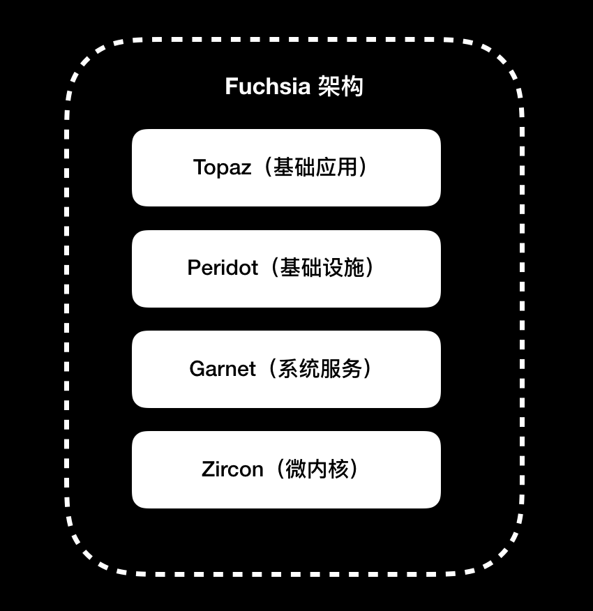

<head>
    
    
</head>

# Table of Contents

1.  [Algorithm](#org71c1616)
2.  [Review](#orge11b724)
    1.  [iOS 是怎么管理内存的](#org94d1721)
        1.  [虚拟内存](#org59e29fb)
        2.  [分段](#orgc55586d)
        3.  [分页](#org260200d)
    2.  [如何编写 Clang 插件](#orgbd91f97)
        1.  [在 macOS 平台上编译 Clang](#org3107e6d)
        2.  [准备编写 Clang 插件](#org222e6a1)
        3.  [FrontAction 是什么](#org7291780)
        4.  [使用 RecursiveASTVisitor](#orgf051029)
        5.  [编写 PluginASTAction 代码](#org5ddae7c)
        6.  [注册 Clang 插件](#orga33e2cb)
        7.  [使用 Clang 插件](#orgbc00b2f)
        8.  [小结](#org6fe7370)
    3.  [打通前端与原生的桥梁：JavaScriptCore 能干哪些事情](#org4d3113b)
        1.  [JavaScriptCore 框架](#orgc66275e)
        2.  [JavaScriptCore 引擎的组成](#orgb2c2cd2)
    4.  [React Native、Flutter 等，这些跨端方案怎么选](#org4d293fc)
        1.  [React Native 框架的优势](#org8d00e99)
        2.  [Flutter 框架的优势](#orgbe932cd)
        3.  [如何选择适合自己的跨端方案](#org1c6e032)
    5.  [原生布局转到前端布局，开发思路有哪些转变](#org478c8f5)
        1.  [UIStackView](#org8ad12cd)
        2.  [SwiftUI](#org6d82998)
        3.  [解析转换 DSL](#org435546a)
        4.  [运行时解释执行 DSL](#org902212b)
    6.  [iOS原生、大前端和Flutter分别是怎么渲染的](#org1bef480)
        1.  [渲染原理](#org65af11b)
        2.  [原生渲染](#orgd178839)
        3.  [大前端渲染](#org733f38a)
        4.  [Flutter 渲染](#orgd3ed712)
    7.  [剖析使 App 具有动态化和热更新能力的方案](#org67e007e)
        1.  [JavaScriptCore 解释器方案](#org956fb1c)
        2.  [代码转译方案](#org385a7e7)
        3.  [自建解释器方案](#org221864a)
3.  [Tips](#org30ec5b6)
    1.  [Kafka & ZMQ：自动化交易流水线](#org9ee05f1)
        1.  [中间件](#org09f3446)
        2.  [消息队列](#org70f8dc6)
        3.  [ZMQ](#org035a517)
        4.  [Kafka](#org74053e6)
        5.  [基于消息队列的 Orderbook 数据流](#org79b8363)
    2.  [MySQL：日志和数据存储系统](#org573aef1)
        1.  [快速理解 MySQL](#orgfb07928)
        2.  [mysqlclient](#orge10b22a)
        3.  [peewee](#org4e67333)
        4.  [量化数据分析系统](#org4fd05f6)
        5.  [分布式日志系统](#orgf39c07c)
        6.  [日志分析](#org6a8e76e)
    3.  [Django：搭建监控平台](#org5ff372a)
        1.  [Django 简介和安装](#orgd88a822)
        2.  [MVC 架构](#org8790a81)
        3.  [设计模型 Model](#orgead140b)
        4.  [设计视图 Views](#org956bb7d)
        5.  [设计模板 Templates](#org4a777af)
        6.  [设计链接 Urls](#org481f8dd)
        7.  [测试](#org093b064)
    4.  [带你上手SWIG：一份清晰好用的SWIG编程实践指南](#org6bf99e5)
        1.  [SWIG 是什么](#org0801681)
        2.  [使用 Python 实现 PCA 算法](#orga4633df)
        3.  [准备 SWIG](#org8c037b1)
        4.  [通过 SWIG 封装基于 C++ 编写的 Python 模块](#org089a4eb)
        5.  [SWIG C++ 常用工具](#org0088221)
        6.  [学习路径](#orgbb8ef79)
4.  [Share](#orge6f267f)
    1.  [摘要](#org70971de)
    2.  [简介](#orgf6ac905)
    3.  [相关工作](#org49ef95e)
        1.  [XML 解析](#org56f8704)
        2.  [CSV 解析](#org4408a7c)
    4.  [解析器架构和实现](#orgefea700)
        1.  [阶段 1：结构化和伪结构化元素](#orgbfa1968)

# Algorithm

Leetcode 2584: [Split the Array to Make Coprime Products](https://leetcode.com/problems/split-the-array-to-make-coprime-products/)

<https://dreamume.medium.com/leetcode-2584-split-the-array-to-make-coprime-products-961f60e0adc2>

# Review

iOS 开发高手课    戴铭

## iOS 是怎么管理内存的

不同的系统版本对 App 运行时占用内存的限制不同，你可以利用我在第 14 篇文章中提到的方法，去查看不同版本系统对 App 占用内存的具体限制是多少。另外，系统版本的升级也会增加占用的内存，同时 App 功能的增多也会要求越来越多的内存

然而，移动设备的内存资源是有限的，当 App 运行时占用的内存大小超过了限制后，就会被强杀掉，从而导致用户体验被降低。所以，为了提升 App 质量，开发者要非常重视应用的内存管理问题

移动端的内存管理技术，主要有 GC（Garbage Collection，垃圾回收）的标记清除算法和苹果公司使用的引用计数方法

相比较于 GC 标记清除算法，引用计数法可以及时地回收引用计数为 0 的对象，减少查找次数。但是，引用计数会带来循环引用的问题，比如当外部的变量强引用 Block 时，Block 也会强引用外部的变量，就会出现循环引用。我们需要通过弱引用，来解除循环引用的问题

另外，在 ARC（自动引用计数）之前，一直都是通过 MRC（手动引用计数）这种手写大量内存管理代码的方式来管理内存，因此苹果公司开发了 ARC 技术，由编译器来完成这部分代码管理工作。但是，ARC 依然需要注意循环引用的问题

当 ARC 的内存管理代码交由编译器自动添加后，有些情况下会比手动管理内存效率低，所以对于一些内存要求较高的场景，我们还是要通过 MRC 的方式来管理、优化内存的使用

要想深入理解 iOS 管理内存的方式，我们就不仅仅要关注用户态接口层面，比如引用计数算法和循环引用监控技巧，还需要从管理内存的演进过程，去了解现代内存管理系统的前世今生，知其然知其所以然

说到内存管理的演进过程，在最开始的时候，程序是直接访问物理内存，但后来有了多程序多任务同时运行，就出现了很多问题。比如，同时运行的程序占用的总内存必须要小于实际物理内存大小。再比如，程序能够直接访问和修改物理内存，也就能够直接访问和修改其他程序所使用的物理内存，程序运行时的安全就无法保障

### 虚拟内存

由于要解决多程序多任务同时运行的这些问题，所以增加了一个中间层来间接访问物理内存，这个中间层就是虚拟内存。虚拟内存通过映射，可以将虚拟地址转化成物理地址

虚拟内存会给每个程序创建一个单独的执行环境，也就是一个独立的虚拟空间，这样每个程序就只能访问自己的地址空间（Address Space），程序与程序间也就能被安全地隔离开了

32 位的地址空间是 2^32 = 4294967296 个字节，共 4GB，如果内存没有达到 4GB 时，虚拟内存比实际的物理内存要大，这会让程序感觉自己能够支配更多的内存。如同虚拟内存只供当前程序使用，操作起来和物理内存一样高效

有了虚拟内存这样一个中间层，极大地节省了物理内存。iOS 的共享库就是利用了这一点，只占用一份物理内存，却能够在不同应用的多份虚拟内存中，去使用同一份共享库的物理内存

每个程序都有自己的进程，进程的内存布局主要由代码段、数据段、栈、堆组成。程序生成的汇编代码会放在代码段。如果每个进程的内存布局都是连在一起的话，每个进程分配的空间就没法灵活变更，栈和堆没用满时就会有很多没用的空间。如果虚拟地址和物理地址的翻译内存管理单元（Memory Management Unit，MMU）只是简单地通过进程开始地址加上虚拟地址，来获取物理地址，就会造成很大的内存空间浪费

### 分段

分段就是将进程里连在一起的代码段、数据段、栈、堆分开成独立的段，每个段内空间是连续的，段之间不连续。这样，内存的空间管理 MMU 就可以更加灵活地进行内存管理

那么，段和进程关系是怎么表示的呢？进程中内存地址会用前两个字节表示对应的段。比如 00 表示代码段，01 标识堆

段里的进程又是如何管理内存的呢？每个段大小增长的方向 Grows Positive 也需要记录，是否可读写也要记录，为的是能够更有效地管理段增长。每个段的大小不一样，在申请的内存被释放后，容易产生碎片，这样在申请新内存时，很可能就会出现所剩内存空间够用，但是却不连续，于是造成无法申请的情况。这时，就需要暂停运行进程，对段进行修改，然后再将内存拷贝到连续的地址空间中。但是，连续拷贝会耗费较多时间

### 分页

App 在运行时，大多数的时间只会使用很小部分的内存，所以我们可以使用比段粒度更小的空间管理技术，也就是分页

分页就是把地址空间切分成固定大小的单元，这样我们就不用去考虑堆和栈会具体申请多少空间，而只要考虑需要多少页就可以了。这，对于操作系统管理来说也会简单很多，只需要维护一份页表（Page Table）来记录虚拟页（Virtual Page）和物理页（Physical Page）的关系即可

虚拟页的前两位是 VPN（Virtual Page Number），根据页表，翻译为物理地址 PFN（Physical Frame Number）

虚拟页与物理页之间的映射关系，就是虚拟内存和物理内存的关系

这里，我们需要注意的是，虚拟页和物理页的个数是不一样的。比如，在 64 位操作系统中使用的是 48 位寻址空间，之所以使用 48 位寻址空间，是因为推出 64 位系统时硬件还不能支持 64 位寻址空间，所以就一直延续下来了。虚拟页大小是 16K，那么虚拟页最多能有 2^48 / 2^14 = 16M 个，物理内存为 16G 对应物理页个数是 2^64 / 2^14 = 524k 个

维护虚拟页和物理页关系的页表会随着进程增多而变得越来越大，当页表大于寄存器大小时，就无法放到寄存器中，只能放到内存中。当要通过虚拟地址获取物理地址的时候，就要对页表进行访问翻译，而在内存中进行访问翻译的速度会比 CPU 的寄存器慢很多

那么，怎么加速页表翻译速度呢？

我们知道，缓存可以加速访问。MMU 中有一个 TLB（Translation-Lookaside Buffer），可以作为缓存加速访问。所以，在访问页表前，首先检查 TLB 有没有缓存的虚拟地址对应的物理地址：

-   如果有的话，就可以直接返回，而不用再去访问页表了
-   如果没有的话，就需要继续访问页表

每次都要访问整个列表去查找我们需要的物理地址，终归还是会影响效率，所以又引入了多级页表技术。也就是，根据一定的算法灵活分配多级页表，保证一级页表最小的内存占用。其中，一级页表对应多个二级页表，再由二级页表对应虚拟页

这样内存中只需要保存一级页表就可以，不仅减少了内存占用，而且还提高了访问效率。根据多级页表分配页表层级算法，空间占用多时，页表级别增多，访问页表层级次数也会增多，所以多级页表机制属于典型的支持时间换空间的灵活方案

iOS 的 XNU Mach 微内核中有很多分页器提供分页操作，比如 Freezer 分页器、VNode 分页器。还有一点需要注意的是，这些分页器不负责调度，调度都是由 Pageout 守护线程执行

由于移动设备的内存资源限制，虚拟分页在 iOS 系统中的控制方式更严格。移动设备的磁盘空间也不够用，因此没有使用 DRAM（动态 RAM）的方式控制内存。为了减少磁盘空间占用，iOS 采用了 Jetsam 机制来控制内存的使用

备注：DRAM 内存控制方式，是在虚拟页不命中的情况下采用磁盘来缓存

占用内存过多的进程会被强杀，这也就对 App 占用的内存提出了更高的要求。同时，Jetsam 机制也可以避免磁盘和内存交换带来的效率问题，因为磁盘的速度要比 DRAM 慢上几万倍

对于在 iOS 开发过程中如何优化内存，苹果公司在 2018 年的 WWDC Session 416: [iOS Memory Deep Dive](https://developer.apple.com/videos/play/wwdc2018/416/) 上进行了详细讲解，其中就包含了 iOS 虚拟内存机制的变化

Xcode 开发工具对内存分析方面所做的更新，比如 debugger 可以自动捕获内存占用触发系统限制的 EXC_RESOURCE RESOURCE_TYPE_MEMORY 异常，并断点在触发异常的位置。对 Xcode 中存储 App 内存信息的 memgrah 文件，我们可以使用 vmmap、leaks、heap、malloc_history 等命令行工具来分析

在这个 Session 中，苹果公司还推荐我们使用 UIGraphicsImageRenderer 替代 UIGraphicsBeginImageContextWithOptions，让系统自动选择最佳的图片格式，这样也能够降低占用的内存。对于图片的缩放，苹果公司推荐使用 ImageIO 直接读取图片的大小和元数据，也就避免了以前将原始图片加载到内存然后进行转换而带来的额外内存开销

其实，图片资源不仅是影响 App 包大小的重要因素，也是内存的消耗大户。苹果公司在 2018 年的 WWDC Session 219: [Images and Graphics Best Practices](https://developer.apple.com/videos/play/wwdc2018/219/) 中，还专门介绍了关于图片的最佳实践，并针对减少内存消耗进行了详细讲解

对于 App 处在低内存时如何处理，你可以看看这篇文章 [No pressure, Mon! Handling low memory conditions in iOS and Mavericks](http://newosxbook.com/articles/MemoryPressure.html)

第三方内存检测工具有 [MLeaksFinder](https://github.com/Tencent/MLeaksFinder)、[FBRetainCycleDetector](https://github.com/facebook/FBRetainCycleDetector)、[OOMDetector](https://github.com/Tencent/OOMDetector)

## 如何编写 Clang 插件

Clang 使用的是模块化设计，可以将自身功能以库的方式来供上层应用来调用。比如，编码规范检查、IDE 中的语法高亮、语法检查等上层应用，都是使用 Clang 库的接口开发出来的。Clang 库对接上层应用有三个接口库，分别是 LibClang、Clang 插件、LibTooling

其中，LibClang 为了兼容更多 Clang 版本，相比 Clang 少了很多功能；Clang 插件和 LibTooling 具备 Clang 的全量能力。Clang 插件编写代码的方式，和 LibTooling 几乎一样，不同的是 Clang 插件还能够控制编译过程，可以加 warning，或者直接中断编译提示错误。另外，编写好的 LibTooling 还能够非常方便地转成 Clang 插件

所以说，Clang 插件在功能上是最全的。今天这篇文章，我们就一起来看看怎样编写和运行 Clang 插件

Clang 插件代码编写后进行编译的前置条件是编译 Clang。要想编译 Clang ，你就需要先安装 CMake，来解决跨平台编译规范问题

我们可以先通过 CMakeList.txt 文件，来定制 CMake 编译流程，再根据 CMakeList.txt 文件生成目标平台所需的编译文件。这个编译文件，在类 UNIX 平台就是 Makefile，在 Windows 平台就是 Visual Studio 工程，macOS 里还可以生成 Xcode 工程。所以，你可以使用熟悉的 Xcode 来编译 Clang

### 在 macOS 平台上编译 Clang

接下来的内容，我会以 macOS 平台编译 Clang 为例。如果你想在其他平台编译，可以参看 [官方说明](https://llvm.org/docs/CMake.html)

首先，从 GitHub 上拉下 Clang 的代码，命令如下：

    git clone https://github.com/llvm/llvm-project.git

然后，执行以下命令，来创建构建所需要的目录：

    cd llvm-project
    mkdir build (in-tree build is not supported)
    cd build

llvm-project 中 clang 子目录就是类 C 语言编译器的代码目录；llvm 目录的代码包含两部分，一部分是对源码进行平台无关优化的优化器代码，另一部分是生成平台相关汇编代码的生成器代码；lldb 目录里是调试器的代码；lld 里是链接器代码

macOS 属于类 UNIX 平台，因此既可以生成 Makefile 文件来编译，也可以生成 Xcode 工程来编译。生成 Makefile 文件，你可以使用如下命令：

    cmake -DLLVM_ENABLE_PROJECTS=clang -G "Unix Makefiles" ../llvm
    make

生成 Xcode 工程，你可以使用这个命令：

    cmake -G Xcode -DLLVM_ENABLE_PROJECTS=clang ../llvm

执行完后，会在 build 目录下生成 Xcode 工程

执行 cmake 命令时，你可能会遇到下面的提示：

    -- The C compiler identification is unknown
    -- The CXX compiler identification is unknown
    CMake Error at CMakeLists.txt:39 (project):
      No CMAKE_C_COMPILER could be found.
    
    CMake Error at CMakeLists.txt:39 (project):
      No CMAKE_CXX_COMPILER could be found.

这表示 cmake 没有找到代码编译器的命令行工具。这包括两种情况：

一是，如果你没有安装 Xcode Commandline Tools 的话，可以执行如下命令安装：

    xcode-select --install

二是，如果你已经安装了 Xcode Commandline Tools 的话，直接 reset 即可，命令如下：

    sudo xcode-select --reset

生成 Xcode 工程后，打开生成的 LLVM.xcodeproj 文件，选择 Automatically Create Schemes。编译完后生成的库文件，就在 llvm-project⁩/build⁩/⁨Debug/⁩⁨lib/ 目录下

有了可以编写编译插件的 Xcode 工程，接下来你就可以着手编写 Clang 插件了

### 准备编写 Clang 插件

编写之前，先在 llvm-project/clang/tools/ 目录下创建 Clang 插件的目录，添加 YourPlugin.cpp 文件和 CMakeLists.txt 文件。其中，CMake 编译需要通过 CMakeLists.txt 文件来指导编译，cpp 是源文件

接下来，我们可以使用如下代码编写 CMakeLists.txt 文件，来定制编译流程：

    add_llvm_library(YourPlugin MODULE YourPlugin.cpp PLUGIN_TOOL clang)

这段代码是指，要将 Clang 插件代码集成到 LLVM 的 Xcode 工程中，并作为一个模块进行编写调试

想要更多地了解 CMake 的语法和功能，你可以查看 [官方文档](https://cmake.org/documentation/)。添加了 Clang 插件的目录和文件后，再次用 cmake 命令生成 Xcode 工程，里面就能够集成 YourPlugin.cpp 文件

到这里，我们已经准备好了 Clang 插件开发环境。接下来，我们就能够在 Xcode 编译器里开发 Clang 插件了

编写 Clang 插件代码，入口就是 FrontActions。接下来，我们就一起看看 FrontActions 是什么？

### FrontAction 是什么

FrontActions 是编写 Clang 插件的入口，也是一个接口，是基于 ASTFrontendAction 的抽象基类。其实，FrontActions 并没干什么实际的事情，只是为接下来基于 AST 操作的函数提供了一个入口和工作环境

通过这个接口，你可以编写你要在编译过程中自定义的操作，具体方式是：通过 ASTFrontendAction 在 AST 上自定义操作，重载 CreateASTConsumer 函数返回你自己的 Consumer，以获取 AST 上的 ASTConsumer 单元

代码示例如下所示：

    class FindNamedClassAction : public clang::ASTFrontendAction {
    public:
      // 实现 CreateASTConsumer 方法
      virtual std::unique_ptr<clang::ASTConsumer> CreateASTConsumer(
        clang::CompilerInstance &Compiler, llvm::StringRef InFile) {
        // 返回 ASTConsumer 单元
        return std::unique_ptr<clang::ASTConsumer>(
            new FindNamedClassConsumer);
      }
    };

ASTConsumer 可以提供很多入口，是一个可以访问 AST 的抽象基类，可以重载 HandleTopLevelDecl() 和 HandleTranslationUnit() 两个函数，以接收访问 AST 时的回调。其中，HandleTopLevelDecl() 函数是在访问到全局变量、函数定义这样最上层声明时进行回调，HandleTranslationUnit() 函数会在接收每个节点访问时的回调

下面有一个示例，会重载 HandleTranslationUnit() 函数，使用 ASTContext 为单元调用，通过 RecursiveASTVisitor 来遍历 decl 单元。具体代码如下：

    class FindNamedClassConsumer : public clang::ASTConsumer {
    public:
      virtual void HandleTranslationUnit(clang::ASTContext &Context) {
        // 通过 RecursiveASTVisitor 来遍历 decl 单元。会访问所有 AST 里的节点。
        Visitor.TraverseDecl(Context.getTranslationUnitDecl());
      }
    private:
      // 一个 RecursiveASTVisitor 的实现
      FindNamedClassVisitor Visitor;
    };

上面代码可以看出，接收 AST 节点回调的 TranslationUnitDecl 函数通过重载已经准备就绪，为接下来 RecursiveASTVisitor 访问 AST 节点做好准备工作

RecursiveASTVisitor 使用深度优先的方式访问 AST 的所有节点。RecursiveASTVisitor 使用的是访问者模式，支持前序遍历和后序遍历来访问 AST 节点。RecursiveASTVisitor 会遍历 AST 的每个节点，遍历节点的同时会回溯，回溯节点类型的基类，再调用节点对应的 Visit 函数。如果重写了节点对应的 Visit 函数，就会调用重写后的 Visit 函数。可以看出真正在干活的是 RecursiveASTVistor，它基本完成了编写 Clang 插件里最多、最重的活儿

接下来，我就跟你说说怎么用 RecursiveASTVisitor 来查找指定名称的 CXXRecordDecl 类型的 AST 节点。也就是说，你需要通过 RecursiveASTVisitor 实现从 AST 里面提取所需要内容

CXXRecordDecl 类型，表示 C++ struct/union/class。更多的节点类型，你可以参看 [官方文档](https://clang.llvm.org/docs/LibASTMatchersReference.html)

### 使用 RecursiveASTVisitor

RecursiveASTVisitor，可以为大多数的 AST 节点提供布尔类型的 VisitNodeType(Nodetype \*)。VisitNodeType 返回的布尔值可以控制 RecursiveASTVisitor 的访问，决定对 AST 节点的访问是否要继续下去

下面，我们来重写一个访问所有 CXXRecordDecl 的 RecursiveASTVisitor

    class FindNamedClassVisitor
      : public RecursiveASTVisitor<FindNamedClassVisitor> {
    public:
      bool VisitCXXRecordDecl(CXXRecordDecl *Declaration) {
        // dump 出已经访问的 AST 的声明节点。
        Declaration->dump();
    
        // 返回 true 表示继续遍历 AST，false 表示停止遍历 AST。
        return true;
      }
    };

在 RecursiveASTVisitor 的方法里，可以使用 Clang AST 的全部功能获取想要的内容。比如，通过重写 VisitCXXRecordDecl 函数，找到指定名称的所有类声明。示例代码如下：

    bool VisitCXXRecordDecl(CXXRecordDecl *Declaration) {
      if (Declaration->getQualifiedNameAsString() == "n::m::C")
        Declaration->dump();
      return true;
    }

将代码保存成文件 FindClassDecls.cpp，并创建 CMakeLists.txt 文件来进行链接。CMakeLists.txt 的内容如下：

    add_clang_executable(find-class-decls FindClassDecls.cpp)
    target_link_libraries(find-class-decls clangTooling)

使用这个工具能够找到 n :: m :: C 的所有声明，然后输出如下信息：

    ./bin/find-class-decls "namespace n { namespace m { class C {}; } }"

### 编写 PluginASTAction 代码

由于 Clang 插件是没有 main 函数的，入口是 PluginASTAction 的 ParseArgs 函数。所以，编写 Clang 插件还要实现 ParseArgs 来处理入口参数。代码如下所示：

    bool ParseArgs(const CompilerInstance &CI,
                   const std::vector<std::string>& args) {
      for (unsigned i = 0, e = args.size(); i != e; ++i) {
        if (args[i] == "-some-arg") {
          // 处理命令行参数
        }
      }
      return true;
    }

### 注册 Clang 插件

最后，还需要在 Clang 插件源码中编写注册代码。编译器会在编译过程中从动态库加载 Clang 插件。使用 FrontendPluginRegistry::Add<> 在库中注册插件。注册 Clang 插件的代码如下：

    static FrontendPluginRegistry::Add<MyPlugin> X("my-plugin-name", "my plugin description");

在 Clang 插件代码的最下面，定义的 my-plugin-name 字符串是命令行字符串，供以后调用时使用，my plugin description 是对 Clang 插件的描述

现在，我们已经编写完了 Clang 插件，我来和你汇总下编写过程：

1.  编写 FrontAction 入口
2.  通过 RecursiveASTVisitor 访问所有 AST 节点，获取想要的内容
3.  编写 PluginASTAction 代码处理入口参数
4.  注册 Clang 插件，提供外部使用

接下来，我们再看看如何使用编写好的 Clang 插件吧

### 使用 Clang 插件

LLVM 官方有一个完整可用的 Clang 插件示例，可以帮我们打印出最上层函数的名字，你可以点击 [链接](https://github.com/llvm/llvm-project/blob/master/clang/examples/PrintFunctionNames/PrintFunctionNames.cpp) 查看这个示例

接下来，通过这个插件示例，看看如何使用 Clang 插件

使用 Clang 插件可以通过 -load 命令行选项加载包含插件注册表的动态库，-load 命令行会加载已经注册了的所有 Clang 插件。使用 -plugin 选项选择要运行的 Clang 插件。Clang 插件的其他参数通过 -plugin-arg-来传递

cc1 进程类似一种预处理，这种预处理会发生在编译之前。cc1 和 Clang driver 是两个单独的实体，cc1 负责前端预处理，Clang driver 则主要负责管理编译任务调度，每个编译任务都会接受 cc1 前端预处理的参数，然后进行调整

有两个方法可以让 -load 和 -plugin 等选项到 Clang 的 cc1 进程中：

-   直接使用 -cc1 选项，缺点是要在命令行上指定完整的系统路径配置
-   使用 -Xclang 来为 cc1 进程添加这些选项。-Xclang 参数只运行预处理器，直接将后面参数传递给 cc1 进程，而不影响 clang driver 的工作

下面是一个编译 Clang 插件，然后使用 -Xclang 加载使用 Clang 插件的例子：

    export BD=/path/to/build/directory
    (cd $BD && make PrintFunctionNames )
    clang++ -D_GNU_SOURCE -D_DEBUG -D__STDC_CONSTANT_MACROS \
            -D__STDC_FORMAT_MACROS -D__STDC_LIMIT_MACROS -D_GNU_SOURCE \
            -I$BD/tools/clang/include -Itools/clang/include -I$BD/include -Iinclude \
            tools/clang/tools/clang-check/ClangCheck.cpp -fsyntax-only \
            -Xclang -load -Xclang $BD/lib/PrintFunctionNames.so -Xclang \
            -plugin -Xclang print-fns

上面命令中，先设置构建的路径，再通过 make 命令进行编译生成 PrintFunctionNames.so，最后使用 clang 命令配合 -Xclang 参数加载使用 Clang 插件

你也可以直接使用 -cc1 参数，但是就需要按照下面的方式来指定完整的文件路径：

    clang -cc1 -load ../../Debug+Asserts/lib/libPrintFunctionNames.dylib -plugin print-fns some-input-file.c

### 小结

Clang 作为编译前端，已经具有很强大的类 C 语言代码解析能力，利用 Clang 的分析能力，你可以在它对代码 Clang AST 分析过程中，获取到 AST 各个节点的信息

Clang AST 节点都是派生自 Type、Decl、Stmt。Clang AST 中最基本的两个节点就是语句 Stmt 和 声明 Decl，表达式 Expr 也是 Stmt。官方有份完整的 Clang AST 节点说明，你可以 [链接 ](https://clang.llvm.org/docs/LibASTMatchersReference.html)查看使用

获取到源码全量信息后，就可以更加精准的分析源码，然后统计出不满足编码规范的地方。同时，访问 SourceManager 和 ASTContext，还能够获取到节点所在源代码中的位置信息。这样的话，我们就可以直接通过 Clang 插件，在问题节点原地修改不规范的代码

我们可以在 CreateASTConsumer 期间从 CompilerInstance 中获取 ASTContext，进而使用其中的 SourceManager 里的 getFullLoc 方法，来获取 AST 节点所在源码的位置

我们可以把获得的位置信息，分成行和列两个部分，据此就能够确定代码具体位置了。获取源码中位置方法如下面代码所示：

    // 使用 ASTContext 的 SourceManager 里的 getFullLoc 方法来获取到 AST 节点所在源码中的位置。
    FullSourceLoc FullLocation = Context->getFullLoc(Declaration->getBeginLoc());
    if (FullLocation.isValid())
      // 按行和列输出
      llvm::outs() << "Found declaration at "
                   << FullLocation.getSpellingLineNumber() << ":"
                   << FullLocation.getSpellingColumnNumber() << "\n";

## 打通前端与原生的桥梁：JavaScriptCore 能干哪些事情

JavaScriptCore 为原生编程语言 Objective-C、Swift 提供调用 JavaScript 程序的动态能力，还能为 JavaScript 提供原生能力来弥补前端所缺能力

正是因为 JavaScriptCore 的这种桥梁作用，所以出现了很多使用 JavaScriptCore 开发 App 的框架 ，比如 React Native、Weex、小程序、WebView Hybird 等框架

JavaScriptCore，原本是 WebKit 中用来解释执行 JavaScript 代码的核心引擎。解释执行 JavaScript 代码的引擎自 JavaScript 诞生起就有，不断演进，一直发展到现在，如今苹果公司有 JavaScriptCore 引擎、谷歌有 V8 引擎、Mozilla 有 SpiderMonkey。对于 iOS 开发者来说，你只要深入理解苹果公司的 JavaScriptCore 框架就可以了

iOS7 之前，苹果公司没有开放 JavaScriptCore 引擎。如果你想使用 JavaScriptCore 的话，需要手动地从开源 WebKit 中编译出来，其接口都是 C 语言，这对于 iOS 开发者来说非常不友好

但是从 iOS7 开始，苹果公司开始将 JavaScriptCore 框架引入 iOS 系统，并将其作为系统级的框架提供给开发者使用。这时，接口使用 Objective-C 进行包装，这对于原生 Objective-C 开发者来说，体验上就非常友好了

JavaScriptCore 框架的框架名是 JavaScriptCore.framework。由于苹果公司的系统已经内置了 JavaScriptCore 框架，而且性能不逊色于 V8 和 SpiderMonkey 等其他引擎，所以前端开发 App 框架就都不约而同将 JavaScriptCore 框架作为自己和原生的桥梁

### JavaScriptCore 框架

苹果官方对 JavaScriptCore 框架的说明，你可以点击 [链接](https://developer.apple.com/documentation/javascriptcore) 查看。从结构上看，JavaScriptCore 框架主要由 JSVirtualMachine 、JSContext、JSValue 类组成

JSVirturalMachine 的作用，是为 JavaScript 代码的运行提供一个虚拟机环境。在同一时间内，JSVirtualMachine 只能执行一个线程。如果想要多个线程执行任务，你可以创建多个 JSVirtualMachine。每个 JSVirtualMachine 都有自己的 GC（Garbage Collector，垃圾回收器），以便进行内存管理，所以多个 JSVirtualMachine 之间的对象无法传递

JSContext 是 JavaScript 运行环境的上下文，负责原生和 JavaScript 的数据传递

JSValue 是 JavaScript 的值对象，用来记录 JavaScript 的原始值，并提供进行原生值对象转换的接口方法

JSVirtualMachine、JSContext、JSValue 之间的关系，如下图所示：

可以看出，JSVirtualMachine 里包含了多个 JSContext， 同一个 JSContext 中又可以有多个 JSValue

JSVirtualMachine 、JSContext、JSValue 类提供的接口，能够让原生应用执行 JavaScript 代码，访问 JavaScript 变量，访问和执行 JavaScript 函数；也能够让 JavaScript 执行原生代码，使用原生输出的类

那么，解释执行 JavaScript 代码的 JavaScriptCore 和原生应用是怎么交互的呢？

要理解这个问题，我们先来看看下面这张图：

可以看到，每个 JavaScriptCore 中的 JSVirtualMachine 对应着一个原生线程，同一个 JSVirtualMachine 中可以使用 JSValue 与原生线程通信，遵循的是 JSExport 协议：原生线程可以将类方法和属性提供给 JavaScriptCore 使用，JavaScriptCore 可以将 JSValue 提供给原生线程使用

JavaScriptCore 和原生应用要想交互，首先要有 JSContext。JSContext 直接使用 init 初始化，会默认使用系统创建的 JSVirtualMachine。如果 JSContext 要自己指定使用哪个 JSVirtualMachine，可以使用 initWithVirtualMachine 方法来指定，代码如下：

    // 创建 JSVirtualMachine 对象 jsvm
    JSVirtualMachine *jsvm = [[JSVirtualMachine alloc] init];
    // 使用 jsvm 的 JSContext 对象 ct
    JSContext *ct = [[JSContext alloc] initWithVirtualMachine:jsvm];

如上面代码所示，首先初始化一个 JSVirtualMachine 对象 jsvm，再初始化一个使用 jsvm 的 JSContext 对象 ct

下面我再举一个通过 JavaScriptCore 在原生代码中调用 JavaScript 变量的例子

这里有一段 JavaScript 代码，我定义了一个 JavaScript 变量 i ，然后我们一起看看如何通过 JavaScriptCore 在原生中调用变量 i。代码如下：

    JSContext *context  = [[JSContext alloc] init];
    // 解析执行 JavaScript 脚本
    [context evaluateScript:@"var i = 4 + 8"];
    // 转换 i 变量为原生对象
    NSNumber *number = [context[@"i"] toNumber];
    NSLog(@"var i is %@, number is %@",context[@"i"], number);

上面代码中，JSContext 会调用 evaluateScript 方法，返回 JSValue 对象

JSValue 类提供了一组将 JavaScript 对象值类型转成原生类型的接口，你可以点击 [链接](https://developer.apple.com/documentation/javascriptcore/jsvalue) ，查看官方文档中对 JSValue 接口的详细说明

其中，有 3 个转换类型的接口比较常用，我来和你稍作展开：

-   在这个示例中，我们使用的是 toNumber 方法，来将 JavaScript 值转换成 NSNumber 对象
-   如果 JavaScript 代码中的变量是数组对象，可以使用 toArray 方法将其转换成 NSArray 对象
-   如果变量是 Object 类型，可以使用 toDictionary 方法将其转换成 NSDictionary

如果你想在原生代码中使用 JavaScript 中的函数对象，可以通过 callWithArguments 方法传入参数，然后实现它的调用。使用示例如下：

    // 解析执行 JavaScript 脚本
    [context evaluateScript:@"function addition(x, y) { return x + y}"];
    // 获得 addition 函数
    JSValue *addition = context[@"addition"];
    // 传入参数执行 addition 函数
    JSValue *resultValue = [addition callWithArguments:@[@(4), @(8)]];
    // 将 addition 函数执行的结果转成原生 NSNumber 来使用。
    NSLog(@"function is %@; reslutValue is %@",addition, [resultValue toNumber]);

如上面代码所示：首先，JSContext 通过 evaluateScript 方法获取 JavaScript 代码中 addition 函数，并保存为一个 JSValue 对象；然后，通过 JSValue 的 callWithArguments 方法，传入 addition 函数所需参数 x、y 以执行函数

而如果要在原生代码中调用 JavaScript 全局函数，你需要使用 JSValue 的 invokeMethod:withArguments 方法。比如，Weex 框架就是使用这个方法，来获取 JavaScript 函数的

相关代码路径是 incubator-weex/ios/sdk/WeexSDK/Sources/Bridge/WXJSCoreBridge.mm ，核心代码如下：

    - (JSValue *)callJSMethod:(NSString *)method args:(NSArray *)args {
        WXLogDebug(@"Calling JS... method:%@, args:%@", method, args);
        return [[_jsContext globalObject] invokeMethod:method withArguments:args];
    }

可以看到，JSContext 中有一个 globalObject 属性。globalObject 是 JSValue 类型，里面记录了 JSContext 的全局对象，使用 globalObject 执行的 JavaScript 函数能够使用全局 JavaScript 对象。因此，通过 globalObject 执行 invokeMethod:withArguments 方法就能够去使用全局 JavaScript 对象了

通过上面的分析，我们可以知道，通过 evaluateScript 方法，就能够在原生代码中执行 JavaScript 脚本，并使用 JavaScript 的值对象和函数对象。那么，JavaScript 又是如何调用原生代码呢？

我先给出一段代码示例，你可以思考一下是如何实现的：

    // 在 JSContext 中使用原生 Block 设置一个减法 subtraction 函数
    context[@"subtraction"] = ^(int x, int y) {
        return x - y;
    };
    
    // 在同一个 JSContext 里用 JavaScript 代码来调用原生 subtraction 函数
    JSValue *subValue = [context evaluateScript:@"subtraction(4,8);"];
    NSLog(@"substraction(4,8) is %@",[subValue toNumber]);

可以看出，JavaScript 调用原生代码的方式，就是：

-   首先，在 JSContext 中使用原生 Block 设置一个减法函数 subtraction
-   然后，在同一个 JSContext 里用 JavaScript 代码来调用原生 subtraction 函数

除了 Block 外，我们还可以通过 JSExport 协议来实现在 JavaScript 中调用原生代码，也就是原生代码中让遵循 JSExport 协议的类，能够供 JavaScript 使用。Weex 框架里，就有个遵循了 JSExport 协议的 WXPolyfillSet 类，使得 JavaScript 也能够使用原生代码中的 NSMutableSet 类型

WXPolyfillSet 的头文件代码路径是 incubator-weex/ios/sdk/WeexSDK/Sources/Bridge/WXPolyfillSet.h ，内容如下：

    @protocol WXPolyfillSetJSExports <JSExport>
    
    // JavaScript 可以使用的方法
    + (instancetype)create;
    - (BOOL)has:(id)value;
    - (NSUInteger)size;
    - (void)add:(id)value;
    - (BOOL)delete:(id)value;
    - (void)clear;
    
    @end
    
    // WXPolyfillSet 遵循 JSExport 协议
    @interface WXPolyfillSet : NSObject <WXPolyfillSetJSExports>
    
    @end

可以看到，WXPolyfillSet 通过 JSExport 协议，提供了一系列方法给 JavaScript 使用

现在我们已经理解了原生和 JavaScript 的互通方式，知道了它们的互通依赖于虚拟机环境 JSVirtualMachine。接下来，我们需要对 JavaScriptCore 引擎进行更深入地理解，才能更好地用好这个框架。比如，JavaScriptCore 是怎么通过直接使用缓存 JIT 编译的机器码来提高性能的，又是怎么对部分函数进行针对性测试编译优化的

JSVirtualMachine 是一个抽象的 JavaScript 虚拟机，是提供给开发者进行开发的，而其核心的 JavaScriptCore 引擎则是一个真实的虚拟机，包含了虚拟机都有的解释器和运行时部分。其中，解释器主要用来将高级的脚本语言编译成字节码，运行时主要用来管理运行时的内存空间。当内存出现问题，需要调试内存问题时，你可以使用 JavaScriptCore 里的 Web Inspector，或者通过手动触发 Full GC 的方式来排查内存问题

接下来，我跟你说下 JavaScriptCore 引擎内部的组成

### JavaScriptCore 引擎的组成

JavaScriptCore 内部是由 Parser、Interpreter、Compiler、GC 等部分组成，其中 Compiler 负责把字节码翻译成机器码，并进行优化。你可以点击 [链接](https://trac.webkit.org/wiki/JavaScriptCore)，来查看 WebKit 官方对 JavaScriptCore 引擎的介绍

JavaScriptCore 解释执行 JavaScript 代码的流程，可以分为两步

第一步，由 Parser 进行词法分析、语法分析，生成字节码

第二步，由 Interpreter 进行解释执行，解释执行的过程是先由 LLInt（Low Level Interpreter）来执行 Parser 生成的字节码，JavaScriptCore 会对运行频次高的函数或者循环进行优化。优化器有 Baseline JIT、DFG JIT、FTL JIT。对于多优化层级切换， JavaScriptCore 使用 OSR（On Stack Replacement）来管理

如果你想更深入地理解 JavaScriptCore 引擎的内容，可以参考我以前的一篇博文 [深入剖析 JavaScriptCore](https://ming1016.github.io/2018/04/21/deeply-analyse-javascriptcore/)

## React Native、Flutter 等，这些跨端方案怎么选

为了一份代码能够运行在多个平台，从而节省开发和沟通成本，各公司都开始关注和使用跨端方案。目前，主流的跨端方案，主要分为两种：一种是，将 JavaScriptCore 引擎当作虚拟机的方案，代表框架是 React Native；另一种是，使用非 JavaScriptCore 虚拟机的方案，代表框架是 Flutter

使用跨端方案进行开发，必然会替代原有平台的开发技术，所以我们在选择跨端方案时，不能只依赖于某几项指标，比如编程语言、性能、技术架构等，来判断是否适合自己团队和产品，更多的还要考虑开发效率、社区支持、构建发布、 DevOps、 CI 支持等工程化方面的指标

所以说，我们在做出选择时，既要着眼于团队现状和所选方案生态，还要考虑技术未来的发展走向

接下来，我就以 React Native 和 Flutter 为例，和你说明如何选择适合自己的跨端方案

### React Native 框架的优势

跨端方案的初衷是要解决多平台重复开发的问题，也就是说，使用跨端方案的话，多个平台的开发者可以使用相同的开发语言来开发适合不同系统的 App

React Native 使用 JavaScript 语言来开发，Flutter 使用的是 Dart 语言。这两门编程语言，对 iOS 开发者来说都有一定的再学习成本，而使用何种编程语言，其实决定了团队未来的技术栈

JavaScript 的历史和流行程度都远超 Dart ，生态也更加完善，开发者也远多于 Dart 程序员。所以，从编程语言的角度来看，虽然 Dart 语言入门简单，但从长远考虑，还是选择 React Native 会更好一些

同时，从页面框架和自动化工具的角度来看，React Native 也要领先于 Flutter。这，主要得益于 Web 技术这么多年的积累，其工具链非常完善。前端开发者能够很轻松地掌握 React Native，并进行移动端 App 的开发

当然，方案选择如同擂台赛，第一回合的输赢无法决定最后的结果

### Flutter 框架的优势

除了编程语言、页面框架和自动化工具以外，React Native 的表现就处处不如 Flutter 了。总体来说，相比于 React Native 框架，Flutter 的优势最主要体现在性能、开发效率和体验这两大方面

Flutter 的优势，首先在于其性能

我们先从最核心的虚拟机说起吧

React Native 所使用的 JavaScriptCore， 原本用在浏览器中，用于解释执行网页中的 JavaScript 代码。为了兼容 Web 标准留下的历史包袱，无法专门针对移动端进行性能优化

Flutter 却不一样。它一开始就抛弃了历史包袱，使用全新的 Dart 语言编写，同时支持 AOT 和 JIT 两种编译方式，而没有采用 HTML/CSS/JavaScript 组合方式开发，在执行效率上明显高于 JavaScriptCore 

除了编程语言的虚拟机，Flutter 的优势还体现在 UI 框架的实现上。它重写了 UI 框架，从 UI 控件到渲染，全部重新实现了，依赖 Skia 图形库和系统图形绘制相关的接口，保证了不同平台上能有相同的体验

想要了解 Flutter 的布局和渲染，你可以看看这两个视频 [The Mahogany Staircase - Flutter’s Layered Design](https://www.youtube.com/watch?v=dkyY9WCGMi0) 和 [Flutter’s Rendering Pipeline](https://www.youtube.com/watch?v=UUfXWzp0-DU&t=1955s)

除了性能上的优势外，Flutter 在开发效率和体验上也有很大的建树

凭借热重载（Hot Reload）这种极速调试技术，极大地提升了开发效率，因此 Flutter 吸引了大量开发者的眼球

同时，Flutter 因为重新实现了 UI 框架，可以不依赖 iOS 和 Android 平台的原生控件，所以无需专门去处理平台差异，在开发体验上实现了真正的统一

此外，Flutter 的学习资源也非常丰富。Flutter 的 [官方文档](https://docs.flutter.dev/)，分门别类整理得井井有条。YouTube 上有一个专门的 [频道](https://www.youtube.com/flutterdev)，提供了许多讲座、演讲、教程资源

或许，你还会说 Flutter 包大小是个问题。Flutter 的渲染引擎是自研的，并没有用到系统的渲染，所以 App 包必然会大些。但是，我觉得从长远来看，App Store 对包大小的限制只会越来越小，所以说这个问题一定不会成为卡点

除了上面两大优势外，我再和你说说 Flutter 对动态化能力的支持

虽然 Flutter 计划会推出动态化能力，但我觉得动态化本身就是一个伪命题。软件架构如果足够健壮和灵活，发现问题、解决问题和验证问题的速度一定会非常快，再次发布上线也能够快速推进。而如果软件架构本就一团糟，解决问题的速度是怎么也快不起来的，即使具有了动态化能力，从解决问题到灰度发布再到全量上线的过程也一定会很曲折

所以，我认为如果你想通过动态化技术来解决发布周期不够快的问题的话，那你首先应该解决的是架构本身的问题。长远考虑，架构上的治理和优化带来的收益，一定会高于使用具有动态化能力的框架

当然，如果你选择使用动态化能力的框架，是抱着绕过 App Store 审核的目的，那就不在本文的讨论范围之内了

### 如何选择适合自己的跨端方案

今天与你分享的 React Native 代表了以 JavaScriptCore 引擎为虚拟机的所有方案，对于这一类方案的选择来说，道理都大同小异。只要你打算转向前端开发，选择它们中的哪一个方案都差不多，而且方案间的切换也很容易

着眼未来，决定跨端方案最终赢家的关键因素，不是编程语言，也不是开发生态，更不是开发者，而是用户

如果谷歌的新系统 Fuchsia 能够如谷歌所计划的五年之内应用到移动端的话，那么五年后即使使用 Fuchsia 的用户只有 10%，你的 App 也要去支持 Fuchsia。Fuchsia 系统的最上层就是 Flutter，这时使用 Flutter 来开发 App 就成了首选。而 Flutter 本身就是一种跨端方案，一旦使用 Flutter 开发成为团队的必选项，那么其他技术栈就没有存在的价值了

其实，我本人还是很看好 Fuchsia 系统的。它的内核是 Zircon，Fuchsia 是整个系统的统称，在 Fuchsia 技术的选择上，谷歌选择了微内核、优于 OpenGL 高内核低开销的图像接口 Vulkan、3D 桌面渲染 Scenic、Flutter 开发框架。谷歌的打算是，三年内在一些非主流的设备上对 Fuchsia 内核进行完善，待成熟后推向移动端

Fuchsia 架构分为四层，包括微内核的第一层 Zircon，提供系统服务的第二层 Garnet，用户体验基础设施的第三层 Peridot，Flutter 所在基础应⽤的第四层 Topaz。结合 Android 系统的经验，在设计架构之初，谷歌就考虑了厂商对深度定制的诉求，使得每层都可以进行替换，模块化做得比 Android 系统更加彻底

Fuchsia 架构，如下图所示：

你可以通过这个视频，查看 [Fuchsia 最近动向](https://www.youtube.com/watch?v=83SDXL65W9k&feature=youtu.be)。如果你有 Pixel 3 XL 手机，可以动手尝试下。你可以点击 [链接](https://github.com/Pixel3Dev/zircon-pixel3)，来查看支持 Pixel 3 XL 的 Fuchsia 项目。Fuchsia 官方 Git 仓库的地址是 <https://fuchsia.googlesource.com>

所以，跨端技术方案的赢家是谁，最终还是要看使用移动设备的用户选择了谁，就好像游戏机市场中的 Nintendo Switch 和 PlayStation Vita。PlayStation Vita 在硬件、性能、系统各方面都领先 Nintendo Switch，但最终游戏开发者还是选择在 Nintendo Switch 上开发，而这其实都取决于购买游戏机的玩家。当 Nintendo Switch 成为了流行和热点以后，所有的游戏开发者都会跟着它走

虽然我们不能决定未来，但我们可以去预测，然后选择一款大概率会赢的跨端框架，以此来奠定自己的竞争力

## 原生布局转到前端布局，开发思路有哪些转变

最开始的时候，iOS 原生布局只支持通过横纵坐标和宽高确定布局的方式，后来引入了 Auto Layout 来优化布局。但，Auto Layout 的写法繁琐，开发者需要编写大量的代码，无法将精力集中在界面布局本身。再后来，苹果公司意识到 Auto Layout 的这个问题，于是推出了 VFL（Visual Format Language，可视化格式语言）来简化 Auto Layout 的写法

其实，包装 Auto Layout 的第三方库，通过支持链式写法，也能达到简化编写 Auto Layout 的目的

比如，适用于 Objective-C 的 Masonry 和适用于 Swift 的 SnapKit，都是非常优秀的第三方库。这两个库的实际使用数量，明显高于苹果自身推出的 VFL。关于这两个库的实现原理和源码分析，你可以查看我以前写的 [读 SnapKit 和 Masonry 自动布局框架源码](https://ming1016.github.io/2018/04/07/read-snapkit-and-masonry-source-code/)

### UIStackView

虽然 Masonry 和 SnapKit 能够简化布局写法，但和前端的布局思路相比，Auto Layout 的布局思路还处在处理两个视图之间关系的初级阶段，而前端的 Flexbox 已经进化到处理一组堆栈视图关系的地步了

苹果公司也意识到了这一点，于是借鉴 Flexbox 的思路创造了 UIStackView，来简化一组堆栈视图之间的关系

和 Flexbox 一样，按照 UIStackView 设置的规则，一组堆栈视图在可用空间中进行动态适应。这组视图按照堆栈中的顺序，沿着轴的方向排列。这里的轴，可以设置为横轴或纵轴。所以，UIStackView 和 Flexbox 布局框架一样，布局都取决于这组堆栈视图设置的各个属性，比如轴方向、对齐方式、间距等等

UIStackView 虽然在布局思路上，做到了和 Flexbox 对齐，但写法上还是不够直观。前端布局通过 HTML + CSS 组合，增强了界面布局的可读性。那么，苹果公司打算如何让自己的布局写法也能和 Flexbox 一样既简洁，可读性又强呢？

### SwiftUI

在 WWDC 2019 上，苹果公司公布了新的界面布局框架 [SwiftUI](https://developer.apple.com/xcode/swiftui/)。SwiftUI 在写法上非常简洁，可读性也很强

GitHub 上有个叫 [About-SwiftUI](https://github.com/Juanpe/About-SwiftUI)的项目，收集了 SwiftUI 的相关资料，包括官方文档教程、WWDC SwiftUI 相关视频、相关博客文章、基于 SwiftUI 开源项目、各类视频，非常齐全，可以全方位地满足你的学习需求

除了支持简洁的链式调用外，它还通过 DSL 定制了 UIStackView 的语法。这套 DSL 的实现，使用的是 Function Builders 技术，可以让 DSL 得到编译器的支持。有了这样的能力，可以说苹果公司未来可能会诞生出更多编译器支持的特定领域 DSL

可以想象，未来 iOS 的开发会更加快捷、方便，效率提高了，门槛降低了，高质量 App 的数量也会增加。这，也是苹果公司最想看到的吧

至此，原生布局的开发思路从布局思路优化转向了 DSL

DSL 编写后的处理方式分为两种：

-   通过解析将其转化成语言本来的面目，SwiftUI 使用的就是这种方式
-   在运行时解释执行 DSL。SQL 就是在运行时解释执行的 DSL

### 解析转换 DSL

在做 iOS 开发之前，我做过很长一段时间的前端开发。转到 iOS 开发后，我就一直觉得布局思路不如前端简单，编写也不够简洁。于是，我就想能不能通过 Flexbox 这种布局思路将前端和原生结合在一起，使用前端 HTML + CSS 的组合作为布局 DSL，通过解析将其转换成原生代码

后来，我按照这个思路实现了一个项目，叫作 [HTN](https://github.com/ming1016/HTN)（HTML To Native）：通过解析 HTML ，将其生成 DOM 树，然后解析 CSS，生成渲染树，最后计算布局生成原生 Texture 代码

下图展示的是，我借鉴 Flexbox 布局思路，使用 HTML + CSS 编写的在浏览器中的显示页面

可以看到，通过 Inspect 观察，HTML 结合 CSS 能够简洁直观地描述界面元素的各种属性和多组界面元素的布局

通过 HTN 的转换生成的代码，如下图所示：

可以看出，和前端代码相比，原生 Texture 的代码繁琐、难读。转换后的完整代码在 HTN 工程中的路径是 HTN/HTNExamples/Sample/Flexbox.m。编译后的效果如下图所示：

可以看到，手机上显示的内容布局和浏览器上基本一致，从而实现了用前端布局编写原生界面布局的目标

我专门写了一篇文章用于记录这个项目的开发过程，[HTML 转原生 HTN 项目开发记录](https://ming1016.github.io/2017/10/16/html-to-native-htn-development-record/) 你可以参考解析 HTML 生成 DOM 树的部分，解析使用的是状态机，能够很轻松地处理复杂的逻辑判断

HTML 是标准界面布局 DSL，语法上还是会有些啰嗦，这也是 XML 格式和 JSON 格式的区别。基于这点，我设计了一个基于前端布局思想的 DSL，同时编写了能够解释执行这个 DSL 的程序。之所以不使用 JSON，是为了在运行时对 DSL 的解释更快。在这个项目里，我精简了冗余的格式

另外，GitHub 上有个利用 Swift 5.1 的 Function Builders 开发了一个能通过 Swift DSL 编写 HTML 的项目 [Vaux](https://github.com/dokun1/Vaux)。你也可以通过这个项目学习如何自定义一个 Swift DSL

### 运行时解释执行 DSL

我设计的这个 DSL 库，叫作 [STMAssembleView](https://github.com/ming1016/STMAssembleView)。对于这种水平居中排列：

STMAssembleView 中的 DSL 如下：

    {
        hc(padding:30)
        [(imageName:starmingicon)]
        [(imageName:starmingicon)]
        [(imageName:starmingicon)]
    }

上面代码中，hc 的两个单词分别表示了轴方向和对齐方式：

-   第一个字母 h 表示按水平轴方向排列，取的是 horizontal 的首字母。如果要表示垂直轴方向排列，可以取 vertical 的首字母，也就是用 v 表示
-   第二个字母 c 表示居中对齐方式。如果要表示左对齐可以用 l（left），表示右对齐可以用 r（right），表示上对齐用 t（top），表示下对齐可以用 b（bottom）

padding 表示的是，大括号里视图之间的间距。其中大括号表示的是一组堆栈视图的集合，中括号表示的是单个视图单元，中括号内的小括号表示的是描述视图的属性

设计的 DSL 解释执行的实现代码，在 STMAssembleView 工程中的代码路径是 STMAssembleView/Classes/STMAssembleView.m

## iOS原生、大前端和Flutter分别是怎么渲染的

### 渲染原理

CPU 内部流水线结构拥有并行计算能力，一般用于显示内容的计算。而 GPU 的并行计算能力更强，能够通过计算将图形结果显示在屏幕像素中。内存中的图形数据，经过转换显示到屏幕上的这个过程，就是渲染。而负责执行这个过程的，就是 GPU

渲染的过程中，GPU 需要处理屏幕上的每一个像素点，并保证这些像素点的更新是流畅的，这就对 GPU 的并行计算能力要求非常高

早期，图形渲染是由 VGA（Video Graphics Array，视频图形阵列）来完成的，随着 3D 加速的需要，带来了比如三角形生成、光栅化、纹理贴图等技术。处理这一系列技术的处理器，就被统称为 GPU

GPU 的主要工作是将 3D 坐标转化成 2D 坐标，然后再把 2D 坐标转成实际像素，具体实现可以分为顶点着色器（确定形状的点）、形状装配（确定形状的线）、几何着色器（确定三角形个数）、光栅化（确定屏幕像素点）、片段着色器（对像素点着色）、测试与混合（检查深度和透明度进行混合）六个阶段

为了能够更方便地控制 GPU 的运算，GPU 的可编程能力也不断加强，开始支持 C 和 C++ 语言。通过 OpenGL 标准定义的库，可以更容易地操作 GPU

在渲染过程中，CPU 专门用来处理渲染内容的计算，比如视图创建、布局、图片解码等，内容计算完成后，再传输给 GPU 进行渲染

在这个过程中，CPU 和 GPU 的相互结合，能够充分利用手机硬件来提升用户使用 App 的体验。当然，在这个过程中，如果 CPU 的计算时间超过了屏幕刷新频率要求的时间，界面操作就会变得不流畅

那么，如果你想要知道原生、大前端和 Flutter 谁会更流畅，就要分别去了解在渲染过程中，谁的 CPU 计算内容会更快

### 原生渲染

原生界面更新渲染的流程，可以分为以下四步

第一步，更新视图树，同步更新图层树

第二步，CPU 计算要显示的内容，包括视图创建（设置 Layer 的属性）、布局计算、视图绘制（创建 Layer 的 Backing Image）、图像解码转换。当 runloop 在 BeforeWaiting 和 Exit 时，会通知注册的监听，然后对图层打包，打完包后，将打包数据发送给一个独立负责渲染的进程 Render Server

第三步，数据到达 Render Server 后会被反序列化，得到图层树，按照图层树中图层顺序、RGBA 值、图层 frame 过滤图层中被遮挡的部分，过滤后将图层树转成渲染树，渲染树的信息会转给 OpenGL ES/Metal。前面 CPU 所处理的这些事情统称为 Commit Transaction

第四步，Render Server 会调用 GPU，GPU 开始进行前面提到的顶点着色器、形状装配、几何着色器、光栅化、片段着色器、测试与混合六个阶段。完成这六个阶段的工作后，再将 CPU 和 GPU 计算后的数据显示在屏幕的每个像素点上

整个渲染过程，如下图所示：

如上图所示，CPU 处理完渲染内容会输入到 Render Server 中，经图层树和渲染树的转换，通过 OpenGL 接口提供给 GPU，GPU 处理完后在屏幕上显示

渲染过程中 Commit Trasaction 的布局计算会重载视图 LayoutSubviews 方法，以及执行 addSubview 方法来添加视图。视图绘制会重载视图的 drawRect 方法。这几个方法都是 iOS 开发中常用的

移动视图位置、删除视图、隐藏或显示视图、调用 setNeedsDisplay 或 setNeedsDisplayInRect 方法，都会触发界面更新，执行渲染流程

### 大前端渲染

大前端的开发框架主要分为两类：第一类是基于 WebView 的，第二类是类似 React Native 的

对于第一类 WebView 的大前端渲染，主要工作在 WebKit 中完成。WebKit 的渲染层来自以前 macOS 的 Layer Rendering 架构，而 iOS 也是基于这一套架构。所以，从本质上来看，WebKit 和 iOS 原生渲染差别不大

第二类的类 React Native 更简单，渲染直接走的是 iOS 原生的渲染。那么，我们为什么会感觉 WebView 和类 React Native 比原生渲染得慢呢？

从第一次内容加载来看，即使是本地加载，大前端也要比原生多出脚本代码解析的工作

WebView 需要额外解析 HTML + CSS + JavaScript 代码，而类 React Native 方案则需要解析 JSON + JavaScript。HTML + CSS 的复杂度要高于 JSON，所以解析起来会比 JSON 慢。也就是说，首次内容加载时， WebView 会比类 React Native 慢

从语言本身的解释执行性能来看，大前端加载后的界面更新会通过 JavaScript 解释执行，而 JavaScript 解释执行性能要比原生差，特别是解释执行复杂逻辑或大量计算时。所以，大前端的运算速度，要比原生慢不少

除了首次加载解析要耗时，以及 JavaScript 语言本身解释慢导致的性能问题外，WebView 的渲染进程是单独的，每帧的更新都要通过 IPC 调用 GPU 进程。频繁的 IPC 进程通信也会有性能损耗

WebView 的单独渲染进程还无法访问 GPU 的 context，这样两个进程就没有办法共享纹理资源。纹理资源无法直接使用 GPU 的 Context 光栅化，那就只能通过 IPC 传给 GPU 进程，这也就导致 GPU 无法发挥自身的性能优势。由于 WebView 的光栅化无法及时同步到 GPU，滑动时容易出现白屏，就很难避免了

说完了大前端的渲染，你会发现，相对于原生渲染，无论是 WebView 还是类 React Native 都会因为脚本语言本身的性能问题而在存在性能差距。那么，对于 Flutter 这种没有使用脚本语言，并且渲染引擎也是全新的框架，其渲染方式有什么不同，性能又怎样呢？

### Flutter 渲染

Flutter 界面是由 Widget 组成的，所有 Widget 组成 Widget Tree，界面更新时会更新 Widget Tree，然后再更新 Element Tree，最后更新 RenderObject Tree

接下来的渲染流程，Flutter 渲染在 Framework 层会有 Build、Wiget Tree、Element Tree、RenderObject Tree、Layout、Paint、Composited Layer 等几个阶段。将 Layer 进行组合，生成纹理，使用 OpenGL 的接口向 GPU 提交渲染内容进行光栅化与合成，是在 Flutter 的 C++ 层，使用的是 Skia 库。包括提交到 GPU 进程后，合成计算，显示屏幕的过程和 iOS 原生基本是类似的，因此性能也差不多

Flutter 的主要优势，在于它能够同时运行于 Android 和 iOS 这两个平台。但是，苹果公司在 WWDC 2019 上推出 SwiftUI 和 Preview 后，Flutter 在界面编写和 Hot Reload 上的优势会逐渐降低

## 剖析使 App 具有动态化和热更新能力的方案

通常情况下，实现动态化的方案有三种，分别是 JavaScriptCore 解释器方案、代码转译方案、自建解释器方案

### JavaScriptCore 解释器方案

iOS 系统内置的 JavaScriptCore，是能够在 App 运行过程中解释执行脚本的解释器

JavaScriptCore 提供了易用的原生语言接口，配合 iOS 运行时提供的方法替换能力，出现了使用 JavaScript 语言修复线上问题的 [JSPatch](https://github.com/bang590/JSPatch)，以及把 JavaScriptCore 作为前端和原生桥梁的 [React Native](https://github.com/facebook/react-native) 和 Weex 开发框架。这些库，让 App 具有了动态化能力

但是，对于原生开发者来说，只能解释执行 JavaScript 语言的解释器 JSPatch、React Native 等，我们用起来不是很顺手，还是更喜欢用原生语言来开发。那么，有没有办法能够解决语言栈的问题呢？

### 代码转译方案

DynamicCocoa 方案将 Objective-C 转换成 JavaScript 代码，然后下发动态执行。这样一来，原生开发者只要使用原生语言去开发调试即可，避免了使用 JavaScript 开发不畅的问题，也就解决了语言栈的问题

当然，语言之间的转译过程需要解决语言差异的问题，比如 Objective-C 是强类型，而 JavaScript 是弱类型，这两种语言间的差异点就很多。但，好在 JavaScriptCore 解释执行完后，还会对应到原生代码上，所以我们只要做好各种情况的规则匹配，就可以解决这个问题

手段上，语言转译可以使用现有的成熟工具，比如类 C 语言的转译，可以使用 LLVM 套件中 Clang 提供的 LibTooling，通过重载 HandleTranslationUnit() 函数，使用 RecursiveASTVistor 来遍历 AST，获取代码的完整信息，然后转换成新语言的代码

在这里，我无法穷尽两种编程语言间的转译，但是如果你想要快速了解转译过程的话，最好的方法就是看一个实现的雏形

比如，我以前用 Swift 写过一个 Lisp 语言到 C 语言转译的雏形。你可以点击 [LispToC](https://github.com/ming1016/study/tree/master/LispToC)，查看具体的代码。通过这个代码，你能够了解到完成转译依次需要用到词法分析器、语法分析器、遍历器、转换器和代码生成器。它们的实现分别对应 LispToC 里的 JTokenizer.swif、JParser.swift、JTraverser.swift、JTransformer.swift 和 CodeGenerator.swift

再比如，你可以查看 [SwiftRewrite](https://github.com/LuizZak/SwiftRewriter) 的完整转译实现。SwiftRewriter 使用 Swift 开发，可以完成 Objective-C 到 Swift 的转换

### 自建解释器方案

可以发现，我在前面提到的 JSPatch、React Native 等库，到最后能够具有动态性，用的都是系统内置的 JavaScriptCore 来解释执行 JavaScript 语言

虽然直接使用内置的 JavaScriptCore 非常方便，但却限制了对性能的优化。比如，系统限制了第三方 App 对 JavaScriptCore JIT（即时编译）的使用。再比如，由于 JavaScript 使用的是弱类型，而类型推断只能在 LLInt 这一层进行，无法得到足够的优化

再加上 JSContext 多线程的处理也没有原生多线程处理得高效、频繁的 JavaScriptCore 和原生间的切换、内存管理方式不一致带来的风险、线程管理不一致的风险、消息转发时的解析转换效率低下等等原因，使得 JavaScriptCore 作为解释器的方案，始终无法比拟原生

虽然通过引入前端技术栈和利用转译技术能够满足大部分动态化和热修复的需求，但一些对性能要求高的团队，还是会考虑使用性能更好的解释器

如果想要不依赖系统解释器实现动态化和热修复，我们可以集成一个新的解释器，毕竟解释器也是用代码写出来的，使用开源解释器甚至是自己编写解释器，也不是不可以

因此，腾讯公司曾公布的 OCS 方案，自己实现了一个虚拟器 OCSVM 作为解释器，用来解释执行自定义的字节码指令集语言 OCScript，同时提供了将 Objective-C 转成 OCScript 基于 LLVM 定制的编译器 OCS

腾讯公司自研一个解释器的好处，就是可以最大程度地提高动态化的执行效率，能够解释执行针对 iOS 运行时特性定制的字节码指令。这套定制的指令，不光有基本运算指令，还有内存操作、地址跳转、强类型转换指令

OCSVM 解释执行 OCScript 指令，能够达到和原生媲美的稳定和高性能，完成运行时 App 的内存管理、解释执行、线程管理等各种任务。OCS 没有开源，所以你无法直接在工程中使用 OCS 方案，但是有些公司自己内部的动态化方案其实就是参考了这个方案。这些方案都没有开源，实现的难度也比较大

因此，你想要在工程中使用高效的解释器，最好的方案就是，先找找看有没有其他的开源解释器能够满足需求

这时，如果你仔细思考，一定会想到 LLVM。LLVM 作为标准的 iOS 编译器套件，对 iOS 开发语言的解析是最标准、最全面的。那么，LLVM 套件里面难道就没有提供一个解释器用来动态解释执行吗？

按理说，LLVM 来实现这个功能是最合适不过了。其实 LLVM 里是有解释器的

只不过，ExecutionEngine 里的 Interpreter，是专门用来解释 LLVM IR 的，缺少对 Objective-C 语法特性的支持，所以无法直接使用。除此之外，ExecutionEngine 里还有个 MCJIT，可以通过 JIT 来实现动态化，但因为 iOS 系统的限制也无法使用

其实，LLVM 之所以没有专门针对 iOS 做解释器，是因为 iOS 动态化在 LLVM 所有工作中的优先级并不高

不过，好在 GitHub 上有一个基于 LLVM 的 C++ 解释器 [CLing](https://github.com/root-project/cling)，可以帮助我们学习怎样通过扩展 LLVM 来自制解释器

解释器分为解释执行 AST 和解释执行字节码两种，其中 Cling 属于前者，而 LLVM 自带解释器属于后者

从效率上来说，解释执行字节码的方案会更好一些，因为字节码可以在编译阶段进行优化，所以使用 LLVM IR 这种字节码，可以让你无需担心类似寄存器使用效率，以及不断重复计算相同值的问题。LLVM 通过优化器可以提高效率，生成紧凑的 IR。而这些优化都在编译时完成，也就提高了运行时的解释效率

那么，LLVM 是怎么做到的呢？

LLVM IR 是 SSA（Static Single-Assignment，静态单赋值） 形式的，LLVM IR 通过 mem2reg Pass 能够识别 alloca 模式，将局部变量变成 SSA value，这样就不再需要 alloca、load、store 了

SSA 主要解决的是，多种数据流分析时种类多、难以维护的问题。它可以提供一种通用分析方法，把数据流和控制流都写在 LLVM IR 里。比如，LLVM IR 在循环体外生成一个 phi 指令，其中每个值仅分配一次，并且用特殊的 phi 节点合并多个可能的值，LLVM 的 mem2reg 传递将我们初始堆栈使用的代码，转成带有虚拟寄存器的 SSA。这样 ，LLVM 就能够更容易地分析和优化 IR 了

LLVM 只是静态计算 0 和 1 地址，并且只用 0 和 1 处理虚拟寄存器。在高级编程语言中，一个函数可能就会有几十个变量要跟踪，虚拟寄存器计算量大后，如何有效使用虚拟寄存器就是一个很大的问题。SSA 形式的 LLVM IR 的 emitter 不用担心虚拟寄存器的使用效率，所有变量都会分配到堆栈里，由 LLVM 去优化

其实，我和你分享的 OCS 和 Cling 解释器，都是基于 LLVM 扩展实现的。那么，如果我们不用 LLVM 的话，应该怎么写解释器呢？

要了解如何写解释器，就要先了解解释器的工作流程

解释器首先将代码编译为字节码，然后执行字节码，对于使用频次多的代码才会使用 JIT 生成机器代码执行。因此，解释器编译的最初目标不是可执行的机器代码，而是专门用在解释器里解释执行的字节码

因为编译器编译的机器代码是专门在编译时优化过的，所以解释器的优化就需要推迟到运行时再做。这时，就需要 Tracing JIT 来跟踪最热的循环优化，比如相同的循环调用超过一百万次，循环就会编译成优化的机器代码。浏览器的引擎，比如 JavaScriptCore、V8，都是基于字节码解释器加上 Tracing JIT 来解释执行 JavaScript 代码的

其实，JIT 技术就是在 App 运行时创建机器代码，同时执行这些机器代码。编译过程，将高级语言转换成汇编语言，Assembler（汇编器） 会将汇编语言转换成实际的机器代码

仅基于字节码的解释器的实现，我们只需要做好解析工作，然后优化字节码和解释字节码的效率，对应上原生的基本方法执行，或者方法替换就可以实现动态化了

但是，自己实现 JIT 就难多了，一方面编写代码和维护代码的成本都很高，另一方面还需要支持多 CPU 架构，如果搭载 iOS 系统的硬件 CPU 架构有了更新还要再去实现支持。所以，JIT 的标签和跳转都不对外提供调用

那如果要想实现一个自制 JIT 的话，应该如何入手呢？

用 C++ 库实现的 JIT [AsmJit](https://github.com/asmjit/asmjit)，是一个完整的 JIT 和 AOT 的 Assembler，可以生成支持整个 x86 和 x64 架构指令集（从 MMX 到 AVX512）的机器代码。AsmJit 的体积很小，在 300KB 以内，并且没有外部依赖，非常适合用来实现自己的 JIT。使用 AsmJit 库后，我们再自己动手去为字节码编写 JIT 能力的解释器，就更容易了

# Tips

Python 核心技术与实战    景霄

## Kafka & ZMQ：自动化交易流水线

在大型量化交易公司，系统一般是分布式运行的，各个模块独立在不同的机器上，然后互相连接来实现。即使是个人的交易系统，在进行诸如高频套利等算法时，也需要将执行层布置在靠近交易所的机器节点上

所以，从今天这节课开始，我们继续回到 Python 的技术栈，从量化交易系统这个角度切入，为你讲解如何实现分布式系统之间的复杂协作

### 中间件

我们先来介绍一下中间件这个概念。中间件，是将技术底层工具和应用层进行连接的组件。它要实现的效果则是，让我们这些需要利用服务的工程师，不必去关心底层的具体实现。我们只需要拿着中间件的接口来用就好了

这个概念听起来并不难理解，我们再举个例子让你彻底明白。比如拿数据库来说，底层数据库有很多很多种，从关系型数据库 MySQL 到非关系型数据库 NoSQL，从分布式数据库 Spanner 到内存数据库 Redis，不同的数据库有不同的使用场景，也有着不同的优缺点，更有着不同的调用方式。那么中间件起什么作用呢？

中间件，等于在这些不同的数据库上加了一层逻辑，这一层逻辑专门用来和数据库打交道，而对外只需要暴露同一个接口即可。这样一来，上层的程序员调用中间件接口时，只需要让中间件指定好数据库即可，其他参数完全一致，极大地方便了上层的开发；同时，下层技术栈在更新换代的时候，也可以做到和上层完全分离，不影响程序员的使用

习惯性把中间件的作用调侃为：没有什么事情是加一层解决不了的；如果有，那就加两层

### 消息队列

简而言之，消息队列就是一个临时存放消息的容器，有人向消息队列中推送消息；有人则监听消息队列，发现新消息就会取走。根据我们刚刚对中间件的解释，清晰可见，消息队列也是一种中间件

目前，市面上使用较多的消息队列有 RabbitMQ、Kafka、RocketMQ、ZMQ 等。不过今天，我只介绍最常用的 ZMQ 和 Kafka

我们先来想想，消息队列作为中间件有什么特点呢？

首先是严格的时序性。刚刚说了，队列是一种先进先出的数据结构，你丢给它 1, 2, 3，然后另一个人从里面取数据，那么取出来的一定也是 1, 2, 3，严格保证了先进去的数据先出去，后进去的数据后出去。显然，这也是消息机制中必须要保证的一点，不然颠三倒四的结果一定不是我们想要的

其次，是分布式网络系统的老生常谈问题。如何保证消息不丢失？如何保证消息不重复？这一切，消息队列在设计的时候都已经考虑好了，你只需要拿来用就可以，不必过多深究

消息队列的模式是发布和订阅，一个或多个消息发布者可以发布消息，一个或多个消息接受者可以订阅消息。消息发布者和消息接受者之间没有直接耦合，其中

-   消息发布者将消息发送到分布式消息队列后，就结束了对消息的处理
-   消息接受者从分布式消息队列获取该消息后，即可进行后续处理，并不需要探寻这个消息从何而来

至于新增业务的问题，只要你对这类消息感兴趣，即可订阅该消息，对原有系统和业务没有任何影响，所以也就实现了业务的可扩展性设计

### ZMQ

先来看 ZMQ，这是一个非常轻量级的消息队列实现

ZMQ 是一个简单好用的传输层，它有三种使用模式：

-   Request - Reply 模式
-   Publish - Subscribe 模式
-   Parallel Pipeline 模式

第一种模式很简单，client 发消息给 server，server 处理后返回给 client，完成一次交互。这个场景你一定很熟悉吧，没错，和 HTTP 模式非常像，所以这里我就不重点介绍了。至于第三种模式，与今天内容无关，这里我也不做深入讲解

我们需要详细来看的是第二种，即“PubSub”模式。下面是它的具体实现，代码很清晰，你应该很容易理解：

    # 订阅者 1
    import zmq
    
    
    def run():
        context = zmq.Context()
        socket = context.socket(zmq.SUB)
        socket.connect('tcp://127.0.0.1:6666')
        socket.setsockopt_string(zmq.SUBSCRIBE, '')
    
        print('client 1')
        while True:
            msg = socket.recv()
            print("msg: %s" % msg)
    
    
    if __name__ == '__main__':
        run()
    
    ########## 输出 ##########
    
    # client 1
    # msg: b'server cnt 1'
    # msg: b'server cnt 2'
    # msg: b'server cnt 3'
    # msg: b'server cnt 4'
    # msg: b'server cnt 5'

    # 订阅者 2
    import zmq
    
    
    def run():
        context = zmq.Context()
        socket = context.socket(zmq.SUB)
        socket.connect('tcp://127.0.0.1:6666')
        socket.setsockopt_string(zmq.SUBSCRIBE, '')
    
        print('client 2')
        while True:
            msg = socket.recv()
            print("msg: %s" % msg)
    
    
    if __name__ == '__main__':
        run()
    
    ########## 输出 ##########
    
    # client 2
    # msg: b'server cnt 1'
    # msg: b'server cnt 2'
    # msg: b'server cnt 3'
    # msg: b'server cnt 4'
    # msg: b'server cnt 5'

    # 发布者
    import time
    import zmq
    
    
    def run():
        context = zmq.Context()
        socket = context.socket(zmq.PUB)
        socket.bind('tcp://*:6666')
    
        cnt = 1
    
        while True:
            time.sleep(1)
            socket.send_string('server cnt {}'.format(cnt))
            print('send {}'.format(cnt))
            cnt += 1
    
    
    if __name__ == '__main__':
        run()
    
    ########## 输出 ##########
    
    # send 1
    # send 2
    # send 3
    # send 4
    # send 5

这里要注意的一点是，如果你想要运行代码，请先运行两个订阅者，然后再打开发布者

接下来，我来简单讲解一下

对于订阅者，我们要做的是创建一个 zmq Context，连接 socket 到指定端口。其中，setsockopt_string() 函数用来过滤特定的消息，而下面这行代码：

    socket.setsockopt_string(zmq.SUBSCRIBE, '') 

则表示不过滤任何消息。最后，我们调用 socket.recv() 来接受消息就行了，这条语句会阻塞在这里，直到有新消息来临

对于发布者，我们同样要创建一个 zmq Context，绑定到指定端口，不过请注意，这里用的是 bind 而不是 connect。因为在任何情况下，同一个地址端口 bind 只能有一个，但却可以有很多个 connect 链接到这个地方。初始化完成后，再调用 socket.send_string ，即可将我们想要发送的内容发送给 ZMQ

当然，这里还有几个需要注意的地方。首先，有了 send_string，我们其实已经可以通过 JSON 序列化，来传递几乎我们想要的所有数据结构，这里的数据流结构就已经很清楚了

另外，把发布者的 time.sleep(1) 放在 while 循环的最后，严格来说应该是不影响结果的。这里你可以尝试做个实验，看看会发生什么

你还可以思考下另一个问题，如果这里是多个发布者，那么 ZMQ 应该怎么做呢？

### Kafka

通过代码实现你也可以发现，ZMQ 的优点主要在轻量、开源和方便易用上，但在工业级别的应用中，大部分人还是会转向 Kafka 这样的有充足支持的轮子上

相比而言，Kafka 提供了点对点网络和发布订阅模型的支持，这也是用途最广泛的两种消息队列模型。而且和 ZMQ 一样，Kafka 也是完全开源的，因此你也能得到开源社区的充分支持

### 基于消息队列的 Orderbook 数据流

量化交易系统中，获取 orderbook 一般有两种用途：策略端获取实时数据，用来做决策；备份在文件或者数据库中，方便让策略和回测系统将来使用

如果我们直接单机监听交易所的消息，风险将会变得很大，这在分布式系统中叫做 Single Point Failure。一旦这台机器出了故障，或者网络连接突然中断，我们的交易系统将立刻暴露于风险中

于是，一个很自然的想法就是，我们可以在不同地区放置不同的机器，使用不同的网络同时连接到交易所，然后将这些机器收集到的信息汇总、去重，最后生成我们需要的准确数据。相应的拓扑图如下：

当然，这种做法也有很明显的缺点：因为要同时等待多个数据服务器的数据，再加上消息队列的潜在处理延迟和网络延迟，对策略服务器而言，可能要增加几十到数百毫秒的延迟。如果是一些高频或者滑点要求比较高的策略，这种做法需要谨慎考虑

但是，对于低频策略、波段策略，这种延迟换来的整个系统的稳定性和架构的解耦性，还是非常值得的。不过，你仍然需要注意，这种情况下，消息队列服务器有可能成为瓶颈，也就是刚刚所说的 Single Point Failure，一旦此处断开，依然会将系统置于风险之中

事实上，我们可以使用一些很成熟的系统，例如阿里的消息队列，AWS 的 Simple Queue Service 等等，使用这些非常成熟的消息队列系统，风险也将会最小化

## MySQL：日志和数据存储系统

在互联网公司中，日志系统是一个非常重要的技术底层。在每一次重要的交互行为中，关键信息都会被记录下来存档，以供日后线下分析，或者线上实时分析。这些数据，甚至可以说是硅谷互联网大公司的命脉所在

有了它们，你才能建立机器学习模型来预测用户的行为，从而可以精确描绘用户画像，然后针对性地使用推荐系统、分类器，将用户进一步留下，并精准推送广告来盈利

在量化交易中，日志同样有着非常重要的作用。一如前面所讲，我们重要的数据有：行情数据、策略信号、执行情况、仓位信息等等非常多的信息

对于简单的、小规模的数据，例如 orderbook 信息，我们完全可以把数据存在 txt、csv 文件中，这样做简单高效。不过，缺点是，随着数据量上升，一个文件将会变得非常大，检索起来也不容易。这时，一个很直观的方式出现了，我们可以把每天的数据存在一个文件中，这样就暂时缓解了尴尬

但是，随着数据量的上升，或者是你的算法逐渐来到高频交易领域时，简单地把数据存在文件上，已经不足以满足新的需求，更无法应对分布式量化交易系统的需求。于是，一个显而易见的想法就是，我们可以把日志存在数据库系统中

这节课，我们就以 MySQL 这种传统型关系数据库为例，讲解一下数据库在日志中的运用

### 快速理解 MySQL

MySQL 属于典型的关系型数据库（RDBMS），所谓的关系型数据库，就是指建立在关系模型基础上的数据库，借助于集合代数等数学概念和方法，来处理数据库中的数据。基本上任何学习资料都会告诉你，它有着下面这几个特征：

1.  数据是以表格的形式出现的
2.  每一行是各种记录名称
3.  每一列是记录名称所对应的数据域
4.  许多的行和列，组成一张表单
5.  若干的表单，组成数据库（database）这个整体

不过，抛开这些抽象的特征不谈，你首先需要掌握的，是下面这些术语的概念

-   数据库，是一些关联表的集合；而数据表则是数据的矩阵。在一个数据库中，数据表看起来就像是一个简单的电子表格
-   在数据表中，每一列包含的是相同类型的数据；每一行则是一组相关的数据
-   主键也是数据表中的一个列，只不过，这一列的每行元素都是唯一的，且一个数据表中只能包含一个主键；而外键则用于关联两个表

除此之外，你还需要了解索引。索引是对数据库表中一列或多列的值进行排序的一种结构。使用索引，我们可以快速访问数据库表中的特定信息。一般来说，你可以对很多列设置索引，这样在检索指定列的时候，就大大加快了速度，当然，代价是插入数据会变得更慢

接下来，我们就来简单看一下，如何使用 Python 来操作 MySQL 数据库

Python 连接数据库的方式有好多种，这里我简单介绍其中两种。我们以 Ubuntu 为例，假设你的系统中已经安装过 MySQL Server。（安装 MySQL 可以参考这篇文章 [链接](https://www.jianshu.com/p/3111290b87f4)，或者你可以自行搜索解决）

### mysqlclient

事实上， Python 连接 MySQL 最流行的一个驱动是 MySQL-python，又叫 MySQLdb，很多框架都也是基于此库进行开发。不过，遗憾的是，它只支持 Python2.x，而且安装的时候有很多前置条件。因为它是基于 C 开发的库，在 Windows 平台安装非常不友好，经常出现失败的情况。所以，现在我们基本不再推荐使用，取代者是它的衍生版本——mysqlclient

mysqlclient 完全兼容 MySQLdb，同时支持 Python3.x，是 Django ORM 的依赖工具。如果你想使用原生 SQL 来操作数据库，那么我优先推荐使用这个框架

它的安装方式很简单：

    sudo apt-get install python3-dev
    pip install mysqlclient

我们来看一个样例代码：

    import MySQLdb
    
    
    def test_pymysql():
        conn = MySQLdb.connect(
            host='localhost',
            port=3306,
            user='your_username',
            passwd=your_password’,
            db='mysql'
        )
    
        cur = conn.cursor()
        cur.execute('''
                CREATE TABLE price (
                    timestamp TIMESTAMP NOT NULL,
                    BTCUSD FLOAT(8,2),
                    PRIMARY KEY (timestamp)
                );
            ''')
        cur.execute('''
                INSERT INTO price VALUES(
                    "2019-07-14 14:12:17",
                    11234.56
                );
            ''')
    
        conn.commit()
        conn.close()
    
    
    test_pymy

代码的思路很清晰明了，首先是通过 connect 命令连接数据库，来创建一个连接；之后，通过 conn.cursor() 函数创建一个游标。这里你可能会问，为什么要使用游标呢？

一个主要的原因就是，这样可以把集合操作转换成单个记录处理的方式。如果用 SQL 语言从数据库中检索数据，结果会放在内存的一块区域中，并且这个结果往往是一个含有多个记录的集合。而游标机制，则允许用户在 MySQL 内逐行地访问这些记录，这样你就可以按照自己的意愿，来显示和处理这些记录

继续回到代码中，再往下走，我们创建了一个 price table，同时向里面插入一条 orderbook 数据。这里为了简化代码突出重点，我只保留了 timestamp 和 price

最后，我们使用 conn.commit() 来提交更改，然后 close() 掉连接就可以了

### peewee

不过，大家逐渐发现，写原生的 SQL 命令很麻烦。因为你需要根据特定的业务逻辑，来构造特定的插入和查询语句，这样可以说就完全抛弃了面向对象的思维。因此，又诞生了很多封装 wrapper 包和 ORM 框架

这里所说的 ORM（Object Relational Mapping，简称 ORM） ，是 Python 对象与数据库关系表的一种映射关系，有了 ORM 后，我们就不再需要写 SQL 语句，而可以直接使用 Python 的数据结构了

ORM 框架的优点，是提高了写代码的速度，同时兼容多种数据库系统，如 SQLite、MySQL、PostgreSQL 等这些数据库；而付出的代价，可能就是性能上的一些损失

接下来要讲的 peewee，正是其中一种基于 Python 的 ORM 框架，它的学习成本非常低，可以说是 Python 中最流行的 ORM 框架

它的安装方式也很简单：

    pip install peewee

我们来看一个样例代码：

    import peewee
    from peewee import *
    
    db = MySQLDatabase('mysql', user='your_username', passwd=your_password’)
    
    
    class Price(peewee.Model):
        timestamp = peewee.DateTimeField(primary_key=True)
        BTCUSD = peewee.FloatField()
    
        class Meta:
            database = db
    
    
    def test_peewee():
        Price.create_table()
        price = Price(timestamp='2019-06-07 13:17:18', BTCUSD='12345.67')
        price.save()
    
    
    test_p

如果你写过 Django，你会发现，这个写法和 Django 简直一模一样。我们通过一个 Python class ，映射了 MySQL 中的一张数据表；只要对其中每一列数据格式进行定义，便可按照 Python 的方式进行操作

显而易见，peewee 的最大优点，就是让 SQL 语言瞬间变成强类型语言，这样不仅极大地增强了可读性，也能有效减少出 bug 的概率

不过，事实上，作为一名数据科学家，或者作为一名量化从业者（quant ），你要处理的数据远比这些复杂很多。互联网工业界有大量的脏数据，金融行业的信噪比更是非常之低，数据处理只能算是基本功

如果你对数据分析有兴趣和志向，在学生时期就应该先打牢数学和统计的基础，之后在实习和工作中快速掌握数据处理的方法。当然，如果你已经错过学生时期的话，现在开始也是个不错的选择，毕竟，逐渐形成自己的核心竞争力，才是我们每个人的正道

### 量化数据分析系统

数据库有了量化数据存入后，接下来，我们便可以开始进行一些量化分析了。这一块儿也是一个很大的学术领域，叫做时间序列分析，不过就今天这节课的主题来说，我们仅做抛砖引玉，列举一个非常简单的例子，即求过去一个小时 BTC/USD 的最高价和最低价

我们来看下面这段代码：

    import MySQLdb
    import numpy as np
    
    
    def test_pymysql():
        conn = MySQLdb.connect(
            host='localhost',
            port=3306,
            user='your_username',
            passwd='your_password',
            db='mysql'
        )
    
        cur = conn.cursor()
        cur.execute('''
                SELECT
                  BTCUSD
                FROM
                  price
                WHERE
                  timestamp > now() - interval 60 minute
        ''')
    
        BTCUSD = np.array(cur.fetchall())
        print(BTCUSD.max(), BTCUSD.min())
    
        conn.close()
    
    
    test_pym

代码看起来很简单吧！显然，通过 SQL 语句，我们可以抓取到过去一小时的时间序列片段，拿到我们想要的 BTC/USD 价格向量，然后通过 numpy 处理一下即可。不过这里需要注意一点，我们并不需要调用 conn.commit()，因为我们的操作是只读的，对数据库没有任何影响

### 分布式日志系统

对量化交易而言，我们需要的模块主要有数据系统、策略系统、交易执行系统、线下模型训练、线上风控系统以及实时监控系统。它们之间的对应关系，我画了一张图，你可以参考来理解

这里的每个子系统都是独立运行的，并且还有许多模块需要迭代更新，所以我们简单保存本地日志显然不是一个明智之举。于是，我们可以专门开一台服务器来运行 MySQL server，并且开放指定端口和其他系统进行交互

另外，图中的收集系统，其实类似于上一节我们所讲的消息队列体系，在各个上游系统中运行代理工具，负责将各个模块的 log 收集起来，然后发送到收集系统中。收集系统整理过后，再将信息存到日志系统。当然，除了简单的消息队列，我们还能用很多工具，比如阿里云的 Logtail、 Apache 的 Flume Agent 等等

而到了后期，对于日志系统来说，越来越需要注意的就是存储效率和分析效率。随着使用的增加，数据会越来越多，因此我们可以考虑对一些数据进行压缩和保存。而越是久远的数据，越是粗粒度的数据，被调用的概率也就越低，所以它们也就首当其冲，成了我们压缩、保存的目标

### 日志分析

分析一般分为两种，离线分析和在线分析

在离线分析中，比较常见的是生成报告

比如，总结某天某月或某季度内的，收益亏损情况（PnL）、最大回撤、夏普比率等数据。这种基于时间窗口的统计，在关系型数据库中也能得到很方便的支持

而另一类常见的离线使用方式，则是回测系统。在一个新策略研发的周期中，我们需要对历史数据进行回测，这样就可以得到历史数据中交易的收益率等数据。回测系统对于评估一个新的策略非常重要，然而，回测往往需要大量的资源，所以选取好数据库、数据存储方式，优化数据连接和计算，就显得至关重要

在线分析，则更多应用于风控和警报系统。这种方式，对数据的实时性要求更高一些，于是，一种方法就是，从消息队列中直接拿最快的数据进行操作。当然，这个前提是时间窗口较小，这样你就不需要风控系统来维护大量的本地数据

至于实时警报，最关键的依然是数据

-   比如，数据系统异常停止，被监视的表没有更新
-   或者，交易系统的连接出了故障，委托订单的某些状态超过了一定的阈值
-   再或者，仓位信息出现了较大的、预计之外的变动

这些情况都需要进行报警，也就是硅谷大公司所说的“oncall”。一旦发生意外，负责人会迅速收到电话、短信和邮件，然后通过监控平台来确认，是真的出了事故还是监控误报

当然，现在已经有了不少开源的工具可以在云端使用，其中 AWS 属于全球领先的云计算平台。如果你的服务器架设在美国，那就可以考虑选择它家的各种各样的云服务。这样做的好处是，对于小型量化交易团队而言，避免自己搭建复杂的日志系统，而是把主要精力放在策略的开发迭代之上，提高了不少效率

## Django：搭建监控平台

这节课，我们重点来看前端交互

监控和运维，是互联网工业链上非常重要的一环。监控的目的就是防患于未然。通过监控，我们能够及时了解到企业网络的运行状态。一旦出现安全隐患，你就可以及时预警，或者是以其他方式通知运维人员，让运维监控人员有时间处理和解决隐患，避免影响业务系统的正常使用，将一切问题的根源扼杀在摇篮当中

在硅谷互联网大公司中，监控和运维被称为 SRE，是公司正常运行中非常重要的一环。作为 billion 级别的 Facebook，内部自然也有着大大小小、各种各样的监控系统和运维工具，有的对标业务数据，有的对标服务器的健康状态，有的则是面向数据库和微服务的控制信息

不过，万变不离其宗，运维工作最重要的就是维护系统的稳定性。除了熟悉运用各种提高运维效率的工具来辅助工作外，云资源费用管理、安全管理、监控等，都需要耗费不少精力和时间。运维监控不是一朝一夕得来的，而是随着业务发展的过程中同步和发展的

作为量化实践内容的最后一节，今天我们就使用 Django 这个 Web 框架，来搭建一个简单的量化监控平台

### Django 简介和安装

Django 是用 Python 开发的一个免费开源的 Web 框架，可以用来快速搭建优雅的高性能网站。它采用的是“MVC”的框架模式，即模型 M、视图 V 和控制器 C

Django 最大的特色，在于将网页和数据库中复杂的关系，转化为 Python 中对应的简单关系。它的设计目的，是使常见的 Web 开发任务变得快速而简单。Django 是开源的，不是商业项目或者科研项目，并且集中力量解决 Web 开发中遇到的一系列问题。所以，Django 每天都会在现有的基础上进步，以适应不断更迭的开发需求。这样既节省了开发时间，也提高了后期维护的效率

说了这么多，接下来，我们通过上手使用进一步来了解。先来看一下，如何安装和使用 Django。你可以先按照下面代码块的内容来操作，安装 Django ：

    pip3 install Django
    django-admin --version
    
    ########## 输出 ##########
    
    2.2.3

接着，我们来创建一个新的 Django 项目：

    django-admin startproject TradingMonitor
    cd TradingMonitor/
    python3 manage.py migrate
    
    ########## 输出 ##########

    Applying contenttypes.0001_initial... OK
    Applying auth.0001_initial... OK
    Applying admin.0001_initial... OK
    Applying admin.0002_logentry_remove_auto_add... OK
    Applying admin.0003_logentry_add_action_flag_choices... OK
    Applying contenttypes.0002_remove_content_type_name... OK
    Applying auth.0002_alter_permission_name_max_length... OK
    Applying auth.0003_alter_user_email_max_length... OK
    Applying auth.0004_alter_user_username_opts... OK
    Applying auth.0005_alter_user_last_login_null... OK
    Applying auth.0006_require_contenttypes_0002... OK
    Applying auth.0007_alter_validators_add_error_messages... OK
    Applying auth.0008_alter_user_username_max_length... OK
    Applying auth.0009_alter_user_last_name_max_length... OK
    Applying auth.0010_alter_group_name_max_length... OK
    Applying auth.0011_update_proxy_permissions... OK
    Applying sessions.0001_initial... OK

这时，你能看到文件系统大概是下面这样的：

    TradingMonitor/
    ├── TradingMonitor
    │   ├── __init__.py
    │   ├── settings.py
    │   ├── urls.py
    │   └── wsgi.py
    ├── db.sqlite3
    └── manage.py

我简单解释一下它的意思：

-   TradingMonitor/TradingMonitor，表示项目最初的 Python 包
-   TradingMonitor/init.py，表示一个空文件，声明所在目录的包为一个 Python 包
-   TradingMonitor/settings.py，管理项目的配置信息
-   TradingMonitor/urls.py，声明请求 URL 的映射关系
-   TradingMonitor/wsgi.py，表示 Python 程序和 Web 服务器的通信协议
-   manage.py，表示一个命令行工具，用来和 Django 项目进行交互
-   Db.sqlite3，表示默认的数据库，可以在设置中替换成其他数据库

另外，你可能注意到了上述命令中的python3 manage.py migrate，这个命令表示创建或更新数据库模式。每当 model 源代码被改变后，如果我们要将其应用到数据库上，就需要执行一次这个命令

接下来，我们为这个系统添加管理员账户：

    python3 manage.py createsuperuser
    
    ########## 输出 ##########
    
    Username (leave blank to use 'ubuntu'): admin
    Email address:  
    Password: 
    Password (again): 
    Superuser created successfully.

然后，我们来启动 Django 的 debugging 模式：

    python3 manage.py runserver

最后，打开浏览器输入：<http://127.0.0.1:8000> 。如果你能看到下面这个画面，就说明 Django 已经部署成功了

Django 的安装是不是非常简单呢？这其实也是 Python 一贯的理念，简洁，并简化入门的门槛

OK，现在我们再定位到 <http://127.0.0.1:8000/admin> ，你会看到 Django 的后台管理网页，这里我就不过多介绍了

到此，Django 就已经成功安装，并且正常启动

### MVC 架构

MVC 架构是 Django 设计模式的精髓。接下来，我们就来具体看一下这个架构，并通过 Django 动手搭建一个服务端

### 设计模型 Model

在之前的日志和存储系统这节课中，我介绍过 peewee 这个库，它能避开通过繁琐的 SQL 语句来操作 MySQL，直接使用 Python 的 class 来进行转换。事实上，这也是 Django 采取的方式

Django 无需数据库就可以使用，它通过对象关系映射器（object-relational mapping），仅使用 Python 代码就可以描述数据结构

我们先来看下面这段 Model 代码：

    #  TradingMonitor/models.py
    
    from django.db import models
    
    
    class Position(models.Model):
        asset = models.CharField(max_length=10)
        timestamp = models.DateTimeField()
        amount = models.DecimalField(max_digits=10, decimal_places=3)

models.py 文件主要用一个 Python 类来描述数据表，称为模型 。运用这个类，你可以通过简单的 Python 代码来创建、检索、更新、删除数据库中的记录，而不用写一条又一条的 SQL 语句，这也是我们之前所说的避免通过 SQL 操作数据库

在这里，我们创建了一个 Position 模型，用来表示我们的交易仓位信息。其中，

-   asset 表示当前持有资产的代码，例如 btc
-   timestamp 表示时间戳
-   amount 则表示时间戳时刻的持仓信息

### 设计视图 Views

在模型被定义之后，我们便可以在视图中引用模型了。通常，视图会根据参数检索数据，加载一个模板，并使用检索到的数据呈现模板

设计视图，则是我们用来实现业务逻辑的地方。我们来看 render_positions 这个代码，它接受 request 和 asset 两个参数，我们先不用管 request。这里的 asset 表示指定一个资产名称，例如 btc，然后这个函数返回一个渲染页面

    #  TradingMonitor/views.py
    
    from django.shortcuts import render
    from .models import Position
    
    def render_positions(request, asset):
        positions = Position.objects.filter(asset = asset)
        context = {'asset': asset, 'positions': positions}
        return render(request, 'positions.html', context)

positions = Position.objects.filter(asset = asset)，这行代码向数据库中执行一个查询操作，其中， filter 表示筛选，意思是从数据库中选出所有我们需要的 asset 的信息。不过，这里我只是为你举例做示范；真正做监控的时候，我们一般会更有针对性地从数据库中筛选读取信息，而不是一口气读取出所有的信息

context = {'asset': asset, 'positions': positions}，这行代码没什么好说的，封装一个字典。至于这个字典的用处，下面的内容中可以体现

return render(request, 'positions.html', context)，最后这行代码返回一个页面。这里我们采用的模板设计，这也是 Django 非常推荐的开发方式，也就是让模板和数据分离，这样，数据只需要向其中填充即可

最后的模板文件是 position.html，你应该注意到了， context 作为变量传给了模板，下面我们就来看一下设计模板的内容

### 设计模板 Templates

模板文件，其实就是 HTML 文件和部分代码的综合。你可以想象成，这个 HTML 在最终送给用户之前，需要被我们预先处理一下，而预先处理的方式就是找到对应的地方进行替换

我们来看下面这段示例代码：

    #  TradingMonitor/templates/positions.html
    
    <!DOCTYPE html>
    <html lang="en-US">
    <head>
    <title>Positions for {{asset}}</title>
    </head>
    
    <body>
    <h1>Positions for {{asset}}</h1>
    
    <table>
    <tr>
        <th>Time</th>
        <th>Amount</th>
    </tr>
    
    <tr>
        <th>{{position.timestamp}}</th>
        <th>{{position.amount}}</th>
    </tr>
    
    </table>
    </body>

我重点说一下几个地方。首先是，这里双大括号括住 asset 这个变量，这个变量对应的正是前面 context 字典中的 asset key。Django 的渲染引擎会将 asset ，替换成 context 中 asset 对应的内容，此处是替换成了 btc

再来看，这是个很关键的地方。我们需要处理一个列表的情况，用 for 对 positions 进行迭代就行了。这里的 positions ，同样对应的是 context 中的 positions

末尾的，自然就表示结束了。这样，我们就将数据封装到了一个列表之中

### 设计链接 Urls

最后，我们需要为我们的操作提供 URL 接口，具体操作我放在了下面的代码中，内容比较简单，我就不详细展开讲解了

    #  TradingMonitor/urls.py
    
    from django.contrib import admin
    from django.urls import path
    from . import views
    
    urlpatterns = [
        path('admin/', admin.site.urls),
        path('positions/<str:asset>', views.render_positions),
    ]

到这里，我们就可以通过 <http://127.0.0.1:8000/positions/btc> 来访问啦！

### 测试

当然，除了主要流程外，我还需要强调几个很简单但非常关键的细节，不然，我们这些改变就不能被真正地应用

第一步，在 TradingMonitor/TradingMonitor 下，新建一个文件夹 migrations；并在这个文件夹中，新建一个空文件 init.py

    mkdir TradingMonitor/migrations
    touch TradingMonitor/migrations/__init__.py

此时，你的目录结构应该长成下面这样：

    TradingMonitor/
    ├── TradingMonitor
    │   ├── migrations
    │       └── __init__.py
    │   ├── templates
    │       └── positions.html
    │   ├── __init__.py
    │   ├── settings.py
    │   ├── urls.py
    │   ├── models.py
    │   ├── views.py
    │   └── wsgi.py
    ├── db.sqlite3
    └── manage.py

第二步，修改 TradingMonitor/settings.py：

    INSTALLED_APPS = [
        'django.contrib.admin',
        'django.contrib.auth',
        'django.contrib.contenttypes',
        'django.contrib.sessions',
        'django.contrib.messages',
        'django.contrib.staticfiles',
        'TradingMonitor',  # 这里把我们的 app 加上
    ]

    TEMPLATES = [
        {
            'BACKEND': 'django.template.backends.django.DjangoTemplates',
            'DIRS': [os.path.join(BASE_DIR, 'TradingMonitor/templates')],  # 这里把 templates 的目录加上
            'APP_DIRS': True,
            'OPTIONS': {
                'context_processors': [
                    'django.template.context_processors.debug',
                    'django.template.context_processors.request',
                    'django.contrib.auth.context_processors.auth',
                    'django.contrib.messages.context_processors.messages',
                ],
            },
        },
    ]

第三步，运行 python manage.py makemigrations：

    python manage.py makemigrations
    
    ########## 输出 ##########
    
    Migrations for 'TradingMonitor':
      TradingMonitor/migrations/0001_initial.py
        - Create model Position

第四步，运行 python manage.py migrate：

    python manage.py migrate
    
    ########## 输出 ##########
    
    Operations to perform:
      Apply all migrations: TradingMonitor, admin, auth, contenttypes, sessions
    Running migrations:
      Applying TradingMonitor.0001_initial... OK

这几步的具体操作，我都用代码和注释表示了出来，你完全可以同步进行操作。操作完成后，现在，我们的数据结构就已经被成功同步到数据库中了

最后，输入 python manage.py runserver，然后打开浏览器输入 <http://127.0.0.1:8000/positions/btc> ，你就能看到效果啦

现在，我们再回过头来看一下 MVC 模式，通过我画的这张图，你可以看到，M、V、C 这三者，以一种插件似的、松耦合的方式连接在一起：

当然，我带你写的只是一个简单的 Django 应用程序，对于真正的量化平台监控系统而言，这还只是一个简单的开始

除此之外，对于监控系统来说，其实还有着非常多的开源插件可以使用。有一些界面非常酷炫，有一些可以做到很高的稳定性和易用性，它们很多都可以结合 Django 做出很好的效果来。比较典型的有：

-   Graphite 是一款存储时间序列数据，并通过 Django Web 应用程序在图形中显示的插件
-   Vimeo 则是一个基于 Graphite 的仪表板，具有附加功能和平滑的设计
-   Scout 监控 Django 和 Flask 应用程序的性能，提供自动检测视图、SQL 查询、模板等

## 带你上手SWIG：一份清晰好用的SWIG编程实践指南

今天，我们就来讨论下，如何通过 SWIG 对 C++ 程序进行 Python 封装。我会先带你编写一段 Python 脚本，来执行一个简单的机器学习任务；接着，尝试将计算密集的部分改写成 C++ 程序，再通过 SWIG 对其进行封装。最后的结果就是，Python 把计算密集的任务委托给 C++ 执行

我们会对性能做一个简单比较，并在这个过程中，讲解使用 SWIG 的方法。同时，在今天这节课的最后，我会为你提供一个学习路径，作为日后提高的参考

明确了今天的学习目的，也就是使用 SWIG 来实现 Python 对 C++ 代码的调用，那么，我们今天的内容，其实可以看成一份关于 SWIG 的编程实践指南。学习这份指南之前，我们先来简单了解一下 SWIG

### SWIG 是什么

SWIG，是一款能够连接 C/C++ 与多种高级编程语言（我们在这里特别强调 Python）的软件开发工具。SWIG 支持多种不同类型的目标语言，这其中，支持的常见脚本语言包括 JavaScript、Perl、PHP、Tcl、Ruby 和 Python 等，支持的高级编程语言则包括 C#、D、Go 语言、Java（包括对 Android 的支持）、Lua、OCaml、Octave、Scilab 和 R

我们通常使用 SWIG 来创建高级解释或编译型的编程环境和接口，它也常被用来当作 C/C++ 编写原型的测试工具。一个典型的应用场景，便是解析和创建 C/C++ 接口，生成胶水代码供像 Python 这样的高级编程语言调用。近期发布的 4.0.0 版本，更是带来了对 C++ 的显著改进和支持，这其中包括（不局限于）下面几点

-   针对 C#、Java 和 Ruby 而改进的 STL 包装器
-   针对 Java、Python 和 Ruby，增加 C++11 标准下的 STL 容器的支持
-   改进了对 C++11 和 C++14 代码的支持
-   修正了 C++ 中对智能指针 shared_ptr 的一系列 bug 修复
-   一系列针对 C 预处理器的极端 case 修复
-   一系列针对成员函数指针问题的修复
-   低支持的 Python 版本为 2.7、3.2-3.7

### 使用 Python 实现 PCA 算法

借助于 SWIG，我们可以简单地实现用 Python 调用 C/C++ 库，甚至可以用 Python 继承和使用 C++ 类。接下来，我们先来看一个你十分熟悉的使用 Python 编写的 PCA（Principal Component Analysis，主成分分析）算法

因为我们今天的目标不是讲解 PCA 算法，所以如果你对这个算法还不是很熟悉，也没有关系，我会直接给出具体的代码，我们把焦点放在如何使用 SWIG 上就可以了。下面，我先给出代码清单 1

代码清单 1，基于 Python 编写的 PCA 算法 testPCAPurePython.py ：

    import numpy as np
    
    def compute_pca(data):
        m = np.mean(data, axis=0)
        datac = np.array([obs - m for obs in data])
        T = np.dot(datac, datac.T)
        [u,s,v] = np.linalg.svd(T)
    
        pcs = [np.dot(datac.T, item) for item in u.T ]
    
         pcs = np.array([d / np.linalg.norm(d) for d in pcs])
    
         return pcs, m, s, T, u
    
     def compute_projections(I,pcs,m):
         projections = []
         for i in I:
             w = []
             for p in pcs:
                 w.append(np.dot(i - m, p))
             projections.append(w)
         return projections
    
     def reconstruct(w, X, m,dim = 5):
         return np.dot(w[:dim],X[:dim,:]) + m
    
     def normalize(samples, maxs = None):
         if not maxs:
             maxs = np.max(samples)
         return np.array([np.ravel(s) / maxs for s in samples])

现在，我们保存这段编写好的代码，并通过下面的命令来执行：

    python3 testPCAPurePython.py 

### 准备 SWIG

这样，我们已经获得了一些进展——使用 Python 编写了一个 PCA 算法，并得到了一些结果。接下来，我们看一下如何开始 SWIG 的开发工作。我会先从编译相关组件开始，再介绍一个简单使用的例子，为后续内容做准备

首先，我们从 [SWIG](http://swig.org/download.html) 下载源代码包，并开始构建:

    wget https://newcontinuum.dl.sourceforge.net/project/swig/swig/swig-4.0.0/swig-4.0.0.tar.gz # 下载路径可能会有所变化
    tar -xvf swig-4.0.0.tar.gz
    cd swig-4.0.0
    wget https://ftp.pcre.org/pub/pcre/pcre-8.43.tar.gz # SWIG需要依赖pcre工作
    sh ./Tools/pcre-build.sh # 该脚本会将pcre自动构建成SWIG使用的静态库
    ./configure # 注意需要安装bison，如果没有安装需要读者手动安装
    make
    sudo make install

一切就绪后，我们就来编写一个简单的例子吧。这个例子同样来源于 [SWIG 网站](http://swig.org/tutorial.html)。我们先来创建一个简单的 c 文件，你可以通过你习惯使用的文本编辑器（比如 vi），创建一个名为example.c的文件，并编写代码。代码内容我放在了代码清单 2 中

代码清单 2，example.c：

    #include <time.h>
    
    double My_variable = 3.0;
    
    int fact(int n) {
        if (n <= 1) return 1;
        else return n*fact(n-1);
    }
    
    int my_mod(int x, int y) {
        return (x%y);
    }
    
    char *get_time()
    {
        time_t ltime;
        time(&ltime);
        return ctime(&ltime);
    }

接下来，我们编写一个名为example.i的接口定义文件，和稍后用作测试的 Python 脚本，内容如代码清单 3 和代码清单 4 所示

代码清单 3，example.i：

    %module example
    %{
    /* Put header files here or function declarations like below */
    extern double My_variable;
    extern int fact(int n);
    extern int my_mod(int x, int y);
    extern char *get_time();
    %}
    
    extern double My_variable;
    extern int fact(int n);
    extern int my_mod(int x, int y);
    extern char *get_time();

我来解释下清单 3 这段代码。第 1 行，我们定义了模块的名称为 example。第 2-8 行，我们直接指定了example.c中的函数定义，也可以定义一个example.h头文件，并将这些定义加入其中；然后，在 %{ … %}结构体中包含example.h，来实现相同的功能。第10-13行，则是定义了导出的接口，以便你在 Python 中直接调用这些接口

代码清单 4，testExample.py：

    import example
    
    print(example.fact(5))
    print(example.my_mod(7,3))
    print(example.get_time())

好了， 到现在为止，我们已经准备就绪了。现在，我们来执行下面的代码，创建目标文件和最后链接的文件吧：

    swig -python example.i
    gcc -c -fPIC example.c example_wrap.c -I/usr/include/python3.6
    gcc -shared example.o example_wrap.o -o _example.so
    python3 testExample.py # 测试调用

其实，从代码清单 4 中你也能够看到，通过导入 example，我们可以直接在 Python 脚本中，调用使用 C 实现的函数接口，并获得返回值

### 通过 SWIG 封装基于 C++ 编写的 Python 模块

到这一步，我们已经准备好了一份使用 C++ 编写的 PCA 算法，接下来，我们就要对其进行一个简单的封装。由于 C++ 缺少线性代数的官方支持，因此，为了简化线性代数运算，我这里用了一个第三方库 Armadillo。在 Ubuntu 下，它可以使用apt-get install libarmadillo-dev安装支持

另外，还是要再三说明一下，我们今天这节课的重点并不是讲解 PCA 算法本身，所以希望你不要困于此处，而错过了真正的使用方法。当然，为了完整性考虑，我还是会对代码做出最基本的解释

封装正式开始。我们先来编写一个名为pca.h的头文件定义，内容我放在了代码清单 5 中

代码清单 5，pca.h：

    #pragma once
    
    #include <vector>
    #include <string>
    #include <armadillo>
    
    class pca {
    public:
        pca();
        explicit pca(long num_vars);
        virtual ~pca();
    
        bool operator==(const pca& other);
    
        void set_num_variables(long num_vars);
        long get_num_variables() const;
        void add_record(const std::vector<double>& record);
        std::vector<double> get_record(long record_index) const;
        long get_num_records() const;
        void set_do_normalize(bool do_normalize);
        bool get_do_normalize() const;
        void set_solver(const std::string& solver);
        std::string get_solver() const;
    
        void solve();
    
        double check_eigenvectors_orthogonal() const;
        double check_projection_accurate() const;
    
        void save(const std::string& basename) const;
        void load(const std::string& basename);
    
        void set_num_retained(long num_retained);
        long get_num_retained() const;
        std::vector<double> to_principal_space(const std::vector<double>& record) const;
        std::vector<double> to_variable_space(const std::vector<double>& data) const;
        double get_energy() const;
        double get_eigenvalue(long eigen_index) const;
        std::vector<double> get_eigenvalues() const;
        std::vector<double> get_eigenvector(long eigen_index) const;
        std::vector<double> get_principal(long eigen_index) const;
        std::vector<double> get_mean_values() const;
        std::vector<double> get_sigma_values() const;
    
    protected:
        long num_vars_;
        long num_records_;
        long record_buffer_;
        std::string solver_;
        bool do_normalize_;
        long num_retained_;
        arma::Mat<double> data_;
        arma::Col<double> energy_;
        arma::Col<double> eigval_;
        arma::Mat<double> eigvec_;
        arma::Mat<double> proj_eigvec_;
        arma::Mat<double> princomp_;
        arma::Col<double> mean_;
        arma::Col<double> sigma_;
        void initialize_();
        void assert_num_vars_();
        void resize_data_if_needed_();
    };

接着，我们再来编写具体实现pca.cpp，也就是代码清单 6 的内容

代码清单 6，pca.cpp：

    #include "pca.h"
    #include "utils.h"
    #include <stdexcept>
    #include <random>
    
    pca::pca()
        : num_vars_(0),
          num_records_(0),
          record_buffer_(1000),
          solver_("dc"),
          do_normalize_(false),
          num_retained_(1),
          energy_(1)
    {}
    
    pca::pca(long num_vars)
        : num_vars_(num_vars),
          num_records_(0),
          record_buffer_(1000),
          solver_("dc"),
          do_normalize_(false),
          num_retained_(num_vars_),
          data_(record_buffer_, num_vars_),
          energy_(1),
          eigval_(num_vars_),
          eigvec_(num_vars_, num_vars_),
          proj_eigvec_(num_vars_, num_vars_),
          princomp_(record_buffer_, num_vars_),
          mean_(num_vars_),
          sigma_(num_vars_)
    {
        assert_num_vars_();
        initialize_();
    }
    
    pca::~pca()
    {}
    
    bool pca::operator==(const pca& other) {
        const double eps = 1e-5;
        if (num_vars_ == other.num_vars_ &&
            num_records_ == other.num_records_ &&
            record_buffer_ == other.record_buffer_ &&
            solver_ == other.solver_ &&
            do_normalize_ == other.do_normalize_ &&
            num_retained_ == other.num_retained_ &&
            utils::is_approx_equal_container(eigval_, other.eigval_, eps) &&
            utils::is_approx_equal_container(eigvec_, other.eigvec_, eps) &&
            utils::is_approx_equal_container(princomp_, other.princomp_, eps) &&
            utils::is_approx_equal_container(energy_, other.energy_, eps) &&
            utils::is_approx_equal_container(mean_, other.mean_, eps) &&
            utils::is_approx_equal_container(sigma_, other.sigma_, eps) &&
            utils::is_approx_equal_container(proj_eigvec_, other.proj_eigvec_, eps))
            return true;
        else
            return false;
    }
    
    void pca::resize_data_if_needed_() {
        if (num_records_ == record_buffer_) {
            record_buffer_ += record_buffer_;
            data_.resize(record_buffer_, num_vars_);
        }
    }
    
    void pca::assert_num_vars_() {
        if (num_vars_ < 2)
            throw std::invalid_argument("Number of variables smaller than two.");
    }
    
    void pca::initialize_() {
        data_.zeros();
        eigval_.zeros();
        eigvec_.zeros();
        princomp_.zeros();
        mean_.zeros();
        sigma_.zeros();
        energy_.zeros();
    }
    
    void pca::set_num_variables(long num_vars) {
        num_vars_ = num_vars;
        assert_num_vars_();
        num_retained_ = num_vars_;
        data_.resize(record_buffer_, num_vars_);
        eigval_.resize(num_vars_);
        eigvec_.resize(num_vars_, num_vars_);
        mean_.resize(num_vars_);
        sigma_.resize(num_vars_);
        initialize_();
    }
    
    void pca::add_record(const std::vector<double>& record) {
        assert_num_vars_();
    
        if (num_vars_ != long(record.size()))
            throw std::domain_error(utils::join("Record has the wrong size: ", record.size()));
    
        resize_data_if_needed_();
        arma::Row<double> row(&record.front(), record.size());
        data_.row(num_records_) = std::move(row);
        ++num_records_;
    }
    
    std::vector<double> pca::get_record(long record_index) const {
        return std::move(utils::extract_row_vector(data_, record_index));
    }
    
    void pca::set_do_normalize(bool do_normalize) {
        do_normalize_ = do_normalize;
    }
    
    void pca::set_solver(const std::string& solver) {
        if (solver!="standard" && solver!="dc")
            throw std::invalid_argument(utils::join("No such solver available: ", solver));
        solver_ = solver;
    }
    
    void pca::solve() {
        assert_num_vars_();
    
        if (num_records_ < 2)
            throw std::logic_error("Number of records smaller than two.");
    
        data_.resize(num_records_, num_vars_);
    
        mean_ = utils::compute_column_means(data_);
        utils::remove_column_means(data_, mean_);
    
        sigma_ = utils::compute_column_rms(data_);
        if (do_normalize_) utils::normalize_by_column(data_, sigma_);
    
        arma::Col<double> eigval(num_vars_);
        arma::Mat<double> eigvec(num_vars_, num_vars_);
    
        arma::Mat<double> cov_mat = utils::make_covariance_matrix(data_);
        arma::eig_sym(eigval, eigvec, cov_mat, solver_.c_str());
        arma::uvec indices = arma::sort_index(eigval, 1);
    
        for (long i=0; i<num_vars_; ++i) {
            eigval_(i) = eigval(indices(i));
            eigvec_.col(i) = eigvec.col(indices(i));
        }
    
        utils::enforce_positive_sign_by_column(eigvec_);
        proj_eigvec_ = eigvec_;
    
        princomp_ = data_ * eigvec_;
    
        energy_(0) = arma::sum(eigval_);
        eigval_ *= 1./energy_(0);
    }
    
    void pca::set_num_retained(long num_retained) {
        if (num_retained<=0 || num_retained>num_vars_)
            throw std::range_error(utils::join("Value out of range: ", num_retained));
    
        num_retained_ = num_retained;
        proj_eigvec_ = eigvec_.submat(0, 0, eigvec_.n_rows-1, num_retained_-1);
    }
    
    std::vector<double> pca::to_principal_space(const std::vector<double>& data) const {
        arma::Col<double> column(&data.front(), data.size());
        column -= mean_;
        if (do_normalize_) column /= sigma_;
        const arma::Row<double> row(column.t() * proj_eigvec_);
        return std::move(utils::extract_row_vector(row, 0));
    }
    
    std::vector<double> pca::to_variable_space(const std::vector<double>& data) const {
        const arma::Row<double> row(&data.front(), data.size());
        arma::Col<double> column(arma::trans(row * proj_eigvec_.t()));
        if (do_normalize_) column %= sigma_;
        column += mean_;
        return std::move(utils::extract_column_vector(column, 0));
    }
    
    double pca::get_energy() const {
        return energy_(0);
    }
    
    double pca::get_eigenvalue(long eigen_index) const {
        if (eigen_index >= num_vars_)
            throw std::range_error(utils::join("Index out of range: ", eigen_index));
        return eigval_(eigen_index);
    }
    
    std::vector<double> pca::get_eigenvalues() const {
        return std::move(utils::extract_column_vector(eigval_, 0));
    }
    
    std::vector<double> pca::get_eigenvector(long eigen_index) const {
        return std::move(utils::extract_column_vector(eigvec_, eigen_index));
    }
    
    std::vector<double> pca::get_principal(long eigen_index) const {
        return std::move(utils::extract_column_vector(princomp_, eigen_index));
    }
    
    double pca::check_eigenvectors_orthogonal() const {
        return std::abs(arma::det(eigvec_));
    }
    
    double pca::check_projection_accurate() const {
        if (data_.n_cols!=eigvec_.n_cols || data_.n_rows!=princomp_.n_rows)
            throw std::runtime_error("No proper data matrix present that the projection could be compared with.");
        const arma::Mat<double> diff = (princomp_ * arma::trans(eigvec_)) - data_;
        return 1 - arma::sum(arma::sum( arma::abs(diff) )) / diff.n_elem;
    }
    
    bool pca::get_do_normalize() const {
        return do_normalize_;
    }
    
    std::string pca::get_solver() const {
        return solver_;
    }
    
    std::vector<double> pca::get_mean_values() const {
        return std::move(utils::extract_column_vector(mean_, 0));
    }
    
    std::vector<double> pca::get_sigma_values() const {
        return std::move(utils::extract_column_vector(sigma_, 0));
    }
    
    long pca::get_num_variables() const {
        return num_vars_;
    }
    
    long pca::get_num_records() const {
        return num_records_;
    }
    
    long pca::get_num_retained() const {
        return num_retained_;
    }
    
    void pca::save(const std::string& basename) const {
        const std::string filename = basename + ".pca";
        std::ofstream file(filename.c_str());
        utils::assert_file_good(file.good(), filename);
        utils::write_property(file, "num_variables", num_vars_);
        utils::write_property(file, "num_records", num_records_);
        utils::write_property(file, "solver", solver_);
        utils::write_property(file, "num_retained", num_retained_);
        utils::write_property(file, "do_normalize", do_normalize_);
        file.close();
    
        utils::write_matrix_object(basename + ".eigval", eigval_);
        utils::write_matrix_object(basename + ".eigvec", eigvec_);
        utils::write_matrix_object(basename + ".princomp", princomp_);
        utils::write_matrix_object(basename + ".energy", energy_);
        utils::write_matrix_object(basename + ".mean", mean_);
        utils::write_matrix_object(basename + ".sigma", sigma_);
    }
    
    void pca::load(const std::string& basename) {
        const std::string filename = basename + ".pca";
        std::ifstream file(filename.c_str());
        utils::assert_file_good(file.good(), filename);
        utils::read_property(file, "num_variables", num_vars_);
        utils::read_property(file, "num_records", num_records_);
        utils::read_property(file, "solver", solver_);
        utils::read_property(file, "num_retained", num_retained_);
        utils::read_property(file, "do_normalize", do_normalize_);
        file.close();
    
        utils::read_matrix_object(basename + ".eigval", eigval_);
        utils::read_matrix_object(basename + ".eigvec", eigvec_);
        utils::read_matrix_object(basename + ".princomp", princomp_);
        utils::read_matrix_object(basename + ".energy", energy_);
        utils::read_matrix_object(basename + ".mean", mean_);
        utils::read_matrix_object(basename + ".sigma", sigma_);
    
        set_num_retained(num_retained_);
    }

这里要注意了，代码清单 6 中用到了utils.h这个文件，它是对部分矩阵和数学计算的封装，内容我放在了代码清单 7 中

代码清单 7，utils.h：

    #pragma once
    
    #include <armadillo>
    #include <sstream>
    
    namespace utils {
    arma::Mat<double> make_covariance_matrix(const arma::Mat<double>& data);
    arma::Mat<double> make_shuffled_matrix(const arma::Mat<double>& data);
    arma::Col<double> compute_column_means(const arma::Mat<double>& data);
    void remove_column_means(arma::Mat<double>& data, const arma::Col<double>& means);
    arma::Col<double> compute_column_rms(const arma::Mat<double>& data);
    void normalize_by_column(arma::Mat<double>& data, const arma::Col<double>& rms);
    void enforce_positive_sign_by_column(arma::Mat<double>& data);
    std::vector<double> extract_column_vector(const arma::Mat<double>& data, long index);
    std::vector<double> extract_row_vector(const arma::Mat<double>& data, long index);
    void assert_file_good(const bool& is_file_good, const std::string& filename);
    template<typename T>
    void write_matrix_object(const std::string& filename, const T& matrix) {
        assert_file_good(matrix.quiet_save(filename, arma::arma_ascii), filename);
    }
    
    template<typename T>
    void read_matrix_object(const std::string& filename, T& matrix) {
        assert_file_good(matrix.quiet_load(filename), filename);
    }
    template<typename T, typename U, typename V>
    bool is_approx_equal(const T& value1, const U& value2, const V& eps) {
        return std::abs(value1-value2)<eps ? true : false;
    }
    template<typename T, typename U, typename V>
    bool is_approx_equal_container(const T& container1, const U& container2, const V& eps) {
        if (container1.size()==container2.size()) {
            bool equal = true;
            for (size_t i=0; i<container1.size(); ++i) {
                equal = is_approx_equal(container1[i], container2[i], eps);
                if (!equal) break;
            }
            return equal;
        } else {
            return false;
        }
    }
    double get_mean(const std::vector<double>& iter);
    double get_sigma(const std::vector<double>& iter);
    
    struct join_helper {
        static void add_to_stream(std::ostream& stream) {}
    
        template<typename T, typename... Args>
        static void add_to_stream(std::ostream& stream, const T& arg, const Args&... args) {
            stream << arg;
            add_to_stream(stream, args...);
        }
    };
    
    template<typename T, typename... Args>
    std::string join(const T& arg, const Args&... args) {
        std::ostringstream stream;
        stream << arg;
        join_helper::add_to_stream(stream, args...);
        return stream.str();
    }
    
    template<typename T>
    void write_property(std::ostream& file, const std::string& key, const T& value) {
        file << key << "\t" << value << std::endl;
    }
    
    template<typename T>
    void read_property(std::istream& file, const std::string& key, T& value) {
        std::string tmp;
        bool found = false;
        while (file.good()) {
            file >> tmp;
            if (tmp==key) {
                file >> value;
                found = true;
                break;
            }
        }
        if (!found)
            throw std::domain_error(join("No such key available: ", key));
        file.seekg(0);
    }
    
    } //utils

至于具体的实现代码，我放在了在代码清单 8utils.cpp中

代码清单 8，utils.cpp：

    #include "utils.h"
    #include <stdexcept>
    #include <sstream>
    #include <numeric>
    
    namespace utils {
    
    arma::Mat<double> make_covariance_matrix(const arma::Mat<double>& data) {
        return std::move( (data.t()*data) * (1./(data.n_rows-1)) );
    }
    
    arma::Mat<double> make_shuffled_matrix(const arma::Mat<double>& data) {
        const long n_rows = data.n_rows;
        const long n_cols = data.n_cols;
        arma::Mat<double> shuffle(n_rows, n_cols);
        for (long j=0; j<n_cols; ++j) {
            for (long i=0; i<n_rows; ++i) {
                shuffle(i, j) = data(std::rand()%n_rows, j);
            }
        }
        return std::move(shuffle);
    }
    
    arma::Col<double> compute_column_means(const arma::Mat<double>& data) {
        const long n_cols = data.n_cols;
        arma::Col<double> means(n_cols);
        for (long i=0; i<n_cols; ++i)
            means(i) = arma::mean(data.col(i));
        return std::move(means);
    }
    
    void remove_column_means(arma::Mat<double>& data, const arma::Col<double>& means) {
        if (data.n_cols != means.n_elem)
            throw std::range_error("Number of elements of means is not equal to the number of columns of data");
        for (long i=0; i<long(data.n_cols); ++i)
            data.col(i) -= means(i);
    }
    
    arma::Col<double> compute_column_rms(const arma::Mat<double>& data) {
        const long n_cols = data.n_cols;
        arma::Col<double> rms(n_cols);
        for (long i=0; i<n_cols; ++i) {
            const double dot = arma::dot(data.col(i), data.col(i));
            rms(i) = std::sqrt(dot / (data.col(i).n_rows-1));
        }
        return std::move(rms);
    }
    
    void normalize_by_column(arma::Mat<double>& data, const arma::Col<double>& rms) {
        if (data.n_cols != rms.n_elem)
            throw std::range_error("Number of elements of rms is not equal to the number of columns of data");
        for (long i=0; i<long(data.n_cols); ++i) {
            if (rms(i)==0)
                throw std::runtime_error("At least one of the entries of rms equals to zero");
            data.col(i) *= 1./rms(i);
        }
    }
    
    void enforce_positive_sign_by_column(arma::Mat<double>& data) {
        for (long i=0; i<long(data.n_cols); ++i) {
            const double max = arma::max(data.col(i));
            const double min = arma::min(data.col(i));
            bool change_sign = false;
            if (std::abs(max)>=std::abs(min)) {
                if (max<0) change_sign = true;
            } else {
                if (min<0) change_sign = true;
            }
            if (change_sign) data.col(i) *= -1;
        }
    }
    
    std::vector<double> extract_column_vector(const arma::Mat<double>& data, long index) {
        if (index<0 || index >= long(data.n_cols))
            throw std::range_error(join("Index out of range: ", index));
        const long n_rows = data.n_rows;
        const double* memptr = data.colptr(index);
        std::vector<double> result(memptr, memptr + n_rows);
        return std::move(result);
    }
    
    std::vector<double> extract_row_vector(const arma::Mat<double>& data, long index) {
        if (index<0 || index >= long(data.n_rows))
            throw std::range_error(join("Index out of range: ", index));
        const arma::Row<double> row(data.row(index));
        const double* memptr = row.memptr();
        std::vector<double> result(memptr, memptr + row.n_elem);
        return std::move(result);
    }
    
    void assert_file_good(const bool& is_file_good, const std::string& filename) {
        if (!is_file_good)
            throw std::ios_base::failure(join("Cannot open file: ", filename));
    }
    
    double get_mean(const std::vector<double>& iter) {
        const double init = 0;
        return std::accumulate(iter.begin(), iter.end(), init) / iter.size();
    }
    
    double get_sigma(const std::vector<double>& iter) {
        const double mean = get_mean(iter);
        double sum = 0;
        for (auto v=iter.begin(); v!=iter.end(); ++v)
            sum += std::pow(*v - mean, 2.);
        return std::sqrt(sum/(iter.size()-1));
    }
    
    } //utils

最后，我们来编写pca.i接口文件，也就是代码清单 9 的内容

代码清单 9，pca.i：

    %module pca
    
    %include "std_string.i"
    %include "std_vector.i"
    
    namespace std {
      %template(DoubleVector) vector<double>;
    }
    
    %{
    #include "pca.h"
    #include "utils.h"
    %}
    
    %include "pca.h"
    %include "utils.h"

这里需要注意的是，我们在 C++ 代码中使用了熟悉的顺序容器std::vector，但由于模板类比较特殊，我们需要用%template声明一下

一切就绪后，我们执行下面的命令行，生成_pca.so库供 Python 使用：

    $ swig -c++ -python pca.i # 解释接口定义生成包SWIG装器代码
    $ g++ -fPIC -c pca.h pca.cpp utils.h utils.cpp pca_wrap.cxx -I/usr/include/python3.7 # 编译源代码
    $ g++ -shared pca.o pca_wrap.o utils.o -o _pca.so -O2 -Wall -std=c++11 -pthread -shared -fPIC -larmadillo # 链接

接着，我们使用 Python 脚本，导入我们创建好的 so 动态库；然后，调用相应的类的函数。这部分内容，我写在了代码清单 10 中

代码清单 10，testPCA.py：

    import pca
    
    pca_inst = pca.pca(2)
    pca_inst.add_record([1.0, 1.0])
    pca_inst.add_record([2.0, 2.0])
    pca_inst.add_record([4.0, 1.0])
    
    pca_inst.solve()
    
    energy = pca_inst.get_energy()
    eigenvalues = pca_inst.get_eigenvalues()
    
    print(energy)
    print(eigenvalues)

最后，我们分别对纯 Python 实现的代码，和使用 SWIG 封装的版本来进行测试，各自都执行 1,000,000 次，然后对比执行时间。我用一张图表示了我的机器上得到的结果，你可以对比看看

虽然这样粗略的比较并不够严谨，比如我们没有认真考虑 SWIG 接口类型转换的耗时，也没有考虑在不同编程语言下实现算法的逻辑等等。但是，通过这个粗略的结果，你仍然可以看出执行类似运算时，两者性能的巨大差异

### SWIG C++ 常用工具

到这里，你应该已经可以开始动手操作了，把上面的代码清单当作你的工具进行实践。不过，SWIG 本身非常丰富，所以这里我也再给你总结介绍几个常用的工具

1.  全局变量

    在 Python 中，我们可以通过 cvar，来访问 C++ 代码中定义的全局变量
    
    比如说，我们在头文件 sample.h中定义了一个全局变量，并在sample.i中对其进行引用，也就是代码清单 11 和 12 的内容
    
    代码清单 11，sample.h：
    
        #include <cstdint>
        int32_t score = 100;
    
    代码清单 12，sample.i：
    
        %module sample
        %{
        #include "sample.h"
        %}
        
        %include "sample.h"
    
    这样，我们就可以直接在 Python 脚本中，通过 cvar 来访问对应的全局变量，如代码清单 13 所示，输出结果为 100
    
    代码清单 13，sample.py：
    
        import sample
        print sample.cvar.score

2.  常量

    我们可以在接口定义文件中，使用 %constant来设定常量，如代码清单 14 所示
    
    代码清单 14，sample.i：
    
        %constant int foo = 100;
        %constant const char* bar = "foobar2000";

3.  Enumeration

    我们可以在接口文件中，使用 enum 关键字来定义 enum

4.  指针和引用

    SWIG 对指针有着较为不错的支持，对智能指针也有一定的支持，而且在近期的更新日志中，我发现它对智能指针的支持一直在更新。下面的代码清单 15 和 16，就展示了针对指针和引用的使用方法
    
    代码清单 15，sample.h：
    
        #include <cstdint>
        
        void passPointer(ClassA* ptr) {
           printf("result= %d", ptr->result);
        }
        
        void passReference(const ClassA& ref) {
           printf("result= %d", ref.result);
        }
        
        void passValue(ClassA obj) {
           printf("result= %d", obj.result);
        }
    
    代码清单 16，sample.py：
    
        import sample
        
        a = ClassA() # 创建 ClassA实例
        passPointer(a)
        passReference(a)
        passValue(a)

5.  字符串

    我们在工业级代码中，时常使用std::string。而在 SWIG 的环境下，使用标准库中的字符串，需要你在接口文件中声明%include “std_stirng.i”，来确保实现 C++ std::string到 Python str的自动转换。具体内容我放在了代码清单 17 中
    
    代码清单 17，sample.i：
    
        %module sample
        
        %include "std_string.i"

6.  向量

    std::vector是 STL 中最常见也是使用最频繁的顺序容器，模板类比较特殊，因此，它的使用也比字符串稍微复杂一些，需要使用%template进行声明。详细内容我放在了代码清单 18 中
    
    代码清单 18，sample.i：
    
        %module sample
        
        %include "std_string.i"
        %include "std_vector.i"
        
        namespace std {
         %template(DoubleVector) vector<double>;
        }

7.  映射

    std::map 同样是 STL 中最常见也是使用最频繁的容器。同样的，它的模板类也比较特殊，需要使用%template进行声明，详细内容可见代码清单 19
    
    代码清单 19，sample.i：
    
        %module sample
        
        %include "std_string.i"
        %include "std_map.i"
        
        namespace std {
         %template(Int2strMap) map<int, string>;
         %template(Str2intMap) map<string, int>;
        }

### 学习路径

首先，任何技术的学习不要脱离官方文档。SWIG 网站上提供了难以置信的详尽文档，通过文档掌握 SWIG 的用法，显然是最好的一个途径

其次，要深入 SWIG，对 C++ 有一个较为全面的掌握，就显得至关重要了。对于高性能计算来说，C++ 总是绕不开的一个主题，特别是对内存管理、指针和虚函数的应用，需要你实际上手编写 C++ 代码后，才能逐渐掌握。退一步讲，即便你只是为了封装其他 C++ 库供 Python 调用，也需要对 C++ 有一个基本了解，以便未来遇到编译或链接错误时，可以找到方向来解决问题

最后，我再罗列一些学习素材，供你进一步学习参考

第一便是 SWIG 文档

-   <http://www.swig.org/doc.html>
-   <http://www.swig.org/Doc4.0/SWIGPlus.html>
-   PDF 版本：<http://www.swig.org/Doc4.0/SWIGDocumentation.pdf>

# Share

Parsing Gigabytes of JSON per Second

<https://arxiv.org/abs/1902.08318>

## 摘要

Javascript Object Notation 或 JSON 是 Web 上普遍存在的数据交换格式。吸取 JSON 文档会变成一个性能瓶颈由于其数据容量。我们因此有动机使 JSON 解析尽可能快起来

尽管 JSON 解析问题已经足够成熟，我们尽可能显示一个显著的加速。我们呈现首个标准兼容的 JSON 解析器来在一个核上每秒处理 GB 的数据，使用的商业处理器。我们可仅使用比一个状态机解析器如 RapidJSON 的四分之一或更少的指令。不想其他验证解析器，我们的软件（simdjson）使用扩展指令 SIMD

## 简介

JSON 被许多数据库系统支持，比如 MySQL、PostgreSQL、IBM DB2、SQL Server、Oracle 和数据科学框架比如 Pandas。许多面向文档的数据库以 JSON 为中心比如 CouchDB 或 RethinkDB

JSON 语法可视为 JavaScript 的受限形式，但它用在许多编程语言中。JSON 有四个原始的类型或原子（string, number, Boolean, null）可被嵌入到复合类型（array 和 object）。一个对象使用用大括号括起来的一系列键值对，键为 string（例如{ "name":"Jack", "age":22 } ）。一个数组是用方括号包裹的用逗号分隔的值列表（例如，[1, "abc",null]）。复合类型可包含原始类型或任意深度嵌套复合类型作为值。下图是一个例子。JSON 指导说明里定义六个结构化字符（'[','{',']','}',':',','）：他们用来界定对象和数组的位置和结构

为访问软件中 JSON 文档的内容，典型地会转化 JSON 文本到一个树形逻辑表达，跟上图的右边类似，一个我们称之为 JSON 解析的操作。我们把每个值、对象和数组作为解析树上的节点。解析之后，程序员可访问每个节点且导航到它的兄弟节点或孩子而不需要复杂且易错的字符串解析

解析大型 JSON 文档是一个常见任务。Palkar 和 al 表述大数据应用程序可花费它们 80% - 90% 的时间用来解析 JSON 文档。Boncz 和 al. 确定 JSON 解析加速可作为一项有趣的话题加速数据库处理

JSON 解析意味着错误检查：数组必须用中括号括住，对象必须用打括号括住，对象必须为逗号分开的值对，键都为 string 类型。数值必须服从指导说明且在一个有效范围内。除了 string 值，只有一小部分 ASCII 字符被允许。在 string 值中，几个字符（像 ASCII 行结束符）必须被排除。JSON 指导说明需要文档使用 Unicode 字符编码（UTF-8、UTF-16 或 UTF-32），UTF-8 为默认。这样我们必须所有字符串的字符编码。JSON 解析因此比位置节点处理更复杂。我们的内容是说一个解析器接受错误的 JSON 是有害的，这种情况下它将默默接受有弱点的 JSON，不管是否是巧合产生或恶意生成

为加速处理，我们应该高效使用我们的处理器。商业处理器（Intel, AMD, ARM, Power）支持 SIMD 指令。这些 SIMD 指令一次操作多字节数据，而普通指令一次只能处理固定字节。例如，从 Haswell 微架构开始，Intel 和 AMD 处理器支持 AVX2 指令集和 256 位向量寄存器。因此，在最新的 x64 处理器上，我们可在单条指令上比较 32 个字符的两个字符串。它直接使用 SIMD 指令定位关键字符（例如，'"','='），因此使用的指令更少。我们把使用 SIMD 指令的应用程序称为向量化。向量化软件趋于使用比一般软件更少的指令。所有都一样，代码产生更少指令的运行更快

一个跟向量化更靠近的概念是少分支化处理：当处理器必须选择两个分支之一时，会出现在当前流水线上的处理器错误预测分支导致一些指令周期的损失。在我们的经验中，SIMD 指令很可能会在少分支设置中获得收益

在我们的知识中，公开有效的 JSON 有效性解析器很少使用 SIMD 指令。由于它的复杂性，完全的 JSON 解析问题可能不会立刻接受到向量化中

我们核心结果之一是 SIMD 指令与最小分支组合可导致 JSON 解析提高到新的速度记录 - 在单核上通常每秒能处理 GB 的数据。我们呈现一些特殊的面向性能的策略

-   我们检测引用字符串，仅使用算术和逻辑操作且一个固定数量的指令到每输入字节，忽略转义引用
-   我们区分代码点值集合使用向量化分类避免执行 N 次比较来识别一个值是一个 N 大小集合的部分
-   我们只使用 SIMD 指令验证 UTF-8 字符串

## 相关工作

一个常用策略是加速选中粘贴的 JSON 解析。Alagiannis 及其他人 呈现了 NoDB，一个处理其一个 JSON 数据的查询不需要首先加载它到数据库。它部分依赖输入的选择粘贴。Bonetta 和 Brantner 使用猜测 JIT 编译器和选中数据访问来加速 JSON 处理。他们发现重复的常量结构和产生代码指向那些结构

Li 及其他人. 呈现他们的快速解析，Mison 可跳到一个查询字段而不需要解析中间内容。Mison 使用 SIMD 指令快速确定一些结构字符但其他的工作通过一般目的寄存器使用重度分支循环处理比特向量。Mison 没有尝试有效化文档；他假设文档是纯 ASCII 而不是 UTF-8。我们总结 Mison 架构最近相关部分如下：

1.  首先，输入文档比较每个结构化字符（'[','{',']','}',':',','）和反斜杠（'\\'）。每次比较使用一个 SIMD 指令，一次比较 32 对字节。比较然后转化为 bitmap 其 bit 值 1 表示对应结构化字符的呈现。Mison 忽略数组相关（'[',']'）结构化字符，当它们不需要时。Mison 在这个阶段只使用 SIMD 指令
2.  在第二个阶段，Mison 确定文档中每个字符串的开始和结束点。它使用引用和反斜杠 bitmap。对每个引用字符，Mison 使用一个快速指令（popcnt）统计处理反斜杠的数量：一个奇数个反斜杠的处理引用会关闭并忽略
3.  在第三个阶段，Mison 确定通过引用界定字符串范围。它从之前的阶段中产生的 bitmap 获取每个字节（例如，32 位）。它迭代返回引用对为一个字符串掩码（一个位显示一个字符串内容）；在每次迭代中使用少量算术和逻辑操作
4.  在最后阶段，Mison 使用字符串掩码来关闭和忽略字符串中包含的结构化字符。Mison 在一个栈中存储所有开口大括号。它在每个新闭合大括号时弹出，从左边开始，然后找到匹配的大括号对。对每个可能嵌套深度，一个 bitmap 显示逗号的位置通过部分拷贝输入逗号 bitmap

开始从 bitmap 中获取逗号位置，Mison 可通过回溯扫描解析键和值。可在给定深度选择内容。逗号 bitmap 作为输入文档选中解析的索引。在一些例子中，Mison 可在一个 3.5 GHz Intel 处理器上以超过 2GB/s 的速度通过 JSON 文档高速选中查询扫描。它比常见验证解析器比如 RapidJSON 更快

FishStore 解析 JSON 数据并选择感兴趣的子集存储到一个快速键值对存储中。原始的 FishStore 依赖 Mison，开源版本默认使用 simdjson 来快速解析

Pavlopoulou 及其他人. 提议一个并行 JSON 处理器支持高级查询且重写规则。它避免需要先加载数据

Sparser 快速过滤一个未处理的文档来找到最相关的信息，且其依赖一个解析器。我们可使用 simdjson

基于选择分析的系统比如 Mison 或 Sparser 可在只使用小子集数据时获益。然而，如果数据重复访问，它可能更喜欢使用一个标准解析器加载数据到数据库引擎。非验证解析器比如 Mison 可能最适合紧集成系统其很少有无效输入

### XML 解析

在 JSON 之前，在解析 XML 上有很多相似的工作。Noga 及其他人报道了当少于 80% 的值需要解析时，只解析需要的值更划算。Marian 及其他人提出对 XML 文档，在执行查询前降为一个更小的文档。Green 及其他人显示我们可使用确定性有限自动机（DFA），状态在解析时懒计算可快速解析 XML。Farfan 及其他人进一步跳过整个 XML 文档段落，使用内部物理指针。Takase 及其他人通过避免语法分析当文本子集在之前已被统计时来加速 XML 解析。Kostoulas 及其他人设计了一个快速验证 XML 解析器称为 Screamer：它通过减少不同处理步骤的数量来获得更高的速度。Cameron 及其他人在他们的解析器中（称为 Parabix）显示使用 SIMD 指令可更快解析 XML。Zhang 及其他人显示首先通过索引化文档我们可并行解析 XML 且分离文档解析部分

Mytkowicz 及其他人显示如何使用 SIMD 指令向量化有限状态机。他们用 HTML tokenization 展示了好的结果，比基线快超过两倍

### CSV 解析

Muhlbauer 及其他人优化了 CSV 解析且使用 SIMD 指令加载来定位限定符和非法字符。Ge 及其他人使用一个两阶段处理，其第一阶段确定界定符之间的区域，第二阶段处理这些记录

## 解析器架构和实现

在我们的经验中，多数 JSON 解析器通过从顶向下递归下降地方式处理输入字节，做字符到字符的解码。我们采用一种不同的策略，使用两个不同的过程。我们在后续详细介绍之前先简单描述这两个阶段

1.  在阶段 1，我们验证字符编码和确定所有 JSON 节点的开始位置（例如，数字、字符串、null、true、false、arrays、对象）。我们也需要所有结构化字符的位置（'[','{',']','}',':',','）。这些位置写入单独的数组的整型索引
    
    在这个阶段，它需要区分引用间的字符，且在字符串中的字符。例如，JSON 文档 "[1,2]" 是一个字符串尽管中间有括号。即这些括号不应该确定作为结构化字符。因为引用可转义（例如，'\\"'），因此需要确认反斜杠字符。在字符串之外，只有四个特殊白色空格字符是允许的（空白，tab，行尾，回车）。任意其他空格字符需要确认
    
    第一阶段要么包含 SIMD 处理要么操作比特位，一个比特代表一个输入字节。这样，它对一些输入效率偏低 - 我们可观察发生的多个操作来发现没有奇数个反斜杠或引用序列在给定输入块中。然而，在这样输入中的这种低效被事实上它耗费不比处理复杂结构化输入的代码更多而被平衡了，且替代为运行一些未预测的分支

2.  在阶段 2，我们处理所有的节点和结构化字符。我们基于它们的起始字符区分节点。当一个引用（'"'）进入统计，我们解析一个字符串；当一个数字或一个连字符出现时，我们解析一个数值；当字符 't', 'f', 'n' 出现时，我们查找值 true, false 和 null

JSON 中的字符串不能包含一些不能转义的字符，例如，小于 0x20 的 ASCII 字符，且它们可包含许多种类的转义字符。它是必要的来正规化字符串：转化它们为有效的 UTF-8 序列。统计数值必须转化为整型或浮点型。它们有许多形式（例如，12, 3.1416, 1.2e+1）。然而，当分析数值时我们必须检查许多规则。例如，如下字符串是无效的数值：012，1E+ 和 .1。JSON 说明文档没有根据指明我们可接受的数值范围：许多解析器不能呈现在 $ [-2^{53}, 2^{53}] $ 范围之外的整型值。相反的，我们选择接受所有 64 位整型 $ [-2^{63}, 2^{63}) $，否则则拒绝。我们也拒绝大浮点数（例如，1e309 或 -1e309）

我们验证作为字符串序列的对象，冒号（':'）和数值；我们验证由逗号（':'）分隔的值序列的数组。我们确保所有对象以括号（'{'）开始以（'}'）结束。我们确保数组以（'['）开始以（']'）结束。结果以文档顺序写在磁带上：64 位双字的数组。磁带对每个节点值包含一个字（string, number, true, false, null）且在每个对象或数组开头和结尾各一个字。为确保快速导航，磁带上的字对应括号的被标注这样我们可定位到对象或数组的开头或结尾而不需要读对象或数组的内容。特别地，磁带结构如下：

-   一个 null 代表一个 64 位值（'n' $ \\times 2^{56} $），'n' 是一个 8 位代码点值（在 ASCII）对应字符 'n'。一个 true 代表 't' $ \\times 2^{56} $，一个 false 为 'f' $ \\times 2^{56} $
-   数值使用两个 64 位。整数给定为 '1' $ \\times 2^{56} $ 跟一个 64 位有符号整型。浮点数给定为 'd' $ \\times 2^{56} $ 跟一个 64 位浮点数
-   对数组，第一个 64 位磁带元素包含值 '[' $ \\times 2^{56} $ + x，x 是 1 加磁带上第二个 64 位磁带元素的索引。第二个 64 位磁带元素包含值 ']' $ \\times 2^{56} $ + x，x 是磁带上第一个 64 位磁带元素的索引。所有数组内容位于这两个磁带元素之间。我们相似地处理对象使用形式 '{' $ \\times 2^{56} + x $ 和 '}' $ \\times 2^{56} + x $。在这两个磁带元素之间，我们在一个键（必须是一个字符串）和一个值之间交替。一个值可以为一个原子、一个对象或一个数组
-   我们有一个二次数组（一个字符串 buffer）存储正规化字符串数值。我们呈现一个字符串作为字 '"' $ \\times 2^{56} + x $，x 是在二次数组中字符串开始位置的索引

另外，我们添加一个特殊字在开头和文档的结尾。第一个字被标注为指向磁带上最后一个字

在两个阶段最后，我们报道 JSON 文档是否有效。我们产生一个错误码（例如，STRING_ERROR, NUMBER_ERROR, UTF8-ERROR 等）。所有字符串是正规化且所有数值被解析且有效

我们的两阶段设计是基于性能考虑。阶段 1 直接操作在输入字节，处理数据以 64 字节为批次。这样，我们可完全使用 SIMD 指令作为我们性能的关键。阶段 2 更容易因为阶段 1 确定了所有原子、对象和数组的位置：不需要完成解析一个原子来知道下一个的位置。这样当解析 {"key1":"val1", "key2":"val2"}，阶段 2 接收到结构化字符的位置对应对象，两个冒号的开始和结束及四个字符串的开始。它可处理四个字符串不需要数据依赖 - 我们不需要在找到 "val1" 位置之前完全解析字符串 "key1" 来找到 : 的位置。除了 unicode 验证，我们故意延迟数字和字符串有效性到阶段 2，因这些工作相对耗时且难以执行

### 阶段 1：结构化和伪结构化元素

这个阶段必须确认我们输入的关键点：JSON 的结构化字符（大括号，中括号，冒号和逗号），双引号括起来的字符串的开始和结束，其他 JSON 元素不能通过字符简单区分的（true, false, null 和数值），及被引用中的和转义的这些字符

在 JSON 中，输入的第一阶段能高效发现关键字符区分语法元素（对象和数组）边界。不幸地是，这些字符也可能出现在引用中，所以我们需要确定引用。也需要确定反斜杠字符因为 JSON 允许转义字符：'\\"', '\\\\', '\\/', '\b', '\f', '\n', '\r', '\t' 及转义 unicode 字符（比如 \uDD1E）

Mison 使用向量指令确定冒号、大括号、引用和反斜杠。探测到的引用和反斜杠用来过滤不重要的冒号和大括号。我们跟随 Mison 设计的结构化索引构造；首先，发现奇数长度的反斜杠字符序列 - 导致引用字符紧跟着被转义且没有作为引用角色而是普通字符，其次，发现引用对 - 导致引用对中结构化字符为普通字符，最后发现未在引用对中的结构化字符。我们在方法和设计上背离 Mison 论文。Mison 循环它们初始化 SIMD 确认字符的结果，而我们提出非分支序列来实现相似任务。例如，为定位转义引用字符，他们迭代重复的引用字符。他们的算法通过迭代未转义的引用字符来确认引用字符的位置。我们在我们的阶段 1 中没有这样的循环：它是无分支的，有一个每输入字节固定消耗的代价（除了字符编码验证）。更进一步，Mison 的向量化处理被设计更多地限制了因为它不确定原子的位置，它不处理空格字符和不验证字符编码

1.  引用子字符串的确定

    确定转义字符是必要的。容易识别字符串"\\""是一个转义，但如果引用前面有两个反斜杠（例如，"\\\\""），则不是转义。我们区分反斜杠序列从其奇数位开始，因当结尾也是奇数位时其前面是偶数个
    
    当反斜杠和引用字符确定后，我们可高效定位非转义字符。我们计算一个偏移跟随一个 ANDNOT 来消除被转义字符
    
    然而，我们感兴趣地是找到引用之间的位置（字符串），这样我们可找到事实的结构化字符。如果有奇数个非转义引用在我们的位置之前则 bit pattern 为 1，否则为 0。例如，给出字节 0b100010000 代表引用位置（1 位），我们希望计算 0b011110000。我们可使用在代表非转义引用的位向量上 XOR 操作的前缀和获得结果。即在索引 i 位的结果是输入 XOR 所有位值且包含索引 i 位的值。我们可用如下公式计算：for (i = 0; i < 64; ++i) { mask = mask xor (mask << 1) }。这个前缀和可通过无进位乘法一个指令（pclmulqdq 指令）高效实现。无进位乘法跟常规整数乘法很像，但，没有进位（因为是 XOR 操作）。让我们使用一个 64 位整数 a 作为例子，$ a_ {i} $ 是第 i 位的位值这样 $ a = \\sum^{63}_ {i=0} a_ {i} 2^{i} $。两个 64 位整数 a、b 的正规乘法给定为 $ \\sum^{63}_ {i=0} a_ {i}b2^{i}, a_ {i}b2^{i} $ 为 0 当 $ a_ {i} $ 为 0时，否则为右移 i 位的 b 值。为方便起见，无进位的乘法记为 $ \\oplus^{63}_ {i=0} a_ {i}b 2^{i} $；即，我们用一系列 XOR（记为 $ \\oplus $）替代和（$ \\sum $）。这样我们看到当 $ a_ {i} = 1 $ 对所有索引 i，我们给出 $ \\oplus^{63}_ {i=0}b2^{i} $ 其为 XOR 操作的前缀和。无进位乘法被广泛支持且在最新的处理器上很快由于其在密码学领域的应用。在 Skylake 处理器上，无进位乘法（pclmulqdq）有 7 个周期的延迟且处理只需要 1 个周期

2.  向量化分类

    Mison 在每个字符（':', '\\', ':', '"', '{', '}'）上做一次 SIMD 比较。我们类似地处理确认引用和反斜杠字符。然而，有六个结构化字符，为进一步分析，我们也需要发现四个允许的空格字符。做十次比较且伴随位 OR 操作是代价昂贵的。我们使用 AVX2 vpshufb 指令替代比较来作为一个向量化表查找来进行一个向量化分类。vpshufb 指令使用每个字节至少 4 位作为索引到一个 16 字节表。其他处理器架构（ARM 和 POWER）有相似的 SIMD 指令
    
    
    
    
    
    通过一次查找，跟随一个 4 位右移且一个二次查找（使用一个不同的表），我们可分割字符为两个分类：结构化字符和空格字符。第一个查找映射每字节的低位（低 4 位）到一个字节值；第二次查找映射每字节高位（高 4 位）到一个字节值。两个字节值用 AND 进行组合
    
    为显示如何确定字符集，假设我们想要确定字节值 0x9, 0xa 和 0xd。在头 16 字节查找表中，我们在索引 0 处设置第 4 位值为 1。然后我们把输入值 0x9、0xa 和 0xd 放入统计，没有其他值在该位为 1。因此，使用两个 vpshufb 指令，一个位移和位逻辑操作我们可确定一个字符集。如果我们只能确定一个字符集，这个处理不见得有用，但我们可用两个 vpshufb 指令确定多个不同的字符集。我们用新的输入值集合重复相同的策略，使他们匹配给定的位索引。为避免错误分类，我们需要确保每个输入值集对应一个位索引是唯一的。集合 {0x9, 0xa, 0xd} 起作业因为它们的值在低位，且高位为 0。集合 {0x5b, 0x5d, 0x7b, 0x7d} 也起作用因为所有值在低位的 b 和 d 且高位在 5 和 7。集合 {0x21, 0x33} 不起作用因为 0x31 和 0x23 也共享相同的高位和低位：我们需要把集合 {0x21, 0x33} 分割为两个子集 ({0x21}, {0x33})。我们可支持跟位索引一样多的集合
    
    我们分割代码点值集合对应到结构化字符位三个集合：{0x2c}, {0x3a}, {0x5b, 0x5d, 0x7b, 0x7d}。我们匹配它们到头三个位索引。我们分割代码点值集合对应到空格字符为两个集合 {0x9, 0xa, 0xd} 和 {0x20}。我们匹配它们到第四和第五个位索引。这些集合被它们高低位特征唯一化。我们的解决方案不是唯一的：例如，我们可分割 {0x5b, 0x5d, 0x7b, 0x7d} 为两个集合 {0x5b, 0x5d}, {0x7b, 0x7d}
    
    
    
    如上表所示，低位是 16, 0, 0, 0, 0, 0, 0, 0, 0, 8, 10, 4, 1, 12, 0, 0; 且表高位是 8, 0, 17, 2, 0, 4, 0, 4, 0, 0, 0, 0, 0, 0, 0, 0。应用我们的算法，我们获得如下结果：
    
    -   对逗号（代码点值 0x2c），我们获得 1，17 和 1 进行位 AND 操作
    -   对冒号（代码点值 0x3a），我们获得 0b10
    -   对其他结构化字符 '[', ']', '{', '}'（代码点值 0x5b, 0x5d, 0x7b, 0x7d），我们获得 0b100
    -   对头三个空格字符（代码点值 0x9, 0xa 和 0xd），我们获得 0b1000
    -   对空格字符（代码点值 0x20），我们获得 0b10000
    -   所有其他字符输入将得到 0
    
    我们可识别结构化字符（',', ':', '[', ']', '{', '}'）通过计算一个和 0b111 的位 AND 操作，AND 0b11000 得到空格字符。即，只用两个 vpshufb 指令和一些逻辑指令，我们可分类所有代码点值到三个集合：结构化（逗号，冒号，大括号，中括号），ASCII 空格字符（'\r', '\n', '\t', ' '）和其他

3.  确定空格和非结构化字符

    我们在这个阶段早期可快速探测空白字符。我们可使用另一个基于位的转化来发现结构化字符或引用；除了位于字符串里的，这些位置使我们能够找到 JSON 原子（比如带不带负号的数值，null，true 和 false）的起始位置。这些位置被作为结构化且称它们为伪结构化字符。形式上，我们定义伪结构化字符为非空格字符
    
    1.  在引用之外且
    2.  有一个前序字符要么是一个空格或一个结构化字符
    
    我们使用 JSON 的一个特性：逻辑原子可通过它们第一个字符区分彼此：'t' 为 true，'f' 为 false，'n' 为 null 且 [0-9-] 为数值
    
    一个副作用，确认伪结构化字符帮助验证文档有效性。例如，只有一些 ASCII 空格字符允许非转义到引用以外区域。一个隔离的禁用字符可标记为位结构化字符且拒绝进入第 2 阶段。进一步，悬挂原子自动确定（如 a 在 [12 a] 中）且被拒绝。阶段 1 的关键不需要发现是否这样的字符是合法的 - 它只需要暴露它们就行了
    
    

4.  索引提取

    在阶段 1，我们处理 64 输入字节的块。结果产品是一个 64 位集，对应结构化或伪结构化字符设置为 1。我们的结构化和伪结构化字符相对频率低。我们可构建貌似合理的 JSON 输入每 40 个字符里有一个这样的字符或每 4 个字符里有一个这样的字符。这样，继续处理结构化字符作为位集包含数据结构需要有不可预知的空间。我们选择转换这些位集为索引。即我们查找位为 1 的位置的列表。一旦我们完成了索引提取，我们可丢弃位集。相反地，Mison 没有这样的提取操作且直接在位为 1 的位集上迭代
