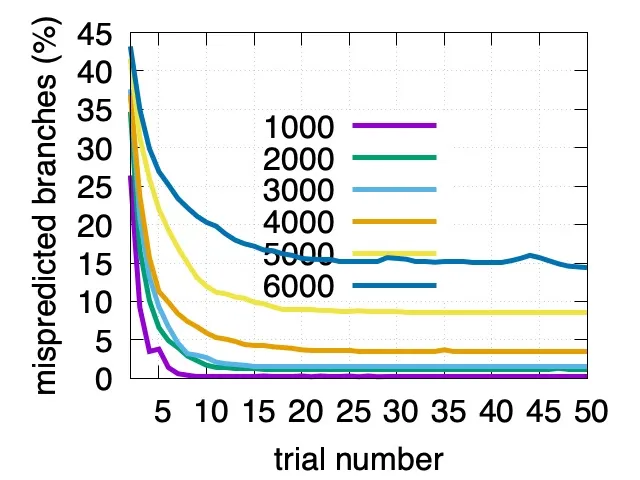
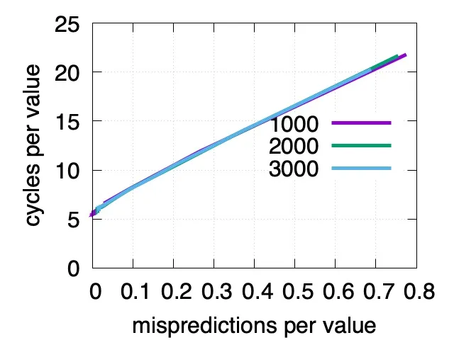
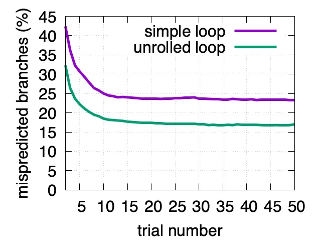
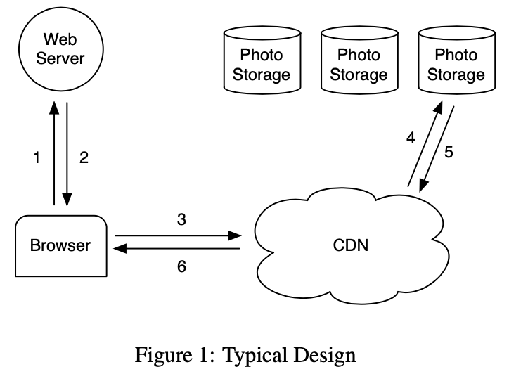
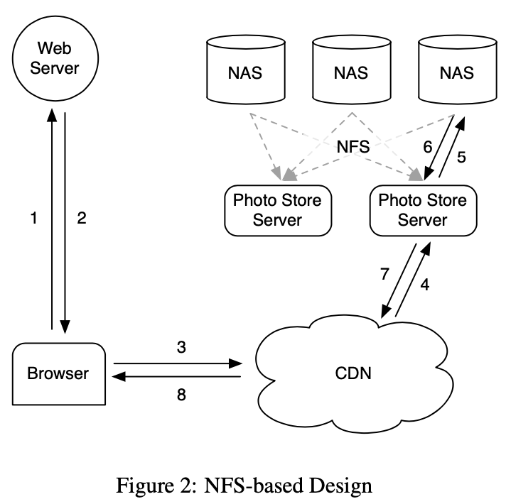
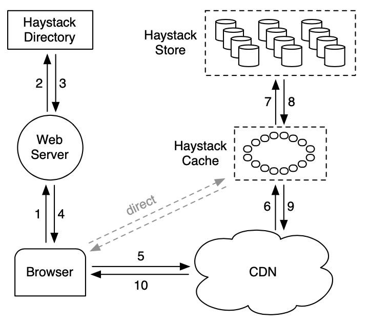
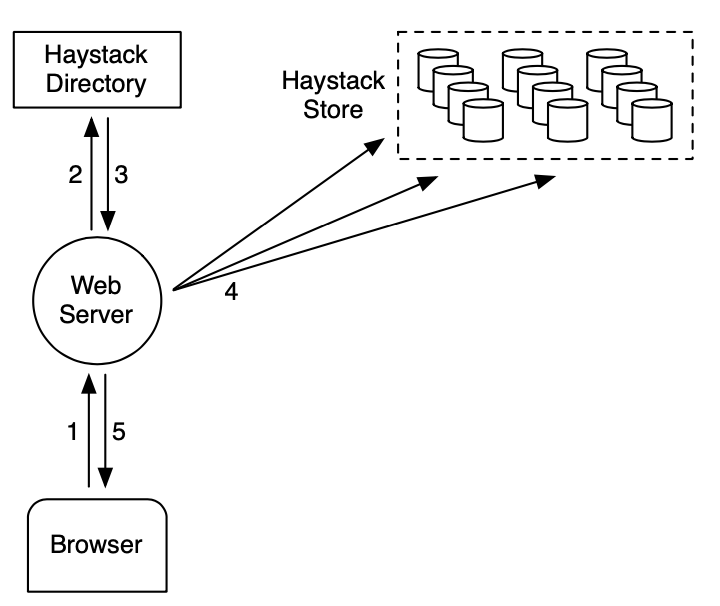

<head>
    
    
</head>

# Table of Contents

1.  [Algorithm](#org3bbe7a0)
2.  [Review](#orgad0eb2c)
    1.  [关键要点](#org6e0a7fa)
    2.  [分支预测不容易被愚弄](#orge4e6e4c)
    3.  [分支预测错误可能代价很高](#org3035dad)
    4.  [避免分支](#orgbb241ba)
    5.  [结论](#orgcb11034)
3.  [Tips](#org4317675)
    1.  [简介](#org14cad4a)
    2.  [背景和之前的设计](#org05a8629)
        1.  [背景](#org0f94d57)
        2.  [基于 NFS 的设计](#orgaa2234a)
        3.  [讨论](#org9bd65ec)
    3.  [设计和实现](#orgfda27f3)
        1.  [概述](#org0da750d)
        2.  [Haystack 目录](#orge15e93e)
        3.  [Haystack 缓存](#org99bc3a3)
        4.  [Haystack 存储](#org0b1d774)
4.  [Share](#org5da1016)

# Algorithm

Leetcode 2565: [Minimum Reverse Operations](https://leetcode.com/problems/minimum-reverse-operations)

<https://dreamume.medium.com/leetcode-2612-minimum-reverse-operations-69e9ec1c4ae2>

# Review

Making your code faster by taming branches

<https://www.infoq.com/articles/making-code-faster-taming-branches/>

## 关键要点

-   为更好的性能，现代处理器预测分支且执行猜测的指令。这是强有力的优化
-   程序员可能被错误低估分支预测错误对评测代码的代价，当人造的数据太短或太多预测时。分支错误预测的效果会很大。幸运地是，通常能够完全避免分支
-   重写你的代码使用更少的分支会使代码有更一致性的速度
-   需要适合的错误分支预测处理来优化性能

多数软件代码包含条件分支。在代码中，它们出现在 if else，循环和 switch 中。当统计一个条件分支，处理器检查一个条件且跳转到一个新的代码路径，如果分支被采用，或者继续执行接下来的指令。不幸地是，处理器可能只在执行玩之前的所有指令后知道是否一个跳转是必须的。为更好的性能，现代处理器预测分支且执行猜测的指令。这是一个强有力的优化。

然而猜测执行有一些限制。例如，在错误预测后处理器必须丢弃已作的工作且当分支预测失败时重新开始一次。幸运地是，处理器尽可能擅长识别范型且避免错误预测。尽管如此，一些分支本能地很难预测且它们会导致一个性能瓶颈

## 分支预测不容易被愚弄

程序员可能被错误低估分支预测错误对评测代码的代价，当人造的数据太短或太多预测时。现代处理器能学习预测数千个分支，这样一个短的测试可能不能暴露分支预测的代价，即使数据看上去是随机的

让我们考虑一个例子。假设我们想要解码十六进制数字。我们想要获得对应的整数值。一个合理的 C 函数如下

    int decode_hex(char c) {
      if (c >= '0' && c <= '9') return c - '0';
      if (c >= 'A' && c <= 'F') return c - 'A' + 10;
      if (c >= 'a' && c <= 'f') return c - 'a' + 10;
    
      return -1;
    }

一个程序员可随机产生一个字符串评测这样的函数。例如，在 C 中，我们可重复调用 rand 函数且选择 22 个十六进制数字的一个

    char hex_table[] = {'0', '1', '2', '3', '4', 
                        '5', '6', '7', '8', '9', 
                        'a', 'b', 'c', 'd', 'e', 'f',
                        'A', 'B', 'C', 'D', 'E', 'F' };
    
    void build_random_string(size_t length, char *answer) {
      for (size_t i = 0; i < length; ++i)
        answer[i] = hex_table[rand() % sizeof(hex_table)];
    
      return answer;
    }

然后可记录解码这些数字的时间。对好的测量，一个程序员可能运行这个测试几次且计算平均值。在多次测试之后，让我们描出对不同的字符串长度（1000，2000，&#x2026;）每十六进制数字的错误预测分支数量。重要的是，我们重使用所有实验中的相同的输入字符串

使用一个标准服务器处理器（AMD Rome），我们发现对一个包含 3000 数字的字符串，在不到 20 次实验后每数值的错误预测分支数降到 0.015（1.5%）。对更短的字符串（1000 数字），错误分支预测数降得更快，在 8 次实验后降到 0.005。即一个标准服务器处理器在少于 10 次解码后可学习预测 1KB 十六进制随机字符串产生的所有分支

支持 just-in-time 编译器（比如 Java 或 Javascript）的编程语言中，它重复评测直到编译器优化了代码：如果测试太短，即使输入是随机的，我们也存在低估分支预测错误的代价

类似的，用人造数据运行测试，即使当数据集特别大，可能使得处理器高精度预测分支。假设我们使用从 0 到 65536 的数字替代随机字符串：0x00, 0x01, &#x2026;

分支预测必须在数字和字符出现时预测。结果字符串（0000100021003100421052106310731084219421a521b521c631d631e731f7310842 &#x2026; 8ce18ce29ce39ce4ade5ade6bde7bde8cef9cef &#x2026;）不是随机的，但它使得预测数字和字符范型有效。使用相同的 AMD Rome 处理器，我们发现在这样一个长度为 131072 的字符串上错误预测分支的数量在第一次实验时接近为 0：每字节 0.002 次分支预测错误

## 分支预测错误可能代价很高

错误分支预测的影响可能会很大。让我们使用我们收集的不同长度随机十六进制字符串，且标出每输入数字 CPU 周期数及错误分支预测数。我们发现 CPU 周期数在每十六进制数字 5 周期到 20 周期变化，取决于错误预测分支数

我们还不应该得出大量的分支预测错误是一个必要的考量因为可能有更重要的考量。例如，考虑一个大数组中的二进制搜索。限制是主存中内存访问延迟比分支错误预测成本更高

## 避免分支

性能分析工具，如 perf(Linux)，xperf(Windows) 和 Instruments (macOS)，可测量分支预测错误数。如果你手里有相关的问题，是否分支是一个问题呢？

幸运地是，通常可以完全避免分支。例如，为解码十六进制数字，我们可使用一个数组查找

    int digittoval[256] = {
        -1, -1, -1, -1, -1, -1, -1, -1, -1, -1,
        -1, -1, -1, -1, -1, -1, -1, -1, -1, -1,
        -1, -1, -1, -1, -1, -1, -1, -1, -1, -1,
        -1, -1, -1, -1, -1, -1, -1, -1, -1, -1,
        -1, -1, -1, -1, -1, -1, -1, -1, 0,  1,
        2,  3,  4,  5,  6,  7,  8,  9,  -1, -1,
        -1, -1, -1, -1, -1, 10, 11, 12, 13, 14,
        15, -1, -1, -1, -1, -1, -1, -1, -1, -1,
        -1, -1, -1, -1, -1, -1, -1, -1, -1, -1,
        -1, -1, -1, -1, -1, -1, -1, 10, 11, 12,
        13, 14, 15, -1,...};
    int hex(unsigned char c) {
      return digittoval[c];
    }

这个函数可编译为一个指令，没有分支。它可通过检查负整数来验证不合适的输入

这样，我们通常使用内存来替代分支：我们预计算分支并存储到一个简单数据结构中，比如数组

另一个避免分支的策略是做一些推测工作并抛出它们。例如，假设我们想要从整数输入数组中擦除所有负整数，在 C 中，我们可用一个循环和一个分支

    for(size_t i = 0; i < length; i++) {
        if(values[i] >= 0) {
            values[pos++] = values[i];
        }
    }

我们假设这个函数叫 branchy，该代码检查输入并选择性地拷贝到新位置。如果我们很难预测哪个整数是负数，那这个代码是不高效的

幸运地是，多数编译器可以使用如下代码避免分支

    size_t sign(int v) {
        return (v >= 0 ? 1 : 0);
    }
    
    for(size_t i = 0; i < length; i++) {
      values[pos] = values[i];
      pos += sign(values[i]);
    }

这个函数我们暂时称为 branchless。branchless 和 branchy 函数还是有点差异，编译器不能相互转换

即使不能移除所有分支，减少分支数用 "almost always taken" 和 "almost never taken" 可帮助编译器更好地预测剩下的分支。例如，如果我们使用循环一个个地解码，则在循环中我们对每个数字有一个预测分支

    for (i = 0; i < length; ++i)
      int code = decode_hex(input[i]);
    // ...

对长的输入字符串，我们可减少减少一半的预测分支通过每次循环迭代处理两个输入字符

    for (; i + 1 < length; i += 2) {
      int code1 = decode_hex(input[i]);
      int code2 = decode_hex(input[i + 1]);
    // ...
    }

在一个 AMD Rome 处理器上对 5000 数字的输入字符串，我们发现多次实验之后对简单循环的分支预测错误数是每数字 0.230，而对一次迭代处理两个数字的版本只有 0.165，减少了 30%

对这个现象的一个可能的简单解释是处理器使用历史上最新的分支预测将来的分支。无信息分支会让处理器减少做出好的预测的能力

当不能避免难的预测分支，我们可通常减少它们的数量。例如，当比较两个日期，把它们格式化为 YYYYMMDD 会比较方便，且比较结果的 8 字节字符串作为 64 为整数比较，可只使用一个指令

## 结论

对包含困难预测分支的代码进行评测是困难的，且程序员有时低估分支的代价。用更少的分支重写代码会让代码有更一致性的速度。预测错误分支的合适处理需要优化性能

# Tips

[Finding a needle in Haystack: Facebook’s photo storage](https://goo.gl/edj4FL)

本文描述 Haystack，一个为 Facebook 图像应用程序优化的对象存储系统。Facebook 当前存储了超过 2600 亿个图片，大约 20PB。用户每周上传 10 亿个新图片（约 60 TB）且峰值时 Facebook 每秒处理超百万个图片。Haystack 提供了一个比之前的方式成本低且更高性能的解决方案，其对基于 NFS 的存储应用和网络有杠杆效果。我们重点关注到传统设计因 metadata 的查询导致过多的磁盘操作。我们小心地减少每图片 metadata 的操作让 Haystack 存储设备可在内存中处理所有 metadata 查询。这个处理节省磁盘操作来读取实际的数据并增加总体吞吐量

## 简介

共享图片是 Facebook 最流行的特性之一。到目前，用户已上传超过 650 亿张图片，Facebook 成为了全球最大的图片分享网站。对每个上传的图片，Facebook 会生成并存储四个不同大小的图片，转换了超过 2600 亿张图片和超过 20PB 数据。用户每周上传 10 亿张新图片（约 60 TB）且 Facebook 在峰值时每秒提供超过百万张图片。我们期望该数字会继续增长，则图片存储对 Facebook 的架构是一个显著的挑战

本文呈现 Haystack 的设计和实现。Facebook 的图片存储系统已在生产环境运营了 24 个月。Haystack 是一个对象存储，我们设计作为 Facebook 共享图片，其数据写一次，多次读，从不修改且很少删除。我们开发我们自己的图片存储系统因为传统的文件系统在我们的工作负载下性能低下

在我们的经验中，我们发现传统的 POSIX 文件系统的缺点是目录和每文件 metadata。对这样 metadata 的图片应用程序，比如权限，是无用的，因此浪费存储空间。更重要的成本是为了找到文件需要把文件的 metadata 从磁盘读到内存。对小规模不明显，但对数十亿图片和 PB 级别的数据，访问 metadata 是吞吐量的瓶颈。我们发现这是我们使用 NAS 的关键问题。需要一些磁盘操作来读取一个图片：一个（通常更多）用来转换文件名到 inode 号，另一个从磁盘读 inode，最后一个读文件本身。对 metadata 使用磁盘 IO 是我们读取吞吐量的限制因素。观察到实际上这个问题引入了一个额外的成本，我们需要依赖 CDN 比如 Akamai，来解决主要的读数据量

为此，我们设计 Haystack 来达到以下四个主要目的

高吞吐量和低延迟：我们的图片存储系统需要支撑用户的请求。超过我们处理容量的请求要么被忽略，这对用户体验来说是不可接受的，要么被 CDN 处理，其成本高且得到一个消失的返回。更进一步，图片需要快速提供来得到好的用户体验。Haystack 通过每次读取请求最多一次磁盘操作来获得高吞吐量和低延迟。我们通过保持所有 metadata 到内存来实现，我们戏剧化地缩减每图片 metadata 来找到磁盘上的文件

容错：在大规模扩展系统，故障每天都在发生。我们的用户的图片需要有效，即使在有不可避免的服务器崩溃和磁盘故障的情况下。有可能一整个数据中心失去电力或一个跨国连接服务。Haystack 复制每个图片到地理上不同的地区。如果我们失去了一台机器，我们引入另一台替代，必要时拷贝冗余数据

高效成本：Haystak 有更好地执行且比我们之前的 NFS 方案有更低的成本。我们用两个维度量化我们的节省成本：Haystack 有用存储的每 TB 成本和 Haystack 有用存储的每 TB 常规读速度。在 Haystack 中，每有用 TB 成本低 28% 且每秒处理超过 4 倍读速度相比之前的 NAS 应用程序

简单：在生产环境中我们不能夸大直接实现和维护的设计的能力。Haystack 是一个新系统，缺少生产线上多年的测试，我们特别关注于让它保持简单。简单使得我们能在几个月时间中开发一个工作系统而不是几年

这个工作描述了从概念到实现一个产品质量系统服务一天数十亿图片的 Haystack 的经验。我们的三个主要贡献是：

-   Haystack，一个对象存储系统优化了高效地存储和提取数十亿图片
-   在构建和扩展一个不高昂，可靠和有效的图片存储系统上学到了一些经验教训
-   Facebook 图片共享应用程序的请求特征

## 背景和之前的设计

在本章节中，我们描述之前的架构和我们学到的主要经验。由于篇幅限制，对之前设计的讨论省略了一些生产级开发的细节

### 背景

我们开始简介对 Web 服务器，CDN 和存储系统如何交互服务一个特殊网站的图片。下图描述了当一个用户访问一个包含图片的页面直到它从磁盘位置下载的步骤。当访问一个页面用户浏览器首先发送一个 HTTP 请求到一个 Web 服务器，浏览器收到响应进行渲染。对每个图片 Web 服务器构建一个 URL 来定位从哪里下载。对一个流行的网站这个 URL 通常指向一个 CDN。如果 CDN 有图片数据缓存则 CDN 立即响应数据。否则，CDN 检查 URL，其嵌入了足够的信息来从网站存储系统获取图片。CDN 然后更新它的缓存数据且发送图片到用户浏览器

### 基于 NFS 的设计

在我们的首个设计中我们实现了使用一个基于 NFS 的图片存储系统。本节后续内容提供更多该设计的细节，主要的经验我们学到的是 CDN 本身不提供实际的解决方案供应一个社交网络网站的图片。CDN 高效供应最热点的图片 - 最近上传的图片 - 但一个社交网络网站比如 Facebook 也有大量请求对不那么热点的内容，我们称之为长尾。长尾请求是一个重要的流量，其请求 CDN 上缺失导致访问后台图片存储系统主机。把长尾所有图片缓存是一个非常方便的办法，但这需要非常大的缓存因此成本高

我们基于 NFS 的设计存储每个图片到一系列商业 NAS 应用程序里它自己的文件中。一系列机器，图片存储服务器，加载通过 NFS 的 NAS 应用程序导出的所有卷积。下图展示了这个架构且显示图片存储服务器处理图片的 HTTP 请求。从一个图片的 URL 中一个图片存储服务器提取卷积和全路径到文件，读取 NFS 数据且返回结果到 CDN

我们初始化在每个 NFS 卷目录中中存储数千个文件导致读取一个图片过多的磁盘操作。因为 NAS 应用如何管理目录 metadata，一个目录中放数千个文件非常低效因为目录的块 map 非常大而不能被应用有效缓存。这样它通常导致提取一个图片需要超过 10 次磁盘操作。在缩减目录大小到每目录数百个文件后，系统获取一个图片需要 3 次磁盘操作：一次读取目录 metadata 到内存，一次加载 inode 到内存，最后读取文件内容

为进一步减少磁盘操作我们让图片存储服务器直接缓存 NAS 应用返回的文件句柄。当第一次读取一个文件一个图片存储服务器正常打开文件但缓存文件名到文件句柄映射到内存缓存。当请求一个文件其文件句柄被缓存，一个图片存储服务器使用我们添加到内核的系统调用 open_by_filehandle 直接打开文件。遗憾的是，这个文件句柄缓存只提供一个镜像改进，不流行的图片开始不太会被缓存。一个可能的争论是所有文件句柄存储在 memcache 可能是一个可行的解决方案。然而，唯一有问题的部分它依赖 NAS 应用在内存有所有的 inode，这是对分布式系统一个高昂的需求。我们从这个 NAS 方案学到的是，对于缓存，是否 NAS 应用缓存或外部缓存如 memcache 对减少磁盘操作的影响有限。存储系统停止处理不流行图片的长尾需求，其不适合在 CDN 处理且容易在我们的缓存中不能命中

### 讨论

提供精确的指导什么时候构建或不构建自定义存储系统很困难。然而，我们相信对社区获得经验为什么我们决定构建 Haystack 是有帮助的

面对基于 NFS 设计的瓶颈，我们探讨是否构建一个类似 GFS 的文件系统是有用的。因为我们存储多数我们用户的数据在 MySQL 中，我们的系统中文件主要的使用是目录工程师用来开发工作，日志数据和图片。NAS 应用提供一个非常好的性价比对开发工作和日志数据。更进一步，我们杠杆 Hadoop 对极大地日志数据。服务长尾的图片请求呈现出了问题，它不适合 MySQL，NAS 应用和 Hadoop

我们面临的窘境是现有的存储系统缺乏好的内存磁盘比。然而，没有好的比率。系统需要足够的主存使得所有文件系统 metadata 都被缓存。在我们基于 NAS 的方案中，一个图片对应一个文件且每个文件需要至少一个 inode，一个 inode 是几百字节大小。足够内存方案成本太高。为达到一个高性价比，我们决定构建自定义存储系统缩减每图片文件系统 metadata 大小使得足够内存比购买更多 NAS 应用性价比更高

## 设计和实现

Facebook 使用一个 CDN 来获取流行图片且杠杆 Haystack 来高效响应长尾图片请求。当一个 Web 网站有一个 I/O 瓶颈提供静态内容，传统的解决方案是使用一个 CDN。CDN 负责主要的部分这样存储系统可处理剩下的长尾。在 Facebook 一个 CDN 需要缓存大量静态内容这样使得传统的存储系统不会达到 I/O 极限

理解到在不久的将来 CDN 将不能完全解决我们的问题，我们设计 Haystack 来解决我们基于 NFS 的方案的关键瓶颈：磁盘操作。我们接收可能请求磁盘操作的非流行图片的请求，但目标是限制这样操作的数量只为读取真正的数据。Haystack 通过戏剧化地缩减对文件系统 metadata 的内存使用来达到这个目标，因此实际上保持了所有 metadata 数据在内存中

回忆存储每文件单个图片导致更多的文件系统 metadata 被缓存。Haystack 使用一个直接的处理：它存储多个图片到一个文件且因此维护非常大的文件。我们显示这个直接处理是显著高效的。更多的， 我们认为它的简单性就是它的力量，能够快速实现和部署。我们现在讨论围绕它的核心技术和架构部件如何提供一个可靠有效的存储系统。在如下的 Haystack 描述中，我们区分两种 metadata。应用程序 metadata 描述浏览器需要用到提取图片的构建 URL 的信息。文件系统 metadata 确定一个主机获取主机磁盘上的图片的必要数据

### 概述

Haystack 架构包含 3 个核心部件：Haystack 存储，Haystack 目录和 Haystack 缓存。为简化我们省略前面的 Haystack。存储封装图片的持久化存储系统且是管理图片文件系统 metadata 的唯一部件。我们用物理卷组织存储的容量。例如，我们可组织一个服务器的 10 TB 容量为 100 个提供 100 GB 存储的物理卷。我们进一步分组不同机器的物理卷为逻辑卷。当 Haystack 存储一个图片到逻辑卷，图片被写入所有对应物理卷。这个冗余允许我们迁移由于硬盘故障，磁盘驱动器 Bug 等导致的数据丢失。目录管理逻辑到物理映射及其他应用程序 metadata，比如每个图片所在的逻辑卷和逻辑卷可用磁盘空间。缓存作为我们的内部 CDN，其保护对请求最流行图片的存储和提供上流 CDN 节点故障需要重新刷新内容的隔离设施

上图显示存储，目录和缓存部件如何在用户浏览器，Web 服务器，CDN 和存储系统中交互。在 Haystack 架构中浏览器可直接接触到 CDN 或者缓存。注意缓存是一个 CDN，为避免混淆，我们用 CDN 指代外部系统，缓存指向内部缓存图片的 CDN。一个内部缓存架构让我们减少对外部 CDN 的依赖

当一个用户访问一个网页 Web 服务器使用目录来对每个图片构建 URL。URL 包含一些信息，对应当用户浏览器联系 CDN（或缓存）带最终获取存储机器上的图片。一个典型的 URL 指导浏览器到 CDN 如下：

http://\<CDN\>/\<Cache\>/\<Machine id\>/\<Logical volume, Photo\>

URL 的第一部分指明向哪个 CDN 请求图片。CDN 可使用 URL 的后续部分内部查看图片：逻辑卷和图片 id。如果 CDN 不能定位图片则它从 URL 中获取 CDN 地址且联系缓存。缓存做类似地查找，当未命中，从 URL 中获取缓存地址且从指定存储机器上请求图片。图片请求直接到缓存有一个类似的工作流除了 URL 中的 CDN 说明信息

上图显示 Haystack 的上传路径。当用户上传一个图片时它首先发送数据到一个 Web 服务器。接下来，服务器从目录中请求一个可写的逻辑卷。最后，Web 服务器分配一个唯一的 id 给图片且上传到逻辑卷映射到的每个物理卷

### Haystack 目录

目录提供四个主要功能。首先，他提供逻辑卷到物理卷的映射。Web 服务器使用这个映射上传图片和从一个页面请求中构建图片 URL。其次，目录负载平衡逻辑卷和物理卷的读。第三，目录确定是否一个图片请求应该被 CDN 处理还是被缓存。这个功能让我们调整对 CDN 的依赖。最后，目录确定那些逻辑卷是只读的或因为那些卷达到了存储上限。我们以机器粒度标签卷为只读这样操作更容易

当我们通过添加新的机器来扩展存储容量，这些机器为可写的；只可写的机器接收上传。这样这些机器有效的容量会下降。当一个机器耗光它的容量，我们标签它为只读。在下一小节中我们讨论这个区别如何对缓存和存储的影响

目录是个相对直接的部件通过一个 PHP 接口存储它的信息到一个复制数据库，该数据库平衡 memcache 来减少延时。当我们在一个存储机器上丢失数据的事件中我们移除映射中对应的条目且当新存储机器上线时替换它

### Haystack 缓存

缓存接收从 CDN 过来或用户浏览器的 HTTP 图片请求。我们组织缓存为一个分布式 hash 表且使用一个图片 id 作为 key 来定位缓存数据。如果缓存不能立即响应请求，则缓存从 URL 中确定的存储机器获取图片且相应 CDN 或用户浏览器

我们现在高亮缓存的重要行为。它缓存一个图片当两个条件满足时：(a)请求直接来自用户而不是 CDN (b) 图片从一个可写存储机器获取。第一个条件的调整是我们对基于 NFS 设计的经验显示存储 CDN 缓存是低效的，因它不太可能当 CDN 未命中时会在我们内部缓存中找到。第二个的推理是间接的。我们使用缓存上架可写存储机器为读因为两个有趣的属性：图片一上传就会有最大的访问量且文件系统对只读只写的工作负载性能更好。这样可写存储机器可看到最多的读如果它不在缓存。给定这个特性，一个我们计划实现的优化是主动推最新上传的图片到缓存因为我们期望这些图片很快会被读取且访问量较大

### Haystack 存储

存储机器的接口很基础。读是非常特别的且图片请求包含一个给定的 id，一个确定的逻辑卷和一个特别的物理存储机器。机器发现图片则返回。否则返回一个错误

每个存储机器管理多个物理卷。每卷有数百万个图片。读者可认为一个物理卷为一个非常大的文件（100 GB）存储为 '/hay/haystack\_<logical volume id>'。一个存储机器可使用逻辑卷对应的 id 和文件偏移快速访问一个图片。这是 Haystack 设计的关键：获取图片文件名，偏移和大小不需要磁盘操作。一个存储机器保持打开每个物理卷的文件句柄及图片 id 到文件系统 metadata 的内存映射（例如，文件，偏移和大小）

# Share

