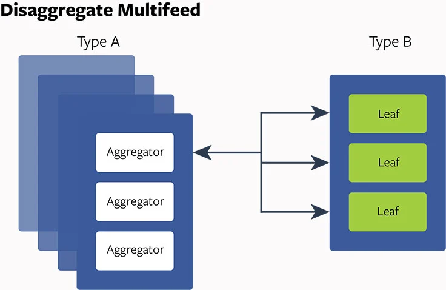
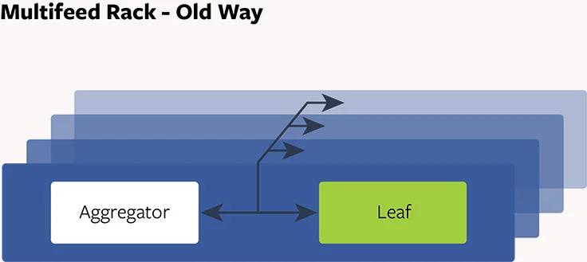

<head>
    
    
</head>

# Table of Contents

1.  [Algorithm](#org63b4315)
2.  [Review](#org99e07da)
    1.  [Disaggregation 的强大](#orge1c5bd4)
    2.  [多流构建块](#orge6c7c05)
    3.  [多流，老方式：聚集设计](#org96067d8)
    4.  [Disaggregate 多流设计和实验](#orgc701607)
3.  [Tips](#orgc16f2eb)
    1.  [背景](#org217c9cc)
4.  [Share](#org496e75d)

# Algorithm

Leetcode 741: [Cherry Pickup](https://leetcode.com/problems/cherry-pickup/description/)

<https://dreamume.medium.com/leetcode-741-cherry-pickup-eddb682bbb42>

# Review

服务 Facebook 多流：通过重新设计获得效率和性能

<https://engineering.fb.com/2015/03/10/production-engineering/serving-facebook-multifeed-efficiency-performance-gains-through-redesign/>

## Disaggregation 的强大

Disaggregation 已证明对 Facebook 是一个有用的策略。分割系统为它们的核心组件和再让他们合成的想法对我们的基础设施在灵活性和可扩展性上更有意义

disaggregation 是什么意思？当工程师通常使用各种类型的服务器，每个有它自己的 CPU，内存和闪存或磁盘，每个服务器配置使用这些资源的不同比例。运行在服务器上的服务以一种固定聚合的方式使用这些资源。Disaggregation，相反地，创建特殊的服务器池，每个聚焦在一种资源类型比如计算，内存，HDD 存储或闪存等

分割系统为构建块和让这些分片适配可有多维度的优势：

-   硬件替换高效和利用高效：我们可单独升级和替换每种资源类型，有潜力地减少总的硬件替换数。另外，每种资源（比如 CPU，内存）可更好的扩展这样能更好的利用和最小化资源浪费
-   自定义配置：我们可定制存储设计，例如，针对我们的需要
-   加速新技术适配：当一个新的硬件技术变得有效，我们可快速适配
-   软件生产可靠性和性能：软件生产组件可被重新设计且每个组件可在单独的服务器池中运行。这允许软件性能提升和可靠性得到改善
-   CPU 效率：各种工作负载在同一个服务器可能不能很好工作，对内核或处理器来说管理工作负载来获得高 CPU 利用率很困难

一个例子，我们均衡 disaggregation 的概念来重新设计多流，一个包含在新闻流里的分布式后台系统。当一个人获取他的 Facebook 流，多流查找用户的朋友，找到所有他们的最新动作，且决定基于某个关系和排名算法下如何渲染。disaggregation 的结果关系到基础设施跨越多个方面的追踪：

-   高效：多流 aggregator 和叶子基础设施对内存和 CPU 消耗优化的 40% 效率改进
-   性能：10% 的多流 aggregator 延时缩减
-   扩张性：多流的每个组件（例如，aggregator 和叶子）可独立扩展
-   可靠性：增加流量峰值的恢复能力；组件故障（例如 aggregator 和叶子）隔离

## 多流构建块

为理解如何获得这些结果，我们应该首先分解多流主要的高层组件

-   Aggregator：查询引擎接受用户请求和从后端存储提取新闻流。它也做新闻流 aggregation，排名和过滤且返回结果给客户端。aggregator 是 CPU 密集的但内存不密集
-   叶子：分布式存储层索引大多数最近的新闻流动作和在内存中存储它们。通常 20 个叶子服务器作为一个组工作且全复制包含所有用户的索引数据。每个叶子服务从 aggregator 来的数据提取请求。每个叶子是内存密集的但 CPU 不密集
-   尾部：输入数据流水线指导用户动作和实时反馈到叶子存储层
-   持久化存储：从开始重加载一个叶子的裸日志和快照

## 多流，老方式：聚集设计

过去，每个多流 aggregator 跟一个叶子成对，且它们位于一个共享的服务器上。二十个这样的服务器在一起成组，作为一个复制节点且包含用户的新闻流数据。每个复制节点有 20 个 aggregator 和 20 个叶子。当接收到一个请求，每个 aggregator 发散请求到所有叶子来提取数据，排行和过滤数据且返回结果给客户端。我们获得多流服务器高 CPU 能力和大型内存存储。但这有一些问题：

-   可靠性：通常对一个 aggregator 可能获得一个有很大朋友的用户的一个重请求，导致 CPU 使用上的一个凸起高峰。如果峰值足够大，因为 aggregator 消耗 CPU，在相同服务器上的叶子可能变得不稳定。任何 aggregator（和它对应的服务器）和叶子交互也变得不稳定，导致复制节点一个迭代的问题出现
-   硬件可扩展性：我们的基础设施中有许多复制节点。容量配置基于 CPU 服务用户请求的需求。我们添加数百个复制节点来协调随时间增长的流量。这样，对每个 CPU 的内存增加。明显内存过度构建因为当复制节点增加时它不是必要的资源
-   资源浪费：每个尾部转发用户行为且反馈到一个叶子服务器。它是多流的实时数据流水线。叶子服务器花费 10% 的 CPU 来执行这些实时升级。我们提到的复制节点数使用不必要的 CPU 资源保持我们的叶子存储更新
-   性能：aggregator 和叶子有非常不同的 CPU 特性。aggregator 线程跟叶子线程的 CPU 缓存竞争，导致缓存冲突和资源竞争。因为很多线程运行导致高的线程切换成本

## Disaggregate 多流设计和实验

对这些确定的问题：我们如何构建硬件和改变软件产品架构来处理这些问题？在深入调查和分析之后，我们决定实现 disaggregate 硬件/软件设计多流处理。首先，我们设计一些服务器持有密集 CPU 的能力（A 类型服务器）且一些有大内存存储（B 类型服务器）。然后我们把 aggregator 放在 A 类型服务器上且叶子放在 B 类型服务器上，这使我们能够优化线程配置，减少线程切换成本，启动更好的 NUMA 平衡，且调整 aggregator 和叶子的比例

disaggregate 设计在我们内部的实验中显示的改进：

-   优化硬件/服务使用率：通过调整 aggregator 和叶子的比例，我们可缩减总的 CPU 到内存比例从 20:20 到 20:5 或 20:4。这对内存是 75% 到 80% 的缩减
-   服务能力可扩展性：aggregator 和叶子能力可被独立扩展。这允许软件有更多的灵活性
-   性能：aggregator 的平均客户端延时降低 10%
-   可靠性：disaggregate 设计更能适应突然的写流量高峰。任意 aggregator 故障可作为独立事件，不影响其他 aggregator 和叶子

对这样的鼓舞结果，我们快速的采用了设计。我们从概念设计到最后的部署只用了几个月，且把新的 disaggregate 架构添加在现有的多流配置上。其次，我们对其他 Facebook 服务比如搜索探索 disaggregate 闪存雪橇技术，操作分析和数据库。我们乐观认为受益是显著的

# Tips

[Avoiding Double Payments in a Distributed Payments System](https://medium.com/airbnb-engineering/avoiding-double-payments-in-a-distributed-payments-system-2981f6b070bb)

## 背景

Airbnb 迁移了它的基础设施到面向服务架构（SOA）。SOA 提供许多优点，比如开启开发者指导说明和更快地迭代能力。然而，它也对票务和支付应用程序带来挑战因为它使维护数据集成更加困难。一个 API 调用一个服务进一步调用 API 到下面的服务，每个服务改变状态且可能有副作用，相当于执行一个复杂的分布式交易

为确保所有服务间的一致性，会使用一些协议比如两阶段提交。没有这样的协议，分布式交易会对数据集成维护，允许优雅的降级和取得一致性形成挑战。请求在分布式系统中也必然存在失败 - 连接丢失和在某点超时，特别对包含多个网络请求的交易

有三个不同的常用技术用于分布式系统来获得最终一致性：读修复，写修复和异步修复。每个处理有各自的好处和妥协。我们的支付系统在各种功能中使用这三个处理

异步修复包含服务器响应运行数据一致性检查，比如表扫描，lambda 函数和 cron 任务。另外，服务器到客户端的异步通知在支付中广泛使用来强制客户端的一致性。异步修复，异步通知可用于读写修复技术的结合，提供一个解决方案复杂度上对防御妥协的第二条线

在本文中我们的解决方案使用写修复，客户端到服务器的每个写调用尝试修复一个不一致，被破坏的状态。写修复需要客户端更灵活且允许重复的请求且不维护状态（除了重试）。客户端可按需请求最终的一致性，在用户体验上控制它们。幂等在实现写修复中是一个及其重要的属性

# Share

