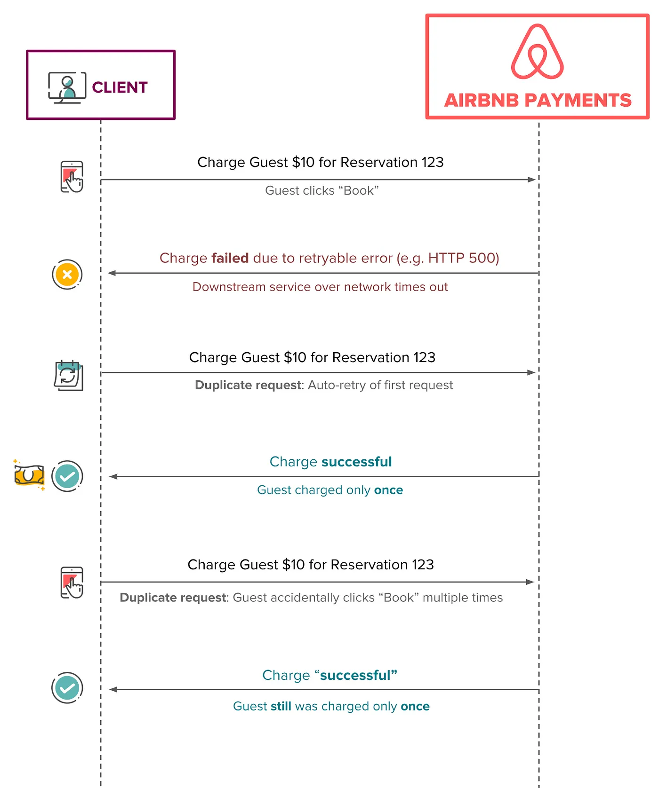
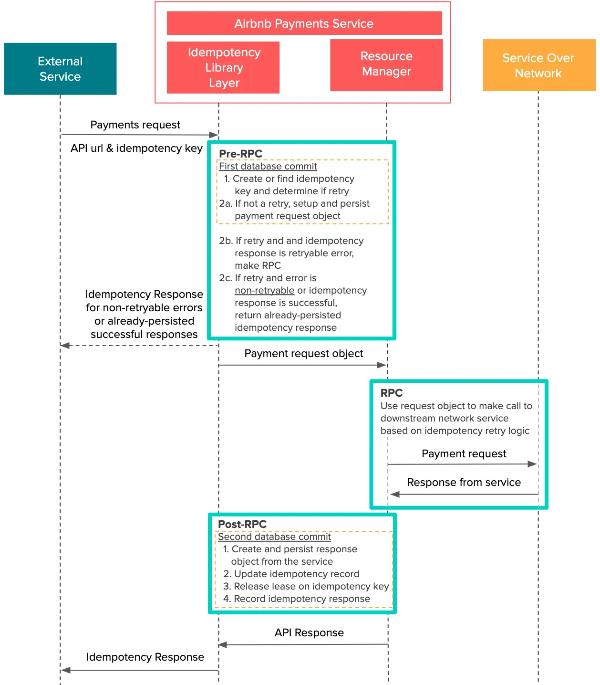

<head>
    
    
</head>

# Table of Contents

1.  [Algorithm](#org63b4315)
2.  [Review](#org99e07da)
    1.  [Disaggregation 的强大](#orge1c5bd4)
    2.  [多流构建块](#orge6c7c05)
    3.  [多流，老方式：聚集设计](#org96067d8)
    4.  [Disaggregate 多流设计和实验](#orgc701607)
3.  [Tips](#orgc16f2eb)
    1.  [背景](#org217c9cc)
    2.  [幂等是什么？](#orge21ecca)
    3.  [问题状态](#org06d5ffb)
    4.  [解决方案的解释](#org2a639bd)
    5.  [保持数据库提交到最小](#org7bf2a73)
    6.  [用 Java Lambda 来恢复](#orgb03b8ae)
4.  [Share](#org496e75d)
    1.  [简介](#org01b8ca3)

# Algorithm

Leetcode 741: [Cherry Pickup](https://leetcode.com/problems/cherry-pickup/description/)

<https://dreamume.medium.com/leetcode-741-cherry-pickup-eddb682bbb42>

# Review

服务 Facebook 多流：通过重新设计获得效率和性能

<https://engineering.fb.com/2015/03/10/production-engineering/serving-facebook-multifeed-efficiency-performance-gains-through-redesign/>

## Disaggregation 的强大

Disaggregation 已证明对 Facebook 是一个有用的策略。分割系统为它们的核心组件和再让他们合成的想法对我们的基础设施在灵活性和可扩展性上更有意义

disaggregation 是什么意思？当工程师通常使用各种类型的服务器，每个有它自己的 CPU，内存和闪存或磁盘，每个服务器配置使用这些资源的不同比例。运行在服务器上的服务以一种固定聚合的方式使用这些资源。Disaggregation，相反地，创建特殊的服务器池，每个聚焦在一种资源类型比如计算，内存，HDD 存储或闪存等

分割系统为构建块和让这些分片适配可有多维度的优势：

-   硬件替换高效和利用高效：我们可单独升级和替换每种资源类型，有潜力地减少总的硬件替换数。另外，每种资源（比如 CPU，内存）可更好的扩展这样能更好的利用和最小化资源浪费
-   自定义配置：我们可定制存储设计，例如，针对我们的需要
-   加速新技术适配：当一个新的硬件技术变得有效，我们可快速适配
-   软件生产可靠性和性能：软件生产组件可被重新设计且每个组件可在单独的服务器池中运行。这允许软件性能提升和可靠性得到改善
-   CPU 效率：各种工作负载在同一个服务器可能不能很好工作，对内核或处理器来说管理工作负载来获得高 CPU 利用率很困难

一个例子，我们均衡 disaggregation 的概念来重新设计多流，一个包含在新闻流里的分布式后台系统。当一个人获取他的 Facebook 流，多流查找用户的朋友，找到所有他们的最新动作，且决定基于某个关系和排名算法下如何渲染。disaggregation 的结果关系到基础设施跨越多个方面的追踪：

-   高效：多流 aggregator 和叶子基础设施对内存和 CPU 消耗优化的 40% 效率改进
-   性能：10% 的多流 aggregator 延时缩减
-   扩张性：多流的每个组件（例如，aggregator 和叶子）可独立扩展
-   可靠性：增加流量峰值的恢复能力；组件故障（例如 aggregator 和叶子）隔离

## 多流构建块

为理解如何获得这些结果，我们应该首先分解多流主要的高层组件

-   Aggregator：查询引擎接受用户请求和从后端存储提取新闻流。它也做新闻流 aggregation，排名和过滤且返回结果给客户端。aggregator 是 CPU 密集的但内存不密集
-   叶子：分布式存储层索引大多数最近的新闻流动作和在内存中存储它们。通常 20 个叶子服务器作为一个组工作且全复制包含所有用户的索引数据。每个叶子服务从 aggregator 来的数据提取请求。每个叶子是内存密集的但 CPU 不密集
-   尾部：输入数据流水线指导用户动作和实时反馈到叶子存储层
-   持久化存储：从开始重加载一个叶子的裸日志和快照

## 多流，老方式：聚集设计

过去，每个多流 aggregator 跟一个叶子成对，且它们位于一个共享的服务器上。二十个这样的服务器在一起成组，作为一个复制节点且包含用户的新闻流数据。每个复制节点有 20 个 aggregator 和 20 个叶子。当接收到一个请求，每个 aggregator 发散请求到所有叶子来提取数据，排行和过滤数据且返回结果给客户端。我们获得多流服务器高 CPU 能力和大型内存存储。但这有一些问题：

-   可靠性：通常对一个 aggregator 可能获得一个有很大朋友的用户的一个重请求，导致 CPU 使用上的一个凸起高峰。如果峰值足够大，因为 aggregator 消耗 CPU，在相同服务器上的叶子可能变得不稳定。任何 aggregator（和它对应的服务器）和叶子交互也变得不稳定，导致复制节点一个迭代的问题出现
-   硬件可扩展性：我们的基础设施中有许多复制节点。容量配置基于 CPU 服务用户请求的需求。我们添加数百个复制节点来协调随时间增长的流量。这样，对每个 CPU 的内存增加。明显内存过度构建因为当复制节点增加时它不是必要的资源
-   资源浪费：每个尾部转发用户行为且反馈到一个叶子服务器。它是多流的实时数据流水线。叶子服务器花费 10% 的 CPU 来执行这些实时升级。我们提到的复制节点数使用不必要的 CPU 资源保持我们的叶子存储更新
-   性能：aggregator 和叶子有非常不同的 CPU 特性。aggregator 线程跟叶子线程的 CPU 缓存竞争，导致缓存冲突和资源竞争。因为很多线程运行导致高的线程切换成本

## Disaggregate 多流设计和实验

对这些确定的问题：我们如何构建硬件和改变软件产品架构来处理这些问题？在深入调查和分析之后，我们决定实现 disaggregate 硬件/软件设计多流处理。首先，我们设计一些服务器持有密集 CPU 的能力（A 类型服务器）且一些有大内存存储（B 类型服务器）。然后我们把 aggregator 放在 A 类型服务器上且叶子放在 B 类型服务器上，这使我们能够优化线程配置，减少线程切换成本，启动更好的 NUMA 平衡，且调整 aggregator 和叶子的比例

disaggregate 设计在我们内部的实验中显示的改进：

-   优化硬件/服务使用率：通过调整 aggregator 和叶子的比例，我们可缩减总的 CPU 到内存比例从 20:20 到 20:5 或 20:4。这对内存是 75% 到 80% 的缩减
-   服务能力可扩展性：aggregator 和叶子能力可被独立扩展。这允许软件有更多的灵活性
-   性能：aggregator 的平均客户端延时降低 10%
-   可靠性：disaggregate 设计更能适应突然的写流量高峰。任意 aggregator 故障可作为独立事件，不影响其他 aggregator 和叶子

对这样的鼓舞结果，我们快速的采用了设计。我们从概念设计到最后的部署只用了几个月，且把新的 disaggregate 架构添加在现有的多流配置上。其次，我们对其他 Facebook 服务比如搜索探索 disaggregate 闪存雪橇技术，操作分析和数据库。我们乐观认为受益是显著的

# Tips

[Avoiding Double Payments in a Distributed Payments System](https://medium.com/airbnb-engineering/avoiding-double-payments-in-a-distributed-payments-system-2981f6b070bb)

## 背景

Airbnb 迁移了它的基础设施到面向服务架构（SOA）。SOA 提供许多优点，比如开启开发者指导说明和更快地迭代能力。然而，它也对票务和支付应用程序带来挑战因为它使维护数据集成更加困难。一个 API 调用一个服务进一步调用 API 到下面的服务，每个服务改变状态且可能有副作用，相当于执行一个复杂的分布式交易

为确保所有服务间的一致性，会使用一些协议比如两阶段提交。没有这样的协议，分布式交易会对数据集成维护，允许优雅的降级和取得一致性形成挑战。请求在分布式系统中也必然存在失败 - 连接丢失和在某点超时，特别对包含多个网络请求的交易

有三个不同的常用技术用于分布式系统来获得最终一致性：读修复，写修复和异步修复。每个处理有各自的好处和妥协。我们的支付系统在各种功能中使用这三个处理

异步修复包含服务器响应运行数据一致性检查，比如表扫描，lambda 函数和 cron 任务。另外，服务器到客户端的异步通知在支付中广泛使用来强制客户端的一致性。异步修复，异步通知可用于读写修复技术的结合，提供一个解决方案复杂度上对防御妥协的第二条线

在本文中我们的解决方案使用写修复，客户端到服务器的每个写调用尝试修复一个不一致，被破坏的状态。写修复需要客户端更灵活且允许重复的请求且不维护状态（除了重试）。客户端可按需请求最终的一致性，在用户体验上控制它们。幂等在实现写修复中是一个及其重要的属性

## 幂等是什么？

一个 API 请求是幂等的，客户端可重复调用并获得相同的结果。即多次重复的请求效果相同，如同一个请求一样

这个技术在票务和支付系统包括资金转移里普遍使用，支付请求只完整处理一次（也成为只转发一次）。如果一个转移资金的单一操作多次调用，底层系统最多只转移一次。这样 Airbnb 支付 API 避免多次支付给宿主，甚至多次向客户收费

设计上，幂等允许一个 API 使用自动重试机制从客户端多个调用来获得最终的一致性。这个技术通常在幂等的客户端服务器关系中使用，且现在有时我们使用在我们的分布式系统中

在高层，如下的图显示一些简单的重复请求和理想的幂等行为的场景。不管收费请求有多少次，客户最多只被收费一次

## 问题状态

对我们的支付系统保证最终一致性是最重要的。幂等是一个想要的机制在分布式系统中达到它。在 SOA 世界里，我们将故意运行一些错误。例如，如果客户端消费响应失败如何恢复？如果响应丢失或客户端超时会怎么处理？如果竞争条件导致订阅按钮点击两次会怎么处理？我们的需求如下：

-   实现一个单一的，对我们给定案例特殊自定义处理的解决方案，我们更需要一个一般化能配置幂等的解决方案用于 Airbnb 的各种支付 SOA 服务
-   当基于 SOA 的支付产品迭代中，我们不能不能在数据一致性上妥协因为这将直接影响我们的社区
-   我们需要非常低的延迟，这样构建一个分离，单独的幂等服务不能低效。最重要的，服务将遭遇原本就要解决的相同问题
-   Airbnb 使用 SOA 扩展它的工程师组织，让每个开发者对数据集成和最终一致性挑战特殊化是低效的。我们想要产品开发者屏蔽这些困扰并让他们集中于产品开发和快速迭代

另外，对代码可读性，可测试性和解决问题能力的妥协都被认为是不可能取得成功的

## 解决方案的解释

我们想要能够唯一确认每个来的请求。另外，我们需要精确跟踪和管理特别请求的生命周期

我们在多个支付服务中实现和利用 Orpheus，一个一般化幂等库。Orpheus 是希腊神话中的传奇英雄，他能策划和吸引所有生物

我们选择一个库作为一个解决方案因为它提供低延时且对高速产品代码和低速系统管理代码间提供清晰地隔离。在高层，它包含如下简单的概念：

-   一个幂等键给到框架，代表一个幂等请求
-   幂等信息表，总是从一个切片主数据库中读写（为一致性）
-   数据库交易组合代码库的不同部分来确保原子性，使用 Java lambda
-   错误响应分类为可重试和非可重试

我们将详细说明幂等保证的复杂分布式系统可变成自愈和最终一致性。我们也将谈及一些妥协和我们的解决方案需要考虑到的额外复杂性

## 保持数据库提交到最小

在幂等系统中的一个关键需求是只生成两个输出，成功或失败，并确保一致性。否则，数据变种可导致数小时处理和不正确的支付。因为数据库提供 ACID 属性，数据库交易在确保一致性时可有效使用原子性写数据。一个数据库提交可保障整体为成功或失败

Orpheus 聚焦在假设大多数标准 API 请求可分割为三个不同的阶段：Pre-RPC，RPC 和 Post-RPC

一个 RPC 或原创过程调用指当一个客户端生成一个请求到一个远端服务器且等待该服务器在重置它的处理前完成请求的过程。在支付 API 的上下文中，我们把一个 RPC 作为一个网络中到下流服务的一个请求，其包括外部支付处理和请求银行。剪短地说，如下是每个阶段发生的事情：

1.  Pre-RPC：支付请求的细节记录在数据库中
2.  RPC：请求在网络中对外部服务活跃且收到响应。这是做一个或多个幂等计算或 RPC 的地方（例如，如果有重试首先查询交易状态的服务）
3.  Post-RPC：从外部服务记录响应细节到数据库，包含它的成功和是否一个坏的请求可重试

为维护数据集成，我们继承两个简单的规则：

1.  在 Pre 和 Post-RPC 阶段没有网络上的服务交互
2.  在 RPC 阶段没有数据库交互

我们需要想要避免混合数据库操作和网络通信。我们学到在 Pre 和 Post-RPC 阶段网络调用（RPC）是困难的且导致一些坏的结果比如快速连接池耗尽和性能降级。网络调用是不可靠的。因此，我们封装 Pre 和 Post-RPC 阶段在数据库交易内部被库本身初始化

我们也想要调用单个 API 请求可能包含多个 RPC。Orpheus 支持多 RPC 请求，但本文中我们想要阐述我们的想法进程只设计单 RPC 的情况

如上图所示，每个数据库提交在每个 Pre-RPC 和 Post-RPC 阶段被组合成一个数据集交易。这确保原子性 - 工作的整体（Pre-RPC 和 Post-RPC 阶段）可作为一个整体一致性的失败或成功。这个动机是系统应该失败在它可恢复的地方。例如，如果一些 API 请求在一个长的数据库提交中失败，它会非常困难地系统性保持追踪每个失败发生的地方。注意到所有网络通信，RPC，从所有数据库交易中分离

这里一个数据库提交包含一个幂等库提交和应用程序层数据库提交，所有组合在相同的代码块中。不小心处理，在真实的代码中这将开始变得杂乱。我们也感觉它不应该是产品开发者的责任来调用某个幂等函数

## 用 Java Lambda 来恢复

Java lambda 表达式可无缝组合多个句子为一个数据库交易，而不影响可测试性和代码可读性

如下是一个例子，在行为中用 Java 简单使用 Orpheus

    public Response processPayment(InitiatePaymetRequest request, UriInfo uriInfo)
        throw YourCustomException {
        return orpheusMamager.process(request.getIdempotencyKey(),
                                      uriInfo,
                                      // 1. Pre-RPC
                                      () -> {
                                          // Record payment request information from the request object
                                          PaymentRequestResource paymentRequestResource = recordPaymentRequest(request);
                                          return Optional.of(paymentRequestResource);
                                      },
                                      // 2. RPC
                                      (isRetry, paymentRequest) -> {
                                          return executePayment(paymentRequest, isRetry);
                                      },
                                      // 3. Post RPC - record response information to database
                                      (isRetry, paymentResponse) -> {
                                          return recordPaymentResponse(paymentResponse);
                                      });
    }

在更深一层，有一个源码的简单摘录

    public <R extends Object, S extends Object, A extends IdempotencyRequest> Response process(
                                                                                               String idempotencyKey,
                                                                                               UriInfo uriInfo,
                                                                                               SetupExecute<A> preRpcExecutable, // Pre-RPC lambda
                                                                                               ProcessExecutable<R, A> rpcExecutable, // RPC lambda
                                                                                               PostProcessExecutable<R, S> postRpcExecutable) // Post-RPC lambda
        throws YourCustomException {
        try {
            // Find previous request (for retries), otherwise create
            IdempotencyRequest idempotencyRequest = createOrFindRequest(idempotencyKey, apiUri);
            Optional<Response> responseOptional = findIdempotencyResposne(idempotencyRequest);
    
            // Return the resposne for any deterministic end-states, such as
            // non-retryable errors and previously successful responses
            if (responseOptional.isPresent()) {
                return responseOptional.get();
            }
    
            boolean isRetry = idempotencyRequest.isRetry();
            A requestObject = null;
    
            // STEP 1: Pre-RPC phase:
            // Typically used to create transaction and related sub-entities
            // Skipped if request is a retry
            if (!isRetry) {
                // Before a request is made to the external service, we record
                // the request and idempotency commit in a single DB transaction
                requestObject = 
                    dbTransactionManager.execute(
                                                 tc -> {
                                                     final A preRpcResource = preRpcExecutable.execute();
                                                     updateIdempotencyResource(idempotencyKey, preRpcResource);
    
                                                     return preRpcResource;
                                                 });
            } else {
                responseObject = findResponseObject(idempotencyRequest);
            }
    
            // STEP 2: RPC phase:
            // One or more network calls to the service. May include
            // additional idempotency logic in the case of a retry
            // Note: NO database transactions should exist in this executable
            R rpcResponse = rpcExecutable.execute(isRetry, requestObject);
    
            // STEP 3: Post-RPC phase:
            // Response is recorded and idempotency information is updated,
            // such as releasing the lease on the idempotency key, Again,
            // all in one single DB transaction
            S response = dbTransactionManager.execute(
                                                      tc -> {
                                                          final S postRpcResponse = postRpcExecutable.execute(isRetry, rpcResponse);
                                                          updateIdempotencyResource(idempotencyKey, postRpcResponse);
    
                                                          return postRpcResponse;
                                                      });
    
            return serializeResponse(response);
        } catch (Throwable exception) {
            // If CustomException, return error code and resposne based on
            // 'retryable' or 'non-retryable'. Otherwise, classify as 'retryable'
            // and return a 500.
        }
    }

这些隔离提供一些妥协。开发者必须使用预先考虑来确保代码可读性和可维护性作为新开发者持续贡献。他们也需要一致评估适合的依赖和数据。API 调用现在需要重构为三个更小的代码块，其限制开发者写代码的自由度。它事实上对一些复杂 API 调用高效分离成三个阶段比较困难。我们的一个服务实现了有限状态机，对每个交易用 StatufulJ 作为一个幂等的阶段，你可安全地在一个 API 调用中多次幂等调用

# Share

[The Google File System](https://pdos.csail.mit.edu/6.824/papers/gfs.pdf)

我们已经设计和实现了 Google 文件系统，用于大型分布式数据密集应用程序的可扩展分布式文件系统。它提供运行在廉价商业硬件上的容错，转发高聚集性能给大量客户端

当如以前的分布式文件系统一样共享许多相同的目标，我们的设计由我们的应用程序负载和技术环境观测驱动，当前的及参与的，反应了跟一些早期文件系统假设的标志性分离。这使得我们重新检查传统的选择并探索激进的不同设计点

文件系统成功满足了我们的存储需求。它在 Google 中作为存储平台广泛应用，它使用我们的服务包含需要大型数据集的搜索和开发效能来产生和处理数据。最大的簇提供跨越超过一千台机器上数千个磁盘数百 TB 数据的存储，被数百个客户端并行访问

在本文中，我们呈现文件系统接口扩展设计来支持分布式应用程序，讨论我们设计的许多方面，且报道微观评测和实际使用上的度量

## 简介

我们设计实现了 Google 文件系统（GFS）来满足 Google 数据处理的快速增长需求。GFS 共享许多跟之前的分布式文件系统相同的目标，比如性能，可扩展性，可靠性和有效性。然而，它的设计由我们的应用程序工作负载和技术环境的关键观测驱动，包含当前的和参与的，反应到跟某些早期文件系统设计假设的标志性不同。我们重新检查传统选择和探讨在设计空间上的激进的不同点

首先，组件故障是规范而不是异常。文件系统包含由廉价商业部件组成的数千个存储机器和被大量客户端机器访问。组件的数量和质量虚拟保证一些在任意时刻会不能工作且一些不能从它们当前的故障中恢复。我们看到由应用程序、操作系统 Bug，人为操作和磁盘故障，内存，连接器，网络和电力供应等引起的问题。因此，常量观测，错误检测，容错和自动恢复必须集成进系统中

其次，传统标准下文件很大。数 GB 的文件很常见。每个文件典型地包含许多应用程序对象比如 Web 文档。当我们与快速增长的数 TB 级数据集工作包含数十亿个对象，管理数十亿个大约 KB 级别文件是笨拙的，即使文件系统支持它。结果，设计假设和参数比如 I/O 操作和块大小不得不重访问

第三，多数文件已添加新数据而不是修改现存数据的方式改动。在文件中随机写实际上不存在。一旦写入，文件是只读的，且经常是串行读。各种数据共享这些特征。一些包含大型仓库数据分析程序会搜索。一些为数据流被应用程序持续产生。一些为压缩数据。一些为一台机器生产的中间结果且在另一台上处理，有可能同时也可能延迟。给定这些大文件的访问范型，添加变成性能优化的核心且原子化保证，而缓存数据在客户端阻塞它的处理

第四，共存的应用程序和文件系统 API 增加整个系统的灵活性。例如，我们释放 GFS 一致性模型来简化文件系统，而在应用程序上不引入过于复杂的负担。我们也引入一个原则添加操作这样多个客户端可同时添加到文件不需要额外的同步操作。这些将在后续章节详细讨论

多个 GFS 簇为不同的目的采用。最大的有超过 1000 个存储节点，超过 300 TB 的磁盘存储和在连续基础上数百个不同机器上客户端负重访问
