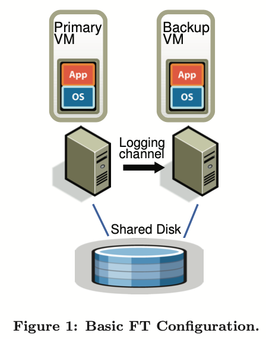

<head>
    
    
</head>

# Table of Contents

1.  [Algorithm](#org9d238bf)
2.  [Review](#org4b07b6c)
    1.  [简介](#org18f7d2e)
    2.  [基本设计](#org6496fe1)
        1.  [确定性重放实现](#org1bbdb9f)
        2.  [FT 协议](#org268ae37)
        3.  [检测和响应故障](#orgee8e1a0)
    3.  [FT 协议的实际实现](#orgdec6fa6)
        1.  [启动和重启 FT 虚拟机](#orgcba78b7)
3.  [Tips](#org99a30f9)
    1.  [Lambda 微积分](#org09cc298)
    2.  [固定点 Combinator](#org64e21eb)
    3.  [如何克服懒加载](#org2415af6)
    4.  [柯里化的 Y Combinator](#orga006356)
4.  [Share](#orgcf41ef1)
    1.  [Off by one](#org675bfc9)
    2.  [一个卡片恶作剧](#org3306856)

# Algorithm

Leetcode 2646: [Minimize the Total Price of the Trips](https://leetcode.com/problems/minimize-the-total-price-of-the-trips/)

<https://dreamume.medium.com/leetcode-2646-minimize-the-total-price-of-the-trips-48d4e9401d23>

# Review

[The Design of a Practical System for Fault-Tolerant Virtural Machines](https://pdos.csail.mit.edu/6.824/papers/vm-ft.pdf)

我们已实现了一个商业企业级系统提供容错虚拟机，基于在另一台服务器上通过后台虚拟机复制主虚拟机的执行的方式。我们已在 VMware vSphere 4.0 上设计了一个完整的系统，其易使用，运行在商业服务器上且典型地减少实际应用程序 10% 的性能。另外，对几个真实的应用程序，数据带宽需要在主和副虚拟机上执行 lockstep 保持少于 20 Mbit/s，允许长距离容错实现的可能性。一个容易使用，故障后自动恢复冗余的商业系统在复制虚拟机执行上需要许多额外的组件。我们设计和实现了这些额外的组件和在运行企业级应用程序支持的虚拟机上处理许多实际的问题。在本文中，我们描述我们的基本设计，讨论替代设计选择和一些实现细节，且提供微评测和实际的应用程序的性能结果

## 简介

一个通常的实现容错服务器的方案时主/备份方式，一个备份服务器在主服务器故障时总是有效地进行接管。备份服务器的状态必须保存在所有时刻对主服务器是确定的，这样当主服务器故障时备份服务器可立刻接管，且这样故障对外部客户隐藏且没有数据丢失。在备份服务器上复制状态的一个方法是移植主服务器的所有状态改变，包括 CPU，内存和 I/O 设备，在备份服务器几乎连续地处理。然而，发送这个状态的带宽，特别是内存的改变，可能会非常大

一个不同的办法是复制服务器使用更少的带宽有时作为一种状态机方案。想法是模型服务器作为一个确定性状态机从相同的初始化状态开始保持同步且确保它们以相同的顺序接收到相同的输入请求。因为多数服务器或服务有一些操作是不确定性的，一些额外的条件需要使用来确保一个主服务器和备份服务器同步。然而，保持主服务器和备份服务器同步的额外信息的总数远小于主服务器改变的状态总数（主要是内存更新）

实现协调来确保确定性物理服务器执行是困难的，特别是作为处理器频率的增加。相反地，一个运行在 hypervisor 上的虚拟机是实现状态机方案的优秀平台。一个虚拟机可考虑为一个良好定义的状态机，其操作是虚拟的机器操作（包括所有它的设备）。作为一个物理服务器，虚拟机有一些非确定性操作（例如，读一个时钟或转发一个中断），且这样额外的信息必须被发送到备份服务器来确保它已同步。因为 hypervisor 有对虚拟机执行的完全控制，包括转发所有输入，hypervisor 能够抓获在主虚拟机上非确定性操作的所有必要的信息且在备份虚拟机上正确地重放这些操作

因此，状态机方案可在基于商业硬件在虚拟机上实现，不需要硬件修改，允许对最新的处理器立即地容错。另外，对状态机方案的低带宽要求允许主服务器和备份服务器的更大的物理隔离的可能性。例如，复制的虚拟机可运行在跨校园的分布式物理机上，提供比相同建筑里运行的虚拟机更多的可靠性

我们以主/备份方式在 VMware vSphere 4.0 平台上实现了容错，其以一个高效地方式运行完全的 x86 虚拟机。因为 VMware vSphere 实现了一个完整的 x86 虚拟机，我们能对任意 x86 操作系统和应用程序自动提供容错。基本的技术允许我们记录主服务器的执行且确保备份服务器知道确定性的回放。VMware vSphere 容错基于确定性的回放，但添加了必要的额外信息和功能来构建一个完整的容错系统。为了提供硬件容错，我们的系统自动在一个故障后恢复容错，通过在本地簇上任意有效的服务器上开启一个新的备份虚拟机。这时，确定性回放和 VMware FT 的产品版本只支持单处理器虚拟机。在多处理器虚拟机上记录和回放执行仍然在研发中，由于几乎每个访问恭喜内存都可能是一个非确定性操作导致对性能有显著的影响

Bressoud 和 Schneider 描述了一个 HP-RISC 平台容错虚拟机的原型实现。我们的处理相似，但我们因性能原因和一些替代性设计有一些基本上的不同。另外，我们设计和实现了系统许多额外的组件且处理一些实际问题来构建一个完整系统，使其高效且对运行企业级应用程序的用户有用。同其他实际系统讨论相似，我们只尝试处理故障停止故障，即服务器故障在导致一个不正确额外可见行为前可被检测

本文的后续组织如下。首先，我们描述我们的基本设计和我们基本协议细节确保一个备份虚拟机在主虚拟机故障后接管不会有数据丢失。然后，我们详细描述许多必须处理的实际问题来构建一个健壮，完整和自动化系统。我们也描述一些实现虚拟机容错的设计选择和讨论这些选择的妥协。接着，我们对我们的实现在一些评测和一些实际的企业级应用程序上给出性能结果。最后，我们描述相关工作

## 基本设计

上图显示容错虚拟机在我们系统中的基本设置。对一个给定需要提供容错的虚拟机（主虚拟机），我们在另一个物理服务器上运行一个备份虚拟机跟主虚拟机同步和相同的执行，通过一个小的时间延迟。我们说这两个虚拟机是虚拟锁步骤的。虚拟机的虚拟磁盘在共享存储中（比如 Fibre 频道或 iSCSI 磁盘阵列），且因此可访问主和备份虚拟机的输入输出。（我们将在后续章节讨论一个设计，主和备份虚拟机有独立的非共享虚拟磁盘）只有主虚拟机在网络中广播它的状态，这样所有网络输入可到主虚拟机。相似的，所有其他输入（键盘和鼠标）只在主虚拟机中

主虚拟机接收到的所有输入通过一个网络连接称为日志频道发送到备份虚拟机。对服务器工作负载，主要的输入流量是网络和磁盘。额外的信息，确保备份虚拟机执行非确定性操作的必要时会与主虚拟机相同的方式传送。结果是备份虚拟机总是执行主虚拟机确定性的操作。然而，备份虚拟机的输出被 hypervisor 丢弃，这样只有主虚拟机产生的输出返回到客户端。如后续章节描述的，主和备份虚拟机遵从一个特殊协议，包括备份虚拟机的直接通知，为了确保在主虚拟机故障时数据不会丢失

为检测主和备份虚拟机的故障，我们的系统使用相关服务器和日志频道中流量监控的组合心跳。另外，我们必须确保只有一个主或备份虚拟机负责执行，甚至当相互间网络连接丢失主和备份虚拟机执行两分时

在下面章节，我们提供一些重要领域更详细的信息。在下面第一子章节，我们给出通过日志频道的信息确保主和备份虚拟机同步的确定性重放技术，在第二子章节，我们描述在主虚拟机故障时确保数据不丢失的我们的 FT 协议的一个基本规则。在第三子章节，我们描述检测响应故障的方法

### 确定性重放实现

如我们所提及的，复制服务器（或虚拟机）可被作为确定性状态机的复制模型。如果两个确定性状态机以相同的初始化状态开始且提供相同顺序的相同输入，则它们将经历相同的状态序列且产生相同的输出。一个虚拟机器有一个输入的广集，包括输入网络包，磁盘读和键盘鼠标的输入。非确定性事件（比如虚拟中断）和非确定性操作（比如读处理器时钟周期统计）也影响虚拟机状态。这代表了在任意虚拟机运行任意操作系统的复制指令和工作负载的三个挑战：(1)正确捕获所有输入和非确定性必要信息确保备份虚拟机的确定性执行(2)正确运用输入和非确定性到备份虚拟机且(3)确保处理时不降低性能。另外，许多 x86 微处理器的复杂操作有未定义，因此有不确定性和副作用。捕获这些未定义副作用和重放它们来产生相同的状态是另一个挑战

VMware 确定性重放在 VMware vSphere 平台上对 x86 虚拟机提供这个功能。确定性重放记录一个虚拟机的输入和所有跟虚拟机执行相关可能的非确定性作为流的日志条目输入一个日志文件。虚拟机执行通过从文件中读取日志条目精确重放。确定性重放记录虚拟机的输入和所有可能非确定性虚拟机执行信息作为日志条目写入日志文件。虚拟机执行通过读日志条目精确重放。对非确定性操作，有效的信息被记录到日志，这允许操作重生成相同的状态改变和输出。对非确定性事件比如时间定时器或 IO 完成中断，事件发生时精确的指令也被记录。在重放时，事件在指令流中相同的点上被转发。VMware 确定性重放用各种技术实现一个有效的时间记录和事件转发机制，包括使用硬件性能计数器开发封装 AMD 和 Intel

Bressound 和 Schneider 提及分离虚拟机的执行为 epoch，非确定性事件比如中断只在一个 epoch 结束时转发。epoch 的记号似乎用来作为批处理系统因为对每个中断独立转发成本太昂贵。然而，我们的事件转发机制足够高效使得 VMware 确定性重放不需要使用 epoch。每个中断在它发生时被记录且当重放时用适合的指令高效转发

### FT 协议

对 VMware FT，我们使用确定性重放来产生必要的日志条目记录主虚拟机的执行，但我们不把日志条目写入磁盘，而是通过日志频道发送它们到备份虚拟机。备份虚拟机实时重放条目，且因此确定跟主虚拟机一样的执行。然而，我们必须在日志频道上用一个严格的 FT 协议参数化日志条目来确保我们获得容错的效果。我们的基本需求如下：

输出需求：如果备份虚拟机在主虚拟机故障后负责执行，备份虚拟机将以主虚拟机发送出的所有输出一致的方式继续执行

注意在一个恢复发生后（例如，备份虚拟机在主虚拟机故障后负责执行），备份虚拟机将和主虚拟机继续执行的方式不一致的状态下继续执行。因为许多不确定性事件会在执行中发生。然而，直到备份虚拟机满足输出需求，在恢复期间没有外部可见状态或数据丢失，且客户端在它们的服务中不会注意到打断和不一致

输出需求通过延迟任何外部输出（典型的一个网络包）的方式被确保直到备份虚拟机收到所有信息允许它重放执行至少到输出操作的点上。一个必要条件是备份虚拟机必须接收到输出操作前所有产生的日志条目。这些日志条目将允许它执行该点上最后一条日志条目。然而，假设一个故障在主虚拟机执行输出操作后立即发生，备份虚拟机必须知道它保持重放到输出操作的点且在该点出为活跃状态（停止重放且做为主虚拟机）。如果备份虚拟机在输出操作前该点的最后日志条目上活跃，在执行输出操作时一些非确定性事件（比如，时间定时器中断转发到虚拟机）必须改变它的执行路径

给定上面的限制，最简单的方法强制输出需求是创建一个特殊的日志条目在每个输出操作时。然后，输出需求可被强制为这样的特色规则：

输出规则：主虚拟机可能不发送一个输出到外部，直到备份虚拟机已接收到和了解操作产生输出的相关日志条目

如果备份虚拟机接收到所有日志条目，包括产生输出操作的日志条目，则备份虚拟机将能够精确地重产生主虚拟机在那个输出点的状态，且如果主虚拟机故障，备份虚拟机将正确地达到跟输出一致的状态。相反地，如果备份虚拟机在没有收到所有必须的日志条目前接管，则它的状态将和主虚拟机输出不一致。输出规则如同被缓存的外部同步 IO，在下一次通讯之前写入磁盘

注意输出规则没有提及停止主虚拟机的执行。我们只需要延迟发送输出，但虚拟机本身可连续执行。因为操作系统不阻塞网络和异步中断表示完成的磁盘输出，虚拟机可容易地连续执行和不需要立即被延迟的输出影响。相反地，之前的工作典型地显示了主虚拟机必须完全在输出前停止直到备份虚拟机从主虚拟机了解到所有必要的信息

作为一个例子，我们显示一张 FT 协议请求的图表，如上图。该图显示一个主虚拟机和备份虚拟机的事件时间线。从主虚拟机线到备份虚拟机线的箭头表示日志条目的传输，从备份虚拟机线到主虚拟机线的箭头表示了解。在异步事件，输入和输出操作的信息必须发送到备份虚拟机作为日志条目并了解。如上图所示，一个到外部的输出被延迟直到主虚拟机收到备份虚拟机收到输出操作相关日志条目的确认

我们不能保证在故障时所有的输出只产生一次。当主虚拟机试图发送一个输出时没有使用交易的两阶段提交则备份虚拟机不能确定主虚拟机是在它最后的输出发送前或发送后立即出现的崩溃。幸运地是，网络基础设施（包括通常使用的 TCP）设计为处理丢包和确认重复包。注意到主虚拟机的包在主虚拟机故障时也可能丢失且因此不会转发到备份虚拟机。然而，输入包可能被各种跟服务器故障无关的原因而丢失，这样网络基础设施，操作系统和应用程序都确保它们能妥协处理丢包问题

### 检测和响应故障

如上所述，如果有虚拟机故障主和备份虚拟机必须快速响应。如果备份虚拟机故障，主虚拟机将继续活跃 - 离开记录模式（因此停止在日志频道发送条目）且开始正常执行。如果主虚拟机故障，备份虚拟机将继续活跃，但处理有一些复杂。因为在执行上延后，备份虚拟机将有一些它收到和确认的日志条目，但还没有消费因为备份虚拟机还没有到达它执行的一个适合的点。备份虚拟机必须继续从日志条目重放它的执行直到它消费了最后的日志条目。这时，备份虚拟机将停止重放模式且作为一个正常虚拟机开始执行。必要地，备份虚拟机晋升为主虚拟机（因此失去一个备份虚拟机）。因为它不再是一个备份虚拟机，当客户操作系统做输出操作时新的主虚拟机将产生输出到外部。在转换到正常模式期间，可能有一些设备相关的操作需要处理来允许这个输出。特别地，对网络，VMware FT 自动广播新主虚拟机的 MAC 地址，这样物理网络交换机将知道新的主虚拟机在哪个服务器上。另外，新晋升的主虚拟机将需要重处理一些磁盘 IO

有许多可能的方法来尝试检测主和备份虚拟机的故障。当一个服务器崩溃时 VMware FT 在容错的主和备份虚拟机之间使用 UDP 心跳来检测。另外，VMware FT 监控从主虚拟机发送到备份虚拟机和备份虚拟机发送的到主虚拟机的确认的日志流量。因为常规时间定时器中断，日志流量应该是常规的且对一个客户操作系统不会停止。因此，日志条目或确认的停滞会意味着一个虚拟机的故障。一个故障被定义为如果心跳或日志流量停止超过一个特殊的超时时间（几秒钟）

然而，任何这样的故障检测方法可能会导致分裂问题。如果备份服务器停止从主服务器接收心跳，则意味着主服务器已经故障，或在仍然工作的服务器间所有的网络连接丢失。如果当主虚拟机仍在运行时备份虚拟机之后变得活跃，则很可能对这个虚拟机的客户端通信有数据冲突问题。因此，我们必须确保当一个故障被检测到时只有一个主或备份虚拟机在活跃中。为避免分裂问题，我们必须使用共享存储存储虚拟机的虚拟磁盘。当一个主或备份虚拟机想要变得活跃，它在共享的存储上执行一个原子测试并设置操作。如果操作成功，虚拟机允许变为活跃。如果操作失败，则有其他虚拟机必须已为活跃，这样当前的虚拟机事实上对自己挂机。如果虚拟机在尝试做原子操作时不能访问共享存储，则它等待直到可行。注意如果共享存储不能访问因为一些存储网络的故障，则虚拟机不能做有用的工作因为虚拟磁盘在相同的共享存储上。这样，使用共享存储来解决分裂问题不会引入任何额外的非有效性

设计的一个最终方面是一旦一个故障发生且一个虚拟机变成活跃，VMware FT 自动恢复开始于一个新的备份虚拟机在另一个主机上的冗余。这样这个处理不覆盖多数之前的工作，它基本上使容错虚拟机有用且需要小心设计

## FT 协议的实际实现

为创建一个有用的，稳健的和自动化系统，有许多其他组件需要设计和实现

### 启动和重启 FT 虚拟机

一个最大的附加组件之一是设计在一个主虚拟机相同的状态下启动一个备份虚拟机。这个机制也用来在一个故障发生时重启一个备份虚拟机。因此，这个机制必须对主虚拟机在任意状态下有用。另外，我们更想要该机制不能严重干扰主虚拟机的执行，因为这将影响虚拟机的当前客户端

对 VMware FT，我们适配现有的 VMware vSphere 的 VMotion 功能。VMware VMotion 允许一个运行的虚拟机从一个服务器到另一个服务器以最小的干扰进行迁移 - 虚拟机暂停时间典型的小于一秒。我们创建一个 VMotion 修改的形式在远程服务器上创建一个虚拟机的精确运行拷贝，但在本地服务器上不销毁虚拟机。即，我们修改的 FT VMotion 克隆一个虚拟机到远程主机而不是迁移它。FT VMotion 也设置一个日志频道，且使源虚拟机作为主虚拟机进入日志模式，且目标虚拟机作为新的备份虚拟机进入重放模式。像正常的 VMotion 一样，FT VMotion 典型地在不到一秒内打断主虚拟机的执行。因此，在一个运行的虚拟机上启动 FT 是一个简单非干扰的操作

启动一个备份虚拟机的另一个方面是选择一个服务器运行。容错虚拟机运行在一簇服务器上，其共享存储，这样所有的虚拟机可典型地运行在簇中任意服务器上。这个灵活性允许 VMware vSphere 恢复 FT 冗余即使当一个或多个服务器故障时。VMware vSphere 实现一个簇服务维护管理和资源信息。当一个故障发生且一个主虚拟机现在需要一个新的备份虚拟机来重建冗余，主虚拟机通知簇服务它需要一个新的备份虚拟机。簇服务基于资源使用和其他限制决定哪个服务器是最好的选择来运行一个备份虚拟机且调用一个 FT VMotion 来创建一个新的备份虚拟机。结果是 VMware FT 在一个服务器故障后数分钟内可重建虚拟机冗余，并对一个容错虚拟机的执行没有明显的打断

# Tips

[Y Combinator and C++](https://yongweiwu.wordpress.com/2014/12/14/y-combinator-and-cplusplus/)

搜索 Y combinator，第一个出现的是 Paul Graham 的孵化器公司 Y Combinator。我不确定是否 Paul 喜欢这个 - 作为一个 Lisp 骇客，他一定非常喜欢 Y combinator 并用它给他的公司命名。但现在人们查找数学/编程概念则不是需要他公司的信息。如果他还是一个 Lisp 骇客，他会感到一些抱歉，虽然这样会表面上对他的公司有利

Y combinator 是一个有趣的概念。当我第一次看到时，我花费了整个周末阅读并学习它。然而， 我还是不能完全理解。人们认为 Y combinator 在函数式编程中一个重要的概念：

我们可使用 Y combinator 类似的知识作为函数式程序员（对函数式编程有相当深入了解）和其他程序员的分割线

有很多现有的资料介绍 Y combinator，但我还不知道有为 C++ 程序员写的。我愿意填补这个空缺

即我依然开始用函数式语言，但你，作为读者，不需要知道任何相关知识。聚集于概念，我将显示运行的 C++ 代码

现在旅行开始

## Lambda 微积分

当然你可找到大量的材料介绍 lambda 微积分，且我将足够的描述基本概念对 C++ 程序员。除了通常的定义求平方方法 sqr(x) = x \* x，我们可定义它作为一个 lambda 表达式

$ \\text { sqr } = \\lambda x . \\chi \\cdot \\chi $

这是 Haskell 和 Scheme 定义函数的方式，但语法有些不同

Haskell:

sqr = \\ x -> x \* x

Scheme:

    (define sqr (lambda (x) (* x x)))

关键的好处是你不需要一个函数名。为了求 3 的 sqr，我们可简单写成：

$ ( \\lambda \\chi . \\chi \\cdot \\chi ) 3 $

C++ 代码打印结果为

    cout <<  { return x * x; } (3) << endl;

然而，考虑到 C++ 语法不能清晰看到 lambda 表达式，使用一个名字更合适

    auto const sqr =  { return x * x; };
    cout << sqr(3) << endl;

一个 lambda 表达式可转换为一个函数对象，代码如下：

    function<int(int)> const sqr =  { return x * x; };
    cout << sqr(3) << endl;

## 固定点 Combinator

一个固定点 combinator 是一个更高序函数满足如下等式：

$ yf = f(yf) $

我们看到这个定义可引出无限的扩展

$ yf = f(yf) = f(f(yf)) = f(\\ldots f(yf) \\ldots) $

这就是它强大之处。如果函数 y 给出，则能以一个非递归方式定义一个递归函数！以下是一个例子

fact n = If IsZero n then 1 else n \* fact(n-1)

假设一个函数 F 存在使得 fact = yF

(yF)n = If IsZero n then 1 else n \* (yF)(n-1)

F(yF)n = If IsZero n then 1 else n \* (yF)(n-1)

用 f 替换 yF:

Ffn = If IsZero n then 1 else n \* f(n-1)

我们现在给出一个函数 F 可用非递归形式定义。在 Haskell 中我们可定义 factorial 如下

fix f = f (fix f)

fact = fix $ \\ f n -> if (n == 0) then 1 else n \* f (n - 1)

这个定义有两个问题：

-   它只能在懒语言如 Haskell 中使用
-   在 fix 定义中出现递归

我们先解决第一个问题

## 如何克服懒加载

Haskell 的懒加载非常强大，但它在其他语言中无效。解决方案非常简单：一个额外的间接层。一个 lambda 表达式在参赛给出前不求值，这样如下转换可行：

$ f \\Rightarrow \\lambda \\chi . f \\chi $

下面代码在 Scheme 上可行：

    (define Y
      (lambda (f)
        (f (Y f)))
    
    (define F
      (lambda (f)
        (lambda (n)
          (cond 
           ((eq? n 0) 1)
           (else (* n f (- n 1)))))))
    
    (define fact (Y F))

让我们先分析一下类型。这对我们的 C++ 实现非常重要，且错误理解类型会导致我们认为 Y combinator 在 C++ 中不能实现。一个类 Haskell 记号使用如下：

-   **f(in F):** int -> int
-   **F f:** int -> int
-   **Y F:** int -> int
-   **F:** (int -> int) -> int -> int
-   **Y:** ((int -> int) -> int -> int) -> int -> int

我们可看到 f，F f 和 Y F 都是首序函数，一个整数参数返回一个整数。因此，F 是一个两序函数带一个首序函数返回一个首序函数。我们的 Y 带一个两序函数如 F，返回一个首序函数

Yf 是一个首序函数，我们现在可应用 $ \\eta- $ 抽象消除无限扩展。如下 Y 的定义在更严格的 Scheme 语言上可以运行

    (define Y
      (lambda (f)
        (f (lambda (x) ((Y f) x)))))

同时，如下是 C++ 代码实现

    #include <iostream>
    #include <functional>
    
    using namespace std;
    
    template <typename T, typename R>
    function<R(T)> Y(function<function<R(T)>(function<R(T)>)> f) {
      return f([=](T x) { return Y(f)(x); });
    }
    
    typedef function<int(int)> fn_1ord;
    typedef function<fn_1ord(fn_1ord)> fn_2ord;
    
    fn_2ord almost_fact =  {
      return [f](int n) {
        if (n == 0) return 1;
        else return n * f(n - 1);
      };
     };
    
    int main() {
      fn_1ord fact = Y(almost_fact);
      cout << "fact(5) = " << fact(5) << endl;
    
      return 0;
    }

## 柯里化的 Y Combinator

现在我们回到处理递归定义问题。在实际使用中它可能不是一个问题，但它非常有趣。解决方案是我们总是统计，Y combinator，属于 Haskell 的柯里化。它也是难以理解的，像自引用迷宫或悖论。我对之很好奇，这也是我写这篇博客的原因

有一些好的引用关于 Y combinator 的起源，我这里简单呈现结果如下：

$ Y = \\lambda f . (\\lambda \\chi . f(\\chi \\chi)) (\\lambda \\chi . f(\\chi \\chi)) $

我也想要显示这个定义满足固定点等式:

$ \\begin{aligned} Y F &= (\\lambda f . (\\lambda \\chi . f(\\chi \\chi)) (\\lambda \\chi . f(\\chi \\chi))) F \\qquad \\text{(扩展 Y)} \\\\ &= (\\lambda \\chi . F(\\chi \\chi)) (\\lambda \\chi . F (\\chi \\chi)) \\qquad (\\beta \\text{ -reduction on the bound variable f}) \\\\ &= F(( \\lambda \\chi . F(\\chi \\chi)) (\\lambda \\chi . F(\\chi \\chi))) \\qquad (\\beta \\text{ -reduction on the first bound variable } \chi) \\\\ &= F(Y F) \\end{aligned} $

注意有一个相等的形式（ $ \\beta $ -reduce it once to get the Y above）:

$ Y = \\lambda f . (\\lambda \\chi . \\chi \\chi) (\\lambda \\chi . f(\\chi \\chi)) $

基本上，这是在懒加载 Scheme 上的定义：

    (define Y
      (lambda (f)
        ((lambda (x) (x x))
         (lambda (x) (f (x x))))))

重新调用 Y 的函数参数 - 上面的 f - 把第一序函数作为参数，我们知道 $ \\chi \\chi $ 应该返回一个首序函数。这样我们可应用 $ \\eta- $ 抽象来获得严格的 Scheme 版本

    (define Y
      (lambda (f)
        ((lambda (x) (x x))
         (lambda (x) (f (lambda (y) ((x x) y)))))))

在用 C++ 实现之前，我们有一个困难。一个严格类型的语言不能定义出函数 $ \\chi \\chi $，需要用一个代理对象糊弄一下类型系统

这里是 C++ 实现：

    template <typename F>
    struct self_ref_func {
      function<F(self_ref_func)> fn;
    };

这种类型的对象包含一个函数把它自己的类型作为一个对象并返回一个模板类型的对象，其为一个函数：

    typedef function<int(int)> fn_1ord;
    typedef self_ref_func<fn_1ord> fn_self_ref;
    fn_self_ref x = { ... };        // assign a suitable value to x
    x.fn(x)

使用这个自引用类型，Y combinator 的柯里化可最终用 C++ 实现:

    template <typename T, typename R>
    function<R(T)> Y(function<function<R(T)>(function<R(T)>)> f) {
      typedef function<R(T)> fn_1ord;
      typedef self_ref_func<fn_1ord> fn_self_ref;
      fn_self_ref f = {
        [f](fn_self_ref x) {
          return f(fn_1ord([x](T y) {
            return x.fn(x)(y);
          }));
        }
      };
    
      return r.fn(r);
    }

# Share

[Hempel's Joke](https://crypto.stanford.edu/~blynn/pr/hempel.html)

你是否听说过一个有效的比 2 值大的值有 2 + 2 = 5。这明显是一个玩笑

Hemple 的悖论相似。考虑假设：所有渡鸦是黑色的。这个逻辑相当于说所有非黑色的东西不是渡鸦。因此看到一个白靴子就是一个证据

如下的 Go 代码做了一个清晰幽默地尝试：

    package main
    
    import "fmt"
    
    func main() {
     state := true
     for {
       var colour, thing string
       if _, e := fmt.Scan(&colour, &thing); e != nil {
         break
       }
       if thing == "raven" && colour != "black" {
         state = false
       }
       fmt.Println("    hypothesis:", state)
     }
    }

一些简单的运行例子

    black raven
      hypothesis: true
    white shoe
      hypothesis: true
    red raven
      hypothesis: false
    black raven
      hypothesis: false
    white shoe
      hypothesis: false

假设的状态用一个布尔值代表。初始化为 true，直到遇到一个非黑的渡鸦后变成 false。这是程序里唯一改变状态值的方法

我们说“有证据支持假设“相当于说有状态为 true 的。就像说有比 2 大的值

最开始的笑话采用了数学概念“有效大”，但应用到常量上是荒唐的

相似的，Hempel 玩笑采用的概念“有支持的证据”，但应用到一个单独的假设也是荒唐的

## Off by one

如果我们想要证据支持或颠覆一个假设，我们需要一些超越布尔逻辑的东西。我们用 0 到 1 之间的数代表相信度。值越高越值得信任，我们称之为概率

接着，我们提出一些互斥假设和对之设置 0 到 1 之间的概率。其概率和必须为 1

如果我们用一个单命题，比如“所有渡鸦是黑色的”，则我们强制给定它的概率为 1。我们推导这个情况，当我们关注感兴趣的事情我们看到一个不是黑色的渡鸦则我们意识到我们必须重新开始一个不同的假设

我们需要至少两个非零概率的命题让“支持的证据”有意义。例如，我们可有两个命题 A 和 B，概率分别为 0.2 和 0.8。如果我们找到证据支持 A，则它的概率增加且 B 的概率减少，它们的概率和必须为 1。自然地，我们可统计证据是否我们的命题都是错误的，这时我们必须重新开始一系列新的假设

例如，我们可用 A：“所有渡鸦是黑色的“，B：“存在一个非黑的渡鸦“，且对其都给定一个非 0 的概率。现在如果问一个白靴子是否是一个支持证据则有了意义。如果支持 A 则削弱 B？或支持 B 则削弱 A？或两者都不是？

这里命题笔记模糊难以回答。我们可使命题更明确，但有许多钟方法来做，且我们的选择改变答案

## 一个卡片恶作剧

现在让我们用一个更简单的场景。假设一个卡片制造商有一个有缺陷的工艺使得有时用黑色墨水替代红色墨水来打印整个红心卡片。我们估计十捆中有一捆是黑色的

我们给出这个制造商的一捆卡片。然后我们相信假设 A：“所有心的卡片是红色的“有概率为 0.9，且 B“有一个非红色的心”概率为 0.1。我们出一个卡片，它有四种组，它对我们的假设有什么作用？

没什么作用。这不影响相关的假设。我相信这对大多数人来说是直接清晰的，且进一步，Hempel 用红心和方块比涂鸦和靴子更明确

Hempel 笑话提醒我们必须考虑多个假设如果我们想要谈支持证据的话。分配一个相信度给一个单独的命题就像对只有一个选手的比赛打分一样

这些都是明显的，但通常不够明显。我的概率和统计教科书指导我们只考虑一个假设。事实上，这是错误的：它指示我们设计一个替代命题，但这第二个命题重来不提及
