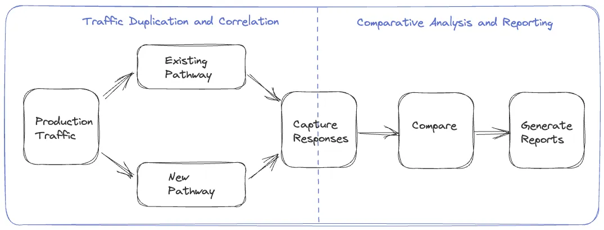
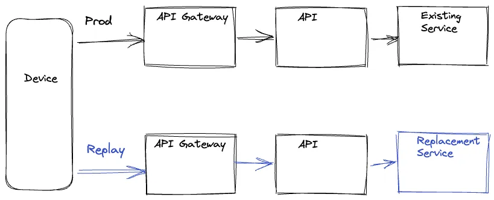
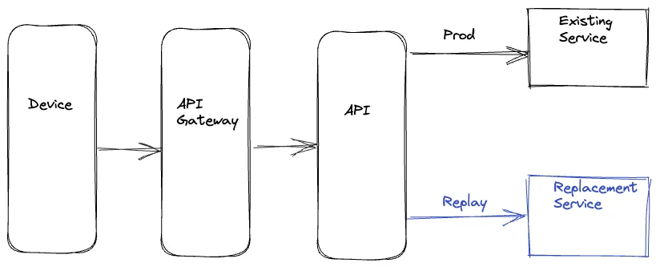
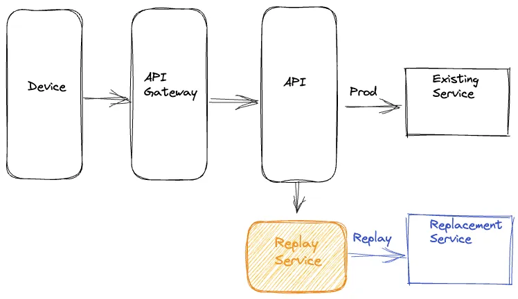
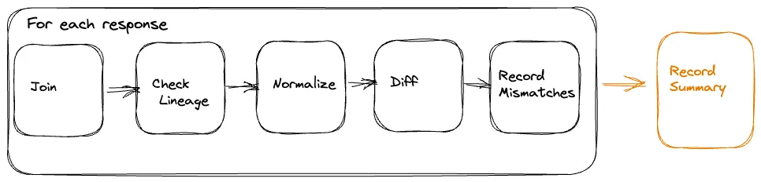

<head>
    
    
</head>

# Table of Contents

1.  [Algorithm](#org20078c5)
2.  [Review](#orgdea5f31)
3.  [Tips](#orgf6e77d4)
4.  [Share](#orge8bd447)
    1.  [重放流量测试](#org736ef2a)
    2.  [重放解决方案](#orgc483b93)
        1.  [设备驱动](#orgbae912e)
        2.  [服务端驱动](#org999f1c1)
        3.  [特殊服务](#orgcbde996)
    3.  [分析重放流量](#org4bb87cf)
        1.  [标准化](#org9027062)
        2.  [比较](#orgc4ebae2)
        3.  [关系追源](#org9bb92bc)
    4.  [比较直播流量](#orgabc2631)
    5.  [加载测试](#orgb8da819)
    6.  [有状态的系统](#orgd170ba2)
    7.  [总结](#orgb309949)

# Algorithm

Leetcode 798: [Smallest Rotation with Highest Score](https://leetcode.com/problems/smallest-rotation-with-highest-score)

<https://dreamume.medium.com/leetcode-798-smallest-rotation-with-highest-score-f83dbd4cea9>

# Review

[Timelines at Scale](https://www.infoq.com/presentations/Twitter-Timeline-Scalability/)

Twitter 工程师 Raffi Krikorian 讲述了 Twitter 使用的架构处理美妙数千个事件。根据听力和 Slide 记录下相关内容

Twitter 当时面临的挑战是：

1.  1 亿 5 千万的活跃用户
2.  时间线上 30 万 QPS
3.  本地时间线的题材提取慢

Fanout 模块中主要是 Social Graph Service，其主要功能是插入接收者、一次流水线 4 千个目标和复制

使用 Redis 作为时间线缓存

使用 Blender 作搜索，Earlybird 模块做搜索索引服务，针对用户发布一条消息，Redis 需要写 n 次，用户读取则 Redis 需要读 1 次，而相对于搜索，写时需要 1 次，读取会有 n 次

第二个挑战是：

1.  fanout 服务真的很慢
2.  特别对有高的关注者账号

这一块没太听懂，似乎是如果是高关注度用户的话通过搜索来查询最新的消息，这样避免通过 fanout 服务导致过慢的结果

Tweet input:

-   每天 ~4 亿条推特
-   每日平均每秒 ~5K
-   每日高峰时每秒 ~7K
-   大事件时每秒大于 12K

一些监测工具观察跟踪相关行为

# Tips

一些英语学习个人经验

英语学习个人觉得是一个需要长期坚持的事情，要结合自己的预期及需求，听说读写最好都要有练习

像英语这种，不属于太消耗脑力，需要花时间多练，因此要确保能坚持并多利用碎片时间

比如看 B 站里讲解的美剧片段，也就几分钟时长，每天坚持看一点慢慢积累，且因为对美剧有兴趣也不会有倦怠感

或者选择直接看带字幕的美剧，练听力的同时也学一些不熟悉的单词

用多邻国 app 学习也是一个方法，碎片时间里可以打几关

多读读一些英文技术文章，学到技术经验的同时也加强了英语

说的话似乎可以试试 Cambly，还没有用过，据说不错，不过是收费的

# Share

[Migrating Critical Traffic At Scale with No Downtime — Part 1](https://netflixtechblog.com/migrating-critical-traffic-at-scale-with-no-downtime-part-1-ba1c7a1c7835)

数亿用户每天观看 Netflix，期望体验一个不会打断和沉浸式流观看效果。在这样的场景下，无数的系统和服务一起协作创造了产品体验。这些后台系统持续地演化和优化来匹配和超过客户和产品的期望

当系统迁移时，一个主要的挑战是建立自信和无缝的流量过渡到升级后的架构且对客户没有负面的影响。本博客系列将检测我们用到的工具，技术和策略来达到这个目标

流产品后端利用一个高分布式微服务架构；因此这些迁移也发生在服务调用图的不同点上。它可能发生在一个服务客户设备的边缘 API 系统，在边缘和中层服务之间，或从中层到数据存储。另一个相关因素是迁移可能发生在无状态且幂等的 API 上，或有状态的 API

我们把我们使用的用于促进迁移的工具和技术分类为两个高级阶段。第一个阶段包括验证功能正确性，可扩展性和性能且确保新系统在迁移前有还原能力。第二个阶段包括在迁移流量过程中在多个层次上持续监控和确认是否达到紧急度量点的事件风险。这些包括客户设备层上的质量体验（QoE）度量，SLAs 和业务层关键性能指标（KPIs）

本博客将提供一个重放流量测试的详细分析，一个多用途的技术我们已应用在多个迁移初始化的预验证阶段。在 [博客](https://netflixtechblog.medium.com/migrating-critical-traffic-at-scale-with-no-downtime-part-2-4b1c8c7155c1) 中，我们将聚焦在第二个阶段且深入某些在一个可控方式内迁移流量的技术步骤

## 重放流量测试

重放流量涉及到生产流量克隆且分叉到服务调用图的一个不同路径，允许我们模拟实际产品条件下练习新的或升级的系统。在这样的测试策略中，我们执行一个拷贝（重放）产品流量在现存的系统上且用新版本来执行相关验证。这个处理有很多好处：

-   重放流量测试使得扩展的沙盒测试不影响产品流量或客户体验
-   利用克隆的实际流量，我们可练习产品级上广泛设备和设备应用程序软件版本的多样化输入。这对有许多高基数输入的复杂 API 特别重要。重放流量提供达到和覆盖需求来测试系统处理不频繁使用输入组合和边界 case 的能力
-   这个技术在多个前端辅助验证。它允许我们断言功能正确性和提供一个机制来加载测试系统和调配系统且扩展参数来优化功能
-   通过模拟一个真实的产品环境，我们可特征化系统性能在一个扩展时期当考虑期望和非期望流量范型移动时。它提供在不同产品环境下对有效性和延迟范围的一个友好的读
-   提供一个平台在迁移前确保相关操作前景，度量，日志和断言

## 重放解决方案

重放流量测试解决方案由两个必需的组件组成

1.  流量复制和校正：初始步骤需要一个克隆和分叉产品流量到新确定的路径的机制实现，及一个进程记录和校正从源和交替路由的响应
2.  比较分析和报告：跟随流量复制和校正，我们需要一个框架来比较和分析从两个路径的响应且从分析中得到一个可理解的报告

我们尝试了通过各种迁移对流量复制和记录步骤的不同处理，改进这个过程。包括选项重放流量产生于设备，服务器和通过一个特别的服务。我们将在接下来的章节检查这些

### 设备驱动

在这个观点下，设备在产品路径和重放路径上发出一个请求，然后在重放路径上丢弃响应。这些请求并行执行在产品路径上最小化任何潜在的延迟。后端重放路径的选择可由设备生成请求的 UR 驱动或利用在服务调用图的适合层上路由逻辑指定请求参数。在两个路径上设备也包含一个唯一的标识号，用来校正产品和重放响应。响应可被记录在服务调用图最优化的位置或设备自身记录，依赖于特定的迁移

设备驱动处理明显不好的是我们浪费了设备资源。也存在设备 QoE 风险，特别在低资源设备上。添加分叉逻辑且复杂度到设备代码使得设备应用程序发布循环依赖，比服务发布周期更慢，导致迁移瓶颈。更进一步，允许设备执行未测试服务端代码路径会导致潜在的误用暴露攻击弱点

### 服务端驱动

为处理设备驱动方式的问题，另一个选项是我们整个在后端处理重放。重放流量在迁移服务适合的服务上行流量上进行克隆和分叉。上行服务并行调用现存和新的替代服务来最小化在产品路径上任意的延迟增加。上行服务记录两个路径上的响应，用一个共同值的唯一标识号来校正响应。这个记录操作也异步完成使得产品路径上延迟的影响最小化

服务端驱动的好处是整个重放逻辑的复杂度在后端封装，不浪费设备资源。因为这个逻辑在服务端，我们可更快地迭代需求的改变。然而，我们仍然在产品代码上插入了重放相关逻辑来处理业务逻辑，这会导致不必要的双重结果和复杂度。也有风险是重放逻辑的问题潜在的影响产品代码和度量

### 特殊服务

最后的方案是我们使用完全隔离的重放流量的所有组件在一个隔离的特殊服务上。这样，我们记录请求和服务的响应需要异步更新或替代到一个脱机事件流。常见的，请求和响应的日志在操作前景中发生。其次，我们使用 Mantis，一个分布式流处理器，捕获这些请求和响应且重放请求到新的服务或簇，同时对请求做需要的调整。在重放请求之后，这个特殊服务也记录从产品和重放路径上的响应来脱机分析

这种方式集中重放逻辑到一个隔离，特殊的代码处。不消费设备资源和不影响设备 QoE，这个处理也减少了产品业务逻辑和重放流量逻辑在后端的耦合。它也解耦在重放框架上的任意升级不跟设备和服务发布循环相关

## 分析重放流量

一旦我们运行重放流量和记录一个统计意义上的响应，我们已经准备好比较分析且报道重放流量测试的组件。给定使用重放流量产生的扩展数据，我们使用像 Apache Iceberg 一样的技术记录两边到一个高效成本冷存储设备的响应。我们可创建离线分布式批处理任务来校正和比较产品和重放路径的响应且在分析时产生详细的报告

### 标准化

依赖自然的系统迁移，响应在比较之前需要一些预处理。例如，如果响应的一些字段是 timestamps，这些将不同。相似地，如果响应中有未拍序的列表，最好在比较之前拍下序。在某些迁移场景，会有一些升级服务或组件有意的修改产生的响应。例如，在源路径下一个字段是一个列表代表新路径的键值对。在这样的情况下，我们可应用在重放路径下模拟期望的改变来对响应做特别的转换。基于系统和相关响应，在我们比较响应之前可能有其他特殊的标准化需要应用到响应上

### 比较

在标准化之后，我们在两边为不同的响应且检查是否我们有匹配或未匹配响应。批处理任务创建一个高层总结捕获一些键比较度量。这些包括两边的响应总数，通过一个相关标识符 joined 响应数量，匹配和未匹配。总结也记录在每个路径上通过或失败的响应。总结提供一个分析的优异高层视图且跨生产和重放路径的总体匹配率。另外，对未匹配，我们记录从两边的正规化和未正规化的响应到另一个有其他相关参数的大数据表，比如不同。我们使用这个额外的日志来调试和确定导致未匹配的问题的根源。一旦我们发现且处理了这些问题，我们可使用重放测试迭代处理来降低未匹配百分比到一个可接受的数值

### 关系追源

当比较响应时，一个通常的噪声源源自在生产和重放路径上生成响应的非确定性利用或非幂等依赖数据。例如，想象一个响应负载为一个播放系列转发媒体流。负责生成这个负载的服务咨询一个 metadata 服务获得给定标题所有有效的流。各种因素导致流的添加和删除，比如一个特定流的确定问题，新语言的不兼容或引入一个新的编码。结果，一个潜在的流集合的差异决定生产和重放路径负载，导致响应的分歧

一个可理解数据版本的总结或对在生成响应所有依赖的 checksum，涉及到关系追源，被编译来处理这个挑战。差异可被确定且通过生产和重放响应在分析响应自动任务的比较进行丢弃。这个处理迁移噪声的影响且确保在生成和重放响应之间精确和可靠的比较

## 比较直播流量

一个记录响应和执行脱机比较的替代方法是执行一个直播比较。在这个处理中，我们在上行服务中如服务器驱动描述的那样分叉重放流量。服务分叉和克隆重放流量直接比较生产和重放路径上的响应且记录相关度量。这个选项是灵活的如果响应负载不复杂，比较不会显著增加延迟或如果服务迁移不在紧急路径上。日志可选择那些新旧响应不匹配的

## 加载测试

除了功能测试，重放流量允许我们压力测试升级的系统组件。我们可在重放路径上通过控制被重放的流量总数和新服务水平和垂直扩展因素来规范加载。这个处理允许我们评估新服务在不同流量条件下的性能。我们可看到有效性，延迟和其他系统性能度量比如 CPU 消耗，内存消耗，垃圾收集率等作为加载因素改变时是如何变动的。加载测试系统使用这个技术允许我们使用实际的生产流量配置确定性能蜜罐。它帮助暴露内存泄露，死锁，缓存问题和其他系统问题。它启动线程池，连接池，连接超时和其他配置参数的调整。进一步，它帮助确定合理的扩展策略和估计相关成本和更广泛的成本风险折中

## 有状态的系统

我们扩展利用重放测试来构建在包含无状态和幂等系统的自信。重放测试也验证包含有状态系统的迁移，虽然需要额外的度量。在启动重放流量之前生产和重放路径必须不同和在确定状态下隔离数据存储。另外，驱动状态机的所有不同的请求类型必须重放。在记录步骤中，除了响应，我们也想要捕获特殊响应的状态。对应分析阶段，我们想要比较响应和在状态机上的相关状态。给定使用带状态系统的重放测试的总复杂度，我们在这样的场景使用了其他的技术。我们将在后续文章中提及一些

## 总结

我们在 Netflix 对大量迁移工程采用流量重放。一个最近的例子包括平衡重放测试来验证我们产品的一个驱动播放组件的边缘 API 的扩展重架构。另一个例子包含从 REST 到 gRPC 的中层服务的迁移。在这两个例子中，重放测试使用实际生产流量辅助可理解的功能测试，加载测试和系统扩展调整。这个处理使我们定位困难的问题和在这些替代设计中快速建立信心

通过重放测试，我们准备开始在生产上引入这些改变
