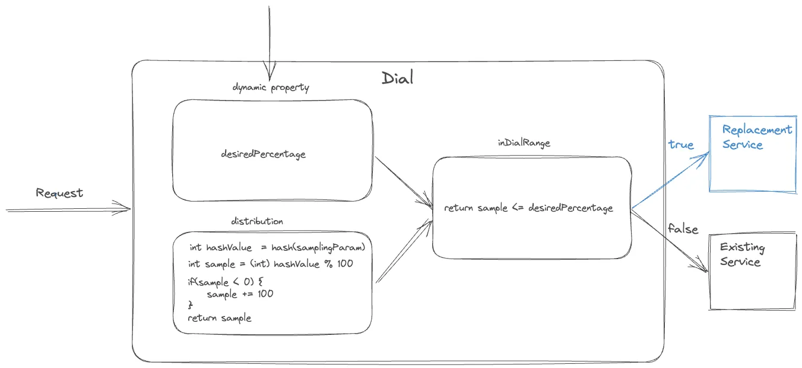
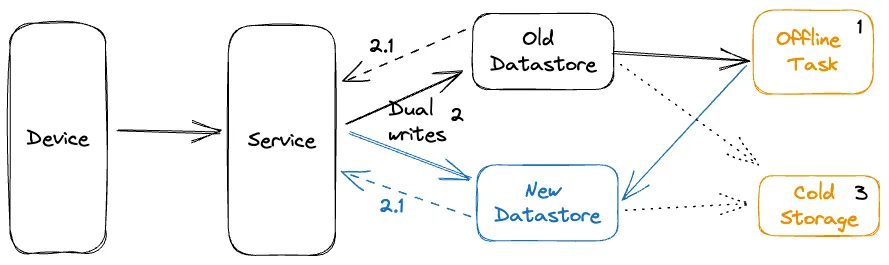

<head>
    
    
</head>

# Table of Contents

1.  [Algorithm](#orgdbf1af6)
2.  [Review](#org8309306)
    1.  [粘稠的金丝雀](#org25ea1c0)
    2.  [A/B 测试](#org6be54ee)
    3.  [调节流量](#org8b9ebb2)
    4.  [迁移持久化存储](#orgf8b6ee9)
    5.  [清理](#orgfbc6bfe)
    6.  [部分思考](#org4774048)
3.  [Tips](#orgd3668ce)
4.  [Share](#orgebc7e09)

# Algorithm

Leetcode 2790: [Maximum Number of Groups With Increasing Length](https://leetcode.com/problems/maximum-number-of-groups-with-increasing-length/)

<https://dreamume.medium.com/leetcode-2790-maximum-number-of-groups-with-increasing-length-631235b9251e>

# Review

[Migrating Critical Traffic At Scale with No Downtime — Part 2](https://netflixtechblog.com/migrating-critical-traffic-at-scale-with-no-downtime-part-2-4b1c8c7155c1)

重放流量测试给了我们初始基础的验证，但当我们的迁移进程打开，我们遇到小心控制的迁移进程需求。一个进程不但最小化风险，也协助新产品或服务的持续服务的影响。本博客将探索在 Netflix 中平衡的技术来引入这些改变到产品

## 粘稠的金丝雀

金丝雀。一个高效的机制验证以可控和限制的方式改变到一个产品后端服务，但改变可能引起迁移未知结果的风险。这个过程包括创建两个新簇来升级服务；一个基线簇包含产品运行的当前版本和一个金丝雀簇包含服务的新版本。一个产品流量的小百分比重定向到两个新的簇，允许我们监控新版本的性能和与当前版本的比较。通过收集和分析关键性能度量和确定是否他们达到有效性，延迟和性能需求

一些产品特性需要一个请求在客户设备和一系列后端服务之间的生命周期来驱动该特性。例如，Netflix 视频播放功能包含服务的流的请求 URL，调用 CDN 来下载流，从一个单独的服务中请求一个许可来解密流，且发送信息表示成功开始播放到另一个服务。只跟踪测量更新中的服务，我们可能丢失更广端到端系统功能的源捕获

粘稠的金丝雀是处理传统金丝雀进程这个限制的一个改进。在这个变种中，金丝雀框架创建一个唯一客户设备的池然后对实验的持续期为这个池持续路由流量到金丝雀和基线簇。除了测量服务层的测度，金丝雀框架也可以跨金丝雀池保持跟踪更广系统操作和客户测量且因此监测整个请求周期流的倒退

重要的是，在粘稠的金丝雀中，金丝雀池中的设备在实验中持续被路由到金丝雀，潜在导致在客户设备上持续重试不想要的行为。因此，金丝雀框架被设计为监控操作和客户 KPI 度量来检测持续变化和必要时终止金丝雀实验

金丝雀和粘稠的金丝雀是系统迁移进程中有用的工具。跟回放测试相比，金丝雀允许我们越过服务层扩展验证范围。它们对功能跨请求生命周期启动更广的端到端系统功能验证，给我们迁移不会引起任何干扰到客户体验的信心。金丝雀也提供一个机会来在不同负载条件下度量系统性能，允许我们确定和解决任何性能瓶颈。它们使得我们进一步调优和配置系统，确保新的变化光滑无缝地集成

## A/B 测试

A/B 测试是一个广泛被认知的方法来通过可控的实验检验假设。它包含分割数据的一部分到两个或多个组，每个接收不同的处理。结果使用特别的度量来评估决定是否假设是有效的。工业中频繁使用这个技术来评价假设相关产品的演绎和用户交互。它也广泛使用在 Netflix 来测试对产品行为和用户体验的改变

A/B 测试也是一个有效的工具来评估后端系统的重要改变。我们可决定 A/B 测试成员在设备应用程序或后端代码和选择性调用新代码路径和服务。在迁移时，A/B 测试使我们限制迁移系统的爆发，通过使更小部分百分比成员启动到新路径。因此控制新改变引起未知行为结果的风险。A/B 测试也是一个迁移的关键技术，当升级架构包含设备合同改变时

金丝雀实验也典型地导入小时到天的周期范围。然而，在某个实例中，迁移相关实验也需要扩展到周或者月份来获得更精确的在质量体验（QoE）度量中的影响的理解。另外，特殊业务关键性能指标（KPIs）的深度分析也需要更长的实验。例如，想象一个迁移场景我们加强播放质量，参与这个改进将导致更多客户使用播放按钮。跨一个可考虑的采样大小来评估相关度量是至关重要的，可获取一个可靠和自信的假设评估。A/B 框架作为一个高效工具协调这个信心构建进程的下一步

为了支持扩展持续时间，A/B 测试框架提供其他补充能力。这使得测试分配限制基于因素比如地理，设备平台和设备版本，也允许迁移度量分析跨相似的维度。这确保改变不会不成比例地影响特殊客户段。A/B 测试也提供适配性，通过实验允许调整分配大小

我们可不需要对每个后端迁移使用 A/B 测试。我们对迁移的改变期望明显影响设备 QoE 或业务 KPI 的才会使用。例如，如更早讨论的，如果计划的改变期望改进客户 QoE 度量，我们会通过 A/B 测试来测试假设

## 调节流量

在完成验证的各个阶段后，比如重放测试，粘稠的金丝雀和 A/B 测试，我们可自信计划的改变将不会显著影响 SLA，设备 QoE 或业务 KPIs。然而，它对首次发布的规范化来确保不出现干扰客户体验的任何不明显和不期望的问题非常重要。最后，我们实现流量调节作为迁移的最后一步对启动产品改变的风险

一个调节器是一个在系统中控制流量的软件。它使用一个分布式函数构建输入请求样例并决定是否它们应该路由到新路径或保持在现存路径。制定决策进程包括访问是否分布式函数的输出跟预定义目标百分比的范围校准。采样使用一个跟请求相关固定参数持续完成。目标百分比通过一个可被实时更新的全局动态属性控制。通过增加或减少目标百分比，流量到新路径可被瞬时规范

选中的实际采样参数依赖于特殊迁移需求。一个调节器可用于随机采样所有请求，通过选择一个变量参数比如时间戳或一个随机数实现。可替代的，在系统路径必须对客户设备为常数的场景，一个常量设备属性比如设备 ID 作为采样参数被选中。调节器可应用在几个地方，比如设备应用程序代码，相关服务器组件，或甚至边缘 API 系统的 API 网关，使它们成为复杂系统中管理迁移的多用途工具

流量在新系统度量离散步骤中控制着。在每一步，相关人员会被通知，且关键度量被监控，包括服务，设备，操作和业务度量。如果我们发现一个非期望的问题或发现度量在迁移期间趋于一个非预想的方向，调节器让我们可以快速回滚流量到老路径且处理这个问题

调节步骤也包括数据中心层如果流量在多个数据中心使用。我们可以开始在单个数据中心调节流量来允许跨数据中心的一个更简单的边对边关键度量比较，因此更容易观测度量的任意变动。运行实际离散调节步骤的时长也可调整。更长时间运行调节步骤增加不仅增加影响小部分成员或设备的表面问题可能性也能够捕获跟底层和执行影子流量分析。我们可完成迁移所有产品流量到新系统的最终步骤通过组合逐步的调节和监控

## 迁移持久化存储

有状态的 API 构成唯一的挑战需要不同的策略。当如之前章节讨论的重放技术，额外的度量更早的总结是需要的

这个替换迁移策略被证明对我们的系统是高效的，符合某些准则。特别地，我们的数据模型是简单的，自包含的且不可修改的，没有关联。我们的系统不需要严格的一致性保证且不使用数据库交易。我们适用一个基于 ETL 双写策略大概步骤如下：

-   通过一个 ETL 进程初始化加载：数据从源数据存储中提取，转换为新模型，且通过一个脱机任务写到更新的数据存储中。我们使用自定义查询来检查迁移记录的完整性
-   通过双写持续迁移：我们使用一个主动-主动/双写策略来迁移数据块。作为一个安全机制，我们使用调节器（之前讨论的）来控制写入新数据存储的比例。为维持存储间状态相等，我们写条目的所有状态修改请求到两边存储。这通过选择一个采样参数使得调节器粘稠到条目生命周期来实现。在小心监控健康时当我们获得信心时递增地在系统中调高调节。调节器也作为一个开关在必要时关闭所有到新数据存储的写入
-   持续验证记录：当读取一个记录，服务从两边数据存储读取和当在两边存储中发现时验证新记录的功能性校正。可在请求路径上实时执行这个比较或基于特殊用例的延迟需求时脱机处理。实时比较时，当记录匹配我们可返回新数据存储的记录。这个处理给了我们迁移功能性校正的想法
-   迁移完整性的评估：为验证记录的完整性，冷存储服务用来从两个数据存储中定期取出数据并比较完整性。数据间隔用一个 ETL 进程填充
-   快速转换和清理：一旦数据校验和完整性被验证，双写和读被禁止，任何客户端代码被清理，且读写只发生在新数据存储中

## 清理

迁移之后清理迁移相关代码和配置是非常重要的，确保系统平滑运行和高效，且我们没留下技术债和复杂度。一旦迁移完成和已验证，所有迁移相关代码，比如流量调节器，A/B 测试和重放流量集成，可从系统中安全地删除。这包括清理配置变更，回退到原始的设置，和禁止迁移期间添加的任何临时组件。另外，文档化整个迁移进程和记录任何问题和它们的解决方案是很重要的。通过执行一个彻底地清理和文档进程，未来的迁移可更高效地执行，基于之前的迁移学到的知识构建

## 部分思考

我们利用我们发布的博客总结的技术范围来指导 Netflix 平台上各种大，中和小规模迁移。我们的努力取得很大的成功，停止时间最小化或重要的问题统计。通过进程，我们获得有价值的洞察和提炼了我们的技术。应该注意到不是所有的技术呈现是普世可应用的，每个迁移代表它自己唯一的环境。确定验证，测试和迁移风险需要小心考虑的几个因素的适合水平，包括变更的自然，客户体验潜在的影响，工程化效果和产品优先级。最终，我们目标是达成没有干扰或停机时间的无缝迁移

# Tips

Designing Data-Intensive Applications

著名的 DDIA 终于看完了，花了很长的时间，毕竟没有太多后端经验，读起来比较慢。既然读完了，还是总结一下，留个纪念

本书分三大部分，数据系统的基础，分布式数据和源数据

第一部分主要先讲了可靠性，可扩展性和可维护性的概念和重要性；然后第二章讲了数据模型和查询语言，模型主要介绍了关系型模型和文件模型，及图数据模型；对选择何种数据库，简要说明了各种数据引擎的特点，包括数据库内部的数据结构，交易处理或分析和面向列的存储；然后介绍了编码格式化和数据流处理，其中对 REST 和 RPC 的讲解印象深刻，因工作中有用到，感觉这块总结得特别好，非常实用

第二部分讲分布式数据，首先讲的是复制技术，然后是分区，交易，分布式系统中常见的问题以及一致性和共识。这些都是分布式系统中非常重要且基础的东西

第三部分讲批处理和流处理，最后讲了未来的数据系统趋势

# Share

[Mindshift: Break Through Obstacles to Learning and Discover Your Hidden Potential](https://www.coursera.org/learn/mindshift)

这个公开课设计用来帮助启发在当今快节奏学习环境中的职业和生活。无论年龄和阶段，给出了一些学习的指导建议

这个课程分 4 个大模块，主要内容如下：

-   作为慢的学习者的好处，学习环境的影响和选择
-   使用番茄计时法来学习或确定目标实现，当花时间综合你收集的信息时拖延是可以接受的，不要限制方式，可以用眼镜，听，手或隐喻来学习
-   讨论开启职业及发展和改变，适合职业的知识模型是 PI 模型，对别人反对你的新的学习时，三种处理办法：涉猎，领导双重生活或变成反对者，了解大脑中一些系统对我们的影响
-   一些有用的学习建议

