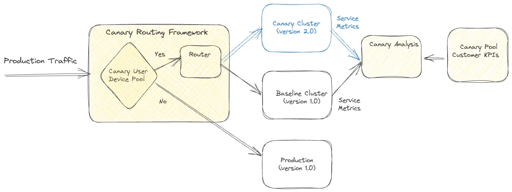

<head>
    
    
</head>

# Table of Contents

1.  [Algorithm](#orgdbf1af6)
2.  [Review](#org8309306)
    1.  [粘稠的金丝雀](#org25ea1c0)
    2.  [A/B 测试](#org6be54ee)
    3.  [调节流量](#org8b9ebb2)
3.  [Tips](#orgd3668ce)
4.  [Share](#orgebc7e09)

# Algorithm

Leetcode 2790: [Maximum Number of Groups With Increasing Length](https://leetcode.com/problems/maximum-number-of-groups-with-increasing-length/)

<https://dreamume.medium.com/leetcode-2790-maximum-number-of-groups-with-increasing-length-631235b9251e>

# Review

[Migrating Critical Traffic At Scale with No Downtime — Part 2](https://netflixtechblog.com/migrating-critical-traffic-at-scale-with-no-downtime-part-2-4b1c8c7155c1)

重放流量测试给了我们初始基础的验证，但当我们的迁移进程打开，我们遇到小心控制的迁移进程需求。一个进程不但最小化风险，也协助新产品或服务的持续服务的影响。本博客将探索在 Netflix 中平衡的技术来引入这些改变到产品

## 粘稠的金丝雀

金丝雀。一个高效的机制验证以可控和限制的方式改变到一个产品后端服务，但改变可能引起迁移未知结果的风险。这个过程包括创建两个新簇来升级服务；一个基线簇包含产品运行的当前版本和一个金丝雀簇包含服务的新版本。一个产品流量的小百分比重定向到两个新的簇，允许我们监控新版本的性能和与当前版本的比较。通过收集和分析关键性能度量和确定是否他们达到有效性，延迟和性能需求

一些产品特性需要一个请求在客户设备和一系列后端服务之间的生命周期来驱动该特性。例如，Netflix 视频播放功能包含服务的流的请求 URL，调用 CDN 来下载流，从一个单独的服务中请求一个许可来解密流，且发送信息表示成功开始播放到另一个服务。只跟踪测量更新中的服务，我们可能丢失更广端到端系统功能的源捕获

粘稠的金丝雀是处理传统金丝雀进程这个限制的一个改进。在这个变种中，金丝雀框架创建一个唯一客户设备的池然后对实验的持续期为这个池持续路由流量到金丝雀和基线簇。除了测量服务层的测度，金丝雀框架也可以跨金丝雀池保持跟踪更广系统操作和客户测量且因此监测整个请求周期流的倒退

重要的是，在粘稠的金丝雀中，金丝雀池中的设备在实验中持续被路由到金丝雀，潜在导致在客户设备上持续重试不想要的行为。因此，金丝雀框架被设计为监控操作和客户 KPI 度量来检测持续变化和必要时终止金丝雀实验

金丝雀和粘稠的金丝雀是系统迁移进程中有用的工具。跟回放测试相比，金丝雀允许我们越过服务层扩展验证范围。它们对功能跨请求生命周期启动更广的端到端系统功能验证，给我们迁移不会引起任何干扰到客户体验的信心。金丝雀也提供一个机会来在不同负载条件下度量系统性能，允许我们确定和解决任何性能瓶颈。它们使得我们进一步调优和配置系统，确保新的变化光滑无缝地集成

## A/B 测试

A/B 测试是一个广泛被认知的方法来通过可控的实验检验假设。它包含分割数据的一部分到两个或多个组，每个接收不同的处理。结果使用特别的度量来评估决定是否假设是有效的。工业中频繁使用这个技术来评价假设相关产品的演绎和用户交互。它也广泛使用在 Netflix 来测试对产品行为和用户体验的改变

A/B 测试也是一个有效的工具来评估后端系统的重要改变。我们可决定 A/B 测试成员在设备应用程序或后端代码和选择性调用新代码路径和服务。在迁移时，A/B 测试使我们限制迁移系统的爆发，通过使更小部分百分比成员启动到新路径。因此控制新改变引起未知行为结果的风险。A/B 测试也是一个迁移的关键技术，当升级架构包含设备合同改变时

金丝雀实验也典型地导入小时到天的周期范围。然而，在某个实例中，迁移相关实验也需要扩展到周或者月份来获得更精确的在质量体验（QoE）度量中的影响的理解。另外，特殊业务关键性能指标（KPIs）的深度分析也需要更长的实验。例如，想象一个迁移场景我们加强播放质量，参与这个改进将导致更多客户使用播放按钮。跨一个可考虑的采样大小来评估相关度量是至关重要的，可获取一个可靠和自信的假设评估。A/B 框架作为一个高效工具协调这个信心构建进程的下一步

为了支持扩展持续时间，A/B 测试框架提供其他补充能力。这使得测试分配限制基于因素比如地理，设备平台和设备版本，也允许迁移度量分析跨相似的维度。这确保改变不会不成比例地影响特殊客户段。A/B 测试也提供适配性，通过实验允许调整分配大小

我们可不需要对每个后端迁移使用 A/B 测试。我们对迁移的改变期望明显影响设备 QoE 或业务 KPI 的才会使用。例如，如更早讨论的，如果计划的改变期望改进客户 QoE 度量，我们会通过 A/B 测试来测试假设

## 调节流量

在完成验证的各个阶段后，比如重放测试，粘稠的金丝雀和 A/B 测试，我们可自信计划的改变将不会显著影响 SLA，设备 QoE 或业务 KPIs。然而，它对首次发布的规范化来确保不出现干扰客户体验的任何不明显和不期望的问题非常重要。最后，我们实现流量调节作为迁移的最后一步对启动产品改变的风险

# Tips

# Share

[Mindshift: Break Through Obstacles to Learning and Discover Your Hidden Potential](https://www.coursera.org/learn/mindshift)

这个公开课设计用来帮助启发在当今快节奏学习环境中的职业和生活。无论年龄和阶段，给出了一些学习的指导建议

这个课程分 4 个大模块，主要内容如下：

-   作为慢的学习者的好处，学习环境的影响和选择
-   使用番茄计时法来学习或确定目标实现，当花时间综合你收集的信息时拖延是可以接受的，不要限制方式，可以用眼镜，听，手或隐喻来学习
-   讨论开启职业及发展和改变，适合职业的知识模型是 PI 模型，对别人反对你的新的学习时，三种处理办法：涉猎，领导双重生活或变成反对者，了解大脑中一些系统对我们的影响
-   一些有用的学习建议

