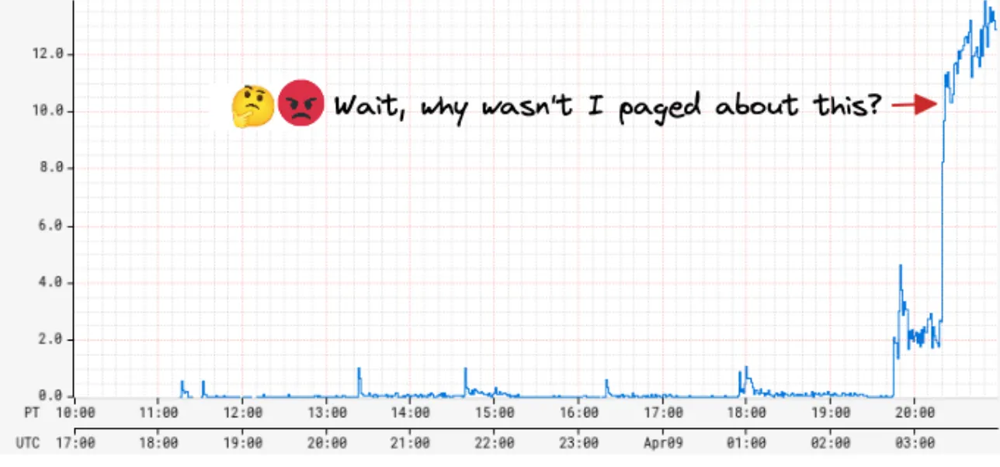
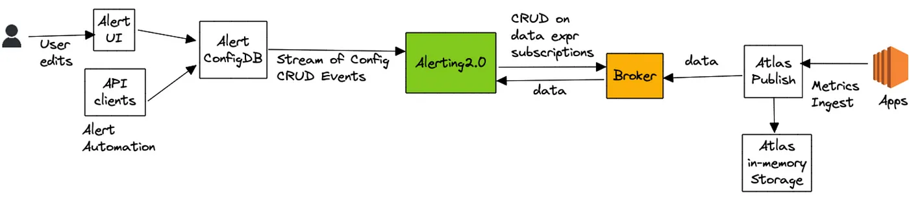
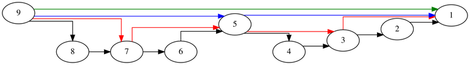
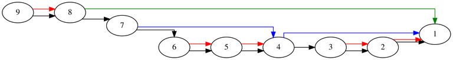

<head>
    
    
</head>

# Table of Contents

1.  [Algorithm](#org15243dd)
2.  [Review](#orgb723bee)
    1.  [高层架构](#org08e67cb)
3.  [Tips](#org2930963)
    1.  [经典问题](#orgb6a3ada)
    2.  [可以做得更好吗？](#org13a55ee)
    3.  [不牺牲执行时间？](#org343e7a9)
4.  [Share](#org1b15a5a)

# Algorithm

Leetcode 834: [Sum of Distances in Tree](https://leetcode.com/problems/sum-of-distances-in-tree)

<https://dreamume.medium.com/leetcode-834-sum-of-distances-in-tree-523031b6a689>

# Review

[Improved Alerting with Atlas Streaming Eval](https://netflixtechblog.com/improved-alerting-with-atlas-streaming-eval-e691c60dc61e)

-   流警告评估扩展比传统选时间序列数据库要好很多
-   它允许我们克服时间序列数据库的高维度/cardinality 限制
-   它支持更多激进的使用案例

工程师想要他们的警告系统为实时，可靠且可动作化。当动作能力是主观的且可基于用户案例改变，可靠性是不可协商的。即错误的正面是不好的但错误的负面绝对是最坏的

几年前，我们被我们的 SRE 团队呼叫由于我们的度量警告系统的严重应用程序警告延迟 45 分钟才到达！当我们调研警告延迟，我们发现配置警告的数量最近戏剧性地增加了 5 倍！警告系统查询 Atlas，我们的时间系列数据库为每个配置的警告查询一个任务，且看到评估瓶颈速度和过度的回退尝试。这样，增加了一个警告两次连续检查的时间，导致对所有警告的全局下降。我们进一步的调查，我们发现一个用户编程式地创建了数万个新的警告。这个用户代表了一个 Netflix 平台团队，且他们的目标是构建他们用户的警告自动处理

然而我们可以立即灭火通过禁止新的警告创建，这个事件引起了对我们警告系统扩展性的担忧。我们也从 Netflix 其他平台团队听到他们想要构建相似的对他们用户的自动工具，对某一时刻我们的状态，对其他人不会影响中位时间检测（MTTD）。我们看到了接下来 6 个月警告查询大幅增加的趋势

因为查询 Atlas 是瓶颈，我们首先的直觉是扩展它来满足增加的警告查询需求；然而，我们很快意识到增加 Atlas 的成本是不可接受的。Atlas 是一个内存时间系列数据库每天输入几十亿的时间系列且保留最近两周的数据。它是 Netflix 在尺寸和成本上最大的服务。当 Atlas 基于计算和存储分离架构，且我们理论上可扩展查询层来满足增长的查询需求，每个查询，无论它的类型，有一个数据组件需要推到存储层。为服务降低查询的增长数量，内存存储层也需要扩展，且这明显会导致高贵的存储成本更高得多。更进一步，通常的数据库优化比如缓存最近查询数据对警告查询有作用，最近接收到的数据点需要正确性。例如，这个警告查询检查是否错误作为总 RPS 的百分比超过一个 50% 阙值对最近 5 分钟内的 4 分钟：

    name, errors, :eq, :sum,
    name, rps, :eq, :sum,
    :div,
    100, :mul,
    50, :gt,
    5, :rolling-count, 4, :gt,

如果最近时间段接收到的数据点导致对这个查询的一个正估计，其依赖脏/缓存数据增加了 MTTD 或一个错误的负的探测结果，至少直到丢失的数据被获取和评估。对我们来说明显的是我们需要以一个基本不同的方式解决扩展问题。因此，我们开始通过实时流度量来降低警告评估的路径

## 高层架构

在高层，避免整个过程需要查询 Atlas 数据库且交易警告查询到流评估

警告查询通过我们的警告界面或通过 API 客户端提交，然后保存到一个自定义配置数据库支持流配置更新（全快照 + 更新通知）。警告服务接收到这些配置更新且哈希通过均衡 Edda Slots 评估其中一个节点的每个新的或更新的警告查询。节点负责评估一个查询，通过分解为一系列数据表达和订阅到一个上游代理服务。数据表达定义什么数据需要被追源来评估一个查询。对上面列出的查询例子，数据表达为 name,errors,:eq,:sum 和 name,rps,:eq,:sum。代理服务作为一个订购管理者映射一个数据表达到一系列订购。另外，它也维护一个所有活跃数据表达的查询索引，其咨询识别是否一个输入数据点对一个活跃订阅者有兴趣

接着，警告服务（通过 atlas-eval 库）映射接收到一个数据表达的数据点到需要它们的警告查询。对警告查询解决多个数据表达，我们在发射累积值到最终评估步骤之前对齐同一时刻这些数据表达的输入数据点。对上述例子，最终评估步骤负责计算比例和维护 rolling 统计，其记录过阙值比例的间隔数，如下表所示：

<table border="2" cellspacing="0" cellpadding="6" rules="groups" frame="hsides">

<colgroup>
<col  class="org-left" />

<col  class="org-right" />

<col  class="org-right" />

<col  class="org-right" />

<col  class="org-right" />

<col  class="org-right" />

<col  class="org-left" />
</colgroup>
<thead>
<tr>
<th scope="col" class="org-left">表达</th>
<th scope="col" class="org-right">t1</th>
<th scope="col" class="org-right">t2</th>
<th scope="col" class="org-right">t3</th>
<th scope="col" class="org-right">t4</th>
<th scope="col" class="org-right">t5</th>
<th scope="col" class="org-left">&#x2026;tN</th>
</tr>
</thead>

<tbody>
<tr>
<td class="org-left">name,errors,:eq,:sum,</td>
<td class="org-right">1</td>
<td class="org-right">3</td>
<td class="org-right">5</td>
<td class="org-right">4</td>
<td class="org-right">7</td>
<td class="org-left">&#xa0;</td>
</tr>

<tr>
<td class="org-left">name,rps,:eq,:sum,</td>
<td class="org-right">6</td>
<td class="org-right">7</td>
<td class="org-right">9</td>
<td class="org-right">6</td>
<td class="org-right">9</td>
<td class="org-left">&#xa0;</td>
</tr>

<tr>
<td class="org-left">rolling 统计（错误率）</td>
<td class="org-right">16%</td>
<td class="org-right">42%</td>
<td class="org-right">55%</td>
<td class="org-right">66%</td>
<td class="org-right">77%</td>
<td class="org-left">&#xa0;</td>
</tr>
</tbody>
</table>

atlas-eval 库支持流评估大多数而不是全部 Atlas 支持的查询，数据，数学和状态操作。一些操作比如 offset，integral，des 在流路径上不支持

# Tips

[Binary Lifting](https://codeforces.com/blog/entry/100826)

## 经典问题

Binary Lifting 最常见的应用例子如下：

设 G 为有 N 个节点的有根树。对形如 (K, V) 的查询 Q 我们想要找到节点 V 在树中的第 K 个祖先

一个简单的解决方案是对每个节点构建一个到其直接父节点的边。然后，遍历 K 条边来获得查询结果。这个方式时间复杂度为 O(NQ)。我们尝试通过添加一些跳边来改进它

一个跳边是从一个节点到一个任意祖先的边。这些跳边允许我们在一次操作中遍历更大的边范围。让我们开始构建每个点的跳边到它的第 2 个祖先，第 4 个祖先，第 8 个祖先等等。注意上图只是这些跳边的一个子集，因为完整的绘制会显得图片太凌乱

让我们定义一个跳边的长度为遍历正常边的个数。例如，上图所有蓝色边有长度 4。我们可递归计算这些跳边

更形式化的，我们记 f(h, i) 为 i 的第 2h 代祖先。可用如下递归公式：f(h, i) = f(h - 1, f(h - 1, i))。我们可分割 K 为 2 的指数，例如，设要寻找 9 的第 7 代祖先。因为 7 = 4 + 2 + 1，我们可遍历蓝边从 9 到 5，红边从 5 到 3 和黑边从 3 到 2

这种方式时间复杂度为 O((N + Q)lgN)，空间复杂度为 O(Nlg2N)

## 可以做得更好吗？

在这个特殊例子中，我们可采用脱机方式查询（我们读取所有查询并一并解决它们）。我们将使用深度优先搜索且我们维护一个当前节点所有祖先的数组（包括它本身）。为维护这个祖先数组我们可简单操作如下：当从一个节点到它的儿子节点我们把儿子节点放入祖先数组的末尾且当从一个节点到它的父节点时从祖先数组末尾移除它。这样，当我们到达一个节点我们可以从访问祖先数组中获得答案。代码实现如下：

    const int nmax = 200000;
    vector<int> g[5 + nmax];
    vector<pair<int, int>> queries[5 + nmax];
    
    int solution[5 + nmax];
    vector<int> ancestors;
    
    void dfs(int node) {
      ancestors.push_back(node);
    
      for (int i = 0; i < g[node].size(); ++i)
        dfs(g[node][i]);
    
      for (int i = 0; i < queries[node].size(); ++i) {
        auto& [acc, id] = queries[node][i];
        if (acc < ancestors.size())
          solution[id] = ancestors[ancestors.size() - acc - 1];
        else
          solution[id] = -1;
      }
      ancestors.pop_back();
    }
    
    int main() {
      int n, q;
      cin >> n >> q;
      for (int i = 2; i <= n; ++i) {
        int x;
        cin >> x;
        g[x].push_back(i);
      }
      for (int i = 1; i <= q; ++i) {
        int x, k;
        cin >> x >> k;
        queries[x].push_back({k, i});
      }
      dfs(1);
    
      for (int i = 1; i <= q; ++i)
        cout << solution[i] << endl;
    
      return 0;
    }

然而，如果我们得先回答一个查询然后才能是下一个查询时怎么办？不幸地是，这种情况下我们不能改进时间复杂度 O((N + Q)lgN)，然而我们可缩减内存的使用

一个方法是用时间换空间且改变跳边的长度的基。我们可重计算跳边长度为 D 的指数，D > 2

## 不牺牲执行时间？

我们可缩减内存到 O(N) 而不影响执行时间。我们可计算每个节点它的父节点且一个单跳边到任意祖先。当搜索第 K 个祖先我们尝试遍历跳边如果它没有超过第 K 个祖先。选择这些跳边的目标的一个方法是观察如下图：

记 x 的父为 $ parent_ {x} $。我们将添加跳边 $ x \\to y $ 只在 $ parent_ {x} \\to z $ 和 $ z \\to y $ 存在且对任意 z 有相同的长度。容易看到我们可通过从顶向下在树中以 O(N) 的时间复杂度计算所有这样的跳边

通过使用这些边我们可在对数时间复杂度下到达第 K 个祖先，但这是不容易看出的。这个的证明非常长且使用 skew-binary 数系统。在论文 [An appicative random access stack](https://publications.mpi-cbg.de/Myers_1983_6328.pdf) 中边界为 $ 3 \\lfloor \\lg{(N+1)} \\rfloor - 2 $

源代码实现如下：

    const int nmax = 200000;
    int parent[1 + nmax];
    int far[1 + nmax];
    int level[1 + nmax];
    
    int main() {
      int n, q;
      cin >> n >> q;
      for (int i = 2; i <= n; ++i)
        cin >> parent[i];
    
      level[1] = 1;
      for (int i = 2; i <= n; ++i) {
        level[i] = level[parent[i]] + 1;
        int father = parent[i];
        int father2 = far[father];
        if (far[father2] != 0 && 
            level[father] - level[father2] == level[father2] - level[far[father2]])
          far[i] = far[father2];
        else
          far[i] = father;
      }
    
      for (int i = 1; i <= q; ++i) {
        int node, k;
        cin >> node >> k;
        while (k > 0 && node > 0) {
          if (level[node] - k <= level[far[node]]) {
            k -= level[node] - level[far[node]];
            node = far[node];
          } else {
            --k;
            node = parent[node];
          }
        }
        if (node == 0) cout << -1 << endl;
        else cout << node << endl;
      }
    
      return 0;
    }

另一种方法是选择 $ \\frac{N}{\\log{N}} $ 个任意节点且创建一个虚拟树其 x 和 y 的边表示 x 是 y 的祖先且它们之间没有其他选中的节点在路径上。我们可在虚拟树上使用 $ O(\\frac{N}{\\log{N}} * \\log{N}) = O(N) $ 的内存计算跳边。为回答一个查询我们发现我们最接近的祖先是这个虚拟树的一部分且在虚拟树上找（这个祖先期望为距离在 $ \\log{N} $ 的边因为我们随机选择的虚拟树节点）。我们可使用虚拟树跳边来尽可能接近第 K 个祖先。在没有跳边可使用后，我们可使用原始树的边，因为我们的目标期望在大约 $ \\log{N} $ 距离的边

感谢 FairyWinx 提议的这个想法且我非常高兴看到一个确定性方法来达到 O(N) 的内存。下面是代码实现：

    const int nmax = 200000;
    const int lgmax = 20;
    vector<int> g[5 + nmax];
    
    // These are for the real tree
    int parent[5 + nmax];
    int level[5 + nmax];
    int id[5 + nmax];
    
    // There are for the virtual tree
    int revid[5 + nmax / lgmax];
    int level2[5 + nmax / lgmax];
    int far[1 + lgmax][5 + nmax / lgmax];
    
    void dfs(int node, int curParent) {
      if (id[node] > 0) {
        far[0][id[node]] = curParent;
        curParent = id[node];
      }
    
      for (int i = 0; i < g[node].size(); ++i) {
        int to = g[node][i];
        level[to] = level[node] + 1;
        dfs(to, curParent);
      }
    }
    
    int main() {
      mt19937 rng(steady_clock::now().time_since_epoch().count());
      int n, q;
      cin >> n >> q;
      for (int i = 2; i <= n; ++i) {
        cin >> parent[i];
        g[parent[i]].push_back(i);
      }
    
      for (itn i = 1; i <= n / lgmax; ++i) id[i] = i;
      shuffle(id + 1, id + n + 1, rng);
    
      level[1] = 1;
      dfs(1, 0);
    
      for (int i = 1; i <= n; ++i) {
        if (id[i] > 0) {
          revid[id[i]] = i;
          level2[id[i]] = level[i];
        }
      }
    
      for (int h = 1; h <= lgmax; ++h) {
        for (int i = 1; i <= n / lgmax;++i)
          far[h][i] = far[h - 1][far[h - 1][i]];
      }
    
      for (int i = 1; i <= q; ++i) {
        int node, k;
        cin >> node >> k;
        if (level[node] <= k) {
          cout << -1 << endl;
        } else {
          while (k > 0 && id[node] == 0) {
            node = parent[node];
            --k;
          }
    
          if (k > 0) {
            node = id[node];
            for (int i = lgmax; i >= 0; --i) {
              if (level2[node] - level2[far[i][node]] <= k) {
                k -= level2[node] - level2[far[i][node]];
                node = far[i][node];
              }
              node = revid[node];
            }
          }
          while (k > 0) {
            node = parent[node];
            --k;
          }
          cout << node << endl;
        }
      }
    
      return 0;
    }

# Share

