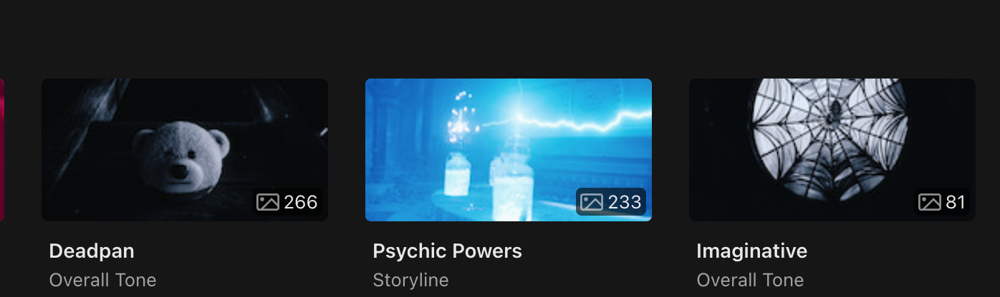
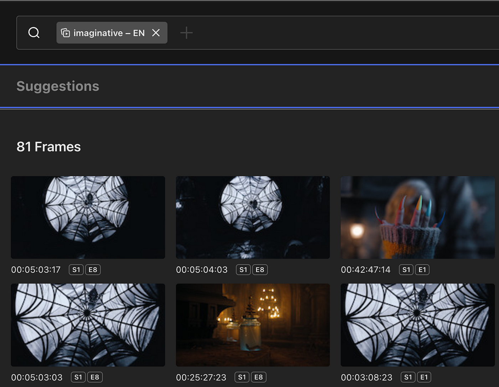
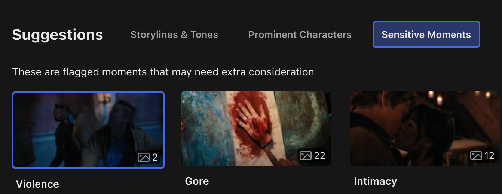
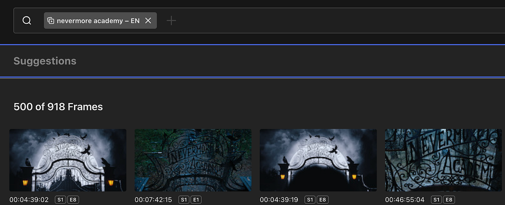
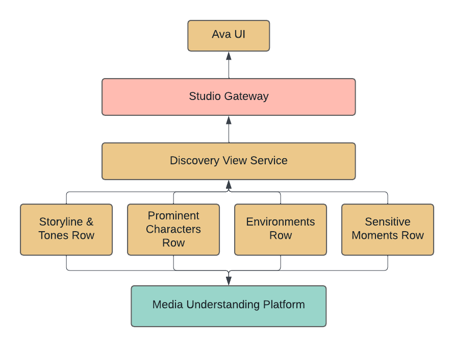
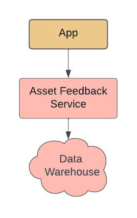

<head>
    
    
</head>

# Table of Contents

1.  [Algorithm](#orge69a4a1)
2.  [Review](#org417ca1a)
    1.  [梗概](#orgd04e5c5)
    2.  [AVA Discovery View 介绍](#org7876b41)
    3.  [AVA Discovery View 例子](#orgad27b98)
        1.  [故事情节](#org3a30f98)
        2.  [重要的特征](#orgcd41c13)
        3.  [敏感](#org56de92c)
        4.  [环境](#org57b08c8)
    4.  [挑战](#org1f9efeb)
        1.  [算法质量](#org0a5b332)
        2.  [建议排位](#orgfa1aa33)
        3.  [算法反馈](#org61ceceb)
        4.  [跨多个算法的交叉查询](#org3d29d5b)
    5.  [技术架构](#org2bf5252)
        1.  [Discover View 插件架构](#orgfae1fed)
        2.  [Discovery 统一接口](#org8b58cd9)
        3.  [资产反馈微服务](#org25cbb79)
3.  [Tips](#orgb11e246)
4.  [Share](#orgb7af47d)

# Algorithm

Leetcode 835: [Image Overlap](https://leetcode.com/problems/image-overlap)

<https://dreamume.medium.com/leetcode-835-image-overlap-1091d20617ee>

# Review

[AVA Discovery View: Surfacing Authentic Moments](https://netflixtechblog.com/ava-discovery-view-surfacing-authentic-moments-b8cd145491cc)

## 梗概

在 Netflix，我们创建了数百万个插图来表现我们的标题。每个插图阐述了它想表达的一个故事。从我们的广告资产测试中，我们知道哪些资产有高的表现哪些没有。这样，我们的团队发展了一种对哪些类型标题有好的视觉和主题插图特征的直觉。一些广告插图在某些地区对某种类型反响强烈，或对特定的粉丝。这些因素的复杂性使得对即将出版的标题难以给出最好的策略

我们的资产通常通过直接从我们的源视频中选择静态图像。为改进它，我们决定投资创建一个媒体理解平台，在我们的创新工具从媒体中提取有意义的洞察。在本文中，我们将深入探讨这些工具之一，AVA Discovery View

## AVA Discovery View 介绍

AVA 市一个内部工具从视频内容中获取静态图像。工具提供了一个创新的有效方式（图片编辑，插图设计等）来从视频内容推出验证呈现标题的叙述主题，主要特征和可视化特征的时刻。这些静态时刻被多个 Netflix 团队用来作为插图（在 Netflix 平台或其他），发布，市场，社交团队等

静态图像用来作为商品、发布验证标题，提供一系列入口点来记住观看的不同原因。例如，对标题“星期三“，一个用户观看原因是他们喜爱神秘事物，另一用户个是喜爱成年故事或哥特审美。另一个用户是喜欢天才。工具的任务是从这些观点中选择图像。静态图像可通过加强和组合来创造更符合的插图。对许多团队和标题，静态图像是必要的 Netflix 广告资产策略

观看所有内容来找到最好的图像和手动选择会耗费太多时间，且这个方法通常是不能扩展的。当图像可从视频内容中手动保存，AVA 提供获取验证图像的功能 - 它建议最好的创造时刻：进入 AVA Discovery View

## AVA Discovery View 例子

AVA 图像收割算法预选择和分组相关帧为目录如故事情节，主要特征和环境

让我们进一步深入一个标题的不同面如何显示 Netflix 的最大点 - “星期三”

### 故事情节

“星期三”标题包含一个用超自然能力侦探解决秘密的特征。标题有一个昏暗富有想象的带智慧和幽默的阴影语调。设定是一个特别的高校，注册的都是有超自然能力的年轻人。主要是关于一个年轻人和她与父母的关系问题

以上段落提供了一个标题的简介。从这个信息中找到验证时刻来构建插图设计基础是不平凡的且需要长时间的创造力

这是 AVA Discovering View 出现和作为创造帮手的原因。使用标题的信息提供的故事情节，它找到关键时刻，不止提供一个好的可视化总结也提供标题主题和它的可视化的快速预览

点击任意情节可看到最好的反映情节和标题论调的时刻。例如，如下图像阐述了它如何显示想象论调的时刻

### 重要的特征

天才是我们的标题主要的刻画，且我们的观众想要看到标题的特征来选择是否他们想要看那个标题。给定知道一个标题的主要特征且然后找到最好的时刻是一个艰难的任务

用 AVA Discovering View，所有标题的重要特征和它们最好的时刻会呈现出来。可看到一个特征怎么在标题中和找到包含多个特征和最好的静态图像来代表它们

### 敏感

我们不想要 Netflix 主屏幕使观众受惊吓或冒犯，所以我们致力于避免插图带有暴力，裸体，受伤或相似属性

为帮助我们的创造工具理解内容敏感，AVA Discovering View 列出包含受伤，暴力，亲密，裸体，吸烟等内容时刻

### 环境

设定和电影位置通常提供类别线索和形成喜爱插图基本。从一个主题可见设定或需要一个可视化扫描主体所有片段的实际电影定位来找到时刻。现在，AVA Discovering View 显示建议的时刻

例如，对标题“星期三”，工具呈现“永不再的学术“作为建议的环境

## 挑战

### 算法质量

AVA Discovering View 开始时包括几个不同的算法，在发布时，我们扩展支持了附加的算法。每个算法需要一个评估进程且在 AVA Discovering View 中调节得到结果

对可视化搜索

-   我们发现模型被图像中的文字影响。例如，静态文字通常会被拿出并推荐给用户。我们添加了一个步骤使得静态文字的结果会被过滤并不在搜索中呈现
-   我们也发现用户那些有一个使用自信阙值剪掉的结果

对最要特征

-   我们发现我们当前算法模型不能很好地处理动态面部。这样，我们通常对动态内容返回可怜的或没有建议

对敏感时刻

-   我们发现设定一个高自信度阙值是有帮助的。算法原始是发展为对血腥场面敏感，且当应用到烹饪和绘画场景时，通常会有错误的正反馈

一个挑战是我们统计是重复的建议。相同场景的多个建议能被返回且导致多个可视的相似时刻。用户更喜欢只看到最好的帧且一个各式各样的祯系列

-   我们添加一个排位步骤到一些算法中来标注帧太可视化相似于更高排位的帧。这些重复的帧会从建议列表中过滤掉
-   然而，不是所有算法有这个处理。我们探索使用场景边界算法来分组相似时刻作为单个建议

### 建议排位

AVA Discovering View 呈现多层的算法建议，且一个挑战是帮助用户从最好的建议中导航且避免选择坏的建议

-   建议目录基于我们用户的相关工作流呈现。我们显示故事线，重要特征，环境，然后是敏感
-   在每个建议目录，我们显示建议基于结果数和自信度阙值限制来排位

### 算法反馈

在我们运行 AVA Discovering View 的初始算法集之后，我们的团队面试了用户关于它的体验。我们也构建机制用工具获得直接或间接的用户反馈

直接反馈

-   对呈现给用户的每个算法建议，用户可点击一个赞成或反对来给出直接反馈

间接反馈

-   当一个算法建议被利用时（下载或发布用在 Netflix 广告上）我们跟踪启动检测
-   这个间接反馈更容易收集，虽然它不是对所有算法起作用。例如，敏感建议表示观看的内容不应该使用于广告。结果，这个在间接反馈中表现不好，因为我们不期望下载或发布这些建议的行为

这个反馈容易被我们的算法合作人访问且用于训练模型的改进版本

### 跨多个算法的交叉查询

几个媒介理解算法返回剪切或短视频建议。我们计算时间码使得一系列已知高质量帧作为最好的帧呈现

我们也依赖交叉查询来帮助用户缩短一个特定时刻的大集合系列帧。例如，从一个搜索查询中返回两个或多个重要特征或只过滤室内场景的静态图像

## 技术架构

### Discover View 插件架构

我们构建 Discovery View 为可插件化这样可以快速扩展支持更多算法和其他类型建议。Discovery View 通过 Studio Gateway 对 AVA UI 和其他前端应用程序做杠杆是有效的

### Discovery 统一接口

所有 Discovery View 行实现相同的接口，且它扩展简单且容易插件化到现存的 View

1.  可扩展目录

    在 Discovery View 特性中，我们基于算法结果动态隐藏目录或推荐。如果没有发现推荐则目录可被隐藏。另外，对大量建议，只提取顶部建议且用户有能力获取更多建议

2.  优雅地错误处理

    对用户体验来说我们独立加载 Discovery View 建议

### 资产反馈微服务

我们确定资产反馈在我们的生态系统中是一个有用的功能，所以我们觉得为它创造一个独立的微服务。该服务对静止图像质量获得反馈且给予到算法中。这个信息对个人和我们的算法合作者的聚集水平都有效

# Tips

[English for Career Development](https://www.coursera.org/learn/careerdevelopment/)

这是一个初级的讲面试的课程，可以对面试有个基本的了解，课程还有一个好处就是视频语速不快，很适合作听力练习，学起来轻松愉快

这个课程为 5 周的课时。每节小课比较简短，几分钟时间即可看完一节

第一周主要介绍了找工作的一些基本概念，确定最适合自己的职业，关键技能，理解职位描述，使用互联网和社交媒体找工作

第二周主要内容为简历。介绍了简历各部分组成及怎么写

第三周主要讲求职信，介绍其格式、如何写及一些建议

第四周主要讲找工作的一些技巧，利用你的网络及如何与人交谈

第五周主要讲面试中的一些问题及注意事项

# Share

